# [第6章](ch06.md) 股票间波动率

*. . .the investor does (or should) consider expected return a desirable thing and variance of return an undesirable thing.

—Harry Markowitz, Journal of Finance, Vol. 7, No. 1, 1952

##  6.1 引言

配对交易（Pairs Trading）所利用的均值回归，是股票价格在彼此偏离后回归，或在异常收窄后再次偏离——即[第2章](ch02.md)所述的爆米花过程。股票价格的波动幅度用股票波动率（Volatility）来衡量和表示，即价格变动（收益）的标准差（Standard Deviation）。与价差回归方案相关的是股票间相对价格运动的波动率，因此称为*股票间波动率（Interstock Volatility）。图6.1(a)展示了两只相关股票ENL和RUK在1999年上半年的日收盘价（经拆股和分红调整）。价格序列彼此紧密跟踪，这在图6.1(b)所示的价差（Spread）序列中得到进一步印证。忽略刻度，价差序列看起来像任何股票价格序列，因此发现价差波动率与股票价格波动率在性质上相似也就不足为奇了。

**图6.1 (a) ENL和RUK的日调整收盘价；(b) 价差；(c) 波动率

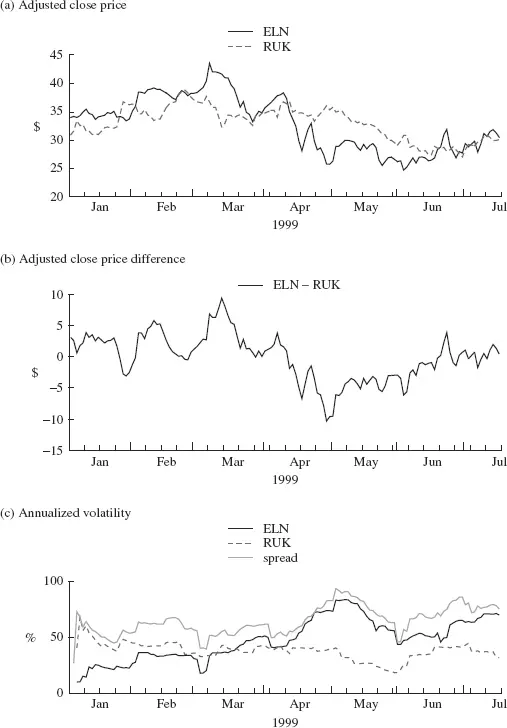

股票价格波动率是收益的标准差。但价差波动率的合适度量是什么？在[第2章](ch02.md)中，我们通过直接计算价差本身的标准差来校准交易规则。这里我们关注的是波动率的技术定义，而不仅仅是一个比例因子，这需要聚焦于适当的*收益序列（Return Series）。考虑图6.1(b)中的价差，其轨迹在零上下波动，显然不应将价差视为价格——这样的序列会轻易表现出无限的"收益"！从基础回归策略如何利用价差的角度出发，相关的度量就显而易见了：当价差扩大或收窄超过某个阈值，预期随后会发生回归时，就下两个赌注——一只股票买入，另一只卖出。因此，价差下注的收益等于买入股票的收益减去卖出股票的收益：

$$
*spread return = *return on buy − *return on sell
$$

（假设等额美元下注，以做多方向衡量收益）。因此，我们关心的值——衡量价差下注价值变化范围的量度或价差波动率——可以直接从价差收益序列计算得出，该序列本身就是买入和卖出收益的数值之差。（在这个细节层面，可以看到这些考量如何超越配对设定，推广到更一般的统计套利。）

图6.1(c)展示了两只股票ENL和RUK以及价差ENL–RUK的波动率轨迹，使用20天移动窗口。（本章所有示例中，波动率均基于局部零均值收益的常规假设计算。）正如预期的那样，价差波动率在视觉上与股票波动率相似。奇怪的是，它始终大于两只个股的波动率——这一点稍后再讨论。

另一个示例如图6.2所示，这次是通用汽车（General Motors, GM）和福特（Ford, F）的配对。注意价差的波动率有时大于两只股票的波动率，有时小于两者，有时大于其中一只但小于另一只。

**图6.2 (a) GM和F的日调整收盘价；(b) 价差；(c) 波动率

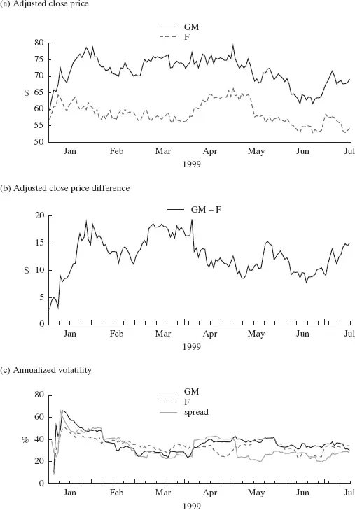

这两个示例揭示了价差波动率的许多特征，这些特征对于理解和利用价差关系至关重要——无论是如图所示的最简单配对，还是包括股票篮子在内的更一般情况。图6.3展示了另一个示例，这次是两只不相关的股票，微软（Microsoft, MSFT）和埃克森（EXXON, XON）。

**图6.3 (a) MSFT和XON的日调整收盘价；(b) 价差；(c) 波动率

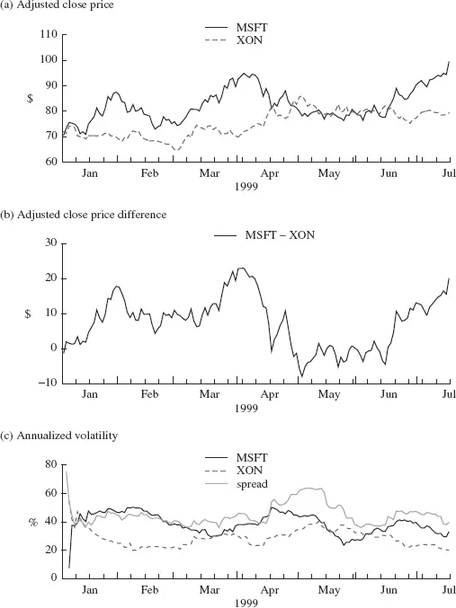

## 6.2 理论解释

相对价格运动在功能上依赖于个股的价格运动：还有什么比*A的价格减去*B的价格更简单的呢？但当考察相对价格的变异性时，关系就更复杂了。关键关系在于已经给出的价差收益：

$$
*spread return = *return on buy − *return on sell
$$

用*A表示买入收益，B表示卖出收益，*S表示价差收益，价差波动率可以表示为：

$$ <!-- validate-skip -->
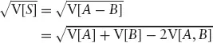
$$

其中V[·]表示（统计或概率）方差，V[·,·]同样表示协方差（Covariance）。这个表达式立即揭示了价差波动率为何可以小于、大于或等于任一成分股的波动率。关键因素是这两只股票（收益）的协方差V[*A, *B]。

如果A和B两只股票（刻意沿用此记法）实际上是同一只股票，那么方差（波动率的平方）是相同的，关键是协方差也等于方差。因此价差的波动率为零：既然价差本身恒为零，还能是什么呢？

现在，如果两只股票不相关呢？在统计学上，这等价于协方差为零。那么价差波动率简化为：

$$ <!-- validate-skip -->
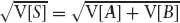
$$

即价差波动率大于两只个股的波动率。如果两只个股的波动率相近，V[*A] ≈ V[*B]，那么膨胀因子大约是40%：

$$ <!-- validate-skip -->
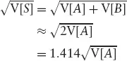
$$

### 6.2.1 理论与实践

图6.1中的示例显示两只*相关股票的价差波动率大于两只个股的波动率。上一节提出的理论指出：(1) 相同股票的价差波动率为零；(2) 不相关股票的价差波动率大于两只个股的波动率。嗯？"相关股票"（如ENL和RUK）显然更接近"相同股票"而非"不相关股票"。那么根据理论，ENL–RUK的价差波动率不应该是很小的吗？

现在我们必须区分术语的统计定义和英文解读。这两只Elsevier的股票——ENL和RUK——确实是相关的——本质上是同一家公司。价格序列的历史轨迹表现出极为相似的行为，正如人们所预期的那样。从长期来看，有理由认为价格是相同的。然而，在日线时间尺度上，价格轨迹很少精确平行移动；因此两者之间的价差确实会变化——见图6.1(b)——价差波动率不为零。事实上，在短期内，两只股票的价格序列表现出负相关关系：在图6.1(a)中，两条价格轨迹像卡通中缠绕的两条蛇一样蜿蜒前行，一个上升时另一个下降，反之亦然。从统计学角度看，这意味着两个序列呈负相关（Negative Correlation），特别是在与局部波动率计算相关的短期收益尺度上。

原来如此！负相关（因而负协方差）。将其代入价差波动率公式，立刻就能明白为什么Elsevier股票的价差波动率大于两只个股的波动率。配对交易的利润尽在掌握！

### 6.2.2 完善理论

回到价差波动率的表达式：

$$ <!-- validate-skip -->
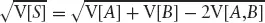
$$

令
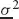
 = min(V[*A], V[*B])，
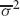
 = max(V[*A], V[*B])，那么对于不相关的股票（V[*A,*B] = 0），将价差波动率夹在个股波动率的倍数之间是轻而易举的：

$$ <!-- validate-skip -->
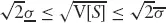
$$

两个直接的观察已经指出：对于波动率相近的两只股票，价差将表现出比个股高40%的波动率；对于完全*正相关的两只股票，价差没有波动率，因为它是恒定的。这就剩下一个相关性的极端情形：A和B完全*负相关，A = −B。此时价差波动率是个股波动率的两倍：

$$ <!-- validate-skip -->
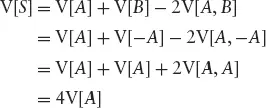
$$

因此，
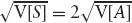
。对于统计套利来说，这几乎是价差关系的圣杯。

### 6.2.3 完善示例

借助波动率理论，我们能从GM–F和MSFT–XON的示例中推断出什么？根据对股票和价差波动率轨迹的描述，可以指出局部相关性从正变负的时期。当然，也可以通过直接计算来观察相关性：见图6.4。1999年上半年的平均相关性为0.58；最大20日相关性为0.86；最小20日相关性为−0.15。这里需要重点注意的是，对于价差利用而言，相关性的动态变化——以及随之而来的价差波动率和变化范围——至关重要。

**图6.4 GM–F滚动20日相关性（百分比0.05）

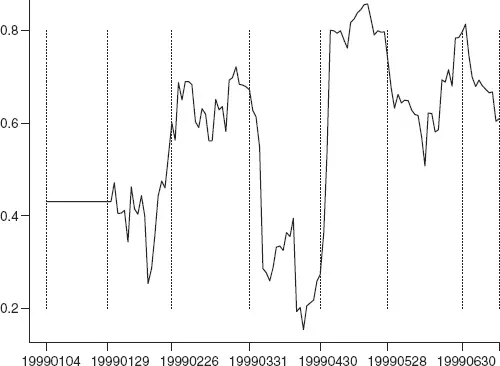

从4月下旬起，GM–F的价差波动率小于两只个股的波动率，3月大部分时间也是如此。事实上，从图6.2(b)的价差轨迹可以看出，在4月和5月的大部分时间以及6月再次出现时，价差与其在这些时期之外的值相比几乎恒定。图6.2(c)中的价差波动率轨迹显示4月有一次50%的跳升，5月有一次类似的下降。显然，这些是4月7日异常大的（负）单日价差收益（见图6.5）以及用于计算波动率估计值的20天窗口所造成的人工痕迹——回顾图6.4中的局部相关性。异常值降权和平滑是减少波动率等间接测量量中不切实际跳变的典型程序（见[第3章](ch03.md)）。图6.5展示了价差收益：GM的收益减去F的收益。

**图6.5 GM–F价差日收益

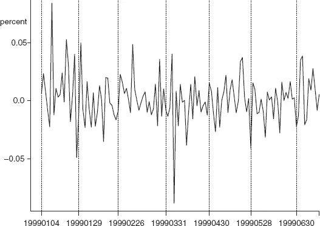

### 6.2.4 波动率测量入门

让我们先提出一个问题：统计套利是在波动率高时还是低时产生更高收益？

在没有个股特定事件的情况下，更高的股票间（价差）波动率应从一个*校准良好的模型中产生更高的收益。图6.6展示了1995年至2003年标普500指数成分股配对价差的平均局部波动率（20天移动窗口）。统计套利表现最出色的两年是2000年和2001年。这两年都是价差波动率创纪录的年份；2000年的价差波动率和统计套利收益都高于2001年——这很好地支持了*ceteris paribus（其他条件不变）的答案。但1999年是十年来统计套利收益最差的一年，而价差波动率同样很高。1999年有许多个股特定事件，主要与盈利相关，对收益产生了普遍的负面影响。这些事件如此显著、广泛且令人不安，以至于美国证券交易委员会最终通过了公平披露规则（Regulation Fair Disclosure, Reg. FD）来禁止此类活动。

**图6.6 价差的平均局部标准差

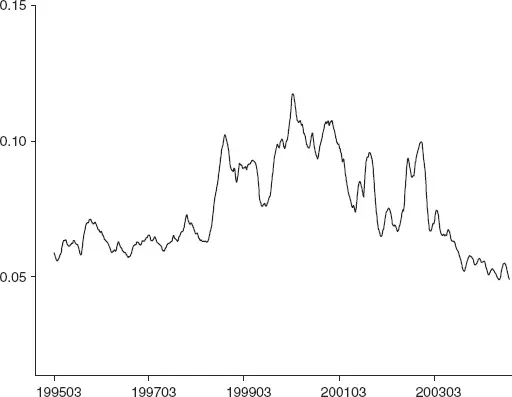

使用局部波动率估计，从代表性价差序列中能得到什么图景？利用样本局部波动率参考模式，我们能从图6.6的价差波动率图中推断出什么？

图6.7展示了两个样本价差序列的局部波动率（使用等权20点窗口）。上方面板(a)是价差序列，中间面板(b)是局部波动率估计。这里没有什么意外，该计算衡量的是上方面板中曲线关于常数线段的变异程度。值得注意的是，两个序列的局部波动率平均水平相似。

**图6.7 (a) 典型价差序列；(b) 价差序列的局部波动率估计（20点窗口，等权）；(c) 价差序列的局部波动率估计（60点窗口）

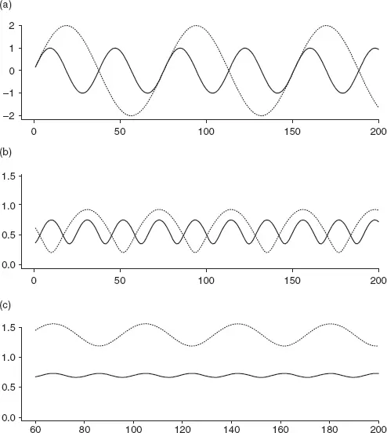

当使用不同的"局部"度量时会发生什么？下方板，图6.7(c)，展示了60点窗口的情况：现在的显著特征是较大振幅价差显示出更高的波动率水平。（虽然我们继续以价差来表述，但讨论同样适用于任何时间序列。）这里同样没有意外。60点窗口几乎捕捉了较大振幅序列的完整周期——如果恰好捕捉到完整周期，估计的波动率将是恒定的——因此局部波动率估计反映了序列的振幅。在前一种情况下，较短的窗口仅反映了较慢变化序列变异的一部分。哪种波动率估计反映了回归收益机会？这里的答案很简单。

现在考虑，如果检查一组此类序列的平均值——每个序列混合了自己的"噪声"，包括振幅和频率——会呈现什么图景。

谨慎地看，从图6.6能推断出什么？在尝试回答之前，典型示例的分析明确建议查看一系列窗口（或局部加权方案）下的局部波动率估计——确实建议关注*较短时间间隔的证据，并聚焦于局部波动率的平均水平；估计中的普通变异可能只不过是人为痕迹。*可能。

图6.8复制了图6.7中的两条示例价差曲线，并增加了第三条。新序列表现出与原始高振幅序列相同的振幅，以及与原始较高频率序列相同的频率。因此，它具有更频繁且更高价值的回归机会。中间面板(b)描绘的局部波动率估计表明，第三条序列的平均波动率是前两条的两倍，正如预期的那样。

**图6.8 (a) 典型价差序列；(b) 价差序列的局部波动率估计（20点窗口，等权）；(c) 价差序列的局部波动率估计（60点窗口）

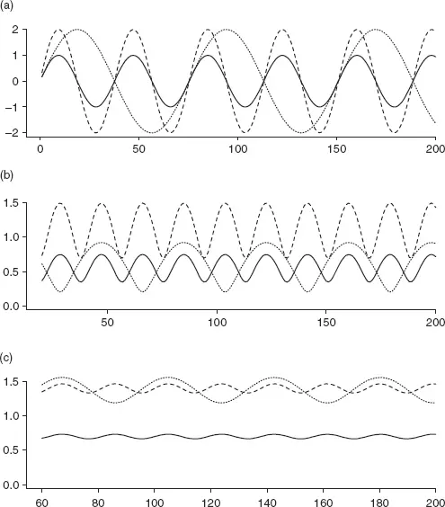

现在看下方板(c)，它展示了较长窗口的局部波动率估计。有趣吗？分析再次指出，当从价差波动率的平均水平推断回归机会时，使用更短、更局部的视角是更可取的。

借助这些典型模型，可以进行适当的时频分析，以精确量化回归运动的幅度。真实的价差序列则不那么理想，受非平稳性和"污染"噪声的困扰。

上述论述总体上是描述性的，刻画了序列变异如何反映在经验摘要统计量中，并指出了如何估计简单回归操作的潜在收益幅度。实际的回归利用策略必须直接分析，以便对其预期做出合理推断——无论是此处使用的无噪声正弦序列的理想化设定，还是应用于真实价差历史数据。

[第9章](ch09.md)将在统计套利表现自2002年以来下滑的背景下重新审视股票间波动率。
