# [第7章](ch07.md) 量化回归机会

Fortitudine vincimus *—By endurance we conquer.
*坚忍致胜——我们以忍耐征服一切。

—Sir E. H. Shackleton, polar explorer（极地探险家沙克尔顿家族格言）

## 7.1 引言

In this chapter, we extend the theoretical developments of the previous three chapters in the search for a deeper understanding of the properties of reversion in time series. There are more abstractions and more difficult mathematics here than elsewhere in the book, but in all cases, the theoretical development is subsequently grounded in application. Most of the discussion is framed in the language of price series, however, the developments generally apply to any time series. In particular, the analysis can readily be applied, sometimes with necessary revision of inference, to transformations of price series including returns, spreads, spread returns, factors, and so forth.
在本章中，我们扩展前三章的理论推导，旨在更深入地理解时间序列中回归（Reversion）的性质。本章的抽象程度和数学难度均高于书中其他部分，但在所有情况下，理论推导最终都落实到实际应用。大部分讨论以价格序列（Price Series）的语言展开，但所发展的理论通常适用于任何时间序列。具体而言，该分析可以直接应用于价格序列的各种变换，包括收益率（Returns）、价差（Spreads）、价差收益率（Spread Returns）、因子（Factors）等，必要时只需对推断进行相应修正。

The question "What is reversion?" is addressed in the context of assumed probability models for stock price generation. The models are highly stylized and oversimplified, being entertained purely as a device for considering notions of reversion. There is no conceit that the models serve even as first pass approximations to the true, unknown, price generation mechanism. By determining the implications of definitions of reversion under the very restrictive assumptions of these simple models, it is hoped that a coherent view of what reversion is will emerge. The goal is to extract from such a view meaningful and quantifiable notions of reversion that may be used in the study of realistic price generation models. It is hoped that such understanding will provide new insight into statistical arbitrage, helping us to analyze and understand how and why statistical arbitrage works at a systems or mechanistic level, and from that build a valid market rationale for the driving forces of the exploitable opportunities. That may be a little ambitious; perhaps it is reaching to hope for more than indications of what kinds of processes to think about for such a rationale. The mechanics and the rationale are both critical to investigating and solving the problems that beset statistical arbitrage starting in 2004 and which continue to affect performance today: How do market structural changes impact strategy performance?
"什么是回归？"这一问题在股票价格生成的概率模型（Probability Models）假设背景下加以探讨。这些模型高度程式化且过度简化，纯粹作为思考回归概念的工具而被引入。我们并不自欺地认为这些模型甚至可以作为对真实、未知的价格生成机制的一阶近似。通过在这些简单模型的严格假设下确定回归定义的含义，我们希望形成一个关于回归本质的连贯认识。目标是从这种认识中提取有意义且可量化的回归概念，用于研究现实的价格生成模型。我们期望这种理解能为统计套利（Statistical Arbitrage）提供新的洞见，帮助我们在系统或机制层面分析和理解统计套利如何以及为何有效，并由此为可利用机会的驱动力构建合理的市场理论基础。这一目标或许有些雄心勃勃——也许指望获得比"应该考虑何种类型的过程"更多的启示是不切实际的。机制和理论基础对于研究和解决自2004年以来困扰统计套利、并至今仍影响其表现的问题都至关重要：市场结构变化如何影响策略表现？

## 7.2 平稳随机过程中的回归

We begin the study with consideration of the simplest stochastic system, a stationary random process. Prices are supposed to be generated independently each day from the same probability distribution, that distribution being characterized by unchanging parameters. We shall assume a continuous distribution. Price on day *t will be denoted by *Pt, lowercase being reserved for particular values (such as a realized price).
我们从最简单的随机系统——平稳随机过程（Stationary Random Process）——开始研究。假设价格每天独立地从同一概率分布中生成，该分布的参数保持不变。我们假设这是一个连续分布。第 *t 天的价格记为 *Pt，小写字母用于表示特定值（如已实现的价格）。

Some considerations that immediately suggest themselves are:
一些立即可以想到的考虑是：

1. If *Pt* lies in the tail of the distribution, then it is likely that *P*t+1 will be closer to the center of the distribution than is *Pt*. In more formal terms: Suppose that *Pt* > ninety-fifth percentile of the distribution. Then the odds that *P*t+1 will be smaller than *Pt* are 95 : 5 (19 : 1). A similar statement is obtained for the lower tail, of course.
1. 如果 *Pt* 位于分布的尾部，则 *P*t+1 很可能比 *Pt* 更接近分布的中心。更正式的表述是：假设 *Pt* 大于分布的第95百分位数（Percentile），则 *P*t+1 小于 *Pt* 的几率为 95:5（即19:1）。对于下尾部（Lower Tail）同样有类似的结论。

The 19 : 1 odds do not express quite the same idea as is expressed in the first sentence. Being "closer to the center than" is not the same as being "smaller than." Certainly the odds ratio quoted, and by implication the underlying scenario, are very interesting. For completeness, it is useful to examine the "closer to the center" scenario. The obvious notion of closer to the center is formally: the magnitude of the deviation from the center on the price scale. An alternative notion is to consider distance from the center in terms of percentiles of the underlying distribution of prices. The two notions are equivalent for distributions with symmetric density functions, but not otherwise.
19:1 的几率与第一句话所表达的并不完全相同。"比……更接近中心"不同于"比……更小"。当然，所引用的几率比以及其隐含的情景是非常有趣的。为完整起见，有必要考察"更接近中心"的情景。"更接近中心"的直观定义在形式上是：价格尺度上偏离中心的绝对值。另一种定义是根据底层价格分布的百分位数来衡量与中心的距离。对于具有对称密度函数（Symmetric Density Functions）的分布，这两种定义是等价的，否则则不然。

2. If *Pt* is close to the center of the distribution, then it is likely that *P*t+1 will be further from the center than *Pt*.
2. 如果 *Pt* 接近分布的中心，则 *P*t+1 很可能比 *Pt* 更远离中心。

After a little reflection, (ii) seems to offer infertile ground for a reversion study; but in a sequential context, values close to the center are useful flags for subsequent departure from the center and, hence, of future reversionary opportunities. Recall the popcorn process of Chapter 2 and the discussion of stochastic resonance in Chapter 3.
稍加思考就会发现，第 (ii) 点似乎为回归研究提供了贫瘠的土壤；但在序列背景下，接近中心的数值是后续偏离中心以及未来回归机会的有用信号。回顾[第2章](ch02.md)的爆米花过程（Popcorn Process）和[第3章](ch03.md)关于随机共振（Stochastic Resonance）的讨论。

A generalization of the notion in (i) offers a potential starting point for the study: If *Pt* > *pth percentile of the distribution, then the odds that *P*t+1 < *Pt are *p : 100 − *p. Interest here is confined to those cases where the odds are better than even. Investors largely prefer strategies that exhibit more winning bets than losing bets, considering such relative frequency of outcomes a reflection of a stable process. The thought process is deficient because by itself the win–lose ratio imparts no information at all on the stability properties of a strategy other than the raw win–lose ratio itself. Essential information necessary for that judgment includes the description of the magnitudes of gains from winners and losses from losers. A strategy that loses 80 percent of the time but that never exhibits individual losses exceeding 0.1 percent and whose winners always gain 1 percent is a stable and profitable system. Judgments about easily labeled but complicated notions such as "stability" need careful specification of personal preferences. Often these are not made explicit and are therefore readily miscommunicated because individuals' preferences are quite variable.
对第 (i) 点的推广为研究提供了一个潜在的出发点：如果 *Pt* 大于分布的第 *p 百分位数，则 *P*t+1 < *Pt 的几率为 *p : (100 − *p)。我们仅关注几率大于对等（即50:50）的情况。投资者通常偏好表现为赢多输少的策略，认为这种结果的相对频率反映了过程的稳定性。但这种思维方式是有缺陷的，因为仅凭赢输比率本身并不能提供关于策略稳定性性质的任何信息——除了原始的赢输比率之外。做出此类判断所必需的关键信息包括对赢方收益幅度和输方损失幅度的描述。一个策略即使有80%的时间在亏损，但只要单次亏损从不超过0.1%且赢方总是获利1%，它就是一个稳定且盈利的系统。对于"稳定性"这类容易贴标签但内涵复杂的概念，需要仔细界定个人偏好。这些偏好通常未被明确表达，因此容易产生误解，因为个体之间的偏好差异相当大。

For *Pt* > median, the odds that *P*t+1 < *Pt are greater than one; similarly, for *Pt* < median, the odds that *P*t+1 > *Pt are also greater than one. The assumption of continuity is critical here, and a reasonable approximation for price series notwithstanding the discrete reality thereof. You may want to revisit Chapter 4 for a rehearsal of the difficulties discrete distributions can pose.
当 *Pt* 大于中位数（Median）时，*P*t+1 < *Pt 的几率大于1；类似地，当 *Pt* 小于中位数时，*P*t+1 > *Pt 的几率也大于1。连续性假设在此至关重要，尽管价格序列在现实中是离散的，但连续性仍是一个合理的近似。你可能需要回顾[第4章](ch04.md)，以重温离散分布可能带来的困难。

Two questions are immediately apparent:
两个问题立即显而易见：

1. Is the odds result exploitable in trading?
1. 这一几率结果能否在交易中加以利用？

- With artificial data following the assumed stationary process.
- 使用服从假设的平稳过程的人工数据。

- With stock data using locally defined moments (to approximate conditional stationarity).
- 使用股票数据，通过局部定义的矩（Moments）来近似条件平稳性（Conditional Stationarity）。

2. How should reversion be defined in this context?
2. 在此背景下应如何定义回归？

- Reversion *to the center requires modification of the foregoing odds to something like 75 percent → 50 percent and 25 percent → 50 percent.
- 向中心的回归（Reversion to the Center）要求将上述几率修改为类似75%→50%和25%→50%的形式。

- Reversion *in the direction of the center—so that overshoot is allowed and the odds exhibited are pertinent.
- 向中心方向的回归（Reversion in the Direction of the Center）——允许超调（Overshoot），所展示的几率是相关的。

Whichever of (1) or (2) is appropriate (which in the context of this chapter must be interpreted as "useful for the analysis and interpretation of reversion in price series"), how should reversion be characterized? As the proportion of cases exhibiting the required directional movement (a distribution free quantity)? As the expected (average) price movement in the qualifying reversionary cases (which requires integration over an assumed price distribution and is not distribution-free)?
无论第 (1) 种还是第 (2) 种定义更合适（在本章的语境下必须理解为"对价格序列中回归的分析和解释有用"），回归应如何表征？是表征为展现所需方向性运动的案例比例（一个分布无关量）？还是表征为符合条件的回归案例中的预期（平均）价格运动（这需要对假定的价格分布进行积分，不是分布无关的）？

Both aspects are important for a trading system. In a conventional trading strategy, betting on direction and magnitude of price movements, total profits are controlled by the expected amount of reversion. If the model is reasonable, the greater the expected price movement, the greater the expected profit. The volatility of profits in such a system is determined in part by the proportion of winning to losing moves. For the same unconditional price distributions, the higher the ratio of winners to losers, the lower the profit variance thus spreading profit over more winning bets and fewer losing bets. Stop loss rules and bet sizing significantly impact outcome characteristics of a strategy, making more general absolute statements unwise.
两个方面对交易系统都很重要。在传统的交易策略中，对价格运动的方向和幅度进行押注，总利润由预期的回归量控制。如果模型合理，预期价格运动越大，预期利润越高。此类系统中利润的波动性部分取决于赢亏运动的比例。对于相同的无条件价格分布，赢方与输方的比率越高，利润方差越低，从而将利润分散到更多赢方押注和更少输方押注上。止损规则（Stop Loss Rules）和仓位管理（Bet Sizing）对策略的结果特征有重大影响，因此做出过于笼统的绝对性陈述是不明智的。

It is worth noting the following observation. Suppose we pick only those trades that are profitable round trip. Daily profit variation will still, typically, be substantial. Experiments with real data using a popcorn process model show that the proportion of winning days can be as low as 52 percent for a strategy with 75 percent winning bets and a Sharpe ratio over 2.
值得指出以下观察。假设我们仅选择那些往返交易（Round Trip）获利的交易。每日利润的波动通常仍然很大。使用爆米花过程模型对真实数据的实验表明，即使一个策略有75%的赢方押注且夏普比率（Sharpe Ratio）超过2，盈利天数的比例也可能低至52%。

Reversion defined as any movement from today's price in the direction of the center of the price distribution includes overshoot cases. The scenario characterizes as reversionary movement a price greater than the median that moves to *any lower price—including to any price lower than the median, the so-called overshoot. Similarly, movement from a price below the median that moves to *any higher price is reversionary.
将回归定义为从今天的价格向价格分布中心方向的任何运动，包括超调的情况。在该情景下，大于中位数的价格向*任何更低价格的运动都被表征为回归运动——包括低于中位数的任何价格，即所谓的超调。类似地，从中位数以下的价格向*任何更高价格的运动也是回归运动。

### 7.2.1 回归运动的频率

For any price greater than the median price, *Pt* = *pt* > *m:
对于任何大于中位数价格 *m 的价格 *Pt* = *pt*：

$$ <!-- validate-skip -->
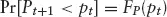
$$

where *F*P(·) denotes the distribution function of the probability distribution from which prices are assumed to be generated. (This result is a direct consequence of the independence assumption.) An overall measure of the occurrence of reversion in this situation is then:
其中 *F*P(·) 表示价格假设从中生成的概率分布的分布函数（Distribution Function）。（这一结果是独立性假设的直接推论。）此时回归发生的总体度量为：

$$ <!-- validate-skip -->
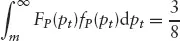
$$

where *f*p(·) is the density function of the price distribution. Therefore, also considering prices less than the median, *Pt* < *m, we might say that *reversion occurs 75 percent of the time. This is the result proved and discussed at length in Chapter 4.
其中 *f*p(·) 是价格分布的密度函数（Density Function）。因此，同时考虑小于中位数的价格 *Pt* < *m，我们可以说*回归在75%的时间内发生。这就是[第4章](ch04.md)中详细证明和讨论的结果。

Previously it was noted that the proportion of reversionary moves is a useful characterization of a price series. The 75 percent result states that underlying distributional form makes no difference to the proportion of reversionary moves. Therefore, low volatility stocks will exhibit the same proportion of opportunities for a system exploiting reversion as high volatility stocks. Furthermore, stocks that are more prone to comparatively large moves (outliers, in statistical parlance) will also exhibit the same proportion of reversionary opportunities as stocks that are not so prone. The practical significance of this result is that the proportion of reversionary moves is not a function of the distribution of the underlying randomness. Thus, when structure is added to the model for price generation, there are no complications arising from particular distribution assumptions. Moreover, when analyzing real price series, observed differences in the proportion of reversionary moves unambiguously indicate differences in temporal structure other than in the random component.
此前已经指出，回归运动的比例是价格序列的一个有用特征。75%这一结果表明，底层分布形式对回归运动的比例没有影响。因此，低波动率股票将表现出与高波动率股票相同比例的利用回归的机会。此外，更容易出现较大运动的股票（统计术语中称为异常值，Outliers）也将表现出与不易出现较大运动的股票相同比例的回归机会。这一结果的实际意义在于，回归运动的比例不是底层随机性分布的函数。因此，当在价格生成模型中加入结构性因素时，不会因特定的分布假设而产生复杂性。此外，在分析真实价格序列时，观察到的回归运动比例差异明确表明了时间结构（Temporal Structure）上的差异，而非随机成分上的差异。

### 7.2.2 回归量

Following the preceding discussion of how often reversion is exhibited, some possible measures of the size of expected reversion from a price greater than the median are:
继前文对回归发生频率的讨论之后，从大于中位数的价格出发的预期回归量的一些可能度量包括：

1. E[*P*t − *P*t+1|*Pt* > *P*t+1] Expected amount of reversion, given that reversion occurs.
1. E[*P*t − *P*t+1|*Pt* > *P*t+1]：给定回归发生的条件下，预期的回归量。

2. E[*Pt* − *P*t+1|*Pt* > *m] Average amount of reversion.
2. E[*Pt* − *P*t+1|*Pt* > *m]：平均回归量。

3. E[*Pt* − *P*t+1|*P*t > *P*t+1]Pr[*P*t+1 < *Pt*] Overall expected amount of reversion.
3. E[*Pt* − *P*t+1|*P*t > *P*t+1]Pr[*P*t+1 < *Pt*]：总体预期回归量。

Remarks: *Pt* > *m is an underlying condition. The difference between cases 1 and 2 is that case 2 includes the 25 percent of cases where *Pt* > *m but reversion does not occur, *P*t+1 > *Pt, while case 1 does not. Case 1 includes *only reversionary moves.
注：*Pt* > *m 是一个隐含条件。情形1和情形2的区别在于，情形2包含了25%的 *Pt* > *m 但回归未发生（即 *P*t+1 > *Pt*）的情况，而情形1则不包含。情形1*仅包含回归运动。

If case 1 is taken to define the total amount of "pure" reversion in the system, then case 2 may be considered as the "revealed" reversion in the system. With this terminology, it is possible to envisage a system in which the revealed reversion is zero or negative while the pure reversion is always positive (except in uninteresting, degenerate cases).
如果情形1被定义为系统中"纯"回归（Pure Reversion）的总量，则情形2可被视为系统中的"显现"回归（Revealed Reversion）。采用这一术语，可以设想这样一个系统：其中显现回归为零或负值，而纯回归始终为正（除了无趣的退化情况）。

Moves from a price less than the median are characterized analogously.
从中位数以下的价格出发的运动可以类似地进行表征。

#### 纯回归

Expected pure reversion is defined as:
预期纯回归定义为：

$$ <!-- validate-skip -->
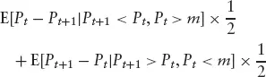
$$

The two pieces correspond to (a) downward moves from a price above the median and (b) upward moves from a price below the median. It is important to keep the two parts separate because the expected values of each are generally different; only for symmetric distributions are they equal. Consider the first term only. From Figure 7.1, the cases of interest define the conditional distribution represented by the shaded region. For any particular price *Pt* = *pt > *m, the expected amount of reversion is just *Pt* minus the expected value of the conditional distribution:
两部分分别对应于：(a) 从中位数以上的价格向下的运动；(b) 从中位数以下的价格向上的运动。将两部分分开很重要，因为它们的期望值通常不同；只有对于对称分布两者才相等。仅考虑第一项。从图7.1可知，所关注的案例定义了阴影区域所表示的条件分布。对于任何特定价格 *Pt* = *pt* > *m，预期回归量就是 *Pt* 减去条件分布的期望值：

**FIGURE 7.1 通用价格分布（Generic Price Distribution）

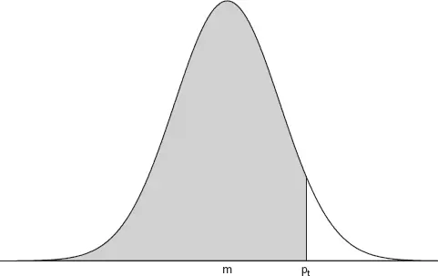

$$ <!-- validate-skip -->
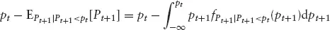
$$

The density of the conditional distribution of *P*t+1, given that *P*t+1 *< Pt*, is just the rescaled unconditional density (from the independence assumption), the scale factor being one minus the probability of the subset of the original domain excluded by the conditioning. Expected reversion is therefore:
给定 *P*t+1 < *Pt* 时 *P*t+1 的条件分布的密度，就是重新缩放的无条件密度（基于独立性假设），缩放因子为1减去由条件排除的原始域子集的概率。因此，预期回归为：

$$ <!-- validate-skip -->
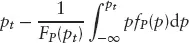
$$

Now we are interested in the expected value of this quantity averaged over all those possible values *Pt* = *pt* > m:
现在我们感兴趣的是该量对所有可能值 *Pt* = *pt* > *m 取平均后的期望值：

$$ <!-- validate-skip -->
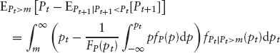
$$

Substituting for
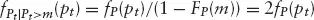
 then the overall expected amount of pure (one-day) reversion when *Pt* > *m is:
将

代入，则当 *Pt* > *m 时纯（单日）回归的总体预期量为：

$$ <!-- validate-skip -->
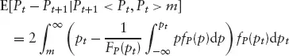
$$

A similar analysis for the second term in the original expectation yields:
对原始期望中第二项进行类似分析，可得：

$$ <!-- validate-skip -->
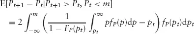
$$

Adding (one half times) these two results gives the expected pure reversion as:
将这两个结果（乘以二分之一）相加，得到预期纯回归为：

$$ <!-- validate-skip -->
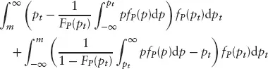
$$

Some simplification of this expression would be nice. Example 1, which follows, shows simplification possible for the normal distribution, the double integral here reducing to a single integral; however, even there, a closed form solution remains elusive. The symmetry is suggestive. Would the result simplify if the cut-off is taken as the mean rather than the median? Certainly an assumption of a symmetric density leads to cancellation of the two direct terms in *Pt*; in fact, the two parts of the sum are equal. Perhaps Fubini's rule, reversing the order of integration, can usefully be applied? We do know that the result is positive! A closed-form theoretical result remains unknown at this time, but computation of any specific example is straightforward (see the examples that follow).
对该表达式进行一些简化将是令人满意的。随后的例1展示了对于正态分布（Normal Distribution）可以实现的简化——此处的二重积分可以简化为单重积分；但即便如此，闭式解（Closed-form Solution）仍然难以获得。对称性暗示了一些可能性。如果将截断点取为均值而非中位数，结果是否会简化？对称密度函数的假设当然会导致 *Pt* 的两个直接项相消；事实上，求和的两部分是相等的。也许富比尼定理（Fubini's Rule），即交换积分顺序，可以有效地应用？我们确实知道结果为正！目前闭式理论结果仍然未知，但任何特定示例的计算都很直接（参见后续示例）。

#### 显现回归

Expected revealed reversion is defined as:
预期显现回归定义为：

$$ <!-- validate-skip -->
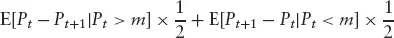
$$

Consider the first term of the expression:
考虑该表达式的第一项：

$$ <!-- validate-skip -->
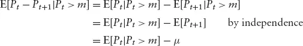
$$

where μ denotes the mean of the price distribution. Similarly, the second term of the expression reduces to *E[*P*t+1 − *Pt*|Pt* < *m] = μ − *E[*Pt*|*Pt* > *m]. It is worth noting that both terms have the same value, which follows from:
其中 μ 表示价格分布的均值。类似地，该表达式的第二项简化为 *E[*P*t+1 − *Pt*|*Pt* < *m] = μ − *E[*Pt*|*Pt* > *m]。值得注意的是，两项具有相同的值，这是因为：

$$ <!-- validate-skip -->
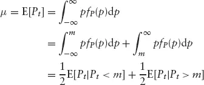
$$

whereupon:
由此可得：

$$ <!-- validate-skip -->
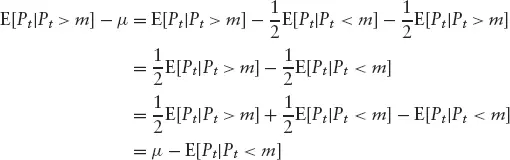
$$

Total expected revealed reversion may therefore be expressed equivalently as:
因此，总预期显现回归可以等价地表示为：

$$ <!-- validate-skip -->
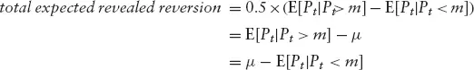
$$

which (for continuous distributions) is positive except in uninteresting, degenerate cases.
对于连续分布而言，该值为正，除非在无趣的退化情况下。

*Note 1: This result provides a lower bound for case 1 since the latter excludes those outcomes, included here, for which the actual reversion is negative, namely {*P*t+1 : *P*t+1 > *Pt*, Pt* > *m} and {*P*t+1 : *P*t+1 < *Pt*, Pt* < *m}.
*注1：该结果为情形1提供了一个下界，因为情形1排除了此处包含的那些实际回归为负的结果，即 {*P*t+1 : *P*t+1 > *Pt*, *Pt* > *m} 和 {*P*t+1 : *P*t+1 < *Pt*, *Pt* < *m}。

*Note 2: A desirable property for the reversion measure to have is invariance to location shift. The amount of reversion, in price units, should not change if every price is increased by $1. It is easy to see that the expression for expected revealed reversion is location invariant: Moving the distribution along the scale changes the mean and median in the same amount. For the pure reversion result, it is not very easy to see the invariance from the equation. However, consideration of Figure 7.1 fills that gap.
*注2：回归度量的一个理想性质是位置平移不变性（Invariance to Location Shift）。以价格单位衡量的回归量不应因每项价格增加1美元而改变。容易看出，预期显现回归的表达式具有位置不变性：沿尺度移动分布会使均值和中位数发生相同的变化。对于纯回归结果，从方程中不太容易看出不变性。然而，考察图7.1可以弥补这一不足。

#### 一些具体示例

Example 1
示例1

Prices are normally distributed. If *X is normally distributed with mean μ and variance σ^(2), then the conditional distribution of *X such that *X < μ is the half normal distribution. Total expected revealed reversion is 0.8σ. (The mean of the truncated normal distribution is given in Johnson and Kotz, Volume 1, p. 81; for the half normal distribution the result is
价格服从正态分布。如果 *X 服从均值为 μ、方差为 σ^(2) 的正态分布，则满足 *X < μ 的 *X 的条件分布是半正态分布（Half Normal Distribution）。总预期显现回归为 0.8σ。（截断正态分布（Truncated Normal Distribution）的均值见 Johnson and Kotz 第1卷第81页；对于半正态分布，结果为
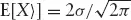
）因此，底层价格分布的离散度越大，预期显现回归越大——这一结果与直觉和期望完美契合。

From a random sample of size, 1,000 from the standard normal distribution, the sample value is 0.8, which is beguilingly close to the theoretical value. Figure 7.2 shows the sample distribution.
从标准正态分布中随机抽取1000个样本，样本值为0.8，与理论值非常接近。图7.2展示了样本分布。

**FIGURE 7.2 随机"价格"序列：(a) 样本分布，(b) 序列排序

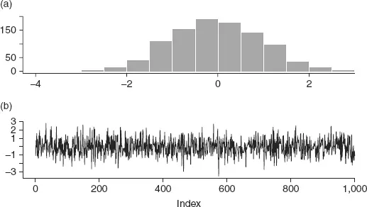

The pure reversion general result can be reduced somewhat for the normal distribution. First, as already remarked, the terms in *Pt* cancel because the density is symmetric, leaving:
对于正态分布，纯回归的一般结果可以在一定程度上简化。首先，如前所述，由于密度函数对称，*Pt* 的项相消，剩下：

$$ <!-- validate-skip -->
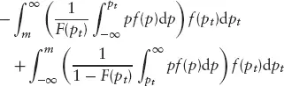
$$

(The subscript on *f and *F has been dropped since it is not necessary to distinguish different conditional and unconditional distributions here: Only the unconditional price distribution is used.) Johnson and Kotz give results for moments of truncated normal distributions. In particular, the expected values of singly truncated normals required here are:
（*f 和 *F 的下标已被省略，因为此处无需区分不同的条件和无条件分布：仅使用无条件价格分布。）Johnson and Kotz 给出了截断正态分布矩的结果。特别是此处所需的单侧截断正态分布的期望值为：

$$ <!-- validate-skip -->
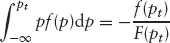
$$

and

$$ <!-- validate-skip -->
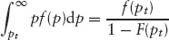
$$

Therefore, expected pure reversion is:
因此，预期纯回归为：

$$ <!-- validate-skip -->
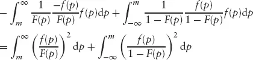
$$

For a symmetric density, inspection shows that the two terms in the sum are equal. Algebraically, noting that *f(*m − ε) = *f(*m + ε) and *F(*m − ε) = 1 − *F(*m + ε), then a simple change of variable, *q = *−p, gives the result immediately. The quantity (1 − *F(*x))/*f(*x) is known as Mills' ratio. Therefore, expected pure reversion for the normal independent identically distributed *(iid) model is twice the integral of the inverse squared Mills' ratio with integration over half the real line:
对于对称密度函数，观察可知求和中的两项相等。在代数上，注意到 *f(*m − ε) = *f(*m + ε) 且 *F(*m − ε) = 1 − *F(*m + ε)，通过简单的变量替换 *q = *−p 即可立即得到结果。量 (1 − *F(*x))/*f(*x) 被称为米尔斯比率（Mills' Ratio）。因此，对于正态独立同分布（IID）模型，预期纯回归是逆平方米尔斯比率在实数线一半上积分的两倍：

$$ <!-- validate-skip -->
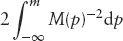
$$

Panel (b) of Figure 7.2 shows the random sample referred to at the beginning of the section as a time series. From this series: The number of downward moves from above the median, {*x*t : *xt* > 0 ∩ *x*t+1 < *x*t}, is 351; the number of upward moves from below the median, {*xt : *x*t < 0 ∩ *x*t+1 > *x*t}, is 388; the proportion of reversionary moves is 100 *** (351 + 388)/999 = 74% (the denominator is reduced by one because of the need to work with pairs (*x*t, *x*t+1) and, of course, there is no value to pair with *x1,000).
图7.2的面板(b)将本节开头提到的随机样本显示为时间序列。从该序列可得：从中位数以上向下的运动数 {*x*t : *xt* > 0 ∩ *x*t+1 < *x*t} 为351；从中位数以下向上的运动数 {*xt : *x*t < 0 ∩ *x*t+1 > *x*t} 为388；回归运动的比例为 100 × (351 + 388)/999 = 74%（分母减一是因为需要以 (*x*t, *x*t+1) 配对工作，当然 *x1,000 没有可配对的值）。

**Revealed reversion for this time series Figure 7.3 shows the distribution of one-day "price" differences for (a) moves from above the median, {*xt* − *x*t+1 : *xt* > 0}, and (b) moves from below the median, {*x*t+1 − *xt* : *xt* < 0}. Not surprisingly, for such a large sample the two look remarkably similar (in fact, the sums, or sample estimates of expected values, agree to four significant figures); the total of these moves is 794/999 = 0.795, which is very close to the theoretical expected value of 0.8. Some discrepancy is expected because treating the random sample as a time series imposes constraints on the components of the sets of pairs of values comprising the moves.
**该时间序列的显现回归 图7.3展示了单日"价格"差值的分布：(a) 来自中位数以上的运动 {*xt* − *x*t+1 : *xt* > 0}，(b) 来自中位数以下的运动 {*x*t+1 − *xt* : *xt* < 0}。不足为奇的是，对于如此大的样本，两者看起来非常相似（事实上，求和值或期望值的样本估计值在四位有效数字上一致）；这些运动的总计为 794/999 = 0.795，非常接近理论期望值0.8。存在一些偏差是预期之中的，因为将随机样本视为时间序列会对组成运动的值对集合的分量施加约束。

**FIGURE 7.3 随机"价格"序列：单日运动的分布

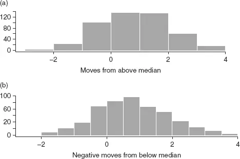

**Pure reversion for this time series Figure 7.4 shows the distribution of one-day "price" differences for (a) moves from above the median *in a downward direction only, {*xt* − *x*t+1 : *xt > 0 ∩ *xt* > *x*t+1}, and (b) moves from below the median *in an upward direction only, {*x*t+1 − *xt* : *xt* < 0 ∩ *xt* < *x*t+1}. These histograms are simply truncated versions of those in Figure 7.3, with 0 being the truncation point. Total pure reversion is 957/999 = 0.95.
**该时间序列的纯回归 图7.4展示了单日"价格"差值的分布：(a) 仅从中位数以上*向下的运动 {*xt* − *x*t+1 : *xt* > 0 ∩ *xt* > *x*t+1}，(b) 仅从中位数以下*向上的运动 {*x*t+1 − *xt* : *xt* < 0 ∩ *xt* < *x*t+1}。这些直方图就是图7.3中直方图的截断版本，0为截断点。总纯回归为 957/999 = 0.95。

**FIGURE 7.4 随机"价格"序列：单日运动的分布

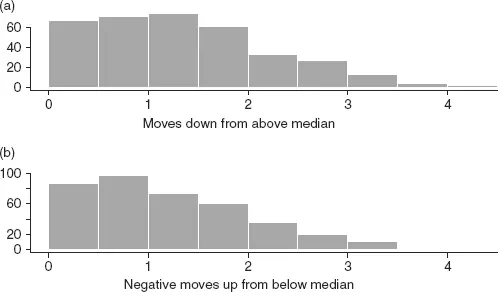

This example data is further discussed in Example 5.
该示例数据在示例5中进一步讨论。

Example 2
示例2

Prices are distributed according to the Student *t distribution on 5 degrees of freedom. A Monte Carlo experiment yielded the expected revealed reversion to be 0.95 (for the unit scale *t5* distribution). Notice that this value is larger than the corresponding value for the unit scale (standard) normal distribution (0.8). The increase is a consequence of the pinching of the *t density in the center and stretching in the tails in comparison with the normal: The heavier tails mean that more realizations occur at considerable
价格服从自由度为5的学生 *t 分布（Student *t Distribution）。蒙特卡洛实验（Monte Carlo Experiment）得出预期显现回归为0.95（对于单位尺度的 *t5* 分布）。注意该值大于单位尺度（标准）正态分布的对应值（0.8）。增加的原因是与正态分布相比，*t 分布的密度在中心被压缩、在尾部被拉伸：更厚的尾部意味着更多实现值出现在

distance from the center. Recall that the variance of the *t distribution is the scale multiplied by *dof/(dof − 2) where *dof denotes the degrees of freedom; the unit scale *t5* distribution has variance
距中心较远的位置。回顾 *t 分布的方差等于尺度乘以 *dof/(dof − 2)，其中 *dof 表示自由度；单位尺度 *t5* 分布的方差为
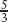
。因此，尺度为
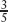
的 *t5* 分布具有单位方差，且在该样本中表现出的显现回归为 0.95 ×
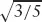
 = 0.74，*小于标准正态分布的值。

These comparisons may be more readily appreciated by looking at Figure 7.5.
通过图7.5可以更直观地理解这些比较。

**FIGURE 7.5 正态分布与学生 *t 分布的比较

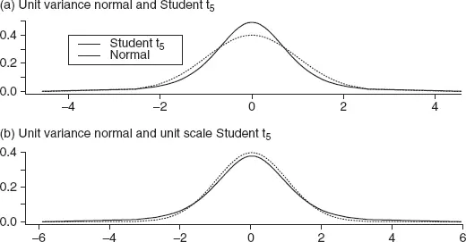

**Pure reversion See the remarks in Example 1.
**纯回归 参见示例1中的说明。

Example 3
示例3

Prices are distributed according to the Cauchy distribution. Since the moments of the Cauchy distribution are not defined, the measures of expected reversion are also not defined, so this is not a fruitful example in the present context. Imposing finite limits—the truncated Cauchy distribution—is an interesting intellectual exercise, one that is best pursued under the aegis of an investigation of the *t distribution, since the Cauchy is the *t on one degree of freedom.
价格服从柯西分布（Cauchy Distribution）。由于柯西分布的矩未定义，预期回归的度量也未定义，因此在当前语境下这不是一个有成效的示例。施加有限截断——截断柯西分布——是一个有趣的智力练习，最好在研究 *t 分布的框架下进行，因为柯西分布就是自由度为1的 *t 分布。

Example 4
示例4

An empirical experiment. Daily closing prices (adjusted for dividends and stock splits) for stock AA for the period 1987–1990 are shown in Figure 7.6. Obviously, the daily prices are not independent, nor could they reasonably be assumed to be drawn from the same distribution. These violations can be mitigated somewhat by locally adjusting the price series for location and spread. Even so, it is not expected that the 75 percent reversion result will be exhibited: Serial correlation structure in the data is not addressed for one thing. The point of interest is just how much reversion actually is exhibited according to the measures suggested. (An unfinished task is apportionment of the departure of empirical results from the theoretical results to the several assumption violations.)
一个实证实验。图7.6显示了股票AA在1987-1990年期间的每日收盘价（经股息和股票拆分调整）。显然，每日价格不是独立的，也不能合理地假设来自同一分布。通过对价格序列进行局部位置和离散度调整，可以在一定程度上缓解这些违背。即便如此，预计不会表现出75%的回归结果：原因之一是数据中的序列相关结构（Serial Correlation Structure）未被考虑。所关注的重点是根据所建议的度量实际表现出多少回归。（一项未完成的任务是将实证结果与理论结果的偏差归因于各种假设违背。）

**FIGURE 7.6 股票AA的每日收盘价（经股息和股票拆分调整）：(a) 实际值，(b) 经局部中位数和标准差标准化

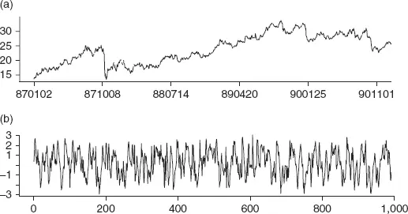

The daily price series is converted to a standardized series by subtracting a local estimate of location (mean or median) and dividing by a similarly local estimate of standard deviation. The local estimates are based on an exponentially weighted moving average of recent past data: In this way an operational online procedure is mimicked (see Chapter 3). Figure 7.6 shows the standardized price series using an effective window length of 10 business days; the location estimate is the median. Compare this with Figure 7.8, referred to later, which shows the price series adjusted for location only.
每日价格序列通过减去位置（均值或中位数）的局部估计值并除以同样局部的标准差估计值，转换为标准化序列。局部估计值基于近期数据的指数加权移动平均（Exponentially Weighted Moving Average）：这种方式模拟了一个可操作的在线流程（见[第3章](ch03.md)）。图7.6展示了使用有效窗口长度为10个工作日的标准化价格序列；位置估计值为中位数。将其与后文提及的图7.8进行比较，图7.8仅展示了经位置调整的价格序列。

For the location-adjusted series, *not standardized for variance, the proportion of reversionary moves is 58 percent, considerably less than the theoretical 75 percent. Note that 0 is used as the median of the adjusted series. By construction, the median should be close to zero; more significantly, the procedure retains an operational facility by this choice. A few more experiments, with alternative weighting schemes using effective window lengths up to 20 business days and using the local mean in place of the local median for location estimate, yield similar results: the proportion of reversionary moves being in the range 55 to 65 percent. The results clearly suggest that one or more of the theorem assumptions are not satisfied by the local location adjusted series.
对于经位置调整的序列（*未对方差进行标准化），回归运动的比例为58%，明显低于理论值75%。注意此处将0用作调整序列的中位数。按构造，中位数应接近零；更重要的是，通过这一选择保留了操作上的便利性。使用有效窗口长度最长为20个工作日的替代加权方案，以及用局部均值替代局部中位数作为位置估计值的更多实验，产生了类似的结果：回归运动的比例在55%至65%之间。结果清楚地表明，定理的一个或多个假设不满足局部位置调整序列。

Figure 7.7 shows the distribution of price changes (close–previous close) for those days predicted to be reverting downward and (previous close–close) for those days predicted to be reverting upward. The price changes are calculated from the raw price series (not median adjusted) since those are the prices that will determine the outcome of a betting strategy. Figure 7.7 therefore shows the distribution of raw profit and loss (P&L) from implementing a betting strategy based on stock price movement relative to local average price. Panel (a) shows the distribution of trade P&L for forecast downward reversions from a price above the local median, panel (b) shows the distribution of trade P&L for forecast upward reversions from a price below the local median. Clearly neither direction is, on average, profitable. In sum, the profit is $-31.95 on 962 trades of the $15–30 stock (there are 28 days on which the local median adjusted price is 0, and 2 × *k = 20 days are dropped from the beginning of the series for initialization of local median and standard deviation thereof).
图7.7展示了预测为向下回归的那些日期的价格变动（收盘价–前收盘价）分布，以及预测为向上回归的那些日期的价格变动（前收盘价–收盘价）分布。价格变动根据原始价格序列（未经中位数调整）计算，因为这些是决定押注策略结果的价格。因此，图7.7展示了基于股票价格相对于局部平均价格的运动来实施押注策略所产生的原始盈亏（P&L）分布。面板(a)显示了从中位数以上预测向下反转的交易盈亏分布，面板(b)显示了从中位数以下预测向上反转的交易盈亏分布。显然，平均而言两个方向都不盈利。总之，对这只股价在15-30美元之间的股票进行962笔交易的利润为-$31.95（有28天的局部中位数调整价格为0，且从序列开头剔除了2 × *k = 20天用于初始化局部中位数及其标准差）。

**FIGURE 7.7 股票AA围绕局部中位数的单日运动：(a) 来自中位数以上，(b) 来自中位数以下

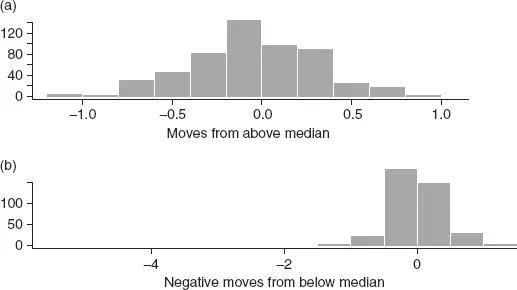

**FIGURE 7.8 股票AA局部中位数调整后的收盘价：(a) 时间序列，(b) 直方图

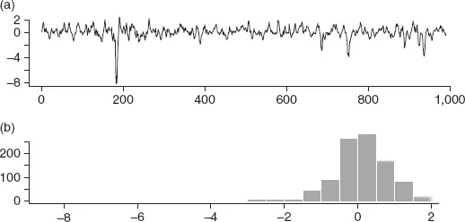

Figure 7.8 shows the distribution of price minus local median. Taking this as the distribution in Section 7.2 (with the median therein becoming zero), the total revealed reversion is $597.79/990 = $0.60 per day. The actual result reported in the preceding paragraph, $-31.95, shows the extent to which assumption violations (with unmodeled or poorly modeled structure) impact expected revealed reversion in this example.
图7.8展示了价格减去局部中位数的分布。将其视为第7.2节中的分布（其中的中位数变为零），总显现回归为 $597.79/990 = 每天$0.60。前文报告的实际结果 -$31.95，显示了在本例中假设违背（未建模或建模不佳的结构）对预期显现回归的影响程度。

This "missing structure" impact is perhaps more readily appreciated from a pure analysis of the median adjusted series. The revealed reversion from this series (in contrast to the already reported reversion from the raw price series given signals from the adjusted series) is $70.17. This means that less than one-eighth of the revealed reversion from the independent, identically distributed model is recoverable from the local location adjusted data series. (Outlier removal would be a pertinent exercise in a study of an actual trading system. In an operational context, the large outlier situations would be masked by risk control procedures.) Example 5 attempts to uncover how much reversion might be lost through local location adjustment.
这种"缺失结构"的影响或许从对中位数调整序列的纯分析中更容易理解。该序列的显现回归（与已经报告的基于调整序列信号的原始价格序列回归相对比）为$70.17。这意味着独立同分布模型的显现回归中不到八分之一可从局部位置调整数据序列中恢复。（异常值剔除在实际交易系统的研究中将是一个相关的练习。在操作背景下，大的异常值情况将被风险控制程序所掩盖。）示例5试图揭示通过局部位置调整可能损失多少回归。

Figure 7.9 shows the sample autocorrelation and partial autocorrelation estimates: Evidently there is strong 1- and 2-day serial correlation structure in the locally adjusted series. Undoubtedly that accounts for part (most?) of the deviation of actual revealed reversion from the theoretical expected value under the assumption of independence.
图7.9展示了样本自相关（Autocorrelation）和偏自相关（Partial Autocorrelation）估计值：显然，局部调整序列中存在强烈的1天和2天序列相关结构。毫无疑问，这解释了实际显现回归与独立性假设下的理论期望值之间偏差的一部分（大部分？）。

**FIGURE 7.9 股票AA：(a) 局部中位数调整后收盘价的自相关，(b) 偏自相关

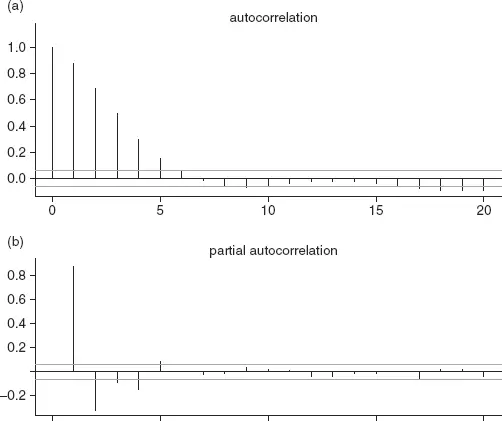

#### 纯回归

For the record, total pure reversion in the median adjusted price series (from the actual time series, since we do not yet have a closed-form result to apply to the price-move distributions, although we do know that it must exceed the sample estimate of the theoretical value of revealed reversion or $597.79) is $191.44 on 562 days. Pure reversion from the raw price series (using signals from the adjusted series) is just 60 percent of this at $117.74.
记录在案，中位数调整价格序列中的总纯回归（来自实际时间序列，因为我们尚未有闭式结果应用于价格运动分布，尽管我们确实知道它必须超过显现回归理论值的样本估计值 $597.79）为562天内的$191.44。原始价格序列的纯回归（使用调整序列的信号）仅为该值的60%，即$117.74。

Example 5
示例5

This is an extended analysis of the data used in Example 1. In Example 4, the operational procedure of local median adjustment was introduced as a pragmatic way of applying the 75 percent result to real, but nonstationary, data series. It is of interest to understand the implications of the operational procedure for a series that is actually stationary. Such knowledge will help determine the relative impact of empirical adjustment for location against other assumption violations such as serial correlation.
这是对示例1中所用数据的扩展分析。在示例4中，局部中位数调整的操作程序作为一种将75%结果应用于真实但非平稳（Nonstationary）数据序列的实用方法被引入。理解该操作程序对实际平稳序列的含义是有意义的。这些知识将有助于确定经验性位置调整相对于其他假设违背（如序列相关）的相对影响。

Figures 7.10 to 7.12 are local median adjusted versions of Figures 7.2 to 7.4. (The local median is calculated from a window of the preceding 10 data points.) The summary statistics, with values from the original analysis in Example 1 in parentheses, are: 77 percent (74 percent) of reversionary moves; total pure reversion = 900(952); total revealed reversion = 753(794).
图7.10至图7.12是图7.2至图7.4的局部中位数调整版本。（局部中位数根据前10个数据点的窗口计算。）汇总统计量（括号内为示例1中原始分析的值）为：回归运动比例77%（74%）；总纯回归 = 900（952）；总显现回归 = 753（794）。

**FIGURE 7.10 随机价格序列，图7.2的局部中位数类比：(a) 直方图，(b) 时间序列

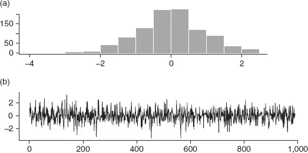

The analysis depicted in Figures 7.13 to 7.15 is perhaps more pertinent. The median adjusted series determines when a point is above or below the local median but, in contrast to the case reported in the preceding paragraph, the raw, unadjusted series is used to calculate the amount of reversion. This is the situation that would be obtained in practice. Signals may be generated by whatever model one chooses, but actual market prices determine the trading result. Interestingly, pure reversion increases to 906—but this value is still well below the unadjusted series result of 952. Revealed reversion decreases to 733.
图7.13至图7.15所描绘的分析可能更为切题。中位数调整序列确定某一点是否高于或低于局部中位数，但与前段报告的情况不同，使用原始未调整序列来计算回归量。这是实践中会遇到的情况。信号可以由所选的任何模型生成，但实际市场价格决定了交易结果。有趣的是，纯回归增加到906——但该值仍远低于未调整序列的结果952。显现回归减少到733。

**FIGURE 7.11 随机价格序列，图7.3的局部中位数类比：(a) 来自中位数和中位数以上的运动，(b) 来自中位数以下的运动

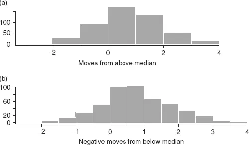

**FIGURE 7.12 随机价格序列，图7.4的局部中位数类比：(a) 来自中位数以上的运动，(b) 来自中位数以下的运动

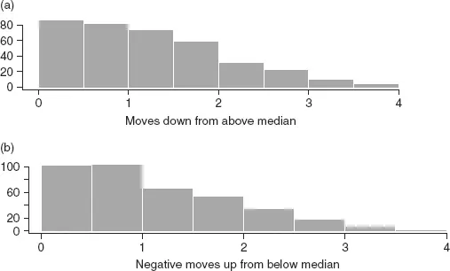

**FIGURE 7.13 随机价格序列，来自局部中位数调整序列的信号与原始序列的回归：(a) 直方图，(b) 时间序列

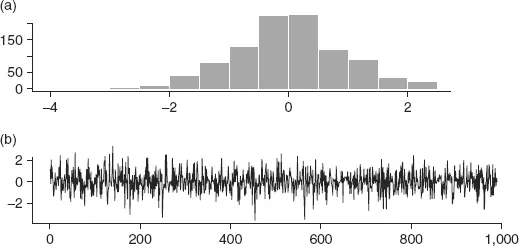

**FIGURE 7.14 随机价格序列，来自局部中位数调整序列的信号与原始序列的回归：(a) 来自中位数以上的运动，(b) 来自中位数以下的运动

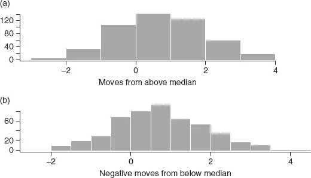

**FIGURE 7.15 随机价格序列，来自局部中位数调整序列的信号与原始序列的回归：(a) 来自中位数以上的运动，(b) 来自中位数以下的运动

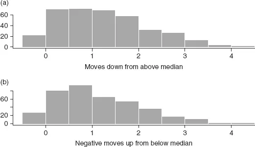

Figure 7.15 is interesting. Notice that there are *negative "moves down from above the median" which is logically impossible! This reflects the fact that the signals are calculated from the local median adjusted price series, but then moves for those signals are calculated from the raw, unadjusted series. The relatively few small magnitude, negative moves is expected. Curiously in this particular sample, despite the negative contributions to pure reversion, the total actually increases; that is the result of the more-than-offsetting changes in magnitude of the positive moves (in the raw series compared with the standardized series).
图7.15很有趣。注意存在*负值的"从中位数以上向下的运动"，这在逻辑上是不可能的！这反映了一个事实：信号是从局部中位数调整价格序列计算的，但这些信号对应的运动是从原始未调整序列计算的。少量小幅度的负值运动是预期之中的。奇怪的是，在这个特定样本中，尽管对纯回归有负贡献，总量实际上增加了；这是由于正向运动幅度的变化（原始序列与标准化序列相比）超过了抵消作用。

Example 6
示例6

Prices are distributed according to the lognormal distribution. If log *X is normally distributed with mean μ and variance *σ^(2)*, then *X has the lognormal distribution with mean μ*X = *exp(μ + 1/2σ^(2)), variance
价格服从对数正态分布（Lognormal Distribution）。如果 log *X 服从均值为 μ、方差为 *σ^(2)* 的正态分布，则 *X 服从对数正态分布，均值 μ*X = *exp(μ + 1/2σ^(2))，方差
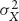
 = *exp(2μ + σ^(2))(*expσ^(2) − 1)，中位数为 exp(μ)。利用 Johnson and Kotz 第1卷第129页关于截断对数正态分布的结果，总预期显现回归为：

$$ <!-- validate-skip -->
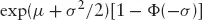
$$

where Φ(·) denotes the cumulative standard normal distribution function. Details are given in Appendix 7.1 at the end of this chapter. Figure 7.16 shows the histogram and time series representation of a random sample of 1,000 draws from the lognormal distribution with μ = 0 and σ = 1. (The median, 1, is subtracted to center the distribution on 0.) The sample value of expected revealed reversion is 1.08 (theoretical value is 1.126). Treating the sample as a time series in the manner of Example 5, the sample estimate of pure reversion is 1.346.
其中 Φ(·) 表示标准正态累积分布函数（Cumulative Standard Normal Distribution Function）。详细推导见本章末尾的附录7.1。图7.16展示了从 μ = 0、σ = 1 的对数正态分布中随机抽取1000个样本的直方图和时间序列表示。（减去中位数1使分布以0为中心。）预期显现回归的样本值为1.08（理论值为1.126）。按照示例5的方式将样本视为时间序列，纯回归的样本估计值为1.346。

**FIGURE 7.16 对数正态分布的随机样本（减去中位数）：(a) 直方图，(b) 时间序列

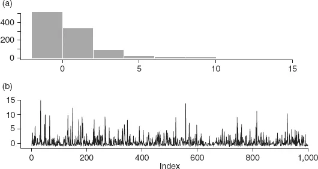

### 7.2.3 来自非中位数分位数的运动

The analysis thus far has concentrated on all moves conditional on today's price being above or below the median. Figure 7.17 shows that, for the normal and Student *t distributions, the median is the sensible focal point. For example, if we consider the subset of moves when price exceeds the sixtieth percentile (and, by symmetry here, does not exceed the fortieth percentile), the expected price change from today to tomorrow is less than the expected value when considering the larger subset of moves that is obtained when price exceeds the median.
迄今为止的分析集中于今天的价格高于或低于中位数的所有运动的条件。图7.17表明，对于正态分布和学生 *t 分布，中位数是合理的焦点。例如，如果我们考虑价格超过第60百分位数的运动子集（并且，由对称性，不超过第40百分位数），从今天到明天的预期价格变化小于考虑价格超过中位数时获得的更大运动子集的期望值。

**FIGURE 7.17 按价格分布的条件分位数划分的预期纯回归

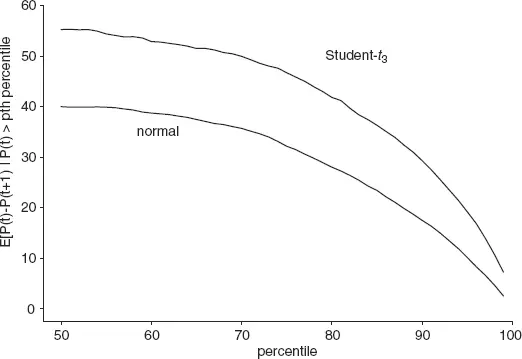

It is expected that this result will *not remain true when serially correlated series are examined. Trading strategies must also consider transaction costs, which are not included in the analysis here.
预计当考察序列相关序列时，这一结果将*不再成立。交易策略还必须考虑交易成本（Transaction Costs），而这未包含在本分析中。

## 7.3 非平稳过程：非均匀方差

The very stringent assumptions of the strictly stationary, independent, identically distributed *(iid) process examined in Section 7.2 are relaxed in this section. Here we generalize the measures of pure and revealed reversion to the inhomogeneous variance analog of the *iid process. See Chapter 4 for generalization of the "75 percent theorem."
本节放宽了第7.2节中考察的严格平稳、独立同分布（IID）过程的非常严格的假设。此处我们将纯回归和显现回归的度量推广到 *iid 过程的非均匀方差（Inhomogeneous Variance）类比。关于"75%定理"的推广，参见[第4章](ch04.md)。

Prices are supposed to be generated independently each day from a distribution in a given family of distributions. The family of distribution is fixed but the particular member from which price is generated on a given day is uncertain. Members of the family are distinguished only by the variance. Properties of the realized variance sequence now determine what can be said about the price series.
假设价格每天独立地从给定分布族中的某个分布生成。分布族是固定的，但在给定日期从中生成价格的具体成员是不确定的。分布族的成员仅以方差来区分。已实现方差序列的性质现在决定了关于价格序列可以得出什么结论。

### 7.3.1 序列结构化方差

Conditional on known, but different, variances, each day a normalized price series could be constructed, then the results of Section 7.2 would apply directly to that normalized series. Retrospectively, it is possible to compare a normalized price series with theoretical expectations (much as we did in Section 7.3 where normalization was not required); it is also possible to calculate actual pure and revealed reversion, of course. However, it is not clear that one can say anything prospectively and therefore construct a trading rule to exploit expected reversions.
在已知但不同的方差条件下，每天可以构建一个标准化的价格序列，然后第7.2节的结果将直接适用于该标准化序列。回顾性地，可以将标准化价格序列与理论期望进行比较（就像我们在第7.3节中所做的那样，只是那里不需要标准化）；当然也可以计算实际的纯回归和显现回归。然而，尚不清楚是否可以前瞻性地得出任何结论，从而构建交易规则来利用预期回归。

One possibility is to look at the range of variances exhibited and any systematic patterns in the day-to-day values. In the extreme case where it is possible to predict very well the variance tomorrow, a suitable modification of the 75 percent rule and calculation of pure and revealed reversion is possible. Such calculations would be useful providing that the same (or, in practice, very similar) circumstances (variance today versus variance tomorrow) occur often enough to apply expected values from probability distributions. This may be a realistic hope as variance clusters frequently characterize financial series: See Chapter 3 for modeling possibilities.
一种可能是考察所表现的方差范围以及日间值的任何系统性模式。在能够很好地预测明天方差的极端情况下，对75%规则进行适当修改以及计算纯回归和显现回归是可能的。只要相同（或在实践中非常相似）的情况（今天的方差与明天的方差）出现得足够频繁，从而能够应用概率分布的期望值，此类计算就是有用的。这可能是一个现实的期望，因为方差聚类（Variance Clustering）经常是金融序列的特征：建模可能性参见[第3章](ch03.md)。

As a particularly simple special case of perfect variance prediction, suppose that the only variance inhomogeneity in a price series is that variances on Fridays are always twice the value obtained for the rest of the week. In this case, there is no need to expend effort on discovering modified rules or expected reversion values: The 75 percent rule and calculations of expected pure and revealed reversion apply for the price series with Fridays omitted. Recall that we are still assuming independence day to day so that selective deletion from a price series history does not affect the validity of results. In practice, serial correlation precludes such a simple solution. Moreover, why give up Friday trading if, with a little work, a more general solution may be derived?
作为完美方差预测的一个特别简单的特殊情况，假设价格序列中唯一的方差非均匀性是周五的方差始终为一周其余时间的两倍。在这种情况下，无需费力去发现修正规则或预期回归值：75%规则以及预期纯回归和显现回归的计算适用于剔除周五的价格序列。回顾我们仍然假设日间独立性，因此从价格序列历史中选择性删除不影响结果的有效性。在实践中，序列相关排除了这种简单的解决方案。此外，如果稍加努力就能推导出更通用的解决方案，为什么要放弃周五的交易呢？

### 7.3.2 序列非结构化方差

This is the case analyzed in detail in Chapter 4, Section 3. For the normal-inverse Gamma example explored there (see [Figure 4.2) the expected reversion calculations yield the following. Actual revealed reversion is 206.81/999 = 0.21 per day; pure reversion is 260.00/999 = 0.26 per day. Notice that the ratio of pure to revealed, 0.26/0.21 = 1.24, is larger than for the normal example (Example 1) in Section 7.3, 0.94/0.8 = 1.18.
这是[第4章](ch04.md)第3节中详细分析的情况。对于那里探讨的正态-逆伽马（Normal-Inverse Gamma）示例（见图4.2），预期回归计算得出以下结果。实际显现回归为 206.81/999 = 每天0.21；纯回归为 260.00/999 = 每天0.26。注意纯回归与显现回归的比率 0.26/0.21 = 1.24，大于第7.3节中正态分布示例（示例1）的 0.94/0.8 = 1.18。

## 7.4 序列相关

In Section 7.3, the analysis of stock AA (Example 4) showed that the price series, actually the local median adjusted series, exhibited strong first-order autocorrelation, and weaker but still notable second-order autocorrelation. We commented that the presence of that serial correlation was probably largely responsible for the discrepancy between the theoretical results on expected reversion for *iid series (75 percent) and the actual amount calculated for the (median adjusted) series (58 percent). The theoretical result is extended for serial correlation in Section 4 of Chapter 4. We end the chapter here using the example from Chapter 4.
在第7.3节中，对股票AA的分析（示例4）表明，价格序列（实际上是局部中位数调整序列）表现出强烈的一阶自相关（First-order Autocorrelation），以及较弱但仍显著的二阶自相关（Second-order Autocorrelation）。我们指出，该序列相关的存在很可能主要是 *iid 序列的预期回归理论结果（75%）与（中位数调整）序列实际计算量（58%）之间差异的原因。理论结果在[第4章](ch04.md)第4节中针对序列相关进行了扩展。我们在此使用[第4章](ch04.md)的示例结束本章。

Example 7
示例7

One thousand terms were generated from a first-order autoregressive model with serial correlation parameter *r = 0.71 and normally distributed random terms (see Example 1 in Chapter 4). [Figure 4.4 shows the time plot and the sample marginal distribution. The proportion of reversionary moves exhibited by the series is 62 percent; total revealed reversion is 315 and total pure reversion is 601. Ignoring serial correlation and using the sample marginal distribution to calculate the result in Section 7.2.2, the theoretical revealed reversion is 592—almost double the actual value. Figure 7.18 illustrates aspects of the analysis.
从序列相关参数 *r = 0.71 的一阶自回归模型（First-order Autoregressive Model）中生成了一千个项，随机项服从正态分布（见[第4章](ch04.md)示例1）。图4.4展示了时间图和样本边缘分布。该序列表现出的回归运动比例为62%；总显现回归为315，总纯回归为601。忽略序列相关并使用样本边缘分布计算第7.2.2节中的结果，理论显现回归为592——几乎是实际值的两倍。图7.18展示了分析的各个方面。

**FIGURE 7.18 自相关序列的分析，示例7：(a) 来自中位数以上的运动，(b) 来自中位数以下的运动

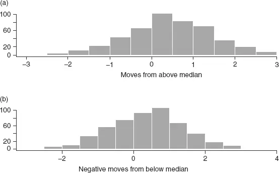

**FIGURE 7.19 自相关模型的分析，局部中位数调整：(a) 来自中位数以上的运动，(b) 来自中位数以下的运动

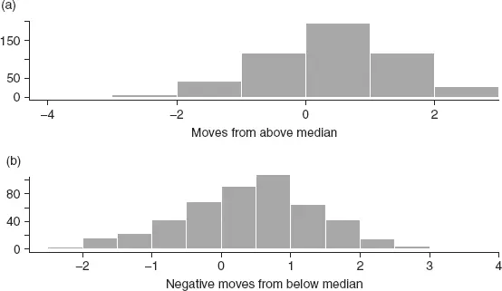

The local median adjusted series (window length of 10) is shown in [Figure 4.4; aspects of the reversion assessment are illustrated in Figure 7.19. A slightly greater proportion of reversionary moves is exhibited by the adjusted series, 65 percent (compared with 62 percent previously noted for the raw series). Total revealed reversion is 342 (compared to 315 in the unadjusted series); total pure reversion is 605 (compared to 601).
局部中位数调整序列（窗口长度为10）见图4.4；回归评估的各个方面如图7.19所示。调整序列表现出略高的回归运动比例，为65%（相比之下原始序列为62%）。总显现回归为342（未调整序列为315）；总纯回归为605（相比之下为601）。

## 附录7.1：示例6中对数正态情况的详细推导

$$ <!-- validate-skip -->
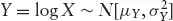
$$

Set:

$$ <!-- validate-skip -->
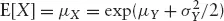
$$

$$ <!-- validate-skip -->
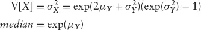
$$

Define *Z = *X truncated at *X0 (equivalently, *Y is truncated at *Y0 = *logX0*. Then (Johnson and Kotz, p. 129):
定义 *Z <!-- validate-skip --> = *X 在 *X0 处截断（等价地，*Y 在 *Y0 = *logX0* 处截断）。则（Johnson and Kotz，第129页）：

$$ <!-- validate-skip -->
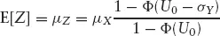
$$

where:

$$ <!-- validate-skip -->
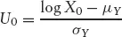
$$

Total expected revealed reversion can be written as *E[*X|*X > m] − *E[X]. Now, *E[*X|*X > m] = *E[Z] with *X0* = *m = *exp(μY). In this case, *U0 reduces to 0 and:
总预期显现回归可以写为 *E[*X|*X > m] − *E[X]。现在，*E[*X|*X > m] = *E[Z]，其中 *X0* = *m = *exp(μY)。在这种情况下，*U0 简化为0，且：

$$ <!-- validate-skip -->

$$

Therefore, total expected revealed reversion is:
因此，总预期显现回归为：

$$ <!-- validate-skip -->

$$

*Special Case μY* = 0, σY* = 1. Then
*特殊情况 μY* = 0, σY* = 1。则

, *X0 = median = *e = 1. Now, *U0 = *logX0* = 0, so that:
, *X0 = 中位数 = *e = 1。现在，*U0 = *logX0* = 0，因此：

$$ <!-- validate-skip -->

$$

From standard statistical tables (see references in Johnson, Kotz, and Balakrishnan), Φ(−1) = 0.15865 so the mean of the median truncated lognormal distribution (with *μY* = 0, *σ = 1) is 2.774.Statistical Arbitrage
根据标准统计表（参见 Johnson, Kotz 和 Balakrishnan 的参考文献），Φ(−1) = 0.15865，因此中位数截断对数正态分布（*μY* = 0, *σ = 1）的均值为2.774。统计套利
