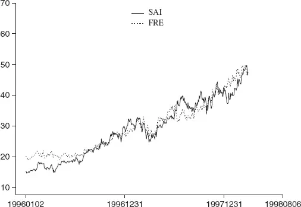
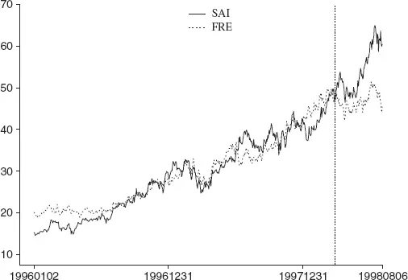
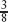
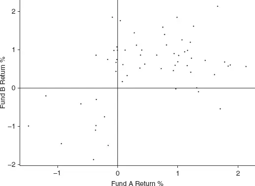

# [第8章](ch08.md) 诺贝尔难题

Chance favors the prepared mind.

—Louis Pasteur

## 8.1 引言

本章探讨导致统计套利（Statistical Arbitrage）策略产生负面结果的场景。在运营投资策略时，尽管有风险过滤器和止损规则，意外仍应以一定频率出现。第一个案例分析了一对表现出教科书般回归行为的股票，直到一项基本面事件——收购公告——造成了断裂点。接下来我们讨论一次国际经济事件——1998年信用危机（Credit Crisis）——带来的双重影响：在股票市场中引入了一个新的风险因子——企业债券信用评级导致的暂时性价格歧视（Price Discrimination），并将一个盈利年份（截至5月）转变为亏损年份（截至8月）。之后我们考察对冲基金（Hedge Fund）、共同基金（Mutual Fund）和养老基金（Pension Fund）的大规模赎回（Redemption）如何对股票价格动态造成暂时性干扰，进而损害统计套利的绩效表现。随后我们讲述《公平披露规则》（Regulation FD）的故事。最后，在这一系列关于绩效创伤的讨论中，我们回到[第5章](ch05.md)的主题，澄清一个常见误解，特别是关于经理人在负收益期间绩效相关性的问题。

## 8.2 事件风险

图8.1展示了联邦住房贷款抵押公司（FRE）和Sunamerica公司（SAI）从1996年1月2日至1998年3月31日的价格走势（日收盘价，经股票拆分和股息调整）。两条价格曲线紧密跟踪，呈现强劲的上升趋势，两者之间的价差（Spread）反复扩大和收窄。

**图8.1 FRE和SAI的调整后价格走势

随后的分析和论证聚焦于配对价差交易，但关于结构性转变的要点对统计套利模型具有更广泛的适用性。一个预测个股（组合）走势的因子模型同样容易受到上述运动的冲击，但其机制更为复杂，解释需要更细致的阐述。我们将保持分析的简洁性，并再次提醒读者，这些基本要点同样适用于更广泛的统计套利模型。

这两只股票的日收益率相关性并不特别强；相关系数为0.4。然而，观察事件之间的收益率，相关系数则高达0.7。事件相关性（Event Correlation）揭示了在规定的风险容忍度内，哪些股票可能适合组合交易（参见[第2章](ch02.md)）。

从视觉和统计角度看，配对[FRE, SAI]似乎在简单的价差回归模型中能够盈利。基础爆米花过程模型（Popcorn Process，参见[第2章](ch02.md)）的模拟证实了这一点。

图8.2展示了FRE和SAI延伸至1998年第二季度（至8月6日）的调整后价格序列。有趣吗？价差显著扩大，达到了近期历史最大值的两倍以上。如前所述，价差的大小本身并不导致亏损交易，真正造成亏损的是价差扩大的过程。当价差进入持续增长阶段时，交易往往会在(a)比通常更长的持有期之后，以及(b)当局部均值价差与建仓时相差甚远时被平仓，从而产生亏损。（本分析假设模型自动执行而不包含干预方案。加入监控及相关的提前退出[止损]规则会减轻损失，但会使描述变得复杂而不改变核心信息。）

**图8.2 FRE和SAI截至1998年8月的调整后价格走势

使用基于假定爆米花过程的指数加权移动平均模型（Exponentially Weighted Moving Average），配合约束趋势分量（参见[第3章](ch03.md)），2月底建仓的[FRE, SAI]交易持续到4月底，6月初建仓的交易持续到7月初。两次都产生了重大亏损。（7月底有一笔快速周转的盈利交易。）

### 8.2.1 价差收窄是否保证盈利？

很遗憾，盈利情景并不能得到保证。然而，波动率下降与波动率上升之间存在一个有益的不对称性：在前者的情况下，当局部均值发生变化时，模型的滞后视角反而能发挥作用。（回忆一下，当局部均值不变时，波动率的变化不是问题，尽管可能存在机会成本——以错失利润的形式——如果波动率预测适应较慢的话。）

当价差局部均值持续朝一个方向移动，超出模型有限的适应速度时，策略就会亏损，因为交易出场点（期望收益为零）相对于入场点而言是不利的。同时刻的入场和出场点呈现正确的关系；问题在于随着时间推移，价差的实际走势与建仓时的预测发生了偏离。如果对局部波动率的预测高于实际波动率，那么当前的交易入场点会更保守（实际交易数量更少，且每笔交易的期望收益更高）。当趋势持续不利于模型时，这种保守性会减少损失——这与波动率上升且模型低估波动率时的情况恰好相反。

在价差关系发生变化时截断亏损交易是最理想的做法。然而，实施这一点需要另一个预测：对变化本身的预测。通常我们能做的最好的是在变化发生后不久识别它，并在之后不久将其特征化。即便如此也具有挑战性。参见[第3章](ch03.md)以及Pole等人（1994年）的讨论。

从1998年8月的角度审视当前的FRE–SAI交易，我们问：我们必须维持一个持续亏损的头寸吗？显然不必；头寸可以在经理人的判断下平仓。但何时应将该配对重新纳入候选交易池？FRE和SAI之间历史上的紧密耦合似乎正在瓦解；如果这种瓦解适用于股票收益率序列的底层共同结构，那么这些股票将不再满足配对选择标准，交易也将停止。如果共同结构依然存在，价差在新水平附近波动或回归到近期历史水平，这些股票将继续被选中，并在扰动结束后再次实现盈利交易。

1998年8月20日星期四，AIG收购SAI的消息公布。SAI周三收盘价为64美元

这笔全股票交易将SAI的估值溢价定为25%（在开盘前）。人们不禁要问，SAI在收购前价格上涨背后的买盘压力究竟来自何处。

## 8.3 新风险因子的兴起

1998年夏天的国际信用危机是统计套利实践中的一个特殊时期。绩效问题从6月开始出现，并对许多人来说在7月和8月持续加剧。在此期间，人们第一次清晰地认识到，市场对一家公司信用质量的感知直接影响着投资者对公司近期估值的信心。随着市场情绪转为悲观，全市场股票被普遍下调估值，价格下跌的幅度与企业已发行债务的信用评级密切相关。信用评级较低的公司，其股价跌幅是评级较高公司的三倍。此前从未有过如此剧烈的歧视性行为的描述；在统计套利的历史上当然也没有先例。

关于1998年信用市场与股票市场之间联系的本质，以及价格变动为何如此剧烈，当时存在许多假说，现在看来比当时少了。毫无疑问，对冲基金长期资本管理公司（Long-Term Capital Management, LTCM）的倒闭，以及美联储（Federal Reserve）迫使不情愿的投资银行进行的史无前例的救助行动，加剧了人们对美国金融体系系统性崩溃的普遍恐惧。在假说谱系的幼稚一端，是一个正确但本身并不充分的观点：美联储的行动只是放大了对重大经济失败的正常恐慌反应。一个重要的因素是信息、推测、流言和废话传播的速度，以及从24小时"新闻"电视频道到互联网的广泛受众覆盖。1990年代，大量日内交易者和活跃的个人参与者被牛市的吸引力和科技进步带来的便捷交易吸引进入市场，为广播噪音提供了易于接受的听众，也为恐惧和恐慌的滋生蔓延提供了沃土。许多糟糕的决策源于瞬间判断——这些判断被冠以"分析"之名，尽管往往不过是对即时信息片段的即时反应，再通过技术手段迅速执行。这对波动率研究和认知高等级物种中的从众行为研究有利，但对血压和胃溃疡不利。

当俄罗斯违约（Russian Default）的影响开始冲击美国股市时，人们越来越担心企业将在信贷市场上逐步受到挤压，这种担忧导致了股票价格的下调。随着危机持续和股票价格下跌，信用评级较低的公司股价下跌更快、累计跌幅更大，而信用评级较高的公司则相对较好——这从存在主义意义上证实了那种普遍的恐惧，无论理性与否，即信贷市场收紧（从俄罗斯违约到这一结果之间在国际上或美国本土的传导链条并不令人信服和连贯）将使融资变得更加昂贵。而信用评级较低的公司不得不支付更高的费用，还有什么比这更合乎逻辑的呢？这种表面看似无懈可击的歧视性股票价格重新调整的逻辑，实际上是自我实现的预言。美国利率是否真的有可能因为俄罗斯违约而上调？

在1998年夏天，企业债务评级成为美国股票市场中的一个重要歧视因子。任何未考虑该因子构建的组合都可能面临估值损失——因为低评级股票的价格跌幅相对于高评级股票是非比例放大的。无论是从朴素配对交易策略构建的匹配配对组合，还是从复杂的因子模型构建的回报预测组合，在这一点上都没有区别。损失是不可避免的。

随着歧视性股票价格模式的发展，歧视性结果区分了不同类型的统计套利策略，但经理人在面对持续且累计的巨大亏损时的行为使得评估变得复杂：模型与经理人之间的混合（如果这种区分有意义的话）变得无法识别。剔除经理人干扰的模拟研究表明，因子模型比纯价差模型表现出更强的韧性^(1)，并且更快地恢复正收益。

认识到新的风险因子后，应该怎么做？因子模型在使用受影响期间的收益率历史重新计算因子分解时，会自然地将"债务评级"纳入考量，因此无需采取直接行动。但不作为确实引发了一些疑问：一旦因子被识别（或至少被假设出来），在事件发展过程中应该怎么做？最佳方案难道只是等待新的数据窗口来估计股票对该因子的敞口（与此同时承受绩效的重击）吗？后者的答案是显而易见的"不"，但超越简单的"不"字，制定合理的处方更为棘手。首要要求的总体规定是直接的：消除组合中对假定因子的敞口。精确地实现这一点则更为困难——敞口*究竟*是什么？在强烈的情绪推动和业务需求驱动止损的急迫中，运气也扮演了它的角色。

那么非因子模型呢？首先，识别策略中如何管理因子风险，然后将这种方法扩展到债务评级因子。对于配对策略，显而易见的补救措施是在债务评级方面对所有可接受的配对组合进行同质化处理。也就是说，只允许两只成分股具有足够相似的债务评级的配对组合。这样，高评级股票将与高评级股票配对，低评级股票与低评级股票配对，从而避免对那些在债务因子担忧下表现出不协调价格波动的股票进行押注。还有许多其他方面值得深入研究，包括是否采用随债务评级递减的头寸权重、限制低评级股票只能做空，或者对债务评级极差的公司行使绝对否决权。

在研究推进过程中，一个需要回答的重要问题是：引入新的建模限制对策略的历史绩效会产生怎样的影响？发现自己绩效问题的近因、确定并实施预防性的建模调整固然值得祝贺，但还需要了解这些改变对未来绩效的影响（除了在因子负面活跃时起到保护作用之外）。关于这一主题在更广泛绩效中断背景下的更详细讨论将在[第9章](ch09.md)展开。

## 8.4 赎回压力

广基（Broad-Based）、纯多头（Long-Only）基金的赎回模式对快速周转的多空回归策略具有完美的"破坏力"。抛售纯多头基金会对股票价格产生不对称的压力——全部是单方向的下跌。如果抛售是广基的，且在某种程度上是持续的，那么对价差头寸的影响只能是负面的。

假设"广基"意味着回归策略中交易的相当大比例的股票受到影响——假设为一半。假设多头组合投资策略及当前头寸与回归策略无关：近似假设抛售对回归策略的多头和空头头寸产生同等影响。因此，"所有"受影响的多头在赎回活动的抛售压力下价值下跌，"所有"受影响的空头负债减少。平均而言，对回归策略不应产生净影响。

确实如此……起初是这样。但回归策略中的价差池发生了什么？那些多头和空头同时受到价格下行压力的价差基本上不变：假设价格近似等比例下降。（实际上，相对强势的股票将是抛售的首要目标，因为清算负责人试图最大化收入——这对价差押注是单边的负面影响。弱势股票在被抛售时价格变化更大，使得回归策略账簿的净结果为负而非零。为了讨论的延续，我们继续采用零净影响的乐观假设。）但是对于那些只有多头或空头面临赎回抛售的股票所在的价差，价差将会变化。有些会收窄，赚钱；有些会扩大，亏钱。净结果仍为零。但那些收窄的价差会导致交易平仓——获利了结。扩大中的价差继续扩大并产生更多亏损。此外，持续的价格下跌会导致价差模型建立新的头寸，而这些新头寸随后在持续抛售下继续亏钱。如果抛售持续足够长时间——对于大额持仓来说这几乎是必然的——价差策略的自然交易周期将完成，这些新交易将被平仓，锁定损失。

情况可能变得更糟。当抛售结束后，一些股票会出现类似的回升趋势——仿佛存在持续的买盘压力。谁知道为什么会这样——相对价值回归！对于这些股票，新的价差头寸被建立：记住，之前建立的一些头寸已经完成了其自然动态，因此模型正等待新的入场条件。Bingo，当股价开始收复失地时条件满足了。亏损的价差押注（现在方向相反）再次出现。

高频回归策略对小的相对波动进行大量押注。纯多头基金的赎回导致累积量级大得多的价格波动；本节描述的机制为统计套利创造了血洗的条件。

### 8.4.1 超级破坏

大型股票统计套利组合在清算时，为其他统计套利组合创造了完美的亏损条件。规模至关重要，因为多头的抛售和空头的回补必须持续超过其他玩家的自然周期。如果不持续，那么在现有头寸被平仓之前，初始亏损就会被逆转；损害主要限于（可能令人作呕的）损益波动。当破坏发生时，它是被放大的，因为价差押注的两侧同时受到不利影响。

1994年11月，基德尔·皮博迪（Kidder Peabody）在被收购时，据报道清除了一个超过10亿美元的配对交易组合。长期资本管理公司（LTCM）除了其高杠杆的利率工具押注外，据报道还拥有一个大型配对交易组合，该组合在1998年8月被清算，因为其他方面的巨额亏损威胁（并最终动摇）了其偿付能力。

## 8.5 《公平披露规则》（Regulation FD）的故事

"公平披露"（Fair Disclosure）规则由美国证券交易委员会（SEC）于1999年12月20日提出，并几乎立即产生了实际影响。这种即时性——在规则正式采纳前十个月——鲜明地证明了华尔街分析师的一些恶劣行径，如今这些行为已臭名昭著，例如向客户推荐股票的同时私下贬低它，或者为了赢得承销业务而将负面评价改为正面评价，之后又恢复负面评价！

《公平披露规则》最终禁止的活动在1999年对统计套利组合产生了显著的负面影响。最容易识别的是在正式公告前几天对收益的selective disclosure（选择性披露）。通常，受青睐的分析师会从CEO或CFO处获得内幕消息。分析师和受青睐的客户可以在信息公开之前采取行动。如果消息是好消息，股价会在内部人的买压下上涨，统计模型会发出相对于匹配股票的相对强度信号，该股票就会被做空。几天后消息公布，公众的热情进一步推高股价，导致做空头寸亏损。当消息令人失望时建立的多头头寸也因价格下跌而遭受类似的损失——这对短期统计策略来说是双输的局面。

这种行为模式变得如此普遍，以至于许多市场参与者发出了强烈的抗议；SEC听到了并采取了行动。这种做法的显著影响几乎在一夜之间消失了。

向分析师传递特权信息在1999年并非新现象。对该特权的广泛滥用则是新的，或者至少从刚概述的事件来看似乎是这样。如果之前存在滥用行为，它并未被注意到。这个故事有一个有趣的旁注：分析师的有效性。许多以及时准确预测公司业绩而享有明星声誉的分析师，在《公平披露规则》公布后变成了普通的预测者。

## 8.6 亏损期间的相关性

在组合遭受损失时常听到的一种投资者抱怨：

*"你的业绩与其他经理人（高度）相关。……"这里隐含的意思是他们做出了相似的押注，这与通过不同的股票池选择方法、交易识别方法（预测模型）以及由此产生的不同交易特征（如持有期）来实现差异化的主张相矛盾。差异化的主张是否虚假？绩效相关性是否是巧合？

两个广泛分散的股票组合在使用回归模型交易时，极有可能表现出亏损期的高重合度。当正常市场行为（投资者在正常时期活动导致的价格运动模式）被事件——国际信用危机和战争是最近的两个例子——打断时，会对股票价格产生显著的聚合效应：近期的相对强弱趋势被放大。在事件期间（近乎普遍的规律是"事件"等同于"坏"消息），抛售活动总是结果。被视为弱势的股票首先被抛售，且抛售幅度大于被视为强势（或至少不弱）的股票。这与满足赎回通知的基金所预期的相反——参见第8.4节。对价差交易的含义是显而易见的：亏损。无论经理人策略的精确定义、可交易池或当时具体活跃押注组合如何，所有回归价差押注在一个时间点上的共同特征是：被判断为（相对）弱势的股票持有多头，被判断为（相对）强势的股票持有空头。按市值计价的亏损是不可避免的。

亏损的幅度、连续亏损的持续时间以及恢复所需的时间因经理人而异，受到个别回归模型和经理人风险决策的强烈影响。

任何导致投资者普遍感到恐惧的经济、政治或其他事件都会引发抛售心态。这对所有实行均值回归的广基价差头寸组合有着明确的影响。毫无疑问，绩效转为负值；经理人之间的方向相关性很高。有趣的是，数值相关性可能并不高。在负绩效期间，不同组合的收益率幅度可能差异很大。恐惧驱动的抛售没有理由是有序的、均匀分布在市场板块或公司市值中的，或以任何其他整洁的方式呈现。通常，人们应当预期大量的无序性。因此，虽然经理人应当经历共同的异常亏损期，但在亏损期和盈利期分别考察的实际收益率相关性可能为正、为负或为零。

亏损期之后总会跟随着盈利期，这是定义决定的。根据上述论证，以缓解为间断的长期市场中断，必然为回归策略创造相似的亏损和盈利间隔模式。

那么，在价差交易普遍正面的时期，策略之间的相对表现如何呢？不同策略之间的收益率对应性应该会降低。收益率取决于个别模型所利用的具体动态运动。不存在一股统一的力量来创造短期、中期和长期的分散后再回归，就像恐惧的负面影响那样。或许狂热（Exuberance）是最接近这种力量的东西，它随机且大量地创造回归机会。但狂热不如恐惧那么实在。它不太可能引发共同的决策或行动。一组经理人的投资结果将呈现出比不利回归时期更松散的对应性和更大的异质性。

图8.3说明了典型情况。总体而言，基金A和基金B显示出正相关的收益率，相关系数为中等的0.4。这一相关性结果由两个象限驱动——两只基金同时盈利或同时亏损（正-正和负-负）——大多数交易结果落在这两个象限中。在这两个象限内，即策略表现好的时期和差的时期，相关性是负的：差时期为-0.19，好时期为-0.22。这种看似矛盾的现象——总体正相关但在所有主导子期间内负相关——是相关性谬误（Fallacy of Correlation）的一个例子。注意，负象限中收益率关系的强度实际上更低，为0.19，低于正象限的0.22，这与前面描述的一般预期相反。这个例子说明了文中多次描述的一个共同主题：虽然我们可以识别和表征模式——一般性或平均性的——但总有变异性需要去认识和应对。还要注意，负象限中只有10个数据点，仅为正象限数量的四分之一左右。因此，相关性的估计不够准确（用统计术语说，自由度或信息量更少）。而10对于估计一个变量关系来说是个小数字——不是吗？

**图8.3 基金A和基金B的月度收益率，说明相关性的谬误

不同的回归策略经历共同的亏损期并不令人惊讶。在经历了两年非凡的市场中断之后，这种相关性的可见性是可以理解的。理解这种结果为何产生很重要：如果将注意力从思考负收益率的平凡巧合转移到考察哪里最好地控制了亏损，注意力更可能获得回报。还应关注回归驱动力复苏的前景——这些驱动力何时以及是否能够重新强劲出现，为经理人创造系统性的盈利机会（参见[第11章](ch11.md)）。在这里，有真正的可能性来区分未来可能的赢家和输家。

> ^(1) 这种更强的韧性从何而来？可以通过对比基本配对策略和基本因子模型策略来部分解释（正是这些模型提供了模拟结果，作为实证评论的基础）。配对组合由在标准基本面指标（包括行业分类、市值和市盈率）上匹配的股票配对押注组成。价差使用一阶DLM（动态线性模型）预测模型（基于对数价格比率序列），并采用近似GARCH（广义自回归条件异方差）方差法则。当价差偏离其预测值15%或以上（年化）时建立押注。所有发出信号的押注都会被执行，并持有至模型产生退出信号；押注不进行再平衡；不应用止损规则。因子模型按[第3章](ch03.md)所述构建，优化目标为年化15%，以便与配对模型进行比较。头寸根据预测和因子敞口每日再平衡。

> 有证据表明信用评级与因子模型估计的结构因子组合之间存在相关性。就这一点而言，模型绩效对新风险因子的稳健性显然得到了传递。因子分析所应用的原始股票池（交易候选池）对结果有一定影响，如同对配对策略一样。然而，在匹配股票池的条件下，因子模型相对于配对模型展示了令人期望的绩效稳健性。Statistical Arbitrage
