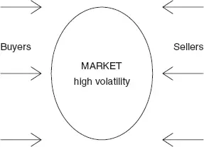
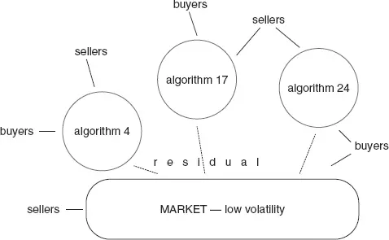

# [第10章](ch10.md) 黑箱崛起

*Felix qui potuit rerum cognoscere causas. 能够洞察事物成因者是幸福的。

—维吉尔

## 10.1 引言

二十年前发明配对交易（Pairs Trading）业务的摩根士丹利，在二十一世纪初站在了一项新业务的前沿；这项业务风险更低、更具可持续性，却以一种商业上弑父般的讽刺，系统性地摧毁了传统配对交易的机会。算法交易（Algorithmic Trading）由此诞生。来自机构和对冲基金的大量订单流——其中许多在内部通过电子方式撮合——为超出预期佣金之外的多重新收益提供了机会。摩根士丹利和其他券商将从自营交易（从经典的配对交易业务起步）中积累的洞察和知识，与对海量订单流数据的分析相结合，构建了交易工具，其中集成了预测市场冲击（Market Impact）的模型——该模型将市场冲击描述为订单规模和交易时段的函数，并根据每只股票的当日交易量进行调节。

认识到存在一个巨大的盈利机会——它依附于简单易用、自动执行且不会系统性产生滑点（Slippage）的交易技术，券商们决定将这些工具提供给客户。这是一个时机精妙的决策。随着新一代统计套利交易者（Statistical Arbitrageurs）大量涌现，供应商得以引诱那些他们的工具最终将帮助消灭的人，同时也吸引了渴求任何能降低交易成本或边际改善执行价格的新优势的现有客户。这项业务的天才之处在于，机构和统计套利交易者的订单流为数据挖掘者提供了源源不断的数据盛宴，而他们对此的贪婪胃口永远无法被满足。

从挖掘的数据中构建了按股票、按星期几、按日内时段以及按当日交易量分类的交易量模式。仅仅能够以可度量的效力预测在固定时间内买入或卖出特定数量股票需要从当前价格让渡多少，这对交易者来说就已经是一项惊人的发展。对冲基金多年来一直在自行尝试；但使用远不如券商档案丰富的数据，他们的成果不太可能达到券商的成功水平。无论如何，一项优势被消除了。

将逻辑回归类模型（Logistic-type Model）拟合到订单流和成交数据上，迅速产生了第一代模型，使交易者能够对经常面临的紧迫问题获得量化答案：

- 我需要支付多少才能在接下来的半小时内买入*X千股XYZ？

- 如果我等到交易日剩余时间再买，需要支付多少？

- 我能在一小时内卖出多少XYZ股票，同时将冲击控制在*K美分以内？

这些工具一个未被宣传的美妙之处在于其机会集合的自我繁殖特性。当交易者转向使用这项技术时，一套新的订单流信息被呈现并被供应商收集。现在可以同时研究急躁的"不惜代价成交"型和从容的"观望等待"型参与者的行为。客户画像模型——从客户订单流、交易工具配置和成交/撤销-更正记录中自动生成——几乎可以自行构建。有了衡量客户愿意为成交支付多少的能力，以及估计以更低市场冲击获得交易需要多长时间的手段，众多可能性简直在向研究者呼喊，回响并放大了二十年前上一代人听到的传统配对交易的呼喊。

所有这些机会无需资本承诺即可获取。自营交易的风险被消除，而"新"业务变得无限可扩展。

摩根士丹利当然有竞争对手。高盛、瑞士信贷第一波士顿、雷曼兄弟、美国银行等也开发并销售了算法交易工具。

## 10.2 建模预期交易量与市场冲击

起点是数据挖掘。哪些数据可用，其中哪些与回答"多少……"问题相关。假设股票XYZ有超过十年的逐笔交易每日交易量历史数据，即2,500天的交易数据。首先要做的是检查每日累计交易量：每只股票在一天中的交易模式都有其独特特征，可以说是它的"足迹"。采用一刀切的方法，用通用哺乳动物的足迹来预测大象的足迹或许可行，但会产生不必要的大误差（噪声或误差方差）。更糟的是用蝰蛇的足迹来预测（试试描述它）。你能看出问题所在。

这个问题很容易通过在数据分析和模型构建中增加适度的特异性来解决。计算机不在乎处理多少模型变体。但你应该在乎；在不必要的地方过度特异性也会导致预测方差过大，因为有限的数据资源并不能提供无限可分割的信息库。数据被切割成不同类别的越多，每个类别的信息就越少。如果两个或更多类别本质上是相同的（就当前研究目的而言），数据最好合并。此外，在数据上测试的模型越多，发现虚假良好拟合的可能性就越大。这些都是良好应用统计分析中众所周知但常被忽视的细节。

开始观察数据时，要着眼于识别交易量中的日内模式。如何描述它？虽然十年前的每日模式不太可能接近今天的每日模式，但假定如此是不明智的。记住，原始配对交易利用的反转模式在十五年间一直保持着经济上可利用的频率和幅度，直到技术和市场发展导致了剧烈变化。检查一些来自十年前的每日累计交易量图表，一些来自五年前的，一些来自今年的。你会注意到图形（曲线）具有相似的形式，但有明显差异——与早期模式相比，近期模式在日内早期和晚期的累积速度更快。最好不要简单地将所有数据聚合后估计一条平均曲线。

更仔细地观察最近三个月的每日模式。那是60张图表。检查十年前的一组三个月数据。你注意到基本形状有大量重叠。但看看刻度：该股票现在的交易量远高于十年前。嗯。将图表重新缩放为占每日总量的累计百分比。现在所有图表都在相同的0-100刻度上。啊！最近一个季度的模式变异性小得多。因此，无论某一天的交易量是相对较高还是较低，都会揭示出类似的日内交易模式。我们如何利用这一洞察？一个目标是以一种能够方便地给出市场在特定时刻占当日交易量比例的方式来表示曲线（日内累计交易量百分比曲线）。换句话说，要方便地回答诸如"到下午2点交易了多少量？"这样的问题。有许多具有所需通用S形的数学函数可用：概率分布的累积密度函数（Cumulative Density Functions）提供了一组天然的函数集，因为这里研究的正是分布本身。统计建模（我们尚未考虑）的一个便利形式是逻辑函数（Logistic Function）。

选择一个函数。将它拟合到数据上。现在你可以方便地对股票特定的问题给出合理量化的回答：到下午2点交易了多少量？*平均而言……

假设今天该股票恰好是交易量相当大的一天，到上午11:30已交易400万股。预计到下午2点会交易多少股？根据估计的模式，到上午11:30通常交易了当日总量的30%，到下午2点交易了40%。你很容易计算出未来90分钟预计交易130万股。你想交易10万股。应该不需要付出太大代价就能实现。对吗？

以上分析仅考虑了交易量；记录中的价格信息尚未被检验。让我们直接加以弥补。在XYZ股票60天的交易数据中，有许多单笔买卖交易，订单规模从最小100股到最大100,000股不等。所有订单的成交信息也被记录下来。将订单规模与价格变化（从下单价或下单时市场价格到平均成交价）绘图，显示出明确的关系（以及大量变异）。再一次，当每天按照该股票当日总交易量进行缩放时，部分变异神奇地消失了。在标有"可见性阈值"（Visibility Threshold）的限度之内，订单在大交易量日的影响较小。

将数学曲线或统计模型拟合到订单规模-市场冲击数据上，就得到了回答以下问题的工具：我需要支付多少才能买入10,000股XYZ？注意买入和卖出的响应可能不同，并且可能取决于该股票当天是上涨还是下跌。将原始（60天）数据集拆分并分别分析上涨日和下跌日将阐明这一问题。更正式地，可以定义一个包含上涨/下跌日指示变量的综合统计模型，并检验估计系数的显著性。考虑到在没有大量工作的情况下，合理确定此类统计检验有效性所需的独立性及其他条件的可疑程度，分别建立合并数据和上涨/下跌日的预测模型并比较预测结果将是更好的选择。预测差异是否具有*实际意义？*差异到底是什么？

为不同数据类别拟合各自模型的一个缺点是，交互效应（如交易量与上涨/下跌日、买入/卖出之间的交互等）无法被估计。如果目的是寻求理解，这是一个严重的遗漏，因为交互效应揭示的关系微妙之处通常在单因素分析中甚至不会隐约暗示。如果目的是获得不错的预测，这一遗漏在学术上是严重的（如果确实存在交互效应），但在实践中（取决于交互效应的性质）重要性较低。

时间在市场冲击估计中也很重要——回想日内累计交易量模式的分析。在日内"缓慢"或交易较清淡的时段成交订单，要么需要在给定滑点限制下更有耐心，要么愿意提高该限制。在前述订单规模-市场冲击分析中未考虑时间因素。显然可以考虑，最明显的方法是将数据按日内缓慢和非缓慢时段切分（或简单地按半小时段切分），并为每个时段估计单独的模型。虽然统计建模和分析可以做得更精细，但这里假设的简单分桶方法足以说明机会和方法。（富有成效的精细化实例包括：用平滑函数正式建模跨时间切片的参数，以及使用分类程序如回归树（Regression Trees）来识别自然分组。）

## 10.3 动态更新

检查十年前与近期每日交易量的基本模式后，人们意识到模式已经发生了变化。随即面临的问题是如何管理从数据中估计的预测模型的变化。第一个行动是仅使用近期数据来构建当前使用的模型。我们假设近期为60天。现在面临的问题是：何时应该修订模型？我们再次面临与[第2章](ch02.md)讨论反转模型时相同的问题——变化类型、演化速度和动态更新方法。这里的基本问题并无不同。人们可以合理地选择使用滚动60天窗口，每天重新估计模型关系。也可以例行地将最新的每日模式与(a)近期或(b)更早时期观察到的模式分布进行比较，以判断今天是否异常。如果异常，也许应该对预测应用"保守性过滤器"？可以设计一个变化率的度量（存在比较概率分布的标准方法，从包括矩在内的汇总统计量到信息的积分度量），并用于构建一个比简单60天移动历史窗口更灵活的通用动态更新方案。

## 10.4 更多黑箱

我们有意在本章开头特别提到摩根士丹利，因为这与我们主要主题——统计套利——的起源有关。但摩根士丹利并非唯一一家分析交易数据并向市场提供封装了从中发现的交易智慧的工具的公司。高盛在纽约证券交易所交易大厅的运营——2000年收购的Spear, Leeds & Kellog做市商——代表着一个可能比摩根士丹利数据库更有价值的金矿。美国银行在2002年收购了对冲基金Vector的技术："……计算机算法将综合考量特定股票的交易特征*以及美国银行自身的持仓情况，然后生成买卖报价"（《机构投资者》（*Institutional Investor*），2004年6月；斜体为强调而加）。瑞士信贷第一波士顿（CSFB）聘请了知名且技术先进的对冲基金D.E. Shaw的一名前员工，构建了一个"处理其[CSFB]40%订单流"（《机构投资者》，2004年6月）的工具；雷曼兄弟和其他十几家公司也进入了这一领域。

除了上述发展外，至少有一家新券商Miletus从一家十亿美元对冲基金中分离出来，旨在将为该对冲基金自身交易开发的交易算法中的价值变现。在另一项技术驱动的发展中，从2006年底高盛开始，至少有两种通过算法手段实现的一般性对冲基金复制产品已被推向市场。随着这些工具日益普及，市场中可能会增加新的系统性模式生成力量。

## 10.5 市场通缩

图10.1描绘了买卖股票的市场，一个买卖双方聚集在一起就双方可接受的所有权交换达成价格的通用市场。有许多买方和卖方。大量的个体参与者。众多的协议点。显著的波动性。

**图10.1 市场曾经的模样

图10.2描绘了正在到来的买卖股票市场。众多的个体买方和卖方通过少数计算机算法的中介管理聚集在一起，这些算法在内部交叉匹配了大量订单，并通过在中央市场上受控的、不急躁的交易来满足剩余部分。有许多买方和卖方。众多的协议点。但没有传统集市那样无节制的躁动。受约束的波动性。

**图10.2 通缩市场模型

统计套利
