# [第11章](ch11.md) 统计套利的复兴

*. . .对一切都感到担忧令人不安。这也适得其反，因为它可能导致人们不断对一个正确运行的系统进行修补，仅仅是为了应对数据中想象出来的幽灵。

—Box 和 Luceno，《通过监控与反馈调整实现统计控制》

截至2004年底，统计套利（Statistical Arbitrage）的从业者们已经煎熬了一年。投资者和评论家们指出了业绩的波动性却没有提及相对于市场上涨（2003年）的回报；他们引用了不可逆转衰退的指控性断言，理由是可见的市场变化；并且对现实的必要复杂性充耳不闻（完整的论述请参见[第9章](ch09.md)和[第10章](ch10.md)）。

与这种围困相对的是本书的论述以及自2006年以来业绩的回归。第2至[第8章](ch08.md)阐述了传统统计套利机会的性质和范围、形式化建模和系统化利用这些机会的方法，以及按照统计套利模型构建和管理的投资组合所遭受的市场动态本质的破坏。[第9章](ch09.md)审视了对该学科的一刀切式否定，其逻辑是：这一变化消除了统计套利回报的一部分；这一变化是永久性的；因此你的机会集已经消失了。这些论断被发现是有针对性的，但不足以解释历史记录。远为复杂的现实虽然同样具有毁灭性，但经过更深入的反思，却无法支持这种否定。在其复杂性中，持久的要素并非完全摧毁统计套利。相反，一些更为深远的市场结构性变化（如[第10章](ch10.md)所述）必然为一种新的统计套利范式创造了条件。这种正在兴起的范式、其驱动力以及由此产生的、可被统计描述从而可被利用的股票价格模式，将在本章中阐述。本章既为全书画上句号，也为未来数年后待书写的历史铺垫背景。

少数拥有长期且卓越业绩记录的统计套利从业者继续带来合理到良好的回报，而大多数人如前几章所述已经失败。这一证据支持以下两个论断：（a）传统统计套利机会并未被完全摧毁，以及（b）新机会正在产生和发展，尽管只有内部信息才能揭示这些证据各自在多大程度上支持上述论断。对股票价格历史公开记录的分析强烈表明，从高频交易（High-Frequency Trading）中——即日内交易——获取超额回报的机会是巨大的。从贯穿全书的讨论中可以清楚地看出，利用这一机会需要不同于传统均值回归（Mean Reversion）类型的模型。其中一些模型将在本章后文描述。

日内股票价格运动的模式显示的不是回归而是动量（Momentum）。日内也存在回归模式，但这些模式似乎难以预测（尽管有人声称在此取得了成功）；它们对广泛的投资组合间歇性地发生，且其前兆信号不易识别。事实上，将这种运动标记为回归可能是不恰当的；反转（Reversal）也许更能说明这种动态。这一区别至关重要。回归过程假设存在一个潜在的均衡，价格（或相对价格）在偏离该均衡后倾向于回归（即爆米花过程）。均衡力量是可以被识别的。趋势和反转过程则没有这种潜在均衡的假设；相反，该过程在一个方向上持续运动较长或较短的时间段，然后转向另一个方向，两次运动之间没有强关联（一个无记忆的切换过程）。描述和评估的关键在于方向性运动的持续时间和幅度：它们持续的时间足够长（想象足够多的时间步长，每一步都能被人观察到），且运动幅度足够大，以至于在考虑到转折点识别所需滞后的情况下，能够被系统化地利用。

成功建模的关键在于理解驱动趋势形成的市场力量。逐分变动（Penny Moves）是一个重要因素，它已经消除了价格摩擦，消除了历史上对反复出现的（因此累计幅度很大的）运动的天然初始阻力。更复杂的因素是，随着更多交易在电子交易所和[第10章](ch10.md)所述的经纪公司交易程序中自动撮合，人类专家正越来越多地从定价过程中退出。最重要的是那些"智能"交易引擎，以及作为VWAP（成交量加权平均价）或TWAP（时间加权平均价）被预先执行的大量交易。老派的技术分析（Technical Analysis）可能在利用新的日内趋势模式方面奇怪地保留了一些效力；但最大的成功将属于那些在其建模中融入了底层驱动力量知识和算法交易（Algorithmic Trading）策略的人。

远离潜在的均衡力量，由人们对公司前景的短期和长期公允估值判断所驱动的新范式，是一种冷静的——漠不关心的——基于规则的系统，不断地探测其他类似的实体。这一过程是机械的，就像地质过程中水寻找最低点一样。然而在这里，规则是由人类建模者而非物理定律定义的，而且它们是可变的。噪声无处不在，因为人类交易者仍然直接占据了相当大一部分市场活动，并且发起了所有交易。尽管存在噪声，新的均衡力量所寻找的不是公平的相对价格，而是公平的（由参与实体共同接受的）市场出清。这种新范式可能是向古老的经济学范式的回归（!!!）：完全竞争（Perfect Competition）。沿着这一思路，人们可能会联想到动态蛛网算法、博弈论策略，以及行为金融学（Behavioral Finance）研究可能需要的重新定位。

波动性将继续被算法所消耗。不再是在纽约证券交易所（NYSE）大厅里人与人面对面的交易，也不再是电子市场上人-屏幕-人式的交易，而是算法与算法之间的交易。围绕交易的大部分情绪被移除，随之而去的还有波动性。然而，在聚焦于算法的同时，我们不能忘记人才是系统的驱动力。随着交易由运行在极高速计算机上的算法管理，那些被设计为超越被动市场参与、走向主动市场决定的算法可能会做什么？也许是探测其他算法的弱点，寻找利用天真的机会，或者误导其做出错误判断。这是战争的另一种名称。对某些管理者来说，这种吸引力和对某些程序员来说的挑战是不可抗拒的。

当然是推测，我想。

## 11.1 灾变过程（Catastrophe Process）

自2004年初以来，价差运动被观察到呈现一种不对称过程，其中发散是缓慢而连续的，而收敛——即旧称的"均值回归"——则快得多，相比之下甚至是突然的。收敛不一定是"回归均值"，尽管它朝着局部均值的适当方向运动。前两个特征与爆米花过程形成对比，后者表现出更快地偏离正常状态和更慢的回归。第三个特征，即回归潜在均值的程度，也区分了这两种过程：在新出现的过程中，回调运动的幅度比爆米花过程的情况变化更大。

现在我们进入了定义的泥沼，因此需要仔细审视和详细阐述。

用图11.1对比经典爆米花过程和新过程。新过程的显著特征是：从局部均衡缓慢、平滑地发散；快速回归到先前的均衡；*仅部分回归（在大多数情况下）；连续多次运动描绘出一个远离潜在均衡的实质性局部趋势。（后者如同所有原型图示一样，被描绘为一个恒定水平。在实践中，它叠加在长期趋势运动之上——对于上升趋势，将页面逆时针旋转几度即可看到该原型。）

**图11.1 (a) 爆米花过程的原型，显示向均值回归 (b) 新原型：灾变过程

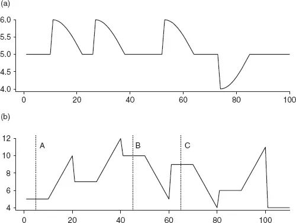

这一新"灾变"模型的关键偏离在于，在经典描绘的足够局部以至于被视为恒定的期间内出现了局部趋势。局部趋势（趋势中的趋势）*现在必须被描绘并正式纳入分析，因为它既是机会驱动力的一部分，也是成功利用新回归性运动的关键。它不能被视为叠加在潜在（爆米花）过程上的噪声而被忽略。

"回归"幅度的变化，以及在更大的方向性转变之前同一方向上的多次运动（单独的或再次多个小事件），是由算法交易的交互作用驱动的。（可能还有其他驱动因素，但目前它们仍然难以捉摸。）耐心的算法在价格逐分地反复运动时会放松——这种运动是专家们在转向十进制化后热衷于跟踪的，并且无疑已被编入某些算法。当tick size还很实质性（八分之一）时对运动的某种惯性，现在变成了对逐分运动的急切追求。当人类交易者仍然主导订单流时，逐分交易最初是极其有利可图的。算法的耐心和纪律取代了交易者的直接参与，改变了交互作用的动力学。其结果——现在看来已经清晰——就是我们所描述的灾变运动。

请注意，将爆米花过程模型应用于灾变过程的相对价格演变所带来的含义：零回报。

一个自然要问的问题是，在图11.1中A-C所涵盖的时间尺度之外更长的时间尺度上会发生什么？刚才给出的描述——在一个方向上的连续运动被部分回调打断，然后基本上在相反方向上重复，如图11.2所示，以及图11.3中的变体——听起来不过是爆米花过程的更清晰聚焦，仿佛人们只是放大了倍率来看到更多无趣的、模糊画面的、不经济的细节。正确的解释是延长时间尺度，使爆米花过程上的微观运动在时间上变得与原始爆米花运动本身同样重要。因此，爆米花运动可能需要多达六次（甚至更多）次灾变运动才能完成——在动态市场中这是很长时间。即使在这些理想条件下，爆米花的回报也减少了数倍。但真正的图景，回到图11.1，情况严重得多。在刚才建议的长时间段内，局部均值的偏移大到不能被忽略，从而使基本的爆米花过程失效。最好的情况下，结果分布在一个范围内，其中无趣的数值大大减损了有趣的数值，如图11.4所示，将一个可利用的结构转变为教科书或期刊上的好奇案例。在延长的持续时间内，赌注变成了基本面主导的博弈；对于统计爆米花过程

**图11.2 展开的爆米花运动，详细显示灾变运动

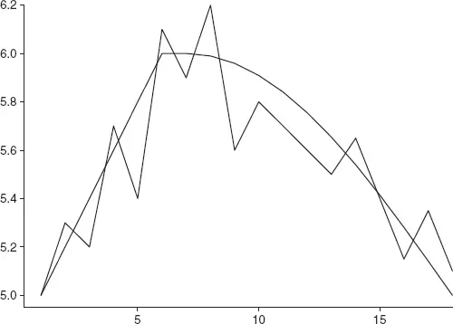

**图11.3 展开爆米花运动的变体

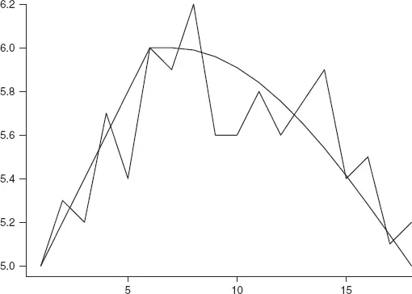

**图11.4 展开的爆米花运动产生可变结果

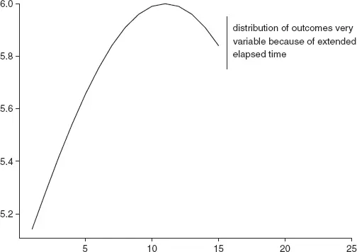

——而非以基本面分析为基础时——预测能力就会蒸发，回报也随之消失。

## 11.2 灾变预测（Catastrophic Forecasts）

与爆米花过程的预测相比，灾变回归的幅度无法被准确预测。但两个系统结果的巨大差异——爆米花应用于爆米花数据，灾变应用于灾变数据——界限在哪里？假设2002年之前为爆米花，2004年中期之后为灾变，中间18个月被变革的干扰性影响所主导——意味着对于大量赌注，统计量 R^(2) 是相似的。这一观察对交易的意义在于，如果合理时期内的赌注数量相似且两组赌注的总体差异也相似，那么预期回报率也将类似。当然，现实不会如此顺从地直截了当。由于灾变过程比爆米花过程更准确地描述了价差运动，价差波动率的总体水平一直在下降（见[第9章](ch09.md)）。2003年之前，当爆米花过程有效表征价差运动时，波动率几乎是2004年底灾变过程作为更准确模型时的两倍。这些结果并非巧合。两者都是由交易算法日益增长的市场渗透所驱动的（如[第10章](ch10.md)所述）。

总体方差的减少，而模型预测捕捉到相似的比例——乍一看，这是回报与方差收缩成比例下降的配方。但表面也在改变，表现为更短持续时间的运动和更高的运动频率。由此带来的赌注数量增加抵消了单笔赌注的较低收入。这只是部分抵消，而增加的赌注数量所带来的交易成本又反过来抵消了它。经纪和交易技术费用的持续下降压力过去是、将来也必将是一个不可避免的结果。

此时要回答的关键问题是，系统化地利用灾变信号进行交易，如何才能产生理想的经济结果？

理想情况下，人们希望在灾变跳跃发生之前准确识别其开始，留出足够时间在无市场冲击的情况下进行赌注，并在运动结束后尽快识别其结束，以最大化捕获灾变收益。迄今为止，这两个识别任务都被证明不容易，但基于持续时间度量的近似方法已经建立。

回到图11.5所示的灾变原型——增长和回落（或如果你喜欢对立式的回归，称之为下降和跳跃）。聚焦于灾变运动的积累过程，可以识别一个持续时间规则，在趋势开始发展后的 *k 个周期发出赌注入场信号。趋势的开始只有在运动开始几个周期后才能被得知。统计分析揭示了灾变回调之前趋势持续时间的分布，并在该分布的固定点发出赌注入场信号。第八十百分位数是一个好的操作规则。

**图11.5 灾变运动原型

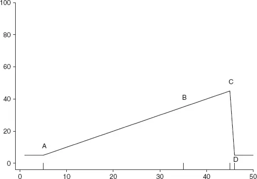

及时识别不连续性——从发散到收敛的变化——对于成功利用灾变运动至关重要。赌注入场时机的统计容错性远低于爆米花运动。灾变回归的相对速度使得迟识别灾变的机会损失远大于迟识别爆米花运动。未能在悬崖边缘之前入场，即图11.5中的C点，本质上意味着错过整个机会。图11.3中看到的爆米花运动则完全不同。迟入场会降低赌注回报，但只是边际性的。建模和交易灾变运动必须体现更高水平的警觉。

## 11.3 趋势变化识别（Trend Change Identification）

关于变点识别（Change Point Identification）有着丰富的统计文献，许多有趣的模型和方法提供了充分的研究空间。我们的目的与之相比虽然平凡，但仍具挑战性。（如果金融数据中的任何模式识别不是如此具有挑战性，我们就不会在这里写作和阅读了。）来自统计过程控制（Statistical Process Control）的一个极其有用的方法依赖于Cuscore统计量（Box 和 Luceno, 1987）。

首先考虑叠加在一个潜在上升序列上的灾变。图11.6显示了一个斜率系数为1.0的基础趋势，以及一个在时间10开始、斜率系数为1.3的灾变运动。让我们看看Cuscore统计量在这个易于理解的例子中如何检测趋势变化。检测趋势变化的Cuscore统计量为：

**图11.6 趋势变化的识别：(a) 梯度1.0在时间11变为1.3；(b) Cuscore

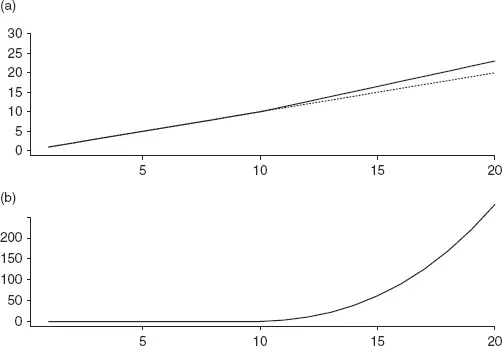

$$ <!-- validate-skip -->
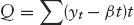
$$

其中 *yt* 是观测序列，β 是常规斜率系数（观测序列每单位时间^(1) 的变化率），*t* 是时间索引。Cuscore 显示在图11.6的下方面板中。尽管看过许多此类时间序列的图表，我仍然对检测统计量以看似神奇的方式揭示并展示变化的不可辩驳证据感到惊叹。斜率从初始值1.0到后续值1.3的30%增加，正如刚才所写的，看起来相当可观。百分之三十接近三分之一，这确实很实质，应该引起我们的注意。但图表产生了非常不同的感知。如果不是虚线延续线，我们很难注意到时间10处线条的弯折。视觉上的不协调太小了。图片可以描绘千言万语，但这里是一个文字比图片更具戏剧性的案例。

Cuscore统计量从常数到指数增长的戏剧性转变高效且有效地恢复了这一局面。那么，当观测值不整齐地落在规定的数学线上时，Cuscore表现如何？图11.7在图11.6描绘的序列中加入了随机噪声（Student *t* 分布，五个自由度，比正态分布尾部更重）。如果斜率增加之前在视觉上就难以辨别，现在实际上已经不可能了。Cuscore统计量表现如何？

**图11.7 带噪声数据的趋势变化Cuscore识别：(a) 时间序列；(b) Cuscore

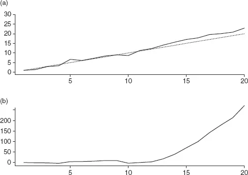

图11.7中的示例比前一幅让我们如此兴奋的图更为戏剧性。肉眼分析在这里几乎没有用处，只会导致眼睛疲劳。相比之下，Cuscore统计量在时间15之前就发出了趋势增加的高概率信号，并在随后一两个周期内达到实际确定性。

### 11.3.1 使用Cuscore识别灾变

在前面的例子中，潜在趋势是恒定的，Cuscore统计量中的系数 β 被设定为已知值1.0。不幸的是，金融序列并非以底层变化率的方便量化形式呈现给我们。我们必须使用原始观测值来工作。完成在价差序列中识别灾变运动的任务，需要在潜在灾变之前指定潜在趋势。乍一想，可能会建议使用[第3章](ch03.md)推荐的EWMA（指数加权移动平均）计算的局部均值。但一旦提出这个建议，几乎立刻就会出现鸡与蛋的困难。局部均值，无论是EWMA还是其他形式，一旦灾变运动开始就会被污染。Cuscore将陷入不可能的境地：检测斜率变化时使用的新旧斜率量化不是新旧量化本身，而是新量化和它自身。需要的是假设没有变化发生时的趋势估计，同时允许变化*可能已经发生。由于潜在变化的时间未知，人们能做什么？

两种简单策略有一定效果。对于存在潜在灾变时的潜在趋势估计，可以使用一段较长时间，比如从可交易价差中灾变运动经验分布的检查获得的多个灾变持续时间的倍数。^(2) 第二种方案是使用通常被认为对所研究序列合理的斜率系数估计，该估计来自EWMA。修正后的Cuscore统计量公式变为：

$$ <!-- validate-skip -->
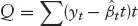
$$

其中
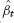
是估计的当前斜率系数。

的推导在附录11.1中给出，其中详细研究了股票价格趋势变化检测的Cuscore统计量。

在操作上，该统计量运行良好，但对于早期灾变运动识别可能存在更优的检测程序。一种可能性（在附录11.1中探讨）是使用滞后局部趋势估计来避免鸡与蛋的问题。由于"已知"灾变运动在开始后五个时间步才能被识别，通过排除至少最近五个序列观测值来估计潜在趋势是合理的。

为什么不将EWMA滞后超过五个观测值，以求"安全"？（技术上说，增加在噪声存在时检测灾变运动的概率，当灾变积累"温和"时。）这是建模者的艺术以及检测器性能特征的问题。在您进行这一研究时，重要的相关考虑因素有：

- 潜在趋势与灾变前兆趋势之间差异的分布是什么？
- 灾变回归幅度的分布是什么？
- 灾变回归的幅度与积累持续时间以及潜在趋势与灾变前兆趋势之间差异幅度的关系是什么？
- 在经济上值得捕获的灾变集合是什么？
- 错误识别灾变的代价是什么？

祝您狩猎愉快！

### 11.3.2 结束了吗？

当价差序列回归到（局部）均值加上随机共振贡献的超出均值部分时，爆米花运动就结束了。灾变运动何时完成？我迄今为止最有效的方法是，在检测到与灾变发展方向相反的尖峰后，使用固定持续时间。如果灾变表现为超过潜在趋势的增长，如前面的例子，那么结束运动的灾变性变化将是突然的下降。

我尚未在统计套利建模的其他领域取得同样成功的答案。无论灾变运动是单次大幅运动还是跨越多个周期的趋势，其开始都通过Cuscore监控揭示。使用第二个修正的Cuscore统计量来认识运动的性质：潜在趋势现在是灾变自身的积累，因此适当的估计基于从估计的灾变开始到最新观测值前一两个周期的区间。Cuscore专门寻找与灾变积累方向相反的尖峰；这里我们允许尖峰持续一两个周期，因此需要从趋势估计中排除最近几个观测值。包括它们会使Cuscore陷入类似于之前描述的灾变开始检测时的不可能境地。

迄今为止在指定赌注退出规则——灾变结束——方面的最大努力，是灾变运动的持续时间和幅度的组合。一个重大危险是等待太久而陷入随后的灾变，这会抵消第一次的收益。在建模和交易规则制定方面有很大的改进空间。

## 11.4 灾变理论解释（Catastrophe Theoretic Interpretation）

算法是公式化的和原始的；与人类意识无法相比。大多数交易者对其模型不一致也不忠诚。算法是愚蠢的一致、缺乏想象力。然而，随着市场中大量算法交互的发生，可能出现从个体算法交互的纯粹分析中无法预测的涌现行为。

考察图11.8所示的灾变曲面（Catastrophe Surface）^(3)。灾变运动——缓慢积累然后突然下跌——是由通过二维空间的连续运动产生的。这两个维度对应于灾变理论术语中的"正常"因子和"分裂"因子。在分裂因子的低水平上，正常因子的变化引起结果曲面的平滑变化。在分裂因子的高水平上，正常因子的运动在两个不同区域产生结果，被一个不连续性——灾变跳跃——所分隔。这种不连续性是不对称的："向上"跳跃和"向下"跳跃在正常因子的不同水平上发生（对于恒定水平的分裂因子）；这被称为滞后（Hysteresis），通常被解释为惯性或阻力。（图11.9展示了灾变曲面的横截面，平行于正常轴，在分裂因子的高水平上，说明了不对称跳跃过程。）

**图11.8 灾变曲面

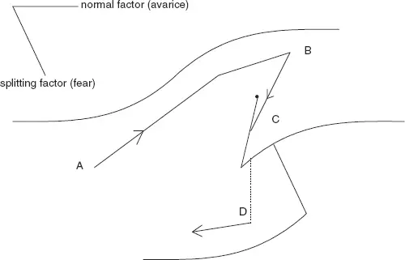

**图11.9 分裂因子高水平上的灾变曲面横截面

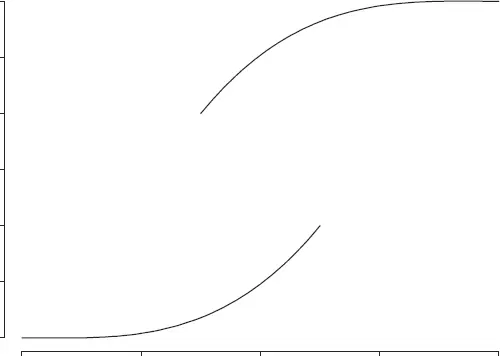

这是经典二维尖点灾变（Cusp Catastrophe）的描述。将其应用于股票价格发展，将"贪婪"（Avarice）对应于正常因子，将"恐惧"（Fear）对应于分裂因子。考虑从A点开始的曲面运动，恐惧水平较低。

价格随着贪婪增加而平滑地向B方向发展。当价格进一步上涨到C（曲面沿分裂因子轴向上倾斜）时，恐惧开始感染参与者。最终，恐惧超过贪婪成为主要关注点，价格快速回落。恐惧的本质是什么？简单来说，价格偏离近期局部趋势的偏离没有基本面支撑，而是由（算法的）过度利用买家的企图所推动。（算法实际上不会体验恐惧，也没有任何体验，它们也不会出于情感或表现情感。请容忍这种不严谨的、非正式的描述性语言：这是一个进行中的工作。我绝没有建立"那个"理论。事实上，正如你所看到的，我仍然在对关于观察到的价格动态底层过程的假设进行适当阐释。）再重复一次，算法没有意识体验。然而，算法确实封装了关于价格运动动态的学习（见[第10章](ch10.md)）、关于通过退出市场可以放弃或获得多少的知识，以及等待。所有这些以及当前市场运动的信息都反馈到一个经过计算的反应中，呈现出恐惧的外观——回落。

恐惧和贪婪因子的描绘代表了参与者——买家、卖家、专家——通过其算法的组合。贪婪轴衡量影响交易者和专家的贪婪最大状态：任何时候最贪婪的情绪主导交互作用和价格运动。同样地，恐惧轴衡量感染参与者的恐惧最大状态。

当专家看到买压时，逐分交易开始。交易算法，通常允许一定的定价空间以完成交易，跟随专家加价。作为回应，专家的贪婪增加，逐分交易继续（可能加速，尽管这里的描述不需要那种程度的精确性）。随着这些交互作用继续，价格被推高，直到交易算法确定是时候暂停买入：基于大量历史数据校准以"预期"完成交易所需的量，冷静的算法表现出圣徒般的耐心。买压缓解。专家的贪婪立即转变为恐惧。如果买家保持沉默且没有生意，维持高价不会产生利润。卖家也分享这种恐惧。价格急剧下跌（相对于上涨而言），以重新激发买家兴趣。

有人可能会问，为什么不平缓下跌？因为对恐惧的反应与满足贪婪不同（无论是害怕卖得太便宜还是买得太贵），尽管有算法。记住算法是由人设计和编码的。耐心。等待显著的下降。因此，没有中间活动，向下的逐分运动加速，在许多情况下被观察为多倍逐分的灾变性下跌。

确信耐心得到了回报，循环再次开始，很可能从比原始运动起点更高的价格开始，因为这些短期灾变回调通常是部分的。热情、贪婪再次迅速积累，价格超越可持续增长路径。意识到来，恐惧，均衡被迅速（即使是暂时地）恢复。

这种算法交互作用的描述以及由此产生的股票价格行为如何与价差相关？直接相关。股票价格以不同速率运动，一直如此。个股的灾变运动自然结合产生价差中的灾变运动。动力学不同，尺度不同。但基本描述是相同的。

## 11.5 对风险管理的启示（Implications for Risk Management）

在成功管理许多统计套利模型时，一个有价值的风险管理工具是所谓的回报门槛率（Hurdle Rate of Return）。模型的预测函数为任何考虑的赌注提供明确的预期回报率。管理者通常指定一个最低回报率，即门槛，赌注必须满足此门槛才能进行，以避免在总体上概率确定亏损的赌注集合。在感知到总体风险增加的时期，通常以实际或预期波动率增加为特征，标准做法是提高门槛。这一预防措施旨在避免在发散仍然强劲时过早进入回归赌注，从而避免初始损失，进而提高回报。这一策略是一个大范围行动，适用于当担忧是总体变异增加而非针对特定市场板块或股票时。（当然，如果有理由如此担忧，该策略可以针对特定市场板块或其他股票集合。）

对于爆米花过程，基本预测函数是一个常数，任何时间的值都可以合理地计算为EWMA（更复杂的建模者也会使用局部趋势分量，取决于利用运动的时间尺度）。当价差弹出时，预期回报计算为价差与预测值之间偏差的一个分数。当预期波动率将增加时，弹出的幅度预期会增加；等待更大的弹出显然是明智的。（缓慢而非突然的波动率增加会被自动管理，反馈到模型的动态重新校准中。我们在这里关注的场景是短期内波动率的足够大幅度增加，超出了自动模型调整的能力。那是风险场景而非普通的演化动态。）关键在于，基于预期的信息无法从数据分析中获得模型的可用性，但它可以由建模者传达。

当考虑灾变运动时，风险考虑——波动率突然的非特定增加——与刚才阐述的有何不同？乍一看似乎没有不同。灾变运动是发散之后的收敛，因此为波动率尖峰重新调整与爆米花（或其他回归）模型同样相关。但进一步反思可能会感到尴尬。自2004年初灾变过程成为局部价格和价差运动的更好描述器以来，市场（和价差）波动率的总体水平处于历史低位（见[第9章](ch09.md)）。当波动率飙升时会发生什么，我们没有任何经验指导。局部灾变运动的重新调整可能是结果。但也完全可能是不同的情况。有一个有力的论点认为，增加的波动率将淹没灾变，当然会削弱在线识别和利用它们的能力，导致爆米花过程的回归。如果算法交互驱动价格动态的假设是并且保持正确的，这种发展是否超出理论上的可想象？什么会导致波动率飙升？当然是人。算法是工具。最终，人驱动着这一过程。我们大部分处于推测的领域。以下是几点进一步的思考：

- 在局部趋势中等待更久：持续时间标准而非预期回报标准。（是否有可以结合的回报预测？）
- 等待更久以获得更大的积累意味着更少的机会*，而灾变反应不变，因为在灾变运动中，反应不是针对均值而是针对一个旧的、不再真正相关的基准水平。

## 11.6 结语（Sign Off）

新范式目前尚处于未成形状态。它实际上是两种范式的混合：随着个股间波动率增加而延续的旧回归范式的变体，以及刚概述的新趋势和反转范式。

传统的个股间波动率驱动的回归博弈可能作为系统性回报来源而重新兴起。利率上升、企业家风险活动增加，或可能是衰退引发的市场突变，是这一潜力的驱动因素。潜力是存在的，但机会的范围将受到限制，回报受到十进制化、耐心的机构交易（VWAP和其他算法）以及简单竞争的结构性影响的制约（[第9章](ch09.md)）。新范式的前景是确定的。然而，它尚未呐喊——也许这种呐喊只有信徒才能听到，就像圣诞老人的雪橇铃声？

## 附录11.1：理解Cuscore（Understanding the Cuscore）

检测趋势变化的Cuscore统计量由工业过程控制领域的统计学家开发，其目标是在过程需要调整时尽快得到警报。一个例子是指定直径的滚珠轴承的生产。目标均值（直径）是已知的。依次抽取滚珠轴承样本并测量，计算平均直径并绘制在图表上。随着时间推移，由于生产机器的磨损，偏离目标均值的情况出现。滚珠轴承直径开始增加。Cuscore统计量的图很快揭示了磨损的开始。（在实践中，样本中直径的范围也会被监控；不同类型的机器磨损造成不同类型的输出变异。）

在工程应用中，如滚珠轴承示例，潜在水平是已知的目标值。因此，在检测趋势变化的Cuscore中，
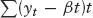
斜率系数 β 是给定的。正如我们在11.3.1节中所指出的，股票价格数据的情况不同。没有可以引导因果机制的目标价格（尽管分析师们满怀希望的预测）。因此，要检测价格趋势的变化，需要一个趋势正在变化的估计。计算趋势被认为是怎样的最新估计——局部趋势估计——是前进的方向。监控局部趋势估计的时间序列本身就提供了关于其中变化的直接证据。

在本附录中，我们考察趋势变化检测Cuscore的详细内容。研究揭示了Cuscore的工作原理以及使用局部估计趋势的固有问题。后者至关重要。关于估计趋势如何影响Cuscore的洞察对于成功实施检测器以及在线利用灾变运动至关重要。没有及时的识别，就没有经济上理想的真正机会。

在图11.10中，线ABC是趋势变化的原型，第一段AB的斜率为0.5，第二段BC的斜率为1.5。虚线BD是线AB的延续。虚线AE平行于线段BC，斜率为1.5。我们将使用这些直线段——假设它们是无噪声的价格轨迹以固定思路，如果这有帮助的话——来展示在寻找趋势变化时，关于潜在趋势的不同假设对Cuscore统计量的影响。无噪声理论模型中结果的知识将指导我们在研究有噪声价格序列时的预期。

**图11.10 趋势变化原型和Cuscore贡献详情

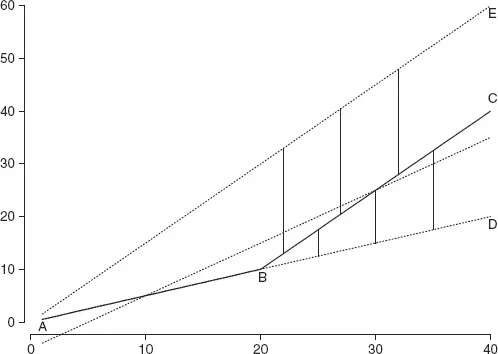

Cuscore，

是观测序列 *yt* 的偏差与假设斜率 β 下的期望值的累积和。在图11.10中，这转化为 *y* 与线段AD之间的垂直距离。第一个观察是，AD上的所有点对Q的贡献为零。如果没有斜率变化，Q恒等于零。

当斜率变化时，观测值偏离基础模型（无变化）下的期望值。沿BC线段的 *y* 值超过BD线段上的期望值，且差值随时间增加。将这些偏差累积到Q中，我们得到图11.11中标记为1的曲线。

**图11.11 β = 0和β = 1的Cuscore

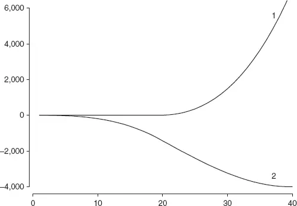

现在假设我们事先不知道线段AB和BC的斜率，或者不知道B点处有斜率变化。相反，假设从A点开始，我们的最佳理解是过程应表现出1.0的斜率，如线段AC所示（未画出以减少杂乱）。Cuscore显示为图11.11中标记为2的曲线。再次，Cuscore的视觉外观令人吃惊。序列偏离假定基础模型——趋势斜率的差异——被鲜明地揭示出来。这第二个例子不仅揭示了变化的发生（Cuscore曲线中的拐点），还揭示了序列开始时的斜率小于假设值，然后切换到大于假设值的斜率的信息。

此时，你可能对接下来的几步有了（一些或更多）预感。

回顾图11.2。前三次灾变运动叠加了一个强劲的正趋势；随后的运动叠加了一个变化的下降趋势。我们如何在操作上、实时地为Cuscore提供合理的机会来从底层、更长期的趋势变化中检测叠加的灾变？

正文中给出的答案是使用局部趋势估计。让我们考察当已知的恒定趋势被局部估计替代时Cuscore的行为。

在图11.12中，EWMA持续低估真实序列；这是移动平均（无论是加权还是其他形式）的一个众所周知的特征，它们并非设计用于预测持续趋势。Cuscore反映了"总是试图追赶"的状态，显示从序列开始就有递增的值。斜率变化被捕获，Cuscore的增长率正在加快，但与使用已知恒定趋势的Cuscore相比，推断强度的建立较慢。滞后问题直接来自斜率变化后使用EWMA。在图11.12中，Cuscore贡献是新斜率与预测旧斜率（垂直差BC-BD）之间的差异，以 *p* − *q* 为例。使用估计水平时，初始趋势AB到BD的投影生成的 *p* − *q* 被EWMA生成的小得多的偏差 *p* − *r* 所替代。这就是鸡与蛋的问题。我们需要将早期趋势投影到变化点之外，而变化点是未知的，以快速检测该变化点！

**图11.12 (a) 使用局部均值的Cuscore贡献和 (b) 使用局部均值的Cuscore

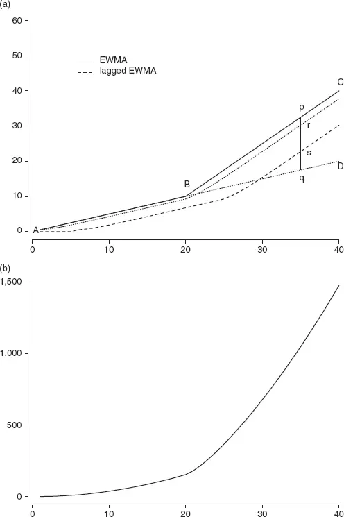

在斜率变化后更新局部均值估计降低了Cuscore检测该变化的敏感性。这表明通过延迟局部均值更新可能恢复敏感性。如果在Cuscore中使用滞后局部均值估计会怎样？回到图11.12，变化后的Cuscore贡献从 *p* − *r* 增加到 *p* − *s*，更接近理想的 *p* − *q*。不幸的是，这种做法并没有消除鸡与蛋的问题；它只是重新安置了鸡舍！虽然变化后对Cuscore的贡献确实更大，但变化前的贡献也更大。因此，准确区分Cuscore曲线中的变化并不更容易：过早发信号可能是常见结果。减少滞后——我们使用了五个周期，因为对价格历史中已识别灾变运动目录的分析强烈表明，大多数具有后续经济上可利用灾变回调的此类运动在运动五个周期时可以被识别——可能有帮助，但一旦我们从无噪声原型转向有噪声的真实数据，情况就回到几乎无望的状态。

我们在数据中寻找的是某种能够快速且一致地在趋势变化后记录实质性变化的东西。在图11.12中，EWMA曲线对趋势变化反应迅速。也许来自EWMA的局部趋势估计可能是一个敏感的诊断工具？图11.13显示了估计的斜率系数，计算为最近四个周期内EWMA的平均变化：

**图11.13 估计的斜率系数，
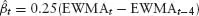

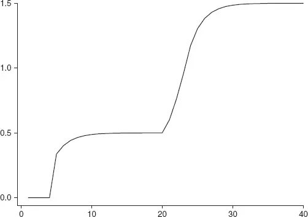

$$ <!-- validate-skip -->
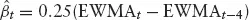
$$

这一估计没有表现出基于EWMA的Cuscore的迟缓性。不幸的是，一旦向原始序列加入即使适度的噪声，斜率系数估计作为敏感诊断工具就会显著恶化，尽管当潜在趋势在除本焦点之外的点上恒定时，更长窗口的敏感性更高，如图11.14所示。

**图11.14 (a) 带噪声的趋势变化；(b) 估计的斜率系数，
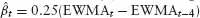

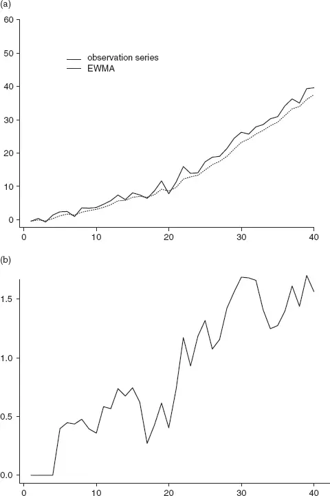

此时我们有两个趋势变化检测的候选者：使用局部均值估计（EWMA）的Cuscore和基于EWMA的局部斜率系数估计，每个看起来都有些希望。Cuscore发出变化信号但迟缓，斜率也发出变化信号但在有噪声数据时同样迟缓。也许将两者结合可以放大结果？两个"迟缓者"会组合出什么？在我们揭晓之前，让我们回顾一下迄今为止检查的Cuscore统计量集合。图11.15展示了本附录中引入的Cuscore统计量集合应用于无噪声趋势变化序列的结果。Q*theo 是初始趋势已知的原始Cuscore。Q*mm 是使用局部均值估计（EWMA）的Cuscore，Q*mmlag 是使用滞后局部均值估计的Cuscore，Q*b1 是使用局部估计斜率的Cuscore，Q*b1*lag 是使用来自滞后局部均值的局部估计斜率的Cuscore，Q*btrue* 是使用实际变化前后斜率系数的Cuscore。这真是大量的Cuscore！

**图11.15 多种模型的Cuscore

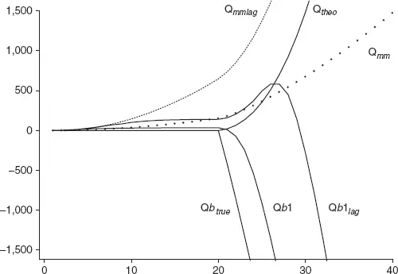

Q*theo 和 Q*btrue* 是我们希望操作性Cuscore尽可能接近的理论基准。Q*b*true* 特别有趣。暂时回到图11.10。Q*btrue* 累积已知线段AB的偏差，因此从 *t* = 1到 *t* = 20的值恒等于零。在 *t* = 21时，我们从旧斜率系数 β = 0.5切换到新斜率系数 β = 1.5，然后开始累积线段

BC上的观测值与线AE之间的偏差，线AE是新的基础模型，假设从一开始就具有梯度 β = 1.5。

AE平行于BC（两者梯度均为 β = 1.5），因此Q的增长是线性的，因为偏差是恒定的。这与标准Cuscore形成对比，在标准Cuscore中，各个偏差依次增加（排除噪声），因此累积和增长快于线性（Q*theo）。*Qbtrue* 相对于 Q*theo* 具有初始优势，因为偏差一开始就很大，因此检测变化的速度更快。这种优势是两个梯度相对大小和累积时间原点——线段AB持续时间——的函数。在我们识别灾变的任务中，变化前持续时间越长，输入Cuscore的偏差（AE-BC）越大，相对于标准Cuscore的初始优势越大，因此可能越早识别趋势变化。在实际灾变识别中，有噪声的理论基准样本版本中，Q*b1 还是 Q*mm 占主导，取决于灾变和前兆时期的动态。

之前我们指出Q*theo 和 *Qbtrue* 是我们希望操作性Cuscore尽可能接近的理论基准。值得注意的是 Q
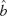
，我们"两个迟缓者的乘积"Cuscore，在无噪声数据中达到了令人印象深刻的接近标准。这怎么可能？这是因为观测值与估计局部均值之间更大的偏差（因为EWMA在持续趋势下的滞后表现）被变化后更大的估计斜率所乘。Cuscore的功效与其说是两个迟缓者的结果，不如说是两个增强的偏差聚焦于特定类型变化的结果。这个方案对价格数据真的有效吗？看看图11.16然后自己判断。然后想想如何检测趋势的下降。

**图11.16 有噪声数据的Cuscore

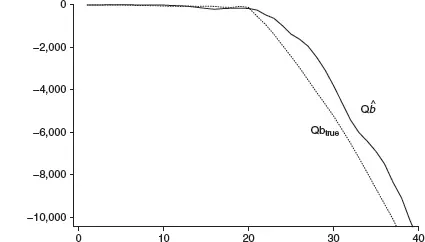

本附录的呈现相当非正式。关于动态建模和变化识别的严格处理，请参见Pole等, 1994。在该参考文献中，线性增长模型提供了局部均值和趋势（增长）的明确参数化、参数估计和预测的动态更新，以及参数（在我们的情况下是斜率）变化的正式统计诊断。DLM的标准分布假设严格来说不适用于股票价格数据，主要是因为（归一化的）价格和回报分布的显著非正态性。尽管如此，如果对形式采取稳健的观点，专注于均值估计，使用标准差作为不确定性的指南，完全不依赖正态性（所谓的线性贝叶斯方法，Linear Bayes），这些模型是有用的。

祝灾变狩猎愉快！

> ^(1) 参数变化模型的适用范围远不止这里关注的时间索引序列。空间模型（观察序列由地理位置而非时间顺序索引）在许多科学领域都有应用，从地质学到地震学（通常同时具有时间和空间索引）再到生物学（EEG读数在头部形成特定模式以及每个位点的特定时间发展）。在股票价格分析中，按交易量索引被用于交易算法（见[第10章](ch10.md)）和一些统计套利者。

> ^(2) 在历史数据中识别灾变运动比在线识别简单得多。任何候选运动都可以在被分配分类并用于研究识别和特征规则之前，通过后续数据确认。在线决策必须在确认之前做出，并且交易决策也必须在确认可能之前采取。当然，确认最终是可能的，但那是在已经盈利或亏损之后。

> ^(3) 我选择将新的回归模式称为灾变过程（Catastrophe Process），而不是爆米花2或其他标签，因为它朗朗上口，确实捕捉到了与名称所暗示的以及爆米花过程所展示的相当不同的运动动态。投资者行为解释模型的发展——可能代表新风格运动为何发生——与这些运动的描述和利用是分开的。算法与算法交互以及交易算法日益普及和使用以替代直接人类行为的基本要素是无可争议的。它们是观察到的事实。股票价格历史也是不可辩驳的事实。我在这些历史中辨别出的模式是有争议的：我能够展示的任何例子中都有大量噪声。

> 为利用爆米花和灾变过程所代表的动态而构建的交易模型具有不可否认的业绩记录。这是模型有效性的存在性证明，支持模式描述的有效性，但它并不证明任何关于模式为何如此的理论。爆米花过程已经确立很久并在多个频率上被广泛利用，以至于其合理性并未受到太多关注。在旧模式（在经济利用方面）失败的背景下出现的新模式也不*需要合理化。如果它持续存在并且统计套利者开始发现它并产生可观的回报，投资者将再次经历从怀疑（害怕损失）到希望（贪婪）的灾难性转变。

> 虽然灾变回归现象的兴起不需要合理化，但理解驱动新动态的市场力量以及这些力量如何交互并可能产生涌现模式的连贯、合理的理论，对于在形成期促进无偏的批判性关注是必要的。正文中提出的简单灾变理论模型作为一种可能的方式来理解最近引入并随着旧行为和交互被替代而日益增长影响力的已识别市场力量。灾变模型是对当前已知内容的合理表示，但它不是可以进行预测的形式化模型。V. I. Arnold在《灾变理论》中尖刻地评论道："关于灾变理论的文章以对严格性和发表结果的新颖性要求的急剧和灾难性降低为特征。"您已被警告。

> Arnold进一步评论道，"在大多数严肃应用中……结果在灾变理论出现之前就已经知道了。"在我们的语境中，尽管Arnold写作以来已过20年，其强烈暗示是，即使所提出模型的表示和解释是有效的，使用灾变理论以外的工具构建可能更好（更严格、更有说服力）。事实上，我正在进行使用博弈论工具建模交易算法交互的研究。这项工作处于太早期的开发阶段，无法在此报告。最后，再次引用Arnold的话，"在应用于股票市场参与者行为理论时，如同原始前提一样，结论更多具有启发性意义。"我的前提不仅仅是启发性的——算法与算法的交互、算法日益占据主导地位以及直接人类交互的消除，以及从股票价格数据历史中辨别出的模式可供任何人查询。尽管如此，将市场参与者行为的灾变模型视为启发性的完全正确。按照Arnold的语调，我建议将该模型描述为*蝌蚪定理（Tadpole theorem），明确意图是它只是一点点Pole！统计套利

Bibliography

Arnold, V.I. *Catastrophe Theory*. New York: Springer-Verlag, 1986.

Bollen, N.P.B., T. Smith, and R.E. Whaley (2004). "Modeling the bid/ask spread: measuring the inventory-holding premium," *Journal of Financial Economics*, 72, 97–141.

Bollerslev, T. (1986). "Generalized Autoregressive Conditional Heteroskedasticity," *Journal of Econometrics*, 31, 307–327.

Box, G.E.P., and G. Jenkins. *Time Series Analysis: Forecasting and Control*. San Francisco: Holden-Day, 1976.

Box, G.E.P., and A. Luceno. *Statistical Control by Monitoring and Feedback Adjustment*. New York: John Wiley & Sons, 1987.

Carey, T.W. Speed Thrills. *Barrons*, 2004.

Engle, R. (1982). "Autoregressive Conditional Heteroskedasticity with Estimates of the Variance of United Kingdom Inflation," *Econometrica*, 50, 987–1,008.

Fleming, I. *Goldfinger*. London: Jonathan Cape, 1959.

Gatev, E., W. Goetzmann, and K.G. Rouwenhorst. "Pairs Trading: Performance of a Relative Value Arbitrage Rule," *Working Paper 7032*, NBER, 1999.

Gould, S.J. *The Structure of Evolutionary Theory*. Cambridge: Harvard University Press, 2002.

Huff, D. *How to Lie With Statistics*. New York: W.W. Norton & Co., 1993.

Institutional Investor. "Wall Street South," *Institutional Investor*, March 2004.

Johnson, N.L., S. Kotz, and N. Balakrishnan. *Continuous Univariate Distributions, Volumes I and II*. New York: John Wiley & Sons, 1994.

Lehman Brothers. *Algorithmic Trading*. New York: Lehman Brothers, 2004.

Mandelbrot, B.B. *Fractals and Scaling in Finance: Discontinuity, Concentration, Risk*. New York: Springer-Verlag, 1997.

Mandelbrot B.B., and R.L. Hudson. *The (Mis)Behavior of Markets: A Fractal View of Risk, Ruin, and Reward*. New York: Basic Books, 2004.

Orwell, George. *1984*. New York: New American Library, 1950.

Perold, A.F. (1988). "The Implementation Shortfall, Paper vs. Reality," *Journal of Portfolio Management*, 14:3, 4–9.

Pole, A., M. West, and J. Harrison. *Applied Bayesian Forecasting and Time Series Analysis*. New York: Chapman and Hall, 1994.

Poston, T., and I. Stewart. *Catastrophe Theory and its Applications*. London: Pitman, 1978.

Schack, J. (2004). "Battle of the Black Boxes," *Institutional Investor*, June 2004.

Sobel, D. *Longitude*. New York: Penguin Books, 1996.
