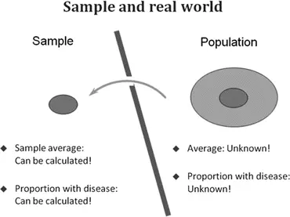

# 1. 数据收集

Birger Stjernholm Madsen¹ (¹)诺维信公司，巴格斯韦德，丹麦 本章解释统计学中的一些基本概念。同时，我们还将探讨调查中收集数据的最重要方法，并阐明抽样调查与计划实验之间的区别。统计学可以定义为在规划数据收集以及后续分析和呈现数据时所使用的一系列技术。早在古代，人们就需要了解人口规模，以便进行军队普查或计算预期税收。"Statistics"一词源于拉丁语"status"；而正是社会状况成为了最早统计学的主题！后来，概率论（与博弈相关！）、人口学和保险科学成为统计思维至关重要的领域。在当今的数字时代，收集、处理和传播数据都变得容易，因此统计学被广泛用于社会各领域的各种调查。大多数统计调查可分为以下几个阶段：1. 概念澄清 2. 数据收集规划 3. 数据收集 4. 数据分析和呈现 5. 结论 统计方法（以及统计学家！）在调查的第2和第4阶段尤为有用。统计学有两种类型：
- 描述性统计
- 推断性统计

描述性统计是指使用表格、图表以及简单的统计计算（如平均值、百分比等）来描述数据。这是许多人对"统计学"一词的理解。古代产生的也正是这类统计学。

推断性统计用于评估数据中的差异和关系。例如，我们可以检验一组人的身高与体重之间是否存在关系；或者男孩与女孩的身高之间是否存在差异，并估计这种差异有多大。推断性统计是一门基于概率论的数学学科。它是一门相对较新的学科，在整个二十世纪得到了发展。本书涉及描述性统计和推断性统计两个方面。在实践中，两者都需要。推断性统计是一个非常庞大的主题，我们在此只能触及皮毛（特别参见第5、7和8章）。如果你想了解更多关于推断性统计的内容，请参阅文献列表中更高级的书籍。

## 1.1 抽样调查

在任何调查(*)中，我们收集整个总体(*)（全体调查）或样本中相对少量个体(*)（抽样调查）的信息，以分析和呈现数据。我们关注的是所有个体的总体。只调查样本的优势在于，它比调查整个总体更快、更便宜。在某些情况下，精心规划的抽样调查甚至比规划不佳的全体调查结果更准确！我们调查样本中的个体是为了研究整个总体！这意味着样本为我们提供了总体特征(*)的估计值（图1.1）。

图1.1 样本与总体

特征示例：
- 个体可测量属性的平均值(*)，例如身高
- 属于特定类别（例如有某种爱好）的个体百分比

样本越大，对总体的估计就越好！

同样重要的是样本要能代表总体。在实践中，这意味着随机选择样本中的个体，以覆盖整个总体。我们将在[第6章](ch06.md)更详细地讨论抽样(*)。

根据具体情境，样本（和总体）可能由不同类型的个体组成。一些示例：
- 人
- 公司
- 公共机构
- 家庭
- 凭单
- 房屋
- 汽车
- 树木
- 狗
- 细菌菌落
- 瓶装或罐装啤酒
- 药片
本书中的概念适用于所有类型的样本。示例主要以人群为样本，但其原理适用于所有类型的样本。以人群为样本的典型应用包括：态度分析、消费、耐用品、兴趣与爱好、饮食习惯、交通、出行、度假、媒体（电视、广播、报纸）以及某些敏感话题，如饮酒。抽样调查具有很高的灵活性：在同一调查中可以同时涵盖媒体消费、出行模式和态度等方面的问题。抽样调查也广泛应用于商业调查中，例如电话访谈。抽样的一个重要应用是统计质量控制领域的抽样检验。如果你从事统计质量控制工作，本书的大部分内容都与你相关。我们在本书[第 4 章](ch04.md)中介绍了一些统计质量控制方面的主题。关于统计质量控制的书籍，请参见参考文献列表。

## 1.2 Fitness Club：抽样调查示例

本示例是一个虚构的调查，将作为后续章节的示例。Fitness Club 拥有多种运动设施，包括力量训练、减重和有氧运动设施。Fitness Club 希望了解其年轻客户（12–17 岁的青少年）的需求。该俱乐部想知道这些青少年对运动设施的满意程度，并希望获取有关他们健康状况的信息，以便更好地针对各种训练类型定制运动设施。因此，在使用该运动设施的青少年中开展了一项抽样调查。我们将在后面讨论如何组织这项调查，并展示一些调查结果。总体由使用 Fitness Club 运动设施的青少年组成，个体是单个青少年，样本包含 30 名青少年。与该示例相关的一些数据见本书[第 9 章](ch09.md)的附录。

## 1.3 实验

在某些情况下，所需的信息根本就不存在！这时，我们可以规划（或设计）一个实验（*），目的是提供相关数据。在实验中，我们测试一个或多个因素对测量结果的影响。这种方法广泛应用于技术和工业领域。在这些情况下，总体并没有明确定义。实验可能产生截然不同的结果，具体取决于其设计方式。尽管如此，在这种情况下谈论样本也是有意义的。我们可以将实验结果视为在所有类似实验中可能获得的（无限多个）可能结果的一个样本。用于分析和展示数据的统计技术大体上是相同的，无论数据是通过抽样调查还是实验收集的。实验规划中的特殊技术本书不予讨论，限于篇幅无法涵盖。关于这一主题有大量书籍，请参见参考文献列表。

## 1.4 实验：一个示例

为了说明抽样调查与实验之间的区别，我们给出一个规划实验的示例。一家软饮料生产商想要推出一款采用全新风味原料配比的新产品。他不确定如何平衡风味原料与碳酸和糖的比例，因此进行了一项实验，测试原料的不同组合。生产商列出他预计使用的三种原料的最低添加量和最高添加量，然后制定实验方案。他对三种原料八种可能组合中的每一种都制作了几瓶产品（表 1.1）。

**表1.1 Data from experiment**

|FlavorCarbonateSugarRating|
|---|
|1113.1|
|---|
|1123.2|
|---|
|1213.6|
|---|
|1223.6|
|---|
|2115.1|
|---|
|2124.6|
|---|
|2214.8|
|---|
|2225.3|
这里"1"表示添加"少量"配料，而"2"表示添加"大量"。一个由十人组成的品尝小组品尝所有瓶子并评分。他们使用1–7分量表，4表示"既不好也不坏"，1表示"异常差"，7表示"异常好"。每种组合的平均评分显示在表格的最后一列。随后，制造商研究了实验结果。他观察到，四种含"高"量香精的组合评分优于四种含"低"量香精的组合。高香精含量的四组平均评分为4.95，而低香精含量的四组平均评分仅为3.38。因此，似乎需要添加大量香精。但通过计算其他平均值，他发现碳酸盐和糖的添加量并不那么重要。因此，他选择添加中等剂量的碳酸盐和糖。这类实验在工业中被广泛使用，但在市场营销（如本例）和社会科学中同样可以应用。

## 1.5 数据收集

我们已经了解了抽样调查与计划实验之间的区别。下一章将展示如何呈现抽样调查或实验的结果。但在此之前，我们先了解数据是如何收集的。本书的大部分内容描述了可适用于所有类型总体的一般技术。由人类组成或涉及人类的总体，可能是本书大多数读者最感兴趣的内容。因此，本章剩余部分将讨论数据收集方法、问卷设计，以及针对由人或涉及人的总体（例如企业、机构或家庭总体）进行调查时可能出现的各种误差来源。如果你的总体不属于这一类型，可以跳过本章剩余部分。但无论你处理的是何种类型的总体，本书其余部分都将对你有所帮助。

## 1.6 登记册

在计划抽样调查之前，应始终检查所需信息是否已存在于数据库中。由人员组成的数据库通常被称为登记册。绝大多数企业、机构和组织都拥有一个或多个包含"业务数据"的数据库，例如会员数据库、客户数据库等。这些数据库包含每个人的信息量因组织而异。如果登记册中包含所需信息，那么生成所需的统计结果通常相对简单——这仅仅是对已为行政目的收集的数据进行再利用。这一过程通常针对整个总体进行，因为对登记册中所有个体进行调查并不比仅对其中一部分样本进行调查困难多少。因此，登记册调查几乎总是全面调查。简而言之，当所需信息以适当形式存在且你有权访问时，应使用登记册。反之，当登记册不存在、不充分或无法访问时，则应使用抽样调查。如果登记册不包含所需信息，它通常可以用作选择样本的基础。有时，登记册调查会与抽样调查结合使用：登记册提供部分所需信息，其余信息通过抽样调查获取。登记册调查的例子在社会科学的许多研究项目中都能找到。人们可以将行政登记册中的信息用于多种目的。许多国家的国家统计机构都有权访问这些登记册，从而提供关于整个国家的宝贵信息。

## 1.7 问卷调查

问卷调查涉及三方：

- 研究者：负责设计问题。
- 访问员：负责提出问题。
- 受访者：负责回答问题。

问卷调查结果的有效性取决于研究者是否以确保访问员与受访者有效沟通的方式来设计问题。主要有两种类型的问题：

### 1.7.1 背景问题
这些可能是性别、年龄、婚姻状况、住房类型、居住地、教育程度、职业、年收入等。这些问题用于在表格和图表中对结果进行分组。例如，你可以创建表格，研究某个问题的答案在不同群体（如年龄组）中的分布。更多内容请参见[第2章](ch02.md)和[第5章](ch05.md)。

### 1.7.2 研究问题

它们构成了问卷的主体。几个例子：(a)你支持还是反对核能？(b)你上周有工作吗？(c)你去年住了几晚酒店？(d)你上个月的收入是多少？(e)你认为首相工作做得好吗？

区分封闭式问题和开放式问题非常重要：

1. 封闭式问题的类型是：你受过什么教育？
   - 小学教育
   - 学徒/技术教育
   - 中学教育
   - 高等教育
   换句话说，类别数量有限（通常只有两个，例如是/否）。优点是后续数据处理容易，因为无需对回答进行"重新编码"。缺点是受访者可能找不到正确的答案选项。

2. 开放式问题的类型是：你受过什么教育？受访者有机会自由填写任何文本。优点是受访者总有答案可选。缺点是后续数据处理繁琐且耗时：需要具备专业知识的人员将自由文本"编码"为明确定义的类别。

3. 半封闭式问题的类型是：你受过什么教育？
   - 小学教育
   - 学徒/技术教育
   - 中学教育
   - 高等教育
   - 其他：______
   这只是一个带有"其他"类别并附有自由文本填写机会的封闭式问题。它结合了封闭式问题和开放式问题的优点。

问卷中的许多问题都表达了一种评估。有一些有序的回答类别。例如：你觉得这门课程怎么样？
- 非常好
- 好
- 不好不坏
- 差
- 非常差

这类问题的类别数量是一个备受讨论的话题。共识是类别数量不应太多，也不应太少！大约三到七个类别可能是最好的，五个答案类别也许是最常用的。另一方面，许多人更喜欢偶数个类别。这是基于一种观点，即奇数个类别（例如5个）会鼓励受访者选择中间类别，因为这样最方便。因此，许多人更喜欢四个或六个答案类别。

导引性问题时不时会被使用，特别是在复杂议题中，受访者需要被"引导"到主题上。非常重要的是要小心这些问题的措辞，否则你有可能产生偏见（"诱导性问题"）。影响受访者的风险实在太大了。例如在民意调查中，就有几个这样的例子。故意引导受访者以提供特定答案（希望是）罕见的例外，尽管它确实存在。

控制性问题用于确保受访者理解了问题并诚实地回答，例如在非常复杂和敏感的问题中。因此你会以新的措辞问"同样"的问题。或者你会问一个补充问题，这可能会揭示研究中一些关键问题的答案。例如在一项调查中，人们被问及他们前一天的饮酒量：随后问了以下控制性问题：你通常喝得更多、一样还是更少？答案的分布见表1.2。

表1.2 控制性问题

|MoreApp. 10 %|
|---|
|The SameApp. 50 %|
|---|
|LessApp. 40 %|
受访者均匀分布在一周中的每一天和一年中的所有月份！因此，正常情况下饮酒量较多和较少的人数应该大致相等。但事实并非如此，因为受访者希望显得自己饮酒不多。这可能表明受访者没有如实回答！

非常重要的是不要问太多问题！

人们倾向于出于"好奇心"而问很多冗余问题。这会令受访者感到厌烦，并增加受访者跳过最后几个问题的风险。而那些问题可能恰恰是关键所在！问卷的一个基本要求是确保沟通清晰，即使用简单明了的表述。保持简洁！

重要的是，研究者在设计问题时应设身处地为受访者着想。请记住，受访者并非专家！如果问卷结果需要与其他问卷结果进行比较，则必须注意确保可比性。这意味着你要提出相同的问题，并使用与其他调查相同的答案类别。始终记住要一次只问一个问题。人们可能会想把两个问题合并在一个问题中，但结果往往不理想。现实生活中的一个例子是以下问题：你购物是
- 独自一人？
- 与他人一起？
- 从不购物？

在这里，研究者涉及两个问题：(a) 受访者在家庭购物中承担的比例是大还是小。(b) 受访者购物时是独自一人还是与他人一起。

结果是，许多男性回答"独自一人"，因为他们为自己买东西，例如在报刊亭。另一方面，许多女性回答"与他人一起"，因为她们在超市购物时会带着孩子。该问题的目的是识别家庭中负责大部分购物的人。在少数人身上测试问题总是一个好主意，以确认问题是否被理解并能无问题地回答。受访者可以是"朋友和亲戚"！这样的研究（称为预调查）可以在为时已晚之前发现许多问题。

## 1.8 调查中的误差来源

无论通过问卷收集数据的方式如何，都可能出现问题，在最坏的情况下可能会显著影响结果。可能存在来自问题措辞的误差以及来自数据收集的误差。

调查中的许多误差来自问题的措辞问题。这可能包括：
- 问题不清晰。
- 人们无法或不愿回答，他们不知道等。
- 对受访者的无意识影响，例如与"开场问题"相关。

这些误差只能通过仔细的问题措辞来避免！

无回答(*) 是另一个主要问题。这意味着一些受访者没有参与调查。这可能是由于数据收集中的问题。无回答可能导致调查结果具有误导性！

例如，通常很难（无论是通过电话访谈还是上门访问）接触到"忙碌的商人"，他们很少在家（每周工作时间超过平均水平）。如果你没有努力接触这一群体，调查结果显然会"失衡"。

无回答的两个最常见原因是：

- 人们不在家，或无法联系到（通过电话访谈或上门访问）。
- 拒绝：人们可能干脆忽视任何接触尝试。
          无法联系到受访者的唯一解决方法是进行多次联系尝试（电话、上门等）。通常，如果希望提高应答率，应在周末和工作日、白天和晚上都进行尝试。这意味着至少需要四次联系尝试，这当然成本高昂……随着越来越多或多或少可疑的营销公司的出现，每个家庭接到的电话数量不断增加，拒访问题日益严重。人们实在是受够了！这个问题当然无法完全避免，但可以设法减少：
- 首先，对访员进行适当培训非常重要，这样他们才能更好地应对"难缠"的受访者。
- 也可以为受访者提供奖励（例如彩票）来参与调查。
- 结合多种数据收集方法（例如电话访问和上门访问）也能提高应答率。不过，这同样会增加成本。

## 1.9 比较数据收集方法

调查中主要的数据收集类型有：

- 互联网、电子邮件或其他电子数据收集方式（例如手机短信）
- 邮寄纸质问卷
- 电话访问
- 面访（"上门"或"面对面"访谈）

在选择数据收集方法时，显然需要同时评估成本和质量。通常，成本和质量之间存在关联！上面的列表大致按成本和质量的递增顺序排列。因此，互联网或电子邮件问卷成本低廉，而面访则成本高昂。质量在很大程度上取决于无应答率，即不参与调查的受访者比例。互联网或电子邮件方式的无应答率相当高；而面访方式的无应答率则低得多。数据中的误差也是一个质量问题。传统的邮寄问卷无法像其他数据收集方式那样在访问过程中纠正错误。前两种数据收集方法在没有访员的情况下进行，而后两种方法则有访员在场。在后两种数据收集方法中，访员与受访者之间的互动既有优势也有劣势，这些都会影响质量：
- 优势：如果受访者对问题的含义有疑问，访员可以提供帮助。这可以减少未回答（或回答"不知道"等）的问题数量。
- 劣势：访员可能会无意识地影响受访者的回答方向。这种风险在面访中最大，但可以通过对访员的仔细培训来最小化。
选择数据收集方法的另一个关键因素是问卷的长度，即问题的数量。

前两种数据收集方法不应使用于非常长的问卷，因为受访者的（缺乏）耐心往往意味着"不太认真"的（或根本没有！）回复。后两种数据收集方法涉及访问员与受访者之间的直接接触。如果受访者变得不耐烦，有才华的访问员可以利用这一点。需要考虑的另一个因素是"预览"的可能性。在面对面访问中，可以展示不同的视觉效果，帮助受访者理解复杂的问题。在电话访问中，可以在访问过程中播放音频文件。在邮寄问卷中，可以展示纸质图片。最后，在互联网访问中，借助现代技术，"几乎一切"都成为可能。

你通常会结合使用两种数据收集方法。

一种收集方法（通常是电话）用于大部分访问。催访时则使用第二种数据收集方法，例如面对面访问。经验丰富的访问员能更好地说服受访者参与调查。这有助于获得更高的应答率。此外，这还可以评估在第一轮中回答与未回答的人之间是否存在结果差异，从而提供关于调查结果效度的信息。

## 1.10 示例（续）

健身俱乐部拥有所有客户的登记册。该登记册包含联系信息（姓名、地址等）以及所有客户的性别和年龄信息；这使得从中抽取12–17岁年龄组的客户样本进行调查变得容易。我们将在[第6章](ch06.md)讨论抽样过程。健身俱乐部选择向所有选定的客户邮寄问卷。这是一个相对便宜的解决方案。一个缺点是，关于健康等问题是由受访者主观回答的。这确实是大多数问卷调查的共同特点！另一个缺点是此类调查通常会导致较高的无应答率。为了减少这一问题，健身俱乐部附上了一个贴好邮票并写好地址的回邮信封。此外，回答问卷的客户将参与抽奖，有机会赢得智能手机和其他电子设备，这些对这个年龄段的孩子特别有吸引力。

数据展示 © Springer-Verlag Berlin Heidelberg 2016 Birger Stjernholm Madsen Statistics for Non-Statisticians 10.1007/978-3-662-49349-6_2
