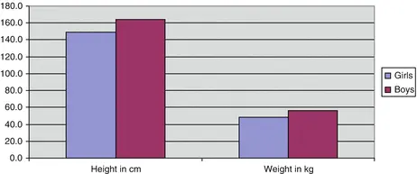
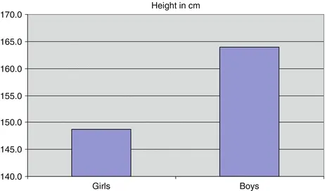
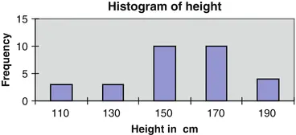
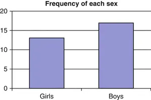

# 2. 数据的呈现

Birger Stjernholm Madsen1 (1)Novozymes A/S, Bagsvaerd, Denmark 本章将展示如何使用图表和表格来呈现问卷调查的结果。图表（如柱状图、折线图等）适合帮助我们感知数据中的模式、结构、趋势和关系，因此是统计分析中不可或缺的补充工具。它们也是发现异常数据值（如极大或极小的数值）或数据值组合（如一个很高但体重很轻的人）的有用工具，这些异常值可能是数据中的错误。使用电子表格软件（如 Microsoft Excel 或 Open Office Calc）可以轻松创建图表。这里仅介绍主要的图表类型。实际存在的图表类型远多于此处展示的。请查阅电子表格的"帮助"菜单了解全部功能！表格是另一种呈现数据的方式，本文也将简要讨论。

## 2.1 条形图

条形图对大多数人来说并不陌生。它们能够以清晰直观的方式，便捷地汇总表格中的信息。让我们以"健身俱乐部"调查中的一个例子来说明。由于年轻客户的一个关注点是减肥，因此按性别分类的平均身高和体重表格就很有意义。其表格形式如表 2.1 所示。表 2.1 平均身高与体重

|SexAverage|
|---|
|Height (cm)Weight (kg)|
|---|
|Girls148.848.2|
|---|
|Boys163.956.4|

对应的条形图如图 2.1 所示。图 2.1 平均身高与体重

我们一眼就能看出，男孩比女孩略高一些、略重一些。众所周知，这种图表可以通过操纵坐标轴来"造假"。如果我们暂时只考虑（平均）身高，其图形形式可能如图 2.2 所示。图 2.2 平均身高

这张图表包含了与上面图表相同的男女身高信息。然而，大多数人看到这张图表会产生错误的印象——男孩似乎比女孩高得多，这是因为条形图的底部被截断了！因此，无论是研究条形图还是构建条形图时，注意坐标轴都是非常重要的。

## 2.2 直方图

直方图（*）是一种特殊的条形图。它展示数据值的频数（*）：你可以直观地看到数据值的分布情况，例如"中心"在何处（即数据值大量聚集的地方）、"散布"程度有多大等。如果对身高数据值进行排序和分组[参见（[第 9 章](ch09.md)）中的数据]，就可以得到表 2.2。表 2.2 区间计数

|In the interval from (but not including)Up to and includingNumber of kidsInterval center|
|---|
|100120 3110|
|---|
|120140 3130|
|---|
|14016010150|
|---|
|16018010170|
|---|
|180200 4190|

也就是说，在（略高于）100 到 120 厘米的区间内，共有 3 名孩子。区间的划分当然必须互不重叠。因此，每个区间只能包含一个端点。第一个区间的中心是 110 厘米。频数的计数可以手动完成，也可以让 Microsoft Excel 来完成：使用"数据分析"加载项菜单，其中有一个"直方图"菜单项。Open Office Calc 中没有此功能。将表中的频数数据绘制成条形图后，如图 2.3 所示。图 2.3 直方图

在确定条形数量和条形宽度时，需要遵循的一般考虑事项包括：
- 图形应适合纸张（或屏幕）大小。
- 图形应能容纳所有观测值。注意最小值和最大值。
- 图形不应"歪曲"数据材料。例如，如果分布中有两个明显的"凸起"，不要使用过少的条形，以免丢失这一重要信息！
- 区间必须明确定义。对于观测值应属于哪个区间，不应有任何疑问。必须明确区间的端点归属。
- 应能将此图表与其他图表（例如以往调查的图表）进行比较。
第一个决定是：应该使用多少个条形？

- 直方图通常应有 3–13 个条形。
- 观测值越多，条形数量越多。

作为粗略指南，可以使用表 2.3。

**表 2.3** 条形数量

|No. of valuesNo. of bars|
|---|
|10 3|
|---|
|100 7|
|---|
|1,00010|
|---|
|10,00013|

在"健身俱乐部"示例中，观测值数量为 30。条形数量应在 3 到 7 之间，因此 5 可能是一个相当不错的选择。

**技术说明**

- 要确定条形数量，可以使用以下公式：

  

- 这里 n 是观测值数量，log 是对数函数（可使用计算器或电子表格进行计算）。可以使用以 10 为底的对数或自然对数；公式的结果是相同的。
- 在"健身俱乐部"示例中，n = 30。这里使用以 10 为底的对数：

  

下一个问题是：条形应该有多宽？确定了条形数量后，可以轻松找出每个条形必须有多宽：

1. 区间长度 = (最大值 − 最小值)/(条形数量)。
2. 如有必要，将结果四舍五入到适当的数值。

对于身高数据，最大值 = 198 cm，最小值 = 112 cm。计算得 (198 − 112)/5 = 17，可四舍五入为 20。前面提出的分类似乎能相当好地描述数据。有时你会看到条形不等宽的直方图。应该绝对避免这种情况，因为读者难以解读。例如，无法立即清楚如何缩放 Y 轴。是否应考虑视觉印象？如果条形更宽，条形高度应该更小。然而这意味着 Y 轴上的读数不易直接解读。

应该只使用等宽条形的直方图！

## 2.3 饼图

饼图常用于显示每个组在"饼"中占多大份额。这可用于频数数据（相当于直方图），但饼图也常用于经济量，如支出或收入。样本中女孩和男孩数量的频数表如表 2.4 所示。

**表 2.4** 各性别频数

|SexNumber|
|---|
|Girls13|
|---|
|Boys17|

该信息可以用条形图（图 2.4）或饼图（图 2.5）以图形方式展示。

**图 2.4** 条形图

**图 2.5** 饼图

两个图表给出了相同的信息！如果像本例中只有少数几个组，很多人认为饼图是最具说明性的图表。饼图还有一个优点，就是你无法像在条形图中那样"作弊"——条形图可以截断坐标轴的一部分。当组数超过六到七个时，条形图可能最合适。

## 2.4 散点图

散点图非常适合展示两个变量之间的关系。在"健身俱乐部"示例中，我们假设身高和体重之间存在关系：孩子越高，体重越重。散点图如图 2.6 所示。

**图 2.6** 散点图
体重是 Y 变量（因变量）。身高是 X 变量（自变量）。我们认为体重取决于身高，即存在"原因"和"结果"。在其他情况下，选择哪个变量作为 X 和 Y 则更为随意。我们仅仅认为两者之间存在某种关系（或相关性），而不一定存在"原因"和"结果"。[第 7 章](ch07.md)提供了用于探究身高和体重这两个变量之间是否存在统计相关性的工具。另一方面，我们无法通过统计方法或研究图表来确定是否存在"原因"和"结果"。然而，我们经常可以在报纸上看到这样的结论：研究某个图表就得出了 X 是"原因"、Y 是"结果"的结论。

## 2.5 折线图

折线图常用于展示趋势，其中 X 变量通常是时间、年龄或资历等。在"健身俱乐部"的例子中，我们希望展示孩子们的平均体重如何随年龄增长而变化。数据如表 2.5 所示。Table 2.5 体重与年龄

|AgeAverage weight|
|---|
|1248.40|
|---|
|1350.00|
|---|
|1449.50|
|---|
|1561.75|
|---|
|1656.50|
|---|
|1766.00|

我们可以用折线图来展示这一点，如图 2.7 所示。Fig. 2.7 体重与年龄

该图表明，体重可能随年龄增长而有所增加。与柱状图一样，注意坐标轴也很重要。同样的信息也可以如图 2.8 所示的方式呈现。Fig. 2.8 体重与年龄

现在视觉外观大不相同！看起来体重随年龄增长而急剧增加。

## 2.6 气泡图

气泡图是散点图的一种变体。它不是绘制点，而是绘制气泡。每个气泡的大小（面积或直径）代表第三个变量的值。

让气泡的面积与第三个变量的值成正比可能是最"公平"的做法，因为面积与直接的视觉印象密切相关。然而，如果第三个变量的变化不大（例如，最大值和最小值之间最多相差两倍），那么最好让气泡的直径与该变量成正比。否则，将很难看出气泡大小的差异。

在"健身俱乐部"的例子中，我们让气泡的直径表示孩子们的年龄。大气泡代表年龄最大的孩子，小气泡代表年龄最小的孩子（图 2.9）。Fig 2.9 气泡图

在这个图中，可以清楚地看到，图中左侧的三个孩子，无论身高还是体重都很小，属于最年幼的群体，因为他们的气泡相对较小。

## 2.7 表格

图表是展示研究结果的重要方式。其他方法包括我们在此讨论的表格，以及各种统计"关键指标"，后者是下一章的主题。

### 2.7.1 表格的组成要素

考虑一个典型的表格，如表 2.6 所示。Table 2.6 按性别和年龄划分的孩子数量

|No. of kids by sex and age|
|---|
|SexAge|
|---|
|12–1314–1516–17Total|
|---|
|Girls 5 6213|
|---|
|Boys 6 8317|
|---|
|Total1114530|

来源：抽样调查，健身俱乐部 其他注释和说明

表格的组成要素如下：

- 表标题："按性别和年龄划分的孩子数量。"
- 列标题：表示变量"年龄"的分组，并附有"合计"列。
- 行标题：表示变量"性别"的分组，并附有"合计"行。
- 单元格：这是表格的"核心"，例如频数、百分比或变量的平均值。在表 2.6 中，单元格包含频数。
- 脚注：在表格底部，我们可以找到一些关于数据来源的信息，可能还附有额外的注释和说明。

因此，表格有两个维度：行和列。每个维度通常展示数据的一种分组方式。或者，一个维度可以由多个不同的变量组成，如表 2.7 所示。Table 2.7 平均值，3 个变量
|SexAverage|
|---|
|Height (cm)Weight (kg)Age (years)|
|---|
|Girls148.848.213.8|
|---|
|Boys163.956.414.2|

这里，列维度由三个变量的平均值构成：身高、体重和年龄。在其他情况下，列维度可能是同一变量的若干统计量，如表2.8所示。表2.8 若干统计量

|SexWeight|
|---|
|MinAverageMax|
|---|
|Girls3248.281|
|---|
|Boys3656.983|

这里，列维度由体重的最小值、平均值和最大值构成。

### 2.7.2 百分比

上面第一个表格给出了按性别和年龄组合的儿童样本频数。通常，你更愿意显示样本百分比。样本频数本身的参考价值较低。
样本百分比可以直接与可能从登记处得知的总体百分比进行比较。因此，你可以立即评估样本是否具有代表性；详见[第5章](ch05.md)。样本中的百分比构成如表2.9所示。表2.9 百分比

|No. of kids by sex and age, percent|
|---|
|SexAge|
|---|
|12–1314–1516–17Total|
|---|
|Girls16.7 %20.0 %6.7 %43.3 %|
|---|
|Boys20.0 %26.7 %10.0 %56.7 %|
|---|
|Total36.7 %46.7 %16.7 %100.0 %|

我们的样本并不大。在小样本中使用百分比的价值存疑。例如，16–17岁男孩组合中的10%只覆盖了三个孩子……样本较小时，请谨慎使用百分比！
通常百分比以行百分比或列百分比的形式给出。这意味着百分比分别按行或按列相加为100%。如表2.10（行百分比）和表2.11（列百分比）所示。表2.10 行百分比

|No. of kids by sex and age, row percent|
|---|
|SexAge|
|---|
|12–1314–1516–17Total|
|---|
|Girls38.5 %46.2 %15.4 %100 %|
|---|
|Boys35.3 %47.1 %17.6 %100 %|

表2.11 列百分比

|No. of kids by sex and age, column percent|
|---|
|SexAge|
|---|
|12–1314–1516–17|
|---|
|Girls45.5 %42.9 %40.0 %|
|---|
|Boys54.5 %57.1 %60.0 %|
|---|
|Total100.0 %100.0 %100.0 %|

使用行百分比或列百分比的原因，通常在于特别关注某一维度的分布，而将另一维度仅视为分组。也可能是因为人们将某一维度视为"原因"，另一维度视为"效果"。在"健身俱乐部"的例子中，孩子们被问及是否进行心血管锻炼（行维度）。他们还被问及如何评估自己的体能；这里我们使用三个类别：差、中等和好。这显然是一种主观评估。另一种选择是通过体能测试来测量他们的健康评分，但这样做成本较高。在表2.12中，我们使用行百分比，因为我们预计心血管锻炼可能会影响体能，而非相反。表2.12 行百分比

|Cardiovascular workout and physical fitness, row percent|
|---|
|Cardiovascular workouts?Physical fitnessNumber|
|---|
| BadMediumGoodTotal|
|---|
|No40 %40 %20 %100 %15|
|---|
|Yes20 %40 %40 %100 %15|

如同此处，通常在右侧补充一列，显示每组中的个体数量。从这个表中，可以提示一种趋势——心血管锻炼确实对体能有所影响。在[第5章](ch05.md)中，我们将回到这个例子。

数据描述 © Springer-Verlag Berlin Heidelberg 2016 Birger Stjernholm Madsen Statistics for Non-Statisticians 10.1007/978-3-662-49349-6_3
