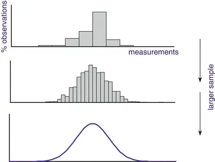
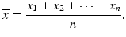
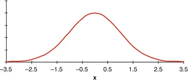
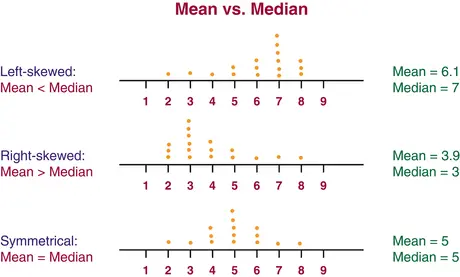
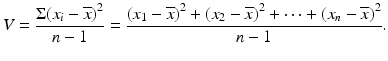
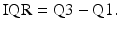
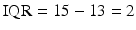
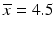
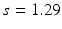
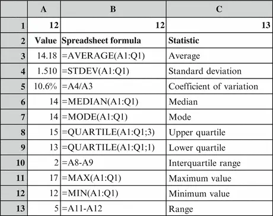

# 3. 数据的描述

在[第2章](ch02.md)中，我们讨论了两种不同类型的数据：定量数据和定性数据。

- 定量数据：这些数据用于计算和定义图形中的坐标轴。
- 定性数据：这些数据对应样本在表格或图形中的分组。

在本章中，我们主要讨论定量数据。我们介绍一些重要的样本统计量（*）；这些是用于描述样本中定量数据的"关键数字"，例如平均值和方差。在本章末尾，我们将更详细地讨论各种类型的数据以及与每种类型相关的统计量。描述定量数据的一个重要工具是直方图，它能直观地展示数据的特征。直方图应基于足够大小的样本。在图3.1中，我们可以看到基于小样本的直方图非常"粗糙"。随着样本量的增加，数据值的分布逐渐变得可见。

图3.1 不同样本量的直方图

然而，我们通常希望通过一些"关键数字"来总结分布，即描述分布各种特征的数字。这些关键数字是本章的主题。

## 3.1 系统变异与随机变异

统计学是关于描述数据中的变异性。区分两种不同的变异来源非常重要（图3.2）。

图3.2 中心与散布

- 系统变异：数据的中心
- 随机变异：数据的散布

图3.2说明了两种不同的变异来源。该图包含四个不同地点日平均温度（°C）测量值的直方图。顶部两个分布的特点是散布较大，即气候高度变化。底部两个分布的散布较小，即气候明显更稳定。另一方面，左侧两个分布的中心约为10°，右侧两个分布的中心约为20°。这意味着左侧两个分布代表寒冷气候，而右侧两个分布代表温暖气候。在统计术语中，我们通常使用术语"位置"（*）而不是中心。我们还通常使用术语"离散度"（*）而不是散布。在本章中，我们介绍用于描述数据分布的最重要的样本统计量：

- 位置度量（中心）
- 离散度量（散布）

## 3.2 位置度量

### 3.2.1 平均值

#### 3.2.1.1 描述

平均值（*）是数据值分布中心的度量。平均值计算为所有数据值的总和除以数据值的个数。作为平均值的符号，我们通常使用术语，读作"x-bar"。

注意：人们通常使用术语"均值"（*）而不是平均值。严格来说，应该对样本使用"平均值"，对总体使用"均值"。许多人将这两个术语互换使用。

平均值受"极端值"（即非常大或非常小的值）影响很大。例如，如果有许多非常大的数据值，平均值就会变得"过大"。在收入数据样本中，一个亿万富翁就能"破坏"整个画面，当然"算作"与几百个"普通人"一样多……在存在许多极端数据值的情况下，替代方案是使用中位数（*）而不是平均值。见后文。

#### 3.2.1.2 示例

数据为数字3, 5, 6, 4。数据值的数量显然为4。所有数据值的总和为3 + 5 + 6 + 4 = 18。平均值为：

#### 3.2.1.3 电子表格
大多数电子表格都内置了许多统计函数，包括平均值计算。例如，Microsoft Excel 和 Open Office Calc 都适用。Open Office 是完全免费的！要计算平均值，请使用统计函数 AVERAGE。稍后会看到示例。

#### 3.2.1.4 计算公式

给定 n 个数据值 x₁ 到 xₙ，平均值可通过以下通用公式计算：

其中  是所有数据值的总和。此公式（及其他公式）可以用求和符号 Σ 更简洁地表示，Σ 对应于电子表格中的求和按钮。我们记 Σxᵢ 为所有数据值之和的简写形式 。那么平均值的计算公式可以写成紧凑形式：

### 3.2.2 中位数

#### 3.2.2.1 描述

中位数 (*) 是位于中间位置的数据值，即将排序后的数据值分成相等两部分的数值。求中位数时，首先将数据值按升序排序。

- 当数据值为奇数个时，中位数就是中间的那个值。
- 当数据值为偶数个时，不存在能将数据值恰好分成相等两部分的单个数据值；此时将中位数定义为中间两个值的平均值。

中位数不像平均值那样对极端值敏感！因此，通常会将平均值与中位数结合使用。

#### 3.2.2.2 示例：偶数个数据值

数据值为 3、5、6、4。首先将数据按升序排序：3、4、5、6。由于有偶数个数据值，我们取中间两个值（在已排序数据中，即 4 和 5）的平均值。因此中位数为：

在此示例中，中位数与平均值相同。但两者不一定总相等。特别是在偏态分布中，它们会不同，详见后文。这里我们按照多数教材的惯例，用符号 M 表示中位数。

#### 3.2.2.3 示例：奇数个数据值

我们来看"健身俱乐部"这个例子；数据值为男孩的年龄。数据值（共 17 个）如下所示，已按升序排列（数据见[第 9 章](ch09.md)）。

表 3.1 中位数

| No. | 1 | 2 | 3 | 4 | 5 | 6 | 7 | 8 | 9 | 10 | 11 | 12 | 13 | 14 | 15 | 16 | 17 |
|-----|---|---|---|---|---|---|---|---|---|----|----|----|----|----|----|----|----|
| 数值 | 12 | 12 | 13 | 13 | 13 | 14 | 14 | 14 | **14** | 14 | 14 | 15 | 15 | 15 | 16 | 17 | 17 |

由于有 17 个数据值，中间值是第 9 个，即加粗显示的数据值 14。在 17 个数据值中，第 9 个数据值两侧各有 8 个数据值。因此中位数为 14。

#### 3.2.2.4 电子表格

统计函数名为 MEDIAN；稍后会看到示例。

### 3.2.3 众数

#### 3.2.3.1 描述

众数 (*) 就是出现最频繁的数据值！只需统计每个数据值的频数即可，无需计算！如果你有所有数据值及其频数的完整列表，就可以立即找出众数。在这种情况下，找到众数比计算平均值或中位数更容易。这是众数相比平均值和中位数的唯一优点！相比之下，众数有一个非常大的缺点：如果有许多不同的数据值（可能含有多位数字），通常每个值只会出现一次。即使偶然某个值出现了 2 次（或甚至 3 次），也可能只是统计上的巧合。此时众数不是一个有意义的概念。因此，众数在实践中并不常用！

#### 3.2.3.2 示例

我们再次以"健身俱乐部"为例——男孩的年龄。以下是不同年龄及其频数。

表 3.2 众数
| 年龄 | 频数 |
|------|------|
| 12   | 2    |
| 13   | 4    |
| 14   | 5    |
| 15   | 3    |
| 16   | 1    |
| 17   | 2    |

我们观察到年龄14岁的频数最高，因此这就是众数。在17名随机选取的各年龄段（包括儿童和成人）人群中，数据值可能从0到超过90。在这种情况下，众数不是一个有信息量的数值。如果恰好有两个人年龄相同，我们只会认为这是一个无趣的巧合！

#### 3.2.3.3 电子表格

该函数称为MODE。稍后见示例。

### 3.2.4 选择位置度量

如果分布是对称的，即大小数据值的数量相等（见图3.3），通常使用均值，但中位数实际上会给出相同的结果。

图3.3 对称分布

在偏态（即非对称）分布中，均值和中位数不相同：

- 对于右偏分布，即"过多"大数据值的分布，均值大于中位数。
- 对于左偏分布，即"过多"小数据值的分布，均值小于中位数。

见图3.4。注意：还存在其他类型的分布，例如具有两个"峰顶"（即双众数）的分布。

图3.4 均值 vs. 中位数

#### 3.2.4.1 示例：平均薪资是多少？

许多经济和行政数据遵循右偏分布，即存在"过多"的大数据值。一组员工的薪资就是一个例子。图3.5展示了这样一个分布，同时显示了众数、中位数和平均薪资的值。

图3.5 右偏分布

我们看到，在右偏分布中，众数小于中位数，中位数小于均值！现在我们也能理解为什么大多数人觉得研究薪资统计数据如此令人沮丧了！大多数人的薪资确实在众数附近，但他们却在与均值进行比较！实际数据是否会遵循图中所示的分布，取决于样本的同质性程度。样本被分成同质群体的程度越高，分布的偏度就越小。如果将数据分成多个同质群体，均值和中位数（在大多数薪资统计中显示）将彼此接近。

## 3.3 离散程度度量

在本章中，我们回顾了位置的主要度量，即分布的中心。现在我们来看各种离散程度的度量，即分布的散布程度。

### 3.3.1 极差

#### 3.3.1.1 描述

极差(*)就是数据值区间的宽度。当你需要一个易于计算和理解的离散度量时，就会使用极差！极差的计算方法是最大数据值与最小数据值之差，即x_max和x_min：

极差（用字母R表示）以数值形式表达了数据的散布程度，当然也具有易于计算的优点。然而，极差的主要优点是易于理解！极差在很大程度上取决于数据值的数量。如果数据值很多，极差就会变大，因为会有更多的小值或大值（"极端"值）。因此，极差主要用于小样本。一个典型的应用是在构建控制图时的统计质量控制，其中样本中的数据值数量通常在5左右。控制图的确切目的是通过区分系统变异和随机变异来快速检测生产过程的变化！参见[第4章](ch04.md)中对简单控制图的介绍。

#### 3.3.1.2 示例
数据为 3, 5, 6, 4。首先将数据值按升序排序：3, 4, 5, 6。最小数据值为 xmin = 3，最大数据值为 xmax = 6。极差即为：

#### 3.3.1.3 电子表格

极差在电子表格中没有独立的函数。但有求最大值（MAX）和最小值（MIN）的函数。见后文示例。

### 3.3.2 方差与标准差

#### 3.3.2.1 说明

最常用的散布度量是标准差（*），它可以解释为数据值与平均值之间的"平均距离"。标准差越大，分布的散布就越大。但标准差并不是按普通的平均距离来计算的。在具体解释标准差的计算方法之前，我们需要先说明另一个概念：方差（*）是数据值与平均值之间距离的平方的平均值。方差的度量单位与原始数据值不同，而是平方单位（例如，若数据值为米，则方差单位为平方米）。通常用字母 V 表示方差。标准差（*）是方差的平方根。标准差与数据值具有相同的度量单位，例如米。通常用字母 s 表示标准差（图3.6）。

图3.6 小散布与大散布

#### 3.3.2.2 示例

数据为 3, 5, 6, 4。之前计算得到这些数字的平均值为 4.5。这些数字的方差为：

标准差为：

注意：在上面的公式中，我们除以的是  而不是 n。这出于技术原因，在实践中除非样本非常小，否则无关紧要。如果 （即只有一个数据值），则无法计算方差和标准差！这与在此情况下无法谈论分布的散布这一事实是一致的。许多电子表格和计算器都有内置函数来计算方差和标准差。通常这些函数有两个版本，分别使用除以 n 和除以 。这让很多人感到困惑。通常的说法是，除数为 n 的公式用于计算总体（而非样本）的方差或标准差。然而，大多数统计学家始终使用除数为  的公式！

#### 3.3.2.3 电子表格

计算方差使用 VAR 函数。计算标准差使用 STDEV 函数。见后文示例。

#### 3.3.2.4 计算公式

方差通过以下通用公式计算：

标准差是方差的平方根，即：

标准差还有一个替代计算公式，见文本框。该公式在没有统计功能的计算器上进行计算时尤为有用。
技术说明：标准差的其他计算公式。

当必须在没有统计功能的计算器上进行计算时，以下标准差公式非常有用：

你需要所有数据值的和以及平方和。该原理在表 3.3 中说明。

表 3.3 和与平方和

| 数据编号 | x | x² |
|---|---|---|
| 1 | 3 | 9 |
| 2 | 5 | 25 |
| 3 | 6 | 36 |
| 4 | 4 | 16 |
| 合计 | 18 | 86 |

我们按如下方式计算标准差：

### 3.3.3 四分位距

#### 3.3.3.1 描述

另一个重要的离散度量是四分位距（Interquartile Range, IQR），解释如下。计算中位数后，可以进一步将两部分数据值各分为两部分。这样，整个数据集被分为四个部分，每个部分（大致）包含相同数量的数据值。新的分割点称为四分位数（*quartiles*）。四分位数之间的差值称为四分位距，常缩写为 IQR。IQR 的含义是包含"中间 50%"数据值的区间长度，当使用中位数作为位置度量时，常使用 IQR。为了找到四分位数，将数据值按升序排序，与计算中位数时相同。下四分位数（或第一四分位数）Q1 是一个将排序后的数据值分为两部分的数，使得四分之一的数据值小于下四分位数，四分之三的数据值大于下四分位数。通常，中位数被视为中间或第二四分位数，有时记为 Q2。上四分位数（或第三四分位数）Q3 是一个将排序后的数据值分为两部分的数，使得四分之三的数据值小于上四分位数，四分之一的数据值大于上四分位数。四分位距（*IQR*）即为上四分位数与下四分位数之差：

然而，少数书籍使用差值的一半作为 IQR 的定义。

#### 3.3.3.2 示例

再次考虑健身俱乐部（Fitness Club）的例子——男孩的年龄。排序后的数据值（共 17 个）如表 3.4 所示。

表 3.4 四分位数

| 编号 | 1 | 2 | 3 | 4 | 5 | 6 | 7 | 8 | 9 | 10 | 11 | 12 | 13 | 14 | 15 | 16 | 17 |
|---|---|---|---|---|---|---|---|---|---|---|---|---|---|---|---|---|---|
| 数值 | 12 | 12 | 13 | 13 | 13 | 14 | 14 | 14 | 14 | 14 | 14 | 15 | 15 | 15 | 16 | 17 | 17 |

前面已得出中位数是第 9 个数据值，即中位数为 14。该数据值将数据值分为两个相等的部分。现在将这两部分各自再次细分：前半部分包含第 1-8 个数据值。由于数据值为偶数个，第 4-5 个数据值构成分割点。两个数据值均为 13，即下四分位数 Q1 等于 13。后半部分包含第 10-17 个数据值。由于数据值为偶数个，第 13-14 个数据值构成分割点。两个数据值均为 15，即上四分位数 Q3 等于 15。于是四分位距为：

#### 3.3.3.3 电子表格

使用 QUARTILE 函数计算四分位数。稍后查看示例。然后通过四分位数相减得到 IQR。

### 3.3.4 选择离散度量离散程度度量的选择通常反映了我们所选择的位置度量。

若分布对称，我们通常使用均值作为位置度量。此时自然地辅以标准差作为离散程度度量。毕竟，标准差是基于均值计算得出的。

若分布偏斜，通常使用中位数作为位置度量。此时自然地辅以四分位距（IQR）作为离散程度度量。这也合乎情理，因为中位数可被视为"中间四分位数"。

### 3.3.5 相对离差（离散程度）

#### 3.3.5.1 描述

比较多个时间段（例如数年）的样本时，均值通常会随时间增长；这在增长期的许多金融和管理数据中成立，在许多人类和生物群体中也是如此。通常，离差会随均值的增长而增长。因此，离差本身并不重要。相反，相对离差更为重要，即标准差除以均值。作为相对离差的度量，我们使用变异系数（*），通常记为CV，定义为标准差占均值的百分比：

有时也称为相对标准差，记为RSD。注意：若数据值例如是以摄氏度测量的温度，则不能使用变异系数！均值温度（用作分母）可能为0°C甚至为负！要使CV有意义，必须存在下限0，即不能出现负值！

#### 3.3.5.2 示例

数据为3、5、6、4。我们之前求得均值为，标准差为。由此得变异系数：

#### 3.3.5.3 电子表格

变异系数没有独立的函数，但可以使用标准差和均值手动计算。

## 3.4 示例：电子表格中的统计函数

在大多数电子表格（如Microsoft Excel和Open Office Calc）中，有大量的统计函数。最重要的函数列于[第9章](ch09.md)。数据值再次是Fitness Club男孩的年龄。

该调查问卷共有 17 个数据值，分别输入到电子表格第一行的单元格 A1 到 Q1 中。在使用所有这些统计函数时，应指定数据区域。图 3.7 展示了如何利用统计函数计算上述所有统计量。此处仅显示了电子表格中的 A 至 C 列，但数据值位于整个 A1:Q1 区域。

图 3.7 电子表格中的统计函数

平均值通过 AVERAGE 函数计算，标准差通过 STDEV 函数计算。变异系数没有独立的函数，而是通过将标准差除以平均值得到，结果以百分比显示（点击电子表格中的 % 键）。中位数通过 MEDIAN 函数计算，众数通过 MODE 函数计算。四分位数通过 QUARTILE 函数计算。该函数有一个附加参数，用于指示计算哪个四分位数。计算上（第三）四分位数时，该参数值为 3；计算下（第一）四分位数时，该参数值为 1。中位数可作为第二四分位数通过参数值 2 计算，当然中位数也有自己的专用函数。四分位距（IQR）通过上下四分位数相减计算。极差没有专用函数，但有最大值（MAX）和最小值（MIN）函数，极差可通过相减计算。

位置与离散程度的主要度量也可以通过 Microsoft Excel 的加载项菜单"数据分析"（Data Analysis）中的"描述统计"（Descriptive statistics）项进行计算。Open Office Calc 中没有该菜单，需要使用统计函数。以健身俱乐部（Fitness Club）调查中所有 30 名儿童的年龄、身高和体重数据为例。应用"数据分析"菜单的结果如图 3.8 所示。

图 3.8 数据分析菜单的输出

"标准误差"（Standard Error）、"峰度"（Kurtosis）、"偏度"（Skewness）和"置信水平"（Confidence Level）等概念将在[第 4 章](ch04.md)中解释。在本章中，我们讨论了最重要的位置（中心）和离散程度（散布）度量。度量的选择取决于数据值的分布：是对称分布还是偏态分布？在下一章中，我们主要处理对称分布。首先，我们将更详细地讨论不同类型的数据，以及适用于不同数据类型的度量（位置和离散程度）。

## 3.5 数据类型与描述性统计

如果你经常处理问卷数据，可以阅读本节；否则可以跳过。

### 3.5.1 数据类型

主要的数据类型有：

**定量数据**（Quantitative data）是指体重、身高、温度、金额等数据。这类数据用于计算和定义图表中的坐标轴。它们又分为两种类型：

- **比率数据**（Ratio data）：比率有明确意义，存在自然零点，不会出现负值。适用于大多数物理测量，例如长度；一张桌子的长度可能是另一张的两倍。

- **间隔数据**（Interval data）：差值有明确意义，可能出现负数。例如以摄氏度（°C）测量的温度；温度升高 5°C 是有意义的。

**定性数据**（Qualitative data）是指性别、教育程度、职业等数据。这些数据对应样本（或总体）的分组，以表格或图表形式呈现。它们又分为三种类型：

- **有序数据**（Ordinal data）：具有自然顺序的若干类别。适用于许多问卷数据，例如态度（按 1-5 级评分）、学校成绩等。

- **名义数据**（Nominal data）：若干命名的类别。例如各种水果：苹果、梨和香蕉等。

- **二选（二元）数据**（Alternative/Binary data）：两个类别（即两个选项）。这类数据可以视作有序数据或名义数据。例如：同意或不同意、好或坏、合格或不合格等。我们将在[第 5 章](ch05.md)中更详细地讨论二选数据。
整数数据（计数数据，即数据值为 0, 1, 2, 3 等）是另一种数据类型。它实际上介于定量（比率）数据和定性（有序）数据之间。如果计数结果非常大（例如强雷暴期间的闪电次数），则仍将整数数据视为定量（比率）数据也是有意义的。

### 3.5.2 描述性统计与数据类型

在本章中，我们一直假设数据是定量的。在这种情况下，可以计算所有统计量，但变异系数要求比率数据。

对于整数数据，我们可以像定量比率数据一样计算所有统计量。然而，平均值的实际值可能并不是一个真实的数据值！例如，一个家庭中不可能有 2.3 个人……因此，平均值只能作为位置的粗略度量。在谨慎使用的情况下，我们也可以使用标准差和变异系数作为离散程度的度量。

对于有序数据，情况要复杂一些！至少，众数、中位数和四分位数是有明确定义的；这里我们利用的是数据可以排序这一事实。

对于典型的问卷量表数据（例如从 1 到 5），许多人也会计算平均值。这实际上是没有意义的；然而，与整数数据一样，如果谨慎使用，平均值也可能提供参考信息。

类似地，对于这类数据，我们可以计算极差和四分位距（IQR）。如果要使这些统计量有意义，两个数字之间的差异必须是有意义的。这个条件通常不满足。不过，如果谨慎使用，这两个统计量都可以作为离散程度的粗略度量。

对于名义数据，只有一种统计量有意义：即作为位置度量的众数。最频繁出现的数据值是有明确定义的。离散程度的概念则不适用。

表 3.5 展示了可用于不同数据类型的统计量。

表 3.5 描述性统计与数据类型

| 样本统计量 | 名义数据 | 有序数据 | 整数数据 | 间隔数据 | 比率数据 |
|---|---|---|---|---|---|
| 众数 | 是 | 是 | 是 | 是 | 是 |
| 中位数 | 否 | 是 | 是 | 是 | 是 |
| 平均值 | 否 | (否) | (是) | 是 | 是 |
| 四分位数 | 否 | 是 | 是 | 是 | 是 |
| 四分位距 | 否 | (否) | 是 | 是 | 是 |
| 极差 | 否 | (否) | 是 | 是 | 是 |
| 标准差 | 否 | 否 | (是) | 是 | 是 |
| 变异系数 | 否 | 否 | (是) | 否 | 是 |

正态分布

© Springer-Verlag Berlin Heidelberg 2016
Birger Stjernholm Madsen
《Statistics for Non-Statisticians》
10.1007/978-3-662-49349-6_4
