# 4. 正态分布

在[第3章](ch03.md)中，我们解释了如何计算描述性统计量，如样本的均值和标准差。现在我们将看看这些度量有什么用途。假设你买了一袋500克的咖啡。你感到好奇，把咖啡倒到秤上看看袋子是否真的装了500克。如果你的秤非常精确，你几乎不会指望重量恰好是500克，稍微多了一点或少了一点，你大概也不会惊讶。如果你重复这个实验很多次，你可能会预期袋子的重量平均而言非常接近500克。你可能还预期不会有太大的波动。例如，你从不指望会得到低于450克或高于550克，一次也没有。袋子的重量可能在490–510克之间变化，但很少会超过510克或低于490克。这种变异可以用统计分布来描述。

最重要的统计分布是正态分布(\*)。几种统计技术都要求数据"服从"（即可以用）正态分布来描述。如果数据不服从正态分布，分析起来就会更加困难。本章研究正态分布的一些重要性质。我们还探讨如何验证数据是否真的服从正态分布。最后，我们讲解如何估计样本均值的统计不确定性(\*)。

## 4.1 正态分布的特征

正态分布曲线是一条对称的"钟形"曲线，类似于直方图——此处展示的是大量咖啡袋重量的直方图。实践证明，正态分布通常能很好地描述许多类型的测量数据，如重量、身高等。但正态分布对于经济和行政数据也极其重要。正态分布完全由其均值（平均值）和标准差决定。上述例子中的正态分布描述了工厂生产的全部咖啡袋的重量。由于我们不知道均值和标准差，它们通常用希腊字母表示：

- 均值：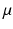（读作"缪"）表示"中心"
- 标准差：（读作"西格玛"）表示"散布"

在图4.1中，我们看到两个具有小散布（ = 1，上方）的正态分布和两个具有大散布（ = 2，下方）的正态分布。每组中的两个分布具有不同的均值， = 10 和  = 24。

图4.1 均值与散布

图4.2展示了正态分布中标准差的含义。这里显示的是表示总体或非常大样本直方图的正态分布。

图4.2 正态分布中的概率

我们观察到：

- 68% 的数据值落在均值 ±1 个标准差的区间内
- 95% 的数据值落在均值 ±2 个标准差的区间内
- 99.7% 的数据值落在均值 ±3 个标准差的区间内

这些百分比是正态分布独有的！在某种意义上，正态分布"认为"0对应均值，1个单位对应标准差。如果X服从均值为μ、标准差为σ的正态分布，那么服从均值为0、标准差为1的正态分布。从某种意义上说，只有一种正态分布！

均值为0、标准差为
因此，它被称为标准正态分布。所有其他正态分布都可以转换为标准正态分布。参见"正态分布中的计算"一节中的示例。

## 4.2 密度函数与分布函数

在实践中，正态分布曲线下的面积才是我们关注的，因为它们可以被解释为概率。因此，我们通常对显示正态分布曲线下面积的曲线感兴趣。这两个图形之间的关系如下所示。钟形曲线（图 4.3）称为密度函数（*），而显示面积（概率）的曲线称为分布函数（*）。

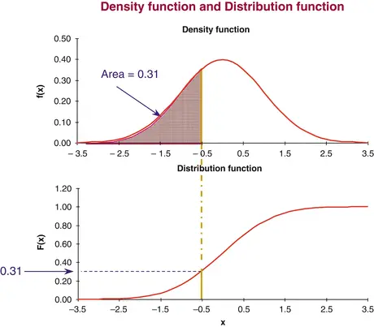

图4.3 密度函数与分布函数

分布函数通常用字母 F 表示。我们可以这样理解分布函数：F(x) 是观测到小于或等于 x 的数据值的概率。在实际问题中，我们几乎总是需要分布函数。密度函数仅用于在书中绘制示意图。

## 4.3 分位数

假设一袋咖啡的重量服从均值为 500 克、标准差为 5 克的正态分布。我们想回答以下问题：

1. 重量最多为 495 克的咖啡袋有多少？

我们使用分布函数：

在 x 轴上找到值 495，并垂直向上移动至 F(495)，即在 y 轴上找到对应的值。这正是数据值不超过 495 克的概率。在下图（图 4.4）中，我们看到它大约为 0.16，相当于 16%。

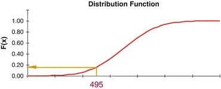

图4.4 分布函数

2. 哪个重量值将最轻的 80% 咖啡袋与其余部分分开？

我们现在反向使用分布函数：在 y 轴上找到值 0.80（相当于 80%），水平移动至分布曲线，然后在 x 轴上找到对应的值。在下图中，我们可以看到它大约为 504 克（图 4.5）。

图4.5 分位数

因此，我们需要"双向"使用正态分布函数。当我们以"逆向"方式使用分布函数时——例如，从 y 轴上的 0.80 = 80% 到 x 轴上的一个值——我们就是在寻找分布中的分位数（*）（也称为分位点或百分位数）。上图显示了正态分布中的 80% 分位数。我们实际上已经在[第 3 章](ch03.md)中看到了一些最重要的分位数：四分位数是 25% 和 75% 分位数，中位数是 50% 分位数。对应于 10%、20%、30% 等的分位数称为十分位数。

## 4.4 正态分布中的计算

现在，我们将演示如何使用正态分布表在正态分布中进行简单计算。正态分布中最重要的分位数可以在书末的表中找到。关于正态分布的更详细的表可以在许多书籍中找到。

示例

假设 X 是一袋咖啡的重量，服从均值为
均值 μ = 500 g、标准差 σ = 5 g。如前所述：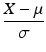 服从均值为 0、标准差为 1 的正态分布。我们称此计算过程为对 X 进行标准化。标准化正态分布函数的值列于[第 9 章](ch09.md)的表中。现在我们可以回答如下问题：

1. 一袋随机咖啡包重量最多为 510 g 的概率是多少？我们将 510 g 标准化得到： 通过查标准正态分布表，我们得到数据值 ≤ 2 的概率为 0.977 = 97.7%。这就是一袋随机咖啡包重量最多为 510 g 的概率。

2. 分布中的 95% 分位数是多少？在标准正态分布表（见书末），你可以找到 95% 分位数为 1.65。这是分布  中的一个分位数，其中 X 是随机选取的咖啡包的重量。解方程 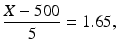 得到 = 500 + 5 × 1.65 = 508.25。这意味着随机选取的咖啡包重量分布中的 95% 分位数为 508.25。换句话说，一袋随机咖啡包重量小于 508.25 g 的概率恰好为 95%。

## 4.5 正态分布与电子表格

如果你不使用电子表格，可以跳过这一节。在 Microsoft Excel 和 OpenOffice Calc 中，有两个重要的正态分布函数。

- NORMDIST：提供正态分布的分布函数或密度函数
- NORMINV：给出正态分布中的分位数

### 4.5.1 NORMDIST (X; Mean; Stdev; Cumulative)

只有在需要绘制"钟形"曲线图时，才需要使用密度函数。因此，你几乎应该始终使用 Cumulative = 1（表 4.1）。

表 4.1 NORMDIST 函数

| 参数 | 说明 |
|------|------|
| X | 需要计算分布函数（或密度函数）值的数值 |
| Mean | 正态分布的均值 |
| Stdev | 正态分布的标准差 |
| Cumulative | Cumulative = 0 计算密度函数 |
| | Cumulative = 1 计算分布函数 |

标准化正态分布（均值为 0、标准差为 1）的分布函数也可以使用 NORMSDIST 函数获得。该函数只有一个参数：X。

### 4.5.2 NORMINV (Probability; Mean; Stdev)

NORMINV 函数（表 4.2）用于在给定均值和标准差的正态分布中查找分位数。因此 NORMINV 有 3 个参数。

表 4.2 NORMINV 函数

| 参数 | 说明 |
|------|------|
| Probability | 需要查找分位数的概率 |
| Mean | 正态分布的均值 |
| Stdev | 正态分布的标准差 |

对于标准化正态分布（均值为 0、标准差为 1），可以使用函数 NORMSINV。该函数只有一个参数：probability。

### 4.5.3 示例
假设咖啡（中的咖啡粉）的重量 $X$ 服从均值为 $\mu = 500\;\text{g}$、标准差为 $\sigma = 5\;\text{g}$ 的正态分布。

1.  **随机一包咖啡重量不超过 490 g 的概率是多少？**
    使用 `NORMDIST(490; 500; 5; 1)`，得到结果 0.023 = 2.3%。

2.  **随机一包咖啡重量不超过 510 g 的概率是多少？**
    类似地，求随机一包咖啡重量不超过 510 g 的概率：使用 `NORMDIST(510; 500; 5; 1)`，得到结果 0.977 = 97.7%。

3.  **该分布中 5% 分位数是多少？**
    记住 5% 等于 0.05。在电子表格中，书写概率时不使用百分比。因此使用 `NORMINV(0.05; 500; 5)`，得到结果 491.8。这意味着随机一包咖啡重量 ≤ 491.8 g 的概率正好是 0.05，等价于 5%。换句话说，随机一包咖啡重量大于 491.8 g 的概率为 95%。

4.  **该分布中 80% 分位数是多少？**
    类似地，求 80% 分位数：`NORMINV(0.80; 500; 5)`，得到结果 504.2。这意味着随机一包咖啡重量 ≤ 504.2 g 的概率正好是 0.80，等价于 80%。换句话说，随机一包咖啡重量大于 504.2 g 的概率为 20%。

电子表格展示了如何在电子表格中进行这些计算（图 4.6）。

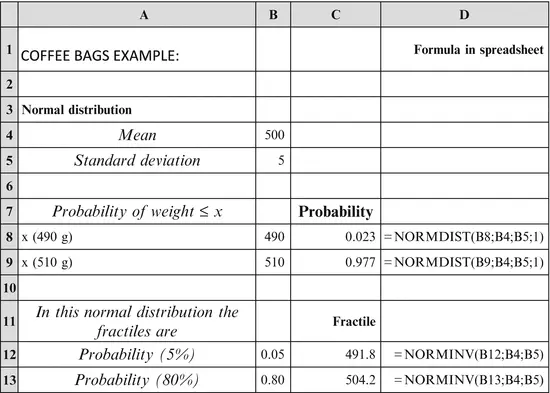
图4.6 电子表格中的示例

## 4.6 正态性检验

我们已经学习了正态分布的一些关键特征——其密度函数和分布函数——以及在正态分布中的计算。换句话说，我们一直假设数据实际上服从正态分布。有几种方法可以检验这一点。这就是本节的主题。

### 4.6.1 简单方法

1.  **直方图**
    研究直方图总是一个好主意。直方图必须呈现对称的"钟形"外观。根据数据值的数量不同，直方图可能会有不同程度的起伏；我们将在本章后面讨论这一点。

2.  **均值 ≈ 中位数**
    如果数据可以用正态分布来描述，那么均值和中位数必须几乎相等，因为正态分布是对称的。这一点很容易验证。

3.  **四分位距大于标准差**
    在正态分布中，四分位距（即上四分位数与下四分位数之差）略大于标准差；实际上，约为标准差的 1.35 倍，即
                  

这可以用均值为 0、标准差为 1 的标准化正态分布来解释：上四分位数为 0.674（参见[第 9 章](ch09.md)表格，75% 分位数）。由于正态分布是对称的，下四分位数为 −0.674。因此，四分位距（即上下四分位数之间的距离）为 2 × 0.674 ≈ 1.35。相比之下，标准化正态分布的标准差恰好为 1。

4. 均值周围对称区间内的数据值数量

我们已经看到，在正态分布中，大约 68% 的数据值位于均值 ± 标准差的区间内。如果数据可以用正态分布描述，那么数据值对应的比例也必须相对接近 68%。如果我们有大量数据值（至少几百个），可以计算均值 ± 2 个标准差之间的数据值比例。这个比例应相对接近 95%。

**示例** 以下是健身俱乐部调查中所有 30 名儿童的身高直方图（另见[第 2 章](ch02.md)）。该直方图大致呈对称分布。当样本较小时，我们必须接受与理想形态存在一定偏差（图 4.7）。

图4.7 身高直方图

在[第 3 章](ch03.md)中，我们计算了 30 名儿童身高的一系列统计量。最重要的统计量如表 4.3 所示（保留一位小数）：

表4.3 身高汇总统计

|                | 身高  |
|----------------|-------|
| 均值           | 157.1 |
| 中位数         | 159.5 |
| 标准差         | 22.1  |
| 下四分位数     | 146.5 |
| 上四分位数     | 170.0 |
| 四分位距       | 23.5  |

我们看到均值和中位数大致相等。四分位距略大于标准差，但未达到 1.35 倍。均值 ± 标准差的区间对应从 135.0 到 179.2。在此区间内，可以数出 30 个数据值中的 21 个，占比 70%，非常接近 68%。总体而言，我们得出结论：数据可以用正态分布来描述似乎是合理的。另一个问题是，我们是否应该实际上使用两个正态分布，男女各一个！我们将在[第 8 章](ch08.md)回到这个问题。

### 4.6.2 偏度与峰度

偏度和峰度这两个统计量可用于检验数据是否服从正态分布。然而，它们的计算较为复杂，因此需要使用电子表格或其他统计软件。

#### 4.6.2.1 描述

这两个统计量可以在大多数电子表格或其他统计软件中轻松计算。它们为检验数据是否可以用正态分布描述提供了便捷的途径。

偏度（*）是衡量分布相对于对称分布的偏斜程度的指标：

- 如果数据可以用对称分布描述，则偏度必须接近 0。
- 正偏度表示右偏分布。
- 负偏度表示左偏分布。

作为一个非常粗略的指南，关于不同样本量 n 下偏度可接受的偏离 0 的程度，可以使用以下表达式：

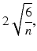

其中 n 是样本量。由此得到表 4.4。

表4.4 偏度的最大允许偏差

| n    | 偏度的最大允许偏差 |
|------|-------------------|
| 25   | 1.00              |
| 100  | 0.50              |
| 400  | 0.25              |
| 1600 | 0.12              |

样本量越小，需要接受的偏离 0 的程度就越大。当样本量扩大为 4 倍时，偏离 0 的最大可接受偏差减半。因此，需检查偏度是否在偏离 0 的最大可接受范围内。如果不在，则说明分布不对称。

如果分布是对称的，
你可以补充另一个统计量来评估：峰度（*）表示分布的"尾部"有多大：

- 正态分布的峰度为 0。
- 正峰度表示分布的"尾部"比正态分布更大。
- 负峰度表示分布的"尾部"比正态分布更小。

峰度为正的分布通常在顶部比正态分布更"陡峭"。相反，峰度为负的分布通常在顶部比正态分布更"平坦"。然而，这些特性并不总是成立。例如，t 分布（*）的峰度为正值，但 t 分布在顶部却比正态分布更"平坦"。请参见本章后面关于 t 分布的示例。对于峰度，我们可以接受比偏度更大的偏离 0 的值。对于小样本量，表 4.5 显示了在可以用正态分布描述数据的情况下，可接受的峰度最小值和最大值。

表4.5 峰度的最小值和最大值

| N   | 最小峰度 | 最大峰度 |
|-----|---------|---------|
| 25  | -1.2    | 2.3     |
| 100 | -0.7    | 1.1     |
| 400 | -0.4    | 0.5     |

如果给定样本量的峰度超出所示范围，则数据不能用正态分布来描述。例如，假设样本量为 n = 100 且峰度 > 1.1，这表明分布的"尾部"比正态分布更大。注意，对于小样本量，峰度的可接受区间不是对称的。

对于大样本量（约 1000 或以上），我们可以接受峰度偏离 0 的值是偏度可接受值的两倍，即峰度偏离 0 的最大值为：

#### 4.6.2.2 计算

关于这些统计量的计算公式，请参考电子表格（或其他统计软件）中的帮助，或参考教科书，例如 Montgomery 的《Introduction to Statistical Quality Control》（2005 年）。注意：存在另一种计算峰度的公式，其中正态分布的值为 3。在 Microsoft Excel、Open Office Calc 等电子表格以及大多数统计软件中，正态分布的峰度为 0。

#### 4.6.2.3 电子表格

偏度和峰度都可以在电子表格中以函数形式使用：

- 偏度可以通过 SKEW 函数获得。
- 峰度可以通过 KURT 函数获得。

#### 4.6.2.4 示例

在[第 3 章](ch03.md)中，我们使用电子表格函数计算了健身俱乐部调查中 30 名儿童身高的多项统计量，包括偏度和峰度，这里列出这些结果（表 4.6）。

表4.6 身高统计量

| 统计量 | 身高 |
|--------|------|
| 偏度   | -0.43 |
| 峰度   | -0.21 |

偏度接近 0。对于这样相对较小的样本，我们可以接受接近 ±1 的值。因此，数据可以用对称分布来描述。峰度非常接近 0，这证实了数据可以用正态分布来描述。存在多种正态分布的统计检验方法，这些方法在统计软件包中都有提供。这些检验也证实了 30 名儿童身高的分布可以用正态分布来描述。本书不涉及此类检验，请参考统计软件包中的帮助菜单。

### 4.6.3 正态概率图

最后，还有一种简单的图形工具可以检查数据是否服从正态分布，称为正态概率图（概率图或分位数图）。它是许多统计软件包（例如 SAS、JMP、SPSS、Minitab 等，详见[第 9 章](ch09.md)列表）的内置功能。如果你有统计软件包，可以生成类似图 4.8 所示的图形。在电子表格中也很容易实现。

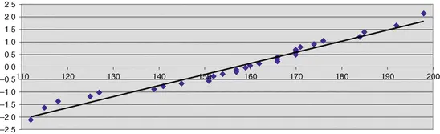

图4.8 正态概率图
如果数据服从正态分布，则各点应随机分布在直线周围。本例中情况正是如此。这证实了数据可以用正态分布来描述（图4.8）。如果没有统计软件包，也可以在电子表格中构建该图。方法如下文本框所述。

**技术说明：在电子表格中构建正态概率图**

首先，将数据值按升序排列。这里使用了健身俱乐部调查中30名儿童的身高数据；下面仅显示两个最小的数据值，分别为112和115（图4.9）：

图4.9 正态概率图的计算

创建一个连续编号的列：此为A列。数据值在B列。C列用于计算表达式(i−0.5)/n，其中i是数据值的编号（在A列中），n是总数值（此处为30）。除了分子中的0.5（一个技术校正项）外，i/n恰好是直到并包括第i个数据值的比例。对于第一个数据值，得到结果(1−0.5)/30=0.017。以C列为Y轴、B列为X轴的散点图可与正态分布的分布函数进行比较。然而，很难检查这些点是否服从正态分布曲线。因此，对C列中的Y值进行变换。对于每个值，使用电子表格函数NORMSINV在标准正态分布中找到对应的分位数，第一个数据值为−2.13。该值写入D列。这相当于"扭曲"y轴，使曲线变为直线。以D列为y轴、B列为x轴的图如上所示。这里添加了回归线（参见[第7章](ch07.md)）。

## 4.7 随机数

在评估数据集与正态分布的一致程度时，一个良好的基准做法是对来自正态分布的相似数量的随机数进行相同的计算和绘图。在Microsoft Excel中，可以使用插件菜单"数据分析"中的子项"随机数生成"来生成正态分布的随机数。Open Office Calc中没有类似选项。通过这种方式，可以简单地生成正态分布的随机数。与健身俱乐部调查中30名儿童身高的直方图（参见[第2章](ch02.md)）相比，我们展示了基于30个正态分布随机数据（本例中均值为0、标准差为1，即标准正态分布）的直方图。我们知道这些数据来自正态分布。然而，可以看到直方图中存在一些不规则性，这是由于样本量有限所致（图4.10）。

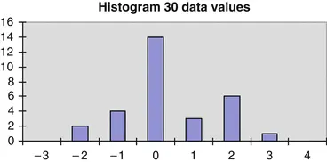
图4.10 直方图，30个数据值

事实上，创建多列正态分布随机数据是非常容易的。通过这种方式，作者计算了上表中峰度的推荐限值；不过，这里使用了其他更适合处理大量数据的统计软件。

使用随机数进行统计计算称为**模拟**。

你也可以使用模拟来研究随着样本量增加，直方图外观如何逐渐变化。见图表（图4.11）。

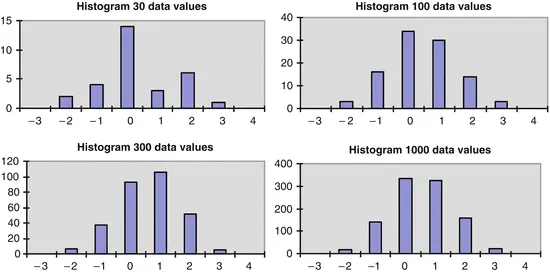
图4.11 直方图，样本量递增

很明显，在样本量为30时，必须接受直方图中的一些不规则性。当样本量增加到例如1000时，直方图看起来与正态分布曲线非常相似。在这些直方图中，我们使用了相同数量的条形以进行直接比较。在实践中，对于大样本量，会使用更多的条形，参见[第2章](ch02.md)。

## 4.8 置信区间
在学习了正态分布的主要特征以及如何处理正态分布之后，我们现在来看正态分布的一个主要应用：如何找出与样本均值相关的统计不确定性(*)。假设儿童身高服从均值为μ、标准差为σ的正态分布。在实践中，我们不知道μ和σ，但可以计算μ和σ的估计值：

- 作为μ的估计值，我们使用样本均值。
- 作为σ的估计值，我们使用样本标准差。

我们并不期望从样本计算出的均值与总体的未知均值完全一致。但也许我们可以找到一个区间，以高概率（例如95%）包含该未知均值。这样的区间被称为总体均值的95%置信区间(*)。我们现在将展示如何找到这样的区间（图4.12）。

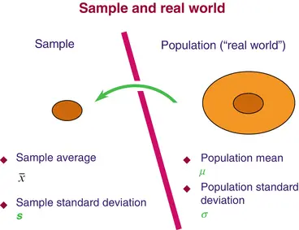图4.12 样本估计

### 4.8.1 均值的置信区间

#### 4.8.1.1 描述

本节的技术要求数据可以用正态分布来描述。其目的是计算均值的估计值并找到其置信区间。此外，我们假设：

- 我们事先知道标准差，或
- 样本量足够大

事先知道标准差并非通常情况。然而，如果样本量足够大，我们可以将样本标准差视为已知值来使用。当样本量超过30时，我们是安全的。如果样本量刚超过10，使用本节的技术也不会造成很大误差。

#### 4.8.1.2 计算

作为总体均值μ的估计值，我们使用样本均值x̄。样本均值的统计不确定性随着样本量的增大而减小。更具体地说，我们有以下规则：均值的标准差等于原始标准差σ除以数据个数n的平方根。这被称为均值的标准误(*)，有时缩写为SE。

我们已经看到，正态分布中略多于95%的数据值位于均值±2个标准差的区间内。如果我们希望区间正好包含95%的数据值，则必须用1.96而非2乘以标准差。因此，均值的95%置信区间(*)为：

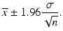

±后面的数字可以理解为均值的统计不确定性(*)。95%置信区间为何以这种方式计算的精确原因相当技术性。参见，例如，G. E. P. Box、W. G. Hunter 和 J. S. Hunter (Wiley 2005, 第二版)：Statistics for Experimenters。

不幸的是，术语"统计不确定性"在大多数统计学书籍中并没有一个专门的名称！它通常被称为"均值置信区间的一半长度"或简称为"±后面的数字"。实际上，1.96只是标准正态分布的97.5%分位数，有2.5%的数据值大于1.96。这意味着95%的数据值位于−1.96和1.96之间（图4.13）。在[第9章](ch09.md)（表9.10）中，可以找到标准正态分布主要分位数的表格。

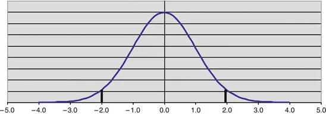图4.13 正态分布

#### 4.8.1.3 示例：健身俱乐部调查中的儿童身高
我们想要计算总体中所有孩子平均身高的 95% 置信区间。我们不知道均值 μ，但我们有来自 n = 30 名孩子的样本数据来估计它。在样本中，我们得到了平均身高 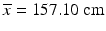 和标准差 s = 22.06 cm。由于样本量为 30，我们可以认为标准差已知，即令 σ = 22.06 cm。我们使用公式计算均值的 95% 置信区间：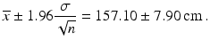 平均身高的 95% 置信区间可以写为 157.10 ± 7.90 cm。区间的端点可以计算为 149.2 cm 和 165.0 cm。该区间将以 95% 的概率包含未知的总体均值。有时我们希望区间以 99% 的概率包含未知均值。此时，我们应将标准误差乘以 2.576。区间的端点则计算为 146.7 cm 和 167.5 cm。因此，如果我们想要 99% 的概率，置信区间会更宽。实际上，数值 2.576 正是标准正态分布中的 99.5% 分位数，即恰好 99% 的数据值位于 −2.576 和 2.576 之间。因此，0.5% 的数据值大于 2.576。

技术说明：有限总体中平均值的统计不确定性。通常，我们从具有有限个体数量的总体中抽取样本，且样本相对于总体而言相对较小，最多不超过总体的 10%。在这种情况下，上述标准误差和置信区间的公式是有效的。如果样本大于总体的 10%，则必须修改公式。此时标准误差的正确公式为：

其中，N = 总体中的个体数。比例 n/N 称为抽样比例(*)。类似地，置信区间的公式也被修改：均值的 95% 置信区间为

当样本量较小时，n/N 接近于 0，因此 1 − n/N 的平方根非常接近 1。这意味着更简单的公式仍然有效。

#### 4.8.1.4 电子表格

如果你不使用电子表格，可以跳过本节。
- 首先，使用 AVERAGE 函数计算样本的平均值。
- 然后，使用 CONFIDENCE 函数计算统计不确定性。

对于 CONFIDENCE 函数，我们需要指定参数（表 4.7）。这使你能够计算置信区间的端点。如下所示（表 4.8）：

表4.7 CONFIDENCE 函数参数

| 参数 | 描述 |
| --- | --- |
| Alpha | "剩余概率"（例如，若需要 95% 置信区间，则为 0.05 = 5%） |
| Stdev | 标准差（视为已知） |
| Size | 样本量，n |

表4.8 CONFIDENCE 函数示例

|   | A | B | C |
|---|---|---|---|
| 33 | | 平均值 | 157.10 = AVERAGE(B2:B31) |
| 34 | | 标准差 | 22.06 = STDEV(B2:B31) |
| 35 | | 统计不确定性 | 7.90 = CONFIDENCE(0.05; B34; 30) |

我们假设数据位于区域 B2:B31 中。平均值使用 AVERAGE 计算。标准差使用 STDEV 计算。然后，使用 CONFIDENCE 函数计算统计不确定性。对于此函数，我们必须指定"剩余概率"0.05（相当于 5%）、标准差（使用 STDEV 计算得出）和样本量（30）。平均身高的 95% 置信区间可以写为 157.10 ± 7.90。因此，置信区间的端点分别为 149.2 和 165.0。

### 4.8.2 小样本情况下均值的置信区间

如果你的样本量通常大于 20，可以跳过本节。
#### 4.8.2.1 描述
假设一袋咖啡的重量服从均值为 μ、标准差为 σ 的正态分布。我们既不知道均值也不知道标准差。

- 我们通过样本估计均值和标准差。
- 目的是估计均值 μ 并为其找到置信区间。
- 我们不知道标准差 σ，但用样本标准差 s 来估计它。

如果样本量相对较小（小于 30，甚至可能小于 10），样本标准差不能被视为已知。因此我们需要修正计算。

#### 4.8.2.2 计算

与上一节类似，我们构建均值的 95% 置信区间： 由于样本不够大，无法认为标准差已知，标准误差的乘数 t 变得比 1.96 更大（甚至可能大得多）。之前使用的常数 1.96 是正态分布的 97.5% 分位数。现在我们必须使用 t 分布中的分位数，而不是正态分布中的分位数。

(*)，也称为"学生 t 分布"。这不是单一分布，而是一个分布族。如果有 n 个数据值（至少 2 个），则称该 t 分布具有 n−1 个自由度。

注意："自由度"常缩写为 DF（或 df）。如果我们想要均值 μ 的 95% 置信区间，必须使用自由度为 n−1 的 t 分布的 97.5% 分位数。如果我们想要均值 μ 的 99% 置信区间，必须使用自由度为 n−1 的 t 分布的 99.5% 分位数。在这种情形下计算出的置信区间，比标准差 σ 已知时要宽。如果样本量很小，置信区间会更宽。t 分布最重要的分位数可以在[第 9 章](ch09.md)的表中找到（表 9.12）。在表中我们看到，t 分布的 97.5% 和 99.5% 分位数大于正态分布的对应分位数；当自由度小于 10 时尤其明显。当自由度至少为 30 时，t 分布与正态分布之间几乎没有差异。因此，该表仅显示最多 30 个自由度的分位数。下图显示了具有 1、2 和 5 个自由度的 t 分布以及正态分布的概率密度函数。注意，即使具有 5 个自由度的 t 分布乍一看与正态分布似乎没有太大区别，但分布的"尾部"仍然存在很大差异。

注意：t 分布具有比正态分布"更重的尾部"，即它具有正峰度（图 4.14）。

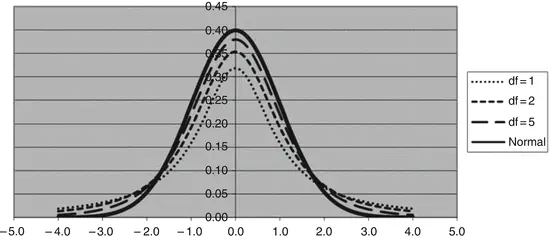
图 4.14 正态分布与 t 分布

#### 4.8.2.3 示例

假设一袋咖啡的重量服从正态分布。我们不知道均值 μ，但抽取了 n=4 袋咖啡的样本来估计它。假设样本中平均值为 ，标准差为 s=5.30 g。我们根据公式 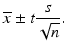 计算均值的 95% 置信区间。我们需要一个以 95% 概率包含均值 μ 未知值的置信区间，因此必须使用 t 分布的 97.5% 分位数。由于样本包含 n=4 袋咖啡，自由度为 df=n−1=3。在[第 9 章](ch09.md)的 t 分布表中，我们发现自由度为 3 的 t 分布的 97.5% 分位数为 3.182。注意，这个分位数远大于 1.96。该公式现在给出了统计不确定性。
均值的标准误为 8.4。置信区间的端点现在可以计算为 497.4 和 514.2 克。

#### 4.8.2.4 电子表格

如果你不使用电子表格，可以跳过本节。如果样本量较小，计算均值的置信区间需要以下内容：

- 使用 AVERAGE 函数计算的样本均值。
- 使用 STDEV 函数计算的标准差。
- 样本量 n。我们需要使用 SQRT 函数计算 n 的平方根。
- t 分布中具有 n − 1 个自由度的分位数，例如，95% 置信区间情况下的 97.5% 分位数：使用 TINV 函数计算。

在咖啡袋的示例中，有四个数据值，即自由度数为 3。如果我们希望以 95% 的概率包含均值 μ 的未知值，我们使用 97.5% 分位数。这个分位数可以在电子表格中使用 TINV 函数计算。

注意：在电子表格函数中指定概率的方式有些特殊：

- 第一个 TINV 参数：找到"剩余概率"并乘以 2。
- 第二个 TINV 参数：自由度数量。

一个示例：对于 97.5%（= 0.975）分位数，"剩余概率"为 2.5%（= 0.025）。我们将其乘以 2 得到 5%（= 0.05）。自由度为 3 时，得到分位数 TINV(0.05; 3) = 3.182。所有需要的信息都在下面的输出中找到，包括使用电子表格函数的计算公式。均值的 95% 置信区间为 505.8 ± 8.4，即区间从 497.4 到 514.2（图 4.15）。

图4.15 示例：统计函数

如果你有 Microsoft Excel，另一种选择是使用加载项菜单"数据分析"，其中有一个"描述统计"菜单项。记得勾选"均值置信水平"复选框。以下是 Microsoft Excel 描述统计菜单的（部分）输出（表 4.9）。

表4.9 示例：数据分析菜单

| 统计量 | 值 |
|---|---|
| 均值 | 505.8 |
| 标准误 | 2.65 |
| 标准差 | 5.30 |
| 置信水平 (95.0%) | 8.4 |

### 4.8.3 标准差的置信区间

本节可以跳过，不会影响连续性。

#### 4.8.3.1 描述

假设咖啡袋的重量服从均值为 μ、标准差为 σ 的正态分布。我们既不知道这个正态分布的均值，也不知道它的标准差。本节的目的是估计标准差 σ 并找到其置信区间。

#### 4.8.3.2 计算

标准差 σ 的置信区间通过直接指定区间的下限和上限来找到。我们需要卡方分布 (*) 的分位数。我们还需要指定自由度数量，仍然是 n − 1。标准差 σ 的 95% 置信区间为：

平方根下的分母为：

- 97.5% 分位数（下限）
- 2.5% 分位数（上限），基于具有 n − 1 个自由度的卡方分布

字母 χ 是希腊字母 "Chi"。对于 99% 置信区间，我们使用卡方分布中具有 n − 1 个自由度的 99.5% 分位数（下限）和 0.5% 分位数（上限）。

#### 4.8.3.3 示例
假设袋装咖啡的重量服从正态分布。我们不知道标准差σ，但抽取了n=4袋咖啡的样本进行估计。我们需要一个置信区间，它以95%的概率包含未知标准差σ的值。样本标准差为s=5.30 g。根据上述公式计算标准差的95%置信区间。由于样本包含n=4袋咖啡，自由度为df=n−1=3。在[第9章](ch09.md)卡方分布表中，查得自由度为3的卡方分布的97.5%分位数为9.35，2.5%分位数为0.22。因此，根据上述公式得到标准差95%置信区间如下：

- 下限为3.0。
- 上限为19.8。

这意味着，标准差以95%的概率位于3.0和19.8之间。该区间看起来相当宽，这当然是由于样本量较小所致。如果需要更窄的区间，必须增加样本量。

#### 4.8.3.4 电子表格

计算标准差的95%置信区间需要以下信息：

- 方差（使用VAR函数计算）。
- 样本量n。
- 自由度：df=n−1。
- 自由度为n−1的卡方分布的2.5%分位数和97.5%分位数。

分位数可在Microsoft Excel/Open Office Calc中使用CHIINV函数计算。注意，应指定"剩余"概率而非概率本身。例如，对于97.5%=0.975的分位数，"剩余"概率为2.5%=0.025。自由度为3时，得到分位数CHIINV(0.025;3)=9.35（图4.16）。

图4.16 使用统计函数的示例

## 4.9 关于正态分布的更多内容

人们常常听到这样的说法："数据需要达到一定样本量才能服从正态分布"。这纯属无稽之谈！来自总体的样本数据服从相同的分布，与样本量大小无关！然而，可以证明以下结论：当数据不服从正态分布时，本章中介绍的均值置信区间的计算方法仍然适用。如果样本量足够大，样本均值将服从正态分布。

这正是正态分布如此重要的原因之一：无论总体数据的分布如何，正态分布都可以作为描述样本均值的近似分布。文献中称之为"中心极限定理"。对样本量的要求并不苛刻：样本量5通常就足够了。然而，如果总体数据的分布极其偏斜，可能需要更大的样本量（例如20）。

此外：即使数据服从正态分布，在构建均值置信区间时，也需要一定的样本量才能使用正态分布的分位数。我们看到，对于小样本量必须使用t分布的分位数。当样本量约在20以内时属于这种情况。

简而言之：当样本量大于20时，可以确保：

1. 样本均值服从正态分布。
2. 可以使用正态分布的分位数构建均值的置信区间。
许多统计方法（例如[第 7 章](ch07.md)和[第 8 章](ch08.md)中描述的方法）都要求数据服从正态分布。这是正态分布如此重要的另一个原因。

如果数据不服从正态分布，一种解决方案（通常适用于右偏分布）是对数据值进行变换（例如对数据值取对数），使其能够用正态分布来描述，然后在变换后的数据上进行计算。如果使用对数变换，我们称原始数据服从对数正态分布，见下一节。

另一种方法是使用非参数统计技术（也称为无分布技术）。这些技术在更高级的统计学书籍中有描述，并且已在许多统计软件包中实现。在本章中，我们主要处理定量数据，即数据值是可用于计算的数字。我们了解了如何使用正态分布描述定量数据，以及如何检验正态分布。同时，我们也了解了如何找到与样本均值相关的统计不确定性。在下一章中，我们将讨论针对总体中分组对应的定性数据的统计方法。首先，我们介绍几个可以在首次阅读本书时安全跳过的专题。

## 4.10 对数正态分布

### 4.10.1 引言

在某些情况下，数据无法很好地用正态分布来描述。通常，数据的分布是"右偏"的。在这种情况下，对数据进行变换是有利的。最常用的变换是对数据值取对数。这种情况下数据值的对数通常近似服从正态分布。这适用于工程/科学以及经济/管理领域的许多数据。通常，我们使用自然对数，记为 ln（电子表格函数 LN）。如果需要"变换回来"，可以通过指数函数 exp（电子表格函数 EXP）实现。如果数据的对数可以用正态分布描述，我们就说原始数据值服从对数正态分布（*）。

许多统计软件包允许对数据拟合多种统计分布，而不仅仅是正态分布。如果对数正态分布是选项之一，这比直接对数据取对数更方便：你可以在原始尺度上工作，而不是在对数变换后的尺度上。例如，你可以直接从拟合的对数正态分布中获得各种分位数。在处理数据及其（自然）对数时，一个重要特性是：

数据值对数的标准差很好地近似了原始数据的 CV（变异系数）！

在此上下文中，变异系数不以百分比计算！

注意：只要原始数据的 CV（变异系数）不超过约 0.6（对应 60%），该近似就有效。

### 4.10.2 示例

以下是健身俱乐部调查中儿童体重的直方图。分布似乎有"右偏"的趋势，即"过多"的大值。然而，仅有 30 个数据值，我们在解释直方图时必须谨慎。

[第 3 章](ch03.md)中也展示了这些数据的一些描述性统计量。以下复现了其中的一部分。

| |体重|
|---|---:|
|平均值|53.17|
|中位数|49.00|
|偏度|0.70|
可以看出，中位数小于均值。不过，中位数（恰好）位于均值 95% 置信区间内，因此这本身并不构成严重问题。此外，偏度为 0.70，这个值本身并不算太大，不足以拒绝正态分布假设。根据第 4.6.2 节的公式，偏度超过 0.89 才表示分布呈正偏态。然而，统计软件包中提供了多种不同的"正态分布统计检验"，这些检验得出结论：正态分布不能很好地描述健身俱乐部调查中儿童体重的数据。因此，尝试对数据进行对数变换，即使用电子表格中的 LN 函数对所有数据值进行变换。变换后的数据得到以下描述性统计量：

| 统计量 | 数值 |
|--------|------|
| 均值（Average） | 3.94 |
| 中位数（Median） | 3.89 |
| 偏度（Skewness） | 0.18 |

可以观察到，变换后均值和中位数几乎相等。此外，偏度也非常接近 0。下图展示了变换后数据的直方图，该直方图比原始数据的直方图更加对称。

电子表格中还显示了一些其他计算。原始数据值位于区域 E2:E31（表格仅显示最后两个值），数据的对数值位于区域 F2:F31。

我们还可以看到，初始数据的变异系数（单元格 E35）与数据对数值的标准差（单元格 F34）非常接近。注意：如果将对数数据的均值"逆变换"回原始尺度，得到 51.55，这与原始数据的均值并不相同！实际上，这个数值被称为原始数据的几何平均数，它是中心位置（location）的又一种度量。几何平均数也可以用原始数据的数学表达式直接表示，事实上电子表格中也有相应的函数。不过，几何平均数在实践中并不常用。

## 4.11 控制图：一切尽在掌控？

### 4.11.1 引言

在许多公司和组织中，会持续收集备受关注事项的信息。人们很容易对这些信息的变化（增加/减少或趋势）做出反应，即使变化幅度很小。这可能导致基于模糊甚至不可靠依据的不当行动，这显然是不可取的。一种解决方案是对这些数据实施"控制图"，以区分日常正常变异（"随机变异"）与异常变异/变化（"系统变异"）。控制图（*）是按时间顺序绘制的数据图形。控制图的一个重要部分是构建控制界限（*），它描述过程处于统计控制状态（即仅受随机变异影响）时的固有变异性。传统上，控制图被用作质量控制工具，用于监控生产过程中的物理/化学参数。在这种情况下，控制图是传统上称为统计过程控制（SPC）（*）的基础组成部分。然而，控制图也可以应用于纯粹的行政流程。例如：1. 调查机构监控月度抽样调查的无回答率。2. 服务公司监控每月的客户投诉数量。3. 生产公司监控每月的工伤事故数量。在我看来，控制图可以引入到各种尚未考虑使用它的场景中！这个话题非常广泛，建议查阅相关专题的教科书以获取详细信息，例如 Douglas Montgomery 的《Introduction to Statistical Quality Control》（Wiley）。

### 4.11.2 统计控制

如果一个过程仅受随机变异影响，则称该过程处于统计控制（*）状态。过程处于统计控制（*）状态的条件包括：
- 所有观测值都在控制界限内，即没有极端数据值（"异常值"）。
- 变异看起来是随机的，即不存在异常模式。
异常模式可能包括：
- 过程水平（均值）的偏移（增大或减小）
- 过程水平（均值）的趋势（上升或下降）
- 过程离散度（即标准差或极差）的变化

这些条件是否满足可以通过目视判断，也可以使用特定的（客观）规则进行判断，详见后文。
### 4.11.3 简单控制图的构建

让我们来看看最简单的控制图！它易于实现且便于解释。我们假设每个数据点只代表一次测量。所有数据值的标准差（s）被用于构建控制限。这意味着，短期和长期变异都包含在标准差中！请看图 4.2。看起来 99.7% 的数据值落在均值 ± 3 个标准差的区间内。因此，数据值落在这个区间之外的情况非常罕见。如果出现了区间之外的数据值，我们假设这并非偶然。因此，我们按如下方式构建控制限（*）：均值 ± 3 · s。同时，我们构建中心线（*），即所有数据值的平均值。
注意：控制图对正态分布假设非常敏感！因此，检查数据是否服从正态分布极为重要。如果数据不能用正态分布描述，对数据进行变换可能是解决办法。例如，如果数据右偏，对数据值取对数可能使数据服从正态分布。本章前面部分有更多关于正态分布检验和通过对数变换进行数据变换的信息。
### 4.11.4 异常模式

上述控制图的控制限只作用于单个数据点，判断其是否为极端数据值（"异常值"）。通常需要更快地检测到偏移或趋势。这就是引入补充运行规则（*）的原因，它通过引入"记忆"来发挥作用。在本节中，我们讨论如何评估是否存在异常模式，这些模式不能仅归因于随机变异。国际标准 ISO-8258 给出了七条补充运行规则（有时称为"西方电气"规则），即总共八条规则。这里我们只提及前三条规则：
1. 一个点落在控制限之外，检测到均值的偏移、标准差的增大或过程中的单个异常（"异常值"）。2. 连续九个点位于中心线的同一侧（上方或下方），检测到过程均值的偏移。3. 连续六个点稳步上升或下降，检测到过程均值的趋势或漂移。
如果控制图中触发了这三条规则中的任意一条，则假定存在系统性变异。不能假定过程处于统计控制状态。还存在其他补充运行规则！常用的还有"Westgard 规则"。工业应用的标准统计软件包中实现了多种类型的控制图以及补充运行规则，例如 JMP 或 Minitab（参见附录中选定的统计软件包列表）。
### 4.11.5 控制图的实际应用

你应该收集至少 20-25 次运行的数据。然后将数据绘制在控制图中。如果所有值都在控制限内且没有异常模式或趋势，我们得出结论：
- 过程处于统计控制状态
- 控制限可用于评估未来数据。

将来，当绘制的值落在任一控制限之外，或一系列值反映出异常模式（例如上述规则 2 和 3）时，统计控制状态不再成立。发生这种情况时，启动错误调查以查找原因。过程可能会被停止或调整。一旦找到原因并消除，过程即可继续。当调查未能确定原因时，应建立相应的行动机制。
### 4.11.6 示例
以下数据显示了在 20 天期间内采集的咖啡袋重量数据（不过，理想情况下数据值越多越好）。这些数据的电子表格也可在本书配套网站上找到。

| 天 | 重量 (g) | 天 | 重量 (g) |
|----|----------|----|----------|
| 1 | 497.7 | 11 | 495.9 |
| 2 | 501.2 | 12 | 496.1 |
| 3 | 496.0 | 13 | 496.8 |
| 4 | 501.3 | 14 | 496.3 |
| 5 | 500.5 | 15 | 498.3 |
| 6 | 501.8 | 16 | 503.8 |
| 7 | 495.9 | 17 | 496.9 |
| 8 | 502.0 | 18 | 495.9 |
| 9 | 496.8 | 19 | 501.0 |
| 10 | 499.2 | 20 | 497.0 |

利用本章前面介绍的工具，可以检验数据是否服从正态分布，此处略去。通过常用的电子表格函数计算平均值和标准差，并使用上述公式计算控制限，得到如下结果。

| 统计量 | 值 |
|--------|------|
| 平均值 | 498.52 |
| 标准差 | 2.57 |
| LCL（下控制限） | 490.8 |
| UCL（上控制限） | 506.2 |

现在使用电子表格可以轻松构建控制图。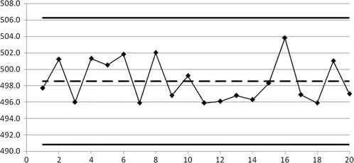

在控制图中，控制限与中心线（即平均值）和数据值一同显示。可以很容易地观察到，所有数据值都在控制限之内。同时可以验证，上述补充游程规则均未被违反。基于这些数据，我们得出结论，该过程似乎处于统计控制状态。

注：在实际应用中，每个数据值实际上可能是例如 5 袋咖啡的平均重量。

## 4.12 过程能力

本节内容涉及质量控制，如果你不从事该领域的工作，可以安全跳过。但在质量控制领域，本节介绍的工具被广泛使用。该主题非常庞大，建议查阅相关教科书以获取详细信息，例如 Douglas Montgomery 的《Introduction to Statistical Quality Control》（Wiley 出版）。

### 4.12.1 引言

本节介绍的工具用于评估过程满足要求的能力。在使用这些工具之前，必须确保过程处于统计控制状态！这可以通过控制图实现（参见上一节）。要求可以由生产者、客户或权威机构指定。要求通常以规格界限的形式给出。

规格界限 (*) 是可接受的质量特性的界限值。通常给出两个规格界限：

- USL = 上规格界限 (Upper Specification Limit)
- LSL = 下规格界限 (Lower Specification Limit)

### 4.12.2 示例

在咖啡袋的例子中，允许目标值 500 g 有 3% 的偏差。因此，存在以下两个规格界限：

- LSL = 485 g
- USL = 515 g

### 4.12.3 过程能力指数

观察图 4.2。回顾正态分布的以下性质：

- 95% 的数据值位于均值 ± 2 个标准差的区间内。
- 99.7% 的数据值位于均值 ± 3 个标准差的区间内。

存在多种不同的"过程能力指数"。本书仅介绍其中两种。这里重点关注避免生产超出规格界限（通常称为"不合格"生产）。其他指数则用于展示过程在"对准目标"（即均值接近期望值）方面的能力。首先，我们考虑一个理想情况，即过程恰好位于规格界限的中间。我们使用规格界限之间的距离（有时称为容差）除以 6σ 范围（假设数据服从正态分布，该范围包含约 99.7% 的数据值）。该比值称为过程能力指数 (*)，记为 Cp：

过程能力指数 Cp 的定义为：

显然，范围 USL-LSL 应大于 6σ，即 Cp > 1 是过程满足规格要求的必要条件。Cp 应该比 1 大多少，取决于产品类型和产品的预期用途！现在，我们来看非中心过程的正常情况。在这种情况下，我们使用均值到关键规格限的距离。这个距离在这里除以 3σ（而不是 6σ），因为我们只关注一个方向。这个比值被称为最小过程能力指数，记为 Cpk：

最小过程能力指数 Cpk 定义为

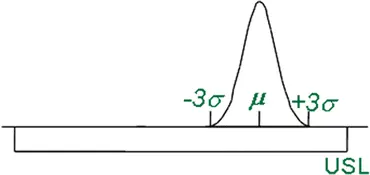

注 1：始终有 Cp ≥ Cpk。Cp 可视为一种理想化度量，适用于理想化情况。相反，Cpk 可视为实际度量。显然，Cpk > 1 是过程满足要求的必要条件。

注 2：由于我们不知道总体标准差 σ，因此用样本标准差 s 代替。用于估计 σ 的样本应代表"实际"过程，不应是具有低标准差的"理想化"样本。在下表中，我们总结了各种 Cpk 取值的解释。

| Cpk 值 | 解释 |
|---|---|
| Cpk < 1 | 没有足够空间容纳自然变异。 |
| Cpk = 1 | 刚好有足够空间容纳自然变异。 |
| 1 < Cpk < 2 | 有足够空间容纳自然变异以及过程均值的一定变化！ |
| Cpk ≥ 2 | 理想情况！均值两侧至少有 6 个标准差。 |

如前所述，无法建立通用的最小 Cpk 要求。在某些情况下，最小 Cpk 为 1.50 即被视为足够，而在其他情况下则不然。这取决于违反规格限的严重程度。当 Cpk ≥ 2 时，称该过程具有**六西格玛质量**，因为我们使用希腊字母 σ（"Sigma"）表示标准差！在这种情况下，无论是自然（随机）变异还是过程均值的变化（系统变异）都有充足的空间。

### 4.12.4 过程能力指数：重要！

在使用过程能力指数时，重要的是要认识到过程能力指数也具有统计不确定性！例如，如果 Cpk = 1.50，通常认为过程能够满足规格要求。在许多公司中，基于样本量 n = 20 的 Cpk = 1.50 即被视为满意。在这种情况下，可以证明 Cpk 的 95% 置信区间为 1.00 到 2.00。这意味着，实际上我们不知道过程是刚好能够满足规格要求（Cpk = 1.00）还是绝对能够满足（Cpk = 2.00）！在本书网站上，可以找到计算给定 n 和估计 Cpk 的 Cpk 置信区间的电子表格。

其次，重要的是要认识到过程能力指数高度依赖于正态分布！我们不仅假设数据服从正态分布作为计算基础，还计算极值（即正态分布的"尾部"）的频率，而正是在这里我们拥有的数据量非常有限！因此，检查数据是否服从正态分布极为重要。始终对正态分布进行统计检验和图形检验，并评估尾部是否存在值得关注的分布问题！参见本章前面的内容。

### 4.12.5 示例续
在20天期间内采集的咖啡袋重量数据；参见前一节关于控制图的内容。理想情况下，由于上述解释的 Cpk 估计值的统计不确定性，更多的数据值更为可取。平均值和标准差可使用电子表格函数获得。Cp 和 Cpk 使用上述公式计算。得到如下所示的结果。

| 指标 | 数值 |
|------|------|
| 平均值 | 498.52 |
| 标准差 | 2.57 |
| 规格下限 (LSL) | 485 |
| 规格上限 (USL) | 515 |
| Cp | 1.95 |
| Cpk | 1.75 |

可以发现，Cpk = 1.75。使用本书网站上的电子表格，Cpk 的 95% 置信区间为 1.17 到 2.33。因此可以安全地假设 Cpk 至少为 1.17。数据越多，该置信区间就越窄。

定性数据分析 © Springer-Verlag Berlin Heidelberg 2016 Birger Stjernholm Madsen Statistics for Non-Statisticians 10.1007/978-3-662-49349-6_5
