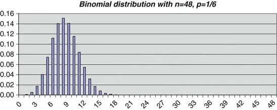
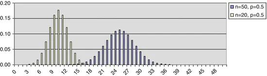
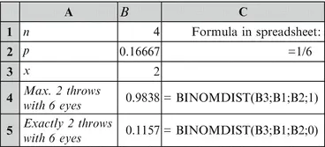
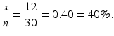
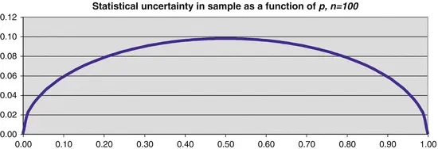
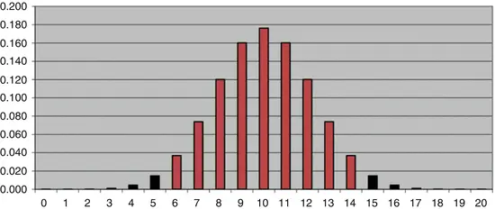
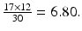
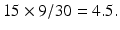
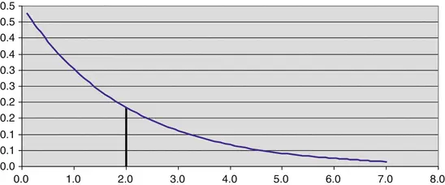
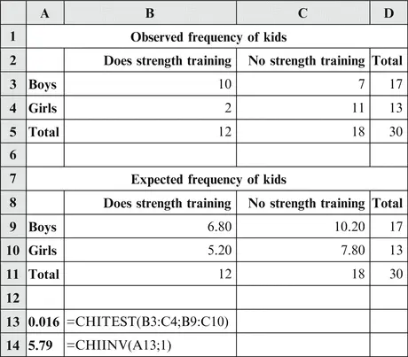

# 5. 定性数据分析

Birger Stjernholm Madsen1 (1)Novozymes A/S, Bagsvaerd, Denmark 本章我们讨论定性数据，即数据值对应总体中的组。一类特别重要的定性数据是二值数据，只有两个组（"二值"）。二值数据的一些例子：

- 抽样调查：例如，问卷调查中问题回答"是"/"否"。
- 统计质量控制：例如，将项目分类为"合格"/"不合格"。
- 游戏：例如，掷硬币的"正面"/"反面"。

二值数据由一种称为二项分布(*)的统计分布描述。它在分析调查数据时非常常用，也在许多其他情境中使用，如社会科学、经济学、管理学、科学与技术。

## 5.1 二项分布

使用二项分布的情况可以描述如下：

- 每个观测值（"试验"）可以分为两类。通常，我们称它们为"成功"和"失败"，无论其中一类是否可以说比另一类"更好"。
- 观测值被分类为"成功"的概率是恒定的。例如，在统计质量控制中，不应存在不合格品越来越频繁的趋势。
- 观测值是独立的。这意味着，例如，在问卷调查中，两个受访者不会相互影响各自的回答。

利用概率论（见[第9章](ch09.md)），可以计算在成功概率恒定为 p 的情况下，n 次观测中恰好获得 x 次成功的概率。二项分布的概率在许多书籍中都有列表（针对较小的 n 值）。它们也可以在大多数电子表格中使用统计函数计算，见后文。此外，可以证明以下结论：
在观测次数 = n、成功概率 = p 的二项分布中：

$$ \mathrm{Mean} = n\times p $$
$$ \mathrm{Variance} = n\times p\times \left(1-p\right) $$
$$ \mathrm{Standard}\ \mathrm{deviation} = \sqrt{n\times p\times \left(1-p\right)}. $$

### 5.1.1 示例

考虑一个骰子，掷出六点的概率是 1/6（约 16.7%）。我们总共掷骰子 48 次。将掷出六点视为"成功"，其他所有结果视为"失败"。换句话说，掷出六点的次数服从二项分布，其中：

- n = 48 = 掷骰次数
- p = 1/6 = 16.7% = 每次掷出六点的概率

在此分布中，我们有：
$$ \mathrm{Mean} = 48\times \frac{1}{6}=8. $$
也就是说，平均而言，48 次投掷中会有 8 次掷出六点，这大概并不令人意外。
此外：
$$ \mathrm{Variance} = 48\times \frac{1}{6}\times \frac{5}{6}=8\times \frac{5}{6}=\mathrm{约}6.67. $$
标准差是方差的平方根，即：
$$ \mathrm{Standard}\ \mathrm{deviation} = \sqrt{48\times \frac{1}{6}\times \frac{5}{6}}=\sqrt{8\times \frac{5}{6}}=\mathrm{约}2.58. $$

图 5.1 展示了该二项分布的概率。

图5.1 二项分布

可以看出，48 次投掷中不太可能得到超过（约）20 次六点。正如预期，分布集中在 8（均值）附近。

## 5.2 二项分布与正态分布
图5.2展示了二项分布与正态分布之间的相似性。

图5.2 两个二项分布

该图展示了两个二项分布。两个分布的 p=0.5，相当于抛硬币。一个分布是 n=20 次抛掷，另一个是 n=50 次抛掷。图表显示，n 越大，与正态分布的相似性越好。

有时我们会遇到 p 不等于 0.5 的二项分布（如掷骰子的例子）。如果 p 接近 0 或 1，则 n 必须非常大，二项分布才能近似于正态分布。根据经验法则，有以下条件：

正态分布可作为二项分布的近似，如果：

注意，n×p 正是"成功"次数（例如，掷出六点的次数）的均值。类似地，n×(1-p) 是"失败"次数（例如，掷出非六点的次数）的均值。我们可以使用具有相同均值和标准差的正态分布来代替二项分布。

请参见本章后面的示例。

**技术说明：** 有放回抽样与无放回抽样？

通常，我们从具有有限个体数的特定总体中抽取样本。理想情况下，抽样 (*) 应该是有放回的，以便使用二项分布来描述具有某种特征（例如，有特定爱好的人）的个体数量的分布。有放回意味着在选取样本的下一个个体之前，每个个体都被"放回"。这样，理论上可以在样本中两次（或多次）选中同一个个体，这意味着获得具有该特征的个体的概率保持恒定。

通常，样本相对于总体较小，例如小于总体的 10%。如果在这种情况下使用有放回抽样，两次（或多次）选中同一个个体的概率非常小。因此，它大致相当于无放回抽样，即每个个体只能被选中一次。

在实践中，绝大多数样本都是无放回抽取的。同时，绝大多数样本相对于总体都很小，通常小于总体的 10%。因此，在这种情况下可以使用二项分布，尽管原则上它只能与有放回抽样结合使用。

如果样本大于总体的 10% 且采用无放回抽样，则必须使用超几何分布，它比二项分布复杂得多。如果样本相对于总体较小，超几何分布与二项分布非常相似。推荐参考更高级的统计学书籍。

## 5.3 电子表格中的二项分布

如果你不使用电子表格，可以跳过本节。在 Microsoft Excel 和 Open Office Calc 中，以下函数用于计算二项分布的概率：

- BINOMDIST（数值；样本量；概率；累积）

该函数可以计算概率（例如恰好两次成功的概率）和累积概率（如最多两次成功的概率，即 0、1 或 2 次成功）（表5.1）。

表5.1 BINOMDIST 函数

| 参数 | 说明 |
| --- | --- |
| Number | 成功次数（例如，掷出六点的次数） |
| Sample size | 观察（或试验）次数（例如，掷骰子的次数） |
| Probability | 每次观察中成功的概率（例如，1/6） |
| Cumulative | Cumulative = 0 计算恰好成功次数的概率。Cumulative = 1 计算累积概率。 |

### 5.3.1 示例

例如，我们掷四次骰子，统计掷出六点的次数。换句话说，掷出六点的次数服从二项分布，参数为：

- n = 4 次抛掷
- p = 1/6 ≈ 16.7% = 每次抛掷掷出六点的概率
我们希望找到：

- 最多两次掷出六点的概率
- 恰好两次掷出六点的概率

我们将信息输入电子表格，如下所示（图 5.3）。

图 5.3 BINOMDIST 函数示例

我们发现，最多 2 次（即 0、1 或 2 次）掷出六点的概率约为 98%，也就是说，在 4 次投掷中有 3 或 4 次掷出六点的可能性非常小，这并不令人意外。而恰好 2 次（4 次中）掷出六点的概率接近 12%。

## 5.4 抽样调查中的统计不确定性

我们已经学习了二项分布的主要特征。在本节和下一节中，我们将研究其在抽样调查中最重要的应用。假设我们想通过抽样调查来估计健身俱乐部调查中儿童进行某一特定活动的相对频率（*）。例如，我们想知道有多少比例的儿童正在进行力量训练。我们可以通过抽样调查来获取这一信息。我们的估计会存在一定的统计不确定性（*），我们也要对这种统计不确定性进行估计。总体由健身俱乐部的儿童组成。总体中的相对频率对应于随机选取的一名儿童进行力量训练的概率 p。样本中进行力量训练的儿童人数可以用二项分布来描述，其中：

- n = 样本量
- p = 总体中的相对频率

假设在 n 名儿童的样本中，有 x 名儿童进行力量训练。

总体中相对频率 p 的估计值就是样本中的相对频率 x/n。

注意：这里的相对频率被解释为比例，其使用方式与发病率（例如疾病的发病率）大致相同，后者通常以百分比表示。与此相对的是（绝对）频率（*），它以数字（发生次数、个体数等）表示。

两种概率。你可以用（至少）两种不同的方式使用概率这一术语：

- 作为相对频率（比例）的表达，可以通过抽样调查或实验得出。这正是我们这里的情况。我们掌握了总体中一个比例（进行力量训练的儿童比例）。我们预期这个比例对应于随机选取的儿童进行力量训练的概率。这就是我们在此情况下使用二项分布的原因。
- 作为一种期望的表达。我们可以说某场足球比赛主队获胜的概率为 40%。这不一定基于对两队以往比赛结果的了解；也许两队之间从未有过比赛！相反，我们是在利用对两队近期一系列赛果、联赛排名、伤停球员等方面的了解。

### 5.4.1 示例

假设在 n = 30 名儿童的样本中，x = 12 人进行力量训练。我们可以用样本中的相对频率来估计总体中的相对频率 p：

也就是说，我们估计总体中有 40% 的儿童进行力量训练。

如果样本量足够大，我们可以对二项分布进行近似
可以用正态分布来近似。相对频率 $p$ 的估计值 $x/n$ 也可以用正态分布来近似。我们可以证明，该正态分布中标准差的估计值为

因此，相对频率 $p$ 的估计值 $x/n$ 的标准差为 $0.09 = 9\%$。我们现在可以构造 $p$ 的 95% 置信区间，它以 95% 的概率包含总体中的相对频率。构造方法与为正态分布的均值构造 95% 置信区间的方法相同（见[第 4 章](ch04.md)）：

这意味着，在总体中，进行力量训练的青少年的相对频率 $p$ 有 95% 的概率介于 22% 和 58% 之间。看起来，我们似乎确实不太清楚进行力量训练的青少年的比例！原因当然在于样本量不够大。如果我们增加样本量，统计不确定性就会变小，下文将对此进行更多讨论。

$\pm$ 后面的项是总体相对频率估计值的统计不确定性 (*) $u$。相对频率统计不确定性的一般公式为：

在计算中使用此公式时，将样本中的相对频率 $x/n$ 代入 $p$。

上述公式仅在样本远小于总体时适用，例如，样本量小于总体的 10%。例如，如果总体由 100 名青少年组成，那么对于 $n = 30$ 的样本量，我们不能使用该公式。样本量大于总体 10% 的情况请参见后面的文本框。换句话说：

只要样本远小于总体，统计不确定性就与总体大小无关。例如，在中国随机抽取 1000 人的样本，在统计上与在瑞典抽取 1000 人的样本具有同等的效果（或局限性！），尽管两国的人口规模差异巨大。这令许多人感到惊讶！

上述公式还有一个有趣的推论：当 $p = 0.5 = 50\%$ 时，统计不确定性最大。见图 5.4，其中我们绘制了样本量 $n = 100$ 时统计不确定性随 $p$ 变化的曲线。

图5.4 统计不确定性随 $p$ 的变化

从图中可以清楚地看出，只要 $p$ 不太接近 0 或 1（例如，如果 $p$ 在 $0.2 = 20\%$ 到 $0.8 = 80\%$ 的区间内），统计不确定性就与 $p = 0.5$ 时大致相同。换句话说：

只要相对频率不接近极端值，统计不确定性就大致恒定。

相对统计不确定性为 $u/p$；$p$ 越小，这个值就越大，见图 5.5（仍然基于样本量 $n = 100$）。

图5.5 相对统计不确定性

当相对频率
趋近于0时，相对统计不确定度会变得无穷大。这可以类比到民意调查：最接近50%的最大政党具有最大的统计不确定度。相比之下，最小的政党具有最大的相对统计不确定度。从公式可以看出，统计不确定度u与样本量n的平方根成反比。例如，若样本量扩大为原来的四倍，统计不确定度减半；反之，若样本量缩小为原来的四分之一，统计不确定度翻倍。图5.6展示了这一关系，其中p = 0.5。换句话说，这是在给定样本量下的最大统计不确定度。

图5.6 统计不确定度 vs. 样本量n

另见第9.4.5节的表格，其中展示了不同n和p值下的统计不确定度。

**技术说明：大样本下相对频率的统计不确定度。** 若样本量超过总体的10%且为无放回抽样，则相对频率的统计不确定度公式需进行修正。此时正确的统计不确定度公式如下：

其中N = 总体中的个体数。比值n/N称为抽样比(*)。当样本较小时，n/N接近于0，因此√(1 − n/N)非常接近于1。当样本量超过总体的10%时，1 − n/N明显小于1。因此，统计不确定度永远不会大于：

换句话说，可将该数值视为统计不确定度的上限。若样本相对于总体非常大，则实际的统计不确定度会小得多。

## 5.5 样本是否具有代表性？

在此我们展示上述计算的一个重要应用。我们对健身俱乐部的孩子们进行了一项调查。样本中有17名男孩和13名女孩。我们感兴趣的是：该样本在性别方面是否具有代表性，或者抽样中是否存在系统误差或偏倚(*)。更多内容见[第1章](ch01.md)和[第6章](ch06.md)。

系统误差或偏倚的一个示例：假设在某一天访问健身俱乐部，邀请所遇到的前30个孩子参与调查。假设男孩比女孩更频繁地使用健身俱乐部，那么样本的构成就会存在偏倚，即该样本在性别方面不具有代表性。

总体由健身俱乐部的所有孩子组成。俱乐部可能从登记记录中得知，其会员中有65%是男孩，35%是女孩。如果不知道总体中的相对频率，就无法使用这种方法来判断样本是否具有代表性。

现在我们要问自己：该样本在性别方面是否具有代表性？这个问题可以利用样本数据来计算总体中男孩比例的置信区间来回答。若该置信区间包含已知的（总体中的）男孩比例，则样本在性别方面具有代表性。

根据（表5.2），p的统计不确定度公式为：

表5.2 示例数据

|  |  |
|---|---|
| x = 样本中男孩数 | 17 |
| n = 样本量 | 30 |
| p = x/n = 样本中男孩的比例 | 0.567 |

那么统计不确定度 u = 0.177，p 的置信区间端点为 0.567 − 0.177 = 0.389 和 0.567 + 0.177 = 0.744，即置信区间从 38.9% 到 74.4%。可以看出，置信区间非常宽。原因当然是因为样本量不够大！

置信区间包含了总体中男孩比例已知值 65%。因此，我们认为该样本在性别方面具有代表性。到目前为止，本章研究了二项分布，包括置信区间。在本章的剩余部分，我们将研究用于调查和实验的统计检验。

## 5.6 统计检验

有时，你有一个想要确认或拒绝的假设。一个简单的例子是检查骰子或硬币是否"公正"。也就是说，掷骰子时得到六点的概率是 1/6，或者抛硬币时正面的概率是 0.5。然后你建立一个假设，例如，在此情形下假设抛硬币时正面概率 p = 0.5。通常，这是一个关于总体参数（如概率）等于某个值的假设。在统计学文献中，这个假设通常被称为零假设(*)。

假设的统计检验：目标是判断假设是否得到样本（或实验）数据的支持。

- 假设可能为真，也可能为假。
- 除非数据表明假设为假，否则我们视其为真。

实际操作如下：
1. 假设该假设为真。
2. 计算至少与观测结果一样"罕见"的结果的概率。
3. 如果这个概率很小（通常小于 5%），则拒绝该假设。否则接受它。

### 5.6.1 示例

这种方法最好通过一个例子来说明。假设我们抛一枚硬币 n = 20 次，观察到正面 x = 5 次。我们现在要问：这枚硬币是否公正？一般步骤如下：
1. 我们假设硬币是公正的，即 p = 0.5。我们假设硬币是公正的，即我们可以使用 n = 20, p = 0.5 的二项分布。因此，我们期望在 20 次抛掷中大约得到 10 次正面。图 5.7 显示了该二项分布的概率。

图5.7 示例的二项分布

2. 我们计算至少与观测结果一样罕见的结果的概率。我们观测到 20 次抛掷中出现 5 次正面，比期望值略少。至少一样罕见的结果将是 20 次中最多出现 5 次正面。通常，你还会将在"另一极端"出现至少 15 次（即 20 − 5）正面的概率加进来，这对假设来说"同样不利"。这被称为双侧检验(*)。我们可以使用电子表格轻松计算 20 次抛掷中最多出现 5 次正面的概率。这正好是上图中从 0 到 5 的条形概率之和。函数 BINOMDIST(5; 20; 0.5, 1) 给出的结果为 0.0207，即 2.07%。（这也可以在二项概率表中查到。）

同样，20 次抛掷中至少出现 15 次正面的概率相同，即 0.0207。因此，至少与观测结果一样罕见的结果的总概率为：2 × 0.0207 = 0.0414 = 4.14%。这个概率在统计"术语"中称为 p 值(*)。

3. 如果这个概率很小（通常小于 5%），则拒绝该假设。否则接受它。至少与观测结果一样罕见的结果的概率为 4.14% < 5%。因此，结论是我们拒绝该假设。
即 p = 0.5！这意味着有统计证据表明这枚硬币是伪造的！

上述方法背后的哲学如下：如果出现更"罕见"结果的概率很小，则有两种可能：

- 原假设成立，但我们观测到了一个小概率事件。

- 原假设实际上不成立。

当然，第一种可能性是存在的。如果是这样，我们确实观测到了罕见事件！然而，统计学家不相信奇迹。因此，我们更倾向于相信第二种可能性。

### 5.6.2 正态分布近似

如果你只使用计算器和正态分布表进行计算，就需要用正态分布对二项分布进行近似：在上例中，我们应使用均值 n × p = 10、方差 n × p(1 − p) = 5 的正态分布。标准差为 √5 = 2.236。在这个正态分布中，我们需要计算数据值达到（含）5 的概率。由于正态分布覆盖整个数轴（不仅限于整数值），我们实际上应求数据值达到 5.5 而非 5 的概率。因此在 x 值上加 0.5。

我们必须求出 NORMDIST(5.5; 10; 2.236; 1) 的值。最后一个参数使用 1，因为我们需要的是分布函数（而非密度函数）。结果为 2.2%。同样，乘以 2 得 4.4%，仍低于 5%。确实可以使用正态分布这一点可证明如下：当 n = 20、p = 0.5 时，有 n × p = 10 > 5 且 n × (1 − p) = 10 > 5。

### 5.6.3 显著性水平

在我们拒绝原假设之前，概率应该有多小？这个界限称为显著性水平（*）。通常我们选择显著性水平 0.05，即 5%。如果原假设成立，仍有 5% 的小概率犯错，即拒绝了一个真实的原假设。这种错误称为第一类错误（*）。如未特别说明，显著性水平为 5%。

如果拒绝真实原假设的后果非常严重，我们可以选择显著性水平 1%。选择 1% 显著性水平所付出的代价是更难检测到实际存在的差异，例如更难检测出一枚伪造的硬币。在上面的抛硬币例子中，p 值略低于 5%，但远高于 1%。如果使用 1% 的显著性水平，则接受 p = 0.5 的原假设。这意味着我们需要更有说服力的数据才能拒绝 p = 0.5 的原假设。

注意：显著性水平必须在进行统计检验之前决定。上面的抛硬币例子说明了原因：根据显著性水平的选择，你可能接受或拒绝原假设。

### 5.6.4 统计检验或置信区间

让我们在上例中为正面概率 p 构建一个置信区间。观测到正面的相对频率为 x/n = 5/20 = 0.25 = 25%。将这个 p 的估计值代入统计不确定度公式 u：

结果为 u = 0.19。因此置信区间为 p = 0.25 ± 0.19，即从 0.06 到 0.44。也就是说，p 的 95% 置信区间不包含 0.5。因此基于我们的数据，我们（至少）有 95% 的把握认为 p 不是 0.5，而对于一枚真正的硬币，p 应为 0.5。

因此，使用置信区间与使用统计检验得到了相同的结论。

要在 5% 显著性水平下对原假设进行统计检验
p = 0.5 对应于构造 p 的 95 % 置信区间，并检查该置信区间是否包含值 0.5。两种方法的优缺点各是什么？

- 置信区间给出是/否的结论。另一方面，置信区间也给出了一个可以视为可能的 p 值集合。

- 统计检验同时给出是/否结论（接受/拒绝）和更细粒度的 p 值答案。

  在抛硬币的例子中，更罕见事件的概率低于 5 %，但仅略低于。也就是说，该假设刚刚被拒绝，这不是一个非常有说服力的结论。如果 p 值小于 1 %，我们会感到更有说服力。

在本节中，我们讨论了一个分布（二项分布）中假设的统计检验。下一节将描述需要比较两个或更多分布的情况。

## 5.7 频率表

### 5.7.1 卡方检验简介

让我们看看来自健身俱乐部抽样调查的一些数据。我们仍然关注进行力量训练的儿童比例，但现在我们希望按性别对数据进行分组。如表 5.3 所示。

表 5.3 观测频率

|  | 进行力量训练 | 不进行力量训练 | 总计 |
|---|---|---|---|
| 男孩 | 10 | 7 | 17 |
| 女孩 | 2 | 11 | 13 |
| 总计 | 12 | 18 | 30 |

我们称此为频率表。这是一个 2 × 2 表（读作"2 乘 2 表"），即两行（男孩/女孩）和两列（进行力量训练/不进行力量训练）。看起来（也许并不令人意外）力量训练是男孩的事情。我们可以通过计算每个性别进行力量训练的儿童百分比来说明这一点。如表 5.4 所示。

表 5.4 行百分比

|  | 进行力量训练 (%) | 不进行力量训练 (%) | 人数 |
|---|---|---|---|
| 男孩 | 59 | 41 | 17 |
| 女孩 | 15 | 85 | 13 |
| 总计 | 40 | 60 | 30 |

我们看到 59 % 的男孩进行力量训练。相比之下，只有 15 % 的女孩进行力量训练。在样本中总计有 40 % 的儿童进行力量训练。

这是基于比较两个比例的"主观"评估，而非客观的统计检验来判断比例是否存在差异。

在上面的例子中，很明显男孩和女孩进行力量训练的比例确实存在差异；我们几乎不需要统计检验。但在其他情况下，比例可能只有微小差异；这时结论就不那么明显了，需要像统计检验这样的客观标准，这样我们才不会存疑。

这里我们介绍一种可用于需要比较两个相对频率（比例）的情况的统计检验。

原假设是男孩和女孩进行力量训练的比例相同。这意味着行与列之间是独立的，即进行力量训练与性别无关。

我们使用该假设的统计检验。我们采用一般方法：
1. 我们假设原假设成立。
2. 我们计算得到至少与观测结果同样罕见的结果的概率。

首先，让我们考虑如果原假设成立，频率会是多少。那么儿童进行力量训练的比例对于男孩和女孩是相同的，即等于 40 %。这不一定得到整数，如表 5.5 所示。

表 5.5 期望频率

|  | 进行力量训练 | 不进行力量训练 | 总计 |
|---|---|---|---|
| 男孩 | 6.80 | 10.20 | 17 |
| 女孩 | 5.20 | 7.80 | 13 |
| 总计 | 12.00 | 18.00 | 30 |

例如，我们计算期望的 6.80 名男孩进行力量训练，即 17 名男孩的 40 %：17 × 0.40 = 6.80。40 % 可以写成 12/30 = 0.40 = 40 %。这意味着表格"左上角"的计算可以写成：

注意此公式中使用的频数——它们在上表中以粗体突出显示。类似地，其他频数也被计算出来。我们称这些频数为期望频数，原始频数称为观测频数。如果观测频数远离期望频数，则必须认为假设为假。在展示概率计算之前，需要强调的是，一个必要条件是所有期望频数至少为 5。这里满足该条件。我们需要一个度量来衡量观测频数与期望频数之间差异的大小。

观测频数与期望频数之间差异的度量可使用以下公式计算：

其中：
- O = 观测频数
- E = 期望频数

Σ 是"求和符号"，即我们必须将所有 4 个此类数值相加，因为有 4 个观测频数和 4 个期望频数。结果记为 。χ 是希腊字母 Chi（读作"凯"），对应英文字母"ch"。χ² 读作"卡方"。

χ² 的计算如下：

如果所有观测频数与期望频数相同，则 χ² = 0。较小的 χ² 值对我们的假设是"有利"的——这表明观测频数与期望频数接近。较大的 χ² 值对假设是"不利"的——这表明观测频数与期望频数相差甚远。现在我们需要求出得到比上述计算值更大的 χ² 值（即对假设"更不利"）的概率。可以证明，我们必须使用所谓的卡方分布(*)（或 χ² 分布）。在这种情况下，我们说使用自由度为 1 的卡方分布(*)（更多内容见后文）。我们可以通过查阅[第 9 章](ch09.md)中卡方分布（自由度为 1）的表格来粗略估计该概率。结果如下：

- 97.5% 分位数为 5.02。
- 99% 分位数为 6.63。

这意味着得到大于 5.79 的值的概率介于 1% 和 2.5% 之间。可以证明（见第 5.7.4 节），该概率实际上为 0.016，即 1.6%。

3. 如果此概率很小（通常小于 5%），则拒绝假设。否则，接受假设。

我们已经看到，得到 χ² 大于 5.79 的概率介于 1% 和 2.5% 之间。由于这低于 5%，我们拒绝"进行力量训练的比例与性别无关"这一假设。这与我们之前的预期一致。在下图中，我们看到自由度为 1 的卡方分布的密度函数。可以看出，值 5.79 在该分布中相当"极端"（图 5.8）。

图 5.8 示例中的卡方分位数

### 5.7.2 两个比例之差的置信区间

本节可省略而不影响连贯性。我们已在上文看到，有统计证据表明女生和男生进行力量训练的比例确实存在差异。很自然地会问：两个比例之间的差异有多大？

男生和女生进行力量训练的估计比例分别为 p₁ = 59% = 0.59 和 p₂ = 15% = 0.15，因此我们估计两个比例之差为 p₁ − p₂ = 0.59 − 0.15 = 0.44。

统计不确定性
两个比例之差的估计不确定度可以通过以下公式计算：

这里 p₁ 和 p₂ 分别是男孩和女孩中进行力量训练的比例，n₁ 和 n₂ 分别是样本中男孩和女孩的总频数。根据本章前面的表格，我们得到 n₁ = 17 和 n₂ = 13。使用上述公式，我们得到两个比例之差的统计不确定度 u = 0.30。两个比例之差为 0.44。因此，差值的 95% 置信区间为 0.44 ± 0.30。置信区间从 0.09（14%）到 0.79（74%）。置信区间不包含 0，这与两个比例相同的假设被拒绝的事实一致。看起来我们对这个差异的大小了解得不多（除了它不为 0）。如果需要更窄的置信区间，必须增大样本量。

### 5.7.3 多行和/或多列

上面描述的统计检验通常可用于比较多个分类分组中的多个分布。因此，表中可以有超过两行和/或两列。作为示例，让我们回到[第 2 章](ch02.md)中所示的表 2.12。健身俱乐部的孩子们被问及是否进行心血管锻炼。此外，他们还被问及如何看待自己的体能状况。下表显示了两个问题所有组合的儿童频数（表 5.6）。

表 5.6 示例中的观测频数

| 心血管锻炼？ | 差 | 中 | 好 | 合计 |
| :- | :-: | :-: | :-: | -: |
| 否 | 6 | 6 | 3 | 15 |
| 是 | 3 | 6 | 6 | 15 |
| 合计 | 9 | 12 | 9 | 30 |

我们将检验体能状况是否与心血管锻炼无关。假设是各行之间的相对频率（比例）相同，即心血管锻炼不影响体能状况。可以使用与上述相同的过程，即首先计算期望频数。期望频数如表 5.7 所示。例如，进行心血管锻炼且体能状况差的儿童的期望频数计算如下：

表 5.7 示例中的期望频数

| 心血管锻炼？ | 差 | 中 | 好 | 合计 |
| :- | :-: | :-: | :-: | -: |
| 否 | 4.5 | 6.0 | 4.5 | 15 |
| 是 | 4.5 | 6.0 | 4.5 | 15 |
| 合计 | 9.0 | 12.0 | 9.0 | 30 |

我们观察到几个期望频数小于 5，但都没有小于 4.5。严格来说，不允许使用上述方法；但这几乎不会造成很大问题。现在我们可以使用以下公式计算 χ²：

计算结果为 2.00。自由度为多少？
应该用于卡方分布？一般来说，公式为：

在这个例子中，有两行（否/是）和三列（差/中/好）。因此，自由度为 DF = (2-1) × (3-1) = 1 × 2 = 2。在[第9章](ch09.md)的表中，自由度为2的卡方分布95%分位数为5.99。我们计算出的值为 χ² = 2.00，远小于95%分位数，即得到更大值的概率（很可能）远大于5%。因此，我们接受身体素质与进行心血管锻炼无关这一假设。这并不一定意味着该假设成立，只是我们没有统计证据拒绝它。

我们也可以使用电子表格中的 CHITEST 函数直接计算概率（见下一节），得到大约37%，远大于5%。下图为自由度为2的卡方分布的密度函数。显然，2.00 这个值在分布中绝非"极端"值（图5.9）。

图5.9 示例中的卡方分位数

从频率表中，人们可能会认为不进行心血管锻炼的孩子的身体素质比进行锻炼的孩子差。然而，数据中并没有统计证据支持这一假设！

**注意：** 接受行变量与列变量之间独立的假设。当假设被拒绝时，这本身并不能保证两个变量之间存在因果关系！而且，即使存在因果关系，统计检验也无法判断哪个变量是因、哪个变量是果。

两个变量之间也可能存在"间接关系"，即两个变量都与第三个变量相关。我们将在[第7章](ch07.md)中结合定量变量讨论这个问题。本章介绍了一些在抽样调查和实验的统计分析中有用的技术。下一章，我们将讨论抽样调查和实验规划中的一些问题。首先，我们展示如何最简便地使用计算器或电子表格进行上述计算。

### 5.7.4 电子表格中的计算

如果你不使用电子表格，可以跳过本节。我们使用健身俱乐部的观察频率表
按性别分组进行力量训练的儿童（图 5.10）。

图 5.10 电子表格中的卡方检验

首先解释一下期望频数：例如，单元格 B9 的计算方式为 17 × 12/30。因此，单元格 B9 的公式可以编程如下：

不过，如果将单元格 B9 编写如下会更方便：

美元符号是"绝对引用"；更多信息请参阅电子表格的帮助文档。如果将单元格 B9 复制到 B9:C10 区域（即所有期望频数），引用将保持正确，它们始终指向正确的单元格。计算出期望频数后，剩下的就很简单了。请看单元格 B13，了解如何使用电子表格函数 CHITEST。对于 CHITEST 函数，需要指定观测频数所在的单元格（单元格 B3:C4）和期望频数所在的单元格（单元格 B9:C10）。

结果即为 p 值，即得到至少与观测结果同样极端的结果的概率。p 值约为 0.016 或 1.6%。之前我们发现 p 值在 1% 到 2.5% 之间。我们得不到 χ² 的具体数值，但其实我们并不需要它！如果确实需要，可以按单元格 A14 所示的方法计算。我们从 p 值出发进行"逆计算"，使用函数 CHIINV。对于 CHIINV 函数，需要指定 p 值和自由度，本例中自由度为 1。结果与之前得到的 5.79 相同。

### 5.7.5 用计算器计算

如果不使用计算器，可以跳过本节。你需要一台具备对数功能的科学计算器。我们使用健身俱乐部中按性别分组进行力量训练的儿童的观测频数表（表 5.8）。

表 5.8 计算器计算所用数据

|            | 力量训练 | 无力量训练 | 合计 |
|------------|---------|-----------|------|
| 男孩       | 10      | 7         | 17   |
| 女孩       | 2       | 11        | 13   |
| 合计       | 12      | 18        | 30   |

还有另一种计算 χ² 的公式，在计算器上使用更为简便。其结果与上述公式几乎一致。样本量越大，两者的一致性越好。在表中，我们计算每个数字的贡献值，包括小计和总计。每个贡献值的形式为 x × ln(x)，其中 x 是表格中的一个数字，ln 是自然对数函数，大多数科学计算器都提供此功能。将 2 × 2 表中观测频数和总计对应的贡献值相加，再减去其余贡献值（对应每行和每列的小计）。最后乘以 2。在本例中，计算过程如下：

最终得到的 χ² 值与之前的结果非常接近，结论也保持不变。这个公式的优点在于我们无需计算期望频数，当行列数较多时，这可以省去不少麻烦。但使用这种方法时，我们无法控制所有期望频数至少为 5 这一必要条件。一个简单的解决方案是，使用最小的行合计和最小的列合计来计算最小期望频数，该值应大于 5。本例中，行合计为 17 和 13，最小值为第 2 行的 13；列合计为 12 和 18，最小值为第 1 列的 12。因此，第 2 行第 1 列得到最小期望频数，之前已计算为 5.20 > 5。

## 误差来源与规划

© Springer-Verlag Berlin Heidelberg 2016
Birger Stjernholm Madsen
Statistics for Non-Statisticians
10.1007/978-3-662-49349-6_6
