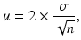

# 6. 误差来源与规划

Birger Stjernholm Madsen1 (1)Novozymes A/S, Bagsvaerd, Denmark

## 6.1 两种误差

我们在[第3章](ch03.md)中看到，数据中存在两种变异：系统变异和随机变异。因此，在抽样调查和规划实验中存在两种误差来源：

- **系统误差**，通常称为**偏倚**：真实值与均值之间的差异。
- **随机误差**：均值周围的离散程度。

如图6.1所示。图6.1 系统变异与随机变异

增加样本或实验的规模可以减小随机误差。这在规划阶段可用于确定适当的样本或实验规模。我们在本章的第一部分讨论这个问题。之后是一些与抽样调查专门相关的主题。首先，延续[第1章](ch01.md)的讨论，我们讨论抽样调查中系统误差的各种来源。我们还概述了抽样或样本选择的原则。

## 6.2 随机误差与样本量

随机误差来自引起变异的一般性原因，这些原因导致了自然变异。自然变异反映在均值周围的离散程度上。这种离散在某种程度上始终存在。抽样调查或实验中的个体永远不会完全一致。以下考虑基于一个基本条件：

- 实验或样本必须通过**随机化**来组织。这意味着实验应按随机顺序进行，或抽样应通过随机选择机制进行（更多内容见本章后面部分）。
- 随机化是估计统计不确定性的必要条件！

在规划抽样调查或实验时，我们常常面临一个问题：应该选择多大的样本量？首先需要考虑的是对样本或实验中的每个个体记录什么。粗略地说，有两种情况：1. 我们记录一个定性变量，通常是一个二分类变量，例如"是/否"。2. 我们记录一个定量变量，即每个个体的一个数值。

### 6.2.1 定性变量

定性变量通常与抽样调查相关，但也可能出现在规划实验中。我们在[第5章](ch05.md)中看到，相对频率的统计不确定性由下式给出：

这里n是样本量，p是一个回答类别（例如对某个问题回答"是"）的相对频率。在此公式中，我们使用样本中的相对频率x/n作为p的估计值。该公式要求样本量n足够大，以满足n × p > 5和n(1 − p) > 5的条件。另一方面，样本量最多应不超过总体的10%（如果是无放回抽样），参见[第5章](ch05.md)。

在实际计算中，我们可以安全地将1.96替换为2。结果没有重要差异，而且使计算简单得多。因此，我们使用更简单的公式：

如[第5章](ch05.md)所示，当p = 0.5 = 50%时，该公式给出最大值。如果我们代入p = 0.5，该公式可以简化为以下相对频率最大统计不确定性的表达式：

这个公式非常简单！然而，我在其他统计学书籍中从未见过它！几个例子：

- 当n = 100时，最大统计不确定性为u = 1/√100 = 1/10 = 0.1 = 10%。
- 当n = 10000时，最大统计不确定性为u = 1/√10000 = 1/100 = 0.01 = 1%。
该公式可用于估计达到给定最大统计不确定性所需的样本量。若最大统计不确定性必须为 u，则有： 这是我们可以使用的最小样本量。该公式非常有用！

注意：上述公式假设样本量小于总体量的 10%。如果公式计算出的样本量大于总体量的 10%，则统计不确定性会变得更小。因此，使用上述公式确定样本量是偏安全的。

技术说明：如果样本相对于总体较大，在这种情况下，统计不确定性可能远小于上述公式确定的值。参见[第 5 章](ch05.md)末尾，其中给出了统计不确定性的正确公式。所需的样本量会小得多。最简单的方法是将[第 5 章](ch05.md)的公式编入电子表格，然后尝试不同的样本量，直到获得所需的最大统计不确定性。作为起始值，你可以使用 n = 1/u²。

#### 6.2.1.1 示例

来自抽样调查的一个示例：在[第 5 章](ch05.md)中，我们发现，在 Fitness Club 调查的 n = 30 名儿童中，有 x = 12 人进行力量训练。因此样本中的相对频率为 x/n = 12/30 = 0.4 = 40%。我们还发现统计不确定性为 0.18 即 18%。如果我们认为这个统计不确定性太大，可以使用样本量公式。如果希望最大统计不确定性为 0.1 = 10%，则可求得最小样本量 n = 1/u² = 1/(0.1)² = 100。显然，上述公式也可用于总体的子群体。该公式会分别为每个子群体求出 n 值。例如，我们希望分别对男孩和女孩都获得相当准确的估计，那么可以对每个性别分别应用该公式。我们指定男孩进行力量训练的相对频率可接受的最大统计不确定性，由此得出样本中需要包含的男孩人数。对女孩可进行同样的计算。

### 6.2.2 定量变量

定量数据经常出现在抽样调查以及计划实验中。我们在[第 4 章](ch04.md)中看到，如果标准差已知，平均值的统计不确定性近似为其中 σ 为标准差，n 为样本量。严格来说，我们应该将 2 替换为 1.96。然而，这在实践中影响不大。如果我们已知标准差 σ 并希望平均值的最大统计不确定性为 u，则可求得所需样本量为：我们无法在不了解所测量指标离散程度的情况下确定样本量！

注意：在计划实验时，我们也经常使用"样本量"这一术语！

#### 6.2.2.1 示例
下面是一个计划实验的例子，但它同样可以是一个样本调查。我们想用特殊小麦品种进行面包烘焙实验。我们想评估添加一种特殊添加剂（旨在增加面包体积）对面包体积的影响。从之前的实验我们知道，面包体积的标准差大约为 σ = 10 ml。我们希望对两个平均值（添加和不添加添加剂的面包）的最大统计不确定度均为 u = 5 ml。如果使用 n 的公式，我们得到 n = (2 × 10/5)² = 4² = 16。为了安全起见，我们应该选择每组（添加/不添加添加剂）烘焙 n = 16 个面包。实验中总共应烘焙 2 × 16 = 32 个面包。严格来说，我们不需要同时指定标准差 σ 和统计不确定度 u。只需指定 σ 与 u 的期望比值即可。也许我们并不精确知道标准差，但我们可能希望最大统计不确定度是所得标准差的一半。这意味着我们要求 σ/u 至少为 2。现在我们用 σ/u = 2 代入公式，再次得到每组所需样本量 n = 16。

#### 6.2.2.2 注释

1. 如果公式算出的 n 值很小（例如小于 10），我们必须谨慎。实践中，实验的必要规模可能更大。我们使用因子 2 来构造均值的置信区间。严格来说，我们应该使用自由度为 n − 1 的 t 分布的 97.5% 分位数（见[第 4 章](ch04.md)）。如果 n 小于 10，97.5% 分位数大于 2，参见书末的 t 分布表。
2. 在大多数样本调查中，我们通常只有一个组。因此，我们可以直接使用 n 的公式从整个总体中得到所需样本量。
3. 在大多数实验中，我们通常关心比较两个或多个组（"处理"）。因此，你可能更倾向于确定获得两个均值之间给定统计不确定度所需的样本量。详见[第 8 章](ch08.md)。

到目前为止，我们一直在讨论样本（或实验）的所需规模。这取决于我们能接受多大的随机误差。本章剩余部分将聚焦于样本调查。我们将更详细地讨论偏倚（系统误差）。此外，我们还将讨论如何进行抽样（样本选择），以便尽可能避免偏倚。

## 6.3 偏倚（系统误差）

在[第 1 章](ch01.md)中，我们讨论了与样本调查相关的一些误差，特别是问卷中的误差。偏倚（*）或系统误差源于特定的原因，这些原因通常可以被识别。通过消除这些特定原因，原则上可以避免偏倚。样本调查（问卷）中偏倚的主要原因有：1. 访谈过程和问题措辞引起的误差。2. 无应答引起的误差。3. 抽样（样本选择）中的误差。4. 样本定义中的误差。在[第 1 章](ch01.md)中我们讨论了第 1 点和第 2 点。现在，我们讨论第 3 点和第 4 点。

### 6.3.1 抽样（样本选择）中的误差

抽样（*）或样本选择应尽可能使用随机化（*）。我们将在下一节讨论这一点。不使用随机化，而是使用某种"便利样本"的危险在于可能存在偏倚，因为我们会得到某类人太少而另一类人太多的情况。典型的例子是互联网投票和电视节目期间的电话投票。

- 哪些人在某一天使用某个特定网站并且愿意投票？
- 哪些人在观看某个电视节目并且愿意打电话表达意见？

这未必是总体的代表性样本！

#### 6.3.1.1 示例

健身俱乐部调查可以通过让访问员访问俱乐部并"随意"选择一些在场的孩子来组织。这种组织方式的缺点是
以这种方式进行调查的问题是，我们不知道选择了哪种类型的孩子。我们可能会得到很多经常使用俱乐部的孩子！也许我们也对其他孩子感兴趣……也许我们想找出为什么有些孩子使用俱乐部的频率较低！
### 6.3.2 样本定义中的误差

理想的情况是你拥有一个包含整个总体的数据库（登记册）。这样可以很容易地提供一个抽样框，从中选择纳入样本的个体。抽样框可以是数据库的一个独立副本，反映选择样本时的状态。从抽样框中选择的个体称为抽样单元（*）。抽样单元可能与总体中的个体相同，也可能是来自总体的一组个体。总体通常由个人组成，而抽样框可能由家庭组成。从抽样框中选取若干家庭，再从每个家庭中选择一个或多个个人。在这种背景下，我们将个人称为分析单元。不完整的抽样框是抽样调查中偏倚的常见来源，这意味着抽样框与总体不完全对应。可能的原因包括：
- 总体中的某些个体无法成为样本的一部分。例如，如果抽样框仅由私人家庭组成，那么居住在机构中的人就无法成为样本的一部分。
- 抽样框不是最新的。从选择到访问之间通常存在时间差。在此期间，总体可能会发生变化！例如，抽样框中的某个人可能在访问前就已去世。
- 抽样框因其他原因而不完整或不正确。例如，家庭名单可能基于不完整或不正确的道路和门牌号清单。

#### 6.3.2.1 示例

健身俱乐部每月打印一份所有使用俱乐部的孩子的名单。抽样调查通过从该名单中选取一些孩子来进行。在这种情况下可能出现问题：
- 名单中的某个孩子在访问时已退出俱乐部。
- 名单打印后有新孩子加入俱乐部。

### 6.3.3 什么是代表性样本？

"代表性样本"一词有多种用法，但从未被明确定义。最好避免使用这个术语。如果需要定义，可能是这样的：如果样本中仅存在随机误差（即没有偏倚），则可以称为代表性样本。根据这一定义，代表性样本调查并不存在！因此，代表性样本可以被视为一种理想状态！总是存在偏倚，但我们可以采取很多措施来减少它！
重要提示：

- 只有随机误差会随着样本量的增大而变小！

- 偏倚不会随着样本量的增大而变小！

例如，如果抽样单元是家庭，并且我们从每个家庭中选择第一个可用的人，我们往往会得到过多的女性和过少的男性，因为女性的平均工作时间比男性短。增加样本量不会改变这一情况！无论样本量多大，我们仍然会得到过多的女性和过少的男性……
## 6.4 抽样（样本选择）

在本节中，我们描述抽样（*）或样本选择的主要原则。如前所述，抽样应基于随机化（*）；否则可能导致系统误差。因此，最重要的抽样方法都基于随机化。我们还简要介绍其他一些不基于随机化的方法。
### 6.4.1 简单随机抽样
这是基本方法。简单随机抽样（*）实际上就是一场巨大的抽奖！本章开头给出的统计不确定性计算公式均假设采用简单随机抽样。如果样本是通过其他机制选择的，这些公式就不正确！如果需要计算与其他抽样方法相关的统计不确定性，请参考抽样调查方面的专业书籍。

如今，简单随机抽样是通过统计软件或电子表格中的随机数来完成的。在电子表格中，可以使用 RAND 函数。该函数无需参数：=RAND() 这会生成一个介于 0 和 1 之间的随机数。从抽样框中选取 n 个抽样单元的一般方法可概括如下：1. 对抽样框中的每个抽样单元使用 RAND 函数。2. 根据随机数的值对所有抽样单元进行排序。3. 选取前 n 个抽样单元，其中 n 为所需样本量。

### 6.4.2 分层抽样

分层抽样（*）是一种将总体划分为同质组（称为层，strata；单数形式为 stratum）的方法。在每一组内采用简单随机抽样！进行分层的主要原因是可以显著降低统计不确定性。反之，也可以在不增加统计不确定性的情况下显著减少样本量！当各层是同质的，即层内变异较小，而层间变异较大时，就会出现这种情况。

让我们设想一个假设的例子：假设男性和女性对某个特定问题的看法完全分歧。例如，所有男性都会对某个问题回答"是"，而所有女性都会回答"否"。在这种情况下，样本不需要很大就能覆盖总体！实际上，样本量为 2 就足够了（一男一女）……更大的样本不会提供更多信息！这个例子当然是完全假设的！然而，如果实际情况与这个假设例子有某种相似之处，那么分层仍然会带来巨大的收益。例如，如果大多数男性会对该问题回答"是"，而大多数女性会回答"否"。

如果我们有来自先前抽样调查的数据，就可以利用这些数据来规划新的抽样调查。通常有一个最重要的变量。然后我们可以进行一些统计分析，确定对该变量影响最大的因素。这些因素随后用于分层。用于此目的的统计技术是第 5、7 和 8 章讨论方法的延伸。分层的其他原因可能包括：1. 行政原因。这可能是按地理标准进行分层。在这种情况下，与简单随机抽样相比，统计不确定性很少会大幅降低，甚至可能更大。2. 某些组（层）特别令人感兴趣。我们希望确保所有层在样本中都得到充分代表。当总体中存在需要单独结果的小群体时，这一点尤其重要。3. 在总体不同群体中采用不同原则进行抽样。例如，有些人住在养老院而非普通住宅。抽样所涉及的实际问题差异很大。

#### 6.4.2.1 示例

在健身俱乐部抽样调查中，按年龄分层可能是一个好主意。实际上，12 岁和 17 岁的人在几乎所有方面都存在巨大差异……我们可以设置两个层：12–14 岁儿童和 15–17 岁儿童。按性别分层也可能有意义。这取决于调查的主要目的。你还可以按
例如，在控制了年龄和性别之后，总共使用四个层。应该从每个层中选择多少个个体？通常，我们会根据各层在总体中的规模选择相应数量的个体。如果一个群体是另一个群体的两倍大，我们通常会从这个群体中选择比另一个群体多一倍的个体。在某些情况下，我们会对某些群体进行过度抽样，对另一些群体进行不足抽样。例如，某些群体具有特殊的研究意义。此时，在计算样本平均值时，我们必须计算加权平均值。也就是说，我们将每个群体的平均值乘以其在总体中的权重。如果总体中的一个群体是另一个群体的两倍大，那么这个平均值在计算时应具有两倍的权重。

### 6.4.3 整群抽样

整群抽样（cluster sampling）(*) 基于由抽样单元组成的抽样框，每个抽样单元又包含若干个分析单元。经典的例子是家庭，它由若干个人组成。我们通过简单随机抽样选择若干家庭。然后，我们可以从该家庭中选择一个人、所有人或者例如一半的人。在此情境下，抽样单元（一个家庭）通常被称为一个群。整群抽样主要用于行政和成本方面的原因——你可能拥有以家庭为单位的抽样框，但没有以个人为单位的抽样框。

与整群抽样相关的统计不确定性通常比使用简单随机抽样时更大。当群内的个体相似时就会出现这种情况。假设我们关注成年人的电视观看情况。在大多数由两名成年人组成的家庭中，他们会一起看电视节目。如果你问他们前一天看了哪些电视节目，你会从家庭中的两个成年人那里得到相同的回答！换句话说，询问两个成年人相比只询问其中一个并没有获得额外信息！当然，这是一个简化的描述。例如，其中一人可能在购物，而另一人在家看电视。只要总体仅由成年人组成，这种描述就是相当正确的。

在某些情况下，整群抽样的统计不确定性比简单随机抽样更小。如果群内个体之间存在巨大差异，就会出现这种情况。假设我们仍然将总体限定为成年人，并且我们关注的是他们对卫生巾的消费情况。这种情况正好相反：由两名成年人组成的家庭通常是一男一女；因此，他们对卫生巾的消费量会有非常大的差异！

#### 6.4.3.1 示例

对特定学校的学生进行抽样可分为两个阶段进行：
- 首先，我们从所有班级的抽样框中通过简单随机抽样选择若干班级。
- 然后，从每个选中的班级中通过简单随机抽样选择若干名学生。

我们使用整群抽样，因为它只需要已选中班级的学生名单！

如何选择抽样单元和分析单元？

我们通过简单随机抽样选择若干抽样单元。这一步至少有（两）个选项：
- 抽样单元以相同概率被选中。
- 抽样单元以与规模成比例的概率被选中：抽样单元越大（例如，家庭或班级），被选中的概率越大。

从每个抽样单元中，选择一个或多个分析单元。这一步有若干选项：
- 选择一个分析单元。
- 选择所有分析单元。
- 选择与抽样单元规模成比例数量的分析单元。抽样单元越大，必须选择的分析单元越多。

这个话题非常广泛。我们建议参考关于该主题的专业书籍。

### 6.4.4 系统抽样

如果你没有以数据库形式存在的抽样框
你可以使用系统抽样（systematic sampling）——尽管名字如此，它仍然是基于随机化的。在简单随机抽样不可行的情况下，系统抽样可被视为一种实际可行的方法。下面通过一个例子来最好地说明这种方法。

#### 6.4.4.1 示例

在健身俱乐部调查中，我们有一份俱乐部所有孩子的名单。总共有 300 人；我们选取 30 个孩子作为样本。因此，我们必须从名单中每隔十个孩子选取一个。这种抽样方法中唯一的随机化是第一个孩子的选取！
- 我们在 1 到 10 之间选择一个随机数，例如 7。我们从名单中选择 7 号孩子。
- 然后我们每隔十个孩子从名单中选取一个。这意味着我们将选取 7 号、17 号、27 号，依此类推。

该方法可用于选择进入商店的顾客，邀请他们参与问卷调查。如果需要每隔十位顾客选取一位，我们可以使用完全相同的方法。统计不确定性可能比使用简单随机抽样时更大或更小——很难事先判断会是哪种情况。

### 6.4.5 配额抽样

我们现在简要讨论一些不基于随机化机制的抽样方法。这些方法应尽可能避免使用，因为我们无法评估随机误差的大小。话虽如此，有些情况下随机化确实不可行。配额抽样通常用于访谈者在购物中心等情况。对顾客进行简单随机抽样并不可行——无法准备抽样框。取而代之的是，访谈者需要"填满"一定数量的配额。我们常按性别划分若干年龄组：例如，男性 15–29 岁、30–44 岁等。访谈者需要在每个组中获取一定数量的人。访谈者有机会在潜在候选人出现时"发现"他们。这样看来，我们似乎以合理的"代表性"方式覆盖了总体。然而，我们没有任何机会来证明这一点。样本可能在性别和年龄方面具有"代表性"，但可能还有许多其他标准导致样本存在偏差（"不均衡"），而我们对此一无所知！同时，我们对统计不确定性的大小也毫无概念。

### 6.4.6 目的抽样

这种技术被用作获取快速样本的简便方法，样本与总体相似。我们可能对总体有详细了解，因此可以抽取少数"典型"抽样单元。这是在没有任何随机化的情况下有目的地进行的。如果运气好（并且足够聪明！），我们可以由此获得一个与总体非常相似的样本。抽样单元通常是一个由若干分析单元组成的行政单元。这种方法的缺点与配额抽样相同。

#### 6.4.6.1 示例

选举后的早期出口民调可以通过选取少数"典型"市镇来制作，这些市镇相当精确地"反映"了全国情况。在每个市镇中，我们利用对该市镇的了解，选取少数几个投票站，以"代表性"地"覆盖"该市镇。在每个投票站，我们询问若干选民他们的投票情况。选民的选取可以通过例如系统抽样来完成。

### 6.4.7 便利抽样

样本以"随意"方式选取——可能是志愿者、"朋友和亲戚"等。此类样本调查没有统计价值！请参见本章前面关于互联网民意调查和电话民意调查等的讨论。然而，这类样本不必完全否定：它们可用于测试（部分）问卷，以评估一个或多个问题的措辞是否需要修改。这通常称为试点调查。我们只关心对问卷的定性（而非统计）评估。在[第 5 章](ch05.md)中，我们讨论了如何分析来自样本调查或实验的定性数据。在本章中，我们讨论了与规划样本调查或实验相关的各个方面。在接下来两章中，我们将描述
              ，如何分析来自抽样调查或实验的定量数据。

关系评估© 施普林格·费尔拉格柏林海德堡 2016比格尔·斯蒂恩霍姆·马森非统计学工作者的统计学10.1007/978-3-662-49349-6_7