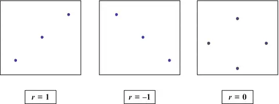
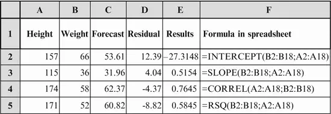
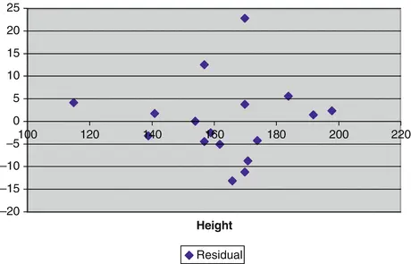
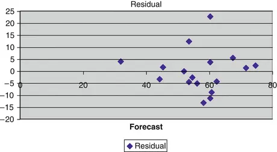
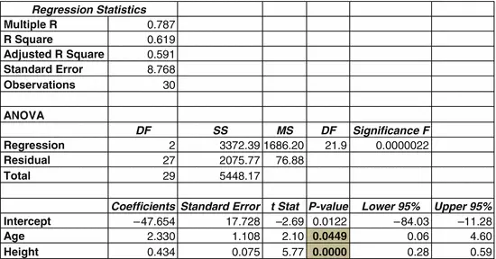

# 7. 关系评估

Birger Stjernholm Madsen1 (1)Novozymes A/S, Bagsvaerd, Denmark 在许多不同学科中，你需要评估两个变量之间是否存在关系。这可以应用于行政管理、社会科学、经济学、工业生产和科学领域。目的可能包括：
- 获取对某一领域的基本理解
- 寻找现象的原因或解释
- 尝试预测未来发展趋势

    我们研究一些评估关系的技术，并判断一个看似存在的关系是真实存在还是仅仅是统计巧合。这种技术称为回归分析(*)。我们只考虑基本技术——线性回归，它假设两个变量之间存在线性关系，即Y对X的散点图显示数据点围绕一条直线分布。其中一个变量是Y变量或因变量，另一个变量是X变量或自变量。本主题的讨论较为简要。如果你想深入学习，请参考文献列表。计算相当复杂。你可以使用内置回归分析的高级计算器，但更好的选择是使用电子表格或统计软件。还有更高级的回归分析类型，例如非线性回归或多元回归（多个X变量）。你可以从文献列表中的许多书籍中了解更多，或研究电子表格或其他统计软件的帮助文档。本章讨论线性回归的基本概念，并提供一个实际示例。我们不展示不同统计量的计算公式。这些公式仅在你没有电子表格（或其他软件）或高级计算器进行计算时才重要！这里，我们使用Microsoft Excel、Open Office Calc以及其他多种电子表格的统计函数。Microsoft Excel还在加载项菜单"数据分析"下的"回归"项中提供了额外的选项。
    重要的是要批判性地使用这些技术。提出诸如以下问题：
    - 是否存在关系？
    - 是否为线性关系？
    - 是否存在因果关系？

    注意：统计学可以判断两个变量之间是否存在统计关系，是线性关系还是可能更复杂（非线性）。但统计学无法判断一个现象是否是另一个现象的原因，即是否存在因果关系。这需要专业知识。社会和自然科学中的许多变量随时间而增长。在这种情况下，任何变量对任何其他变量的散点图都会显示相当明显的关系。然而，这是统计关系，而非因果关系。真正的关系——以这种方式被隐藏的——是两个变量都随时间增长。这是在解释统计结果时相当常见的错误。假设某个地区在特定时期内鹳的数量和儿童数量都在增长；你不能得出结论说鹳带来了孩子！这是我们在报纸文章中经常发现的一种错误结论。潜在的（第三）变量不一定总是时间，但经常如此。
## 7.1 示例
我们来考虑健身俱乐部调查中 17 名男孩的身高和体重。我们提出以下问题：身高（X）和体重（Y）之间是否存在（可能的线性）关系？我们假设体重依赖于身高，因此我们将身高设为 X，体重设为 Y。其中一个目的可能是识别那些相对于身高来说体重过重的男孩——这些男孩可能对强化的减肥计划感兴趣！第一步始终是绘制数据。以下是体重对身高的散点图。此外，我们还可以看到对数据拟合最佳的直线。这条直线通过**最小二乘法（*）**建立。有关该方法的详细回顾，请参阅参考文献中的相关书籍。这条直线称为**回归线（*）**。查阅电子表格的帮助文档以了解如何操作（图 7.1）。

图 7.1 体重 vs. 身高

一个统计模型可以描述这些数据。该模型通过以下方程描述了一个随机选择的男孩在已知其身高 X 的情况下的体重 Y：

$$ Y = a + b \times X + e $$

如果忽略 e 项，这正是一条直线的方程。其中：

- X = 男孩身高
- Y = 男孩体重
- a = 回归线的截距（Y 轴上）
- b = 回归线的斜率
- e = Y 的随机变异（对于给定的 X 值），通常称为残差

如图 7.2 所示。

图 7.2 回归线

有时需要对数据进行变换以获得线性关系。如果数据点倾向于聚集在一条（非线性）曲线周围，那么通过对 Y 和/或 X 进行变换（例如使用对数函数），看似非线性的关系可以变为线性。在体重对身高的散点图中，没有明显的非线性关系迹象。

为了描述 X 与 Y 之间的（线性）关系程度，我们使用**相关系数（*）**，通常简称为相关系数，用字母 r 表示（表 7.1）。

表 7.1 相关系数 r 是一个介于 −1 和 1 之间的数，其解释如下：

| r 值 | 含义 |
|------|------|
| r = −1 | 完全的线性关系，直线向下倾斜 |
| r = 1 | 完全的线性关系，直线向上倾斜 |
| r = 0 | X 与 Y 之间无（线性）关系 |

如图 7.3 所示。

图 7.3 相关性

实际情况通常没有那么明确！体重对身高的散点图相当于 r > 0 的情况。通过目视检查，大多数人可能会认为 r 可能更接近 1 而不是 0。我们将在下面确定 r 的值。

有时我们使用 r²，即 r 的平方值，它是一个介于 0 和 1 之间的数，作为衡量 X 与 Y 之间（线性）关系程度的指标。它通常写作 R²（即使用大写的 "R"）或 R-SQUARE（R 平方），也称为决定系数。可以说 R² 表示了 Y 的变异中被 X "解释" 的比例。

这可以用于比较不同的模型。有时从图形中很难判断是否应该对 Y 变量等进行变换（通常使用对数变换）。如果从图形中难以判断，我们可以选择给出最高 R-SQUARE 值的模型。

请注意，相对较高的 R-SQUARE 值并不保证线性关系是对数据的充分描述。始终也要查看散点图！

## 7.2 电子表格中的线性回归

以下显示的是男孩数据，但仅列出了前几行。数据在电子表格中一直延续到第 18 行（图 7.4）。

图 7.4 电子表格示例

为了执行线性回归，我们使用以下电子表格函数：
- INTERCEPT（截距）
- SLOPE（斜率）
- CORREL（相关系数）
- RSQ（R 平方）
- FORECAST（预测）
注意：还有一个名为 PEARSON 的工作表函数用于计算相关系数。这只是 CORREL 函数的别名；原因是相关系数通常被称为皮尔逊相关系数。

前四个函数的输入参数是 Y 和 X 变量的数据单元格。参见 F 列中的公式；公式应用的结果在 E 列中给出。

C 列显示模型预测的体重值。它们对应于回归线上的点，即我们从某个点垂直移动（向上或向下），直到碰到回归线。

预测值是使用 FORECAST 函数计算的。该函数的输入参数如下：首先是 X 的值，即你想要预测 Y 值的那个 X。然后是 Y 和 X 的相关数据单元格范围。例如，单元格 C2 的内容是这样编程的：

`FORECAST(A2;$B$2:$B$18;$A$2:$A$18)`

注意：我们使用了"绝对引用"（美元符号）来显示 Y 和 X 的数据单元格范围（参见[第 5 章](ch05.md)频数表部分）。这意味着你可以将单元格 C2 的内容向下复制到整个 C2:C18 区域，只有实际 X 值的引用会发生变化！另请参阅电子表格的帮助文档。

我们看到（Y 轴上的）截距为负。我们可以计算该统计量的 95% 置信区间；该置信区间的范围从 −66.7 到 12.1。（例如，可以在 Microsoft Excel 中使用"数据分析"加载项菜单中的"回归"菜单项计算。）这意味着 0 在置信区间内，这是合理的。这对应于身高 0 cm 的男孩体重为 0 kg 这一事实！

斜率（SLOPE）约为 0.5，表示身高每增加 1 cm，体重增加 0.5 kg。

相关系数约为 0.76（正数，且如预期更接近 1 而非 0）。

R² 值为 0.58；这与相关系数的平方值相同。

体重对身高的散点图及回归线在本章开头已展示。

D 列包含残差，即每个数据点到回归线的垂直距离。它们可以计算为 B 列（体重）与 C 列（预测值）之间的差值，即 Weight−Forecast（体重−预测值）。

残差对模型检验非常有用。你可以使用[第 4 章](ch04.md)中的一些方法来检验残差是否服从正态分布。此处略过。

此外，我们可以绘制残差对自变量 X 或其他变量的散点图。在图 7.5 和图 7.6 中，我们展示了残差对身高以及残差对体重预测值（"预测值"）的图表。

图 7.5 残差 vs 身高

图 7.6 残差 vs 预测值

观察这些图形，没有明显的"模式"。这正是我们所期望的：残差应该只显示随机波动！

残差也可用于识别极端观测值，例如体重过重的男孩。这可以通过计算残差的标准差来实现；残差的均值始终为 0。残差的标准差很容易求得为 8.68；这就是随机变异的标准差。

正态分布的 95% 分位数为 1.645。这可以从附录（[第 9 章](ch09.md)）的正态分布表中查得。因此，如果残差大致服从正态分布，则大于 1.645 倍随机变异标准差（即 14.3）的值应该以 5% 的概率出现。

这也可用于识别未来体重过重的男孩。如果一个未来的男孩客户提供他的身高和体重信息，且他的体重超过预期体重 14.3 kg 以上，可以建议他参加强化减肥计划。他的预期体重可以使用上面求得的截距和斜率计算为 −27.31 + 0.515 × 身高。

当然，也可以对调查中的女孩数据进行类似计算。女孩的截距和斜率是否与男孩相似，并非先验确定的。

## 7.3 是否存在关系？
根据以上分析，我们接受身高（作为X）和体重（作为Y）之间的关系可以用线性关系来描述。现在我们提出下一个问题：回归线是否与简单平均值不同，即回归线实际上是否可以是水平的？如果是，则两个变量之间不存在（线性）关系。因此，我们提出以下假设：

该直线是水平的，即 b = 0。这等价于：两个变量之间的相关系数为 0。

我们使用[第5章](ch05.md)中的一般方法进行假设检验：

1. **假设**：我们假设该假设为真。

2. **计算p值**：即得到更"极端"结果的概率。在这种情况下，可以证明应计算

   

   其中，n = 观测数（示例中 n = 17），r = 相关系数（r = 0.7645）。将这些值代入公式，得到 t = 4.59。该统计量服从自由度为 n − 2 的 t 分布。由于需要计算截距和斜率两个参数，我们将样本量减去 2 而非 1。这里 n = 17，即自由度为 15。如果 r = 0，则 t = 0；如果 r > 0，则 t > 0；如果 r < 0，则 t < 0。如果 r 远离 0，则 t 也将远离 0。对于远离 0 的负值和正值 r，均拒绝假设 r = 0。换句话说：我们在 t 分布的"两端"拒绝该假设。

   我们可以在自由度为 15 的 t 分布表（见[第9章](ch09.md)附录）中查得，99.5% 分位数为 2.947。因此，得到大于 4.59 的概率（很可能远）小于 0.5%。得到小于 −4.59 的概率也小于 0.5%。总之，t 值比 ±4.59 更"极端"的概率小于 1%。下图显示了自由度为 15 的 t 分布的密度函数。显然，值 4.59 在该分布中相当"极端"（图7.7）。

   
   图7.7 t分布的分位数

3. **决策**：如果该概率很小，则拒绝该假设，否则接受它。

   这里我们发现 t 值更"极端"的概率小于 1%，即拒绝假设 b = 0。我们得出结论：有统计证据表明身高和体重之间存在（线性）关系。使用 Excel 插件菜单"数据分析"中的"回归"菜单项，可以创建斜率的 95% 置信区间，该区间从 0.28 到 0.75。再次得出结论：斜率不为 0，即该直线不能是水平的。

### 7.3.1 注释

上述 t 检验与许多其他统计学书籍中给出的 b = 0 的 t 检验完全相同，并可通过 Excel 菜单"数据分析"下的"回归"或其他统计软件进行计算。上述 t 检验公式的优势在于其计算更为简便，无需专门的统计软件，仅需计算相关系数。相关系数几乎可以在所有电子表格中轻松计算，包括 Open Office Calc。此外，还有许多高级计算器可以计算相关系数。如果您拥有 Excel（插件菜单"数据分析"，菜单项"回归"）或更高级的统计软件，则无需手动计算 t 统计量。

## 7.4 多元线性回归
> 本节可以安全跳过，不会影响连贯性。

我们简要举例说明具有两个或以上 X 变量的多元线性回归。这可以通过统计软件或 Microsoft Excel 加载项"数据分析"中的"回归"功能来完成。

我们已经看到，男孩的身高对其体重有显著影响。假设我们想研究儿童的年龄和身高与其体重的可能关系。这正是多元线性回归所做的。

在本例中，我们使用所有 30 名儿童的数据，包括年龄和身高（作为 X）以及体重（作为 Y）。你可能希望先分别对男孩和女孩进行此统计分析，以确保结果相似；实际情况也确实如此。

如果你使用 Microsoft Excel 加载项"数据分析"中的"回归"功能输入这些数据，将得到以下输出。其他统计软件包的输出类似。

图7.8 多元回归输出

|---|
| 多元回归 |

年龄和身高的 p 值已突出显示。可以看出，年龄和身高与体重均具有统计显著的关系（尽管年龄的 p 值略低于 0.05）。我们的解释是，除了身高的影响外，年龄对体重也有影响。

同样，该模型的残差可用于模型控制，以及识别极端观测值，例如体重过重的儿童。

这是一个庞大的主题，我们建议查阅更高级的统计学书籍以获取更多细节。

## 7.5 总结

在本章中，我们将 X 变量视为与 Y 变量一样的"随机"变量。因此，讨论两个变量之间的关系（即相关系数）是有意义的。

有时，X 被视为"给定"变量，例如时间。我们不会认为时间是以随机方式变化的。在这种情况下，讨论 X 和 Y 之间的"相关性"是没有意义的。然而，上述所有计算都可以完全相同的方式进行。此时 t 检验仅被解释为检验直线是否水平，即 b = 0。只是 t 检验的解释有所不同！

在本章中，我们讨论了如何评估两个变量之间的关系。在下一章中，我们将讨论另一个重要问题：比较两组。

比较两组 © Springer-Verlag Berlin Heidelberg 2016 Birger Stjernholm Madsen《非统计学家的统计学》10.1007/978-3-662-49349-6_8
