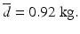
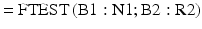

# 8. 比较两组

Birger Stjernholm Madsen1 (1)Novozymes A/S, Bagsvaerd, Denmark 在本章中，我们回顾比较两组（或多组）数据的最重要统计工具。例如，我们可能想要评估体育锻炼对儿童体重的影响。这可以通过两种不同的方式来评估：

- 在计划实验中：我们选择一组受试者（即儿童）并测量他们的体重。然后他们必须每天锻炼一段时间，之后我们再次测量他们的体重。我们比较实验前后的体重。
- 在样本调查中：我们考虑两组儿童：一组不经常锻炼的儿童和另一组经常锻炼的儿童。我们比较这两组儿童的体重。

这两种方法说明了比较两组数据的两种主要技术。我们将通过具体示例来回顾这些技术。最后，我们提到这些统计技术的一些扩展。

## 8.1 匹配对：配对t检验

### 8.1.1 示例

健身俱乐部调查中的女孩被选中参加一项实验，她们必须每天至少锻炼1小时，持续4周。除此之外，她们不改变自己的生活方式。这项实验的目的是调查女性顾客中密集减肥计划的潜力。在这种情况下，我们需要比询问儿童体重更精确的数字。因此，我们测量了她们实验前后的体重；数据见表8.1。

表8.1 实验数据

| 之前 | 之后 | 差值 |
|------|------|------|
| 42 | 42 | 0 |
| 58 | 57 | 1 |
| 58 | 56 | 2 |
| 40 | 41 | -1 |
| 49 | 48 | 1 |
| 80 | 77 | 3 |
| 50 | 49 | 1 |
| 48 | 49 | -1 |
| 49 | 47 | 2 |
| 34 | 33 | 1 |
| 33 | 32 | 1 |
| 43 | 43 | 0 |
| 44 | 42 | 2 |

乍一看，实验前后的体重差异似乎很小。然而，该表格确实提供了每个儿童实验前后的体重差值。可以看出，在大多数情况下（13例中有9例），体重略有下降，但也有一些女孩的体重与实验前相同甚至略有增加。图8.1展示了差异的直方图。

图8.1 差异直方图

从图中可以明显看出，分布的"中心"位于0的右侧。此外，分布看起来相当对称，可能服从正态分布。

### 8.1.2 描述

我们有一组数据值对。一对中的两个数据值属于两个不同的组。我们关心的是两组之间是否存在差异。该技术最常见的应用是在计划实验数据的统计分析中。情况可能如下：我们有n个个体，每个个体都接受了两种"处理"。我们想要检验两种处理之间是否存在差异，并可能找出平均差异。这种情况称为匹配对。

### 8.1.3 计算

假设是差值的均值为0，即两组之间没有差异。我们采用一般方法：

1. 我们假设原假设为真。
2. 计算p值，即得到更"极端"结果的概率。

均值差
差异的平均值估计为：
我们还计算差异的标准差为 s = 1.19。很自然地将平均差与 s/√n（标准误的估计值）联系起来（见[第 4 章](ch04.md)）。因此我们计算：
这称为**配对 t 检验**。在本例中，我们得到 t = 2.803。该统计量服从 **t 分布**。**自由度**为 n − 1，因为我们有 n 个差异（见[第 4 章](ch04.md)"小样本情况下均值的置信区间"一节）。一旦计算出差异，原始数据就不重要了，也就是说，重要的是差异的数量。
在本例中，有 13 个差异，即自由度为 12。如果所有差异均为 0，则 t = 0。t 接近 0 的值对我们的假设是"好"的。t 远离 0 的值对假设是"坏"的。因此，如果 t 远离 0，我们拒绝该假设。这对应于远离 0 的平均差。

- 自由度为 12 的 t 分布的 **99% 分位数**为 2.681。
- 自由度为 12 的 t 分布的 **99.5% 分位数**为 3.055。

因此，获得更大 t 值的概率在 0.5% 到 1% 之间。通常，我们会加上在相反侧获得至少同样"极端"的 t 值的概率。这对假设同样"坏"！因此，更极端结果的概率在 1% 到 2% 之间。图 8.2 展示了自由度为 12 的 t 分布。显然，值 2.803 在分布中相当"极端"。

图 8.2 t 分布的分位数
3. 如果这个概率很小，我们拒绝该假设。
由于概率小于 2%，我们拒绝该假设。这意味着有统计证据表明实验前后体重的平均差不为 0。在本例中，平均差为正，即体重有所下降。现在我们已经证明确实存在体重差异。接下来的问题是：平均差有多大？
这个问题可以通过计算平均差的 **95% 置信区间**来回答；有关内容见[第 4 章](ch04.md)。置信区间计算如下：
对于 t，我们使用自由度为 n − 1 的 t 分布的 97.5% 分位数。这给出了 95% 置信区间，即该区间以 95% 的概率包含平均差的真实值。在书末的 t 分布表中，我们查得自由度为 12 的 t 分布的 97.5% 分位数为 2.179。将其代入公式，得到置信区间 0.923 ± 0.718，即平均差以 95% 的概率落在 0.205 到 1.641 之间。
### 8.1.4 电子表格

使用电子表格，我们可以直接计算 **p 值**，即通过 TTEST 函数计算比上述值 2.803 更极端的 t 值的概率：
计算 t 检验的 p 值（表 8.2）。

**表 8.2** TTEST 函数

| 参数 | 说明 |
|------|------|
| Data1 | 组 1 的数据单元格 |
| Data2 | 组 2 的数据单元格 |
| Tails | Tails = 1 表示仅在 t 分布的一侧拒绝假设；Tails = 2 表示在 t 分布的两侧拒绝假设，即同时考虑 t 的小值和大值（通常情况） |
| Type | Type = 1 表示配对数据（本节）；Type = 2 表示比较两组均值，要求两组标准差相等；Type = 3 表示一般情况下的两组均值比较（下一节） |
数据可能位于单元格A2:A14（"之前"数据）和B2:B14（"之后"数据）中。现在我们使用如下函数：

我们使用：
- 尾部数 = 2，因为我们在分布的两侧均拒绝假设。
- 类型 = 1，因为我们执行配对t检验。

结果为0.016 = 1.6%。因此出现更极端t值的概率约为1.6%。对比之下，我们在上述检验中发现p值介于1%和2%之间。使用TTEST函数时，我们无需计算差值！我们直接得到p值，并将其与0.05进行比较。

## 8.2 比较两个组的均值

### 8.2.1 示例

我们想要检验健身俱乐部调查中男孩和女孩的体质是否存在差异。目的是调查在招募新客户参加高强度减肥计划时，是否应对潜在男性客户和潜在女性客户采用相同的方式。在这个背景下，有几个不同的参数是相关的：例如可以比较他们的体重。然而这并不合适，因为差异可能源于身高和/或年龄的不同。因此，我们计算他们的身体质量指数（BMI），即：

这是一个国际公认的衡量标准。例如，一个身高2.00米、体重100公斤的人，其BMI为100/2² = 100/4 = 25。
- BMI低于20被认为低于正常。
- BMI在20–25之间为正常。
- BMI在25–30之间为超重。
- BMI超过30为严重超重。

这里所有孩子的数值都保留一位小数。我们使用了身高和体重的问卷调查数据（表8.3）；完整数据表见书末。
表8.3 BMI数据

| 女孩 | 男孩 |
|------|------|
| 18.0 | 26.8 |
| 28.1 | 19.2 |
| 21.4 | 17.8 |
| 15.2 | 19.6 |
| 17.8 | 23.6 |
| 23.7 | 16.3 |
| 15.8 | 19.8 |
| 21.5 | 22.1 |
| 30.4 | 19.4 |
| 21.1 | 21.6 |
| 23.0 | 19.9 |
| 33.5 | 21.2 |
| 19.5 | 27.2 |
|      | 20.6 |
|      | 17.0 |
|      | 21.9 |
|      | 28.7 |

图8.3是男孩和女孩BMI的合并直方图。
图8.3 BMI数据直方图

乍看之下，女孩和男孩的BMI分布似乎没有显著差异。我们希望通过统计检验来确认这一点。首先，我们计算每组（即女孩和男孩分别）的平均值和标准差（表8.4）。
表8.4 两组数据

| 女孩 | 男孩 | 计算 | 符号 |
|------|------|------|------|
| 22.22 | 21.34 | 均值 |  |
| 5.53 | 3.52 | 标准差 $S_i$ | |
| 13 | 17 | 数值个数 $n_i$ | |
| 12 | 16 | 自由度 $n_i-1$ | |

我们可以将女孩命名为"组1"（i = 1），男孩命名为"组2"（i = 2）。均值差（即平均值之间的差）为22.22 − 21.34 = 0.88。

### 8.2.2 描述

该技术可用于分析来自抽样调查和计划实验的数据。我们有两组数据值。我们感兴趣的是两个组的均值是否存在差异（如果存在，我们想要估计均值差）。这两个组可能是总体中我们希望通过抽样调查进行比较的两个不同的个体组，也可能是在计划实验中接受两种不同处理的两个个体组。

### 8.2.3 计算
假设是均值差为 0，即两个均值相等。

1. **假设**是均值差为 0，即两个均值相等。
2. 我们**假定该假设为真**。
3. 我们**计算 p 值**，即得到更"罕见"结果的概率。注意：在电子表格中计算 p 值很容易，参见下一节。现在我们计算如下：

该统计量包含每组的均值、标准差和数据个数。这称为**双样本异方差 t 检验**。与双样本等方差 t 检验（见后文）不同，该 t 检验允许两组的方差不相等。在例子中，我们得到 t = 0.50。这个 t 值需要与 t 分布中的某个分位数进行比较。那么自由度是多少呢？

- 自由度的值永远不会小于最小那组的自由度。
- 自由度的值永远不会大于两组自由度之和。（当两组的标准差和数据个数都相同时，会出现这种情况。）


**技术说明：双样本异方差 t 检验中的自由度。**
计算精确自由度的公式相当复杂：



在例子中，我们得到 f = 19.2，四舍五入为 19。在例子中，自由度最小为 12，最大为 28。这与使用上方公式得到的 f = 19 是一致的。

如果两个均值相等，则 t = 0！t 值接近 0 对假设来说是"好"的。t 值远离 0 对假设来说是"坏"的。因此，如果 t 远离 0，我们将拒绝假设。

从书末的表中可得：自由度为 19 的 t 分布的 90% 分位数是 1.328。我们计算出的 t 值为 0.50，小于 1.328。因此，得到更大 t 值的概率（很可能远）大于 10%。通常，我们会把得到至少同样"极端"的另一侧 t 值的概率也加进来。这对假设同样"坏"！因此，得到更极端结果的概率大于 20%。

3. 如果这个概率很小，我们就拒绝假设。

由于观测到的概率大于 20%，我们接受假设。

我们还可以使用以下公式计算均值差的 95% 置信区间：

其中 t 使用 t 分布的 97.5% 分位数。这样就得到 95% 置信区间，即该区间有 95% 的概率包含均值差的值。自由度的确定方法如文中的文本框所示；在例子中，我们得到 19 个自由度。在书末的 t 分布表中，我们查得自由度为 19 的 t 分布的 97.5% 分位数为 2.093。代入公式后，得到置信区间为 0.88 ± 3.68。均值差有 95% 的概率位于 -2.79 到 4.56 之间。该区间包含 0，这与接受假设的事实是一致的。

注意：如果两组都较大（例如超过十个数据值），我们可以近似使用正态分布的分位数代替 t 分布的分位数，即 97.5% 分位数约为 2。在上面的例子中，t 分位数为 2.09 而不是 1.96，差异并不大。

### 8.2.4 电子表格
使用电子表格，我们可以直接用 TTEST 函数计算 p 值，即 t 值比上述计算值 0.50 更罕见的概率。数据可位于单元格 B1:N1（女生）和 B2:R2（男生）中。我们如下使用该函数：我们使用：

- 尾部数 = 2，因为我们在分布两侧拒绝假设。
- 类型 = 3，因为我们进行两组的均值比较的 t 检验。

结果为 0.62 = 62%。因此，t 值更罕见的概率约为 62%。相比之下，我们在上述检验中发现 p 值大于 20%。使用 TTEST 函数时，我们无需进行任何计算！我们直接得到 p 值，并可与 0.05 进行比较。

### 8.2.5 实验规模

假设两组的方差相同且等于 σ，样本量相同且等于 n（大于 10）。则两组均值之差的统计不确定度为  该数值就是两个均值之差的置信区间中"± 之后"的数字；见上文。这可用于确定为获得两组均值之差的给定统计不确定度 u 所需的样本量。所需样本量为  这里，n 是每组所需的样本量，即总样本量为 2 × n。一般来说，如果有多于两组，n 乘以组数。该公式的使用方式与[第 6 章](ch06.md)给出的公式相同。它最常用于实验规划。实验通常涉及比较两个或多个组；而在大多数抽样调查中，通常只有一组。

## 8.3 两组的其他统计检验

### 8.3.1 两组方差齐性检验

有时你可能关心两组的方差（或标准差）是否相同。这可以通过 F 检验来考察，此处我们不作详细讨论。大多数电子表格中都有 FTEST 函数。F 检验使用 F 分布。该分布相对复杂，因为它需要两个自由度参数（每组一个）。不过，对于 FTEST 函数，你只需指定两组的数据区域。在示例中，我们有女生在单元格 B1:N1 和男生在 B2:R2 的 BMI 数据。我们想检验女生和男生方差（或标准差）相同的假设。我们可以使用 FTEST 函数如下： 结果为两个方差相等的假设的 p 值。该 p 值为 0.093，即 9.3%。因此，我们接受两个方差相等的假设。

### 8.3.2 比较两组均值：方差相等的两个样本

还有第三种 t 检验：用于比较两组均值的 t 检验，假设两组的方差（或标准差）相同。这可以先用 F 检验进行考察。你可以在电子表格中通过选择 TTEST 函数中的类型 = 2 来进行此 t 检验。应考虑使用该 t 检验的情形如下：

- 两个方差（或标准差）几乎相同（用 F 检验验证）。
- 一个样本明显小于另一个样本，数据值少于十个。
在这种情况下，你获得了比上一节t检验更多的自由度。这是一个优势，因为更容易检测到实际存在的差异！不过一般来说，并不太需要这种t检验！在BMI数据的例子中，我们接受了两个方差相等的假设。因此，在这种情况下我们可以使用这个t检验（即 Type = 2）。这样得到的p值为0.60，实际上和之前几乎相同。

## 8.4 方差分析（ANOVA）

### 8.4.1 引言

在本章中，我们学习了比较两个组的两种主要技术。还有一种技术可以看作是t检验的扩展：方差分析（Analysis of Variance*，简称ANOVA）。方差分析虽然名中带"方差"，但实际上是用来比较均值的！一个简单的ANOVA示例是比较多个组均值（即两个或更多组）。在Microsoft Excel中，可以通过加载项菜单"数据分析"中的"方差分析：单因素"来使用。遗憾的是，Open Office或其他电子表格软件中没有提供ANOVA功能。单因素ANOVA在分析样本调查数据和计划实验数据时都非常有用！有些实验涉及两个或多个因素，这些因素定义了分组。这就是双因素或多因素ANOVA，大多数统计软件包都提供此功能。参见本书末尾的精选统计软件包列表。在Microsoft Excel中，你可以进行双因素ANOVA，但仅限于简单情况，即两个因素定义的所有组中数据值数量相同（或可能只有1个）。这个条件在分析样本调查数据时通常不满足，但在分析计划实验数据时通常成立。双因素或多因素ANOVA常用于分析计划实验数据！在本书中，我们无法深入探讨ANOVA这一主题。我推荐参考更高级的统计学教材，例如Douglas Montgomery的《实验设计与分析》（Wiley出版社）。为了让大家对单因素ANOVA有个基本了解，我们来看一个示例。

### 8.4.2 示例

我们之前使用t检验比较了女孩和男孩的平均BMI。实际上，我们可以在两种t检验之间选择：一种要求方差相等，另一种更通用的t检验允许方差不相等。ANOVA模型要求方差相等！现在，我们使用单因素ANOVA来分析这些数据，尽管我们也可以使用t检验。当我们有两个组时，可以（如上所示）使用F检验来检验方差是否确实相等。在多于两个组的一般情况下，可以使用其他检验方法。最常用的检验称为Bartlett检验。Excel中没有此检验，但在本书配套网站上可以找到模板。在Microsoft Excel的加载项"数据分析"中，我们使用菜单项"方差分析：单因素"，只需指定输入数据的范围即可。完成后，我们得到以下输出结果。

**方差分析：单因素**

| 组别 | 计数 | 总和 | 平均值 | 方差 |
|------|------|------|--------|------|
| 女孩 | 13 | 288.89 | 22.222 | |
| 男孩 | 17 | 362.76 | 21.339 | |

**方差分析**

| 差异源 | SS | df | MS | F | P值 | F临界值 |
|--------|----|----|----|----|-----|--------|
| 组间 | 5.75 | 1 | 5.747 | 0.284 | 0.60 | 4.20 |
| 组内 | 565.88 | 28 | 20.210 | | | |
| 总计 | 571.63 | 29 | | | | |

输出结果由一个汇总表和一个方差分析表组成，其中组间变异与组内变异进行了比较。详细内容可以在更高级的统计学教材中找到。主要结果是p值。
计算结果为0.60。这实际上与要求方差齐性的t检验所得的P值完全相同。然而，方差分析可以用于两个以上的组！该示例的结论再次表明，女孩和男孩的平均BMI相等的假设被接受。

## 8.5 结束语

你现在已经掌握了足够的统计学知识，可以开始在实践中加以运用了！同时，你也具备了阅读更高级统计学书籍的充分基础（如需要，可参考附录中精选的参考文献）；在附录中，你还会找到许多有用的在线统计学资源以及统计学软件概述。祝你在后续的统计学工作中一切顺利！

附录 © Springer-Verlag Berlin Heidelberg 2016 Birger Stjernholm Madsen《非统计学家的统计学》10.1007/978-3-662-49349-6_9