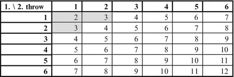
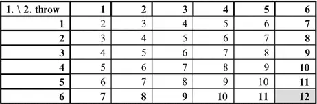
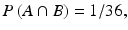
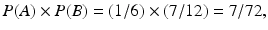
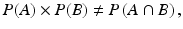
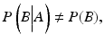
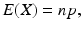
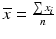
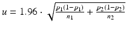
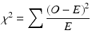

# 9. 附录

Birger Stjernholm Madsen1 (1)Novozymes A/S, Bagsvaerd, 丹麦
## 9.1 概率论

主要对应用统计方法感兴趣的读者可以安全地跳过本附录。概率论为数学倾向的读者提供了对基本统计概念（例如[第4章](ch04.md)和[第5章](ch05.md)中解释的统计分布，即二项分布和正态分布）更好的理解。特别地，本附录的目的之一是更好地理解二项分布。此处只解释与本书统计概念相关的基本概率论概念。如需更全面地了解概率论，请参考其他书籍。概率论起源于中世纪，当时用于分析游戏中的问题，例如掷骰子。即使在今天，大多数概率论入门也使用游戏中的例子。这样做的好处是这些例子相对简单。在本附录中，通过仅使用最少数学符号的例子直观地解释概率的基本术语。如需更完整的概率论解释，请参阅其他书籍，例如 Sincich TL, Levine DM, Stephan D, Sincich T and Berenson M (2002) Practical statistics by example—using Microsoft excel and Minitab. 2nd ed. Prentice Hall, NJ.
### 9.1.1 样本空间、事件与概率

当记录观察结果（例如在调查中）或测量结果（例如在实验中）时，存在若干结果(*)。所有可能结果的集合称为样本空间(*)。样本空间的子集称为事件(*)。事件（或结果）的概率(*)是一个介于0和1之间的数字，表示该事件发生的可能性。如果有限样本空间中的所有结果具有相同的概率（等可能），则有以下结论：

事件概率 = （该事件的结果数）/（样本空间的结果数）。概率的其他说法包括：在不良结果的情况下称为风险，在有利结果的情况下称为机会。在本附录中，我们只考虑有限样本空间。一个事件可以只包含一个结果，甚至可以是空事件，即不包含任何结果。另一方面，一个事件也可以涵盖整个样本空间。
#### 9.1.1.1 示例1

掷骰子时，可能的结果是1、2、3、4、5或6点。样本空间由所有这六个结果组成。事件示例包括：1. 骰子显示偶数点，即2、4或6。2. 骰子显示奇数点，即1、3或5。3. 骰子显示最多3点。4. 骰子显示恰好3点。如最后一个示例所示，事件可以只包含一个结果。示例1和2中的事件是互补事件。这意味着：
- 这两个事件互斥，即这两个事件没有共同的结果。
- 这两个事件共同包含样本空间中的所有结果。

两个互补事件的概率之和为1。如果我们能计算一个事件的概率，互补事件的概率就可以通过1减去它来计算。有时计算互补事件的概率更容易！
#### 9.1.1.2 示例2

掷两次骰子：有36种结果；所有结果被认为是等可能的。下图显示了所有结果的总点数（图9.1）。图9.1 示例
在这个例子中，我们研究事件："总点数大于3"。这个事件的概率是多少？互补事件是"总点数最多为3"。容易看出该事件的结果数为3（阴影区域，见图的左上角），即该事件的概率为3/36 = 1/12。因此，原始事件的概率为1 - 1/12 = 11/12。在这个例子中，计算互补事件的概率更容易。
#### 9.1.1.3 示例3
掷一枚骰子两次：36种结果；所有结果被视为等可能（图9.2）：

图9.2 示例

在本例中，我们研究事件："总点数是6的倍数。"可以看到该事件的结果总数为6（阴影区域）。因此，"总点数是6的倍数"这一事件的概率为6/36 = 1/6。该事件等价于"总点数是6"（5种结果）或"总点数是12"（1种结果）这两个事件中某一个发生。它们的概率分别为5/36和1/36。从数学上讲，该事件是两个互斥事件的并集。

另一种求该事件概率的方法是将两个单独事件的概率相加；同样得到5/36 + 1/36 = 6/36 = 1/6。这说明了"加法法则"：

两个互斥事件中任一事件发生的概率等于各事件概率之和。

#### 9.1.1.4 示例4

掷一枚骰子两次：36种结果；所有结果被视为等可能（图9.3）：

图9.3 示例4

在本例中，我们研究事件："总点数是12。"该事件仅包含1种结果（右下角，阴影区域）。该事件的概率为1/36。可以看出，该事件等价于"第1次掷出6点"和"第2次掷出6点"这两个事件同时发生。这两个事件的概率均为6/36 = 1/6，因为它们各包含6种结果（分别为第6行和第6列，以粗体显示）。从数学上讲，该事件是两个独立事件的交集。可以看出，该事件的概率也可以由两个单独事件概率的乘积求得，即1/6 × 1/6 = 1/36。如果两个事件交集的概率恰好等于各事件概率的乘积，则称这两个事件是独立的(*)。这意味着第二次掷出6点的概率不依赖于第一次是否掷出了6点。

这也表述为：在第一次掷出6点的条件下，第二次掷出6点的条件概率为1/6，即与无条件概率相同。无论第一次的结果如何，第二次掷出6点的概率始终为1/6。

#### 9.1.1.5 示例5

掷一枚骰子两次：36种结果；所有结果被视为等可能（图9.4）：

图9.4 示例5

在本例中，我们研究事件：

事件A："第一次掷出的点数为1。"
事件B："总点数至少为7。"

可以看出，事件A包含6种结果（第一行，以粗体显示），因此A的概率为P(A) = 6/36 = 1/6（字母P是"概率"的缩写）。可以看出，事件B包含21种结果（阴影区域，对角线加右下半部分），因此B的概率为P(B) = 21/36 = 7/12。事件A与B的交集A∩B仅包含一种结果，即右上角。该事件的概率为P(A∩B) = 1/36。

由于

且

我们看到

因此，根据例4的定义，A和B并不独立。另一种判断A和B不独立的方法是同时计算条件概率与无条件概率：若事件B在事件A发生条件下的条件概率等于B的无条件概率，则称事件A和B相互独立。换句话说，知道A发生与否对B的概率没有影响。事件B在A发生条件下的条件概率记为P(B|A)。在第一行中，有六个结果（事件A）。其中，有一个结果包含在B中。因此，我们看到P(B|A) = 1/6。B的概率为7/12。由我们再次看到A和B不独立。

实际上，在上表中，我们可以很容易地看到总点数至少为7的概率如何取决于第一次投掷的点数。第一次投掷的点数越大，总点数至少为7的概率就越大。如果第一次投掷的点数为6，那么总点数至少为7的概率实际上是100%。如果两个事件不独立，则称它们为相依事件。相依事件在现实生活中经常出现！例如，一个人患肺癌的概率（或风险）取决于他是否吸烟：对于非吸烟者，风险可能为1%；对于吸烟者，风险可能高达10%。

### 9.1.2 随机变量；二项分布

随机变量(*)是样本空间上的一个数学函数。该数学函数通常就是恒等函数！例如，在例1中，样本空间由结果1、2、3、4、5或6（骰子的点数）组成。随机变量就是数字本身，即显示的点数，不进行任何数学运算！这个数字会随机变化，因此称为随机变量。在例2中，两次投掷骰子的总点数是随机变量：样本空间由每次投掷点数的36对组合组成。对于每个可能的结果，总点数可以通过将每次投掷的点数相加来计算。结果是样本空间的一个数学函数。由于示例中的样本空间是有限的（36个结果），因此该随机变量是离散随机变量。

离散随机变量不一定具有有限的样本空间。一个例子是雷暴中闪电的次数。这个随机变量没有上限；然而，样本空间仍然是离散的，因为只可能取整数值（0、1、2、3、4等）。与离散随机变量不同，连续随机变量可以取任意小数值；许多测量数据就是这种情况，数据值可以是任意实数（或任意非负数）。这类数据通常用正态分布来描述。

在本附录中，我们只讨论离散随机变量。二项分布是描述离散随机变量最重要的分布。当满足以下条件时，使用二项分布(*)：

- 每次观测（或"试验"）可以分为两类。通常，我们称它们为"成功"和"失败"，无论其中一类是否可以说比另一类"更好"。
- 观测被分类为"成功"的概率是恒定的。例如，在统计质量控制中，不合格品出现的频率不能有上升趋势。
- 各次观测是独立的。这意味着，例如，在问卷调查中，两个受访者不会相互影响彼此的答案。

符号说明：

- n 是样本量，即观测（试验）次数
- p 是每次试验中"成功"的（恒定）概率
- (1 − p) 是每次试验中"失败"的概率
- X 是表示 n 次试验中成功次数的随机变量
- x 是 n 次试验的特定样本中实际的成功次数
          \(P(X=x)\) 表示在 \(n\) 次观测或试验中恰好发生 \(x\) 次成功的概率。我们在[第 5 章](ch05.md)中展示了该概率的图形，也展示了如何使用电子表格计算该概率。现在，我们将推导该概率的数学表达式。

**步骤 1**

前 \(x\) 次试验中恰好 \(x\) 次成功的概率为 \(p^x\)（其中 \(p\) 是每次试验的成功概率），因为各概率需要相乘。这是由各次试验相互独立这一事实所决定的。剩余 \(n-x\) 次试验中出现 \(n-x\) 次失败的概率可用同样的方法计算，结果为 \((1-p)^{n-x}\)。

因此，表达式 \(p^x(1-p)^{n-x}\) 就是某个特定组合的概率——该组合包含 \(x\) 次成功（每次概率为 \(p\)）和 \(n-x\) 次失败（每次概率为 \(1-p\)）。

**步骤 2**

然而，\(x\) 次成功和 \(n-x\) 次失败可以有多种不同的组合方式，所有这些组合都具有相同的概率 \(p^x(1-p)^{n-x}\)。由于这些事件是互斥的（它们不能同时发生），我们可以使用加法法则。

因此，\(n\) 次试验中出现 \(x\) 次成功的概率等于 \(p^x(1-p)^{n-x}\) 乘以 \(x\) 次成功和 \(n-x\) 次失败的不同组合数。

**步骤 3**

我们需要一个表达式来表示 \(x\) 次成功和 \(n-x\) 次失败的不同组合数。从 \(n\) 个个体中抽取大小为 \(x\) 的样本的组合数通常记作 \(\binom{n}{x}\)，读作 "n 选 x"。这也被称为二项式系数。许多教科书都针对较小的 \(n\) 值列出了该系数的表格。使用电子表格中的 COMBIN 函数也可以计算该系数。二项式系数的数学公式如下（参见本附录末尾的技术说明）：

例如，当 \(n=4\) 且 \(x=2\) 时：

在电子表格单元格中输入 `=COMBIN(4,2)`，结果为 6。

由此得到 \(n\) 次试验中出现 \(x\) 次成功的概率公式：

### 9.1.3 随机变量：均值与方差

设 \(X\) 为一个离散随机变量。\(X\) 的均值（或期望）定义为：

\(X\) 的方差定义为：

\(X\) 的标准差定义为方差的平方根，即：

在均值和方差的表达式中，求和是对随机变量 \(X\) 的所有可能取值 \(x\) 进行的。对于连续随机变量，也可以定义均值和方差的概念，但求和应替换为积分，这属于微积分这一数学分支的内容。我们不在此深入讨论，有兴趣的读者可参阅更高级的概率论教材。

#### 9.1.3.1 例 6
设随机变量 X 为 n 次试验中的成功次数，服从二项分布。此时，E(X) 和 V(X) 表达式中的求和范围是从 0 到 n 的所有取值。我们已在前面推导出了 P(X = x) 的概率。数学上可以证明，将代入上述 E(X) 和 V(X) 的表达式即可得到结果。

这正是[第 5 章](ch05.md)中给出的二项分布均值和方差的表达式。

### 9.1.4 技术注释：二项式系数

在从 n 个个体中抽取样本量为 x 的样本时，我们希望确定组合数（或组数）。首先，确定从 n 个个体中抽取样本量为 x 的样本时的排列数（有序组数）。在这种方式下，(A, B) 和 (B, A) 被视为两个不同的组。例如，对于标记为 A、B、C、D 的 n = 4 个人，我们选择 x = 2 个人的有序组。为了确定有多少个有序组，我们首先选择第 1 个人，有 n = 4 种方式。然后选择第 2 个人，剩下 3 个人，有 n − 1 = 3 种方式。总共有 4 × 3 = 12 个有序组。

一般来说，从 n 个对象中抽取样本量为 x 时，排列数等于 n(n − 1)…(n − x + 1)。该表达式中因子的总数为 x。这个数字可以在电子表格中使用函数 PERMUT 得到。例如，在电子表格单元格中输入得到结果 12。从排列数出发，我们可以得到组合数。在示例中，我们将 (A, B) 和 (B, A) 计为两个不同的组，计算出的排列数为 12。为了求 4 个对象中抽取 2 个的组合数，我们将 12 除以 2，得到 6。在一般情况下，我们将排列数 n(n − 1) ⋯ (n − x + 1) 除以 x 个个体的排列数，即 x(x − 1) ⋯ 2 × 1。因此，我们从 n 个个体中抽取样本量为 x 的组合数为：

其中 n!（读作"n 的阶乘"）表示所有数字 1, 2, ..., n 相乘（注意，0! = 1），二项式系数也可以写为：

## 9.2 统计方法概述

进行统计分析时需要澄清的要点：
1. 定量数据还是定性数据？
2. 一组还是两组？
3. 置信区间还是统计检验？

### 9.2.1 定量数据

#### 9.2.1.1 描述性统计

参见[第 3 章](ch03.md)（表 9.1）。

表9.1 描述性统计

|  | 对称分布 | 偏态分布 |
|---|---|---|
| **位置（中心）** | 均值 | 中位数 |
| |  | Q2 = 数据"中间"值 |
| **离散度（散布）** | 标准差 | 四分位距 |
| |  | IQR = Q3 − Q1 |
| | | Q3 = 上四分位数 |
| | | Q1 = 下四分位数 |

#### 9.2.1.2 正态分布

参见[第 4 章](ch04.md)。概率（表 9.2）。

表9.2 正态分布

| 区间 | 概率 |
|---|---|
| 均值 ± 1 个标准差 | |
| 范围 | 涵盖比例 |
|---|---|
| 均值 ± 1 个标准差 | 68% 的数据值 |
| 均值 ± 2 个标准差 | 95% 的数据值 |
| 均值 ± 3 个标准差 | 99.7% 的数据值 |

**正态性检验**

1. **简单方法**
   - 直方图
   - 均值 = 中位数
   - 四分位距大于标准差
   - 均值对称区间内的数据值个数

2. **偏度与峰度**
   - 在电子表格中计算
   - 是否足够接近 0？与[第 4 章](ch04.md)的最小和最大限值比较。

3. **正态概率图**

#### 9.2.1.3 置信区间：单组

见[第 4 章](ch04.md)（表 9.3）。

表 9.3 置信区间：单组

| 描述 | 公式 |
|---|---|
| 均值的 95% 置信区间：大样本或标准差已知。 |  |
| 均值的 95% 置信区间：小样本且标准差未知。使用 t 分布的 97.5% 分位数，自由度 = n − 1。 |  |
| 标准差的 95% 置信区间：使用卡方分布的分位数，自由度 = n − 1。 |  |

#### 9.2.1.4 置信区间：两组

见[第 8 章](ch08.md)（表 9.4）。

表 9.4 置信区间：两组

| 描述 | 公式 |
|---|---|
| 配对数据（配对 t 检验）：均值差的 95% 置信区间。使用 t 分布的 97.5% 分位数，自由度 = n − 1。 |  |
| 比较两组均值：两组均值差的 95% 置信区间。使用 t 分布的 97.5% 分位数。自由度：公式可用。 |  |

#### 9.2.1.5 样本量

见[第 6 章](ch06.md)。如果已知标准差 σ 并且希望均值的最大统计不确定度为 u，则可求得所需的最小样本量 n 为

如果有两组（或多组），则此为每组所需的样本量。

#### 9.2.1.6 统计检验：两个变量或两组

见[第 7 章](ch07.md)和[第 8 章](ch08.md)（表 9.5）。

表 9.5 统计检验：两个变量或两组

| 描述 | 公式 |
|---|---|
| 两个变量：检验相关系数为 0（或斜率为 0）。用电子表格计算相关系数 (r)。与 t 分布 97.5% 分位数比较，自由度 = n − 2。 |  |
| 配对数据（配对 t 检验）：检验均值差为 0。与 t 分布 97.5% 分位数比较，自由度 = n − 1。 |  |
| 比较两组均值：检验两个均值相等。与 t 分布 97.5% 分位数比较，自由度：公式可用。 |  |

### 9.2.2 定性数据
#### 9.2.2.1 置信区间：单组

参见[第5章](ch05.md)（表9.6）。

表9.6 置信区间：单组

| 二项分布比例(p)的置信区间：x是关注的观测数（共n个），p = x/n。 |
|---|
|  |

#### 9.2.2.2 置信区间：两组

参见[第5章](ch05.md)（表9.7）。

表9.7 置信区间：两组

| 两个二项分布比例之差(p₁与p₂)的置信区间： |
|---|
|  |

#### 9.2.2.3 样本量

参见[第6章](ch06.md)。若比例的最大统计不确定度为u，则最小所需样本量n为：

上述公式同样可用于总体的子群，此时公式分别为每个子群计算n值。

#### 9.2.2.4 统计检验：两组或两个变量

参见[第5章](ch05.md)（表9.8）。

表9.8 统计检验：两组或两个变量

| 检验两个二项分布的比例(p₁与p₂)是否相等：O为观测频数，E为期望频数。与卡方分布的分位数比较，自由度=1。 |
|---|
|  |

| 频数表： |
|---|
| 行与列之间的独立性检验。O为观测频数，E为期望频数。与卡方分布的分位数比较，自由度=(行数−1)×(列数−1)。 |
|  |

## 9.3 电子表格中的统计函数

以下是电子表格中最重要的一些统计（及少量数学）函数概览。这些函数在Microsoft Excel、Open Office Calc及其他电子表格中均可使用。在较新版本的Microsoft Excel中，许多函数已被赋予新名称，并新增了一些函数，但旧函数仍保留以保持兼容性。

注意：当使用非英语版本的电子表格时，这些函数的名称会被翻译为当地语言！更多详情请参考电子表格的「帮助」菜单（表9.9）。

表9.9 统计函数

| 函数 | 简短描述 |
|---|
| AVERAGE |  |
| 函数 | 说明 |
|------|------|
| AVERAGE | 返回数据值的平均值。 |
| BINOMDIST | 返回二项分布的概率。 |
| CHIDIST | 返回卡方分布的分布函数。 |
| CHIINV | 返回卡方分布中的分位数。 |
| CHITEST | 返回列联表独立性检验的p值。 |
| CONFIDENCE | 返回均值的置信区间（当标准差已知时）。 |
| CORREL | 返回两个变量之间的相关系数。 |
| CRITBINOM | 返回二项分布的临界值。 |
| FORECAST | 基于x值和数据值的线性回归模型预测y值。 |
| FTEST | 返回比较两个方差的F检验的p值。 |
| INTERCEPT | 返回线性回归中y轴截距。 |
| KURT | 返回峰度。 |
| LOG | 返回一个数以10为底的对数。 |
| MAX | 返回最大的数据值。 |
| MEDIAN | 返回中位数。 |
| MIN | 返回最小的数据值。 |
| MODE | 返回众数，即出现频率最高的数据值。 |
| NORMDIST | 返回正态分布的分布函数。 |
| NORMINV | 返回正态分布中的分位数。 |
| NORMSDIST | 返回标准正态分布的分布函数。 |
| NORMSINV | 返回标准正态分布中的分位数。 |
| PERCENTILE | 返回一组数据值中的任意分位数。 |
| QUARTILE | 返回一组数据值中的四分位数。 |
| RSQ | 返回相关系数的平方。 |
| SKEW | 返回偏度。 |
| SLOPE | 返回线性回归中的斜率。 |
| SQRT | 返回一个数的平方根。 |
| STANDARDIZE | 标准化：减去均值后除以标准差。 |
| STDEV | 返回标准差。 |
| TDIST | 返回t分布的分布函数。 |
| TINV | 返回t分布中的分位数。 |
| TTEST | 返回比较两个均值的t检验的p值（包括配对t检验）。 |
| VAR | 返回方差。 |
| ZTEST | 返回比较均值与已知值的检验的p值（当标准差已知时）。 |

## 9.4 统计表

### 9.4.1 正态分布的分位数

（标准）正态分布的分位数在 Microsoft Excel/OpenOffice Calc 中使用 NORMSINV 函数计算。例如：对于 97.5% = 0.975 分位数，我们得到 NORMSINV(0.975) = 1.960（表 9.10）。

表 9.10 正态分布的分位数

| 50% | 60% | 70% | 75% | 80% | 90% | 95% | 97.5% | 99% | 99.5% | 99.9% | 99.95% |
|-----|-----|-----|-----|-----|-----|-----|-------|-----|-------|-------|--------|
| 0.00000 | 0.25330 | 0.52440 | 0.67450 | 0.84161 | 1.28161 | 1.64491 | 1.96002 | 2.32632 | 2.57583 | 3.09023 | 3.29052 |

### 9.4.2 正态分布的概率

（标准）正态分布的概率在 Microsoft Excel/OpenOffice Calc 中使用 NORMSDIST 函数计算。例如：NORMSDIST(2) = 0.9772。因此，值 ≤ 2 的概率为 97.72%（表 9.11）。

表 9.11 正态分布的概率

| −3 | −2.5 | −2 | −1.5 | −1 | −0.5 | 0 | 0.5 | 1 | 1.5 | 2 | 2.5 | 3 |
|----|------|----|------|----|------|---|-----|----|-----|----|-----|---|
| 0.0013 | 0.0062 | 0.0228 | 0.0668 | 0.1587 | 0.3085 | 0.5000 | 0.6915 | 0.8413 | 0.9332 | 0.9772 | 0.9938 | 0.9987 |

### 9.4.3 t分布表

注意：样本中的自由度数为 n − 1，其中 n 为样本量。如果自由度数大于 30，可以很好地用正态分布的分位数近似代替。t分布的分位数在 Microsoft Excel 或 OpenOffice Calc 中使用 TINV 函数计算。注意指定概率的特殊方式：找到"剩余"概率并乘以 2。例如：对于 97.5% = 0.975 分位数，"剩余"概率为 2.5% = 0.025，乘以 2 得到 5% = 0.05。以 9 个自由度为例，我们得到分位数 TINV(0.05;9) = 2.262（表 9.12）。

表 9.12 t分布的分位数

| 自由度 |
t 分布的分位数（续）

| 自由度 | 90% | 95% | 97.5% | 99% | 99.5% |
|--------|-----|-----|-------|-----|-------|
| 1 | 3.078 | 6.314 | 12.706 | 31.821 | 63.656 |
| 2 | 1.886 | 2.920 | 4.303 | 6.965 | 9.925 |
| 3 | 1.638 | 2.353 | 3.182 | 4.541 | 5.841 |
| 4 | 1.533 | 2.132 | 2.776 | 3.747 | 4.604 |
| 5 | 1.476 | 2.015 | 2.571 | 3.365 | 4.032 |
| 6 | 1.440 | 1.943 | 2.447 | 3.143 | 3.707 |
| 7 | 1.415 | 1.895 | 2.365 | 2.998 | 3.499 |
| 8 | 1.397 | 1.860 | 2.306 | 2.896 | 3.355 |
| 9 | 1.383 | 1.833 | 2.262 | 2.821 | 3.250 |
| 10 | 1.372 | 1.812 | 2.228 | 2.764 | 3.169 |
| 11 | 1.363 | 1.796 | 2.201 | 2.718 | 3.106 |
| 12 | 1.356 | 1.782 | 2.179 | 2.681 | 3.055 |
| 13 | 1.350 | 1.771 | 2.160 | 2.650 | 3.012 |
| 14 | 1.345 | 1.761 | 2.145 | 2.624 | 2.977 |
| 15 | 1.341 | 1.753 | 2.131 | 2.602 | 2.947 |
| 16 | 1.337 | 1.746 | 2.120 | 2.583 | 2.921 |
| 17 | 1.333 | 1.740 | 2.110 | 2.567 | 2.898 |
| 18 | 1.330 | 1.734 | 2.101 | 2.552 | 2.878 |
| 19 | 1.328 | 1.729 | 2.093 | 2.539 | 2.861 |
| 20 | 1.325 | 1.725 | 2.086 | 2.528 | 2.845 |
| 21 | 1.323 | 1.721 | 2.080 | 2.518 | 2.831 |
| 22 | 1.321 | 1.717 | 2.074 | 2.508 | 2.819 |
| 23 | 1.319 | 1.714 | 2.069 | 2.500 | 2.807 |
| 24 | 1.318 | 1.711 | 2.064 | 2.492 | 2.797 |
| 25 | 1.316 | 1.708 | 2.060 | 2.485 | 2.787 |
| 26 | 1.315 | 1.706 | 2.056 | 2.479 | 2.779 |
| 27 | 1.314 | 1.703 | 2.052 | 2.473 | 2.771 |
| 28 | 1.313 | 1.701 | 2.048 | 2.467 | 2.763 |
| 29 | 1.311 | 1.699 | 2.045 | 2.462 | 2.756 |
| 30 | 1.310 | 1.697 | 2.042 | 2.457 | 2.750 |

### 9.4.4 卡方分布表

卡方分布的分位数可在 Microsoft Excel 或 OpenOffice Calc 中使用 CHIINV 函数计算。注意，应指定"剩余"概率而非概率本身。例如，对于 97.5% = 0.975 分位数，"剩余"概率为 2.5% = 0.025。例如，自由度为 9 时，分位数 CHIINV(0.025;9) = 19.02（表 9.13）。

表 9.13 卡方分布的分位数

| 自由度 | 0.5% | 1.0% | 2.5% | 5.0% | 95.0% | 97.5% | 99.0% | 99.5% |
|--------|------|------|------|------|-------|-------|-------|-------|
| 1 | 0.000 | 0.000 | 0.000 | 0.003 | 3.84 | 5.02 | 6.63 | 7.88 |
| 2 | 0.010 | 0.020 | 0.050 | 0.10 | 5.99 | 7.38 | 9.21 | 10.60 |
| 3 | 0.07 | 0.11 | 0.22 | 0.35 | 7.81 | 9.35 | 11.34 | 12.84 |
| 4 | 0.21 | 0.30 | 0.48 | 0.71 | 9.49 | 11.14 | 13.28 | 14.86 |
| 5 | 0.41 | 0.55 | 0.83 | 1.15 | 11.07 | 12.83 | 15.09 | 16.75 |
| 6 | 0.68 | 0.87 | 1.24 | 1.64 | 12.59 | 14.45 | 16.81 | 18.55 |
| 7 | 0.99 | 1.24 | 1.69 | 2.17 | 14.07 | 16.01 | 18.48 | 20.28 |
| 8 | 1.34 | 1.65 | 2.18 | 2.73 | 15.51 | 17.53 | 20.09 | 21.95 |
| 9 | 1.73 | 2.09 | 2.70 | 3.33 | 16.92 | 19.02 | 21.67 | 23.59 |
| 10 | 2.16 | 2.56 | 3.25 | 3.94 | 18.31 | 20.48 | 23.21 | 25.19 |
| 11 | 2.60 | 3.05 | 3.82 | 4.57 | 19.68 | 21.92 | 24.73 | 26.76 |
| 12 | 3.07 | 3.57 | 4.40 | 5.23 | 21.03 | 23.34 | 26.22 | 28.30 |
| 13 | 3.57 | 4.11 | 5.01 | 5.89 | 22.36 | 24.74 | 27.69 | 29.82 |
| 14 | 4.07 | 4.66 | 5.63 | 6.57 | 23.68 | 26.12 | 29.14 | 31.32 |
| 15 | 4.60 | 5.23 | 6.26 | 7.26 | 25.00 | 27.49 | 30.58 | 32.80 |
| 16 | 5.14 | 5.81 | 6.91 | 7.96 | 26.30 | 28.85 | 32.00 | 34.27 |
| 17 | 5.70 | 6.41 | 7.56 | 8.67 | 27.59 | 30.19 | 33.41 | 35.72 |
| 18 | 6.26 | 7.01 | 8.23 | 9.39 | 28.87 | 31.53 | 34.81 | 37.16 |
| 19 | 6.84 | 7.63 | 8.91 | 10.12 | 30.14 | 32.85 | 36.19 | 38.58 |
| 20 | 7.43 | 8.26 | 9.59 | 10.85 | 31.41 | 34.17 | 37.57 | 40.00 |
| 21 | 8.03 | 8.90 | 10.28 | 11.59 | 32.67 | 35.48 | 38.93 | 41.40 |
| 22 | 8.64 | 9.54 | 10.98 | 12.34 | 33.92 | 36.78 | 40.29 | 42.80 |
| 23 | 9.26 | 10.20 | 11.69 | 13.09 | 35.17 | 38.08 | 41.64 | 44.18 |
| 24 | 9.89 | 10.86 | 12.40 | 13.85 | 36.42 | 39.36 | 42.98 | 45.56 |
| 25 | 10.52 | 11.52 | 13.12 | 14.61 | 37.65 | 40.65 | 44.31 | 46.93 |
| 26 | 11.16 | 12.20 | 13.84 | 15.38 | 38.89 | 41.92 | 45.64 | 48.29 |
| 27 | 11.81 | 12.88 | 14.57 | 16.15 | 40.11 | 43.19 | 46.96 | 49.65 |
| 28 | 12.46 | 13.56 | 15.31 | 16.93 | 41.34 | 44.46 | 48.28 | 50.99 |
| 29 | 13.12 | 14.26 | 16.05 | 17.71 | 42.56 | 45.72 | 49.59 | 52.34 |
| 30 | 13.79 | 14.95 | 16.79 | 18.49 | 43.77 | 46.98 | 50.89 | 53.67 |
| 31 | 14.46 | 15.66 | 17.54 | 19.28 | 44.99 | 48.23 | 52.19 | 55.00 |
| 32 | 15.13 | 16.36 | 18.29 | 20.07 | 46.19 | 49.48 | 53.49 | 56.33 |
| 33 | 15.82 | 17.07 | 19.05 | 20.87 | 47.40 | 50.73 | 54.78 | 57.65 |
| 34 | 16.50 | 17.79 | 19.81 | 21.66 | 48.60 | 51.97 | 56.06 | 58.96 |
| 35 | 17.19 | 18.51 | 20.57 | 22.47 | 49.80 | 53.20 | 57.34 | 60.27 |
| 36 | 17.89 | 19.23 | 21.34 | 23.27 | 51.00 | 54.44 | 58.62 | 61.58 |

### 9.4.5 抽样调查中的统计不确定性

该表可用于具有两个回答类别的问卷数据，例如"是/否"。表中数值为统计不确定性，即"±"后面的数值，用于构造 95% 置信区间。假定采用简单随机抽样。采用分层抽样时，统计不确定性通常较小。采用整群抽样时，统计不确定性通常较大。

示例（表 9.14）：

表 9.14 抽样调查中的统计不确定性

| 样本量 | 1% | 3% | 5% | 10% | 15% | 20% | 25% | 30% | 35% | 40% | 45% | 50% |
|--------|----|----|----|-----|-----|-----|-----|-----|-----|-----|-----|-----|
| | | | | | | | | | | | | |

结果百分比超过 50% 时，用 100% 减去后查表：

| 实际结果 | 查表值 |
|----------|--------|
| 99% | 1% |
| 97% | 3% |
| 95% | 5% |
| 90% | 10% |
| 85% | 15% |
| 80% | 20% |
表9.14 抽样调查百分比的统计不确定度（95%置信区间）

| 样本量 \(n\) | 1% | 3% | 5% | 10% | 15% | 20% | 25%（75%） | 30%（70%） | 35%（65%） | 40%（60%） | 45%（55%） | 50% |
|:----------:|:--:|:--:|:--:|:---:|:---:|:---:|:--------:|:--------:|:--------:|:--------:|:--------:|:---:|
| 50 | 2.8% | 4.7% | 6.0% | 8.3% | 9.9% | 11.1% | 12.0% | 12.7% | 13.2% | 13.6% | 13.8% | 13.9% |
| 100 | 2.0% | 3.3% | 4.3% | 5.9% | 7.0% | 7.8% | 8.5% | 9.0% | 9.3% | 9.6% | 9.8% | 9.8% |
| 150 | 1.6% | 2.7% | 3.5% | 4.8% | 5.7% | 6.4% | 6.9% | 7.3% | 7.6% | 7.8% | 8.0% | 8.0% |
| 200 | 1.4% | 2.4% | 3.0% | 4.2% | 4.9% | 5.5% | 6.0% | 6.4% | 6.6% | 6.8% | 6.9% | 6.9% |
| 300 | 1.1% | 1.9% | 2.5% | 3.4% | 4.0% | 4.5% | 4.9% | 5.2% | 5.4% | 5.5% | 5.6% | 5.7% |
| 400 | 1.0% | 1.7% | 2.1% | 2.9% | 3.5% | 3.9% | 4.2% | 4.5% | 4.7% | 4.8% | 4.9% | 4.9% |
| 500 | 0.9% | 1.5% | 1.9% | 2.6% | 3.1% | 3.5% | 3.8% | 4.0% | 4.2% | 4.3% | 4.4% | 4.4% |
| 600 | 0.8% | 1.4% | 1.7% | 2.4% | 2.9% | 3.2% | 3.5% | 3.7% | 3.8% | 3.9% | 4.0% | 4.0% |
| 700 | 0.7% | 1.3% | 1.6% | 2.2% | 2.6% | 3.0% | 3.2% | 3.4% | 3.5% | 3.6% | 3.7% | 3.7% |
| 800 | 0.7% | 1.2% | 1.5% | 2.1% | 2.5% | 2.8% | 3.0% | 3.2% | 3.3% | 3.4% | 3.4% | 3.5% |
| 900 | 0.7% | 1.1% | 1.4% | 2.0% | 2.3% | 2.6% | 2.8% | 3.0% | 3.1% | 3.2% | 3.3% | 3.3% |
| 1000 | 0.6% | 1.1% | 1.4% | 1.9% | 2.2% | 2.5% | 2.7% | 2.8% | 3.0% | 3.0% | 3.1% | 3.1% |
| 1250 | 0.6% | 0.9% | 1.2% | 1.7% | 2.0% | 2.2% | 2.4% | 2.5% | 2.6% | 2.7% | 2.8% | 2.8% |
| 1500 | 0.5% | 0.9% | 1.1% | 1.5% | 1.8% | 2.0% | 2.2% | 2.3% | 2.4% | 2.5% | 2.5% | 2.5% |
| 1750 | 0.5% | 0.8% | 1.0% | 1.4% | 1.7% | 1.9% | 2.0% | 2.1% | 2.2% | 2.3% | 2.3% | 2.3% |
| 2000 | 0.4% | 0.7% | 1.0% | 1.3% | 1.6% | 1.8% | 1.9% | 2.0% | 2.1% | 2.1% | 2.2% | 2.2% |
| 3000 | 0.4% | 0.6% | 0.8% | 1.1% | 1.3% | 1.4% | 1.5% | 1.6% | 1.7% | 1.8% | 1.8% | 1.8% |
| 4000 | 0.3% | 0.5% | 0.7% | 0.9% | 1.1% | 1.2% | 1.3% | 1.4% | 1.5% | 1.5% | 1.5% | 1.5% |
| 5000 | 0.3% | 0.5% | 0.6% | 0.8% | 1.0% | 1.1% | 1.2% | 1.3% | 1.3% | 1.4% | 1.4% | 1.4% |
| 6000 | 0.3% | 0.4% | 0.6% | 0.8% | 0.9% | 1.0% | 1.1% | 1.2% | 1.2% | 1.2% | 1.3% | 1.3% |
| 7000 | 0.2% | 0.4% | 0.5% | 0.7% | 0.8% | 0.9% | 1.0% | 1.1% | 1.1% | 1.1% | 1.2% | 1.2% |
| 8000 | 0.2% | 0.4% | 0.5% | 0.7% | 0.8% | 0.9% | 0.9% | 1.0% | 1.0% | 1.1% | 1.1% | 1.1% |
| 9000 | 0.2% | 0.4% | 0.5% | 0.6% | 0.7% | 0.8% | 0.9% | 0.9% | 1.0% | 1.0% | 1.0% | 1.0% |
| 10000 | 0.2% | 0.3% | 0.4% | 0.6% | 0.7% | 0.8% | 0.8% | 0.9% | 0.9% | 1.0% | 1.0% | 1.0% |

某次抽样调查的结果为25%（例如回答"是"的百分比），样本量为500。从表中查得该结果的统计不确定度为±3.8%。这意味着如果对整个总体进行访问，则结果有95%的概率落在25% ± 3.8%的区间内，即从21.2%到28.8%。注意：如果样本调查结果为75%，会得到相同的统计不确定度。

## 9.5 健身俱乐部：样本调查数据

数据来自本书贯穿使用的示例，按性别和年龄排序（表9.15）。

表9.15 健身俱乐部数据

| 编号 | 性别 | 年龄（岁） | 身高（cm） | 体重（kg） |
|:---:|:---:|:---------:|:---------:|:---------:|
| 6 | 女 | 12 | 145 | 59 |
| 20 | 女 | 12 | 151 | 49 |
| 26 | 女 | 12 | 118 | 32 |
| 7 | 女 | 13 | 166 | 59 |
| 10 | 女 | 13 | 160 | 39 |
| 2 | 女 | 14 | 151 | 41 |
| 12 | 女 | 14 | 166 | 49 |
| 15 | 女 | 14 | 185 | 81 |
| 18 | 女 | 14 | 176 | 49 |
| 25 | 女 | 14 | 125 | 33 |
| 30 | 女 | 15 | 152 | 45 |
| 24 | 女 | 16 | 127 | 49 |
| 28 | 女 | 17 | 112 | 42 |
| 1 | 男 | 12 | 157 | 66 |
| 21 | 男 | 12 | 115 | 36 |
| 3 | 男 | 13 | 174 | 58 |
| 4 | 男 | 13 | 171 | 52 |
| 8 | 男 | 13 | 141 | 47 |
| 9 | 男 | 13 | 166 | 45 |
| 14 | 男 | 14 | 162 | 51 |
| 17 | 男 | 14 | 157 | 49 |
| 19 | 男 | 14 | 139 | 41 |
| 22 | 男 | 14 | 159 | 52 |
| 23 | 男 | 14 | 170 | 49 |
| 5 | 男 | 15 | 198 | 77 |
| 11 | 男 | 15 | 192 | 73 |
| 27 | 男 | 15 | 154 | 52 |
| 13 | 男 | 16 | 170 | 64 |
| 16 | 男 | 17 | 184 | 73 |
| 29 | 男 | 17 | 170 | 83 |

## 9.6 延伸阅读

### 9.6.1 文献
以下书籍值得推荐：
- Larry Gonick and Woolcott Smith (1993). The Cartoon Guide to Statistics. HarperCollins.统计学漫画书！
- Per Vejrup Hansen (2013). Excel for Statistics—How to organize data. Samfundslitteratur.这本小册子是一本关于如何使用 Excel 作为统计软件的手册，而非统计理论本身。
- Ed Swires-Hennesey (2014). Presenting Data—How to Communicate Your Message Effectively. Wiley.本书用通俗语言阐述了在表格、图表、文本和互联网上呈现数字的一系列基本原则。
- T.L. Sincich, DM Levine, D. Stephan, T. Sincich and M. Berenson (2002, 2nd ed.). Practical Statistics by Example—using Microsoft Excel and Minitab. Prentice Hall.几乎涵盖所有学科的大量实例。适用于 Microsoft Excel 用户和广泛使用的统计软件 Minitab 用户。
- A. Agresti and B. Finlay (2009, 4th ed.). Statistical Methods for the Social Sciences. Prentice Hall.社会科学统计学的详细教材。
- Vic Barnett (2002, 3rd ed.). Sample Survey Principles & Methods. Wiley.一本优秀的抽样调查著作。
- R. M. Groves (2004). Survey Errors and Survey Costs. Wiley.关于抽样调查实践方面的全面著作。数学要求不高。
- W. G. Cochran: Sampling techniques (1978, 3rd ed.). Wiley.仍是抽样调查领域的圣经！
- D. R. Cox. (1992). Planning of experiments. Wiley.基础而全面的实验设计著作。侧重于应用而非理论。数学要求不高。
- W. G. Cochran and G. M. Cox (1992, 2nd ed.). Experimental designs. Wiley.为实践者编写的实验设计指南。附有具体实验设计表格。
- Jim Morrison (2009). Statistics for Engineers: An Introduction. Wiley.统计学基础教材，主要侧重于工业应用。
- G. E. P. Box, W. G. Hunter and J. S. Hunter. (2005, 2nd ed.). Statistics for experimenters. Wiley.优秀的统计学著作，强调实验设计和结果分析，但对大多数统计工作者都很有用。一本传奇之作！
- Douglas Montgomery (7th ed. 2012). Introduction to Statistical Quality Control. Wiley.基础统计学，全面介绍统计质量控制。
- Douglas Montgomery (8th ed. 2012). Design and Analysis of Experiments. Wiley.实验设计与统计分析、方差分析、回归分析等。数学水平比本列表其他书籍略高。

### 9.6.2 实用链接

表9.16 实用链接

| 资源 | 链接 / 描述 |
|---|---|
| **社会统计** | |
| Eurostat（欧洲统计局） | http://epp.eurostat.ec.europa.eu/ |
| OECD 统计 | http://www.oecd.org/statsportal/ |
| 联合国统计司 | http://unstats.un.org/unsd |
| UN/ECE 统计处 | http://www.unece.org/stats |
| Surfing with Ed | https://surfingwithed.wordpress.com/ —— 关于国家统计局网站可用性的信息。 |
| **统计组织** | |
| 国际统计学会（含许多实用链接，如统计术语词汇表） | http://www.isi-web.org/ |
| 资源 | URL | 描述 |
|---|---|---|
| ISI 统计术语表 | http://www.isi-web.org/glossary.htm | |
| 欧洲商业与工业统计网络 | http://www.enbis.org | |
| 美国统计协会 | http://www.amstat.org | |
| 美国质量协会 | http://www.asq.org | |
| **其他有用链接** | | |
| 统计软件提供商 | stata.com/links/statistical-software-providers/ | 统计软件提供商综合列表 |
| 电子统计学教科书 | www.statsoft.com/Products/Store/Book-Statistics-Methods-and-Applications | 电子统计学教科书。包含统计术语表。 |
| 维基教科书：统计学 | https://en.wikibooks.org/wiki/Statistics | |
| 本科统计学教育促进联盟 | http://www.causeweb.org | 众多链接、文章、数据等。 |
| Statpages | http://statpages.org | 统计软件、书籍、演示、链接等概览。 |
| 统计学在线计算资源 | http://www.socr.ucla.edu/ | 概率与统计学在线辅助工具。 |

### 9.6.3 统计软件概览

表 9.17 统计软件

| 软件 | 描述 | URL |
|---|---|---|
| Open Office | 免费办公套件！包含 Calc 电子表格。 | http://www.openoffice.org |
| SAS | 多个模块，功能非常全面的系统。 | http://www.sas.com |
| JMP | 通用统计软件。特别适用于工业应用。 | http://www.jmp.com |
| SPSS | 多个模块，功能非常全面的系统。特别适用于问卷调查等。 | http://www.ibm.com/spss |
| Minitab | 通用统计软件。特别适用于工业应用。 | http://www.minitab.com |
| Stata | 特别适用于问卷调查等。 | http://www.stata.com |
| Statistica | 多个模块，功能非常全面的系统。 | http://www.statsoft.com |
| Genstat | 通用统计软件。 | http://www.vsni.co.uk |
| Systat | 通用统计软件。相对便宜的软件。 | http://www.systat.com |
| Statistical Solutions | nQuery Advisor + nTerim SOLAS | http://www.statsols.com/ |
| | 计算所需样本量。处理并估计缺失数据值。 | |
| R | 免费统计软件 | http://www.r-project.org |

## 9.7 术语表

| 术语 | 解释 |
|---|---|
| 备择假设 | 与原假设相对立的假设。当原假设为假时成立。 |
| 方差分析 (ANOVA) | 将总变异分解为来自一个或多个数据分组的成分的技术。例如可用于检验多个组均值是否相同。 |
| 均值 | |
| 术语 | 定义 |
|---|---|
| 平均值 | 平均值计算为所有数据值之和除以数据值的数量，它对样本或实验的数据值进行计算。总体的平均值称为均值。 |
| 偏倚 | 系统误差——真值与均值之间的差异，由特定（已知或未知）原因造成，例如样本调查中的无回答。 |
| 二项分布 | 一种统计分布，用于描述在样本量为 n 的样本中有 x 个个体具有某种特征的概率。单个个体具有该特征的概率是恒定的。不同个体的观测是独立的。 |
| 中心线 | 控制图上的线，代表过程的（历史）均值。 |
| 卡方分布 | 一种仅取正值的统计分布。必须指定自由度数量。用途包括：列联表中的独立性检验；方差的置信区间。 |
| 整群抽样 | 将总体划分为若干群，每群由多个抽样单元组成。随机选择若干群。大群被选中的概率可能大于小群。在每个选中的群内，选择一个或多个（或全部）抽样单元。 |
| 相关系数 | 相关性——两个变量之间（线性）关系的程度。介于 −1 和 1 之间的数值。值为 −1 和 1 分别对应（负斜率和正斜率的）线性关系。0 对应无（线性）关系。 |
| 变异系数 | CV——标准差表示为平均值的百分比。也称为相对标准差（RSD）。 |
| 置信区间 | 以给定概率（例如 95% 或 99%）包含参数（例如均值）的（真实）总体值的区间。 |
| 控制图 | 按时间序列绘制数据的图形，用于区分随机变异与系统变异。 |
| 控制限 | 控制图上的线，显示过程仅受随机变异影响时的固有变异性。 |
| 临界值 | 分布（例如卡方分布或 t 分布）的分位数（通常为 95% 或 97.5%），用于在统计检验中与样本统计量进行比较，以决定是接受还是拒绝原假设。 |
| 自由度 | DF——t 分布或卡方分布的参数。示例：在样本中，数据值数量减一；在列联表中，（行数 − 1）×（列数 − 1）。 |
| 密度函数 | 可以看作是（可能是虚构的）总体的理想化直方图。密度曲线下的面积为 1，对应 100%（所有数据值）。 |
| 离散程度 | 分布或总体中数据值的散布程度。 |
| 分布函数 | 密度曲线下数据值达到给定值 x 的面积。对应（给定分布中）数据值 ≤ x 的概率。 |
| 实验设计 | DOE——描述如何设计实验并随后进行分析的统计学科。 |
| 估计值 | 总体参数（例如平均值）的估计值，在样本中计算得到。 |
| 实验 | 系统性的调查研究，用于确定哪些因素影响产品或过程。在若干个体（单元）上测试各种因子组合，并测量结果（响应）。 |
| 事件 | 样本空间的子集。 |
| 分位数 | 分位数——在分布中，p 分位数是将最小的比例 p 的数据值与最大的数据值分开的值。 |
| 频率 | |
| 术语 | 定义 |
|---|
| 频数（Occurrences） | 分布中某个特定值出现的次数。用于定性数据或定量数据的分组值。 |
| 直方图（Histogram） | 显示定量变量分组数据值频率的条形图。 |
| 独立事件（Independent events） | 若两个事件交集的概率恰好等于各事件概率的乘积，则称这两个事件相互独立。 |
| 四分位距（Inter-Quartile Range） | 上四分位数与下四分位数之差。（某些教材中定义为此差值的一半。） |
| 峰度（Kurtosis） | 衡量分布尾部相对于正态分布"厚重程度"的参数。正值表示分布具有"厚尾"，负值表示"薄尾"，值接近 0 表示尾部与正态分布相似。 |
| 位置（Location） | 分布或总体数据值的中心。 |
| 对数正态分布（Lognormal distribution） | 若数据的对数可用正态分布描述，则称原始数据值服从对数正态分布。 |
| 下控制限（Lower Control Limit, LCL） | 简单控制图中为均值减 3 倍标准差。 |
| 下规格限（Lower Specification Limit, LSL） | 可接受的质量特性下限值。 |
| 均值（Mean）/ 期望（Expectation） | 总体的平均值，通常未知。通过计算样本中数据的平均值获得估计值。 |
| 中位数（Median） | 将数据值等分为两部分（数量相等）的数值，即位于"中间"的数据值，或 50% 分位数（即第二个四分位数）。 |
| 最小二乘法（Method of least squares） | 用于寻找数据最佳模型（如直线）的技术。其思想是选择使残差平方和（即数据值与模型预测值之间的距离）最小的模型。 |
| 最小过程能力指数（Minimum Process Capability Index, Cpk） | 从均值到关键规格限的距离除以 3σ，其中 σ 为过程的标准差。 |
| 众数（Mode） | 出现频率最高的数据值。 |
| 无回答（Nonresponse） | 部分受访者未参与样本调查的情况。可能由数据收集过程中的问题引起。 |
| 正态分布（Normal distribution） | 用于描述定量（连续）数据的对称分布。 |
| 原假设（Null hypothesis） | 关于总体参数（如均值）的统计假设（假定）。原假设可以为真或为假。除非样本数据表明原假设为假（即认为备择假设为真），否则认为原假设为真。 |
| 单侧检验（One-sided test） | 一种假设检验，根据特定的专业知识，仅在样本统计量较小或较大（而非两者）时拒绝原假设。 |
| 结果（Outcome） | 一次观察或测量的结果。 |
| 总体（Population） | 所考虑的全部个体构成的集合。 |
| 事件概率（Probability of event） | 介于 0 和 1 之间的数字，表示事件发生的可能性。 |
| 过程能力指数（Process Capability Index, Cp） | 规格限之间的距离除以 6σ 范围，其中 σ 为过程的标准差。 |
| P 值（P-value） | 样本统计量出现比观测值更极端的值的概率，可以是双侧检验（两侧极端值）或单侧检验（仅一侧极端值）。 |
| 四分位数（Quartile） | 下四分位数（第一个四分位数）：分布的 25% 分位数。上四分位数（第三个四分位数）：分布的 75% 分位数。 |
| 随机误差（Random error） | （定义待补充） |
表. 术语表（R–S）
| 术语 | 定义 |
|---|
| 随机误差（Random error） | 样本均值与总体均值之间的差异，由个体间的自然变异和抽样变异引起。 |
| 随机变量（Random variable） | 样本空间上的数学函数。 |
| 随机化（Randomization） | 将个体按随机顺序排列，用于样本中抽样单元的简单随机选取以及多因素组合实验的开展。 |
| 极差（Range） | 最大数据值与最小数据值之差。 |
| 回归分析（Regression analysis） | 用于评估一个（因变量）Y变量与一个或多个（自变量）X变量之间（如线性）关系的统计技术。 |
| 回归线（Regression line） | 一种统计模型，其中Y的均值线性地依赖于X。其图形为由最小二乘法确定的直线。 |
| 相对频数（Relative frequency） | 以总频数的比例或百分比表示的频率。 |
| 样本（Sample） | 从总体中（随机）选取的若干个体，用于提供关于总体的信息。 |
| 样本空间（Sample space） | 所有可能结果的集合。 |
| 样本统计量（Sample statistic） | 样本中数据值的函数，例如均值。 |
| 抽样（Sampling） | 选取（抽取）样本的过程。 |
| 抽样比（Sampling fraction） | 样本中的个体数除以总体中的个体数。 |
| 抽样单元（Sampling unit） | 总体中可被选入样本的个体。 |
| 显著性水平（Significance level） | 犯第一类错误的概率。通常显著性水平取5%或（某些情况下）1%。 |
| 简单随机抽样（Simple random sampling） | 以一种使总体中所有个体均被随机选取且具有相同被选概率的方式抽取样本。 |
| 偏度（Skewness） | 衡量分布偏离对称性的度量。正值表示"右偏"分布（右侧数据值过多）。负值表示"左偏"分布。值接近0表示对称分布。 |
| 规格限（Specification limits） | 可接受的质量特性的界限值。通常同时存在规格上限（USL）和规格下限（LSL）。 |
| 标准差（Standard deviation） | 方差的平方根。最常用的离中趋势（离散程度）度量。 |
| 标准误（Standard error） | 均值的标准差。标准差除以√n。 |
| 统计过程控制（Statistical Process Control, SPC） | 描述如何监控过程是否处于统计控制状态并能够满足要求的统计学学科。 |
| 统计控制（Statistical control） | 如果一个过程仅受随机变异影响，则该过程处于统计控制状态。 |
| 统计不确定性（Statistical uncertainty） | 统计不确定性（例如均值的）是（通常为95%）置信区间（例如针对均值）长度的一半。即±之后的数值。 |
| 分层抽样（Stratified sampling） | 将总体划分为同质组（层）。在每个组内使用简单随机抽样。各组的抽样比可以不同。 |
| 补充判异规则（Supplementary runs rules） | 控制图中用于评估过程是否存在异常模式的规则，例如均值偏移或过程中的趋势（漂移）。 |
| 调查（Survey） | 对总体或（代表性）样本的全面调查。 |
| t分布（t-distribution） | （定义待补充） |
## 术语表

表9.1 统计术语

| 术语 | 定义 |
|------|------|
| **学生 t 分布** (Student's t-distribution) | 一种对称分布，尾部比正态分布更厚。需要指定自由度。应用示例：均值的置信区间、检验两个均值是否相同。 |
| **第 I 类错误** (Type I error) | 当原假设为真时拒绝它。 |
| **第 II 类错误** (Type II error) | 当原假设为假时接受它。 |
| **双侧检验** (Two-sided test) | 一种假设检验，当样本统计量过小或过大时都拒绝原假设；这是常见情况。 |
| **上控制限** (Upper Control Limit, UCL) | 在简单控制图中为均值 + 3·标准差。 |
| **上规格限** (Upper Specification Limit, USL) | 可接受的质量特性的上限值。 |

## 方差

表示数据值与其均值之间平方距离的平均值，计算公式如下：

$$ V=\frac{\sum_{i=1}^n{\left({x}_i-\overline{x}\right)}^2}{n-1} $$

## 索引

**A**
备择假设 (Alternative hypothesis)
方差分析 (Analysis of variance, ANOVA)
ANOVA 见 方差分析
均值 (Average)

**B**
条形图 (Bar chart)
巴特利特检验 (Bartlett's test)
偏倚 (Bias)
二项分布 (Binomial distribution)
气泡图 (Bubble plot)

**C**
中心线 (Centre line)
卡方分布 (Chi-squared distribution)
卡方检验 (Chi-squared test)
整群抽样 (Cluster sampling)
相关系数 (Coefficient of correlation)
变异系数 (Coefficient of variation)
置信区间 (Confidence interval)
控制图 (Control charts)
控制限 (Control limits)

**D**
数据收集 (Data collection)
自由度 (Degrees of freedom)
密度函数 (Density function)
离散程度 (Dispersion)
分布函数 (Distribution function)

**E**
估计值 (Estimate)
事件 (Event)
试验 (Experiment)

**F**
健身俱乐部 (Fitness Club)
分位数 (Fractile)
频数 (Frequency)
频数表 (Frequency table)

**G**
几何均值 (Geometric average)

**H**
直方图 (Histogram)
假设 (Hypothesis)

**I**
独立事件 (Independent events)
四分位距 (Inter-quartile Range, IQR)
IQR 见 四分位距

**K**
峰度 (Kurtosis)

**L**
折线图 (Line charts)
线性回归 (Linear regression)
位置 (Location)
对数正态分布 (Lognormal distribution)

**M**
匹配对 (Matched pairs)
均值 (Mean)
中位数 (Median)
最小二乘法 (Method of least squares)
众数 (Mode)
多元回归 (Multiple regression)

**N**
无应答 (Non-response)
正态分布 (Normal distribution)
原假设 (Null hypothesis)

**O**
不合格生产 (Off spec production)
单侧检验 (One-sided test)
结果 (Outcome)

**P**
百分比 (Percentages)
饼图 (Pie chart)
总体 (Population)
事件概率 (Probability of event)
过程能力 (Process capability)
过程能力指数 (Process capability index)
p 值 (P-value)

**Q**
四分位数 (Quartile)

**R**
随机误差 (Random error)
随机数 (Random numbers)
随机变异 (Random variation)
随机化 (Randomization)
极差 (Range)
记录 (Registers)
回归分析 (Regression analysis)
回归线 (Regression line)
代表性样本 (Representative sample)

**S**
样本 (Sample)
样本空间 (Sample space)
抽样 (Sampling)
抽样比 (Sampling fraction)
抽样单元 (Sampling unit)
散点图 (Scatter plot)
显著性水平 (Significance level)
简单随机抽样 (Simple random sampling)
模拟 (Simulation)
六西格玛质量 (Six Sigma Quality)
偏度 (Skewness)
误差来源 (Sources of errors)
规格限 (Specification limits)
标准差 (Standard deviation)
标准误 (Standard error)
统计控制 (Statistical control)
统计过程控制 (Statistical Process Control, SPC)
统计检验 (Statistical test)
统计不确定性 (Statistical uncertainty)
分层抽样 (Stratified sampling)
补充运行规则 (Supplementary runs rules)
调查 (Survey)
系统误差 见 偏倚 (Systematic errors See Bias)
系统变异 (Systematic variation)

**T**
表格 (Tables)
t 分布 (t-distribution)
t 检验 (t-test)
双侧检验 (Two-sided test)

**V**
方差 (Variance)

**W**
西方电气规则 (Western Electric rules)
