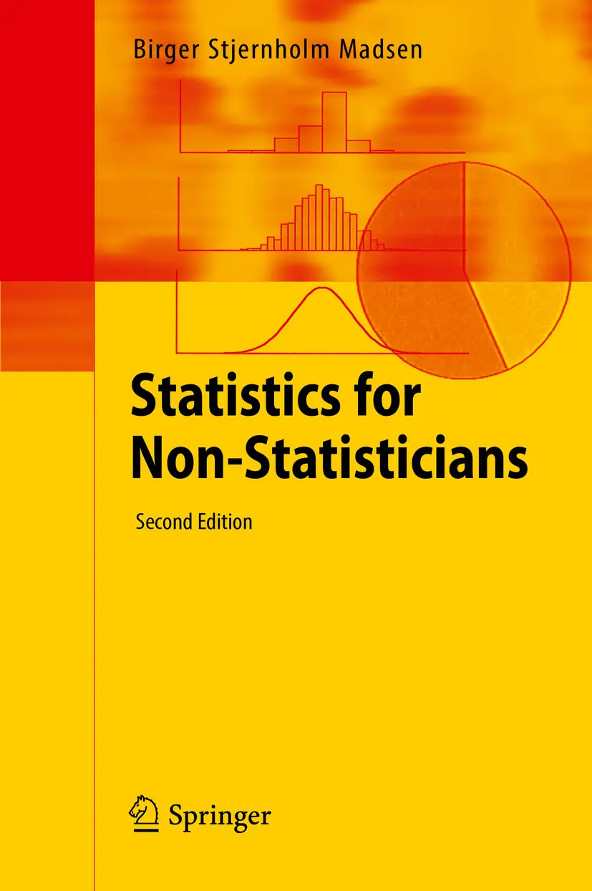

封面

丹麦语原版于2012年由Samfundslitteratur在丹麦腓特烈斯贝出版，书名为"Statistik for ikke-statistikere"。

前言

从来没有像今天这样，如此多的组织决策都是基于统计数据做出的！一切都由数字支撑。这适用于市场营销、经济学、社会科学、自然科学、工业，以及组织、企业和机构内部的行政工作。因此，在评估统计数据材料以及准备调查研究时，了解基本的统计概念至关重要，这样才能产生有用的统计结果。

市面上已有若干本基础统计学书籍。那么为什么还要再写一本呢？简单的回答是：因为确有必要！本书填补了现有统计学文献中的一个空白。大多数现有的统计学简短入门书籍采用以下方法之一：

- 主要基于描述性统计的方法（图表、表格等）
- 纯文字叙述的方法，没有任何数学公式，但也没有实用指南
- 主要基于概率论的方法

相比之下，本书旨在成为"从业者的第一门课程"，提供了大量实用的细节，例如调查规划等。将本书与标准的500-600页统计学教科书相比，你实际上会发现本书中有很多标准教科书中找不到的实用信息！我教授各个层次的统计学已有数十年。我的经验是，统计学中最重要的概念是可以解释清楚的，让"普通人"也能理解。我通过为众多不同受众讲授的数百门课程验证了这一点。现在，我把这些经验写成了书！

## 本书为谁而写？
本书面向那些需要了解如何收集、分析和展示数据的人。你可能在处理行政数据、金融数据、或来自社会科学或自然科学的数据。也许你计划通过样本调查（如客户调查或类似调查）来收集数据。你对统计学了解不多。也许你以前学过一点这方面的知识，但大部分已经忘记了。也许你从未学过这方面的知识，但你充满好奇心！虽然本书不要求具备统计学知识，但我假设你对数字并非完全陌生！你能用计算器进行简单计算。而且当你看到包含平方根的简单公式时，不会惊慌！别担心：本书没有堆砌大量数学公式。但遗憾的是，要介绍统计概念，不可能完全避免数学计算。如果你具备电子表格的基本知识，那将是一个优势。本书不是电子表格使用教程——学习电子表格最简单的方法是阅读计算机手册或参加课程！这也不是一本"如何用 Excel 做统计"的书——如果你需要这方面的内容，可以参考文献列表中的资料。这类书籍有很多，往往厚达数百页……然而，了解如何利用电子表格的功能进行最重要的统计计算，可能会很有用。如今，电子表格使大多数人都能方便地处理数字和图表。这也同样适用于统计计算！如果你没有电子表格软件，我可以推荐 Open Office（一款免费的办公套件）中的 Calc 电子表格程序。参见附录中的软件链接。本书中讨论的几乎所有内容都可以用这个电子表格来完成！我建议在阅读本书时，你用一些简单的数据在电子表格中实际操作一下。稍微动手实践一下，学习统计学会更容易！初学者可能会满足于将电子表格作为统计分析的工具。然而，在专业统计工作中，你很快就会发现电子表格的局限性。这时候就需要考虑使用更好的工具了！因此，附录中介绍了一些主要的统计程序以及相关链接，你可以从中了解更多信息。我希望本书能用于自学，以及作为商学院、技术学校、高中以及大学水平的商学院和社会科学统计入门课程的补充阅读材料。本书并非为任何特定教育项目而编写。阅读完本书后，你应该有能力进一步深入研究市面上众多其他统计学书籍。我希望本书能为你阅读（许多）更高级的统计学专著铺平道路。随着专业水平的提高，统计学书籍的数量也在急剧增长！偏向数学的读者需要接受一点：本书并非在所有地方都达到 100% 的数学精确度。重点在于易于理解，而非数学上的精确表达。书中的某些主题比其他部分稍微"技术性"一些。这些内容可以跳过，不会因此丢失连贯性。其中一些内容放在文本框内，标题为"技术说明：……"。有些主题明确标明可以跳过。它们通常放在章节末尾。书中还有许多使用电子表格的示例。如果你不使用电子表格，可以只阅读这些示例，而不必关心结果在电子表格中是如何得出的。

## 本书结构

本书的编排方式使得你在前一章学到的内容会在后续章节中使用。这意味着你应该从头开始阅读，至少读到[第 5 章](ch05.md)（含）。

[第 1 章](ch01.md)和[第 2 章](ch02.md)是关于数据的收集与展示。对于大多数从事统计工作的人来说，这些都是至关重要的问题。

[第 3 章](ch03.md)至[第 5 章](ch05.md)是本书的核心。它们介绍了基本的统计概念，包括描述性统计、正态分布和统计检验。

当你读完[第 5 章](ch05.md)后，[第 6 章](ch06.md)至[第 8 章](ch08.md)可以相互独立地阅读。

[第 6 章](ch06.md)是对[第 1 章](ch01.md)的补充；它涉及样本调查和实验的规划。
[第7章](ch07.md)和[第8章](ch08.md)对[第4章](ch04.md)关于正态分布的内容进行了补充。[第8章](ch08.md)可能是本书中最"重"的内容，因此被适当地放在了最后！

本书的附录包含许多有用的信息：概率论回顾、参考文献、统计术语表、电子表格中的统计函数列表、统计软件列表、实用链接以及各种实用表格。书中所有标有星号（*）的词语均在术语表中予以解释。

在出版社的网站上，您可以找到本书的附加材料：实用工作表、进一步的解释、示例等。当然，那里还有一个包含示例数据集"Fitness Club"的电子表格，该数据集在全书中作为反复出现的示例使用。

祝您阅读愉快！

丹麦 哥本哈根

## 第二版前言

自本书第一版出版以来，我收到了许多评论。有人指出，可以增加一些有用的章节，使本书能够面向更广泛的读者群体，包括工业界人士。主要改进如下：

1. 在[第4章](ch04.md)中新增了关于对数正态分布、控制图及过程能力的内容。
2. 在[第8章](ch08.md)中新增了关于单因素方差分析的内容。

关于参考文献、链接和软件的附录也进行了更新。希望这些修改和补充能够显著提升本书的质量。我恳请读者继续对本书提出宝贵意见！

丹麦 哥本哈根

## 致谢

我衷心感谢我在Springer出版社的编辑Barbara Fess和Johannes Gläser，他们提出了许多宝贵建议。

我还要感谢丹麦语版本的编辑、来自Samfundslitteratur的Peter Byriel。他在写作过程中提供了大量建设性的批评意见。

此外，我要感谢以下丹麦统计学家提供的宝贵意见：Leif Albert Jørgensen、Niels Landvad和Anders Milhøj。

最后，我感谢我的妻子Yrsa，在忙碌的写作期间对我极度包容！

## 缩写

| 缩写 | 含义 |
|:---|:---|
| $\overline{x}$ | 样本均值 |
| ANOVA | 方差分析 |
| B(n,p) | 二项分布（n次观测，概率p） |
| Cp | 过程能力指数 |
| Cpk | 最小过程能力指数 |
| CV | 变异系数 |
| DF | 自由度 |
| DOE | 实验设计 |
| E(X) | X的均值。E = "期望"（Expectation） |
| H₀ | 原假设 |
| H₁ | 备择假设 |
| LCL | 控制下限 |
| LSL | 规格下限 |
| N(0,1) | 标准正态分布（均值0，方差1） |
| N(μ,σ²) | 均值为μ、方差为σ²的正态分布 |
| R | 样本极差 |
| s | 样本标准差 |
| s² | 样本方差 |
| SPC | 统计过程控制 |
| UCL | 控制上限 |
| USL | 规格上限 |
| V(X) | X的方差 |
| μ | 总体均值 |
| σ | 总体标准差 |
| σ² | 总体方差 |
| Σ | 求和 |
| χ² | 卡方分布 |
> 卡方（分布或检验）

## 关于作者

比约·斯蒂恩霍姆·马森拥有统计学和数学硕士学位。他在丹麦多家大型企业以及国家统计部门拥有多年的统计师经验。他还在哥本哈根大学讲授统计学多年，并在数十年间为各类受众举办了数百场统计课程。本书正是他教学工作的直接成果。
数据收集

《非统计学工作者的统计学》
10.1007/978-3-662-49349-6_1
