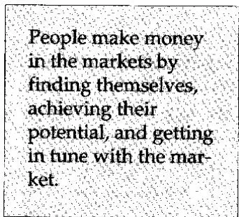
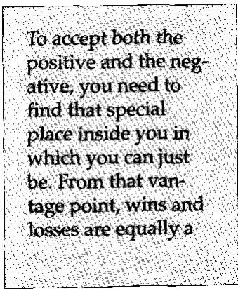
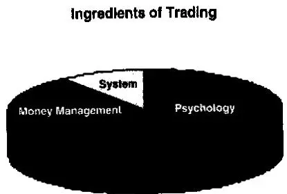
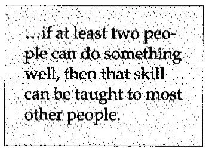
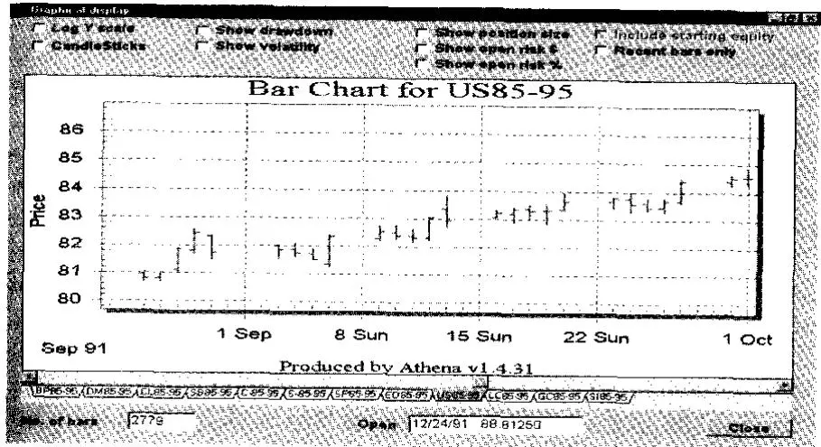
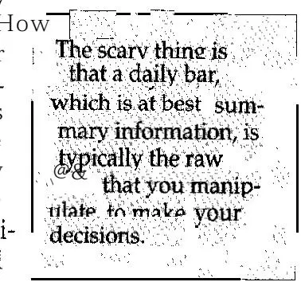
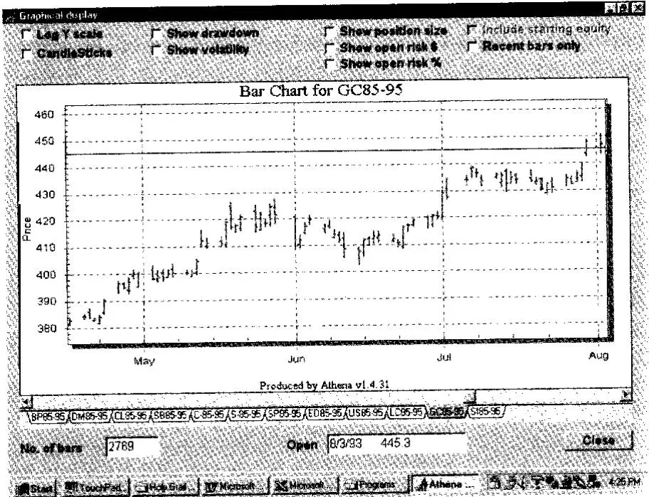

我们只需追随英雄之路的线索，在我们以为会发现卑劣之处，我们将发现神灵。在我们以为要杀死他人的地方，我们将杀死自己。在我们以为要向外远行之处，我们将抵达自身存在的中心。在我们以为已经结束之处，我们将与整个世界合为一体。

## Joseph Campbell¹

让我告诉你一个关于市场的秘密。你可以通过买入超出正常日价格波动范围的突破来赚大钱。这些被称为"波动率突破"（Volatility Breakout）。有一位交易员因利用波动率突破赚了数百万而闻名。你也可以做到！你可以赚大钱！方法如下。

首先，取昨天的价格区间。如果昨天和前天之间存在缺口（Gap），则将缺口加入区间——这就是所谓的"真实波幅"（True Range）。然后，取昨天真实波幅的40%，以此数值上下括住今天的价格。上方数值是你的买入信号，下方数值是你的卖出信号（即做空信号）。如果任一数值被触发，就进入市场，你明天有80%的概率赚钱。长期来看，你会赚大钱。

这个特别的推介对你来说有趣吗？它确实吸引了成千上万的投机者和投资者。虽然这个说法有一定道理——它可以作为在市场上赚大钱的基础——但它绝不是通往成功的魔法秘诀。很多人照此操作会破产，因为它只是一个健全方法论的一部分。例如，它没有告诉你：
l 如果市场走势对你不利，你如何保护你的资金？

. 你如何以及何时获利了结？

. 当你收到信号时，你买或卖多少？

. 这个方法适用于哪个市场，还是在所有市场都适用？

最重要的是，你必须问自己，当你把所有这些碎片组合在一起时，这个方法适合你吗？这是你能交易的东西吗？它符合你的投资目标吗？它符合你的个性吗？

本书旨在帮助交易者和投资者通过更多地了解自己，然后设计一套符合自身个性和目标的方法来赚更多的钱。它既面向交易者也面向投资者，因为他们都试图在市场中赚钱。交易者往往持更中立的态度——愿意同时买入和卖空。相比之下，投资者则寻找可以购买并长期持有的投资品。两者都在寻找一个神奇的系统来指导他们的决策——即所谓的圣杯（Holy Grail）系统。

寻找市场中可获得利润的旅程通常以另一种方式开始。事实上，典型的投资者或交易者在准备交易时会经历一个演化过程。起初他沉迷于赚大钱的想法。也许某个经纪人向他推销在市场中能赚多少钱。以下是我曾在北卡罗来纳州听到的一个广播广告，大致内容如下：
你知道真正的钱年复一年是在哪里赚到的吗？全在农业领域——人总得吃饭。考虑到我们最近的天气，很可能会出现短缺。

这意味着价格上涨。只需小额投资5,000美元，你就能控制大量谷物。只要谷物价格向有利方向波动几分钱，你就能赚一大笔钱。当然，这类建议是有风险的。人们确实可能亏钱。但如果我说得对，想想你能赚多少钱！*
一旦交易者投入了最初的5,000美元，他就上钩了。即使他全部亏光——大多数情况下确实如此——他仍然会保留这样的信念："我能在市场中赚大钱。Hillary Clinton不是把1,000美元变成了100,000美元吗？如果她能做到，我当然也能做到。"3 结果，我们的投资者会花大量时间试图找到告诉他买什么和卖什么的人——去确定下一个热门投资对象是什么。

我不认识很多通过听从他人建议——无论是经纪人还是投资顾问的建议——而持续赚钱的人。一个主要的例外是那些自1982年以来听从他人建议买入了好股票并一直持有至今的人。即使这种情况也可能迅速发生巨大变化。还有其他例外——但非常罕见。通常，大多数人要么亏掉所有资本，要么灰心丧气而退出。

少数人奇迹般地进入下一阶段，即"告诉我怎么做"。突然间，他们开始疯狂寻找能让他们赚大钱的神奇方法。这就是大多数人所说的"寻找圣杯"（Search for the Holy Grail）。在这个过程中，交易者寻找任何能给他们带来无穷财富的东西，因为它能揭开宇宙的秘密。通常，人们参加各种研讨会，学习各种方法，比如：
这是我的椅子形态（Chair Pattern）。它由至少六根在盘整区间的K线组成，接着第七根K线似乎突破了盘整。注意它看起来像一把面向左边的椅子吗？看看这张图表上椅子形态出现后发生了什么——市场直线上涨。这里是另一个例子。就这么简单。这是一张图表，展示了我在过去10年里用椅子形态赚了多少利润。看看——仅用10,000美元投资，每年就有92,000美元的利润。

然而，当典型投资者试图使用椅子系统时，那10,000美元的投资往往变成了巨额亏损。你将在本书后面了解到这些亏损的原因。重要的是，投资者只是简单地去寻找另一个系统。这个过程可能会无限期地持续下去——直到我们的投资者破产、放弃，或者真正理解了圣杯隐喻背后的含义。

## 圣杯隐喻

在交易圈子里，经常听到："她正在寻找圣杯。"这通常意味着她正在寻找能让她致富的市场魔法秘诀——隐藏在所有市场背后的秘密规则。但真的有这样一个秘密吗？是的，有一个！有趣的是，当你真正理解了圣杯隐喻，你就会理解在市场中赚钱的秘密。

有几本书讨论了圣杯隐喻的话题。4 很少有人读过圣杯传奇，但大多数西方人立刻就能认识到圣杯追寻是一个非常重要的追求。学者们将这种追寻解读为从血仇到追求永葆青春等各种含义。其他学者则认为圣杯追寻是对完美主义、开悟、合一甚至与上帝直接沟通的追求。当投资者的圣杯追寻被置于这些追寻的背景中时，可能会获得全新的意义。

大多数投资者相信市场有某种神奇的秩序。他们相信少数人知道这个秘密，那些从市场中获取巨额财富的人。因此，这些人不断地试图发现这个秘密，以便自己也能变得富有。这样的秘密确实存在。但很少有人知道去哪里寻找，因为答案在他们最意想不到的地方。

随着你越来越深入地阅读本书，你将真正理解在市场中赚钱的秘密。随着这个秘密被揭示，你将开始理解圣杯追寻的真正含义。

一个更有趣的圣杯传说是基于天堂中上帝与撒旦之间的战争。圣杯被中立的天使放置在冲突的中央。因此，它代表了一条位于对立面之间（如利润与亏损）的精神之路。这片土地（或至少是关注的领地）已经变成了荒原。Joseph Campbell5声称荒原象征着我们大多数人所过的不真实的生活。大多数人通常随大流，做别人做的事，按别人告诉我们的去做。因此，荒原代表了缺乏过自己生活的勇气。圣杯由此成为过自己生活的象征——实现人类心灵的终极潜能。

如果你作为一个投资者随大流，你可能在长期趋势中赚钱，但总体上你可能会亏损。相反，投资者通过独立思考和保持独特性来赚钱。例如，大多数投资者向他人征求建议（包括他们的邻居）。然而，赚钱的关键在于发展你自己的想法并遵循一套为你设计的方法。大多数投资者强烈渴望每笔交易都正确，因此他们寻找某种热门入场技术，以获得对市场的控制感。例如，你可以要求市场完全按你的意愿行事后再入场。然而，真正的钱是通过明智的出场赚到的——这使交易者能够截断亏损并让利润奔跑。这

要求交易者完全与市场保持同步。总之，人们通过发现自我、实现潜能并与市场保持同步来在市场中赚钱。

可能有数十万个有效的交易系统。但大多数人，当获得这样一个系统时，并不会遵循它。为什么？因为这个系统不适合他们。成功交易的秘诀之一是找到一个适合你的交易系统。事实上，Jack Schwager在采访了足够多的"市场奇才"（Market Wizards）以写成两本书后，6 得出结论：所有优秀交易者最重要的特征是他们都找到了一个适合自己的系统或方法。因此，圣杯追寻的部分秘诀在于保持独特性并走自己的路——从而找到真正适合你的东西。但圣杯隐喻还有更多含义。

生命始于利润与亏损之间的中立位置——它既不害怕亏损也不渴望利润。生命只是存在，这由圣杯代表。然而，随着人类自我意识的发展，恐惧和贪婪也会出现。但当你摆脱了贪婪（以及来自匮乏的恐惧），你就与万物达到了一种特殊的合一。这就是伟大交易者和投资者涌现的地方。

伟大的学者和神话研究权威Joseph Campbell说：
假设草会说："哦，看在上帝的份上，你一直被这样割掉有什么用？"然而，它继续生长。这就是中心能量的意义。这就是圣杯意象的含义，即取之不尽的源泉。源泉不在乎一旦它赋予存在后会发生什么。7
圣杯传说之一以一首短诗开头："每个行为都有好与坏的结果。"因此，生活中的每个行为都有正面和负面的后果——可以说就是利润与亏损。我们能做的最好的事情就是接受两者，同时倾向于光明。

想想这对作为投资者或交易者的你意味着什么。你正在玩人生的游戏。有时你赢，有时你输，所以既有正面也有负面的后果。要同时接受正面和负面，你需要找到内心那个可以只是存在的特殊位置。从那个有利位置来看，赢和输同样是交易的一部分。对我来说，这个隐喻就是圣杯的真正秘密。

如果你还没有在自己内心找到那个位置，那么就很难接受亏损。如果你无法接受负面后果，你就永远无法成为一个成功的交易者。好的交易者通常在不到一半的交易中赚钱。如果你不能接受亏损，那么当你知道自己犯了错误时，你可能就不愿意退出一个头寸。小亏损更可能变成巨大的亏损。更重要的是，如果你无法接受亏损会发生，那么你就无法接受一个长期来看能赚大钱但可能在60%的时间里亏钱的好交易系统。

## 交易中真正重要的事

我遇到的几乎每一位成功的投资者都领悟了圣杯隐喻的教训——市场中的成功来自于内在控制（Internal Control）。这对大多数投资者来说是一个根本性的改变。内在控制并不难实现，但大多数人很难意识到它有多重要。例如，大多数投资者相信市场是制造受害者的有生命的实体。如果你相信这句话，那么对你来说它确实如此。但市场不会制造受害者；投资者把自己变成了受害者。每个交易者控制着自己的命运。没有交易者能在至少潜意识里理解这个重要原则之前找到成功。

让我们看一些事实：
. 大多数成功的市场专业人士通过控制风险来取得成功。控制风险与我们的自然倾向相悖。风险控制需要极强的内在控制。

l 大多数成功的投机者有35%到50%的成功率。他们的成功不是因为他们预测价格准确。他们的成功是因为盈利交易的规模远远超过亏损的规模。这需要极强的内在控制。

l 大多数成功的保守投资者是逆向投资者（Contrarian）。他们做其他人害怕做的事。他们有耐心，愿意等待合适的机会。这也需要内在控制。

投资成功比任何其他因素都更需要内在控制。这是通往交易成功的第一步。致力于发展这种控制的人才是最终会成功的人。

Figure 1-1 交易的要素
让我们从另一个角度来探讨内在控制——交易成功的关键。当我就交易中什么最重要进行讨论时，通常会提到三个方面：心理学、资金管理（即头寸规模，Position Sizing）和系统开发（System Development）。大多数人强调系统开发，而忽视另外两个话题。更老练的人认为这三个方面都很重要，但心理学最重要（约60%），头寸规模次之（约30%），系统开发最不重要（约10%）。这在Figure l-l中有说明。这些人会认为内在控制只属于心理学范畴。

Ed Seykota曾告诉我，他在1970年代末教过一门为期10周的大学交易课程。他用第一周教授关于交易的基础知识。然后又花了一周教学生Donchin的10-20移动平均线交叉系统。然而，他需要剩下的8周来说服人们使用他教的那个系统——让他们在自己身上下足够的功夫，以接受该系统（或任何其他好的交易系统）会产生的亏损。

我一直认为交易100%是心理学问题，而心理学包括头寸规模和系统开发。原因很简单：我们是人类，不是机器人。要执行任何行为，我们必须通过大脑处理信息。设计和执行交易系统都需要行为。要复制任何行为，你必须学习该行为的要素：这就是建模（Modeling）科学发挥作用的地方。

## 建模市场天才

也许你有过参加投资专家研讨会的经历，他在会上解释他的成功秘诀。例如，我刚才告诉你的那位世界上最伟大的交易者之一在1970年代初教授的一门交易课。他花2周教他们一个能让他们非常富有的方法（在当时），然后又花了8周让他们达到愿意应用这个方法的程度。

就像课堂上的人一样，你可能在参加某个研讨会时被专家的风范和技能所打动。你可能满怀信心地离开研讨会，认为用他的方法就能赚钱。不幸的是，当你试图将他的秘诀付诸实践时，你可能发现你并不比参加研讨会前聪明多少。有些东西不起作用，或者你就是无法应用你所学到的。

为什么会这样？原因是你没有像专家那样构建你的思维方式。他的思维结构——他思考的方式——是他成功的关键之一。

当别人教你他们如何对待市场时，他们很可能只是在表面上教你他们实际做的事情。他们并不是有意欺骗你。只是他们真的不理解自己所做事情的本质要素。即使他们理解了，他们可能也很难将这些信息传递给他人。这让你认为也许你必须有某种"天赋"或特殊才能才能在市场中成功。结果，许多人变得灰心丧气并离开市场，因为他们认为自己没有天赋。但天赋是可以被教会的！

我相信如果至少有两个人能把某件事做好，那么这项技能就可以被教会大多数人。在过去20年里，建模科学几乎作为一个地下运动兴起。该运动源自Richard Bandler和John Grinder开发的一项技术，称为神经语言程式学（Neuro-Linguistic Programming，简称NLP）。

NLP研讨会通常只涵盖建模过程留下的技术痕迹。例如，当我举办研讨会时，我通常只教授我从建模顶级交易者和投资者中开发的模型。然而，如果你上了足够多的NLP课程，你最终会开始理解建模过程本身。

我已经建模了交易和投资的三个主要方面，目前正在建模第四个方面。我开发的第一个模型是如何成为伟大的交易者/投资者并掌握市场。开发这样一个模型的步骤本质上涉及与许多伟大的交易者和投资者合作，以确定他们的共同做法。如果你试图建模一个人，你会发现很多那个人特有的怪癖，建模过程很可能失败。但如果你建模许多优秀交易者和投资者的共同要素，你就能发现对所有人成功真正重要的东西。

例如，当我最初问我的模型交易者他们做什么时，他们告诉我他们的方法论。在采访了大约50个交易者后，我发现没有一个人的方法论是相同的。因此，我得出结论：他们的方法并不是他们成功的秘密，只是他们的方法都涉及"低风险"（Low-Risk）的理念。因此，所有这些交易者共同拥有的一项能力就是找到低风险理念的能力。我将在下一章中定义什么是低风险理念。

一旦你发现了他们做法的共同要素，你就必须发现每个共同任务的真实要素。是什么信念使他们能够掌握市场？他们如何思考才能有效地执行这些任务？

确定你是否成功开发了一个准确模型的最后一步是将模型教给其他人，并确定你是否得到相同的结果。我开发的交易模型是我的"巅峰绩效交易课程"（Peak Performance Trading Course）的一部分。8 我们也在"巅峰绩效交易研讨会"中教授这个模型。我们已经成功地培养了一些令人惊讶的成功交易者，从而验证了这个模型。

我开发的第二个模型是伟大的交易者和投资者如何学习他们的手艺以及如何进行研究。这就是本书的主题。大多数人认为这是交易中非心理学的部分。令人惊讶的是，找到并开发一个适合他们的系统这项任务纯粹是心理层面的。大多数人有许多偏见阻碍他们做好这件事。事实上，我通常发现一个人做的心理治疗工作越多，他就越容易开发出一个系统。

你开始寻找合适交易系统的首要任务之一是充分了解自己，以便设计一个对你有效的系统。但你怎么做呢？一旦你充分了解了自己，你如何找出什么对你有效？这些是我们将要解释的一些话题。

我开发的第三个模型是伟大的交易者如何管理他们的资金或在交易中确定头寸规模。资金管理（Money Management）的话题是每位伟大交易者都会谈论的。甚至有几本关于资金管理的书，但它们大多谈论的是资金管理的某个结果（如风险控制或获取最优利润），而不是这个话题本身。资金管理本质上是你的系统中确定头寸规模的部分——回答整个交易过程中"多少？"的问题。在本书的其余部分，我选择称这个话题为"头寸规模"（Position Sizing），以消除"资金管理"这个术语可能带来的混淆。

再一次，大多数人由于自身的心理偏见注定要在头寸规模方面做出所有错误的事情。例如，当我写这本书时，我正在进行八座亚洲城市的巡回演讲。在每座城市，很明显大多数听众都不理解头寸规模的重要性。他们大多是机构交易者，但许多人甚至不知道他们在交易多少钱。许多人甚至不知道在不丢工作的前提下能亏多少钱。因此，他们无法适当地确定头寸应该多大或多小。

结果，我让听众玩了一个游戏来说明头寸规模的重要性。即便如此，也没有人问我："Tharp博士，在我的情况下，我在头寸规模方面应该怎么做？"然而，几乎所有的人通过提出这个问题并获得适当的答案都能在交易上取得巨大进步。

你将在本书中了解头寸规模的关键要素，因为它是系统开发的一个基本部分。

最后一个模型是我仍在研究的，不过我们已经足够了解它可以提供关于这个话题的优秀研讨会——财富的获取。大多数人无法充分进行头寸规模管理的一个偏见是，他们没有足够的资金来持有哪怕一个低风险理念的头寸。因此，我设计了帮助他们通过交易以外的方式获取资金的研讨会。再一次，大多数人似乎在心理上注定要做出所有错误的事情。

例如，财富获取的原则之一是让复利（Compound Interest）的力量为你所用。例如，一个20岁的人每天在免税账户中存入一美元，获得15%的利息，到退休时他或她将成为百万富翁多次。然而，美国家庭平均有循环信用卡债务——这意味着平均家庭正在让复利的力量与自己作对。据估计，6,500万美国家庭——大约2亿人——有循环信用卡债务，每家约7,000美元。他们为这笔债务支付高达18%的利息，所以他们确实在让复利与自己作对。

然而，财富的话题与本书的话题略有不同。但我认为让你知道这一点很重要：本书是从一个理解所有这些重要话题——尤其是涉及的心理问题——的人的视角来写的。

## 总结

投资者和交易者在找到"圣杯"的本质之前通常要经历两个阶段。首先，他们需要找到一个人来告诉他们在市场中具体买什么和卖什么。其次，他们寻找有人来告诉他们怎么做！当这两个过程都不起作用时，少数幸存者会进入最后阶段——让自己进入一种心理状态，以便找到一个适合自己的交易系统。

"圣杯"并不是大多数人所认为的某种神奇的市场关键来源。根据Joseph Campbell等学者的说法，"圣杯"的隐喻完全关乎发现自我。同样，市场中的"圣杯"——解锁利润的关键——也完全关乎发现自我。

要解锁"圣杯"，你需要欣赏自己独立思考和保持独特性的能力。人们通过发现自我、实现潜能并与自己保持同步来赚钱，从而能够跟随市场的流动。

与自己保持同步意味着找到内心的平静。它意味着在利润与亏损之间找到平衡。圣杯不是一个神奇的交易系统；它是一场内心的挣扎。一旦你发现了这一点并解决了这场挣扎，你就能找到一个适合你的交易系统。

一旦你达到了内心那个可以只是存在的位置，你就会理解本书的关键：（1）出场对你的利润和亏损的重要性；（2）头寸规模对你的权益的重要性；（3）纪律对使一切运转的重要性。

我一直在建模市场中赚钱的四个关键：（1）交易的过程；（2）进行交易研究的过程；（3）使头寸规模发挥作用的过程；（4）变得富有的过程。所有这些过程都是非常心理层面的。这再次说明，市场中寻找"圣杯"的旅程是你内心的旅程。你必须理解这个概念才能完成这段旅程。在你掌握内心的挣扎之前，你将始终与市场和系统进行外部的挣扎。这是寻找你个人圣杯交易系统的关键。

## 注释

1. Joseph Campbell (with Bill Moyers). The Power of Myth. New York: Doubleday, 1988, p. 51.

2. 这些是我对广告文本的最佳回忆，但实际措辞可能有所不同。

3. 我对第一夫人交易的评论仅代表我的观点。当你阅读[第5章](ch05.md)关于头寸规模时，你可以自己判断我们的第一夫人是否真的如此"幸运"。

4. Malcolm Goodwin, The Holy Grail: Its Origins, Secrets, and Meaning Revealed (New York: Viking Studio Books, 1994). 本书讨论了出现在公元1190年至1220年间30年跨度内的九种不同圣杯神话。

5. Joseph Campbell (with Bill Meyers). The Power of Myth. 详见附录I推荐阅读。

6. Jack Schwager, Market Wizards. 详见附录I推荐阅读。

7. Campbell, 见脚注4, p. 274.

8. Van Tharp, The Peak Performance Course for Traders and Investors. 详见附录I推荐阅读。

判断性偏见：为什么大多数人掌握市场如此困难
我们通常根据对市场的信念来交易，一旦我们对这些信念下了决心，就不太可能改变。当我们参与市场时，我们假设自己正在考虑所有可用的信息。然而，我们的信念通过选择性知觉（Selective Perception）可能已经消除了最有用的信息。

Van K. Tharp, Ph.D
你现在明白了寻找圣杯系统是一个内在的探索。本章将通过学习可能阻碍你的因素来帮助你进行这种探索。这是你的第一步：意识到什么在阻碍你。当你有了这种意识，你也有了改变的能力。

总的来说，我们所有人面临的一个基本问题是处理我们必须定期处理的海量信息。法国经济学家George Anderla衡量了我们必须应对的信息流变化速度。他得出结论：在耶稣时代到Leonardo DaVinci时代之间的1,500年里，信息流翻了一番。到1750年又翻了一番（即大约250年）。下一次翻倍只用了大约150年就到了世纪之交。计算机时代的到来将翻倍时间缩短到大约5年。而如今，计算机提供了电子公告板、CD-ROM、光纤、互联网等，我们当前接触的信息量大约每年翻一番。

研究人员现在估计，以我们目前利用的大脑潜能，人类在任何时刻只能接收1%到2%的可用视觉信息。对于交易者和投资者来说，情况更为极端。一个同时观察世界上每个市场的交易者或投资者，每秒可能有大约一百万比特的信息向他或她涌来。由于世界各地总有市场在开放，信息流不会停止。一些误入歧途的交易者实际上一直紧盯着交易屏幕，试图在大脑允许的范围内尽可能多地处理信息。

意识思维处理信息的能力有限。即使在理想条件下，这种有限能力也是一次5到9个信息块（Chunk）。一个信息块可以是1比特，也可以是数千比特（例如，一个块可以是数字2或像687,941这样的数字）。例如，阅读以下数字列表，合上书，然后试着把它们都写下来：

## 6,38,57, 19, 121,83, 41, 917, 64, 817, 24

你能记住所有数字吗？可能不行，因为我们只能有意识地处理7加减2个信息块。然而，每秒有数百万比特的信息向我们涌来。而且当前信息的可用率每年翻一番。我们如何应对？

答案是我们对接触到的信息进行概括（Generalize）、删除（Delete）和扭曲（Distort）。我们概括并删除了大部分信息——"哦，我对股市不感兴趣。"这一句话就把市场上大约90%的信息概括为"股市信息"，然后将其从考虑中删除。

我们也通过决定"我只看符合以下标准的市场的日线图……"来概括我们确实关注的信息。然后我们让计算机按照这些标准对数据进行排序，这样大量的信息突然减少到计算机屏幕上的几行。这几行是我们能在意识思维中处理的。

大多数交易者和投资者然后通过将剩余的概括信息表示为指标来扭曲它。例如，我们不只是看最后一根K线。相反，我们认为以10日指数移动平均线、14日RSI或随机指标等形式呈现的信息更有意义。所有这些指标都是扭曲的例子。而人们交易的是"他们对扭曲的信念"——这些信念可能是有用的，也可能不是。

心理学家将许多这样的删除和扭曲归类在"判断性启发式"（Judgmental Heuristics）这个标签下。它们被称为"判断性"的，因为它们影响我们的决策过程。它们被称为"启发式"的，因为它们允许我们在短时间内筛选和整理大量信息。没有它们我们永远无法做出市场决策，但对那些没有意识到它们存在的人来说，它们也是非常危险的。它们影响我们开发交易系统和做出市场决策的方式。

大多数人使用判断性启发式的主要方式是维持现状。我们通常根据对市场的信念来交易，一旦我们对这些信念下了决心，就不太可能改变。当我们参与市场时，我们假设自己正在考虑所有可用的信息。然而，我们可能已经通过选择性知觉消除了最有用的信息。

有趣的是，Karl Popper指出，知识的进步更多来自于试图找出我们理论的错误，而不是证明它们。9 如果他的概念是正确的，那么我们越倾向于认识到我们的信念和假设（尤其是关于市场的）并证伪它们，我们在市场中赚钱就越有可能成功。

本章的目的是探讨这些判断性启发式或偏见如何影响交易或投资的过程。首先，我们将讨论扭曲系统开发过程的偏见。大多数讨论的偏见属于这一类。然而，其中一些也影响交易的其他方面。例如，赌徒谬误（Gambler's Fallacy）影响交易系统开发，因为人们希望系统没有长时间的连败，但它也影响系统开发后如何交易。

接下来，我们将讨论影响你如何测试交易系统的偏见。例如，一位先生在接触到这些信息后声称它充满争议，并且遗漏了关键要素。然而，这些陈述只是他自己的投射。本书所呈现的材料中没有冲突——它只是信息。因此，如果你感知到这样的争议，那是因为争议来自你自身。此外，大多数人做的一些系统开发步骤被省略了，但这是故意的，因为我的研究表明它们不重要或对开发好的系统弊大于利。

最后，我们讨论一些可能影响你如何交易已开发系统的偏见。虽然这是一本关于交易系统研究的书，但这里包含的偏见很重要，因为你在做研究时——在实际开始交易之前——需要考虑它们。我刻意将这一章的这部分内容保持在最低限度，因为这些偏见在我的交易者和投资者自学课程中有更详细的讨论。

## 影响交易系统开发的偏见

在考虑交易系统之前，你必须以你的大脑能够应对可用信息的方式来表示市场信息。看看Figure 2-1中的图表。它展示了一个典型的柱状图——这是大多数人看待市场的方式。如图所示，日线柱状图（Daily Bar Chart）将一天的数据进行了总结。该总结最多包含四条信息——开盘价、收盘价、最高价和最低价。日本蜡烛图（Japanese Candlestick）使信息更加明显，还为你提供了市场总体上涨还是下跌的视觉信息。

Figure 2-l 简单的柱状图

## 表征偏见

那张日线柱状图是每个人都使用的第一种启发式的好例子，称为"表征定律"（Law of Representation）。它的意思是人们假设当某物应该代表某物时，它确实就是它应该代表的东西。因此，我们大多数人只看日线柱状图并接受它代表一天的交易。实际上，它只是纸上的一条线——不多也不少。然而，你可能已经接受了它的意义，因为：
. 当你刚开始学习市场时，有人告诉你它是有意义的。

\* 其他人都用日线柱状图来表示市场。

\* 当你购买数据时，数据通常以日线柱状图格式呈现。

当你想到一天的交易时，你通常会想到日线柱状图。

Figure 2-l中图表上的每根柱子只告诉你两件事。它显示了全天发生的价格范围。它还说明了价格如何变动——从开盘价到收盘价（加上最高价和最低价的一些变化）。

典型的日线柱状图不告诉你什么？它不告诉你发生了多少交易活动。它不告诉你在什么价位发生了多少交易活动。它不告诉你标的商品或股票在一天中的什么时候处于给定价格（除了开始或结束时）。然而，这些信息可能对交易者或投资者有用。你可以通过降低时间框架查看5分钟图或分笔图来获取其中一些信息。但等等！日线图的目的不就是减少信息流以使你不被淹没吗？

还有很多对交易者可能有用的信息未在日线图中显示。以期货为例，交易涉及开新仓还是平旧仓？什么样的人在做交易？少数场内交易者是否整天互相交易——试图猜测和超过对方？多少交易是单笔单位（100股股票或单个商品合约）形式的？多少交易是大笔单位的？大型投资者买入或卖出多少？大型资金管理人或投资组合经理买入或卖出多少？套期保值者或大公司买入或卖出多少？

还有第三类信息未在日线图中呈现——谁在市场中。例如，目前有多少人持有多头或空头头寸？他们的头寸规模多大？这些信息是可用的，但通常不容易获取。以当今的计算机技术，各交易所可以每天存储和报告这样的信息：
价格从83移动到85。有4,718名投资者持有多头头寸，平均头寸规模为200单位。当天多头头寸总共增加了50,600单位。有298名投资者持有空头头寸，平均头寸规模为450单位。空头头寸增加了5单位。前100个头寸由以下人员持有，他们的头寸是……[后跟列表]。

也许你会说："是的，我想知道谁持有什么以及他们的头寸多大。"但是，如果你有这些信息，你知道如何处理它吗？它会更有意义吗？可能不会——除非你有一些信念可以让你据此交易。

日线图也不会给你任何统计概率——给定X发生，Y发生的可能性有多大？你可以使用历史数据来确定Y的可能性，但前提是变量X（以及Y）包含在你的数据中。但如果X或Y很有趣却没有包含在你的数据中呢？

最后，还有一种关键类型的信息没有包含在简单的日线柱状图中——关于人们信念和情绪的心理信息。这些信息涉及多头头寸和空头头寸的信念强度。

不同交易者可能在什么时候以及什么价位平仓？他们会如何对各种新闻或价格变动做出反应？有多少人持有市场会上涨或下跌的信念而坐在市场外观望？他们可能在什么条件下将这些信念转化为市场头寸？如果他们这样做了，他们可能在什么价位以及有多少钱来支持他们的头寸？但你是否有能帮助你从这些信息中赚钱的信念？

到目前为止，你可能一直认为日线图就是市场本身。记住，你真正看到的只是你的电脑或图表簿上的一条线。你假设它代表市场。你可以称之为对市场给定日活动的概括，但这就是你能给它的最好称呼了。可怕的是，日线柱状图最多只是总结信息，而你通常将其作为做出决策的原始数据来操作。

我希望你开始理解为什么判断性启发式对你作为交易者如此重要。然而，我给你的只是一个启发式的例子——我们倾向于假设柱状图确实代表一天的市场活动。

你完全可以只交易柱状图。但大多数人想在交易前对数据做些处理，所以他们使用指标。不幸的是，人们对市场指标做了同样的事情。他们假设指标就是现实，而不是对可能发生之事的尝试性表示。RSI、随机指标、移动平均线、MACD等似乎都获得了现实性，人们忘记了它们只是对原始数据的扭曲，被假设代表某种东西。

例如，想想图表上支撑位（Support Level）的技术概念。最初，技术人员观察到一旦价格跌到图表上的某个区域，它们似乎会反弹。那个区域随后被假设为许多买家愿意买入从而"支撑"股票价格的水平。不幸的是，许多人对待"支撑位"和"阻力位"（Resistance）这样的词语就好像它们是真实现象，而不是人们过去观察到的关系的简单概念。

我之前在表征偏见的意义上谈过，人们倾向于根据事物"看起来像什么"而不是其概率率来判断某事物。这在使用交易系统或交易信号时尤为重要。你在开发交易系统或评估信号有效性时考虑过概率率信息吗？也就是说，你考虑过你的预测结果跟随你的信号出现的时间百分比吗？可能没有，因为我不知道一千个交易者中有谁这样做——即使我不断地告诉人们。这意味着大多数人甚至不测试他们的系统或不知道他们系统的期望值（Expectancy）（见[第6章](ch06.md)）。

现在让我们讨论更多的偏见。我们将确定这些额外的偏见可能对你思考市场和开发交易系统产生什么影响。

## 可靠性偏见

与表征偏见相关的一个偏见是假设我们的数据是可靠的——它们确实就是它们应该代表的。关于日线柱状图，我们通常假设它代表一天的数据。它看起来像一天的数据，所以它一定是。然而，许多数据供应商将日间数据和夜间数据合并在一起，所以它真的是"一天"的数据吗？数据的准确性如何？

经验丰富的交易者和投资者知道，数据可靠性是交易者可能面临的最糟糕的问题之一。大多数数据供应商在日线柱状图方面相当准确，但当你开始使用分笔数据、5分钟图、30分钟图等时，准确性就不复存在了。因此，如果你在测试一个基于5分钟图的系统，你的大部分结果（无论好坏）可能与不准确的数据有关，而不是真实的预期结果。

看看Table 2-l中关于数据可能带来的问题的故事。这是我们通讯中编辑Chuck Branscomb的一个个人故事。

## T A B L E 2-1

## Chuck Branscomb的个人故事

'1 我使用自己设计的系统交易16个期货市场的投资组合。我使用投资组合交易软件针对每日数据运行我的系统代码，每天晚上生成订单。基本的入场/出场规则被编程到一个实时软件程序中，这样每当我在某个市场建立头寸时，我就会收到提醒。

'1995年7月10日，我在开盘前正确地放置了投资组合的所有入场和出场订单。芝加哥货币市场开盘后不久，实时软件提醒我加拿大元的一个多头入场。我很震惊，因为我那天甚至没有为加拿大元生成订单。我只是难以置信地盯着屏幕看了几秒钟。在心理上预演过对意外市场情况感到震惊后，我自动进入了预演情景：深呼吸，在呼气时放松从额头到脚趾的所有肌肉，并建立一个从最高到最低概率检查错误的系统化流程。

'只需几分钟就发现前一天的最低价在我为投资组合软件下载运行的数据与实时软件收集的数据之间不同。快速检查前一天的分笔数据证实了我的怀疑：投资组合系统使用的数据无效。我迅速手动编辑数据库并重新运行程序。现在它生成了一个入场订单。我瞥了一眼屏幕，看到市场已经大幅上涨超过我的入场点。挫败感涌上心头。但我平静地将程序中的信息输入到我的投资组合管理电子表格中来确定头寸规模。看着屏幕，当我准备好订单时，市场又上涨了5个点。我那时的反应完全是自动和专注的：我打电话给我的交易台，下了一个市价入场订单。

'整个过程消耗了大约10分钟时间，在此期间加拿大元进一步远离我的目标入场价。幸运的是，心理预演使我免于猜测该做什么。我的交易目标包括永远不错过交易入场，因为我不知道什么时候可能会出现一次巨大的行情。错过一次可观的盈利交易比简单地承受小额亏损要糟糕得多。当我意识到我应该已经在那个市场中时，打电话是一个自动的、专注的反应。对于我所做的交易类型来说，这是正确的做法。我不指望市场回到入场点或猜测是否应该继续入场
'这次事件标志着我需要创建一个程序来强制对每个期货合约的每日数据进行严格的检查。在那之前，我认为我在筛选每日数据方面做得足够好。我过去发现过许多错误，但现在我知道我需要每天为自己创造更多的工作，以确保我能够按照设计的商业计划进行交易。'
数据和夜间数据合并在一起，所以它真的是"一天"的数据吗？数据的准确性如何？

经验丰富的交易者和投资者知道，数据可靠性是交易者可能面临的最糟糕的问题之一。大多数数据供应商在日线柱状图方面相当准确，但当你开始使用分笔数据、5分钟图、30分钟图等时，准确性就不复存在了。因此，如果你在测试一个基于5分钟图的系统，你的大部分结果（无论好坏）可能与不准确的数据有关，而不是真实的预期结果。

看看Table 2-l中关于数据可能带来的问题的故事。这是我们通讯中编辑Chuck Branscomb的一个个人故事。

既然你已经读了这个故事，你就能理解大多数人接受了比实际情况更多的市场信息。一切并不像人们预期的那样。当你认为你有一个好系统时，你可能只有糟糕的数据。相反，当你认为你有一个糟糕的系统时，你实际上可能有的只是糟糕的数据。

但让我们假设你接受了日线图确实代表市场这一事实。你愿意接受这种概括并据此交易。这没问题，但让我向你展示有多少偏见可能潜入你的思维。

## 彩票偏见

彩票偏见（Lotto Bias）与人们在某种程度上操纵数据时增加的信心有关——就好像操纵数据在某种意义上是有意义的，并能给予他们对市场的控制。既然你已经接受了日线图作为表示市场的方式，你必须要么直接交易日线图，要么以某种方式操纵它们，直到你有足够的信心去交易。但当然，数据操纵本身常常能够并且将会给你这种增加的信心。

这种控制错觉（Illusion of Control）如何运作的一个完美例子是国营彩票游戏乐透（Lotto）。当你玩乐透时，你可以选择一些数字（通常是六个或七个），如果你碰巧全部命中，你就立即成为百万富翁。人们非常喜欢玩乐透游戏（甚至包括理解概率的逻辑性强的人）。为什么？因为奖品如此之大，而风险如此之小（一美元的彩票与奖品规模相比很小）
以至于人们被吸引去玩。对他们来说，赔率如此不利无关紧要——即使他们买了一百万张彩票（每张号码不同），他们仍然不太可能中奖。在国营彩票中赢得一百万美元的机会大约是1300万分之一（如果你期望赢得更多，赔率就更大了）。

这么小的金额就能获得如此大的奖品也是一种启发式，但这不是彩票偏见。彩票偏见是人们玩这个游戏时获得的控制错觉。人们认为因为可以选择号码，他们的成功概率在某种程度上得到了提高。因此，有些人可能怀疑如果他们选择自己生日和结婚纪念日的数字，可能会提高中奖机会。例如，大约10年前，一个男人在西班牙国家彩票中赢得了头奖。他是因为对自己梦境的解读而中奖的。他似乎连续7个晚上梦见数字7。由于他认为7乘以7等于48，所以他选了一张含有数字4和8的彩票。

其他人不是用梦境，而是咨询灵媒或占星师。事实上，你可以购买各种建议来帮助你赢得乐透。一些人分析了数字，认为可以预测后续数字，非常愿意向你出售他们的建议。有些人有自己的乐透机器，认为如果他们生成一个随机数字序列，它可能恰好对应国营乐透机器可能选出的数字。他们也愿意向你提供建议。如果某个大师或占星师声称有几个头奖得主（如果此人有足够多的追随者，这是一个明显的可能性），那么会有更多的人被吸引到那个人身边。人们会做任何事来找到魔法数字。

如果这看起来有点熟悉，那就对了。这正是在投机市场中发生的事情。人们相信他们可以通过选择正确的数字来快速赚钱。在投机者和投资者的情况下，选择正确的数字意味着他们只是想知道买什么以及什么时候买。普通人最想知道的最重要的问题是现在应该买什么能让我发财。大多数人宁愿有人告诉他们该怎么做。

l 人们尽一切可能来弄清楚现在该做什么。他们购买能选择数字和分析趋势的软件。经纪人发现如果他们帮助人们选择数字，通过在广播和电视节目中读出进场点，成千上万的人会想要他们的建议。如果你以公开提供建议而闻名，无论这些建议多么准确（或不准确），人们都会认为你是专家。此外，有很多善于推销的大师，非常乐意在通讯中告诉人们买什么和什么时候买。当然，占星师和算命师也在这个过程中扮演着角色。

有些人想到也许他们自己做会更好。因此，他们对入场信号产生了迷恋，认为入场信号等同于一个完整的交易系统。入场信号给你一种控制感，因为你选择进入市场的时点正是市场完全按你意愿行事的时点。结果，你感觉自己不仅对入场有控制，对市场也有控制。不幸的是，一旦你在市场中建立了头寸，市场会做它想做的任何事——你不再对任何事有控制，除了你的出场。

我对人们认为什么是交易系统感到惊讶！例如，几年前有一位先生从澳大利亚来拜访我。他一直在与美国各地的各种专家讨论什么样的交易系统有效。一天晚餐时，他告诉我他学到的东西，并向我展示了他发现的各种系统的"核心"，以便我能给他认可。他有一些很好的想法。然而，他向我描述的所有交易系统都与入场技术有关。事实上，他对每个交易系统描述的唯一内容就是入场。我的评论是他走在正确的方向上，但如果他现在花同样多的时间在出场和头寸规模上，那他才会真正拥有一个好的系统。

大多数人相信如果他们有某种入场点能让他们赚钱，他们就有一个交易系统。正如你将在本书后面学到的，一个专业的交易系统可能有多达10个组成部分，而入场信号可能是最不重要的。然而，大多数人只想知道入场。

1995年，我在马来西亚的一个期货和股票技术分析国际会议上担任演讲者。大约有15位来自美国的演讲者，我们获得了绩效评分。评分最高的演讲者大多谈论入场信号。而我听到的那位谈论交易系统各种组成部分并发表了非常有价值的演讲的演讲者获得了低得多的评分。

我参加了一个评分较高的演讲。演讲者是一位出色的交易者，1994年他的账户增长了约76%，最大回撤（Drawdown）只有10%。然而他谈的大多是选择趋势变化的信号。他在演讲中提出了六到八个这样的信号，当人们问他时，他提到了出场和资金管理。后来我问他是否交易所有这些信号。他的回答是："当然不！我交易趋势跟踪信号。但这就是人们想听的，所以我就给他们。"
我的一位客户在读到此处时做了如下观察：
我一直觉得这种"彩票"偏见是一种应对不控制感焦虑的方式。大多数人宁愿假装自己在控制中（并且犯错），也不愿害怕对必须生存的环境没有控制的焦虑。重要的一步是意识到"我对自己的行为有控制。"这就够了！

这种偏见如此强大，以至于人们通常无法获得在市场中蓬勃发展所需的信息。相反，他们得到的是他们想听的东西。毕竟，人们通常通过给人们他们想要的东西而不是他们需要的东西来赚最多的钱。本书是这一规则的例外。我希望将来会有更多这样的例外。

## 小数定律偏见

Figure 2-2中显示的模式可能代表某些人的另一种偏见。前5天中有4天市场什么都没做，接着是一个大涨。如果你翻阅图表书，你可能会找到四五个这样的例子。小数定律（Law of Small Numbers）说你不需要很多这样的案例就会得出结论。例如，让我们在市场出现4天窄幅盘整后价格大幅跳升时入场。

Figure 2-2 容易吸引人们关注市场和入场信号的样本模式
事实上，我的观察是大多数人通过遵循他们在少数精选样本中观察到的模式来交易。如果你看到一个像Figure 2-2所示的模式，后面跟着一个大行情，你就假设这个模式是一个好的入场信号。注意，到目前为止讨论的所有四种偏见都进入了这个决策。

William Eckhardt的以下引述很好地描述了这种偏见：
我们不是中立地看待数据——也就是说，当人眼扫描图表时，它不会给所有数据点同等的权重。相反，它会关注某些突出的案例，我们倾向于根据这些特殊案例形成我们的观点。挑选一个方法的惊人成功而忽视日复一日磨蚀你骨髓的损失是人的本性。因此，即使是相当仔细地翻阅图表也很容易使研究者认为系统比实际情况好得多。2
科学研究了解这种偏见。即使是最谨慎的研究者也倾向于将结果偏向他或她的假设。这就是为什么科学家进行双盲测试（Double-Blind Test）——在这种测试中，实验者不知道哪个组是实验组，哪个组是对照组，直到实验结束。

## 保守性偏见

一旦我们心中有了一个交易概念，保守性偏见（Conservatism Bias）就会接管：我们未能识别甚至看到矛盾的证据。人类的思维很快就能看到少数有效的成功案例，同时避免或忽视无效的案例。例如，如果你查看大量数据，你可能会发现Figure 2-2中的模式在20%的情况下后面跟着大行情。其余时间没有发生任何重大变化。

大多数人完全忽视矛盾的证据，尽管它是压倒性的。然而，在连续七、八次亏损后，他们突然开始担心自己交易系统的有效性，却从未确定可能发生多少次亏损。

如果20%情况下发生的行情足够大，那么它仍然可以交易，但前提是你在80%什么都没发生的行情中小心地截断亏损。当然，这指出了彩票偏见的重要性。如果你只专注于那个模式，你可能赚不到钱。

这种偏见的含义是，人们寻找他们想要的和期望在市场中看到的东西。因此，大多数人对市场不中立，他们无法随市场流动。相反，他们不断地寻找他们期望看到的东西。

## 随机性偏见

下一个偏见以两种方式影响交易系统开发：第一，人们倾向于假设市场是随机的——价格倾向于根据随机概率波动。第二，人们对这种随机性（如果存在的话）可能意味着什么做出了错误的假设。

人们喜欢抄顶和抄底的原因之一是他们假设市场可以并且会在任何时候转向。基本上，他们假设市场是随机的。确实，许多学术研究者仍然持有市场是随机的信念。3 但这个假设正确吗？即使这个假设是正确的，人们能交易这样的市场吗？

市场可能具有某些随机性的特征，但这并不意味着它是随机的。例如，你可以使用随机数生成器生成一系列柱状图。当你看这些柱状图时，它们看起来像柱状图。但这是代表性偏见的一个例子，"看起来像"随机并不等于"是"随机。这类数据不同于市场数据，因为市场中的价格分布具有你从正态分布的随机价格中永远无法预测的极端尾部。为什么？当你查看市场数据时，随着你添加更多数据，样本变异性变得越来越大。S&P在1987年10月19日的50点跌幅——发生在S&P合约推出后的十年内——很难从随机数序列中预测到。它可能一万年才发生一次，但这个事件就发生在我们有生之年。而且它可能在十年内再次发生。1997年10月27日，S&P下跌了70点，第二天，日波幅达到87点。

市场价格分布倾向于具有无限方差（或接近无限）的事实表明，比你想象的更极端的情况可能就在眼前。结果，任何由此推导出的风险估计都会被显著低估。不幸的是，大多数人在市场中承担了过多的风险。当像Ed Seykota和Tom Basso这样的市场奇才声称在单个头寸上承担高达3%的权益风险就是"赌徒"时，这表明大多数人在承担风险方面确实是疯狂的。

即使市场是随机的，人们也不理解随机性。当随机序列中确实出现长期趋势时，人们假设它不是随机的。他们发展理论来表明它是随机序列中长期序列以外的东西。这种倾向源于我们自然地倾向于将世界视为一切都可以预测和理解。结果，人们在不存在模式的地方寻找模式，并假设存在不合理的因果关系。

随机性偏见（以及彩票偏见）的一个后果是人们倾向于想抄顶和抄底。我们想要"正确"并控制市场，我们将自己的想法投射到市场。结果往往形成一种信念，认为我们可以抄顶和抄底。这在交易者或投资者的生涯中很少发生。试图这样做的人注定要经历许多失败。

## 理解需求偏见

"理解需求偏见"（Need-to-Understand Bias）影响大多数人开发交易系统的方式。他们完全忽视了随机性因素。事实上，他们甚至不把头寸规模作为系统的一部分。

我的一位客户Joe声称，当他建立头寸却不理解发生了什么时，他在市场中最困难。因此，我问了他几个问题。"你的头寸有多少次是盈利的？"他的回答是他有大约60%的时候是正确的。"当你不理解发生了什么时，你有多少次能盈利？"这次他的回答是当他不理解时几乎从未盈利。然后我说："既然你的系统并不比随机好多少，你可能对市场了解并不多。但当你明显困惑时，你应该直接退出。"他同意这可能是个好主意。

然而，当你想想Joe的交易系统时，他实际上并没有一个。为什么？Joe太关心理解了，以至于没有明确的出场信号来告诉他（1）什么时候应该退出以保护资金，以及（2）什么时候应该获利了结。

大多数人仍然需要对市场中正在发生的事情编造复杂的理论。媒体总是试图解释市场，尽管他们对市场一无所知。例如，当道琼斯工业平均指数暴跌超过100点时，第二天报纸上就充满了各种解释。例如，你可能在当地报纸上读到以下内容：
联邦储备委员会周三晚些时候发出可能提高利率的警告，使投资者周四感到不安。股票暴跌，尤其是科技公司，担心整个行业盈利放缓。股票处于历史高市盈率水平，投资者似乎在认为利率可能上升时特别紧张。

投资者还担心亚洲经济危机的影响。任何亚洲困境可能蔓延到这里的迹象都使投资者开始变得非常紧张。

第二天道琼斯工业平均指数可能上涨超过100点。你可能会读到类似以下的内容：
华尔街原本对潜在的加息感到紧张，但在道琼斯工业平均指数上涨超过100点后，消除了传言并再次投入市场。H. Moranthal Securities的R. P. Jinner评论说："盈利一直很高，投资者似乎很容易就能忽略潜在的破坏性新闻。"
当涉及交易系统设计时，理解需求偏见变得更加复杂。人们以各种奇怪的方式操纵日线柱状图，然后根据这些操纵发展奇怪的理论来解释市场。由此产生的理论获得了自己的生命力，但几乎没有现实基础。例如，艾略特波浪理论（Elliot Wave Theory）的理性基础是什么？为什么市场应该向一个方向走三浪，向另一个方向走两浪？

你开始理解为什么交易系统开发的任务充满了心理偏见吗？我的经验是，大多数人除非解决了自己的一些个人心理问题，否则无法处理交易系统设计中出现的问题。事实上，如果你正在阅读这一节，给自己一点鼓励。大多数人自然会跳过像这样的心理部分，直接进入系统开发的定性方面。然而，心理层面是系统开发以及交易和投资所有其他方面的基础。

## 影响你如何测试交易系统的偏见

我们下一组偏见影响交易系统的测试。大多数人永远不会遇到这些偏见，因为他们从未达到测试系统的程度。实际上，保守性偏见（本章后面讨论的）会阻止大多数人去测试一个系统。更重要的是，大多数人从未达到拥有一个可测试系统的程度。然而，对于那些确实达到这一步的人来说，接下来这些偏见的后果可能是潜伏性的。

## 自由度偏见

自由度（Degree of Freedom）是一个参数，其每个允许的值都会产生不同的系统。例如，基于10天的移动平均线将产生与基于24天的移动平均线不同的结果。因此，移动平均线的长度代表一个自由度。人们倾向于希望系统中有尽可能多的自由度。你添加的指标越多，你就能越好地描述历史市场价格。系统中的自由度越多，该系统就越有可能适应一系列价格。不幸的是，系统越适应其开发所基于的数据，它在未来产生利润的可能性就越低。

系统开发软件（大多数）鼓励自由度偏见。给系统开发人员足够的自由度，他们就会得到一个完美预测市场走势并赚取数千美元的系统——当然，是在某些历史市场的纸面上。大多数软件允许人们随心所欲地优化。最终，他们将得到一个无意义的系统，在获取数据上赚大钱，但在实际交易中表现糟糕。

大多数系统开发软件正是因为人们有这种偏见而被设计的。他们想要知道市场的完美答案。他们想要能够完美地预测市场。结果，你现在可以花几百美元购买软件，让你在历史市场数据上叠加大量研究。几分钟内，你就可以开始认为市场是完全可以预测的。这种信念会一直伴随着你，直到你试图在真实市场而不是历史优化市场上交易。

无论我多么频繁地提到这种偏见，你们大多数人仍然会陷入其中。你们仍然会想要尽可能多地优化系统。因此，让我在这种优化方面给你几个预防措施。首先，充分理解你所使用的概念，这样你就不会觉得需要优化。你越理解你正在交易的概念，你就越不需要做历史测试。

我强烈建议你思考市场中可能发生的各种心理场景。例如，你可以想象下一场战争、核恐怖袭击的到来、欧洲采用统一货币、亚洲采用统一货币、中国和日本联合成为共同力量、失业报告飙升120%等等。其中一些想法可能看起来很疯狂，但如果你能理解你的系统概念如何在这些事件实际发生时处理它们，那么你就很好地理解了你的概念。

无论交易者和投资者多么了解过度优化的危害，他们仍然想要优化。因此，我强烈建议你不要在系统中使用超过四到五个自由度。所以如果你在完整系统中使用两个指标（每个一个自由度）和两个过滤器，这大概就是你能承受的全部了。

## 事后误差偏见

当人们在测试中使用只有事后才能获得的信息时，就产生了事后误差偏见（Postdictive Error Bias）。这种错误在系统测试中非常常见。它很容易犯。例如，在某些软件中，除非你小心，否则你可以在测试中使用当天的数据——这总是一个事后误差。例如，想象一下能够用今天的收盘价来预测今天价格走势的价值。这就是一个事后误差。

有时这些错误相当微妙。例如，由于数据中的最高价之后几乎总是跟着较低的价格，因此很容易将最高价塞入交易规则中，使该规则看起来效果很好——但只是事后的。

当你测试数据时，如果结果看起来好得不像真的，那它们可能就是。你可能通过事后误差获得了那些结果。

## 保护不足偏见

当你设计一个系统时，你的目标应该是设计一个能产生低风险理念的系统。我对低风险理念（Low-Risk Idea）的定义是：
一种具有长期正期望值（Positive Expectancy）且回报（总体回报）与风险（最大峰谷回撤）之比可以接受的方法论。该方法论必须在能保护你在短期内免受最坏情况影响的风险水平（通常基于权益百分比）下交易，同时仍然允许你实现长期期望值。

大多数人有的偏见是他们不在足够低的风险水平上交易，以保护他们在短期内免受最坏情况的影响。大多数人不能也不会预测所有可能影响他们系统的潜在情况。因此，在任何有价值的交易或投资方法论中，你必须有各种备份来保护你在糟糕的交易中。

如果你问普通人："如果一笔交易真的对你不利，你如何退出？"他或她完全没有概念。大多数人就是没有他们应该有的备份保护。更重要的是，他们的交易风险水平太高了。如果你有50,000美元同时交易五种或更多不同的商品，那么你的风险水平可能太高了。这种风险水平可能给你带来高回报率，但它最终会让你的账户破产。想想保护偏见。仅仅关注这种偏见就能保护你当前账户中大部分的权益。

## 影响你如何交易系统的偏见

让我们假设你已经完成了一个系统，彻底测试了它，并确定它是你可以交易的东西。不幸的是，还有更多的偏见——这些偏见往往导致人们推翻自己的系统。

人们想要最大的绩效，所以总是有推翻交易系统的诱惑。少数几次你做了某事来推翻系统并改善绩效，这件事真的印在你的脑海中。然而，你倾向于忘记那些不管用的时候以及日复一日的磨损（即交易成本）对你底线的影响。

如果你没有交易系统，那么许多偏见会影响你的交易。然而，即使你有最好的系统，几个关键偏见也会发挥作用。让我们来看看这些往往导致人们推翻系统的偏见。

## 赌徒谬误偏见

赌徒谬误是随机性偏见的自然结果。赌徒谬误（Gambler's Fallacy）是一种信念，认为当随机序列中（或市场中）形成趋势时，趋势随时会改变。因此，在市场连续四天上涨后，我们预期会有一个下跌日。即使是备受尊敬的市场研究者也受此偏见影响。例如，Larry Williams，在我看来，在以下引述中表现出了这种偏见："在你连续三、四次交易亏损后，下一次交易不仅盈利而且是可观盈利的概率非常有利于你。"5
当你理解了获胜涉及的因素，就像职业赌徒那样，你倾向于在连胜期间下更多注，在连败期间下更少注。然而，普通人倾向于做完全相反的事：在一系列亏损后下更多注，在一系列盈利后下更少注。

Ralph Vince曾经对40位博士做了一个实验。6 他们被要求玩100轮一个简单的电脑游戏，在这个游戏中他们有60%的时间会赢。他们每人得到1,000美元的游戏币，并被告知在每轮中可以按自己的意愿下或多或少的注。没有一位博士了解资金管理（即下注大小对游戏表现）的影响。

他们中有多少人赚钱了？40名参与者中只有2人在游戏结束时拥有超过原始1,000美元的资金——即5%。然而，如果他们每轮固定下注5%，他们最终会得到大约1,200美元。如果他们为实现最大收益而优化下注（即每次承担新权益的20%——这种方法不被本书作者提倡），他们最终平均会得到大约7,490美元。

发生了什么？参与者倾向于在不利的连续后下更多注，在有利的连续后下更少注。假设前三次下注你都输了，每次下100美元。现在你只剩700美元。你想："既然我已经连输三次，而概率60%有利于我，肯定该赢了。"结果你下了400美元。但你又输了。你的本金降到了300美元，翻身的机会几乎不存在了。

赌徒谬误偏见进入了大多数人开发交易系统、确定头寸规模和交易的方式。他们完全忽视随机性因素。他们寻求确定性，并像拥有确定性一样交易系统，不给自己足够的保护。因此，他们甚至不把头寸规模作为系统的一部分。

## 盈利保守与亏损冒险偏见

也许交易的第一条规则就是截断亏损并让利润奔跑。那些能遵循这条简单规则的人往往能在市场中赚大钱。然而，大多数人有一种偏见，使他们无法遵循这条规则的任何一部分。

考虑以下例子，你必须选择两个选项之一：
你更喜欢哪个：（1）确定亏损9,000美元，还是（2）5%的概率完全不亏损加上95%的概率亏损10,000美元？

你选了哪个，确定的亏损还是冒险的赌博？在这种情况下，大约80%的人选择了冒险的赌博。然而，冒险赌博的结果是更大的亏损（即10,000美元 * 0.95 + 0 * 0.05 = 9,500美元——比确定的9,000美元亏损更大）。选择赌博违反了关键交易规则的第一部分——截断亏损。然而大多数人继续赌博，认为亏损会停止，市场会从这里反转。通常不会。结果，亏损变得更大，然后更难承受。这又重新开始整个过程。最终，亏损变得足够大以至于被迫承受。许多小投资者破产是因为他们无法承受亏损。

现在，考虑另一个例子：
你更喜欢哪个：（1）确定获利9,000美元，还是（2）95%的概率获利10,000美元加上5%的概率完全不获利？

你选了确定的获利还是冒险的赌博？大约80%的人选择了确定的获利。然而，冒险赌博的结果是更大的收益（即10,000美元 * 0.95 + 0 * 0.05 = 9,500美元——比确定的9,000美元获利更大）。选择确定的获利违反了关键交易规则的第二部分——让利润奔跑。

人们一旦有了利润在手，就非常害怕让利润溜走，以至于在出现任何反转迹象时就倾向于获取确定的利润。即使他们的系统没有给出出场信号，避免让利润溜走的诱惑如此之大，以至于许多投资者和交易者继续为错过的大利润而哀叹，同时获取确定的小利润。

这两种常见的偏见在古老的谚语中得到了很好的表达："抓住机会，但在逆境中坚守阵地。"好的交易者最好用这句格言："仔细观察获利了结的机会，但在逆境出现时像鹿一样逃跑。"

## "我当前的交易或投资必须赢"偏见

使所有这些问题浮出水面的是人类让当前头寸（你现在持有的头寸）成功的压倒性欲望。会发生什么？首先，当你有一个亏损的头寸时，你会做任何事情来维持它，希望它会反转。结果，亏损的交易往往变得更大。其次，为了确保利润不变成亏损，利润被过早地兑现。

为什么？人们有压倒性的正确欲望。我一次又一次地听到交易者和投资者告诉我，在他们做出市场预测时或更糟的是，当他们把钱投入市场时，对他们来说"正确"有多重要。

我曾经与一位客户合作，他每天发布一份传真，提供特定商品的预测。世界各地的大交易者都订阅他的传真，因为他的准确度非常突出。他以准确度闻名全球。然而，尽管他的准确度很突出，他交易该商品的能力却相当差。为什么？因为需要正确。一旦一个人做出了预测，自我就介入其中，使得在交易过程中接受任何与你预测不同的事情变得非常困难。因此，以任何方式公开预测的任何东西都变得非常难以交易。

## 总结

普通人当前接触的信息量每年翻一番。然而，有意识地，我们只能处理大约七个信息块，在此之前信息就丢失了。结果，我们发展了许多捷径或启发式来帮助我们应对接触到的海量信息。这些启发式在大多数情况下是有用的，但它们对交易者和投资者的影响如此之大，以至于我的信念是：除非他或她处理了这些偏见，否则普通人在市场中赚钱的可能性几乎为零。

我将本章分为三种偏见，总结如下：

## 影响交易系统开发的偏见

.. 表征偏见。人们假设当某物应该代表某物时，它确实就是它应该代表的东西。因此，我们假设日线图就是市场，或者我们喜欢的指标就是市场。相反，它只是表示大量信息的一种捷径。

可靠性偏见。人们假设某物是准确的，但事实可能并非如此。例如，你在历史测试中使用的市场数据或实时获得的数据往往充满错误。然而，除非你假设错误可能存在且确实存在，否则你可能在交易和投资决策中犯很多错误。

彩票偏见。人们想要控制市场，因此他们倾向于关注入场，在入场之前他们可以"迫使"市场做很多事情。不幸的是，一旦他们入场，市场会做市场要做的事。而交易的黄金法则——"截断亏损并让利润奔跑"——与入场无关，完全与出场有关。

小数定律偏见。人们倾向于在不存在模式的地方看到模式，只需要少数精选的例子就能说服某人一个模式有意义。当你将这种偏见与保守性偏见（下面）结合起来时，你就有了一个非常危险的情况。

. 保守性偏见。一旦你相信你找到了一个模式并通过一些精选的例子确信它有效，你就会尽一切努力避免它无效的证据。

. 随机性偏见。人们喜欢假设市场是随机的，有许多顶部和底部可以轻松交易。然而市场并不是随机的。价格分布表明，市场随时间推移具有无限方差，或者统计学家所称的钟形曲线末端的"长尾"。此外，人们没有理解即使是随机市场也可能有长时间的连续。结果，抄顶和抄底是最困难的交易类型。

. 理解需求偏见。我们试图从市场中找出秩序并为一切找到原因。这种寻找秩序的尝试往往阻碍了一个人随市场流动的能力，因为我们看到的是我们期望看到的，而不是真正正在发生的事情。

## 影响你如何测试交易系统的偏见

. 自由度偏见。我们想要优化我们的系统，我们相信我们越操纵数据以适应历史，我们就越了解如何做好交易。相反，你应该更好地理解你的概念（你用于交易或投资的）是如何运作的，只做最低限度的历史测试。

. 事后误差偏见。我们可能在系统开发中无意中使用了在实际交易中尚未出现的数据。例如，如果你将今天的收盘价纳入分析，那么你在测试中可能会表现很好——特别是当你倾向于在收盘前退出时。

. 保护不足偏见。人们未能考虑到头寸规模和出场策略是交易的关键部分。因此，他们经常在给定的交易中将过多的资金置于风险之中。

## 影响你如何交易系统的偏见

. 赌徒谬误偏见。人们假设在连败后获胜的概率会上升，或者在连胜后亏损的概率会上升。

. 盈利保守与亏损冒险偏见。人们想要快速获利并给亏损一些空间。这给了他们正确的错觉，但他们真正在做的是"截断利润并让亏损奔跑"。

. "我当前的交易或投资必须赢"偏见。这种偏见可能是所有其他偏见的根源。然而，正确与赚钱毫无关系。

## 注释

1. Karl Popper, Objective Knowledge: An Evolutionary Approach (Oxford: Clarendon Press, 1972).

2. Jack Schwager, "William Eckhardt: The Mathematician," The New Market Wizards: Conversations with America's Top Traders, p. 114. 详见附录I推荐阅读。

3. Burton G. Malkiel, A Random Walk Down Wall Street (New York: Norton, 1996).

4. 这些新闻故事是虚构的，但它们是你可能读到的解释市场行为的典型例子。

5. Larry Williams, The Definitive Guide to Futures Trading, Vol. II (Brightwaters, N.Y.: Windsor Books, 1989), p. 202.

6. Ralph Vince, "The Ralph Vince Experiment," in Lucas and Lebeau, eds., Technical Traders' Bulletin, March 1992, pp. 1-2.
