必须有一张数据地图或模型，标明需要导航的区域，并标出最佳路线。

Daoid Fosler, Ph.D.

相信如果几个人能把某件事做好，那么同样的技能就可以被复制或建模，并传授给其他人，这是非常有用的。这就是神经语言程序学（NLP）或建模科学的全部意义所在。要建立一个好的模型，你需要找到几个能出色完成任务的人，然后对他们进行访谈，找出他们的共同之处。这些就是模型所涉及的关键任务。找出他们的共同之处非常重要。如果不这样做，你只会发现参与者各自的特质，而这些通常并不那么重要。

在过去的12年里，我以教练身份与数百位杰出的交易员和投资者合作过。在此期间，我有机会从这些专家那里学习如何进行交易研究。这些步骤相当清晰且易于操作。本章是我通过这种合作所开发的12步模型的概要。

## 1. 盘点自我

第一个关键步骤是盘点你自己——你的优势（Strengths）和劣势（Weaknesses）。要在市场上取得成功，你必须开发一个适合你的系统（System）。为了开发这样一个系统，你必须进行这种自我盘点——盘点你的技能、你的性情、你的时间、你的资源、你的优势和你的劣势。不做这样的盘点，你就不可能开发出适合你的方法论（Methodology）。

你需要考虑的问题包括：
- 你有很强的计算机技能吗？如果没有，你是否有资源雇用有这方面能力的人，或者帮助你掌握计算机技能？
- 你有多少资金？其中有多少是风险资本（Risk Capital）？你必须有足够的资金来用你开发的系统进行交易或投资。资金不足是许多交易员和投资者面临的主要问题。如果你没有足够的资金，就无法进行适当的头寸规模管理（Position Sizing）。这是成功系统的基本要素之一，但也是大多数人忽视的。
- 你能承受多大的亏损？
- 你的数学能力如何？

还有许多重要问题需要你思考。例如，考虑你的时间限制。如果你有一份全职工作，可以考虑使用一个只需要你每天晚上花大约半小时查看收盘数据（End-of-Day Data）的长期系统。然后向你的经纪人发出次日的止损订单（Stop Order）。交易这样的系统不需要太多时间，所以如果你时间不多，这是非常合适的。事实上，许多整天都在关注市场的专业人士，仍然使用只使用收盘数据的长期系统。

让我们看看另一个你应该考虑的问题。你是用自己的钱还是别人的钱进入市场？当你为他人交易时，你必须应对其心理对你交易的影响，这可能相当显著。例如，在任何管理他人资金的情况下，最终结果取决于给你钱的人的心理加上你自己的心理。

假设你是一个资金管理人，连续两个月亏损后，你的客户撤走了资金。然后你连续三个月盈利，客户决定重新投资你的系统。在你又亏损了两个月后，她再次撤资。她决定等到你在市场上真正火热的时候，在你连续五个月盈利后，她又把钱投了回来。结果你又亏损了两个月。所有这一切的结果是，客户不断亏损，而你作为资金管理人赚了很多钱。但她所经历的折磨会影响你和你的交易。

你应该花大量时间思考本章关于管理客户资金时提出的自我盘点问题。更重要的是，思考你的答案！你是快速给出了答案，还是对你所相信和感受的东西给出了准确的评估？此外，你是简单地回答了问题，还是在写下每个答案之前进行了深入思考？将你的答案与Tom Basso的答案进行比较，这样你就可以将自己与顶级专业资金管理人进行对比。

## 2. 培养开放心态并收集市场信息

在国际交易精通学院（International Institute of Trading Mastery, Inc.），我们每年举办两次为期3天的高级研讨会，主题是"开发适合你的获胜系统"。我们还有1996年2月举办的一次研讨会的录音系列。大多数人从那次研讨会或录音系列中学到了很多东西，但有时人们在先解决一些心理问题之前，学不到足够的东西。例如，有些人似乎完全封闭于我们试图教授的内容。他们有自己的想法，对改进方法论的通用模型完全不开放，更不用说关于如何改变的具体建议了。有趣的是，那些对所提出的观点持封闭态度的人，往往正是最需要这些内容的人。

因此，系统开发建模中任务2的第一部分是培养完全开放的心态。以下是一些建议。

首先，你需要理解，你所学到的几乎所有东西——包括到目前为止你在本书中读到的每一句话——都由信念（Beliefs）组成。"地球是平的"是一个信念，就像"地球是圆的"这个说法一样。你可能会说，"不，第二个说法是一个事实。"也许是的，但它也是一种信念——带有许多重要的含义。例如，"圆"意味着什么？或者"世界"意味着什么？

任何看似事实的东西仍然是相对的，取决于情境的语义。它取决于你所做的某些假设以及你看待情境的视角——所有这些也都是信念。如果你只是把"事实"看作是你自己编造的"有用的信念"，你会变得更加不那么僵化，更加灵活和开放。

我们所知的现实完全由我们的信念构成。一旦你改变你的信念，你的现实就会改变。当然，我刚才说的也是一种信念。然而，当你接受这种信念时，你就可以开始承认你并不真正知道什么是真实的。相反，你只有一个你赖以生存的世界模型。因此，你可以根据"效用"来评估每一个新信念。当某些东西与你所知或所信的东西相冲突时，你可以在心里想："这有没有可能是一个更有用的信念？"你会惊讶于自己突然变得对新想法和新输入如此开放。我最喜欢的引言之一来自爱因斯坦：


你无法通过制造问题的同一思维方式来解决问题。
Albert Einstein


## 请记住以下几点：

## 你不是在交易或投资市场——你是根据你对市场的信念来交易或投资。

因此，培养开放心态的部分必要性在于需要确定你对市场的信念。当你不开放时，它们看起来不像是"信念"——它们看起来就像是"现实"。交易一种幻觉，这是每个人都在做的，当你不知道的时候尤其危险。你可能会被自己的信念严重欺骗。

Charles LeBeau，一位拥有30年经验的老练交易员，说当他开始为计算机设计交易系统时，他对市场有数百个信念。其中大多数信念都没有经受住计算机化测试的严格检验。

当你的心态开放时，开始阅读关于市场的资料。我强烈推荐Jack Schwager写的几乎所有书籍。最好从《市场奇才》（Market Wizards）和《新市场奇才》（The New Market Wizards）开始。它们是关于交易和投资的最佳书籍中的两本。Schwager的两本新书《基本面分析》（Fundamental Analysis）和《技术面分析》（Technical Analysis）也非常优秀。

《期货市场计算机分析》（Computer Analysis of the Futures Market），由Charles LeBeau和David Lucas所著，是关于系统化开发交易系统过程的最佳书籍之一。事实上，我从阅读那本书和与Chuck定期举办研讨会中学到了很多。我还要推荐Perry Kaufman的书《更聪明的交易》（Smarter Trading）、Cynthia Kase的书《概率交易》（Trading with the Odds）以及William O'Neil的书《股票如何赚钱》（How to Make Money in Stocks）。Tuschar Chande的书《超越技术分析》（Beyond Technical Analysis）也很好，因为它让读者思考超出本书范围的概念。

交易和投资的心理方面也至关重要。在这里，我推荐我的自学课程——交易员和投资者的巅峰表现课程（Peak Performance Course for Traders and Investors）。另外两本优秀的书是James Sloman的《无为》（Nothing）和《当你困扰时》（When You're Troubled）。第一本关于随缘——这是在市场中玩耍时一个极其重要的概念。第二本关于消除许多可能阻碍你达到最佳状态的个人问题。此外，我还推荐Roland Barach的《思维陷阱：掌握投资的内心世界》（Mindtraps: Mastering the Inner World of Investing）。它讲述的是我们在文化和生物学上如何被设计在市场中亏大钱的。好消息是，我们可以克服这些倾向。

推荐的阅读材料将为你提供必要的背景知识，帮助你建立关于自己和市场的有用信念，这些信念将支持你在未来的游戏中取得成功。它们将回答许多可能困扰你的关于交易的紧迫问题。关于推荐阅读材料的更多信息在本书末尾的附录1中给出。

一旦你完成了阅读，写下你对市场的信念。本书中的每一句话都代表了我的一个或多个信念。你可能想要找到那些你同意的关于市场的信念。它们将是你寻找对市场信念的良好起点。这一步将为你在探索市场和开发自己的赚钱系统中需要处理的任务做好准备。

## 3. 确定你的目标

除非你完全理解自己在市场中想要实现什么，否则你无法开发出一个在市场中赚钱的充分系统。思考你的目标并将其清楚地记在心中，应该是系统开发中的一项主要任务。事实上，在设计系统时，它可能应该占据你20%到50%的时间。然而大多数人完全忽视了这项任务，或者只花几分钟来做。例如，你在本章的练习上花了多少时间？

给本章大量的时间和思考。如果你只花了15到30分钟来回答我问Tom Basso的同样问题，那么你做得不够充分。这是大多数人想回避的任务之一，但如果你想开发一个伟大的交易或投资系统，你必须给这个任务足够的关注。记住保持开放心态有多重要吗？认真完成你的目标设定工作是保持开放的一部分。

## 4. 确定你的交易时间框架

你的第四个任务是决定你想在市场中活跃到什么程度。你的交易时间框架（Time Frame）是什么？你是想要一个非常长期的展望，可能每季度只对投资组合做一次调整？你是想成为一个股票交易员或长期期货交易员，持仓1到6个月？你是想成为一个摇摆交易员（Swing Trader），可能每天做几笔交易，没有一笔持续超过一两天？还是你想要终极的行动——成为一个日内交易员（Day Trader），每天做三到十笔交易，收盘时总是平仓？

表4-1 长期交易的优缺点
| 优点 | 缺点 |
| --- | --- |
| 无需全天盯市——你可以使用止损或期权来保护自己。此类系统的心理压力最低。交易成本低。只需一两笔交易就能使全年盈利。你可以拥有远超每风险美元1美元的期望值（Expectancy）。你可以使用简单的方法赚大钱。理论上你有无限的盈利机会。数据和设备成本最低。 | 你可能被日内市场波动来回打脸。单个持仓可能出现大幅权益波动。你必须有耐心。胜率（Reliability）通常低于50%。交易往往不频繁，所以你必须通过交易多个市场来弥补。如果你想交易大型流动性市场，需要大量资金。如果你错过一个好的交易机会，可能将盈利的一年变成亏损的一年。 |
长期交易或投资很简单。每天需要的时间很少，心理压力也最小——特别是如果你利用空闲时间工作或追求爱好。你通常可以使用一个相当简单的系统，如果头寸规模管理得当，仍然可以赚很多钱。

我认为长期交易或投资的主要优势在于，你在市场中的每个持仓都有无限的盈利机会（理论上至少如此）。当你研究许多通过投资致富的人时，你会发现很多时候财富来自于人们买了许多股票并一直持有。其中一只股票变成了金矿——在10到20年的时间里将几千美元的投资变成了数百万。

长期交易或投资的主要缺点是你必须有耐心。例如，你不会获得很多机会，所以你必须等待它们出现。此外，一旦你建立了头寸，你必须经历相当大的权益波动（尽管你可以设计一些东西来最小化它们），并有耐心等待它们过去。长期交易的另一个缺点是你通常需要更多资金参与。如果你没有足够的资金，你就无法在投资组合中适当地管理头寸规模。事实上，很多人在市场中亏钱，仅仅是因为他们没有足够的资金来实践他们正在进行的交易或投资类型。

短期交易（可以是从日内交易到1到3天的摇摆交易）有不同的优缺点。这些在表4-2中说明。通读该列表，然后与长期交易的表格进行比较。完成后，你就可以自己决定什么最适合你的个性。

表4-2 短期交易的优缺点
| 优点 | 缺点 |
| --- | --- |
| 大多数日内交易员每天获得很多机会。这种交易方式非常刺激和令人兴奋。如果你有一个每风险美元盈利50美分或更多的期望值系统，你可能永远不会有亏损的月份——甚至没有亏损的周。日内交易没有隔夜风险，因此即使在大型市场中也很少或不需要保证金。大多数人想要的高概率入场系统（High-Probability Entry）适合短期交易。总会有另一个赚钱的机会。 | 交易成本高，会累积起来。兴奋通常与赚钱无关——它是一种心理需求！利润受时间限制，所以你必须有远高于50%的胜率才能赚钱。然而，我见过一些显著的例外。数据成本非常高，因为大多数短期交易员需要实时报价。许多高概率入场的亏损大于盈利。短期系统受市场随机噪声影响。短期心理压力很大。 |
我曾经遇到过一个短期外汇交易员，他每天大约做六笔交易。没有一笔交易持续超过一两天。然而，他所做的事情中最令人着迷的是，他的盈亏大约相等，75%的交易都是盈利的。这是一个极好的交易方法。他有50万美元的交易资金，以及银行1000万美元的信用额度。当你理解了头寸规模管理（Position Sizing），如[第12章](ch07.md)所讨论的，你会意识到这个系统是一个潜在的圣杯系统（Holy Grail System）。他可以轻松地用这个系统和他拥有的资金每年赚一亿美元。

然而，对于大多数短期系统来说，情况并非如此。大多数系统的胜率很少超过60%，而且盈利通常小于亏损——有时甚至导致负期望值。有时，一次大的亏损可能会毁掉整个系统，并在心理上摧毁交易员。此外，短期交易的心理压力是巨大的。我接到过一些人的电话，他们会这样说：
我几乎每天都赚钱，将近两年没有亏损的一周了。至少到现在为止。昨天，我回吐了过去两年的所有利润。

在你决定短期交易适合你之前，请记住这一点。你的利润有限。你的交易成本很高。最重要的是，心理压力可能会摧毁你。

## 5. 确定该时间框架内最佳的历史波动并注意这些波动的共同点

一旦你决定了想要交易的时间框架，确定该时间框架内的最佳可能波动。找到许多这样的波动，在许多市场中，以便你有一个大的样本。你可能想要收集至少50到100个市场样本波动。还要确保你包括上涨波动和下跌波动。

例如，如果你订阅了《每日图表》（Daily Graphs），总有一只股票处于某个形态中，从中它移动了超过500%。你可以从过去的《每日图表》中收集许多例子。然而，William O'Neil已经为你完成了任务5和6。你可以在他的书《股票如何赚钱》中读到所有相关内容。不幸的是，在我看来，大多数人使用O'Neil的CANSLIM系统在熊市中赚钱会有困难。如果你能从好的上涨波动和好的下跌波动中都赚钱，你的状况会好得多。

一旦你收集了一批大的波动，注意它们的共同之处。你可能会观察到，所有这些波动都显示了强劲的上涨波动，建立一个底部，然后突破那个底部。然而，愿意观察的不仅仅是价格条件。例如，你可能会注意到与这些波动相关的重要成交量条件。你可能会注意到这些波动只在某些市场条件下发生（例如，股票的大多数上涨波动可能只发生在股市处于主要牛市时）。是否存在对这些波动发生似乎必要的基本面条件？是否存在某些时间关系？许多这些都是你需要注意的重要设置条件（Setup Conditions）。

还要注意这些波动是如何发展的，以及它们倾向于如何结束。它们是突然急剧地结束吗？还是逐渐结束？你希望如何从这些波动中退出？

[第5章](ch05.md)包含了一些你在进行观察时可能考虑的概念。然而，如果你能提出一些新的东西，那就更好了。

## 6. 这些波动背后的概念是什么，你如何客观地衡量你的概念？

你观察到的概念是什么？你概念的第一部分应该告诉你波动发生的条件。你如何客观地衡量概念的这一部分？通常，你对这个问题的回答会给你系统的两个要素——你可能想使用的设置条件以及时机或入场信号（Entry Signal）。这些主题分别在[第7章](ch07.md)和[第8章](ch08.md)中详细讨论。

你的设置和时机信号对系统的可靠性很重要——当这种波动发生时，你赚钱的频率有多高。入场应该独立于系统的所有其他组件进行测试。

LeBeau和Lucas在前面引用的书中，有一个测试此类信号的出色方法。他们的做法是确定信号在不同时间段后的可靠性（即盈利的时间百分比）。你可能尝试一小时、一天结束时，以及1、2、5、10和20天后。随机入场应该给你大约50%的可靠性（即通常在45%到55%之间）。如果你的概念比随机好，它应该给你55%或更好的可靠性——特别是在1到5天的时间段内。如果它做不到这一点，那么无论概念看起来多么合理，它都不比随机好。

当你进行入场测试时，如果入场可靠性是你的目标，那么你唯一关注的是在选定时间段后它盈利的频率。你没有止损（Stop），所以这不是一个考虑因素。当你添加止损时，系统的可靠性会下降，因为一些盈利交易可能会被止损出局。在确定可靠性时，你也不考虑交易成本（即滑点和佣金）。一旦你加入交易成本，你的可靠性就会下降。你需要在添加这些要素之前知道你的入场可靠性显著优于随机。

有些概念在你最初观察时看起来很出色。你可能会发现你有一百个大波动的例子。你的想法对所有这些都通用。因此，你对此非常兴奋。然而，你还必须考虑假阳性率（False-Positive Rate）。当没有好的波动时，你的概念或想法出现的频率有多高？如果假阳性率非常高，那么你并没有一个好的概念，它可能并不比随机好多少。

在使用这种测试时，你应该记住的一个预防措施是，可靠性不是系统中唯一的考虑因素。如果你的概念帮助你捕捉到巨大的波动，那么它可能是有价值的。参见步骤9。

有些人会争辩说我忽略了系统开发中的一个重要步骤——优化（Optimization）。然而，优化实际上就是将你的概念拟合到过去。你做得越多，系统在未来运作的可能性就越小。相反，我认为你应该努力尽可能多地理解你的概念。你越理解你概念的真正本质，需要做的历史测试就越少。

## 7. 添加止损和交易成本

理解你的概念何时不起作用是其重要部分。因此，下一步是理解添加保护性止损的效果。你的保护性止损是系统中告诉你在何时退出交易以保护资金（Capital）的部分。它是任何系统的关键部分。那是你应该退出以保留资金的点，因为你的概念似乎不起作用。你判断概念不起作用的方式取决于你概念的本质。

例如，假设你有一些理论认为市场有"完美"的秩序。你可以精确地定位市场的转折点——有时精确到小时。在这种情况下，你的概念会给你一个设置，即市场应该开始移动的时间。你的入场信号应该是市场确实在移动的价格确认，例如波动率突破（Volatility Breakout）（见[第8章](ch08.md)）。此时，你需要一个止损来告诉你概念不起作用。你可能选择什么？如果市场经过了时间窗口，当你预期转折时，没有获得可观的利润，那么你可能想要退出。或者你可以考虑过去10天的平均每日价格范围（如平均真实波幅）作为市场中的噪音量。如果价格朝与你预期相反的方向移动了这个量（或该量的某个倍数），你可能想要退出。

保护性止损的例子在[第9章](ch05.md)中有详细讨论。详细阅读那一章，选择最适合你概念的一个（或多个）止损。或者也许你的概念导致了一个在该章中未讨论的逻辑止损点。如果是这样，那么使用那个逻辑止损点。

思考你想用入场实现什么。它是相当任意的——你只是认为一个主要趋势应该开始？如果是这样，那么你可能想给市场很大的空间让趋势发展。因此，你会想使用非常宽的止损。

另一方面，也许你的概念非常精确。你预期会经常犯错，但当你正确时，你不预期在交易上亏钱。如果是这样的话，那么你可以设置非常紧的止损，执行时亏损不多。

一旦你决定了止损的性质，将你的止损加上交易费用（即滑点和佣金）添加到你在前一步骤中所做的计算中，并重新计算。当你加入这些数值时，你可能会发现入场信号的可靠性显著下降。例如，如果你最初的可靠性是60%，当你给每笔交易加上止损和交易成本时，它可能会下降到50%到55%。

## 8. 添加获利了结出场并确定你的期望值

你概念的第三部分应该告诉你波动何时结束。因此，下一步是确定你将如何获利了结。出场（Exits）在[第10章](ch05.md)中有详细讨论，在那里你将了解哪些出场最有效。通读那一章，确定哪些出场最适合你的概念。在选择出场之前，思考你的个人情况——你试图实现什么、你的时间框架是什么以及你的概念是什么。

通常，如果你是一个试图捕捉主要趋势或享受长期基本面价值回报的长期交易员或投资者，那么你需要相当宽的止损。如果你能避免的话，你不想不断地进出市场。你只会在30%到50%的持仓中赚钱，所以你希望你的收益非常大——最多是你平均风险的20倍。如果是这样的话，你的出场应该设计来捕捉一些大的利润。

另一方面，如果你是一个快速进出的短期交易员，那么你会想要相当紧的止损。你预期在50%以上的持仓中是正确的——事实上你必须如此，因为你在市场中停留的时间不够长以获得巨大的回报。相反，你寻找的是风险回报比（Reward-to-Risk Ratio）约为1的小亏损。然而，有可能在50%到60%的时间内赚钱，将亏损控制在最小水平，并仍然捕捉到一些给你带来大利润的交易。

总的来说，当你确定出场时，你寻找的是使系统的期望值（Expectancy）尽可能高。期望值是你的系统在许多许多交易中平均每次风险美元能赚多少钱。期望值的确切公式及其影响因素在[第6章](ch06.md)中有详细讨论。然而，在模型的这个阶段，你的目标只是产生尽可能高的期望值。你还在寻找尽可能多的交易机会（在有限的时间框架内）来实现该期望值。

在我看来，如本书后面所讨论的，期望值由你的出场控制。因此，最好的系统有三到四个不同的出场。你需要逐一测试你选择的出场。你可能想根据你的交易或投资概念逻辑地选择它们。然而，你会想用一切就绪（到目前为止）的方式来测试它们，以确定它们对期望值的影响。

一旦你确定了期望值，逐笔查看你的系统结果。期望值的构成是什么？它主要是由许多1:1或2:1风险回报比的交易组成吗？或者你发现一两笔真正大的交易构成了期望值的大部分？如果是长期的，而大交易的贡献不够，那么你可能需要修改你的出场，以便能够捕捉到一些大的交易。

## 9. 寻找巨大回报的交易

步骤9是步骤6到8的替代方案，但对大多数人来说是一个困难的步骤。步骤9就是寻找相对于亏损规模而言的巨大回报。另一种表述方式是寻找巨大的R倍数交易（R-Multiple），其中你的收益是你如果在初始风险（称为R）处被止损出局时将遭受的潜在亏损的许多倍。R倍数的概念在[第6章](ch06.md)中有更详细的讨论。

看图4-1。在市场开始移动之前，有一个长期的窄幅整理期（9月到11月）。假设你在整理期三次进入市场。每次你都被止损出局，每个头寸亏损约0.75美元。现在你进入市场，每个头寸获利10美元（12.5倍R倍数）。你会喜欢这样的系统吗？

大多数人会讨厌它——因为他们"犯错"太多次。事实上，在这个例子中，我们假设你只有四分之一的时间是"正确的"，即25%。然而看看你的底线。你有10美元的利润，减去三次0.75美元的亏损，即2.25美元。净利润是7.75美元——超过总亏损的三倍。这种交易可以非常有利可图。然而，对大多数人来说并不容易，因为他们通常在三次或四次亏损后就会放弃。

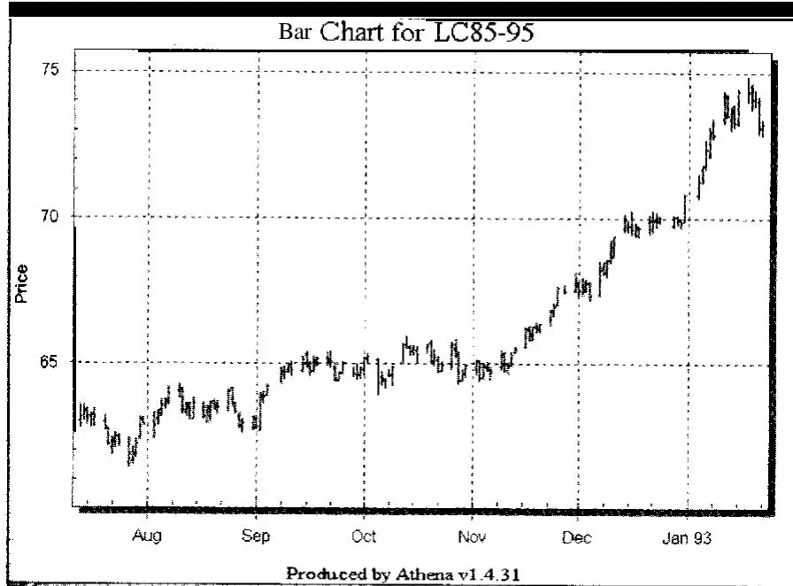
图4-1 1992年9月和10月活牛期货的突破导致小亏损，但最终可能获得大收益
如果这种类型的交易吸引你，那么用这个步骤替代模型中的步骤6到8。本质上，你的工作是寻找捕捉巨大R倍数交易（10R或更大）的方法。记住，一笔10R的交易即使有7笔1R的亏损也能盈利——即使你考虑了交易成本。

如果你决定寻找这些交易，那么你的重点必须放在：(1) 选择市场可能大幅飙升的入场点，(2) 选择合理的紧初始止损，严格将你的亏损限制在几美元甚至几个刻度，(3) 愿意让初始止损保持不动，即使这意味着让利润溜走，以及 (4) 能够在巨大利润出现时捕捉它们。当你选择走这条路时，你可能在看一个胜率低于35%的交易系统。然而，尽管盈利交易百分比很低，它仍然可以非常有利可图。

## 10. 用头寸规模管理来优化

你的期望值是对系统真实潜力的粗略估计。一旦你开发了一个具有充分期望值的系统，那么你需要确定你将使用什么算法来管理头寸规模（即决定多少）。头寸规模管理是任何系统中最重要的部分，因为如果你有一个好的、正期望值的系统，那么你的大部分利润或亏损将来自头寸规模管理。头寸规模可以帮助你赚一点钱，让你赚很多钱，或者导致你破产——无论你的系统有多好。

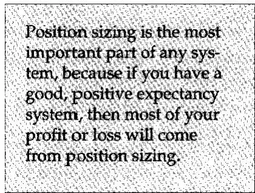
在任何一个头寸中，你将投入"多少"？你是否负担得起建立一个头寸（即一股股票或一份期货合约）？这些问题是你能否实现目标的关键——无论是三位数的回报率还是令人难以置信的高风险回报比。如果你的头寸规模管理算法不适当，那么你会破产——无论你如何定义破产（无论是亏损50%的资金还是全部）。但是，如果你的头寸规模管理技术是为你的资金、你的系统和你的目标精心设计的，那么你通常可以实现你的目标。

我们为专业资金管理人开发了一个培训项目。目前，我们有三位该项目的毕业生。

第一位毕业生Webster Management，在1995年9月，按风险回报比排名在1000万美元以上的基金中排名第一。Webster排名靠前的一个主要原因是它对头寸规模管理的理解以及通过头寸规模管理设计方法论的能力，使其获得了巨大的风险回报比。

我们项目的第二位毕业生Maricopa Asset Management，在几乎没有亏损月份的情况下，实现了5年平均每年超过40%的回报。Maricopa业绩背后的部分秘密是对头寸规模管理的理解加上定期的私人咨询。

我们项目的第三位毕业生是Ray Kelly。Ray在我与他合作后，取得了8年的记录，复合年回报率为40%或更高。事实上，在这8年期间，他只有两个月亏损。Ray的成功大部分可以归因于特殊的套利（Arbitrage）情况（见下一章Ray关于套利的部分）以及知道何时真正加大投入。

[第12章](ch07.md)讨论了许多你可能在系统设计中考虑的头寸规模管理模型。一旦你有了目标和一个高期望值的系统，你可以使用这些模型来实现你的目标。然而，你需要应用和测试各种头寸规模管理模型，直到找到完全适合你想实现的目标的东西。

## 11. 确定如何改进你的系统

开发系统的第十一项任务是确定如何改进它。市场研究是一个持续的过程。市场往往会根据参与者的特征而变化。例如，目前股市由专业共同基金经理主导。然而，在2000多名经理中，不到10人有足够的经验看到1970年代发生的长期熊市。此外，期货市场由专业CTA主导——他们大多数采用趋势跟踪策略，使用非常大量的资金。再过10到20年，市场可能有非常不同的参与者，从而呈现不同的特征。

任何具有良好正期望值的系统，如果在给定时间内进行更多交易，通常会提高其绩效。因此，你通常可以通过增加独立市场来改善绩效。事实上，一个好系统在许多不同市场中都会表现良好，所以增加许多市场只是给你更多的机会。

此外，绩效通常可以通过增加非相关系统来改善——每个系统都有自己独特的头寸规模管理模型。例如，如果你有一个主要的趋势跟踪系统和一个利用盘整市场的超短期系统，那么当你将它们组合起来时，你可能会做得很好。希望你的短期系统在没有趋势市场的时候赚钱。这将减少趋势系统在这些时期产生的任何回撤（Drawdown）的影响，或者你甚至可能整体上赚钱。无论哪种情况，你的表现都会更好，因为你将在更高的资金基础上进入趋势。

## 12. 最坏情况情景——心理规划

思考你的系统在各种情况下可能做什么是很重要的。你预期你的系统在所有类型的市场条件下会如何表现——高波动性市场、盘整市场、强趋势市场、没有兴趣的非常清淡的市场？除非你理解它在每种可能的市场条件下可能如何表现，否则你不会真正知道能从系统中期待什么。

Tom Basso喜欢告诉我们的系统研讨会的学生：
想象一下站在每笔交易对面是什么感觉。假装你刚刚买入了它（而不是卖出），或者假装你刚刚卖出了它（而不是买入）。你会有什么感觉？你的想法会是什么？

这个练习是你能做的最重要的练习之一。我强烈建议你认真对待它。

你还需要为可能出现的任何灾难做计划。头脑风暴并确定你能想到的每一个可能的灾难性情景。例如，如果市场出现一两天的价格冲击（即非常大的反向波动），你的系统会如何表现？想想你如何能承受市场中一次意外的、一生一次的波动，比如道琼斯指数下跌500点（这在10年内已经发生过两次！）或者像我们在海湾战争期间看到的另一次原油灾难。如果货币稳定下来而你是一个货币交易员，你的系统会怎样？当欧洲发展出统一货币时会发生什么？或者如果一颗陨石落在大西洋中部，消灭了欧洲和美国一半的人口？或者更普通的事情，比如你的通信被切断或你的电脑被盗？

当你有了你的灾难清单后，为每一个灾难制定几个可以实施的计划。在脑海中计划你的应对方案并排练它们。一旦你在灾难发生时确立了你的行动方案，你的系统就完成了。

## 注释

1. 建模卓越不仅仅在于找出关键任务。你需要找到每个任务的要素，并且需要能够在其他人身上安装模型。我们已经能够在系统开发模型中实现这一点。然而，那个话题本身就是一整本书。

2. 所有这些推荐书籍的参考文献在附录1的推荐阅读中给出。

3. Chande的书非常好，但我不同意他的所有结论，特别是当他开始测试投资组合并得出关于头寸规模管理的结论时。

4. 这样的人可能购买了十几只低市值股票。其中十一只可能变得一文不值，而一只变成了新的巨头。由于这些股票在很大程度上被忽视，所有者既不会在它们变得一文不值之前卖掉亏损者，也不会在获胜者变得很值钱之前发现它。

5. 命运往往以某种方式对拥有如此出色系统的人很残酷。就这个人而言，他无法进行大规模交易。也不可能从心理上解决他的问题，因为他不相信自己与问题有任何关系。事实上，在这一点上他完全无法交易，因为他很紧张，并且相信他的胃病阻止了他交易。因此，在我看来，他不理解圣杯系统的真正含义——在市场中找到自己。

6. 我的一个客户开发了一个日内交易系统，基于盈利显著大于亏损。他的系统胜率低于50%，但给他带来了巨大的回报率。这表明还有其他方式来构思短期系统。

7. "止损"这个词在这里被使用，因为大多数人通过在市场上发出止损订单来执行这种止损。这意味着"当价格达到那个价格时，将我的订单作为市价单执行"。

8. 如果你基于实际交易结果（即你在市场中一直在做的事情）来看你的期望值，那么低期望值（每风险美元15美分或更少）可能是由于心理问题，比如不遵循你的系统或恐慌性获利过早。

9. 由David Mobley Sr.领导，他为本书撰写了前言。


你越理解你所交易的概念，以及它在各种市场条件下可能如何表现，你需要做的历史测试就越少。
Tom Basso


## 选择一个有效的概念

我估计，在市场中交易的人中，不到20%的人有一个系统来指导他们的交易或投资。在那些有系统的人中，大多数人只是使用预定义的指标。很少有人理解他们系统背后的概念。因此，我请一些专家来写他们所交易的概念。这不是对各种可能交易的概念的详尽讨论。它只是一个示例。你阅读本章的目标应该是思考每个概念，并确定其中是否有任何一个适合你的个性。"适合"的概念将是你交易最成功的那个。但在你使用它开发系统之前，你必须彻底理解你的概念。

在我第一次写这本书的时候，我接到了一位混沌理论（Chaos Theory）专家的电话。他说他关注我的工作已经很多年了。他认为我很有诚信，但我在系统方面非常错误。他说，假设任何系统都是可能的，这是荒谬的——相反，这完全是运气和个人心理的问题。我说如果他将系统定义为仅仅是一种入场技术，我同意他的观点。相反，我说，必须通过止损和出场来开发一种具有正期望值的方法论，才能使心理和头寸规模管理有意义。

大多数人试图找到一个高概率的出场，而没有出场或适当头寸规模管理的概念。这通常导致一个具有负期望值的交易方法。另一方面，如果人们理解出场和头寸规模管理在系统中的作用，他们可能会对一个只产生40%盈利交易的入场系统相当满意。我想我的来电者有点震惊，但他接着说我是错的："人们不能基于过去的数据发展出任何期望值，"他说。然而有趣的是，这个人仍然写了一本书，讲述如何通过理解混沌理论从市场中赚"大"钱。

我发现这次对话非常有趣。我以为自己是最开放的人之一，因为我持这样的观点：只要你有正期望值，你可以交易任何概念。我学到的是，即使这个关于可以用正期望值交易任何概念的基本假设仍然只是一个假设——这个假设仍然构成了我思考系统的基础。记住这个假设，让我们看看一些被许多交易员和投资者使用的交易概念。

## 趋势跟踪

我已经联系了一些伟大的交易员（和好朋友）来写这些不同的概念。你已经认识了Tom Basso，因为他在本章接受了采访。Tom和我一起举办了大约20次研讨会，我可以从个人经验出发证明他是我见过的最平衡的交易员。他也是我见过的最机械的交易员。他办公室里的一切都是计算机化的。甚至交易订单都是通过计算机生成的传真发送给经纪人的。Tom交易两个计算机化的趋势跟踪系统，所以我认为他是写趋势跟踪的最合理人选。

## Tom Basso：趋势跟踪的哲学

许多成功的投资者属于一个叫做"趋势跟踪者"（Trend Followers）的群体。我将试图描述趋势跟踪的全部内容，以及为什么投资者应该有兴趣在其投资活动中使用这些一般原则。

让我们将"趋势跟踪"这个术语分解为其组成部分。第一部分是"趋势"（Trend）。每个交易员都需要一个趋势来赚钱。仔细想想，无论使用什么技术，如果你买入后没有趋势，你就无法以更高的价格卖出。你会在这笔交易中亏损。买入后必须有一个上升趋势，才能以更高的价格卖出。相反，如果你先卖出，那么随后必须有一个下降趋势，你才能以更低的价格买回。

"跟踪"（Following）是术语的下一个部分。我们使用这个词是因为趋势跟踪者总是等待趋势先转变，然后"跟随"它。如果市场处于下降方向，然后显示出向上转变的迹象，趋势跟踪者立即买入该市场。这样做时，交易员跟随了趋势。

"让你的利润奔跑。截断你的亏损。"这句古老的交易格言完美地描述了趋势跟踪。趋势跟踪指标告诉投资者市场方向何时从上涨转为下跌或从下跌转为上涨。使用各种图表或数学表示来衡量当前方向并观察转变。一旦进入趋势，交易员就坐下来享受旅程，只要趋势继续朝交易员的方向发展。这就是"让利润奔跑"。

我曾经听到一个新手投资者质疑一位非常成功的趋势跟踪者。趋势跟踪者刚刚买入了一些外汇合约，新手问："这笔交易你的目标价在哪里？"趋势跟踪者明智地回答说："到月球去。我还没有一个到过那里，但也许有一天……"这说明了趋势跟踪的哲学。如果市场配合，趋势跟踪者会在市场通过他或她的"趋势"标准后立即进入交易，并且会一直持有它，直到永远。

不幸的是，趋势通常在某个点结束。因此，当方向转变时，格言中"截断亏损"的方面应该发挥作用。交易员感觉到市场方向已经朝不利于头寸的方向转变时，立即平仓。如果头寸此时是盈利的，那么交易员赚了利润。如果当时头寸是亏损的，那么交易员中止了交易，防止了失控的亏损。无论哪种情况，交易员都退出了当前不利于他或她的头寸。

## 趋势跟踪的优势

趋势跟踪的优势很简单。你永远不会错过任何市场的大幅波动。如果你关注的市场从下跌方向转为上涨方向，任何趋势跟踪指标都必须发出"买入"信号。这只是一个时间问题。如果是一次大幅波动，你会得到信号。趋势跟踪指标的时间框架越长，交易成本越低——这是趋势跟踪的一个明显优势。

从战略上讲，投资者必须认识到，如果他或她能几乎在任何市场中搭上一次大幅波动的顺风车，仅一笔交易的利润就可能相当可观。本质上，一笔交易可以让你整个一年都盈利。因此，一个策略的胜率可以远低于50%，你仍然会显示盈利。这是因为盈利交易的平均大小远大于亏损交易的大小。

## 趋势跟踪的劣势

趋势跟踪的劣势在于，你的指标无法区分一次大的盈利波动和一次短暂的不盈利波动。因此，趋势跟踪者经常被来回打脸，因为趋势跟踪信号立即反向，导致小亏损发生。多次来回打脸会累积起来，给趋势跟踪者造成困扰，并诱惑他或她放弃策略。

大多数市场在非趋势条件下花费大量时间。趋势期可能只占15%到25%的时间。然而，趋势跟踪者必须愿意在这些不利的市场中交易，以免错过大趋势。

## 趋势跟踪仍然有效吗？

绝对有效！首先，如果没有趋势，就不需要有组织的市场。生产者可以向市场销售，而不必担心需要对冲来保护自己。最终用户将知道他们可以以合理的价格获得他们需要的产品。人们买股票纯粹是为了股息收入。因此，如果趋势在市场中停止出现任何一段时间，这些市场可能将不复存在。

其次，如果没有趋势，你可以预期价格变化的分布相当随机。然而，如果你查看几乎任何市场中价格变化随时间的分布，你会看到在大幅价格变化的方向上有一个非常长的尾部。这是因为存在异常大的价格变化，你在给定的时间段内不会预期偶然看到这些。例如，标普期货市场于1982年开业，在5年内就有一次你可能预期每百年才会看到的价格波动。这些在短期内异常大的价格变化正是趋势跟踪有效的原因，而且你一直都能看到它们。

## 趋势跟踪适合所有人吗？

趋势跟踪可能是新手交易员或投资者最容易理解和使用的技术之一。指标的时间框架越长，总交易成本对利润的影响就越小。短期模型往往难以克服更多交易的成本。成本不仅包括佣金，还包括交易的滑点。交易次数越少（前提是你有耐心），你在交易成本上花费就越少，你就越容易获利。

然而，有许多趋势跟踪不合适的例子。在交易所内剥头皮（Scalping）的场内交易员不太可能想使用趋势跟踪概念。对冲投资者可能会发现使用趋势跟踪指标来对冲风险比选择某种形式的被动经济对冲方法更有风险。日内交易员可能会发现很难使用趋势跟踪模型。进行日内交易时，你不能让利润奔跑，因为日内交易有时间限制。一天就是结束了，迫使交易员平仓。

如果趋势跟踪适合你的个性和需求，那就试试吧。有许多成功交易员和投资者的例子，他们持续使用这种久经考验的市场方法。随着我们所知的经济世界变得越来越不稳定，不断有新的趋势出现，供趋势跟踪者利用获利。


编辑评论：趋势跟踪可能是所讨论的所有概念中交易或投资最成功的技术。事实上，本书后面几乎所有的系统模型都是因为趋势跟踪才有效的。正如Basso指出的，它最大的问题是市场并不总是有趋势。然而，对于玩股票市场的人来说，这通常不是问题。有成千上万只股票可以做多或做空。如果你愿意做多和做空，那么总有好的趋势市场。

人们对股市的困难在于：(1) 有时候很少有股票在上涨趋势中，所以最好的机会只在做空方面；(2) 人们不理解做空所以回避它；(3) 交易所监管使做空变得困难（即你必须能够借到股票才能做空，而且必须在上涨报价时做空）。然而，如果你为卖空做好了计划，那么在正确的市场条件下，它可能非常有利可图。


## 基本面分析

我请另一位朋友Charles LeBeau来写关于基本面分析（Fundamental Analysis）的部分。LeBeau作为一本优秀通讯《技术交易员公报》（Technical Traders Bulletin）的前编辑而闻名。他也是一本优秀书籍《期货市场计算机分析》（Computer Analysis of the Futures Market）的合著者。Chuck是一位有才华的演讲者，他经常在道琼斯/TeleRate会议和AIQ会议上发表演讲。他还是我们许多"如何开发适合你的获胜交易系统"研讨会的客座讲师。他有自己的交易公司Island View Financial Group，管理着数百万美元的资金，他还在启动一个对冲基金。

你可能想知道为什么我请Chuck——一个有着深厚技术背景的人——来写关于基本面分析的内容。Chuck为一所主要大学讲授基本面分析，他曾经为Island View Financial Group运行一个基于基本面的自由裁量交易系统。用Charles LeBeau的话说，"我更愿意把自己看作一个愿意使用最好的可用工具来完成工作的交易员。"

## Charles LeBeau：基本面交易导论

基本面分析，应用于期货交易，是使用实际和/或预期的供需关系来预测未来价格变化的方向和幅度。可能有更精确和详细的定义，但这篇简短的文章旨在讨论基本面分析的好处和实际应用。

几乎所有交易员都错误地假设他们要么必须是完全依赖供需分析的基本面分析者，要么是完全忽略基本面、仅根据价格行为做决定的技术面分析师。谁强迫我们做出这种不必要且不合逻辑的非此即彼的决定？如果你有两个（或更多）好的想法，你几乎可以肯定，如果把它们都做了而不是陷入非此即彼的陷阱，你会更好。

基本面分析在确定价格目标方面比技术分析有明显优势。正确解释的技术指标可以给你方向和时机，但它们在给你任何预期价格运动幅度的指示方面会欠缺。一些技术人员声称他们的方法给出了价格目标，但在30年的交易之后，我还没有发现任何在预测价格目标方面有效的技术方法。然而，毫无疑问，好的基本面分析可以帮助你确定大致的利润目标。通过使用基本面价格目标，你应该大致了解是想快速获得小额利润还是持有到主要的长期价格目标。尽管基本面价格目标的准确性可能有限，但即使对预期利润幅度有一个大致的了解，在成功的交易中也是一个很大的优势。

基本面分析确实有明确的局限性。最好的基本面分析结果也将是痛苦地不精确的。如果你做对了一切，或者更好的是，依赖于一个真正基本面专家的复杂分析，你可能会得出结论，某个特定市场可能在未来某个模糊的时间在上涨方向上做出一次"大幅"运动。最好的情况下，基本面分析只会告诉你未来价格运动的方向和大致幅度。它很少告诉你价格运动何时开始或价格将走多远。然而，知道未来价格变化的方向和大致幅度当然是至关重要的信息，对交易员来说是无价的。我们对基本面和技术分析的逻辑结合将提供交易拼图的几个重要部分——而头寸规模管理（在本书其他地方讨论）是缺失的那块。

## 如何运用基本面分析

让我们来处理成功运用基本面分析的实际方面。以下建议基于多年使用基本面的实际交易经验，并不一定按重要性排列。

即使你有一些高度专业化的培训，也要避免自己进行基本面分析。我交易期货已有30多年，并经常在一所主要大学给研究生讲授基本面分析，但我不会想到自己做基本面分析。真正的基本面专家比你或我更有资格，他们全职致力于这项任务，他们的结论可以免费获得。

开始寻找合格的专家，他们的基本面分析对公众开放。致电主要经纪公司，要求将你列入他们的邮件列表。获取一份《共识》（Consensus）的试用订阅，并阅读所有分析。挑选你喜欢的，淘汰较弱的来源。寻找愿意提供有帮助的预测而不是总是拐弯抹角的分析师。记住，每个市场你只需要一个好的基本面信息来源。如果你从太多来源获取信息，你会收到相互矛盾的输入，变得困惑和犹豫不决。

新闻和基本面分析不是一回事。基本面分析预测价格方向，而新闻跟随价格方向。当我在一家大型商品公司担任高管时，媒体经常在市场收盘后打电话给我，询问为什么某个特定市场当天上涨或下跌。如果市场上涨，我会给他们一些我注意到的看涨新闻。如果市场下跌，我会给他们一些看跌新闻。市场上每天都有大量看涨和看跌的新闻在流传。报纸上报道的只是恰好与当天价格方向相关的"新闻"。

你还会注意到，即将发布的新闻比实际报道的新闻对市场的移动更久、更远。看涨新闻的预期可以支撑市场数周甚至数月。当看涨新闻最终报道时，市场很可能朝相反的方向移动。这就是为什么"买预期，卖事实"这句古老的格言似乎如此有效。（当然，同样的逻辑也适用于看跌新闻。）
小心对基本面报告的反应。例如，假设一份作物报告刚刚发布，显示大豆产量将比去年减少10%。乍一看，这似乎是非常看涨的，因为大豆供应大幅减少。但如果参与这个市场的交易员和分析师预期报告会显示大豆减少15%，那么价格可能会在"看涨"的报告下严重下跌。在你能分析报告的看涨或看跌性之前，你必须了解预期是什么，并将报告置于预期的背景中。另外，不要根据初始反应来判断报告的看涨或看跌性。给市场一些时间来消化新闻。你经常会发现对报告的第一反应要么过度要么不正确。

寻找需求水平不断上升的市场。需求是推动长期持续上涨趋势的动力，这种趋势容易交易并获得大利润。需求驱动的市场是你能进行长期交易并产生异常高利润率的市场。当然，市场也会因为供应短缺而上涨，但你经常会发现，由供应担忧推动的价格反弹往往很短暂，这些供应短缺市场的长期价格预测通常被高估。寻找需求驱动的市场来交易。

时机很重要，所以对你的基本面情景要有耐心。最好的基本面分析师似乎比大多数市场参与者更容易预测价格趋势。当然，如果你在时机上很谨慎，这是一个优势。然而，如果你冲动过早进入市场，短期内可能会亏很多钱。要有耐心，让你的技术指标告诉你市场何时开始朝着应有的方向趋势。记住，目标不是第一个拥有正确预测的人。目标是赚钱并控制风险。你可能需要等待数周甚至数月才能利用一个准确的基本面预测。过早行动很容易将一个准确的预测变成一笔亏损的交易。

许多关于重大价格变化的预测由于各种原因未能实现。如果你在广泛的一组市场上找到了准确的基本面信息来源，你可能预期在一个典型的年份中收到八到十个关于重大价格变化的预测。在这些预测中，只有六到七个可能发生。但如果你能设法及时在其中一半建仓，然后做好让利润奔跑的工作，你应该会有一个极其盈利的一年。

要果断并愿意承担你应得的亏损。不要害怕追逐那些具有重大基本面潜力的市场。许多交易员，无论是基本面还是技术面的，一旦市场开始运行，就缺乏勇气或纪律进入市场。想要以更有利的价格进入并推迟入场等待可能永远不会出现的回调是人性。你必须有信心，并且必须有勇气迅速采取行动。最好的分析，无论是基本面还是技术面的，在缺乏果断性且不采取行动的"交易员"手中都毫无价值。如有疑问，先建立一个小头寸，然后再加仓。

我希望这篇关于基本面分析的简短介绍激发了一两个想法，也许说服你基本面分析在你的交易计划中可能有一席之地。如果是这样，我强烈建议你更多地了解这个话题。在我看来，最好的书是Jack Schwager的《施瓦格谈期货：基本面分析》（Schwager on Futures: Fundamental Analysis）。任何对在交易中使用基本面感兴趣的人都会发现这本写得很好的书非常有帮助。


编辑评论：Chuck LeBeau的评论主要适用于期货交易，也可以用于本书后面介绍的Gallacher开发的方法论。如果你是股市交易员或投资者，后面将介绍两个涉及基本面的系统供你考虑——William O'Neil的CANSLIM系统和Warren Buffett的商业模式。Buffett的模型几乎完全是基本面的，而O'Neil的模型依赖基本面进行设置。


## 季节性倾向

在我看来，位于俄勒冈州尤金市的Moore Research Center, Inc.是市场季节性倾向研究的领军中心。它专门从事期货、现货和股票价格的计算机化分析。自1989年以来，它每月发布一份报告和对特定期货综合体的研究，这些报告和研究遍布全球。它还对市场中的概率倾向进行了出色的研究。因此，我找到Steve Moore来撰写本章。Steve说该中心有一位与公众沟通的专家——Jerry Toepke，Moore Research Center Publications的编辑。Jerry撰写了许多文章，并在多个会议上发表过演讲。

## Jerry Toepke：为什么季节性有效

市场的季节性方法旨在预测未来的价格运动，而不是不断对无穷无尽且常常相互矛盾的新闻做出反应。尽管许多因素影响市场，但某些条件和事件以年度间隔重复出现。最明显的可能是天气从暖到冷再回到暖的年度周期。然而，日历也标志着重要事件的年度流逝，例如美国所得税每年4月15日的到期日。这些年度事件创造了供需的年度周期。收获时大量的粮食供应在全年逐渐减少。取暖油的需求通常在寒冷天气来临时上升，但随着库存的补充而减少。货币流动性可能在缴税时下降，但在美联储重新流通资金时上升。

这些供需的年度周期产生了季节性价格现象——程度或多或少，时机或多或少准时。因此，变化条件的年度模式可能导致或多或少明确的价格响应年度模式。因此，季节性可以被定义为市场的自然节律，即价格每年在相似时间朝相同方向移动的既定倾向。因此，它成为任何市场中受客观分析影响的有效原则。

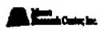
在一个受年度周期强烈影响的市场中，季节性价格运动可能不仅仅是一种季节性原因的效果。它可能变得如此根深蒂固，以至于几乎成为一种基本面条件本身——就好像市场有自己的记忆一样。为什么？一旦消费者和生产者陷入一种模式，他们就倾向于依赖它，几乎到了依赖它的地步。既得利益者随后维持它。

模式意味着一定程度的可预测性。未来价格在预期变化时移动，并在变化实现时调整。当这些变化是年度性质时，预期和实现的循环反复演进。这种反复出现的现象是季节性交易方法的内在特征，因为它旨在预期、进入并在趋势出现时捕捉反复出现的趋势，并在趋势实现时退出。

当然，第一步是找到市场的季节性价格模式。过去，使用每周或每月的最高价和最低价来构建相对粗糙的研究。例如，这样的分析可能表明，4月份的牛肉价格有67%的时间高于3月份，有80%的时间高于5月份。然而，计算机现在可以从几年每日价格活动的组合中推导出每日季节性价格行为模式。构建得当的话，这种模式提供了市场年度价格周期的历史视角。

任何周期的四个主要组成部分是：(1) 低点，(2) 上涨，(3) 高点，和 (4) 下跌。转化为季节性价格模式时，这些组成部分变为季节性低点、季节性上涨、季节性高点和季节性下跌。因此，季节性模式以图形方式说明了市场价格预期反复出现的年度条件——最大供应-最小需求、需求增加-供应减少、最大需求-最小供应以及需求减少-供应增加——的既定倾向。从这个模式中，人们可以开始更好地预期未来的价格运动。

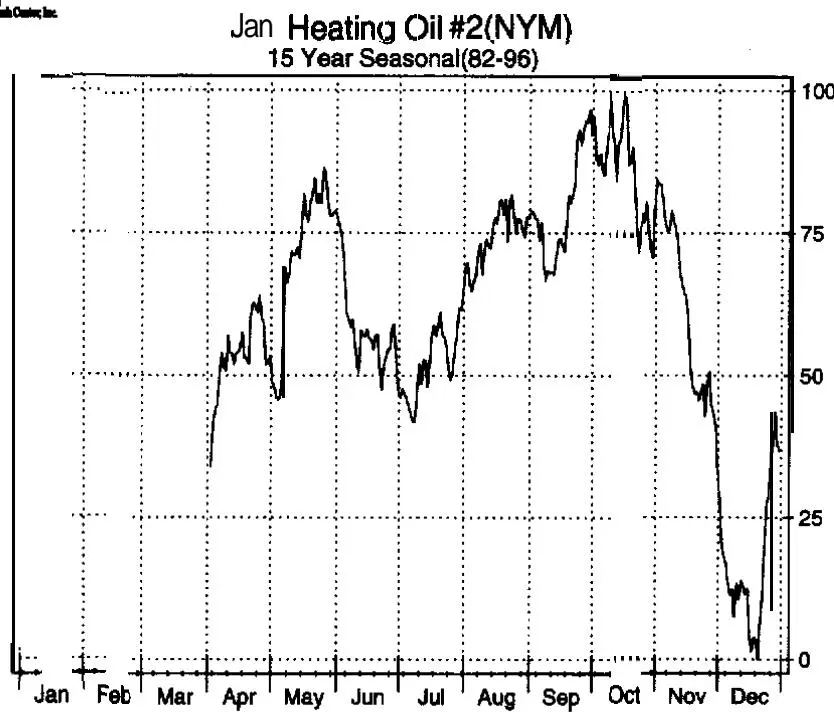
图5-1 1月取暖油
考虑以下季节性模式，它是在1982-1996年期间1月交割的取暖油（图5-1）中发展起来的。需求——因此价格——在7月通常较低，这往往是一年中最热的月份。随着行业开始预期天气转凉，市场发现对未来库存的需求增加——对价格施加上行压力。最终，价格的上涨往往在最冷天气到来之前达到高潮，因为预期需求得到实现，炼油厂开始满足需求，市场关注未来库存的清算。

另一种主要石油产品经历了不同的——尽管仍然是天气驱动的——需求周期，如8月汽油（图5-2）的季节性模式（1986-1995年）所示。价格在冬季较差的驾驶条件下往往较低。然而，随着行业开始预期夏季驾驶季节，未来库存的需求增加并对价格施加上行压力。到驾驶季节正式开始时（阵亡将士纪念日），炼油厂就有足够的激励来满足需求。

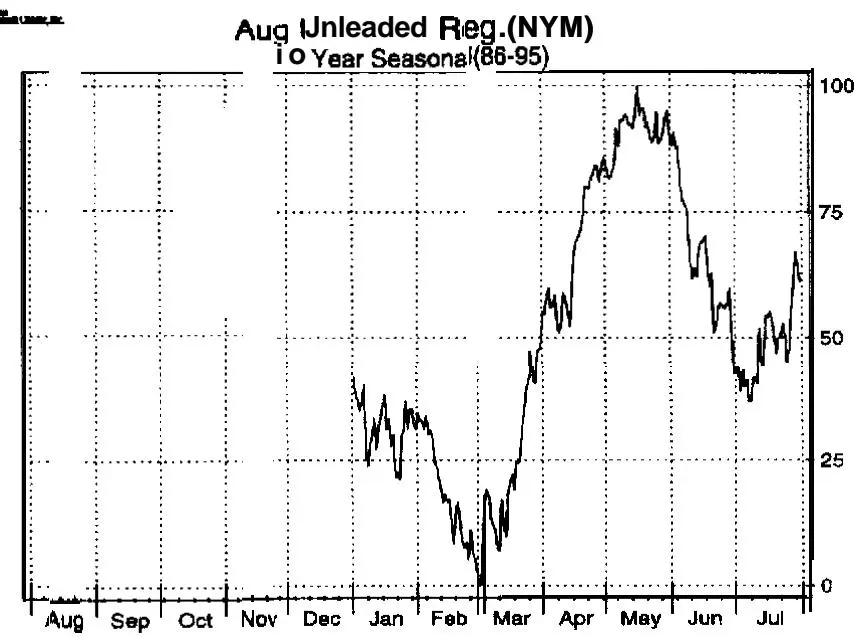
图5-2 8月无铅汽油
从每日价格推导出的季节性模式很少呈现为完美的周期。即使在具有明显季节性高点和低点的模式中，中间的季节性趋势也会在完全实现之前受到各种有时相互冲突的力量的影响。季节性下跌通常可能被短暂的反弹打断。例如，尽管牛肉价格通常从3-4月下降到6-7月，但它们在5月初表现出强劲的反弹趋势，因为零售食品店为阵亡将士纪念日烧烤储备牛肉。大豆价格倾向于从6-7月下降到10月的收获期，但到劳动节时，市场通常已经预期了霜冻恐慌。

相反，季节性上涨通常可能被短暂的下跌打断。例如，期货上涨趋势经常被与近期合约首次通知日（First Notice Day）相关的人为卖压所打断。这种清算以避免交割的做法可以提供获利了结然后进入或重新建立头寸的机会。

因此，从每日价格构建的季节性模式不仅可以描绘季节性价格运动的四个主要组成部分，还可以描绘较大季节性趋势中特别可靠的部分。认识到倾向于与这些标点同时发生的基本面事件可以为该模式提供更大的信心。

考虑以下季节性价格模式，它是在1981-1995年期间9月国债（图5-3）中发展起来的。美国政府的财政年度从10月1日开始，增加流动性并在一定程度上缓解借贷需求。从那时起债券价格上涨的趋势也倾向于与日历年的个人所得税义务同时达到顶点，这仅仅是巧合吗？

进入5月的季节性下跌是否反映了市场预期缴税时货币流动性会收紧？注意最后的急剧下跌开始于——令人惊讶！——4月15日，美国所得税的最后支付日期。流动性是否在6月1日之后急剧增加，因为美联储终于能够重新流通资金？

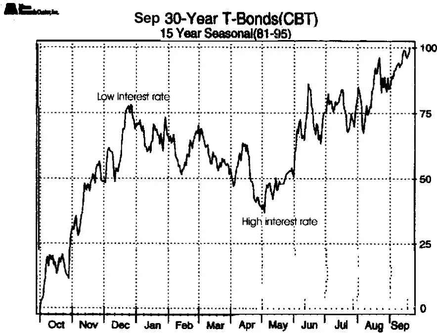
图5-3 9月T债券
仔细观察12月1日、3月1日、6月1日和9月1日前后的典型市场活动——这些日期是芝加哥期货交易所债务工具期货合约的首次交割日。最后，注意每个季度第二个月——11月、2月、5月和8月——的第一周或第二周期间的明显下跌。债券交易员知道，价格倾向于下跌至少到季度国债再融资（Refunding）的第二天——此时市场对3天拍卖的覆盖率有了更好的了解。

还要考虑11月大豆（图5-4）的模式，它在巴西成为主要生产者后的15年（1981-1995年）中发展起来，其作物周期与北半球正好相反。注意价格在"2月下跌"期间趋于横向走低的倾向，因为美国生产者销售他们最近的收获，巴西的作物迅速发展。到3月合约的首次交割通知发布时，春季反弹的基本面动态已经就位——巴西的作物已经"完成"（实现），美国生产者销售的压力已经达到高潮，市场预期随着更便宜的河运变得更加可用，需求将回归，市场开始集中注意力为美国种植面积提供激励以及为天气风险提供溢价。

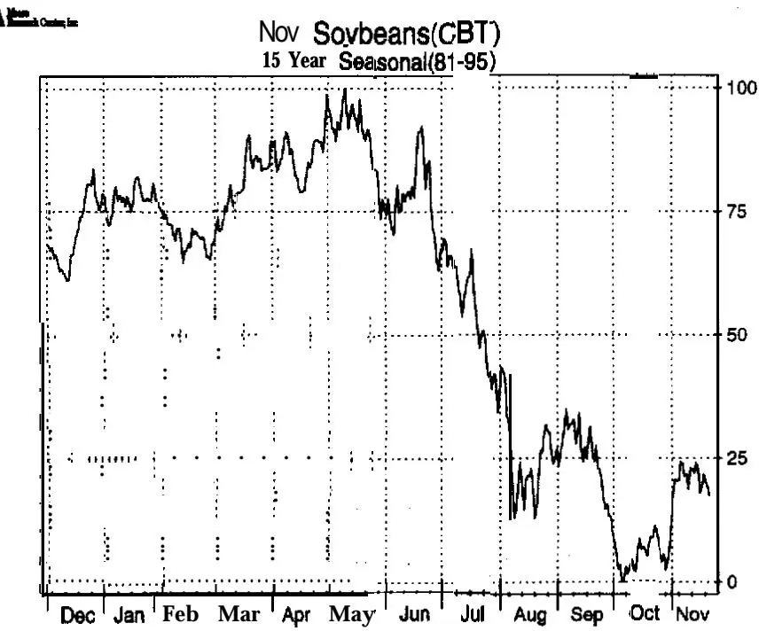
图5-4 11月大豆
然而，到5月中旬，中西部地区可用于大豆的主要美国面积大部分已经确定，种植开始进行。同时，巴西开始销售其最近的收获。这些新供应的可用性和美国新作物的潜力通常结合在一起对市场价格施加压力。6月下旬和7月中旬的小高峰表示偶尔出现作物恐慌的倾向。

到8月中旬，美国新作物已经"完成"（实现），期货有时可以建立一个早期的季节性低点。然而，价格更经常在10月收获低点之前进一步下跌——但只是在9月份因商业需求购买第一批新作物大豆和/或担忧早期作物受损的霜冻而反弹之后。还要注意与7月、8月、9月和11月合约首次通知日相关的小幅标点（下跌和反弹）。

当然，这种交易模式不会毫无例外地重复。季节性方法和其他任何方法一样，有其固有的局限性。对交易员来说，最直接的实际关注可能是时机和反季节性价格运动的问题。基本面，无论是日内的还是长期的，不可避免地会有起伏。例如，有些夏天比其他夏天更热更干燥，而且在更关键的时候。即使具有异常季节性一致性的趋势，最好也结合常识、简单的技术指标和/或对当前基本面的基本熟悉来交易，以增强选择性和时机。

一个有效的统计样本必须有多大？一般来说，越多越好。然而，对于某些用途，"现代"历史可能更实用。例如，巴西在1980年成为主要大豆生产者，是该市场交易模式从1970年代几乎180度逆转的主要因素。相反，仅依赖1985-1991年普遍存在的通缩模式在通胀环境中可能是有害的。

在这样的历史转变中，近期模式的相关性可能会出现时间滞后。分析现货市场可以帮助中和这种影响，但某些特定于期货的模式（如那些由交割或到期驱动的模式）可能在转化过程中丢失。因此，样本大小和样本本身都必须适合其预期用途。这些可以由用户任意确定，但只有完全了解其选择后果的用户才能这样做。

相关问题涉及用统计预测未来，这些统计确认了过去但本身并不预测。超级碗冠军/股市方向"现象"是统计巧合的一个例子，因为不存在因果关系。然而，它确实提出了一个有效的问题：当计算机仅筛选原始数据时，什么发现有意义？例如，在过去15年中有14年重复出现的模式是否一定有效？

当然，由基本面驱动的模式激发更多的信心，但要知道每个市场的所有相关基本面是不切实际的。当一个人正确构建季节性模式时，他通常可能发现某些趋势在特定日期之间以相同的朝向反复出现，具有很高的过去可靠性。一组这样历史上可靠的趋势，具有相似的入场和/或出场日期，不仅降低了统计异常的概率，而且暗示了反复出现的基本面条件，这些条件预计将来会再次存在并在某种程度上影响市场，时机或多或少准时。

季节性模式仅仅描绘了市场本身倾向于遵循的久经考验的路径。正是市场自身的连贯性为季节性有效提供了基础。


编辑评论：有些人正在推广在我看来没有意义的季节性信息。这通常采取以下形式的信息：X的价格在过去14年中有13年在4月13日上涨。计算机总是会发现这种性质的相关性，有些人会想基于它们进行交易。然而，交易一个没有逻辑因果关系支撑的季节性模式，后果自负。例如，1998年超级碗的结果似乎预测了1998年股市的下跌。你想交易那个吗？


## 价差交易

Kevin Thomas是伦敦国际金融期货交易所（LIFFE）上更成功的场内交易员之一。他也是第一个完成我们2年超级交易员项目的人。Kevin主要在交易所内交易价差（Spreads）。当我最初为我的一份通讯采访Kevin时，他广泛谈到了价差。因此，我认为他是为本书撰写价差交易概念的合理人选。

## Kevin Thomas：价差交易导论

价差可以在期货市场中用于创建表现为多头和空头头寸的头寸。这些类型的合成头寸非常值得考虑。它们比直接交易有几个优势——更低的风险状况和更低的保证金要求。此外，一些价差可以像任何其他市场一样绘制图表。

例如，在欧洲美元中，你可以做多近期合约并做空一年期更远的合约，这种人造头寸仅以价差保证金率表现出空头头寸的特征。这种类型的价差被称为"跨合约价差"（Intercontract Spread），它可以用于具有流动性远期合约的市场。然而，价差的行为因市场而异。

在利率期货中，交易日历价差（Calendar Spread）（将近期合约与远期合约进行价差交易）是一种常见策略，取决于你对短期利率的看法。如果你认为利率将上升，那么你会买入近期合约并卖出远期合约。两个合约之间的月份越多，决定了价差的响应性和可能的波动性。同年6月和9月之间的价差可能比今年9月和明年9月之间的价差波动更小。图5-5中的例子说明了这一点。

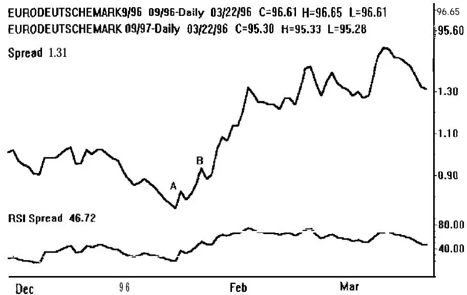
图5-5 近期（底部）和远期日历价差。（图表由Kevin Thomas使用Omega Research, Inc.的SuperCharts制作。）
图5-5显示了1996年9月欧洲马克和1997年9月欧洲马克之间价差的移动。我已经画了趋势线并在价差上加入了一个14日RSI。注意在A点有一个背离（Divergence），在B点有一个突破。这是短期利率即将上升的信号。通过做多价差，你可以参与即将到来的市场下跌。注意价差随后从低点到高点移动了76个刻度。

图5-6中的图表显示了各个月份在同一时期的移动。注意价差的移动实际上是各个月份即将发生的事情的良好领先指标。此外，价差的移动大于1996年9月的下跌，约为1997年9月下跌的75%。价差的保证金是每单位600德国马克，而直接期货头寸为1500德国马克。

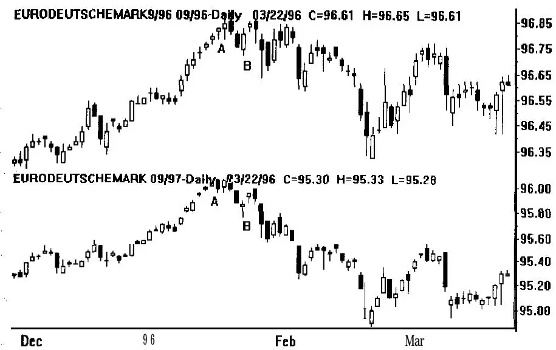
图5-6 各个月份的移动。（图表由Kevin Thomas使用Omega Research, Inc.的SuperCharts制作。）
这种价差交易是场内交易员中流行的概念，因为他们能够参与一个比直接期货头寸风险更低且具有良好盈利潜力的头寸。一旦建立了价差头寸，就可以像对待任何其他头寸一样对待它。趋势跟踪和头寸规模管理模型可以应用。

通过使用价差，你可以创建原本可能不可用的关系。例如，货币交叉汇率是可以使用IMM货币（如德国马克兑日元）创建的价差。这创造了世界上最活跃的交易关系之一，但如果你只是从美元或英镑的角度思考，你不会想到它。

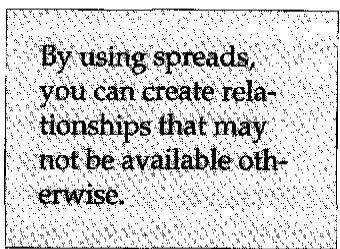
另一个在这些市场中使用的常见策略是蝶式价差（Butterfly Spread），它是两个共享一个共同月份的价差之间的差（例如，做多1份1996年9月，做空2份1996年12月，做多1份1997年3月）。蝶式价差的交易成本很高，因为场外交易员的佣金成本。然而，场内交易员在欧洲美元或欧洲马克等市场中可以利用这种策略，因为他们佣金更低且有做市商优势。该策略通常风险非常低，获利期望非常高。场内交易员因为他或她交易两个价差，通常能够在一个价差上打平，在另一个价差上赚一个刻度，或者在最坏的情况下，整个蝶式价差打平。

商品也适合跨合约价差交易。假设你预测由于供应短缺，铜价将上涨。如果是这样的话，那么你会买入近期合约并卖出远期。这是因为在供应短缺时期，近期价格将高于远期价格，创造一种称为"现货溢价"（Backwardation）的现象。

在交易商品时，始终记住实物交割是合约规格的一部分。"现货持有"（Cash and Carry）是一种可以在交易金属（包括基本金属和贵金属）时使用的策略——当它们供应充足时。想法是在仓库中接收金属，并在未来的日期重新交割，如果回报（价格的上涨）将超过该时期的利率。如果利率高于回报或回报最终为负，则该策略不值得做。

跨市场价差（Intermarket Spreading）是另一个值得做的价差交易想法。在这里，你只是在不同市场之间进行交易，例如标普对T债券、欧洲美元对欧洲马克、货币交叉汇率、黄金对白银等。John Murphy用一整本书专门讨论了这个话题（《跨市场技术分析》），但这种价差背后的基本想法是你相信两个市场的相对运动可能是你最好的交易想法。

还有许多其他形式的价差可以研究，包括(1)期权合约价差和(2)套利。这两者本身就是完整的交易艺术形式。价差交易可以像你想要的那样简单或复杂，但绝对值得研究。


编辑评论：所有前面的概念都可以与价差交易一起使用。价差交易的优势很简单，你可以交易之前不可交易的关系。例如，当你买入黄金时，你实际上是在买入黄金和美元之间的关系。如果美元相对于黄金贬值或黄金相对于美元升值，这种关系就会上升。价差只是建立了另一种你可以交易的关系。


## 套利

Ray Kelly是我亲密的私人朋友，也是我最早的客户之一。他还成为了一位伟大的教师和我所知道的最好的交易员之一。从1987年我与他合作结束到1994年初，Ray平均每年的回报率为40%到60%。他部分地通过在整个期间只有一个月亏损——仅亏损2%——来实现这一点。1994年对Ray来说不是很好的一年，因为他支持了一些期货交易员，这些人随后为他亏了钱，但Ray仍然用他的交易方法——套利——赚了钱。Ray在我们的巅峰表现交易研讨会中担任模型交易员多年。他也是我们的第三位毕业生。他目前为自己交易，启动了一个新的套利基金，并在南加州经营一个交易员静修中心。

## Ray Kelly：套利——它是什么以及如何实施

当人们问我以什么谋生，我说"套利"时，我看到同样的茫然目光，就像我掀开汽车引擎盖或有人说出"微积分"这个词时我常用的表情一样。母亲们把孩子拉到身边，男人们用怀疑的眼光看着我。

如果你能克服对"A"这个词的恐惧大约10分钟，我保证你不仅会理解套利的本质，还会理解它如何影响你的日常生活。如果你开始"套利思维"，你会在你生活的每个方面看到你以前忽略的机会。你的知识将使你在下次鸡尾酒会上不必在有人提到"那些做套利的家伙"时离开潘趣酒碗。你会被认为是聚会上的知识分子之一，人们会钦佩地盯着你——所有这一切都因为你花了10分钟阅读本书的这一部分。

套利（Arbitrage）几乎在每个行业中都有企业家在做。字典将"套利"定义为"在一个市场买入汇票并在另一个市场卖出"。它还将女性描述为"女性人类"。这两个定义都是正确的，但它们没有完全捕捉到这个词的本质。套利是发现的魔力。它是深入研究微小细节到令人讨厌的地步的艺术和科学。它是这样一个过程：把情境的每个部分都看作是放在基座上慢慢旋转的钻石，这样你就可以观察它的所有面，并将它们视为独特的而非相同的。它属于那些热爱解决不可能谜题的人。

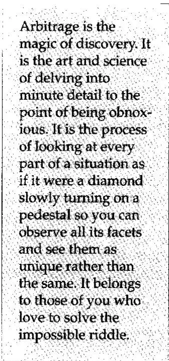
Edwin LeFerve在《股票操盘手回忆录》（Reminiscences of a Stock Operator）一书中描述了二十年代初随着电话的出现发生的情况。所有来自纽约证券交易所的股票报价都是通过我们现在称为"对赌行"（Bucket Shops）的电传打字公司发送的。这与场外投注非常相似。这些店铺允许一个人知道一个报价，然后下达买入或卖出的订单。不同之处在于，店主就是庄家或区域专家，他不打电话给交易所，而是自己记录交易。例如，报价单会说伊士曼柯达以66.5交易。客户会说"买入500股"，店主会确认购买并承担这笔交易的另一方。

一个有电话的聪明人终于发现电话比纽约证券交易所交易大厅里的电传打字操作员更快。他会进行一些小交易，在店铺中建立存在感，但在波动时期总是通过电话与一个同伙保持联系。如果有坏消息传出，他可能会发现伊士曼柯达虽然在报价单上显示66.5，但在纽约实际上是以65交易。因此，他会尽可能多地以66.5卖给店主，然后通过他在纽约交易大厅的朋友以65买回。随着时间的推移，这个聪明的家伙雇用了其他人在对赌行交易，并使许多对赌行倒闭。最终，剩下的对赌行有了自己的电话。

这种行为是不道德的，还是一种更有效为市场定价的方式？店主记录交易是不道德的吗？要记住的重要事情是，经济学本身没有道德准则。它就是存在。人们将"好"和"坏"或"对"和"错"归因于各种实践。店主觉得套利者的行为是错误的。纽约的经纪人喜欢增加的佣金业务，也喜欢套利者。

套利者自己觉得，既然电话对所有人开放，他们只是在实施任何聪明人都能想到的东西。他们没有义务通过向那些最终能自己想明白的人解释一切来否定自己的聪明才智。随着时间的推移，总会有其他人采取行动来阻止套利或加入其中使机会变得不那么有利可图。经济学对参与者的情绪是中性的。它说："如果桌上有钱，它属于捡起它的人。"
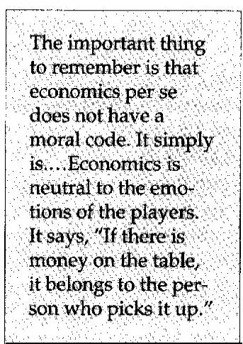
当我还是个十几岁的孩子时，我做了我的第一次套利。我住在一个富裕的社区，虽然我当时身无分文。我爸爸不断收到"免费"的信用卡。1960年代的某一天，我们遇到了一场暴风雪，就像中西部偶尔会遇到的那样。我住在一个五金店对面，我知道它有一台售价265美元的扫雪机出售。那是一台强大的机器！我可以看到即使是铲雪车也无法到达富人们的房子。

我还注意到我父亲桌上有一封未拆开的信，里面有一张Towne and Country信用卡。我的名字和我父亲的一样，所以我拿走了它。（这就是所谓的风险套利。）商店早上7点开门时，我用信用卡买了扫雪机。那天晚上8点之前，我铲了11条长长的车道，赚了550美元。第二天早上7点，我以200美元把扫雪机卖回给了店里的人。他退还了信用卡签购单，我把略微使用过的扫雪机给了他，这台机器仍然很抢手。我净赚了485美元，感觉就像那只吃了金丝雀的猫！

几年前，一个有3000股股票的人找我咨询。他有机会通过公司以折扣价购买更多股票。这是一个以19美元购买价值25美元股票的机会。即使他能购买的股票数量很小，这仍然是一个好机会。

我在芝加哥期权交易所（CBOE）工作了25年，找不到任何类似的投资。因此，我告诉他这是个好交易，并致电公司了解其股息再投资计划的更多信息。我还发现其他公司也有类似的计划，经纪界也开始参与这些计划。

我想知道，"他们是怎么做到的？如果他们买了100万股，他们只能将股息金额进行再投资，而购买的利息将抵消利润。"他们还会有巨大的市场风险。然而，我看到其他人做这个交易，我开始痴迷于它是如何完成的。显然有些人在赚钱。我翻阅记录，与保证金文员交谈，观察在股息支付日期之前发生的交易。慢慢地，情况变得清晰了。我最终解决了这个看起来像数学输家的问题。然而，我没有足够的资金自己做，所以我经历了痛苦和煎熬的步骤，找到了一家证券业务中的公司，他们没有在做这件事，而且在我向那里的人解释后不会偷走它。那是一个漫长的过程。

套利者必须找到一家愿意超越表面看问题的公司——机会就在那里。律师通常是一堵强大的阻力墙。机构律师受雇进行调查，现状通常很难改变。如果出了问题，他们会受到指责。但如果事情拖延，律师照样拿到报酬。如果路径有一点曲折，他们不是被雇来找另一条路，而是告诉你你走的那条路行不通。他们不喜欢被追问细节，也不喜欢快速回答。这就是他们的魅力。另一方面，一旦你通过了这个过程，你就成为现状的一部分（至少暂时如此）。

套利通常具有时效性。一旦发现某些机会，竞争通常会降低利润，监管机构最终会堵上曾经被忽视的漏洞。这个时间框架通常被称为"窗口"（Window）。例如，一家有股息再投资计划的公司可能会说，"我们只打算将此计划用于小型投资者。"套利者可能会回应说，公司的意图不是其计划法律文本的一部分。公司反过来通常会通过立法或更改其计划来寻求补救。在任何一种情况下，套利机会都指向了公司"意图"经济学中的一个缺陷。套利者就是为这个缺陷获得报酬的。

多年来我向其提出想法的机构有一个称为"基础设施"的问题。大公司被分为管理业务特定部分的部门。在证券领域，一个部门可能处理客户账户，另一个处理股票借贷，另一个处理自营交易等。每个部门都有自己的利润目标和所谓的"门槛回报率"（Hurdle Rate）。门槛回报率是部门主管接受一项业务提案所要求的最低回报的计算。

CEO通常会将管理权交给部门主管。这里的问题是，经济（和机会）不关心公司的结构。从公司角度来看可能有效的东西可能会留下低效率，这些低效率被视为业务成本而被接受。由于一个公司部门主管窥探另一个经理的领域是令人厌恶的，这些低效率很少被快速处理，如果有的话。

在一个具体的实际情况中，我向一家主要经纪公司提出了一个策略，在扣除我的百分比后，该策略在资本上回报67%。不幸的是，我需要该公司的三个部门来完成这一点。这些部门中每一个都有30%的门槛回报率。没有一个愿意接受更少的回报，因为它削弱了该部门的整体状况，尽管它大大增强了公司的整体回报。在近两年的谈判过程中，回报从67%下降到35%。实际上有数千万美元的潜在利润岌岌可危。该公司从未进行过一笔交易，据我所知，所有相同的经理仍然在那里工作。

一旦你通过了基础设施并在公司获得了可信度，还有其他问题。战壕里的部队会感到恼火，因为你做的每件事都不正常。他们总是被要求为我做的事情与他们为常规客户做的事情有所不同。我们坚持对微小的、看似无害的程序进行分钟级的关注。

例如，如果一笔交易在纽约证券交易所执行，我可以协商一个固定的票据费用，比如150美元，无论交易规模如何。我无法帮助我的客户与证券交易委员会协商其在股票销售上0.003%的费用。这似乎是一笔小数目。但在一笔1亿美元的交易中，金额是3333.33美元。对我来说，这是一大笔钱。

经纪公司无法改变美国政府。它只是将费用转嫁给客户，这些费用不会受到质疑。然而，如果我的客户每年做1000笔这样的1亿美元交易，政府的费用将超过3000万美元。再次说明，机会的经济学不关心政策的顽固——即使是来自美国政府的。然而，如果我建议我的客户应该在多伦多而不是美国进行交易，她将节省这笔费用，合理地免受政府当局的质疑，并且不会在国内引起任何恶名，客户就喜欢我了。然而，必须处理这些交易的职员一点也不喜欢我。我用他眼中的琐事打乱了他的一天。如果我能从节省的费用中分给他10%，他会很快明白过来。但我向人们披露的信息越多，优势消失得就越快。

最终，其他人会弄清楚我在做什么，并找到一种方法来分一杯羹。这被称为逆向工程（Reverse Engineering）。有些公司有整个部门专门负责观察市场并揭露策略。我相信这个过程是经济系统中价格发现的关键部分。套利者以一种官僚机构无法忽视或推回的方式指出了一些计算错误或误解。在许多情况下，它迫使机构关注他们原本会忽视的情况。

我对证券公司和银行似乎采取的所有预防措施仍然感到困惑——然而他们仍然会犯下数十亿美元的错误。策略批准的过程如此严格，以至于进行交易的套利者没有动力帮助自己的公司进行风险评估。套利者几乎总是最终处于对抗角色，这是他们业务性质决定的。交易员的诚信应该在其生活的各个方面得到认真考虑。诚信似乎是大多数交易公司的最后一道防线。

总之，可以论证套利职业没有稳定性，因为一切都在变化——漏洞被堵上，利润变小。另一方面，你可以认识到生活中的一切都在不断变化，接受变化就是过一种伟大的冒险。你可以认识到错误和计算失误是人类状况的一部分。它们是我们学习和成长的方式。你的使命，通过套利，是纠正低效，不管人们是否想要你这样做。你因纠正错误而获得报酬。你的工作是逐块拆解别人的战略或概念。

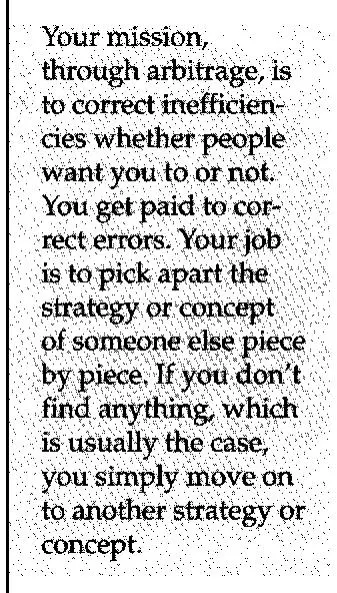
如果你什么也没发现（通常都是这样），你只需转向另一个策略或概念。你看待事物的方式，你的参考框架，决定了你对套利的看法。

套利者的成功取决于他或她愿意付出额外努力的承诺。套利是低效率的清洁剂。它使我不会成为一个旁观者。毕竟，生活中只有两个地方你可以待——在赛场上或在看台上。我更愿意在赛场上。


编辑评论：本质上，大多数交易和投资都是套利的一种形式——寻找市场中的低效。然而，Ray Kelly的套利形式是套利的最纯粹应用。它几乎是一张印钞许可证，但只限于有限的时间。如果你真的想成为一名专业交易员，那么我强烈建议你不断寻找这样的机会。


## 神经网络

我到处寻找一位专家来为本书撰写关于神经网络（Neural Networks）的内容。神经网络的问题之一是它们很复杂，它们往往接近于曲线拟合（Curve Fitting），你可能花费大量精力仅仅试图预测一个市场明天是上涨还是下跌，准确率约55%。这相当令人沮丧，尤其是当我的直觉认为神经网络可以做更多事情的时候。

最后，我通过Louis Mendelsohn的网站偶然发现了他，我对在那里看到的内容印象深刻。他写的大多数文章（超过50篇）都完整呈现。Mendelsohn已经远远超越了预测明天的价格，实际上以一些非常有用的方式使用神经网络。因此，当他同意撰写这个概念章节的部分内容时，我很高兴。他是一位国际知名的技术分析师、投资软件开发者和金融作家。

## Louis Mendelsohn：神经网络导论

将跨市场分析（Intermarket Analysis）与传统单市场技术分析相结合，对于在1990年代及以后进行盈利交易是必要的。今天有限的单市场关注必须让位于一个更广泛的分析框架，以应对当今金融市场的非线性相互依赖。1991年我首次撰写了关于这个框架的文章，将其称为"协同市场分析"（Synergistic Market Analysis）。这种方法允许交易员量化复杂的跨市场关系，评估多个相关市场对给定市场的同步影响，并衡量这些关系中存在的领先和滞后。

神经网络是实施协同分析的优秀工具。它们可用于综合不同的数据并发现市场之间隐藏的模式和复杂关系。神经网络是真实的，它们确实有效！事实上，它们在处理大量跨市场数据方面表现出色。正是量化众多相关市场之间微妙关系和检测隐藏模式的能力，使神经网络成为金融领域的重要数学工具。交易员还能如何同时检查5个、10个或15个相关市场过去10年的价格数据，以辨别这些市场对特定市场的影响？

此外，通过使用神经网络，金融预测成为可能，使交易员能够获得对金融市场的前瞻性而非仅仅是回顾性的视角。任何人都可以通过简单地查看价格图表告诉你一个市场过去在哪里，但真正的钱在于正确预期该市场的未来方向！通过将神经网络应用于跨市场分析，交易员实际上可以预测金融市场，类似于气象学家预测飓风预期路径的方式。预测永远不会100%准确。它永远不会。但在不确定条件下的决策角度来看，这是朝着正确方向迈出的重要一步。

为了将跨市场分析纳入你的交易计划，没有必要改变你的交易风格或停止使用效果合理的单市场指标。跨市场分析可以用来增强现有的单市场方法。

为了理解单市场分析和跨市场分析之间的区别，用一只手遮住你的一只眼睛。突然之间，你的周边视觉急剧受限，你把握整个环境的能力大大降低。这就是当今金融环境中单市场分析的样子。现在移开你的手，瞬间你的周边视觉就恢复了。这就是跨市场分析的全部意义——拓宽你的视野。

## 神经网络入门

我想对神经网络是什么以及如何应用于金融市场做一个粗略的概述。这里的重点将放在神经网络范式、架构以及金融预测应用的训练和测试流程上。

神经网络通过在神经元（Neurons）之间传递信息来"学习"解决问题，神经元是神经网络的基本处理单元。神经网络通常包括几层神经元。网络架构决定了有多少层、每层有多少神经元、它们如何连接以及使用什么传递函数。有许多学习范式，其中两种在金融分析中很流行。第一种流行的范式是循环反向传播网络（Recurrent Back-Propagation Network），它通过事实呈现的顺序来学习时间信息。第二种范式是前馈反向传播网络（Feed-Forward Back-Propagation Network），它通过误差的反向传播来训练，其中时间信息通过获取数据的预处理"快照"编码到输入数据中。典型的反向传播网络架构如图5-7所示。这种范式将在这里用于说明网络架构。

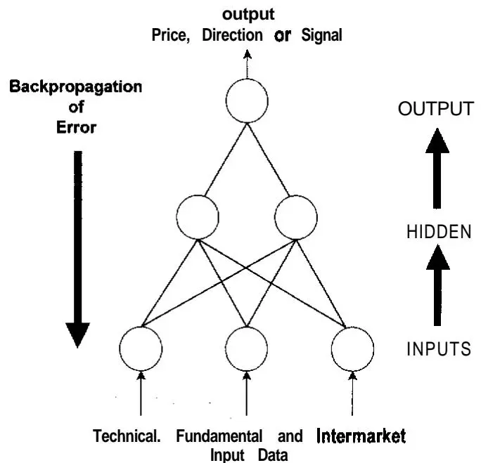
图5-7 简单的前馈反向传播网络。一个使用技术面、基本面和跨市场数据的反向传播网络。该网络通过整个网络的误差反向传播进行训练。
反向传播网络由输入层、一个或多个隐藏层（Hidden Layer）和输出层组成。输入层包含与每个输入（独立）变量对应的神经元。输出层包含每个要预测的（依赖）变量的神经元。隐藏层包含连接到输入层和输出层的神经元。这些层通常是全连接的，一层中的每个神经元都连接到相邻层中的每个神经元。

与每个输入神经元相关联的值被前馈到第一个隐藏层中的每个神经元。然后它们乘以适当的权重，求和，并通过传递函数产生输出。第一个隐藏层的输出随后被前馈到下一个隐藏层，或者在网络只有一个隐藏层的情况下直接馈入输出层。输出层的输出是网络做出的预测。

隐藏层中的神经元数量通过实验确定。对于任何非线性问题，如股票或期货价格的预测，网络至少需要一个隐藏层。此外，传递函数应该是一个非线性的、连续可微的函数，如Sigmoid函数，它允许网络执行非线性统计建模。图5-8给出了一个隐藏神经元的例子。

**输入数据选择和预处理**
神经网络建模基于开发者对输入和输出之间底层现实世界关系的理解。必须决定预测什么以及什么数据将用作网络的输入。"垃圾进，垃圾出"（Garbage-In, Garbage-Out）适用于神经网络。对金融市场的了解，加上使用主成分分析等各种工具来寻找相关市场之间的相关性，是适当输入数据选择所必需的。

一旦选择了输入数据，就必须进行预处理。通过减少网络的输入数量，预处理帮助它更容易学习。两种广泛使用的预处理方法称为"变换"（Transformation）和"归一化"（Normalization）。变换操作原始数据输入以创建网络的单一输入。归一化将单个数据输入转换为均匀分布数据，并缩放数据以匹配输入神经元的范围。

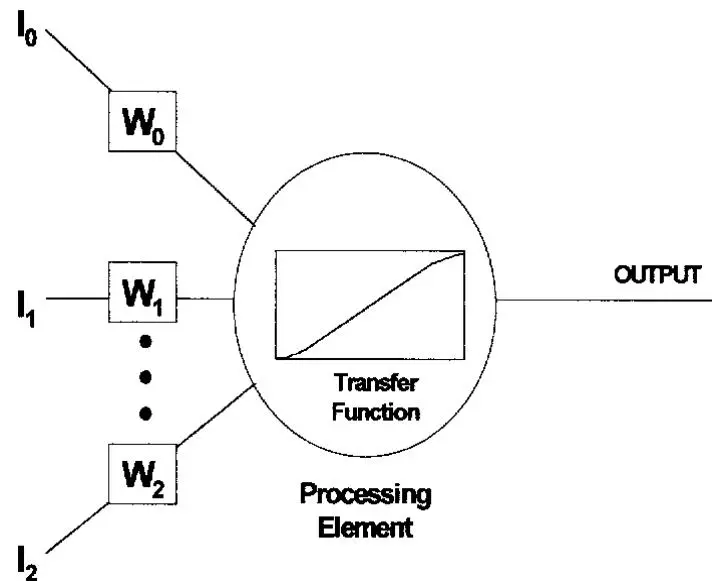
图5-8 隐藏神经元的例子。神经网络由称为"神经元"的单独互联处理元素组成。
在大多数神经网络应用中，变换涉及输入数据的代数或统计操作。在金融预测应用中，交易员用来解释市场行为的各种常用技术指标可以用作变换。预处理后的输入可能包括开盘价、最高价、最低价、收盘价、成交量和持仓量原始数据的差值、比率和移动平均值。输入层中的每个神经元代表一个预处理后的输入。

可以探索各种变换和归一化方法，因为某些方法比其他方法更适合特定应用。一旦选择了网络架构并且输入被选择和预处理，就必须选择数据事实。

**事实选择**
事实（Fact）由一行相关数字表示，其中前i个数字对应于i个网络输入，最后j个数字对应于j个网络输出。一组相关的事实被称为一个"事实集"（Fact Set）。如果两个事实具有完全相同的输入和输出值，则应仅将其中一个事实包含在事实集中。一旦定义了事实集，在大多数金融应用中，事实集应被分离为互斥的训练和测试子集。

反向传播网络在两种模式下运行：一种是学习模式，网络使用训练集中的事实通过权重更改来修改其内部表示。另一种是回溯模式，网络处理来自测试集的输入并利用其先前学习的表示来生成相关输出。各种训练网络在测试集上的相对性能用于确定哪个网络应被纳入最终应用。

**训练和测试**
一旦选择了事实，它们在训练期间串行呈现给网络。权重允许网络在建模问题时调整其内部表示，通常以小的随机分配权重初始化。如果权重最初设置为相同的值，网络可能永远无法学习，因为误差变化与权重值成比例。对于每次通过训练集，网络计算其生成的输出与输出层中每个输出的期望输出之间的误差度量。然后误差通过网络逐层反向传播，改变神经元之间的连接权重，以最小化与每个输出相关的总误差。

每次权重改变时，网络都在代表总体误差空间的多维表面上迈进一步。在训练过程中，网络沿着表面行进，试图找到最低点或最小误差。权重变化与称为"学习率"（Learning Rate）的训练参数成比例。训练过程中可以调整的其他训练参数包括温度、增益和噪声。

由于有各种训练参数、预处理方法和架构配置可以探索，需要一种将测试与训练集成的自动化训练和测试流程。遗传算法（Genetic Algorithms）和模拟退火（Simulated Annealing）等工具可用于加速搜索这些参数空间。遗传算法对于许多参数优化任务非常有效。模拟退火通过包含影响学习率的可变温度项来自动化训练过程中的学习率调整。当温度高时，学习速度快。当温度下降时，学习减慢，网络趋于稳定在某个解决方案上。

**过训练**
过训练（Overtraining），类似于基于规则的交易系统的曲线拟合，是开发神经网络时必须避免的主要陷阱之一。当网络记忆训练集特有的细微差别和特性时，就会发生过训练，从而降低其泛化到新数据的能力。当发生过训练时，网络在训练集上表现良好，但在样本外测试集以及后来的实际交易中表现不佳。为避免过训练，网络训练应定期在预定间隔处暂停，然后在测试集上运行回溯模式，根据预定的误差标准评估网络性能。然后训练从暂停点恢复。这个自动化过程迭代进行，直到测试集上的性能开始下降，表明网络已经开始过训练。所有满足误差标准的临时结果都会被进一步评估。

**误差统计**
另一个重要的网络设计决策涉及使用哪些误差统计进行训练和测试。一个度量可能是实际计算的统计数据（如移动平均值）与网络输出之间的差异。这个差异将对测试集中的每个事实进行计算、求和，然后除以测试集中的事实数量。这是一种称为"平均误差"（Average Error）的标准误差度量。各种误差度量包括平均绝对误差、平方和误差和均方根（RMS）误差。选定神经网络模型后，需要定期重新训练。应持续研究以修改输入、输出、架构以及测试和训练流程的整体实施，以提高网络性能和预测准确性。

除非你拥有相当的交易经验、编程和数学专业知识，以及投入任务的时间，否则你不能期望设计一个有效的神经网络金融预测应用。成功开发神经网络应用是"艺术"和"科学"的结合。即使对于一群集体工作的专家来说，这项工作也可能极其耗时和劳动密集。

我凭经验说话。1991年，我公司的研发部门预测技术集团（Predictive Technologies Group）在自1980年代中期开始实验跨市场分析之后，推出了VantagePoint跨市场分析软件。VantagePoint将神经网络应用于跨市场分析，以预测各种金融期货市场的市场趋势、移动平均值和次日价格。目前有21个定制设计的VantagePoint程序用于货币、利率市场、股票指数和能源综合体，使交易员能够从跨市场分析中受益，而无需重新发明轮子或成为火箭科学家。

## 实际应用

虽然被交易员广泛用于识别趋势，但由于其数学构造，简单移动平均值被认为是一种滞后指标（Lagging Indicator）。这一限制几十年来给技术分析师带来了巨大的挑战。致力于减少滞后的持续研究导致了对这个相对简单但有效的技术指标的持续修改。[这些在[第8章](ch08.md)中有详细讨论。]
**移动平均值入门**
移动平均值平滑价格波动以展示潜在的方向性趋势。在典型的移动平均值系统中，开发了一个交叉振荡器（Crossover Oscillator），涉及两个移动平均值或一个价格和一个移动平均值。当一个指标穿过另一个指标上方或下方时，确定入场和出场点。例如，交易员可能依靠Donchian的5日对20日移动平均值方法来确定入场和出场点。

然而，移动平均值在转折点反应缓慢。传统的移动平均值系统通常在市场方向已经改变后才进出交易——通常延迟几天——这会回吐利润并将盈利交易变成亏损交易。此外，交叉系统在盘整或非趋势市场中往往产生错误信号，导致在移动平均值相互交叉时交替触发买卖信号时的来回打脸。

通过系统测试，可以优化移动平均值的大小，以针对每个市场的价格行为进行调整，并找到将捕捉该市场中的"转折"并帮助减少滞后的最佳交叉点。此外，其他平滑方法可以与移动平均值结合使用，以进一步减少滞后，从而产生对市场突变更具响应性的交易策略。这包括在移动平均值周围使用价格过滤器或灵敏度带，以及添加第三个移动平均值，这些都是ProfitTaker原始系统架构的一部分。其他广泛使用的方法包括布林带（Bollinger Bands）和流行的4-9-15日移动平均值组合。

**预测移动平均值**
在迄今为止开发的所有简单移动平均值方法的变体中，位移移动平均值（Displaced Moving Average）可能最接近理想状态，因为它试图将它们转换为"前瞻性"技术指标。然而，即使是位移移动平均值也有一个明显的弱点：简单地假设未来时间的移动平均值将与今天计算的值相同。基本上，这只是对未来某个时间段移动平均值的原始预测，其中该值被假定与今天计算的移动平均值相同——在现实世界的交易条件下这是一个高度不现实的假设。为什么不将这个概念更进一步，实际上预测移动平均值呢？这样做，保留了它们的平滑好处，同时彻底消除了它们的滞后。

**整合跨市场**
此外，通过将跨市场输入纳入神经网络设计，移动平均值预测不限于单市场输入。以VantagePoint T债券程序为例，移动平均值预测的输入考虑了过去10年实际T债券合约在最活跃交易期间的开盘价、最高价、最低价、收盘价、持仓量，以及九个被确定对国债有显著影响的相关市场（T债券现货、纽约轻质原油、CRB指数、德国马克、美元指数、欧洲美元、COMEX黄金、日元和标普500指数）。

由于正确识别趋势方向对成功交易至关重要，趋势预测（Trend Forecasting），与趋势跟踪（Trend Following）相比，为交易员提供了一种识别趋势及其方向变化的有前景的新方法，而且是在变化发生时而非事后。将神经网络与跨市场分析相结合，VantagePoint通过预测未来最多4天的移动平均值来预测趋势。为此，VantagePoint由五个独立的神经网络组成，每个网络负责预测一个特定的输出变量。一个神经网络预测明天的最高价，第二个预测明天的最低价，第三个预测一个"神经指数"（Neural Index），指示市场何时即将形成顶部或底部。第四个网络预测收盘价的5日移动平均值在2天后的值，而第五个网络预测收盘价的10日移动平均值在4天后的值。

虽然移动平均值预测用于确定趋势方向，但预测的最高价和最低价用于设置入场和出场点以及止损。这个预测的高低范围类似于传统单市场技术分析中的支撑和阻力线，不同之处在于VantagePoint的预测每日范围基于神经网络的模式识别能力以及10个相关市场的跨市场分析。

头寸交易员利用预测的最高价和最低价来帮助设置入场点，然后在后续几天使用预测的高低范围来收紧止损。例如，如果你做多国债且市场预计明天继续上涨，你可能会为明天设置一个追踪止损，比明天预测的最低价低几个刻度，这将作为支撑位。这将降低因市场日内波动而被过早止损出局的可能性，同时在市场突然下跌且预测的最低价被突破时保护利润。

预测次日的最高价和最低价对于确定日内交易的入场和出场点也很有用。如果预测指标表明明天将是上涨日，日内交易员可以等待市场向预测的最低价方向交易，然后在预测的最低价上方几个刻度建立多头头寸，在预测的最高价下方附近当日平仓。相反，在预期下跌的日子，在预测的最高价下方几个刻度建立空头头寸，并在预测的最低价上方几个刻度退出头寸。这可能每天进行多次。


编辑评论：显然，你可以用神经网络做很多事情。Mendelsohn完全正确地说，你必须彻底理解你正在做什么——无论是关于神经网络还是金融建模。当你阅读并彻底理解后续章节时，你可能会意识到神经网络有巨大的未开发应用领域——如出场和头寸规模管理。


## 宇宙中存在秩序

宇宙中存在秩序的观念极其流行。人们想了解市场是如何运作的，因此能够找到某种潜在结构对他们最有吸引力。他们当然相信，一旦你知道了潜在结构，你就能预测市场运动。在许多情况下，这样的理论甚至更加精确，因为它们试图预测市场转折点。这自然吸引了大多数人想要正确并控制市场的心理偏差。因此，他们想要捕捉市场转折点。此外，这是一个极具市场性的想法，可以向公众推销。有许多不同类型的涉及市场秩序的理论，包括甘特理论（Gann）、艾略特波浪理论（Elliott Wave）、占星术理论等。

我选择自己撰写本章的这一部分，因为(1)一个在某种市场秩序理论上是专家的人不一定在另一种理论上也是专家，以及(2)专家们似乎更关心证明（或反驳）他们的理论，而不是这个概念是否可以交易的问题。由于我相信几乎任何概念都是可交易的，我认为用一般性术语讨论这些概念然后指出如何交易它们会更容易。

基本上，有三种类型的概念假设市场中存在某种秩序。所有这些概念的功能都是预测市场中的转折点。在讨论它们时，我做了一些严重的过度简化，所以请各位概念描述中的专家包涵。

## 人类行为有周期

第一个概念说市场是人类行为的函数，人类的动机可以用某种结构来表征。这种类型最著名的结构是艾略特波浪理论（Elliott Wave Theory）。这里假设恐惧和贪婪的冲动遵循一个独特的波浪模式。基本上，市场被认为由五个上升波浪（Up Waves）和三个修正波浪（Corrective Waves）组成。例如，市场的主要上涨将由五个上升波浪（第2和第4波浪朝相反方向）组成，随后是三个下降波浪（中间波浪朝相反方向）。每个波浪都有独特的特征，其中五个主要波浪中的第三个是最可交易的。然而，该理论变得更加复杂，因为波浪中有波浪。换句话说，有不同规模的艾略特波浪。例如，主要运动的第一个波浪将由另一组完整的五个波浪和三个修正波浪组成。事实上，Elliott确定了九个类别的波浪规模，从大超级循环到亚微波浪。

某些规则帮助艾略特波浪理论家做出市场决策。规则也有变体，波浪可能被拉伸或压缩，并且存在一些模式变体。这些规则和变体的性质超出了本讨论的范围，但这些规则确实允许你得出可交易的市场转折点。换句话说，为市场"赋予"秩序的任务就是确定哪个波浪序列对任何给定的转折点负责。

## 物理系统以可预测的模式影响人类行为

市场秩序的第二个概念基于宇宙中物理系统的各个方面。研究物理系统的逻辑基于以下假设：(1) 市场运动基于人类的行为；(2) 人类受到各种物理系统及其释放的能量的身体和情感影响；因此，(3) 如果这些物理能量有模式，那么它们应该对市场有强烈的可预测影响，这似乎是合乎逻辑的。

例如，科学家已经证明太阳黑子有规律的周期。太阳黑子实际上是太阳电磁能量的释放，可能对地球产生深远的影响。

大量的太阳黑子活动将导致大量带电粒子被困在地球的磁层中。这似乎保护地球免受太阳的一些有害影响。此外，如果这个理论是正确的，正如人们可能预期的那样，太阳黑子活动最强烈的时期似乎与文明的高点相关。我们目前正处于其中之一！相比之下，太阳黑子活动的低潮期似乎与可以称为文明衰退的时期相关。显然，如果这种理论是有效的，并且太阳黑子活动是可预测的，那么人们可以预期太阳黑子活动会对市场上发生的事情产生强烈影响。

有许多尝试根据主要物理系统（如太阳活动）来关联和预测市场。很容易收集足够多的最佳案例来向他人——或自己——证明这些理论是正确的。我已经看到它发生了数百次，因为存在一种简单的知觉偏差，仅从几个精心挑选的例子就能让人确信某些关系。然而，理论和现实之间有很大的差距。

John Nelson——一位无线电传播专家——能够以88%的准确率预测6小时的无线电传播质量间隔。他是通过使用行星排列来做到这一点的。一些市场研究人员取了1940年到1964年最严重风暴的日期，并对从风暴开始前10天到后10天的道琼斯工业平均指数（DJIA）的百分比变化进行了统计。他们发现DJIA在风暴前2天到风暴后3天显示出统计上显著的下降。在新月或满月期间，这种效应甚至被放大了。然而，在这段时间的大部分时间里，股市处于熊市，已经有向下的偏向。

1989年3月5日，一次持续137分钟的大规模X射线耀斑在太阳表面爆发。它使监测设备的传感器超载；在其发生的区域，可以清楚地看到一群太阳黑子。3月8日，太阳质子流开始，大量这些离子开始在太阳风的作用下流向地球，持续到3月13日。设德兰群岛的地球磁场监测器记录到磁力变化高达每小时8度（正常偏差仅为0.2度）。电力线、电话线和有线网络出现了巨大的浪涌。无线电和卫星通信受到严重影响。加拿大的变压器过载，超过一百万人突然断电。然而，这次特定的耀斑在太阳活动方面绝不是壮观事件。

1989年3月5日至13日之间的太阳耀斑，就太阳的能力而言是小的，但它是本世纪记录到的最大的——比Nelson报告的任何风暴都要大。所以问题显然是，它对市场有什么影响？据我所知，答案是它根本没有影响。

然而，尽管有一些相反的证据，让我们假设这些物理实体的活动确实有某种节律，并且它确实对市场有轻微的影响。也许，例如，它将"正确"预测市场变化的几率从48%提高到52%。这大约与拉斯维加斯二十一点牌桌算牌者获得的赔率相同，而赌场会踢出算牌者。因此，物理系统对市场秩序的解释也是可以交易的。

## 宇宙中存在神秘的数学秩序

第三种与市场秩序相关的概念通过数学来寻找答案。它断言某些"神奇"数字以及数字之间的关系影响市场。例如，据传毕达哥拉斯（Pythagoras）在一所古代"神秘学校"中教导说，宇宙的所有原则都基于数学和几何。此外，某些"神秘"团体和教派似乎延续了这个观念。W. D. Gann的工作，正如目前许多追随者所推广的，基于数学秩序性。

基本上，数学秩序理论基于以下两个假设：(1) 某些数字在预测市场转折点方面比其他数字更重要，以及(2) 这些数字在价格水平和时间（即预期市场变化的时间）方面都很重要。例如，假设你相信45、50、60、66、90、100、120、135、144、618等是神奇数字。你要做的是找到"重要的"顶部或底部，并将这些数字应用于它们——同时查看时间和价格。你可能预期市场有0.50、0.618或0.667的修正。此外，你可能预期你的目标价格在45天或144天或某个其他神奇数字时达到。

如果你有足够的神奇数字，你可以在事后计算并验证很多预测。然后你可以将这些预测延伸到未来，其中一些可能实际上会奏效。如果你的武器库中有足够的神奇数字，通常就会发生这种情况。例如，如果你在一个房间里至少有33人，你找到两个相同生日的人的几率相当大。然而，这并不一定意味着共同的日期是一个神奇数字，尽管有些人可能会得出这个结论。

让我们假设这样的数字确实存在。让我们也假设它们不完美，但它们确实将你预测的可靠性提高到了超过随机的程度。例如，有了神奇数字，你可能预测道琼斯工业平均指数应该在7月23日出现重大转折。你估计你预测的可靠性是55%。如果你有这种优势，那么你就有了一件可交易的事件。

## 结论

这三个关于市场秩序的概念有什么共同点？它们都预测转折点。在大多数情况下，转折点倾向于给交易员关于何时进入市场的信息。在某些情况下，它们还给出利润目标和关于何时退出市场的线索。你将在[第8章](ch08.md)中学到，用入场完全随机的交易系统赚钱是可能的。因此，如果任何预测方法给你比随机更好的预测市场的期望，你在交易它时可能会有一些优势。

应该如何交易这样的预测？首先，你可以使用预期的目标日期（无论你愿意给它什么时间方差）作为入场的过滤器。因此，如果你的方法预测市场在7月23日出现转折，可能有1天的方差，那么你应该在7月22日到7月24日之间寻找入场信号。

其次，在你入场之前，你必须让市场告诉你它正在做出这个运动。运动本身应该是你的交易信号。最简单的交易方式是在预期运动的时间窗口内寻找波动率突破信号（Volatility Breakout）。例如，假设过去10天的平均每日价格范围（如平均真实波幅）是4个点。你的信号可能是这个范围的1.5倍，即6个点。因此，你会在昨天收盘价的基础上6个点的运动时入场。然后你会使用适当的止损、出场和头寸规模——来控制交易。这些在后续章节中讨论。

有利可图地交易这些秩序概念的关键与正确交易任何概念的关键相同。首先，你需要好的出场来在你的概念不起作用时保护你的资金，并在它起作用时创造高回报。其次，你需要适当地管理头寸规模以实现你的交易目标。因此，即使这些概念只将你的准确性提高1%，你仍然可以有利可图地交易它们。然而，如果你弱化这些系统的预测部分（从而放弃你对控制和正确的需求），并专注于出场和头寸规模管理，你应该会做得相当好。

## 总结

本章的目的是向你介绍许多不同概念中的一些，你可以根据自己的信念用它们来交易或投资市场。我并不是说这些概念中的任何一个比其他任何概念更有效（或更有价值）。此外，我并没有表达对这些概念中任何一个的个人偏好。我包含本章的要点只是向你展示有多少不同的想法。

- Tom Basso以趋势跟踪开始讨论，他简单地表达了这样的观点：市场偶尔会朝一个方向移动很长时间，即趋势。这些趋势可以被捕捉并形成一种交易类型的基本哲学。基本哲学是找到一个标准来确定市场何时处于趋势中，朝趋势方向进入市场，然后在趋势结束或信号被证明是错误时退出。这是一种容易遵循的技术，如果你理解其背后的概念并始终如一地遵循它，它能赚很多钱。

- Chuck LeBeau讨论了下一个概念，基本面分析。这是对市场中供需的实际分析，许多学者认为这是唯一可以交易的方式。该概念通常确实给你一个价格目标，但你的分析（或某个专家的分析）可能与价格的实际走势无关。

然而，有些人基本面数据交易得相当好，这是你可以考虑的另一个选择。Chuck给出了七条建议，如果你想遵循这个概念。然而，他只讨论了适用于期货市场的基本面分析，而不是适用于股票市场的。那在后面的章节中涵盖。

- 接下来，Jerry Toepke讨论了季节性倾向的概念。季节性分析基于某些产品在一年中的某些时候价格较高而在其他时候价格较低的基本面品质。其结果是一个结合了基本面分析的供需分析和趋势跟踪的时间价值的概念。如果你确保你发现的任何季节性倾向有有效的理由，这是玩市场的另一种方式。

- Kevin Thomas，LIFFE交易所的场内交易员，谈到了价差交易。价差交易的优势在于你交易的是产品之间的关系，而不是产品本身。因此，出现了新的机会，这些机会无法通过其他方式获得。Kevin在他的讨论中给出了一些精彩的价差点子。

- 套利，由Ray Kelly以非常幽默和艺术化的方式呈现，是寻找窗口期非常窄的机会。当窗口打开时，机会就像"免费的钱"。然而，迟早窗口会关闭，然后套利者必须寻找新的机会。Ray给出了许多这样的窗口的例子，并给出了一些关于他在试图抓住这些窗口时受挫的幽默故事。

- 神经网络在某种程度上代表了一种技术，而不是一个概念。计算机可以被训练来做预测，正如专家Louis Mendelsohn向我们展示的那样。如果这种预测然后与一些其他交易技术结合，正如Mendelsohn所建议的，你可能会有一些有趣的交易。然而，在我看来，神经网络的重点必须放在能让人赚钱的领域——如出场和头寸规模管理——而不是激发人们偏差的领域。

- 最后呈现的概念是许多概念的综合——市场中存在秩序。有许多理论声称理解市场中的某种神奇秩序。有三种秩序概念类型：(1) 基于人类情感的波动，(2) 基于影响人类行为的重大物理事件，以及(3) 基于数学秩序。其中许多可能很少或没有有效性，然而所有这些都可以有利可图地交易——就像随机入场可以有利可图地交易一样。在最后的讨论中，你学会了如何利用一个秩序概念（如果其中一个吸引你）并将其转化为你的优势。对于那些觉得必须了解市场如何运作才能投入交易的人来说，这些概念可能非常出色。

## 注释

1. 期望值将在下一章中详细讨论。作为交易员或投资者，你需要理解的最重要的话题之一。

2. CFTC要求商品交易顾问在他们的广告和披露文件中包含一份声明，说明过去的结果不能反映未来的结果。

3. Tom Basso可以通过电子邮件tom@trendstat.com联系。

4. 你可以通过310-791-2182联系Chuck LeBeau。

5. 我不想偏离主题讨论如何做人生决策；那更适合Tharp博士令人愉快的研讨会的主题。关键是你可以在交易中轻松而成功地将基本面和技术面分析结合起来。

6. 参见附录1中的推荐阅读。

7. Moore Research Center, Inc.，可以通过1-800-927-7257联系。

8. 一个旧的相关性，正确率超过80%，说的是如果一支旧AFL球队（丹佛是其中之一）赢得超级碗，那么市场就会下跌。如果一支旧NFL球队获胜，市场就会上涨。显然，一支旧AFL球队赢得了1998年超级碗，你也知道截至1998年5月1日市场上涨了多少。

9. John Murphy,《跨市场技术分析》（Intermarket Technical Analysis）（纽约：Wiley, 1986）。

10. 你可以通过1-909-698-4088或他的网页http://www.traderoasis.com联系Ray Kelly。

11. 参见附录1中的推荐阅读。

12. Mendelsohn先生是Market Technologies Corporation（前身是Mendelsohn Enterprises, Inc.）的总裁和首席执行官，位于佛罗里达州Wesley Chapel。他可以通过电子邮件Predict@ProfitTaker.com或电话800-732-5407联系。

13. 这些信息来自Greg Meadors和Eric Gatey的互联网帖子。最严重风暴的日期是1940年3月23日、1941年8月4日、1941年9月18日、1942年10月2日、1944年2月7日、1945年3月27日、1957年9月23日、1960年4月24日、1960年7月15日、1960年8月30日、1960年11月12日、1961年4月14日和1963年9月22日。参见http://www.mindspring.com/edee/home.htm。

14. 我没有包括许多概念，如剥头皮（Scalping）、统计交易（Statistical Trading）、反趋势跟踪（Counter Trend Following）、对冲（Hedging）等，仅仅因为这样做会使本章变得比预期多得多。
