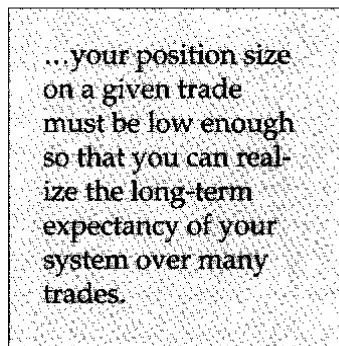
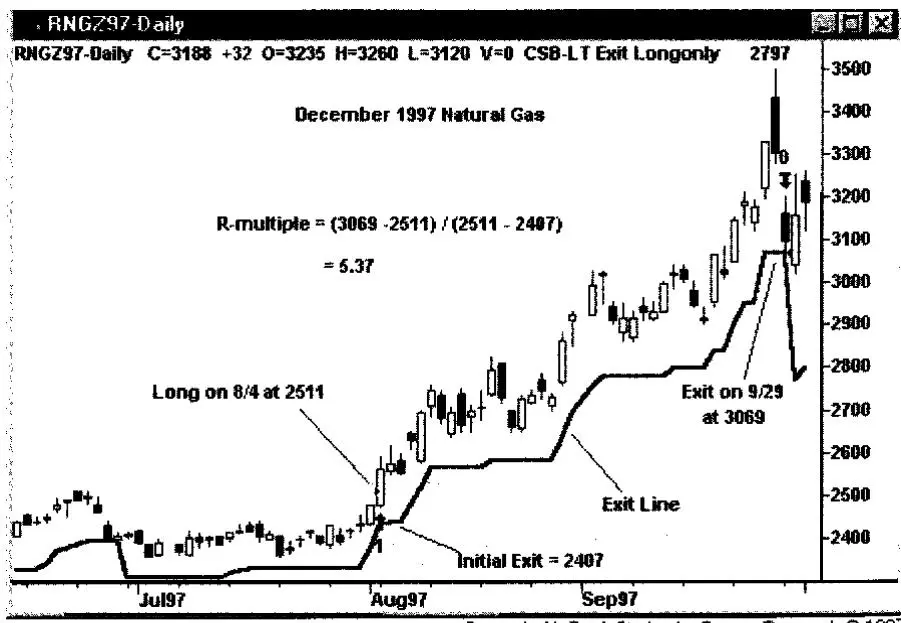
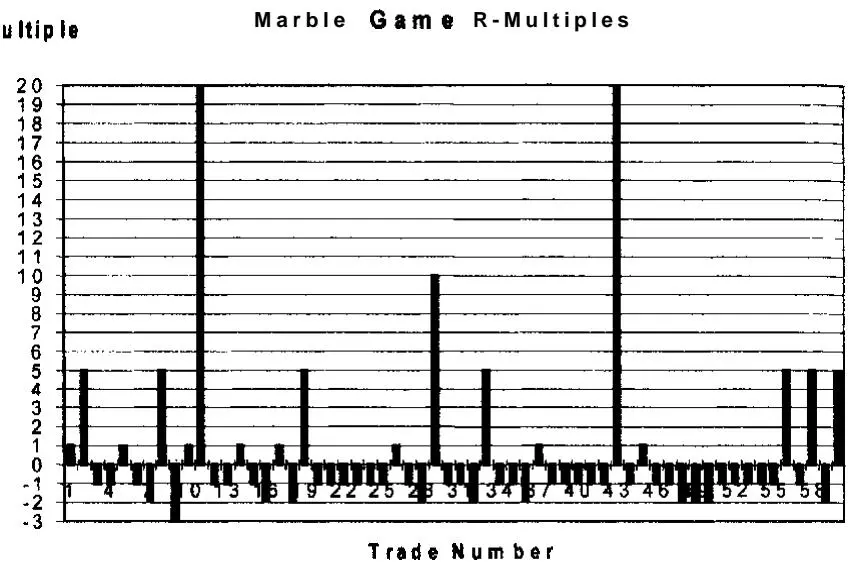
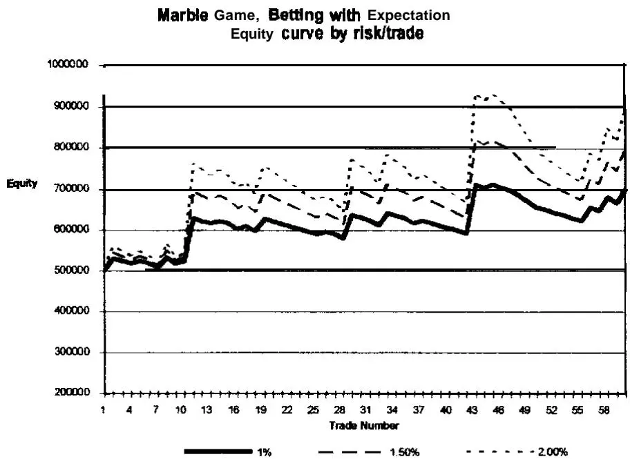
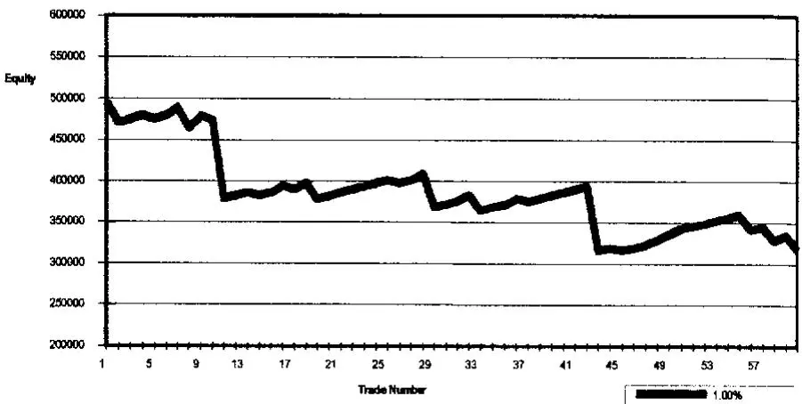

自以为知者，不知。知己不知者，知。

Lao-tzu
当我告诉一位客户我打算在本书中写一章关于期望值（Expectancy）的内容时，他的反应是："哦，不，知道那个是我们的优势之一。"然而，我不认为期望值是商业秘密。事实上，在我看来，一个成功的交易系统必须包含六个关键变量。这些变量中没有一个是大多数人会称之为"商业秘密"的。在我们深入探讨期望值的细节之前，让我们先探索这六个对交易员或投资者的盈亏有重大影响的变量。

## 投资成功的六个关键

本章可能是本书中最难理解的部分。内容很复杂，但如果你想在交易或投资中取得真正的成功，它是至关重要的！为了尽可能简化内容，我选择通过不同的比喻多次重复它。你只需要"理解"一次，就能真正理解这些变量可以为你释放的难以置信的好处。

让我们从以下变量的角度来思考交易或投资：
1. **胜率**（Reliability），或者你赚钱的时间百分比。例如，如果你做了10笔股票交易，其中6笔赚钱，那么你的胜率是60%。它是你盈利交易的数量除以总交易数量。有时，胜率被称为"命中率"（Hit Rate）。基本上，它是你在系统中"正确"的时间百分比。

2. 你的**利润与亏损的相对大小**（Relative Size），在最小可能级别（即一股股票或一份期货合约）交易时。例如，如果你在亏损交易中每股亏损1美元，在盈利交易中每股赚1美元，那么你的利润和亏损的相对大小是一样的。然而，如果你在盈利交易中每股赚10美元，而在亏损交易中只亏1美元，那么相对大小就大不相同了。现在是10比1。

   你可以通过取盈利交易的平均大小并与亏损交易的平均大小进行比较来大致了解利润相对于亏损的大小。这会给你一个相对大小的大致概念。然而，你可能有一笔巨大的利润和许多小亏损，所以这不是一个精确的衡量。

   更精确的衡量是将你的收益视为初始风险（R）的倍数。因此，你的收益可能是一系列R倍数（R-Multiples）。例如，假设你愿意在一笔交易中承担500美元的风险（即如果你亏损500美元就立即退出，这样亏损不会变得更大）。你的基本风险是500美元。因此，1000美元的收益是2倍R倍数，5000美元的收益是10倍R倍数。而如果不幸你有1000美元的亏损，那么你将有2倍R的亏损。你将在本章后面了解更多关于R倍数的内容。

3. 你的**交易成本**（Cost of Trading）。这是由于执行成本和经纪佣金（Brokerage Commissions）对你的账户规模造成的破坏性力量。通常，人们在计算平均收益或平均亏损时简单地包含这些成本。然而，了解这些成本对你来说有多大也是明智的。

4. 你获得交易**机会的频率**（Opportunity）。现在想象前三个变量保持不变。它们的综合效果取决于你交易的频率。假设前三个变量的综合效果是你每风险美元赚20美分。这意味着如果你做100笔交易，每笔风险100美元，你最终会获得2000美元的总利润。然而，现在想象做100笔交易需要一天时间。你每天能赚2000美元。现在将其与一个每年做100笔交易的系统比较——你每年只能赚2000美元。机会因素产生了很大的差异。

5. 你的**交易或投资资金的大小**（Trading Capital）。前四个变量对你账户的影响显著取决于你账户的大小。例如，即使是交易成本也会对1000美元的账户产生显著影响。如果交易成本是100美元，那么你在盈利之前每笔交易就要承受10%的打击。你必须平均每笔交易获得超过10%的利润才能覆盖交易成本。然而，如果你有一百万美元的账户，同样的100美元成本的影响就变得微不足道了。

6. 你的**头寸规模管理模型**（Position Sizing Model），或者你一次交易多少单位（即1股对10000股股票）。显然，你每股赢或输的金额乘以交易的股数。

不同的交易可能有不同的风险水平，或不同的R。因此，一笔1-R的亏损对交易X和交易Y可能不一样。你的反应可能是说："如果R到处变化，R的概念有什么用？"价值来自于头寸规模管理。例如，如果你承担固定百分比的权益风险，比如1%，那么你将使每笔1-R的风险相等。如果你有10万美元，那么你在每个头寸上只会承担1000美元的风险（即1%）。因此，如果一笔交易中1R是1美元，你会购买1000股。如果另一笔交易中1R是10美元，那么你会购买100股。在每种情况下，你的1-R风险将是恒定的，代表你权益的1%。我们将在本书后面更详细地讨论头寸规模管理。

你会想只关注这六个变量中的一个吗？还是你认为所有六个变量都同样重要？当我以这种方式提问时，你可能同意所有六个变量都很重要。

然而，如果你要把所有精力都集中在其中一个变量上，你会选择哪一个？也许你觉得这个问题有点天真，因为它们都很重要。然而，这个问题背后是有原因的，所以请在提供的空间写下你的答案。

## 答案：

我让你关注一个项目的原因是，大多数交易员和投资者在日常活动中通常只关注这六个项目中的一个。他们的关注往往集中在需要正确上。人们沉迷于此，排除了其他一切。然而，如果所有六个组成部分对成功都很重要，你就可以开始理解只关注正确是多么天真。

前四个变量是我称之为期望值的主题的一部分。它们是本章的主要焦点。后两个变量是我称之为资金管理（Money Management）或头寸规模管理（Position Sizing）的一部分。我们将在本章触及头寸规模管理，并在[第12章](ch07.md)详细讨论。

## 雪球大战的比喻

为了说明所有六个变量的重要性，让我引导你通过一个比喻，这可能会给你一个不同于只思考金钱和系统的视角。想象你躲在一面巨大的雪墙后面。有人向你的墙扔雪球，你的目标是让你的墙尽可能大，以获得最大的保护。

因此，这个比喻立即表明墙的大小是一个非常重要的变量。如果墙太小，你就无法避免被击中。但如果墙很大，那么你可能不会被击中。变量6，你的初始权益大小，有点像墙的大小。事实上，你可以把你的启动资金看作是保护你的金钱之墙。你拥有的钱越多，假设其他变量保持不变，你的保护就越多。

现在想象向你扔雪球的人有两种不同的雪球——白色雪球和黑色雪球。白色雪球有点像盈利交易。它们只是粘在雪墙上并增加其大小。现在想象被大量白色雪球击中的影响。它们只会堆积墙壁。它会变得越来越大，你会有更多的保护。

想象黑色雪球会溶解雪并在墙上造成一个与其大小相等的洞。你可能把黑色雪球看作是"反雪"。因此，如果大量黑色雪球被扔到墙上，它很快就会消失或至少有很多洞。黑色雪球很像亏损交易——它们会侵蚀你的安全墙。

变量1，你正确的频率，有点像关注白色雪球的百分比。你自然会希望所有向你墙来的雪球都是白色的，并增加你的墙。你可能很容易看出那些不关注大局的人会把全部注意力放在让尽可能多的雪球变成白色上。

但让我们考虑两种雪球的相对大小。白色和黑色雪球彼此相对有多大？例如，想象白色雪球有高尔夫球那么大，而黑色雪球像6英尺直径的巨石。如果是这样的话，可能只需要一个黑色雪球就能推倒墙壁——即使白色雪球整天都在向墙扔来。另一方面，如果白色雪球有6英尺巨石那么大，那么每天一个雪球就可能足以建立足够的墙壁来保护你免受高尔夫球大小的黑色雪球的持续轰炸。两种雪球的相对大小相当于我们模型中的变量2——利润和亏损的相对大小。我希望通过想象雪球大战的比喻，你能理解变量2的重要性。

变量3，交易成本，有点像假设每个雪球无论黑白都对墙壁有轻微的破坏作用。每个白色雪球对墙壁有轻微的破坏作用，也就是说，希望比它在堆积墙壁方面的作用要小。同样，每个黑色雪球仅凭撞击就会破坏一点墙壁，这只是增加了黑色雪球对墙壁的正常破坏效果。显然，这种一般性破坏力量的大小可能对雪球大战的结果产生整体影响。

假设我们的雪球一次只向墙飞来。在100个雪球击中墙壁后，你的墙壁状况将取决于击中墙壁的白色和黑色雪球的相对数量。在我们的模型中，你可以通过墙壁的状况来衡量雪球大战的有效性。如果墙壁在增长，这意味着击中墙壁的白色雪球总量大于击中墙壁的黑色雪球总量。增长的墙壁就像增长的利润。随着它变大，你会感到更安全。如果墙壁在缩小，那么意味着相对更多的黑色雪球而非白色雪球击中了墙壁。最终，你的墙壁将失去所有保护，你将无法再玩游戏。

击中墙壁的白色与黑色雪球的相对数量本质上是雪球大战中期望值的等价物。如果相对更多的黑色雪球到来，墙壁就会缩小。如果相对更多的白色雪球到来，并且雪球的破坏因素不是太大，墙壁就会增长。白色与黑色雪球的相对数量取决于白色和黑色雪球的百分比以及两种雪球的相对大小。然而，底线是撞击墙壁的白色或黑色雪球的净量。

在投资或交易的真实世界中，期望值告诉你在大量单单位交易中你可以预期的净利润或亏损。如果亏损交易的总金额大于盈利交易的总金额，那么你是一个净亏损者，有负期望值（Negative Expectancy）。如果盈利交易的总金额大于亏损交易的总金额，那么你是一个净赢家，有正期望值（Positive Expectancy）。

注意，在期望值模型中，你可能有99笔亏损交易，每笔亏损1美元。因此，你会亏损99美元。然而，如果你有一笔500美元的盈利交易，那么你将有401美元的净收益（500美元减去99美元）——尽管你只有一笔交易是赢家，99%的交易是输家。我们还说你的交易成本是每笔1美元，即100笔交易100美元。在前面的例子中使用这个成本因素，你将只有301美元的净利润。你开始理解为什么期望值由所有前三个变量组成了吗？正如对墙壁的影响是黑色与白色雪球净量的结果一样，对你权益的影响是净利润减去净亏损的结果。

现在让我们继续我们的雪球大战比喻稍远一点。变量4本质上是扔雪球的频率。假设100个雪球（白色和黑色）的累积效果是给墙壁增加约10立方英寸的雪。显然，如果每分钟扔一个雪球，影响将是每小时扔一个雪球的60倍。因此，扔雪球的速度将对墙壁的状态产生重大影响。

你交易的频率将对你的权益变化率产生类似的影响。如果你在100笔交易后净赚500美元，那么你做这100笔交易所需的时间将决定你账户的增长。如果你花一年做100笔交易，那么你的账户每年只增长500美元。如果你每天做100笔交易，那么你的账户每月将增长10,000美元（假设每月20个交易日），或每年120,000美元。你想用哪种方法交易？一年赚500美元还是一年赚120,000美元的方法？答案是显而易见的，但这些方法可能完全一样（即两者都有相同的期望值）。唯一的区别是交易的频率。

基于我们对雪球大战比喻的讨论，你现在认为六个变量中哪个最重要？为什么？你的结论的依据是什么？我希望你现在能看到变量1到4有多重要。这些是期望值的基础，它们决定了你的交易系统的有效性。

变量5和6——墙壁的大小和头寸规模管理变量——是你整体盈利能力中最重要的因素。你应该已经理解了墙壁的大小（变量5）在玩游戏中的重要性。如果墙壁太小，几个黑色雪球就可能摧毁它。它必须很大才能保护。

让我们看看变量6，即告诉你"多少"的变量。到目前为止，我们只是假设我们的雪球一次一个地到达墙壁。但想象一下大量雪球同时到达的影响。首先，想象一个高尔夫球大小的黑色雪球击中墙壁的影响。它会在墙上造成一个高尔夫球大小的凹痕。现在，想象一万个这样的雪球同时击中墙壁。这完全改变了你思考的影响，不是吗？

一万个雪球的比喻只是说明了头寸规模管理的重要性——即系统中告诉你"多少"的部分。到目前为止，我们一直在谈论一个单位的大小——一个雪球或一股股票。但一万个高尔夫球大小的黑色雪球可以完全摧毁你的墙壁，除非墙壁是巨大的。

同样，你可能有一个交易方法，亏损时每股只亏1美元。然而，当你以10,000股为单位购买股票时，你的亏损突然变得巨大。现在是10,000美元！再次注意头寸规模管理的重要性。如果你的权益是一百万美元，那么10,000美元的亏损只是1%。但如果你的权益只有20,000美元，那么10,000美元的亏损就是50%。

既然你已经了解了涉及系统成功（或你的雪球大战）的所有关键变量的视角，我们可以专注于期望值的细节。

## 放大镜下的期望值

期望值，如本书所定义的，告诉你在大量交易中，你平均每风险美元可以预期赚多少。那么，你如何找出一个游戏或系统的期望值？假设你要玩一个抽取弹珠的游戏。你从中抽取弹珠的袋子里有60个蓝色弹珠和40个黑色弹珠。根据游戏规则，当你抽到蓝色弹珠时，你赢得你所风险的金额，当你抽到黑色弹珠时，你输掉你所风险的金额。每次抽取弹珠后，它会被放回袋中。注意，你现在对这个游戏的变量1和变量2都有了定义。这个游戏的期望值是多少？平均每风险美元你能赢多少？

在这种情况下，期望值由公式6-1定义：

$$
\text{公式 6 - 1:   期望值} = (\mathrm{PW} * \mathrm{AW}) \text{减去 (PL   *   AL)}
$$
其中PW是盈利交易的概率，PL是亏损交易的概率。AW指平均收益（盈利），AL指平均亏损。

在该游戏中，$\mathrm{PW} = 0.6$，PL = 0.4。这个游戏的平均赢或输金额是1美元——你正好赢或输你所风险的金额。所以每风险1美元，你要么赢1美元要么输1美元。因此，在我们的游戏中：

$$
\mathrm{期望值} = (0.6 * 1) \mathrm{减去} (0.4 * 1) = 0.6 - 0.4 = 0.2
$$
在这个特定的游戏中，你可以预期平均每风险美元赚20美分。这意味着你会拿回你的1美元，外加平均赚20美分。

这当然不意味着你每次都会赢。事实上，在这个特定的例子中，你只有大约60%的时间会赢。实际上，在1000次试验中，你很容易有10次连续亏损。然而，在同样的1000次试验中，你平均每风险美元赚20美分。因此，如果你每次风险2美元，在1000次试验中你可能会赚400美元。

如果我们的弹珠袋更复杂，像市场中的平均投资系统会怎样？假设你有许多不同的赢和输的可能性。例如，假设你有一个装有100个不同颜色弹珠的袋子。让我们根据表6-1中给出的矩阵为每种颜色赋予不同的回报。

表6-1 弹珠回报矩阵
| 弹珠数量和颜色 | 赢或输 | 回报 |
|---|---|---|
| 50个黑色弹珠 | 输 | 1:1 |
| 10个蓝色弹珠 | 输 | 2:1 |
| 4个红色弹珠 | 输 | 3:1 |
| 20个绿色弹珠 | 赢 | 1:1 |
| 10个白色弹珠 | 赢 | 5:1 |
| 3个黄色弹珠 | 赢 | 10:1 |
| 3个透明弹珠 | 赢 | 20:1 |
同样，我们假设弹珠被取出后会被放回袋中。注意在这个游戏中赢的概率只有36%。你会想玩吗？为什么想或为什么不想？这个游戏的期望值是多少？玩这个游戏你平均每风险美元能赚多少？它比第一个游戏好还是差？

幸运的是，期望值的正常公式是可加的。因此，公式6-1可以转换为公式6-2：

$$
\begin{array}{r l} \text{公式 6 - 2: 期望值} & = \sum_{(i = 1 \text{到} n)} (\mathrm{PW}_i * \mathrm{AW}_i) \\ & \text{减去} \sum_{(i = 1 \text{到} n)} (\mathrm{PL}_i * \mathrm{AL}_i) \end{array}
$$
求和符号表示该公式是可加的。换句话说，你可以将所有正期望值（即盈利弹珠）相加，然后将所有负期望值（即亏损弹珠）相加。然后你可以用总正期望值减去总负期望值来得到游戏的期望值。

让我们一步一步地完成这个过程。首先，让我们看看所有盈利弹珠的(PW*AW)并把它们加起来。

1. 对于绿色，PW = 0.2，AW = 1；因此(PW * AW) = 0.2 * 1 = 0.2。

2. 对于白色，PW = 0.1，AW = 5；因此(PW * AW) = 0.1 * 5 = 0.5。

3. 对于黄色，PW = 0.03，AW = 10；因此(PW * AW) = 0.03 * 10 = 0.3。

4. 对于透明，PW = 0.03，AW = 20；因此(PW * AW) = 0.03 * 20 = 0.6。

现在，让我们把它们加起来：$0.2 + 0.5 + 0.3 + 0.6 = 1.6$。这给出了游戏中的总正期望值。

其次，让我们看看所有亏损弹珠的(PL * AL)——负期望值——并把它们加起来。

1. 对于黑色，PL = 0.5，AL = 1；因此(PL * AL) = 0.5 * 1 = 0.5。

2. 对于蓝色，PL = 0.1，$\mathrm{AL} = 2$；因此(PL * AL) = 0.1 * 2 = 0.2。

3. 对于红色，PL = 0.04，AL = 3；因此(PL * AL) = 0.04 * 3 = 0.12。

再次，让我们把它们加起来：$0.5 + 0.2 + 0.12 = 0.82$。这是游戏的总负期望值。

最后，游戏的总期望值是两个和的差。我们通过从总正期望值(1.6)中减去总负期望值(0.82)来找到差值。结果是0.78。因此，在这个游戏的多次弹珠抽取中，你可以预期平均每风险美元赚78美分。注意这个游戏几乎比第一个游戏盈利四倍。

仅通过这两个例子，你应该学到了一个非常重要的点。大多数人寻找高概率赢的游戏。然而在第一个游戏中，你有60%的赢面机会，但只有20美分的期望值。在第二个游戏中，你只有36%的赢面机会，但你的期望值是78美分。因此，游戏2几乎是游戏1的四倍好——假设机会因素相同。注意你的系统中关键因素不是赢面概率。相反，决定系统价值的关键因素是每风险美元的期望值。

在这里需要提醒一下。变量5和6对你的盈利能力至关重要。只有当你根据你拥有的权益明智地管理头寸规模时，你才能在长期内实现你的期望值。头寸规模管理是系统中告诉你每个头寸风险多少的部分。它是你整体系统的关键部分，我们将在[第12章](ch07.md)详细讨论。

但让我们看一个例子，看看头寸规模管理和期望值是如何配合的。假设你在玩游戏1——60%弹珠游戏。你有100美元开始玩游戏。假设你在第一次抽取时拿全部100美元来冒险。你有40%的亏损概率，你碰巧抽到了黑色弹珠。这可能发生，当它发生时，你会损失全部赌注。换句话说，你的头寸规模（即下注大小）相对于你的权益来说太大了，不安全。你无法再玩了，因为你没有更多的钱。因此，你无法在长期内实现每风险美元20美分的期望值。

让我们看另一个例子。假设你决定每次抽取风险50%的赌注，而不是100%。因此，你以50美元的赌注开始。你抽到黑色弹珠，你输了。现在你的赌注减少到50美元。你的下一次赌注是剩余的50%，即25美元。你又输了。你现在有25美元。你的下一次赌注是12.50美元，你又输了。你现在有12.50美元。在一个只赢60%的系统中，连续三次亏损是完全可能的（即大约五分之一的概率）。你现在必须赚87.50美元才能打平——这是700%的增长。你不太可能赚到那么多。因此，由于不适当的头寸规模管理，你再次未能在长期内获得期望值。

记住，你在给定交易中的头寸规模必须足够低，以便你能在多次交易中实现系统的长期期望值。

在这一点上，你可能会说你通过出场来控制风险，而不是通过头寸规模。然而，记住雪球大战的比喻。风险本质上是变量2，即盈利大小与亏损大小的比较。

这是你通过出场来控制的。头寸规模本质上是盈利和亏损相对大小之上的另一个变量（变量6）。它告诉你相对于你的权益的头寸规模。

## 机会因素与期望值

评估你的系统还有另一个变量，与其期望值同样重要。那个因素就是机会（Opportunity），我们的第四个变量。你多久能玩一次游戏？例如，假设你可以玩游戏1或游戏2。

然而，在玩游戏2时，你只能每5分钟抽取一个弹珠，而在玩游戏1时，你可以每分钟抽取一个弹珠。在这些条件下，你更愿意玩哪个游戏？

让我们看看机会因素如何改变游戏的价值。假设你可以玩一个小时。由于在游戏1中你可以每分钟抽取一个弹珠，你的机会因素是60，即60次玩游戏的机会。由于在游戏2中你可以每5分钟抽取一个弹珠，你的机会因素是12——即12次玩游戏的机会。

记住，你的期望值是你在大量机会中平均每风险美元能赢的金额。因此，你玩一个游戏的次数越多，你就越有可能实现该游戏的期望值。

为了评估每个游戏的相对优势，你必须将玩游戏的次数乘以期望值。在比较两个游戏在一个小时内的情况时，假设你每次只风险1美元，你会得到以下结果：
游戏1：期望值20美分乘以60次机会 = 12.00美元
游戏2：期望值78美分乘以12次机会 = 9.36美元
因此，鉴于我们任意施加的机会限制，游戏1实际上比游戏2好，假设你每次只风险1美元。当你在市场中评估期望值时，你必须同样考虑你的系统给你带来的机会量。例如，一个期望值50美分（交易成本后）且每周给你三笔交易的系统，比一个期望值50美分（同样交易成本后）且每月只给你一笔交易的系统要好得多。

## 预测

让我们暂停一下，讨论大多数交易员和投资者的一个常见陷阱——预测陷阱（Prediction Trap）。思考期望的概念一会儿，可以让人更清楚地看到为什么多年来这么多人在预测市场或股票未来走势时栽了跟头。他们都基于历史来建立预测算法——有时甚至假设它会完全重复。然而，一次极其成功的预测甚至可能导致你损失所有资本。怎么会？你可以有一个准确率90%的方法，在交易时仍然亏光所有的钱。

考虑以下"系统"，它有90%的盈利交易，平均盈利交易275美元，和10%的亏损交易，平均亏损交易2700美元：

$$
\text{期望值} = (0.9 * 275) - (0.1 * 2700) = -22.5
$$
期望值是负的。这是一个你90%的时间都正确但最终亏光所有钱的系统。人们有一种强烈的心理偏差，想要在我们的投资上正确。在大多数人身上，这种偏差大大超过了整体方法中获利的欲望，或者它抑制了我们达到真正的利润潜力。大多数人有强烈的控制市场的欲望。结果，他们最终被市场控制了。

现在你应该清楚，是回报和概率的结合让你能够判断一个方法是否可行。你还需要考虑变量4（你多久能玩一次游戏）来确定系统或方法的相对价值。

## 期望值与R倍数

到目前为止，我们一直在处理弹珠袋。在每个弹珠袋中，我们知道弹珠的总体是什么，每个弹珠被抽到的概率是多少，以及它的回报是多少。当我们处理系统在市场上产生的交易时，这些都不成立。

当你在市场上交易时，你不知道赢或输的确切概率。此外，你不知道你确切会赢或输多少。然而，你可以进行历史测试并对预期有所了解。你也可以从实时交易或投资中获得大量样本数据。你可以使用这些样本来大致了解系统的期望值。这项工作需要调查单笔交易，试图理解每笔交易的风险回报比及其出现频率。彻底完成这项练习后，你将对方法论的真正本质有更深入的了解。

如果你纯粹是一个自由裁量的、非系统化的交易员，你可以回顾你过去的交易结果来了解你是如何赚钱或亏钱的。遵循与我们将在此处介绍的类似程序，你应该从单笔或单股的角度查看每笔交易。知道你进入交易时的风险（你的初始出场点）和已实现的盈亏，你就可以计算每笔交易的风险回报比。

## R倍数

我将一笔交易的风险回报比称为"R倍数"（R Multiple）——R只是初始风险的符号。要计算一笔交易的R倍数，只需取在头寸出场时捕获的点数除以初始风险。你同样可以使用每合约或每100股的美元价值。例如，如果你风险500美元并赚了1500美元，你的R倍数就是3。一个例子如图6-1所示。入场是在1997年8月4日的2511点。该系统使用3倍平均真实波幅（ATR）的止损，即104点。因此，初始出场点是

图6-1 交易中的R倍数。由Omega Research © 1997的TradeStation创建
2511减去104，即2407。系统最终在1997年9月29日以3069出场，获利558点。由于初始风险（1R）是104点，最终利润是558点，利润是5.37倍R倍数。对所有交易都这样做，包括盈利和亏损的。亏损交易将只是负R倍数。

组成历史模拟或先前交易结果的众多单个R倍数是你期望值的组成部分。这些R倍数的本质将完全决定你方法的整体期望值。它将帮助你定义适用于交易方法的资金管理算法，以实现你的总体目标。R倍数的本质我指的是单个R倍数的大小、频率和顺序。

暂时，把你的系统交易纯粹看作R倍数。然后假装每笔交易只是从袋中抽取一个弹珠，就像我们之前的例子一样。一旦你抽到弹珠，你就确定它的R倍数，然后将其放回袋中。

在玩这个游戏时，你想开发一个支持利用期望值的头寸规模管理算法。此外，你希望它与每笔交易的初始风险和持续的账户权益挂钩。首先，考虑一个风险百分比算法，你决定持续承担当前账户权益的固定百分比风险。这种头寸规模管理算法基本上意味着1-R的风险无论何时承担或在什么股票或市场上承担都是相同的。这是因为你的头寸规模始终是权益的恒定百分比（即1%），无论初始风险（R）有多大。参见[第12章](ch07.md)。

此外，你需要考虑弹珠被抽取的潜在分布（顺序）。系统的胜率与亏损交易连续串的长度成反比。因此，你需要一个头寸规模管理算法，使你能够承受潜在的大量连续亏损交易，同时能够利用大的盈利交易。

许多交易员未能交易一个健全的系统，因为(1)他们没有为市场通过其方法呈现给他们的交易分布做好准备，和/或(2)他们过度杠杆化或资本不足。你可以估计给定系统胜率的1000次试验中最大连续亏损交易数，但你永远不知道"真实"值。即使抛一枚公平的硬币也可能产生一些较长的连续正面。

图6-2 弹珠游戏中的R倍数
图6-2显示了一个类似于表6-1中描述的弹珠游戏的60笔交易样本的交易分布。注意第46到55笔交易之间的较长连续亏损。大约在这个时候，玩游戏的人会产生两种观点之一：(1)他们认为现在该抽到一个赢的弹珠了，或(2)他们决定在游戏的某个未来时间点反对期望值下注，以便从这些连续串中获利。如果连续亏损发生在游戏早期，观点2很常见。如果连续亏损发生在游戏后期，那么观点1很常见。一些参与者的心理迫使他们在连续亏损越深时下注越大，因为他们"知道"赢家就在拐角处。我确信你能猜到这种游戏的典型结果。

图6-3显示了上述游戏在每笔交易中下注当前权益的1.0%、1.5%和2.0%（并且在整个过程中保持完全冷静和超然）的权益曲线。在60次试验中，1.0%的回报率为40.1%，峰谷回撤为12.3%。有三次显著的连续亏损，分别为5、6和10笔交易。

图6-3 根据下注大小的弹珠游戏权益曲线
图6-4显示了在当前权益的1.0%下反对期望值下注的权益曲线。在这里，你64%的时间是"正确的"，甚至享受了10笔交易的连续盈利，同时你损失了37%的初始权益。

弹珠游戏，反对期望值下注。每笔交易1.0%风险

图6-4 顺着概率但反对期望值下注的权益曲线
如果我们试图更好地理解这个系统是如何工作的，我们可能至少评估10倍的交易量。到那时，我们可以更好地决定使用什么头寸规模管理（在这种情况下是下注规模）算法和杠杆水平。此外，我们能够训练自己对未来交易中这个系统的预期。

我们可以为许多我们能想到的可能在未来发生的场景进行心理排练——排练在每种结果下我们将如何应对。记住，即使那时你也不确定弹珠袋（或市场）将来会揭示什么。这就是为什么你的心理排练应该包括排练你将如何应对你没有准备好的事件。

## 期望值应用于市场

在最近的一次研讨会上，一位与会者问我，既然他可以只看总利润，为什么还要费心计算期望值。原因很简单。期望值是一种比较交易系统的方法，同时排除时间、头寸规模管理的影响，以及交易不同价格的各种工具的事实。

让我们看一个直接适用于市场投资的期望值样本问题。假设你有一个已经交易了2年的交易系统。它产生了103笔交易，60笔盈利（58.3%），43笔亏损（41.7%）。你的交易分布如表6-2所示，仅使用每笔交易交易一个单位（即最小头寸规模管理）的影响。

总利润 = 54,147美元；总亏损 = 43,304美元；净利润 = 10,843美元
从表中我们可以计算出期望值 = (0.417 * 1,353.68美元) 减去 (0.583 * 721.73美元) = (564.48美元) 减去 (420.77美元) = 143.71美元。显然，当你有样本数据时，你也可以取净利润除以交易数量得到期望值。

表6-2 一个样本系统在2年内产生的交易
**盈利交易**

| 金额 | 金额 | 金额 | 金额 | 金额 |
|---|---|---|---|---|
| $23 | $17 | $32 | $5 | $8 |
| $532 | $517 | $427 | $491 | $532 |
| $611 | $431 | $563 | $488 | $612 |
| $459 | $531 | $476 | $511 | $463 |
| $561 | $499 | $521 | $456 | $532 |
| $456 | $479 | $532 | $460 | $530 |
| $618 | $1,141 | $995 | $607 | $478 |
| $1,217 | $1,014 | $632 | $429 | $469 |
| $964 | $956 | $1,131 | $521 | $499 |
| $1,217 | $897 | $1,517 | $501 | $506 |
| $1,684 | $1,501 | $1,654 | | |
| $1,464 | $1,701 | $2,551 | | |
| $2,545 | $2,366 | $4,652 | | |
| $14,256 | | | | |

平均收益 = $1,353.68

**亏损交易**

| 金额 | 金额 | 金额 |
|---|---|---|
| ($31) | ($18) | ($16) |
| ($6) | ($23) | ($15) |
| ($488) | ($612) | ($556) |
| ($511) | ($463) | ($477) |
| ($456) | ($532) | ($521) |
| ($460) | ($530) | ($477) |
| ($607) | ($478) | ($517) |
| ($429) | ($469) | ($512) |
| ($521) | ($499) | ($527) |
| ($501) | ($506) | ($665) |
| ($612) | ($432) | ($564) |
| ($479) | ($519) | ($671) |
| ($1,218) | ($671) | ($1,132) |
| ($988) | ($1,015) | ($976) |
| ($1,123) | ($1,311) | ($976) |
| ($1,213) | ($1,011) | ($993) |
| ($676) | ($1,245) | ($1,043) |
| ($1,412) | ($1,611) | ($3,221) |
| ($1,211) | ($945) | ($1,721) |

平均亏损 = ($721.73)
注意这个数字与我们从弹珠袋中得到的期望值有很大不同。原因是它没有被表述为"每风险美元的期望值"。因此，将你的期望值简化为每风险美元的期望值很重要。此外，确定什么样的"弹珠"组成了你的期望值也很重要。表6-3显示了来自这组交易的收益和亏损的这种分布。交易被分成500美元的区间，仅仅因为这样做方便，而且500美元似乎最能描述最小亏损。

表6-3 收益和亏损的分组
**收益和亏损的分组**

| 区间 | 数量 | 总收益 | 区间 | 数量 | 总亏损 |
|---|---|---|---|---|---|
| 持平 | 7 | $112 | 持平 | 6 | ($109) |
| $500 | 15 | $7,760 | $500 | 33 | ($17,081) |
| $1,000 | 10 | $10,364 | $1,000 | 17 | ($18,149) |
| $1,500 | 6 | $9,521 | $1,500 | 3 | ($4,744) |
| $2,500 | 3 | $7,462 | $3,000 | 1 | ($3,221) |
| $4,500 | 1 | $4,652 | | | |
| $14,000 | 1 | $14,256 | | | |
| 合计 | | $54,147 | | | ($43,304) |
当你查看盈亏分组的分布时，你可能会注意到最小亏损有一个特定的值。在这个特定的分布中，最小亏损大约是500美元。我们现在可以将该表视为一个弹珠袋，并注意预期是什么。在这里，我们通过将大致收益或亏损除以大致最小亏损500美元来计算回报。表6-4是执行此操作的结果。

这个系统本质上在40%的交易中赚钱（即36/90）——不包括持平交易。由于系统的总盈利能力约为10,000美元，你还会注意到整个利润来自于一笔交易——那笔给你14,256美元利润的交易。还要注意，仅仅消除一笔亏损——3,221美元的亏损——你的利润就会增加40%。

你需要详细查看这些交易。是什么产生了大收益？你能预期未来会有更多这样的收益吗？这种收益的真实概率是0.011%，还是你能想出办法产生更多这样的收益？

表6-4 基于最小风险金额（假设为500美元）的收益和亏损分组
| | 回报 | 概率 | 正期望值 | 回报 | 数量 | 负期望值 |
|---|---|---|---|---|---|---|
| 收益 | 1比1 | 15/90=0.1667 | $7,760 | 1比1 | 33/90=0.367 | ($17,091) |
| | 2比1 | 10/90=0.1111 | $10,384 | 2比1 | 17/90=0.189 | ($18,149) |
| | 3比1 | 6/90=0.0667 | $9,521 | 3比1 | 3/90=0.033 | ($4,744) |
| | 5比1 | 3/90=0.033 | $7,462 | 6比1 | 1/90=0.011 | ($3,221) |
| | 9比1 | 1/900=0.0111 | $4,652 | | | |
| | 28比1 | 1/900=0.0111 | $14,256 | | | |
亏损方面呢？是什么导致了3,221美元的亏损？那个亏损的真实期望值是大约1.1%，还是你能预期会有更多（或更少）这样的亏损？亏损是由于心理错误造成的吗？如果是这样，你将来如何避免它？

当你从表6-4中的回报矩阵角度来看你的系统时，你可以开始回答很多问题。我们可以应用期望值公式6-2来确定每风险美元的期望值。在这里，我们通过将盈利交易组的正期望值相加得到以下正期望值：
期望值方程的正侧 = (0.167 * 1) + (0.111 * 2) + (0.067 * 3) + (0.033 * 5) + (0.011 * 9) + (0.011 * 25)
当我们完成乘法运算时，我们得到以下结果：0.167 + 0.222 + 0.199 + 0.165 + 0.099 + 0.275 = 1.127。因此，我们从盈利交易中得到的总正期望值是1.127美元。

现在我们需要通过确定每组亏损交易的贡献来找到亏损交易的负期望值：
期望值方程的负侧 = (0.367 * 1) + (0.189 * 2) + (0.033 * 3) + (0.011 * 6) = 0.367 + 0.378 + 0.099 + 0.066 = 0.91
因此，我们从亏损交易中得到的总负期望值是91美分。

再次，要得到每风险美元的总期望值，我们只需用总正期望值减去总负期望值——1.127美元减去0.91美元 = 0.217美元。因此，这个系统的期望值是每风险美元21.7美分。这给了我们一个更好的基础来将这个系统与另一个系统进行比较。10,000美元的利润可能让一个系统看起来很好，但知道该系统每风险美元产生21.7美分的回报，就将其置于不同的视角中。

## 使用期望值评估不同的系统

让我们看看两个不同的交易系统，以确定如何使用期望值。

### Fred的系统

第一个系统来自一个名叫Fred的期权交易员。从5月1日到8月31日，他完成了21笔交易，如表6-5所示。

该系统在4个月期间的21笔交易中赚了1,890.43美元。这相当于平均每笔交易收益90.02美元。但该系统每风险美元的期望值是多少？我们可以将表格分解为任意的美元分组，如表6-6所示。

表6-5 Fred的交易总结
| | 收益 | 亏损 |
|---|---|---|
| | $2,206.86 | ($143.14) |
| | $1,881.86 | ($66.14) |
| | $3,863.72 | ($543.14) |
| | $161.66 | ($1,218.14) |
| | $1,119.36 | ($143.14) |
| | $477.79 | ($3,866.57) |
| | $48.43 | ($340.64) |
| | $327.36 | ($366.14) |
| | $21.80 | ($366.14) |
| | | ($356.14) |
| | | ($493.14) |
| | | ($328.14) |
| 合计 | $10,129.04 | ($8,238.61) |
| N | 9 | 11 |
| 平均 | $1,125.45 | ($746.96) |
由于Fred的交易中最小亏损似乎约为150美元，我们将表6-6转换为概率矩阵（表6-7），其中150美元为最小风险金额。我们还将删除持平交易，总共留下18笔交易。

表6-6 Fred交易的美元分组
| 收益区间 | 数量 | 亏损区间 | 数量 |
|---|---|---|---|
| 持平低于$75 | 2 | 持平低于$75 | 1 |
| $100-$150 | 1 | $150-$200 | 2 |
| $325-$375 | 1 | $325-$375 | 5 |
| $475-$650 | 1 | $475-$550 | 2 |
| $1,200 | 1 | $1,200 | 1 |
| $2,000 | 2 | $2,000 | 0 |
| $3,800 | 1 | $3,600 | 1 |
表6-7 Fred交易作为概率矩阵
| 收益回报 | 收益概率 | 亏损回报 | 亏损概率 |
|---|---|---|---|
| 1比1 | $1/18 = 0.056$ | 1比1 | $2/18 = 0.111$ |
| 2比1 | $1/18 = 0.056$ | 2比1 | $5/18 = 0.278$ |
| 3比1 | $1/18 = 0.056$ | 3比1 | $2/18 = 0.111$ |
| 8比1 | $1/18 = 0.056$ | 8比1 | $1/18 = 0.056$ |
| 13比1 | $2/18 = 0.111$ | 13比1 | 0 |
| 25比1 | $1/18 = 0.056$ | 25比1 | $1/18 = 0.056$ |
让我们将公式6-2应用于此矩阵以确定每风险美元的近似期望值。首先让我们计算盈利交易的正期望值。正期望值等于(0.056 * 1) + (0.056 * 2) + (0.056 * 3) + (0.056 * 8) + (0.111 * 13) + (0.056 * 25)。如果我们进行乘法运算，最终得到
0.112 + 0.168 + 0.448 + 1.443 + 1.4 = 3.627美元
接下来，我们必须计算亏损交易产生的负期望值。负期望值等于(0.111 * 1) + (0.278 * 2) + (0.111 * 3) + (0.056 * 8) + (0.056 * 25)。如果我们进行乘法运算，最终得到

$$
0.111 + 0.556 + 0.333 + 0.448 + 1.4 = 2.848
$$
当我们从正期望值中减去负期望值得到总数时，我们得到：3.627美元减去2.848美元 = 0.779美元。因此，Fred的系统在4个月的交易期间产生了大约每风险美元78美分的期望值。记住这些计算中进行了大量的四舍五入。

Fred系统的最大缺陷是它有一笔巨大的25比1的亏损，抵消了那一笔25比1的收益。如果没有那笔亏损，Fred将有一个出色的系统。因此，Fred需要研究那笔亏损，看看类似的亏损是否可以在将来避免。

### Ethel的系统

接下来，让我们看看另一组交易——我们称之为Ethel的系统。Ethel在1年期间做了这些股票交易。Ethel有一笔5,110美元的收益，来自购买1000股股票，另一笔680美元的收益来自购买200股股票，以及一笔6,375美元的亏损来自出售300股股票。其余都是100股的购买。因此，我们将把这些收益和亏损作为每笔100股的标准手（Round Lot）输入，以消除头寸规模管理的影响。表6-8显示了Ethel股票交易的总结。

表6-8 Ethel的股票交易总结
| | 收益 | 亏损 |
|---|---|---|
| | $511 | $2,125 |
| | $3,668 | $1,969 |
| | $555 | $3,963 |
| | $1,456 | $589 |
| | $546 | $1,329 |
| | $3,956 | $477 |
| | $340 | $1,246 |
| | $7,356 | $501 |
| | $499 | $503 |
| 合计 | $19,396 | $12,221 |
| N | 10 | 8 |
| 平均 | $1,939.60 | $1,527.63 |
该系统在一年中的18笔交易中赚了7,175美元。这相当于平均每笔交易收益398.61美元。记住Fred的系统每笔交易只赚90美元。此外，Ethel的系统在55.6%的时间内赚钱，而Fred的系统只有45%的时间赚钱。Ethel显然有一个更好的系统。或者真的是这样吗？

让我们看看Ethel系统的每风险美元期望值和机会因素。当考虑这些因素时，Ethel是否拥有更好的系统？表6-9显示了Ethel系统的各种美元分组。Ethel有三笔最小亏损，每笔约500美元——一笔477美元，一笔501美元，一笔589美元。因此，我们假设Ethel的最小风险约为500美元。我们可以为Ethel的交易开发一个概率矩阵，如表6-10所示。

表6-9 Ethel交易的美元分组
**Ethel交易的美元分组**

| 收益区间 | 数量 | 亏损区间 | 数量 |
|---|---|---|---|
| $300-$600 | 6 | $300-$600 | 3 |
| $1,200-$1,600 | 1 | $1,200-$1,600 | 2 |
| $1,750-$2,250 | 0 | $1,750-$2,250 | 2 |
| $3,500-$4,000 | 2 | $3,500-$4,000 | 1 |
| $7,300-$7,500 | 1 | | |
表6-10 Ethel交易作为概率矩阵
**Ethel交易作为概率矩阵**

| 收益回报 | 收益概率 | 亏损回报 | 亏损概率 |
|---|---|---|---|
| 1比1 | 6/18 = 0.333 | 1比1 | 3/18 = 0.168 |
| 3比1 | 1/18 = 0.056 | 3比1 | 2/18 = 0.111 |
| 4比1 | 0 | 4比1 | 2/18 = 0.111 |
| 8比1 | 2/18 = 0.111 | 8比1 | 1/18 = 0.056 |
| 15比1 | 1/18 = 0.056 | | |
再次，让我们将公式6-2应用于表6-10中的矩阵，以确定每风险美元的近似期望值。首先，让我们计算盈利交易的正期望值。正期望值等于(0.333 * 1) + (0.056 * 3) + (0.111 * 8) + (0.056 * 15)。如果我们进行乘法运算，最终得到总正期望值：

$$
0.333 + 0.168 + 0.888 + 0.840 = 2.229
$$
现在我们需要找到亏损交易的总负期望值。负期望值等于(0.168 * 1) + (0.111 * 3) + (0.111 * 4) + (0.056 * 8)。如果我们进行乘法运算，最终得到总负期望值：

$$
0.168 + 0.333 + 0.444 + 0.448 = 1.393
$$
当我们从总正期望值中减去总负期望值时，我们得到2.229减去1.393 = 0.836
Ethel每风险美元84美分的期望值大于Fred每风险美元78美分的期望值。在期望值方面，Ethel有一个略好的系统。

记住Fred的利润主要来自一笔好的交易。嗯，Ethel的利润也是如此。她一笔7,358美元的利润大于她全年7,175美元的净利润。因此，一笔交易创造了她全年期间的全部利润。对于好的长期系统来说，这经常是正确的。

但机会因素呢？Fred在4个月内产生了18笔交易——实际上不止18笔，但其中一些被排除了，因为它们是金额低于100美元的持平交易。在2年内，Fred可能产生三倍的交易量。让我们比较一年期间的期望值乘以机会次数，以真正评估这些系统。

| Fred的系统 | 期望值 | 机会 | 总计 | Ethel的系统 | 期望值 | 机会 | 总计 |
|---|---|---|---|---|---|---|---|
| | 78美分 | 54 | $42.12 | | 84美分 | 18 | $15.12 |
当你从期望值乘以机会次数的角度来看两个系统时，Fred有一个好得多的系统。然而，这假设两个投资者都充分利用了他们的机会。

两个系统的比较引出了关于机会的一个有趣变量。Ethel在1年期间只做了18笔交易。但这并不一定意味着她只有18次交易机会。投资者只有在以下条件下才充分利用他或她的机会：(1) 当有交易机会时，他或她完全投资（即充分利用头寸规模管理算法）；(2) 他或她有出场策略，当该策略触发时退出市场；以及 (3) 当有现金可用时，他或她充分利用其他机会。如果这三个标准中任何一个没有满足，那么通过期望值和机会来比较系统就不一定是有效的。

### 使用期望值的回顾

作为回顾，一旦你有了一个系统，或者至少一个基本系统，你需要计算它的期望值并关注涉及期望值的许多问题。以下是涉及的步骤。

1. 计算你系统的整体期望值。如果你已经有一个一直在使用或已经测试过的系统，你可以简单地将总利润除以交易数量来计算系统的期望值。注意此时你还没有每风险美元的期望值。

2. 通过只考虑单个单位或100股的批次来消除头寸规模管理的影响。

3. 使用100美元或500美元的区间将你的交易分为利润和亏损组，取决于典型最小亏损的大小。你的最小亏损与你通常放置灾难止损（Disaster Stop）的位置有关。这是你的系统1-R水平。在这一步中，你只是在评估系统的期望值，而不是试图改进它。

4. 使用你的"最小亏损"作为单个单位，将你的交易分组转换为概率矩阵。这将帮助你找到每风险美元的期望值。

5. 使用公式6-2从概率表计算你系统的期望值。

6. 如果你的系统至少包含100笔交易且期望值高于每风险美元50美分，那么它是一个好系统。这些只是良好长期系统的一般指南。如果你有足够的机会，你可以对低得多的期望值感到满意。

7. 确定你将获得期望值的机会。

看看你的概率矩阵中确定的"弹珠"大小。你的弹珠告诉你关于你的系统什么？你如何改变你的系统以包括更多高回报的盈利交易？你如何改变你的系统以包括更少高成本的亏损交易？

### 请记住以下几点：

1. 期望值和赢面概率不是一回事。人们有一种偏差，想要在每笔交易或投资上正确。因此，他们倾向于倾向于高概率入场系统。然而，这些系统通常也与大亏损相关，并导致负期望值。因此，始终朝着系统的期望值方向承担风险。

2. 即使有一个高正期望值的系统，你仍然可能亏钱。如果你在一笔交易上承担太多风险并且亏损了，你可能会（并且很可能会）难以恢复。

## 注释

1. 100美元乘以100乘以0.2 = 2000美元。这假设你的100笔交易实际上每风险美元净赚20美分。

2. 改编自Market Mastery, 1998年1月。

3. 一股股票或一份期货合约将是一个单一单位。

4. 这似乎意味着，如果交易成本被计入，交易更频繁比交易更少频繁更好。虽然这个假设是正确的，但它没有考虑频繁交易带来的心理磨损。

5. 本节由Chuck Branscomb撰写，最初发表在我们的Market Mastery通讯中（1996年11月，第3-5页，和1996年12月，第24页）。它已经为本章做了改编。

6. 本节由Chuck Branscomb撰写，最初发表在我们的Market Mastery通讯中（1996年11月，第3-5页，和1996年12月，第24页）。它已经为本章做了改编。

7. 图6-1使用TradeStation生成。TradeStation是Omega Research的注册商标。

8. 这个值不计算你因某种原因快速退出或将止损提高到盈亏平衡然后退出的持平交易。我们关注的是你在一笔交易上的典型最小风险。

## 理解你系统的关键部分

本节旨在帮助你构建你的系统。然而，在开始本节之前，你应该彻底理解本书的第一部分和第二部分。它们构成了你开始实际构建之前必须具备的基础。

[第7章](ch07.md)讨论设置（Setups）。设置是其他事情发生所必需的条件。我把设置章节放在前面，因为大多数入场和出场系统通常由一个设置和一个行动触发器组成。在[第7章](ch07.md)中，你将了解最常见的入场设置——无论是股市还是期货市场。这些都是大师级交易员和投资者使用的设置。它们经常被作为系统本身来推广，人们倾向于接受它们，因为有彩票偏差（Lotto Bias）。然而，你将能够将这些设置与系统的其他关键部分结合起来，创造出真正有价值的东西。

[第8章](ch08.md)讨论入场技术（Entry Techniques）。你的入场技术本质上控制着你系统的可靠性——它赚钱的频率。然而，你应该到现在知道，可靠性远不如期望值在评估系统中重要。此外，可靠性可以很高，而期望值可以是负的——正如上一章中的一个问题所说明的。你还会了解到，随着你的时间框架变长，入场对你的交易变得越来越不重要。[第8章](ch08.md)将表明大多数入场技术并不比随机入场好多少，但它也会给你几个似乎能产生比随机入场更高的系统可靠性的入场系统。

[第9章](ch05.md)的主题是用你的系统承受亏损。每个系统都应该有一种退出市场以保护资金的方法。这是你系统的"灾难止损"部分。它是任何系统最重要的标准之一。我们将讨论这种灾难止损背后的目的以及宽止损和窄止损的优缺点。

本书最重要的主题之一是如何获利了结。获利了结出场是[第10章](ch05.md)的主题。我们将讨论各种出场的目的、多个出场的优势以及出场简单性的重要性。你将学习如何开发出场以满足你之前设定的目标。

[第11章](ch06.md)是关于机会和成本因素——在其他地方很少讨论的话题。你将了解到，如果你有足够的交易机会，你不需要接近完美。然而，随着你交易的增多，成本成为一个非常重要的因素。

[第7章](ch07.md)到[第11章](ch06.md)的讨论不是详尽的。我们的目标只是给你有效的技术，并避免讨论（除了以一般方式外）无效的技术。我的意图不是给你一个完整的系统。如果我那样做了，它对你来说就不合适了。我的意图是给你工具，帮助你克服心理偏差，以便你能开发一个适合你的系统。

我们还将通过展示一些知名交易系统的常见知识来说明系统的组成部分。你可以看到每个人关注的部分，以及你如何通过强调每个人忽视的部分来改进它们。我的目标绝不是批评这些系统，因为它们大多数都是知名的，它们都有一些优秀的品质。事实上，如果你喜欢其中的一个或多个，我会鼓励你去原始资料中了解更多信息。我在这几章中的目标是足够详细地审查它们，以便你能发现它们的优势和劣势，甚至可能改进它们。

整个书中更重要的主题之一在[第12章](ch07.md)讨论——头寸规模管理。头寸规模管理是任何圣杯交易系统背后的关键主题。它是平庸交易方法和世界上最好方法之间的区别。这是一个很少有人考虑的主题，但应该比系统的任何其他部分投入更多的努力。[第12章](ch07.md)旨在让你开始朝正确的方向前进。

过去对头寸规模管理主题的涵盖非常不足。事实上，大多数关于系统开发的书籍甚至没有涵盖它。你将在[第12章](ch07.md)了解原因，我们将给你很多想法让你开始朝正确的方向前进。你还将了解一些关于头寸规模管理的想法，这些想法很少（如果有的话）应用于股票市场，但当它们被使用时会产生非凡的回报。

最后，[第13章](ch08.md)通过讨论许多重要的问题来结束本书，如数据、软件、测试程序、投资组合设计和管理他人的资金。
