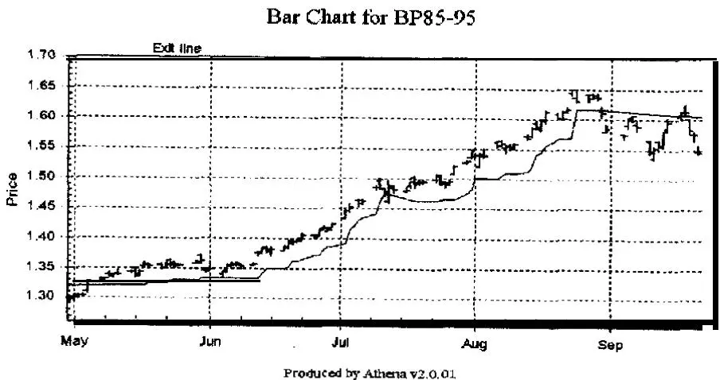
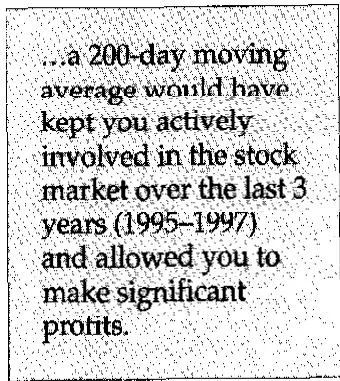

你必须知道何时持有，何时放弃，何时走开，何时奔跑。Kenny Rogers, *The Gambler*
几年前，Jack Schwager 的《Market Wizards》一书中提到的 Ed Seykota 在我们的一次研讨会上说过，如果你想学习如何交易，你应该去海滩观察海浪。你很快会注意到，海浪冲上岸后会转身回到大海。然后他建议你开始随着海浪的节奏移动双手——当海浪靠近时把手移向自己，当海浪退去时把手移开。这样做一会儿后，你会发现自己很快与海浪产生了共鸣。"当你达到那种与流动合拍的状态时，"他说，"你会对成为一个交易者需要什么有很多了解。"请注意，要想与海浪产生共鸣，重要的是要知道海浪何时完成了它的运动。

另一位来自澳大利亚的人来拜访我。他在计算机软件行业赚了很多钱，现在想研究交易系统。他一直在美国各地拜访人们，了解交易的本质。我们一起吃了晚饭，他仔细地向我解释了他所有的交易想法。当我听完他的想法后——它们都很好——我有些困惑。他所有的研究都涉及发现进入市场的入场技术。他没有研究使用什么样的退出策略或如何控制仓位规模。当我建议他现在需要花至少与入场一样多的时间来开发获利退出策略，以及花同样多甚至更多的时间在仓位规模管理上时，他似乎很沮丧。

人们似乎就是想忽视退出——也许是因为他们无法在退出时控制市场。然而，对于那些想要控制的人来说，退出确实控制着两个重要变量——你是否会盈利以及你能赚多少利润。它们是开发成功系统的关键要素之一。

## 获利退出背后的目的

退出有很多问题需要解决。如果最坏的情况没有发生（也就是说你没有被止损出局），那么你的系统的工作就是让你尽可能多地获利并尽可能少地回吐利润。只有你的退出能做到这一点！

请注意我使用了"退出"这个词——这个词的复数形式——因为大多数系统需要多个退出才能正确完成任务。因此，请考虑为你的每个系统目标使用不同的退出策略。在设计系统时，请记住你想如何控制风险回报比，并使用本节描述的各类获利退出策略来最大化你的利润。

除了你的初始止损之外，退出还有许多不同的分类。这包括产生亏损但降低初始风险的退出、最大化利润的退出、防止你回吐过多资金的退出以及心理退出。这些类别有些重叠。每种退出类型都提供了几种供你考虑的技巧。在你浏览每一种时，思考一下它如何能适配你的系统。大多数退出策略对特殊系统目标都具有令人难以置信的适应性。

## 产生亏损但降低初始风险的退出

你的初始止损（Stop Loss）在[第9章](ch05.md)中讨论过，设计目的是作为保护资本的最坏情况损失。然而，这类退出也会产生亏损，但这些退出旨在确保你尽可能少地亏损。

## 定时止损（Timed Stop）

一般来说，人们进入市场是因为他们期望价格在入场后不久朝着有利方向移动。因此，如果你有一个有意义的入场信号（Entry Signal），那么一个潜在有用的退出是在一段时间后如果你没有盈利就将你平仓。例如，这样的退出可以是"如果该仓位在2天内没有盈利，就在收盘时平仓"。这种退出会导致亏损，但不会像最坏情况止损被触发时亏损那么多。

## 追踪止损（Trailing Stop）

追踪止损是根据某种数学算法定期调整的止损。随机入场系统（在[第8章](ch08.md)中描述）使用了一个三倍波动率的追踪止损，仅当市场朝有利方向移动时才从收盘价每日调整。例如，在交易第一天之后，如果价格朝你的有利方向移动或波动率收缩，追踪止损就会向你有利的方向移动。它可能仍然处于亏损状态，但它向你的有利方向移动了。因此，如果市场向不利方向移动到足以触发止损，你仍然会亏损，但亏损不会像初始止损那么大。图10-1展示了一个波动率追踪止损的例子。这种追踪止损可以基于许多不同的因素——波动率、移动平均线、通道突破、各种价格盘整等——每种都可以由许多不同的变量控制。具体示例请参阅下一节。

关于追踪止损的重点是，你的退出算法会不断做出调整，使退出点向你的有利方向移动。这种移动可能不会带来盈利，但它会减少你的潜在损失。

你必须通过测试和检查结果来仔细考虑是否要这样做。例如，通过在追踪止损上移时降低初始风险，你往往只是放弃了获利的机会，反而只是接受了一个较小的亏损。在系统开发的这个领域要小心，如果你的系统确实使用了紧密止损，请注意可以使用重新入场策略。

图10-1 三倍波动率追踪止损

## 最大化利润的退出

为了最大化你的利润（让利润奔跑），你必须愿意回吐一部分利润。事实上，系统设计中讽刺的一点是，如果你想最大化利润，你必须愿意回吐大量已经积累的利润。正如一位智慧且非常富有的交易者曾经说过："如果你不愿意亏损，你就赚不到钱。这就像只吸气而不愿意呼气一样。"各种类型的退出将帮助你做到这一点（即充分呼吸），包括追踪止损和利润回撤止损（Percent Retracement Stop）。

## 追踪止损

追踪止损也有助于你获得大额利润的潜力，但它总会让你回吐一些利润。让我们看一些你可能想使用的追踪止损示例。

波动率追踪止损（Volatility Trailing Stop）已经提到过，它是市场每日波动率的倍数。J. Wells Wilder 首先提出了这个概念，建议它应该是过去10天平均真实波幅（Average True Range）的2.7到3.4倍之间的某个数字。我们在随机入场系统中使用了3.0。波动率止损的目的是让你的止损远离市场的噪音，而三倍每日波动率肯定能做到这一点。其他人研究了每周波动率。如果你使用每周波动率，那么你可能可以将止损设在每周波动率的0.7到2倍之间。

美元追踪止损（Dollar Trailing Stop）是另一种选择。在这里你会决定一个数字，比如1500美元，并将追踪止损设在昨天收盘价之后的这个金额处。美元止损如果有一定的理性基础是非常好的。然而，在标普合约、玉米合约、150美元的股票和10美元的股票中使用1500美元的止损是疯狂的。你的美元止损金额应该根据每个市场的合理水平进行调整。确定每个市场合理水平的最佳方法是检查该市场的波动率。因此，你不如使用基于波动率的止损。

通道突破追踪止损（Channel Breakout Trailing Stop）也相当有用。你可以决定在最后X天的极端价格处退出（你填入具体数字）。因此，在多头仓位中，你可能决定在价格触及最后20天的低点时卖出；而在空头仓位中，你可能决定在价格触及最后20天的高点时卖出。随着价格向有利方向移动，这个数字总是向有利方向调整。

移动平均线追踪止损（Moving-Average Trailing Stop）是一种常见的追踪止损。如果价格朝着某个特定方向移动，那么一条慢速移动平均线会跟随在该价格之后，可以用作止损。不过，你需要确定该移动平均线的周期数。例如，一条200日移动平均线在过去3年（1995-1997年）会让你积极参与股票市场，并让你获得可观的利润。

移动平均线有许多不同类型——简单移动平均、指数移动平均、位移移动平均、自适应移动平均等——所有这些都可以用作追踪止损。你的工作只是找到一个或几个最能帮助你实现目标的移动平均线。不同类型的移动平均线在本书的入场章节（[第8章](ch08.md)）中进行了广泛讨论。

还有其他类型的基于盘整或图表形态的追踪止损。例如，每次市场突破一个盘整形态时，那个旧的盘整形态就可以成为新止损的基础。这相当于一种自由裁量追踪止损，它会回吐大量利润。然而，与其他类型的退出结合使用时，它可能有一些优点。

## 利润回撤止损（Profit Retracement Stop）

这种止损基于一个假设：你必须回吐一定比例的利润才能让利润继续增长。因此，它只是给允许的回撤幅度分配一个数字，并将其纳入你的系统。然而，为了使用利润回撤止损，你必须达到一定的盈利水平，比如2-R利润。

这种止损的工作方式如下：假设你以52美元购买了100股 Micron 股票。你最初假设1-R风险为6美元，即如果股票跌到46美元你就退出。一旦你通过股票价格上涨到64美元获得了2-R利润12美元，你决定开始使用利润回撤止损。假设你决定设置30%的利润回撤止损。既然你现在有12美元，你愿意放弃其中的30%，即3.60美元。

当利润上升到13美元时，30%的回撤变为3.90美元。当利润为14美元时，30%的回撤变为4.20美元。由于固定百分比的实际美元金额会随着利润增长而继续增长，你可能想在利润变大时改变百分比。例如，你可能从30%回撤开始，但在3-R利润时降至25%，在4-R利润时降至20%。你可以继续降低这个比例，直到在7-R时只允许5%的回撤；或者你可能在达到4-R后让它保持在20%。这完全取决于你在设计系统时的目标。

## 防止回吐过多利润的退出

如果你管理他人的资金，最小化回撤比产生高回报更重要。因此，你可能想考虑防止回吐过多利润的退出。例如，如果你在3月31日有未平仓仓位使客户的账户在3月报表中增长了15%，那么当你回吐大部分利润时，客户会不高兴。你的客户会将未平仓利润视为他的钱。因此，你需要某种退出策略，在你达到特定目标后或在向客户报告期之后锁定大部分利润。

如前所述，许多退出策略是跨类别的。例如，利润回撤退出与目标结合是防止回吐过多利润的优秀退出策略。但还有其他同样有效的方法。

## 利润目标（Profit Objective）

有些人使用倾向于预测利润目标的交易系统（如艾略特波浪理论）。如果你使用这样的系统，那么你可能可以设定具体的目标。

然而，还有第二种设定目标的方法。你可能根据历史测试确定，如果在某个初始风险的特定倍数处获利了结，你的方法会产生你期望的风险回报比。例如，你可能发现四倍初始风险（4-R）是一个很好的目标。如果你能实现这个目标，你可能想获利了结或设置一个更紧的止损。下面讨论的所有方法在达到利润目标后都可以在某种程度上收紧。

## 利润回撤退出（Profit Retracement Exit）

前面提到的一个优秀的退出思路是，只愿意回吐一定比例的利润，并在达到某个重要里程碑（如向客户报告或利润目标）后收紧这个比例。例如，在获得2-R利润后，你可能愿意回吐30%的利润以让其继续增长。当你获得更大的利润，比如4-R时，你可能只愿意在退出前回吐5%到10%。

例如，假设你以400美元买入黄金，止损设在390美元。因此你的初始风险是10点，即1000美元。黄金涨到420美元，你获得了20点利润（2-R）。这可能是一个触发点，只允许30%的利润回撤，即600美元。如果黄金跌到414美元，你就获利了结。

黄金继续上涨到440美元，你现在有4-R利润4000美元。在你达到4-R利润之前，你愿意放弃30%的利润，在4000美元的水平上即1200美元。然而，4-R水平现在是你的信号，只承受10%的利润风险。你的止损现在移到436美元——只允许略超过400美元的下跌。

我的目的不是建议具体水平（如4-R时10%的回撤），而只是建议一种帮助你实现目标的方法。由你来决定什么水平能最好地帮助你实现目标。

## 大幅波动反向移动

你能拥有的最好退出之一是大幅波动反向移动。事实上，这种类型的移动也是系统非常好的入场信号——通常被称为波动率突破系统（Volatility Breakout System）。

你需要做的是跟踪平均真实波幅。当市场朝着不利方向做出异常大幅的移动（假设是平均每日波动率的两倍）时，你将退出市场。假设你持有200股 IBM 股票，交易价格为145美元。平均每日波动率为1.50美元，你决定如果市场在单日内朝着不利方向移动两倍波动率你就退出。也就是说，由于收盘价为145美元，而每日波动率的两倍为3美元，如果明天市场跌到142美元你就会退出。这将是对你非常不利的巨大波动，你不希望在这种波动发生时继续持有。[1]
很明显为什么这不能成为你唯一的退出。假设你继续使用这个两倍波动率止损。市场今天在145美元，你的波动率退出点在142美元。市场收盘下跌1点到144美元。你的新波动率退出点现在是141美元。第二天市场收盘下跌1点到143美元。你的新波动率退出点现在是140美元。这可能会一直持续下去直到价格归零。因此，你需要其他类型的退出——比如保护性止损和某种追踪止损——来保护你的资本。

## 抛物线止损（Parabolic Stops）

抛物线退出首先由 J. Wells Wilder 描述，它们非常有用。抛物线曲线从前一个低点开始，在上升趋势的市场中有加速因子。随着市场趋势的发展，它越来越接近价格。因此，它在锁定利润方面做得很好。不幸的是，在交易开始时它距离实际价格相当远。另外，抛物线止损有时可能太接近价格，你可能在市场继续趋势时被止损出局。

有几种方法可以解决这些缺点。一种可能是调整抛物线止损的加速因子，使其相对于市场的实际价格上升得更快或更慢。通过这种方式，抛物线止损可以根据你的特定系统和你交易的市场进行良好的定制。

为了更好地控制交易开始时的风险，你可以设置一个单独的美元止损。例如，如果抛物线止损在购买仓位时提供3000美元的风险，你可以设置一个简单的1500美元止损，直到抛物线止损距离实际合约价格在1500美元以内；3000美元的风险可能对你的特定目标来说太大了。

此外，如果你使用抛物线退出，你应该考虑设计一种重新入场技术。如果抛物线止损太接近实际价格，你可能在跟随的某个趋势结束前就被止损出局了。你不想错过趋势的剩余部分，所以你可能想重新入场。虽然抛物线止损在风险控制方面可能不如其他退出技术那么出色，但它们在保护利润方面非常优秀。

## 心理退出（Psychological Exits）

任何人能拥有的最聪明退出之一就是心理退出。这些更多地取决于你而不是市场的行为。由于你是交易中最重要的因素，心理退出很重要。

有些时候你在市场亏损的概率会大大增加——无论市场表现如何。这些时期包括你因健康或心理问题感觉不佳时、压力大时、离婚期间、刚有了新孩子时或搬家时。在这些时期，你做出导致市场亏损的行为的可能性大大增加。因此，我强烈建议你使用心理退出并将自己从市场中撤出。

另一个适合心理退出的好时机是你因出差或度假必须远离市场时。那些也不是留在市场中的好时机。我再次建议在这些时期使用心理退出。

有些人会争论说一笔交易可能让你赚到一整年的利润，你不想错过那笔交易。如果你在交易中有纪律且相当有动机，我同意这种哲学。然而，大多数人做不到。在我提到的任何一个时期，即使在一笔好交易中，普通人也会亏损。因此，了解自己很重要。如果你有可能即使在一笔好交易中也会爆仓，那么你必须使用心理退出。

## 仅使用止损和利润目标

你在设计交易系统时的目标之一可能是最大化高-R倍数（R-Multiple）交易的概率。你可能决定使用紧密止损，目标是获得20-R倍数的交易。为此，你可能决定使用[第8章](ch08.md)中描述的突破回撤策略来开发紧密止损。假设你在一只高价股上的止损仅为1美元，因此你在100股上只会亏损100美元。例如，在一只正经历急剧突破的100美元股票中，这将是一个非常紧密的止损。你可以连续五次被止损出局，每次仅亏损100美元——总亏损500美元。标的股票一次20美元的变动将给你带来2000美元的利润，即1500美元的净利润。你在六次中有一次是"正确的"，但你获得了1500美元的净利润（扣除佣金）。[2]
为了使这种策略有效，你必须避免追踪止损，或者那些止损必须非常大。你唯一的退出将是你的初始1-R止损和你的利润目标。这将给你最大机会获得20-R利润。你可能不得不忍受利润下降1000美元或更多，但永远不会超过1-R损失或相对于起始权益的100美元损失。[3] 记住，你的目标是20-R利润，你可能经常实现这一点。

## 简单性与多重退出

在系统设计中，最有效的是简单的概念。简单之所以有效，是因为它倾向于基于理解而非优化。它之所以有效，是因为人们可以将简单的概念推广到许多不同的市场和交易工具中。

然而，你仍然可以拥有多重退出并使它们简单。不要混淆这两个概念。简单性是必要的，这样你的系统才能运作；而多重退出通常对于实现你的目标是必要的。当然，你的每个退出都可以是简单的。

让我们看一个例子。假设你的目标是简单地使用一个趋势跟踪系统，并且你希望在市场上待很长时间。你相信你的入场信号没有什么神奇之处，所以你想给你的仓位足够的空间。你相信大幅反向移动可能是潜在灾难的触发信号，所以你希望在发生时退出。最后，你决定因为你的初始风险会相当大，一旦获得4-R利润你必须尽可能多地捕获。因此，让我们基于这些信念设计一些简单的退出。

首先，你想要一个宽的初始止损，给仓位足够的空间而不会把你震出市场，导致你需要多次入场并产生交易成本。因此，你决定使用你之前读到的三倍波动率止损。那将是你的最坏情况止损，它也将是你的追踪止损，因为你将每天从收盘价追踪它——总是向你的有利方向移动。

其次，你相信大幅反向移动是一个好的警告信号。因此，你决定每当市场在单日内朝着不利方向移动超过两倍每日波动率时，你就退出。这个止损将叠加在另一个止损之上。

最后，4-R利润将触发一个更紧的止损，这样你就不会回吐太多利润，并且可以确保捕获你已有的利润。因此，在触发4-R利润后，你的追踪波动率止损将上升到1.6倍平均真实波幅（而不是3倍）。

请注意，所有这些止损都很简单。它们都是我从思考什么样的止损能符合目标中想出来的。没有涉及测试，所以它们不是过度优化的。没有涉及火箭科学——它们很简单。你确实有三个不同的退出有助于实现你的交易系统目标，但同一时间只有一个会在市场中——即最接近当前价格的那个。

## 应该避免什么

有一种退出旨在消除亏损，但它完全违背了交易的黄金法则——截断亏损，让利润奔跑。相反，它产生大亏损和小利润。这种退出是你用多个合约进入市场，然后通过各种退出逐步平仓。例如，你可能以300股开始，当全部300股可以盈亏平衡时卖出100股。然后你可能在获利500美元时再卖出100股，保留最后100股以获取巨额利润。短期交易者经常使用这种策略。直觉上，这种交易方式似乎有道理，因为你似乎在"保险"你的利润。但如果你退后一步审视这种退出方式，你会发现这种交易方式有多危险。

你实际上在做的是一种反向仓位规模管理（Reverse Position Sizing）。你确保在承受最大亏损时拥有多仓位。在我们的例子中，你将在全部300股上亏损。你也确保在获得最大收益时只拥有最小仓位——在我们的例子中是100股。这是有强烈正确偏见的人的完美方法，但它并不能优化利润甚至不能保证利润。现在你能理解了吗？

如果你还不明白为什么应该避免这种交易方式，请计算一下数字。想象你只承担全部亏损或获得全部利润。看看你过去的交易，确定这种交易方式会有多大差别。在我要求客户这样做时，几乎每一次他们都会对如果持有全部仓位能赚多少钱感到完全震惊。

## 总结

人们回避寻找好的退出，因为退出不能让他们控制市场。然而，退出确实控制着一些东西。它们控制着你是盈利还是亏损，以及利润或亏损有多大。由于它们做了这么多，也许它们值得大多数人花更多时间研究。

我们回顾了四大类退出：使初始亏损更小的退出、最大化利润的退出、最小化利润回吐的退出以及心理退出。每个类别都呈现了各种退出策略，有很大的重叠。

读者最好考虑简单的多重退出。简单的退出易于概念化，不需要大量优化（如果有的话）。推荐多重退出，因为它们将帮助你最充分地实现你为交易系统设定的目标。

我们已经研究了如何建立一个单独的高期望值系统来获得良好的利润。下一章将讨论机会因子如何与期望值（Expectancy）互动。

## 常用系统使用的退出

## 股票市场系统

## William O'Neil 的 CANSLIM 系统

William O'Neil 的基本获利规则是在达到20%利润时获利了结。由于他的止损约为8%，这意味着2.5-R利润。因此，他的基本获利退出是一个目标。

然而，O'Neil 然后用36条其他卖出规则来调整他的基本获利规则。其中一些规则是基本卖出规则的例外，而另一些则是提前卖出的原因。此外，他还增加了八条关于何时持有股票的规则。我将请读者参考 O'Neil 的精彩书籍获取具体细节，因为我的意图是解释各种系统如何符合本章概述的框架，而不是给你系统的每一个细节。

## Warren Buffett 的商业方法

Warren Buffett 通常不卖出有两个原因。首先，当你卖出时，你必须缴纳资本利得税。因此，如果你确定公司对你投资的金额有良好的回报，为什么要卖出呢？你会自动将一部分利润交给美国政府。

其次，为什么要卖出一家基本面良好且带来优异回报的公司呢？如果一家公司以产生优异回报的方式投资了它的资本，那么你应该获得良好的资金回报。

第三，当你确实卖出时，你还会产生交易成本。因此，如果市场只是经历心理波动，为什么要卖出一笔好的投资呢？

然而，在我看来，Buffett 不卖出更多是神话而非事实。这个神话可能是因为 Buffett 本人从未写过他自己的投资策略而产生的。相反，其他人——可能有强调入场的典型偏见——试图解读 Buffett 实际上做了什么。

如果 Buffett 持有的一只股票的商业情况发生剧烈变化，那么他就必须卖出。让我给你一个例子：Buffett 在1998年初宣布他拥有全球白银供应量的约20%。白银不支付股息。如果你拥有像 Buffett 那么多的白银，你实际上会有储存和保护这种商品的成本。如果 Warren Buffett 没有为那批白银制定有计划的退出策略，那么在我看来，他正在犯投资生涯中最大的错误之一。另一方面，如果他确实有有计划的退出策略，那么我猜他大多数股票购买也有有计划的退出策略。当其他人写关于他时，他们只是反映了自己的偏见，关注他的入场和设置策略，而忽略了他的退出策略。

## Motley Fool 的"愚笨四股"方法

Motley Fool 的"愚笨四股"方法涉及每年一次调整投资组合。你重新调整仓位，使你现在持有道琼斯工业平均指数中股息第二、第三、第四和第五高的股票。如果这些股票与前一年相同，则不需要退出。

然而，如果其中任何股票不再符合条件，你将退出那些股票并进入符合条件的股票。

如果前一年股息第二高的股票不再处于那个位置，你也会做出调整——要么将仓位减半（如果它仍在前五名中），要么完全退出（如果它不再属于愚笨四股）。你也会卖出一些股票以进行等额调整。然而，这是仓位规模管理（Position Sizing）章节的主题。

## 期货市场系统

## Kaufman 的自适应方法

Kaufman 警告说，他的基本趋势跟踪系统不应与完整策略混淆。他只是将其作为一个示例方法呈现，在入场或退出的选择上没有细致的处理。

自适应移动平均线（Adaptive Moving Average）在[第8章](ch08.md)中作为基本入场技术介绍。当移动平均线上转超过预定过滤器的金额时，你简单地进入多头仓位。当移动平均线下转超过预定过滤器的金额时，你进入空头仓位。

Kaufman 指出，每当效率超过某个预定水平时就应该获利了结。例如，他指出高效率比无法持续，因此一旦获得高值通常会迅速下降。因此，Kaufman 有两个基本退出信号：（1）当自适应移动平均线在相反方向发生变化时（可能当它在相反方向超过某个阈值时）；（2）当效率平均值达到非常高值如0.8时。

我认为自适应退出比其他任何形式的退出都更有潜力。我的一些客户开发了随市场上升的退出策略，在仓位移动时给它足够的空间。然而，一旦市场开始转向，这些退出就立刻将你平仓。它们极具创意却又简单。如果市场恢复趋势，他们的基本趋势跟踪系统将能够重新入场。我强烈建议你在系统开发中花大量时间在这个领域。

## Gallacher 的基本面交易

你可能记得[第8章](ch08.md)中 Gallacher 的系统，它让你在（1）基本面设置到位时和（2）市场创出10日新高时（即10日通道突破）进入市场。该系统是一个反转系统——所以它始终在市场中。本质上，当10日低点被突破时它会平仓（并反向重新入场）。

然而，请记住 Gallacher 只在基本面指示的方向上建仓。因此，除非基本面发生剧烈变化，他只会在10日低点退出多头仓位（即不反转），只会在10日高点退出空头仓位（即不反转）。这是一个非常简单的退出，可能不会给你带来太多麻烦。然而，我猜测这个系统可以通过更复杂的退出得到显著改进。

## Ken Roberts 的1-2-3方法论

在我看来，Ken Roberts 的获利方法非常主观。它相当于一种盘整追踪止损方法。如果 Roberts 的方法是正确的并且已经让人进入了一个长期趋势，那么 Roberts 只会建议在新的盘整形成后将止损提高到其下方（或上方）。

这是一种在20世纪70年代效果极佳的老式趋势跟踪方法。它的主要缺点是可能回吐大量利润。它现在仍然有效，但 Roberts 的方法论与本章讨论的许多退出策略结合使用效果可能会更好。我特别推荐多重退出策略。

## 注释

1. 这些是假设的数字，不一定是 IBM 的推荐退出。你需要符合你自己标准的退出，并且你自己测试过。

2. 这再次说明了深度折扣佣金的重要性。

3. 除非市场脱离你的控制（这不时会发生），否则你的损失永远不会超过1-R。

利润与亏损的相对大小
