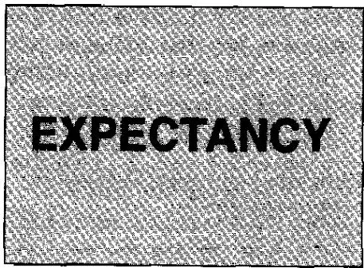

本书前10章已经涵盖了交易系统设计的核心要素。大多数人对目前的内容已经很满意了，因为它涵盖了大多数人全部关注的领域。但涉及市场盈利的两个最重要领域仍然存在——机会因素（Opportunity Factor，连同每次机会的成本）和仓位管理因素（Position Sizing）。

我们到目前为止所讲的内容，本质上都是关于期望值（Expectancy）——如何创造最佳期望值。它关乎如何在每笔交易中每承担一美元风险获得最多的回报。用[第6章](ch06.md)的雪仗比喻，我们已经向你展示了如何确保在任何给定时间（平均而言），"白色"或盈利雪球的总体积大于"黑色"或亏损雪球的总体积。

图11-1展示了一种说明期望值的可能方式。基本上你创建了一个二维图表。横轴代表交易的可靠性（Reliability）——盈利交易的百分比。纵轴代表平均收益与平均风险的比值——你的平均盈利交易相对于平均亏损交易有多大？

## 几种可采取的方法

如果你在前10章的内容上做得很好，你应该能提出一个具有正期望值的系统。你可能通过多种途径达到那个系统。以下是一些可能的例子。

图11-1 期望值示意图，展示了系统可靠性与盈亏相对大小之间的关系。希望这个面积是一个很大的正数。

## 具有大R倍数目标的长期趋势跟踪

假设你决定成为一名长期趋势跟踪者（Long-Term Trend Follower），追求大R倍数（R-Multiple）交易。你决定使用40日通道突破（Channel Breakout）作为设置信号。然后你在回调后入场，将止损设在回调低点下方。你的初始利润目标是至少10倍的收益。这意味着你要么被止损出局产生亏损，要么达到10R的利润。一旦达到10R利润，你转而使用30%的回撤止损——也就是说你现在愿意回吐30%的利润才出场。

这种交易方式意味着对你来说1R的风险非常小。这意味着你会频繁被止损（即有很多亏损），但你的盈利通常是20R倍数甚至更大。当你测试你的系统时，你发现你在18%的交易中赚钱，但你的平均盈利约为平均亏损的23倍。如果你把这些数值代入公式6-1，它给你一个每美元风险3.32美元的正期望值——一个非常优秀的期望值。

在考虑交易成本之后，你会发现期望值下降到每美元风险2.90美元。你认为这个水平很好。然而，现在仍然存在的关键问题是，你多久能获得一次23R的利润？是每年一次还是每周一次？

## 具有40%可靠性和2:1收益风险比的标准长期趋势跟踪

有些人可能决定他们无法容忍前面描述的高R倍数方法所产生的大量亏损。因此，他们决定采取更标准的趋势跟踪方法来面对市场。他们决定使用自适应移动平均线（Adaptive Moving Average）作为入场信号，使用三倍波动率的跟踪止损（Trailing Stop）——既保护初始资本，也作为获利了结的出场方式。

在这种情况下，你的初始风险更大，因为它是价格平均每日波幅的三倍。然而，经过大量测试后，你发现你的平均亏损只有0.5R。你还发现你的平均盈利是2.4R，你在大约44%的交易中赚钱。当你用公式6-1计算期望值时，你发现期望值是可观的每美元风险77.6美分。在扣除交易成本后，你确定期望值大约为每美元风险63美分。

同样，你现在有一个关键问题要回答。你多久能交易一次这个系统，你会对这些结果满意吗？

## 高概率、低R倍数交易

你已经决定你实在无法容忍长时间连续亏损的可能性。因此，你需要至少60%的时间是"正确的"。此外，你愿意牺牲利润的大小来换取更高的正确率。

结果，你决定使用波动率突破（Volatility Breakout）来入场。你知道当出现大幅波动时，它很可能会持续一段时间。你决定当市场上涨或下跌达到过去5天平均真实波幅（Average True Range, ATR）的0.7倍时，你就入场。

你还测试了大量这样的入场点，注意到对你不利的最大反向变动（Maximum Adverse Excursion）很少超过平均真实波幅的0.4倍。因此，你决定将其作为初始止损。你也完全满意以平均真实波幅的0.6倍作为利润目标，因为你确定这个目标至少有60%的时间能被达到。换句话说，你要么在止损处亏损出场，要么达到你的利润目标。

当你把这些数字代入公式6-1时，你确定你有每美元风险50美分的期望值。然而，当你加上交易成本后，这个数字减少到每美元风险30美分。

你现在必须问的问题是：你能否在只有30美分期望值的情况下生存？你产生的交易次数是否足够多，与长期趋势跟踪者相比，能与他们竞争投资利润？

## 每笔交易都能获取买卖价差但偶尔被市场扫荡的做市商

我们的最后一位交易者代表了一个极端情况，那就是做市商（Market Maker）。这个人试图在每一笔交易中获取买卖价差（Bid-Ask Spread）。假设买卖价差代表每笔交易约8美分的收益，而我们的交易者在大约90%的时间内获取了它。另外5%的交易是每笔约8美分的小额亏损。然而，最后5%的交易代表了大额亏损（对他来说），这是他有时被市场席卷时不得不承受的。这些亏损可能高达每笔交易1美元。

当我们的最后一位交易者将这些数据代入期望值公式时，他得出的数字大约是每美元风险1.8美分。在扣除交易成本后，他净赚大约每美元风险1.2美分。这个特殊的人是如何谋生的？与那些知道如何在每承担一美元风险时赚取超过一美元的人相比，他似乎没有多少机会。真的如此吗？

## 纳入机会因素

表11-1展示了我们四位交易者及其各自的期望值。起初，期望值最大的交易者显然是人们预期会取得最大成功的交易者。确实，这个交易者的期望值远优于大多数长期趋势跟踪者，因此我们预期他会有出色的业绩记录。然而，正如我们之前所展示的，机会因素显然改变了期望值的要素。这也在表11-1中通过系统每天产生的美元交易量得到了说明。

表11-1 四位交易者的期望值、成本和机会因素
| | 交易者1 | 交易者2 | 交易者3 | 交易者4 |
|---|---|---|---|---|
| 期望值 | $3.32 | $0.776 | $0.50 | $0.018 |
| 扣除成本后 | $2.90 | $0.630 | $0.30 | $0.012 |
| 机会频率 | 0.05 | 0.5 | 5 | 500 |
| 交易量（$/天） | $0.145 | $0.315 | $0.15 | $6.00 |
假设交易者1平均每20天产生一笔交易。交易者2每隔一天有一个交易机会，而交易者3和交易者4分别每天产生5笔和500笔交易。

从这个角度来看，交易者1和交易者3每天似乎产生大致相等的潜在利润交易量——尽管交易者3不太可能经历漫长的回撤期。然而，总优势显然属于做市商。做市商如果足够聪明，应该很少有亏损的一天。

我的超级交易者项目中有一位是场内交易员（Floor Trader）。他每年以10万美元交易资金起步，目标是谋生并尽可能多赚钱。仅凭他的智慧和对自身优势的认识，他在1997年仅3个多月的时间里就将交易资金做到了170万美元。这是优势吗？

你是否开始理解利润是期望值乘以机会的函数？结果就是每天产生的期望值美元交易量。这个美元交易量是决定你每天能赚多少钱的最重要因素。

图11-2是将机会作为第三维度的期望值图。你现在得到的，如图所示，是一个三维立体图形，等于你的交易系统每天产生的美元交易量。新的维度，用深灰色表示，是机会维度。由此产生的利润不再依赖于二维表面，而是依赖于三维立体图形。

图11-2 期望值加上机会变成了三维立体

## 交易机会的成本

交易存在明确的成本。做市商必须获取他的优势。你的经纪人必须收取她的费用。而你的利润就是扣除这些成本后剩余的部分——如果有的话。

每笔交易的成本实际上是期望值方程的一部分，但它非常重要，所以我想再补充一些关于降低交易成本的内容。你做的交易越少，每笔交易成本就越不成为一个重要因素。许多长期趋势跟踪者几乎不花时间考虑交易成本，因为与潜在利润相比，它微不足道。例如，如果你考虑每笔交易赚5000美元，那么你可能不会太在意100美元的交易成本。

然而，如果你是短期导向的，做了大量交易，那么交易成本对你来说就是一个大得多的考量——至少应该如此。例如，如果你的平均每笔交易利润是50美元，那么你就会更加关注100美元的交易成本。

## 寻找低佣金

除非你需要经纪人提供特定服务，你应该关注以尽可能低的成本获得最佳执行（Execution）。例如，股票交易者现在可以进行不限次数的互联网交易，费用低于10美元。这与所谓的折扣经纪商（Discount Broker）相比大幅下降，后者过去仅购买100股股票就要收费50美元，卖出同样100股再收50美元。然而，你必须确保（1）你以合理的价格获得了良好的执行，（2）你的互联网经纪人在你需要立即交易的高波动时期能够为你服务。

期货交易者长期以来一直能获得很好的佣金。通常，期货经纪人只收取一个"来回"（Round Turn）的价格，即开仓和平仓的费用。你通常可以协商到30美元甚至更低的费率——有时根据你的交易量会更好得多。

## 执行成本

"执行成本"（Execution Costs）一词通常指超出经纪人佣金的进出交易成本。这些通常是买卖价差（即做市商的优势）以及高波动率的成本。当做市商不确定能否以盈利方式执行你的仓位时（因为市场在变动），你的执行成本通常会上升以覆盖他的风险。

一些交易者不遗余力地控制执行成本。例如，Jack Schwager在《新市场怪杰》（The New Market Wizards）中采访的Monroe Trout，他的交易方法需要非常低的滑点（Slippage）。最初，他通过多个经纪人执行交易，并记录每笔交易通过每个经纪人产生的滑点。当滑点过高时，该经纪人通常会被替换。最终，Trout决定他需要购买自己的经纪公司，以确保他的订单得到正确执行。

如果你是一名短期交易者，那么你可能需要同样关注执行成本。执行一笔交易需要多少成本？你如何降低这些成本？仔细考察你的经纪人。确保任何处理你订单的人都完全理解你想要达成的目标。对于短期交易者来说，正确的执行可能意味着丰厚利润与零利润之间的差别。

## 税务成本

利润还有第三种成本——政府征收的费用。政府监管交易业务，政府的参与是有成本的。因此，每笔交易都要缴纳交易所费用，获取数据也有成本。此外，政府对你的利润征税也是一个非常真实的成本。

房地产投资者长期以来通过填写1031表格然后购买另一处更贵的房产来避免部分利润税。此外，长期股票投资者（如Warren Buffett这样的很少卖出的人）也避免了这些税收，因为你不必为未实现的股票利润纳税。因此，坚持房地产或做长期股票投资者可以避免交易业务的一大主要成本。

然而，短期交易者必须对其利润缴纳全额税款，这些税款可能是一笔可观的成本。例如，期货交易者在年底其未平仓头寸按市价标记（Marked to Market），需要对其未实现利润缴税。因此，你可能在12月31日有20000美元的未实现利润被政府征税。你最终可能要回吐15000美元的未平仓利润，但直到第二年你的实际利润较低时才能拿回税款。

税务考量显然是交易业务成本的重要组成部分。这个整体话题远远超出了本书的范围。然而，它是一个真实的成本，应该纳入你的规划之中。

## 心理成本

给你大量机会的短期交易可能带来巨大的心理成本（Psychological Costs）。你必须始终保持巅峰状态；否则你将错过一笔可能巨大的交易，或者犯下一个可能让你损失多年利润的错误。

有好几次，短期交易者给我打电话说类似这样的话："我是一个日内交易者（Day Trader）。我每天进出多次。而且我几乎每天都赚钱。太棒了！然而，昨天我回吐了将近一年的利润，我真的很难过。"这绝对是一个心理问题。这类错误要么来自交易中的重大心理失误，要么来自玩一个负期望值游戏的心理失误——这种游戏大部分时间都赢，但偶尔会出现对你不利的巨大R倍数。

我们在本书中一直在讨论数字。你已经了解了期望值涉及的数字。你已经了解了将期望值乘以机会因素的重要性。然而，心理成本因素可能是所有因素中最重要的。你交易得越多，它就越起作用。

即使是长期交易者也有心理因素。长期交易者通常每年凭借几笔高R倍数交易取得成功。这种交易者不能错过那些好交易。当你错过当年最大的交易时，你很可能那一年就无法盈利。心理因素再次发挥作用！

我的一位好友是一位专业交易者，他曾经告诉我，当他和他的搭档交易时，心理因素不会起作用。他们制定了交易计划，一切都很机械化。我说这些因素确实会起作用，因为你必须执行那些交易。他同意了，但仍然认为心理学对他们的交易没有那么重要。然而几年后，他的搭档因为交易英镑从未赚钱而灰心丧气。当一笔交易出现时，他们没有执行。那笔交易结果是本可以成就他们那一年的一笔大交易。教训是：心理因素在任何类型的交易中都会发挥作用。

## 总 结

本书的大部分内容都是关于开发一个高期望值交易系统。期望值是一个与交易系统可靠性和盈亏相对大小相关的二维表面。

交易机会构成了第三个维度，它为你的利润或亏损美元赋予了"体积"。你必须将机会因素乘以期望值因素才能得到你每天可能收获的潜在美元交易量。因此，如果你不做很多交易，高期望值并不一定转化为每天的高美元交易量。

最后，交易是有成本的，必须从每天的美元交易量中扣除。这个成本通常已经计入期望值之中。然而，交易有许多种成本，每一种都应该加以考虑。降低其中任何一种都可能对你的最终利润产生重大影响。

四种主要成本类型是：经纪人佣金（Brokerage Commissions）、执行成本（Execution Costs）、税务成本（Tax Costs）和心理成本（Psychological Costs）。每一种都进行了简要讨论。

## 注 释

1. 大多数场内交易员最终都没有成功。他们会在一两年内破产（或至少损失本金），因为他们不了解自己的优势是什么，或者不知道如何利用它。

2. 参见附录I中的推荐阅读。
