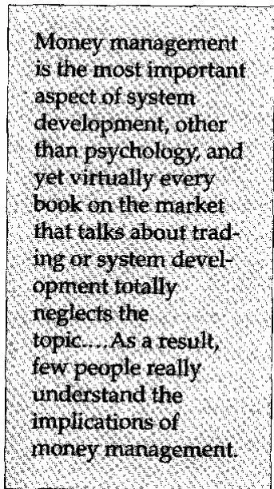
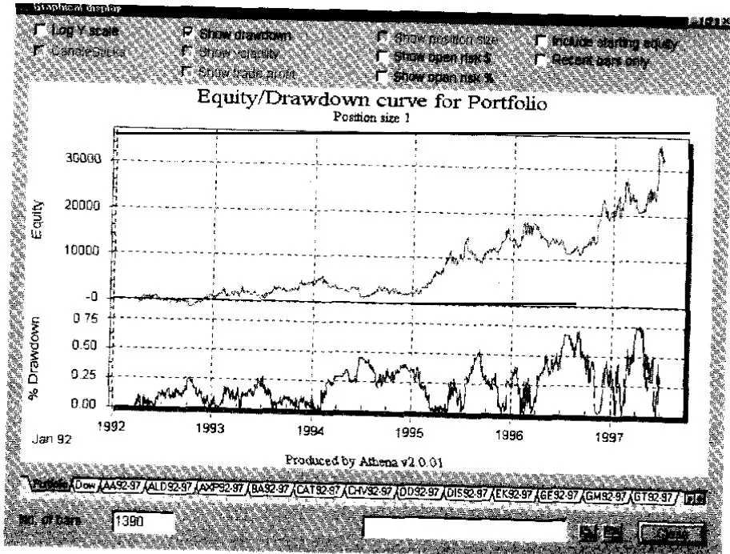
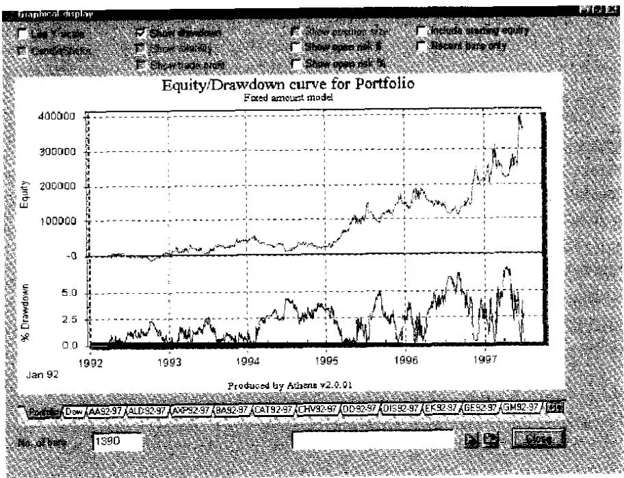
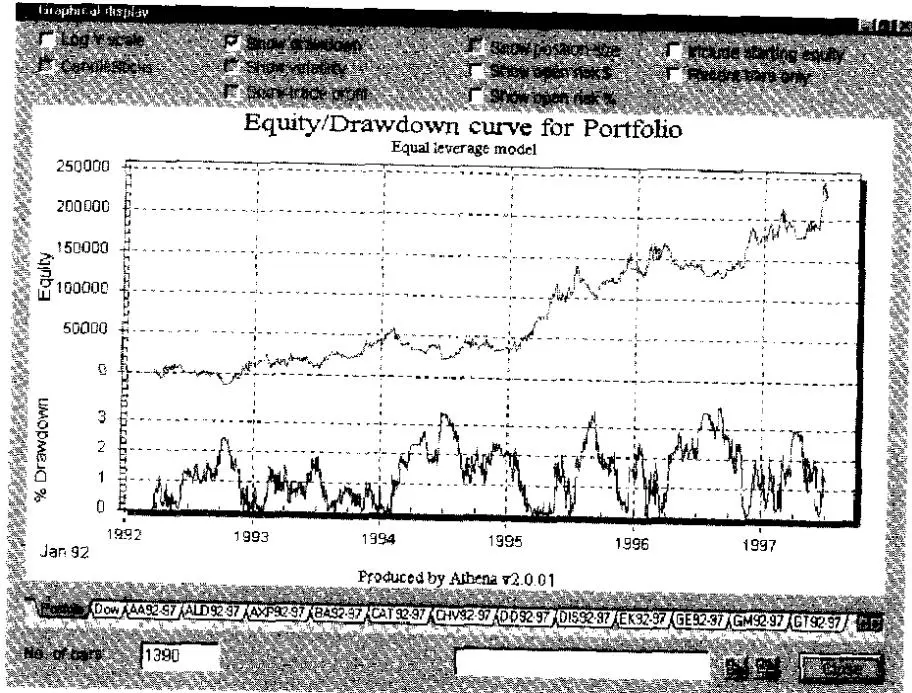
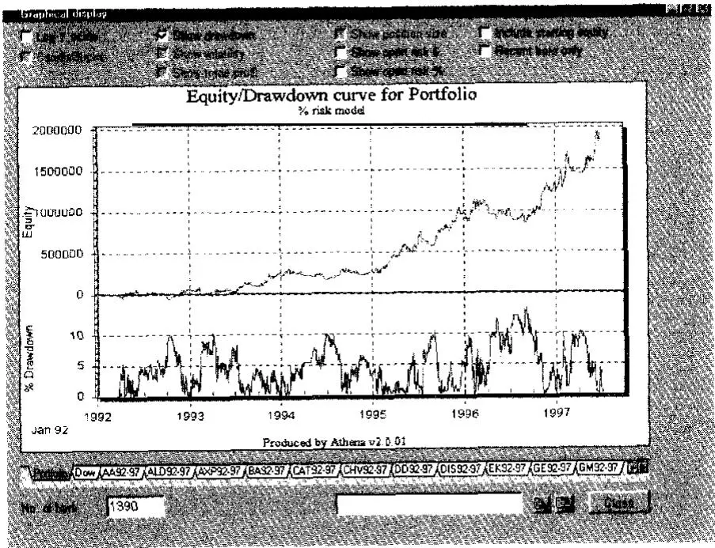
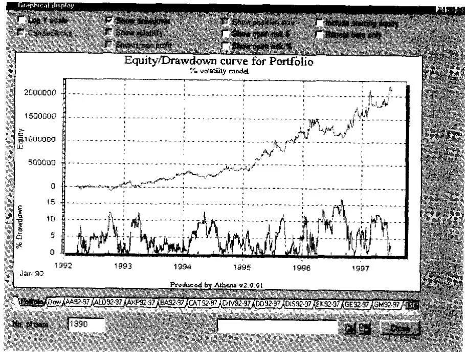
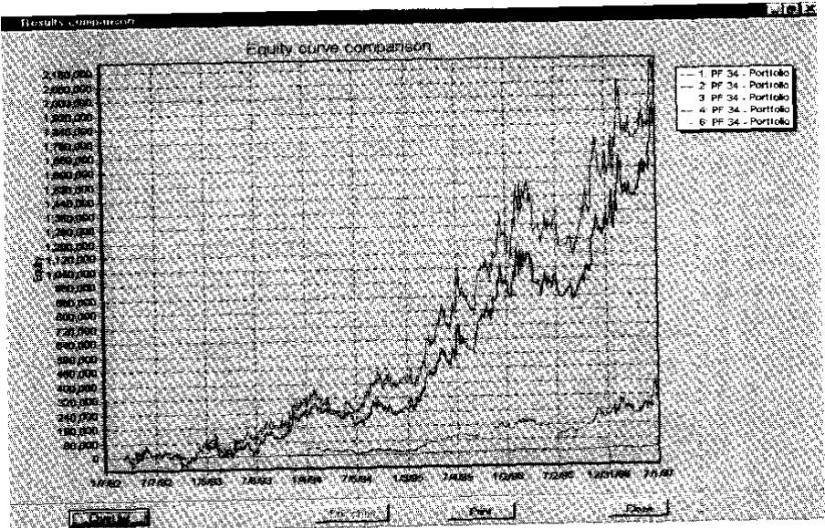
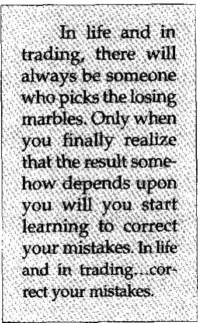

当我获得30%的利润时，我取出三分之一。当我获得60%的利润时，我再取出三分之一。当我看到反转迹象时，我会取走剩余的全部利润。

## 引自一次股票交易研讨会上关于资金管理的讲座

上面的讲师在一次股票市场研讨会上做了上述引述，告诉我这是他的资金管理公式。然而，在我看来，这与资金管理（Money Management）毫无关系。相反，它完全与出场（Exit）有关。研讨会结束后，我找到他，问他所说的"资金管理"——也就是他演讲的主题——是什么意思。他的回答是："这是个好问题，我认为它是关于一个人如何做出交易决策。"
资金管理是系统开发中最重要的方面，仅次于心理因素，然而市面上几乎每一本关于交易或系统开发的书都完全忽视了这个话题。事实上，即使是专门讨论资金管理的书，也很少谈到这个话题最重要的方面——仓位管理（Position Sizing）。结果，很少有人真正理解资金管理的含义。

资金管理（仓位管理）不是以下任何一项：
1. 它不是你系统中规定在特定交易中会亏损多少的部分。

. 它不是如何出场一笔盈利交易。

. 它不是分散投资（Diversification）。

. 它不是风险控制（Risk Control）。

它不是风险规避（Risk Avoidance）。

l 它不是你系统中使绩效最大化的部分。

. 它不是你系统中告诉你投资什么的部分。

资金管理是你交易系统中回答"多少？"这个贯穿整个交易过程的问题的部分。"多少"本质上意味着在交易过程中的任何给定时间，你应该持有多大的仓位。因此，我在本书中选择将其称为"仓位管理"。

在回答"多少？"这个问题的过程中，你可能需要考虑上述提到的一些问题，但这些问题并不是你的仓位管理算法。对你们中的一些人来说，风险控制等要素可能看起来比决定"多少"更重要。但"多少"这个问题解释了不同专业交易者之间绩效的大部分差异。

记住[第6章](ch06.md)描述的雪仗模型。嗯，仓位管理模型包含了那个比喻中的两个因素。这些因素是初始防护的大小（即雪墙的大小或你的初始权益）以及同时砸向雪墙的雪球数量（即你同时持有的仓位数量）。

图12-1说明了仓位管理如何在确定你必须考虑的总美元交易量时增加了一个步骤。回忆一下图11-2创建了一个将机会加入期望值的三维盒子。图12-1显示，有了仓位管理，必须增加第四个维度——在市场中同时持有的多个仓位的维度。由于绘制四个维度相当困难，图12-1通过展示你可以同时有许多三维盒子影响你的仓位来说明仓位管理的效果。

回撤后的恢复

图12-1 仓位管理的效果相当于同时向一个情境中添加许多三维盒子。
记住[第2章](ch02.md)描述的Ralph Vince研究。在那项研究中，40位博士参与了一个具有正期望值的资金管理游戏。然而，其中95%的人亏了钱。为什么？原因与他们的心理和糟糕的仓位管理有关。

假设你以100美元的风险开始这个游戏。事实上，你连续三次这样做都输了——这在这个游戏中是一个明显的可能性。现在你只剩700美元，你想："我已经连输三次了，现在我真的该赢了。"这就是赌徒谬误（Gambler's Fallacy），因为你赢的概率仍然是60%。无论如何，你决定下注300美元，因为你非常确信会赢。然而，你又输了，现在你只有400美元。你现在在这个游戏中赚钱的机会很小了，因为你必须赚150%才能回本。虽然连续四次亏损的概率很低——0.0256——但在100次试验的游戏中，这几乎肯定至少会发生一次。

以下是博士们可能破产的另一种方式。假设他们开始时下注250美元。他们连续三次亏损，总计750美元。他们剩下250美元。他们现在必须赚300%才能回到盈亏平衡点，而且他们很可能在破产之前做不到这一点。

在这两种情况下，在这个简单的游戏中未能盈利，都是因为当事人冒了太大的风险。过度冒险是出于心理原因——贪婪、不理解概率，在某些情况下甚至是渴望失败。然而，从数学上说，他们的亏损是因为他们冒了太大的风险。例如，如果一个比雪墙还大的黑雪球砸向雪墙，那么雪墙就会被摧毁。无论黑白雪球的比例多么有利——一个比雪墙还大的黑雪球就会摧毁雪墙。

你的权益大小相当于雪仗比喻中雪墙的大小。通常发生的情况是，大多数普通人带着太少的钱进入大多数投机市场。5万美元以下的账户是小的，但平均账户只有1000到10000美元。结果，许多人实践着糟糕的资金管理，仅仅因为他们的账户太小。仅仅因为账户规模，他们失败的数学概率就非常高。

看看表12-1。注意你的账户需要从各种规模的回撤中恢复多少才能回到盈亏平衡点。例如，20%以内的亏损只需要一个适度较大的收益（即不超过25%）就能回本。但40%的回撤需要66.7%的收益才能回本，50%的回撤需要100%的收益。超过50%的亏损需要巨大且不太可能的收益才能回本。因此，当你冒太大风险并亏损时，你完全恢复的机会非常渺茫。

表12-1 回撤与恢复所需收益
| 回撤 | 恢复所需收益 |
| --- | --- |
| 5% | 5.3% 收益 |
| 10% | 11.1% 收益 |
| 15% | 17.6% 收益 |
| 20% | 25% 收益 |
| 25% | 33% 收益 |
| 30% | 42.9% 收益 |
| 40% | 66.7% 收益 |
| 50% | 100% 收益 |
| 60% | 150% 收益 |
| 75% | 300% 收益 |
| 90% | 900% 收益 |

## 仓位管理策略

专业赌徒长期以来一直声称有两种基本的仓位管理策略——马丁格尔策略（Martingale）和反马丁格尔策略（Anti-Martingale）。马丁格尔策略在权益下降时（连亏期间）增加下注大小。反马丁格尔策略则相反，在连胜期间或权益增加时增加下注大小。

如果你玩过轮盘赌或掷骰子，马丁格尔策略的最纯粹形式可能已经出现在你脑海中。它简单来说就是在你输的时候加倍下注。例如，如果你输了1美元，你就下注2美元。如果你又输了2美元，你就下注4美元。如果你又输了4美元，你就下注8美元。当你最终赢了——你最终一定会——你将比你的原始下注额领先。

赌场喜欢玩这种马丁格尔策略的人。首先，任何赌博游戏都会有连输的情况。当赢的概率低于50%时，连输可能相当显著。假设你连续输了10次。如果你开始下注1美元，那么在这段连输中你将损失2047美元。你现在将下注2048美元来赢回你最初的1美元。因此，在这一点上，对于一个低于50:50的赌注，你的盈亏比是1比4095。你将冒着超过4000美元的风险来获取1美元的利润。更糟糕的是，由于有些人可能有无限的资金，赌场设有下注限额。在允许最低下注1美元的赌桌上，你可能无法冒险超过100美元。因此，马丁格尔下注策略通常行不通——无论是在赌场还是在市场中。

如果你在连输期间继续增加风险，你最终会遇到足够大的连输导致破产。即使你的资金是无限的，你也会将自己置于任何人类心理上都无法承受的风险回报策略中。

反马丁格尔策略（Anti-Martingale Strategy），即在连胜期间承担更大风险的策略，确实有效——无论是在赌博领域还是在投资领域。聪明的赌徒知道在赢的时候增加下注，当然这有一定的限制。交易或投资也是如此。有效的仓位管理系统要求你在赚钱时增加仓位大小。这对赌博、交易和投资都适用。

仓位管理的目的是告诉你将开立多少单位（股票或合约），考虑到你账户的大小。例如，一个仓位管理决策可能是你没有足够的资金开立任何仓位，因为风险太大。它让你通过确定在一笔交易中将承担多少单位的风险，以及在投资组合中的每笔交易中承担多少单位的风险，来确定你的收益和风险特征。它还有助于你在投资组合的各个要素之间平衡交易风险敞口。最后，某些仓位管理模型将所有市场的1R风险等同起来。

有些人认为他们通过设置"资金管理止损"就"在仓位管理方面做得足够好了"。这种止损是指当你亏损了预定金额（比如1000美元）时就退出仓位。然而，这种止损并没有告诉你"多少"或"多少单位"，所以它实际上与仓位管理无关。通过确定止损时的亏损金额来控制风险，与通过仓位管理模型来控制风险是不同的，后者决定的是"多少单位"或者你是否能负担得起持有任何一个仓位。

你可以使用多种仓位管理策略。在本章的其余部分，你将学习几种有效的仓位管理策略。有些可能比其他策略更适合你的交易或投资风格。有些最适合股票账户，而另一些是为期货账户设计的。所有这些都是反马丁格尔策略，因为"多少"的公式会随着账户规模的增长而上升。

这些材料有些复杂。然而，我已经避免了使用困难的数学表达式，并给出了每种策略的清晰示例。因此，你只需要仔细阅读这些材料。反复阅读直到你彻底理解为止。

## 所使用的系统

在展示所有这些策略的结果时，我选择使用一个交易系统，在同一时间段交易同一组商品。该系统是一个55日通道突破系统（55-Day Channel Breakout System）。换句话说，如果市场创出55日新高（做多）或55日新低（做空），它就以止损单入场。止损，无论是用于初始风险还是获利了结，都是市场另一侧的21日跟踪止损。

举例说明，如果你做多且市场触及21日低点，你就退出。如果你做空且市场创出21日新高，你就退出。这个止损每天重新计算，总是朝有利于你的方向移动，以减少风险或增加利润。这种突破系统在有足够资金交易时能产生高于平均水平的利润。

该系统使用100万美元的初始权益，在1981年至1991年间对10种商品进行了测试。本章中展示的期货数据都是基于同样的55/21日突破系统，在同样的商品和同样的年份上测试的。各表之间唯一的区别是使用的仓位管理模型。

## 模型1：每固定金额一个单位

基本上，这个方法通过确定你每拥有X美元就交易一个单位来告诉你"多少"。例如，你可能每5万美元总权益交易一个单位（即100股、一份合约等）。

当你开始交易或投资时，你可能从未听说过仓位管理。最多你可能想过类似"我只买得起一个单位"这样的想法。如果你对它有所了解，你的知识可能来自某本同样不理解它的作者写的书。大多数讨论资金管理的书都不是关于仓位管理的。相反，它们告诉你关于分散投资或优化交易收益的内容。关于系统开发或技术分析的书甚至没有充分讨论仓位管理。结果，大多数交易者和投资者无处学习他们这门技艺中最重要的方面。

因此，在无知的状态下，你开了一个2万美元的账户，决定在任何给你信号的品种上交易一份合约（股票投资者可能只交易100股）。后来，如果你幸运的话，账户增长到4万美元，你决定将所有品种的仓位增加到两份合约（或200股）。结果，大多数确实实践某种形式仓位管理的交易者使用的就是这个模型。它很简单。它以直接的方式告诉你"多少"。

每固定金额一个单位有一个"优势"，那就是你永远不会因为一笔交易风险太大而拒绝它。让我给你一个我认识的两位交易者的经历作为例子。其中一位每5万美元权益交易一份合约，而另一位将风险限制在权益的3%，不会开立风险敞口超过这个比例的仓位。两人的系统都给出了交易日元的信号。那位无论如何都交易一份合约的人执行了这笔交易。日元随后的走势非常大，因此这个人创造了他公司历史上最大的月度收益——月度20%的收益。

另一方面，第二位交易者无法执行这笔交易。他的账户是10万美元，但如果交易对他不利，风险将超过他3%的限额。第二位交易者那个月没有盈利。当然，这种总是执行交易的因素也会反过来起作用。如果日元交易对第一位交易者不利，他可能会遭受大额亏损，而第二位交易者则会避免这一点。

表12-2展示了使用第一个仓位管理模型的系统结果。注意该系统在每2万美元权益一份合约时就崩溃了。在3万美元时，你将不得不承受80%的回撤，如果你想避免50%的回撤，你至少需要7万美元。

要真正评估这种仓位管理方法，你需要将其与其他模型开发的表格进行比较（见表12-4和表12-6）。

表12-2 55/21日突破系统，每$X权益交易一份合约（初始权益100万美元）
| 55/21日突破系统，每$X权益交易一份合约（初始权益100万美元） |
| --- |
| 每$X权益一份合约 | 利润 | 拒绝交易 | 年化收益% | 追加保证金 | 最大回撤 |
| $100,000 | $5,034,533 | 0 | 18.20% | 0 | 36.66% |
| $90,000 | $6,207,208 | 0 | 20.20% | 0 | 40.23% |
| $80,000 | $7,725,361 | 0 | 22.30% | 0 | 43.93% |
| $70,000 | $10,078,968 | 0 | 25.00% | 0 | 48.60% |
| $60,000 | $13,539,570 | 0 | 26.20% | 0 | 54.19% |
| $50,000 | $19,309,155 | 0 | 32.30% | 0 | 61.04% |
| $40,000 | $27,475,302 | 0 | 36.50% | 0 | 69.65% |
| $30,000 | $30,919,632 | 0 | 38.00% | 0 | 60.52% |
| $20,000 | ($1,685,271) | 402 | 0.00% | 1 | 112.00% |
尽管它有让你总是可以开仓的优势，但我认为每固定金额一个单位类型的仓位管理是有限的，因为（1）并非所有投资都是相同的，（2）它不允许你用少量资金快速增加风险敞口，（3）即使风险太高你也会开仓。事实上，对于小账户来说，每固定金额一个单位模型几乎等于没有仓位管理。让我们逐一探讨这些原因。

并非所有投资都是相同的。假设你是一个期货交易者，你决定用你的5万美元交易最多20种不同的商品。你的基本仓位管理策略是在投资组合中任何给你信号的品种上交易一份合约。假设你同时收到了债券和玉米的信号。因此，你的仓位管理告诉你你可以买入一份玉米合约和一份债券合约。假设长期国债（T-bonds）价格为112美元，玉米价格为3美元。

当长期国债期货价格为112美元时，你控制着价值112000美元的产品。此外，当时的日波幅（即波动率）约为0.775，如果市场朝一个方向波动三倍，你将赚或亏2325美元。相比之下，玉米合约你控制着大约15000美元的产品。如果它朝你的方向或相反方向波动三个日波幅，你的盈亏约为550美元。因此，你的投资组合的表现将大约80%取决于债券的表现，只有大约20%取决于玉米的表现。

有人可能会争辩说玉米过去波动更大且更贵。这可能再次发生。但你需要根据当前市场的情况来分散你的机会。根据目前呈现的数据，一份玉米合约对你账户的影响大约是一份债券合约的20%。

它不允许你快速增加风险敞口。反马丁格尔策略的目的是在你盈利时增加风险敞口。当你每5万美元交易一份合约且只有5万美元时，你必须将权益翻倍才能增加合约数量。因此，这不是在连胜期间增加风险敞口的高效方式。事实上，对于5万美元的账户，它几乎等于没有仓位管理。

部分解决方案是要求最低账户规模为100万美元。如果你这样做，你的账户只需要增长5%，你就可以从20份合约（每5万美元一份）增加到21份合约。

即使风险太高你也会开仓。每X美元一个单位的模型会允许你在所有品种上各买一份。例如，你可以买一份标普指数（S&P）合约，用15000美元的账户控制价值225000美元的股票。假设标普指数的日波动率为10个点，你使用三倍波动率的止损，即30个点。你的潜在亏损是7500美元，即你权益的一半。仅一个仓位就有巨大的风险，但用每X美元一个单位的仓位管理模型你可以承担这个风险。

拥有仓位管理策略的一个原因是为了在投资组合的所有要素之间实现同等机会和同等风险敞口。你希望从投资组合的每个要素中获得同等的赚钱机会。否则，为什么要交易那些不太可能给你带来多少利润的品种呢？此外，你还希望在投资组合的各要素之间平均分配风险。

当然，拥有同等的机会和风险敞口假设你在开仓时每笔交易盈利的可能性是相同的。你可能有一些方法来确定某些交易会比其他交易更盈利。如果是这样，那么你会想要一个仓位管理计划，给你在成功概率更高的交易上分配更多的单位——也许是一个自由裁量的仓位管理计划。然而，在本章的其余部分，我们将假设投资组合中的所有交易从一开始就有同等的成功机会。这就是你选择它们的原因。

在我看来，每固定金额一个单位模型并不能给你同等的机会或风险敞口。但有一些仓位管理方法可以让你均衡投资组合的要素。这些包括模型2——使投资组合中每个要素的价值相等；模型3——使每个要素的风险金额相等（即你退出仓位时为保护资本而会亏损多少）；以及模型4——使投资组合中每个要素的波动率相等。模型3还有使每个市场的1R含义相等的价值。

## 模型2：等值单位——适用于股票交易者

等值单位模型（Equal Units Model）通常用于股票或其他非杠杆工具。该模型通过将你的资本分成5个或10个等值单位来确定"多少"。每个单位决定你可以购买多少产品。例如，用我们5万美元的资本，我们可能有5个各1万美元的单位。因此，你会买入1万美元的投资A、1万美元的投资B、1万美元的投资C，等等。你最终可能买入100股100美元的股票、200股50美元的股票、500股20美元的股票、1000股10美元的股票和1428股7美元的股票。该策略涉及的仓位管理模型是确定你的投资组合在任何给定时间可能分配给现金的比例。表12-3展示了五只股票各投资1万美元时会购买多少股。

表12-3 等值单位模型的资金分配（每个单位代表1万美元）
| 等值单位模型的资金分配为股票（每个单位代表10,000美元） |
| --- |
| 股票 | 每股价格 | 总股数 | 总金额 |
| --- | --- | --- | --- |
| A | $100 | 100 | $10,000 |
| B | $50 | 200 | $10,000 |
| C | $20 | 500 | $10,000 |
| D | $10 | 1,000 | $10,000 |
| E | $7 | 1,428 | $9,996 |
注意这个过程有一些不便。例如，股票的价格不一定能整齐地除以10000美元——更不用说以100股为单位了。股票E就是这样，你最终买入了1428股。这仍然不等于10000美元。实际上，在这个例子中，你可能想四舍五入到最近的100股单位，购买1400股。

在期货中，等值单位模型可用于确定你愿意用每份合约控制多少价值。例如，用5万美元的账户，你可能决定你愿意控制最多25万美元的产品价值。假设你任意决定将其分为5个各5万美元的单位。

如果一份债券合约价值约112000美元，那么在这个仓位管理标准下你无法买入任何债券，因为你会控制超过一个单位能处理的产品量。另一方面，你可以买得起玉米。玉米以5000蒲式耳为单位交易。玉米价格为3美元/蒲式耳时，一份玉米合约价值约15000美元。因此，你的5万美元可以让你买入3份玉米合约，即价值45000美元。黄金在纽约以100盎司的合约交易，价格为390美元/盎司时，单份合约价值39000美元。因此，你也可以用这个模型交易一份黄金合约。

等值单位方法让你在投资组合中给予每项投资大致相等的权重。它的另一个优势是你可以清楚地看到你承担了多少杠杆（Leverage）。例如，如果你在5万美元的账户中持有5个仓位，每个价值约5万美元，你就知道你控制着约25万美元的产品。此外，你会知道你大约有5:1的杠杆，因为你的5万美元控制着25万美元。

使用这种方法时，你必须在将其分成单位之前决定你愿意承担多少总杠杆。这是有价值的信息，所以我建议所有交易者跟踪他们控制的产品总价值和杠杆率。这些信息可能会让你大开眼界。

等值单位方法也有一个缺点，那就是它只能让你在赚钱时非常缓慢地增加"多少"。在大多数小账户的情况下，权益需要翻倍才能增加一个单位的风险敞口。再次说明，这对小账户来说实际上等于"没有"仓位管理。

## 模型3：百分比风险模型

当你开仓时，了解你会在哪个点退出仓位以保护资本至关重要。这是你的"风险"（Risk）。这是你最坏情况下的亏损——不包括滑点和市场单边走势。

最常见的仓位管理系统之一是将你的仓位大小作为该风险的函数来控制。让我们看一个这个仓位管理模型如何运作的例子。假设你想在380美元/盎司的价格买入黄金。你的系统建议如果黄金跌至370美元，你需要退出。因此，你每份黄金合约的最坏情况风险是10个点乘以每点100美元，即1000美元。

你有一个5万美元的账户。你想将黄金仓位的总风险限制在权益的2.5%，即1250美元。如果你将每合约1000美元的风险除以总允许风险1250美元，你得到1.25份合约。因此，你的百分比风险仓位管理只允许你购买一份合约。

假设同一天你收到了卖出玉米空单的信号。黄金仍在380美元/盎司，所以你带未平仓仓位的账户仍然价值5万美元。基于你的总权益，你玉米仓位的允许风险仍然是1250美元。

假设玉米价格为4.03美元，你决定你最大可接受的风险是允许玉米对你不利移动5美分至4.08美元。你5美分的允许风险（乘以每合约5000蒲式耳）转化为每合约250美元的风险。如果你将250美元除以1250美元，你得到5份合约。因此，你可以在百分比风险仓位管理范式内卖出5份玉米空单合约。

百分比风险仓位管理与其他仓位管理模型相比如何？表12-4展示了同样的55/21日突破系统，使用基于风险占权益百分比的仓位管理算法。初始权益同样为100万美元。

表12-4 55/21日突破系统使用风险仓位管理
| 风险% | 净利润 | 拒绝交易 | 年化收益% | 追加保证金 | 最大回撤 | 比率 |
| --- | --- | --- | --- | --- | --- | --- |
| 0.10% | $327 | 410 | 0.00% | 0 | 0.36% | 0 |
| 0.25% | $80,685 | 219 | 0.70% | 0 | 2.47% | 0.28 |
| 0.50% | $400,262 | 42 | 3.20% | 0 | 6.50% | 0.49 |
| 0.75% | $672,717 | 10 | 4.90% | 0 | 10.20% | 0.48 |
| 1.00% | $1,107,906 | 4 | 7.20% | 0 | 13.20% | 0.54 |
| 1.75% | $2,776,044 | 1 | 13.10% | 0 | 22.00% | 0.6 |
| 2.50% | $5,621,132 | 0 | 19.20% | 0 | 29.10% | 0.66 |
| 5.00% | $31,620,857 | 0 | 38.30% | 0 | 46.70% | 0.82 |
| 7.50% | $116,500,000 | 0 | 55.70% | 0 | 62.20% | 0.91 |
| 10.00% | $304,300,000 | 0 | 70.20% | 1 | 72.70% | 0.97 |
| 15.00% | $894,100,000 | 0 | 88.10% | 2 | 67.30% | 1.01 |
| 20.00% | $1,119,000,000 | 0 | 92.10% | 21 | 64.40% | 1.09 |
| 25% | $1,212,000,000 | 0 | 93.50% | 47 | 63.36% | 1.12 |
| 30.00% | $1,188,000,000 | 0 | 93.10% | 58 | 95.00% | 0.98 |
| 35.00% | ($2,816,898) | 206 | 0.00% | 70 | 104.40% | 0 |
注意最佳收益风险比出现在大约每仓位25%的风险水平，但你将不得不承受84%的回撤来实现它。此外，追加保证金（按当前利率设定，历史数据不完全准确）从10%风险开始出现。

如果你用100万美元交易这个系统并使用1%的风险标准，你的下注大小将等同于用10万美元账户使用10%的风险。因此，表12-3建议你可能不应该交易这个系统，除非你至少有10万美元，而且你可能不应该每笔交易风险超过大约7.5%。而在7.5%的风险下，你使用该系统的回报将非常差。本质上，你现在应该理解为什么你需要至少100万美元才能交易这个系统。

使用风险仓位管理时，你每笔仓位应该接受多少风险？使用风险仓位管理时的总风险取决于你设置的止损大小（用于保护资本）以及你交易系统的期望值。例如，大多数长期趋势跟踪者使用相当大的跟踪止损，是价格平均日波幅的几倍。此外，大多数趋势跟踪者通常使用的模型在40%到50%的时间内赚钱，收益风险比为2.0到2.5。如果你的系统不在这些范围内，那么你需要确定自己的仓位管理百分比。

考虑到上述标准（和注意事项），如果你在交易别人的钱，你每仓位的风险可能应该低于1%。如果你交易自己的资金，你的风险取决于你自己的舒适水平。3%以下的水平可能都没问题。如果你的风险超过3%，你就是一个"枪手"（Gunslinger），最好理解你为追求回报所承担的风险。

如果你交易的系统设置非常小的止损，那么你需要采用小得多的风险水平。例如，如果你的止损小于价格的日波幅，那么你可能需要大约是我们这里给出的标准的一半（或更少）的指导方针。另一方面，如果你的系统有高期望值（即你的可靠性超过50%且收益风险比为3或更好），那么你可能可以相当安全地承担更高比例的权益风险。使用非常紧止损的人可能想考虑使用波动率模型（见下文）来确定仓位大小。

大多数股票市场交易者根本不考虑这种模型。相反，他们更倾向于从等值单位模型的角度来思考。但让我们看看风险仓位管理在股票中如何运作。

假设你想购买IBM，你有一个5万美元的账户。假设IBM的价格约为每股141美元。你决定在137美元退出这个仓位，即每股下跌4美元。你的仓位管理策略告诉你将风险限制在2.5%，即1250美元。用4除以1250得到312.5股。

如果你以141美元的价格买入312股，将花费43992美元——超过你账户价值的80%。你只能这样做两次而不会超过你的保证金账户价值。这让你更好地理解2.5%的风险真正意味着什么。事实上，如果你的止损只有1美元的下跌至140美元，根据模型你可以购买1250股。但这1250股将花费176250美元——即使你完全保证金交易你的账户也做不到。然而，你仍然将风险限制在2.5%。风险计算当然都是基于初始风险——你的买入价与初始止损之间的差额。

百分比风险模型是第一个给你合法方法来确保1R风险对你交易的每个品种都意味着相同的模型。假设你正在股票市场交易一个100万美元的投资组合，并愿意使用全额保证金。你使用1%的风险模型，因此每个仓位承担10000美元的风险。

表12-5展示了这是如何做到的。所示的止损是任意的，代表1R风险。你可能认为对于这些高价股票来说止损很紧。然而，如果你追求大R倍数交易，它们可能并不紧。表12-5显示我们只能买入5只股票，因为股票的美元价值接近我们200万美元的保证金限额——加上交易成本甚至可能超过它。尽管如此，如果我们能严格遵守预定止损，我们的风险只有每仓位10000美元。因此，在100万美元的投资组合上，我们的总组合风险只有50000美元加上滑点和成本。如果你是股票交易者，请研究
表12-5 使用1%风险的股票投资组合
| 股票 | 价格 | 止损（1R风险） | 10,000美元风险对应的股数 | 权益价值 |
| --- | --- | --- | --- | --- |
| ATT | 61.625 | 2个点 | 5,000 | $308,125 |
| Lucent | 106.250 | 3个点 | 3,300 | $350,625 |
| K-Mart | 14.750 | 0.5个点 | 20,000 | $295,000 |
| Dell Computer | 139.0 | 3个点 | 3,300 | $458,700 |
| Merck | 124.675 | 2.5个点 | 4,000 | $499,500 |
| 合计 |  |  |  | $1,911,950 |
表12-5。它可能会改变你交易股票投资组合的思维方式。

## 模型4：百分比波动率模型

波动率（Volatility）是指标的工具在任意时间段内的每日价格波动幅度。它是你在一个给定仓位中可能面临的价格变化的直接衡量——无论是有利还是不利。如果你将每个仓位的波动率等同起来，使其成为权益的固定百分比，那么你基本上就是将你即将面临的每个投资组合要素的可能市场波动等同起来。

在大多数情况下，波动率就是当天最高价与最低价之间的差值。如果IBM在141和143.5之间波动，那么它的波动率是2.5个点。然而，使用平均真实波幅（Average True Range）会考虑任何跳空开盘。因此，如果IBM昨天收于139，但今天在141和143.5之间波动，你需要加上2个点的跳空开盘来确定真实波幅。因此，今天的真实波幅在139到143.5之间——即4.5个点。这基本上就是Wells Wilder的平均真实波幅计算方法，如书末定义部分所示。

以下是百分比波动率计算在仓位管理中如何运作。假设你有5万美元的账户，你想买入黄金。假设黄金价格为400美元/盎司，过去10天的日波幅为3美元。我们将使用10日简单移动平均的平均真实波幅作为波动率的衡量标准。我们可以买入多少份黄金合约？

由于日波幅为3美元，一个点价值100美元（即合约代表100盎司），这使得每日波动率为每份黄金合约300美元。假设我们将允许波动率最大为权益的2%。5万美元的2%是1000美元。如果我们用每合约300美元的波动率除以我们的允许限额1000美元，我们得到3.3份合约。因此，基于波动率的仓位管理模型将允许我们购买3份合约。

表12-6展示了在我们的投资组合中，10种商品在11年间使用55/21系统时，基于市场波动率占权益百分比来确定仓位大小会发生什么。这里波动率定义为20日移动平均的真实波幅。这是与其他模型描述的相同系统和相同数据。表12-2、12-4和12-6之间唯一的区别是仓位管理算法。

表12-6 55/21日突破系统使用基于波动率的仓位管理
| 波动率% | 净利润 | 拒绝交易 | 年化收益% | 追加保证金 | 最大回撤 |
| --- | --- | --- | --- | --- | --- |
| 0.1 | $411,785 | 34 | 3.30% | 0 | 6.10% |
| 0.25 | $1,659,613 | 0 | 9.50% | 0 | 17.10% |
| 0.5 | $6,333,704 | 0 | 20.30% | 0 | 30.60% |
| 0.75 | $16,240,855 | 0 | 30.30% | 0 | 40.90% |
| 1.0 | $36,266,106 | 0 | 40.00% | 0 | 49.50% |
| 1.75 | $236,100,000 | 0 | 67.90% | 0 | 69.70% |
| 2.50 | $796,900,000 | 0 | 86.10% | 1 | 85.50% |
| 5.00 | $1,034,000,000 | 0 | 90.70% | 75 | 92.50% |
| 7.5 | ($2,622,159) | 402 | 0.00% | 1 | 119.80% |
注意在表12-6中，2%波动率的仓位管理配置将产生每年67%到86%的收益和69%到86%的回撤。该表建议如果你使用波动率仓位管理算法，你可能希望使用0.5%到1.0%之间的数字，具体取决于你的目标。该系统的最佳收益风险比出现在2.5%的配置，但很少有人能承受86%的回撤。

如果你将表12-4与表12-6进行比较，你会注意到系统崩溃的百分比有显著差异。这些差异是你在使用权益百分比确定仓位大小之前必须考虑的数字大小的结果（即当前对你不利的21日极端值与20日波动率）。因此，基于21日极端值止损的5%风险似乎等同于基于20日平均真实波幅的约1%权益。这些百分比所依据的数字至关重要。在你确定计划用于确定仓位大小的百分比之前，必须考虑这些数字。

波动率仓位管理在控制风险敞口方面有一些出色的特性。很少有交易者使用它。然而，它是现有更复杂的模型之一。

## 模型总结

表12-7总结了本章介绍的四种模型及其各自的优缺点。注意缺点最多的模型是大多数人使用的那个——每固定金额一个单位模型。让我们再次强调这些缺点，因为它们非常重要。

首先，假设你开了一个3万美元的账户。这可能不足以交易期货，除非你只交易几个农产品市场。然而，很多人会这样做。在这个账户中，你可能可以交易3份玉米合约、一份标普指数合约和一份国债合约——尽管保证金要求可能不允许你同时交易。然而，该模型有一些缺陷，因为它确实允许你交易所有这些。相比之下，百分比风险模型或百分比波动率模型可能会拒绝标普指数和国债交易，因为它们风险太大。

表12-7 四种仓位管理模型总结
| 模型 | 优点 | 缺点 |
| --- | --- | --- |
| 每固定金额一个单位模型 | 你不会因为风险太大而拒绝交易。这也可能是一个缺点。你可以用有限资金开立账户并使用该模型。它确实给你每笔交易的最低风险。 | 它将不等的投资同等对待。它不能为小单位快速增加风险敞口。小账户可能过度暴露。 |
| 等值单位模型 | 它在投资组合中给予每项投资相等的权重。 | 小投资者只能缓慢增加仓位大小。每个单位的风险敞口不一定相同。投资经常不能整齐地分成等值单位。 |
| 百分比风险模型 | 它允许大小账户都稳步增长。它通过实际风险来均衡投资组合的表现。 | 你将不得不拒绝一些交易，因为它们风险太大。这可能是一个缺点。承担的风险金额不是实际风险，Gallacher会说风险敞口不平等。 |
| 百分比波动率模型 | 它允许大小账户都稳步增长。它通过波动率来均衡投资组合的表现。在使用轻止损时可以均衡交易而不需要开大仓位。承担的风险金额不是实际风险，Gallacher会说风险敞口不平等。 | 你将不得不拒绝一些交易，因为它们风险太大。每日波动率不是实际风险。这可能是一个缺点。 |
其次，这个模型会让你买入每种合约各一份。这是荒谬的，因为你会把所有注意力都集中在标普指数合约上，因为它的波动率和风险。所有投资单位并不相同，任何将它们同等对待的仓位管理算法都应该被拒绝。这个模型就是这样做的，因为你每个品种各持有一份。

第三，如果你的仓位管理模型是每3万美元交易一份合约，那么你会面临两个问题。如果你的账户亏损1美元，你就无法开立任何仓位。大多数人不会遵循这一点，因为他们会假设他们可以每"账户里有多少钱"就交易一份合约。此外，如果你的账户幸运地增长了，你的账户几乎需要翻倍才能再增加一份合约。这基本上就是没有仓位管理！

注意后三种模型在平衡你的投资组合方面做得好得多。为什么不选择其中一种呢？

## 仓位管理影响的示例

我目前在为一家公司提供咨询，该公司正在开发一种仓位管理软件，可以执行我们推荐的所有模型以及更多功能。这款名为Athena的软件有数百万种仓位管理的可能性，所以你几乎可以测试任何东西。它与TradeStation信号兼容，并且有一些内置系统。

让我们使用Athena来看看几种仓位管理范式在复杂交易环境中的表现。此外，由于股票交易者是最不可能考虑仓位管理角色的人，我们将使用一个包含当前道琼斯工业平均指数30只成分股的投资组合。

所有股票将使用同一系统在同一数据上交易（即从1992年1月到1997年6月）。我们将使用一个非常简单的系统——一个通道突破、仅做多的系统，在过去45天的高点开仓，使用三倍波动率的跟踪止损退出（无论是作为止损还是获利了结的出场）。因此，这个系统非常简单。

我们使用了一个100万美元的投资组合，交易成本为0.5%。该系统在5.5年期间进行了595笔交易。系统有273笔盈利交易和322笔亏损交易，意味着45.9%的交易赚钱。

我们运行了本章介绍的每种仓位管理模型的一个版本，以及一个只在每笔交易中买入100股股票的比较模型。同样，在每种情况下，使用的是相同的交易。因此，结果的唯一区别是所选仓位管理模型的函数。

第一个使用的模型是基准模型，每当系统发出交易信号时就买入100股股票。这个模型在5.5年内总共赚了32567美元，折合年化复合收益率仅为0.58%。在5.5年期间的最大回撤为0.75%。

图12-2展示了5.5年交易期间的权益曲线和回撤。图12-2没有什么特别令人印象深刻的。你还不如把钱放在储蓄

图12-2 道琼斯股票使用基准模型（每次100股）

图12-3 道琼斯股票使用固定金额模型，每10万美元100股
账户里。不过请记住，它只是作为基准比较而被纳入的。

下一个要看的模型是固定金额模型。这是期货交易者常用的模型，你每一定权益买入一个单位。在本例中，我们选择每10万美元权益购买100股。本质上，这意味着当我们的权益为100万时，我们将为每个仓位买入1000股。当达到200万时，我们将持有2000股的仓位。

图12-3展示了使用固定金额模型的权益曲线。它在5.5年内赚了237457美元。这折合年化复合收益率为5.175%。然而，它也产生了7.13%的最大回撤——算不上出色的业绩，但比我们的基准好。

我们的下一个模型是股票交易者常用的等值杠杆模型。在这里我们将为每个仓位分配权益的3%。由于我们交易100万美元，没有仓位会超过3万美元。因此，你会买入1000股30美元的股票，但只买入300股100美元的股票。

图12-4 道琼斯股票使用等值杠杆模型（3%配置）
显然，这个模型在所使用的杠杆水平下结果并不好。然而，我只是选择了一个任意的水平来向你展示仓位管理的效果。每个模型都可以选择非常多的水平。它们都会产生不同的结果。

图12-4展示了等值杠杆模型的结果。它产生了5.5年231121美元的利润。这折合年化收益率3.86%，最大回撤3.72%。

下一个模型变得稍微有趣一些。我们将使用百分比风险模型，将仓位大小定为1%风险。由于100万美元的1%是10000美元，这个模型简单地意味着我们的初始风险敞口在每只股票上不超过10000美元。它与股票的价值无关，只与风险敞口有关。

图12-5 道琼斯股票使用1%风险的仓位管理模型
图12-5显示1%风险模型在5.5年内赚了1840493美元的利润。这折合年化复合收益率20.92%。在5.5年期间的最大回撤为14.14%。显然，这个业绩开始变得更加有趣了。

我们要使用的最后一个模型是百分比波动率模型。在这里，我们使用股票过去10天的平均真实波幅来确定股票的波动率。我们将仓位大小定为0.5%波动率。这意味着我们将每个仓位对当前市场波动率的风险敞口限制在5000美元。因此，如果一只股票的平均真实波幅为5美元（或100股为500美元），这意味着我们最初可以购买1000股。再次说明，这与标的证券的价值无关。

图12-6 道琼斯30只股票使用0.5%波动率模型的仓位管理
图12-6展示了最后一个模型的权益曲线。该模型在5.5年内的年化复合收益率为22.93%。总回报为2109266美元。在5.5年期间，最大回撤为16.61%。

最后，图12-7展示了所介绍的五种模型的比较。请记住每种模型使用的是相同的交易信号。唯一的区别是仓位管理。看看"多少"这个问题对回报产生的巨大差异！基准模型赚了32567美元，而0.5%波动率模型赚了超过200万美元。如果你开始理解仓位管理有多重要，那么你开始理解交易的一大秘诀。

图12-7 五种模型的权益曲线比较
人们可以发明与入场算法数量一样多的仓位管理算法。有数百万种可能性，我们在本章只是触及了这个话题的皮毛。然而，如果你开始理解仓位管理的影响，那么我就达到了我的目标。

## 总 结

在我看来，交易系统设计中最重要的部分是与资金管理有关的部分。然而，"资金管理"这个术语多年来被如此滥用，以至于没有人能就一个共同的含义达成一致。因此，我在本章选择使用"仓位管理"这个术语。

仓位管理基本上为可靠性、收益风险比和机会的维度增加了第四个维度。它极大地增加了在交易过程中可能出现的潜在利润或亏损。事实上，在我看来，仓位管理解释了不同资金管理者之间绩效的大部分差异。本质上，期望值和机会形成了一个决定你利润交易量的立体图形。仓位管理决定有多少个立体图形同时为你的利润做贡献。

仓位管理还指出了你的基础权益有多重要。拥有大量权益，你可以在仓位管理方面做很多事情。拥有少量权益则非常容易被淘汰。

反马丁格尔系统（Anti-Martingale System）是主要的有效模型，即你在权益增加时增加下注大小。介绍了几种反马丁格尔仓位管理模型，包括：
每固定金额一个单位。这个模型允许你每一定金额开一个仓位。它基本上将所有投资同等对待，并且总是允许你开一个仓位。

等值单位模型。这个模型根据投资的内在价值在投资组合中给予所有投资相等的权重。它通常被投资者和股票交易者使用。

百分比风险模型。这个模型被推荐为长期趋势跟踪者的最佳模型。它给所有交易相等的风险，并允许投资组合稳步增长。

百分比波动率模型。这个模型最适合使用紧止损的交易者。它可以在风险和机会（期望值）之间提供合理的平衡。

使用新的专业软件展示了几个资金管理示例，该软件可以进行快速、合理的仓位管理。这些模型尽管使用相同的系统信号进行入场和出场，但显示的回报从32567美元到2109266美元不等。回报的差异完全归因于仓位管理。

## 其他系统使用的仓位管理

在我看来，世界上最伟大的交易者的业绩都是由仓位管理驱动的。然而，让我们看看我们在本书中一直在讨论的系统以及它们使用的仓位管理。在大多数情况下这将相当容易，因为它们甚至不讨论仓位管理。

## 股票市场模型

## William O'Neil的CANSLIM方法

William O'Neil没有讨论在任何给定仓位中"多少"的问题。他只讨论了拥有多少只股票的问题。他说即使是数百万美元的投资组合也应该只拥有六到七只股票。拥有2万到16万美元投资组合的人应该将自己限制在四到五只股票。拥有5000到2万美元的人应该将自己限制在三只股票，而资金更少的人可能应该只投资两只。

这种讨论听起来像是等值单位方法的一个略微变化。它建议你将资本分成等值单位，但单位的数量应该取决于你拥有的资金量。一个非常小的账户可能应该只有两个单位，每个约1500美元或更少。当你有大约5000美元时，那么增加到三个单位。现在你希望每个单位增长到至少接近4000美元（即你可以买得起100股40美元的股票）。当你能用五个单位（20000美元）做到这一点时，就这样做。在这一点上，你保持相同数量的单位，直到你能将一个单位的规模增长到大约25000到50000美元。在50000美元时，你可能想要增加到六到七个单位。

## Warren Buffett的投资方法

Buffett只对拥有一小部分最好的企业感兴趣——那些符合他卓越标准的企业。他想尽可能多地拥有这些少数企业，因为这应该给他带来卓越的回报，而且他从不计划出售。现在他有数十亿美元可以支配，他可以负担得起拥有多家公司。因此，当公司符合他的标准时，他就简单地将更多公司加入他的投资组合。

这是一种相当独特的仓位管理风格。然而，Buffett是美国最富有的专业投资者（也是仅次于Bill Gates的第二富有的人）。谁能对这种成功提出异议呢？也许你应该考虑这种仓位管理风格！

## Motley Fool的愚蠢四只股票方法

在这种方法中，你只买入四只股票。因此，仓位管理方法是等值单位方法——但又有一个变化。这次的变化是让一个单位的大小是其余的两倍。这个单位用于购买最有可能给你带来最大收益的股票——道琼斯30只工业股中收益率第二高的股票。其余的单位是相等的，只有一半大小。由于这种方法没有出场点，通过仓位管理来改进它会很困难。

## 期货市场模型

## Kaufman自适应移动平均方法

Kaufman在他的书《Smarter Trading》中并没有真正讨论仓位管理。他确实讨论了仓位管理的一些结果，比如风险和回报。他所说的风险是指权益变化的年化标准差，回报是指年化复合收益率。他建议当两个系统有相同的回报时，理性的投资者会选择风险最低的系统。

Kaufman在他的讨论中还提出了另一个有趣的观点——50年规则。他说密西西比河沿岸修建了堤坝来保护它们免受过去50年中最大洪水的影响。这意味着水位会上升超过堤坝，但不会很频繁——也许一生一次。类似地，正确设计系统的专业交易者可能面临类似的情况。他们可能仔细设计了系统，但一生一次可能面临有可能使他们全军覆没的极端价格波动。

安全，正如我们通过各种仓位管理模型所指出的，直接与你拥有的权益量和你愿意承担的杠杆量有关。随着资本增长，如果你分散投资并降低杠杆，那么你的资本将更安全。如果你继续利用利润加杠杆，那么你就有完全亏损的风险。

Kaufman建议你可以通过查看你所选杠杆水平下测试时风险的标准差来控制最坏情况风险。例如，如果你有40%的回报且回撤的变异性表明1个标准差为10%，那么你知道在任何给定年份：
. 你有16%的概率（1个标准差）出现10%的回撤
. 你有2.5%的概率（2个标准差）出现20%的回撤
. 你有0.5%的概率（3个标准差）出现30%的回撤
这些结果是出色的，但如果你认为亏损20%或更多会有严重问题，Kaufman建议你只交易分配给你资金的一部分。

Kaufman还谈到了资产配置（Asset Allocation），他将其定义为"将投资资金分配到一个或多个市场或工具中，以创建具有最理想回报/风险比的投资概况的过程。"资产配置可能只是用一部分资本交易一种活跃投资（即股票投资组合），而其余资本则投资于短期生息工具，如政府债券。另一方面，资产配置可能涉及以动态方式组合多种投资工具——如积极交易股票、商品和外汇市场。

从Kaufman的讨论中可以清楚地看出，尽管他没有直接说明，但他习惯于使用第一个仓位管理模型——每一定资本交易一个单位。他降低风险的形式简单地是增加交易一个单位所需的资本。

## Gallacher的基本面交易

Gallacher实际上在他的书《Winner Take All》中有一章关于仓位管理的广泛讨论。他说风险与市场中的风险敞口直接相关，他似乎厌恶这里介绍的百分比风险模型，因为它不控制风险敞口。例如，在任何大小账户上的3%风险可能是1个单位或30个单位，取决于你的止损在哪里。Gallacher认为，1个单位的风险不可能低于30个单位的风险。例如，他指出，"一个交易一份商品合约并承担500美元风险的账户，比一个交易两份同一商品合约并每份承担250美元风险的账户风险小得多。"Gallacher的说法是正确的，所有接受百分比风险模型的人都应该理解这一点。止损只是你告诉经纪人卖出的价格。它在任何意义上都不保证那个价格。这就是我们推荐百分比波动率模型给任何想要使用紧止损交易的人的原因之一。

Gallacher还指出，你的风险不仅随着风险敞口增加，也随着时间增加。你交易市场的时间越长，你就越有可能面临巨大的价格冲击。Gallacher认为，一个用全部资金交易一个单位的交易者最终可能损失一切。这种信念对大多数交易者可能是正确的，但不是对所有交易者。

Gallacher认为，交易不同的投资只是加速了时间的效果。他争辩说，交易N个仓位1年在潜在权益回撤方面等同于交易1个仓位N年。

Gallacher建议你找到你能容忍的最大预期权益下降（Largest Expected Equity Drop, LEED）——也许是25%或50%。他要求你假设这个LEED明天就会发生。它可能不会发生，但你需要假设它会发生。

他接着使用系统的期望值和各种商品的可能日波幅分布来计算潜在回撤的分布。然后他建议各种商品的最低交易金额，以避免经历50%的回撤。换句话说，Gallacher推荐的是典型"每一定权益交易一个单位"的一个版本，但金额根据投资的日波动率而变化。

每单位交易所需的金额也根据你同时交易一个、两个还是四个单位而不同。例如，如果该工具单独交易，他会建议每1000美元日波幅交易40000美元一个单位。如果该工具与另一个同时交易，他建议每1000美元日波幅交易28000美元一个单位。最后，如果与三个其他工具同时交易，他建议每1000美元日波幅交易20000美元一个单位。

让我们通过玉米来看一个例子。假设当前玉米价格每天波动4美分。这相当于每天200美元的价格波动（因为一个单位是5000蒲式耳）。基于Gallacher的模型，由于200美元是1000美元的20%，你可以交易40000美元的20%即8000美元一个单位。如果你与另一个工具同时交易玉米，你可以交易5600美元一个单位。如果你与三个其他工具同时交易，你可以交易4000美元一个单位。

Gallacher的方法是"每一定权益一个单位"模型的一个出色变体，因为它根据波动率来均衡各种工具。因此，他的方法克服了该模型的一个基本限制。它是通过增加一些复杂性来做到这一点的，但无论如何这是一种有趣的交易方式。

## Ken Roberts的1-2-3方法

Roberts的第一个仓位管理原则是你不需要太多钱就能交易商品。他通过说"只交易一份合约"来回答"多少"的问题。不幸的是，他迎合的是那些账户里只有1000到10000美元的人。因此，主要的仓位管理规则就是只交易一份合约。

Roberts确实说过你不应该承担超过1000美元的风险，这意味着他回避了某些商品如标普指数、德国马克、日元，甚至可能还有咖啡——因为涉及的风险通常会超过1000美元。这种说法让Roberts听起来很保守。Roberts没有在他的系统中包含仓位管理算法。在我看来，这是危险的，因为当大多数仓位管理算法表明你不应该这样做时，你可能仍然会在市场中开仓。

## 注 释

1. 这甚至不是一个好的出场方法，正如出场章节所解释的，因为你以全仓位承担亏损，但只以部分仓位获取最大利润。

2. 参见William Ziemba, "A Betting Simulation, the Mathematics of Gambling and Investment," Gambling Times, 1987, 80, pp. 46-7。

3. 当本章首次写作时，一份标普指数合约相当于约450000美元的股票。然而，该合约此后规模已缩小了50%。

4. Athena是Athena Management Systems的商标。Athena是智慧女神，在我看来，这款软件确实很智慧。你可以在我们的网站http://www.iitm.com上看到Athena的演示。

5. TradeStation是Omega Research的注册商标。

6. 我最初在本章中使用各种期货合约进行了随机入场研究。在那项研究中，使用超过10年的数据，我们展示了从382853美元到近1700倍即6.4亿美元的回报。同样，那些回报都是在相同信号上实现的，唯一的区别是仓位管理算法。我选择不将那些结果包含在本章中，因为我觉得人们会抱怨它们不现实。同样，我的目的不是展示惊人的结果，而是展示仓位管理能产生多大的影响。因此，我用道琼斯30只股票的结果替代了那些结果。你仍然可以在我们的网站http://www.iitm.com上看到其他研究。

7. 你可以这样计算：68%的变异性落在+1和-1个标准差之间，所以剩下32%。这也意味着有16%（32%的一半）超出10%的1个标准差。同样，95%的回报将落在+2和-2个标准差之间。因此，5%的一半留下了2.5%在2个标准差之外。最后，99%落在+3和-3个标准差之间。因此，通过同样的逻辑，只有0.5%的结果会比-3个标准差更差。然而，Kaufman假设回报是正态分布的。由于市场价格不是正态分布的，回报可能也不是。

8. 资产配置被Brinson、Singer和Beebower（"Determinants of Portfolio Performance II: An Update," Financial Analysts Journal, 1991, 47, 40-49）证明在10年期间解释了82个养老金计划回报变异性的91.5%。股票选择和其他类型的决策对回报影响很小。Brinson等人对"资产配置"的定义实际上就是仓位管理——因为它只是表明了资本中股票、债券和现金的百分比。专业人员随后对资产配置非常兴奋，但其含义已经改变以反映彩票偏好——它现在似乎意味着"选择正确的资产。"
9. 在我看来，这个假设允许很多人进行交易，并且看起来风险很小。读到这里的读者应该能够自己判断这个假设的风险。

## 结论！

## 要成为资金大师，你必须先成为自我大师。——Van K. Tharp

如果你理解了系统设计的心理基础，那么我在写这本书时已经完成了一个主要目标。圣杯（Holy Grail）的源泉在你内心。你必须对你所做的和发生在你身上的一切承担全部责任。你必须确定你想从一个系统中得到什么，并制定一个具有适当目标的详细计划。你必须有一种"截断亏损，让利润奔跑"的方法，这完全关乎出场。出场是开发高正期望值系统的重要组成部分。

如果你理解了在市场中赚钱的六个关键要素及其相对重要性，那么我在写这本书时已经达到了第二个目标。这六个关键要素包括（1）系统可靠性，（2）收益风险比，（3）交易成本，（4）你的交易机会水平，（5）你的权益大小，以及（6）你的仓位管理算法。你应该理解每个要素的相对重要性，以及为什么成功的交易不是关于"正确"或"控制"市场。

最后，如果你对如何开发一个满足你目标的交易系统有一个好的计划，那么我在写这本书时已经达到了第三个关键目标。你应该理解交易系统的组成部分以及每个部分所扮演的角色。如果没有，请回顾[第4章](ch04.md)。你应该知道入场设置（Set-up）、时机、保护性止损（Protective Stop）和盈利性出场如何组合创造一个高期望值系统。你应该理解机会的关键作用以及它与交易成本的关系。最重要的是，你应该理解你的交易权益大小有多重要，以及它与各种反马丁格尔仓位管理算法的关系。

如果你已经达到了这三个关键目标，那么你有了一个良好的开端。然而，在你的交易旅程中还有很多超出本书范围的内容需要学习。因此，我想在最后一章对其中一些领域做一个简要概述。由于有太多内容要涵盖，我选择以问答形式来涵盖它，这让我能够非常集中和切中要点。

## 那么如果一个人理解了本书涵盖的所有内容，还剩下什么？看起来内容已经很广泛了。

还有许多领域需要讨论。我们已经谈到了交易系统涉及的内容以及每个要素的相对重要性。然而，我们还没有广泛讨论数据、软件、测试程序、订单执行、投资组合设计和管理别人的钱。我们已经触及了这些话题，但没有深入探讨。最重要的是，我们完全没有讨论交易的过程以及与纪律和交易或投资日常细节相关的所有心理要素。

好的，让我们逐一讨论这些话题。读者可以从哪里获得更多信息，他们需要知道什么信息？让我们从数据开始。

数据这个话题很广泛，可以作为一本小册子的基础。首先，你必须明白数据只是代表市场。数据并不是实际的市场。其次，数据可能并不真正像它们看起来那样。当普通人获得市场数据时，通常存在许多潜在错误来源。因此，如果你从两个不同的供应商获取数据并在完全相同的市场和年份上运行完全相同的系统，你可能会得到不同的结果。原因将是数据的差异。显然，这影响了你的历史测试和日常交易。

关于数据你最终会得出两个基本结论。首先，这个行业没有什么是那么精确的。其次，你需要找到可靠的供应商并确保他们保持可靠性。我们写了一篇关于数据的通讯，我很乐意免费寄给你。地址和电话号码在书的末尾。

## 好的，那软件呢？人们应该在软件中寻找什么？

消息并不那么好。大多数软件都是为了迎合人们的心理弱点而设计的。大多数软件优化结果，让你认为你有一个很好的系统，而你可能甚至没有一个盈利的系统。该软件通常在许多年的时间里一次测试一个市场。这不是专业人士交易的方式。但它会让你获得非常乐观的结果，因为这些结果是对市场进行曲线拟合的。

我强烈建议你至少意识到这就是大多数软件所做的。此外，你需要能够帮助你专注于交易或投资更重要方面的软件——比如仓位管理。我强烈推荐Athena软件在这方面的作用。我帮助启动了这款软件的开发，因为我们无法找到其他软件来帮助人们确定仓位大小，以及充分测试各种仓位管理算法的结果。

## 那测试呢？人们需要知道什么关于测试的知识？

测试不是精确的。我们使用了一个著名的软件程序，运行了一个简单的程序，在两天突破时入场，一天后出场。这个程序非常简单，因为我们只是在查看收集在线数据的准确性。然而，我们使用了一些著名的、非常流行的软件来进行数据收集和运行这个简单系统。然而，当该软件实时运行时，它得到一组结果。当该软件在它收集的数据上以历史模式再次运行时，它得到了不同的结果。这不应该发生，但它确实发生了。在我看来，这是相当可怕的。

如果你以完美主义者的态度对待交易和投资的世界，你会一次又一次地感到沮丧。没有什么是精确的。你永远无法知道它真正会如何结束。相反，交易在很大程度上是一种纪律的游戏，一种与市场流动保持联系并能够利用那种流动的游戏。能做到这一点的人可以在市场中赚很多钱。

## 这听起来很悲观。为什么要测试？

这样你可以了解什么有效，什么无效。你不应该相信我告诉你的所有事情。相反，你需要自己证明某件事是真的。当某件事看起来合理地真实时，你就可以建立一些使用的信心。你必须拥有那种信心，否则当你面对市场时你会迷失。

你可能无法做到精确。但没有科学是精确的。人们曾经认为物理学是精确的，但现在我们知道，测量某事物的行为本身就改变了观察的性质。无论它是什么，你都是它的一部分。你无法避免这一点，因为这可能就是现实的本质。这再次说明了我关于寻找圣杯系统是一个内在探索的观点。

## 关于测试还有更多问题吗？

是的，有很多关于稳健性、了解你想要什么、统计学的问题。这些远远超出了本书的范围，但我们确实在通讯中涵盖了它们。事实上，我们定期带领人们经历围绕特定概念设计系统的过程。

## 好的，让我们谈谈订单执行。

订单执行从沟通的角度来看很重要。你必须有一个理解你想要什么以及你正在试图做什么的经纪人。当你能够传达这一点时，你将在你试图做的事情上得到帮助。

## 那意味着什么？

首先，你必须对你的系统了如指掌。你必须理解你的概念。然后你必须向你的场内经纪人传达你正在做什么以及你对他或她的期望。例如，如果你是一个趋势跟踪者，你在交易突破，你会想要交易真正的突破。把这个传达给你的经纪人。你可以找到一个会对你的订单采取一定自由裁量权的人。如果市场真的在动，你会被执行。但如果一些交易者只是在测试新高价格，那么你不想被执行，因为市场不会有后续走势。如果你把这个传达给你的经纪人，你可以得到那种只会把你带入你想要的市场类型的服务。如果你不传达你想要什么，你就不会得到那种服务。

你的经纪人还需要知道你愿意为执行支付什么。我刚才谈论的对长期趋势跟踪者来说很棒，但对日内交易者来说就很糟糕了。日内交易者只需要以最低成本和最小滑点获得良好执行。然而，除非你把这些传达给你的经纪人，否则你永远无法获得最低成本。

## 那投资组合测试和多系统呢？

同样，我们有一个可能成为一本书的话题。但想想我们在本书中讨论的机会因素。当你交易一个市场投资组合时，你有机会打开更多的交易机会。这意味着你将获得你的大交易——也许一年中有几笔。这意味着你可能有足够的机会永远不会有一个亏损的季度，甚至不会有一个亏损的月份。

多系统给你同样的优势——更多机会。如果多系统是不相关的，那尤其好。这意味着你总会有一些赢家。你的回撤会减少或不存在。如果这种情况发生，当一个巨大的赢家出现时，你将有一个更大的资本基础（用于仓位管理）。

我认为理解这些原则的人可以轻松地每年赚50%。我的超级交易者项目中已经有一些人做得比这更好得多，我们将在未来更广泛地证明这一点。然而，让这一切发生的关键之一是拥有足够的资金。如果你的雪墙太小，你会被第一个到来的大黑雪球摧毁。无论你的系统有多好或你准备得多好，这都会发生。

## 好的，那纪律和交易过程呢？

这是我首先建模的领域。如果你理解这个领域，你就有真正的成功机会。但如果你不理解它，你就几乎没有成功的机会。

我最初通过询问许多优秀交易者他们做了什么来开始发现良好交易的过程。我的假设是共同的答案是成功的"真正"秘诀。

大多数交易者会告诉我一些关于他们方法的事情。在采访了50位交易者之后，我有了50种不同的方法。因此，我得出结论，方法论对交易成功并没有那么重要。这些交易者都有低风险的理念，但有很多不同类型的低风险理念，那只是其中一个关键。我现在会这样表达：拥有高正期望值，有大量机会，并充分理解如何使用仓位管理来长期实现那个期望值。然而，做到这一点需要大量的纪律。

我已经开发了一门完整的巅峰表现交易课程，那门课程与本书之间几乎没有重叠。

给我们一个概要。人们可以遵循哪些步骤在日常交易中更有纪律？

. 好的，步骤1是有一个交易计划并测试它。你应该从本书包含的信息中知道如何做到大部分。你的基本目标是建立信心并深入理解你正在交易的概念。

. 步骤2是对你身上发生的一切承担全部责任。即使有人卷走了你的钱或经纪人欺骗了你，也要假设你以某种方式参与了造成这种情况。我知道这听起来有点强硬。但如果你这样做，你就能纠正你在所发生事情中的角色。当你停止一次又一次地犯同样的错误时，你就有机会取得成功。

. 步骤3，找到你的弱点并努力改进。我有几个教练帮助我作为一个商人。此外，我作为我们超级交易者项目中许多人的教练。该项目的关键是找到弱点并消除它们。写一本关于你身上发生什么的日记。注意常见的情绪模式并假设它们就是你。

. 第四步是做一些全局规划。列出你的业务中可能出错的所有事情，并确定你将如何应对那种情况。那将是你成功的关键——知道如何应对意想不到的事情。对你能想到的可能出错的每件事，制定几个行动方案。反复排练这些行动计划，直到它们成为你的第二天性。这是成功的关键一步。

. 步骤5，每天分析自己。你是在交易和投资中最重要的因素。花一点时间分析自己不是很有意义吗？你感觉如何？你的生活中正在发生什么？你对这些问题越有意识，它们对你的控制就越少。

. 第六步是在一天开始时确定你的交易中可能出什么问题。你会如何应对？在心里反复排练每个选项，直到你完全掌握。每个运动员都做大量的心理排练，对你来说做同样的事情也很重要。

l 步骤7，在一天结束时做每日总结。问自己一个简单的问题：我遵守我的规则了吗？如果是的，那么拍拍自己的背。事实上，如果你遵守了规则但亏了钱，拍拍自己两次。如果不是，那么你必须确定为什么！未来你如何让自己陷入类似的情况？当你发现类似的情况时，你必须一次又一次地在心里排练这种情况，以确保你知道将来如何适当应对。

这七个步骤应该对任何人的交易产生巨大的影响。

你认为交易者或投资者可以做的最重要的事情是什么来改善他们的表现？

这是一个简单的问题，但解决方案并不简单。对发生在你身上的每件事——在市场中和在生活中——承担全部责任。

让我给你一个我们在研讨会上玩的弹珠游戏的例子。假设观众有10000美元的游戏权益，观众成员可以将其中任何金额押在每颗弹出的弹珠上（然后放回）。假设40%的弹珠是输的，其中一颗输5比1（即它是-5R倍数）。游戏进行100次抽取，所以会出现一些大的连输。在100次抽取中，我们可能在某个时候有6到7次连续亏损。此外，那个连输可能包括5比1的亏损。

我有点狡猾。当有人抽出一颗输的弹珠时，我要求那个人继续抽直到他或她最终抽出一颗赢的弹珠。这意味着观众中会有一个人承受所有的长连输。

在游戏结束时，通常一半的观众亏了钱，许多人破产了。当我问他们："你们中有多少人认为这个人（即承受连输的人）对你们的亏损负责？"他们中有许多人举手了。如果他们真的这么认为，这意味着他们从这个游戏中没有学到任何东西。他们因为糟糕的资金管理而破产，但他们宁愿把它归咎于别人（或其他事情），比如那个抽出输弹珠的人。

最精明的交易者和投资者是那些很早就学到这一课的人。他们总是从自己身上寻找纠正错误的方法。这意味着他们最终会清除那些阻碍他们赚大钱的心理问题。结果，他们也会继续从错误中获利。

因此，我给任何人的第一个建议是把自己看作你生活中发生的一切的源泉。常见的模式是什么，你如何修复它们？当你这样做时，你成功的机会会大幅增加。

## 太好了，最后有什么智慧之言吗？

我想提一下关于信念（Beliefs）的事情，因为我认为它们非常重要。首先，你无法交易市场——你只能交易你对市场的信念。因此，确定这些信念到底是什么对你很重要。

其次，某些与市场无关的关键信念仍然会决定你在市场中的成功。那些是关于你自己的信念。你认为自己有能力做什么？交易或成功对你重要吗？你认为自己值得成功吗？对自己的薄弱信念会破坏即使拥有优秀系统的交易。

在这一点上，我想提一些能帮助你迈入下一步的事情。我们在网站http://www.iitm.com上有一个游戏。那个游戏给你一个正期望值，只强调仓位管理和让利润奔跑。我建议你做的是将那个游戏作为你交易的训练场。看看你能否在游戏中赚钱。我们为进入前10名的人提供奖品，玩游戏是免费的。制定一个进入前10名的计划而不冒太多风险。这是可能的。事实上，如果你阅读简报，你甚至会看到一个如何做到的例子。这并不困难，但很少有人能做到。

向自己证明你能做到。游戏反映行为。如果你在游戏中做不到，那么你在市场中就没有机会。你在游戏中也会遇到面对市场时的大部分心理问题。游戏是一个低成本的学习场所。

作为我最后的建议，我建议你把这本书读四五遍。我的经验是人们根据他们的信念体系来过滤信息。可能有很多材料你忽略了。第二次阅读可能会为你捡起一些新的宝石。多次阅读会让它成为你的第二天性。

## 附录I

## 推荐阅读

Balsara, Nauzer J. Money Management Strategies for Futures Traders. New York: Wiley, 1992. 好的资金管理书，但更多是关于风险控制而非仓位管理。

Barach, Roland. Mindtraps, 2d ed. Raleigh, NC: International Institute of Trading Mastery, 1996. 关于我们在交易和投资各方面面临的心理偏差的好书。致电1-919-362-5591获取更多信息。

Campbell, Joseph (with Bill Meyers). The Power of Myth. New York: Doubleday, 1988. 我一直以来最喜欢的书之一。

Chande, Tushar. Beyond Technical Analysis: How to Develop and Implement a Winning Trading System. New York: Wiley, 1997. 第一批真正超越仅仅强调入场的书之一。

Colby, Robert W., and Meyers, Thomas A. Encyclopedia of Technical Market Indicators. Homewood, IL: Dow-Jones Irwin, 1988. 仅因其范围就非常出色。

Connors, Laurence, and Raschke, Linda-Bradford. Street Smarts. Malibu, CA: Gordon Publishing Group, 1995. 出色的短期交易技术书。

Gallacher, William. Winner Take All: A Top Commodity Trader Tells It Like It Is. Chicago: Probus, 1994. 本书正文提到的系统之一来自这本风趣而直率的书。

Gardner, David, and Gardner, Tom. The Motley Fool Investment Guide: How the Fool Beats Wall Street's Wise Men and How You Can Too. New York: Simon & Schuster, 1996. 大多数人可以遵循的简单投资策略。

Hagstrom, Robert, Jr. The Warren Buffett Way: Investment Strategies of the World's Greatest Investor. New York: Wiley, 1994. 可能是关于Buffett策略最好的书。然而，这不是Buffett自己写的关于他策略的书，作者似乎有大多数人所有的正常偏见——这使得它看起来好像Buffett所做的一切就是选择好股票并持有它们。

Kase, Cynthia. Trading with the Odds: Using the Power of Probability to Profit in the Futures Market. Chicago: Irwin, 1996. 我相信这本书比作者自己知道的还有更多内涵。

Kaufman, Perry. Smarter Trading: Improving Performance in Changing Markets. New York: McGraw-Hill, 1995. 出色的理念，包含本书讨论的另一个系统。

Kilpatrick, Andrew. Of Permanent Value: The Story of Warren Buffett. Birmingham, AL: AKPE, 1996. 有趣的读物。

LeBeau, Charles, and Lucas, David. The Technical Traders' Guide to Computer Analysis of the Futures Market. Homewood, IL: Irwin, 1992. 关于系统开发有史以来最好的书之一。

LeFevre, Edwin. Reminiscences of a Stock Operator. New York: Wiley, 1993. 老经典的全新版本。

Lowe, Janet. Warren Buffett Speaks: Wit and Wisdom from the World's Greatest Investor. New York: Wiley, 1997. 充满智慧的有趣读物。

Lowenstein, Roger. Buffett: The Making of an American Capitalist. New York: Random House, 1995. 好书，完善你的Buffett教育。

Mitchell, Dick. Commonsense Betting: Betting Strategies for the Race Track. New York: William Morrow & Company, 1995. 对真正想拓展自己学习仓位管理的人来说是必读。

O'Neil, William. How to Make Money in Stocks: A Winning System in Good Times and Bad, 2d ed. New York: McGraw-Hill, 1995. 包含本书回顾的系统之一的现代经典。

Roberts, Ken. The World's Most Powerful Money Manual and Course. Grant's Pass, OR: 1995. 好的课程和好的理念。然而，如果你没有足够的钱要小心。致电503-955-2800获取更多信息。

Schwager, Jack. Market Wizards. New York: The New York Institute of Finance, 1988. 任何交易者或投资者的必读之作。

Schwager, Jack. The New Market Wizards. New York: HarperCollins, 1992. 延续传统，同样是必读之作。仅William Eckhardt的一章就值这本书的价钱。

Schwager, Jack. Schwager on Futures: Fundamental Analysis. New York: Wiley, 1996. 想了解期货市场基本面分析的好书。

Schwager, Jack. Schwager on Futures: Technical Analysis. New York: Wiley, 1996. 关于许多与学习市场相关主题的扎实背景。

Sloman, James. Nothing. Durham, NC: Dana Institute, 1981. 致电1-919-362-5591获取更多信息。关于心流（Flow）的好书。这与交易无关，但我认为所有交易者和投资者都应该读这本书。

Sloman, James. When You're Troubled: The Healing Heart. Raleigh, NC: Mountain Rain, 1993. 致电1-919-362-5591获取更多信息。关于帮助自己度过生活的好书。作者称这本书是他生命的目的，我倾向于同意。

Sweeney, John. Campaign Trading: Tactics and Strategies to Exploit the Markets. New York: Wiley, 1996. 强调交易更重要方面的好书。

Tharp, Van. The Peak Performance Course for Traders and Investors. Raleigh, NC: International Institute of Trading Mastery, 1988-1994. 致电1-919-362-5591获取更多信息。这是我交易过程的模型，以帮助你将模型内化于自身的方式呈现。

Tharp, Van. How to Develop a Winning Trading System That Fits You: A 3-Day Seminar on Systems. Raleigh, NC: International Institute of Trading Mastery, 1997. 致电1-919-362-5591获取更多信息。这是我们原始的系统研讨会，对所有交易者和投资者都是很好的信息。

Vince, Ralph. Portfolio Management Formulas: Mathematical Trading Methods for the Futures, Options, and Stock Markets. New York: Wiley, 1990. 阅读困难，但大多数专业人士都应该挑战它。

Vince, Ralph. The New Money Management: A Framework for Asset Allocation. New York: Wiley, 1995. 比《Portfolio Management Formulas》有所改进，也是投资和交易领域的大多数专业人士应该阅读的书。

Wilder, J. Wells, Jr. New Concepts in Technical Trading. Greensboro, NC: Trend Research, 1978. 交易经典之一，必读。

## 关键术语定义

自适应移动平均线（Adaptive Moving Average）一种移动平均线，根据市场走势的效率快速或缓慢地发出市场入场信号。

算法（Algorithm）计算规则，即计算数学函数的程序。

反马丁格尔策略（Anti-Martingale Strategy）一种仓位管理策略，在盈利时增加仓位大小。任何基于权益的仓位管理策略都是反马丁格尔策略。

套利（Arbitrage）利用价格差异或系统漏洞来获取持续的低风险利润。通常涉及同时买卖相关品种。

平均方向运动指标（Average Directional Movement, ADX）衡量市场趋势程度的指标。牛市和熊市趋势都以正运动显示。

平均真实波幅（Average True Range, ATR）过去"X"天真实波幅的平均值，真实波幅是以下三者中最大的：（1）今天最高价减今天最低价；（2）今天最高价减昨天收盘价；（3）今天最低价减昨天收盘价。

backwardation通常，期货价格高于今天的现货价格。然而，在短缺时期，近期价格会上升到高于期货价格。这就是被称为"backwardation"的现象。

看跌（Bearish）认为市场未来将下跌的观点。最佳案例示例许多书展示了它们关于市场（或指标）的关键要点的插图，这些插图似乎完美地预测了市场。然而，这些要点的大多数示例远不如所选择的那个好，后者被称为最佳案例示例。

偏差（Bias）向特定方向移动的倾向。这可能是市场偏差，但本书讨论的大多数偏差是心理偏差。

看涨（Bullish）认为市场未来将上涨的观点。

K线图（Candlesticks）一种由日本人开发的柱状图，开盘价与收盘价之间的价格范围是一个白色矩形（如果收盘价较高）或黑色矩形（如果收盘价较低）。这些图表的优势是使价格变动在视觉上更明显。

市值（Capitalization）公司基础股票中的资金量。

混沌理论（Chaos Theory）关于物理系统的理论，认为从稳定到混乱的转变。该理论最近被用来解释市场中的爆发性走势和市场的非随机性。

商品（Commodities）在期货交易所交易的实物产品，如谷物、食品、肉类、金属等。

盘整（Consolidation）市场暂停，价格在有限范围内移动且似乎没有趋势。

合约（Contract）商品或期货的单个单位。例如，一份玉米合约是5000蒲式耳。

自由度（Degree of Freedom）一个统计学术语，等于独立观测值的数量减去要估计的参数数量。更多的自由度通常有助于描述过去的价格变动，但不利于预测未来的价格变动。

Dev-stop由Cynthia Kase开发的止损标准，取决于价格运动的标准差。

方向运动（Directional Movement）归功于J. Wells Wilder的指标，使用今天波动范围内不在昨天波动范围内的最大部分。

灾难止损（Disaster Stop）止损订单，用于确定你在仓位中的最坏情况亏损。

自由裁量交易（Discretionary Trading）依赖交易者直觉而非系统方法的交易。最好的自由裁量交易者是那些开发系统方法然后在出场和仓位管理中使用自由裁量来改善绩效的人。

背离（Divergence）用来描述两个或更多指标未能显示确认信号的术语。

分散投资（Diversification）投资于独立市场以降低总体风险。

回撤（Drawdown）由于亏损交易或由于未平仓头寸价值下跌（可能仅仅因为未平仓头寸价值下降）导致的账户价值下降。

艾略特波浪（Elliott Wave）由R. N. Elliott开发的理论，认为市场以五个上升波浪系列后跟三个修正下降波浪系列移动。

股票（Equities）指由公司所有权担保的股票。

权益（Equity）你账户的价值。

权益曲线（Equity Curve）你账户随时间变化的价值，以图表形式展示。

期望值（Expectancy）你在许多交易中平均可以预期赚取的金额。期望值最好以你每承担一美元风险能赚多少来表示。[第6章](ch06.md)给出了两个公式来展示如何计算期望值。

假阳性（False Positive）给出预测但随后未发生的情况。

过滤器（Filter）只选择满足特定标准的数据的指标。过多的过滤器往往导致过度优化。

场内交易员（Floor Trader）在商品交易所大厅交易的人。本地交易者倾向于交易自己的账户，而场内经纪人倾向于为经纪公司或大公司交易。

外汇（Forex）Foreign Exchange的缩写。由全球大型银行进行的外汇巨大市场。

基本面分析（Fundamental Analysis）分析市场以确定供需特征。在股票市场中，基本面分析确定特定股票的价值、收益、管理和相关数据。

期货（Futures）当商品交易所增加股票指数合约和货币合约时，"期货"一词被开发出来以更具包容性。

赌徒谬误（Gambler's Fallacy）认为一连串赢家之后会出输家和/或一连串输家之后会出赢家的信念。

命中率（Hit Rate）你交易或投资中盈利交易的百分比。也称为"系统可靠性"。

圣杯系统（Holy Grail System）一个神话般的交易系统，完美跟随市场且总是正确，产生巨大收益且零回撤。这样的系统不存在，但圣杯的真正含义是正确的。它暗示"秘诀"在你内心。

指标（Indicator）以"有意义"的方式总结数据以帮助交易者和投资者做决策的方法。

日内（Inside Day）当天的总价格范围落在前一天价格范围之内的日子。

投资（Investing）指大多数人遵循的买入持有策略。如果你频繁进出或愿意做多和做空，那么你就是在交易。

判断性启发式（Judgmental Heuristics）人类思维用来做决策的捷径。这些捷径使我们的决策相当快速和全面，但它们导致决策偏差，经常使人们亏钱。[第2章](ch02.md)讨论了许多这样的偏差。

最大预期权益下降（Largest Expected Equity Drop, LEED）Gallacher用来协助限制风险的术语。它指你能容忍的最大权益下降。

杠杆（Leverage）拥有所需资金量与其内在价值之间的关系决定了你拥有的杠杆量。高杠杆增加了利润和亏损的潜在规模。

涨跌停板（Limit Move）达到合约交易所在交易所设定的价格变动限制。当达到涨跌停板时，交易通常会暂停。

流动性（Liquidity）基础股票或期货合约交易的便利性和可获得性。当交易量高时，通常有大量流动性。

多头（Long）预期未来价格上涨而持有可交易物品。另见空头。

低风险理念（Low-risk Idea）具有正期望值且在允许最坏短期情况的风险水平上交易的理念，以便一个人可以实现长期期望值。

逐日盯市（Marked to Market）用来描述未平仓头寸基于当天收盘价被贷记或借记资金的术语。

做市商（Market Maker）提供双向价格以买卖证券、货币或期货合约的经纪人、银行或公司。

马丁格尔策略（Martingale Strategy）一种仓位管理策略，在亏损后增加仓位大小。经典的马丁格尔策略是在每次亏损后加倍下注。

最大不利变动（Maximum Adverse Excursion, MAE）在特定交易存续期间，价格对仓位不利运动造成的最大损失。

心理排练（Mental Rehearsal）在实际做之前在脑海中预先规划事件的心理过程。

建模（Modeling）确定某种形式的巅峰表现是如何实现的，然后将该训练传递给他人的过程。

动量（Momentum）指一个指标，代表现在价格与过去某个固定时间段价格的变化。动量是少数领先指标之一。作为市场指标的动量与物理学中的动量（等于质量乘以加速度）相当不同。

资金管理（Money Management）一个经常用来描述仓位管理的术语，但它有太多其他含义，以至于人们无法理解其全部含义或重要性。例如，它还指：（1）管理别人的钱；（2）风险控制；（3）管理个人财务；（4）实现最大收益；以及许多其他概念。

移动平均线（Moving Average）通过所有价格柱的单一平均值来表示多个价格柱的方法。当新柱出现时，该新柱被添加，最后一柱被移除，然后计算新的平均值。

负期望值系统（Negative Expectancy System）你在长期内永远不会赚钱的系统。例如，所有赌场游戏都被设计为负期望值游戏。负期望值系统还包括一些高度可靠的系统（即高命中率），这些系统往往偶尔有大的亏损。

神经网络（Neural Network）这个术语指一种通过反馈和试错过程学习的人工智能程序。

反向传播网络（Back Propagation Network）一种多层神经网络，其中误差被反馈以调整神经元的权重。

隐藏神经元（Hidden Neuron）神经网络中位于输入层和输出层之间的元素。

归一化（Normalization）神经网络中将数据放入特定范围（如0到100）的过程。

转换（Transformation）神经网络中从一种状态变为另一种状态的过程。也指将输入数据转换为更合适的形式（例如，股票价格的变化可能最好以对数形式表示）。

神经语言程序学（NeuroLinguistic Programming, NLP）由系统分析师Richard Bandler和语言学家John Grinder开发的一种心理训练形式。它构成了建模人类行为卓越表现的科学基础。然而，NLP研讨会上通常教授的是从建模过程中开发的技术。例如，我们在IITM建模了顶级交易、系统开发和资金管理。我们在研讨会上教授的是做这些事情的过程，而不是建模过程本身。

优化（Optimize）寻找最佳预测历史数据中价格变化的参数和指标的过程。高度优化的系统通常在预测未来价格方面表现不佳。

期权（Option）在未来某个指定日期之前以固定价格买入或卖出基础资产的权利。买入权是看涨期权（Call Option），卖出权是看跌期权（Put Option）。

振荡器（Oscillator）指对价格去趋势的指标。大多数振荡器趋向于从0到100。分析师通常假设当指标接近零时价格"超卖"，当接近100时"超买"。然而，在趋势市场中，价格可以在超买或超卖状态下持续很长时间。

抛物线（Parabolic）指具有U形函数的指标，基于函数（y = ax^2 + bx + c）。由于它急剧上升，有时被用作跟踪止损，倾向于让人不回吐利润。

峰谷回撤（Peak-to-Trough Drawdown）用来描述从最高权益峰值到达到新权益高点之前的最低权益谷值的最大回撤的术语。

仓位管理（Position Sizing）成功交易六个关键要素中最重要的一个。这个要素决定了在交易过程中你将建立多大的仓位。在大多数情况下，确定仓位大小的算法基于当前权益。

正期望值（Positive Expectancy）这个术语用来描述一个系统（或游戏），如果在足够低的风险水平上玩，长期内会赚钱。

后见之明偏差（Post-dictive Error）这个术语指当你考虑了你不应该知道的未来数据时所犯的错误。例如，如果你每天在收盘价上涨时在开盘买入，你将有一个伟大系统的潜力，但只是因为你犯了后见之明偏差的错误。

预测（Prediction）大多数人想通过预测过程赚钱。分析师被雇用来预测价格。然而，伟大的交易者通过"截断亏损，让利润奔跑"来赚钱，这与预测无关。

相对强弱指标（Relative Strength Indicator, RSI）指J. Wells Wilder, Jr.描述的期货市场指标，用于确定超买和超卖状况。它基于收盘价之间的变化。

R值（R-value）在给定仓位中承担的初始风险，由初始止损定义。

R倍数（R-multiple）所有利润都可以表示为初始风险（R）的倍数。例如，10R倍数是初始风险10倍的利润。因此，如果你的初始风险是10美元，那么100美元的利润就是10R倍数利润。

随机（Random）由机会决定的数字。无法预测的数字。

可靠性（Reliability）指某事物有多准确或赢的频率。因此，60%的可靠性意味着某事物赢了60%的时间。

回撤（Retracement）与先前趋势相反方向的价格运动。回撤通常是价格修正。

收益风险比（Reward-to-Risk Ratio）账户的平均回报（按年计算）除以最大峰谷回撤。任何通过这种方法确定的超过三的收益风险比都是优秀的。它也可能指平均盈利交易的大小除以平均亏损交易的大小。

来回（Round Turn）这个术语指进入和退出期货合约的过程。期货佣金通常基于来回交易，而不是分别收取入场和出场费用。

剥头皮（Scalping）这个术语指通常由场内交易者进行的快速买卖以获取买卖价差或快速获利的行为。

季节性交易（Seasonal Trading）基于一年中由于生产周期或需求周期导致的持续、可预测的价格变化的交易。

入场设置（Set-up）指交易系统中在你寻找市场入场之前必须满足某些标准的部分。

做空（Short）卖出一个物品以便以后能以更低的价格买入。当你在买入之前卖出该物品时，你被称为在"做空"市场。

滑点（Slippage）你预期在进入市场时支付的价格与你实际支付的价格之间的差异。例如，如果你试图在15买入但最终以15.5买入，那么你有半个点的滑点。

专家（Specialist）被指定在特定股票上执行订单的场内交易者，当订单没有来自场外的对冲订单时。

价差交易（Spreading）交易两个相关市场以利用新关系的过程。因此，你可能用英镑交易日元。在这样做时，你是在交易两种货币之间的关系。

追踪（Stalking）指准备进入仓位的过程。这是Tharp博士模型中交易的十项任务之一。

标准差（Standard Deviation）某个随机变量与其均值之差的平方的期望值的正平方根。一种以标准化形式表达的变异性衡量。

随机指标（Stochastic）一种超买超卖指标，由George Lane推广，基于观察到在上升趋势中价格收盘接近当天高点，在下降趋势中接近当天低点。

波段交易（Swing Trading）指旨在捕捉市场快速波动的短期交易。

系统（System）系统是一套交易规则。一个完整的系统通常有：（1）一些设置条件；（2）入场信号；（3）最坏情况下的灾难止损以保护资本；（4）获利了结出场；（5）仓位管理算法。然而，许多商业可用系统没有所有这些标准。

Tick Tick是可交易物品价格的最小波动。

交易分布（Trade Distribution）指盈利和亏损交易随时间实现的方式。它将显示连胜和连亏。

交易机会（Trade Opportunity）这是盈利交易的六个关键之一。它指系统将在市场中开仓的频率。

交易（Trading）在市场上开立仓位，无论是做多还是做空，期望以可观利润平仓，如果交易不成功则截断亏损。

跟踪止损（Trailing Stop）随市场主流趋势移动的止损订单。这通常被用作退出盈利交易的方式。

趋势日（Trending Day）一般从开盘到收盘在一个方向上持续的一天，无论是上涨还是下跌。

趋势跟踪（Trend-following）捕捉市场极端波动的系统过程，理念是在市场继续其"趋势"时一直留在市场中。

"海龟交易法"（"Turtle Soup"）一种已注册的入场技术，基于市场通常在20日通道突破后反转的假设。

有效性（Validity）表示某事物有多"真实"的术语。它是否衡量了它应该衡量的东西？它有多准确？

波动率（Volatility）指给定时间段内价格范围的术语。高波动率的市场有较大的日价格范围，而低波动率的市场有较小的日价格范围。这是交易中最有用的概念之一。

波动率突破（Volatility Breakout）一种入场技术，当市场从开盘价移动特定金额时入场，基于市场之前的日波幅。例如，1.5 ATR波动率突破是当市场从今天开盘价移动（向上或向下）超过过去"X"天平均真实波幅1.5倍时入场。

加速，222-224
账户规模，132, 136-137
自适应移动平均线，216-219, 227-228
Allen, R. C., 217, 246
Anderla, George, 17-18
年化每股收益，185
反马丁格尔策略，285, 307
套利，103-110
Arms, Richard, 181
Arms指数，181
资产配置，310
Athena（软件），304-306
平均方向运动指标（ADX），213-216
平均误差，116
平均移动平均线，216-219
平均真实波幅，211
Babcock, Bruce, 213
反向传播网络，111-113, 115
backwardation，102
Bandler, Richard, 11
Barach, Roland, 65
基差交易，101
Basso, Tom, 32, 45-57, 78, 81, 82-86, 126, 200
信念，12, 63-65, 322-323
偏差（见判断性偏差）
买卖价差，273, 276
Branscomb, Chuck, 25, 26
Buffett, Warren, 91, 180, 183, 186-189, 225, 250, 267, 277, 308
蝶式价差，101-102
日历价差，99-100
战役交易，234, 238
Campbell, Joseph, 3, 7, 8
CANSLIM模型，69-70, 91, 184-186, 224-225, 249, 266-268, 308
市值，入场设置与，169, 185
资本保护（见保护性止损）
持仓成本，192-193
现货持有，102
灾难，规划，78-79, 147-148
Chande, Tushar, 65
通道突破，173, 174, 202-207, 212, 222, 245-246, 256, 258, 286-300
混沌理论，81-82
图表形态，209
信息分块，18
高潮反转，入场设置中的，176-177, 193-195, 229, 230
Colby, Robert W., 217
佣金，275-276
复利，14
概念（见交易概念）
Connors, Laurence, 172, 173, 177
保守主义偏差，31, 35, 42
保守盈利亏损冒险偏差，39-40, 43
逆向投资者，9
信用卡债务，14
交叉系统，118, 245
货币交叉汇率，101
当前每股收益，184
截断亏损，39-40, 83-84, 234-235, 255-257
日柱状图，21-25, 69-70
减速，221-224
自由度偏差，35-36, 42-43
删除信息，18-19
折旧，188
交易系统开发，20-35, 61-79
保守主义偏差在，31, 35, 42
入场信号在，70-71
出场在，73-74
收集市场信息在，63-66
优化系统在，77-78
小数定律偏差在，29-31, 42
寻找巨大回报交易在，74-76
交易系统开发（续）：彩票偏差在，28-29, 42, 171, 179
市场研究在，77-78
心理规划在，78-79, 147-148
需要理解偏差在，33-35, 42
仓位管理在，76-77
保护性止损在，72-73
随机性偏差在，32-33, 42
可靠性偏差在，24-25, 26, 41-42
表征偏差在，21-24, 41
历史样本走势在，69-70
自我意识在，7-9, 48, 49-51, 61-63
设置条件在，70-71, 165, 171
软件在，35-37, 304-306, 316
交易时间框架在，62, 66-69
交易成本在，73
情景在，78-79
入场设置（续）：
市场方向在，170-171
市场选择在，167-170, 192
随机入场与，200-202
市场时机在，172, 180
Motley Fool愚蠢四只股票方法，189-190, 225-226
回撤设置，177-178, 180, 244
可靠性在，70-71, 73, 162, 198-199, 236
Roberts 1-2-3反转，193-195, 229, 230
神经网络与，117-118, 119-120
数据集，115
设置和测试，70-71
"失败测试"设置，173-176
收益风险比（R倍数）与，145-148
期望值（续）：
假突破，173
追踪市场，172-178
股票市场，189-190, 225-226
正期望值与负期望值，81-82, 139-141, 151, 162, 270-273
入场设置与过滤器，179-184
市场间分析，111, 118-120
价值模型（Buffett），183, 186-189, 225
方向运动，213-216
机会因素与期望值，131-132, 136, 141-143, 157-158, 273-278
纪律，7-10, 14-15, 319-321
Dev-stop，245
入场技术，202-220
灾难止损，162
市场间价差，102
通道突破，173, 174, 202-207
市场效率，191-192, 226-228
内在控制，7-10, 14-15, 319-321
时间，180
利率期货，99-100
方向运动和平均方向运动，213-216
跟随大众，7, 25-29
国际交易精通学院，63
移动平均线和自适应移动平均线，117-120, 216-219, 227-228
自由裁量止损，247-248
振荡器和随机指标，219-220
投资者：
定义投资目标，51-54
期货市场中的主导地位，77-78
入场设置与，168-169
交易者与，4
心理成本，277-278
趋势跟踪，85
类型与期望值，271-273
交易顾问，54-55, 62-63, 260-262
交易概念，81-128
入场设置与，169
交易概念（续）：
基本面分析（见基本面分析）
市场订单情景，120-125, 127-128, 165-166
数学有序性，124-125
建模与，12-13
神经网络，110-120, 127
季节性倾向，91-99, 126-127, 169
开发（见交易系统开发）
圣杯比喻与，7-9
内在控制，9-10
关键组成部分，10
自我意识与，7-9, 48, 49-51
设置与，166
跟踪止损，200-201, 211, 256-259, 263
交易成本，71, 73, 83, 85, 108, 131, 134-136, 242, 275-278
转换，113-114
趋势跟踪，82-86, 119, 126, 169, 190-192
趋势预测，119
Trendstat, Inc., 48
TRIN交易指数，181
Trout, Monroe, 276
海龟，173, 174, 202-203
每固定金额一个单位模型，286-290, 299, 307
上涨市场，170-171
度假，248, 263
价值模型（Buffett），183, 186-189, 225, 250, 267, 308
VantagePoint市场间分析（软件），117, 119
速度，221-224
Vince, Ralph, 38-39, 282
基于图表的视觉入场，207-209
波动率：
定义，296
入场设置中，34, 168-169, 182-183, 200-201, 211-213
出场系统中，256, 261
百分比波动率仓位管理模型，296-298, 299, 307
波动率突破，34, 211-213
波动率止损，244, 257-258
成交量数据，入场设置中，181
财富获取，建模与，14
Webster Management, 76-77
Wilder, J. Wells, Jr., 211, 213, 257-258, 262
Williams, Larry, 38
Winner Take All (Gallacher), 192
最坏情况情景，78-79
Wyckoff, Richard D., 165, 177
