# Chapter 3: The Trading Industry

This chapter provides a brief survey of the trading industry. If you are
already familiar with the industry, you can safely skip this chapter. If
you are new to trading, the discussions here will provide you with the
"big picture" that will allow you to better understand the rest of this
book. In particular, you will be better able to discriminate between
issues of primary and secondary importance if you know the context in
which traders solve their trading problems.

This chapter is full of financial jargon and institutional detail. Most
of it is not necessary for understanding the remainder of this book. If
you are interested only in understanding market structure, you need not
master the details.

We first consider who trades. Then we characterize trading instruments
and the markets where they trade. Finally, we examine how regulators
oversee trading.

## 3.1 WHO ARE THE PLAYERS?

*Traders* are people who trade. They may arrange their own trades, they
may have others arrange trades for them, or they may arrange trades for
others. *Proprietary traders* trade for their own accounts, and
*brokers* arrange trades as agents for their clients. Brokers are also
called *agency traders, commission traders*, or *commission merchants*.
Proprietary traders engage in *proprietary trading*, and brokers engage
in *agency trading*.

Traders have *long positions* when they own something. Traders with long
positions profit when prices rise. They try to buy low and sell high.

Traders have *short positions* when they have sold something that they
do not own. Traders with short positions hope that prices will fall so
they can repurchase at a lower price. When they repurchase, they *cover
their positions. Short sellers* profit when they sell high and buy low.

The trading industry has a buy side and a sell side. The *buy side*
consists of traders who buy exchange services. Liquidity is the most
important of these services. *Liquidity* is the ability to trade when
you want to trade. Traders on the *sell side* sell liquidity to the buy
side. A substantial fraction of this book considers how interactions
between buy-side and sell-side traders determine the price of liquidity.

(The buy and sell sides of the trading industry have nothing to do with
whether a trader is a buyer or a seller of an instrument. Traders on
both sides of the trading industry regularly buy and sell securities and
contracts. The terms "buy side" and "sell side" refer to buyers and
sellers of exchange services.)

### 3.1.1 The Buy Side

The buy side of the trading industry includes individuals, funds, firms,
and governments that use the markets to help solve various problems they
face. These problems typically originate
outside of trading markets. For example, investors use securities
markets to solve intertemporal cash flow problems: They have income
today that they would like to have available in the future. They use the
markets to buy stocks and bonds to move their income from the present to
the future. We discuss this problem and other buy-side trading problems
in [chapter 8](#part0017.html_ch08).

**TABLE 3-1.**\
The Buy Side of the Trading Industry

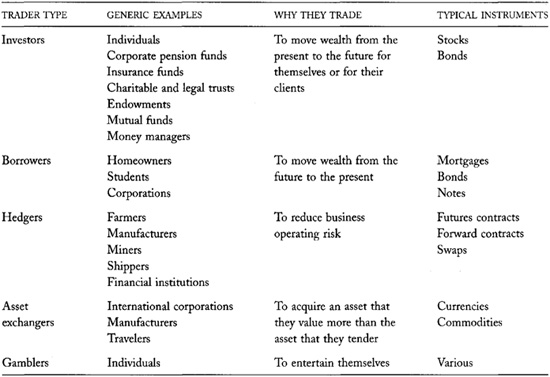

Many buy-side institutions are pension funds, mutual funds, trusts,
endowments, and foundations that invest money. These institutions are
known collectively as *investment sponsors*. Investment sponsors
frequently employ *investment advisers* to manage their funds.
Investment advisers are also called *investment counselors, investment
managers*, or *portfolio managers*. Investment advisers often employ
traders to implement their trading decisions. These traders are
*buy-side traders*. The people and institutions who will ultimately
benefit from the funds that *investment sponsors* hold are
*beneficiaries*. A summary of buy-side traders appears in [table
3-1](#part0011.html_ch03tab1).

## 3.1.2 The Sell Side

The *sell side* of the trading industry includes dealers and brokers who
provide exchange services to the buy side. Both types of traders help
buy-side traders trade when they want to trade.

*Dealers* accommodate trades that their clients want to make by trading
with them when their clients want to trade. Dealers profit when they buy
low and sell high. We discuss dealers in [chapter
13](#part0024.html_ch13).

------------------------------------------------------------------------

**The Wire in Wirehouse**

Traders often call large broker-dealers *wirehouses*. The word "wire" in
wirehouse once referred to the telegraph. Following its invention,
broker-dealers used the telegraph to collect orders from branch offices
in distant cities. Those who quickly adopted it were able to expand
their businesses substantially and thereby greatly increase their
profits. The ability to communicate quickly was---and remains---very
important in the trading industry. 

------------------------------------------------------------------------

In contrast, *brokers* trade on behalf of their clients. Brokers arrange
trades that their clients want to make by finding other traders who will
trade with their clients. Brokers profit when their clients pay them
commissions for arranging trades with other traders. We discuss brokers
in [chapter 7](#part0015.html_ch07).

Many sell-side firms employ traders who both deal and broker trades.
These firms therefore are known as *broker-dealers* or *dual traders*.

The sell side exists only because the buy side will pay for its
services. We therefore must understand why the buy side trades before we
can understand when the sell side is profitable. We consider how and why
both sides trade in subsequent chapters. [Table
3-2](#part0011.html_ch03tab2) provides a summary of the sell
side of the trading industry.

## 3.2 TRADE FACILITATORS

Many institutions help traders trade. We introduce exchanges, clearing
and settlement agents, depositories, and custodians in this section.

### 3.2.1 Exchanges

*Exchanges* provide forums where traders meet to arrange trades.
Exchange traders may include dealers, brokers, and buy-side traders.
Only members can trade at most exchanges. Nonmembers trade by asking
member-brokers to trade for them. Historically, traders met on exchange
floors. Now, at many exchanges, traders meet only via electronic
communications networks.

**TABLE 3-2.**\
The Sell Side of the Trading Industry

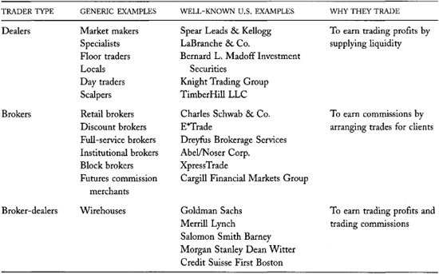

Some exchanges only provide a forum where traders meet to arrange their
trades as they see fit. Other exchanges have *order-driven trading
systems* that arrange trades by matching buy and sell orders according
to a set of rules. These exchanges may use
computers, clerks, or their member-traders to process orders.
Order-driven exchanges are essentially brokerages because they arrange
trades for their clients. Exchanges and brokerages therefore often
compete with each other.

Some U.S. equity trading systems are known as *electronic communications
networks* (ECNs). These are order-driven trading systems that are not
regulated as exchanges. Brokerages, dealers, or other entities may own
them. The most important ECNs are Island ECN, Instinet, REDIBook,
Archipelago, and Bloomberg Tradebook. Many ECNs are in the process of
registering to become exchanges.

Exchanges once were owned and controlled by their members. Membership
organizations, however, tend not to be nimble competitors. Conflicts
among members and cumbersome governance mechanisms often ensure that
membership organizations cannot innovate quickly. To compete more
effectively with ECNs, brokerages, and other exchanges, many exchanges
have converted, or are in the process of converting, to corporate
ownership. With corporate ownership, they hope to obtain highly
motivated, empowered, entrepreneurial management. The Nasdaq Stock
Market, the Chicago Mercantile Exchange, the Stockholm Stock Exchange,
the Toronto Stock Exchange, and the Deutsche Börse are examples of
exchanges that have recently demutualized.

Not all trading takes place at exchanges. In many markets, dealers and
brokers arrange trades *over the counter*. The corporate bond market is
an example of a large market in which almost no trading takes place at
organized exchanges.

### 3.2.2 Clearing and Settlement Agents, Depositories, and Custodians

Several agencies facilitate trading by helping traders settle the trades
they have arranged. They also prevent problems that can arise when some
traders are not trustworthy or creditworthy.

#### 3.2.2.1 Clearing Agents

When traders arrange trades on exchange floors or over the telephone,
the buyers and sellers both make a record of their trades. They record
the terms of their trades and the identities of the traders with whom
they traded. To settle their trades, buyers and sellers must compare
their records. In most markets, traders submit their records to a common
clearing agent to facilitate these comparisons. The *clearing agent*
matches the buyer and seller records and confirms that both traders
agreed to the same terms. Once trades are cleared, traders then settle
their trades. The largest securities clearing agency in the United
States is the *National Securities Clearing Corporation* (NSCC).

A trade *clears* if the buyer and seller both report that they traded
with each other, and their reported terms of trade are identical. If the
records do not match exactly, the clearing agent reports the
discrepancies to the traders, who then try to resolve them. In the
futures markets, such trades are called *out-trades*. In the securities
markets, they are called *DKs* (for *Don't Know*).

Clearing is a trivial exercise when automated order-matching systems
arrange all trades. Since these systems know everything about the trades
they arrange, they always report matched trades.

------------------------------------------------------------------------

**T+5 and Counting Down**

Brokers and regulators would like to settle security trades as quickly
as possible in order to minimize trader exposure to credit risks. During
the time between the negotiation of a trade and the time it settles,
prices can change substantially. The side that is hurt by the price
change then may be unable or unwilling to settle the trade. Such
failures can be quite painful to the other side. Traders minimize
failure risk by settling their trades quickly. Until June 1995, the U.S.
securities industry settled stock and bond trades on T+5. It now settles
trades on T+3. Starting in June 2005, the industry intends to settle on
T+1. T+1 settlement will require most traders to deposit money and
certificates with their brokers before they trade, to ensure that they
can settle the next day. 

------------------------------------------------------------------------

#### 3.2.2.2 Settlement Agents

Settlement agents help traders settle their trades. They receive cash
from buyers and securities from sellers. When both sides have performed,
the settlement agent gives the cash to the seller and the securities to
the buyer.

Traders use settlement agents because the agents are very efficient at
settling trades, and because they can help them avoid the losses that
can arise if they trade with an untrustworthy or uncreditworthy trader.
In the real estate markets, settlement agents are called *escrow
agents*. Since clearing and settlement are closely related, the National
Securities Clearing Corporation is also, not surprisingly, the largest
U.S. securities settlement agency.

Much of the efficiency in the settlement process is due to net
settlement. Under *net settlement*, for each client, the settlement
agent nets the buys and sells in each security to a single net security
position. The settlement agent also nets all money credits and debits
into a single net money position for each client. The agent then settles
only the net positions. Through netting, the settlement agency can
vastly reduce the number of transactions necessary to settle trades. Net
settlement works best when all traders use the same settlement agent.

In U.S. securities markets, *normal-way settlement* occurs three
business days after trades are arranged. Such settlement is called *T+3*
settlement. Almost all transactions settle on T + 3. Traders can also
arrange special settlement on other days. The most common special
settlement instruction is *cash settlement*, which occurs on the day of
the trade.

#### 3.2.2.3 Clearinghouses

Many futures, options, and swaps markets have clearinghouses associated
with them. The *clearinghouses* clear and settle all trades in these
derivative contracts. They also usually guarantee that both parties will
perform on their contracts. They do this by acting as buyer for every
seller and as seller for every buyer. They therefore are the issuers and
guarantors of their contracts.

Clearinghouses generally are owned by *clearing members*, who are
jointly responsible for settling all trades. Traders who are not
clearing members must have a clearing member guarantee the settlement of
their trades. If a trader fails to settle a trade, his clearing member
must do so. If a clearing member fails to settle a trade---usually due
to bankruptcy---the clearing-house can tax its other members to settle
the trade. The clearinghouse is therefore like a mutual insurance
company.

Since losses can be quite significant, clearinghouses pay very close
attention to the credit quality of their members and to the potential
settlement risks that they can impose upon other traders. To control
these risks, clearinghouses require that their members post collateral
called *margins* to secure their obligations, provide timely information
about their financial conditions and their trading activities, and not
exceed positions limits that the clearinghouse establishes for them. The
exchanges do not allow members to trade without approval from the
clearinghouse.

In futures markets, final settlement takes place when the contracts
mature. After every trading day, traders also make an intermediate
settlement of their accounts in which they transfer profits earned that
day from losers to winners. Brokers make these transfers to and from
their customers' margin accounts through the intermediation of the
exchange clearinghouse. These *variation margin* adjustments ensure that
the incentives to default on a contract do not grow as prices move
against a losing position.

------------------------------------------------------------------------

**The Brazilian Straddle**

A trader has a *straddle* when he holds positions in two different types
of instruments. The risks in the two instruments often offset each other
so that the combined position is less risky than either position held
alone. In the options markets, a straddle consists of a position in a
put and an offsetting position in a call.

Technically bankrupt traders present a special problem to the firms that
guarantee their trades. Traders are *technically bankrupt* when they no
longer have enough wealth to settle their trades. If prices do not
change in their favor, they soon will be forced into actual bankruptcy.

When traders know that they are technically bankrupt, they have nothing
to lose by massively increasing their positions. If prices change so
that their positions make money, they may escape their financial
problems. If prices change against them so that they lose even more,
those who guarantee their trades will suffer the losses.

A trader who uses this strategy is said to hold a Brazilian straddle. A
*Brazilian straddle* consists of a large market position held against a
oneway airline ticket to Brazil in the breast pocket. If the market
position proves profitable, the trader sells the ticket and comes back
to trade tomorrow. If the trader continues to lose, he runs off to
Brazil and leaves his clearing member to clean up the resulting mess.

Clearing members must carefully monitor the traders who clear through
them to ensure that their customers do not try to play the Brazilian
straddle. To avoid the problem, they require that their customers report
their positions frequently during the day. They also require that their
customers make margin payments within the day when prices move
substantially against their positions. Finally, when they determine that
their customers cannot settle their trades, they prohibit them from
trading.

Clearing firms also execute contracts with their customers that allocate
any profits earned by technically bankrupt customers to the clearing
firm if the customer did not report the problem. This provision takes
the profit out of the successful Brazilian straddle. It works, however,
only if the clearing firm detects the bankruptcy. \$

------------------------------------------------------------------------

------------------------------------------------------------------------

**A Typical Set of Relationships**

A large state pension fund receives money from the state treasury to
hold and invest for its beneficiaries. The pension fund deposits the
money in its account at its custodian bank. It also notifies its
investment adviser that it has money available for investment.

A portfolio manager who works for the investment adviser considers how
to best invest the funds. The manager considers the portfolio that the
sponsor presently holds, the expected pension liabilities that the fund
must satisfy, and the investment opportunities that the adviser believes
it can identify. The manager decides to buy 30,000 shares of Cisco
Systems.

The portfolio manager contacts his firm's buy-side trader---a fellow
employee---and instructs her to buy 30,000 shares of Cisco Systems. She
then issues an order to the state pension fund's broker to buy the
shares. For political reasons, the state pension fund may direct its
investment adviser to use brokers domiciled in the state when trading on
its behalf.

The broker calls a dealer and arranges the trade. The dealer sells the
shares to the pension fund out of its inventory. The dealer and the
broker both report the trade to the National Securities Clearing
Corporation (NSCC). The broker also reports the trade to the pension
fund and to the investment adviser. Three days later, on instructions
from the dealer and the pension fund, NSCC settles the trade. The
custodian bank sends money to the pension fund's account at the
Depository Trust Company (DTC). The DTC then provides the money to
settle on behalf of the pension fund, and it receives the 30,000 shares
on behalf of the pension fund. 

------------------------------------------------------------------------

------------------------------------------------------------------------

**Straight-Through
Processing**

Trading systems that fully automate the clearing and settlement process
provide *straight-through processing* (STP) to their clients. Traders
like STP because it is cheap and minimizes the potential for errors.

#### 3.2.2.4 Depositories and Custodians

Depositories and custodians hold cash and securities on behalf of their
clients. They help settle trades by quickly delivering cash and security
certificates---when properly instructed---to settlement agents.
Depositories and custodians also help ensure the security of their
clients' assets.

The largest depository in the world is the *Depository Trust Company*
(DTC). DTC holds nearly 20 trillion dollars in assets for its
participants and their clients. It is a subsidiary of the Depository
Trust and Clearing Corporation (DTCC). The other major subsidiary of
DTCC is the National Securities Clearing Corporation (NSCC).

## 3.3 TRADING INSTRUMENTS

The securities, contracts, commodities, and currencies that traders
trade are collectively known as *trading instruments*. Trading
instruments vary by type. They include real assets, financial assets,
derivative contracts, insurance contracts, and gambling contracts.
*Financial instruments* include financial assets, derivative contracts,
and insurance contracts.

This section describes various classes of trading instruments and
special aspects of the markets in which they trade. It also defines some
common trading instruments. A summary of the various classes of
instruments appears in [table 3-3](#part0011.html_ch03tab3).

**TABLE 3-3.**\
Trading Instrument Summary

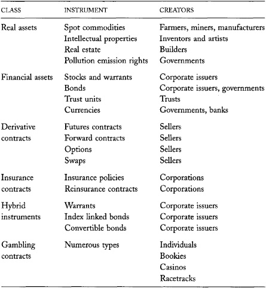

### 3.3.1 Real Assets

*Real assets* include physical commodities, real estate, machines,
patents, and other intellectual properties. Real assets also include
*pollution credits*, which are rights to emit a specified quantity of a
given type of pollution. Real assets are instruments that would appear
only on the asset side of a balance sheet.

The real assets that trade in the most liquid markets are industrial and
precious metals, agricultural commodities, fuels, and pollution credits.
These instruments generally are quite fungible: One unit is very
similar, if not identical, to all other units. Traders in these
commodities generally are more concerned about price than about quality
variations. They usually can easily adjust prices for any quality
variations.

### 3.3.2 Financial Assets

*Financial assets* are instruments that represent ownership of real
assets and the cash flows that they produce. Stocks and bonds are
financial assets because they represent ownership of the assets of a
corporation. Stockholders own the assets of a corporation after all
creditors have been paid off. Bond-holders own the assets of a
corporation if the corporation defaults on its creditors and becomes
bankrupt. Other financial assets include currencies, warehouse receipts
that represent ownership of physical commodities, and trust units that
represent ownership of the assets of a trust.

*Issuers* create all financial assets. Corporations issue stocks, bonds,
and warrants. Governments issue currencies and bonds. Warehouses issue
commodity receipts. Trusts issue trust units. Many securities are called
*issues* because issuers issue them.

Financial assets appear on both sides of a balance sheet. A financial
asset appears as a liability on the issuer's balance sheet and as an
asset on the holders' balance sheet.

Issues trade in *primary markets* when issuers first create and sell
them. Subsequent trading occurs in *secondary markets. New issues*
become *seasoned securities* after they are issued. Traders therefore
trade new issues in primary markets and seasoned issues in secondary
markets. Traders say that primary trading in new equity issues takes
place in the *initial public offering* (IPO) *market*.

Issuers often use the services of *underwriters* to help them sell their
securities. *Underwriters* are broker-dealers at investment banks who
find buyers for the securities. In a *best efforts offering*, the
underwriter acts strictly as a broker. In an *underwritten offering*,
the underwriter guarantees the issuer an offering price. If the
underwriter cannot find buyers for the securities at the offering price,
the underwriter buys them for its own account. In a *fixed-price open
offering*, the underwriter sets a price and buyers subscribe to the
offering. If the offering is oversubscribed, the underwriter conducts a
lottery to allocate the shares. Underwriters generally charge issuers
fees for their services.

Commodities and currencies trade for immediate delivery in *spot
markets*. They trade for future delivery in *forward markets* or
*futures markets*. Farmers, miners, and manufacturers create most
physical commodities, and national central banks create most currencies.

#### 3.3.2.1 Definitions of Some Common Financial Assets

*Equities*

*Stocks* represent ownership of corporate assets, net of corporate
liabilities. Stock values depend on corporate assets, liabilities, and
income. They also depend critically on how
well traders expect corporate managers will use corporate assets in the
future.

------------------------------------------------------------------------

**Stripping Bonds**

When traders want more zero-coupon bonds than are available, zero-coupon
bonds become expensive relative to straight bonds. *Fixed-income
arbitrageurs* then buy straight bonds and *clip* the coupons. They
bundle the coupons by their interest payment dates and sell the bundles
and the remaining final principal payments as zero coupon bonds.

Traders call this process *stripping a bond*. The term comes from a time
when all bonds were bearer bonds. The owners of *bearer bonds* are not
registered with bond issuers. Since issuers cannot keep track of who
owns their bearer bonds, they make interest payments only when the
bondholders present them with interest coupons clipped from the side of
the paper upon which the bonds are printed. The coupons are dated so
that each one corresponds to an interest payment date. The final
principal repayments occur when the bondholders present the now fully
stripped bonds to the issuers. 

------------------------------------------------------------------------

*Preferred stocks* are stocks that pay dividends at contractually
specified rates. Corporations must pay all accrued dividends on
preferred stocks before they can pay any dividends on common stock.

*American depository receipts* (ADRs) are trust units that traders use
to trade foreign stocks in U.S. markets. Each trust holds only the stock
of a single foreign company. ADRs are popular because they allow traders
to avoid international settlement problems.

*Exchange-traded funds* (ETFs) are mutual funds that trade at exchanges.
They have become extremely popular in recent years. Most ETFs are *index
funds* that try to mimic the returns of a market or industry index.

*Real estate investment trusts* (REITs) are trusts that own real estate.
By *securitizing* real estate, they allow investors and speculators to
trade real estate interests like common stock shares.

*Debt Instruments*

*Bonds* are debt securities issued by corporations, governments, and
occasionally individuals. Debtors create bonds when they borrow money.
Bond values depend on interest rates, issuer creditworthiness, assets
pledged as collateral, and attached options. Traders usually quote bond
prices as a percentage of their *par value*. For example, the price of a
million-dollar Treasury bond quoted at 97 is 970,000 dollars.

A *straight bond* is a bond that pays interest periodically until it
matures. At maturity, the issuer redeems the bond for its *principal* or
*face value*. Straight bonds usually do not have attached options.

*Credit quality*, the probability that a bond issuer will make all bond
payments when they are due, greatly concerns bond investors. Investors
expect that the issuers of *investment grade bonds* will make all
interest and principal payments on time. The interest and principal
payments on *junk bonds* are less certain. The latter are also called
*high yield bonds* because investors require high yields to compensate
for the probability that the issuers will default on their payments. The
credit quality of a bond depends on the financial strength of its issuer
and upon that collateral and bond covenants that the issuer uses to
secure the bond.

*Treasury bills, Treasury notes*, and *Treasury bonds* are debt
securities issued by a country. Bills normally mature in one year or
less. Notes normally mature two to five years after they are issued, and
bonds normally mature ten or more years after they are issued. Bills do
not pay interest. Instead, they sell at a discount from their *face
value*.

*Zero coupon bonds* pay no interest. They simply return their principal
value at maturity. Since they pay no interest, buyers will buy them only
at a discount from their face value. *Zero coupon bonds* therefore are
also known as *pure discount bonds*. The greater the time to maturity,
the greater the discount. A straight bond is equivalent to a bundle of
zero coupon bonds consisting of one zero-coupon bond due on each
interest payment date plus a zero-coupon bond due when the straight bond
matures. The principal values of the various bonds correspond to the
various payments due on the straight bond.

*Commercial paper* is a short-term debt security issued by a
corporation. Commercial paper usually matures in nine months or less
from the date it is issued.

*Mortgage-backed securities* are bondlike
instruments which receive the mortgage payments that borrowers make on
their mortgages. The securities are backed by a specified set of
mortgages called a *mortgage pool*. Since they receive the mortgage
payments as they are paid, they are examples of *pass-through
securities*.

------------------------------------------------------------------------

**Toxic Waste**

The riskiest CMO tranches are called *toxic waste* because no one wants
to hold them. They typically sell at highly discounted prices. Foolish
people often pay too much for them because these tranches will realize
very high rates of return if very few mortgage borrowers default on
their obligations. Toxic waste is worthless, however, if too many
borrowers default. The inability of various organizations to fully
appreciate the default risks in toxic waste has led to some spectacular
trading losses. 

------------------------------------------------------------------------

*Collateralized mortgage obligations* (CMOs) are mortgage-backed
securities that divide rights to the cash flows from the mortgage pool
into several different *tranches*. Each tranche has different rights to
the payments that the mortgage borrowers make. Issuers generally
structure the CMO tranches to look like various types of bonds. The
first tranche has the highest claim on the mortgage payments and
therefore is the least risky, When its claims are satisfied, the next
tranche is paid, and so on until the available funds are exhausted. The
last tranche, which is usually called the Z tranche, gets whatever is
left over. It is obviously the most risky tranche. CMOs are also called
*real estate mortgage investment conduits* (REMICs). Companies issue
CMOs to distribute mortgage prepayment risk and interest rate risk among
investors with varying degrees of risk tolerance.

All debt instruments are collectively known as *fixed-income products*.

### 3.3.3 Derivative Contracts

*Derivative contracts* are instruments that derive their values from the
values of the *underlying instruments* upon which they are based. They
are contractual agreements between buyers and sellers that specify the
exchange of certain privileges and liabilities. Derivative contracts
include forward contracts, futures contracts, options, and swaps.

Sellers create derivative contracts when they first sell them.
Derivative contracts therefore are in *zero net supply*. The sum of all
long positions minus the sum of all short positions is always zero.

------------------------------------------------------------------------

**A Tomato Forward**

A tomato forward contract is an agreement between a buyer and a seller
in which the buyer agrees to pay a fixed price for tomatoes that the
seller will deliver in the future. The seller may not own the tomatoes
when they negotiate the contract.

Tomato farmers generally execute forward contracts with food processors.
The farmers obtain fixed prices for their harvests, and the food
processors obtain fixed prices for the tomatoes they must buy to produce
their products. 

------------------------------------------------------------------------

All derivative contracts have an element of *futurity:* Their values
depend on future events. For example, the prices of futures, options,
and forwards all depend on future prices of their underlying
instruments.

Almost all derivative contracts have an *expiration date*. On that date,
traders make final settlement and the contract expires. European traders
refer to this date as the *expiry* of the contract. Contracts that do
not expire are *infinitely lived*. Exchanges and investment banks have
proposed many infinitely lived derivative contracts, but none have been
notably successful.

Derivative contracts may be physically settled or cash settled. A
*physically settled contract* requires that the seller deliver the
underlying instrument to the buyer when obligated to do so. At that
time, the buyer pays cash for the instrument at the agreed price. A
*cash-settled contract* requires that the seller deliver the cash value
of the underlying instrument to the buyer when obligated to do so. At
the same time, the buyer pays the agreed-upon purchase price. In
practice, the traders transfer only the difference between the value and
the price. If the contract is a futures contract, the difference might
be negative. In that case, the seller pays the buyer the difference. If
the contract is an option contract, the difference will never be
negative because contract holders will not exercise their options when
doing so would require that they make additional payments.

Derivative contracts always have a *notional size* or *notional value*.
For physically delivered contracts, the *notional size* is simply the
amount that the seller must deliver. For
cash-settled contracts, a formula specifies the *notional value* that
determines the final cash settlement.

------------------------------------------------------------------------

**The Eurex ODAX Contract**

Eurex trades a cash-settled option contract based on the German
Deutscher Aktienindex (DAX) equity index. The notional value of this
ODAX contract is five euros per index point, or 29,500 euros, given the
5,900 level of the DAX at the end of June 2001.

If you buy an ODAX call option with a strike price of 6,200 for 26.00
euros, you will pay 130 euros for the contract. If the DAX on the
expiration date closes at 6,500, you will make five times the difference
between the closing price and the strike price, or 1,500 euros. If the
DAX remains below 6,200, you will not exercise the option, and it will
expire worthless. 

------------------------------------------------------------------------

Many derivative contracts require that buyers and sellers make
variational margin payments on a regular basis. *Variational margin
payments* transfer money from buyers to sellers or from sellers to
buyers to adjust the prices of their contracts to reflect current market
conditions. This procedure ensures that contract values do not change as
market conditions change. Variation margin payments therefore reduce the
chance that traders will default when their contracts expire.

#### 3.3.3.1 Some Derivative Contract Definitions

*Forward contracts* are contracts for the future sale of some commodity.
The commodity may be a physical commodity, like pork bellies, or a
financial commodity, like a currency. Since these contracts derive their
values from the values of the underlying commodities, they are
derivative contracts.

*Standardized futures contracts* are forward contracts that an exchange
clearinghouse guarantees. Futures traders therefore do not care whether
their counterparts are creditworthy. They only need to consider whether
the clearinghouse is creditworthy. Moreover, since buyers and sellers
trade the same contracts, and since the clearinghouse is a buyer to
every seller and a seller to every buyer, traders can open a position by
buying a contract from one trader and close the position by selling it
to someone else. They do not need to buy and sell with the same trader
to offset their positions.

An *option* represents the right---but not the obligation---to do
something. *Option contracts* give their holders the option to buy or
sell an underlying instrument (or, in the case of a cash-settled option,
the cash value of an underlying instrument) at a fixed price. The
*writer* of the option is the trader who sold the contract. The option
is *written upon* the *underlying instrument*. A *call option* is an
option to buy at a fixed *strike price*. A *put option* is an option to
sell at a fixed strike price. If the option holder can exercise the
option any time before the *expiration date*, it is an *American-style
option*. If the holder can exercise only on the expiration date, it is a
*European-style option*. Since option contracts depend on underlying
security values, they are *derivative contracts*.

A *futures option contract* is an option contract written on a futures
contract. The holder of a call option on a futures contract has the
right to purchase a futures contract at a specified strike price.
Likewise, the holder of a futures put option has the right to sell a
futures contract at a specified strike price. Futures option contracts
trade at the exchange where the underlying futures contracts trade.

------------------------------------------------------------------------

**Variation Margin Example**

Brad buys a 5,000-troy-ounce silver futures contract for 4.50 an ounce
from Sharon at the COMEX division of the New York Mercantile Exchange
(NYMEX). The NYMEX Clearing House guarantees that both traders will
perform on the contract. On the next day, the price of silver rises by 5
cents. The NYMEX Clearing House requires that Sharon pay it 250 dollars
(5,000 ounces times 0.05 dollar per ounce) in variation margin.
Simultaneously, the Clearing House pays Brad 250 dollars in variation
margin. If the price of silver is the same when the contract expires,
Brad will pay 4.55 an ounce for the silver, and Sharon will receive 4.55
an ounce. 

------------------------------------------------------------------------

*Swaps* are contracts for the exchange of two future cash flows. A *cash
flow* is a series of payments. An *interest rate swap* provides for the
exchange of a future series of fixed-rate interest payments for a future
series of variable floating-rate interest payments. When they enter the
contract, the traders negotiate the fixed-rate payments and agree upon a
formula for computing the future variable-rate payments. A *currency
swap* provides for the exchange of a future series of fixed payments in
one currency for a future series of payments in another currency. Since
the values of these contracts depend on the values of the cash flows
that the traders swap, swaps are *derivative contracts*.

------------------------------------------------------------------------

**The Third Order
Derivative of LIFFE**

The London International Financial Futures and Options Exchange (LIFFE)
trades a euro interest rate swap futures contract called the Swapnote.
This is a cash-settled futures contract that prices the expiration day
value of a standard bond-pricing formula for a hypothetical fixed-rate
bond. The hypothetical bond consists of a series of notional fixed 6
percent interest payments followed by the return of the notional
principal at the maturity of the hypothetical bond. The pricing formula
uses discount rates that are derived from the *swaps yield curve*, which
is computed from ISDA Benchmark Euribor Swap Rate fixings. The Swapnote
futures contracts thus derive their values from prices in the swaps
market.

LIFFE also trades options on Swapnote futures. The Swapnote futures
option is a derivative on a derivative on a derivative. (It is an option
contract on a futures contract based on swaps contract prices.)

*Source: [[www.liffe.com](http://www.liffe.com)]*

------------------------------------------------------------------------

*Swaptions* are options on a swap contract. A trader who owns a swaption
call has the right to buy a swap at the specified strike price.

------------------------------------------------------------------------

**Why Discuss Gambling Contracts?**

Although we do not normally consider gambling contracts to be
securities, the same economics that govern traditional securities
markets also govern gambling markets. The close analogy between the two
markets is both useful and harmful. It can be a source of powerful
economic intuition, but it also has been the source of many important
public policy problems. We will consider the role of gamblers in the
markets throughout this book. 

------------------------------------------------------------------------

### 3.3.4 Insurance Contracts and Gambling Contracts

*Insurance contracts* and *gambling contracts* are instruments that
derive their values from the outcomes of future events. For example, the
value of a fire insurance contract on a building depends on whether the
building burns down. The value of a point spread bet on the Lakers
depends on whether they win their basketball game by more than the
specified point spread.

The distinction between an insurance contract and a gambling contract
depends on the reasons why people buy them. People who are concerned
about the loss that they would experience if some future event takes
place buy insurance contracts. Such traders are called *hedgers*.
Gambling contracts are arranged by people who have no other financial
stake in the underlying event. People arrange gambling contracts for
entertainment, whereas they arrange financial contracts to raise capital
and reallocate risk.

Like derivative contracts, insurance contracts and gambling contracts
have an element of futurity. They are also in zero net supply.

Whether the future price of an instrument is equal to some specified
value is itself a future event. Derivative contracts therefore are
contracts whose values depend on future events. We therefore can
classify derivative contracts as insurance contracts or gambling
contracts. In fact, many hedgers use derivative contracts to insure
against risks that they face, and many traders use derivative contracts
to gamble on future events in which they have no financial interest.

### 3.3.5 Hybrid Contracts

Some trading instruments defy easy classification because they embody
elements of more than one type of instrument. For example, some oil
companies issue oil-linked bonds. The interest that they pay depends on
the price of oil. These bonds are financial assets because they
represent ownership of the assets of the firm in the event of
bankruptcy. They also are derivative contracts
because they derive at least part of their value from the price of oil.

------------------------------------------------------------------------

**Shall We Quibble?**

The distinctions between real assets, financial assets, derivative
contracts, insurance contracts, and gambling contracts are somewhat
arbitrary:

• Any instrument that defines a relation between a buyer and a seller is
a contract. For example, a bond is a contract between bondholders (the
buyers) and an issuer (the seller). We reserve the term "contract" for
agreements that define a continuing relation between generally unrelated
buyers and sellers.

• We could consider anyone who sells a contract an issuer. We reserve
the term "issuer" for instruments that only one seller---typically a
corporation---can create.

• All issues are in zero net supply if we count short positions of
issuers. We reserve the term "zero net supply" only for contracts that
public traders can create by selling.

• Virtually all instruments have an element of futurity because the
value of anything that is not immediately perishable depends in large
part on future events. For example, the value of cattle sold on the spot
market depends on the future prices of meat, leather, and milk, and on
the future prices of alfalfa, energy, and veterinarian services. We
apply the term "futurity" only to contracts that settle in the future.

• All instrument values are correlated to some extent. For example,
stock values are correlated with bond values because the discount rates
that analysts use to value stocks depend on interest rates. These
observations suggest, then, that we could classify stocks as derivative
instruments. We reserve the term, however, for instruments whose values
depend directly on other instrument values through some contractual
mechanism rather than indirectly through common valuation factors.

• Precious metals like gold and silver are such close substitutes for
money that many people consider them financial assets as well as real
assets. Let's not quibble over this one. 

------------------------------------------------------------------------

An *equity warrant* issued by a corporation is another example of a
hybrid contract. *Warrants* are options that allow the holder to
purchase stock at a specified price from the issuing corporation at some
time in the future. Since a corporation issues them, and since they
represent ownership of the assets of the corporation under certain
circumstances, they are financial assets. Since their value depends on
the value of the underlying stock, they are like derivative contracts.

Convertible bonds are also hybrid contracts. The holder of a
*convertible bond* can exchange it for stock under some circumstances. A
convertible therefore is the combination of a straight bond plus an
option to exchange the bond for stock. The straight bond is a financial
asset. The option gives the convertible bond derivative properties
because its value depends on the values of the straight bond and of the
stock.

## 3.4 WHERE ARE THE TRADING MARKETS?

We briefly survey trading markets in this section. The main points to
identify are the following:

• Stocks represent less wealth than the
widespread attention given to them by the media would suggest.

• Trading volume depends in part on the number of available instruments.
Markets with a great number of different instruments are often quite
illiquid.

• Exchanges everywhere have been consolidating.

We first characterize trading in various instrument classes. Then we
discuss where trading occurs in each instrument class.

### 3.4.1 The Magnitude of Trading

Organized markets appear throughout the economy. [Table
3-4](#part0011.html_ch03tab4) characterizes the relative
importance of the various types of traded instruments in the United
States. Despite the tremendous attention given to the stock market in
the media, stocks represent only about 20 percent of the capital wealth
of the country. Most of the wealth is in real estate, which rarely
trades, and in various types of bonds. Derivative contracts represent no
wealth because they are all in zero net supply and do not represent
ownership of real assets.

The major national exchanges in the United States list about 8,250
stocks, of which only a fraction trade actively. At the NYSE, the 250
most active stocks accounted for 62 percent of the total reported
trading volume, and a larger percentage of the total dollar volume, in
2000. When trading the most active stocks, public traders often trade
with other public traders. Otherwise, public traders often trade with
sell-side dealers. Most trades are small retail trades; large
institutional traders account for most share volume.

**TABLE 3-4.**\
U.S. Markets by Instrument Class

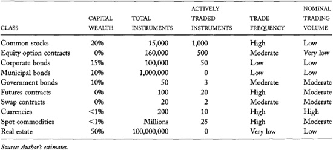

Although listed option contracts do not trade for most stocks, the
number of listed option contracts far exceeds the number of stocks. For
each option-eligible stock, options exchanges list many put and call
options for various expiration months and for various strike prices.
Very few option contracts trade frequently, however. The most frequently
traded options are current month calls on actively traded stocks for
which the strike price is close to the stock
price (at-the-money options). Public traders sometimes trade these
contracts with each other, but they typically trade with dealers when
they buy or sell options.

------------------------------------------------------------------------

**The New York Stock Exchange's Quantitative Listing Standards
for Domestic Companies**

Domestic companies that wish to list with the New York Stock Exchange
must meet all of the following quantitative listing standards:

1\. The company must have at least 2,000 U.S. shareholders that each
hold at least one round lot, or it must have at least 2,200 shareholders
and monthly average trading volume of at least 100,000 shares over the
last six months, or it must have at least 500 shareholders and average
monthly trading volume of at least 1 million shares over the last 12
months and at least 1.1 million publicly held shares.

2\. The publicly held shares of the company must have an aggregate
market value of at least 100 million dollars, or 60 million dollars if
the company is listing at the time of its initial public offering.

3\. The company must meet at least one of four alternative financial
standards. These standards are quite detailed. We therefore consider
only the first one: Pretax earnings must total at least 2.5 million
dollars in the latest fiscal year, together with 2 million dollars in
each of the preceding two years; or 6.5 million dollars in the aggregate
for the last three fiscal years, together with a minimum of 4.5 million
dollars in the most recent fiscal year, and positive amounts for each of
the preceding two years. 

*Source: NYSE Listed Company Manual at
[[www.nyse.com/listed/listed.html](http://www.nyse.com/listed/listed.html)],
quoted on June 6, 2001*.

------------------------------------------------------------------------

The large number of corporate and municipal bond issues ensures that
most issues hardly ever trade. Highly secure bonds are very good
substitutes for each other when the bonds have similar financial terms.
Managers of portfolios that hold high-quality investment grade bonds
therefore are less concerned about the specific bonds they buy than
about their financial terms. Since many fixed-income portfolios hold
their bonds until maturity, some bond issues never trade again after
they are first issued. The buy side trades bonds almost exclusively with
dealers because the public buyers and sellers rarely simultaneously want
to trade the same bond issue. When they do, they rarely know of each
other's interest.

Government bond issues are far less numerous than corporate and
municipal bond issues. They are also far larger. The tremendous size of
these issues and the widespread interest in these securities make these
markets extremely liquid. Although the public often trades government
bonds with dealers, buy-side traders increasingly trade directly with
other buy-side traders in new electronic trading systems.

Some of the world's most liquid instruments trade in futures markets.
Contracts on major agricultural, industrial, and financial commodities
are extremely useful to hedgers throughout the economy. The contracts
also interest many speculators. Trading by hedgers and speculators, and
trading among the dealers who serve them, generate very large volumes in
many futures markets.

------------------------------------------------------------------------

**Some Regional Exchange
Trivia**

The Cincinnati Stock Exchange was founded in Cincinnati in 1885.
Following adoption of the 1975 amendments to the Securities Exchange Act
of 1934, it became the first U.S. electronic stock exchange. Its members
now trade exclusively from their offices. The Exchange's computers
reside in Chicago in the same building occupied by the Chicago Stock
Exchange.

The Chicago Stock Exchange (CHX) was founded in 1882. It merged with
exchanges in St. Louis, Cleveland, and Minneapolis/St. Paul to form the
Midwest Stock Exchange in 1949. This name explains why its market
quotation symbol is M. The Midwest Stock Exchange changed its name back
to Chicago Stock Exchange in 1993. Measured by dollar trading volume,
the CHX is the third largest stock exchange in the United States after
the NYSE and Nasdaq. The CHX has aggressively used its unlisted trading
privileges to trade Nasdaq stocks.

The merger of the San Francisco Stock and Bond Exchange (founded in
1882) and the Los Angeles Stock and Oil Exchange (founded in 1899)
formed the Pacific Stock Exchange in 1957. It later changed its name to
the Pacific Exchange (PCX). Following the merger, PCX maintained
separate trading floors in Los Angeles and San Francisco where competing
specialists traded the same stocks. To save money, the PCX closed its
equity floors in 2001 and 2002, and allowed its traders to trade from
their offices. In 2000, PCX entered a joint venture agreement with the
Archipelago ECN to form a fully electronic exchange called Archipelago
Exchange. After the SEC approved its application for exchange status in
October 2001, the PCX moved its equity trading to the Archipelago
Exchange in 2002. 

------------------------------------------------------------------------

The most important world currencies trade in extremely liquid markets.
Volumes are high because international trade and cross-border capital
transactions generally require currency conversions. The structure of
currency markets also ensures that dealers trade several times with each
other for every trade that they make with a client.

Real estate trades in brokered markets because every parcel is unique.
The difficulties that buyers and sellers have finding each other make
the real estate market the least liquid of the markets we have
discussed. Electronic multiple listing services have lowered trader
search costs, but these costs are still very high. Clearing and
settlement in real estate markets is also quite expensive because the
trades usually are large, complex, and among traders who do not have
standing credit relationships.

### 3.4.2 Stock Markets

Corporations apply to exchanges to *list* their stocks. Exchanges
generally list all companies that meet their listing standards and that
pay their *listing fees*. All but the smallest publicly traded stocks
are listed for trading at one or more markets.

The *listing standards* of an exchange generally require that its listed
companies meet specified minimum standards for capital value, numbers of
shareholders, and financial strength. Most exchanges also require listed
companies to report their accounts regularly according to *generally
accepted accounting practices* (GAAP). Some exchanges also regulate the
control structures of their listed companies. *Control structure* refers
to how the shareholders elect the board of directors who appoint the
managers and set company policy. The NYSE, for
example, devotes considerable resources to regulating corporate control
structures.

------------------------------------------------------------------------

**Double- and Triple-counting Volumes**

The volume figures that markets report often are not directly
comparable. Trading systems that match public buyers directly to public
sellers generally report lower volumes than do trading systems in which
dealers act as intermediaries between public traders. For example, a
100-share trade between a public buyer and a public seller creates 100
shares of volume at the NYSE. If the same trade took place in Nasdaq
with the intermediation of a single dealer, the total volume would be
200 shares: 100 shares when the dealer bought from the public seller and
100 more shares when the dealer sold to the public buyer. Even greater
volume results when more than one dealer is involved. If Dealer A buys
from the public seller, Dealer B sells to the public buyer, and Dealer B
buys from Dealer A, the market will report 300 shares.

Although both markets will accurately report their volumes, the reported
figures will have different meanings. In markets that exclusively match
public buyers directly to public sellers, volume measures only the
trading activity of public traders. In dealer markets, volume measures
the total trading activity of public traders and dealers. In such
markets, volume provides only indirect---and sometimes highly
inflated---information about the activity of public traders.

Some markets also count volume that other markets report. For example,
Nasdaq reports all volume that Nasdaq broker-dealers report. Some Nasdaq
broker-dealers, however, run trading systems that separately match
buyers to sellers. Their reported trading volume thus overstates total
trading volume because they count the same trades twice.

The *World Federation of Exchanges* (WFE) classifies markets by how they
count their volumes. *Trading System View* (TSV) markets count only
transactions that pass through their trading systems or that occur on
their trading floors. *Regulated Environment View* (REV) markets count
all transactions that are subject to their regulatory supervision. The
WFE classifies the NYSE as a TSV market and the Nasdaq Stock Market as
an REV market. 

------------------------------------------------------------------------

#### 3.4.2.1 The U.S. Stock Markets

The exchange where a corporate stock issue is primarily listed is its
*primary listing market*. The main primary listing markets in the United
States are the New York Stock Exchange, the American Stock Exchange, and
the Nasdaq Stock Market. Stocks listed at the New York Stock Exchange
and the American Stock Exchange are known as *listed stocks*. Nasdaq
stocks were once known as *over-the-counter* stocks, but now they are
simply called Nasdaq stocks.

The New York and American stock exchanges have floor-based trading
systems. Floor brokers arrange trades for their clients on the floor of
the exchange, often with the assistance of dealers who are known as
*specialists*. The Nasdaq Stock Market is an electronic communications
network that allows brokers and dealers to meet each other in a
screen-based environment managed by computers.

Most listed stocks in the United States also trade in one or more
regional stock markets. The *regional exchanges* presently include the
Boston Stock Exchange, the Chicago Stock
Exchange, the Cincinnati Stock Exchange, the Archipelago Exchange, and
the Philadelphia Stock Exchange. Many more regional exchanges once
existed, but after many mergers and failures, only these five remain. In
addition to listed companies, the regional exchanges trade some Nasdaq
stocks under *unlisted trading privileges* granted to them by the U.S.
Securities and Exchange Commission.

U.S. exchange-listed stocks also trade in the *third market*. The third
market includes dealers and brokers who arrange trades in
exchange-listed stocks away from an exchange. These dealers typically
display their quotes on the Nasdaq Intermarket.

Finally, U.S. stocks also trade in various electronic trading systems
known as *alternative trading systems* (ATSs). Registered broker-dealers
sponsor most of these systems. *Electronic communications networks*
(ECNs) are the best-known alternative trading systems. Many alternative
trading systems are essentially electronic exchanges. The term *fourth
market* refers to trading in exchange-listed stocks within these
systems. A summary of the U.S. equity markets appears in [table
3-5](#part0011.html_ch03tab5).

**TABLE 3-5.**\
Some U.S. Equity Markets with 2000 Total Dollar Volumes (billions)

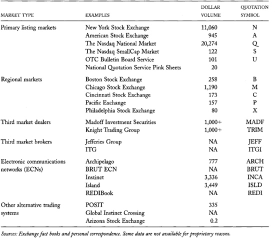

------------------------------------------------------------------------

**Communist Party
Headquarters**

Poland emerged from behind the Iron Curtain in 1989. The government
almost immediately reorganized the Warsaw Stock Exchange, which had
closed in 1939 following Hitler's invasion of Poland. The new exchange
reopened for trading in 1991.

The government first housed the Exchange in the former Communist Party
Headquarters Building. This site was attractive both for its symbolic
value and for its telecommunications infrastructure, which was the best
in Warsaw. 

------------------------------------------------------------------------

#### 3.4.2.2 International Stock Markets

In the late twentieth century, stock markets throughout the world grew
substantially as firms increasingly sought public equity financing
instead of bank loan financing and as governments privatized various
enterprises. Many exchanges consolidated to take advantage of economies
of scale.

Almost all the former Communist countries have established stock
exchanges. They often created these exchanges before they had stocks to
trade, property and bankruptcy laws to define who owns what, and
securities laws to regulate issuers and traders. Despite these
deficiencies, these countries established stock exchanges because they
are symbols of free market economies. Not surprisingly, the most
successful of these markets are in countries that carefully defined
property rights, privatized most of their government-run enterprises,
adopted good securities laws, and diligently enforced those laws.

[Table 3-6](#part0011.html_ch03tab6) presents a summary of
trading activity in the larger national stock markets. Not surprisingly,
trading is most active in countries with strong market-based economies.

### 3.4.3 Equity Options Markets

#### 3.4.3.1 U.S. Markets

Five exchanges in the United States presently trade standardized equity
and index option contracts. The Options Clearing Corporation (OCC) is
the clearinghouse for all contracts that trade at these exchanges.
Buyers therefore can buy contracts at one exchange and sell them at
other exchanges to offset their positions. The most actively traded
option contracts trade at all of the exchanges. A list of these
exchanges appears in [table 3-7](#part0011.html_ch03tab7).

Four of the five options exchanges employ floor-based trading systems.
Each of these exchanges also employs automated systems to support their
dealers and floor brokers. The International Securities Exchange, formed
in 1997, started trading in 2000 with a completely automated trading
system. Its market share has grown very quickly.

Investment banks also trade specialized option contracts *over the
counter* (OTC) with their clients. These contracts usually have strike
prices, maturity dates, settlement terms, or other features that are
different from the standardized options available at the exchanges. This
business is part of the *synthetic derivatives business*. Synthetic
derivatives also include other *structured products*---primarily
swaps---that investment banks create for their clients.

#### 3.4.3.2 International Equity Derivatives Markets

Exchange-traded equity derivatives include stock option contracts,
equity index option contracts, equity index futures contracts, options
on equity index futures contracts, and futures on individual stocks.
[Table 3-8](#part0011.html_ch03tab8) provides a
characterization of organized trading in equity derivatives throughout
the world.

Outside of the United States, most organized trading in standardized
stock option contracts takes place at the same exchange at which the
underlying stocks trade. In the United States, the SEC has not permitted
equities and their associated options to trade side by side. When they
trade at the same exchange, they generally trade in different rooms.

Most organized trading in equity index futures outside of the United
States also takes place at the same exchange at which the underlying
stocks trade. In the United States, these contracts trade on futures
exchanges.

**TABLE 3-6.**\
Trading Activity in Some International Stock Markets (2001)

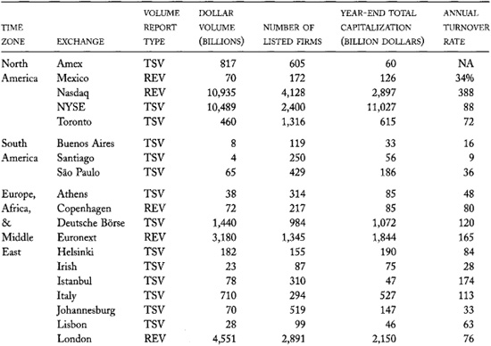

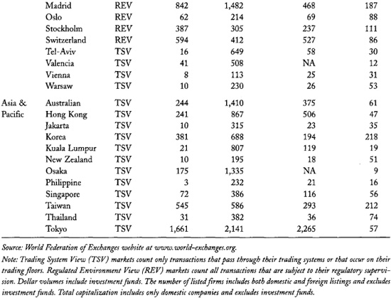

------------------------------------------------------------------------

**Some International Stock
Market Trivia**

Teléfonos de México, S.A. de C.V. (Telmex) is the largest Mexican stock
issue. The New York Stock Exchange, however, has a greater share of its
worldwide trading volume than does the Bolsa Mexicana de Valores.

By capitalization and trading volume, the largest Israeli stock market
is the U.S. Nasdaq Stock Market. Many high-tech Israeli companies do not
list their shares at the Tel Aviv Stock Exchange.

The Stock Exchange of Hong Kong uses an electronic trading system to
match buyers to sellers. However, until recently, the Exchange required
its members to sit in the Trading Hall of the Exchange to trade. The
Trading Hall is a large room filled with members and their clerks,
seated at desks upon which sit computer screens and telephones. Members
now also can trade through off-floor trading devices in their offices.

Chinese law requires that all trading in securities listed at the
Shanghai Stock Exchange take place at the Exchange, and all shares held
by domestic traders (A class shares) remain on deposit at the Exchange's
depository. Domestic traders who wish to trade at the Exchange must
deposit funds with their brokers before trading. Since all money and
securities are on deposit before the Exchange arranges any trade, the
broker can refuse to accept orders that would produce trades which
traders cannot settle immediately. Although the Exchange once settled
its A share trades on the day of the trade, it now settles them on the
next day (T+1). The Shenzhen Stock Exchange uses similar procedures.

------------------------------------------------------------------------

------------------------------------------------------------------------

**Some Options Market Trivia**

The Chicago Board Options Exchange (CBOE) began trading in 1973 as the
first organized equity options exchange. Although it is a Chicago Board
of Trade subsidiary, it is independently governed, operated, and
regulated.

The New York Stock Exchange, the Midwestern Stock Exchange (now called
the Chicago Stock Exchange), and Nasdaq also created organized options
markets. These markets were not notably successful. The NYSE sold its
options market to the CBOE in 1997. The Midwestern Stock Exchange and
Nasdaq simply closed their options markets.

The Securities and Exchange Commission has not approved *side-by-side
trading* of stocks and their associated options at the same exchange.
Exchanges that trade stocks and their associated options must physically
separate the stock trading from the options trading. 

------------------------------------------------------------------------

------------------------------------------------------------------------

**FLEX Options**

To capture institutional business in specialized options, the options
markets developed *FLEX Options* (Flexible EXchange) for indexes and
E-FLEX Options for equities. Using a special *request for quote* (RFQ)
procedure, institutional traders specify the option type (call or put),
strike price, maturity date (up to three years distant), and exercise
style (American or European) for the option contract in which they are
interested. Exchange market makers then quote the option in a
competitive environment. The Options Clearing Corporation is the issuer
and guarantor of all FLEX and E-FLEX contracts, as it is for all other
options traded at U.S. exchanges. 

------------------------------------------------------------------------

**TABLE 3-7.**\
U.S. Equity Options Exchanges and 2001 Total Contract Volumes (millions)

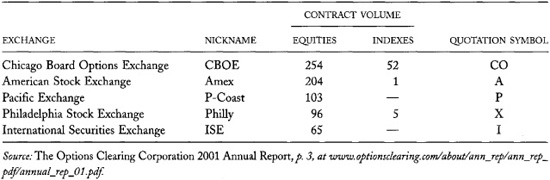

**TABLE 3-8.**\
Contract Volumes in Some World Equity Derivatives Markets in 2000
(thousands)

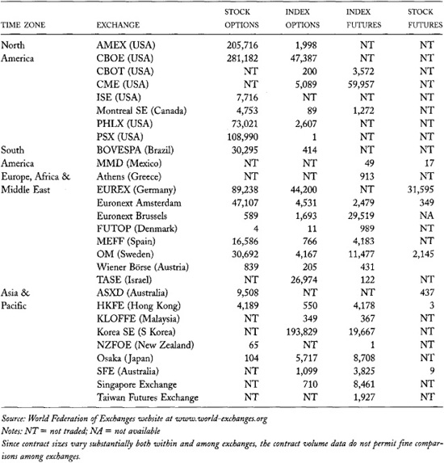

------------------------------------------------------------------------

**An Irony at the NYSE**

For most of its first hundred years, traders at the New York Stock
Exchange---originally known as the New York Stock and Exchange
Board---primarily traded bonds. While they still occasionally trade
bonds, they now primarily trade stocks.

The current NYSE bond market uses an electronic trading system called
the Automated Bond System. This system was one of the first fully
automated systems used in the trading industry. It started automatically
matching orders in 1976.

Although the NYSE is primarily known for its floor-based trading system,
it was among the earliest innovators in electronic trading. 

------------------------------------------------------------------------

Until December 2001, it was illegal to trade futures on individual
stocks in the United States. The Commodity Futures Modernization Act of
2000 now permits trading in these contracts.

### 3.4.4 Futures Markets

Most futures exchanges have their own clearinghouses. Exchanges
therefore do not compete to trade the same contracts. Instead, each
exchange and its associated clearinghouse try to create contracts that
will attract traders. Most exchanges have large research and marketing
departments that design contracts they hope will attract traders.
[Chapter 8](#part0017.html_ch08) identifies some of the
factors that make contracts successful.

Futures exchanges generally trade several contracts that vary by
expiration date for each commodity that they trade. Most commodities
have at least four *delivery months*. The contract that will expire next
is called the *front contract* or *front month contract*. The other
contracts are called the *back contracts*.

In financial and industrial commodities, traders mostly trade only the
front month contract. When it expires, they roll their positions into
the next contract.

The most actively traded agricultural contracts are the front month
contracts and the first harvest contracts. The *first harvest contract*
is the first contract on which traders can deliver the currently growing
crop. Hedgers and speculators usually have great interest in this
contract.

### 3.4.4.1 U.S. Futures Markets

Four major and several smaller exchanges trade standardized futures
contracts in the United States. These exchanges are often called *boards
of trade*. Futures exchanges have experienced substantial consolidation
over the years, as have other markets. [Table
3-9](#part0011.html_ch03tab9) provides a brief summary of the
currently active U.S. futures exchanges.

#### 3.4.4.2 International Futures Markets

[Table 3-10](#part0011.html_ch03tab10) lists global futures
exchanges with the greatest contract volumes in 2001. Unlike U.S.
futures exchanges, many of the exchanges on this list also trade common
equities.

### 3.4.5 Corporate and Municipal Bond Markets

Throughout the world, most corporate and municipal bonds trade *over the
counter* in investment banks or commercial banks. Some stock exchanges
list corporate bonds, but exchange bond trading volumes are generally
trivial compared to over-the-counter volumes. Less than 0.1 percent of
all corporate bond trading volume occurs in the New York Stock Exchange
and American Stock Exchange bond markets. The exchange bond price tables
that appear in many daily newspapers therefore present less reliable
information than you might imagine.

### 3.4.6 Treasury Markets

Most national treasuries conduct public auctions at which they issue
their bills, notes, and bonds. Some smaller nations, however, use
underwriters to issue their securities. Generally, anyone may
participate in Treasury auctions. The auction rules vary by country.

**TABLE 3-9.**\
Active U.S. Futures Exchanges with 2001 Contract Volumes (millions)

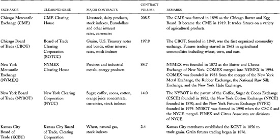

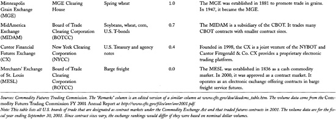

**TABLE 3-10.**\
Top 40 Global Futures Exchanges by Contract Volume in 2001 (millions)

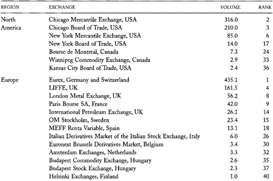

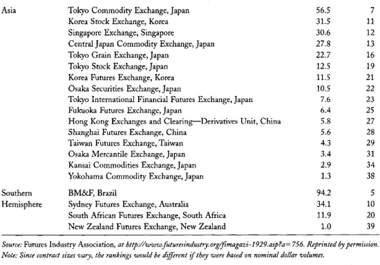

------------------------------------------------------------------------

**They Trade Enormous
Volume but Receive No Year-end Bonuses**

The Federal Reserve conducts U.S. monetary policy primarily through its
*Open Market Operations Desk*. Traders who work at the Federal Reserve
Bank of New York implement the policy. When the Fed wants to add
monetary reserves to the banking system, it buys seasoned U.S. Treasury
bills and bonds, and simply creates the money to pay for them. When it
wants to decrease the reserves, it sells bills and bonds, and simply
destroys the money it receives in payment. Since the reserves have grown
over time, the Federal Reserve is the largest holder of U.S. Treasury
instruments. On June 20, 2001, the Fed held 533 billion dollars of
government debt instruments in its System Open Market Account (SOMA).
The Desk rarely sells securities because bills mature in the SOMA
account every week. When the Fed wants to slow the growth of the money
supply, it merely does not buy as many securities as it otherwise would.

The Federal Reserve trades only with a small set of large institutional
broker-dealers called *primary government securities dealers*. In
exchange for the privilege of dealing with the Fed, these primary
dealers must quote firm prices for large sizes whenever the Fed wants to
trade. In addition, they must participate meaningfully in Treasury
auctions, and they must supply information about market conditions to
the Federal Reserve. As of October 31, 2001, there were only 24 primary
dealers. Most of these were investment and commercial banks.

In 2000, the Fed traders purchased 44 billion dollars of debt on behalf
of the government in unmatched transactions and an additional 4.4
trillion dollars in matched Treasury bill transactions (repurchase
agreements and matched sale-and-purchases). They arrange their trades by
computer from their offices on the ninth floor at the Federal Reserve
Bank of New York.

Since the Federal Reserve banks are not government agencies, their
traders are not civil servants. However, they work under a similar pay
schedule. The Fed traders make only a small fraction of what large
private buy-side traders make. They also do not receive year-end
bonuses.

This salary comparison is not fair, however. The Fed traders are more
like exchange officials than like buy-side traders because they
generally do not negotiate trades and they do not trade throughout the
day. Instead, they merely request bids and offers to fill the Fed's
daily requirements. They then arrange trades with the dealers who offer
the best prices. The Fed traders occasionally also act as brokers for
foreign governments, central banks, and official international
organizations. 

------------------------------------------------------------------------

Secondary trading of Treasury securities occurs primarily over the
counter in investment and commercial banks. Several brokers, however,
organize markets in which government bond dealers and some larger
buy-side traders trade with each other. These *interdealer brokers*
permit their clients to trade on an anonymous basis. Dealers generally
do not want other dealers to know what trades they are doing. The
largest such interdealer government bond broker is Cantor Fitzgerald.
Their government bond markets are among the world's most liquid markets
in any instrument.

### 3.4.7 Swaps and Spot Currency Markets

Swaps and spot currencies mostly trade over the counter in investment
and commercial banks. Some brokers and some data providers organize
markets in these instruments. Traders use their services to lower the
costs of searching for counterparts.

------------------------------------------------------------------------

**Some Wholesale OTC
Brokers**

Reuters is the world's leading foreign exchange broker. Its Dealing 3000
trading system is an anonymous electronic brokerage service that many
foreign exchange traders use. As of August 2001, traders using 7,500
workstations could use the system to trade 38 spot currency pairs and 22
forward currency swaps.

Garban-Intercapital is the world's leading swap broker. The firm
specializes in brokering wholesale trades between dealers and between
dealers and large customers. Its securities, derivatives, and money
brokerage businesses have daily transaction volumes in excess of 200
billion dollars.

Cantor Fitzgerald is the world's leading U.S. government bond broker. In
addition to its fixed-income businesses, it has significant presence in
the equity, foreign exchange, energy, bandwidth, and environmental
markets throughout the world. Before the September 11, 2001, terrorist
attacks destroyed its offices at the World Trade Center, its various
businesses had daily volumes in excess of 160 billion dollars.

Sources: *about.reuters.com/transactions/d3_intro.htm;
[[www.garban.com](http://www.garban.com)];
[[www.cantor.com](http://www.cantor.com)]*.

------------------------------------------------------------------------

------------------------------------------------------------------------

**The Retail Currency Markets**

If you have traveled abroad, you may be an experienced foreign exchange
trader. You probably did not negotiate the terms of your trades,
however, unless you traded in a *black market* in an alley.

Retail foreign exchange markets in airports and tourist areas are
notoriously expensive. Currency dealers usually charge a significant fee
for their transactions. They also profit from the wide spread between
the prices at which they are willing to buy and sell currencies.

The high transaction costs in the retail foreign exchange market are due
to the high rents dealers must pay for their shops at airports and near
tourist sites, to the costly security precautions that ensure they are
not robbed while tending their shops and delivering and collecting
currencies, and to the salaries they must pay clerks, who are often
idle.

Transaction costs in retail currencies dropped significantly with the
introduction of international withdrawals from automatic teller
machines. When you withdraw currency from ATMs, you pay a small access
fee. The exchange rates that you receive are far better than those you
can obtain yourself. Your bank gives you a better rate because it can
consolidate your transaction with many others, and because it has much
more negotiating clout than you do. 

------------------------------------------------------------------------

## 3.5 MARKET REGULATION

*Regulators* create and enforce rules that facilitate trading. Most
traders believe that securities markets work best when they are well
regulated but not excessively regulated. Good regulations help ensure
that traders communicate effectively with each other, that people do not
defraud others, and that all things generally are as they appear.

Regulators sometimes create and enforce rules that promote other
objectives. Such regulations may give privileges---usually protections
from competition---to favored traders, brokers, or exchanges. For
example, regulators often try to protect domestic markets from foreign
competition. They may also try to protect incumbent traders and
incumbent markets from new domestic
competition. Ideologically motivated regulators also may impose
restrictive regulations because they do not like the markets, or because
they want to redistribute wealth. For example, governments sometimes tax
trading to raise money for the national treasury. Regulations that make
it difficult or expensive for traders to arrange mutually beneficial
trades generally harm the markets and the wider economy.

The stated purpose of a regulation often is not its true objective.
Since most people agree that regulation should be in the best interests
of the markets or, at a minimum, in the national interest, regulators
generally justify their regulations with explanations about how they
promote the common good. Through ignorance, self-interest, or malice,
however, regulators often adopt regulations that do not promote the
common good. The knowledge you gain from reading this book will help you
judge the true effects of regulatory policies.

Since regulators set the rules of the game, and since rules help
determine who will be successful, people devote tremendous efforts to
lobbying for rules that they favor. They naturally argue in favor of
high principles, even though they often are actually arguing for their
personal gain. Regulatory debates therefore are often very
controversial.

The controversies that surround regulatory efforts make regulation an
exciting and often frustrating area in which to work. Regulators who
truly want to promote the common good take great satisfaction in the
good regulations that they write and enforce. They suffer great
frustration when they lose regulatory battles to other interests.

### 3.5.1 Regulators

Most countries divide the responsibility for regulating markets among
many agencies. Legislatures enact laws that directly regulate markets.
They generally delegate enforcement of these laws to various public and
private regulatory agencies. Legislatures also enact laws that delegate
their legislative powers to these agencies. These laws authorize
agencies to write regulations that have the force of law. The agencies
then enforce their regulations through judicial proceedings.

Governments usually require that regulatory agencies regulate in the
public interest when they delegate their state powers. The definition of
what is in the public interest, however, may be vague. Regulators
therefore often have significant power to promote their personal
agendas.

#### 3.5.1.1 Governmental Regulatory Agencies

Most countries have created governmental regulatory agencies to oversee
traders and trading practices. These agencies generally are independent
commissions. [Table 3-11](#part0011.html_ch03tab11) shows that
some countries delegate regulatory powers over the markets to ministries
of the executive branch of the government, or to their national central
banks.

***U.S. Regulatory Agencies***

The main U.S. governmental agencies that regulate trading are the
*Securities and Exchange Commission* (SEC) and the *Commodity Futures
Trading Commission* (CFTC). The SEC regulates securities markets
(stocks, bonds, warrants, investment company shares, and trust units),
equity options markets, and cash-settled equity index options markets.
The CFTC regulates commodity spot, forward, and futures markets. Most
countries consolidate these regulatory
functions into a single agency. Concerns over the inefficiencies of
having two agencies perform similar functions have caused many people to
propose merging the two agencies.

------------------------------------------------------------------------

**The SEC Mission**

The *Securities Exchange Act of 1934* created the U.S. Securities and
Exchange Commission. Section 3f of the Act charges the Commission as
follows:

*Whenever pursuant to this title the Commission is engaged in
rulemaking, or the review of a rule of a self-regulatory organization,
and is required to consider or determine whether an action is necessary
or appropriate in the public interest, the Commission shall also
consider, in addition to the protection of investors, whether the action
will promote efficiency, competition, and capital formation*.

Nearly identical text also appears in Section 2b of the Securities Act
of 1933 and in Section 2c of the Investment Company Act of 1940. These
three acts together form the legislative foundation for securities
regulation in the United States.

Although this directive seems quite explicit, it provides no guidance to
regulators confronted with issues that require trade-offs among the
named objectives. For example, rules that prohibit insider trading
protect investors while simultaneously making markets less efficient in
the sense that they produce less informative prices. This directive also
provides no guidance about issues that require trade-offs within the
named objectives. For example, rules that protect the interests of small
investors often hurt large investors. In these cases, regulators
generally freely decide what they believe is in the public interest.

------------------------------------------------------------------------

The SEC and the CFTC write regulations to interpret and implement the
laws that fall within their jurisdictions. The law also allows them to
enforce their regulations through administrative hearings. These
agencies can also ask that the Department of Justice prosecute violators
in the federal courts. Most national regulatory agencies throughout the
world have similar powers.

In addition to their regulatory functions, the SEC and CFTC collect and
disseminate information useful to traders, investors, speculators, and
legislators. The SEC collects various financial reports from issuers and
position reports from large traders. Investors who are interested in
estimating security values can access these reports over the Internet
via the SEC's *Edgar* information retrieval system. The CFTC likewise
collects and publishes information about commodity market supply and
demand conditions and large trader positions. Traders use this
information to value commodities and to forecast what other traders
might do in the future. Both organizations also provide information to
Congress through their regular annual reports, their special reports on
specific issues, their testimony at congressional hearings, and their
responses to requests for information from members of Congress and their
staffs.

Several other governmental organizations also regulate securities
trading in the United States. The Federal Reserve Board sets speculative
margins. *Speculative margins* specify the minimum amount of capital
that traders must have to buy or sell securities and to hold long or
short positions. Traders call these margins *Regulation T margins*, or
simply *Reg T margins* because the Federal Reserve Board specifies them
in its Regulation T. The various states also have securities
commissions. These commissions primarily enforce state antifraud
statutes.

**TABLE 3-11.**\
Selected National Trading and Securities Regulators

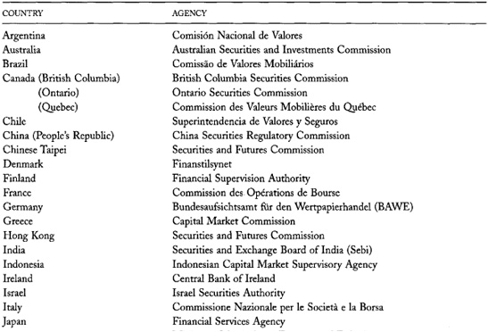

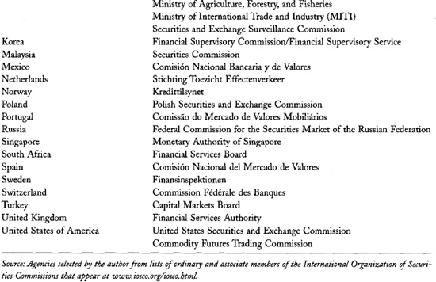

------------------------------------------------------------------------

**Regulatory Competition**

The division of regulatory oversight between the SEC and CFTC has
created numerous conflicts over jurisdiction between these agencies.
These "turf wars" generally occur when markets or issuers create new
trading products that have characteristics of both securities and
commodity contracts. For example, oil-linked bonds *are* like securities
because corporations issue them to obtain financing. They are like
commodity contracts because they derive their value primarily from the
price of oil.

Before 1982, the *Commodity Exchange Act* gave the CFTC authority to
regulate any exchange contract that has an element of futurity. Although
the Securities and Exchange Commission had authorized trading in stock
option contracts, the federal courts were then considering whether the
CFTC was the proper regulator of these contracts.

At the same time, the futures markets wanted to create futures on equity
indexes. The SEC argued that it had regulatory authority over these
contracts because it regulated the underlying instruments.

Chairmen John Shad of the SEC and Phillip McBride Johnson of the CFTC
reached an accord in 1982 to divide regulatory responsibilities between
the two agencies. Their agreement, which Congress enacted into law, gave
the CFTC jurisdiction over futures trading in broad equity indexes and
options on those futures contracts. The SEC obtained exclusive
jurisdiction over options on individual stocks and cash-settled options
on indexes. The chairmen agreed that no futures on individual stocks or
on narrow indexes would trade anywhere. The Commodity Futures
Modernization Act of 2000 amended the law to permit trading in these
previously prohibited futures contracts.

Perhaps the most interesting aspect of the Shad-Johnson accord concerns
the regulation of equity index options. As noted above, the SEC
regulates cash-settled equity index options while the CFTC regulates
futures options on equity index futures contracts. The risks inherent in
these two types of contracts are nearly identical when they are based on
the same underlying index. Two regulatory agencies thus separately
regulate instruments that have essentially identical risk
characteristics.

Some people believe that this redundancy is foolish. Others believe that
the competition between regulators has made both of them more
reasonable. Still others believe that this competition has made both
regulators too lax. 

------------------------------------------------------------------------

#### 3.5.1.2 Self-regulatory Organizations

Private regulatory agencies include exchanges, clearinghouses, and
trader associations. These organizations regulate their members to lower
their costs of doing business together, to improve their business
prospects, to ensure that no member hurts another member, and to provide
quality assurances to their members' clients. Organizations that
regulate their members are called *self-regulatory organizations*, or
SROs.

Exchanges primarily regulate their members' trading practices. Their
rules specify how their members arrange trades and how they should
relate to their clients. We discuss the implications of exchange rules
throughout this book.

Many securities exchanges also regulate their listed firms. For example,
their listing standards generally require a minimum level of financial
reporting.

------------------------------------------------------------------------

**The Buttonwood Tree
Agreement**

The New York Stock Exchange traces its beginnings to an agreement
traders made in 1792 to regulate their commissions and to trade with
each other. According to legend, the traders met under a buttonwood
tree, near what is now Wall Street in lower Manhattan. Their written
agreement---which entered the NYSE archives in 1840---indicates that
they all would charge their clients no less than 0.25 percent commission
for their brokerage services. The full text of their agreement, signed
by 24 brokers and merchants, is as follows:

We the Subscribers, Brokers for the Purchase and Sale of Public Stock,
do hereby solemnly promise and pledge ourselves to each other, that we
will not buy or sell from this day for any person whatsoever, any kind
of Public Stock, at a less rate than one quarter per cent Commission on
the Specie value and that we will give a preference to each other in our
Negotiations. In Testimony whereof we have set our hands this 17th day
of May at New York. 1792.

The New York Stock Exchange stopped regulating brokerage commissions 183
years later, in 1975.

For much of its life, the NYSE prohibited its members from trading
shares in its listed companies away from the Exchange. In response to
pressure from its members and from the SEC, the Exchange gradually
relaxed these restrictions. It repealed Rule 390, its last restriction
on off-exchange trading, in December 1999. 

*Sources: New York Stock Exchange Archives; Securities and Exchange
Commission Release no. 34-42758 at
[[www.sec.gov/rules/sro/ny9948o.htm](http://www.sec.gov/rules/sro/ny9948o.htm)]*.

------------------------------------------------------------------------

Clearinghouses primarily establish capital adequacy standards and
trade-reporting practices for their members. They design their
regulations to ensure that their members and their members' clients will
honor their trading contracts. Their regulations also minimize the
losses that occur when traders fail to settle their contracts.

Trader associations regulate how traders relate to each other and to
their clients. The primary SROs that regulate brokers and dealers in the
United States are the *National Association of Securities Dealers*
(NASD) and the *National Futures Association* (NFA). The law requires
all U.S. futures brokers and dealers to belong to the NFA and to submit
themselves to its regulations. Although the law does not require that
all security brokers belong to the NASD, it is essentially impossible to
do business in the United States without being a member. The NASD and
the NFA both administer a series of exams that traders take to certify
their competence.

SROs enforce their regulations by threatening to expel members who do
not comply. They also enter into contracts with their members that allow
them to sue their members in civil court if they fail to comply with
their regulations. These enforcement mechanisms are most effective when
the costs of compliance are small and the benefits are large. They can
be ineffective, however, when dishonest members can profit greatly from
violating the rules.

To prevent such problems, some governments give SROs the power to write
regulations that have the force of law. The SROs then can rely upon the
criminal justice system to help enforce their regulations. Since
regulators can abuse the power to write regulations, and since
constitutional governments generally cannot
delegate their legislative and judicial powers to private agencies, SROs
must have their rules approved by the government. In the United States,
the various SROs apply to the SEC or CFTC for approval of their rules.
These agencies approve proposed rules if they find that they are in the
public interest.

------------------------------------------------------------------------

**Crying Over Onion Futures**

Commodity markets can be especially volatile when the traded commodity
is perishable. When commodity supplies will soon spoil, their prices
dive if they are in excess supply, and they rocket upward if they are in
short supply.

Onions are quite perishable. They can be stored from harvest to harvest,
but nobody wants an old onion when the new harvest arrives. Prices of
onions for delivery before the new harvest therefore are quite volatile.

In the 1950s, onion futures markets suffered several extreme price
fluctuations that hurt farmers and local dealers. The farmers and
dealers attributed the volatility to speculative trading in the onion
futures market. They complained to their senators, who prevailed upon
their colleagues to solve the problem. In 1958, they complied by
prohibiting all exchange trading in onion futures. It is still illegal
to trade onion futures contracts on, or subject to, the rules of any
board of trade in the United States.

Consequently, the natural beneficiaries of onion futures markets---the
farmers who produce onions and the food processors who use
onions---cannot use futures contracts to cheaply exchange onion price
risk. Instead, they now use forward contracts. 

*Source: U.S. Public Law 85-839 (7 U.S.C. 13-1)*.

------------------------------------------------------------------------

The delegation of regulatory powers from national legislatures to
regulatory nongovernmental agencies allows experts who are most familiar
with the markets and their problems to regulate them. This system helps
avoid the unintended consequences that often result when poorly informed
legislators try to micromanage regulatory policies. It also protects
markets from capricious actions that legislatures occasionally take.
When the system works well, the legislature provides a broad framework
for regulatory oversight, and the regulatory agencies implement this
framework in the public interest.

#### 3.5.1.3 Other Private Regulators

Several private agencies regulate traders, issuers, and investment
managers in the United States. The *Financial Accounting Standards
Board* (FASB) sets accounting standards by which firms must report their
accounts. The SEC, which has ultimate authority for specifying reporting
standards for public firms, has recognized the FASB standards as
authoritative since 1973.

The *Association for Investment Management and Research* (AIMR) sets
performance reporting standards that many investment managers use to
report their results. Although the standards are voluntary, many firms
choose to comply in order to satisfy their clients.

Brokers commonly purchase insurance policies on behalf of their clients
to ensure that their clients will not lose if the brokerage goes
bankrupt. The insurance companies that write these policies regulate the
brokers who purchase these policies in order to minimize the probability
that the brokers will fail, and thus impose costs on their funds.

------------------------------------------------------------------------

**Unintended
Consequences**

In 1997, the Brazilian government imposed a 0.38 percent tax on all
financial transactions in order to raise revenue. The unintended
consequence of this tax was to cause institutional traders to trade
Brazilian stocks as American depository receipts (ADRs) in New York to
avoid the tax. The tax therefore raised less revenue than expected, and
the Brazilian equity markets lost liquidity. Daily trading volume at the
São Paulo Bovespa dropped from 1.2 billion reais (1.08 billion dollars)
a day in 1997 to 350 million reais (136 million dollars) a day in 2001.
Although some of the drop-off undoubtedly was due to the Brazilian
financial crisis of 2001, many of the 32 Brazilian ADRs trade more
volume in New York than in São Paulo. The Brazilian government announced
in September 2001 that stock transactions would be exempt from the tax
in late 2001. 

*Source: Jennifer L. Rich, "Brazil to Exempt Stock Trades from a Tax,"*
New York Times, *September 7, 2001, p. W1*.

------------------------------------------------------------------------

------------------------------------------------------------------------

**Chartered Financial Analysts**

The Association for Investment Management and Research charters
financial analysts. Financial analysts who wish to become a *chartered
financial analyst* (CFA) must pass rigorous examinations that the AIMR
administers over a three-year period. The AIMR bases its examinations on
a curriculum that covers all aspects of financial analysis, investment
management, and corporate finance. The AIMR requires its CFAs to engage
in a continuing education program to maintain their charters. It also
requires that its CFAs uphold ethical standards of behavior. CFAs who
violate those standards risk losing their charters. The AIMR charter
makes CFAs very attractive to employers because it certifies that they
are highly knowledgeable financial professionals. 

*For more information, see
[[www.aimr.org](http://www.aimr.org)]*.

------------------------------------------------------------------------

### 3.5.2 International Regulatory Organizations

Several international organizations try to coordinate market regulation
across national boundaries. Although they cannot easily impose standards
upon their members, they provide useful forums for sharing information
about market structure and for exploring solutions to common regulatory
and operational problems. The most important of these organizations are
the *International Organization of Securities Commissions* (IOSCO), the
*World Federation of Exchanges* (WFE), and the *International Councils
of Securities Associations* (ICSA). These organizations of government
regulatory agencies, exchanges, and dealer associations meet regularly
to discuss issues of interest to their members.

## 3.6 SUMMARY

The trading industry consists of traders who trade instruments in
regulated markets. This short introduction has identified the traders,
instruments, markets, and regulators who operate in this industry.

Although our discussions describe how the trading industry is organized,
we have hardly considered why it is organized as it is. In subsequent
chapters, we will increasingly examine why things are as they are. This
introduction to the trading industry should provide you with the
background for more interesting discussions to come.

## 3.7 SOME POINTS TO REMEMBER

• The buy side buys liquidity services. The sell side provides them.

• Dealers trade for their own account. Brokers trade for others.

• Stocks get more attention than their values would indicate.

• Many markets compete for order flow.

• Exchanges often compete with brokerages to arrange trades.

• Legislatures, regulatory agencies, and SROs regulate the markets.
Legislatures provide the regulatory framework, the SROs provide the
details, and governmental regulatory agencies provide oversight.

• Private regulators try to create respected standards.

## 3.8 QUESTIONS FOR THOUGHT

• What do sell-side and buy-side traders have in common? How do they
differ? Do you expect much labor mobility between these two types of
traders?

• How do brokerages and exchanges differ? How are they alike?

• On what basis would you regulate brokerages and exchanges differently?

• Suppose that a single organization offered the functions of an
exchange, a clearinghouse, a depository, and a brokerage under one roof.
What advantages and disadvantages would such an integrated organization
have? Should regulators create---or encourage the creation of---such
organizations?

• Should the government require that all trading in a particular
instrument take place in the same market?

• Why are markets for precious stones generally not very liquid? How
could they be made more liquid?

• How are the common stock, preferred stock, and bond issues of a
corporation like the tranches of a collateralized mortgage obligation?

• *Index participations* (IPs) were instruments that several U.S.
options exchanges traded in 1989--1990. ("Index participation" is also a
generic name for Canadian exchange-traded index funds.) The index
participation was an instrument cleared by the Options Clearing
Corporation that was created when a trader with no position sold it to a
buyer. At the option of the buyer or seller, traders could periodically
redeem the IP for a specified multiple of its specified underlying
equity index. Otherwise, the IP had an infinite life. Traders with short
IP positions were required to pay periodic dividends to traders with
long IP positions at a rate determined by the dividend payout rate of
the underlying index. IP positions were subject to Regulation T margins.
The futures exchanges and the CFTC argued in court that the index
participation was a futures contract. The securities exchanges and the
SEC claimed that it was a security. A federal court in Chicago ruled
that the IP was a futures contract. Was it correct?

• What is the difference between a gambling contract and a futures
contract?

• What advantages and disadvantages do cash-settled futures contracts
have, compared to physically settled futures contracts?

• Why are markets with many instruments less liquid than markets with
few instruments?

• How might competition among regulatory agencies benefit the economy?
What effect do you expect it would have on innovation in trading
products and trading procedures?

• Should Congress consolidate the SEC and the CFTC into a single
regulatory agency?

• Why do traders, brokers, and exchanges generally welcome regulation?
When do they oppose it?

• How should regulators decide issues?

• Who should appoint regulators?
