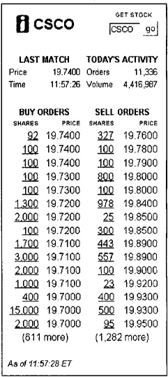
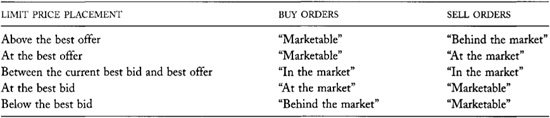
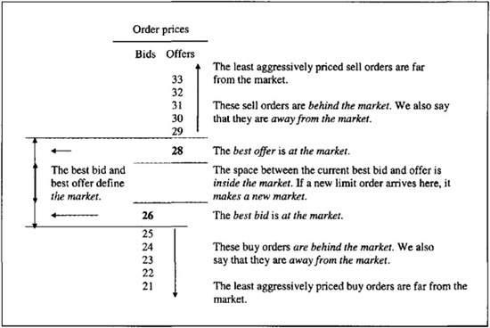
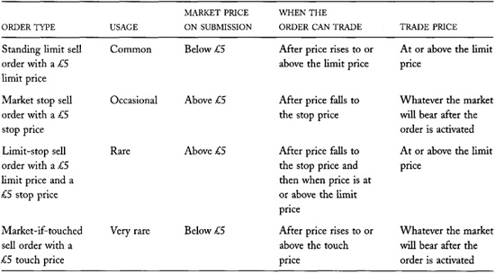
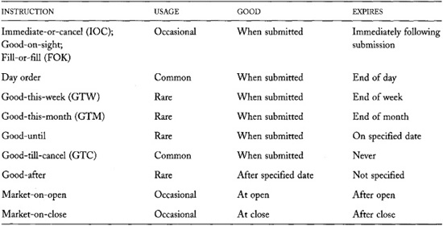
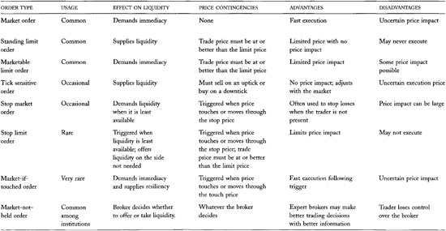

# Chapter 4: Orders and Order Properties

*Orders* are trade instructions. They specify what traders want to
trade, whether to buy or sell, how much, when and how to trade, and,
most important, on what terms. Traders issue orders when they cannot
personally negotiate their trades.

Orders are the fundamental building blocks of trading strategies. To
trade effectively, you must specify exactly what you want. Your order
submission strategy is the most important determinant of your success as
a trader. The proper order used at the right time can make the
difference between a good trade, a costly trade, and no trade at all.

Many markets arrange all their trades by using a set of rules to match
buy and sell orders that traders submit to them. To understand how these
markets work and to use them effectively, you must understand how
traders specify their orders.

Understanding orders will also allow you to see where liquidity comes
from. *Liquidity* is the ability to trade when you want to trade. Some
orders *offer liquidity* by presenting other traders with trading
opportunities. Other orders *take liquidity* by seizing those
opportunities. Trader decisions to offer or take liquidity therefore
affect market quality. To understand liquidity, you must understand how
traders form their order submission strategies.

This chapter will show you what orders are, how traders specify them,
and, most important, what properties they have. Traders choose orders
with properties that allow them to best solve their trading problems.

Familiarize yourself with the many trading terms introduced in this
chapter. We will use them throughout the book. Traders use specialized
words and phrases to communicate quickly and accurately with each other.
Whether you intend to trade or simply want to learn about trading, you
need to be familiar with market nomenclature.

Although order instructions have the same meanings in all markets, their
properties differ according to the type of market to which traders
submit them. In this chapter, we will assume that traders submit their
orders to a *continuous trading market* that arranges trades as orders
arrive. Identical orders have slightly different properties in *call
markets* that collect and process all orders at the same time. We
examine call markets and the properties of orders submitted to them in
[chapter 6](#part0014.html_ch06).

## 4.1 WHAT ARE ORDERS, AND WHY DO PEOPLE USE THEM?

Orders are instructions that traders give to the brokers and exchanges
which arrange their trades. The instructions explain how they want their
trades to be arranged.

An *order* always specifies which instrument (or instruments) to trade,
how much to trade, and whether to buy or sell. An order may also include
conditions that a trade must satisfy. The most
common conditions limit the prices that the trader will accept. Other
conditions may specify for how long the order is valid, when the order
can be executed, whether it is okay to partially fill the order, where
to present the order, and how to search for the other side. Some orders
even specify the traders with whom the trader is willing to trade.

------------------------------------------------------------------------

**An Order Example**

Harry wants to sell 7,600 shares of Exxon Mobil (XOM) at no less than
41.05 dollars per share, but only if he can trade during the current
trading session and only if he can trade the entire quantity at once. He
would issue an all-or-nothing, day order to sell 7,600 shares of XON,
limit 41.05 dollars. 

------------------------------------------------------------------------

Orders are necessary because most traders do not personally arrange
their trades. Traders who arrange their own trades---typically
dealers---do not use orders. They decide on the spot what they want to
do and how to do it. All other traders must carefully express their
intentions ahead of time.

For many small traders, it is not economical to continuously monitor the
market. These traders use orders to represent their interests when they
are not paying close attention to the market.

Traders who arrange their own trades have an advantage over traders who
use orders to express their intentions. The former can respond to market
conditions as they change. The latter must anticipate such changes and
write contingencies into their orders to deal with them. Carefully
written orders will adequately represent traders' interests even when
conditions change. When orders do not do so, traders must cancel them
and submit new instructions. During the time it takes to cancel and
resubmit orders, traders can lose because their old orders trade before
they can cancel them, or because they cannot submit new orders in time
to take advantage of the changing market conditions. Traders therefore
must carefully specify their intentions when they use orders to trade.

In general, traders who can respond most quickly to changes in market
conditions have an advantage over slower traders. Traders who submit and
cancel orders manually are slower than traders who use computers to
monitor and adjust their orders. Where speed is of the essence, floor
traders and computerized traders are the most successful traders.

Clear and efficient communication is essential when trading in fast
markets. Brokers must understand exactly what traders want. Otherwise,
extremely costly errors may occur. To avoid mistakes, most traders use
standard orders to decrease the probability that they will misunderstand
each other when communicating quickly. All traders recognize and
understand these orders.

This chapter introduces the standard orders and describes their
properties. We must define some basic terms first.

## 4.2 SOME IMPORTANT TERMS

Traders indicate that they are willing to buy or sell by making *bids*
and *offers*. Traders *quote* their bids and offers when they arrange
their own trades. Otherwise, they use orders to convey their bids and
offers to the brokers or automated trading systems that arrange their
trades. Bids and offers usually include information about the prices and
quantities that traders will accept. Traders call these prices *bid* and
*offer prices*. They also use the terms *bidding price, offering price,
asking price*, or simply *bid* and *ask*. They refer to the quantities
as *sizes*.

Prices are *firm* when traders can demand to trade at those prices.
Prices are *soft* if the traders who offer them can revise them before
trading. Orders generally have firm prices.

The highest bid price in a market is the *best
bid*. The lowest offer price is the *best offer* (or, equivalently, the
*best ask)*. Traders also call them the *market bid* and the *market
offer* (or *market ask)* because they are the best prices available in
the market. A *market quotation* reports the best bid and best offer in
a market. A market quotation is often called the *BBO*, which is the
acronym for *Best Bid and Offer*. Many markets continuously publicize
their *market quotations*. The best bid and offer anywhere in the United
States is the *NBBO---National Best Bid and Offer*.

The difference between the best ask and the best bid is the *bid/ask
spread*. Traders sometimes call it the *inside spread* because the space
between the highest bid price and the lowest ask price is *inside the
market*. The English often refer to the spread as the *touch*. In sports
betting markets, bettors and bookies call it the *vigorish*.

An order *offers liquidity*---or equivalently *supplies liquidity*---if
it gives other traders an opportunity to trade. For example, suppose Joe
issues an order to buy 100 shares of IBM for no more than 100 dollars
per share from the first person to contact him before trading closes
today. Joe's bid offers liquidity because other traders now have the
opportunity to sell IBM for 100 dollars per share. Joe's bid is a *day
limit order* because it is valid only for the day, and because Joe
limits the price that he will pay.

Both buyers and sellers can offer liquidity. Buyers offer liquidity when
their bids give other traders opportunities to sell. Sellers offer
liquidity when their offers give other traders opportunities to buy.

The dual use of the word "offer" may seem confusing. It may refer to an
offer of an item for sale or to an offer of liquidity. If you think of
liquidity---the ability to trade when you want to trade---as a service
that you can buy or sell, the use of the word "offer" makes sense. This
perspective leads to many useful insights. For example, dealers make
money by selling liquidity to their clients.

*Standing orders* are open offers to trade. Joe's order will stand until
someone sells to Joe at 100 dollars or less, the order expires at the
end of the day, or Joe cancels it. Standing orders are also called *open
orders*. Since standing orders allow other traders to trade when they
want to trade, traders offer liquidity when they have orders
outstanding.

Traders who want to trade quickly *demand liquidity*. Traders *take
liquidity* when they accept offers---standing limit orders or
quotes---that other traders have made. If Sue is willing to sell 100
shares of IBM at 100 dollars, she can initiate a trade by taking Joe's
offer.

Traders who demand to trade immediately demand *immediacy*. We show in
[chapter 19](#part0031.html_ch19) (Liquidity) that immediacy
is one of several dimensions of liquidity.

A market is *liquid* when traders can trade without significant adverse
effect on price. Markets with many standing limit orders and small
bid/ask spreads are usually quite liquid.

The prices at which orders fill are *trade prices*. Buy orders that
trade at high prices and sell orders that trade at low prices trade at
*inferior prices*.

Markets and traders sometimes treat orders differently, depending on
whether they are agency orders or proprietary orders. *Agency orders*
are orders that brokers represent as agents for their clients.
*Proprietary orders* are orders that traders represent for their own
accounts. In many organized markets, agency orders have precedence over
proprietary orders at the same price.

After traders submit their orders to their
brokers, but before their brokers agree to accept them, the order is
*pending*. Brokers often hold orders pending confirmation that the
account is authorized to trade. They also hold short sale orders pending
confirmation that securities can be borrowed to settle the trade. After
a broker accepts an order, but before it is filled or canceled, the
order is *working*.

------------------------------------------------------------------------

**Market Order Example**

AstroPower (APWR) trades in the Nasdaq market. Nasdaq dealers are
bidding 36.80 for APWR and offering it at 36.85. These quotes are good
for 500 shares on the bid side and 400 shares on the ask side. Bill
submits a market order to buy 200 shares of APWR. He buys all 200 shares
for 36.85. 

------------------------------------------------------------------------

## 4.3 MARKET ORDERS

A *market order* is an instruction to trade at the best price currently
available in the market. Market orders usually fill quickly, but
sometimes at inferior prices. Impatient traders and traders who want to
be certain that they will trade use market orders to demand liquidity.
The execution of a market order depends on its size and on the liquidity
currently available in the market.

Small market orders usually fill immediately with little or no effect on
prices. A small market buy order will typically trade at the best
(lowest) asking price, and a small market sell order will typically
trade at the best (highest) bid price.

### 4.3.1 Market Orders Pay the Spread

Market order traders *pay the bid/ask spread*. To see why, imagine that
Amy uses a market buy order, followed by a market sell order, to
complete a quick round-trip bond trade. Her market buy order buys the
bond for 102, when the best bid is 100 and the best offer is 102. Her
market sell order sells the bond for 100, assuming that the best bid did
not change. The total loss for her two trades is the bid/ask spread.
Since Amy pays the bid/ask spread for two opportunities to trade
immediately, her *transaction cost* per trade (exclusive of commissions)
is half of the spread. The spread---actually half of the spread---is the
price traders pay for immediacy when using market orders.

You can also see that market order traders pay the bid/ask spread by
considering how Amy's trade prices differ from our best estimate of the
value of the bond. If we assume that Amy is an uninformed trader (her
erratic behavior seems to bear this out), the only information available
to us about the value of the bond is that a trader is willing to buy it
for 100 and another trader (perhaps the same trader) is willing to sell
it at 102. With no further information, our best estimate of value is
the average of these two prices, or 101. Using this estimate of value,
we can see that Amy paid 102 for a bond worth 101. The difference of
1---which is half the bid/ask spread---is what she paid for liquidity.
When she sold it, she also paid half the spread for liquidity because
she received only 100 for a bond worth 101.

### 4.3.2 Price Improvement

In markets where traders negotiate prices, market orders may sometimes
trade at better prices than the market bid and offer. Such orders
receive *price improvement*. Price improvement takes place when a trader
is willing to step in front of the current best price to offer a better
price to the incoming market order. This often happens when the spread
is wide and the incoming market order is small. Price improvement lowers
the cost of liquidity.

------------------------------------------------------------------------

**Price Improvement
Example**

The market for AnnTaylor (ANN) at the New York Stock Exchange is 23.35
bid, offered at 23.45. At these prices, buyers are willing to purchase
500 shares and sellers are willing to sell 1,000 shares. Tom submits a
market order to sell 300 shares of ANN. The ANN specialist (a dealer who
trades for his own account on the floor of the exchange) may choose to
fill the order at 23.38. If he does, Tom would receive a price 3 cents
better than the 23.35 bid price at which his market sell order would
otherwise have traded.

The specialist, of course, would prefer to buy ANN at 23.35. Exchange
regulations, however, prevent him from buying at the same price at which
public traders are willing to buy. The specialist therefore must improve
the price to buy ANN. 

------------------------------------------------------------------------

### 4.3.3 Market Impact

Large market orders are more difficult to execute than small ones.
Traders willing to take the other side of a very large trade are often
hard to find. They may not be interested in the instrument, or they may
be afraid to trade with someone who may be well informed about the value
of the instrument.

To attract traders, large impatient traders often must move prices.
Large buyers bid prices up to encourage sellers to sell to them. Large
sellers offer prices down to encourage buyers to buy from them. The
premiums that large buyers pay, and the discounts that large sellers
offer, are *price concessions*. When traders move prices to fill their
orders, they have *market impact*. (Market impact is also known as
*price impact.)* Since market impact increases with order size, it
generally is the most significant cost of trading large orders. Traders
who submit large market orders often pay more than half the bid/ask
spread for liquidity.

The price impact of a market order depends on the liquidity available in
the market. In small, illiquid markets with few participants, small
orders may be difficult to execute without significant price impacts,
and large orders may be impossible to execute. Conversely, in large,
liquid markets with many active traders, traders may routinely execute
very large orders involving millions of dollars without much price
impact.

------------------------------------------------------------------------

**Market Impact Example**

Martha wants to buy 400 March orange juice concentrate futures
contracts. The contracts trade at the Citrus Associates division of the
New York Cotton Exchange, which is a subsidiary of the New York Board of
Trade. Traders there are currently bidding 84.20 cents per pound and
offering 84.25 cents per pound. Yesterday 6,505 contracts traded for all
delivery months.

Martha breaks her order into two equal market orders. She gives the
order to one broker who immediately buys 20 contracts for 84.25 cents,
then another 30 for 84.40 cents, and an additional 150 for 84.70 cents.
Later in the day, Martha gives a different broker a market order for the
remaining contracts. At that time, the market is 84.55 bid, offered at
84.60. The second broker buys 5 contracts for 84.60 cents, 75 contracts
for 84.80, another 45 contracts for 85.00, and the remaining 75
contracts for 85.15. To complete her trades, Martha's brokers had to
raise the price by 0.90 cents. 

------------------------------------------------------------------------

### 4.3.4 Execution Price Uncertainty

The prices at which market orders trade depend on current market
conditions. Since market conditions can change quickly, traders who use
market orders risk trading at worse prices than they expect. Economists
call this risk *execution price uncertainty*. Execution price
uncertainty is due to quote changes that may occur between the
submission of an order and its execution, and to the unpredictable price
concessions that may be required to fill large orders. Traders who are
concerned about this risk may prefer to submit limit orders.

## 4.4 LIMIT ORDERS

A *limit order* is an instruction to trade at the best price available,
but only if it is no worse than the *limit price* specified by the
trader. For buy orders, the trade price must be at or below the limit
price. For sell orders, the price must be at or above the limit price.

In continuously trading markets, a broker (or an exchange) will attempt
to trade a newly submitted limit order as soon as it arrives. If no
trader is immediately willing to take the opposite side at an acceptable
price, the order will not trade. Instead, it will stand as an offer to
trade until someone is willing to trade at its limit price, until it
expires, or until the trader who submitted it cancels it.

Standing limit orders are placed in a file called a *limit order book*.
Depending on the market, a broker, an exchange, or even a dealer will
maintain the limit order book. [Figure
4-1](#part0012.html_ch04fig1) presents an example of a limit
order book from Island ECN.

The probability that a limit order will trade depends on its limit
price. If the limit price of a buy order is too low, the order will not
trade. Likewise, if a sell limit price is too high, the order will not
trade. Buy limit orders with high prices and sell limit orders with low
prices are *aggressively priced*. Aggressively priced limit orders are
the easiest limit orders to fill.

### 4.4.1 Limit Price Placement

Traders classify limit orders by where they place their limit prices
relative to the market. *The market* is the range of prices bounded
above by the best offer (lowest price) and below by the best bid
(highest price).

A *marketable limit order* is an order that the broker (or exchange) can
execute immediately when a trader submits it. The limit price of a
marketable limit buy order is at or above the best offer. The broker
therefore can arrange to buy immediately from the seller quoting the
best offer. For a sell order, the limit price is at or below the best
bid, and the broker can arrange to sell immediately to the trader
quoting the best bid.

Marketable limit orders are like market orders, except that they limit
the price concessions that brokers can make to fill them. Marketable
limit orders with very high limit buy prices or very low limit sell
prices are essentially market orders. Traders use marketable limit
orders instead of market orders to limit execution price uncertainty and
to limit what they will pay for liquidity.

**FIGURE 4-1.**\
The Top of the Island ECN Limit Order Book for Cisco Systems at 11:57:28
ET on January 28, 2002\
*Source: [[www.island.com](http://www.island.com)].
Copyright 1998--2002 The Island ECN, Inc.---Member NASD/CSE/SPIC, The
book appears in color on the Island website*.

Limit buy orders that stand at the best bid, and limit sell orders that
stand at the best offer, are *at the market*. The traders who submit
these orders *make the market*. Traders *make
a new market* when they submit orders that improve the current best bid
or offer. Buyers make a new market when they raise the best bid, and
sellers make a new market when they lower the best offer. Whenever
traders place their limit orders *in the market* (between the current
best bid and best offer), they make a new market.

**TABLE 4-1.**\
Terms Traders Use to Describe Limit Price Placement

Limit orders that stand behind the best bid or offer are *behind the
market*. Such orders are *away from the market*. A buy order is behind
the market if its limit price is less than the best bid. A sell order is
behind the market if its limit price is above the best offer. These
orders are "behind the market" because traders who maintain manual order
books place tickets for these orders behind those of more aggressively
priced orders. A summary of this nomenclature appears in [table
4-1](#part0012.html_ch04tab1).

To summarize, market limit orders are the most aggressively priced limit
orders. The next most aggressive orders are those which make a new
market, followed by orders that match the market at the best bid or
offer. The least aggressive limit orders stand behind the market.
[Figure 4-2](#part0012.html_ch04fig2) illustrates these
relations.

**FIGURE 4-2.**\
Terms Traders Use to Describe Standing Limit Orders Note: This figure
presents a simplified limit order book for a hypothetical market. The
market is "26 bid, offered at 28" because the best bid is 26 and the
best offer is 28.

### 4.4.2 Standing Limit Orders Are Trading Options That Offer Liquidity

Traders who submit standing limit orders offer liquidity to other
traders. Their limit orders give others the ability to trade when they
want to trade.

Since traders can choose whether they want to trade with a standing
limit order, standing limit orders are options to trade. In particular,
sell limit orders are call options that give other traders opportunities
to buy when they want to buy. Buy limit orders likewise are put options
that give other traders opportunities to sell when they want to sell.
The option strike prices are the limit prices.

Knowing that standing limit orders are options is very useful. This
observation will help you understand what liquidity is, why brokers are
essential in many markets, why markets consolidate (why traders like to
trade in the same place), how traders choose their order submission
strategies, what the minimum price change (tick) should be, and why fast
traders have an advantage over slower traders. Since this concept is
very important, we need to understand the option characteristics of
limit orders thoroughly. We will first consider how limit orders differ
from option contracts, and then what factors determine the value of a
limit order option.

Standing limit orders are options, but not option contracts. An *option
contract* is an option to trade an instrument at a specified price that
a *writer* sells to another trader. The buyer of the contract pays a
*premium* to the writer regardless of whether the buyer ultimately
exercises the option. In contrast, traders who write standing limit
orders do not sell them to other traders. Instead, they freely grant
their options to the market. Unlike with option contracts, traders do
not own the trading options that limit orders represent. Any trader who
wants to exercise a limit order option may do so by submitting a market
order or a marketable limit order.

The *option value* of a limit order is the value of the order to other
traders. Limit order option values depend on the limit price, how long
the orders will stand, and price volatility.

The most important variable is the limit price. If the limit price is
far behind the market, the option to trade has little value because
traders prefer to trade first with orders that offer better prices.
Conversely, if the limit price is at the market, traders who want to
trade immediately will value the option to trade. If the order offers an
exceptionally good price, traders will jump to take its price, and the
order will fill quickly.

Limit order option values also depend upon how long traders expect the
orders will stand. Orders that will remain available for a long time
allow traders to defer their trading decisions. When presented with such
options, traders like to wait and see what happens before committing to
trade. If values rise, traders will try to buy from limit sell orders,
and they will ignore limit buy orders. Conversely, if values fall, they
will try to sell to limit buy orders, and they will ignore limit sell
orders. When prices change substantially, these trades will be most
profitable. Because values change more in long intervals than in short
intervals, limit order trading options are more valuable when traders
expect that they will remain available for a long time rather than for a
short time.

Traders cannot wait too long to trade with valuable limit orders,
however. Valuable limit orders often disappear quickly because other
traders take them, or because the traders who write them cancel them.
Limit orders that are close to the market
therefore are valuable to traders who want to trade immediately, but
have little value to traders who want to wait and see what happens
before deciding to trade.

------------------------------------------------------------------------

**Option Contracts Are Sold Limit Orders**

Traders who are willing to honor their limit orders until some future
date can sell their orders to other traders by writing option contracts.
The traders to whom they sell their orders pay them for the liquidity
that they offer.

To sell limit orders, traders must give up their right to cancel them at
any time. No one would buy an order that the seller could cancel at any
time.

Traders sell limit orders when they write option contracts. Option
contracts give the holder the right to exercise the limit order at any
time before the contract expires. Traders are willing to buy option
contracts because the exclusive right to exercise a limit order at any
time before its expiration date can be quite valuable.

Some traders who issue standing limit orders would be better off if they
sold option contracts instead. For example, suppose that you want to
offer to sell shares in Allied Arctic Authentic Apparel (AAAA) at 100
dollars while you are away exploring the Arctic ice pack. Rather than
submit a limit order to sell at 100, you should consider selling
(writing) a call option with a strike price of 100. In both cases, you
will probably sell at 100 if the price of AAAA rises above 100 before
you return. If you submit the limit order, you will receive only 100. If
you sell the option, you will receive 100 dollars plus the option
premium.

The choice is not as simple as it seems, however. Suppose that the price
of AAAA rises above 100 and then falls below 100 while you are away. If
you submitted a sell limit order, you probably would have sold at 100
when the price went above 100. If you sold a call option, however, the
buyer might not have exercised the option when the price went above 100.
The buyer certainly would not have executed the option after the stock
fell below 100. If the buyer does not exercise the option, you will
still own the stock, plus, of course, the option premium. 

------------------------------------------------------------------------

*Price volatility*, which refers to how fast prices change, also affects
limit order option values. Limit order options are valuable in volatile
markets because volatility increases the probability of executing a
profitable trade with a limit order. In volatile markets, values may
change substantially before traders can cancel their orders. Traders who
can execute limit orders quickly, before traders cancel them, value
limit orders more in volatile markets than in stable markets.

Since traders do not like to give away option values, they often place
their limit orders far from the market when the market is volatile in
order to reduce their option values. Bid/ask spreads consequently tend
to be wide in volatile markets.

### 4.4.3 The Expected Compensation for Offering Liquidity

The compensation that limit order traders hope to receive for giving
away free trading options is a better price. Buyers who submit standing
limit orders hope to buy at the bid. If they had submitted market orders
instead, they would pay the higher asking price. Sellers likewise hope
to receive the ask instead of the lower bid.

They do not always realize their hopes. Limit order traders receive
better prices only if their orders trade. If the market moves away from
their orders, they may never trade. If they
still want to trade, they will have to *chase the price* by raising
their bid or lowering their offer. Thus, the trade prices that they
ultimately obtain may be worse than the prices they would have obtained
had they used market orders.

In [chapter 14](#part0025.html_ch14), we show that spreads
adjust so that traders expect to obtain better average prices by using
limit order strategies than by using market order strategies. The
average difference in prices is their compensation for offering
liquidity. If there were no compensation for offering liquidity, traders
would not offer it.

------------------------------------------------------------------------

**Chasing the Price with a Limit Order**

Jill wants to buy 500 shares of General Motors. The market for GM at the
New York Stock Exchange is currently 48.05 bid, offered at 48.11. Jill
submits a limit order to buy 500 shares of GM for no more than 48.05
dollars per share. The price of GM, however, rises, and her order does
not execute. After the market moves to 48.15 bid, 48.20 asked, Jill
cancels her limit order and replaces it with a market order that
immediately trades for 48.20 dollars per share. Had her original limit
order traded at 48.05, Jill would have paid 6 cents less than she would
have if she had initially submitted a market order. As it happened, she
ended up paying 9 cents more. 

------------------------------------------------------------------------

### 4.4.4 The Risks of Using Standing Limit Orders

Traders face two risks when using standing limit orders. The first is
*execution uncertainty*. When prices move away from their orders, limit
order traders fail to trade and wish that they had. Traders who are
certain that they want to trade are very concerned about this risk.

Limit order traders can minimize execution uncertainty by aggressively
pricing their limit orders to increase the probability that they will
trade. Traders who want to be very sure that they trade should submit
market orders. These strategies reduce execution uncertainty, but they
increase the cost of trading.

The second risk that traders face when using standing limit orders is
that they may trade and subsequently regret it. This happens when prices
move toward and through their limit prices (i.e., down for a buy order
and up for a sell order). Their orders fill, and then the market moves
against their newly established positions so that they lose money.
Economists call this risk *ex post regret*. All traders face ex post
regret regardless of how and why they trade.

Ex post regret particularly concerns dealers who trade only to profit
from offering liquidity to impatient traders. Dealers do not like to
trade with traders who know more about future values than they do. When
they do, more often than not the dealers will be on the wrong side of
the market. If prices change before they can restore their original
positions, they will lose money. Economists call this risk *adverse
selection risk*. Adverse selection risk is the most important cause of
ex post regret.

Limit order traders can minimize the risk of ex post regret by placing
their orders far from the market. This strategy gives them better
prices, should their orders execute, but it decreases the probability
that they will trade. Alternatively, they may place their orders close
to the market to increase the probability that they trade quickly. This
strategy reduces the time that they are exposed to adverse selection
risk, but it worsens the price they receive if their orders trade.

In later chapters, we will discuss ex post regret in several different
contexts. It arises when traders employ clever strategies to extract
limit order option values ([chapter 11](#part0021.html_ch11)),
when bluffers try to persuade other traders to offer liquidity foolishly
([chapter 12](#part0022.html_ch12)), when dealers trade with
better-informed traders ([chapter 13](#part0024.html_ch13)),
and when large traders pose as small traders ([chapter
15](#part0026.html_ch15)).

### 4.4.5 Limit Orders Represent Absent Traders

Many traders use limit orders to tell their brokers the conditions under
which they would be willing to trade. Their brokers then monitor the
market on their behalf to determine when these conditions are met. By
expressing their orders, traders can
participate in the markets while they attend to business elsewhere.

**Ex Post Regret Example**

Andy is a dealer who trades S&P 500 index futures contracts overnight in
the GLOBEX electronic trading system. He typically submits limit orders
to buy at the bid and to sell at the ask. He makes money when he is able
to buy at the lower bid price and sell at the higher ask price.

At 2:30 [A.M]. Chicago time, Andy submits a limit buy order for
20 contracts at the best bid of 901.05. The market is 901.05 bid,
offered at 901.20. Including Andy's order, the total quantity at the
best bid is 30 contracts.

Five minutes later, a market sell order for 50 contracts arrives. The
GLOBEX computer immediately matches this order with the orders totaling
30 contracts at 901.05. It then fills the rest of the order with 12
contracts bid at 901.00 and with 8 more contracts at 900.90. Following
these transactions, the market is 900.90 bid, offered at 901.20. In the
next minute, traders submit new buy and sell limit orders so that the
market spread closes to 900.95 bid, 901.00 offered.

Andy lost money. He bought 20 contracts at 901.05. If he needed to sell
them immediately, he would receive only 900.95 for them. Since the
nominal value of the S&P 500 contract is 250 times the index value, Andy
has lost 500 dollars (250 × 0.10 dollar per contract × 20 contracts). He
places a limit sell order at 901.00 and hopes the market does not fall
further. 

------------------------------------------------------------------------

------------------------------------------------------------------------

**Limit Order Example**

Sandy wants to buy five July sugar futures contracts if their price
drops below 10 cents per pound. The contract trades at the New York
Coffee, Sugar and Cocoa Exchange. Rather than watch the sugar market
herself, she gives her broker a limit buy order with a 10-cent limit
price. Her broker then watches the sugar market for her while she
attends to other business. 

------------------------------------------------------------------------

## 4.5 STOP ORDERS

A *stop instruction* stops an order from executing until price reaches a
*stop price* specified by the trader. Traders attach stop instructions
to their orders when they want to buy only after price rises to the stop
price or sell only after price falls to the stop price. Orders with stop
instructions are called *stop orders:*

Traders can attach stop instructions to any type of order. They most
often attach them to market orders. Once they are activated, brokers and
exchanges treat stop orders like all other orders. In particular, a stop
order remains valid even if price crosses back over the stop price.

Traders most commonly use stop orders to stop their losses when prices
move against their positions. For example, suppose that Stan buys 10
cotton futures contracts at 80 cents a pound. To limit the potential
loss on this position, Stan may issue a market sell order for 10
contracts with a stop price of 70 cents. If cotton drops to or below 70
cents, Stan's broker will immediately try to sell 10 contracts at the
best price then available in the market. Traders often call such orders
*stop loss orders*.

The price at which a stop order executes may not be the stop price. In
the above example, if cotton prices fall quickly, the market order may
trade at a price substantially below the 70-cent stop price. For
example, if the price of cotton drops from 72 cents to 67 cents on news
that the harvest will be greater than expected, Stan's broker may be
able to sell the 10 contracts for only 66.90 cents.

To guarantee a trade at a particular price, a trader must purchase an
option contract. In our example, if Stan wants to guarantee that he can
sell for 70 cents, he must buy a put option
contract with a strike price of 70 cents. This contract transfers the
risk of selling for less then 70 cents from Stan to the writer (seller)
of the put contract. The transfer makes good economic sense if the
writer is a better trader than Stan is, or if the writer has some reason
for wanting to be short a put.

------------------------------------------------------------------------

**Stop Limit Order Example**

Suppose that you would like to buy Ashton Technology Group only if its
price rises to 10 dollars, and then only if you can buy it for less than
10.37. You would submit a limit buy order with a limit price of 10.37
and a stop price of 10: "Buy 100 ASTN, 10 stop, 10.37 limit."

### 4.5.1 Stop Orders and Limit Orders

Novices often confuse stop orders with limit orders because both specify
price conditions. The difference lies in the purpose of the specified
price. A stop instruction provides for the activation of an order when
the market price reaches or passes a specified stop price. In contrast,
a limit order can be executed only at a price equal to or better than a
specified limit price. To clarify the distinction, consider how a market
sell order with a stop set at 5 euros differs from a limit sell order
with a limit price of 5 euros. A trader would typically submit the stop
sell order when price is above 5 euros. It will activate only when the
market price drops to the 5-euro stop price. At that time, it becomes a
standard market order, and it should trade at the best price then
available. In contrast, a trader would typically submit a limit sell
order when price is below 5 euros. It can be filled only if price rises
to 5 euros or more.

When traders attach a stop instruction to a limit order, they must
specify two prices. The stop price indicates when the limit order
becomes active, and the limit price indicates the terms upon which a
trade may be arranged. The combined order is a *stop limit order*.

Stop orders are like limit orders in one respect. Both order
instructions allow traders to tell their brokers conditions under which
they are willing to trade in the future. As noted earlier, traders who
specify such instructions do not need to monitor the market, and thus
are free to attend to other business.

### 4.5.2 Stop Orders and Liquidity

Stop orders accelerate price changes. Prices often change because
traders on one side of the market demand more liquidity than is
available. When these price changes activate stop orders, the stop
orders unfortunately contribute to the one-sided demands for liquidity.
Stop orders accelerate price changes by adding buying pressure when
prices are rising and selling pressure when prices are falling. They
demand liquidity when it is least available. Traders say that stop
orders *add momentum* to the market.

Traders who pursue *momentum trading strategies* buy when prices are
rising and sell when prices are falling. Momentum trading therefore
destabilizes prices. Momentum traders often implement their strategies
by giving stop orders to their brokers, who then monitor the market on
their behalf. Alternatively, they may monitor the market themselves and
submit standard orders when they want to trade.

*Contrarian traders* employ the opposite trading strategy. They buy when
prices are falling and sell when prices are rising. They therefore
stabilize prices when they trade. Contrarians can implement their
trading strategies by using standard limit orders.

The destabilizing effects that stop orders and momentum strategies have
on the market concern many regulators, traders, and exchanges. We also
consider this issue when we discuss front
runners in [chapter 11](#part0021.html_ch11), market
manipulation in [chapter 12](#part0022.html_ch12), and extreme
volatility in [chapter 28](#part0042.html_ch28).

## 4.6 MARKET-IF-TOUCHED ORDERS

A *market-if-touched order* (MIT) is a market order that is activated
when price reaches (touches) some preset *touch price*. In contrast to
stop orders, traders submit market-if-touched orders to buy when prices
fall to their touch prices or to sell when prices rise to their touch
prices.

Market-if-touched orders are like standing limit orders because traders
can use both order types to buy when prices drop and to sell when prices
increase. They differ from limit orders because, upon activation,
market-if-touched orders become market orders that will fill at the best
available price. In contrast, limit orders must trade at their limit
price or better. Otherwise, they will not trade. Traders use
market-if-touched orders instead of limit orders when they want to be
sure that they will trade if prices reach their touch prices. [Table
4-2](#part0012.html_ch04tab2) summarizes differences among
orders with various price contingencies.

Market-if-touched-orders are quite uncommon. Most traders use limit
orders rather than market-if-touched orders when they want to wait for
prices to move in their favor.

Market-if-touched orders demand liquidity in a narrow sense and supply
liquidity in a broader sense. When they are triggered, they become
standard market orders that demand immediacy. However, they supply
liquidity in a broader sense because they offer liquidity to traders who
push prices to their touch prices. They thus decrease the price impacts
of other traders.

Traders who issue market-if-touched orders stabilize the market because
they trade against the motion of the market. They buy when the market is
falling and sell when it is rising.

**TABLE 4-2.**\
Differences Among Sell Orders with Various Price Contingencies Set at
*£5*

## 4.7 TICK-SENSITIVE ORDERS

Traders classify prices by their relation to previous prices. Price is
on an *uptick* if the current price is higher than the last price, a
*downtick* if lower, and a *zero tick* if the same. They further
classify zero tick prices by the last different price. A zero tick price
is on a *zero downtick* if the last different price was higher and a
*zero uptick* if it was lower.

Traders who want to condition their orders on the last price change
submit *tick-sensitive orders*. A *buy downtick order* can be filled
only on a downtick or zero downtick price. The trade price must be lower
than the last different price. Likewise, a *sell uptick order* can be
filled only on an uptick or zero uptick. The trade price must be higher
than the last different price.

When brokers receive tick-sensitive orders, they immediately check to
see whether they can match them with other orders without violating
their tick conditions. If this is not possible, they hold these orders
until an opportunity to fill them arises.

------------------------------------------------------------------------

**Tick Examples**

The last trade price for Coca-Cola (KO) is 56.05 dollars. The previous
trade price is 56.08. KO is on a downtick because 56.05 is less than
56.08. KO now trades three times, all at 56.05. KO is now on a zero
downtick. You now try to sell KO for 56.07. If you succeed, you will
sell on an uptick. 

------------------------------------------------------------------------

------------------------------------------------------------------------

**Tick-Sensitive Order Example**

You want to buy American Skiing (SKI) at less than the ask price, but
you are not available to cancel and resubmit your orders if prices rise.
To achieve your objectives, you submit a buy downtick order to your
broker.

When your broker receives your order, SKI is on a zero uptick at 1.02.
Your broker cannot buy SKI for you until price drops to or below 1.01.
Unfortunately, price rises to 1.03. Now the maximum price your broker
can pay is 1.02. Your broker continues to watch the market. When a
market sell order arrives, you buy for 1.02. 

------------------------------------------------------------------------

### 4.7.1 Tick-Sensitive Order Properties

The tick condition ensures that tick-sensitive orders have no market
impact. A broker holding a buy downtick order cannot bid up prices to
encourage sellers. Instead, the broker must wait until someone is
willing to trade at a price lower than the last different price.
Likewise, a broker cannot fill a sell uptick order by offering the
market down. Since tick orders cannot have market impact, traders cannot
use them to demand liquidity. Since they allow other traders to trade
when they want to trade, tick-sensitive orders supply liquidity.

Tick-sensitive orders are essentially limit orders with dynamically
adjusting limit prices. A buy downtick order implements the following
equivalent limit order strategy: Submit a buy limit order just below the
last different price. If price rises, raise the limit price to a price
just below the new price. If price falls, leave the limit price alone.
This strategy is attractive to traders who want to keep their limit
orders close to the market when prices move away from them.

Dynamic limit order submission strategies are almost impossible to
implement effectively in fast markets. Traders must continuously monitor
the market and immediately cancel and resubmit their limit orders
whenever prices change. Most traders cannot cancel and resubmit quickly
enough to trade these strategies effectively. Traders therefore use
tick-sensitive orders when they want to use dynamic limit order
strategies.

Tick-sensitive orders are most attractive when the minimum price
increment is large. The *minimum price increment*---also called the
*tick* or the *minimum price variation*---is the smallest amount by
which two prices can differ. It is usually set by exchange regulations.
Traders who use tick-sensitive orders forgo taking liquidity in exchange
for a price that typically is just one tick better. The strategy
therefore is more attractive when the tick is large.

The decimalization of the U.S. stock markets in 2000 decreased the
minimum price increment for most stocks from one-sixteenth dollar (6.25
cents) to 1 cent. This change made tick-sensitive orders much less
attractive than they used to be.

## 4.8 MARKET-NOT-HELD ORDERS

*Market-not-held orders* are orders that brokers do not need to fill
immediately. Traders use this order instruction to tell their brokers to
use their discretion when filling their orders. The brokers then can
offer liquidity or take liquidity according to current market
conditions.

Traders give their brokers market-not-held orders when they want their
brokers to make order strategy decisions on their behalf. Brokers are
often better traders than their clients are because they have more
experience, and because they generally know more about current market
conditions.

When brokers decide to wait to obtain better prices, they risk trading
at worse prices if prices move away from them. Since prices often move
away from even the best of brokers, traders who give their brokers
discretion over order submission strategy cannot reasonably hold their
brokers accountable when they fail to trade at prices that subsequently
look attractive. Traders submit market-not-held orders to indicate that
they will not hold their brokers accountable for failing to trade.

Traders who submit standard market orders can hold their brokers
accountable for failing to trade if suitable opportunities were
available. Market order traders often can use legal remedies to compel
their brokers to provide them with the executions that they would have
received had their brokers not been negligent. Traders who submit
market-not-held orders do not have these rights. Their only recourse is
to withhold future orders from brokers who do not provide them with
consistently good service.

Traders most often use market-not-held orders when they give their
brokers large orders to fill. Large orders, if exposed all at once, can
have very large market impacts. To minimize these price impacts, brokers
carefully control the exposure of large orders by revealing only small
portions and only to traders they deem likely and able to trade the
other side. Market-not-held orders ensure that brokers will not be held
accountable for failing to trade if prices move away while they are
waiting for better prices or for more size.

Traders most commonly give market-not-held orders to brokers who work on
the floor of an exchange. Floor traders generally know more about market
conditions than do any other traders. Some traders also give
market-not-held orders to brokers who operate *electronic order desks*
that use complex econometric models to formulate optimal order
submission strategies.

## 4.9 VALIDITY AND EXPIRATION INSTRUCTIONS

Traders specify *validity and expiration instructions* to indicate when
their orders are valid and when their orders expire. Although traders
may specify these instructions for all order types, they are especially
important for standing limit orders and stop orders. These orders
generally do not trade immediately upon submission. Some may never
trade. Traders therefore need to tell their brokers what to do with
their unfilled orders.

*Open orders* are orders that have not yet been executed or canceled. A
*good order* is an order that can be executed. Traders generally do not
distinguish between open orders and good orders because all good orders
are open orders. Although most open orders are also good orders, some
are not. For example, an order to buy stock
after some specified date is an open order, but before that date it is
not a good order.

*Day orders* are valid for the trading day on which traders submit them.
They expire when the market closes if they have not been filled. The day
order instruction is the most common validity instruction. If it is not
specified, most brokers assume that an order is a day order.

*Good-till-cancel* (GTC) *orders* are valid until the trader expressly
cancels them. To ensure that traders do not forget about their GTC
orders, many brokers provide their clients with a list of their unfilled
GTC orders at the end of every month. They also often mail written
confirmations of these orders on the day that traders submit them. Some
brokers cancel GTC orders after a month or two in order to avoid the
costs of keeping track of stale orders. Traders should be careful not to
forget their good-till-cancel orders. They may trade as long as they
remain open.

*Good-until orders* are good until a date specified by the trader. Not
all brokers accept this order instruction because it requires that they
keep track of the expiration date. *Good-this-week* (GTW) and
*good-this-month* (GTM) are special cases of good-until orders.

*Immediate-or-cancel orders* (IOC) orders are orders that are valid only
when they are presented to the market. Whatever portion of the order
that cannot be filled immediately is canceled. Traders use
immediate-or-cancel orders when they do not want to give trading options
to the market. In some markets, immediate-or-cancel orders are called
*fill-or-kill orders* (FOK) or *good-on-sight orders*.

*Good-after orders* are good only after some specified date. These
orders are quite rare. Most brokers will not accept them unless you are
a very important customer.

*Market-on-open orders* are market orders that a broker can fill only at
the beginning of the trading session. Traders use these orders primarily
in markets that open with a single price auction. In such markets, a
market-on-open order usually guarantees that the trader will receive the
opening price. Since these orders are usually easy to execute, brokers
sometimes charge lower commissions than they would for a regular market
order.

*Market-on-close orders* are market orders that a broker can fill only
at the close of the trading session. Traders who submit these orders
often do so because they hope to trade at the closing price. Closing
prices are particularly attractive to mutual funds because they value
their funds for deposits and redemptions by using net asset values
computed from closing prices. Brokers will not guarantee that
market-on-close orders will fill at the closing price, however. Traders
who want such guarantees can buy them from their dealer-brokers by
paying higher commissions. (See [table
4-3](#part0012.html_ch04tab3).)

## 4.10 QUANTITY INSTRUCTIONS

Traders specify quantity instructions to indicate whether their brokers
can arrange multiple trades to fill their large orders. They usually do
so to minimize the costs that they pay to clear and settle their trades.

The most common quantity instructions are all-or-none instructions and
minimum-or-none (minimum acceptable quantity) instructions. Brokers must
fill *all-or-none* (AON) orders all at once. They can arrange multiple
trades to fill *minimum-or-none orders*, but each trade must be larger
than a minimum size that the trader specifies.
In some markets, these two instructions are also known as
*all-or-nothing* and *minimum acceptable quantity* (MAQ) instructions.

**TABLE 4-3.**\
Order Validity and Expiration Instructions

------------------------------------------------------------------------

**Rolling Futures Position with Spread Order**

In early June, Fulvio wants to roll a long S&P 500 Index futures
position from the expiring June contract into the September contract. He
issues a spread order to sell the June contract and to buy the September
contract. The last trade prices for the June and September contracts
were respectively 1276 and 1289, which implies a spread of 13. As is
usual, the back month trades at a premium to the current month.

Fulvio places a limit of 10, premium to the buy side, on the spread
order. The spread, however, never drops to his limit, and the order does
not execute. Fulvio subsequently replaces his limit spread order with a
market spread order. The order then executes at a spread of 12.

------------------------------------------------------------------------

## 4.11 OTHER ORDER INSTRUCTIONS

### 4.11.1 Spread Orders

Traders issue *spread orders* when they want to buy one instrument and
simultaneously sell another instrument. The two instruments usually are
closely related. For example, they may be futures contracts for
different delivery months of the same commodity. Spread orders can be
market orders or limit orders.

When the spread order is a limit order, the trader specifies a limit for
the difference between the two prices that he or she is willing to
accept. Traders always specify the limit as a premium to the buy side or
to the sell side. If you want to sell one instrument at a higher price
than you want to pay to buy the other instrument, the premium is to the
sell side. The order can be filled only if the difference between the
sales and purchase prices is greater than or equal to the limit. If the
instrument you want to buy is priced above the instrument that you want
to sell, the premium is to the buy side. In that case, the order can be
filled only if the difference between the purchase and sales prices is
less than or equal to the limit.

### 4.11.2 Display Instructions

Traders give *display instructions* when they want to specify how their
brokers should display unfilled portions of their standing limit orders.
These instructions typically tell brokers to show no more than some
maximum quantity. Traders restrict the display of their orders when they
fear that showing their full sizes would cause the market to move away
from them. Orders that are not fully displayed
are called *undisclosed orders*. Traders also call them *hidden orders*,
or *reserve orders* (because they hold some size in reserve), or
*iceberg orders* (because other traders can see only the top of the
order).

------------------------------------------------------------------------

**Undisclosed Order Example**

Michael wants to sell 90,000 shares of Alcatel Cable at the Euronext
Paris Bourse. He is willing to display only 10,000 shares at a time
because he is afraid that revealing his full size might move the market
down. He places an undisclosed limit order to sell 90,000 shares at 408
francs, with instructions to display only 10,000 shares. His order makes
a new market.

Liza sees the offer to sell 10,000 shares at 408 francs. She is willing
to buy 60,000 shares, but she does not want to reveal this information.
She knows that more shares may be hidden behind the 10,000 displayed
shares. Liza submits a fill-or-kill limit order to buy 60,000 shares for
408 francs. She can be sure of trading at least 10,000 shares. If she
does not trade the full 60,000 shares, the remainder of her order will
be canceled.

When the Bourse's automated trading system receives Liza's order, it
immediately fills the entire order. Liza and Michael both will receive
reports that they have traded 60,000 shares. The 30,000-share remainder
of Michael's sell order will stay in the system with 10,000 shares
displayed at 408 francs and another 20,000 undisclosed shares behind it.

------------------------------------------------------------------------

To fill an undisclosed order, a broker must fill the exposed portion
first. As the order fills, the broker can then expose more size up to
the maximum display quantity. This process continues until the broker
fills the entire order.

Some electronic exchanges, such as the Euronext, permit traders to issue
undisclosed limit orders. Traders who want to trade with these orders
can discover their full sizes only by submitting large marketable orders
with fill-or-kill instructions attached. If the size is present, they
trade. If it is not, their orders cancel.

------------------------------------------------------------------------

**Substitution Order Example**

Steve wants the stock portfolio he manages to have more automobile
industry exposure. He does not care whether he buys Ford, General
Motors, or Chrysler, as long as he gets a good price for his purchase.
Steve instructs his broker to buy 35 million dollars of Ford, General
Motors, or Chrysler. The broker examines the trading in these stocks. He
learns that a large buyer is accumulating GM and pushing prices up. He
therefore buys Ford and Chrysler to fill the order. 

------------------------------------------------------------------------

### 4.11.3 Substitution Orders

Traders give *substitution orders* to their brokers when they want to
invest or divest a specified amount of money by trading any of several
securities. The brokers then use their discretion to choose which
securities to trade, based on which ones appear to provide the best
prices.

### 4.11.4 Special Settlement Instructions

Traders attach *special settlement instructions* to their orders when
they want nonstandard settlement. In U.S. equity markets, *regular-way
settlement* occurs three days after the trade (T+3). Traders who want to
settle on a different date attach special settlement instructions to
their orders.

The most common nonstandard settlement is *cash settlement*. Cash
settlement trades settle that day. Traders typically specify cash
settlement when they decide at the last moment that they want to be a
shareholder of record before a vote or before some distribution.

Traders also use special settlement instructions when they pursue
dividend capture strategies. We describe these strategies in [chapter
8](#part0017.html_ch08).

Orders with special settlement instructions are more difficult to trade
than are regular orders. Traders who want special settlement cannot
simply demand it. Instead, they must negotiate
for it. If no one wants to provide special settlement, these orders will
not fill. Some brokers charge higher fees for special settlement because
of the greater costs of arranging and settling these trades.

------------------------------------------------------------------------

**Cash Settlement Example**

Today is Thursday. In two weeks, ABC will spin off its XYZ division to
its shareholders. All shareholders of record tomorrow will receive one
share of XYZ for every share of ABC that they own. You would like to own
both companies, but presently you hold no shares in ABC. If you buy ABC
today with normal three-day settlement, your trade will settle on
Tuesday, and you will not receive the XYZ shares. If you buy ABC today
with cash settlement, you will be a shareholder of record tomorrow, and
you will own both companies.

With regular-way settlement, the last day that you could have bought ABC
and still have been entitled to receive the distribution was two days
ago (Tuesday). On that day, the price reflected the values of both
companies. On Wednesday, the price of ABC fell because buyers were no
longer entitled to receive XYZ. The price you pay for your cash purchase
on Thursday will therefore be substantially higher than the normal-way
price because you will receive two companies instead of one. 

------------------------------------------------------------------------

## 4.12 SUMMARY

Traders use orders to communicate their intentions to the brokers and
exchanges that arrange their trades. The most important and most common
order types are market orders and limit orders. Traders use market
orders when they want to trade immediately at the best price the market
will bear. They use limit orders when they want to place limits on the
prices at which they are willing to trade.

Orders differ by their associated uncertainties. Traders who use market
orders are uncertain about the prices at which they will trade.
Conversely, traders who use limit orders are uncertain about whether
they will trade.

Orders also differ by whether traders use them to supply or demand
liquidity. Traders who use limit orders grant trading options to the
market because they allow other traders to trade when they want to.
Limit order traders therefore supply liquidity to the market. Traders
who exercise these options take liquidity. Traders generally use market
orders when they want to take liquidity. [Table
4-4](#part0012.html_ch04tab4) provides a summary of the
properties of the various orders considered in this chapter.

Since limit orders typically supply liquidity and market orders
typically demand liquidity, we must understand how traders make their
order submission decisions in order to understand the origins of market
liquidity. In future chapters, we will carefully consider how traders
make these decisions.

## 4.13 SOME POINTS TO REMEMBER

• Traders use stylized order instructions to reduce communication
errors.

• Market order traders demand immediacy.

• The bid/ask spread is the cost of immediacy for small market orders.

**TABLE 4-4.**\
Order Properties

• Large market orders can have substantial and
unpredictable price impacts.

• Limit order traders supply liquidity by granting trading options to
other traders.

• Limit order traders who must fill their orders can lose substantially
if their orders do not fill when the market moves away from them.

• Some traders use limit orders to participate in the market when they
are not present.

• Stop orders are not limit orders.

• Stop orders tend to destabilize prices.

## 4.14 QUESTIONS FOR THOUGHT

• When should a trader use a limit order as opposed to a market order?

• Under what circumstances would a trader use a stop buy order?

• Under what circumstances should you be unwilling to expose a trading
option?

• How would you expect order instructions to change with the invention
of new electronic communications technologies?

• Since limit orders and quotes provide trading options to the market as
a whole, what effect would an increase in volatility have on bid/ask
spreads?

• Should limit order traders place their orders close to or far from the
market when they cannot adjust their limit prices quickly?

• Some electronic systems allow traders to issue indexed limit orders.
*Indexed limit orders* have limit prices that are linked to an index so
that the limit price adjusts as the index changes. Why might traders
prefer such orders?

• Do contrarian traders offer or take liquidity when they trade using
market orders?

• Why are there no buy uptick and sell downtick orders?
