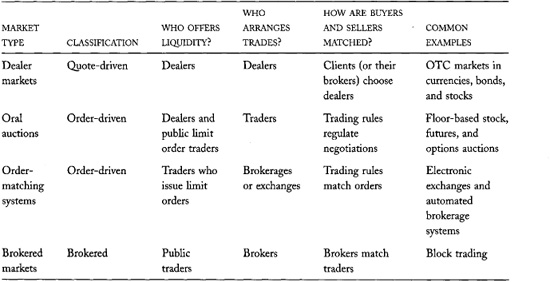
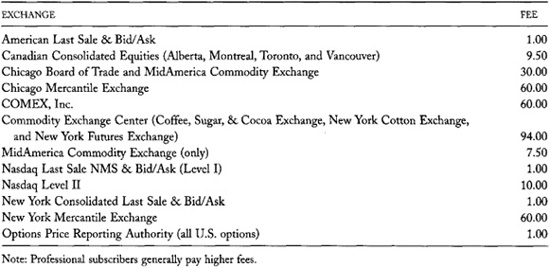
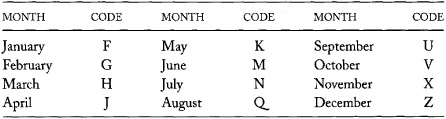
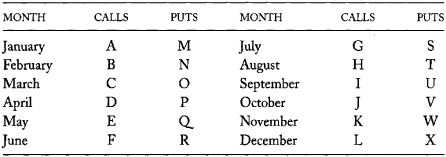
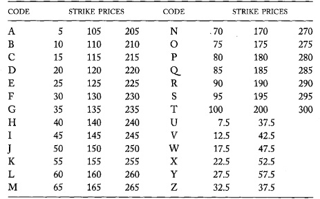
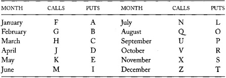
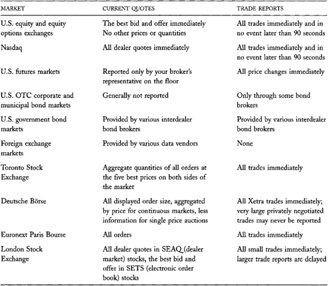
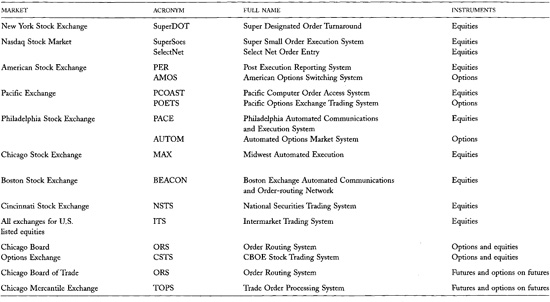

# Chapter 5: Market Structures

The trading rules and the trading systems used by a market define its
*market structure*. They determine who can trade; what they can trade;
and when, where, and how they can trade. They also determine what
information traders can see about orders, quotations, and trades; when
they can see it; and who can see it.

Market structure is extremely important because it determines what
people can know and do in a market. Since power comes from knowledge and
the ability to act on it, market structure helps determine power
relations among various types of traders. These relationships greatly
affect who will trade profitably.

To trade effectively, you need to know the structure of every market in
which you trade. The trading strategies that are successful in one
market often do not work well in markets with different structures. The
best order submission strategy for a given trading problem generally
depends on the structure of the market where the trader intends to solve
the problem. Traders therefore behave differently in different markets.

You must understand market structure, and how it affects trader
behavior, in order to understand the origins of market liquidity, price
efficiency, volatility, and trading profits. These variables all depend
on trader behavior. Since market structure affects trader behavior, it
helps to determine whether markets will be liquid, whether prices will
be informative, and which traders will trade profitably.

We will introduce and describe a framework for classifying market
structures. This classification scheme will help you recognize how
markets are similar and dissimilar. Being able to classify market
structures will be useful to you because trading problems have similar
solutions in similar markets. If you understand how to trade in one
market, you should be able to apply your knowledge and experience to
similar markets. We will use this classification system throughout the
rest of this book.

We will start by discussing the different types of trading sessions that
exchanges, brokerages, and dealers organize. We then will discuss the
various execution systems that traders use to arrange their trades.
Finally, we will describe the information-processing systems that
transmit orders into and out of markets, present market information to
traders and to the public, and store open orders.

## 5.1 OVERVIEW

Trading takes place in *trading sessions*. The two types of trading
sessions are continuous trading sessions and call market sessions. In
*continuous trading*, traders can attempt to arrange their trades
whenever the market is open. In *call markets*, all trades take place
only when the market is called.

**Physically Convened
Screen-based Markets**

Although screen-based trading systems are ideally suited for distributed
access markets, many Asian exchanges with screen-based trading systems
once required their traders to be on their trading floors to use their
electronic systems. This arrangement made it easier for exchanges to
regulate their traders. It also allowed them to construct reliable
communications networks, which was once an important issue in countries
with poor telecommunications infrastructures.

Many traders like to trade in physically convened markets because they
enjoy the society of other traders. Though exchange regulations no
longer require them to be there, many traders have stayed on the
exchange floor. 

------------------------------------------------------------------------

*Trading forums* are the places where traders arrange their trades. In
*physically convened markets*, traders must be on a *trading floor* to
negotiate their trades. Physically convened futures markets trade in
*trading pits*. Physically convened stock markets trade at *posts*. In
*distributed access markets*, traders use telephones or screen-based
trading systems to arrange their trades from their offices.

Some countries require that traders arrange all trades in a given
instrument at a particular exchange. For example, with few exceptions,
it is illegal to arrange trades in a Chicago Board of Trade corn futures
contract outside of the corn futures trading pit on the CBOT floor.
These restrictions are common in many futures markets and in the
equities markets of some Asian and Eastern European countries.

Traders and exchanges use various *execution systems* to arrange trades.
In *quote-driven systems*, dealers arrange most trades when they trade
with their customers. In *order-driven systems*, all trades are arranged
by using *order precedence rules* to match buyers to sellers and *trade
pricing rules* to determine the prices of the resulting trades. In
*brokered trading systems*, brokers arrange trades by helping buyers and
sellers find each other.

Various systems move information in and out of the market, present it,
and store it. *Order-routing systems* send orders from customers to
brokers, from brokers to dealers, from brokers to markets, and from
markets to markets. These systems also send reports of filled orders
back to customers. *Order presentation systems* present orders to
traders so that they can act upon them. The systems may use
*screen-based, open-outcry*, or *hand-signaling* technologies. *Order
books* store open orders. *Market data systems* report trades and quotes
to the public.

In most markets, traders can use only prices that are an integer
multiple of a specified *minimum price increment*. The size of the
increment, measured as a fraction of price, varies considerably across
markets. In [chapter 11](#part0021.html_ch11), we show that
the increment is an extremely important determinant of market quality in
many markets.

## 5.2 TRADING SESSIONS

Markets have *trading sessions* during which trades are arranged. The
two types of trading sessions are continuous market sessions and call
market sessions.

### 5.2.1 Continuous Markets

In *continuous markets*, traders may trade anytime the market is open.
Trading is continuous in the sense that traders may continuously attempt
to arrange their trades. In practice, they usually trade only when a
trader demands liquidity.

Continuous trading markets are very common. Almost all major stock,
bond, futures, options, and foreign exchange markets have continuous
trading sessions.

### 5.2.2 Call Markets

In *call markets*, all traders trade at the same time when the market is
called. The market may call all securities simultaneously, or it may
call the securities one at a time, in a *rotation*. Markets that call in
rotation may complete only one rotation per trading session or as many
rotations as their trading hours permit.
Markets that call in rotation were once very common. Now only the stock
markets of a few small countries call in rotation.

------------------------------------------------------------------------

**Price Clustering**

Traders do not use all possible prices equally. Instead, their usage
clusters on round numbers. In markets with fractional prices, they use
whole numbers more often than halves, halves more often than odd
quarters, quarters more often than odd eighths, and eighths more often
than odd sixteenths. In markets with decimal prices, prices that are
integer multiples of 1.00, 0.50, 0.25, 0.20, 0.10, and 0.05 are most
common. The clustering of prices is most pronounced when the minimum
price increment is a small fraction of price, the market is highly
volatile, and the instrument is thinly traded.

Clever traders often consider the clustering of limit order prices when
they place limit orders. They frequently place their orders just above
or just below a round number to take advantage of the fact that many
other traders may place their prices at the round number. 

------------------------------------------------------------------------

Many continuous order-driven exchanges open their trading sessions with
call market auctions and then switch over to continuous trading. These
markets also use calls to restart their trading after trading halts.
Open-outcry futures exchanges, however, start continuous trading
immediately when they open.

------------------------------------------------------------------------

**Call Market Betting at the Horse Races**

U.S. horse racetracks offer *pari-mutuel betting* to their betting
clients. In pari-mutuel betting, bettors receive a share of the total
money bet on all horses---less a fixed percentage for the track and the
state---if their horse wins. Bettors can place their bets anytime until
betting closes a few moments after the start of the race. The track
*totalizator* system displays the projected winnings for each bet while
the bettors place their bets.

Pari-mutuel betting is a call market auction in which the totalizator
simultaneously prices all bets on a race. (The price of each bet is the
amount bettors must bet to receive a dollar if their horse wins.) The
call occurs when betting closes. Since the system allows only market
orders, many traders wait until the last moment to bet so that they can
see what the prices will be. 

------------------------------------------------------------------------

Call markets are used as the exclusive market mechanism for many
instruments. Most governments sell their bonds, notes, and bills in call
market auctions. Some stock markets use calls to trade their least
active securities. The Deutsche Börse and Euronext Paris Bourse are
examples of such markets.

Call markets usually arrange their trades using order-driven execution
systems. They most commonly use batch execution systems, but a few call
markets allow bilateral trading. Markets with *batch execution systems*
arrange all trades at the same time by matching orders with order
precedence rules. These rules usually arrange *multilateral trades* that
involve more than one buyer and more than one seller. In markets that
allow *bilateral trading*, traders arrange their trades among
themselves.

### 5.2.3 Call Versus Continuous Trading Sessions

The main advantage of call markets is that they focus the attention of
all traders interested in a given instrument at the same time and place.
When buyers and sellers search for liquidity at the same time and place,
they can easily find each other.

The main advantage of continuous trading is that it allows traders to
attempt to arrange their trades whenever they want. This flexibility can
be very important to impatient traders who do not want to wait for the
next market call.

Recent developments in the equities markets suggest that traders prefer
continuous markets with opening calls to exclusive call markets. Many
national equity exchanges have switched from call market rotations to
continuous trading with opening calls, but none has changed from
continuous trading to exclusive call markets.

------------------------------------------------------------------------

**Market Sonar**

Like the deep sea, markets are often quite opaque. In continuous
markets, traders can *ping* the market to obtain information about the
prices at which other traders will trade. Traders ping by submitting
orders to see what happens to them. 

------------------------------------------------------------------------

### 5.2.4 Trading Hours

A market's *trading hours* specify when the market accepts orders and
arranges trades. Continuously trading markets schedule their regular
trading sessions during normal business hours. They often open an hour
or two after the start of the business day and close an hour or two
before the end of the business day. The New York Stock Exchange and the
Nasdaq Stock Market, for example, open at 9:30 A.M. and close at 4 P.M.
Eastern Time. Traders use the hours before the open to collect and
submit orders. They use the hours after the close to settle trades and
to report the results to clients.

------------------------------------------------------------------------

**Lunchtime Recess**

Some continuous markets stop trading for lunch. They divide their
trading days into a morning *session* and an *afternoon session*. The
Tokyo Stock Exchange is the largest exchange to stop for lunch. At
exchanges that trade through lunch, traders either skip lunch or eat it
on the trading floor (or at their desks) so that they do not miss
anything.

Intraday trading activity at the NYSE and in Nasdaq generally is lowest
at lunchtime. Low lunchtime volumes may simply reflect the fact that
lunchtime is midway between the market open and the market close, both
of which are very active for a variety of reasons. Alternatively, at
lunchtime people may be more interested in lunch than in trading.

------------------------------------------------------------------------

Some markets trade at odd hours within their time zone so that they can
be open during normal hours in another time zone. The Pacific Exchange
opens trading at 6:30 A.M. Pacific Time and the Chicago Stock Exchange
opens trading at 8:30 A.M. Central Time to coincide with the New York
Stock Exchange opening at 9:30 A.M. Eastern Time. Since many currency
markets trade around the clock, foreign exchange traders often keep very
unusual hours.

Some markets permit trading after normal hours in special *after-hours
trading sessions*. Exchanges provide these sessions to appeal to clients
in other time zones or to permit traders to *clean up* (adjust) their
positions after the regular trading session. For example, the Chicago
Board of Trade, the Chicago Mercantile Exchange, and the FINEX division
of the New York Cotton Exchange all run nighttime trading sessions in
many of their contracts. Many electronic trading networks provide
*extended trading hours* for their clients.

## 5.3 EXECUTION SYSTEMS

Every market has procedures for matching buyers to sellers. These
procedures define the *execution system* of the market. Since the
execution system is the defining characteristic of a market, analysts
frequently classify markets by their execution systems. The three main
types of markets are quote-driven markets, order-driven markets, and
brokered markets. *Hybrid markets* use some combination of these three
systems.

### 5.3.1 Quote-driven Dealer Markets

In pure *quote-driven markets*, dealers participate in every trade.
Anyone who wants to trade must trade with a dealer. Either traders
negotiate with the dealers themselves, or their brokers, acting as their
agents, negotiate with the dealers. The dealers frequently trade among
themselves, but public traders cannot trade with each other. For
example, if Barbara wants to buy a security, she must find a dealer who
will sell it to her from his or her *inventory*. Likewise, if Saul wants
to sell a security, he must find a dealer who will buy it from him to
add to his or her inventory. Although Barbara might be willing to buy
the security directly from Saul, in a pure quote-driven market they
generally cannot arrange such trades. Instead, they trade indirectly
with each other through the intermediation of one or more dealers. Such
markets are called *quote-driven markets* because the dealers quote the
prices at which they will buy and sell. They are also known as *dealer
markets* because dealers supply all the liquidity.

------------------------------------------------------------------------

**Bookies Are Dealers**

Most sport betting markets are quote-driven dealer markets in which
bookies are dealers. The bookies try to maintain a balanced book with
equal volumes bet on both sides. They profit from small differences in
the payoffs that they offer each side. The difference between these
payoffs is the *vigorish* or *juice*. It is essentially a bid/ask
spread. The vigorish for a typical football point spread bet is 1 dollar
for a 10-dollar bet. A perfectly balanced book ensures that bookies earn
1 dollar for every 20 dollars bet.

Bookies work hard to balance their books. Interest in a game is rarely
balanced, and point spreads and odds change in response to new
information about the contest. Bookies with lopsided books will often
lay off some of their risk by placing offsetting bets with other
bookies. The bets are costly because they have to pay the vigorish.

When bookies have balanced books, their only risk is that their losing
clients will not pay up. Dealers minimize their credit risks by
carefully screening their clients. They limit the credit that they
extend to clients, and they require that their least creditworthy
clients post substantial sums to cover their potential losses. Ruthless
bookies also minimize their credit losses by threatening the kneecaps of
their deadbeat clients. 

------------------------------------------------------------------------

In some dealer markets, traders can trade with each other without the
direct intervention of a dealer. Although these are not pure
quote-driven markets, they are still known as quote-driven dealer
markets because dealers supply most of the liquidity and arrange all the
trades. The Nasdaq Stock Market is an example of a quote-driven market
in which dealers often broker trades among public traders.

In most dealer markets, dealers and their customers choose each other
when they want to trade. The customers---or their brokers acting as
their agents---choose dealers who offer good prices and good service.
The dealers trade only with traders they believe are trustworthy and
creditworthy. Traders who do not have credit relationships with dealers
trade through brokers who guarantee that they will settle their trades.
Many dealers specialize in serving clienteles such as small retail
traders or large institutional traders. Such dealers may refuse to trade
with customers who are not among their preferred clientele. Most dealers
also try to avoid trading with customers they believe are well informed
about future prices, because they often lose to well-informed traders.

In some dealer markets, *interdealer brokers* help dealers arrange
trades among themselves. Many dealers do not like their rivals to know
about their trades. By allowing dealers to trade with each other
anonymously, interdealer brokers protect dealers and their clients from
predatory actions by rivals.

Quote-driven dealer markets are very common. Almost all bond and
currency markets, and many stock markets, are quote-driven markets. Most
dealer markets are informal networks of dealers who communicate with
their clients and among themselves by telephone. More structured dealer
markets usually have proprietary electronic data systems to facilitate
communications with and among dealers. The Nasdaq Stock Market, the
London Stock Exchange, the eSpeed government bond trading system, and
the Reuters 3000 foreign exchange trading system are examples of
quote-driven markets organized, respectively, by a dealer association,
an exchange, a broker, and an electronic data vendor.

------------------------------------------------------------------------

**You Can't Tell the
Players Without a Scorecard**

Brokers and dealers established the first exchanges as membership
organizations. These exchanges provided them with a common place to do
their business and with rules to regulate it. The members arranged all
the trades, either for themselves or for their clients.

Many exchanges eventually adopted rule-based order-matching systems that
arrange trades between buyers and sellers. Initially, exchange members
or clerks operated these systems. Now many exchanges use computers to
arrange trades. When exchanges adopted rule-based order-matching
systems, they became more than just a place to do business under
regulatory supervision. They essentially became brokerages.

Many brokerages have created similar rule-based order-matching systems
to provide low-cost service to their customers. These brokerages
therefore look very much like many exchanges. They grant their clients
trading privileges instead of memberships.

Recently, entrepreneurs have created many for-profit companies that
offer rule-based order-matching systems. These *electronic
communications networks* (ECNs) look like exchanges and operate like
brokers. Many of these firms also develop software and provide network
communications.

Many exchanges are converting from membership organizations to
for-profit companies. They want the flexibility to compete with
for-profit organizations that have streamlined control structures.

Most government regulations distinguish between brokers and exchanges.
The practical differences between these organizations, however, are
increasingly unclear, and therefore are often a subject of regulatory
debate. Although exchanges invaded the brokerage business before brokers
invaded the exchange business, this chronology provides little guidance
for deciding how best to regulate these organizations. 

------------------------------------------------------------------------

### 5.3.2 Order-driven Markets

In *order-driven markets*, buyers and sellers regularly trade with each
other without the intermediation of dealers. These markets have *trading
rules* that specify how they arrange their trades. Their *order
precedence rules* determine which buyers trade with which sellers, and
their *trade pricing rules* determine the trade prices.

Most order-driven markets are *auction markets*. In an auction market,
the trading rules formalize the process by which buyers seek the lowest
available prices and sellers seek the highest available prices.
Economists call this the *price discovery process* because it reveals
the prices that best match buyers to sellers.

In order-driven markets, traders can offer or take liquidity. Traders
who offer liquidity indicate the terms at which they will trade. Traders
who take liquidity accept those terms.

Dealers can---and often do---trade in order-driven markets. In pure
order-driven markets, they trade on an equal basis with all other
traders. In some order-driven markets, dealers provide most of the
liquidity. These markets are still known as order-driven markets because
the dealers cannot choose their clients. Instead, the exchange rules
require that they trade with anyone who accepts their offers.

Order-driven market structures vary considerably. Some markets conduct
*single-price auctions* in which they arrange all trades at the same
price following a market call. Other markets
conduct *continuous two-sided auctions*, in which buyers and sellers can
continuously attempt to arrange their trades at prices that typically
vary through time. Still others conduct *crossing networks*, in which
they match orders at prices taken from other markets.

Order-driven markets vary considerably in how they implement their
trading rules. In markets that conduct *oral auctions*, traders
negotiate their trades face-to-face on an exchange floor. The trading
rules in these markets determine who can negotiate and when they can
negotiate. These auctions are also known as *open-outcry auctions*
because the traders cry out their bids and offers. In markets that have
*rule-based order-matching systems*, the markets use rules to match
orders that traders submit to them. Most order-matching markets use
electronic systems to match buy and sell orders automatically. Their
trading rules are coded in their order-processing software.
Order-matching markets that still have manual operations use clerks to
match their orders.

------------------------------------------------------------------------

**The World's Most Prolific Market Organizer**

eBay has created more markets than any other market organizer. At any
given moment, eBay is conducting pure order-driven auctions for millions
of items. In 2001, more than 30 million traders were registered to
participate in its markets.

Most of eBay's auctions are call market auctions to which buyers can
submit only limit orders. When the auction closes, the highest bidder
wins. The "buy it now" feature of some eBay markets allows buyers to
take a seller's offer before the auction closes.

eBay does not guarantee settlement among its traders. Traders therefore
must be careful when they send money to sellers they do not know and
trust. Although many frauds have occurred, the settlement failure rate
is very small. To help traders check credit, eBay provides a rating
service that allows traders to rate each other and to see those ratings.
Traders who are especially concerned about settlement can hire escrow
services. 

------------------------------------------------------------------------

The rules used by order-driven markets are extremely important because
they affect market liquidity. Some trading rules encourage traders to
offer liquidity while others discourage them. In [chapter
6](#part0014.html_ch06), we will consider how rules affect
trading strategies in order-driven markets.

Since order-driven markets use order precedence rules to arrange trades,
traders cannot choose with whom they trade. They therefore often trade
with traders with whom they have no credit relationships. To prevent
settlement failures, order-driven markets have elaborate mechanisms to
ensure that all their traders are trustworthy and creditworthy. We
consider these mechanisms in [chapter 7](#part0015.html_ch07).

Order-driven markets are quite common. All markets that conduct
electronic auctions or open-outcry auctions are order-driven markets.
These include all major futures exchanges, most stock and options
exchanges, and many trading systems created by brokerages and ECNs to
organize trading in stocks, bonds, swaps, currencies, and pollution
rights. Governments commonly issue their new debt securities in
order-driven market calls.

### 5.3.3 Brokered Markets

Brokers actively search to match buyers and sellers in *brokered
markets*. Most searches start when their clients ask them to fill their
orders. Brokers, however, also initiate many searches when they suggest
trades to their clients.

The distinguishing characteristic of a brokered market is the broker's
role in finding liquidity. In markets where traders usually do not make
public offers to trade, brokers must search for traders who will make
those offers. These markets are typically illiquid markets in which
dealers will not normally trade.

Two types of traders offer liquidity in brokered markets. *Concealed
traders* know that they want to trade but, for reasons that we discuss
in [chapters 11](#part0021.html_ch11) and
[15](#part0026.html_ch15), they will not expose orders to the
public. They offer their liquidity when brokers present them with
suitable trading opportunities. *Latent traders* do not know that they
want to trade until brokers present them with attractive trading
opportunities. They thereby avoid the costs of deciding whether they
want to trade until they have the opportunity to trade. Latent traders
are common when trading decisions are costly and the opportunities to
trade on those decisions are rare. Good brokers can find concealed
traders and latent traders.

Brokered markets are very common throughout
the economy. They usually arise when the item traded is unique and when
dealers will not hold inventories. The most important brokered
securities markets are those for large blocks of stocks and bonds.
Although these securities may trade in very liquid markets for small
sizes, brokers must find suitable counterparts for most large blocks.
Real estate markets and markets for going business concerns are
additional examples of brokered markets. In all three types of markets,
dealers generally will not take positions because the items are too
large and trade too infrequently, and order-driven markets are not
viable because traders will not issue standing orders. We consider how
block trading markets operate in [chapter
15](#part0026.html_ch15).

### 5.3.4 Hybrid Markets

*Hybrid markets* mix characteristics of quote-driven, order-driven, and
brokered markets. For example, although the New York Stock Exchange is
essentially an order-driven market, it requires its specialist dealers
to offer liquidity if no one else will do so. The NYSE therefore has
elements of a quote-driven market. The Nasdaq Stock Market is also a
hybrid. Although essentially a quote-driven market, it requires its
dealers to display, and in many circumstances to execute, public limit
orders. Nasdaq therefore has some elements of an order-driven market.
Since brokers sometimes arrange large block trades in both of these
markets, they also have some characteristics of brokered markets.

### 5.3.5 Summary

The execution system that a market uses to arrange its trades is the
most important characteristic of its market structure. [Table
5-1](#part0013.html_ch05tab1) summarizes the differences among
the primary execution systems.

**TABLE 5-1.**\
Execution System Summary

## 5.4 MARKET INFORMATION SYSTEMS

Markets employ many systems to transmit, organize, present, and store
information about orders, quotes, and trades. These systems are
important because they determine what traders see and when they see it.
We will briefly examine these systems and consider how new
communications technologies are changing the markets.

------------------------------------------------------------------------

**Archipelago's Integrated Book**

The Archipelago ECN distributes its entire limit order book, integrated
with those of several other ECNs, via the Internet, free of charge. The
system uses a Java applet to display the book in real time. 

*Source:
[[www.tradearca.com/automm/arca_book.asp](http://www.tradearca.com/automm/arca_book.asp)]*.

------------------------------------------------------------------------

### 5.4.1 Information Collection Systems

Markets produce information about instrument values, transactions, who
has traded, who wants to trade, and the terms on which they are willing
to trade. This information is very valuable. Traders use it to predict
where prices are going and how much trading will cost. Who has access to
market information, when they can access it, and the form in which they
can access it greatly influence who will trade profitably and who will
pay high transaction costs.

Most markets collect information from their trading systems. They
present some information to their traders, they sell some to data
vendors, and they save most for regulatory purposes.

Market data sales are often very lucrative. At many major exchanges,
data revenues account for more than 20 percent of total exchange
revenues.

Markets with electronic trading systems can easily collect any market
information they want because all information is already in electronic
form. In contrast, floor-based markets, telephonic markets, and other
manually operated markets must create special systems to collect
information. Since information is valuable and manual collection is
quite expensive, electronic systems have a strong cost advantage over
other systems.

Many floor-based exchanges employ clerks called *market reporters* to
observe and report on trading activity. The reporters enter trade prices
into electronic data systems. They may also report quotes and trade
sizes. The exchange trading rules usually require traders to ensure that
the market reporters know what they are doing. In large futures markets,
the reporters sit on podiums above the trading pit so they can see all
the traders. Some reporters may stand in the crowd and use hand signals
to pass information to the reporters on the podium. In many markets,
reporters use handheld wireless devices to report information.

Some telephonic markets and some floor-based markets require traders to
report their trades to their electronic trade reporting systems. Traders
usually must report within a fixed time. For example, in the Nasdaq
Stock Market, dealers must report within 90 seconds of trading when they
arrange trades by telephone.

Many over-the-counter dealer markets have no formal organization. Market
data vendors often try to collect market information from the dealers in
these markets. Either the dealers provide the information for a fee, or
they provide their information on the condition that they can access the
information the other dealers provide. These arrangements appear in some
bond markets.

In dealer markets where interdealer brokers help dealers arrange trades
among themselves, the brokers collect much information about market
conditions. If the dealers object to how a broker distributes that
information, they may refuse to trade through that broker.

------------------------------------------------------------------------

**Securities Information
Processors (SIPs)**

In the U.S. equity markets, almost all markets, dealers, and trading
systems must send their trades and quotes to a *securities information
processor* (SIP), which then distributes the consolidated information to
data vendors. The *Securities Industry Automation Corporation* (SIAC) is
the SIP for exchange-listed stocks, and the NASD is the SIP for Nasdaq
and OTC stocks. 

------------------------------------------------------------------------

### 5.4.2 Information Distribution Systems

Markets distribute the information they collect to their members and to
the public. In most markets, members can access more information than
can unaffiliated traders. They also may obtain it faster.

*Market data systems* report trades and quotes to the public. Markets
sell this information to various *data vendors*, who repackage it for
distribution to the public. Customers may buy real-time services or
time-delayed services. Customers who subscribe to *real-time services*
can receive data as it is generated, but they must pay additional fees
to the exchanges for these services. Customers who subscribe to
*time-delayed services* receive the data with a constant 5-, 10-, 15-,
or 20-minute delay. Exchanges offer both services in order to price
discriminate among those who require immediate information and those who
are less time sensitive. [Table 5-2](#part0013.html_ch05tab2)
lists the monthly fees that some exchanges charge for providing
real-time data to nonprofessional subscribers.

Data vendors offer broadcast services and query services. *Broadcast
services* provide continuous streams of information. *Price and sale
feeds* and *ticker tapes* broadcast trade prices and sizes. *Quotation
feeds* broadcast quotations. *Query services* provide information on
demand. Users submit requests for information to the vendor's data
server. The server then looks up the information and reports it. To fill
these requests, the data servers receive and archive broadcast
information from market feeds. Some data vendors sell software programs
that allow users to run their own data servers. Traders use these
programs when their electronic proprietary trading systems require
extremely fast query services.

**TABLE 5-2.**\
Monthly Exchange Fees for Real-time Data for Nonprofessional Subscribers

Data vendors such as Bloomberg, Bridge Information Systems, PC Quote,
and Reuters reformat market information to make it more useful to their
customers. Traders, for example, do not have time to watch a ticker tape
when they want to see the latest prices and quotes for various
instruments. Instead, they subscribe to broadcast systems that present
and continuously update this information on specially designed *pages*.
Customers can customize their pages to show only the information that
interests them. Most systems allow both
graphic and numeric presentations. Data vendors compete to provide
easy-to-use information systems that deliver data in useful formats at
low cost.

In the U.S. equity markets, data vendors are subject to the Vendor
Display Rule. This rule requires vendors to construct consolidated
quotes from all trading venues. Without this rule, many data vendors
would not include quotes from small markets, which would make it very
difficult for innovative trading systems to compete for order flow.

------------------------------------------------------------------------

**Quotation Servers on the Internet**

Many vendors offer price and quotation query services on the Internet.
For example, Yahoo.com offers a free query service at quotes. yahoo.com.
It presents NYSE quotes with a 20-minute delay and Nasdaq quotes with a
15-minute delay. PC Quote at
[[www.pcquote.com](http://www.pcquote.com)] provides
real-time data to subscribers who have paid the appropriate exchange
fees.

Floor-based exchanges post information on electronic screens and boards
so that all floor traders can see the current state of the market. The
exchanges place these displays in, around, and often above the trading
pit or post. The information that they publish on the floor is usually
the same information that they provide to the public. Indeed, the same
data vendors often provide both services.

In screen-based trading systems, participants often can access more
information than can the public. For example, the Toronto Stock Exchange
allows its members to see the complete composition of the system limit
order book. Public traders get to see only aggregate order sizes at the
best five prices on either side of the market.

------------------------------------------------------------------------

**Some Equity Option Ticker Symbol Examples**

IBMAT---IBM January 100 call

IBMMT---IBM January 100 put

IBMIT---IBM September 100 call

TJW---AT&T October 17.5 call

MSQVJ---Microsoft October 50 put

MQFDI---Microsoft April 45 call (Microsoft has multiple options root
symbols.) 

------------------------------------------------------------------------

### 5.4.3 Ticker Symbols

Exchanges and data vendors use *ticker symbols* to identify trading
instruments. The naming conventions vary by exchange, country,
instrument class, and data vendor. Generally, each exchange assigns
ticker symbols to its instruments. The data vendors occasionally add
their own suffixes or prefixes to these symbols to make them more useful
for their clients.

In the United States, listed common stocks have ticker symbols
consisting of one to three letters. The one-letter symbols are rare, and
therefore coveted for the special status they convey. Exchanges usually
reserve them for their largest firms. Nasdaq National Market System
stocks all have four-character ticker symbols, and Nasdaq SmallCap
stocks have five-character ticker symbols. U.S. open-end mutual funds
have five-character ticker symbols, the last character of which is
always X.

Ticker symbols for U.S. futures contracts generally consist of a one- or
two-character code that indicates the commodity followed by a number
that indicates the expiration year and a letter that indicates the
delivery month. (Some systems place the month code before the year
number.) For example, LC2Z refers to the Chicago Mercantile Exchange
December 2002 live cattle futures contract. The second character of the
commodity code can be a number. For example, E7 is the contract code for
the CME E-Mini Euro-FX contract; thus E72H refers to the March 2002
E-Mini Euro contract. A list of futures contract delivery month symbol
codes appears in [table 5-3](#part0013.html_ch05tab3).

**TABLE 5-3.**\
Futures Contract Delivery Month Symbol Codes

**TABLE 5-4.**\
Equity Option Contract Expiration Month Designators

The *Option Price Reporting Authority* (OPRA) assigns ticker symbols for
exchange-traded U.S. equity and equity index option contracts. These
ticker symbols have three to five characters. The first one to three
characters form the options root. They refer to the underlying
instrument. The options root is often the ticker symbol of the
underlying instrument, or it may include some portion of it. Securities
with options having many strike prices often have several options roots.
Each root designates a different set of strike prices. The
second-to-last character indicates the option type and expiration month.
The final character indicates the option contract strike price. The same
character can indicate different strike prices. If an options class
includes contracts with strike prices that have the same option contract
strike price code, the security will have multiple option roots, and the
option root will distinguish between the contracts. Lists of equity
option contract expiration month designators and equity option contract
strike price codes appear in [tables
5-4](#part0013.html_ch05tab4) and
[5-5](#part0013.html_ch05tab5), respectively.

Many equity index option contracts like the Nasdaq 100 Cube (QQQ) have
many closely spaced strike prices. They therefore use several different
option root symbols, and they use a different set of strike price codes.

**TABLE 5-5.**\
Equity Option Contract Strike Price Codes

The symbol naming conventions that futures exchanges use for their
options on futures contracts vary. Generally, the first two characters
represent the commodity, the third character
represents the month and type of option, and the final two or three
characters are numbers that represent the strike price. The month codes
for options on futures differ from the month codes for equity options.
(The call codes are the same as the futures delivery month codes for the
futures contracts.) A list of these codes appears in [table
5-6](#part0013.html_ch05tab6).

**TABLE 5-6.**\
Expiration Month Codes for Options on Futures

------------------------------------------------------------------------

**Transparency and Dealer Profitability**

Large U.S. investment banks generally make more money trading bonds than
stocks. The greater transparency of the U.S. stock markets may help
explain this result. When customers know current market conditions well,
they negotiate better prices with their dealers. 

------------------------------------------------------------------------

### 5.4.4 Transparency

The data that markets release to the public are quite valuable. The
public uses these data to predict future price changes, to predict when
their orders will execute, and to evaluate their brokers' performance.
Without this information, public traders would not have much confidence
in the markets. Markets vary in the degree to which they report
information to the public.

*Transparent markets* quickly report complete information to the public.
Markets that quickly report quotes and orders are *ex ante transparent*.
Those which quickly report trades are *ex post transparent*. The terms
*ex ante* and *ex post* refer to the time of the trade. The terms
*pre-trade transparency* and *post-trade transparency* are also used.
*Opaque markets* are not transparent.

Markets that report only the best bid and offer show the *top of the
book*. Markets that report bids and offers at multiple prices show the
*market by price*. These markets have *open limit order books*.

The degree of transparency varies across markets. [Table
5-7](#part0013.html_ch05tab7) shows that U.S. equity and
equity options markets are quite transparent. U.S. futures markets are
ex post transparent, but not ex ante transparent. In these oral
auctions, quotes generally do not stand long enough to be reported.
Over-the-counter corporate and municipal bond markets are generally
quite opaque. The U.S. government bond markets are more transparent. In
these markets, interdealer bond brokerages such as Cantor Fitzgerald
provide information to the public.

Traders are often ambivalent about transparency. They favor transparency
when it allows them to see more of what other traders are doing, but
they oppose it when it requires that they reveal more of what they are
doing. Generally, those who know the least about market conditions most
favor transparency. Those who know the most oppose transparency because
they do not want to give up their informational advantages.

Markets produce an enormous volume of information, much of which is
redundant. Traders say that the first half of that information is much
more important than the second half. Being able to see just a little of
what is going on is extremely important to
traders who would otherwise be in the dark.

**TABLE 5-7.**\
Market Transparency in Some U.S. and International Markets

### 5.4.5 Order Routing Systems

*Order-routing systems* transmit orders. Customers use them to send
orders to their brokers and dealers, brokers use them to send customer
orders to dealers and to exchanges, dealers use them to send orders to
other dealers, and exchanges use them to send orders to other exchanges.
Traders also use order-routing systems to transmit cancellation
instructions, and exchanges and dealers use them to report trades to
their customers.

Good order-routing systems are fast and accurate. Traders demand fast
systems because they do not want to miss trading opportunities and
because they value their time. They need accurate systems because
mistakes obviously can be very costly.

The strategies that traders can profitably undertake depend on the
order-routing systems available to them. Short-term traders who
implement high-frequency trading strategies
must submit and cancel orders quickly and reliably in order to trade
profitably. Either they must trade on the floor of an exchange, or they
must use fast order-routing systems, preferably with good computer
interfaces.

------------------------------------------------------------------------

**QuantEX**

ITG is a U.S. equity brokerage and a supplier of electronic trading
software. The premier trading platform that it offers to its clients is
QuantEX. The QuantEX system runs on a dedicated Sun workstation. It
receives realtime trade and quotation feeds and has a high-speed
electronic link to ITG's order-routing system.

QuantEX includes a programming language that traders use to analyze,
present, and respond to real-time market data. QuantEX users program
their systems to process and display real-time data in any format that
they want, to manually or automatically generate and submit orders based
on rules that they specify, and to keep track of orders and the prices
at which they trade.

Traders most commonly use QuantEX to manage large trading programs. Some
traders also use it to implement high-frequency proprietary trading
strategies. 

*Source:
[[www.itginc.com/products/clientsite/index.html](http://www.itginc.com/products/clientsite/index.html)]*.

------------------------------------------------------------------------

Traders use many technologies to transmit orders. They now send most
orders by electronic data transmission systems or by telephone. In some
places, however, traders still carry, shout, or hand-signal orders
across rooms.

Electronic order-routing systems are usually faster, more accurate, and
cheaper to operate than other routing systems. Although they are often
expensive to build, they are rapidly replacing other systems. All major
markets, brokerages, and dealers now use electronic order-routing
systems. The main disadvantage of these systems is that they can handle
only the standardized orders and instructions that they are programmed
to recognize. When traders want to issue special instructions, they
typically use the telephone. Traders also use the telephone when they
want to talk to their brokers about current market conditions before
they submit their orders.

------------------------------------------------------------------------

**Lattice Trading**

State Street offers an electronic order management system called
Lattice. The system allows traders to route orders to the best market as
conditions dictate. Among its many other features, it enables traders to
create strategies to dynamically adjust limit orders as market
conditions change. 

*Source:
[[www.sfafesfreef.com](http://www.sfafesfreef.com)]*.

------------------------------------------------------------------------

Which order-routing systems traders use depends on how often they trade,
on how large their trades are, and on whether they can physically access
an electronic communications network. Infrequent traders usually do not
use electronic systems because the fixed costs of building them and
learning to use them are large relative to their needs. Large traders
often use the telephone because they want more access to market
information. Their size gives them the power to demand attention from
their brokers. Floor brokers often receive their orders from *runners*
who physically deliver them or from order clerks who transmit them by
hand signals. With the invention of cellular telephones, wireless
electronic data networks, and mobile terminals, these floor brokers are
also receiving electronic order flow.

Most retail traders send orders to their brokers by telephone.
Increasingly, many also use the Internet. Retail brokerages generally
offer lower commissions for orders entered through the Internet because
they are less costly to handle than telephone orders. Brokerages that
take Internet orders do not need to employ telephone order clerks, and
they avoid mistakes that occasionally occur when a telephone order clerk
hears or records something different from what a customer intends.

------------------------------------------------------------------------

**Floor Trader
Advantages**

Floor traders have an advantage over off-floor traders because they can
see and react to market developments well before off-floor traders can.
Off-floor traders must obtain their information through market data
systems, and they must respond through order-routing systems. The best
market data systems report information in less than three seconds. The
best order-routing systems pass orders from the client to a broker in
less than five seconds. If the routing system requires a runner, the
delay can be substantially longer. These delays allow floor traders to
take advantage of opportunities before off-floor traders can.

Floor traders also can observe all market information revealed on an
exchange floor, and not just what the market data systems report. In
particular, they observe who is trading. Knowing who is trading can be
valuable if you can guess why they want to trade or whom they represent.
Floor traders and off-floor traders whose brokers can give them access
to this information therefore have a significant advantage over other
traders. 

------------------------------------------------------------------------

------------------------------------------------------------------------

**The Telegraph and Hand Signaling at the American Stock
Exchange**

The American Stock Exchange is the only U.S. stock exchange that permits
its traders to use hand signals to transmit orders on the exchange
floor. The practice originated when the Exchange literally used to trade
on Broad Street in lower Manhattan. It was then known as the New York
Curb Exchange because its members worked on the street curbs.

After the introduction of the telegraph, brokerages could quickly
receive orders from distant branch offices and send back trade reports.
Brokerages that had access to the telegraph had a competitive advantage
over those which did not.

Brokerages could not install their telegraph lines on the curb, however.
Instead, they installed them in offices that they rented above Broad
Street. Telegraph operators would give incoming orders to clerks who
stood at the windows. The clerks then used hand signals to transmit the
orders down to their brokers on the street, and brokers sent trade
reports back through the same system.

The Exchange moved indoors to its present site at 86 Trinity Place in
1921. Its trading floor was constructed with galleries on both sides in
an attempt to replicate the street. The brokers' clerks---now telephone
operators---sat in the galleries and hand-signaled orders down to the
floor. With the introduction of telephones on the floor of the Exchange,
hand signaling became less common. A few traders, however, still use it
occasionally. 

*Source: Robert Sharp*, The Lore and Legends of Wall Street *(Dow
Jones-Irwin, 1989), ch. 46*.

------------------------------------------------------------------------

Institutional traders most commonly send orders to their brokers and
dealers by telephone. Large institutional traders often have several
dedicated telephone lines that connect them to the brokers and dealers
with whom they do the most business. These brokers and dealers often
provide these lines at no charge to attract more business from their
large clients. Institutional traders also increasingly use electronic
systems to deliver their orders. These systems may operate over the
Internet or over private proprietary networks provided by data vendors
like Bloomberg, Reuters, and Bridge
Information Systems. In some cases, they also
send electronic orders over leased lines directly to their brokers and
dealers.

------------------------------------------------------------------------

**Telegraphs, Ticker Tapes, Telephones, and Electronic Data
Networks**

Innovations in telecommunications have substantially transformed
trading. Before the telegraph, all information coming into or going out
of an exchange moved no quicker than express riders could travel on
horseback. Consequently, every major city had its own exchange, and
prices for the same instruments would differ substantially across
geographic regions.

The telegraph and subsequent inventions allowed traders to learn about
market conditions in other cities and to send orders to wherever the
best prices were. Although the first users were arbitrageurs, other
traders soon started routing their orders to the best markets. Markets
that acquired a reputation for being liquid attracted more orders and
thereby became even more liquid. Smaller markets then started to fail.
They either quit trading or combined to form larger markets.

This process continues today. Every innovation in telecommunications has
increased competition among traders and has led to market consolidation.

------------------------------------------------------------------------

Brokers, dealers, and exchanges communicate with each other by telephone
and by proprietary data networks. Almost all exchanges and organized
dealer networks have electronic order-routing systems. These systems
bring orders in for processing and send out trade reports. At
floor-based exchanges and in dealer networks, these systems deliver
orders directly to the traders who process them. At electronic
exchanges, they deliver the orders to the computerized order-matching
system. Exchanges and dealers compete with each other to provide
low-cost order-routing systems that are easy to use, fast, and reliable.
[Table 5-8](#part0013.html_ch05tab8) lists the primary
electronic order-routing systems used by U.S. equity, options, and
futures exchanges.

From a regulatory viewpoint, the most interesting order-routing system
in the U.S. equity markets is the *Intermarket Trading System* (ITS).
ITS is an electronic system that allows traders in one market to send
orders to another market. It therefore plays an important role in
keeping the U.S. equity markets integrated and competitive. We discuss
ITS further when we consider how exchanges compete with each other in
[chapter 26](#part0040.html_ch26).

------------------------------------------------------------------------

**Nasdaq Level I, II, and III Services**

Nasdaq provides three levels of quotation services through various data
vendors:

• Level I service consists of real-time inside bid/ask quotations for
Nasdaq Stock Market securities and for OTC Bulletin Board securities.

• Level II service provides real-time access to all dealer quotations in
these securities.

• Level III service is available only to registered Nasdaq market
makers. It consists of all Level II service information plus the ability
to enter quotations, route orders, execute orders, and send messages.

------------------------------------------------------------------------

### 5.4.6 Order Presentation Systems

*Order presentation systems* reveal information about orders and quotes
to the traders who arrange trades. Markets use several technologies to
present this information.

Markets with *screen-based trading systems* present the orders on
computer screens. These systems are becoming more common as electronic
communications technologies become cheaper. Traders like screen-based
systems because they can use them anywhere and can update them easily.

Some screen-based trading systems broadcast all information presented to
all participants. Screen-based markets commonly use these systems.
Others systems, called *messaging systems*, allow traders to send
private messages to specific traders or classes of traders. Traders in
dealer markets often use these systems to negotiate their trades.

**TABLE 5-8.**\
U.S. Exchange Order Routing Systems

Screen-based systems are the technological
successors to board-based trading systems. In *board-based* trading
systems, traders or exchange clerks write orders on a big board for all
to see. In some markets, orders for infrequently traded stocks are still
presented on boards. Most boards, however, are now published
electronically.

------------------------------------------------------------------------

**The Big Board**

The New York Stock Exchange once presented orders on boards hung on the
walls above its trading floor. As a reflection of its importance, the
NYSE became known as the "Big Board." Although the Exchange long ago
replaced these boards with electronic systems, its nickname endures.

------------------------------------------------------------------------

*Bulletin boards* are information systems upon which people post
indications of interest. An *indication of interest* (IOI)---also known
as an *order indication*---is an expression of interest in trading.
Indications usually show the name of a broker-dealer, the name of the
security, and whether the broker represents a buyer or a seller.
Indications may also show prices, but they are rarely firm. Traders use
indications to show other traders that they are interested in trading.
They also sometimes use them to discover who is interested in trading.

The U.S. equities markets have several popular bulletin boards. For
listed stocks, institutional traders primarily use AutEx or Bridge
Information Systems to post electronic order indications. For thinly
traded, over-the-counter stocks, traders use the Nasdaq OTC Bulletin
Board. For the smallest and least frequently traded stocks, traders post
their indications in the *Pink Sheets* published by the National
Quotation Bureau.

------------------------------------------------------------------------

**Early Video Display Systems**

The first video market information systems were closed-circuit video
systems that distributed real-time images of exchange boards. Digital
systems replaced these analog systems when computing systems matured,
and when off-floor traders wanted to use their computers to manipulate
market information. 

------------------------------------------------------------------------

Data vendors also offer electronic systems that present indications in
popup windows on a trader's workstation. These systems try to anticipate
what trades will interest traders' clients and direct only those
indications to them.

Traders in oral auctions present their orders by yelling out bids and
offers on a trading floor. Floor traders like oral auctions because they
are very quick. Their communications are prone to error, however,
because traders often do not say what they intend to say and because
traders often do not hear what other traders have said.

Traders in many dealer markets also negotiate their trades orally. Since
they usually use the telephone, they cannot see the visual clues that
help us understand speech. They therefore must be careful to avoid
misunderstanding each other.

#### 5.4.6.1 Accuracy in Oral Communications

All traders who negotiate trades orally must communicate very
accurately. They must understand exactly what other traders say, and
they must be sure that other traders understand exactly what they say.
Otherwise, very serious and costly errors may result.

Effective communication can be very difficult when traders are in a
noisy environment, when significant distractions compete for their
attention, and when they hurry. On trading floors, traders may be
yelling or pushing, several phones may be ringing, one or more
televisions may be on, ticker tapes and news wires will be running, and
clerks may be requesting or reporting information. When the market moves
quickly and everything happens all at once, error-free communication can
be quite a challenge.

Communications errors in some oral markets are quite common. In
open-outcry trading in large futures pits, the out-trade rate is often
as high as 4 percent. An *out-trade* results when one trader reports a
trade that does not exactly match a report from another trader. In
equity markets, unmatched trade reports are called *DKs (Don't Know)*.

Traders use various systems to avoid misunderstandings. The most
effective systems allow both traders to show each other what they intend
on electronic screens. Instinet, Nasdaq, and
Liquidnet, among others, provide messaging systems that equity traders
can use for this purpose. Cantor Fitzgerald's eSpeed government bond
trading system allows traders to see what they have said to their Cantor
broker.

------------------------------------------------------------------------

**See What You Say**

In 1992, Lehman Brothers' bond traders in New York experimented with a
particularly innovative error correction system. An automatic voice
recognition system listened to their telephone calls. As they spoke, it
wrote their words and those of their counterparts onto screens on their
desks so that they could see exactly what they said. This system allowed
them to recognize and correct errors as they occurred. It also forced
them to enunciate clearly.

Lehman Brothers abandoned the system because the speech recognition
technology then available was too primitive to transcribe speech
accurately. With recent advances in this technology, attempts to use
this system should be more successful. 

------------------------------------------------------------------------

In face-to-face oral negotiations, traders sometimes use hand signs to
convey their intentions. These signals are especially common in futures
pits. Traders indicate that they are sellers by holding their palm away
from them. In effect, they push the item away. Buyers hold their palms
inward, to pull in the item. Traders convey prices and quantities by
extending fingers, by holding the hand upright or sideways, and by
touching their faces in various places.

Traders commonly express their bids and offers in fixed formats to avoid
confusion. When bidding, they express the price followed by the
preposition "for" and then the quantity. A trader who shouts out "6 for
20" is a buyer willing to pay 6 for 20 contracts. When offering, traders
express the quantity first followed by the preposition "at" and then the
price. A trader who shouts "40 at a quarter" is a seller willing to sell
40 contracts at the price of a quarter.

To further reduce confusion, traders usually express only the last digit
or fractional portion of the price. Since the rest of the price is
common knowledge, they do not need to express it. This practice speeds
up their communications, and it reduces the amount of noise that traders
might mistake for significant information.

Traders who trade over the telephone often repeat what they hear and
then ask for confirmation. Brokers commonly use this protocol to avoid
errors when receiving instructions from their clients. Most record their
telephone calls to help resolve any disputes that may arise from
misunderstandings.

------------------------------------------------------------------------

**The Pink Sheets, Nasdaq, and Technological Evolution**

The National Quotation Bureau (NQB) started publishing weekly editions
of the *Pink Sheets* in 1913 and daily editions five years later. They
are called pink sheets because NQB prints them on pink paper. NQB now
publishes a weekly edition on paper and a daily electronic edition.
Traders post their indications by calling or faxing them to NQB.

Until the National Association of Securities Dealers organized the
original NASD Automated Quotation (NASDAQ) trading system, the *Pink
Sheets* were the primary source of market information about
over-the-counter stocks. Since the NASDAQ system allowed traders to
present, access, and exchange information faster, it largely replaced
the *Pink Sheets*. The NASDAQ system grew into the Nasdaq Stock Market
and the Nasdaq OTC Electronic Bulletin Board. The Nasdaq Stock Market
now trades some of the largest stocks in the world. The Nasdaq OTC
Electronic Bulletin Board reports indications for smaller stocks
sponsored by NASD dealers. The *Pink Sheets* now report order
indications only for the smallest publicly traded U.S. stocks.

NQB now offers a real-time interactive version of the *Pink Sheets*. The
new electronic bulletin board allows traders to post and revise their
indications at any time, and to send electronic messages to each other
to facilitate their negotiations. 

------------------------------------------------------------------------

When errors do occur, the involved traders attempt to determine who was
mistaken. Usually, one trader will recognize his error and correct it.
If they cannot assign responsibility, the
traders often resolve the disputed trade by splitting the difference.
However, traders quickly shun traders who make many mistakes.

------------------------------------------------------------------------

**Microwaving Traders at the Hong Kong Futures Exchange**

When brokers first brought cellular telephones onto the floor of the
Hong Kong Futures Exchange, they inadvertently circumvented the audio
tape system that the Exchange used to record their negotiations. To
obtain better reception for their cell phones, the brokers would stand
near the windows on the sides of the trading room. Trading moved away
from the center of the pit to the windows, where the microphones could
not properly pick up their negotiations. The Exchange solved the problem
by installing a low-powered cellular phone transceiver station inside
the trading room.

The Exchange later switched to an electronic trading system called HKATS
(Hong Kong Automatic Trading System) in 1995. Traders now trade from
their respective offices, and HKATS produces a complete record of their
activities. 

------------------------------------------------------------------------

### 5.4.7 Order Books

All brokers, exchanges, and dealers that represent orders maintain
*order books* to hold open orders that they cannot yet fill. The order
books may be electronic databases, files, boxes of paper order tickets,
or simply desktop piles of order tickets. Order books mostly contain
standing limit orders. They may also include stop orders and
market-if-touched orders with price contingencies that have not yet been
met.

Order books hold extremely valuable information. They reveal the
conditions under which traders will trade. We show in [chapter
11](#part0021.html_ch11) that clever traders who know what
other traders intend to do often can make money by trading ahead of
them. Access to the order book therefore is an important determinant of
trader profitability.

*Open book markets* fully display their order books to all traders.
*Closed book markets* do not show their orders.

Traders generally want to see the order book. Many traders, however, do
not want other traders to see their orders. When trading in open book
markets, these traders do not submit standing orders. They, or their
brokers, instead hold them until suitable trading opportunities arise.

Rule-based order-matching systems work best when traders place standing
limit orders in their system order books. To protect limit order
traders, some markets either restrict access to the book or allow
traders to specify that their standing orders not be displayed in the
book. Euronext, for example, allows traders to submit undisclosed limit
orders.

Brokers are responsible for representing the unfilled orders of their
clients. Since they usually cannot closely monitor all markets in which
their customers have placed orders, they may give their clients' orders
to others to manage. In markets with rule-based order-matching systems,
they usually will submit the order to the system order book. In other
markets, they may give orders to brokers or dealers who specialize in
the specified securities.

Many dealers maintain order books as a service to the brokers who send
them order flow. By encouraging brokers to send them limit orders, the
dealers hope that brokers will also send them market orders. Moreover,
some dealers like to hold limit orders because they provide them with
free trading options that they often can use
to trade more profitably. Dealers usually do not charge for the
brokerage services that they provide to brokers.

## 5.5 SUMMARY

Market structures differ widely across markets. The differences
determine how the markets operate, who can supply liquidity, who knows
current market conditions best, and who can act first. Market structure
therefore affects market liquidity, transaction costs, and price
efficiency. These factors help determine who will trade profitably.

Markets differ most in how they arrange trades. In quote-driven markets,
dealers arrange all trades and provide all liquidity. In order-driven
markets, traders or electronic trading systems arrange trades by
matching public orders. In brokered markets, brokers arrange trades by
finding traders who are willing to trade.

Markets differ significantly in when and where they trade. Call markets
trade only when the market is called. Continuous markets trade whenever
the market is open. Physically convened markets trade on exchange
floors. In distributed access markets, traders trade from their offices.

Markets also differ in how traders negotiate with each other. In
screen-based markets, traders communicate through electronic data
systems. In oral auctions, traders negotiate their trades by yelling to
each other on an exchange floor. In other markets, traders negotiate
over the telephone.

Finally, markets differ in their transparency. Transparent markets allow
traders to see all orders, quotes, and trades as they occur. In opaque
markets, many traders never see this information.

Traders, regulators, and academics often passionately debate which
structure is best for a market. The great diversity in existing market
structures suggests that good answers to this question may be complex.
The best structure for a given market undoubtedly depends on the
instrument, on why people want to trade it, and on the communications
and computing technologies that traders can use to trade it.

To form a reasoned opinion about the best structure for a market, you
must thoroughly understand how markets operate, why people use them, and
what traders do in them. These are the main objectives of this book. In
the last part of this book, we will return to the question of which
market structures are best.

## 5.6 SOME POINTS TO REMEMBER

• Call markets convene all traders at the same time and place.

• Continuous markets arrange trades when willing buyers arrive and find
waiting sellers, or when willing sellers arrive and find waiting buyers.

• Dealers supply all liquidity in pure quote-driven markets. Public
traders and dealers supply liquidity in order-driven markets. Public
traders supply liquidity in brokered markets.

• Order-driven markets arrange trades by applying a set of rules to a
set of orders.

• Brokers arrange trades by searching for willing traders in brokered
markets.

• Access to information about orders and
trades is extremely valuable to traders.

• Public traders generally favor transparent markets.

## 5.7 QUESTIONS FOR THOUGHT

• Should markets be open around the clock?

• What are the arguments for and against lunch recesses?

• The NYSE last changed its trading hours in 1985, when the open was
moved from 10 A.M. to 9:30 A.M. Why did the Exchange make this change?
Should it change its trading hours again?

• What are the benefits of requiring that traders arrange all trades in
the same market? What are the disadvantages of such requirements?

• How would you trade off the advantages of focused liquidity in a call
market against the availability of a continuous market?

• When markets call in rotation, in what order should they call the
securities? What special problems confront arbitrageurs who trade in
markets that are called in rotation?

• Many regulators say, "Sunshine is the best disinfectant." What do they
mean, and what implications does this have for market transparency? If
you were a large buy-side trader, how would you feel about ex ante
market transparency?

• Which traders favor dealer quote-driven markets? Which traders favor
public order-driven markets?

• Which instruments are best traded in quote-driven markets? In
order-driven markets? In brokered markets?

• Why would dealers not want other dealers to know about their trades?

• Do you think that someday all markets will be fully automated
electronic markets?

• What factors determine whether traders favor order and trade price
transparency?

• Brokers who are exchange members often compete with their exchange for
business. If such brokers have power over the management of the
exchange, the exchange may not be able to compete effectively with them.
What advice would you give an exchange that faces this problem?

• If an exchange has regulatory power over its brokers, the brokers may
not be able to compete effectively with the exchange. What advice would
you give a brokerage that faces this problem?

• Market data are quite valuable. Exchanges, brokerages, dealers, public
traders, and data vendors all fight over who owns information. Who owns
market data? Should the prices at which market data are sold be
regulated? If so, who should regulate these prices?

• Why is trade price transparency more common in exchange markets than
in labor markets?
