# Chapter 6: Order-Driven Markets

*Order-driven markets* use trading rules to arrange their trades. These
markets include oral auctions, single price auctions, continuous
electronic auctions, and crossing networks. You will learn how these
markets work and how trading strategies depend on market structure.

Order-driven markets are quite common. Almost all of the most important
exchanges in the world are order-driven markets. Most newly organized
trading systems choose an electronic order-driven market structure.

Despite the great variation in how order-driven markets operate, their
trading rules are quite similar. All order-driven markets use *order
precedence rules* to match buyers to sellers and *trade pricing rules*
to price the resulting trades.

Variations in trading rules distinguish order-driven markets from each
other. The trading strategies that work best in one market may work
poorly in markets with different rules. Traders therefore need to know
how trading rules affect optimal trading strategies.

If you trade in order-driven markets, the principles introduced in this
chapter will be of immediate and obvious value to you. They will also
help you understand front-running and block trading strategies that we
will consider in later chapters.

The topics in this chapter should interest you if you are concerned with
market structures. Most recent innovations in trading technologies
involve order-driven market structures. To evaluate new trading
technologies, you must thoroughly understand how they work.

We will first discuss how oral auctions work. In these order-driven
markets, traders arrange trades by negotiating on a trading floor. Since
many readers may already be acquainted with these markets, they provide
us with a familiar context for introducing various trading rules. We
then will turn our attention to rule-based order-matching systems. These
systems include single price auctions, continuous order book auctions,
and crossing networks.

## 6.1 ORAL AUCTIONS

Many futures, options, and stock exchanges use continuous bilateral oral
auctions to trade their contracts and securities. The largest oral
auction market is the U.S. government long treasury bond futures market.
This market, which the Chicago Board of Trade organizes, regularly
attracts 500 floor traders. It may be the most liquid market in the
world. The smallest oral auctions may include only two traders.

In an *oral auction*, traders arrange their trades face-to-face on an
exchange trading floor. Some traders cry out their bids and offers to
attract other traders. Other traders listen for bids and offers that
they are willing to accept. Most traders do both. Trades occur when a
buyer accepts a seller's offer, or when a seller accepts a buyer's bid.
In the former case, the buyer will call out
"take it" to accept the offer. In the latter case, the seller will call
out "sold" to accept the bid. Buyers and sellers often take turns
bidding and offering until they agree on a price and quantity to trade.
Traders *offer liquidity* when they make bids or offers to trade. They
*take liquidity* when they accept bids or offers.

The traders must obey the market trading rules. These rules organize
trading to ensure fairness for all traders and to provide for the
efficient exchange of information necessary to arrange trades. The
trading rules also help protect brokerage customers from dishonest
brokers.

The first rule of an oral auction is the *open-outcry rule*. Traders
must publicly express all bids and offers so that all traders can act on
them. This requirement ensures that all traders can participate fairly
in the market. In most oral auctions, any trader can accept another
trader's bid or offer, even if he or she is not actively negotiating
with that trader. The first trader to accept a bid or offer generally
gets to trade. The open-outcry rule also requires traders to express
their acceptances publicly, so that all traders are aware of the trades
they arrange. This information helps traders evaluate market conditions.
It also protects customers from dishonest brokers who might try to
arrange trades privately to benefit their friends instead of their
clients.

### 6.1.1 Order Precedence Rules

The *order precedence rules* of an oral auction determine who can bid or
offer, and whose bids and offers traders can accept. In oral auctions,
the primary order precedence rule is always *price priority*. The
secondary precedence rules depend on the market. Futures markets use
*time precedence*. U.S. stock exchanges use *public order precedence*
and then time precedence.

#### 6.1.1.1 Price Priority

The *price priority rule* gives precedence to the traders who bid and
offer the best prices. Traders cannot accept bids or offers at any
inferior price. Buyers can accept only the lowest offers and sellers can
accept only the highest bids.

Price priority is a *self-enforcing rule* because honest traders
naturally search for the best prices. Exchanges therefore do not have to
adopt special procedures to enforce it. They keep the rule on their
books so that they can prosecute dishonest brokers.

Most oral auctions do not allow traders to bid below the best bid or
offer above the best offer. Since only the best bid and best offer
interest traders, bids and offers behind the market only create
confusion and noise.

Traders acquire price priority by bidding or offering prices that
improve the current best bid or offer. Any trader may improve the best
bid or offer at any time.

#### 6.1.1.2 Time Precedence

The *time precedence rule* used in most oral auctions gives precedence
to the traders whose bid or offer first improves the current best bid or
offer. While they have time precedence, no other traders may bid or
offer at the new best bid or offer.

Traders retain their time precedence as long as they maintain their bid
or offer, or until another trader accepts it. Afterward, anyone may bid
or offer at the new price, and all traders at that price will have equal
standing.

In oral auction markets, bids and offers
generally are good only for a moment. Traders say, "A quote is good only
as long as the breath is warm." In practice, traders who do not honor
their quotes for a reasonable period find that nobody wants to trade
with them. Traders maintain their precedence by repeating their quotes
as often as is necessary to show that they remain interested in trading.
Traders may repeat their quotes continuously in large, very active
markets.

The time precedence rule encourages traders to improve prices
aggressively. Traders who want to trade ahead of a trader who has time
precedence must improve the price. Time precedence rewards aggressive
traders by giving them the exclusive right to trade first at the
improved price. The time precedence rule thus encourages price
competition among traders.

Time precedence is meaningful only when the minimum price increment is
not trivially small. The *minimum price increment*, or *tick*, is the
smallest amount by which a trader may improve a price. It is the
incremental price that traders must pay to acquire precedence, through
price priority, when they do not have time precedence. If it is very
small, the time precedence rule gives little privilege to the traders
who improve price.

The effect of the tick on price competition varies by tick size. If the
tick is too small, it decreases price competition by weakening the time
precedence rule. If the tick is too large, traders are reluctant to
improve prices because of the expense. Since the minimum price increment
significantly affects market quality, exchanges and regulators pay close
attention to it.

Unlike price priority, time precedence is not a self-enforcing rule.
Most traders do not care whose bid or offer they accept as long as they
get the same price. Traders who have time precedence must therefore
defend it when someone improperly attempts to bid or offer at the same
price. When this happens in futures markets, they usually yell out,
"That's my bid," or "That's my offer," or "It's my market."

------------------------------------------------------------------------

**Leapfrog**

The orange juice concentrate futures market is currently 103.10 cents
bid, offered at 103.25 cents. (Traders quote prices per pound for
15,000-pound contracts.) Guy is the bidder at 103.10. He has time
precedence at that price, and he is defending it. If you want to buy at
103.10, you must wait until Guy trades. If you want precedence, you must
improve the bid to 103.15. You then would have price priority over his
bid and time precedence over all subsequent bids at 103.15. If Guy wants
to reclaim his precedence, he would have to improve the market again by
bidding 103.20. Time precedence encourages traders to play leapfrog by
jumping over each other's prices with improved prices.

Good traders carefully consider their leapfrog strategies. For example,
if you are willing to bid 103.20 and you are confident that Guy will bid
103.20 if you bid 103.15, you may want to skip over 103.15 and bid first
at 103.20. If you bid 103.20 and Guy still wants to trade first, he will
take the offer at 103.25. In that case, he will trade immediately and
you will still have time precedence at 103.20. Of course, if you are
quite impatient to trade, your best strategy may be to take the offer at
103.25 immediately. 

------------------------------------------------------------------------

------------------------------------------------------------------------

**The Common Cents Stock
Pricing Act of 1997**

In March 1997, Republican Representative Mike Oxley and others
introduced a bill to require that U.S. stock markets trade on dollars
and cents rather than on dollars and fractions of a dollar. The bill had
wide popular support because most people find decimal pricing simpler to
understand than fractional pricing. The bill never passed. Instead, the
exchanges decided to switch to decimals on their own.

The bill was remarkable because it represented an attempt by the U.S.
Congress to micromanage trading rules in the stock markets. The
exchanges probably decimalized at least in part to prevent the passage
of this bill.

The U.S. equity markets completed their decimalization in 2001. The
minimum price increment decreased from one-sixteenth (6.25 cents) to 1
cent. Not surprisingly, the switch to a much smaller tick profoundly
changed the equity markets. Most notably, the decrease in tick size
reduced the value of time precedence and thereby greatly reduced
displayed order sizes. Many analysts believe that it would have been
much better had the markets adopted a 5-cent minimum price increment.

The most remarkable aspect of the bill may be that a conservative
Republican, with a reputation for fighting government intervention in
the economy, introduced it. Several representatives from both parties
recognized and commented upon this incongruity during hearings on the
bill. Perhaps Rep. Oxley's interest in the bill had something to do with
the pun in its title. Several of his legislative initiatives have titles
that incorporate the words "common sense." 

------------------------------------------------------------------------

#### 6.1.1.3 Public Order Precedence

Some equity exchanges prohibit their members from trading ahead of a
public trader who is willing to trade at the same price. Exchanges adopt
this *public order precedence rule* to give public traders more access
to their markets and to weaken the informational advantages that floor
traders have. Without this rule, exchange members usually can acquire
time precedence at a new price before public traders can, because
members see prices change first and can quote faster than public traders
can submit orders. The public order precedence rule allows public
traders to take precedence over a member even when the member has time
precedence.

The public order precedence rule also increases investor confidence in
the exchange markets by assuring them that exchange members cannot step
in front of their orders. The decrease in tick size that accompanied the
decimalization of the U.S. markets greatly weakened this rule. Not
surprisingly, the incomes of member dealers at the NYSE rose
substantially.

### 6.1.2 The Trade Pricing Rule

The *trade pricing rule* used in oral auctions is quite simple. Every
trade takes place at the price proposed by the trader whose bid or offer
is accepted.

Economists call this rule the *discriminatory pricing rule*. It derives
its name from a strategy that large, aggressive traders use to lower
their trading costs. Large traders often break their orders into several
pieces to trade one at a time. The first pieces trade at the best prices
initially available in the market. The remaining pieces trade at
progressively inferior prices as the traders exhaust the available
liquidity and as the market discovers the true order
sizes. Large traders thus discriminate among
the traders who are most willing to trade and those who are willing to
trade only at inferior prices. They obtain their best prices from the
former and their worst prices from the latter. This strategy lowers
their trading costs because the traders most willing to trade would not
offer such good prices if they knew the full order sizes.

------------------------------------------------------------------------

**Price Discrimination**

Sally has 100 soybean futures contracts to sell at the market. She does
not tell anyone about her order.

Colin and Martin both want to buy soybeans. Colin is willing to bid as
much as 602½ cents per bushel for 40 contracts. He is currently bidding
602 and he is the best bidder. Martin is willing to bid as much as 601 ½
for 75 contracts, but he has not revealed this to anyone.

Sally immediately accepts Colin's offer and negotiates to sell 40 at
602. Martin then bids 601½. Sally accepts his offer and negotiates to
sell 60 at 601½. Her average sales price is 601.7. Although Colin
purchased at a price he was willing to pay, he could have bought at 601½
if he had known about Sally's order. By discriminating between Colin and
Martin, Sally obtained a better average price for her sale. Since the
bean contract is for 50,000 bushels, her total savings are 10,000
dollars. 

------------------------------------------------------------------------

### 6.1.3 Trading Floors

Futures markets that conduct oral auctions trade in trading pits. A
*trading pit* is a place on an exchange floor designated for trading a
particular contract or set of related contracts. For actively traded
contracts, the trading pits are depressions in the floor that have steps
all around the sides. The traders stand on the steps and on the bottom
of the pit. This design allows all traders to see all other traders
clearly. The pits in smaller markets are often round tables or round
rails at which the traders sit or stand.

Stock, options, and bond markets that conduct oral auctions trade at
trading posts. Like a trading pit, a *trading post* is a place on the
floor of an exchange designated for trading specific securities. The
term probably first came into usage when markets traded outdoors. The
original posts may have been light posts or hitching posts. Now, posts
are simply counters around which traders and clerks congregate.

Exchanges that run oral auctions require that traders conduct all
trading in each security or contract at its assigned post or in its
assigned pit. This rule makes it easier for buyers and sellers to find
each other. It also helps the exchange enforce its trading rules.

## 6.2 RULE-BASED ORDER-MATCHING SYSTEMS

Most exchanges, some brokerages, and almost all electronic
communications networks use rule-based order-matching systems to arrange
their trades. *Rule-based order-matching systems* use trading rules to
arrange trades from the orders that traders submit to them. Traders
negotiate with each other only by submitting and canceling orders. Most
systems accept only limit orders. Systems that accept market orders
treat them as very aggressively priced limit orders. All orders specify
the maximum quantities that traders will accept. Rule-based
order-matching systems process this price and quantity information to
arrange their trades. Almost all rule-based systems now use electronic
trading systems to process their orders.

If the market is a call market, the market collects the orders before
the call. Immediately following the call, its trading system makes one
attempt to arrange trades. If the market is a continuous trading market,
its trading system attempts to arrange trades whenever new orders
arrive.

Every rule-based order-matching system uses the same sequence of
procedures when attempting to arrange trades. They first match orders
using their order precedence rules. They then determine which matches
can trade. Trades will occur only if at least one buy order offers terms
acceptable to at least one seller. Finally, they price the resulting
trades using their trade pricing rules. Although the trading rules vary
considerably across order-driven markets, all markets apply them the
same way.

### 6.2.1 Order Precedence Rules

To arrange trades, markets with order-matching systems use their *order
precedence rules* to separately rank all buy and sell orders in order of
increasing precedence. They match the orders with the highest precedence
first.

The order precedence rules are hierarchical. Markets first rank orders
using their *primary order precedence rules*. If two or more orders have
the same primary precedence, markets then apply their *secondary
precedence rules* to rank them. They apply these rules one at a time
until they rank all orders by their precedence.

------------------------------------------------------------------------

**Pro Rata Allocation Example**

Two standing buy orders for 10 contracts and 20 contracts are at parity
with each other. A sell order for 18 contracts arrives that can trade
with both orders. In a pro rata allocation, the two buy orders will fill
the same fraction (18/30) of their total size. The first buy order will
fill 6 contracts, and the second order will fill 12 contracts.

------------------------------------------------------------------------

All order-matching markets *use price priority* as their *primary order
precedence rule*. Under price priority, buy orders that bid the highest
prices and sell orders that offer the lowest prices rank highest on
their respective sides. Market orders always rank highest because the
prices at which they may trade are not limited.

Markets use various secondary precedence rules to rank orders that have
the same price. The most commonly used rules rank orders based on their
time of submission, on their display status, and on their size. All
rule-based order-matching systems must have at least one secondary
precedence rule. Some use more than one.

*Time precedence* gives orders precedence according to their time of
submission. *Floor time precedence* gives the first order to arrive at a
given price precedence over all other orders at that price. The
remaining orders are *at parity* with each other and must be ranked by
another secondary precedence rule. This version of time precedence is
called *floor time precedence* because it is the same as the time
precedence rule used in oral auctions. *Strict time precedence* ranks
all orders at the same price according to their submission time. Systems
that rank orders based only on price priority and strict time precedence
are *pure price-time precedence systems*.

*Display precedence* gives displayed orders precedence over undisclosed
orders at the same price. Markets give precedence to displayed orders in
order to encourage traders to expose their orders. If an order is partly
displayed and partly undisclosed, the market usually treats the two
parts separately.

*Size precedence* varies by market. In some markets, large orders have
precedence over small orders, while in other markets, the opposite
holds. When two or more orders are at parity, and they cannot all be
fully filled, some markets allocate available size on a pro rata basis.
In a *pro rata allocation*, orders fill in proportion to their size.
Such orders *participate* in the trade.

Most exchanges allow traders to issue orders with size restrictions.
Traders may specify that their entire order must be filled all at once,
or they may specify a minimum size for a partial execution. Orders with
size restrictions usually have lower precedence than unrestricted orders
because they are harder to fill. Large traders use these restrictions to
avoid paying fixed costs for settling numerous small trades. These costs
include exchange fees, settlement fees, and the costs of accounting for
each trade.

#### 6.2.1.1 Order Precedence Ranking Example

Suppose that traders submit the orders in [table
6-1](#part0014.html_ch06tab1) to an auction that uses the pure
price-time precedence hierarchy. An order book that arranges these
orders by pure price-time precedence appears in [table
6-2](#part0014.html_ch06tab2), where the orders with the
highest precedence appear at the top on the sell side and at the
bottom on the buy side. These positions would
be reversed if the prices in the center column were arranged in
decreasing instead of increasing order. Sol's sell order has highest
precedence on the sell side because it offers the lowest price. Bif's
buy order has highest precedence on the buy side because it is a market
order. Bea's order and Ben's order have the same price priority, but
Bea's order has time precedence over Ben's order because it arrived
first.

**TABLE 6-1.**\
Example Orders

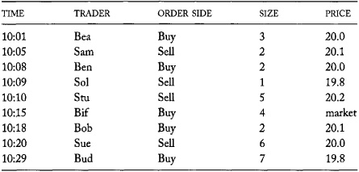

### 6.2.2 The Matching Procedure

Order matching proceeds after the market ranks its orders. In a call
market, this happens immediately following the market call. In a
continuous market, it happens whenever a new order arrives.

**TABLE 6-2.**\
Example Order Book

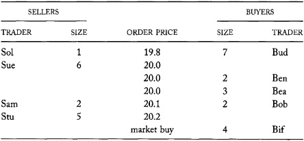

The market first matches the highest-ranking buy and sell orders to each
other. If the buyer will pay at least as much as the seller demands, the
match will result in a trade. The price of the trade will depend on the
trade pricing rules of the market, which we discuss below. If one order
is smaller than the other, the smaller order will fill completely. The
market then will match the remainder of the larger order with the next
highest-ranking order on the opposite side of the market. If the first
two orders are the same size, both will fill completely. The market then
will match the next highest-ranking buy and sell orders. This process
continues until the market arranges all
possible trades. Since the market processes orders ranked by decreasing
price priority, the last match that results in a trade often involves
two orders that bid and offer the same price. The next match does not
result in a trade because the buyer's bid price is below the seller's
offer price.

#### 6.2.2.1 Order-matching Example

Suppose that the traders in the previous example submit their orders to
a call market auction that calls at 10:30. At 10:30, the market will
arrange trades as follows:

1\. The market first matches Sol's order to sell 1 at 19.8 with Bif's
order to buy 4 at the market. This match fills Sol's order and leaves
Bif with a remainder of 3 to buy at the market. Sol can trade with Bif
because Bif's market order has no price restriction.

2\. The market then matches Bif's remainder of 3 with Sue's order to
sell 6 at 20.0. Sue's order goes next because it has the highest
precedence on the sell side now that Sol's order is filled. This match
fills the remainder of Bif's order and leaves Sue with a remainder of 3
to sell at 20.0. Bif can trade with Sue because Bif's market order has
no price restrictions.

3\. The market then matches Sue's remainder of 3 with Bob's order to buy
2 for 20.1. This match fills Bob's order and leaves Sue with a remainder
of 1 to sell at 20.0. Sue can trade with Bob because Bob is willing to
pay more than Sue demands.

4\. The market then matches Sue's remainder of 1 with Bea's order to buy
3 for 20.0. This match fills the remainder of Sue's order and leaves Bea
with a remainder of 2 to buy for 20.0. Sue can trade with Bea because
Sue is offering 20.0 and Bea is bidding 20.0. The only price at which
they can trade is 20.0.

The next match does not result in a trade. Bea's remainder of 2 to buy
for 20.0 cannot trade with Sam's order to sell 2 at 20.1 because Bea
will not pay as much as Sam demands. No further trades are possible.
[Table 6-3](#part0014.html_ch06tab3) summarizes the trades.

The order book with the remaining unfilled orders appears in [table
6-4](#part0014.html_ch06tab4). Note that the buy and sell
orders no longer overlap. If this market now started continuous trading,
the market quote would be 20.0 bid for 4, 2 offered at 20.1. Continuous
markets always have a spread between the best bid and the best offer. If
they did not, a trade would result.

**TABLE 6-3.**\
Call Market Trades

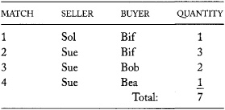

**TABLE 6-4.**\
Order Book After the Market Call

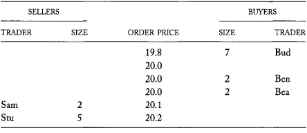

### 6.2.3 Trade Pricing Rules

The trade pricing rules depend on the type of market. Single price
auctions use the *uniform pricing rule*. Continuous two-sided auctions
and a few call markets use the *discriminatory pricing rule*. Crossing
networks use the *derivative pricing rule*. The following three sections
introduce these three rules and the markets associated with them.

## 6.3 THE UNIFORM PRICING RULE AND SINGLE PRICE AUCTIONS

Single price auctions are quite common. Most continuous order-driven
stock markets and most electronic futures markets open their trading
sessions with a single price call market auction. These markets also use
single price auctions to restart trading following a halt. Some call
markets also trade using single price auctions exclusively. Various
national treasuries use them to sell their bills, and the Arizona Stock
Exchange offers them for trading U.S. equities.

In a single price auction, all trades take place at the same
*market-clearing price*. The last match that leads to a feasible trade
determines the clearing price. If the buy and sell orders in this match
specify the same trade price, that price must be the market-clearing
price. Any other price would be either too high to satisfy the buy order
or too low to satisfy the sell order. Matching by price priority ensures
that this market-clearing price is also feasible for all previously
matched orders. These matches involve buy and sell orders with higher
(or at least equal) price priority. Since all buyers with higher price
priority are willing to trade at higher prices than the market-clearing
price, and all sellers with higher price priority are willing to trade
at lower prices than the market-clearing price, all matches can trade at
the market-clearing price.

If the buy and sell orders in the last feasible trade specify different
prices, the buy order will bid a higher price than the sell order
offers. The market can clear at either of these two prices or at any
price between them. The market rules will specify the clearing price in
this unusual event.

### 6.3.1 Single Price Auction Example

Suppose that the auction of the previous example is a single price
auction. The last feasible trade is between Bea and Sue. The
market-clearing price therefore must be 20.0.
Bea is unwilling to buy at any higher price, and Sue is unwilling to
sell at any lower price. Sol is happy with the market-clearing price
because he is a willing seller at 19.8. Bob is happy with the price
because he is a willing buyer at 20.1. We presume that Bif is happy with
the price because he submitted a market buy order. If the price is more
than he is willing to pay, he should have submitted a limit order
instead of a market order.

------------------------------------------------------------------------

**The Arizona Stock Exchange and Arizona**

The Arizona Stock Exchange (AZX) is an alternative trading system that
arranges single price auctions in listed and Nasdaq securities. Unlike
the single price auctions conducted at the NYSE open, the AZX auctions
provide users with continuous price and volume indications up to the
time of each auction.

The AZX has not been particularly successful, but its markets have
excited many traders. Recent changes in the timing of its auctions and
additions to the securities that it trades may substantially increase
its popularity.

R. Steven Wunsch founded the AZX as Wunsch Auction Systems. The firm
conducted its first auctions in 1991. Trading volumes did not grow
quickly, however, and the firm soon needed new financing.

In the early 1990s, the Commerce Department of the State of Arizona was
looking for ways to attract and finance high-tech industries. To improve
the state's image, Arizona provided a 2.9 million-dollar nonrecourse
loan to Wunsch Auction Systems. In exchange for this loan, the firm
changed its name to Arizona Stock Exchange, opened a small office in
Phoenix, and moved its computer there. Funding for the loan came from
Arizona's security registration fees. 

*Source: Author's interview with R. Steven Wunsch*.

------------------------------------------------------------------------

### 6.3.2 Supply and Demand

The single price auction clears at the price where supply equals demand.
The orders in the limit book determine the supply and demand schedules.
The *supply schedule* lists the total volume that sellers offer at each
price. It slopes upward because sellers will sell more at higher prices
than at lower prices. The *demand schedule* likewise lists the total
volume that buyers want at each price. It slopes downward because buyers
will buy less at higher prices than at lower prices.

These schedules allow us to determine how much the market can trade at
any given price. Since the market cannot force buyers and sellers to
trade, the total trading volume at a given price is the minimum of
supply and demand at that price. At prices below the clearing price,
there is *excess demand:* Buyers want to buy more than sellers offer.
The supply schedule then determines the total quantity traded. Since the
supply curve slopes upward, the market could trade more volume at a
higher price. Likewise, at prices above the clearing price, there is
*excess supply:* Sellers offer more than buyers want. The demand
schedule then determines the total quantity traded. Since the demand
curve slopes downward, the market could trade more volume at a lower
price.

Single price auctions maximize the volume of trade by setting the
clearing price at the price where supply equals demand. At prices above
the clearing price, volume would decrease
along the demand curve. At prices below the clearing price, volume would
decrease along the supply curve.

Because prices and quantities are discrete, single price auctions often
have excess supply or demand at the market-clearing price. If there is
excess supply, all buyers at that price have their orders filled, and
the secondary precedence rules determine which sell orders fill. If
there is excess demand, all sellers have their orders filled, and the
secondary precedence rules determine which buy orders fill. Of course,
ranking by price priority ensures that all buy orders placed above the
market-clearing price and all sell orders placed below the
market-clearing price also fill.

#### 6.3.2.1 Supply and Demand Schedules

The supply and demand schedules for the orders in our example appear in
[table 6-5](#part0014.html_ch06tab5) and [figure
6-1](#part0014.html_ch06fig1). To construct these schedules,
first sum the total size bid or offered at each price. In our example,
the only sum that must be computed is on the buy side at 20.0 dollars,
where Ben's bid and Bea's bid total 5. Next, sum these quantities across
prices in order of decreasing price priority. Sum the supply schedule
from lowest price to highest price and sum the demand schedule in the
opposite direction. To compute excess demand schedule, subtract the
supply schedule from the demand schedule at every price.

Supply does not exactly equal demand at any price in this example. The
two schedules are closest at 20.0 and 20.1. The market-clearing price is
20.0 because more volume can trade at 20.0 than at 20.1. At 20.0, where
there is excess demand, the supply schedule indicates that 7 will trade.
At 20.1, where there is excess supply, the demand schedule indicates
that only 6 will trade.

The market-clearing price is easy to find in the following plot of the
supply and demand schedules. The two schedules cross at the
market-clearing price of 20.0. The schedules are not smooth because the
order prices and quantities are discrete. (See [figure
6-1](#part0014.html_ch06fig1).)

[Table 6-6](#part0014.html_ch06tab6) and [figure
6-2](#part0014.html_ch06fig2) show that the supply and demand
schedules no longer cross following the auction. No further trades are
possible.

### 6.3.3 Trader Surpluses

The single price auction also maximizes the benefits that traders derive
from participating in the auction. To explain why, we must first discuss
how to measure the benefits that traders obtain from trading.

**TABLE 6-5.**\
Single Price Auction Example Supply and Demand Schedules

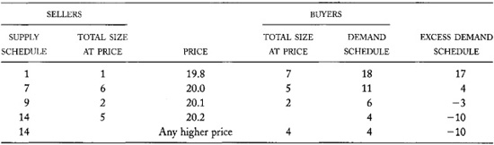

**FIGURE 6-1.**\
Single Price Auction Example Supply and Demand Schedule Plot

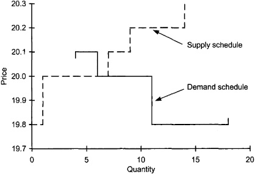

Economists measure trader benefits by computing their surpluses. For a
seller, the *trader surplus* is the difference between the trade price
and the seller's valuation of the item. For a buyer, it is the
difference between the buyer's valuation and the trade price. Since
sellers should never offer to sell at prices below their valuations and
since buyers should never bid at prices above their valuations, trader
surpluses should always be positive. Trader surplus measures the *gains
from trading*. All traders would like to maximize their surpluses.

------------------------------------------------------------------------

**Trader Surplus Example**

A confectioner is willing to pay 28 cents per pound for two carloads of
refined domestic sugar, each of which holds 112,000 pounds of sugar. If
he can buy sugar for 23 cents per pound, his total trader surplus will
be (0.28 − 0.23) × 112,000 × 2 = 11,200 dollars. 

------------------------------------------------------------------------

When a buyer and a seller trade, the sum of their surpluses does not
depend on the trade price. It depends only on the difference in their
valuations. The buyer's surplus is the buyer's valuation minus the trade
price. The seller's surplus is the trade price minus the seller's
valuation. Their combined surplus therefore is the buyer's valuation
minus the seller's valuation. Auctions maximize total surplus by
matching the buyers who most value the item with the sellers who least
value it.

The distribution of the surplus does depend on the trade price. The
seller naturally wants to receive a high price, and the buyer wants to
pay a low price.

**TABLE 6-6.**\
Supply and Demand Schedules Following the Single Price Auction

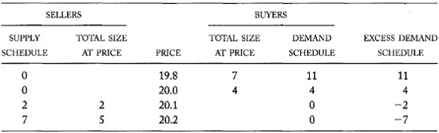

**FIGURE 6-2.**\
Supply and Demand Schedules Following the Single Price Auction

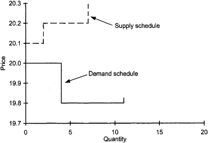

Measuring trader surpluses is difficult because we never know the values
that traders place on the items they trade. Traders reveal some
information about their valuations through their orders. Rational buyers
should never set a limit price above their valuations. Buyer valuations
therefore should be greater than or equal to their limit prices. Seller
valuations likewise should be less than or equal to their limit prices.
Traders who submit market orders presumably expect to trade at prices
they would accept. Market order buyers therefore should have valuations
above the clearing price, and market order sellers should have
valuations below the clearing price.

The single price auction maximizes total trader surplus if the outcome
of the auction satisfies all traders. The outcome will satisfy all
traders if no trader regrets trading, and if no potential trader regrets
not trading. No trader will regret trading if he or she bids and offers
rationally. In particular, no buyer should bid more than his valuation,
and no seller should offer less than her valuation. Traders regret not
trading when they fail to trade and wish that they had. This can happen
when they do not price their orders aggressively enough to participate
in the auction. They then may fail to trade at a price that would have
satisfied them. If traders set their limit prices equal to their
valuations, the auction outcome will always satisfy all traders.

The single price auction maximizes total trader surplus (if the outcome
of the auction satisfies all traders) because it uses price priority to
determine who trades. Matching by price priority matches the buyers who
value the item most with the sellers who value it least. To maximize the
total surplus, these traders must trade because their surpluses are
greatest.

The clearing price is the dividing line between buyers who value the
item highly and potential buyers who value it less. It also divides
sellers who do not value the item much from potential sellers who value
it dearly. The resulting trades include every buyer who values the item
by more than the clearing price and every seller who values the item by
less than the clearing price. They exclude
every potential buyer who values the item by less than the clearing
price and every potential seller who values the item by more than the
clearing price. Because the same clearing price divides both the
successful buyers from the potential buyers and the successful sellers
from the potential sellers, no successful buyer will have a lower
valuation than will any successful seller.

------------------------------------------------------------------------

**An Inexperienced Bidder**

John wants to buy a 1-million-dollar, two-year U.S. Treasury note that
pays 5[⅜]{.ent1} percent interest. The U.S. Treasury will sell the note
in a single price auction. The Treasury will offer 6 billion dollars of
these notes. Buyers must express their bids in yield percentages. The
Treasury computes the actual dollar price for the note from the
market-clearing yield. A high yield implies a low price, and vice versa.

John will accept a yield of 5.400 percent. John mistakenly believes that
his bid may affect his purchase price. He therefore bids 5.500 percent
in the hope of obtaining a lower purchase price. The auction-clearing
price turns out to be 5.495 percent, which corresponds to a price of
99.776 dollars per 100-dollar face value. John does not buy because his
bid was too low. (His quoted yield was too high.) Since he was willing
to pay the clearing price, he will regret not trading.

Had John bid his 5.400 valuation, he would have bought the note and
received a yield of 5.495 percent. His small order probably would have
had little or no effect on the clearing price. If John thinks carefully
about what happened, he probably will not make the same mistake again.

------------------------------------------------------------------------

Any other trading arrangement will reduce the total trader surplus. For
example, in markets that arrange trades at multiple prices, a successful
buyer in one trade might value the item less than does a successful
seller in another trade. In that case, the buyer would have bought the
item at a lower price than the seller would have sold it. Having this
buyer sell the item back to this seller at an intermediate price would
increase the total surplus.

#### 6.3.3.1 Trader Surpluses in the Single Price Auction Example

The trader surpluses for the single price auction example appear in
[table 6-7](#part0014.html_ch06tab7). The analysis assumes
that the limit order trader valuations are equal to their limit order
prices and that the market order buyer's valuation is arbitrarily equal
to 20.3.

**TABLE 6-7.**\
Trader Surpluses in the Single Price Auction Example

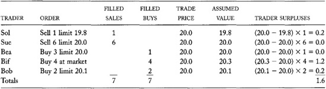

## 6.4 THE DISCRIMINATORY PRICING RULE AND CONTINUOUS TWO-SIDED AUCTIONS

Continuous rule-based order matching systems use the *discriminatory
pricing rule* to price their trades. The rule is the same discriminatory
pricing rule that oral auctions use. (Both are examples of two-sided
auctions.) To see how continuous order-matching auction markets apply
the rule, consider first how they operate.

Continuous auction markets maintain an *order book* to keep track of
standing orders that are waiting to fill. The buy and sell orders are
separately sorted by their precedence. The highest-priced bid and the
lowest-priced offer are the best bid and the best offer.

When a new order arrives, the matching system attempts to arrange a
trade between the new order and the order on the opposite side with the
highest precedence. A trade is possible only if the new order offers
terms acceptable to that order. If the new order is a buy order, the
order must indicate that the trader will pay at least the best offer
price. If it is a sell order, the order must indicate that the trader
will sell at or below the best bid. If a trade is possible, the new
order is *marketable*. Market orders and aggressively priced limit
orders are marketable orders.

If the new order is not marketable, the market places it in the order
book---according to its precedence---to wait for orders to arrive on the
opposite side. Traders who do not want their unfilled orders to stand in
the book must attach a fill-or-kill or an immediate-or-cancel
instruction to their orders.

If the new order is marketable, the matching system arranges a trade by
matching the new order with the highest-ranking order on the other side
of the market. If this trade does not completely fill the new order, the
market then matches the remainder of the new order with the next
highest-ranking order on the other side. This process continues until
the new order fills completely or until no further trades are feasible.
The market places any remaining size in the order book unless the trader
instructs otherwise.

Under the *discriminatory pricing rule*, the limit price of the standing
order determines the price for each trade. If the market matches a large
incoming order with several standing limit orders placed at different
prices, trades will take place at the various limit order prices.

## 6.4.1 Continuous Trading Example

Suppose that traders submit the same set of orders used in the single
price auction example to a continuous two-sided auction market. These
orders appear in [table 6-1](#part0014.html_ch06tab1). This
section explains what would have happened. We assume that the limit
order book was empty at the start of trading.

1\. At 10:01, Bea submits the first order. The market cannot match it
with any other order because no standing orders are in the book. The
market places Bea's order to buy 3 limit 20.0 in the book. The market
quote is now 20.0 bid for 3, no offer.

2\. At 10:05, Sam submits the second order, to sell 2 limit 20.1. Sam
cannot trade with Bea because Bea will not pay what Sam demands. The
market places Sam's order in the book. The market quote is now 20.0 bid
for 3, 2 offered at 20.1. In some electronic screens, the quote
would appear as "20.0-20.1 3 × 2." Traders
read this as "20 to a dime, 3 by 2," or "20 bid for 3, 2 offered at a
dime."

3\. At 10:08, Ben submits the next order, to buy 2 limit 20.0. This
order is at the same price as Bea's buy order. The market places it in
the book behind Bea's order because Bea has time precedence. The market
quote is now 20.0 bid for 5, 2 offered at 20.1.

Order Book After First Three Orders

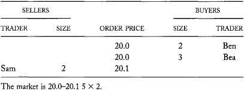

4\. At 10:09, Sol submits the next order, to sell 1 at 19.8. Sol's order
is marketable because it can trade immediately upon submission. The
market matches Sol's order with Bea's buy order, which has highest
precedence on the buy side. Sol's order fills, and Bea's order leaves a
remainder of 2. The trade price will be 20.0, the price of Bea's
standing limit order. Note that Sol sells for 20.0, although he would
have been willing to accept as little as 19.8. The market quote is now
20.0 bid for 4, 2 offered at 20.1.

Order Book After Four Orders

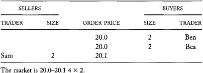

5\. At 10:10, Stu submits the next order, to sell 5 limit 20.2. Stu's
order is less aggressively priced than Sam's sell order. The market
places it in the book behind Sam's order. The market quote is still 20.0
bid for 4, 2 offered at 20.1.

Order Book After Five Orders

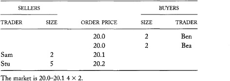

6. At 10:15, Bif submits the next order, to
buy 4 at the market. The market first matches the order with Sam's sell
order. This match fills Sam's order and leaves Bif with a remainder of
2. The trade price will be 20.1, the price of Sam's standing limit
order. The market then matches the remainder of Bif's order with Stu,
leaving Stu with a remainder of 3. The price of this second trade will
be 20.2, the price of Stu's standing limit order. The market quote is
now 20.0 bid for 4, 3 offered at 20.2.

Bif benefits from discriminatory pricing. The average price of the two
trades is 20.15. Had the market used the uniform pricing rule, Bif would
have had to pay the higher price of 20.2 for both trades.

Order Book After Six Orders

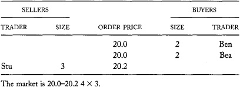

7\. At 10:18, Bob submits the next order to buy, 2 for 20.1. The order
cannot trade, but it does improve the buy side of the market. The market
quote is now 20.1 bid for 2, 3 offered at 20.2.

Order Book After Seven Orders

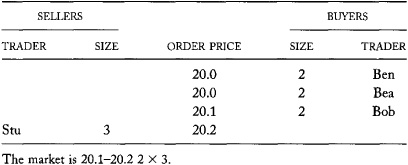

8\. At 10:20, Sue submits the next order, to sell 6 at 20.0. The order
trades 2 with Bob at 20.1, 2 with Bea at 20.0, and 2 with Ben at 20.0.
Sue benefits from the discriminatory pricing rule because her average
sale price of 20.033 is slightly higher than the sale price of 20
implied by the uniform pricing rule. The market now has no bid and has 3
offered at 20.2.

Order Book After Eight Orders

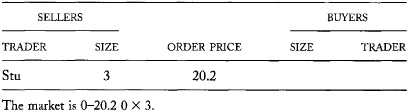

9. At 10:29, Bud submits the last order, to
buy 7 for 19.8. It cannot be filled, so the market places it in the
book. The market is now 19.8 bid for 7, 3 offered at 20.2.

Order Book After Nine Orders

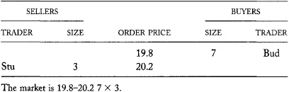

The market has now processed all the example orders from [table
6-1](#part0014.html_ch06tab1). [Table
6-8](#part0014.html_ch06tab8) summarizes the trades arranged
in this continuous auction.

### 6.4.2 Discriminatory Versus Uniform Pricing Rules

For a given set of standing orders, large impatient traders prefer the
discriminatory pricing rule to the uniform pricing rule. The
discriminatory pricing rule allows them to trade the first parts of
their orders at better prices than the last parts. Under the uniform
pricing rule, their entire orders would trade at the same price. That
price would be the worst price they would receive under the
discriminatory rule. Large impatient traders therefore trade at more
favorable terms when they can discriminate among the traders who offer
them liquidity.

Not surprisingly, for a given set of orders, standing limit order
traders prefer the uniform pricing rule. They do not want large traders
to discriminate among them. They would rather that all traders receive
the same price when filling a large order.

These conclusions assume that traders would issue the same orders
whether they traded under the discriminatory pricing rule or the uniform
pricing rule, hence the qualification "for a given set of orders." In
practice, traders issue different orders when trading in different
market structures.

**TABLE 6-8.**\
Trades in the Continuous Auction Example

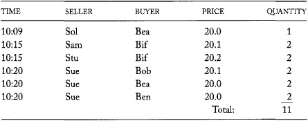

Limit order traders tend to issue more aggressively priced orders when
trading under the uniform pricing rule than under the discriminatory
pricing rule. When choosing a limit price, traders consider both the
probability that their orders will trade and the prices they will
receive if their orders trade. Under both
pricing rules, the order limit price determines its precedence, and
therefore its probability of trading. The two rules have different
effects on the trade price, however. Under the discriminatory pricing
rule, the limit price determines the trade price. Under the uniform
pricing rule, the limit price rarely determines the trade price unless
the order is very large relative to the other orders in the auction.
Limit orders often trade at better prices, especially when they trade
with large orders. Traders therefore are more aggressive when trading
under the uniform pricing rule than under the discriminatory pricing
rule. The benefits from price discrimination that large traders actually
obtain relative to uniform pricing therefore are smaller than they would
be if traders issued the same orders under either rule. The effects of
price discrimination on limit order traders likewise are overstated.

Since markets want to encourage traders to bid and offer aggressively,
continuous trading markets might consider adopting the uniform pricing
rule instead of the discriminatory pricing rule. Continuous markets
cannot enforce uniform pricing, however. Large traders who want to
price-discriminate can circumvent the uniform rule by breaking up their
orders and submitting them as a sequence of smaller orders. The first
parts will receive the best prices and the last parts will receive
inferior prices. They will thus obtain discriminatory pricing for their
full orders, even though the trade pricing rule calls for uniform
pricing. Under the discriminatory pricing rule, the market splits large
orders. Under the uniform pricing rule, traders would split their orders
before submitting them.

To effectively switch to a uniform pricing rule, continuous trading
markets must stop trading. Some continuous markets have *trading halt
rules* to achieve this purpose. These markets halt trading if a large
order imbalance would cause the price to move too far or too quickly.
(Their rules specify the conditions that stop trading.) They resume
trading after some time with a single price auction. The trading halt
therefore represents a transition from the discriminatory pricing rule
to the uniform pricing rule. Large traders can still break up their
orders, but doing so delays the execution of their trades. If the delays
are sufficiently long, they may discourage large traders from splitting
their orders.

Trading halts may also decrease volatility by alerting traders to
unusual demands for liquidity. If traders step in to supply liquidity,
prices may not change as much as they would have changed if the market
immediately processed the orders that caused the imbalance.

### 6.4.3 Continuous Markets Versus Call Markets

In [chapter 5](#part0013.html_ch05), we argued that the main
advantage of call markets is that they focus the attention of all
traders on the same instrument at the same time. The common focus makes
it easier for buyers and sellers to find each other. When traders can
easily find each other, the total trader surplus should be high.

We previously proved that the single price auction maximizes the gains
from trading. For a given order flow, no other method of arranging
trades can produce a higher total trader surplus than that produced in a
single price auction.

A comparison of the results from the single price auction example with
those from the continuous two-sided auction example confirms that the
continuous auction produces a smaller trader surplus when processing the
same order flow. The trader surpluses for the
continuous auction example appear in [table
6-9](#part0014.html_ch06tab9). The total surplus is 1.0, which
is smaller than the 1.6 total surplus of the single price auction.

**TABLE 6-9.**\
Trader Surpluses in the Continuous Auction Example

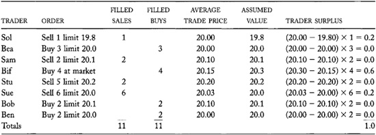

The continuous auction has a lower surplus because Sam and Stu both
sold, even though they have relatively high assumed valuations of 20.1
and 20.2. Since they both sold at their assumed valuations, they did not
contribute to the total surplus. However, Bif, who bought from them,
obtained a lower surplus than he would have in the single price auction
because of the higher prices.

If Sam and Stu do indeed value the item at 20.1 and 20.2, they
presumably would want to be buyers at 20.0. These valuations are higher
than the 20.0 valuation that Bea and Ben both have. After Sam and Stu
sold to Bif, Bea and Ben bought from Sue at 20.0 when Sue's sell order
arrived. More surplus would have been created had Sam and Stu been the
buyers instead of Bea and Ben. Had Sam and Stu repurchased their shares
at 20.0, their surpluses for these trades would have totaled (20.1 −
20.0) × 2 + (20.2 - 20.0) × 2 = 0.6. With these trades, the total
surplus for the continuous auction would have matched that of the single
price auction.

Sam and Stu would essentially have been trading as dealers had they
repurchased from Sue. In effect, their trades would have allowed Bif to
trade with Sue, even though Bif and Sue arrived at different times. Sam
and Stu's total trader surplus would have been their round-trip trading
profits. These profits are the benefits that dealers obtain from the
markets in order to facilitate efficient allocations among traders.

Although the continuous auction produces less trader surplus, it does
allow traders to trade when they want to trade. Bif paid a higher price
because he wanted to buy at 10:15. Had he known that Sue would arrive at
10:20, willing to sell at 20.0, he might have been willing to wait for
the better price. Instead, he paid Sam and Stu for the ability to trade
when he wanted to trade. Being able to trade when you want to trade is
valuable, but the trader surplus does not measure this benefit.

Assuming that both auctions received the same order flow, this analysis
of trader surplus demonstrates how the concentration of order flow
increases total trader surplus. In practice, traders will not send the
same orders to both market structures. Most
obviously, dealers will trade differently in continuous markets than in
call markets. Although they extract profits from the markets, they help
the markets efficiently allocate the item traded between the buyers and
the sellers.

For a given order flow, the single price auction will trade a lower
volume than the continuous auction. Volume therefore is a poor measure
of the ability of a market to produce trader surpluses. The clearing
price of a single price auction maximizes the total volume of trade
possible at a uniform price. Continuous markets can trade more than
single price auctions because they may trade at more than one price.
Exchanges could maximize their trading volumes by matching buyers with
sellers in order to minimize the difference between the buyer's
valuation and the seller's valuation for each trade. This strategy,
however, minimizes the total trader surplus.

## 6.5 THE DERIVATIVE PRICING RULE AND CROSSING NETWORKS

*Crossing networks* are the only order-driven markets that are not
auction markets. In a crossing network, all trades take place at prices
determined elsewhere. Crossing networks obtain their *crossing prices*
from other markets that trade the same instruments. Since the prices are
derived elsewhere, crossing networks use *derivative pricing rules*.

Crossing networks do not discover prices as auction markets do. In
auction markets, prices adjust to match buyers to sellers. In crossing
networks, prices are completely independent of the orders that traders
submit. Crossing networks only discover whether traders are willing to
buy or sell at the crossing prices.

The most important crossing networks trade U.S. equities. These include
ITG's POSIT, Instinet's Global Instinet Crossing, and the New York Stock
Exchange's After-hours Trading Session I. [Table
6-10](#part0014.html_ch06tab10) lists the major U.S. crossing
markets.

These crossing networks are all call markets. Traders submit buy and
sell orders to them before the call. After the call, the crossing
networks use their order precedence rules to match the buy orders with
the sell orders. All matches that can trade at the crossing price become
trades.

Instinet's Global Instinet Crossing and the NYSE's After-hours Trading
Session I both cross stocks after-hours, using 4 P.M. closing prices for
their crossing prices. Many traders use these systems because they
provide a second chance to trade at closing prices.

POSIT crosses stock eight times daily during regular trading hours. It
assigns crossing prices for its crosses by choosing a time at random
within the seven minutes that immediately follow each call. At that
time, POSIT computes the average of the bid and ask in each stock's
primary market and uses that price as the clearing price. Traders use
POSIT because it gives them an opportunity to fill their orders at the
midpoint of the spread without any price impact.

Since crossing networks do not choose market-clearing prices, they
invariably have excess demand or supply at their crossing prices. If
buyers want to buy more than the sellers offer, all sell orders fill
completely. If sellers want to sell more than the buyers offer, all buy
orders fill completely. Crossing networks allocate the fully filled side
to the oversubscribed side according to their order precedence rules.

**TABLE 6-10.**\
Major U.S. Crossing Networks

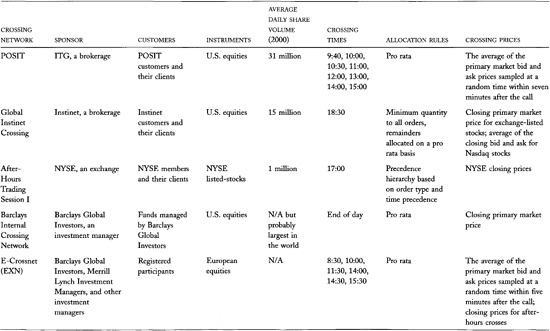

------------------------------------------------------------------------

**Pro Rata Allocation of
Excess Demand in POSIT**

Traders submit one sell order and two buy orders in Stewart Information
Services Corp. to the 1 P.M. POSIT cross. The sell order is for 3,000
shares. The two buy orders are for 5,000 and 10,000 shares.

POSIT uses pro rata allocation to allocate excess supplies and demands.
Since the total sell volume is 20 percent of the total buy order volume,
the entire sell order will fill and 20 percent of each buy order will
fill. The first buy order will trade 1,000 shares, and the second order
will trade 2,000 shares. 

------------------------------------------------------------------------

Crossing networks fill only a small fraction of the total order volume
that traders submit to them. Traders frequently find that no one is on
the other side of the market. Less than 10 percent of their order volume
ever crosses. Traders whose orders do not fill in crossing networks
often submit their orders elsewhere.

Traders use crossing networks because they allow buyers and sellers to
find each other without having any impact on prices. Although most order
volume does not fill, traders still attempt to cross orders because
crossing commissions are only 1 to 2 cents per share and because
crossing has no immediate market impact.

All three major crossing networks are completely confidential and
anonymous systems. They do not display trader orders, and they do not
display order imbalances following their crosses. Traders want this
confidentiality because most will submit the unfilled remainders of
their orders to other markets. They do not want other traders to know
what they intend to do. If the crossing networks displayed their orders,
traders would submit only a portion of their orders so as to avoid
displaying their full sizes. Since these networks profit only from
filled orders, they want traders to submit their full order sizes.

Some crossing networks operate continuously. These networks attempt to
arrange trades whenever orders arrive. Orders that cannot immediately
trade either wait in the system order book or are forwarded to other
markets. Many brokerages try to cross their customer orders before they
forward them to exchanges.

### 6.5.1 Price Ownership

Crossing networks work well only if traders will trade at their crossing
prices. If traders do not trust the crossing prices, they will not
trade. Successful crossing networks therefore must take their prices
from markets that produce credible prices.

The primary markets from which crossing networks obtain their crossing
prices believe that crossing networks unfairly compete with them. The
crossing networks take many orders that otherwise might go to them.
Since the orders that lead to crosses are the easiest orders to fill,
the primary markets complain that crossing networks skim the cream of
their order flow without properly compensating them for using their
prices. They argue that they should receive the crossing orders because
they produce the prices that crossing networks require to operate
successfully.

Crossing network customers rebut this argument by asserting that they
should not have to pay for price discovery when they do not participate
in it. Crossing market traders who also submit orders to primary markets
further argue that primary market prices should belong to them because
their orders produce the prices.

### 6.5.2 Problems with Derivative Pricing

Traders who trade at derivative prices must be aware of two problems
with such prices. They must be sure that these prices are not stale, and
they must be sure that other traders do not manipulate these prices. A
*stale price* is an old price that no longer accurately reflects the
value of an instrument. A *manipulated price*
is a price that a trader has deliberately changed in order to obtain
some advantage.

------------------------------------------------------------------------

**Informed Trading in Crossing Networks**

Stock values continue to change following the 4 P.M. close of equity
trading in the primary U.S. listing markets (the NYSE, AMEX, and
Nasdaq). After the close, corporations may release news; governments may
release reports; many significant events may take place; and people may
change their opinions about values as they reflect on the day just
ended.

We observe direct evidence of these changes in value by watching the
prices of listed stocks that continue to trade at the regional exchanges
until 4:30 P.M., and Nasdaq stocks that continue to trade after-hours in
various ECNs. We also see changes in index futures contracts and index
option contracts that trade in Chicago until 4:15 Eastern Time.

Well-informed traders consider this information when submitting orders
to the crossing market and the NYSE After-hours Trading Session I. Both
systems cross in the early evening, using 4 P.M. closing prices. These
crossing networks generally receive more buy order volume than sell
order volume when prices have risen in after-hours trading, when there
is good news about security values, or when the closing price occurred
at the bid instead of the offer. Similar results hold when values
decrease.

To partially address the adverse selection problem, both crossing
networks do not conduct crosses for stocks that have significant
after-hours news events. 

------------------------------------------------------------------------

#### 6.5.2.1 Stale Prices and Well-informed Traders

The stale price problem arises when traders arrange trades at
predetermined prices. A price that was fair when it was determined may
not still be fair when the trade takes place. Instrument values may
change in the interval. Traders who assume that the price is still fair
will find that if they can easily arrange their trades, they will often
regret doing so. In addition, when they cannot arrange their trades,
they will often wish that they had. This happens because traders who
know that values have changed will eagerly trade at stale prices if they
can benefit from the change in value, and they will refuse to trade
otherwise. If values have risen, well-informed traders will eagerly buy
at the low stale price, and they will refuse to sell at that price. If
values have fallen, they will eagerly sell and refuse to buy.

The stale price problem is an *adverse selection* problem. The
well-informed traders select the side of the market on which to trade to
the disadvantage of their uninformed counterparts. Adverse selection is
one of the most important forces that affect trading. As the
accompanying box illustrates, it explains some empirical regularities
found in after-hours crossing markets.

------------------------------------------------------------------------

**Price Manipulation and Derivative Pricing**

Suppose that Bob has a contract to buy 500,000 shares of IBM from Sally
at the last NYSE trade before 1:30 P.M. Bob would like that price to be
low, and Sally would like it to be high. If Bob submits a 1,000-share
market sell order at 1:29:30 P.M. that depresses IBM's price by 3 cents,
he will save 15,000 dollars on his 500,000 share purchase at a cost of
only 30 dollars. 

------------------------------------------------------------------------

#### 6.5.2.2 Price Manipulation

The potential for price manipulation exists whenever traders agree to
trade at a price to be determined elsewhere in the future. The buyer and
seller both may be tempted to manipulate the price they will use for
their trade. The buyer would like a lower price, and the seller would
like a higher price. If their trade is large, one or both of the traders
may spend considerable resources to
manipulate the price. If both attempt to do so, however, their efforts
probably will cancel out, and both will lose.

------------------------------------------------------------------------

**Jesse Livermore's Manipulation of Some Bucketeers**

Jesse Livermore was a famous turn-of-the-century speculator. He
collaborated with Edwin Lefèvre to write an autobiography titled
*Reminiscences* of a *Stock Operator*. The book is a classic about
trading.

The book describes a number of manipulations in which Livermore
participated, as either victim or perpetrator. One such manipulation
occurred while he was trading in some illegal bucketeering shops.

A *bucketeer* is essentially a bookie who allows his customers to bet on
stocks. His business operates like a regular brokerage where traders buy
and sell stocks. The bucketeer fills the orders from his account,
however, rather than sending them to an exchange. Since the trade prices
in the bucketeer's shop are derived from the next trade prices that come
over the ticker tape, traders can manipulate them.

To profit from the bucketeers, Livermore simultaneously submitted orders
to five different bucketeers to buy 100 shares each of a somewhat
illiquid stock. At the same time, he submitted an urgent order to sell
100 shares of the same stock to a legitimate broker. The legitimate
broker wired the sell order to the New York floor, where it filled at a
low price. This low price allowed Livermore to buy from the five
bucketeers at a low price. Later, he conducted the same operation in
reverse. Although he lost money on the 100-share New York trades, he
more than made it up on the 500 total shares that he traded in the
bucketeering shops. 

------------------------------------------------------------------------

Price manipulation is illegal in the United States and in most other
countries. However, it may be more common than is widely acknowledged
because it usually is hard to detect.

Since POSIT traders submit their orders before the crossing prices are
determined, a potential for price manipulation exists in the primary
markets. Traders who believe that they will buy in POSIT have an
incentive to place sell orders in the primary market to lower prices
there, and thereby lower the POSIT crossing price. POSIT sellers
likewise would like to raise the primary market prices. If the crossing
trade is large and if traders can move the primary market with a small
order, this strategy can be profitable.

To discourage price manipulation, POSIT picks its crossing prices at
random times within seven minutes following the call. Potential
manipulators must therefore depress prices for a seven-minute period
rather than at a single point in time. This procedure increases the
costs of manipulation by increasing the number of orders that
manipulators would have to submit. The greater number of orders also
makes it easier to detect and prosecute manipulators.

POSIT also frustrates potential manipulators by keeping all orders
confidential and by reporting crosses only after it prices them. POSIT
traders therefore cannot know before the cross whether they will trade
and how much they will trade. To protect themselves from market
manipulators, POSIT traders likewise should not allow other traders to
know about their orders.

The final settlement prices for cash-settled futures and option
contracts are derived from the cash prices of their underlying
instruments. Consequently, these prices are sometimes subject to
manipulation when these contracts expire. To prevent manipulations, some
cash-settled contracts specify that the
exchange may choose final settlement prices to represent fair values
when market values appear to be wrong.

## 6.6 SUMMARY

Order-driven markets include oral auctions, single price auctions,
continuous rule-based auctions, and crossing networks. These markets use
order precedence rules to match buyers to sellers, and trade pricing
rules to price the resulting trades.

The trading rules are very important. They affect how traders behave,
and they determine who has power and privilege in the market. Since
these rules affect how traders form their order submission strategies,
they greatly influence whether traders decide to supply or take
liquidity.

The first precedence rule at all markets is the price priority rule.
This rule encourages traders to bid high and offer low. Various
secondary precedence rules then follow. Time precedence rules encourage
traders to submit their orders early. In conjunction with price
priority, time precedence rules also encourage traders to bid high and
offer low. Display precedence rules encourage traders to display their
orders. Public order precedence rules give power to public traders over
exchange members. Depending on the market, size precedence rules may
give precedence to large traders or to small traders.

Trade pricing rules vary by market type. Continuous trading auction
markets use the discriminatory pricing rule. This rule favors large
liquidity-demanding traders over small liquidity suppliers. Single price
auctions use the uniform pricing rule. This rule gives power to small
liquidity suppliers at the expense of large traders. Crossing networks
use the derivative pricing rule. This rule favors well-informed traders
over uninformed traders, and market manipulators over weak and honest
traders.

Many current issues in market structure involve order-driven markets.
Should oral auctions convert to automated auctions? Should crossing
networks exist, and if so, should they be better integrated with the
markets from which they derive their prices? Should markets organize
more single price auctions and should they encourage traders to
participate in them? How large should the minimum price increment be? In
general, which market structure is best?

Each market structure has its advantages and disadvantages. This chapter
identifies only some of the issues. To fairly compare market structures,
you need to know more about why people trade, how they trade, and what
brokers do. We will return to discussing the pros and cons of various
market structures in the last part of the book.

## 6.7 SOME POINTS TO REMEMBER

• Limit order traders favor the uniform trade pricing rule.

• Large market order traders prefer the discriminatory trade pricing
rule.

• Price priority is self-enforcing, but secondary precedence rules are
not.

• Secondary precedence rules require a large minimum price increment to
be economically significant.

• Single price auctions maximize trader surplus.

• Continuous auctions generate more volume for a given order flow.

• Markets that use the derivative trade pricing rule are subject to
price manipulation.

## 6.8 QUESTIONS FOR THOUGHT

• Should exchanges make the minimum price increment very small and get
rid of secondary precedence rules?

• Continuous trading markets that want to enforce a uniform pricing rule
must either prevent traders from splitting their orders or somehow
reprice earlier trades when traders do split their orders. Can you
imagine mechanisms that continuous order-driven exchanges can implement
in electronic environments in order to effectively enforce uniform
pricing? What considerations suggest that markets will not adopt such
mechanisms?

• Computerized traders in electronic trading systems have some of the
same informational advantages that floor traders have in oral auctions.
Some oral auctions have public order precedence rules to give public
traders more power in their markets. Should electronic trading systems
have a similar rule to give human traders precedence over computerized
traders?

• Should crossing networks pay for the right to use prices determined in
other markets to price their crosses? Who should own the prices produced
at exchanges?

• How does informed trading hurt uninformed traders who use crossing
networks to arrange trades at closing prices?

• Should automated trading replace floor-based trading?

• Suppose that a continuous auction starts the day with an empty book.
Only one buy and one sell order arrive during the day. The buy limit
price is 20 and the sell limit price is 19. If the buy order arrives
first, the trade price will be 20. If the sell order arrives first, the
trade price will be 19. The trader who first offers liquidity thus
receives the worst price. Is this sensible? What makes this example
unusual? What are the implications of this example for trading
strategies in very inactive markets?
