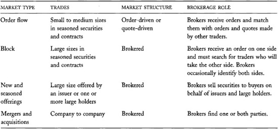
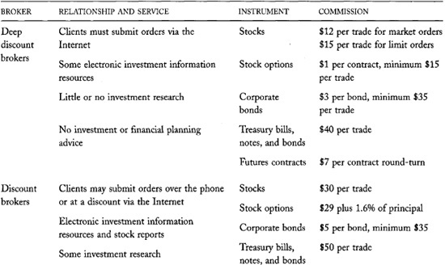
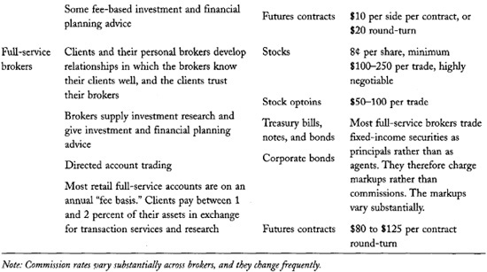

# Chapter 7: Brokers

*Brokers* are agents who arrange trades for their clients. Unlike
dealers, who trade with their clients, brokers trade their clients'
orders. Clients usually pay brokers *commissions* for their services.

Many brokers are also *financial advisers* who advise their clients
about their investments or their financial plans. They may also provide
their clients with investment information. In these capacities, they
often influence the trading decisions that their clients make.

Unless you arrange your own trades, you will use the services of a
broker when you implement your trading strategies. You therefore must
understand what brokers can do for you---and to you---in order to trade
effectively. This chapter describes what brokers do and the problems
that traders may have with lazy or dishonest brokers.

You also need to know what brokers do if you want to be a broker
yourself. The discussions in this chapter will allow you to better
understand how brokers compete with each other for business, and how the
best brokers win these competitions.

You must understand what brokers do in order to predict when electronic
order-matching systems will be successful. Automated order-driven
execution systems are essentially electronic brokers. Since traditional
brokers and electronic order-matching systems both match buyers to
sellers, they compete with each other. To fully understand either
system, you must understand the economics of both trading systems.

Finally, you must understand what brokers do if you are interested in
the distinctions that regulators make between automated order-driven
execution systems and traditional brokers. Some automated order-driven
execution systems are regulated as exchanges, whereas other nearly
identical systems are regulated as brokers. If you are interested in
these distinctions, you must ask how the order matching done by
traditional brokers differs from the order matching done by automated
systems.

We begin this chapter by considering how brokers serve their clients,
how they organize their operations, and what determines their profits.
We then discuss how the most important management problem---the
principal-agent problem---affects brokers and their clients. The chapter
closes with a discussion of problems that traders can have with
dishonest brokers, and how traders can prevent these problems.

## 7.1 WHAT BROKERS DO

Brokers arrange trades for their clients. They search for traders who
are willing to trade with their clients; they represent their clients at
exchanges; they arrange for dealers to fill their clients' orders; they
introduce their clients to electronic trading systems; and they match
their clients' buy and sell orders.

**TABLE 7-1.**\
Types of Brokered Transactions

Brokers conduct these activities in various types of markets. In *order
flow markets*, brokers take orders that their clients give them and
match them with orders and quotes made by other traders. Exchanges,
dealers, or the brokers themselves may operate these markets. Brokers
generally search for the best price only among traders who are willing
to display their limit orders and quotes in these markets. In *block
markets*, brokers take large client orders and try to find other traders
to fill them. Brokers often must search among traders who have not
expressed interest in trading to discover those traders who are willing
to trade. In *offering markets*, brokers distribute new issues and
seasoned issues to traders. Brokers often must market these securities
to generate buyer interest. Finally, in *merger and acquisition
markets*, brokers help firms buy other firms. Brokerage firms that
engage in large capital transactions are called *investment banks.*
[Table 7-1](#part0015.html_ch07tab1) summarizes the different
types of brokered transactions.

Only the largest investment banks operate in all types of markets. Most
brokerage firms specialize in only one or two of these markets.

In all markets, brokers are their clients' agents. Their clients tell
them what trades they want to make, and under what terms they will
trade. The brokers then try to arrange the best trades that they can,
subject to the constraints imposed upon them. Generally, clients expect
that brokers will seek the lowest possible prices when buying and the
highest possible prices when selling.

Clients use brokers to arrange their trades because brokers usually can
arrange trades at a much lower cost than their clients can. The
following reasons explain why brokers are low-cost traders:

• Brokers can solve clearing and settlement problems at a lower cost
than their clients can.

• Brokers can access exchanges and dealers that their clients cannot
access.

• Brokers generally know better than their clients who might be willing
to trade.

• Brokers are often better negotiators than
their clients are.

• Brokers can represent orders for their clients when their clients are
unavailable to represent them themselves.

We examine these points in the remainder of this section.

### 7.1.1 Clearing and Settlement Among Traders

The most important, but perhaps least appreciated, reason why traders
use brokers to arrange their trades involves clearing and settlement.
Clearing and settlement problems can arise whenever traders do not
settle their trades immediately after they negotiate them. During the
time between arrangement and final settlement, traders risk that their
counterparts may not acknowledge their trades, may refuse to settle
their trades, or may be financially unable to settle their trades.
Traders therefore are reluctant to trade with people they do not know
are trustworthy and creditworthy.

Without the assistance of brokers, traders would have to check the
credit of every trader with whom they trade. Brokers assist traders by
helping them avoid this expensive problem.

Brokers solve clearance problems by clearing their clients' trades. If a
client fails to acknowledge a trade, the broker must resolve the problem
with the client. The broker thus protects the trader on the other side
of the trade.

Brokers solve the settlement problem either by guaranteeing that their
clients will settle their trades, or by staking their business
reputations on whether their clients will settle their trades. When
brokers guarantee their clients' trades, the brokers settle trades that
their clients will not. When the brokers simply vouch for their clients,
they risk losing future business if they acquire a reputation for
representing clients who do not settle their trades. In both cases,
brokers must ensure that they represent only trustworthy and
creditworthy clients. Otherwise, undesirable clients will impose
significant costs upon them. The credit function that brokers provide is
especially important in order-driven markets, since such markets
generally arrange trades among total strangers.

Brokers are especially good at solving settlement credit problems
because they know their clients. Brokers will not accept orders to buy
more than they believe their clients can afford, or to sell more than
they believe their clients have. To form these opinions, brokers
consider what securities and money their clients have on deposit with
them, and they consider their clients' past behavior. Brokers may also
consider other information that they obtain from their clients or from
credit agencies. Most brokers use electronic systems to manage this
information.

Brokers also can efficiently solve settlement credit problems because
they control assets that their clients deposit with them. When a broker
settles a trade on behalf of a client, but the client fails to settle
with the broker, the broker can liquidate assets in the client's account
to cover the trade. For example, if a client does not pay for a stock
that he bought, the broker can sell the stock and use the proceeds to
settle the trade. The broker can then charge any loss on the round-trip
to the client's account and, if necessary, liquidate assets in the
account to settle the debt. Likewise, if a client does not deliver a
security that she has sold, the broker can buy or borrow the security
from another trader and use it to settle the trader's sale. The broker
can then liquidate assets in the account to settle the debt.

------------------------------------------------------------------------

**Multiplying Credit
Checks**

When traders arrange trades that they intend to settle in the future,
they must be confident that their counterparts can and will perform.
Traders routinely perform *credit checks* to determine whether their
counterparts are creditworthy.

In a market with no brokers, each trader must be prepared to check the
credit of every other trader. If exactly 1 million traders trade in such
a market, the total number of potential credit relationships is
999,999,000,000, or slightly less than one trillion. In such markets,
traders will check the credit only of traders with whom they intend to
trade. They will naturally prefer to arrange trades only with traders
whose credit they have already checked.

Now suppose that this market has brokers who guarantee their clients'
trades. Three types of credit relationships are present in this economy:

1\. Brokers must check the credit of their clients to protect
themselves.

2\. The clients must check the credit of their brokers to ensure that
they can trust them. These credit checks may be perfunctory if everyone
knows that a broker is creditworthy.

3\. Each broker must check the credit of every other broker with whom he
or she arranges trades.

If the market has 100 brokers, each of whom serves 10,000 different
clients, the total number of potential credit relationships is only
2,009,900. This sum is 500,000 times smaller than the total number of
potential credit relationships in the economy without brokers!

------------------------------------------------------------------------

------------------------------------------------------------------------

**Membership Has Its Benefits**

Some large traders become exchange members so that they do not have to
trade through brokers. By employing their own traders, they obtain
greater control over their trades, and they avoid exposing their orders
to brokers they may not trust. 

------------------------------------------------------------------------

### 7.1.2 Brokers Provide Access to Exchanges

Traders also use brokers because brokers can provide access to exchanges
that they cannot access themselves. Exchanges generally allow only their
members to trade. Nonmembers who want to trade must have members arrange
trades for them. The most important reasons why exchanges exclude
nonmember traders involve clearing and settlement issues and the need to
regulate traders on exchange floors.

#### 7.1.2.1 Clearing and Settlement at Exchanges

Since order-driven exchanges often arrange trades among strangers, they
generally do not allow anyone to trade who does not have an approved
credit relationship with the exchange clearinghouse or with a clearing
member who will guarantee settlement of their trades. Since most traders
do not have these relationships, they must trade through brokers who do.

Some brokers neither clear nor execute their own trades. Instead, these
*introducing brokers* pass their order flow to another broker who is a
clearing member. The clearing member is then responsible for execution,
clearing, and settlement. Introducing brokers are so called because they
introduce their clients to other brokers. Introducing brokers usually
establish the commission rates that their clients pay, even though their
clients' accounts are carried *on account* of a clearing member.
Clearing members charge their introducing brokers for transaction
services.

Many brokers allow their clients *direct access* to the electronic
order-routing systems that exchanges, dealers, ECNs, and other brokers
maintain. When these systems connect to automated order execution
systems, the clients effectively become the traders. The brokers,
however, usually remain responsible for guaranteeing settlement.

------------------------------------------------------------------------

**What's Happening
Here?**

Most first-time visitors to the floor of an exchange---especially a
futures exchange---are overwhelmed by sensory overload. Although the
activity on exchange floors is highly organized, it appears very chaotic
to infrequent visitors. Traders and clerks wearing multicolored jackets
run everywhere, carrying papers. People yell loudly, gesture wildly, and
pass hand signals among themselves. Brokers talk on their telephones and
enter information into their handheld computers. Discarded paper litters
the floor. Bells occasionally sound, personal pagers beep, and
telephones ring constantly. Overhead monitors display constantly
changing information, television screens present network talking heads
pointing at lines and numbers, and electronic ticker tapes scroll
continuously.

After visitors overcome their sense of awe, their next emotion is
usually frustration. They generally cannot follow what is happening.
They get confused about who is buying, who is selling, and what they are
trading. They cannot distinguish between prices and quantities, and the
prices they hear often do not make sense.

Trading is hard for novices to understand because traders use jargon,
abbreviations, body language, and hand signals to save time and reduce
trading errors. For example, most traders yell only the last digits when
quoting a price. When they bid 10, they assume that everyone knows that
they mean 147.10. They do not say 147.10 because it takes too long and
because they do not want to confuse anyone with unnecessary digits. When
they name an instrument, they often use nicknames or ticker symbols that
a novice does not recognize. They may not even name the instrument when
other traders know what they are talking about from the context. Trader
jargon like "I'll take 30 at the figure" is hard to understand without
knowing that take implies that I am a buyer, and the *figure* means the
closest integer price.

No new trader walks in off the street and starts to trade in such
markets. Instead, most traders start as clerks working for other traders
or for the exchange. If they pay close attention and are reasonably
sharp, they get the hang of things in a few weeks, and they master the
language in a few months. At that point, they may not be able to trade
well, but they will know what is going on, and they should not be a
liability to other traders. 

------------------------------------------------------------------------

Clients who have direct access to trading systems are often called
*subscribers.* Public subscribers to a trading system must have a broker
sponsor and authorize their trades. To help brokers manage credit
relations with their sponsored subscribers, many electronic trading
systems allow brokers to set real-time credit limits on their subscriber
accounts.

#### 7.1.2.2 Floor-based Trading Skills

Floor-based exchanges exclude nonmember traders from their floors
because orderly trading on floor-based exchanges requires skilled
traders who know the trading rules, the trading protocols, the
specialized jargon, and the sign languages that traders use to negotiate
their trades. Traders use these skills to increase the speed and
accuracy of their trading.

Most markets do not allow their members to trade until they pass an
examination which demonstrates that they have mastered basic trading
skills. The examination protects traders from
unskilled traders who might slow the markets, confuse others, and
generate mistakes.

### 7.1.3 Brokers Provide Access to Dealers

Many traders use brokers to access dealers that they cannot access
themselves. Brokers provide this service primarily to retail clients.
Retail traders rarely trade directly with dealers because credit,
clearance, and settlement relationships are expensive to establish.
Neither retail traders nor dealers want to pay for creating
relationships they will not use often. Retail clients also use brokers
to trade with dealers because brokers usually have better information
about which dealers are offering the best prices or will likely offer
the best prices than do their clients.

Institutional clients often trade directly with dealers. Their large and
frequent trades make the costs of establishing direct access
relationships relatively small compared to the benefits of direct
access. Institutional traders usually employ *buy-side traders* to
negotiate trades with dealers. These traders typically have information
systems that allow them to see all dealer quotes, and they can rely upon
their experience to determine which dealers will most likely offer them
the best prices. Buy-side traders generally do not pay commissions to
dealers when they arrange their trades. Instead, they trade on a *net
price basis.* The dealers price the trades to recover any expenses that
commissions would otherwise fund. In the U.S. equity markets, this
practice is changing as bid/ask spreads have narrowed in response to the
2001 decimalization.

### 7.1.4 Brokers Are Expert Traders

Many traders use brokers because brokers are experts at trading. Brokers
generally know more about who wants to trade than do their clients, they
are better negotiators than are their clients, and they are better able
to manage order exposure than their clients can. In this subsection, we
consider each of these areas of expertise.

#### 7.1.4.1 Block Brokers

The most successful block brokers know who wants to trade, and who would
want to trade if they were presented with suitable trading
opportunities. They can predict what securities will interest their
clients and at what prices their clients will be interested. They use
this information to arrange trades.

Brokers learn about their clients by paying close attention to them.
They talk with them frequently, and they study their portfolios to
determine what interests them. If their clients manage money for others,
brokers will also consider the interests of their clients' clients.

#### 7.1.4.2 Better Negotiators

Traders use brokers to negotiate transactions---especially very large
ones---on their behalf. Good negotiators must be careful about the
information they reveal when negotiating. Depending on their negotiating
strategy, they may want to hide information or they may want to bluff
credibly. In either event, they must represent their positions clearly
and convincingly. Good negotiators also must create relationships in
which their counterparts are willing to compromise and accommodate.

Not everyone negotiates effectively. Many of us cannot adequately
control our emotions when discussing issues about which we care deeply.
We may be nervous about losing a valuable opportunity, desperate to
avoid further loss, mad about our circumstances, too eager to please,
too proud, too modest, or unable to control our egos. Our emotions often
cloud our judgment and cause us to reveal information that does not
further our goals. Many of us cannot convincingly represent our true
positions or maintain a poker face when bluffing. Finally, and
unfortunately, many of us do not have adequate social skills to develop
productive relationships with people whose interests differ from our
own.

------------------------------------------------------------------------

**How to Break into the
Major Leagues**

Block brokers must know their clients well in order to serve them well.
New brokers often have trouble establishing relationships because
clients generally do not like to waste their time talking with brokers
who are not *players.* A *player* can offer valuable services to his or
her clients. Since new brokers usually do not know much about who would
want to take the other side of a trade, they have little to offer their
clients.

The problem that new brokers face involves a circularity. If they do not
know their clients well, they cannot serve them well. If they cannot
serve their clients well, their clients will not talk to them. If their
clients will not talk to them, they will not know them well.

Established brokers benefit from the opposite side of this circularity.
Since they know their clients well, they know who will trade what and at
what price. They therefore can provide them with good service. Clients
will talk with established brokers because they obtain good service from
them. Established brokers thereby get to know their clients well.

This circularity is an example of a *network externality.* Brokers who
have large networks of contacts can provide more service to their
clients than can brokers with few contacts. The more service that
brokers can provide to their clients, the more clients they will have,
and the bigger will be their networks of contacts. The network
externality allows the strong to get stronger, and it ensures that the
weak have trouble competing.

To become players, new brokers must attract clients with something other
than information about who wants to trade. They most often offer
investment research. If their clients value their research, they will
form relationships that will allow the brokers to learn more about their
clients' trading interests.

New brokers also try to meet with their clients by entertaining them.
They often take them to fancy dinners, to the Super Bowl, to the NBA
finals, or to the theater. These contracts have a twofold purpose. The
brokers want to learn more about their clients so that they can serve
them better. They also want to generate goodwill so that their clients
feel obliged to use them.

Since well-established brokers compete with new brokers, they also
provide investment research and entertainment services to remain
competitive. They do not need to provide as much to stay in business as
they did to get established. Established brokers have an advantage
simply because they know more about who will trade, what they will
trade, and at what prices they will trade than do new brokers.

The economics of brokerage markets implies that the best brokers are
those who work hardest to learn about their clients. The network
externality ensures that their productivity per hour worked increases as
the time they work increases. Accordingly, brokers often work long hours
without much vacation. When they do vacation, they often do so at
conferences where they can meet their clients. Brokers therefore host
many client conferences at which they entertain them, educate them,
generate goodwill, and, most important, learn about what trades might
interest them. The need to continuously relate to their clients also
explains why most brokers vacation during the same months that their
clients do. 

------------------------------------------------------------------------

------------------------------------------------------------------------

**Playing Poker on the
Floor**

Floor traders scrutinize every mannerism of the brokers around them.
They try to identify anomalous behaviors that might reveal information
about the orders which brokers hold. Floor traders especially consider
whether brokers appear nervous when they hold large orders.

Successful brokers therefore must be like good poker players. They must
not reveal anything about their orders other than what they want to
reveal. Not surprisingly, many brokers are very good poker players.

------------------------------------------------------------------------

Traders who recognize their shortcomings as negotiators often employ
brokers to negotiate on their behalf. Since brokers usually do not have
a stake in their negotiations other than in obtaining commissions for
closing successful deals, they are often much less emotionally involved
than their clients are. In addition, since brokers are merely agents,
they often do not know their clients' final positions. Clients therefore
can use their brokers to misrepresent their positions. If they later
need to back down, the brokers can save face by claiming that they
misunderstood their clients' instructions. If negotiations break down,
clients often blame their brokers, assert a misunderstanding, and then
start negotiations with new brokers. Although their adversaries may
recognize these tactics, if enough credible doubt exists about what
happened, productive negotiations may be renewed.

#### 7.1.4.3 Brokers Provide Order Exposure Management

Traders whose orders are likely to move the market significantly do not
want to widely expose their orders. Traders either will stand out of the
way until the order has its impact on the market price, or they will
trade ahead of the order to profit from its expected price impact. Both
strategies increase the costs of filling large orders.

The traders who are most concerned about these issues are those who are
widely known to be well informed and are known to trade in large size.
These traders would rather trade anonymously so that no one knows with
whom they are trading. If their orders are large, they typically expose
only parts of their orders so that no one knows their full sizes.

These traders employ brokers to represent them so that they can avoid
showing who they are and how large their orders are. Their brokers
display only to traders whom the brokers expect will be willing to fill
the orders. They take special care to avoid traders who will front-run
them. In markets where traders see all exposed orders, brokers break up
their orders so that other traders cannot determine their full sizes.
Large traders sometimes distribute their orders among several brokers so
that nobody knows the full extent of their interests.

Brokers add value to the trade process by knowing how best to expose
their clients' orders. Good brokers fill their large orders without
moving the market much. Poor brokers allow information about the order
to leak out so that its execution suffers.

### 7.1.5 Brokers Represent Limit Orders

Many traders employ brokers to represent orders that they cannot, or do
not want, to represent themselves. Clients who have other things to do
besides monitoring the market often give limit orders and stop orders to
their brokers to tell them what they want to do if market conditions
change. The brokers then monitor the market for them. This brokerage
function is more important for retail clients who do not spend much time
trading than for institutional buy-side traders whose jobs require that
they continuously pay attention to the markets.

### 7.1.6 Summary

Brokers provide many services to their clients. They help them identify
suitable counterparts, they help them negotiate their trades, they
represent their interests when they are unable or unwilling to represent
them themselves, and they help them clear and
settle trades. Traders use brokers because brokers generally can trade
more effectively and at a lower cost than they can.

## 7.2 THE STRUCTURE OF A BROKERAGE FIRM

We now consider how brokerage firms structure their operations to
provide transaction services to their clients. Since each brokerage
organizes its operations differently, the discussion in this section
cannot adequately represent all brokerage firms. The primary purposes of
the discussion are to introduce you to the complexity of brokerage
operations and to expose you to the jargon that brokers use to describe
their operations.

The activities of a brokerage firm consist of *front office* operations,
*back office* operations, and *proprietary* operations. All activities
that involve client contact occur in the *front office.* These
activities primarily involve soliciting and taking orders, executing
trades, and advising clients. *Back office* operations include all
activities that support the front office operations. Back office
departments clear and settle trades; maintain accounts; produce
investment research; and create and operate various information systems.
*Proprietary* operations include the cash and risk management activities
of the firm and any speculative trading that the firm conducts for its
own accounts. These classifications are somewhat arbitrary. We will use
them to organize our discussion of how brokers structure their firms.

------------------------------------------------------------------------

**Why Does the Archer Daniels Midland Company Broker Agency
Orders?**

The Archer Daniels Midland Company (ADM) is a large agricultural dealer,
shipper, and food processor. The company frequently trades in the
futures markets to hedge risks inherent in its businesses. It also
sometimes speculates in these markets, using information that it obtains
about market conditions from its extensive operations.

ADM is a member of many futures exchanges. It employs many floor traders
at these exchanges. The ADM traders trade proprietary ADM orders. They
also trade agency orders introduced to them through a subsidiary, ADM
Investor Services, that sells execution, clearing, and settlement
services to introducing brokers.

ADM undoubtedly hopes to profit from the fees it obtains from its agency
brokerage business. The subsidiary also provides ADM with an important
secondary benefit: The agency order flow makes it difficult for other
traders to determine when ADM is trading for its own accounts and when
it is trading for other traders. Consequently, ADM probably obtains
better execution for its proprietary orders. 

------------------------------------------------------------------------

### 7.2.1 Front Office Operations

Brokers solicit order flow by advertising and by contacting prospective
clients. They also often give their clients extensive investment
information and investment research to encourage them to use their
brokerage services. To further develop their business, they may
entertain their clients.

*Sales brokers* primarily interact with clients. They work in the *Sales
and Trading Department* of the firm. *Floor brokers* arrange trades at
exchanges and on their firm's trading floors. Their division of the firm
is often called *Floor Operations.*

Brokers who help distribute large stock and bond offerings generally
work in the *Corporate Finance Department* of the brokerage firm. They
work closely with sales brokers to distribute the issues.

Many brokerage firms employ *financial analysts* to produce investment
reports for their clients. The sales brokers use this information to
develop relations with their clients. These analysts usually specialize
in an industry or a commodity. Their primary responsibilities include
forecasting future prices and earnings. At investment banks, equity
analysts sometimes suggest mergers and acquisitions to brokers who work
in the Corporate Finance Department. Financial analysts also help
clients understand how they can use new trading instruments and
techniques to achieve their objectives. The financial analysts usually
work in the *Research Department* of the firm.

Most brokerages have *customer service agents* who help their clients
manage their accounts. These agents establish, transfer, and close
accounts; they take deposits and arrange withdrawals and transfers to
and from accounts; and they help their customers interpret their account
statements. They usually work in the *Customer Service Department.*

------------------------------------------------------------------------

**The Wednesday Trading
Halts of 1968**

By 1968, volumes in U.S. equity markets had grown to the point that
brokerage firms could not keep up with their paperwork. Accounting,
clearing, and settlement then still involved substantial manual efforts.
From June through December 1968, exchanges closed on Wednesdays to give
the back offices a chance to catch up. They also closed two hours early
on the other weekdays. Firms ultimately solved the "paperwork crisis" by
automating their accounts. 

------------------------------------------------------------------------

### 7.2.2 Back Office Operations

The back office of a brokerage is responsible for supporting the trading
activities of the firm and its clients. The primary responsibilities of
the back office include the following activities:

• Maintaining accounts.

• Clearing and settling trades.

• Providing the information systems that the firm uses to transmit
market data, quotes, orders, and confirmations to employees, clients,
dealers, exchanges, other brokers, clearing agents, settlement agents,
and custodians.

• Ensuring that the firm extends credit only to good credit risks.

• Ensuring that the firm and its clients comply with all regulations to
which they are subject.

Brokerage firms often place these activities under the supervision of a
*chief information officer* (CIO) who oversees all information systems.

#### 7.2.2.1 Accounting Systems

Brokerage firms now universally use computerized accounting systems to
keep track of their accounts and to clear and settle their trades. The
benefits of such systems are obvious and need no further comment.

Small brokerage firms and many large firms buy their accounting systems
"off the shelf" from system vendors. Some large brokers use their own
systems, in part because they designed them to meet their special needs,
but mostly because they built them before they could buy them cheaply.

#### 7.2.2.2 Corporate Reorganizations

Clients hold their securities in *street name* when they allow their
brokers or their depositories to hold them on their behalf. Traders
often hold their securities in street name to avoid losing them, to use
them as collateral for margin loans, and to ensure that they are
available for settlement when they want to sell them. When brokers hold
securities on behalf of their clients, they legally own them. Their
clients hold only corresponding interests in their accounts.

Brokers who hold securities in street name assume many responsibilities.
They must collect dividends and interest payments, and properly assign
them to the appropriate client accounts. They must keep track of and
properly handle corporate name changes, stock splits, mergers,
acquisitions, and liquidations. Finally, they must ensure that issuers
can communicate with their clients, the *beneficial owners.* The
*Corporate Reorganizations Department* of a brokerage firm generally
handles these activities.

#### 7.2.2.3 Market Data and Order-routing Systems

Brokerage firms invest very heavily in data and voice systems that allow
their brokers to communicate with their clients, with markets, with
dealers, and with each other. Third party vendors now mostly provide
these systems.

The simultaneous use of market data systems written by different vendors
can create significant coordination problems when the systems need to
exchange information. For example, clearing and settlement systems need
to report trades to accounting systems, and accounting systems need to
report positions to clearing and settlement systems.

Data systems are very hard to integrate when
they use different protocols for sharing information. The trading
software industry therefore developed several communications protocols
that make it easier for systems developed by different vendors to
exchange information with each other. The most important of these
protocols are the *Financial Information eXchange* (FIX) protocol and
the Open Financial Exchange (OFE) protocol. FIX primarily serves
institutional traders, and OFE primarily serves Internet-based retail
traders. These systems allow traders to route orders and other market
information in standard formats that all FIX- or OFE-capable systems can
interpret.

------------------------------------------------------------------------

**Squawk Boxes**

In many brokerages, traders need to talk with colleagues who may sit on
the other side of the trading room, or in another trading room that may
be thousands of miles away. To facilitate such communications, many
brokerage firms place *squawk boxes* at each trader workstation. Squawk
boxes are two-way intercoms that are always open. 

------------------------------------------------------------------------

#### 7.2.2.4 Credit Management

Brokerage firms often extend credit to their clients, to other brokers,
and to dealers. They extend credit to clients when they allow clients
who have insufficient money in their account to buy securities, when
clients sell securities that they do not have in their accounts, when
they lend money to clients on margin, and when they guarantee that their
clients will settle their contracts. Brokerage firms extend credit to
other brokerage firms and to dealers when they settle their trades, and
when they loan securities and money to them.

To ensure that they do not extend credit to poor credit risks, brokers
must carefully evaluate all credit relationships in which they are
exposed to potential loss. The *credit manager* of the firm is
responsible for checking credit and for managing credit risks.

#### 7.2.2.5 Compliance

The *compliance officers* of a brokerage firm ensure that the firm and
its clients comply with all applicable regulations. The regulations may
concern margins, trading practices, and *client suitability.* The
compliance officers of a brokerage firm usually reside in the
*Compliance Department* or the *Margin Department* of the firm.

Many regulators do not permit brokers to arrange trades that are not
suitable for their clients. A trade creates an unsuitable position if
the client cannot afford the potential loss of the position or cannot
reasonably appreciate the risk in the position. Brokers who allow their
clients to make such trades risk civil lawsuits or criminal prosecution.
To protect themselves from this risk, brokers must *know their
customers.* To this end, brokers often require that their clients tell
them about their finances and their trading experience. Questions about
these issues usually appear on account applications. Brokers
occasionally interview their clients when they become concerned about
the suitability of their trades or positions. Most brokers have
electronic systems that monitor their clients' accounts to ensure that
their trades are suitable for them.

------------------------------------------------------------------------

**How to FIX Babble**

The FIX protocol grew out of a desire by Fidelity Investments and
Salomon Brothers to link their information systems and thereby reduce
their traders' dependence on telephone calls and handwritten records.
Following their initial specification of the standard in 1992, they
invited other firms to participate in its further development.

FIX is now a public-domain specification owned and maintained by FIX
Protocol. The mission of the organization is "to improve the global
trading process by defining, managing, and promoting an open protocol
for real-time, electronic communication between industry participants,
while complementing industry standards." 

*Source:
[[www.fixprotocol.org](http://www.fixprotocol.org)].*

------------------------------------------------------------------------

### 7.2.3 Proprietary Operations

The *proprietary trading operations* of a brokerage firm include all
trading activities that the firm conducts for its *house account.* For
pure brokers, these activities primarily include cash management and the
borrowing and lending of securities. If the firm also engages in
*principal trading* as a dealer, speculator, or arbitrageur, the
proprietary trading operations of the firm include these activities.

------------------------------------------------------------------------

**Graduated College and
Thought You'd Never Have to Take an Exam Again?**

Some brokerage firms give their clients a written examination to prove
that they understand the risks inherent in their trades. Clients who do
not pass the examination cannot trade.

These examinations will become more common as brokers and their clients
increasingly relate to each other only through the Internet. The
examinations allow the compliance officers to certify the competency of
their clients. 

------------------------------------------------------------------------

#### 7.2.3.1 Cash Management and Stock Lending and Borrowing

Brokerage firms that hold client assets generally invest the cash and
often lend the securities. The cash managers of the firm try to keep all
cash balances fully invested. Brokers usually house their cash
management operations in the *Cashier's Department* under the
supervision of the firm's *cashier.* The employees responsible for
security lending operations are often those responsible for borrowing
securities for short selling. They are often housed in the *Margin
Department* or in the *Stock Loan Department.*

#### 7.2.3.2 Risk Management

The *risk manager* of the firm monitors all activities of the firm to
ensure that the firm does not lose control over the risks it assumes.
The risk manager must ensure that large losses never surprise the firm's
managers. In particular, the risk manager must make certain of the
following:

• The firm's management is aware of all significant financial and legal
risks to which the firm is exposed.

• Adequate controls are in place to prevent rogue traders from creating
unauthorized positions.

• The financial implications of all its proprietary positions are well
recognized and understood.

• The firm adequately understands the creditworthiness of those to whom
it extends credit.

• The firm does not extend too much credit to poor credit risks.

The risk manager's job is not to prevent losses. Firms often lose money
because they undertake risky activities that do not work out as they
hope. Firms engage in these activities because they expect that the
possible rewards are sufficiently large and sufficiently probable to
more than compensate for the possible losses. The risk manager's job is
to ensure that the managers of the firm adequately understand all
possible losses and their probabilities of occurrence.

The risk manager often reports directly to the CEO of the firm. The firm
usually gives the risk manager authority and power to investigate any
potential source of risk within the firm. These arrangements are
necessary to ensure that the risk manager has the independence and power
to discover any serious problems.

In smaller brokerage firms, the risk manager and the compliance officer
are often the same person. In larger firms, the compliance officer may
work for the risk manager, or the two officers may work separately.

## 7.3 BROKER PROFITABILITY

Like all firms, brokerages profit when their revenues exceed their
expenses. Their revenues come primarily from commissions, while their
expenses are primarily due to labor costs. Most brokerage firms have
many other significant sources of revenue and cost. Their other income
lines often explain why some brokers can charge low or no commissions
and still stay in business. Their other costs help explain why large
brokers often have significant competitive advantages over smaller
brokers.

In this section, we will examine the
determinants of profitability. Our discussion will help you understand
how brokers compete with each other and what factors determine the sizes
of their firms.

### 7.3.1 Revenues

Most brokers obtain their primary revenue from commissions. Important
secondary sources of revenue include payments for orders, interest on
cash balances, margin interest on loans, underwriting fees, merger and
acquisition consulting fees, and security lending fees.

#### 7.3.1.1 Commissions

Brokerage commissions are negotiable in most countries. A few countries
have government or exchange regulations that specify *fixed commission
rates* that brokers must charge. For example, the minimum stock
brokerage commission in Hong Kong is 0.25 percent. Such regulations are
becoming quite rare. Stock commissions were deregulated in 1975 in the
United States, in 1987 in the United Kingdom, and in 1999 in Japan. As
of this writing, the Hong Kong commissions are scheduled to be
deregulated on April 1, 2003.

Commissions vary substantially across brokers. Commission rates usually
depend on how much service the client wants. *Deep discount brokers*
offer the cheapest commissions but usually provide the least service.
*Full service brokers* charge the highest commissions but offer
substantial service and advice. [Table
7-2](#part0015.html_ch07tab2) presents typical U.S. retail
brokerage commissions for various instruments.

Discount and deep discount brokers typically specify standard commission
schedules for their clients. They may further discount their commissions
for their best clients. The commission schedules for full service
brokers are generally just list prices. Although some clients pay these
prices, most clients negotiate substantially lower commissions with
their brokers.

Full service brokers increasingly charge a flat fee for accounts that
they advise. The fee covers all trading commissions, investment research
fees, portfolio management fees, and account maintenance fees that the
client would otherwise pay. Clients prefer flat fee arrangements because
they greatly reduce the incentives that brokers have to *churn* their
accounts. Brokers churn accounts when they recommend trades primarily to
produce commission revenue. The typical all-inclusive fees for managed
accounts range between 1 and 3 percent of the total value of the
account. Like straight commissions, they are negotiable. Fixed-fee
accounts are sometimes called *wrap accounts* because the brokers wrap
all commissions and expenses into a single fee.

In the United States, institutional stockbrokers typically charge a
fixed price per share traded. The average U.S. institutional commission
is about 5 to 6 cents per share, but can range between 1 cent and 12
cents per share. In most other countries, institutional stockbrokers
base their commissions on the value of the transaction. In almost all
countries, commission rates are negotiable. They may vary by the size of
the trade, the difficulty of arranging it, and the soft dollars that the
trade generates. (We describe soft dollars below.) Institutional clients
also sometimes get volume discounts based on the total volume they trade
during a month, quarter, or year.

Stockbrokers usually also broker options trades. U.S. deep discount
brokers typically charge 1.50 dollars per contract with a 20-dollar
minimum. Full-service brokers charge substantially more per trade.

**TABLE 7-2.**\
Typical Retail Brokerage Commissions in the U.S. (2001)

Brokerages in the futures markets are called *futures commission
merchants* (FCMs). Discount FCMs typically charge about 30 dollars per
contract for a round-turn (two trades). They charge by the turn because
they expect that their clients will close their positions before
delivery. Many FCMs, however, charge for each side so that they can
advertise lower commissions.

*Soft Commissions*

In the United States, before the final deregulation of stock brokerage
commissions on May 1, 1975, brokerage commissions were much higher than
they would have been had commissions not been fixed by exchange
regulations. By then, automation of trading processes and growth in
institutional trading had significantly lowered broker costs. Brokers
who could obtain order flow could profit handsomely from the fixed
commission rates. Brokers, of course, competed intensely for the orders.

Brokers in unregulated commission markets obtain order flow by lowering
their commissions and by offering better service. In price-regulated
markets, they can only offer better service or give their clients other
things that they value.

To obtain order flow, stockbrokers gave their institutional clients free
services. These services primarily included investment research, but
brokers also gave away accounting systems, communications systems,
computing systems, and staff training. In addition, brokers provided
their clients with marketing incentives such as tickets to major ball
games and all-expenses-paid trips to investment conferences that they
organized at expensive resorts. The clients paid high fixed commissions
and received various services besides trade execution.

To promote fairness, brokers and clients started to keep track of the
commissions they paid and the services they received. They ultimately
created a system of soft dollar accounting in which clients earned one
*soft dollar* for a certain number of *hard dollars* they spent on
commissions. They then used their soft dollars to buy various services
from their brokers. They even asked their brokers to buy services for
them from third parties.

The soft dollar accounting system allowed brokers to compete for order
flow despite the fixed commissions. Clients benefited from more
competitive markets and lower net trading costs.

The soft dollar system hastened deregulation by undermining the system
of fixed commissions set by exchange rules. Commission deregulation in
the United States started in April 1971 with deregulation for trades
larger than 500,000 dollars. It continued in steps until all commissions
were deregulated by May 1, 1975. (Traders refer to the deregulation as
*May Day.)* Commissions dropped significantly following deregulation.

Interestingly, soft dollar usage has increased since deregulation. The
U.S. Securities and Exchange Commission estimates that the total value
of research paid for with soft dollars exceeded 1 billion dollars in
1998. To obtain soft dollars, many institutional traders willingly pay
much higher commissions than they would otherwise have to pay for
execution services. In 1998, soft dollar brokers offered an average of 1
dollar of soft dollar services for every 1.7 dollars of hard dollar
commissions that they received.

Soft dollars persist in large part because of the way that investment
funds account for their expenses. When an investment fund pays hard
dollars for anything but a trading commission, the cost appears as an
expense in its financial accounts. Since many investors prefer
investment funds that have low expense ratios, funds try to minimize
their hard dollar expenses. Although investment funds pay commissions
with hard dollars, they do not treat them as direct expenses in their
financial accounts. Instead, funds record their purchases and sales on a
net price basis. Commissions raise their purchase prices and lower their
sales prices. High commissions therefore lower
their reported investment returns. Many
investment funds prefer to buy things with soft dollars so that they can
avoid reporting direct expenses to investors who are highly cost
sensitive. The high volatility of portfolio returns ensures that such
investors cannot easily identify expenses which reduce their investment
returns.

The U.S. Securities and Exchange Commission recognizes this problem. In
1995, it adopted regulations that require investment companies
(primarily mutual funds) to report the value of the goods and services
that brokers pay on their behalf as expenses in their accounting
statements. Many investment companies avoid the intention of this
requirement by hiring investment advisers to manage their funds. The
brokers allocate soft dollars to the advisers, who use them primarily to
purchase research products. These soft dollars allow investment advisers
to charge lower management fees to their investment company clients.

The SEC cannot close this loophole because Congress created a *safe
harbor* in the 1975 amendments to the Securities and Exchange Act of
1934 that specifically protects it. Section 28(e) of the amended Act
allows investment advisers to cause their clients to pay more than the
lowest available brokerage commissions if the advisers determine in good
faith that the amount of the commission is reasonable in relation to the
value of the brokerage and research services provided. What otherwise
might appear to be an improper kickback---the use of client commissions
to obtain investment research that benefits their investment
advisers---is therefore legal in the United States.

The U.S. Securities and Exchange Commission periodically considers
regulations that would require funds to provide more extensive reports
of their soft dollar expenses. Its efforts invariably encounter
opposition from funds, their soft dollar brokers, and the investment
fund industry trade association, the Investment Company Institute.

Soft commissions are common in other national markets where the same
players debate the same issues. For example, in Britain, the Financial
Services Authority (the British equivalent of the U.S. Securities and
Exchange Commission) frequently is at odds with the Fund Managers'
Association over the regulation of soft commissions.

*Directed Brokerage and Commission Recapture*

Many institutional investment sponsors direct their investment advisers
to use specific brokers when trading for their accounts. Sponsors create
*direct brokerage* relationships to support specific brokers. For
example, political considerations force many state and municipal pension
funds to use in-state brokers. Some sponsors ask their managers to
direct orders to specific brokers so that the sponsors can obtain
services which those brokers offer in exchange for the order flow.

Sometimes pension plan sponsors negotiate *commission recapture
agreements* with the brokers to whom they direct their orders. These
agreements provide that the brokers will return to the investment
sponsor some of the commissions paid to them by the sponsor. The
recaptured commissions may reflect volume discounts or they may simply
be rebates. State and municipal plan sponsors generally use the money to
pay for investment consulting services for which they otherwise would
have no budget.

The *Employee Retirement Income Security Act*
requires that the trustees of U.S. private pension plans treat
commissions as fund assets. They therefore would have to return to their
funds any recaptured commissions that brokers pay them. Consequently,
private pension plans do not generally negotiate commission recapture
agreements.

#### 7.3.1.2 Payments for Order Flow

*Payments for order flow* are payments that dealers make to brokers to
obtain orders from their clients. For many retail-based securities
brokers, payments for order are a very significant source of
transaction-based revenue. For example, in 1997, they represented 24
percent of total transaction revenue (commissions plus payments for
order flow) at E\*TRADE. Their importance has since dropped, however;
dealers now pay less for order flow because decimalizaton has narrowed
their spreads. In the second quarter of 2001, E\*TRADE's payments for
order flow had dropped to 15 percent of transaction revenue

#### 7.3.1.3 Interest

Brokers earn interest on the margin loans that they make to their
clients. Most brokers base the rate they charge their clients on the
*broker call money rate.* It is generally about two and a half points
higher than short-term Treasury bill rates. Margin loan rates typically
vary from two points above the broker call money rate for small loans of
less than 5,000 dollars to one point below the rate for large loans of
more than 1 million dollars. The rates are negotiable for large loans.

Brokers also earn interest on the cash that their clients deposit with
them. The interest that they earn on these balances, however, is offset
to a significant extent by the interest that they pay to their clients
on these balances. On net, the brokers profit from these balances
because the rates at which they pay interest are less than the rates at
which they invest the balances. Moreover, many brokers do not pay
interest on all funds they hold on deposit. For example, many brokers
pay interest only on balances that exceed some minimum figure, such as
1,000 dollars.

The interest that brokers can earn on cash balances can be quite
significant. If the firm can invest money in margin loans at 7.0
percent, it earns 70 dollars per year for every 1,000 dollars on which
it pays no interest.

#### 7.3.1.4 Short Interest Rebate

When a trader wants to sell a security short, his broker must have the
security to deliver to the buyer. Before brokers accept sell orders,
they therefore must make an *affirmative determination* that the
securities will be available to settle the trade. Brokers often can
deliver securities that they hold in street name for their other
clients. If they do not have the security, they must borrow it from
someone who does.

When the broker delivers a security that he holds in street name, the
broker keeps the cash proceeds of the sale as collateral to ensure that
the short seller will be able to repurchase the security. The broker can
invest these short proceeds and earn interest on them.

When the broker must borrow the security, the broker must deposit the
cash proceeds of the sale (plus about 2 percent more) with the lender to
collateralize the loan. The lender then can invest the cash and earn
interest on it. Since the lending market is competitive, lenders must
pay brokers interest on the cash collateral in order to obtain their
business. This interest is called *short interest rebate.* In the United
States, the short interest rebate rate is usually the federal funds rate
or the LIBOR (London InterBank Offering Rate), less a small fee for
borrowing the security. The borrowing fee depends on the availability of
the security. If it is not difficult to borrow, the fee is only about 10
basis points per year. If the security is difficult to borrow, traders
say that it is *on special.* The borrowing fees for such securities
depend on their scarcity.

------------------------------------------------------------------------

**Variation Margin and
Cash Management in Futures Accounts**

Futures traders must maintain margin in their accounts to ensure that
they can cover any losses in their positions. *Margin* is cash or
securities that clients post as bonds to cover their potential losses.
Futures brokers require that their clients post an *initial margin* when
they open their positions. The exchange or its clearinghouse usually
sets minimum initial margins. Brokers may require higher initial margins
from their clients.

When futures positions lose money, brokers deduct the losses from their
clients' accounts. When positions make money, brokers credit the gains
to the accounts. These monies pass through the clearinghouse every day
from losers to winners. The margin in futures accounts is called
*variation margin* because it allows brokers to collect or credit any
variation in the value of their clients' positions.

Brokers require that their clients maintain a minimum margin deposit in
their accounts. The minimum, called the *maintenance margin*, is usually
lower than the initial margin. Like the initial margin, the exchange or
its clearinghouse sets the minimum maintenance margin, and brokers may
require higher maintenance margins from their clients.

When brokers require additional margin, they place a *margin call* on
the account. If the trader does not supply the margin within the
prescribed time, the broker will close his or her position.

Brokers allow their clients to post their margins with Treasury bills.
When brokers need to deduct losses from an account, they first use any
available cash in the account. If no cash is available, they then sell,
as necessary, any Treasury bills posted as margin. This practice is
called *breaking a T-bill.* Some brokers may allow their clients to
borrow against their Treasury bills if they have sufficient equity in
their accounts. The interest rate, however, tends to be high.

Brokers usually charge a fee when they sell Treasury bills. For small
accounts, the fee is large relative to the interest that traders could
earn on their free balances. Traders therefore tend to hold cash in
their accounts to accommodate their variation margin payments without
selling their Treasury bills.

Futures brokers generally do not pay interest on the cash balances that
their retail clients place on deposit with them. The interest that
brokers earn on these balances can be a very significant source of
revenue for retail futures brokers. For example, at 5.0 percent
interest, a typical retail client with 20,000 dollars in free cash in
her account will generate 1,000 dollars a year in income for her broker.
This revenue is equivalent to 50 round-turn commissions at 20 dollars
per round-turn.

Large institutional traders usually manage the cash in their futures
accounts carefully. They buy and sell Treasury bills on a daily basis as
necessary to keep their free cash fully invested. They also may wire
money in and out of their accounts to keep their cash fully invested in
interestbearing securities. 

------------------------------------------------------------------------

------------------------------------------------------------------------

**Synthetic Short
Positions**

Highly sophisticated retail short sellers can obtain some economic
benefit from the short proceeds that they generate by constructing
synthetic short positions instead of real ones. A *synthetic short
position* is a position constructed from option contracts or from
futures contracts that produces the same economic returns as an actual
short position.

The *put-call parity theorem* proves that a long position in a put
contract coupled with a short position in a call contract with the same
strike and maturity, plus a long position in a bond with the same
maturity, is economically equivalent to a short position in the
underlying security. When options dealers receive short interest rebate
on their short positions, and when competition forces them to price
their contracts to reflect those rebates, traders who construct
synthetic short positions in effect obtain short interest rebate. In
practice, the transaction costs associated with constructing synthetic
short positions can significantly reduce the economic benefits of this
strategy. In any event, it can be used to short only securities for
which option contracts trade.

Traders also can construct synthetic short positions by selling futures
contracts and buying bonds with the same maturity. By a similar
argument, this strategy also effectively produces short interest rebate.

------------------------------------------------------------------------

The interest that brokers directly or indirectly earn on the proceeds of
short sales can be a very significant source of their revenue. For
example, when interest rates are 5.0 percent, brokers receive 5,000
dollars per year on a 100,000-dollar short position. These revenues
dwarf the commissions that they charge their clients to put on and take
off these short positions.

Large clients and professional traders demand that their brokers rebate
some of the interest on the proceeds of their short sales. Such interest
is also called short interest rebate.

Almost all retail brokers refuse to pay short interest rebate to their
clients as a matter of firm policy. Their nearly universal reluctance is
surprising, given the interest that brokers can earn from the short
proceeds. Brokers who pay short interest rebate, and who appropriately
advertise this fact, should be able to garner significant short
proceeds. If such brokers pay out only half the interest that they
receive on these balances as short interest rebate, they should have
extremely lucrative businesses.

#### 7.3.1.5 Underwriting Fees

*Investment banks* receive *underwriting fees* when they help issuers
sell securities. The fees vary by whether the broker *underwrites* the
issue or merely sells it on a *best efforts* basis. In an *underwritten
offering*, the investment bank guarantees that the issuer will receive
the offering price for all shares or bonds issued. If it cannot sell the
entire issue, it will buy the remainder for its own account. In a *best
efforts offering*, the investment bank makes its best effort to sell the
security. Most offerings are underwritten offerings because investment
banks have a greater incentive to sell securities when they risk losing
if they fail.

In the United States, the fees in an underwritten initial public stock
offering tend to be around 7 percent of the transaction. Brokers often
receive additional compensation in the form of options to buy additional
shares at the offering price. These options are quite valuable if the
share price rises following the offering.

------------------------------------------------------------------------

**Brokerage
Compensation**

Most brokerage firms are highly entrepreneurial operations in which
different units of the firm operate as substantially independent
businesses. Such firms often base the pay of their senior employees on
the performance of their unit. These compensation schemes ensure that
key personnel have strong incentives to work hard for the firm. They
also reduce the probability that key personnel will leave to start their
own firms.

Most firms pay their brokers on a commission basis when they are
responsible for obtaining their order flow. The more trades the brokers
arrange, the better paid they will be. Highly productive brokers can
easily make millions of dollars per year.

Compensation for the professional staff at brokerage firms generally
consists of a low base salary plus a significant year-end bonus if the
employee has been productive and if the firm has been profitable. This
compensation scheme tends to keep employees attached to their firms (at
least until year-end), it provides them with strong incentives to work
hard, and it ensures that the firm will stay solvent when business is
slow.

At firms where brokers are essentially well-trained telephone clerks,
they are paid accordingly. Most firms, however, give year-end bonuses to
all workers when the firm has done well. 

------------------------------------------------------------------------

The fees in underwritten offerings compensate brokers for their efforts
and for the insurance that they provide issuers. Since brokers do not
provide such insurance for best efforts offers, fees are usually lower
for those transactions.

#### 7.3.1.6 Merger and Acquisition Fees

Investment banks also broker mergers and acquisitions. The brokers who
suggest and help arrange these transactions generally receive fees for
their services. The companies involved may hire them as consultants or
as underwriters of new securities created in the merger.

#### 7.3.1.7 Security Lending Fees

Brokers who hold their clients' securities in street name often lend
those securities to short sellers in exchange for security lending fees.
The fees depend on the demand for short positions and on the
availability of the shares. Security lending fees are highest for
closely held securities that greatly interest short sellers. *Closely
held securities* are securities for which a small number of investors
hold a large majority of the shares or bonds. Such investors often will
not lend their securities because they do not want short sellers to
drive down their price. Widely held securities that do not interest
short sellers generally command minimal lending fees.

### 7.3.2 Costs

Labor costs generally are the most significant costs of running a
brokerage. Other important costs include interest payments on client
cash balances and on money borrowed to finance client margin loans,
marketing costs, accounting costs, clearance and settlement costs, data
fees, and communications costs. Most of these costs are obvious and need
no further comment.

------------------------------------------------------------------------

**Economies of Scale in
Trading Technologies**

The back offices of brokerage firms must be highly automated to reduce
labor costs. Brokerages therefore spend a lot on information
technologies.

Most information technologies are characterized by *economies of scale.*
The average cost of building and operating systems, per unit of output,
declines with system usage.

Large brokerage firms therefore have significant cost advantages over
small firms. They can spread fixed costs of creating and operating their
information systems over many accounts, and they can provide many
services at a lower cost because of their size. These scale economies
explain much of the consolidation that has occurred in the brokerage
industry since the introduction of automated information-processing
systems. To compete in the presence of such scale economies, most small
brokerage firms are *introducing brokers* that purchase trade execution
and back office services from larger firms. 

------------------------------------------------------------------------

## 7.4 THE PRINCIPAL-AGENT PROBLEM

Whenever someone works for someone else, a potential conflict of
interest arises. This problem is the well-known *principal-agent
problem.* It is the principal problem of management. Agents are supposed
to do what their principals want them to do, but the agents often do
what the agents want to do.

Brokers are agents who help their clients trade. The clients expect that
their brokers will work hard and honestly. Brokers, however, may have
other agendas. They may be lazy, they may cut corners, or they may even
try to defraud their clients. Most brokers, of course, are honest and
work hard on behalf of their clients.

Brokerage clients use several standard management techniques to solve
the principal-agent problem. The techniques usually involve carrots and
sticks. Clients reward their brokers for doing good work and penalize
them for performing poorly.

Rewards may be explicit or implicit. Explicit rewards typically involve
contractual payments that clients make to their brokers when they
perform well. The formulas for these payments usually depend on explicit
measures of productivity. Implicit rewards generally entail sending more
orders to brokers who do better jobs.

Penalties likewise may be explicit or implicit. The most important
explicit penalties that clients invoke are legal actions. Clients sue
(or bring to arbitration) brokers who are negligent or dishonest. The
most common penalty for poor performance is implicit: Clients take
business away from brokers who serve them poorly.

### 7.4.1 Performance Measurement

Clients must measure the performance of their brokers in order to manage
them effectively. Otherwise, they cannot reward brokers who serve them
well or penalize those who serve them poorly. In general, managers
cannot solve principal-agent problems when they cannot measure the
performance of their agents. Accurate performance measurement therefore
is a prerequisite for successful management. You cannot manage what you
cannot measure.

Measuring broker productivity is quite difficult. To measure their
productivity, you must compare their product to their commissions.
Measuring commissions is easy, but measuring the quality of the
transaction services that brokers produce is
much more difficult. Brokers provide good service when they buy at low
prices, sell at high prices, do not fail to buy when prices subsequently
rise, and do not fail to sell when prices subsequently fall. Measuring
these attributes is difficult because clients generally cannot easily
determine whether their brokers obtained the best available prices.
Clients also cannot easily determine whether their brokers failed to
trade because no one was willing to trade or because their brokers were
not aggressive enough. Consequently, measures of broker productivity are
invariably imprecise. We consider how clients evaluate brokerage
services in [chapter 21](#part0034.html_ch21). Without good
measures of quality of service, brokerage clients cannot accurately
judge whether they obtain service commensurate with the commissions that
they pay.

Although traders cannot easily measure the quality of service they
obtain from their brokers, others may do it for them. Rating agencies
evaluate brokerages and sell the results to interested parties.
Consultants likewise evaluate the transaction costs of their clients and
compare them against those of their other clients. Increasingly,
government regulators and exchange officials require that dealers and
brokers publish order-handling data and execution price data that
analysts can use to make meaningful comparisons among them. Traders
often use the reports produced by these analysts to determine to which
brokers they should direct their orders.

Clients who face principal--agency problems also benefit from the
regulation of brokers by governments, exchanges, and trader
associations. These agencies often supervise brokers to ensure that they
do not engage in abusive or dishonest business practices.

### 7.4.2 Best Execution

When brokers take client orders, they assume an agency responsibility to
obtain *best execution.* Unfortunately, best execution is not well
defined. We devote much of [chapter 25](#part0039.html_ch25)
to understanding best execution.

"Best execution" means different things to different people. To
unsophisticated clients, "best execution" may mean "get the best price
possible" for a market order and "trade as quickly as possible" for a
limit order. This definition suggests absolute standards for best
execution. In the U.S. equity markets, the term "best execution"
generally refers to these standards.

More sophisticated traders understand that execution quality depends on
the resources (effort, skill, and systems) brokers employ to obtain it.
They know that in competitive markets, you do not get something for
nothing. When they pay their brokers well for execution services, they
expect better executions, on average, than when they do not pay much.
For such traders, "best execution" means "Get me the execution I am
paying you to provide." These traders define "best execution" in the
context of their brokerage relationships.

The most sophisticated clients understand they cannot buy something that
they cannot measure well. If brokers believe that their clients cannot
measure execution quality, they are unlikely to provide it, whether they
are paid for it or not: Any broker who spends resources to provide
unrecognized execution quality will be undercut by those who do not. In
competitive brokerage markets, such brokers cannot compete. They must
either go out of business or quit providing high-quality service. The
most sophisticated clients therefore pay only for the level of execution
quality that they can audit. For them, "best
execution" means "Get me the execution that I expect you to provide,
given what I pay you and the limitations of my ability to audit your
performance." These traders define best execution relative to the costs
of auditing it.

### 7.4.3 The Dual Trading Problem

*Dual traders* trade both as dealers and as brokers. When they trade as
dealers, they buy and sell for their own account. When they trade as
brokers, they buy and sell for other people's accounts. Dual traders are
also known as *broker-dealers.*

Dual traders face an unavoidable conflict of interest. The conflict is
most obvious when they *internalize* orders. Dealer-brokers internalize
orders when they fill client orders themselves. When internalizing
client buy orders, broker-dealers want high sales prices and their
clients want low purchase prices. When internalizing client sell orders,
broker-dealers want low purchase prices and their clients want high
sales prices. These price objectives are irreconcilable. What is best
for the client is never what is best for the broker-dealer in the short
run.

Dual traders also face a conflict of interest when both they and their
clients want to trade on the same side of the market. Both want to trade
first because the first traders usually get the best prices. They also
want to trade first to benefit from the market impact of the others'
trades. Traders who trade ahead of other traders to profit from the
price impacts of their orders are known as *front runners.* We discuss
the front-running strategy in section 7.5.1 below and in [chapter
11](#part0021.html_ch11).

In the long run, dealers who do not provide good service to their
clients will not keep those clients. Clients, however, must be able to
evaluate the quality of the service they receive. To the extent that
they cannot do so, they must rely upon their brokers to represent them.
When their brokers are also their dealers, the conflict of interest may
become troublesome.

Many markets closely regulate dual traders because of the conflict of
interest problem. In the U.S. futures markets, regulations prohibit dual
traders from filling their agency orders for their own accounts.
Instead, they must offer them to other traders. At a given price, they
also must fill their agency orders before they can fill their own
orders. This public precedence rule helps ensure that they do not
front-run their clients.

Some markets prohibit all dual trading. In such markets, traders must
trade either exclusively for their accounts or exclusively for their
clients. The markets that prohibit dual trading typically are large
markets in which everyone can specialize. Prohibitions against dual
trading in small markets may significantly decrease liquidity by
preventing traders who otherwise would be willing to offer liquidity
from doing so.

### 7.4.4 Order Preferencing

*Order preferencing* is the routing of order flow by a broker to a
preferred dealer. Most brokers preference orders based on the relations
they have with various dealers. The routing does not normally depend on
the prices that dealers quote or on current market conditions. The most
commonly preferenced orders are small retail orders to trade stocks and
options.

Brokers route orders to dealers who provide them with good service, who
provide good prices to their clients, and who pay them for the order
flow. Brokers who own dealer subsidiaries
often route orders to their subsidiary dealers when they internalize
orders for execution. *Payments for order flow* are pecuniary and
nonpecuniary inducements that dealers offer brokers in exchange for
their order flows.

Sometimes in lieu of payments for order flow, two broker-dealers will
exchange order flows. A broker whose dealer subsidiary does not deal in
a particular instrument will route orders in that instrument to a
broker-dealer who does. The other broker-dealer will reciprocate by
sending orders that the first broker-dealer trades. The broker-dealers
keep track of these reciprocal order flow exchanges to ensure that they
are balanced.

In the U.S. stock markets, dealers often pay brokers about 1 cent per
share for each market order that brokers send to them. Before the
introduction of new order exposure rules in 1997 and decimalization in
2000, these payments often were substantially higher. The payments
declined because the new rules and the decimalization caused bid/ask
spreads to narrow, especially in Nasdaq stocks.

#### 7.4.4.1 The Order-Preferencing Problem

Preferencing of order flow by brokers to dealers raises questions about
whether brokers obtain best execution for their clients. To many people,
payments for order flow seem like kickbacks. Likewise, the preferencing
of order flow to a broker's own dealer subsidiary suggests an obvious
conflict of interest, as does the exchange of order flows among
brokerages and their dealer subsidiaries.

Since preferencing relationships generally benefit brokers directly,
some clients and regulators suspect that preferencing brokers do not
meet their agency obligations to their clients. In particular, since
brokers rarely negotiate individual trade prices for preferenced order
flows, and since the routing of preferenced orders rarely depends on the
orders or on current market conditions, these clients and regulators
question whether brokers actively search for best execution for their
clients.

#### 7.4.4.2 Best Execution Standards

Dealers and brokers involved in order-preferencing arrangements are
aware of the conflict of interest. Brokers therefore demand, and dealers
generally promise, certain levels of service that depend on order type
and size. Since brokers negotiate these promises with their dealers,
these agreements implicitly represent the brokers' definition of best
execution. In general, brokers provide best execution when they ensure
that their clients' orders fill at the best prices their clients can
reasonably expect. In U.S. equity markets, this generally means that
dealers will execute market orders at the national best bid or offer, or
better.

Although clients always want their brokers to actively negotiate for the
best price when filling their orders, such negotiations are
prohibitively expensive for small orders: The small commissions that
traders pay for small orders simply do not justify the individual
attention that every client desires. Instead, many brokers direct their
orders to dealers who use complex algorithms to provide best execution
under various market conditions. Such brokers obtain best execution for
their clients when they ensure that their clients receive good prices
and high-quality service on average.

Large institutional traders who actively participate in the negotiation
of their trades are less concerned about best execution standards than
are small traders who must trust their
brokers to obtain best execution. Large traders personally negotiate
with their dealers, or they insist that their brokers negotiate actively
on their behalf. Regulators therefore generally presume that such large
traders can fend for themselves.

## 7.5 DISHONEST BROKERS

Although most brokers are honest, dishonest brokers occasionally exploit
their clients. Markets therefore have developed mechanisms to detect and
deter dishonest behavior among brokers. These mechanisms make dishonest
broker problems uncommon in most places.

Brokers are most likely to be dishonest when their clients and their
regulators cannot easily detect their frauds. The best way to deter
fraud among brokers therefore is to have good mechanisms for monitoring
their behavior. Markets detect dishonest brokers and deter dishonest
behavior by having officials supervise their trading, by investigating
suspicious trading practices reported by honest traders, and by
maintaining reliable audit trails.

An *audit trail* records the submission and disposition of every order.
A good audit trail includes detailed and unalterable information about
everything that happens to each order. Complete audit trails also record
market conditions at the times of submission and execution of every
order. Regulators use audit trails to determine whether traders have
violated trading rules. An accurate audit trail discourages dishonest
behavior by brokers.

Brokers are most likely to engage in dishonest practices when the
benefits of their fraudulent behavior are large compared to the expected
costs of acting fraudulently. These costs include losing business from
their defrauded clients, losing a reputation for honest dealings,
acquiring a reputation for dishonest dealings, and suffering any
criminal and civil sanctions that may ultimately arise out of their
behavior.

These considerations suggest that traders will encounter dishonest
brokers more often in unregulated markets than in well-regulated
markets. They also suggest that brokers will be more honest in markets
in which they have acquired valuable reputations for honest dealing than
in markets in which they cannot develop---or have not yet
developed---such reputations. Finally, brokers will be more honest in
transparent markets with strong audit trails than in opaque markets in
which traders cannot easily see what their brokers are doing.

------------------------------------------------------------------------

**Honesty Is the Best Policy**

The vast majority of brokers are honest. Nonetheless, brokers who work
for large, well-established, and well-respected firms are more likely to
behave honestly than are brokers who work for small, new firms. Firms
with good reputations attract business because people trust them. The
ability to attract and retain business makes these firms valuable. Their
managers must be very vigilant to ensure that no rogue brokers exploit
their reputations and thereby depreciate the values of their firms.

Since most newly established brokerages do not start with valuable
reputations, their managers have less incentive to deploy resources to
detect and prevent fraud by their employees than do the managers of
firms with valuable reputations. Not surprisingly, most penny stock
fraud takes place at small, relatively new brokerages rather than at
large, well-established ones.

The value of a reputation for honesty makes it difficult to establish
new brokerage firms. Clients naturally are wary of brokers who they do
not know well and of firms they suspect could easily disappear tomorrow.

------------------------------------------------------------------------

------------------------------------------------------------------------

**How to Check on a U.S.
Broker**

The regulatory arm of the National Association of Securities Dealers,
*NASD Regulation*, or NASD-R for short, maintains a registration and
licensing database called the *Central Registration Depository* (CRD).
Regulators that collect data about securities firms and individual
brokers deposit these data in the CRD. The data include information
about employers; registrations; criminal events; actions taken by
federal and state regulators and by self-regulating organizations such
as exchanges; complaints; arbitrations; civil actions; bankruptcies; and
unsatisfied judgments.

Anyone can access the public records in this database via the NASD-R
Public Disclosure Program. Forms for conducting online research and for
requesting disclosure reports appear at
[[www.nasdr.com/2000.htm](http://www.nasdr.com/2000.htm)].

The National Futures Association (NFA) maintains a similar database
through its *Background Affiliation Status Information Center* (BASIC).
Forms for accessing BASIC appear at
[[www.nfa.futures.org/basic/welcome.asp](http://www.nfa.futures.org/basic/welcome.asp)]..

------------------------------------------------------------------------

------------------------------------------------------------------------

**Front-Running Example**

Doug is a dishonest broker, Fran is Doug's friend, and Earl is a large
client of Doug's. Both Earl and Fran have given Doug market buy orders
to execute. Earl's order is quite large and will likely cause prices to
rise. Fran's order arrived after Earl's order but before Doug had
executed Earl's order. The time precedence rules of the market require
that Doug execute Earl's order before Fran's order because Earl
submitted his order earlier.

Doug illegally trades Fran's order first so that her order front-runs
Earl's order. She then profits from the price impact of Earl's order.
The average fill price of Earl's order is worse because Fran takes some
of the liquidity that otherwise would have gone to Earl. As a rule,
front running harms the trader before whose order the front runner
trades. 

------------------------------------------------------------------------

**Front Running in Silver Futures**

At a picnic hosted by a charitable organization, I met a wealthy man who
told me the following story upon learning that I was writing this book.

In the mid-1960s, Jack (not his real name) traded silver futures for his
own account on the floor of one of the two U.S. exchanges that trade
silver futures contracts. He befriended a telephone clerk who worked for
a large wirehouse that occasionally handled large orders for its
industrial clients. He and the clerk conspired to front-run these large
orders and share the profits.

By arrangement, the clerk would signal Jack that he had a large buy or
sell order by how he carried the order when bringing it to his firm's
floor broker. When Jack saw that the clerk was carrying a large order,
he immediately bought or sold silver contracts according to the type of
order the clerk was signaling. Jack said that they front-ran more than
50 orders this way before they quit. They profited on all of their
trades.

I pointed out to Jack that the activity he was describing to me was
illegal. He countered that everyone was doing it. Whether it was true or
not, I imagine that Jack would not have told me the story if the statute
of limitations had not run out.

The FBI conducted sting operations in the 1990s to detect front-running
abuses in the futures markets. Agents posing as floor traders caught,
convicted, and expelled several traders from the markets.

Front running in the futures markets is now much more difficult because
audit trails have been substantially improved and because exchanges and
buy-side traders now use electronic systems to monitor the quality of
their executions. When execution quality is especially poor, or when it
drops precipitously, they initiate investigations to determine why.

------------------------------------------------------------------------

------------------------------------------------------------------------

**Inappropriate Order
Exposure Example**

Dishonest broker Doug shows Earl's large buy order to his friend Rick,
who is a small trader. Since Doug knows Rick cannot fill Earl's order,
it is inappropriate for him to expose it to Rick. Rick then buys in
front of Earl's order before Doug fills it. The inappropriate order
exposure allows Rick to make a profitable trade that hurts Earl.

Doug also exposes the full size of Earl's order to his friend Todd, who
is a small dealer. Todd then raises his offer price to avoid filling
Earl's order at a low price. Since Doug knows that Earl's order is too
large for Todd to fill by himself, Doug should have exposed only a
portion of the order. The inappropriate exposure ultimately causes Earl
to pay a higher average price to fill his order. 

------------------------------------------------------------------------

The best way to avoid losing to dishonest brokers is to avoid doing
business with them. Traders therefore should know their brokers well. In
practice, many traders do not know much about their brokers. Most
traders simply trust that brokers working for large, well-known firms
will be honest.

If your broker proves to be dishonest, you may be able to avoid losses
by recognizing the fraud before it gets out of hand. You therefore must
be aware of how dishonest brokers can defraud their clients. The
remainder of this section considers the most common ways that dishonest
brokers defraud their clients.

------------------------------------------------------------------------

**Fraudulent Trade Assignment Example**

After dishonest broker Doug fills Earl's buy order, the market rises.
Doug then receives another buy order of the same size from his friend
Alex. Doug fills Alex's order at a higher average price than Earl's
order. To favor his friend, Doug assigns Earl's purchase to Alex and
Alex's purchase to Earl. 

------------------------------------------------------------------------

### 7.5.1 Front Running

*Front running* occurs when a broker improperly allows one order to
trade ahead of another. The order that goes first usually profits from
the price impact of the following order. Front runners hurt the traders
whose orders they front-run because they take liquidity that the
front-running traders otherwise would have taken. These orders then fill
at worse prices than those at which they would have filled.

Front running is most common when a broker holds a large order that will
likely move the market. The broker then trades for his own account
first, or he tips off a confederate who does the front running.

------------------------------------------------------------------------

**Prearranged Trading Example**

After dishonest broker Doug receives Earl's buy order, he arranges to
trade it at a high price with his friend George. Although Doug could
have obtained a lower price on the floor, Earl does not know this.

------------------------------------------------------------------------

Front running also hurts the brokers who represent the orders that are
front-run. Brokerage clients who pay close attention to how well their
brokers perform will discover that their brokers who knowingly or
unknowingly allow others to trade in front of their orders do not trade
effectively on their behalf. When their poor performance becomes
apparent, the clients often direct their orders to other brokers. Firms
that employ brokers therefore must be vigilant to ensure that their
brokers do not cheat their clients and thereby lose future business for
the firm.

### 7.5.2 Inappropriate Order Exposure

*Inappropriate order exposure* occurs when a broker shows an order to
another trader for the other trader's benefit rather than for his
client's benefit. The other trader will typically act on the
information, either by front running the order or by refusing to trade
with it. Brokers must expose orders only for their client's benefit.

### 7.5.3 Fraudulent Trade Assignment

*Fraudulent trade assignment* can occur when a broker executes orders on
the same side of the market for more than one client. Each client should
get the price at which his or her order filled. A dishonest broker,
however, may assign the best prices to his favorite clients.

Fraudulent trade assignment may be especially problematic when brokers
also act as dealers. Without appropriate safeguards, broker-dealers may
be tempted to take the best trades for themselves and leave the worst
trades for their clients.

### 7.5.4 Prearranged Trading and Kickback Schemes

*Prearranged trading* occurs when a broker arranges a trade without
properly exposing her client's order to other traders who might be
willing to offer better prices. Under such circumstances, the client
often receives a worse price than he might have received if his broker
had properly exposed the order.

Prearranged trading is illegal in floor-based futures markets. In such
markets, traders must shout out their bids and offers so that all
traders have an opportunity to trade. It is also illegal in most
electronic futures exchanges.

Many equity markets and some futures markets allow block traders to
prearrange trades that they want to print on the floor of the exchange.
The matched trades must be brought to the floor to give floor traders an
opportunity to offer better prices if they choose to. These special
procedures allow brokers to profit when they have arranged both sides of
a difficult transaction and at the same time protect both sides of the
trade from potential abuse.

In a *kickback scheme*, a broker sends an order to a dealer with the
understanding that the dealer will fill it at a poor price. The dealer
gives the broker some consideration---the kickback---in exchange for the
opportunity to cheat the client. The dealer may pay the kickback in cash
or with nonmonetary considerations.

Brokers often arrange to send dealers order flow in exchange for
monetary or nonmonetary payments. Although these *payments for order
flow* arrangements appear a lot like kickback schemes, they generally
are not. We discuss the economics of payments for order flow in [chapter
25](#part0039.html_ch25).

### 7.5.5 Unauthorized Trading and Churning

Brokers engage in *unauthorized trading* when they make trades for their
clients that their clients have not authorized. Brokers generally make
these trades to generate commissions or to manipulate prices. Not
surprisingly, the problem is most serious among unsophisticated retail
investors.

Clients must pay close attention to their accounts to ensure that their
brokers are not making trades of which they do not approve. They must
pay particular attention to the trade confirmations that they receive.

Unauthorized trading is especially difficult to detect if the broker has
changed the mailing address on the defrauded account. In that case, the
victim may not quickly detect the unauthorized trading. To prevent this
problem, most brokerage firms do not allow their brokers access to the
systems that maintain client mailing addresses. They also require signed
instructions to change client mailing addresses, and they compare the
signatures with those on file. Finally, they send letters to their
clients to advise them whenever someone requests a change of address for
their accounts. They address these letters to both the old and the new
address to ensure that their clients have a chance to detect a
fraudulent change of address. If a fraudulent change of address occurs,
clients must respond immediately in order to protect their assets.

------------------------------------------------------------------------

**Churn 'em and Burn
'em**

The term *churn* means to actively agitate in place. Brokers churn
accounts when they trade frequently without accomplishing anything.
Since the clients suffer, traders call the strategy *churn 'em and burn
'em.*

Brokerages that use churn 'em and burn 'em sales practices must
constantly seek new clients as they exhaust the resources or patience of
their existing clients. They therefore devote much more of their
resources to client acquisition than to client retention.

Not surprisingly, firms with such aggressive sales practices often
advertise extensively and engage in endless *cold calling.* Salespeople
make *cold calls* when they call upon prospects who have never indicated
any interest in the firm's products and services.

The targets of these sales efforts generally are unsophisticated people
with money. Aggressive firms especially target lonely people who are
eager to form trusting relationships, gamblers who are looking for some
action, and envious people who want to catch up with their successful
peers.

P. T. Barnum's famous quote, "A sucker is born every minute," well
characterizes the prevailing attitude at churn 'em and burn 'em
brokerages. 

------------------------------------------------------------------------

Brokers *churn* accounts when they advise their clients to trade more
often than is prudent. Brokers suggest these trades to take advantage of
opportunities that, they argue, will benefit their clients. The primary
purpose of these trades, however, is to generate brokerage commissions.
To help prevent these problems, many brokers monitor their client
accounts and carefully investigate instances where trading seems
excessive.

If the primary beneficiaries of the trading activity are the brokers
rather than their clients, the brokers are acting unethically,
regardless of whether their clients authorize the trades. In most legal
jurisdictions, brokers acting as investment advisers must place the
interests of their clients ahead of their own.

Churning is most common when unsophisticated, trusting clients give
their brokers authorization to trade their accounts. To prevent
churning, regulators require that brokerages know their clients and
ensure that their trading is appropriate for them. To prevent abuses,
the *compliance officers* at many brokerage firms monitor the turnover
in client accounts to identify clients who may be trading too often.

### 7.5.6 Securities Theft

In extreme cases, dishonest brokers steal funds and securities that
their clients entrust to them. Although the probability of theft is very
small in most markets, the possibility of theft explains why many
clearing and settlement procedures exist. These procedures ensure that
securities theft is a small problem in well-developed markets.

Institutional traders prevent the theft of their assets primarily by
contracting with *depositories* or *custodians* to hold them for them.
When brokers arrange trades for clients who use depositories, the
brokers report the trades both to their clients and to their clients'
depositories. The clients then instruct their depositories to deliver or
receive the securities, as necessary, to settle their trades.

------------------------------------------------------------------------

**Bearer Bonds**

*Bearer bonds* are bonds for which the issuer does not register its
bondholders. Like currency, whoever holds a bearer bond is its
presumptive owner. Holders of bearer bonds obtain their interest
payments and final principal repayments by presenting coupons clipped
from their bonds to the bond issuer. Most banks help facilitate these
redemptions.

In the past, almost all bonds were bearer bonds because keeping track of
changes in bond ownership was quite costly. Now most new bonds are
*registered bonds.* (U.S. government regulations now require that most
bonds issued by public corporations in the United States be registered.)
Investors like registered bonds because they can obtain new certificates
if they lose the original ones and because the issuers can make their
interest and principal payments by direct deposit or check. Tax
authorities like registered bonds because they can compel issuers to
report the interest payments that they make to investors.

Bearer bonds are popular with people who want to hide their assets or
their income. Investors who hold these bonds must be especially careful
not to lose them. 

------------------------------------------------------------------------

The depository system protects traders from fraud by making it
impossible for brokers to steal securities or funds, because brokers
never hold them. Brokers simply arrange trades.

The depository system is attractive to institutional traders because it
allows them to trade easily through any broker with whom they have an
appropriate credit relationship. By relying upon a single agency to
ultimately settle their trades, traders do not have to worry about
whether they have adequately funded their brokerage accounts or whether
the securities they want to sell are in their accounts with the
brokerages that arranged their sales.

Almost all large institutional traders use depositories to hold their
securities. In addition, most retail brokers place the securities that
they hold on behalf of their clients in depositories. The brokers use
depositories for the same reasons that institutions do. They want to
protect themselves from rogues who might steal the securities or try to
settle unauthorized trades. They also use the depositories to facilitate
clearing and settlement.

Some investors guard their securities by holding them as paper
certificates that represent their ownership. Most issuers employ
*security registrars* to keep track of their shareholders and
bondholders. The registrars issue and cancel certificates on behalf of
their issuers. They also pay dividends and interest to security holders.
When a paper certificate has been issued for a security, the certificate
generally must be delivered to the registrar so that the registrar's
record of who owns it can be changed. Investors therefore can protect
their ownership by guarding their certificates. Traders who take
certificates must be careful not to lose them because they can be
expensive or impossible to replace.

Many issuers no longer issue certificates. Instead, their registrars
keep electronic records of who owns their issues. This registration
system is called *book entry registration.* Registrars have very strong
procedures to secure their book entry records against loss and
fraudulent changes.

------------------------------------------------------------------------

**Can Investors Vote More
Than 100 Percent of the Shares Outstanding?**

When stocks are sold short, the number of shares that beneficial owners
think they own is greater than the number of shares outstanding (not
counting treasury stock). Consider an example.

BigBroker's client Cleo bought 100 shares of International Widgets, a
perennial favorite of economists. Since Cleo leaves the stock in his
brokerage account, BigBroker is the holder of record.

Shorty wants to sell short 100 shares of Widgets through his broker,
SureBroker. Since SureBroker does not have the shares, it borrows them
from BigBroker. Benny buys the shares from Shorty. Benny requests the
certificate and holds them in his own name. Benny is now a shareholder
of record for 100 shares. Cleo has no idea that BigBroker lent Widgets
shares.

Benny and Cleo both believe that they own the stock and that they have a
right to vote their shares in any matter that Widgets places before its
shareholders. However, if they both could vote, more than 100 percent of
the shares could be voted.

In fact, only shareholders of record have a right to vote their shares.
Benny has an absolute right to vote his shares. As a beneficial owner,
Cleo can only recommend to BigBroker how it should vote the shares.

Brokers usually follow the recommendations of their clients if they can
do so. If they have not lent securities, they can vote exactly as their
clients wish. Otherwise, they may have fewer shares to vote than their
clients may direct them to vote. If this happens, brokers vote their
shares in proportion to how their clients direct them to vote. In
practice, since many clients do not issue voting instructions for their
shares, brokers usually have enough shares to vote if they have not lent
too many shares. 

------------------------------------------------------------------------

#### 7.5.6.1 Securities in Street Name

When traders have their brokers or depositories hold their securities,
they hold their securities in *street name.* The issuers then register
the brokers or depositories as the *holders of record*, and the brokers
or depositories become responsible for keeping track of their
*beneficial owners*, who no longer legally own the securities. Instead,
the beneficial owners own claims that their brokers or their
depositories give them for their securities.

------------------------------------------------------------------------

**Cede & Co.**

The Depository Trust Co. (DTC) holds about 20 trillion dollars in assets
for its participants and their customers. Most of these securities are
registered in the name of Cede & Co. as nominee of The Depository Trust
Co.

According to folklore, Cede was a clerk at DTC. When DTC started to hold
securities in street name, its filing system required a name for the
shareholder of record. Not knowing what name to provide, Cede used his
own name. In fact, Cede stands for Central Depository. 

------------------------------------------------------------------------

These distinctions are important only with respect to custodial issues.
For tax purposes, the government does not care how you hold your
securities. These distinctions explain why issuers correspond directly
with you when you hold securities in your own name and through your
broker when you hold securities in street name.

When you execute a *margin agreement* with your broker, you can use your
securities as collateral to borrow money from your broker. When you
pledge your securities as collateral for a loan, you *hypothecate* them.
Your broker requires that you hold hypothecated securities in street
name so that he can sell them if you cannot or will not repay the loan.

Margin agreements also allow brokers to lend securities to short
sellers. Clients generally do not know whether their brokers have lent
their securities, and they generally do not receive any lending fees.
(Some large institutions hold securities in their own name so that they
can obtain security-lending fees.) After the short sellers use the
borrowed securities to settle their short sales, the lending brokers are
no longer owners of record. The new purchasers become the holders of
record on the issuer's registry.

------------------------------------------------------------------------

**Sunpoint Securities**

Sunpoint Securities was a full-service self-clearing broker-dealer based
in Longview, Texas. It started its business in 1989. It ceased
operations on November 18, 1999, when it became apparent that it did not
have enough assets to cover liabilities owed to its clients.

In a civil lawsuit, the U.S. Securities and Exchange Commission charged
the CEO and the CFO of Sunpoint with systematically stealing 25 million
dollars from a money market account that the firm maintained for its
clients. The SEC's complaint alleged that from December 1997 through
November 18, 1999, Sunpoint illegally transferred money market funds,
belonging to its clients, to the firm's clearing account. The firm then
improperly transferred the funds to satisfy the firm's net capital
requirements. The SEC further alleged that the firm's president and CEO
also used the funds for their personal benefit. The diversion of client
funds resulted in the firm having only 12 million dollars in its client
money market account to cover 37 million dollars in money market
obligations to its clients. Consequently, Sunpoint was grossly below its
net capital and client reserve requirements. 

*For more information, see SEC Litigation Release no. 16366, dated
November 19, 1999 at
[[www.sec.gov/enforce/litigrel/lr16366.htm](http://www.sec.gov/enforce/litigrel/lr16366.htm)].*

------------------------------------------------------------------------

#### 7.5.6.2 Brokerage Bankruptcies

When a broker goes bankrupt, traders who deposited assets with the
broker risk losing those assets. Bankruptcies often occur when the
broker incurs significant trading losses on its own account, when one or
more of its clients default on their obligations to the broker, or, most
commonly, when someone steals assets from the broker. Traders therefore
should carefully consider whether their brokers are creditworthy before
they entrust their assets to them.

Brokers naturally want to assure their clients that they are trustworthy
and creditworthy. To increase investor confidence, brokers publish their
financial accounts for all to see. They may also take out *excess
insurance* policies to protect their clients. The insurance companies
help regulate brokers to ensure that they do not get into trouble.

Many other organizations subject brokers to regulatory oversight.
Exchanges and clearinghouses regulate their members to ensure that they
are financially viable, to minimize the costs that insolvent members can
impose upon others, and to increase public confidence in their
membership. Clearing members that clear for other broker-dealers
regulate them to avoid losses that they may inherit if their
broker-dealer clients go bankrupt. Broker-dealer associations and
governments regulate brokers for similar reasons.

The various regulators ensure that brokers have adequate capital
reserves to meet their obligations. They also ensure that brokers have
well-functioning managerial controls in place to prevent unexpected
losses due to negligence, stupidity, poor luck, or fraud. Finally, they
require that brokers have accounting systems which can quickly detect
such problems. Brokers accept these regulatory relationships in order to
increase investor confidence in their financial integrity.

------------------------------------------------------------------------

**The SIPC**

The U.S. Congress created the Securities Investor Protection Corporation
(SIPC) in 1970 to increase confidence in U.S. brokers. Almost all
brokerdealers that register with the Securities and Exchange Commission
are automatically members of the SIPC. (The only exempt brokers are
those who exclusively distribute mutual fund shares, sell variable
annuities or insurance, or conduct their business outside the United
States.)

If a brokerage fails, the SIPC distributes all securities registered in
clients' names and held by the firm to those clients. The remaining
securities---those held in street name---and cash are then distributed
on a pro rata basis to the clients. The SIPC will satisfy any remaining
investor claims up to a maximum of 100,000 dollars for cash and a
combined maximum of 500,000 dollars for securities and cash. The SIPC
makes such distributions from a special fund it maintains for this
purpose. The money comes from assessments that the SIPC levies on its
members and from interest that the fund earns on its investments in U.S.
Treasury securities. Should the SIPC need more money to satisfy claims,
it can borrow up to a billion dollars from the U.S. Treasury.

The largest payout the SIPC has made was in the Sunpoint Securities
liquidation. The SIPC paid 31 million dollars to restore stocks and cash
that 9,738 investors apparently lost to theft at Sunpoint.

When a brokerage goes bankrupt, clients must quickly file their claims
with the bankruptcy court. Most courts accept only claims filed within
30 or 60 days of the publication date of the bankruptcy. In any event,
the law prohibits the SIPC from satisfying any claims that it receives
more than six months after the bankruptcy is published.

Clients should be notified by mail when a brokerage with which they do
business goes bankrupt. In practice, clients may not receive notice
because their broker's records are poor or because clients failed to
notify their broker of a change of address.

If you maintain an account with a brokerage whose bankruptcy might not
immediately come to your attention, you should regularly open your mail
to make sure that your brokerage has not gone bankrupt. You should also
inquire quickly into your brokerage's financial health if you fail to
receive your monthly statement. 

*For more information, click on
[[www.SIPC.org](http://www.SIPC.org)].*

------------------------------------------------------------------------

### 7.5.7 Summary

Most brokers are honest, trustworthy, and creditworthy. They behave well
because most brokers are good and honorable people; because they know
that a good name is good for their business; and because regulators,
markets, competitors, clients, and broker associations have established
systems to deter bad behavior.

------------------------------------------------------------------------

**What Works Best When You Never Use It?**

All types of security systems---burglar alarms, guards, armies, criminal
justice systems, and regulatory systems---work best when they deter bad
behavior. Consequently, the better they work, the less necessary they
seem. Unfortunately, many people do not fully appreciate the value of
deterrence when confronted with its cost. The former is intangible,
whereas the latter is concrete. 

------------------------------------------------------------------------

Unfortunately, not all brokers behave well all the time. To weed out
rogue brokers and to help traders recover losses, regulators maintain
grievance programs.

Traders who suspect that they have been defrauded should complain to the
appropriate regulator. Although many complaints are due to
misunderstandings, some are due to dishonest or irresponsible behaviors
that typically stop only when regulators take disciplinary actions. If
you have been defrauded, your complaint may eventually lead to
reparations. At a minimum, your complaint may prevent someone else from
losing.

------------------------------------------------------------------------

**How to Complain
Effectively**

Regulators offer several programs that collect and attempt to resolve
complaints that the public may have about the firms and brokers who
carry their accounts. Full descriptions of these programs appear on the
following web pages:

  ----------------------------------------------------------------- ----------------------------------------------------------------------------------------------------------------------
  National Association of Securities Dealers Regulation             [[http://www.nasdr.com/2100.asp](http://www.nasdr.com/2100.asp)]
  Securities and Exchange Commission National Futures Association   [[http://www.sec.gov/complaint.shtml](http://www.sec.gov/complaint.shtml)]
  Commodity Futures Trading Commission                              [[http://www.nfa.futures.org/dispute/index.html](http://www.nfa.futures.org/dispute/index.html)]
  Commodity Futures Trading Company                                 [[http://www.cftc.gov/cftc/cftccomplaints.htm](http://www.cftc.gov/cftc/cftccomplaints.htm)]
  ----------------------------------------------------------------- ----------------------------------------------------------------------------------------------------------------------

In addition, most exchanges have grievance procedures. 

------------------------------------------------------------------------

## 7.6 SUMMARY

Brokers help their clients arrange trades. They match orders, they find
traders willing to trade, and they clear and settle trades. Clients
employ brokers for these tasks because brokers can do them more cheaply
than they can themselves.

The principal-agent problem affects relations between brokers and their
clients. Brokers may not always do what their clients pay them to do.
Clients solve the problem by rewarding their brokers when they perform
well and penalizing them when they do not.

Unfortunately, most brokerage clients cannot easily measure their
brokers' performance. Regulators consequently concern themselves with
best execution standards. These standards define minimum service
guarantees that clients can expect from their brokers. The standards are
meaningful only if clients or market regulators can audit broker
behavior.

The structures of all mechanisms which facilitate trade reflect the
unfortunate fact that not all traders are honest and reliable. Traders
have created elaborate clearing, settlement, margin, custodial, and
audit procedures to ensure that all negotiated trades settle, all
parties honor their financial commitments, traders do not violate rules,
and nobody steals assets that belong to others. In addition, government,
exchange, and industry association regulators oversee trading to protect
the integrity of the markets.

## 7.7 SOME POINTS TO REMEMBER

• Brokers help arrange and settle trades for their clients.

• Brokers and exchanges compete with each other to arrange trades.

• Cash management is a significant source of profits for many brokers.

• The principal-agency problem can be a significant problem in the
brokerage industry because quality of service is hard to measure.

• Soft commissions allow institutional funds to use trading commissions
to finance their expenses and thereby report lower expense ratios.

• Many aspects of brokerage operations and of
clearing and settlement mechanisms reduce the potential for fraud among
traders.

## 7.8 QUESTIONS FOR THOUGHT

• Do brokers work for their clients or for themselves?

• Are payments for order flow kickbacks?

• What is best execution?

• Why should a client value a broker's reputation?

• Can you buy services that you cannot measure?

• How can regulators distinguish between exchanges and brokers?

• How do you solve the settlement credit problem when you want to buy a
used computer advertised by an individual in an eBay Internet auction?

• What is the difference, if any, between proprietary trading and
dealing? Should we allow brokers or dealers to sell information about
their order flows and their limit order books to proprietary traders?
Should we allow dealers to use computers to process this information for
their own benefit?

• What obligations do brokers have to their clients when they send
orders to dealers who have large proprietary trading operations?

• Most people obtain advice about investments and about financial
planning from brokers. The brokers usually do not charge them specific
fees for these services. Instead, their clients pay them large brokerage
commissions or annual fees based on their account balances. Why is this
the case?

• Brokers in most trading markets guarantee that their clients' trades
will settle. Brokers in real estate markets almost never guarantee trade
settlement. What differences between these markets account for the
difference in how brokers participate in the trade settlement process?

• Many exchanges limit the number of their members. Once the limit is
reached, traders who want to become members must buy a seat from an
existing member. Why would exchanges limit their memberships? Why might
they expand the number of their members? What determines the value of an
exchange seat?

• Of what value is a large entertainment budget to a new broker?

• How does a reputation for being a difficult negotiator affect trading
profits?

• Of what importance is a broker's reputation when many traders cannot
measure the quality of service they receive? What if no traders can
measure execution quality?

• What is the practical difference, if any, between losing a reputation
for honest dealings and acquiring a reputation for dishonest dealings?

• Suppose that your futures broker allows you to borrow against T-bills
you hold in your account. The T-bill yield is 5 percent; the broker will
lend to you at 10 percent; the broker will not pay you interest on the
cash in your account; and the broker charges you 40 dollars to buy or
sell any number of 10,000 dollar T-bills. You have 200,000 dollars of
equity in the account and you have futures positions that require only
100,000 dollars of margin. Your variation margin cash flows average
about 10,000 dollars per day. How much of
your equity should you invest in T-bills?

• Most investment advisers have many clients. What fairness problems
arise when an adviser uses soft dollars funded by client commissions to
purchase investment research?

• Can you explain why deep discount retail brokers typically charge a
flat commission per stock trade, U.S. institutional equity brokers
typically charge a fixed rate per share, and other institutional equity
brokers base their commissions on the value of the transaction?

• Brokers have defrauded their clients and their employers by giving
their clients false statements of their accounts. The brokers intercept
or misdirect the official account statements and send out the fraudulent
statements in their place. How can clients and brokerage firms detect
such frauds?

## Part II: The Benefits of Trade

The two chapters in this part discuss how trading benefits individual
traders and the entire economy. [Chapter
8](#part0017.html_ch08) explains why traders trade. We
introduce 32 types of traders and identify the benefits that each
obtains from trading. Remarkably, traders often do not clearly
understand why they trade. They therefore often trade when they should
not or fail to trade when they should. Traders who understand why they
trade will generally trade more effectively.

In [chapter 9](#part0018.html_ch09), we consider how
well-functioning markets benefit the entire economy. The primary
benefits come from informative prices and from market liquidity. We
explain how well-functioning markets help market-based economies use
their resources most efficiently. We also consider a framework for
evaluating public policy.
