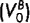
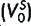
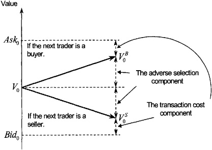
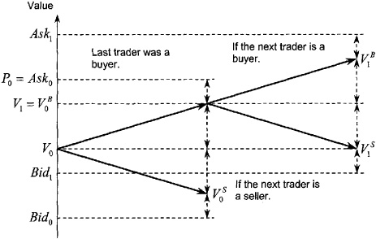
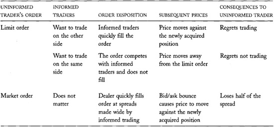
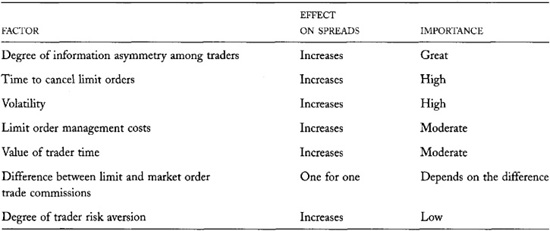

# Chapter 14: Bid/Ask Spreads

The bid/ask spread is the price impatient traders pay for immediacy.
Impatient traders buy at the ask price and sell at the bid price. The
spread is the compensation dealers and limit order traders receive for
offering immediacy.

The spread is the most important factor that traders consider when they
decide whether to submit limit orders or market orders. When the spread
is wide, immediacy is expensive, market order executions are costly, and
limit order submission strategies are attractive. When the spread is
narrow, immediacy is cheap, and market order strategies are attractive.
If you are interested in optimizing your order submission strategies,
you must understand what determines bid/ask spreads so that you can
judge whether they are wide or narrow, given current market conditions.

The spread is also the most important factor that dealers consider when
they decide whether to offer liquidity in a market. If the spread is too
narrow, dealing may not be profitable and dealers may quit trading. If
it is wide, dealing will be profitable and other dealers may enter the
market. If you are interested in dealer profitability, you must
understand the factors that determine bid/ask spreads.

In this chapter, we will consider what determines bid/ask spreads in
dealer markets and in order-driven markets. We will discuss when
immediacy is expensive, when it is cheap, and why. The most important
factors that determine spreads are adverse selection due to
well-informed traders, volatility, and market activity. We will closely
examine these factors and many others.

The most important lesson you may learn from this book appears in this
chapter. You will learn why uninformed traders lose to well-informed
traders whether they submit limit orders or market orders. Uninformed
traders lose simply because they trade. If you are an uninformed trader
and do not want to lose, you should minimize your trading.

## 14.1 DEALER BID/ASK SPREADS

Dealers set their spreads to maximize their profits. Their spreads must
be wide enough to allow them to recover their costs of doing business.
Otherwise, they will not be profitable, and they will quit dealing.
Their spreads cannot be so wide, however, that no one will trade with
them. Their revenues then would not cover their expenses.

Dealers profit when their revenues exceed their expenses. Dealer
revenues depend on the effective spreads they earn on their round-trip
trades, on how often they can turn their inventory, and on how much they
lose to informed traders. Dealer business expenses reduce their profits.
These expenses include financing costs for their inventories, wages for
their staff, exchange membership dues, and expenditures for
telecommunications, research, trading system development, clearing and
settlement, accounting, office space, utilities, and other such items.

------------------------------------------------------------------------

**One Dealer Does Not
Necessarily a Monopolist Make**

The specialists at the New York Stock Exchange are the unique dealers in
their specialty stocks. Although their unique positions may give them
some market power on the floor of the Exchange, they are hardly
monopolists. They face competition from public limit order traders and
from dealers at other exchanges that trade the same securities.

------------------------------------------------------------------------

### 14.1.1 Monopoly Dealers

When dealers face little competition, they may quote wide spreads in
order to maximize their profits. The optimal monopoly spread depends on
the demand for their services. If clients are willing to trade
regardless of the spread, spreads will be wide. If clients are sensitive
to their transaction costs, spreads will be low.

Monopoly dealers set their spreads so that the additional revenue from a
slight decrease in spread is just equal to the additional cost of
providing the additional liquidity that traders will demand at the
slightly lower spread. A similar result appears in all introductory
economics textbooks. We will not explain it here because dealers can
rarely behave as monopolists in financial or commodity markets.

Monopolies are successful only when monopolists can prevent competitors
from entering their markets. In most security and contract markets, the
barriers to entry that dealers face are low. Dealers always look for
markets in which they can make money. If dealing profits are excessively
high in some market, they will enter that market and try to participate
in the excess profits. Their entry tends to lower spreads, and thereby
the profits of all dealers in the market. The threat of entry therefore
may prevent a dealer from behaving as a monopolist even when no other
dealers are in the market.

In many markets, dealers also face competition from public limit order
traders. Limit orders are essentially the same as dealer quotes. Both
are offers to trade that other traders may take when they want to trade.
Dealers who compete with aggressive public limit order traders cannot
earn large effective spreads because the limit order traders will
undercut their quotes.

### 14.1.2 Spreads in Competitive Dealer Markets

In competitive dealer markets, dealer spreads ultimately depend on the
costs that dealers incur in running their business. The free entry and
exit of dealers ensures that spreads will adjust so that dealers just
earn normal profits for providing their liquidity services. When spreads
are too high, so that incumbent dealers earn excessive profits, new
dealers will enter the market. Their competition for order flow will
cause spreads to fall. As the spreads fall, so will the excess profits.
If spreads are too low, so that dealers are losing money, some will
eventually quit because nobody can lose money forever. With less
competition, the remaining dealers will be able to raise their spreads
and thereby decrease their losses. Only when spreads are set so that
dealers earn normal profits will dealers neither enter nor leave the
market.

Dealers earn normal profits when their revenues just cover their total
economic costs of doing business. These costs include all costs
described above, a fair rate of return on their invested capital, and
fair compensation for their entrepreneurial efforts. Economists call the
difference between revenues and the total economic costs of doing
business *economic profit*. When dealers earn normal profits, economic
profits are zero. Firms that make normal profits have accounting profits
that just cover the value of the entrepreneurs' time and the rental of
their capital.

## 14.2 SPREAD COMPONENTS

For analytic purposes, economists break the bid/ask spread into two
components. The decomposition makes it easier to understand what factors
determine bid/ask spreads.

The *transaction cost spread component* is
the part of the bid/ask spread that compensates dealers for their normal
costs of doing business. We enumerated these costs above. This component
also funds any monopoly profits that the dealer may make and any risk
premium that dealers may require for bearing inventory risk.

The *adverse selection spread component* is the part of the bid/ask
spread that compensates dealers for the losses they suffer when trading
with well-informed traders. This component allows dealers to earn from
uninformed traders what they lose to informed traders. We also discuss
this component in [chapter 13](#part0024.html_ch13) when we
consider how dealers learn about values from the order flow. There we
examine the component from an information perspective. Here we examine
it from an accounting perspective. Remarkably, although the two
perspectives are quite different, they both imply the same size adverse
selection spread component.

The two components taken together constitute the total spread. Dealers
never quote both components separately. They simply quote their bid and
ask prices. To actually estimate the two spread components, analysts
must use econometric methods.

### 14.2.1 The Transaction Cost Component

If all traders knew instrument values with complete certainty, the
transaction cost component would constitute the entire spread. Prices
would simply bounce back and forth between bid prices, which would be
set slightly below instrument values, and ask prices, which would be set
slightly above instrument values. Competition among dealers would cause
the spread to equal the normal costs of doing business. If dealers had
monopoly power, they would set wider spreads.

Economists also call the transaction cost spread component the
*transitory spread component* because price changes associated with this
component are transitory. *Transitory* price changes regularly reverse.
Price changes caused by a jump from the bid to the ask most frequently
follow price changes caused by a jump from the ask to the bid. Such
price changes occur when the order flow includes a mix of buyers and
sellers.

Traders call the bouncing back and forth between bid and ask prices
*bid/ask bounce*. Bid/ask bounce is a minor form of price volatility
caused by impatient traders who demand immediacy. The transitory spread
component is responsible for bid/ask bounce.

### 14.2.2 The Adverse Selection Spread Component

Since dealers do not know fundamental values well, they expose
themselves to adverse selection from better-informed traders when they
offer liquidity. The better-informed traders choose the side of the
market on which they trade, and the dealers end up losing money to them.
When some traders are better informed than other traders, traders are
*asymmetrically informed*.

If dealers set their spreads to reflect only their normal costs of doing
business, their losses to well-informed traders would eventually force
them out of business. Dealers must widen their spreads further to cover
their losses to informed traders. This additional widening of the spread
is the *adverse selection spread component*. It allows dealers to recoup
from uninformed traders what they lose to informed traders. By widening
the spread, it also decreases dealer losses to informed traders by
ensuring that informed traders trade at less attractive prices.

Economists also call the adverse selection
spread component the *permanent spread component*. Price changes due to
the adverse selection spread component are permanent in the sense that
they do not systematically reverse. Subsequent price increases and
decreases are equally likely. Price changes due to the adverse selection
spread component reflect changes in dealers' estimates of instrument
values. When dealers efficiently use all information available to them
to estimate values, the resulting sequence of estimate revisions should
be unpredictable. (If their future revisions were predictable, the
dealers would not be estimating values efficiently: They should have
incorporated information upon which any predictable revision could be
based in their earlier estimates.) A process with unpredictable changes
is essentially a random walk. Every change in a random walk is permanent
in the sense that it affects the levels of all subsequent values of the
random walk.

### 14.2.3 Two Explanations for the Adverse Selection Component

The adverse selection spread component has two aspects. From an
information perspective (see [chapter
13](#part0024.html_ch13)), it is the difference in the value
estimates that dealers make conditional on the next trader being a buyer
or a seller. From an accounting perspective, it is the portion of the
bid/ask spread that dealers must quote to recover from uninformed
traders what they expect to lose to informed traders.

Remarkably, these two perspectives imply the same size for the adverse
selection spread component. A simple proof of this result, known as the
Glosten-Milgrom theorem, appears in the appendix to this chapter. You
can easily understand the result by considering what determines the
adverse selection component from both perspectives. To simplify our
discussion, assume that dealers know exactly what values are if informed
traders are trading. (Our result does not depend on this assumption.)
The dealers, however, do not know when informed traders are trading.

From the information perspective, the adverse selection spread component
is the amount that dealers should update their estimates of value when
they learn whether the next trader is a buyer or a seller. If a dealer
trades with a known uninformed trader, the dealer learns nothing and his
estimate of value should remain the same. If the dealer trades with a
known informed trader, the dealer should adjust his bid and offer to
reflect the proper value of the instrument. This adjustment is the
dealer's pricing error, the difference between the proper value of the
instrument and the dealer's original estimate of its value. Since the
dealer does not know which clients are well informed and which are
uninformed, the dealer must adjust his estimate of value partially
following every trade. In particular, he will discount the pricing error
by the probability that his next client is well informed. From the
information perspective, the adverse selection spread component thus is
the product of the pricing error (assuming that the trader is informed)
times the probability of trading with an informed trader.

From the accounting perspective, the adverse selection spread component
is the amount that dealers should charge all their clients to recover
their losses to informed traders. In our simple analysis, assume the
dealer loses the difference between his original estimate of value, and
the proper value, when he trades with an informed trader. Since the
dealer incurs this loss only when he trades with a well-informed trader,
the average loss per trade to informed traders is the loss from trading
with an informed trader times the probability of trading with an
informed trader. This average loss is the adverse selection spread
component.

------------------------------------------------------------------------

**The Total Spread**

Figures 14-1 and 14-2 illustrate the conceptual process by which dealers
set and adjust their spreads. If charts intimidate you, skip them. The
figures represent the same information presented in the text.

Figure 14-1 shows that the total spread is the sum of the two spread
components. In principle, a dealer derives her bid and ask prices as
follows:

• She first estimates the instrument value, using all information
currently available to her. This estimate, V~0~ in the figure, is the
basis for her quoted bid and ask prices. It determines the level of her
price quotes.

• Using this basis, she then estimates values, assuming that the next
trader is a buyer

or a seller
.
The difference between these two estimates is the adverse selection
spread component. If the probabilities of trading with informed buyers
and sellers are equal, and if the expected pricing errors in both
instances are equal, the two value estimates will be equally distant
from her initial estimate, V~0~. She then simply adds and subtracts half
of the adverse selection spread component to V~0~ to obtain them.

• She obtains her offer price by adding half of the transaction cost
spread component to her value estimate for a buyer. She likewise obtains
her bid price by subtracting half of the transaction cost spread
component from her value estimate for a seller.

In practice, dealers set their bid and ask prices by using their
experience to interpret current market conditions. Although they rarely
form their estimates as described here, they regularly consider the
issues discussed here.

When the next trader arrives, the dealer learns whether she wants to buy
or sell. If the dealer learns nothing more about the trader or about
values, the dealer's new unconditional value estimate will be the
appropriate previous conditional value estimate.

Figure 14-2 illustrates the quotation adjustments following the arrival
of a buyer (P~O~ = Ask~0~). The bid and ask both rise by half of the
adverse

**FIGURE 14-1.**\
The Components of the Total Spread

**FIGURE 14-2.**\
Quotation Adjustments After a Buyer Arrives

These two expressions for the adverse selection spread component are the
same if the loss from trading with an informed trader is the same as the
pricing error when trading with an informed trader. This is true if
dealers cannot restore their target inventories before prices change to
reflect the informed traders' information.

If dealers can restore their target inventories, the result still holds
with a caveat. If dealers do not recognize that they have traded with an
informed trader, they will not fully adjust prices. Informed traders
therefore will trade with them again. Dealers will continue losing until
the price reflects the informed traders' information. Their cumulative
losses will equal their original pricing error, so the Glosten-Milgrom
theorem still holds.

If dealers do recognize that they have traded with an informed trader,
but others in the market have not, they may be able to trade on the side
that the information favors. They then will act as speculators rather
than as dealers. They will be eager to trade on the informed side but
unwilling to offer liquidity on the other side. We can restate the
Glosten-Milgrom theorem to include this situation, but the restatement
is beyond the scope of this book.

### 14.2.4 Discriminating Between the Two Spread Components

Econometricians have estimated the two components of the bid/ask spread
so that we can determine their relative importance. The decomposition is
possible because the two components give prices different statistical
properties. The transaction cost spread component causes prices to
bounce back and forth between bid and offer prices. The adverse
selection spread component causes unpredictable price changes that have
the properties of a random walk. In both cases, the price changes depend
on whether a buyer or a seller initiated the transaction.

The most common decomposition method involves
the estimation of an equation to explain current and future price
changes using information about whether each trade was buyer- or
seller-initiated. These analyses indicate that in most markets the
adverse selection spread component accounts for more of the total spread
than does the transaction cost spread component.

## 14.3 ADVERSE SELECTION AND UNINFORMED TRADERS: THE MOST IMPORTANT LESSON IN THIS BOOK FOR MOST READERS

Adverse selection explains why uninformed traders lose to informed
traders, regardless of whether they trade with limit or market orders.
In both cases, they suffer the effects of adverse selection.

When uninformed traders use limit orders, their orders fill quickly if
they overprice their bids or underprice their offers. Informed traders
then eagerly trade with them, and the uninformed traders ultimately will
regret trading. In this case, uninformed traders directly suffer the
effects of adverse selection, just as dealers do.

When limit order traders and informed traders compete to trade on the
same side of the market, their limit orders often do not fill. Since
informed traders tend to forecast future price changes correctly, prices
often will move away from the limit orders, and the uninformed traders
will regret not trading. In this case, adverse selection causes
uninformed traders to lose profitable trading opportunities.

Uninformed traders thus often regret using limit orders. When they trade
with informed traders, they regret trading. When they compete with
informed traders to fill their orders, they often do not fill, and they
regret not trading.

Uninformed traders who use market orders ensure that they trade, but
they still suffer the effects of adverse selection. Since dealers widen
their spreads to recover from uninformed traders what they lose to
informed traders, uninformed market order traders trade at wider bid/ask
spreads than they would if there were no informed trading. In effect,
the adverse selection spread is a fee that dealers charge market order
traders for bearing adverse selection risk.

Uninformed traders do not lose because they systematically want to trade
on the wrong side. Even if they flip a coin to decide on which side to
trade, uninformed traders tend to lose. A fair coin ensures that they
will be right about future price changes half the time, but the costs of
filling their orders will cause them to lose on average.

Uninformed traders thus ultimately lose to informed traders regardless
of how they trade. They lose simply because they trade. They can avoid
the problem only by not trading. [Table
14-1](#part0025.html_ch14tab01) summarizes why uninformed
traders lose when trading.

## 14.4 EQUILIBRIUM SPREADS IN CONTINUOUS ORDER-DRIVEN AUCTION MARKETS

Continuous order-driven auction markets arrange trades when they match
an arriving market order (or marketable limit order) with a standing
limit order. Traders who use these markets must decide whether to offer
liquidity by submitting limit orders or to take liquidity with market
orders.

**TABLE 14-1**.\
Uninformed Traders Tend to Lose to Informed Traders Regardless of How
They Trade

[Chapter 4](#part0012.html_ch04) discusses limit and market
order properties in detail. Briefly, market order traders get immediate
executions, but they pay the bid/ask spread to trade. Limit order
traders get good prices if their orders execute, but they risk failing
to trade if the market moves away from their orders. If they fail to
trade and still wish to trade, they must replace their limit orders with
more aggressively priced orders. In the end, they may trade at much
worse prices than they would have received had they initially used
market orders.

The bid/ask spread determines how attractive limit and market order
trading strategies are. If the spread is wide, market orders will be
expensive, and no one will use them. If the spread is narrow, market
orders may be more attractive than limit orders.

This section describes how traders decide which type of order to use. We
must understand their decisions in order to identify the determinants of
bid/ask spreads in auction markets.

We will consider the problem by first analyzing a simple, but very
unrealistic, situation in which we can easily predict how traders will
behave. Once we understand that situation, we will be better able to
analyze more interesting and realistic situations. The foundation for
our analysis appears in a paper about equilibrium spreads by Kalman
Cohen, Steven Maier, Robert Schwartz, and David Whitcomb.

### 14.4.1 A Simple Equilibrium Spread Analysis

Suppose that all traders in a continuous order-driven public auction are
essentially the same. They all want to trade the same sizes, and no one
is better informed than anyone else. No one is risk averse, no one
values his or her time at all, and no one is in any hurry to trade.
Everyone knows values instantaneously as they change, but no one can
forecast changes in those values. In addition, everyone can submit and
cancel orders instantaneously without any cost, and their trading
commissions do not depend on order type. Our traders differ from each
other only in that some want to buy and some want to sell. These traders
are clearly like none that we will ever meet!

These extraordinarily unrealistic assumptions
have two equally unrealistic implications. First, when deciding which
type of order submission strategy to pursue, the traders care only about
their expected trading costs. We explicitly assumed that they do not
care about the value of their time, when they trade, or the risk of
their strategies.

Second, when each trade takes place, the price will equal the current
instrument value. Limit order traders will constantly adjust their limit
prices to reflect any changes in value. They can make these adjustments
because they instantaneously know values as they change. They will make
these adjustments because they can cancel and resubmit their orders
without any cost. They must make these adjustments to ensure that they
trade if prices move away from them and to avoid trading at a loss if
prices move through their orders. Although the market order traders
would like to trade at prices different from values, limit order traders
will not allow them to do so.

The expected cost of trading a market order is half the bid/ask spread
less any profits that they expect to make by carefully timing their
trades. Since market order traders cannot forecast price changes, and
since limit order traders will not allow them to trade at any price
different from value, they cannot expect to profit from timing their
orders. The expected costs of trading a market order therefore will be
exactly half the bid/ask spread.

We now introduce a very simple principle to obtain our results about
bid/ask spreads. Since our imaginary traders can choose whether to
submit limit orders or market orders and since they are all essentially
identical, the spread must make both strategies equally attractive.
Otherwise, every trader would want to use the more attractive strategy.
If the spread is too narrow, everyone will want to use market orders,
and no one will trade. If the spread is too wide, everyone will want to
use limit orders, and no one will trade. The spread which ensures that
traders are indifferent between using a limit order and a market order
is the *equilibrium spread*. The traders discover the equilibrium spread
through the following mechanism.

If most traders try to use market orders so that few traders use limit
orders, the few limit order traders will set their limit prices far from
the market. They do not need to be aggressive because the surplus of
market orders ensures that they will trade. The resulting wide spreads,
however, will discourage market order traders. Some will choose to
submit limit orders instead. With more competition to supply liquidity,
limit order traders will have to set their limit prices closer to the
market, and spreads will narrow.

Conversely, if most traders use limit orders and few traders use market
orders, bid/ask spreads will be small as limit order traders compete to
trade with the few market order traders. The narrow spread will
encourage some limit order traders to submit market orders instead. The
reduced competition among the limit order traders will cause bid/ask
spreads to widen.

In summary, spreads that are too wide cause traders to switch from
market orders to limit orders and thereby narrow the spread. Spreads
that are too narrow cause traders to switch from limit orders to market
orders and thereby widen the spread. At some intermediate spread,
traders are indifferent between submitting limit orders and market
orders. This spread is the equilibrium spread.

With this principle, we can now determine that bid/ask spreads in this
rather unusual market must be zero! Since the traders care only about
their expected transaction costs, the equilibrium expected costs of
using market and limit order strategies must be the same. Because
trading is a zero-sum game, expected transaction costs to limit order
traders are exactly equal to expected trading profits to market order
traders and vice versa. To be equal, the expected costs of both order
types therefore must be zero. Since the expected cost of the market
order strategy is half the bid/ask spread, the bid/ask spread in this
highly unrealistic model must be zero.

------------------------------------------------------------------------

**Economists and Their Can Openers**

Economists often make highly unrealistic assumptions to simplify their
analyses. Many people poke fun at economists for their propensity to
create impossibly abstract models.

You may know the joke about the three hungry castaways on a deserted
island who are trying to open a can of food. The chemist suggests
heating the can until it bursts. The engineer proposes breaking it open
with a sharp rock. The economist suggests, "Assume we have a can opener.
..." The joke is unfair, but it reflects the discomfort people feel
about many abstract economic models.

Economists make unrealistic assumptions when analyzing issues to ensure
that they can create a simple situation (model) that they fully
understand. They then consider what happens to their results when they
replace the unrealistic assumptions with more realistic ones. This
method allows economists to thoroughly understand complex situations
that might otherwise elude them. It is especially useful for identifying
the importance of the issues that affect the results. By starting with
simple assumptions, economists can open many complex problems.

------------------------------------------------------------------------

------------------------------------------------------------------------

**Market Manipulation of
Quoted Spreads**

Markets that wish to lower their quoted spreads can charge commissions
only on market and marketable limit orders. If the commissions are
proportional to the quantity traded, spreads will drop by exactly the
difference between the limit and market order commissions. In
equilibrium, this change would have no effect on order submission
strategies or trader profitability.

In practice, markets can undertake this strategy only if they can
control the commissions that all buyers and sellers pay. If a single
broker within a multibroker market tried to raise the commissions on
market orders and lower them on limit orders, traders would send only
limit orders to that broker, and he would lose revenue. Only brokers who
run their own markets and only exchanges that can regulate commissions
can manipulate quoted spreads.

Cantor Fitzgerald organizes government bond markets for its customers
through its eSpeed subsidiary. Since Cantor Fitzgerald charges
commissions only on market orders, spreads in its markets are smaller
than they would be if it evenly distributed the commissions between the
limit order traders and the market order traders.

Some ECNs like Archipelago also charge different fees for market orders
and limit orders. Although the fees are paid by the brokers who route
orders to them, in perfectly competitive brokerage markets, the
differential fees will be reflected in the commissions that traders pay
for different types of executed orders. 

------------------------------------------------------------------------

### 14.4.2 More Realistic Equilibrium Spread Results

We now obtain more realistic results by relaxing some of the remarkable
assumptions made above.

#### 14.4.2.1 Differential Commissions

If limit order traders pay greater trading commissions than market order
traders, limit orders will be relatively less attractive. Without some
compensating differential in the spreads, no trader will submit a limit
order. Since traders must be indifferent between using both order
strategies in equilibrium, spreads must widen so that limit and market
order traders equally share the difference in commissions. In this
simple model, the cost of trading a market order is half the bid/ask
spread. It must equal half the difference in the commissions to make
traders indifferent between the two trading strategies. The equilibrium
spread therefore must equal the difference between the two commissions.

#### 14.4.2.2 Costly Limit Order Management

In practice, canceling and resubmitting limit orders is costly. Brokers
and exchanges may charge fees for canceling orders, and traders lose the
opportunity to do other things while they manage their orders. Limit
order traders therefore will not continuously adjust their orders.
Instead, they will adjust their orders only when values diverge
significantly from their limit prices. The
divergence that triggers a limit price adjustment depends on the cost of
canceling and resubmitting. If these costs are large, limit order
traders will adjust their limit prices infrequently.

Costly limit order management makes limit orders less attractive than
market orders for two reasons. First and most obviously, limit order
traders incur costs to adjust their orders that market order traders do
not incur. Second and more important, limit order traders give a
valuable *timing option* to market order traders when they do not
continuously update their limit order prices. Market order traders will
wait to see what happens to values before they trade. If a market order
trader wants to buy, he will wait to see if value rises. If value rises
past the limit price of a standing limit sell order, he will then buy at
the limit price and profit by the difference. If value falls, he will
wait until limit order sellers drop their prices. He then can buy at a
lower price. This timing option makes market orders more attractive than
limit orders.

Market order traders who exercise the timing option subject limit order
traders to a form of adverse selection. When the limit order traders
trade, they wish they had been able to adjust their prices. When the
limit order traders do not trade, they wish that they had. In a sense,
the market order traders are better informed traders than the limit
order traders. When they trade, the market order traders have more
current information than the information that limit order traders had at
the time they set their limit prices.

The timing option is most valuable when market order traders can respond
to changing conditions faster than limit order traders can. If the limit
order traders can adjust their limit prices before market order traders
can take advantage of changes in value, the timing option will not be
valuable.

The timing option is also most valuable when few market order traders
compete to take advantage of it. When many market order traders try to
exercise the same timing option, they must act quickly as soon as it
becomes valuable. Market order traders who wait too long will lose the
option to a quicker trader.

To ensure that traders are indifferent between using limit orders and
market orders, the equilibrium spread must ensure that the limit order
traders are compensated for the timing options that they give to market
order traders. The equilibrium spread also must ensure that the two
types of traders equally share the limit order management costs. Since
the spread is the total cost of using two market orders to complete a
round-trip trade, the equilibrium spread must equal the expected cost of
managing the limit orders plus twice the value of the timing option.

In practice, limit order traders cannot instantaneously reprice their
orders exactly when repricing would be optimal. The costs of paying
attention ensure that values may change substantially before they notice
the change. Order entry, order routing, and order handling delays also
ensure that values may change before instructions to cancel limit orders
become effective. These delays make the timing option more valuable. The
equilibrium spread therefore also depends on the average time it takes
limit order traders to successfully cancel their orders. If the order
cancellation process is slow, equilibrium spreads will be wide.

When the order cancellation process is slow, equilibrium spreads also
will depend on the volatility of the instrument. The timing option will
be quite valuable for volatile instruments because prices may change
substantially before traders can reprice their orders. Equilibrium
spreads therefore must be wider for volatile instruments than for
relatively stable instruments.

------------------------------------------------------------------------

**A Simple Timing Option
Example**

Suppose the value of a contract is 20 dollars. In the next five minutes,
the value may stay the same, rise by 12 cents, or fall by 12 cents.
These alternatives are equally probable.

Lisbet, a limit order trader, submits a sell order with a limit price of
20 dollars.

In the next five minutes, Mark, a price-insensitive market order buyer,
may arrive and trade with Lisbet. The probability that Mark arrives is
one-half. This probability does not depend on the value of the contract.

Tim is an opportunistic market order buyer who monitors the market to
exploit timing options. He will buy from Lisbet if the opportunity looks
attractive and if the opportunity is still then available. In
particular, Tim will buy if values rise and if Mark does not arrive
first. The probability that value rises is one-third. The probability
that Mark arrives is one-half. Since the two events are independent, the
probability that Tim buys is one-sixth. If Tim buys, he will earn 12
cents because he will buy at 20 dollars a contract worth 20.12 dollars.
The expected value of his trading strategy therefore is one-sixth of 12
cents, or 2 cents.

Dieter is a dealer who is always willing to buy at 6 cents below the
current value of the contract. Lisbet will trade with Dieter if her
order does not fill after five minutes.

Consider Lisbet's expected trade price. We will first compute it
assuming that Tim is not in the market and then assuming that he is
present.

Assume that the probability that Lisbet trades with Mark at 20 dollars
is one-half. If Mark does not arrive (and Tim is not in the market),
Lisbet then would trade with Dieter. That trade price would be 19.82 if
value falls, 19.94 if value does not change, and 20.06 if value rises.
Since these events are equally likely, her expected trade price if Mark
does not arrive (and Tim is not in the market) is 19.94. Accordingly,
Lisbet's expected trade price when Tim is not in the market is the
average of 20 (if she trades with Mark) and 19.94 (if she trades with
Dieter), which is 19.97 dollars.

Now suppose that Tim is in the market. If Mark does not arrive, Lisbet
will trade with Dieter at 19.82 if value falls, with Dieter at 19.94 if
value does not change, and with Tim at 20.00 if value rises. Since these
events are equally likely, her expected trade price if Mark does not
arrive, and Tim is in the market, is 19.92. If Mark arrives, Lisbet will
trade with him at 20 dollars. Since the probability that Mark will
arrive is one-half, Lisbet's expected trade price is 19.96 if Tim is in
the market.

When Tim is present, Lisbet's expected sales price is a penny lower than
it would be if Tim were not in the market. If Tim is in the market,
Lisbet loses a penny because she will never trade at 20.06. Otherwise,
she will trade at 20 instead of 20.06 one-sixth of the time (when value
rises, and Mark arrives).

Now consider how Tim affects Dieter's profitability. If Tim is not in
the market, Dieter trades if Mark does not arrive. Since Dieter always
buys at 6 cents below value, Dieter expects to make 3 cents profit. If
Tim is in the market, Dieter trades only if Mark does not arrive, and
prices fall or stay the same. The probabilities of these two events are
both one-sixth, so that Dieter expects to make 2 cents profit if Tim is
in the market. When Tim is present, Dieter expects to make 1 cent less
than he would make if Tim were not in the market.

Tim's two-cent expected profit therefore comes partly from the timing
option that he exercises against Lisbet (1 cent) and partly from quote
matching in front of Dieter's order (1 cent). 

------------------------------------------------------------------------

#### 14.4.2.3 Valuable Time and Risk Aversion

When traders value their time, limit order strategies are more expensive
than market order strategies because the former take longer to implement
than the latter. Equilibrium spreads therefore must widen to make limit
orders more attractive and market orders less attractive. When traders
value their time highly, spreads must be wide.

Since the spread reflects the value of time, the spread is the price of
immediacy. Traders say that market order traders *buy time* and limit
order traders *sell time*.

Limit and market order strategies expose traders to different risks.
Limit order traders risk having to chase the market if prices move away
from their orders. Market order traders risk trading at unexpected
prices. Quotes may change after they submit their orders but before they
are filled. Their large orders also may have unpredictable price
impacts. For small traders, limit order strategies are generally more
risky than market order strategies. For large traders, market order
strategies are probably more risky.

If risk-averse traders fear using one strategy more than the other,
spreads will have to adjust to ensure that traders are indifferent
between using the two strategies. In our simple model, all traders have
equal-sized orders, and they all know the prices at which they can trade
when using market orders. Using limit order strategies therefore is more
risky to them than using market order strategies. If they are to offer
liquidity, equilibrium spreads must widen to compensate limit order
traders for the risk that they will not trade. The more risk averse
traders are, the wider the equilibrium spreads will be.

In practice, since the sizes associated with inside spreads tend to be
small, we can reasonably infer that small traders predominantly set
inside spreads. Accordingly, limit order execution risk probably has a
stronger effect on spreads than market order price risk.

In the real world, not all traders are equally risk averse, and not all
traders value their time equally. In equilibrium, few traders will be
indifferent between using a market order strategy and a limit order
strategy. Traders who are the most risk averse or who value their time
the most will use market orders. Traders who are most risk tolerant and
for whom monitoring orders is least costly will use limit orders.
Somewhere between these extremes will be traders for whom the
equilibrium spread ensures that they are indifferent between using
market order and limit order trading strategies.

------------------------------------------------------------------------

**Indexed (or Floating) Limit Orders**

Some alternative trading systems like the Primex Auction System allow
traders to submit *indexed limit orders*. These systems automatically
change indexed order limit prices when the value of an index changes.
The trader specifies the index and the linking formula. Traders also
know these orders as *floating limit orders*.

By automatically adjusting limit orders, these systems reduce the cost
of using limit order strategies. Equilibrium spreads in these trading
systems therefore should be smaller than they otherwise would be.

------------------------------------------------------------------------

------------------------------------------------------------------------

**Automated Limit Order Management Systems**

Several data vendors, brokerage firms, and trading technology firms have
products that allow traders to manage their limit orders automatically.
Traders can program systems like ITG's Quantex to follow any set of
instructions. For example, they can automate instructions to replace
unfilled limit orders with market orders after a specified time.

These systems lower equilibrium spreads by decreasing the costs of
implementing limit order strategies. Traders use these systems to submit
aggressively priced limit orders that they otherwise probably would have
submitted as market orders. 

------------------------------------------------------------------------

#### 14.4.2.4 Traders Do Not Know Values Instantaneously

To simplify our analysis, we assumed that all traders always know values
as they change. This assumption is unnecessarily strict. With one
caveat, we can obtain our equilibrium spread results merely if all
traders are always equally well informed about values. In that case,
they all always estimate the same values. Since nobody knows true
values, knowing common value estimates is essentially the same as
knowing true values.

The one caveat concerns results involving volatility. A theorem from
statistics proves that the volatility of an estimate of a variable is
less than the volatility of the variable being estimated. Value estimate
volatility therefore

is lower than value volatility. Consequently,
spreads should be smaller when traders do not know values well.

This result is correct, but it does not seem right. Spreads generally
are larger when traders are uncertain about values. The discrepancy has
to do with the distribution of information. This unusual result comes
from our assumption that all traders are equally ignorant. In practice,
traders are asymmetrically informed.

#### 14.4.2.5 Asymmetrically Informed Traders

In real markets, some traders are better informed than other traders. If
the well-informed traders compete with each other to profit from their
information, they all must trade quickly. Slow traders will find that
faster traders have already caused prices to change. Well-informed
traders therefore tend to submit market orders rather than limit orders.
The well-informed traders subject the limit order traders to adverse
selection. Their limit orders execute quickly if they are on the wrong
side of the market, but they do not execute if they are on the informed
side of the market. This adverse selection makes using limit order
strategies relatively more expensive than market order strategies for
uninformed traders. Equilibrium spreads therefore must widen to
compensate. The additional widening of the bid/ask spread is the adverse
selection spread we discussed earlier.

For most securities and contracts, the degree of information asymmetry
varies inversely with how well traders estimate values. When most
traders estimate values poorly, those traders who can estimate values
well have a great advantage. Such traders typically have access to
information that other traders do not have. Spreads therefore should be
wider for instruments that most traders cannot easily value.

#### 14.4.2.6 Summary

Equilibrium spreads in continuous order-driven auction markets depend on
many factors. The most important factors are the degree of information
asymmetry among the traders, how quickly traders can cancel their limit
orders, and the volatility of the instrument. [Table
14-2](#part0025.html_ch14tab02) provides a summary of the
factors that determine equilibrium spreads in continuous order-driven
markets.

When all traders are alike, the equilibrium spread will ensure that
traders are indifferent between using market order and limit order
trading strategies. This remarkable result is due to trader efforts to
minimize their total costs of trading. These costs primarily include the
spread (paid or received), commissions, order management costs, and the
loss or exploitation of the trade timing option.

When traders differ, the equilibrium spread sets the supply of liquidity
equal to the demand for liquidity. Traders who value their time highly,
who trade on material information, or who are risk averse generally use
market orders. Traders who can quickly adjust their limit orders with
little cost, who are risk tolerant, or who do not value their time
highly generally use limit orders.

## 14.5 SPREADS WHEN PUBLIC TRADERS COMPETE WITH DEALERS

In many markets, dealers and public limit order traders compete to offer
liquidity. They compete unequally in two respects.

**TABLE 14-2**.\
Equilibrium Spread Determinants in Continuous Order-driven Markets

Public limit order traders do not have the same business costs that
dealers have. They therefore can quote more aggressive prices than can
dealers who must fund their costs of doing business. In particular,
public traders who are intent on filling their orders may use limit
orders instead of market orders in an effort to lower their trading
costs. Such traders price their orders aggressively in order to minimize
their risk of not trading. The resulting spreads can be too small to
allow dealers to recover their normal costs of doing business. Public
limit order traders therefore may drive dealers out of the market.

Dealers, however, see more of the order flow than do most public
traders. Most dealers also can change their quotes faster than public
limit traders can change their limit prices. Dealers therefore may
survive in markets with very narrow spreads by profiting from
speculative trading opportunities that they can identify from analyzing
their order flows. In particular, dealers may profitably employ quote
matching, order anticipation, and trade timing strategies that public
traders cannot identify or implement quickly enough. We discuss these
strategies in [chapters 11](#part0021.html_ch11) and
[24](#part0038.html_ch24).

When dealers regularly exercise these strategies, limit order strategies
become less attractive to public traders. Public traders will use market
order strategies more often, and bid/ask spreads will be wider than they
would be if dealers did not exploit their order flows.

## 14.6 CROSS-SECTIONAL SPREAD PREDICTIONS

The above analyses have many implications for bid/ask spreads. The
implications all relate to three primary factors that determine whether
spreads will be wide or narrow. These *primary spread determinants* are
information asymmetries among traders, volatility, and utilitarian
trading interest. ([Chapter 8](#part0017.html_ch08) shows that
utilitarian traders trade because they obtain some value from trading
besides profits.) If you know these factors, you can predict bid/ask
spreads.

Unfortunately, two of the primary spread determinants are not easily
measured, and none are easily predicted. We can easily measure
volatility, but we cannot directly measure
information asymmetries or utilitarian trading interest. To assess the
importance of these factors, we must infer their values from observable
instrument and market characteristics. We will call these
characteristics *secondary spread determinants*.

------------------------------------------------------------------------

**Proxy Contests**

When an observable variable varies with an unobservable variable,
economists say that the observable variable is a *proxy* for the
unobservable variable. Economists infer the values of unobservable
variables from *proxy variables*.

Empirical economics is a contest in which economists try to convince us
(and each other) that they have identified good proxies for variables
that we wish we could measure well. 

------------------------------------------------------------------------

Some secondary spread determinants are very highly correlated with
spreads. For example, trading activity is an excellent proxy for
utilitarian trading interest. In many markets, trading activity is the
best observable predictor of spreads. Accordingly, many authors would
classify it as a primary spread determinant. We do not because we want
to preserve the distinction between theoretical and observable spread
determinants. The distinction reminds us of the factors that ultimately
determine spreads.

This section first summarizes the reasons why the three primary spread
determinants affect spreads. We then consider predictions about how
observable instrument and market characteristics (secondary spread
determinants) affect bid/ask spreads.

Although the predictions specifically concern bid/ask spreads, most also
apply to the provision of liquidity in general. The spread is only one
of several aspects of liquidity. It measures the cost of immediacy for
small orders. Other aspects of liquidity (discussed in [chapter
19](#part0031.html_ch19)) include the cost of trading large
orders (depth) and the ability of the market to recognize when
uninformed traders have moved prices (resiliency). Since the factors
that affect spreads typically also affect other aspects of liquidity,
the predictions in this section are of more general interest than they
might otherwise seem.

Since instrument prices vary considerably, spread comparisons are
interesting only when we express the spreads as a fraction of price. For
example, although a 10-cent spread on a 1-dollar stock is smaller than a
1-dollar spread on a 100-dollar stock, the spread on the 1-dollar stock
is 10 percent of its price while the spread on the 100-dollar stock is
only 1 percent of its price. The 1-dollar stock therefore is much more
expensive to trade. The ratio of spread to price is the *relative
spread*. When we compare spreads, we will implicitly refer to relative
spreads.

### 14.6.1 The Three Primary Spread Determinants

The three primary spread determinants are asymmetric information,
volatility, and utilitarian trading interest. Their effects on spreads
are not independent of each other. For example, if information
asymmetries are high, spreads will be wide. Wide spreads, however,
discourage uninformed investors, decrease trading volumes (a secondary
spread determinant), and thereby make spreads even wider.

*Asymmetric Information* The adverse selection spread model suggests
that markets with asymmetrically informed traders will have wide
spreads. Spreads will be widest when well-informed traders know material
information about instrument values that would have an immediate and
significant effect on values if it were common knowledge. When traders
are asymmetrically informed, liquidity suppliers set their prices far
from the market to recover from uninformed traders what they lose to
well-informed traders.

*Volatility* The equilibrium spread model suggests that volatile
instruments should have wide spreads. The spreads should be widest when
limit order traders and dealers cannot easily adjust their orders. Since
volatility increases limit order option values, traders widen their
spreads when trading volatile instruments to minimize the value of the
timing option.

Volatility also makes diversifiable inventory
risks more frightening to risk-averse dealers. The transaction cost
spread component therefore will be wider for volatile instruments than
for stable instruments because dealers require a premium for bearing
unpleasant risks. This effect probably is important only for highly
volatile instruments.

Volatility and uncertainty about values undoubtedly are closely
correlated. Instruments whose fundamental values change quickly are
difficult to value because traders must be certain that they have all
available information when they form their value estimates. Since it is
harder for traders to be fully informed about volatile instruments than
about stable instruments, asymmetric information problems are probably
greater for volatile instruments than for stable instruments. Volatility
therefore has a strong secondary effect on spreads because it is a good
proxy for asymmetric information. The adverse selection spread component
generally will be large for volatile instruments.

*Utilitarian Trading Interest* Utilitarian traders---primarily
investors, borrowers, hedgers, asset exchangers, and gamblers---trade
because they expect to obtain some benefit from trading besides profits.
Markets would not exist without utilitarian traders because purely
profit-motivated traders cannot all profit when trading only among
themselves. Actively traded instruments ultimately are those which
interest utilitarian traders.

Utilitarian trading interest affects bid/ask spreads two ways. First,
when utilitarian interest is strong, markets are very active. For
reasons explained below, active markets tend to have narrow bid/ask
spreads. Second, since utilitarian traders are uninformed, they dilute
information in the order flow when they trade. The adverse selection
spread component therefore will be small when utilitarian trading
interest is strong. Since we discussed above how asymmetric information
affects bid/ask spreads, we now focus on how market activity affects
bid/ask spreads.

Dealers who trade frequently can spread their fixed costs of doing
business over more volume than can dealers who trade infrequently. The
transaction cost spread component therefore should be smaller for
actively traded instruments than for infrequently traded instruments.

Dealers also face smaller inventory risks when trading in active markets
than in inactive markets. In active markets, they can quickly lay off
inventory imbalances. Since they can more easily control their
inventories in active markets, they face less inventory
risk---diversifiable inventory risk and adverse selection risk. They
therefore can quote smaller spreads for actively traded instruments than
they can for infrequently traded instruments.

Public traders who are committed to trading are also more willing to
offer limit orders in active markets because the probability that their
orders will execute quickly is larger in active markets than in inactive
markets. They also are more willing to offer limit orders in active
markets because the timing options that limit orders give up are less
valuable when many market order traders compete for them. Public limit
order traders therefore will make spreads narrower in active markets
than in inactive markets.

Inactive markets cannot support many dealers. Dealers in such markets
therefore may exercise some market power when setting their spreads.
They will have more market power if the small size of the market makes
other dealers reluctant to enter and if public limit order traders are
unable or unwilling to offer liquidity. Spreads in such small markets
therefore may be wider than we would otherwise expect.

------------------------------------------------------------------------

**A Gap in Spreads Due to
the Gap Between German and U.S. GAAP**

The generally accepted accounting principles (GAAP) by which German
corporations historically reported their financial results allowed them
considerable latitude in how they presented their accounts. Using
various hidden reserve accounts, they were able to smooth their earnings
considerably, so that it was difficult or impossible for analysts to
estimate firm values accurately. In contrast, U.S. GAAP do not allow
U.S. corporations as much freedom in how they report their results. The
difference in accounting standards suggests that firms which report
using German GAAP will have wider spreads than will firms that report
using U.S. GAAP (all other things being equal).

The New York Stock Exchange requires its listed firms to report their
accounts using U.S. GAAP. They may also report using International GAAP,
which are essentially similar. Although the NYSE would like to list many
large German firms, it will not list them until they report their
results using more transparent accounting standards.

German firms are increasingly reporting their results using
International GAAP. The trend is due to the desire of German firms to
trade in more liquid markets, and to efforts by the European Community
to harmonize its financial markets. 

------------------------------------------------------------------------

### 14.6.2 Spread Predictions Based on Secondary Factors

Various secondary factors allow us to draw inferences about the primary
factors. This subsection examines these factors and considers how they
are related to spreads.

Our presentation classifies the secondary factors by the primary spread
determinant that they most closely represent. The classification,
however, is somewhat arbitrary because many secondary factors are
correlated with more than one primary factor. For example, firm size (a
secondary factor) generally is both correlated with investor interest
and inversely correlated with volatility.

The various secondary factors are often correlated with each other. The
observed effect of a secondary factor in a statistical analysis
therefore sometimes differs from its predicted effect. For example, we
argue below that firms in emerging industries should have wider spreads
than firms in established industries because of asymmetric information
problems. However, firms in emerging industries tend to have substantial
investment interest, which creates substantial volumes and therefore
narrower spreads. Firms in emerging industries therefore may have
narrower spreads than firms in established industries, although we
predict otherwise. When factors are correlated, it is often necessary to
use statistical methods to disentangle their conflicting effects.

#### 14.6.2.1 Asymmetric Information Proxies

*Information Disclosure Rules* Rules that require information disclosure
decrease information asymmetries. Stock markets that require their
listed firms to disclose reliable, comprehensive financial information
on a regular and timely basis will have narrower spreads than those
which do not require extensive disclosure. To decrease information
asymmetries, many markets commonly require that their listed firms
conform to audit, accounting, and reporting standards that are more
demanding than the local legal standards.

*Market Condition Reports* Commodity markets that compile and publish
extensive reports of market supply and demand conditions will have
smaller spreads than they would have otherwise. To reduce information
asymmetries, many governments have agencies that collect and publish
information on market conditions.

*Analysts* Securities and commodities that many public analysts follow
will have smaller spreads than will those which few analysts follow.
Analysts evaluate the financial conditions and the economic prospects of
various instruments. The information that they produce and publish
reduces information asymmetries among traders.

*Information Vendors* Stocks of corporations that the financial press
covers closely will have smaller spreads than will those the press
ignores. Like analysts, the press produces information that reduces
information asymmetries.

*Major Commodity Contracts* Spreads in contracts that represent
economywide risks will be quite small. Traders rarely have significant
material information about supply and demand conditions when information
about those conditions is distributed throughout the economy. Oil, gold,
silver, wheat, soybeans, currencies, and financial futures are examples
of such commodities. Although traders occasionally have significant
information about local supply and demand
conditions, such information generally does not have a material effect
on the whole market.

------------------------------------------------------------------------

**Why Speeches by Fed Chairmen Are Rarely Interesting**

Contracts on macroeconomic variables like stock index futures, Treasury
bond futures, and T-bill futures typically trade with very narrow
spreads. The values of these contracts depend primarily on expectations
about interest rates and macroeconomic activity. Spreads are narrow
because few people have reliable information about how these factors
will change.

In the United States, the only people who may be able to predict future
interest rates accurately are the Federal Reserve Board chairman and the
other members of the Federal Reserve Open Market Committee. They, of
course, may not trade on their information, and they may not offer it to
other traders.

If you have ever listened to speeches by a Fed chairman or a Fed
governor, you know that they rarely say anything interesting about
interest rates. They do not want to reveal any information that would
allow informed traders to predict the future course of interest rates.

------------------------------------------------------------------------

*Diversified Portfolios* Relative spreads will be smaller for contracts
on well-diversified portfolios than for the individual assets in the
portfolio. Although traders may have significant material information
about individual assets, such information rarely is material to all
assets in the portfolio. A large portfolio dilutes the importance of
information about any single constituent asset. In addition, portfolios
generally are easier to value than individual assets: Mistakes made
valuing one asset may offset mistakes made in valuing other assets. For
both reasons, stock index futures contracts have smaller spreads than
individual stocks.

*Diversified Stocks* The stocks of well-diversified corporations will
have smaller spreads than those of similar-sized corporations that focus
on a single line of business. A well-diversified corporation is a
portfolio of assets. Although traders may have significant material
information about some of the asset values, such information often is
not material to valuing all the assets. Conglomerates therefore have
smaller spreads than undiversified firms.

*Established Versus Emerging Industries (Value Versus Growth Stocks)*
Firms in established industries are easier to value than firms in
emerging industries. Firm values in emerging industries depend primarily
on uncertain future growth prospects. In contrast, firm values in
established industries depend primarily on cash flows that are
relatively easy to predict. Since valuing firms in emerging industries
is more difficult than valuing firms in established industries,
information asymmetries among traders are likely to be bigger in the
former than in the latter. Firms in established industries therefore
will have smaller spreads than firms in emerging industries (all other
things held constant).

*Age of the Firm* Young firms are often harder to value than older firms
doing business in the same markets. Young firms often use newer
technologies. Although such technologies may be very promising, their
values are often uncertain when they have not been fully tested. Even
when the firms use the same technologies, younger firms are harder to
value than older firms because new management systems are often less
mature than old management systems. Bid/ask spreads will be wider for
new firms than for old firms.

*Insider-trading Rules* Markets that effectively enforce insider-trading
rules protect their liquidity suppliers from adverse selection.
Insider-trading rules prevent traders from trading on certain types of
material information. Bid/ask spreads will be smaller when such insiders
cannot trade. We discuss this prediction further in [chapter
29](#part0043.html_ch29).

*When Material Information Is Expected* Spreads will be wider when
liquidity suppliers expect that some traders may have material
information. For example, stock spreads tend to widen before and after
earnings announcements. They widen before because insiders sometime
trade on the information before it becomes public. (Such trading is
illegal in many jurisdictions.) They widen after because some traders
are better able to evaluate the significance of the news than others.

#### 14.6.2.2 Volatility Proxies

Since volatility is easily measured, we generally do not need to
identify proxies for it when analyzing bid/ask spreads. However, if you
want to predict future bid/ask spreads, you must predict future
volatility. The problem is especially difficult when the instruments in
which you are interested have not *yet* traded.

------------------------------------------------------------------------

**Orange Juice Futures**

Orange juice futures prices often become quite volatile during the
winter when freezing weather in Florida threatens the orange crop. At
those times, meteorologists and local farmers have an informational
advantage over other futures traders. Accordingly, spreads on futures
widen when cold air descends into Florida. 

------------------------------------------------------------------------

Practitioners use various methods to predict volatility. Since we
describe these methods in [chapter 20](#part0032.html_ch20),
we consider the issue here only briefly.

Many factors make instruments volatile. For stocks, the most important
factors are financial leverage, operating leverage, and uncertain growth
opportunities. Commodities are volatile when supply and demand
conditions are uncertain. They are especially volatile when they are
perishable, when the costs of storage are high, when inventories are
low, or when the supply depends on weather conditions. Currencies are
volatile when traders are uncertain about political stability,
inflation, and interest rates. Finally, bonds are volatile when traders
are uncertain about inflation, interest rates, and credit quality. These
factors all cause spreads to be wide when they are significant.

#### 14.6.2.3 Proxies for Utilitarian Trading Interest

*Trading Activity* Measures of trading activity such as traded volumes
and numbers of transactions are good proxies for utilitarian trading
interest. Markets cannot sustain high volumes without traders who are
willing to trade even when they do not expect to profit from trading.
Markets that have high volumes therefore have many such traders.
Actively traded markets usually have narrow spreads.

*Firm Size* Large firms' stocks tend to have smaller relative spreads
than do small firms' stocks. The substantial investor interest in large
firms ensures that their stocks are actively traded. This interest also
ensures that the press and many analysts follow them. Large firms also
tend to be less volatile because they often are mature, well-diversified
companies that use established technologies. Higher average trading
activity and lower average volatility both suggest that large firms have
smaller spreads than do small firms.

*Debt Issue Size* Large debt issues often attract the interest of many
investors. Investors are especially interested in government debt.
Widely distributed debt issues tend to trade in active markets when they
are first issued. Market activity quickly diminishes, however, as the
issues age because many investors buy and hold debt until maturity.
Spreads in large debt issues therefore start small and rise through
time. Government debt issues are most liquid when they are *on-the-run*.
On-the-run issues are debt issues that the government has most recently
issued. They become *seasoned issues* when the government sells a new
issue with the same initial maturity.

*Risk Replication* Commodity contracts that closely replicate risks
which bother many potential traders attract substantial hedging
interest. Such contracts are most successful when the natural hedging
interests on the long and short sides are approximately equal. Contracts
that meet these criteria usually trade actively and therefore have small
spreads. Accordingly, commodity markets try very hard to write
standardized contracts that will appeal to many hedgers.

*Volatility* In additional to its primary effect on spreads, described
above, volatility may have a strong secondary effect on spreads through
its effect on gambling interest. Gamblers like to trade volatile
instruments. Volatility also may have a secondary effect on spreads
through its effect on hedging interest.
Hedgers often have to adjust their positions more in volatile markets
than in stable markets. These effects both suggest that volatile
instruments will be actively traded and therefore will have small
spreads. This secondary effect of volatility on spreads works in the
opposite direction to the primary effect.

### 14.6.3 Liquidity and Capital Structure

When the asymmetric information problem is particularly severe, or when
utilitarian interest is very small, spreads may be so wide that no
trading occurs. Dealers will not make markets in such securities because
the losses they expect from trading with well-informed traders---and the
costs of determining security values to avoid those losses---are greater
than their potential trading revenues. When this happens, economists say
that the market has failed. *Market failure* does not mean that
something is wrong, but rather that the market fails to exist.

Market failure explains why small businesses rarely finance their
operations by issuing publicly traded equity. Investors generally will
not buy stock in firms that they cannot trade.

Small firms must therefore obtain their financing from banks and venture
capitalists. Banks buy private debt securities (loans) and venture
capitalists buy private equity issues. These agencies spend substantial
time and money doing *due diligence* to determine whether their
investments will be profitable. They also impose many restrictions on
the management of the firm, foremost of which is the right to supervise
the firm. These restrictions allow them to protect their interests. The
due diligence, the managerial restrictions, and the special surveillance
rights are possible only in the context of a confidential and trusting
relationship between the investor and the firm. Such relationships are
feasible in private financing markets, but not in public financing
markets.

------------------------------------------------------------------------

**Why Are Shares in Tommy's Burgers Not Publicly Traded?**

Tommy's Burgers is a small, single-outlet burger stand. Tommy is doing
well and would like to expand his business. To finance his expansion,
Tommy considers issuing equity shares and selling them to the public.

One of Tommy's regular customers is an investment banker. Tommy asks him
for advice. The banker explains that almost nobody will buy his stock
because the secondary market will be highly illiquid. Dealers will not
make a market in the security because they would be afraid of trading
with much better informed traders.

Tommy ultimately obtains his financing from the bank that provides him
with transaction services. Since the bank can continuously monitor his
checking account, it can easily supervise its investment. 

------------------------------------------------------------------------

## 14.7 SUMMARY

Bid/ask spreads depend on numerous factors. The most important are
asymmetric information, volatility, and utilitarian trader interest.

Information is asymmetrically distributed among traders when some
traders are better informed than others. Asymmetric information makes
the order flow informative and causes dealers to lose money to
better-informed traders. Dealers widen their spreads to recover from
uninformed traders what they lose to informed traders. Dealers also
widen their spreads to anticipate what they learn from the order flow
when they discover whether the next trader is a buyer or a seller. These
two explanations imply the same adverse selection spread component. It
will be large when the order flow includes many informed traders and
when the informed traders have highly material information.

Volatility affects bid/ask spreads by increasing the option values of
standing limit orders and dealer quotes. When liquidity suppliers cannot
adjust their prices quickly, they give timing options to market order
traders. The value of this timing option increases with volatility.
Dealers widen their spreads, and limit order traders back away from the
market, to decrease the value of the timing
option. Volatility also indirectly determines bid/ask spreads because it
is a good proxy for asymmetric information.

Utilitarian trader interest ultimately determines market trading
activity. Actively traded instruments have narrow spreads because
dealers can spread their costs of doing business over more trades,
because dealers can more effectively manage their inventory risks, and
because the competition to supply liquidity is intense. Measures of
market activity, such as trading volumes and trading, frequency
therefore vary inversely with spreads. Factors that determine market
activity, such as firm size, hedging suitability, and volatility,
therefore also are inversely correlated with bid/ask spreads.

The equilibrium model shows that spreads in order-driven markets adjust
to ensure that some traders will be indifferent between taking liquidity
with market orders (and marketable limit orders) and offering liquidity
with limit orders. Those who value their time highly and those who are
most risk averse will take liquidity. Those who can adjust their order
prices quickly may offer liquidity. On average, limit order strategies
will execute at slightly better prices than market orders strategies
because market order traders must compensate limit order traders for the
additional management time, price risk, and timing options associated
with limit order strategies.

Adverse selection helps us understand why uninformed traders lose
whether they submit limit or market orders. If they use limit orders,
they suffer adverse selection. When they compete with informed traders,
their limit orders do not fill, and they subsequently wish they had
traded. When they offer liquidity to informed traders, their limit
orders quickly fill, and they subsequently wish that they had not
traded. If they use market orders, they avoid direct adverse selection,
but they still suffer its indirect effects because they must pay dealers
the adverse selection spread. The adverse selection spread is
effectively a fee dealers charge uninformed traders for bearing their
adverse selection risk. Uninformed traders thus lose however they trade.
If they want to avoid losing, they must avoid trading.

Asymmetric information is extremely important in trading. In this
chapter, we used it to explain bid/ask spreads, why uninformed traders
lose no matter how they trade, and why small firms cannot obtain public
financing. In subsequent chapters, we will use the model to help us
understand block trading, why governments regulate insider trading, and
why stock index contracts are so liquid.

## 14.8 SOME POINTS TO REMEMBER

• Competition among dealers and from limit order traders keeps spreads
small.

• Dealer spreads depend on their costs.

• Informed trading makes spreads wide.

• Uninformed traders indirectly lose to informed traders when they pay
spreads made wide by adverse selection.

• Spreads are small in active markets for well-known assets.

• Large anonymous traders are widely thought to be well informed.

• Limit order traders give away timing options to traders who can
respond to changing market conditions more quickly.

• When all traders are identical, limit order strategies produce better
prices on average than market order
strategies because traders value their time and do not like to risk
failing to trade.

## 14.9 QUESTIONS FOR THOUGHT

• Why do many securities markets, but not most futures markets, have
insider-trading rules?

• Does the risk of trading with informed traders vary by time of day? By
time of year? By proximity to earnings reports?

• Would the adverse selection spread be smaller if dealers sometimes
could trade out of their positions before values are realized? What
effect would this have on uninformed traders?

• Would the adverse selection spread be smaller if dealers knew which of
their customers were well informed?

• Would a dealer ever knowingly want to trade with an informed trader?

• What determines how many dealers will be in a market?

• In some markets, a large minimum price increment puts a lower bound on
the spreads that dealers can quote. When this constraint is binding,
dealers cannot quote smaller spreads. Suppose that market making
generates excess profits so that new dealers enter the market. If the
spread is already equal to the minimum price increment, how can new
entrants attract order flow?

• Suppose dealers can obtain valuable information about future price
changes through their dealing activities. In competitive markets, can
dealers survive simply by offering liquidity, or must they speculate as
well? What happens to bid/ask spreads when dealers speculate
successfully on information obtained from their dealing operations?
Which component of the bid/ask spread is affected?

• Are there economies of scale in dealing? What advantages do dealers
have when they see a large fraction of the order flow?

• When limit order traders and market order traders trade at the same
time and on the same side of the market, the limit order traders receive
better prices. Why is this difference not sufficient to compensate limit
order traders for offering liquidity?

• When should limit order traders adjust their limit prices? How does
your answer depend on the costs of adjustment, the number of market
order traders who monitor the market, and the expected delay between the
decision to adjust the order and its effective implementation?

• Can you put an upper bound on the value of the timing option that
limit orders traders give to faster market order traders? How does it
depend on the cost of adjusting limit orders? Does it also depend on the
number of market order traders who monitor the market?

• If limit order traders could continuously monitor the market and if
they could adjust their limit prices instantaneously, would the value of
the timing option depend on volatility?

• If spreads are set so that dealers expect zero economic profit, can
public limit order traders expect to profit by randomly submitting limit
orders at the best bid or best offer?

• In the equilibrium spread model introduced in the text, what effect
would diverse order sizes have on equilibrium spreads? Why is this
question hard to answer?

• Why might a corporation that is domiciled
in a jurisdiction with lax financial reporting standards voluntarily
report more information than is required?

• Many corporations issue both debt and equity to finance their
operations. Which issues would you expect to have smaller relative
spreads? In practice, equity issues often have smaller relative spreads
than the debt issues of the same companies. Why might this be so?

• Suppose the values of two assets in two different markets are closely
correlated. How would the liquidity in one market affect the liquidity
in the other market?

• Underwriters generally will refuse to underwrite equity issues in
firms that are smaller than some minimum size that they each determine.
In which industries do you expect that that minimum size would be
smallest?

• Legal systems vary considerably across countries. Some are quick,
just, and thorough. Others are slow, corrupt, and incomplete. How does
the legal environment affect cross-country bid/ask spread comparisons?

## 14.10 APPENDIX: A SIMPLE GLOSTEN-MILGROM MODEL OF THE ADVERSE SELECTION SPREAD COMPONENT

The information and accounting perspectives of the adverse selection
spread component both imply the same size for the component. We can
explore this result easily in a simple example based on the
Glosten-Milgrom model. Suppose that a dealer believes the following:

• The unconditional value of a security is *V*.

• The next trader is equally likely to be a buyer or a seller.

• The probability that the next trader is well informed is *P*, so that
the probability that the next trader is uninformed is 1 − *P*.

• The security is worth *V + E* if an informed trader wants to buy it
and *V − E* if an informed trader wants to sell it.

The dealer knows neither whether the next trader will be well informed
or not, nor whether the next trader will be a buyer or seller.

Consider first the derivation of the adverse selection spread component
from the information perspective. What is the dealer's best estimate of
value, given that the next trader is a buyer? If the next trader is an
uninformed trader, the dealer will not learn anything, so his best
estimate of the security value will remain *V*. If the next trader is an
informed trader, he expects that the security value will be *V + E*.
Since the dealer does not know whether the buyer will be well informed
or not, his best estimate of the security value, given that the next
trader is a buyer, is the probability-weighted average of these two
values: (1 − *P*) · *V + P* · (*V + E*) = *V + P · E*. Likewise, given
that the next trader is a seller, his best estimate of the security
value is *V − P · E*. The difference between these two values, 2 · *P ·
E*, is the adverse selection spread component.

The derivation of the adverse selection spread from the accounting
perspective estimates the spread the dealer must quote to ensure that he
expects to just break even, ignoring his normal costs of doing business.
We derive this spread by computing the dealer's expected trading
profits. Sup pose first that the next trader
is a seller. The dealer will buy the security at his bid price *B*. If
the seller is uninformed, the dealer pays *B* for something worth *V*,
so he expects his trading profits will be *V − B*. If the seller is well
informed, the dealer likewise expects trading profits of *(V − E) − B*.
Since the dealer does not know whether the seller is informed or
uninformed, his best estimate of his trading profits, given that the
next trader is a seller, is the probability-weighted average of these
two values: (1 − P) · (*V − B*) + *P* · ((*V − E) − B) = V − B − P · E*.
If the next trader is a buyer, the dealer will sell at the ask price
*A*. He expects trading profits of *A − V if* he trades with an
uninformed trader and A − ( *V---E)* if he traders with an informed
trader. His best estimate of his trading profits, given that the next
trader is a buyer, is therefore *A − V − P · E*. Since the next trader
is equally likely to be a buyer or a seller, the dealer expects that his
profits on the next trade will be the equal-weighted average of the
profits he expects given that the next trader is a buyer or a seller:
½(*V---B − P* · *E*) + ½(*A* − *V* − *P* · *E*) = ½(*A* − *B*) − *P* ·
*E*. The dealer expects to just break even when his expected profits are
zero. Setting this expression equal to zero implies that the break-even
bid/ask spread *A − B* is 2 · *P · E*. This expression is equal to the
adverse selection component derived from the information perspective.
