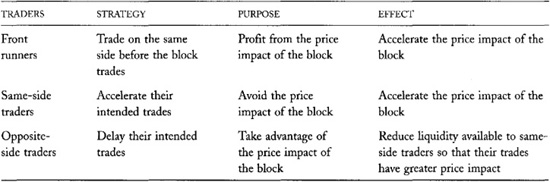
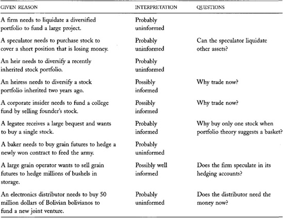
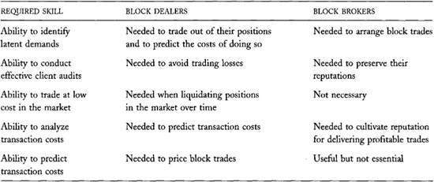

# Chapter 15: Block Traders

*Block trades* result from orders that are too large to fill easily
using standard trading procedures. Such orders generally demand more
liquidity than is normally available at exchanges or in dealer networks.
Traders who wish to trade large blocks therefore must look elsewhere for
liquidity. They usually turn to block traders to arrange their trades.

*Block traders* include block dealers and block brokers. *Block dealers*
arrange block trades when they fill their clients' large orders. *Block
brokers* arrange block trades when they find other traders who are
willing to fill their clients' orders. Both types of block traders
usually arrange their trades by telephone in the *upstairs block
market*. The traders who initiate large trades are *block initiators*.
We will call the traders who fill their orders *block liquidity
suppliers*. Block liquidity suppliers include dealers and large buy-side
traders.

Although block trades represent a small fraction of all trades in most
markets, they often account for much of the total trading volume due to
their large sizes. Block traders arrange most block trades on behalf of
large institutions and very wealthy individuals.

Large traders often have a significant impact on prices. They therefore
must arrange their trades very carefully in order to control their
transaction costs. Block traders must especially consider how they
expose their orders so as to avoid losing to front runners and quote
matchers.

Since block trades significantly affect volumes and prices, traders must
understand block trading in order to interpret volumes and prices. If
you intend to extract information from volumes and prices, you must
understand block trading.

In this chapter, you will learn how large traders expose their orders
and how block traders arrange their trades. You will learn that block
dealers and block brokers want to serve only uninformed clients who
honestly tell them the true sizes of their orders. Block
initiators---whether they are uninformed or informed, honest or
deceitful---therefore must convince block liquidity suppliers that they
are uninformed and honest. We therefore will consider how traders
convince others that they are uninformed and honest.

## 15.1 STATISTICAL DEFINITIONS OF BLOCK TRADES

For our purposes, a *block trade* is any trade that results from an
order that is too large to fill easily using normal trading procedures.
Such orders typically represent more than a day's normal trading volume.
In thinly traded instruments, these orders may represent only a few
thousand shares or tens of contracts. In actively traded instruments,
such orders are many times larger. Most block traders think of a block
as exceeding a quarter of a day's average trading volume in an actively
traded stock.

For statistical purposes, exchanges often
arbitrarily designate trades as block trades if they exceed some fixed
size. These classification schemes vary by exchange. The New York Stock
Exchange defines a block trade as 10,000 shares or more, regardless of
trading activity or price level. Traders, however, routinely arrange
such trades on the Exchange floor in actively traded stocks and in
low-priced stocks. Although officially classified as block trades, these
trades are normal trades in all other respects. In thinly traded stocks,
or in very high priced stocks like Berkshire Hathaway (priced as of this
writing above 70,000 dollars per share), trades smaller than 10,000
shares often cannot easily be arranged on the floor of the Exchange.

------------------------------------------------------------------------

**A Humble Suggestion**

Block trading statistics would be more useful if block trades were
classified by whether they exceed some fraction of average daily volume
rather than by whether they exceed some fixed size. 

------------------------------------------------------------------------

## 15.2 BLOCK TRADING PROBLEMS

Block initiators face four problems when they attempt to arrange their
traders. The *latent demand problem* makes it hard to find block
liquidity suppliers who are not in the market. The *order exposure
problem* makes block initiators reluctant to advertise for liquidity for
fear of driving the market away from them. The *price discrimination
problem* makes liquidity suppliers reluctant to trade with large traders
because they fear that more size will follow. The *asymmetric
information problem* makes liquidity suppliers reluctant to trade with
block initiators because they fear that the block initiators are well
informed.

### 15.2.1 The Latent Demand Problem

The most obvious problem that large traders face is finding traders to
with whom to trade. Many block liquidity suppliers are unwilling to
expose their interest. Many more might trade if asked, but they have not
yet issued orders to trade. Block traders must find these traders in
order to complete their trades.

Traders who would be willing to trade if asked, but who have not yet
issued trading orders, have *latent trading demands*. They may not issue
orders because writing orders is costly, or because they do not realize
that they are willing to trade.

When the probability of trading is small, traders often do not issue
orders because they are costly to manage. For example, a trader may be a
willing buyer of hundreds of different stocks at prices 5 percent below
their current market prices. If he creates and submits orders for each
stock, he risks buying all the stocks if the market as a whole drops
significantly. Since he cannot afford to buy all the stocks, he cannot
allow so many orders to stand at once. Moreover, if all stocks drop
together, he may not be a willing buyer in any stock. He therefore waits
to see which stocks drop. He has latent trading demands for many stocks,
but block traders must discover them before he will trade.

Other traders simply do not know that they are willing to trade. Forming
opinions about thousands of securities is costly. Instead, they often
wait until events force them to think about trading opportunities. When
presented with an attractive opportunity, they may decide to trade.

Traders who are willing to trade but who do not initiate their trades
are *responsive traders*. They respond to demands for liquidity. Most
traders who supply liquidity are responsive traders.

Block traders must discover the latent demands of responsive traders
when they cannot find adequate liquidity in the market. They find
liquidity primarily by calling traders they think would be willing
trade.

------------------------------------------------------------------------

**Hard Work Pays**

Suppose that brokers can develop and maintain one buy-side trader client
for each hour per week that they work. A broker who works only 20 hours
per week has 190 ways to arrange trades among pairs of his 20 clients.
If the broker works an additional 20 hours a week, he has 780 ways to
arrange trades. If he works 60 hours a week, he can arrange trades 1,770
ways.

This illustration shows that well organized brokers become more
productive the harder they work. Hardworking brokers benefit from the
network externality. 

------------------------------------------------------------------------

------------------------------------------------------------------------

**Block Traders Play Concentration Well**

Block traders play a game similar to the card game Concentration, in
which players take turns uncovering cards two at a time and attempt to
match them. To match buyers to sellers, block traders must remember who
was, who is, and---most important---who would be interested in trading
hundreds of securities.

Unlike card players, block traders can take notes, and they obviously do
not have to take turns when playing. Not surprisingly, good block
traders spend most of their time on the telephone. Many enter copious
notes into electronic contract management systems. 

------------------------------------------------------------------------

Block traders often move prices significantly to discover the latent
demands of responsive traders. Buyers bid prices up, and sellers offer
prices down to encourage responsive traders to pay attention and
respond. Block initiators give *price concessions* to block liquidity
suppliers so as to encourage them to trade.

Good block traders know where to look for traders willing to provide
liquidity at the lowest cost. They keep track of who is interested in
various securities, and who has traded those securities in the past.
They also try to know what instruments will appeal to different traders
so that they can predict who will be most willing to trade when
presented with attractive trading opportunities.

Most large traders do not know as much about latent demands as do
professional block traders who specialize in collecting this
information. Large traders therefore often contract with block traders
to arrange their trades.

Large traders do not initiate all block trades. Sometimes *sales
traders* in large wirehouses broker block trades by identifying latent
trading demands on both sides of the trade.

### 15.2.2 The Order Exposure Problem

When looking for liquidity, block traders must be very careful about to
whom they expose their orders. Traders who know about impending blocks
often use that information when trading, to the disadvantage of the
block traders. Some traders create orders expressly to front-run pending
blocks. Other traders who intend to trade on the same side as the block
accelerate their trading to avoid the price impact of the block. Traders
who intend to trade on the opposite side retard their trading to
capitalize on the price impact of the block. These strategies accelerate
the price impact of the block by demanding liquidity in front of the
block or by withholding liquidity from the block. Block traders then
ultimately obtain less favorable prices for their blocks. To avoid these
problems, block traders try to display their orders first to traders who
will most likely fill them.

Block traders *shop the block* when they expose their orders while
searching for liquidity. Widely shopped blocks *hang over the market* as
information about them *leaks out*. Block traders *spoil their market*
when prices run away from their orders because they have foolishly
exposed them. [Table 15-1](#part0026.html_ch15tab01) describes
strategies that clever traders use to exploit information about a block
hanging over the market.

Successful block traders carefully consider whether the traders to whom
they have exposed orders are front running them. They pay attention to
prices, volumes, and any available information about who is trading.
Block traders who suspect that traders are front running their orders
must avoid exposing their orders to those traders in the future.

Traders who front-run block orders, or who allow information about block
orders to leak, risk acquiring a reputation for being untrustworthy.
Block traders do not make their first calls to such traders.
Untrustworthy traders may thus lose the opportunity to participate in
future blocks. They also lose early access to information that might
allow them to better interpret market conditions. Since blocks
initiators often give block liquidity suppliers substantial price
concessions, supplying liquidity to block initiators often is quite
profitable. When block traders can identify front running, traders have
substantial incentives to cultivate trustworthy reputations.

**TABLE 15-1**.\
Strategies Clever Traders Pursue When a Block Is Hanging over the Market

To avoid order exposure problems, block traders favor trading systems
that do not expose their orders. Crossing markets like POSIT serve these
traders by allowing them to arrange trades on a completely confidential
basis. At exchanges that permit hidden limit orders (such as Euronext,
GLOBEX, and Island), large traders frequently hide their orders to limit
their impact upon the market. At exchanges that do not have such
facilities, large traders give their orders to honest brokers who expose
them selectively, or they break their orders into small pieces so that
nobody can determine their full size.

### 15.2.3 The Price Discrimination Problem

Block initiators have trouble finding liquidity because block liquidity
suppliers are afraid that they will price discriminate among them. Block
liquidity suppliers do not want to be the first to offer liquidity to a
large trader, only to see prices move against them when the large trader
continues to trade. They therefore want to know how much the large
trader truly wants to trade before they offer liquidity. Block
initiators---especially those whose orders are not so large that they
will greatly benefit from price discriminating---may obtain better
prices from block liquidity suppliers if they can credibly convince them
of the true sizes of their orders.

Traders cannot credibly reveal the true sizes of their orders in markets
where they trade anonymously. Traders will lie in anonymous markets
because lying has no negative consequences in such markets. The primary
penalty for lying is losing an honest reputation. Since traders cannot
cultivate reputations in anonymous markets, they will lie with impunity.
Block initiators who want to solve the price discrimination problem must
therefore trade in markets where they know with whom they are trading.

Since most large traders do not trade often enough to acquire strong
reputations for being honest, they often use block traders who have such
reputations to arrange their trades. Block traders acquire their
reputations by consistently telling the truth. To protect their
reputations, they must ensure that their clients do not lie to them.
Dishonest clients improperly try to exploit the honest reputations of
their agents.

------------------------------------------------------------------------

**A Quick Ticket to the Doghouse**

Blair tells Sawyer that he wants to buy 200,000 shares of IBM. Sawyer
asks whether this is the full size of his order. Blair assures him that
it is indeed. They arrange to trade IBM at 50 cents above its prevailing
price.

Blair then contracts with another trader to buy 200,000 more shares of
IBM at a price 50 cents higher than he paid Sawyer.

Sawyer immediately loses 100,000 dollars on his sale. Had he known Blair
wanted to buy 400,000 shares, he would have demanded a higher price.
Sawyer will now put Blair *in the doghouse*. He will not knowingly offer
liquidity to Blair for a long time. 

------------------------------------------------------------------------

------------------------------------------------------------------------

**Untrustworthy Traders
Do Not Get Shares in Hot IPOs**

Buying a hot issue during its initial public offering can be extremely
profitable. The prices of these issues often jump substantially on the
first day of trading.

The investment banks that control the distribution of these shares can
allocate the shares to whomever they please. They naturally will not
allocate shares to customers who exploit them. Such customers include
block initiators who are not honest about the full sizes of their trades
and traders who front-run blocks displayed to them. 

------------------------------------------------------------------------

Block traders keep their clients honest by knowing them well and by
penalizing them when they are dishonest. They are most effective when
they have well-established relationships with their clients. Block
traders therefore often work for large investment banks that provide
services besides transaction services to their clients. These other
services may include investment advice, research, banking, and clearance
and settlement. Through these relationships, block traders get to know
their clients well, and they often can penalize clients who lie to them.

Since large traders can send portions of their orders to multiple block
traders, block traders may not easily determine the full extent of their
clients' orders. In the U.S. equities markets, many large institutions
must report their portfolio holdings on a quarterly basis to the
Securities and Exchange Commission. Data vendors such as CDA/Spectrum
collect these *13F Holdings Reports* and disseminate the information in
them to their clients. Block traders use this information to determine
after the fact whether their clients were truthful in their dealings
with them. Block traders also use information about portfolio positions
to estimate the maximum amount that a large trader might trade. The
information is particularly useful when the large trader is a seller
whose investment policy prohibits short sales. Such traders can sell no
more than they own. If they want to sell their entire positions, block
traders know that no further size will follow.

### 15.2.4 The Asymmetric Information Problem

Block initiators have trouble finding liquidity because block liquidity
suppliers suspect that they are well informed. They base their
suspicions on two arguments. First, large traders can afford to invest
more in information than can small traders because they can spread the
fixed costs of research over larger portfolios. Second, well-informed
traders want to trade large sizes in order to obtain the maximum profit
from their information. Taken together, these arguments suggest that
large traders are often well informed. Traders therefore do not like to
trade with them. When they do, they demand very large price concessions.

Block liquidity suppliers demand these price concessions for the same
reasons that dealer bid/ask spreads include an adverse selection
component. These price concessions allow liquidity suppliers to recover
from uninformed traders what they lose to informed traders. They also
reflect the inferences about fundamental values that liquidity suppliers
make when they suspect that they may be trading with well-informed
traders.

Block liquidity suppliers especially suspect that large anonymous
traders are well informed. Informed traders like to trade anonymously
because they do not want to acquire reputations for being well informed.
Such reputations would allow liquidity suppliers to avoid them. They
also like to trade anonymously because they do not want front runners to
profit from the fundamental information that their orders reveal. Since
uninformed traders do not share these concerns, block liquidity
suppliers suspect that anonymous traders tend to be well informed.
Accordingly, block liquidity suppliers avoid anonymous traders.

Large block initiators solve the asymmetric information problem by
convincing block liquidity suppliers that they are uninformed. To do
this, they must reveal their identities. If they have a reputation for
being uninformed, traders may then offer them liquidity that they
otherwise would not have offered. If they do
not have a reputation for being uninformed, they must submit to an audit
of their trading intentions. If block traders conclude that the large
traders are indeed uninformed, they may arrange trades for them.

### 15.2.5 Summary

Block initiators have trouble finding liquidity because most block
liquidity suppliers do not express their trading interests, because
block initiators cannot widely expose their orders without spoiling
their markets, because block liquidity suppliers fear that block
initiators will price discriminate, and because block liquidity
suppliers fear that block initiators are well informed. Block initiators
must address these issues in order to obtain liquidity.

To address each issue, block initiators must reveal credible information
about themselves to block liquidity suppliers. They must tell them they
want to trade to solve the latent demand problem. They must expose only
to the most trustworthy traders to avoid order exposure problems. They
must credibly reveal the full size of their orders to solve the price
discrimination problem. Finally, block initiators must convince block
liquidity suppliers that they are uninformed traders to address the
asymmetric information problem.

Successful block trading therefore requires significant exchanges of
information among traders besides the usual price and size information
that all traders must exchange. Since most exchanges and dealer networks
are equipped only to exchange price and order size information, block
traders arrange most block trades by telephone in the upstairs market.

Block initiators choose between two strategies to convey information
about themselves to the market. *Sunshine traders* try to communicate
directly to the market. The sunshine trading strategy is rarely
effective, however. We consider it because it allows us to better
understand the alternative strategy in which large traders use the
services of block traders in the upstairs market.

------------------------------------------------------------------------

**Ignorance Is Bliss**

In almost everything we do, a reputation for being well informed serves
us well. Trading is the notable exception. Although the most profitable
traders are well informed, they must appear to be uninformed when they
trade. Otherwise, they will not be able to trade at low cost. 

------------------------------------------------------------------------

## 15.3 SUNSHINE TRADING

Traders who announce to the market who they are, what they intend to do,
the full extent of their orders, and why they intend to trade are
*sunshine traders*. Sunshine trading works well when sunshine traders
are well known and are known to be uninformed and honest. In large
markets, sunshine trading at best works only for the largest traders,
since only those traders will be able to acquire credible reputations.

Sunshine trading does not work if traders suspect that the sunshine
trader may be well informed or dishonest. If traders could always obtain
more liquidity merely by revealing their identities, all traders would
do so. Unknown informed traders would pretend to be uninformed traders,
and well-known informed traders would create new identities to mask
their trading. Well-informed traders who try to pass for uninformed
traders are *wolves in sheep's clothing*. Sunshine trading generally
does not work well because it is hard to determine whether sunshine
traders are indeed uninformed traders and whether they have indeed
revealed their entire trading interests. Good answers to such questions
generally require thorough investigations of their motives for trading.
Traders cannot conduct such investigations on exchange floors or in
screen-based trading systems.

Although sunshine trading may solve the asymmetric information problem
for some very well-known traders, it introduces another serious problem.
By revealing their intended trades, sunshine traders give free trading
options to the market. They therefore attract front runners, quote
matchers, and, under some circumstances, squeezers. ([Chapter
11](#part0021.html_ch11) describes how these order
anticipation strategies work.) Sunshine traders may therefore have
higher transaction costs than they would have if they controlled their
order exposure more carefully.

------------------------------------------------------------------------

**LOR's Sunshine Trading
in S&P 500 Futures**

Leland O'Brien Rubinstein Associates (LOR) was an institutional money
manager that popularized the portfolio insurance trading strategy in the
early 1980s. The object of the strategy is to replicate the returns of a
covered put position. Traders implement the strategy by buying
securities when the market rises and selling them as it falls. A formula
from the wellknown Black-Scholes option pricing theory specifies the
trade size.

LOR used S&P 500 futures contracts to provide portfolio insurance for
clients whose portfolio returns were closely correlated with the S&P 500
Index. Since the strategy was extremely popular, LOR became a very large
and very well known trader in the S&P 500 futures pit.

In an attempt to lower the cost of their trades, LOR would make public
announcements of its orders and of when it would fill them. It thus
hoped to notify other traders of the trading opportunities that it
offered. Since traders knew LOR was an uninformed trader following a
well-known and well-understood trading strategy, LOR hoped that its
announcements would solve the price discrimination and asymmetric
information problems that large traders normally face. 

------------------------------------------------------------------------

------------------------------------------------------------------------

**Wolves and Sheep**

Traders sometimes call well-informed traders wolves and uninformed
traders sheep. This biological analogy represents their relationship
quite well. Just as wolves must eat sheep to survive, well-informed
traders must trade with uninformed traders to profit.

Proprietary traders who use computers to implement trading strategies
that offer liquidity write program codes they call *wolf detectors* to
identify and avoid trading with well-informed traders. 

------------------------------------------------------------------------

## 15.4 THE UPSTAIRS MARKET

The *upstairs market* serves large traders who cannot convey credible
information about their trading motives and intentions to traders in the
regular market. These block initiators use block dealers and block
brokers to help them fill their orders. Both types of block traders
investigate their clients to determine whether they are well informed
and whether they have revealed the full sizes of their orders.

### 15.4.1 Block Dealers

Block dealers fill large client orders when they trade for their own
accounts. Because they take their clients' positions, block dealers are
also known as *block positioners*. They are also called *block
facilitators* because they facilitate their clients' demands for
liquidity.

After block dealers take their clients' positions, they then try to
trade out of them. They may try to identify large traders who are
interested in their new positions, or they may break their positions
into small parts to distribute into the market over time.

Good block traders must carefully set the prices at which they
facilitate trades with their clients to ensure that they will be able to
trade out of their positions at a profit. To do this, they must be able
to predict what their transaction costs will be when they liquidate
their positions. Some block dealers therefore make substantial
investments in transaction cost analyses so that they can predict future
transaction costs.

Since block dealers take positions that they
generally intend to liquidate, they must be very careful that they do
not trade with well-informed traders or with traders who have more size
to trade. If they trade with informed traders, they risk losing if
prices change against their positions before they have liquidated them.
If they trade with traders who have more size to trade, they must
compete with their clients to liquidate their positions. Block dealers
therefore have a very strong and direct interest in why their clients
want to trade.

------------------------------------------------------------------------

**The Upstairs Market**

The upstairs market acquired its name because its traders arrange block
trades at trading desks in the offices of the wirehouses for which they
work. When traders used to have offices that were in the New York Stock
Exchange building or across the street, these offices were generally
above the street level on which the trading floor was (and still is)
located. 

------------------------------------------------------------------------

Many large traders choose to trade with block dealers because block
dealers are better traders than they are. Although the block initiators
might be able to handle the trade themselves by breaking it up, they
presumably would incur greater transaction costs, especially if they
want to trade quickly. To avoid these costs, block initiators pay block
dealers to take their trading problems.

### 15.4.2 Block Brokers

Block brokers help block initiators identify traders who will fill their
orders. Since they often must assemble many traders to fill a large
order, block brokers are also known as *block assemblers*.

The traders whom block brokers organize to fill their clients' block
orders care as intensely about whether they will lose when trading with
block initiators as block dealers do. Block liquidity suppliers do not
want to see prices rise after they sell or fall after they buy.

Block liquidity suppliers rely upon the block brokers who arrange their
trades to determine whether the block initiators are well informed and
whether they are honest about the full size of their intended trades. If
subsequent events suggest that a broker failed to adequately screen his
clients, block liquidity suppliers will be reluctant to do more business
with that broker. To protect their reputations, block brokers therefore
must know their clients well. To cultivate their reputations, block
brokers often estimate transaction costs for their clients to
demonstrate that they have served them well on average.

Block brokers charge block initiators commissions for their services. In
many markets, they also collect commissions from the block liquidity
suppliers.

### 15.4.3 Brokers Versus Dealers

Block brokers and block dealers tend to specialize in different segments
based on their comparative advantages. Dealers have a comparative
advantage when trading with impatient traders because dealers can take
positions before they know where they will place them. They also have a
comparative advantage filling small blocks because they often can trade
out of their positions by patiently trading in the market. Brokers
cannot compete well in these segments because they do not trade for
their own accounts. Brokers have a comparative advantage assembling
blocks for the largest traders because dealers are unwilling to hold
very large positions.

In practice, most block traders act both as brokers and as dealers. Dual
traders can better serve their clients than can pure brokers or pure
dealers because they can do whatever is best for their clients at the
moment. In addition, brokers who are willing to participate in a trade
have an important advantage over brokers who will not. They can more
credibly assure potential traders that a trade will not hurt them when
they also participate in it. Rather than staking just their reputations
on their audits, as brokers do, broker-dealers also stake their wealth.

------------------------------------------------------------------------

**A Finger in the
Guillotine**

Some magicians use trick guillotines to entertain their audiences. After
demonstrating that the guillotine will easily cut a potato, the magician
calls upon a volunteer to place her hand in the guillotine. The magician
then drops the guillotine again. This time, of course, the guillotine
does not cut off the hand, although it appears to the audience that it
will.

Since a magician's guillotine will cut off a hand if not used properly,
magicians must be very careful that they operate the guillotine
correctly. To focus their attention, they commonly put one of their
fingers in the guillotine along with the volunteer's hand.

When brokers propose trades to block liquidity suppliers, the suppliers
must trust that the brokers are suggesting trades that benefit them and
not just the brokers or the trade initiators. Brokers who put their
finger in the guillotine by trading along side other block liquidity
suppliers assure the block liquidity suppliers that they are acting in
their interests.

------------------------------------------------------------------------

**Hot Potatoes**

Dealing with informed traders is like passing a hot potato. A dealer who
takes a position from a well-informed trader hopes to pass it along
before its true value becomes well known. When traders can infer values
from trade reports, trading with well-informed traders is more risky.

------------------------------------------------------------------------

#### 15.4.3.1 Trade Reporting Issues

Rules that require full and timely trade reporting favor block brokers
over block dealers. Such rules have little effect on block brokers
because their work is finished when they arrange trades for their
clients. They affect block dealers because dealers must liquidate their
positions after they facilitate their clients' orders.

When dealers must quickly report their block trades, clever traders may
use this information to predict trades that dealers must arrange to
liquidate their newly acquired positions. These traders may then
front-run the dealers and thereby increase their costs of liquidating
their positions.

Clever traders may also use trade reports to infer whether block
initiators are well informed. Such inferences increase the probability
that dealers will lose when they offer liquidity to well-informed block
initiators. In particular, dealers may be unable to liquidate their
positions before information about their trades causes prices to move
against them. Timely trade reporting therefore increases the importance
of the audit that dealers must make of their clients' reasons for
trading.

Not surprisingly, the markets with the weakest trade reporting practices
tend to be dealer markets. For example, most corporate bond markets are
pure dealer markets. These markets have no trade reporting requirements.
In the United States, the SEC has been pressing for the adoption of a
bond trade reporting system, but the dealers are quite resistant.

### 15.4.4 The Trading Motive Audit

To avoid helping a well-informed trader, block traders research their
clients' motives for trading to determine whether they are uninformed.
Uninformed traders have utilitarian reasons for trading that are
unrelated to fundamental values (see [chapter
8](#part0017.html_ch08)). When these reasons are apparent,
block traders may conclude that their clients are uninformed.

**TABLE 15-2**.
Examples of Trader Motives and Likely Interpretations

Block traders are most confident that their clients are uninformed when
their clients have easily verified utilitarian reasons to trade the
instrument that they propose to trade when they want to trade it. When
the block initiator has some discretion in choosing which instrument to
trade, or when to trade it, the block trader may suspect that the trader
chose the security or time to trade strategically. (See [table
15-2](#part0026.html_ch15tab02) for trader motives.)

Some traders scoff at the notion that block brokers audit trader motives
and total trading interest. Although they acknowledge that information
about motives and total trade sizes is very important, they claim that
block brokers are completely unreliable when it comes to providing this
information. In particular, they assert that most block brokers are not
trustworthy.

------------------------------------------------------------------------

**Block Trade Reporting at the London Stock Exchange**

The London Stock Exchange historically has been a dealer market. It once
allowed its dealers to report their largest blocks as long as seven days
after the trade. The Exchange now requires that all traders report their
trades within 90 minutes. By contrast, traders in the United States must
report all equity trades within 90 seconds while the markets are open.

------------------------------------------------------------------------

There may be some merit in their opinion. Since prices in many markets
are quite volatile, block liquidity suppliers may be unable to determine
whether adverse price changes are related to their trades or simply due
to normal security price fluctuations. In such environments, block
traders may not be able to cultivate reputations for effectively
auditing trader motives and total order sizes. If that is so, block
traders will shirk on their audits, and each block liquidity supplier
will have to rely upon his or her own research to determine whether to
offer liquidity. Traders who do not do their research risk offering
liquidity foolishly.

------------------------------------------------------------------------

**Block Traders and
Brokerage Recommendations**

Broker-dealers often recommend to their clients stocks the
broker-dealers recently acquired by positioning blocks for their larger
clients. If their clients listen to them, the brokers can then liquidate
their positions by selling to their clients. Such dealers are called
*distributors* because they distribute the blocks to their brokerage
clients.

These recommendations often perform poorly. Stocks recommended by
broker-dealers historically have underperformed the market.

Brokers who exploit their clients too often eventually lose them.
Accordingly, the brokers most likely to exploit their clients are
brokers who have the least to lose. These brokers usually employ hard
sales tactics to acquire new accounts from unsophisticated retail
investors.

Block distributions to retail brokerage clients are not necessarily
nefarious. Honest broker-dealers do their clients a service by
identifying and selling undervalued securities to their clients.

------------------------------------------------------------------------

------------------------------------------------------------------------

**An Uninformative Divestiture**

The Employee Retirement Income Security Act (ERISA) limits how much
employer-sponsored pension plans may invest in their sponsors' stocks.

Suppose that a pension plan holds the maximum legal investment in its
sponsor's stock. The sponsor then buys a firm in which the plan has also
invested, and pays for the purchase by exchanging stock. Following the
transaction, the pension plan will hold more of its sponsor's stock than
the legal maximum. Since the law requires that it divest the excess
stock, a block trader may reasonably conclude that the sale is not
information-motivated. 

------------------------------------------------------------------------

## 15.5 A TELLING STATISTIC

We often can identify whether a seller or a buyer initiated a block
trade by comparing the block trade price against the quotation prices
that prevailed when the block traded. If the block trade price is closer
to the bid than to the ask, it probably was seller-initiated. Otherwise,
it was probably buyer-initiated. This classification scheme presumes
that the block initiator paid a concession to fill the order. Since this
presumption is reasonable, the classification scheme is quite accurate.

Using this classification scheme, analysts have determined that sellers
initiate approximately 80 percent of all large block trades in the U.S.
stock markets. The remarkable asymmetry between block buyer- and
seller-initiated trades is consistent with three of the four block
trading problems discussed in this chapter:

Consider first the latent demand problem. Block sellers can sell their
blocks to any interested traders. In contrast, when short selling is
difficult, block buyers generally can buy large blocks only from traders
who own the securities in which they are interested. Buying large blocks
therefore may often be harder than selling large blocks.

Now consider the price discrimination problem. Block sellers often can
credibly reveal the full size of their orders if they cannot sell short.
Few buyers, however, operate under such constraints. Although
restrictions on the maximum quantities that institutional investors may
hold in any one security may limit the purchases of some buyers, these
restrictions rarely are binding. These observations suggest that block
liquidity suppliers will more often trade with sellers than with buyers.

Finally, information asymmetries may also explain why block sellers
initiate more trades than block buyers. Sellers generally can offer more
convincing stories about why they are uninformed than can buyers.
Sellers occasionally must sell specific securities to raise cash or to
manage the risk of undiversified portfolios. Buyers, however, can buy
any security. Since uninformed buyers should
not construct undiversified portfolios, traders assume that most large
buyers are well informed. Block liquidity suppliers therefore will more
often offer liquidity to sellers than to buyers.

## 15.6 THE RELATION BETWEEN BLOCK MARKETS AND REGULAR MARKETS

Since block markets trade the same instruments that regular markets
trade, regulators must consider how the two types of markets relate to
each other. In particular, regulators must ensure that neither market
has significant negative impact upon the other. Regulators are
especially concerned about the potential for large traders to use block
markets to subvert rules in the regular markets. Regulators generally
want to protect the rights of traders in the regular markets and to
protect block clients from potential trading abuses. The regulation of
block trading markets is difficult because regulators must respect the
needs of large traders who use the block markets to organize liquidity
that they otherwise could not find in the regular markets. This short
section considers some regulatory issues that arise when block markets
trade alongside regular markets.

### 15.6.1 Equity Markets

In the U.S. listed equity markets, brokers and dealers who are members
of an exchange must *print* their block trades in exchange-listed
securities at an exchange if the trade takes place while the market is
open. To print a trade, the block trader presents the matched buy and
sell orders to the market. The purpose of these exchange rules is to
expose all orders to the market so that the exchange order precedence
rules protect the interests of all traders in the market.

Sometimes standing orders already in the market may have higher order
precedence than some of the matched orders that block traders present.
This happens when traders in the market have price priority because they
are offering better prices or when traders have time precedence because
they offered to trade at the block price before the matched block orders
arrived. In such cases, the exchange must mediate between the interests
of the block traders and the traders who submitted standing orders with
higher precedence. The block traders want to cross their blocks without
interference from other traders. Traders with higher precedence want to
participate in the block trade.

The U.S. equity exchanges address this problem with a *size precedence
rule*. For crosses that exceed 25,000 shares, the matched block orders
are allowed to *outsize the book* at the trade price. In particular,
large matched orders jump ahead of orders with greater time precedence.
All orders standing on the book at better prices, however, are
incorporated into the block trade at the block price. These orders
displace some of the matched orders that the block trader presents. The
block trader *cleans up the book* by filling these standing orders.

The size precedence rule represents a compromise between the interests
of the block traders and those of the standing limit order traders. The
block traders want to protect the efforts that they have made in
arranging their blocks. When their block crosses are broken, they make
less in commissions, they make less dealer profit, and they may have to
tell some of their clients that they did not
trade when they expected to. Since the block traders provide services
that are not generally available on exchange floors, exchanges are
interested in protecting them. (They are also interested in collecting
the print revenues that data vendors pay to exchanges in proportion to
their trading volumes.) The standing limit order traders want to earn a
return on the liquidity that they offer to the market. Since exchanges
value the liquidity that they offer, exchanges are also interested in
protecting these traders. By universally enforcing the price priority
rule, the exchanges maintain strong incentives for traders to improve
prices. The price priority rule also encourages block brokers to access
liquidity on the exchange before they access other sources of liquidity.
Block initiators like this incentive because identifying liquidity
offered at the exchange is cheaper than identifying liquidity from
traders with latent trading interest. The 25,000-share threshold for
sizing the book ensures that only very large crosses may violate time
precedence.

------------------------------------------------------------------------

**Block Trading at LIFFE**

The London International Financial Futures and Options Exchange (LIFFE)
introduced a block trading facility in April 1999. LIFFE's block trading
procedures permit its members and their qualified clients---known as
wholesale clients---to quickly trade large blocks at bilaterally
negotiated prices. Traders may use the facility only for trades larger
than a predetermined size. 

*Source: [[www.liffe.com](http://www.liffe.com)]*

------------------------------------------------------------------------

To avoid limit orders that might break up their blocks, block traders
often print their crosses at regional exchanges. These exchanges usually
do not have as many orders standing in their books as the primary stock
exchanges do.

### 15.6.2 Futures Markets

Most futures markets require that traders arrange all trades in their
contracts within their trading systems, whether they use floor-based or
screen-based systems. These rules prevent abuses that can arise when
brokers direct orders to confederates who offer prices inferior to those
available at the exchange. Since block trading generally involves trades
arranged away from the exchange, futures markets historically have had
either no block trading procedures or cumbersome block trading
procedures.

Various futures markets have experimented with block trading rules.
These rules generally allow brokers to arrange block trades that exceed
some specified quantity, but only among eligible participants. Exchange
rules define *eligible participants* as sophisticated traders who
presumably are aware of the problems associated with negotiating trades
away from the market. Such traders typically include sell-side traders
and buy-side professionals working for large institutional managers.
Notwithstanding these qualifications, the exchanges still require the
block prices to be fair and reasonable, given current market conditions
and the circumstances of the trades.

Futures traders also use *exchange for physical* (EFP) trading
procedures to arrange block trades. In an EFP, traders agree to exchange
a long physical position for a long futures position plus cash. Exchange
clearinghouses originally developed EFP trading procedures to allow
commercial operators in the agricultural markets to transfer hedged cash
positions.

The EFP trading procedure is attractive to block traders because it can
be employed away from the exchange. The procedure therefore is also used
to arrange after-hours trades. For example, traders in currency futures
at the Chicago Mercantile Exchange (CME) often use the procedure
immediately after trading closes to offset a position that they do not
want to hold overnight. The CME floor traders generally execute these
EFPs with currency traders at large banks. Exchanges call these EFPs
*transitory EFPs* because the floor traders buy or sell the cash
currency at the same time they execute the EFP.

------------------------------------------------------------------------

**An EFP in Wheat**

Frank is a North Dakota wheat farmer who has hedged his crop by selling
wheat futures contracts at the Chicago Board of Trade. He intends to
sell the crop to Oscar, his local grain operator.

Oscar owns wheat silos and facilities for loading wheat onto railroad
cars. He knows much about wheat storage and shipping, but little about
global wheat supply and demand. He therefore hedges his physical wheat
positions to avoid exposure to price risks that he does not understand.
Whenever he buys cash wheat, he sells futures contracts, and vice versa.

When Frank sells his crop to Oscar, Frank must close his short hedge and
Oscar must create the same short hedge. Rather than separately trading
futures in Chicago, they arrange an EFP. Frank gives his physical wheat
to Oscar in exchange for cash and a long position in the futures
contract. The long futures position that Frank receives offsets his
short hedge. The long futures position that Oscar gives, leaves him
short futures, so that his newly acquired cash wheat position is hedged.
Through this mechanism, Frank transfers his hedged cash wheat position
to Oscar. 

------------------------------------------------------------------------

## 15.7 SUMMARY

Block trades are trades that are too large to arrange easily using
normal trading methods. They usually involve more size than is typically
available at an exchange or in a dealer network.

Four problems make block trades costly to arrange:

• Block liquidity suppliers may be hard to find because most traders do
not express their trading interests.

• Block initiators are reluctant to advertise their interests for fear
of spoiling their markets.

• Block liquidity suppliers fear that block initiators will try to price
discriminate among them by breaking up their orders.

• Block liquidity suppliers fear that block initiators may be well
informed.

------------------------------------------------------------------------

**A Transitory EFP in German Marks**

Geraldine trades German mark futures at the Chicago Mercantile Exchange.
At the end of the trading day, she discovers that she is long more
contracts than she is willing to hold overnight. To divest her position,
Geraldine executes an EFP with a currency trader at a large money bank.
She gives U.S. dollars and the futures contracts to the bank and in
exchange receives German marks. She simultaneously sells German marks
for U.S. dollars to the same currency trader. In effect, she has sold
her futures contracts to the bank after hours. 

------------------------------------------------------------------------

Block traders solve these problems by keeping track of who might be
interested in trading, by selectively exposing block orders, by
determining the full size of their clients' orders, and by determining
whether their clients are well informed. Since traders cannot easily
undertake these activities on the floor of an exchange, traders arrange
most large block trades off the exchange floors. [Table
15-3](#part0026.html_ch15tab03) provides a summary of the
skills that good block traders must have.

Block trading markets work well only when traders know each other well.
Anonymous traders generally cannot credibly exchange the information
that block traders require of each other. Since anonymous traders cannot
establish reputations, they have no incentive to reveal information
honestly. Trading systems that match anonymous buyers to anonymous
sellers therefore cannot easily arrange block trades.

Block traders must be very careful when they agree to help a block
initiator find liquidity. If they act as dealer and offer the liquidity
themselves, they must be confident that prices will not move against
them before they can divest the blocks that they facilitate. Otherwise,
they will lose. If they act as broker and arrange to have other traders
fill the order, they also must be confident that prices will not move
against their clients whom they have encouraged to offer liquidity.
Otherwise, these clients will be reluctant to participate in future
trades that the block brokers may propose.

**TABLE 15-3**.\
Block Trader Skills

## 15.8 SOME POINTS TO REMEMBER

• Block trading markets primarily serve large uninformed traders.

• Order exposure is very important to large traders.

• Informed traders may pretend that they are uninformed to obtain
liquidity more cheaply.

• Large traders may split their orders to price discriminate among
liquidity suppliers.

• To trade successfully, block dealers and brokers must determine
whether their clients are well informed and whether their clients want
to price discriminate.

• Block dealers lose their capital when they do not know their clients
well.

• Block brokers lose their reputations when they do not know their
clients well.

• Delayed trade reporting favors informed over uninformed traders, and
block dealers over block brokers.

## 15.9 QUESTIONS FOR THOUGHT

• Exchanges classify block trades as all trades larger than some
threshold. The threshold can be a given trade size, a given trade value,
a given fraction of daily trading volume, or a given fraction of
shares/contracts outstanding. What are the advantages and disadvantages
of these various alternatives?

• Floor brokers on the floor of the NYSE often arrange
institutional-sized trades. Do they offer their clients services that
they could not obtain in an electronic trading system? Of what value is
an honest reputation to a floor broker? How do they protect their
reputations?

• When a large trader splits his order among
many block trades, should the trader submit the parts sequentially or
simultaneously?

• How might a block trader recognize when a large trader has split his
order among many brokers?

• When should exchanges allow size to take precedence over time at a
given price?

• Should regulators allow delayed reporting for large trades?

• Which customers---informed or uninformed---favor delayed reporting?

• How should an informed trader arrange his trades to obtain liquidity
cheaply?
