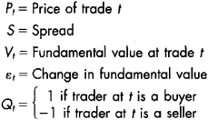
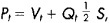
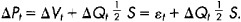
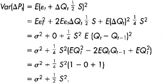
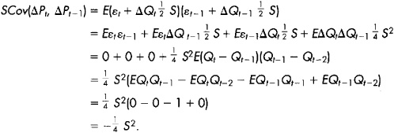
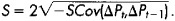

# Chapter 20: Volatility

*Volatility* is the tendency for prices to change unexpectedly. Prices
change in response to new information about values and in response to
the demands of impatient traders for liquidity.

Volatility itself changes through time. Sometimes prices are very
volatile. Other times, prices are very stable and hardly change at all.
Large price changes sometimes occur in short time intervals. Regulators
and traders refer to episodes of such price changes as *episodic
volatility*. Episodic volatility concerns many people because it can be
quite scary.

Volatility, risk, and profit are closely related. Every drop in prices
creates losses for traders who have long positions and profits for
traders with short positions. Likewise, every price rise causes losses
for traders with short positions and profits for traders with long
positions. Traders therefore are very interested in volatility because
it can have a significant impact on their wealth. If risk scares you or
profits interest you, you need to know about volatility.

Volatility especially concerns options traders. Option contract values
depend critically on the volatility of the underlying instrument.
Options traders must be able to measure and predict volatilities in
order to trade profitably. Both skills require that they understand well
the origins of volatility.

Technical traders who try to interpret trading volumes also pay close
attention to volatility because volumes and volatility are often
correlated. The relation between the two variables is not simple,
however. It depends on the origins of the volatility.

Volatility greatly concerns regulators. Excessive volatility may
indicate that markets are not functioning well. Since accurate prices
are extremely important in the economy, regulators pay close attention
to the markets when prices are highly volatile. They are especially
attentive when markets crash.

In this chapter, we identify the origins of volatility and distinguish
between its two types. *Fundamental volatility* is due to unanticipated
changes in instrument values, and *transitory volatility* is due to
trading activity by uninformed traders.

The distinction is important both for traders and for regulators.
Traders must distinguish between the two volatility types in order to
accurately predict future volatility, the profitability of dealing
strategies, and transaction costs. Regulators must distinguish between
them because they cannot have any lasting effect on fundamental
volatility, but they often can substantially affect transitory
volatility. Depending on the policies that regulators adopt, they may
decrease or increase transitory volatility.

We start this short chapter with discussions about the origins of the
two types of volatility. We then finish by considering how to
distinguish between them. [Chapter 28](#part0042.html_ch28)
considers what regulators can do about volatility when it appears
excessive to them.

## 20.1 FUNDAMENTAL VOLATILITY

Since economies use prices to allocate resources, it is very important
that prices reflect fundamental values. Values change when the
fundamental factors that determine them change. Prices therefore should
change when people learn that fundamental factors have unexpectedly
changed. Such price changes contribute to fundamental volatility.

When new information about changes in fundamental values is common
knowledge, prices may change without any trading. For example, suppose
that an unexpected killer frost descends upon Florida overnight. The
morning news will undoubtedly report the event. The next day, orange
juice futures contracts will open at a much higher price than the last
price of the previous trading day.

When only a few people know new information about changes in fundamental
values, prices generally will change on high trading volumes. The
well-informed traders will trade on their information. The pressures
their trades put on prices will cause prices to change to reflect the
new fundamental values.

Since informed traders generally hurt dealers, and since dealers
generally do not know when they trade with informed traders, dealers try
to infer information about fundamental values from their order flows.
The inferences that they make contribute to the adverse selection spread
component introduced in [chapter 13](#part0024.html_ch13).
Price changes due to the adverse selection spread component thus
contribute to fundamental volatility.

### 2.1.1 Fundamental Volatility Factors

Any factor that determines the value of a trading instrument can cause
the price of that instrument to change. For a commodity, the most
important factors are cash market supply and demand conditions. Other
important factors are interest rates and storage costs. For a bond, the
most important factors are interest rates and the credit quality of the
issuer. For a stock, the most important factors are quality of
management, the values of the company's resources and technologies, the
supply and demand conditions in its product markets and in its input
markets, and interest rates. For currencies, the important valuation
factors include national inflation rates, macroeconomic policies, and
trade and capital flows. Unexpected changes in any of these factors
generate fundamental volatility in the instrument.

### 2.1.2 Predictability

Expected changes in fundamental factors generally do not change prices.
Informative prices usually fully incorporate all available information
about future values. Since people base their expectations on existing
information, fully informative prices will already incorporate expected
changes in fundamental factors. When the expected event occurs, it is
not surprising, and it therefore should not cause prices to change. Only
unexpected events cause fundamental price volatility. Consequently, the
identifying characteristic of fundamental volatility in fully
informative prices is unpredictable price changes. An unpredictable
price process is called a *random walk*. [Chapter
10](#part0020.html_ch10) provides a more complete explanation
of the properties of fully informative prices.

------------------------------------------------------------------------

**Gasoline, Diesel Fuel,
and Heating Oil Volatility**

Gasoline, diesel fuel, and heating oil are expensive to store because
they require very large tanks. The available producer storage in the
United States amounts to only 9 days of consumption of gasoline and 18
days of distillate fuels (heating oil and diesel fuel). Since the
demands for these fuels are highly inelastic, unexpected fluctuations in
demand caused by weather, refinery accidents, or changes in the economy
often cause substantial variation in the prices of these commodities.

*Source: Year 2000 consumption and refinery working storage capacity
data obtained from the Energy Information Administration, U.S.
Department of Energy, at
[[www.eia.doe.gov](http://www.eia.doe.gov)].*

------------------------------------------------------------------------

The one exception to this rule involves price changes that are necessary
to compensate instrument holders for their carrying costs and for
bearing risk. For example, the prices of zero-coupon bonds creep upward
over time as they approach maturity. Since they pay no interest,
investors buy them at substantial discounts to their face values. The
creep in prices compensates them for the interest payments that they
would have received if they had invested in a straight bond. These
creeping price changes are fully predictable, and therefore do not
contribute to fundamental volatility. Note, however, that if interest
rates unexpectedly fall, the prices of zero-coupon bonds will
immediately rise to reflect the new interest rates. This unexpected
price change would contribute to fundamental volatility.

### 2.1.3 Storage Costs

Commodities that are expensive to store are often quite volatile. The
high storage costs ensure that producers and distributors generally will
not hold large inventories. When demand exceeds supply, buyers can
quickly deplete inventories. Prices then spike up until new production
can relieve the shortage. Conversely, when inventories are large and new
products will soon arrive, distributors may greatly discount the
inventory to make room for the new arrivals.

Price volatility in high-storage-cost commodities depends on the time it
takes to adjust the flow of product from producers to consumers. If the
production pipeline is quite long, so that adjustments take a long time,
prices may be quite volatile.

Price volatility in high-storage-cost commodities also depends on demand
variation. When demand is highly variable, inventory imbalances may
often occur. Production and distribution may be unable to adjust as
quickly as demand changes. For low-storage-cost commodities, inventories
generally buffer mismatches in the rates of production and consumption,
so that prices are more stable.

Finally, price volatility in high-storage-cost commodities also depends
on whether people can easily do without those commodities. If the demand
is highly *inelastic*, people will demand approximately the same
quantities at any price. Such goods often experience sharp price spikes
when shortages develop.

*Perishable goods* are goods that become worthless if they are not used
before they spoil or expire. The prices of perishable goods are often
especially volatile because they cannot be stored indefinitely. Where a
surplus of soon-to-perish goods exists, prices fall very quickly as
their owners try to avoid a complete loss. If a shortage of perishable
goods develops, prices may rise very quickly.

### 2.1.4 Fundamental Uncertainties

Uncertain knowledge about fundamental factors often causes substantial
fundamental volatility. The stocks of companies involved in
technological research tend to be highly volatile because their values
depend critically upon the outcomes of their research and upon the
markets for products that presently do not exist. Since even the
best-informed traders have little information about these issues, the
prices of technology stocks tend to vary substantially when new
information arrives or when analysts develop new valuation models.

------------------------------------------------------------------------

**Electrifying Moments in
California**

Electricity is the ultimate perishable commodity because it is extremely
expensive to store. Most electricity is either used as it is produced or
lost forever. The spot market for electricity therefore is extremely
volatile. California experienced an extreme example of this volatility
in 2000-2001 when the price of electricity occasionally spiked
dramatically upward for short periods when people demanded more
electricity than generators could supply. 

------------------------------------------------------------------------

Generally, companies with high price to earnings (P/E) ratios tend to
have volatile stocks. Most of these companies have high prices because
people expect that their earnings will grow substantially through time.
These growth expectations, however, generally depend on many future
fundamental uncertainties. These uncertainties make high P/E stocks more
volatile than low P/E stocks.

Instruments that are subject to substantial political risks likewise are
quite volatile. *Political risks* are risks associated with government
actions. For example, the prices of sovereign debt bonds in emerging
markets depend on whether issuing governments will default on their
debts and on whether they will inflate their money supplies to
depreciate the real values of their bonds. The prices of firms in
industries that may be subject to nationalization or to substantial
government regulation likewise are quite volatile. The extreme example
of political risk is war. Wars have completely destroyed the capital
assets of many countries throughout the ages. Although governments
generally can control the political risks upon which many security
values depend, they often choose not to, in favor of other objectives.

Highly leveraged firms tend to have very volatile stocks because the
ownership of their assets is divided between bondholders and equity
holders. Since the equity holders must pay off the bondholders before
they can benefit from the assets, equity holders bear most of the
volatility in the asset values. Where there is little equity relative to
debt, small changes in asset values will cause large changes in equity
values.

## 20.2 TRANSITORY VOLATILITY

*Transitory volatility* results when the demands of impatient uninformed
traders cause prices to diverge from fundamental values. These price
changes are transitory because prices eventually revert to fundamental
values.

------------------------------------------------------------------------

**Fundamental Volatility in Perishable Commodity Prices**

Price changes for perishable commodities often display extreme negative
serial correlation because prices often spike up when shortages occur or
collapse when surpluses occur. A casual observer may attribute this
negative serial correlation to transitory volatility.

Such attributions, however, can be wildly mistaken. A sequence of spot
prices is not a sequence of prices for the same item. It is a sequence
of prices for a sequence of items that differ by their date of delivery.
For example, the spot price of fish on Monday is the price of fish for
Monday delivery. The Tuesday spot price of fish is for Tuesday delivery,
and so on.

The sequence of spot prices can be highly negatively correlated when
storage costs are high. The negative correlation reflects variations in
fundamental factors over time as they affect delivery on different
dates.

Many commodities have futures contracts written on them. These contracts
price the delivery of the commodity on a specific day. When the
underlying commodity is highly perishable, price changes in the futures
contracts will not have nearly as much negative serial correlation as
will price changes in the spot contract. Negative serial correlation in
these contracts generally will be due primarily to transitory
volatility. Negative serial correlation in the spot prices may be due
either to changes in fundamentals across delivery dates or to transitory
volatility. 

------------------------------------------------------------------------

The simplest form of transitory volatility is bid/ask bounce. *Bid/ask
bounce* occurs when market order traders buy at the ask and sell at the
bid. Their trades cause prices to bounce from
bid to ask. These price changes reverse when traders arrive on the other
side of the market. The transaction cost component of the bid/ask spread
is responsible for bid/ask bounce. This spread component---which is also
called the transitory spread component---therefore contributes to
transitory volatility.

Large orders and cumulative order imbalances created by uninformed
traders also cause prices to move from their fundamental values. The
price changes reverse when value traders or arbitrageurs recognize that
prices differ from fundamental values. Their trades then push prices
back.

Transitory volatility includes both the price changes that impatient
uninformed traders cause and the subsequent reversals of those price
changes. Value traders, arbitrageurs, and dealers do not cause
transitory volatility, but they do contribute to its ultimate
resolution.

Transitory volatility and the transaction costs of uninformed traders
are very closely correlated. The impacts that uninformed traders have on
prices are transaction costs that they bear. These price changes
contribute to transitory volatility. Transitory volatility therefore is
small in liquid markets.

Regulators are very concerned about transitory volatility because high
transitory volatility indicates that markets are illiquid. When
volatility is high, people often pressure regulators to intervene to
decrease it. Before doing so, regulators must be confident that the high
volatility is due to the transitory component of volatility and not to
its fundamental component.

## 20.3 MEASURING VOLATILITY AND ITS COMPONENTS

*Total volatility* is the sum of fundamental volatility and transitory
volatility. People generally measure total volatility by using
variances, standard deviations, or mean absolute deviations of price
changes. The *variance* of a set of price changes is the average squared
difference between the price change and the average price change. The
*standard deviation* is the square root of the variance. The *mean
absolute deviation* is the average absolute difference between the price
change and the average price change.

Statistical models are necessary to identify and estimate the two
components of total volatility. These models exploit the primary
distinguishing characteristics of the two types of volatility:
Fundamental volatility consists of seemingly random price changes that
do not revert, whereas transitory volatility consists of price changes
that ultimately revert. The transitory price changes are generally
correlated with order flows of uninformed liquidity-demanding traders.
Fundamental price changes may be correlated with order flows of informed
traders, but need not be.

The reversion of transitory price changes causes price changes to be
negatively correlated. In particular, increases tend to follow decreases
and vice versa, so that price reversals are more common than price
continuations. The presence of negative serial correlation in price
series is therefore a strong indicator of transitory volatility.

Transaction-induced negative serial correlation in price changes may
appear over various horizons. Bid/ask bounce causes negative serial
correlation in transaction-to-transaction price changes. The price
impacts of large orders and of order imbalances generated by uninformed
traders may cause negative price change serial correlation measured over
minutes, hours, days, or even months.

------------------------------------------------------------------------

**Roll's Serial
Covariance Spread Estimator Model**

For readers who would feel unfulfilled learning economics without the
use of some abstract notation, I offer the following analysis of Roll's
serial covariance spread estimator model. (All other readers can safely
skip this.)

Let

Assume that

• Fundamental value follows a random walk so that the value innovation
ε~†~, is independently distributed through time.

• The value innovation ε~†~ has zero mean and variance *σ^2^*.

• The probability that the trader at † a buyer is one-half.

• The probability that the trader at † is a buyer is independent of
whether any previous trader was a buyer.

• The probability that trader † is a buyer is independent of ε~†~ and
ε~†+1~

Let price at time † equal fundamental value plus or minus one-half of
the spread depending on whether the *t*th trader is a buyer or a seller:

so that the price change is

These assumptions imply that the price change variance is

The two terms are the fundamental and transitory volatility components.

Roll showed that we can estimate the latter term from the expected
serial covariance. It is

Inverting this expression gives

Roll's serial covariance spread estimator substitutes the sample serial
covariance for the expected serial covariance in this last expression.

------------------------------------------------------------------------

The simplest statistical model that can
estimate these variance components is Roll's serial covariance spread
estimator model. Roll analyzed this simple model to create a simple
serial covariance estimator of bid/ask spreads. The model assumes that
fundamental values follow a random walk, and that observed prices are
equal to fundamental value plus or minus half of the bid/ask spread.
Total variance in this model is therefore the sum of variance due to
changes in fundamental values and of variance due to bid/ask bounce. In
the model, the latter variance is proportional to the square of the
spread. The two components can be estimated from estimates of the total
price change variance and of the serial covariance of price changes.

The main limitation of Roll's model is that it predicts that only
adjacent price changes will be negatively correlated. If the reversion
of prices takes longer than one transaction, price changes beyond the
next one also will be negatively correlated with the current price
change. Variance component estimates based on Roll's model therefore
underestimate transitory volatility.

More complex variance component models identify transitory volatility by
using various statistical methods that can decompose a series into a
random walk component and a mean-reverting component that may have
negative serial correlation over many intervals. These methods are quite
complex, and well beyond the scope of this book.

## 20.4 SUMMARY

Traders pay close attention to volatility because price changes affect
their profits and losses. Periods of high volatility are highly risky to
traders. Such periods, however, also can present them with opportunities
for great profits.

Regulators pay close attention to volatility because one form of
volatility---transitory volatility---is correlated with transaction
costs. Regulators generally try to create liquid markets that produce
highly informative prices. High volatility suggests to them---and to
many others---that markets need to be fixed. We discuss the regulatory
responses to extreme volatility in [chapter
28](#part0042.html_ch28).

## 20.5 SOME POINTS TO REMEMBER

• Fundamental volatility is due to unexpected changes in fundamental
valuation factors.

• Fundamental price changes are correlated with volume when only a few
traders know new information about fundamental values. When such
information is common knowledge, prices can change on little or no
volume.

• Fundamental volatility may be scary, but it is necessary for the
efficient allocation of resources.

• Prices must change as the world changes if they are to reflect all
current information about instrument values.

• Transitory volatility consists of price changes caused when impatient
uninformed traders seek liquidity.

• Transitory volatility and transaction costs are closely related. Both
are high in illiquid markets.

• The price changes associated with transitory volatility tend to
revert. Price reversion causes negative correlation in a price change
series.

• Transitory volatility is identified by the negative serial correlation
due to price reversals.

## 20.6 QUESTIONS FOR THOUGHT

• What are the relations among liquidity, transaction costs, and
transitory volatility?

• To which volatility components do the adverse selection and
transaction cost spread components contribute?

• To which volatility component do the price impacts of news traders
contribute? To which volatility component do the price impacts of value
traders contribute?

• What causes volatility to vary over time? How would you measure
time-varying volatilities?

• Why are absolute price changes correlated with volumes? Under what
circumstances would you expect the correlation to be strongest?

• Suppose that people trade---and prices change---whenever news arrives
in the market. If the number of news events occurring each day were
constant, would absolute price changes and volume be correlated? How
would your answer be different if the number of news events varied each
day?

• One interpretation of episodic volatility is that it occurs when the
flow of information quickly increases. If this were a complete
explanation of episodic volatility, would we still care about episodic
volatility?

• How would Roll's serial covariance spread estimator be different if
the spread were a random variable with a constant mean and variance,
distributed independently through time and independently of all other
variables?

## Part VI: Evaluation and Prediction

In the next two chapters, we consider how traders measure and predict
portfolio performance. Traders need to monitor their performance so that
they can determine what they are doing well and what they are doing
poorly. They then can better manage their trading. As a rule, you cannot
manage what you cannot measure.

How well a portfolio performs depends on the instruments that are in the
portfolio and upon the costs of constructing and maintaining the
portfolio. The problem of choosing the best instruments to maximize
portfolio performance is the *portfolio selection/composition problem.*
The problem of implementing portfolio composition decisions is the
*portfolio implementation problem.* Traders must obtain good solutions
to both problems in order to perform well.

In practice, few profit-motivated traders consistently outperform the
market. Most active traders lose because they trade too much and because
they pay too much to trade. The costs of trading eventually overwhelm
any informational advantages they may have. Traders therefore must
understand their trading costs.

In [chapter 21](#part0034.html_ch21), we focus first on
measuring and predicting implementation performance. For most traders,
the portfolio implementation problem is easier to solve than the
selection/composition problem. Because most traders cannot consistently
outperform the market, the implementation problem is their more
important problem. In [chapter 22](#part0035.html_ch22), we
consider why superior selection/composition performance is difficult to
achieve and even more difficult to predict.
