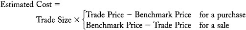
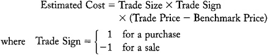
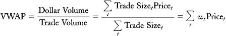
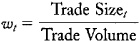
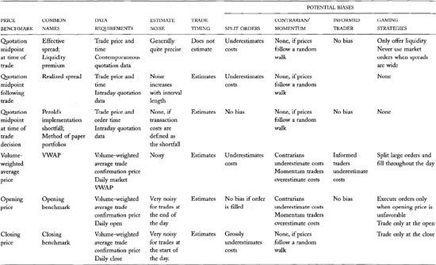
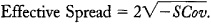

# Chapter 21: Liquidity and Transaction Cost measurement

Traders pay attention to their transaction costs because transaction
costs make implementation of their trading strategies expensive.
Transaction costs are most important to traders who trade frequently or
who trade large sizes. For most active traders, transaction costs are
the most significant determinants of their total returns. Speculators
who perform poorly usually do so because their transaction costs exceed
the values of their trading strategies.

Traders measure their transaction costs to evaluate how well they and
their brokers have implemented their trading strategies. Traders must
evaluate implementation in order to manage it effectively. They must
know whether they have been trading too aggressively---or not
aggressively enough---to optimize their order submission strategies.
They also must know how well their brokers work on their behalf to
decide which brokers should receive their orders in the future.

Traders also estimate future transaction costs to predict the costs of
implementing various trading strategies. Clever strategies may not be
profitable if the costs of implementing them are too great. Transaction
cost prediction especially concerns large traders in illiquid markets.
Their strategies may be profitable if implemented in small size, but the
price impacts of implementing them in large size may cause them to lose
on net.

Transaction cost measurement also interests exchanges, brokers,
regulators, and investment sponsors for the following reasons:

• Exchanges conduct transaction cost measurement studies to document the
quality of their markets. They use the results in their marketing
efforts. They may also use them to evaluate their brokers, dealers, and
specialists.

• Brokers conduct transaction cost measurement studies to document their
performance. They use the results to identify their shortcomings, to
market their firm's services, and to confirm that they obtain best
execution for their clients. The last purpose is especially important
when dealers pay brokers to route orders to them. Government
regulations, exchange regulations, and common law require that brokers
ensure that payments for order flow arrangements do not hurt their
clients. Brokers therefore must regularly and rigorously examine
execution quality to ensure the most beneficial terms for their
customers' orders.

• Investment sponsors must ensure that they obtain value for the
commissions that their investment managers spend on their behalf. The
U.S. Department of Labor requires that pension funds covered by the
Employee Retirement Income Security Act (ERISA) recognize that trading
commissions are fund assets that they must conserve. Fund trustees
therefore conduct transaction cost measurement studies to determine
whether their funds obtain appropriate value for their commissions.

• Regulators often try to promote policies
that lower transaction costs. Regulators therefore conduct transaction
cost measurement studies to characterize the performance of various
market structures. The U.S. Securities and Exchange Commission now
requires that all market centers---exchanges, ECNs, and
dealers---collect and publish highly disaggregated data that traders can
use to evaluate average execution quality for various order types and
sizes.

We consider how to measure liquidity in this chapter. We will examine
both retrospective and prospective measures of transaction costs. We
consider first retrospective measures of transaction costs. We then
consider how traders use information about past transaction costs to
predict future transaction costs.

## 21.1 TRANSACTION COST COMPONENTS

Defining and measuring exactly what we mean by the term "transaction
costs" is difficult. This entire book is about understanding what
transaction costs are, where they come from, and how to measure them. We
explore these questions in detail throughout this book.

For our present purpose, *transaction costs* include all costs
associated with trading. These costs include *explicit costs, implicit
costs*, and *missed trade opportunity costs.*

*Explicit transaction costs* are all costs that a cost accountant would
easily identify. These costs include commissions paid to brokers, fees
paid to exchanges, and taxes paid to government. Explicit transaction
costs also include any resources that traders devote to the trading
process. For example, the costs of setting up, staffing, and running a
buy-side trading desk are explicit costs of trading.

*Implicit transaction costs* are the costs of trading that arise because
traders generally have an impact upon prices. For example, traders who
buy at asking prices and sell at bid prices pay the bid/ask spread when
trading. The spread is an obvious and important cost of trading.
Likewise, when large buyers push prices up and large sellers push prices
down, the price impacts of their trading are transaction costs.

*Missed trade opportunity costs* arise when traders fail to fill their
orders or fail to fill their orders in a timely manner. Suppose that a
speculator wants to buy 100 cotton futures contracts at the New York
Board of Trade when the price is 65 cents per pound. In an effort to
obtain a good price, the trader submits a buy limit order with a limit
price of 64.95 cents. The price of cotton subsequently rises to 68
cents, and the order does not execute. Had the trader traded more
aggressively and filled the order at an average price of 65.25 cents, he
would have made 2.75 cents per pound, or 1,375 dollars for each
50,000-pound contract. Because the trader failed to trade aggressively,
he lost the opportunity to make 137,500 dollars. Traders need to keep
track of their opportunity costs so that they can determine whether they
are trading aggressively enough.

Explicit transaction costs are the most easily measured of the three
types of transaction costs. Measuring them is a simple cost accounting
exercise in which the analyst identifies and sums all commissions, fees,
and explicit expenses associated with trade process.

------------------------------------------------------------------------

**The Flip Side**

Transaction costs concern everyone in the trading industry. Sell-side
institutions---brokers, dealers, and exchanges---try to sell low-cost
transaction services. Buy-side institutions try to obtain transaction
services at low cost. To a casual observer, it would appear that
everyone wants low transaction costs.

Not so. Transaction costs to the buy side are revenues to the sell side.
Sell-side institutions would like their revenues to be as high as
possible. They market low-cost transaction services only because they
compete with each other for buy-side business.

These comments suggest that sell-side institutions benefit from high
transaction costs. While this might be true in the short run, it has not
been true in the long run. Decreases in transaction costs have caused
buy-side traders to greatly increase the volume of their trading. The
increased volume, coupled with substantial decreases in the costs of
providing transaction services, have increased sell-side profits even as
buy-side transaction costs have fallen. 

------------------------------------------------------------------------

Implicit transaction costs and missed trade opportunity costs are harder
to measure because they require some benchmark against which to compare
trade and no-trade prices. To measure the price impact of a completed
trade, analysts must estimate what prices would have been if the trade
had not taken place. To measure the opportunity cost of an uncompleted
trade, analysts must estimate the average prices at which the trade
would have taken place if it had been completed. These estimation
problems make transaction cost measurement a difficult and imprecise
science.

## 21.2 IMPLICIT TRANSACTION COST ESTIMATION METHODS

Traders estimate implicit transaction costs by using *specified price
benchmark methods* and *econometric transaction cost estimation
methods.* The price benchmark methods are the most commonly used. They
are easier to implement than the econometric methods and generally more
useful when traders need to evaluate transaction costs for specific
trades. The econometric methods are most useful for estimating average
transaction costs for a whole market.

Most traders measure transaction costs relative to specific price
benchmarks. The price benchmark provides a basis for determining whether
buyers paid, and sellers received, good or bad prices.

When traders use a specified price benchmark, they estimate the per unit
transaction cost as the difference between the trade price and the
benchmark price. For a purchase, the estimated cost is the excess of the
trade price over the benchmark price. For a sale, it is the opposite.
They then multiply this difference by the trade size to obtain the
estimated transaction cost:

Estimated transaction costs thus are high when buyers pay high prices
and when sellers receive low prices.

Note that the estimated transaction costs for all buyers and sellers in
a trade sum exactly to zero. Transaction cost to one side is trading
profit to the other side. Traders who demand liquidity tend to pay
transaction costs and those who offer liquidity have negative
transaction costs.

For convenience, the difference between the trade price and the
benchmark price is often called the *signed difference*, where the sign
of the difference is understood to be 1 if the trade is a purchase and −
1 if the trade is a sale:

An ideal price benchmark would be the price that would have prevailed if
the trader had not tried to trade. The difference between this price and
the trade price would be entirely due to the trade, and therefore a good
estimate of the implicit cost of trading. Unfortunately, no one can
confidently specify such a price. Instead, traders commonly use a
volume-weighted average price; the opening price; the closing price; an
average of the open, high, low, and closing
prices; or an average of bid and ask prices near the time of the trade.
We discuss the virtues and drawbacks of each of these benchmarks in the
next section.

*Econometric transaction cost estimation methods* use statistical
methods to estimate transaction costs. The simplest econometric methods
extract information about transaction costs from price reversals that
traders cause when they have an impact on price. More complex
econometric models extract information about transaction costs from the
relation between executed orders and price changes. We can interpret
both types of methods as benchmark methods in which the analyst
estimates the benchmark instead of specifying it.

------------------------------------------------------------------------

**Money Flow**

Technical traders use a version of this trade identification procedure
when computing *money flow* indicators. *Money flow* is volumes on
upticks minus volumes on downticks. Technical traders believe that money
flow indicates whether aggressive traders are net buyers or sellers.

------------------------------------------------------------------------

### 21.2.1 Trade Side Identification

Traders who conduct transaction cost measurement studies usually have a
set of trades in which they participated for which they want to measure
their transaction costs. They therefore know whether they were the buyer
or the seller for each trade.

Analysts sometimes want to estimate transaction costs for trades in
which they did not participate. Since all trades have at least one buyer
and one seller, such analysts must identify the side of the trade in
which they are interested. (Ignoring commissions, the sum of the costs
on both sides is always zero.) They typically direct their interest
exclusively to the side that appears to be taking liquidity.

------------------------------------------------------------------------

**Passive-Aggressive Behavior in the Markets**

Analysts generally classify traders who offer standing limit orders as
passive traders. They wait for the market to come to them. However, they
also may be very aggressive traders. For example, a buyer can *peg the
market* at his bid as long as he can afford to buy at that price.
Although such traders may very aggressively accumulate or divest
positions, the Lee and Ready algorithm will classify them as passive
traders. 

------------------------------------------------------------------------

Analysts typically identify that side by the relation between the trade
price and the bid and asking prices. If the trade price is closer to the
bid, they assume that the buyer was the aggressive trader. If it is
closer to the asking price, they assume the seller was the aggressive
trader. If the trade price was exactly in the middle between the bid and
the ask, they look to the last price change. If the trade took place on
an uptick or a zero uptick, they identify the trade as initiated by an
aggressive buyer. Otherwise, they identify it as seller-initiated. This
procedure is commonly known at the *Lee and Ready algorithm* after the
two academic researchers who popularized it.

Analysts who use the Lee and Ready algorithm to measure transaction
costs must recognize its two major shortcomings. First, it causes
analysts to estimate higher transaction costs than most traders incur
because most traders do not exclusively demand liquidity. Second, it
cannot identify when an order has been filled with multiple trades. If
the trades are at different prices because the order had market impact,
the cost of filling the order will be underestimated. We discuss this
problem further below.

## 21.3 MEASURING TRANSACTION COSTS WITH SPECIFIED PRICE BENCHMARKS

In this section, we introduce and discuss methods for measuring implicit
transaction costs by using various specified benchmarks. Our
presentation starts with a description of the various benchmarks. Then
we consider the properties of the resulting estimators.

### 21.3.1 Benchmark Prices

Many traders estimate the cost of trading by the signed difference
between the trade price and a *quotation midpoint.* The *quotation
midpoint* is the average of the bid and ask prices in a quotation.

Traders obtain different transaction cost
estimates according to which quotation midpoint they use. The quotation
midpoint that prevailed at the time of the trade produces a transaction
cost estimate that analysts call the *effective spread* (or sometimes
the *liquidity premium).*

Post-trade quotation midpoints produce *realized spreads.* Analysts most
commonly compute realized spreads using quotation midpoints obtained 5,
10, 15, or 60 minutes after the trade.

Analysts also use pre-trade quotation midpoints. The most common
transaction cost estimator based on a pre-trade quotation midpoint uses
the quotation midpoint at the time the portfolio manager decided to
trade. Analysts usually call this method *Perold's implementation
shortfall* (after André Perold, who popularized it in an influential
1988 *Journal of Portfolio Management* article). Jack Treynor, writing
seven years earlier, called it the *method of paper portfolios.*

Traders also estimate their transaction costs by using various
dailyprices. The most common daily benchmark is the *volume-weighted
average price* (VWAP). The VWAP is the average trade price of the day
where each trade price is weighted by the size of the associated trade.
Traders like the VWAP benchmark because they would like to trade at
least as well as the average trader on that day. The VWAP is computed
most easily by dividing the total dollar value of all trades by the
total trading volume:

------------------------------------------------------------------------

**Consultant Benchmarks**

Several investment consultants compute transaction cost estimates for
their clients. The consultants generally use different price benchmarks.

Abel/Noser first popularized VWAP transaction cost estimates. Able/Noser
is a U.S. discount institutional stockbroker. The firm started to
measure transaction costs to show its clients that it could obtain good
execution prices for discounted commissions.

SEI popularized transaction cost estimates based on closing price
benchmarks. SEI provides investment consulting, investment software, and
mutual fund management.

The Plexus Group computes implementation shortfall transaction cost
analyses. Its clientele consists primarily of investment sponsors and
investment managers who want to optimize their trade implementation or
who need to demonstrate that they are not wasting their commissions. The
Plexus Group primarily provides transaction cost analyses and trade
process consulting.

The Transaction Auditing Group (TAG) computes effective spread
(liquidity premium) analyses, among many other transaction audit
functions. Their clientele consists primarily of broker-dealers who need
to demonstrate to regulators and clients that they are obtaining best
execution for their clients.

The Elkins/McSherry division of State Street computes transaction cost
estimates primarily by using an average of the daily opening, high, low,
and closing prices as the benchmark price. Their clients consist mostly
of pension funds and investment managers who are interested in
transaction cost comparisons across the 42 countries in the
Elkins/McSherry universe. 

------------------------------------------------------------------------

*For more information, browse:*

*[[www.AbelNoser.com](http://www.AbelNoser.com)]*

*[[www.SEIC.com](http://www.SEIC.com)]*

*[[www.PlexusGroup.com](http://www.PlexusGroup.com)]*

*[[www.TAGaudit.com](http://www.TAGaudit.com)]*

*[[www.Elkins-McSherry.com](http://www.Elkins-McSherry.com)]*

where weight
Traders
also use the daily opening price, the daily closing price, or the
average of the daily open, high, low, and closing prices as benchmark
prices.

#### 21.3.1.1 Effective Spreads

The signed difference between the trade price and the time-of-trade
quotation midpoint is an intuitively simple transaction cost estimate.
This method exactly measures the implicit cost of trading a round-trip
when the quotation midpoint does not change. For example, if a trader
buys at the ask and then sells the same quantity at the bid, the trader
will have done nothing but trade. His per unit loss for the two-trade
round-trip is the bid/ask spread. The cost of trading per trade
therefore is half of the bid/ask spread. The quotation midpoint
benchmark gives us this result: The cost of the purchase is the ask
minus the quotation midpoint, or half of the spread. Likewise, the cost
of the sale is the quotation midpoint minus the bid, which is also half
of the spread.

The *liquidity premium* is the signed difference between trade price and
the time-of-trade quotation midpoint. The *effective spread* is twice
the liquidity premium. The effective spread equals the quoted bid/ask
spread when all purchases take place at the bid and all sales take place
at the offer. When trades take place within the spread because dealers
or brokers arrange *price improvement*, the effective spread that
traders pay is smaller than the quoted spread. Likewise, when large
orders fill at prices outside the bid/ask spread, the effective spread
is greater than the quoted spread.

The effective spread is the transaction cost estimation method that
retail market order traders most commonly use. Retail traders primarily
compare their trade prices against the bid and offer prices that
prevailed when they submitted their orders. Most such traders are
unaware that they engage in transaction cost analyses. They simply want
to check whether they are receiving good prices.

#### 21.3.1.2 Realized Spreads

The *realized spread* is twice the signed difference between the trade
price and the quotation midpoint observed at some specified time
following the trade. Realized and effective spreads are equal when the
quotation midpoint does not change over the measurement interval. Prices
often change, however, when traders raise prices in response to
aggressive buyers or lower prices in response to aggressive sellers.
Realized spreads therefore tend to be smaller than effective spreads.

Realized spreads interest dealers because their profits depend on the
prices at which they establish their positions and the prices at which
they subsequently liquidate their positions. The spreads that dealers
actually realize are less than their quoted spreads because they often
provide price improvement and because they sometimes trade with informed
traders. The difference between quoted
spreads and effective spreads measures the price improvement that
dealers provide. The difference between effective spreads and realized
spreads measures dealers' losses to well-informed traders.

#### 21.3.1.3 Implementation Shortfalls

We can interpret implementation shortfalls as the difference in values
between an actual portfolio and a corresponding paper portfolio. A
*paper portfolio* is an imaginary portfolio that people construct on
paper to see what would have happened if they had actually traded.
People analyze paper portfolios for fun, to test new trading ideas, and
to measure transaction costs.

To measure transaction costs, traders must specify a benchmark price at
which they buy or sell instruments for their paper portfolios. The
quotation midpoint at the time they decide to trade produces an
easy-to-interpret measure of transaction cost. The midpoint quotation
price represents a naive best estimate of instrument value at the time
they decide to trade. The difference in value between their actual
portfolio and the corresponding paper portfolio measures the costs of
implementing their trading decisions relative to this benchmark. Since
implementation generally is costly, paper portfolios typically are more
valuable than the corresponding actual portfolios.

Analysts break the total implementation shortfall into components. The
breakdown depends on whether the order was filled. If a trade occurred,
the shortfall is the total trade size times the signed difference
between the average trade price and the quotation midpoint at the
decision time. If the trade did not take place, or if the order was not
completely filled, the shortfall is the unfilled size multiplied by the
difference between the current price and the benchmark price. The first
component estimates the transaction cost of completed trades. The second
component estimates the missed trade opportunity cost.

When they are constructing paper portfolios to evaluate new trading
ideas, traders make assumptions about transaction costs that are often
critical. If they assume costs that are too low, they may adopt
unprofitable trading strategies. If they assume costs that are too high,
they may reject otherwise profitable trading strategies. Traders
typically assume that they pay the quotation midpoint plus some premium
when buying. They likewise assume that they receive the quotation
midpoint less some discount when selling. They obtain the premiums and
discounts that they use for these analyses from transaction cost
studies.

#### 21.3.1.4 VWAP, Opening Prices, and Closing Prices

Many investment sponsors do not know when during the day that the trades
made on their behalf by their investment managers took place. Unless
they make special arrangements with their brokers and with their
investment managers, they typically receive only daily reports of the
share-weighted average prices of the trades they made that day. These
investment sponsors therefore can conduct transaction cost analyses only
with daily price benchmarks.

The daily market volume-weighted average price is an attractive
transaction cost benchmark to such investment sponsors because it allows
them to determine whether they received a higher or lower price than the
average trader that day. Transaction costs measured relative to opening
and closing prices likewise allow traders to compare their trade prices
against the prices that prevailed before and after their trades. We
shall see below that all three measures have
serious problems which complicate their interpretations as transaction
costs estimators.

## 21.4 PROPERTIES OF TRANSACTION COST PRICE BENCHMARK ESTIMATORS

In this section, we enumerate desirable properties for transaction cost
estimators and consider which of the benchmark estimators have these
properties.

### 21.4.1 Data Requirements

Transaction cost estimates should be easy to compute. Estimates that
compare daily trade summaries against daily price benchmarks are easy to
compute. Estimates that are based on quotation midpoints are more
expensive because they require information about intraday trades and
quotations.

### 21.4.2 Accuracy

Random events that are completely unrelated to the implementation of a
trade should not affect the transaction cost estimate for that trade.
For example, suppose that a buyer negotiates an excellent purchase price
for a stock early in the morning. Later in the day, the market learns
terrible news about the firm and the price drops significantly. If an
analyst measures the transaction cost relative to the low closing price,
the trader will appear to have negotiated a very poor price.
Statisticians call such estimates noisy. In this example, if the
transaction cost was measured relative to the opening price, it would
have been much more accurate.

In general, the greater the time between the trade and the determination
of the benchmark price, the noisier the transaction cost estimator will
be. Transaction costs based on opening or closing prices therefore are
noisier than transaction costs based on average prices. All daily
benchmarks, however, are noisy because they use the same benchmark
prices for all trades that take place within the day. The least noisy
transaction cost estimator is the effective spread because it uses a
contemporaneous price benchmark. The noise in realized spreads and in
implementation shortfalls increases the further in time the benchmark
price is from the trade price.

### 21.4.3 Trade Timing Issues

Many traders use transaction cost estimates to evaluate how well their
brokers fill their orders. When managers give their brokers discretion
over the timing of their trades, they expect that their brokers will try
to trade when it is most advantageous. In particular, they hope that
their brokers will use their experience, and the information available
to them, to recognize and exploit predictable short-term price moves.
For example, they hope their brokers will recognize that prices tend to
be high after uninformed traders have bought. Under such conditions,
brokers with timing discretion should immediately execute sell orders.
Those with buy orders may wait until prices fall.

Traders who give their brokers timing discretion must pay close
attention to their transaction costs to determine whether their brokers
use their discretion appropriately. Since brokers generally are paid
commissions only for completed trades, brokers may prefer to complete
trades rather than wait for the best time to trade.

Good transaction cost estimators should produce information that allows
traders to identify whether their brokers are
skilled trade timers. The effective spread estimator is nearly useless
for this purpose because it measures transaction cost only relative to
the current quotation midpoint. If brokers can recognize any short-term
predictability in the quotation midpoint, this estimator will not reveal
it.

In general, a transaction cost estimator will best measure trade-timing
effects when the benchmark price does not depend on the time of the
trade. When it depends on the time of trade---as it does for the
realized spread---the estimator will best measure trade-timing effects
when the interval between the trade and the benchmark price is long.

Unfortunately, trade-timing considerations run exactly counter to
estimator accuracy considerations. Accurate estimates require close
benchmark prices, while estimates with the power to discover trade
timing require distant price benchmarks. Analysts therefore must analyze
many trades to accurately measure trade-timing effects.

### 21.4.4 Estimator Biases

Transaction cost estimates should be unbiased. They should measure only
costs of implementing a trading strategy given current market
conditions. Biased transaction cost estimators often produce cost
estimates that depend on how or why the trade is made. Biases may arise
when traders split their orders, when their decisions to trade depend on
past price changes, when they are well informed about future price
changes, and when brokers know that their clients will use transaction
cost estimates to evaluate their trading.

#### 21.4.4.1 Split Orders

Transaction cost estimates should measure the total transaction cost of
an order that traders fill in multiple parts. Traders often split their
large orders to avoid showing the market the full size of their
interest. They also split large orders to price-discriminate as they
push prices up or down. Accordingly, the last part of the order usually
is the most expensive to execute. The transaction cost estimation method
should estimate the total cost of executing the entire order and not
just the sum of the apparent costs of executing each piece considered
separately.

The liquidity premium (effective spread) is a poor transaction cost
estimator for large trades that traders split into small parts. For
example, suppose that a trader splits a 4,000-share buy order into two
equal parts. The first 2,000 shares trade at 30.10 when the market
quotation is 30 bid, 30.10 offered. The next 2,000 shares trade at 30.20
when the market quotation is 30.10 bid, 30.20 offered. The liquidity
premium transaction cost per share for both trades is 0.05, or 200
dollars. The second trade, however, was more expensive than the first
because the first had market impact. The impact of the first trade
raised the bid and the offer associated with the second trade.

The VWAP transaction cost estimator also may poorly estimate the cost of
executing a large order. In the previous example, suppose that the
trader was the only buyer of the instrument that day. The VWAP
transaction cost estimate then would be zero (ignoring commission costs)
because the average price of the trader's purchases is exactly equal to
the average price of all market trades that day. Although the buyer paid
the bid/ask spread and had market impact, the VWAP estimator will not
identify any costs.

In general, the split order problem arises
when the price benchmark depends on the trades that fill the order.
Since split orders tend to change subsequent quotation midpoints, the
effective spread estimator underestimates total transaction costs.
Likewise, since the price impacts of split orders affect the
volume-weighted average price, the VWAP transaction cost estimator also
underestimates total transaction costs.

The split order problem does not affect estimators---such as the
implementation shortfall estimator---that use benchmark prices which are
determined before the order has an impact on market prices. In our
example, suppose that the decision to trade was made when the quotation
midpoint was 30.05 (the first quotation midpoint). The implementation
shortfall estimate of the total cost of filling the order would be 5
cents per share for the first trade and 15 cents per share for the
second trade. The total cost of filling the order with the two equal
sized trades therefore would be 10 cents per share, or 400 dollars.

The split order problem most seriously affects estimators based on
benchmarks that are significantly affected by the market impact of the
large order. In our example, suppose that the market closes at 30.20,
the price of the second trade. Using the closing price as the benchmark
price produces an estimated transaction costs of ---10 cents per share
for the first trade and zero cents for the second trade, for a total of
---200 dollars. Although the trader paid the bid/ask spread and had an
impact on price, the closing price estimator makes it appear that he had
negative trading costs.

When properly estimated, negative transaction costs are trading profits.
The trader in our example made a 200 dollar unrealized profit. If the
trader tried to realize the profit, however, he probably would have had
a net loss. For example, suppose that the trader closed his position by
selling 2,000 shares at 30.10 when the market quotation was 30.10 bid,
30.20 offered, and then sold another 2,000 shares at 30.00 when the
market quotation had dropped to 30.00 bid, 30.10 offered. Since the
trader sold all shares for 10 cents less than he bought them, his total
loss for the round-trip would have been 10 cents per share or 400
dollars.

#### 21.4.4.2 Momentum and Contrarian Traders

Transaction costs measured relative to some benchmarks may be
systematically high or low, depending on whether the trader pursues
*momentum* or *contrarian trading strategies.* Traders who use *momentum
trading strategies* buy after prices rise and sell after prices fall.
Traders who use *contrarian trading strategies* do the opposite.

Transaction cost estimates based on opening prices are particularly
biased when traders use momentum or contrarian trading strategies.
Momentum traders overestimate their transaction costs because they buy
when prices have risen, so that the opening price benchmark is low. They
likewise sell when the opening price benchmark is high. Conversely,
contrarians underestimate their transaction costs because they buy when
the opening price benchmark is high, and they sell otherwise.

Transaction cost estimates generally are biased when traders base their
trading decisions on price changes that take place after the price
benchmarks against which their trades will be measured have been
determined. Transaction costs based on opening prices and---to a lesser
extent---those based on the VWAP therefore
produce biased results when used by momentum and contrarian traders.

#### 21.4.4.3 Informed Traders

Prices tend to rise after well-informed traders buy and fall after they
sell. Transaction costs that are based on price benchmarks which follow
their trades therefore will underestimate their trading costs. For
example, informed traders tend to measure smaller realized spreads than
effective spreads. The difference is due to their successful
speculations and not to the quality of their trade implementation.

The informed trader bias generally is greatest when the benchmark price
is determined long after the trade takes place. The closing price
and---to a lesser extent---the VWAP benchmarks therefore underestimate
transaction costs for well-informed traders. The underestimation is most
acute when the informed traders trade on short-term information that
quickly becomes public.

#### 21.4.4.4 Gaming

When traders use transaction cost estimates to evaluate their brokers,
the brokers should not be able to manipulate the results by trading in
ways that are not in the traders' best interests. Brokers who can affect
their evaluations without delivering better prices to their clients are
able to *game the measure.* Brokers who *game* their evaluations arrange
trades to optimize their evaluations rather than to provide best
execution services to their clients.

Brokers who have discretion over how aggressively they fill their orders
can easily game the effective spread transaction cost estimator. To game
this measure, brokers always offer liquidity and never take it. They
then always buy at the bid or sell at the offer. If the market moves
away from their orders, they adjust their order prices and try again to
buy at the bid or sell at the offer. By only offering liquidity, these
brokers ensure that their estimated transaction costs will always be
negative. Unfortunately, they also fail to trade at prices that their
clients would have preferred. Brokers who constantly chase after the
market provide very poor service to their clients, especially if their
clients are impatient to trade.

Brokers can game the effective spread estimator because the benchmark
price depends on when the order executes. Every time the market moves
away from the order, the broker fails to obtain a good price for the
client. The broker, however, is not penalized for waiting because the
benchmark price moves with the market.

Brokers who have discretion over the timing of their trades can game any
measure of transaction costs for which the benchmark price depends on
the timing of their trades. For example, suppose that a broker knows her
client will evaluate her trades by using an opening price benchmark.
Near the end of the day, the broker receives an order to buy. She will
immediately fill the order at any reasonable price if prices have fallen
during the day. If prices have risen, she will try to hold the order
until the next day, so that she does not record a high-priced buy on a
day when the market opened much lower.

This gaming problem is most serious when sponsors measure transaction
costs relative to opening prices. To a lesser extent, it also arises for
the VWAP benchmark and other average price
benchmarks that are partially determined by when the broker decides when
to trade.

Measuring average price benchmarks over long intervals can mitigate
gaming problems. For example, clients can compare their trade prices
against the VWAP for the week surrounding their trades rather than only
for the day of their trades. This procedure reduces the benefit to the
broker of delaying a trade to obtain a new benchmark. Unfortunately, it
also increases the noise in the transaction cost estimates.

Brokers with order timing discretion also can game transaction cost
measures by timing their trades to coincide with the determination of
their benchmarks. For example, brokers whose clients evaluate their
trades by using a VWAP benchmark can ensure that their estimated
transaction costs will be very near zero by spreading the execution of
their orders over the course of the day so that their volume-weighted
average trade price is approximately equal to the market VWAP. Likewise,
brokers whose clients evaluate their trades by using a closing price
benchmark can execute their orders only at the close so that they will
have zero transaction cost estimates.

The gaming problem cannot arise when the benchmark price is firmly
determined before the broker receives the order. The implementation
shortfall therefore cannot be gamed.

When brokers blatantly game their evaluations, clients will easily
recognize it. They then can appropriately discipline their brokers.
Clever brokers can avoid this discipline by gaming judiciously. The
gaming problem therefore may affect all measures that can be gamed. The
size of the problem will depend on the difficulty of detection and on
the propensity of the broker to exploit the game.

Few brokers game their measures even when they can do so without
detection. Most brokers work honestly on behalf of their clients to
provide the best service possible, regardless of how they are measured.
They may advise their clients, however, when they make trades that are
in their clients' interest but will generate unusually large estimated
transaction costs.

### 21.4.5 Summary

Which price benchmark analysts use when evaluating implementation
performance determines what they measure. Analysts who use the quotation
midpoint at the time of the trade measure whether the quality of the
trade execution was good relative to contemporaneous quoted prices. They
learn nothing, however, about the cumulative market impact of split
orders. They also learn little about whether traders can exercise
valuable timing discretion. Analysts who use price benchmarks obtained
long after the trade may learn about these issues, but they also measure
whether portfolio managers made good portfolio composition decisions.
Analysts who use price benchmarks obtained long before managers decided
to trade are immune to the split order problem, but they also measure
the degree to which their portfolio composition decisions depend on past
prices.

No price benchmark is perfect for estimating implicit transaction costs.
Analysts must make trade-offs between estimation cost and various
estimator properties. When data acquisition costs are no consideration,
the implementation shortfall is the best transaction cost estimator. It
is not subject to any of the biases discussed above. When the costs of
collecting data are significant, traders may
prefer other estimators. Retail traders typically use the effective
spread transaction cost estimator because it is generally unbiased for
small orders. Institutional investment sponsors often use VWAP when they
do not know when their managers ordered their trades. The VWAP
transaction cost estimator has some bias, gaming, and estimation noise
problems, but for most traders these problems are less significant than
those found for the opening and closing price benchmarks. [Table
21-1](#part0034.html_ch21tab1) provides a summary of the
properties of price benchmark transaction cost estimators.

All transaction cost estimation methods produce noisy results when
applied to single trades. Average transaction costs, measured over many
transactions, therefore provide more reliable information about
transaction costs than does the estimate from any one transaction.
Averaging, however, does not solve any bias or gaming problems.

Traders who use transaction cost estimates to evaluate their brokers
must carefully analyze their estimates. They cannot meaningfully
evaluate their brokers without having some benchmarks against which they
can judge their performance. To compare brokers, either traders must
measure performance across many brokers, or consultants must provide
them with meaningful comparison norms. In either event, comparisons
across brokers are meaningful only when traders give brokers similar
trading problems. Otherwise, brokers who receive difficult trading
problems will appear to be less productive than are those who receive
simple trading problems.

These problems make it imperative that clients evaluate their brokers by
using quantitative methods. Traders use these methods because the
information that they produce is very valuable when they can interpret
it well.

## 21.5 MEASURING IMPLICIT TRANSACTION COSTS WITH ECONOMETRIC METHODS

Econometric transaction cost measurement models use statistical methods
to measure the impacts that traders have upon prices. These models
generally examine either price reversals or the relation between order
flow and price changes.

Analysts usually use these models when they do not have quotation data
or order flow data. For example, open outcry futures markets rarely
record the bids and offers shouted in their pits. Their market reporters
primarily record trade prices. Traders who want to measure transaction
costs in these markets therefore must use methods that do not depend on
bid and ask price quotations.

Econometric transaction cost measurement models generally estimate
average transaction costs for the market as a whole. When traders are
interested in the costs of specific trades, they typically measure them
relative to a specified benchmark.

### 21.5.1 Price Reversal Models

The simplest econometric transaction cost models measure the price
reversals that traders cause when they buy and sell. The most common
price reversals are due to *bid/ask bounce.* Prices tend to bounce
between bid and asking prices as impatient sellers and buyers demand
liquidity. Traders also cause longer-term price reversals when an
imbalance of uninformed buyers or sellers causes prices to rise or fall.
Prices ultimately reverse when value traders recognize the resulting
profit opportunities. These price reversals may occur over short
intraday intervals or intervals as long as months.

**TABLE 21-1.**\
Properties of Various Price Benchmark Transaction Cost Estimators

The average absolute transaction price change
is a very simple estimator of transaction costs. It exactly estimates
the bid/ask spread when bid and ask prices are constant, and when all
trades take place only at bid and ask prices. Bid and ask prices vary,
of course, and not all trades take place at bid and ask prices. In
practice, the average absolute transaction price change tends to
underestimate bid/ask spreads when bid and offer prices change in
increments that are smaller than the bid/ask spread, and it
overestimates bid/ask spreads otherwise. Ignoring very small and very
large price changes can improve the estimates.

Better transaction cost estimators are based on price change serial
covariances. The *serial covariance* of a sequence of price changes is
the average of the product of adjacent price changes. When prices tend
to reverse, the serial covariance is negative because the product of
adjacent positive and negative (or negative and positive) price changes
is negative. Since the efficient markets hypothesis suggests that price
changes should have no serial covariance if there are no transaction
costs, negative price change serial covariance indicates transaction
costs. Several econometric models exploit this insight. The best known
of them is *Roll's serial covariance spread estimator*, which we
describe in [chapter 20](#part0032.html_ch20). It is

Roll's estimator is unbiased when the sample size is large, when
aggressive buyers and sellers arrive at random with equal probability,
and when changes in the effective bid and offer prices are uncorrelated
with the sequence of arriving traders. Violations of these assumptions
typically cause the estimator to underestimate the bid/ask spread.
Analysts therefore use Roll's method only when no quotation data are
available.

### 21.5.2 Order Flow Models

More complex econometric models directly estimate the price effects that
aggressive traders cause. These methods typically use regression models
to characterize how prices change in response to order flow. These
models exploit the principle that prices rise in response to aggressive
buyers and fall in response to aggressive sellers. Analysts usually
identify the more aggressive side in each trade by using the Lee and
Ready algorithm described above. These regression models typically used
signed trades to explain price changes.

## 21.6 MISSED TRADE OPPORTUNITY COSTS

Failing to trade is often more costly than trading. Informed traders
lose profits when their orders go unfilled. Unfilled orders also may
hurt uninformed traders, especially if they are hedging. Traders must
pay attention to their missed trade opportunity costs in addition to
their transaction costs in order to best manage their trading.

Analysts generally measure missed trade opportunity costs as the
unfilled size times the signed difference between a subsequent price and
a benchmark price. For example, suppose that a trader decided to sell
100,000 shares of DINE (Advantica Restaurant Group, owners of Denny's)
when the quotation midpoint was 1.00 dollar. The trader submitted a
limit sell order that filled 30,000 shares. The remaining 70,000 shares
never filled. The price of DINE is now 82 cents. If we use the
1.00-dollar quotation midpoint at the time the trader decided to do the
trade as the benchmark price, we obtain the implementation shortfall
estimate of the missed trade opportunity cost. It is 12,600 dollars
(70,000 shares X 18 cents).

------------------------------------------------------------------------

**Glosten-Harris, Meet
Glosten-Milgrom**

Here is one more treat for the mathematically inclined.

The *Glosten-Harris spread components estimation model* is a simple
example of an order flow transaction costs estimation model. This model
is based on the Glosten-Milgrom spread component model introduced in
[chapter 14](#part0025.html_ch14).

These models assume that aggressive traders have two effects on prices.
The *permanent price effect* is due to inferences that dealers (and
other liquidity suppliers) make about informed traders from the order
flow. It corresponds to the adverse selection spread component
introduced in [chapter 13](#part0024.html_ch13). Information
theoretic considerations suggest that the permanent effect should be
proportional to trade size. (See [chapters
12](#part0022.html_ch12) and
[14](#part0025.html_ch14).) The *transitory price effect* is
due to costs of supplying liquidity to impatient traders. It corresponds
to the transaction cost spread component introduced in [chapter
14](#part0025.html_ch14). The transitory effect probably has
fixed and proportional effects on price.

The Glosten-Harris model represents these relations by specifying an
equation that represents observed prices, *P~t~*, as the sum of
underlying fundamental value, *V~t~*, plus the transaction cost spread
component, *θ~t~*:

*P~t~* = *V~t~* + *θ~t~*.

Another equation expresses the transaction cost spread component as a
linear function of the sign of the trade, *Q~t~* (1 for a purchase and
-1 for a sale), and the signed size, *Q~t~*Size~*t*~:

*θ~t~* = *aQ~t~* + bQ~t~Size~t~.

Finally, the permanent effect appears in an equation that describes how
fundamental value changes in response to information inferred from the
sign and size of the trade, and in response to other information that
affect values, ε~t~:

*ΔV~t~ = λQ~t~Size~t~ + ε~t~*.

Combining these equations produces the following equation for the
observed change in price:

*ΔP~t~ = ΔV~t~ + Δθ~t~ = λQ~t~ Size~t~ + ε~t~ + aΔQ~t~ +
bΔ(Q~t~Size~t~*).

Econometricians estimate the coefficients λ, *a*, and *b* in this
equation by interpreting the equation as a regression model in which the
transaction price change, Δ*P~t~*, is explained by three independent
regressor variables and an error term. The regressors are Q~t~Size~t~,
the signed size; ΔQ~t~, the change in the trade sign; and δ(Q~t~
Size~t~), the change in the signed size. The error term is ε~t~, the
change in values that is unrelated to the order flow. The statistical
properties of standard regression methods ensure that the regression
error term is uncorrelated with the independent regressor variables.
This is consistent with its interpretation as information that affects
values independently of the trade process. Analysts can use the
estimated coefficients to compute transaction cost estimates for any
trade by evaluating the expressions for the permanent and transitory
price components.

We can interpret the Glosten-Harris model as a benchmark price
transaction cost estimation model. The price benchmark is the unobserved
fundamental value, *V~t~*. Although the model produces transaction cost
estimates without estimating the benchmark, econometricians can easily
estimate benchmark values if necessary. 

------------------------------------------------------------------------

Analysts who measure missed trade opportunity
costs face two problems that they do not face when measuring transaction
costs. They must decide when to measure their opportunity costs, and
they must be sure that their orders are real and not just wishful.

Analysts will measure different opportunity costs depending on when they
measure them. In the example above, suppose that one week after DINE
dropped to 82 cents, it rose back 1.00 dollar. The estimated opportunity
cost then would be zero. The measurement of opportunity costs depends on
the date on which it is measured.

Even this result is not entirely clear. Had our trader originally sold
the full 100,000 shares at 1.00, he might have bought 100,000 shares
when the price dropped to 82 cents. If so, the trader lost the
opportunity to make 18,000 dollars when the price went back up to 1.00.

In practice, traders measure opportunity costs at some interval after
they first decide to trade, or after they finally give up trying to
further fill the order. The interval may be one day, one week, or one
month.

Opportunity cost analysts also must decide whether the orders that go
unfilled are serious orders or merely wishful ones. Consider our example
again. Suppose instead of wanting to sell 100,000 shares, our trader
wanted to sell 4 million shares. Four million shares represents 10
percent of all shares outstanding and is 50 times the average daily
volume of 80,000 shares. The implementation shortfall estimate of the
opportunity cost of failing to sell the unfilled remainder of 3,970,000
shares is 714,600 dollars. This greatly overestimates the true
opportunity cost because the trader probably could not have sold so many
shares under any circumstances without depressing the price below 82
cents. The trader may have wished that he could sell those shares, but
the wish is unrealistic. Even if he was certain that the price would
drop to 82 cents, he did not lose the opportunity to make 714,600
dollars in profits because he never had that opportunity. Opportunity
costs also must depend on the reasonableness of the order size.

The theoretically proper way to deal with this second problem is to use
a benchmark price that reflects the average price at which the trade
would have taken place if it had been completed under the most favorable
conditions. Since the estimation of such a price is difficult, traders
do not solve the problem this way. Instead, they simply monitor their
orders to ensure that their sizes are reasonable.

Analysts can measure missed trade opportunity costs relative to any
benchmark price. It is most sensible to measure them against the same
benchmark price that they use to estimate their transaction costs. By
using the same benchmark prices, they state their transaction costs and
their missed trade opportunity costs on a comparable basis.

Traders should compare their transaction costs against their missed
trade opportunity costs. If the additional transaction costs that they
would incur if they traded more aggressively are less than the
opportunity costs they would save from trading more aggressively, they
would earn more profit if they traded more aggressively. Likewise, if
the transaction costs that they would save if they traded less
aggressively are more than the additional opportunity costs they would
incur from trading less aggressively, they would earn more profit if
they traded less aggressively.

------------------------------------------------------------------------

**The Plexus Iceberg of
Transaction Costs**

The Plexus Group provides its clients with a detailed breakdown of their
implementation shortfalls into timing, market impact, commission, and
missed trade opportunity costs. The firm measures two timing cost
components for executed trades. The first is manager *timing.* Plexus
also calls this component system *timing* or *model timing.* It is the
signed difference between the decision price and the price at the time
of submission of the order to the buy-side trading desk. The *decision
price* is the market price at the time the manager determined that he or
she wanted to trade. Most managers use the previous day's closing price
as the decision price. Manager timing measures implementation shortfall
while the order is still under the primary control of the portfolio
manager. Portfolio managers who have high manager timing costs generally
should submit their orders to their buy-side desks faster.

*Trader timing* is the second timing cost component. It is the signed
difference between the price at the time of submission of the order to
the buy-side trading desk and the release of the order to a broker. If
the buyside desk breaks up the order, the Plexus Group measures separate
trader timing costs for each part. Trader timing measures implementation
shortfall while the order is still under the primary control of the
buy-side desk. Buy-side traders often have high trader timing costs when
they shop a large block so that the market becomes aware that
significant size will soon move prices. (See [chapter
15](#part0026.html_ch15).) They also may have high trader
timing costs when they split orders into parts and stagger the release
of the parts to brokers through time. The market impacts of the initial
parts cause what the Plexus Group identifies as trading timing for the
remaining parts.

The Plexus Group measures *market impact* as the signed difference
between the price at the time of the release of an order to a broker and
the execution price. If the order results in several trades, Plexus
estimates separate market impacts for each trade. Market impact measures
the implementation shortfall while the broker is managing the order.
Since most traders will not let a broker sit on an open order overnight,
market impact is an intraday effect. Interday timing effects contribute
to the trader timing component.

Finally, the Plexus Group measures missed trade opportunity costs as the
signed difference between the decision price and the price of the
instrument 30 trading days after the decision to trade was made, for the
part of the order that was not completed.

To illustrate the relative magnitudes of these various transaction cost
components, the Plexus Group created and popularized their *Iceberg of
Transaction Costs.* The visible costs of trading---commissions and
market impact---correspond to the part of an iceberg that is above the
water. The invisible costs---timing and missed trades---correspond to
the bulk of the iceberg that is underwater. The Plexus Group estimates
that their clients pay 12 basis points in commissions and 20 basis
points in market impact. They lose 53 basis points in timing costs as
prices move away from them, and they lose an additional 16 basis points
due to orders that do not fill. The hidden costs of trade implementation
(timing and opportunity costs) thus are much larger than the visible
costs (commission and market impact).

The four Plexus components sum to the total implementation shortfall.
Plexus believes that it is necessary to measure all these components
because costs are readily shifted from one category to another. Traders
need to avoid the mental trap where visible costs appear to have been
reduced when in fact they have only been moved to the more subtle timing
categories. 

*Source:
[[www.PlexusGroup.com](http://www.PlexusGroup.com)]*

------------------------------------------------------------------------

In practice, most traders do not estimate
these marginal costs. Instead, they assume that their marginal costs
equal their average costs. Accordingly, they try to trade more or less
aggressively if, on a per unit basis, their missed trade opportunity
costs are respectively greater or less than their transaction costs.
Traders who are concerned about this issue should estimate their
marginal transaction costs from the costs of executing the last trades
that fill their orders.

## 21.7 TRANSACTION COST PREDICTION

Traders need to predict transaction costs in order to evaluate active
trading strategies. To this end, traders develop, estimate, and use
transaction cost prediction models. Most transaction cost prediction
analyses use explicit and implicit information to predict transaction
costs.

### 21.7.1 Explicit Information About Future Transaction Costs

Explicit information about future transaction costs consists of the
contractual information about commissions and trading fees enumerated
above. It also includes current market information about liquidity
conditions that market quotations and exposed limit order books
typically reveal. When traders seek to trade less size than markets
display, they can confidently obtain an upper bound on the market impact
of their orders. (These bounds, of course, assume that they can access
the liquidity before other traders do.)

Quotation and limit order books rarely reveal the full liquidity
available in a market, however. Traders often will not display the full
size of their interest for the following reasons:

• They fear front runners.

• They do not want to give away option values.

• They do not want to reveal proprietary information about fundamental
values or about their positions.

• They want to avoid offering liquidity to large price-discriminating
traders or informed traders.

These issues ensure that traders often can trade at more favorable
prices or for greater sizes than is apparent from displayed market
information. Traders who want to accurately estimate their transaction
costs therefore must estimate how much liquidity might be behind any
displayed liquidity that they see.

### 21.7.2 Implicit Information About Future Transaction Costs

The implicit information that traders use to predict transaction costs
consists of information about previous implicit transaction costs.
Traders try to characterize this information by assuming that they can
predict the market impacts of future orders from the market impacts of
previous orders. The assumption is valid when
liquidity conditions do not change. Substantial evidence, however,
suggests that liquidity varies through time. To the extent that they
can, some traders try to model this variation so that they can better
predict their transaction costs.

The primary quantitative approach to implicit transaction cost
prediction uses econometric regression models to explain past
transaction costs by using observable variables. These variables
characterize the orders, contemporaneous market conditions, and general
market conditions.

The most important variables that characterize orders are order size and
price placement. Large orders naturally generate higher transaction
costs than do small orders. Likewise, aggressively priced orders
typically generate higher transaction costs than do less aggressively
priced orders.

The most important variables that characterize contemporaneous market
conditions are bid/ask spread and current displayed size. These
characterize width and depth. Other variables that traders use include
recent volume, recent price changes (price momentum), and sums of volume
on upticks versus volume on downticks (money flow). These variables
measure transitory liquidity conditions.

The most important variables that characterize general market conditions
are average volume and volatility. Transaction costs tend to be low in
actively traded markets and in markets with stable prices. In equity
markets, analysts often use market capitalization as a proxy for the
size of the market. Large firm stocks tend to trade in more liquid
markets than do small firm stocks.

## 21.8 CLOSING COMMENTS ON INTELLIGENT TRANSACTION COST MANAGEMENT

Institutional investment managers and investment sponsors commonly
separately evaluate their trade implementation and portfolio
selection/composition processes. The two processes are not dichotomous,
however. Total performance often can be enhanced when the strategists
who generate trading strategies regularly interact with the traders who
implement those strategies.

As noted at the beginning of the chapter, portfolio strategists need to
know what transaction costs will be before they adopt a trading
strategy. Traders therefore need to advise strategists of what is
feasible. Strategists must know how much they can trade, and at what
cost, in order to form orders that will optimize portfolio values.

Strategists likewise need to tell their traders why they are trading, so
that their traders can make good decisions about how aggressively they
should trade. For example, when strategists base their orders on
short-term information, they must tell their traders to trade
aggressively. They also must provide their traders with price limits
that reflect the value of their information. Well-informed traders
should willingly incur substantial transaction costs, especially when
they trade on very short-term information. Otherwise, they may fail to
trade and thereby lose the opportunity to make substantial profits.
Traders must know why they are trading in order to make the best
decisions about how they should trade.

Portfolio strategists and the traders who implement their decisions must
cooperate to maximize the value of their combined efforts. The schemes
that investment sponsors use to evaluate their operations should not
make their strategists and traders
adversaries. Portfolio strategists should not be rewarded for blaming
traders when they cannot profitably implement their trading strategies,
and traders should not be rewarded for blaming strategists when they
cannot fill unrealistically large orders. Instead, they should cooperate
to obtain the most value from their joint operations.

Joint incentive contracts that reward everyone when the total
performance is good provide strong incentives for cooperative behavior.
Incentive contracts that attempt to separately identify and reward the
contributions of the different participants in the trading process are
counterproductive when managers cannot separately identify their
contributions. Disentangling contributions is very difficult when
personnel must cooperate to produce the best product.

## 21.9 SUMMARY

Traders estimate their transaction costs so that they can better manage
their trading. Good information about their transaction costs allow them
to do the following:

• Determine whether they obtain good value for the commissions they pay
their brokers

• Balance their transaction costs and their missed trade opportunity
costs to optimize their order submission strategies

• Ensure that their trading strategies are---and will be---profitable
when implemented

Although transaction cost measurement is noisy, it can produce valuable
information that traders can use to help solve these problems.

For many investment managers, reducing transaction costs through more
effective trade implementation management improves performance more than
would devoting the same resources to improving their portfolio selection
decisions. Decreasing transaction costs is often easier and more
reliable than improving portfolio section decisions.

## 21.10 SOME POINTS TO REMEMBER

• Total performance depends on portfolio selection and trade
implementation.

• Transaction costs lower portfolio performance.

• Traders estimate transaction costs so that they can better manage
them.

• Missed trade opportunity costs can be more significant than
transaction costs. Good traders find a balance between the two types of
costs when they decide how aggressively to trade.

• Transaction cost measurement depends on price benchmarks.

• Reliable inferences about transaction costs require reasonable
benchmarks and many trades.

• Informed trading, contrarian trading, order splitting, and gaming may
bias some transaction cost estimates.

• Brokers often can game a transaction cost measure by deferring trades
or by mimicking their benchmarks.

• Transaction costs to the buy side are revenues to the sell side.

• Good managers consider transaction costs
when making portfolio composition decisions.

## 21.11 QUESTIONS FOR THOUGHT

• What services besides low transaction costs should brokers provide?

• Analysts can conduct implementation shortfall transaction cost studies
by using ask prices as price benchmarks when buying and bid prices as
price benchmarks when selling. What advantages and disadvantages would
this method have relative to the standard quotation midpoint benchmark
method?

• What is the relation between missed trade opportunity costs and
transaction costs when traders optimize their trading?

• Which types of profit-motivated traders would you expect should have
high measured transaction costs? Which types should have low measured
transaction costs?

• In the extended example of section 21.4.4, the implementation
shortfall transaction cost estimate for the four-trade round-trip was
400 dollars. If the market closed at 30.00 dollars, the closing price
transaction cost estimate also would be 400 dollars. These two estimates
are not normally equal. Why are they equal for the four-trade round-trip
in this example?
