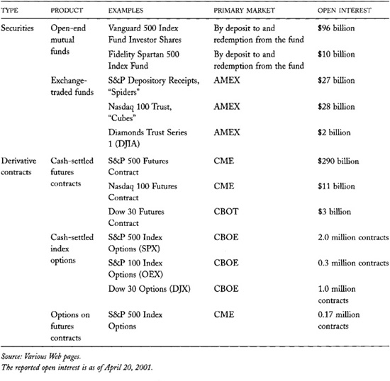

# Chapter 23: Index and Portfolio Markets

Index trading is one of the most important financial innovations of the
twentieth century. The nominal dollar value of trading in equity index
products now is greater than the total dollar value of trading in the
underlying securities. The growth of index trading has had a profound
effect on equity markets. It is also increasingly affecting debt
markets.

*Index markets* trade index products. *Index products* include index
futures contracts, index option contracts, and securities that represent
ownership in index funds. *Index funds* are portfolios that their
managers design to replicate the performance of various price indexes.
Most index funds track market equity indexes. Some funds track debt
indexes and sector equity indexes.

Index products and index markets are extremely popular. Many people have
decided that they would rather invest in an index product than risk
losing money investing with an active investment manager. Index products
also are attractive to speculators who want to speculate only on index
risks or only on firm-specific risks. The former buy or sell index
products to establish their speculative positions. The latter sell or
buy index products to hedge the index risk in their long or short
positions in individual securities.

The widespread use of index strategies has changed the character of
markets. Index markets are far more liquid than the underlying cash
markets upon which their products are based. Price changes in index
products generally lead changes in the cash index. Consequently, many
people believe that index markets are the "tail that wags the dog." You
must understand index strategies in order to understand the relation
between index markets and their underlying cash markets.

In this chapter, we will briefly consider how indexes are computed and
how index funds are managed. We will then turn to why index products and
index markets are so popular. You may find this section particularly
useful if you are unsure whether you should invest or speculate in
equities. The chapter closes with a discussion of the various ways that
traders exchange index risks.

## 23.1 PRICE INDEXES

People use *price indexes* to characterize the values of lists of
instruments. The instruments upon which a price index is based are the
*index components.* The index components determine the character of the
index. Indexes exist for entire markets, for subsets of a market, and
for sets of markets. The instruments may be equities, debt securities,
commodities, or currencies. Indexes that include only a small subset of
market securities are *narrow indexes.* Narrow indexes have been defined
for small and large securities, value and growth securities, industry
sector securities, and securities of firms that do business in narrow
geographic regions.

Most price indexes are proprietary products that exchanges, brokers, or
data vendors compute. Although *index creators* sometimes sell their
indexes, they often offer them to their clients to promote their
businesses. Many index creators license their indexes to firms that base
index products upon them.

------------------------------------------------------------------------

**The Major Market Index
and *The* Major Market Index**

Dow Jones and Co. owns the Dow Jones Industrial Average (DJIA), which is
a price-weighted index of 30 large U.S. stocks. The list originally
included only industrial stocks. It now includes some stocks in the
finance and services sectors of the economy. The Dow 30 is the
best-known U.S. market index. It is *the* major market index.

For many years, Dow Jones refused to license the DJIA to options and
futures exchanges that wanted to create contracts based upon it. The
American Stock Exchange therefore created an index called the Major
Market Index (MMI). The MMI is a price-weighted index of 20 blue chip
stocks. Not coincidentally, most of the stock MMI stocks are also Dow 30
stocks. Changes in the MMI therefore are very closely correlated with
changes in the DJIA. The American Stock Exchange trades options on the
MMI using the ticker symbol XMI. It also licensed the index to the
Chicago Mercantile Exchange, which traded futures on it.

In 1997, Dow Jones finally licensed the DJIA to the Chicago Board of
Trade (CBOT) and to the Chicago Board Options Exchange (CBOE). The CBOT
Dow Jones Industrials futures and the CBOE Dow Jones Industrials option
contracts have been very successful. Both have killed their respective
MMI competitors. The CME stopped trading its MMI contract in 1999.
Although the AMEX MMI option contract continues to trade (as of December
2001), it no longer has significant open interest. 

------------------------------------------------------------------------

All price indexes are essentially just averages of the prices of their
index components. Indexes differ by the methods used to compute those
averages, however. The two most common index types are price-weighted
and value-weighted indexes.

*A price-weighted index* is proportional to the sum of the prices of the
index components. The highest priced instruments therefore have the
greatest influence over the values of price-weighted indexes. The Dow
Jones Industrial Average (DJIA) and the Nikkei 225 Stock Average are the
best-known price-weighted indexes.

A *value-weighted index* is proportional to the total capital value of
all index components. Traders therefore also call value-weighted indexes
*capitalization-weighted indexes.* Securities with the highest capital
value have the greatest influence over the values of value-weighted
indexes. Most price indexes are value-weighted. The S&P 500 Index is the
best-known value-weighted index.

The value of an index is obtained by dividing the price or value sum by
a constant *index divisor.* The divisor originally was a number that the
index creator chose to ensure that the index started at an arbitrary
initial value. Divisors now change only when necessary to ensure that
the value of an index does not change when the creator adds or deletes
index components or, in the case of a price-weighted index, when a stock
splits. For example, the divisor of a price-weighted index must increase
when a high priced stock replaces a low priced stock. Otherwise, the
change would unnaturally increase the value of the index. Likewise, the
divisor of a value-weighted index must increase when a high
capitalization stock replaces a low capitalization stock. The divisors
of value-weighted indexes do not have to change when stocks split,
because splits do not change total capital values.

------------------------------------------------------------------------

**They Each Manage About
3 Percent of All World Equity**

Barclays Global Investors is the world's largest index fund manager. As
of December 2000, the firm had 571 billion dollars under management in
various U.S. and international equity index funds. (The firm had 802
billion dollars of assets under management, counting all asset classes.)
By comparison, total world traded equity market capitalization was then
approximately 31 trillion dollars. Counting only index funds, Barclays
Global Investors manages a bit less than 2 percent of all traded equity
in the world.

The world's largest equity manager is Deutsche Asset Management, which
manages about 1 trillion dollars worldwide in many subsidiaries.

*Sources:
*[[www.barclaysglobal.com/about/who_we_are/assets_rankings.¡html](http://www.barclaysglobal.com/about/who_we_are/assets_rankings.¡html)]*;
[[http://www.fibv.com/publications/Ta1300.pdf](http://www.fibv.com/publications/Ta1300.pdf)].*

------------------------------------------------------------------------

You may occasionally encounter *equal-weighted* and *geometrically
weighted indexes. Equal-weighted indexes* measure the returns from
investing an equal dollar amount in each index component. The index
values represent the cumulative returns to this hypothetical investment
strategy. The best-known equal-weighted index is the CRSP (Center for
Research in Security Prices) equal-weighted market index. It is used
primarily in academic research. *Geometrically weighted indexes* average
logarithmic returns rather than prices. The Value Line Geometric Index
is a value-weighted index of logarithmic returns.

A price index is *dividend-adjusted* if it is adjusted upward when
securities pay dividends. Traders also call dividend-adjusted indexes
*total return indexes* because they measure the total return---capital
gains plus income yield---that investors would receive if they could
invest in the index without any transaction costs. People generally use
total return indexes as benchmarks against which they measure the
performance of their portfolios. The DJIA and the S&P 500 Index are not
dividend-adjusted indexes. Corresponding total return indexes for these
two indexes, however, are widely available.

## 23.2 INDEX FUNDS

An *index fund* is a portfolio that *index managers* design to replicate
the performance of an index. *Tracking error* is the difference between
the portfolio return and the corresponding dividend-adjusted index
return. Index fund managers try to minimize their tracking errors. Most
U.S. index funds try to replicate the S&P 500 Index, although other
indexes are becoming increasingly popular.

Replicating a value-weighted equity index is quite simple. If the value
of the index fund is 0.01 percent of the total capitalization of all the
index components, the index fund manager simply buys 0.01 percent of the
outstanding shares of each index component. The value of the fund
therefore is exactly proportional to the total value of all index
components, which is proportional to the value of the value-weighted
index. Consequently, percentage changes in these three quantities will
be identical. Index managers must rebalance a value-weighted portfolio
only when the list of index components changes. Otherwise, the fund
simply holds its securities.

Replicating a price-weighted equity index is equally simple. The index
fund simply holds an equal number of shares in each index component. The
value of the portfolio therefore is proportional to the sum of the
prices of the index components, which is proportional to the
price-weighted index. Percentage changes in these three quantities
therefore will be identical. Index managers must rebalance
price-weighted index portfolios whenever the index list is changed and
whenever stocks split.

To replicate the returns to a dividend-adjusted index, index funds must
reinvest their dividends as they are paid.

Index funds generally slightly underperform their target indexes because
various *frictions* drag down their performance. These frictions include
transaction costs resulting from dividend reinvestment, accommodating
deposits and redemptions, and rebalancing transactions when the index
list changes. Management fees also reduce fund performance.

------------------------------------------------------------------------

**The Price Impacts of
the Annual Russell Reconstitution**

Many U.S. stock index funds try to replicate the value-weighted Russell
1000, 2000, or 3000 Index. The Russell 1000 and 3000 Indexes
respectively consist of the 1,000 and 3,000 largest publicly traded U.S.
firms, ranked by their common stock market capitalization. The Russell
2000 Index consists of firms ranked between 2,001st and 3,000th in
market capitalization.

The Frank Russell Company, an investment management consultant, annually
reconstitutes its indexes at the close of trading on the last trading
day in June, based on market capitalizations as of the close of trading
on the last trading day in May. Stocks that have grown in size are added
to the Russell 3000 or are moved up from the Russell 2000 to the Russell
1000. Stocks that have lost value are moved down from the Russell 1000
to the Russell 2000 or are dropped from the Russell 2000 and 3000.
Stocks that stop trading due to bankruptcies or mergers are dropped when
they stop trading.

Index funds that replicate the Russell Indexes rebalance their
portfolios when the Indexes are reconstituted each June. Since these
funds must buy the additions and sell the deletions near the same date,
they often have substantial price impacts on these stocks during the
months of June and July. In the six years from 1996 to 2001, the Russell
3000 additions outperformed the deletions by an average of 15 percent in
June and underperformed the deletions by 5 percent in July.

The Russell 3000 reconstitution price impacts are quite large because
these stocks are quite small. The reversal in prices in July indicates
that some of the price impact is transitory. The remaining difference in
June returns may be due to the increased value investors place on stocks
in the Russell Indexes---perhaps because they trade in more liquid
markets---or to a well-known momentum anomaly that affects the returns
of small stocks. Some of the difference may also reverse in August and
later months.

Portfolio rebalancing has similar effects when Standard & Poor's changes
its stock index components. 

*Source: Ananth Madhavan, "The Russell Reconstitution Effect," September
26, manuscript, 2001. To be published in* Financial Analysts Journal.

------------------------------------------------------------------------

Index funds can slightly improve their returns by careful management of
their trading. In particular, they can supply rather than demand
liquidity when trading, they can substitute nonindex components when
index components are expensive to trade, they can rebalance only when
accommodating deposits and redemptions and when reinvesting dividends,
and they can hold only a subset of the index components to minimize the
number of securities that they have to trade. Although these policies
tend to increase returns, they also generally increase tracking error.
Many funds therefore do not aggressively employ them.

## 23.3 THE ARGUMENT FOR INDEXATION

*Active portfolio managers* are speculators who try to beat the market
by clever trading. Active managers may be informed traders, value
traders, or technical traders. The *turnover* of a portfolio is the
ratio between the total dollar value of all portfolio purchases (or
sales, or average of purchases and sales) in a given period and the
total value of the portfolio. Active managers often have turnover rates
of more than 100 percent per year. They typically charge between 1 and 3
percent for their services.

------------------------------------------------------------------------

**A Perspective on Bad
Active Management**

Active managers do not lose because they consistently buy instruments
that then fall and sell instruments that then rise. Funds that
consistently make such mistakes could greatly increase their profits
simply by selling whenever their research suggests that they should buy,
and buying whenever their research suggests that they should sell. Bad
research does not create systematically wrong signals---it merely
creates random noise.

Active managers do not lose because they consistently buy losers and
sell winners. They lose because they consistently buy and sell.

------------------------------------------------------------------------

In contrast, *passive managers* construct portfolios and then leave them
alone. Since they rarely trade, passive managers usually have turnover
rates between 0 and 10 percent per year. Passive managers typically
charge less than 15 basis points (0.15 percent) for their services,
whereas active managers charge 50 to 100 or more basis points.

Most active managers cannot beat the market because transaction
costs---brokerage commissions and management fees---reduce performance
in what is otherwise a zero-sum game. Without transaction costs, the
value-weighted average return of all portfolios would be equal to the
value-weighted market index return. Transaction costs ensure that the
average portfolio return is always less than the market index return.
Since active managers trade frequently, they tend to underperform the
market.

These implications of the zero-sum game are logical conclusions based on
simple accounting principals. They are always true.

Since these implications must be true, empirical results on the
performance of active fund managers cannot be surprising: As a group,
active fund managers underperform the market. In any given quarter, only
one-fourth of all mutual funds beat the market. If there were no
transaction costs, if mutual funds represented a random sample of all
funds, and if small funds on average performed no better than large
funds, we would expect that half of all mutual funds would beat the
market. Indeed, if you add back transaction costs, about half of all
mutual funds do beat the market. Funds underperform because of their
transaction costs.

Interestingly, the set of winners varies from quarter to quarter. Funds
generally do not persistently outperform the market. This result is not
surprising: Our discussions in [chapter
22](#part0035.html_ch22) suggest that luck is a more important
determinant of performance than skill.

The set of extreme losers does not vary as much as the set of winners.
Extreme losers lose because they trade too much. It is must easier to
consistently lose than to consistently win.

Some managers undoubtedly can beat the market on average, even after
accounting for their transaction costs and management fees.
Unfortunately, as we saw in [chapter 22](#part0035.html_ch22),
identifying such managers is very difficult.

Many uninformed investors employ *buy and hold strategies* to avoid the
difficulties of selecting skilled active managers and the costs of
investing with unskilled active managers. Buy and hold investors avoid
trading losses by not trading. They also avoid high management fees.

Since index funds implement buy and hold strategies, they are very
attractive to investors who want exposure to index risk without the risk
of substantially underperforming the market. The minor frictions
associated with index fund management ensure that index funds will
slightly underperform their indexes. Although index funds slightly
underperform their indexes, they regularly beat three-quarters of all
active managers.

Once again, note that this regularity is not simply an empirical fact.
It is an implication of the zero-sum game.

Although investors can save transaction costs by pursuing any buy and
hold strategy, they generally choose to invest in broad-based market
index funds because they offer
well-diversified portfolios that replicate the market. Since market
index returns are widely published, index investors can easily audit
whether their managers are doing what they expect them to do.

------------------------------------------------------------------------

**The Program Trade Buzzer**

The New York Stock Exchange used to print electronically routed
(SuperDot) orders on the exchange floor. Each trading post had several
dot matrix printers that printed the orders. Floor traders could easily
recognize when program traders submitted their orders by the
simultaneous buzz that these printers made when printing order tickets
for the various stocks in the program trades.

The Exchange no longer prints Super Dot orders. Instead, it routes them
directly to the specialists' electronic order books. 

------------------------------------------------------------------------

## 23.4 LIQUIDITY AND PRICE FORMATION IN INDEX MARKETS

*Index markets* and *index trading mechanisms* allow traders to trade
index risk more cheaply than they could by trading each component
instrument separately. Several factors ensure that index products have
low transaction costs.

First, index dealers face little risk of trading with well-informed
traders. Most index traders are uninformed investors. Few traders have
valuable insights into the future direction of the entire market.
Accordingly, index dealers do not have to quote wide spreads to recover
from uninformed traders what they lose to informed traders.

Second, index markets tend to be very active because most people trade
the same index products. Buyers therefore can easily find sellers.
Moreover, since dealers can turn over their inventories quickly in
active markets, they face little inventory risk, which allows them to
quote tight markets.

Finally, traders of index products generally need to arrange, clear, and
settle only a single transaction. Reducing trade to a single transaction
saves time and effort. Index traders who trade the underlying component
instruments have to arrange many trades, which is substantially more
expensive.

Traders trade the index components when they need to assemble or
disassemble index portfolios. These trades generally are arranged as
*program trades.* A *program trade* involves the simultaneous submission
of many orders at the same time. For statistical purposes, the New York
Stock Exchange and the Securities and Exchange Commission classify
program trades as any trades that involve 15 or more coordinated
transactions having a total value of 1 million dollars or more. These
trades represent about 27 percent of trading volume at the NYSE. Index
arbitrageurs who need to construct or liquidate index portfolios do
about 9 percent of the reported program trade volume at the NYSE and
about 2.4 percent of total NYSE volume. The remaining 91 percent of
program trading volume is due to other portfolio trading strategies,
many of which are also index-based. Traders who do program trades
generally use specialized *order list processing software* to manage
their orders.

Price changes in index markets generally lead changes in the cash index.
Index traders are concerned only about discovering the price of index
risk. In contrast, traders in the component securities must concern
themselves with pricing all of the risks inherent in their securities.
Index risk is usually much less important to them than security-specific
risks. Most index markets therefore discover the prices of index risk
much faster than do the many individual markets in which their index
components trade. Traders in individual security markets therefore look
to index markets to get a sense of where the market is going.

### 23.4.1 Package Trading, Basket Trading, and Portfolio Trading

*Package dealers* make firm bids or offers for entire portfolios. When
these portfolios are index portfolios, the costs of trading them are
often quite low.

------------------------------------------------------------------------

**ESP at the NYSE**

Following the stock market crash of 1987, the New York Stock Exchange
decided that it would create an organized market for institutional-sized
package trading in the S&P 500 portfolio. The Exchange created the
*Exchange Stock Portfolio* (ESP), a portfolio of all S&P 500 stocks. Due
to problems with fractional shares for smaller index stocks, the NYSE
sized the ESP so that it was worth about 6 million dollars.

The NYSE enlisted five major investment banks to act as competitive
market makers in the ESP. Each was required to make a firm bid and offer
for the ESP.

The ESP started trading in October 1989. The product was not successful.
Trades only occurred only when one dealer picked off another dealer who
was slow to adjust his quotes in response to changing market conditions.
During the 25 months that the ESP traded, fewer than 5 of the 269 total
trades were agency trades arranged on behalf of a client.

The result was not surprising, considering that the price of S&P 500
Index risk then was (and still is) primarily discovered in the S&P 500
futures pit on the floor of the Chicago Mercantile Exchange (CME). The
ESP dealers could never quote a market as tight as the futures market
because they were away from the pit, and therefore away from the most
recent and most reliable information about S&P 500 Index values. The ESP
dealers were also at a disadvantage compared to the CME floor traders
because the ESP dealers had to quote continuous firm markets for a 6
million dollar transaction. In contrast, CME floor traders were
not---and still are not---obligated to quote firm markets for any size.

To facilitate trading of the ESP, the NYSE modified its trading systems
to permit decimal pricing. Few people know that the NYSE was able to
trade on decimals for 11 years before it switched its common stocks to
decimal pricing. 

------------------------------------------------------------------------

This market is variously known as the *firm bid/offer market*, the
*package trading market*, the *basket market*, or the *portfolio trading
market.*

The firm bid/offer market works as follows. A trader submits a
characterization of the portfolio to one or more package dealers. The
characterization indicates whether the portfolio is an index portfolio.
If it is not an index portfolio, the characterization includes
information about the securities in the portfolio. The information
includes summary statistics about quantities, firm sizes, betas, price
levels, average trading volumes, volatilities, primarily exchange
listings, and index components. The package dealers use this information
to quote firm prices for the portfolio. They typically express prices
relative to the end-of-day value of the portfolio. For example, a
package dealer may bid the closing value minus 15 cents per share to buy
the portfolio, or ask the closing value plus 20 cents per share to sell
the portfolio. The trader usually arranges the trade with the package
dealer who offers the best price. To prevent market manipulations, the
trader reveals the list of securities only after the market closes.

Traders often solicit firm bids and offers for portfolios because they
can often obtain better prices and faster trades than if they traded
each security separately. Package dealers generally offer better prices
for portfolios than for individual securities because informed traders
are less likely to trade portfolios than individual securities. Dealers
therefore are less likely to be hurt by informed traders when trading
portfolios than when trading individual securities.

Traders who do not have trading systems that
allow them to easily do program trades especially benefit from the firm
bid/offer market. They pay the package dealers to assume their trading
problems. Package dealers can offer better prices than their clients can
obtain because they generally are better traders than their clients are.
Package dealers also may be able to place the portfolio, or significant
parts of it, with their other clients. If so, they can facilitate the
trade quite cheaply.

## 23.5 INDEX PRODUCTS

Index risks trade in many forms. Index products include several types of
index securities and derivative contracts. [Table
23-1](#part0037.html_ch23tab1) presents a summary of the major
U.S. broad-based index products.

The most common index securities are open-end mutual funds that hold
index portfolios. Traders buy these securities directly from the fund at
closing net asset value prices. They likewise redeem their shares for
cash by trading directly with the fund. The main disadvantages of these
funds are that traders cannot trade them within the day, the funds must
maintain cash balances to accommodate deposits and redemptions, and the
funds must trade their underlying securities when deposits and
redemptions do not net to zero.

**TABLE 23-1.**\
Major U.S. Broad-based Index Products

*Exchange-traded index funds* (ETFs) are
becoming increasingly popular. ETFs are trusts that typically hold index
portfolios. Units of the trust trade like stocks. Most people buy and
sell these trust units at exchanges and ECNs. Large traders, however,
can create new units by depositing an index portfolio with the trust.
They likewise can redeem units by giving them to the trust in exchange
for their pro rata share of the index portfolio. Exchange-traded funds
are growing in popularity because traders can trade them at any time and
because they do not have to accommodate small investor deposits and
redemptions. ETFs also generate fewer tax liabilities for investors than
do open-end funds because they do not buy and sell securities when
investors deposit and redeem shares. Finally, ETFs do not have to manage
shareholder accounts as open-end mutual funds do.

The most important derivative index products are index futures
contracts. Futures contracts are especially popular among hedgers and
speculators because they can buy and sell them without posting large
margins. Their main disadvantage as a vehicle for holding long-term
index risk is that traders must *roll over* their positions into new
contracts when their current contracts expire. These rollover
transactions generate transaction costs.

Cash-settled index option contracts constitute the last major class of
index products. Speculators, hedgers, and gamblers primarily use them.

## 23.6 SUMMARY

Interest in index markets has increased substantially since the early
1970s as investors have better understood the implications of the
zero-sum game. On average, active managers cannot outperform the market.
Transaction costs and high management fees ensure that they underperform
the market on average. Investors who do not want to actively
speculate---either by themselves or by choosing investment
managers---find that index funds are quite attractive.

The removal of index order flow from underlying security markets to
index product markets has greatly decreased the costs of pursuing index
strategies. Index markets are quite liquid because they concentrate
order flow and because few traders are well informed about broad-based
index values. Index products are much cheaper to trade than the
component instruments.

Low transaction costs in index markets have made these markets very
attractive to speculators. They use them to speculate in index risk or
to hedge out the index risk associated with their speculative positions
in individual securities.

## 23.7 SOME POINTS TO REMEMBER

• Indexes characterize the average price performance of a set of index
stocks.

• Index funds hold portfolios designed to replicate the returns of a
price index.

• Index funds have very low turnover rates
because managers rarely need to rebalance index portfolios.

• Investors hold index products to avoid transaction costs and to
eliminate losses often associated with active management.

• Index markets provide low-cost ways to trade index risk.

• Index dealers are generally unconcerned about security-specific risks.

## 23.8 QUESTIONS FOR THOUGHT

• What is the relation between a price index and a total return index?

• What would happen to liquidity if buy and hold managers held 90
percent of all equity? Would prices become less informative? What active
traders, if any, would benefit?

• What effect do you think the switch of index trading from program
trading to index products has had on liquidity in underlying markets?

• Has the decrease in index transaction costs made new trading
strategies possible? How do we all benefit from traders who pursue these
strategies?

• Index funds generally just slightly underperform the market. Is the
quest for the average market index return an immoral search for
mediocrity?

• What strategies can index funds employ to improve their returns?

• How can order anticipators and price manipulators profit from the
Russell reconstitution?
