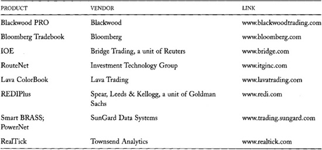

# Chapter 26: Competition Within and Among Markets

In the last few years, many exchanges, brokers, electronic
communications networks (ECNs), and dealers have created innovative
trading systems to provide traders with better services at lower costs.
The competition among these *market centers* is significantly changing
how all markets operate, and the pace of change is accelerating.

The competition among market centers has some worrisome consequences,
however. The proliferation of market centers is fragmenting the markets.
Buyers and sellers often are in different places, so that they may have
trouble finding each other. Their transaction costs therefore may be
higher than they would be if all traders traded in the same place. The
benefits of competition among market centers may be offset by the
increased costs it creates for traders who are searching for the best
price.

A market in which people can trade essentially the same thing in
different market centers is a *fragmented market.* A market in which all
traders trade in the same market center is a *consolidated market.*

Regulators and practitioners wonder whether markets should be
consolidated or fragmented. Regulations can produce either alternative.
Most futures markets are fully consolidated, as are some national stock
markets.

The issue is quite complicated. The competition among traders to obtain
the best price works best in consolidated markets. The competition among
market centers to provide low-cost services to traders, however, implies
fragmented markets. The two competitions therefore are inconsistent with
each other. Any reasonable attempts to address competitive issues must
consider why market fragmentation occurs, and the benefits and costs of
market diversity.

In this chapter, we consider the economic forces that cause markets to
consolidate and to fragment. Our discussion starts with a short
description of how technology has changed trading markets. This section
presents the technological context of the main issues. The economic
analysis starts with a discussion of why markets consolidate. We then
consider why markets fragment, and how fragmented markets coalesce into
segmented markets. Finally, we address the public policy problems
related to externalities among market segments.

## 26.1 TRADING SYSTEMS AND TECHNOLOGY

New trading systems have proliferated largely due to advances in
communications and computing technologies. New communications
technologies have given traders instantaneous presence in markets that
they formerly could not attend. Traders no longer need to be on an
exchange floor to know what is happening there or to trade effectively.
Instantaneous market data reporting systems and order-routing systems
now allow traders anywhere in the world to see and act upon
opportunities wherever they occur.

------------------------------------------------------------------------

**Slogans Don't Help**

All languages promote wisdom with slogans. Slogans, however, will not
resolve debates on market structure. For example, "United We Stand,
Divided We Fall" suggests that consolidated markets are good, but
"Strength Through Diversity" suggests that fragmented markets are good.
When applied to market structure, these two slogans promote the two
different competitions that take place in the trading industry. The
first slogan promotes the competition of traders to find the best price,
and the second promotes the competition among market centers to provide
the best services. 

------------------------------------------------------------------------

------------------------------------------------------------------------

**Where Is the Market for AOL?**

AOL Time Warner common stock trades in each of the following market
centers:

• The New York Stock Exchange, its primary listing market

• All U.S. regional exchanges: Boston, Chicago, Cincinnati, Pacific, and
Philadelphia

• Most ECNs and alternative trading systems. The most important of these
are Island, Instinet, REDIBook, Archipelago, Bloomberg Tradebook, BRUT,
and POSIT.

• The third market and Nasdaq---Bernard Madoff Investment Securities and
Knight Capital Markets are the largest dealers in these markets

• The upstairs block trading market

• Some large foreign stock exchanges

The risk in AOL common stock also trades in the following derivative
contract markets:

• U.S. options exchanges all trade AOL stock option contracts cleared by
the Options Clearing Corporation. These include the Chicago Board
Options Exchange, the American Stock Exchange, the Pacific Exchange, the
Philadelphia Stock Exchange, and the International Securities Exchange.

• Futures contracts on AOL common stock shares will trade at several
exchanges starting in late 2002.

• Many large investment banks will write individually tailored synthetic
derivative contracts in AOL for their clients. 

------------------------------------------------------------------------

------------------------------------------------------------------------

**From Dispatch Messenger to ECN**

In the beginning, markets reported some trade prices---and almost no
quotations---by dispatch messengers. They usually traveled by horseback
and ship. Later they reported prices by carrier pigeon, semaphore,
telegraph, telex, and telephone. Now most organized markets continuously
report all trade prices and all quotations as they occur via dedicated
communications systems run by computers. Information that once moved at
equine speed now moves at the speed of light.

Likewise, traders once made all trading decisions themselves and brokers
once arranged all trades manually. Now computers commonly make and
implement trading decisions while dedicated exchange, ECN, broker, and
dealer trading systems arrange trades automatically. 

------------------------------------------------------------------------

New computing technologies have allowed market centers to organize
sophisticated algorithm-based order-matching systems that would be
impossible to implement by hand. These systems provide traders with
complex order management tools that permit traders to more effectively
solve their trading problems. Examples of such features include systems
that

• Display orders only to traders who commit to filling them

• Ensure that a trader buys and sells equal dollar values

• Ensure an order that is part of a larger strategy will fill only if
all orders in the strategy fill

• Allow traders to submit orders with limit prices indexed to market
conditions

• Substitute orders in one instrument for orders in another instrument
based on market conditions.

Trading systems that incorporate these features use complex rules to
treat all traders fairly, subject to various constraints. They could not
be implemented without the assistance of a computer. New computing
technologies therefore have allowed markets to develop new applications
that formerly would have been economically infeasible.

Even when clerks can effectively operate a trading system by hand, they
are not as cost effective as computers. New computing technologies
therefore have allowed market centers to lower the costs of existing
services in addition to providing new services.

------------------------------------------------------------------------

**The OM SAXESS Trading
System**

OM Gruppen of Stockholm sells and operates exchange trading systems.
Their SAXESS system allows traders to submit various types of
contingency orders: combination orders, linked orders, stop loss orders,
block orders, and balance orders. The algorithms necessary to provide
these services are quite complex because the execution of some orders is
contingent on the execution of other orders. 

*Source:*
[[http://www.omgroup.com/](http://www.omgroup.com/)].

------------------------------------------------------------------------

### 26.1.1 A Very Short History of Fragmentation and Consolidation

In the beginning, most trading occurred on the trading floors of
regional exchanges. Professional traders wanted to belong to these
exchanges because only by being on these floors could they learn about
market conditions and access trading opportunities. Nonmembers traded
through member-brokers because that was the only way they could trade in
these markets. Although no single market structure can simultaneously
best serve the needs of all traders, most traders traded at exchanges
because everyone traded there.

Trading in many instruments fragmented across regional exchanges because
impatient traders would not send their orders to distant exchanges.
These traders incurred high transaction costs to compensate dealers who
moved liquidity through time and arbitrageurs who moved liquidity from
market to market. Wide arbitrage spreads reflected the high costs of
obtaining information and acting upon it across large distances.

When new communications technologies reduced the costs of transmitting
market information and orders, regional exchanges consolidated to form
large international markets. Where permitted, many alternative trading
systems operate on the periphery of these markets. These systems provide
special services to traders whose needs vary substantially. Arbitrageurs
ensure that prices in all systems reflect market conditions throughout
the world.

Traders now trade in whatever trading system best serves their
particular needs, confident that prices in that market segment will
reflect liquidity conditions in all other segments. New trading systems
have proliferated as entrepreneurial exchanges, brokers, dealers, data
vendors, and software providers compete to help satisfy the liquidity
demands of diverse traders.

## 26.2 MARKET CONSOLIDATION

------------------------------------------------------------------------

**The Cheese Cart Crowd**

Markets consolidate for the same reason a crowd forms when a supermarket
gives free appetizer samples. Everyone likes to obtain something for
nothing.

Traders give away free options when they offer limit orders, offer
quotes, or accept offers to trade. Since traders value these options,
these offers attract a crowd.

In the supermarket, only the manufacturer's representative offers free
cheese. In trading markets, traders who are attracted by free options
often also offer options. 

------------------------------------------------------------------------

Markets are *consolidated* when all traders trade in the same place.
Markets naturally consolidate. Since trades are easiest to arrange on
good terms in liquid markets, traders gravitate to the most liquid
market. Each trader who joins a market adds liquidity to that market.
The additional liquidity then attracts more traders, who add more
liquidity. Economists call this phenomenon the *order flow externality.*
It causes markets to consolidate without any regulatory intervention.

We can best understand the implications of the order flow externality by
momentarily adopting a simple but highly unrealistic assumption. Assume
that all traders are essentially identical. In particular, assume that
all traders trade for similar reasons; they trade the same sizes, they
are equally patient---or impatient---to trade; they are equally
creditworthy; and they pursue roughly the same investment strategies.

If this extreme assumption were true, the same exchange services would
interest all traders. Whatever market pleased one trader would please
all other traders. No trader would want to trade anywhere but where all
other traders trade. Traders would find the best terms for their trades
there because all interested traders would be there. With all interested
traders in the same market, the search for best price would be least
costly.

The market in which identical traders would trade need not convene in
any one physical location. It could reside anywhere that traders can
expose their orders to everyone and trade with any order. Electronic
trading systems are becoming increasingly
common because electronic networks often provide cheaper and more
efficient communications than face-to-face networks do.

This consolidated market would treat each trader equally. No one would
receive any special preferences based on size, creditworthiness, or
experience because we assumed that no such differences exist.

### 26.2.1 Innovative Markets

Occasionally, someone may want to create a new market with different
trading rules or with a new technology. If the innovation lowers
transaction costs or provides more service, all traders would join the
new market, and the market would remain consolidated. All traders would
want to join the new market because all traders are identical. If one
trader decides that it is optimal to join, all other traders will reach
the same conclusion.

It may be difficult to convince all traders to switch to the new market
at the same time, even if everyone would be better off trading there.
The order flow externality gives the incumbent market a tremendous
advantage over new rivals. No trader wants to be the first trader in a
new market, no matter how good it might be. If the new market structure
is not substantially better than the incumbent one, or if it is too
costly for traders to redirect their orders, it may not be possible to
convince enough traders to switch to make the new market viable. An
innovative market may fail simply because it cannot take the order flow
externality away from the incumbent market. The order flow externality
may allow an incumbent market to survive even if another market
structure could provide better service.

------------------------------------------------------------------------

**The Optimark Experience: 406 Million Dollars Lost!**

Optimark was a highly innovative trading system that permitted traders
to create "profiles" for their orders. Using a graphical interface,
traders could express degrees of preference (trader satisfaction) for
various combinations of price and quantity. A Cray supercomputer
processed these profiles to match buyers to sellers according to a
complex set of preference rules.

Many people---especially institutional traders---were very excited by
the system when it was under development in the mid-1990s. The novel
means by which the system could allow them to express their preferences,
and the novel ways in which these expressions could facilitate
negotiation of cheap, mutually satisfactory trades, particularly
enchanted them.

Unfortunately, their excitement did not generate much order flow. After
a couple of years of very poor performance, Optimark closed the U.S.
equities segment of its business in September 2000. Accumulated deficits
for the entire firm through September 2001 totaled 406 million dollars.
Much of the loss was due to technology development and marketing.

How you interpret this story depends on what you think about the
technology that Optimark introduced. If you believe that the technology
represents a significant improvement over existing exchange
technologies, then you learned that the order flow externality is
extremely hard to overcome, especially for systems that traders cannot
easily understand. If you believe---as I do---that the technology was
inferior to existing exchange technologies, then you learned that
traders enthusiastically support interesting development efforts as long
as they do not have to pay for them. 

*Source:
[[www.sec.gov/Archives/edgar/data/1062023/000095012301500801/y47391a2el0-ka.txt](http://www.sec.gov/Archives/edgar/data/1062023/000095012301500801/y47391a2el0-ka.txt)]*.

------------------------------------------------------------------------

------------------------------------------------------------------------

**Why ECNs Compete Well
with Nasdaq but Not with the NYSE**

Several ECNs provide electronic order-driven markets for U.S. equity
traders. ECNs get around the order flow externality problem through
clever manipulation of their linkages with the Nasdaq trading system.
ECNs can route orders to Nasdaq, and they can post and quickly revise
quotes on Nasdaq. They use these facilities to expose their clients to
the liquidity available in Nasdaq.

When an ECN receives a market order, it determines whether the order
would be best executed by crossing it with standing orders in the ECN
order book or by sending it to Nasdaq. If the order would obtain a
better execution through Nasdaq, the ECN sends the order there.
Otherwise, it crosses the order internally. This procedure ensures that
market order traders who send their orders to ECNs obtain execution that
are at least as good as they would obtain on Nasdaq.

When an ECN receives a limit order, it first determines whether it is
marketable in Nasdaq or in its own system. If it is marketable, the ECN
treats it like a market order and sends it to the best market. If the
order is not marketable, the ECN places it in its order book. If the
order matches or improves the best price on the ECN book, the ECN
revises its Nasdaq quote to reflect the improved price or size of the
new order. If a market order then arrives at the ECN with which the ECN
can match the standing limit order, the ECN crosses the order and
adjusts its Nasdaq quote. If Nasdaq routes a marketable order to the
ECN, the ECN fills the order if it has not already been filled. This
procedure ensures that limit orders sent to ECNs are exposed to the
entire market.

The exposure of a limit order in two markets at once puts the order in
*double jeopardy* of executing twice. The problem is especially serious
if either market has slow execution, quotation, order-routing, or trade
reporting systems. In that case, both markets may try to execute the
order before either market can cancel an order or adjust a quote.

Since most traders will not bear the risk of double execution, one
market must take precedence over another. Existing order-routing systems
ensure that ECNs have precedence over Nasdaq but not over the NYSE. This
difference explains why ECNs have taken significant market share from
Nasdaq but not from the NYSE. An ECN cannot cross a market order with a
limit order that it has routed to the NYSE until it cancels the NYSE
limit order and receives a report confirming that the order is canceled.
This process generally takes much longer than most market order traders
are willing to wait. 

------------------------------------------------------------------------

To initially compete with an incumbent market, a new market must find a
way around the order flow externality problem. The new market must be
closely integrated with the incumbent market so that traders can easily
obtain liquidity in either market, or the new market must have an
extremely effective advertising campaign that can convince many traders
to switch at the same time. The ECNs that started to complete with
Nasdaq in the late 1990s took the first approach.

### 26.2.2 The Order Flow Externality, Order Exposure, and Preferencing

When a market fully displays its orders and quotes, dealers can compete
against the order-flow externality held by that market by filling market
orders on the same terms available in that market. Since their clients
get the same execution that they otherwise
would have received, they do not care where their market orders fill.

------------------------------------------------------------------------

**Order Exposure on the NYSE Floor**

Floor brokers generally handle large market-not-held orders on the floor
of the NYSE. The floor brokers often reveal their orders only after
identifying traders likely to be interested in trading, and then only to
the extent that they believe the interested traders are willing to
trade.

Try as they might, exchange floor brokers do not always manage order
exposure perfectly. They may misjudge who might be interested in trading
or the size that a trader will trade. They may inadvertently expose
their orders by the way they walk, talk, or otherwise present
themselves. They also may deliberately reveal their orders to reward
friends or to exchange favors with traders with whom they must deal,
shoulder-to-shoulder, every day of the year.

Large traders protect themselves against these risks by breaking their
orders into parts. They then sequentially submit the parts to their
broker as each part fills. They may also submit the parts to different
brokers. 

------------------------------------------------------------------------

If permitted to do so, dealers frequently establish preferencing
arrangements to compete against such markets. If they arrange to fill
orders that primarily come from uninformed traders, dealers may be able
to offer better terms than are available in the primary market. Dealers
then will take much of that order flow away from the primary market.

When dealers take market orders away from the primary market, the
primary market becomes less attractive to limit order traders. Traders
then either send their limit orders elsewhere or use market orders
instead.

The order flow externality is strongest when traders are uncertain about
what orders and quotes are available in a market. If so, traders need to
be in that market to take advantage of whatever opportunities are
present there. These issues are of greatest concern to traders who want
to fill large orders because other traders generally are unwilling to
display large sizes. To fill their orders, they therefore must
participate in the market where other large traders trade.

Facilities that allow traders to control the exposure of their orders
strengthen the order flow externality where it is strongest. Strong
markets do not want to display their quotes and orders because doing so
only allows dealers to compete along side of it. Electronic markets that
permit traders to place undisplayed orders, and floor-based markets in
which brokers hold undisplayed orders, force traders to come to them to
trade. Strong markets do not benefit from exposing their orders.

The order flow externality is very strong at the New York Stock Exchange
because much of the liquidity there is in the hands of floor brokers who
do not fully disclose their orders. Dealers successfully compete against
the NYSE market only when filling small market orders that come
primarily from uninformed traders, and very large orders that require
more liquidity than is available on the floor of the exchange.

In contrast, the order flow externality is weak at the Nasdaq Stock
Market because traders who route their orders cannot learn any more
about market conditions than do traders who preference their orders to
specific dealers of ECNs. Dealers and ECNs therefore have competed very
successfully against the Nasdaq Stock Market.

### 26.2.3 Public Policy Implications

The role for public policy would be quite limited if all traders were
identical. Good public policy would simply allow traders to choose for
themselves the trading system that they prefer. Although the best market
system would be a consolidated system, regulators would not need to
impose one on identical traders: They would choose it for themselves.

Regulatory efforts to impose a consolidated system risk choosing the
wrong market structure or stifling innovation. When regulators
consolidate by fiat, they have to determine what structure to use and
when to change it as new technologies and demands for service emerge.
Should the consolidated system enforce strict price-time precedence, as
the Tokyo Stock Exchange does? Open-outcry futures markets generally do
not. Should the consolidated system display all orders, as the CATS
system in Toronto does? Most trading systems do not. Should displayed
orders have precedence over undisclosed orders that were submitted
first, as is the case in the GLOBEX and Paris
CAC trading systems? Most systems do not even allow undisclosed orders.
These differences in market structure are very significant. The public
welfare depends on the market structures that regulators chose.

When traders choose where they trade, the competition for their orders
helps reveal the market structures that best serve them. This
competition occasionally fragments the market as innovative systems take
order flow from incumbent systems. If traders are identical, however,
the fragmentation will be transitory. The best market structure will
eventually garner all the order flow, if new markets can overcome the
advantages of the order flow externality.

Regulators can help ensure that competition reveals the best market
structure by helping disseminate reliable and unbiased information about
competing market structures. Such information makes it easier for
traders to switch to better trading systems as they become available.

It also might appear desirable for regulators to require that incumbent
trading systems permit fast linkages between their trading systems and
those of their rivals. Although such policies make it easier for rivals
to overcome the advantage of the order flow externality, they can
seriously disrupt incumbent trading systems that use slow trading
technologies. If the slow technology is slow because the market has
failed to innovate, requiring fast linkages will promote
efficiency-enhancing competition. But if the technology is slow because
traders need time to arrange trades that they could not otherwise
arrange, requiring fast linkages will disrupt the incumbent market and
possibly destroy its valuable trading system. The decision to require
fast linkages therefore is not merely a decision to promote competition;
it can unintentionally impose an inferior market structure upon certain
markets.

## 26.3 MARKET FRAGMENTATION

Markets fragment because traders are not all identical and because their
trading problems differ considerably. Some market structures therefore
better serve the needs of some traders than other market structures do.
Consequently, identical instruments---and very similar instruments---may
simultaneously trade in multiple market centers.

Although different traders prefer different market structures, they all
greatly appreciate the order flow externality. Every trader wishes that
all other traders would trade exclusively in his or her preferred market
structure. Traders naturally want their preferred market to be as liquid
as possible.

In the remainder of this section, we identify how traders differ, and
how these differences cause them to prefer different market structures.

### 26.3.1 Unequal Sizes

Traders differ in the quantities that they want to trade. Some traders
are so large that their orders can significantly move the market. Others
are so small that their individual orders rarely have any price impact.

Large traders are reluctant to reveal their trading plans. They fear
that if their orders were widely revealed before they arranged their
trades, other traders would front-run them and thereby increase their
trading costs. Large traders manage this risk by controlling the
exposure of their orders. They prefer to expose their orders only to
traders who will commit to trading with them.

------------------------------------------------------------------------

**Order Exposure in
Cantor Fitzgerald's Government Bond Trading System**

eSpeed, the government bond trading system used by Cantor Fitzgerald, is
an electronic trading system designed to serve the needs of large
traders. Traders confidentially indicate to eSpeed that they are willing
to trade at a given price. The system continuously publishes the best
bid and ask prices. When a trader indicates that he will take a standing
bid or offer, the taking trader and the standing trader take turns
revealing how much they want to trade. They reveal increasing sizes
until one of the two traders no longer wants to increase the size of the
trade. At that point, the eSpeed system executes the trade at the last
agreed-upon size.

All traders are able to see the agreed-upon size of the trade as it is
growing, but no one except the two parties to the trade and the broker
can see the negotiations. The system thus allows the two traders to see
each other's orders only to the extent that they are willing to trade
while ensuring that neither trader knows with whom he or she is trading.

Some large traders are so sensitive about revealing size that they split
their orders so that no one can confidently infer the full size of their
orders. Occasionally, two such traders will unknowingly trade with each
other two or more times in a row simply because neither trader is
willing to let any other trader know the full size of the order.

------------------------------------------------------------------------

Executing large orders can be difficult and expensive in markets that
widely display orders. If traders do not expose their orders, finding
the other side is difficult. If they expose their orders, they may scare
away traders who might otherwise supply liquidity to them, and other
traders may front-run them. Large traders therefore prefer market
structures that allow them to find traders willing to trade while
minimizing the information they must expose to find these traders.

------------------------------------------------------------------------

**Order Exposure in Crossing Networks**

Electronic crossing networks, such as POSIT, allow large traders to
avoid exposing their orders. These computerized trading systems take
electronically transmitted orders and match them at prices determined
elsewhere. The systems are completely confidential. They reveal only the
aggregate sizes of the matches they have arranged. 

------------------------------------------------------------------------

Large traders also prefer markets that enforce strict time precedence
rules in conjunction with an economically significant minimum price
increment. These rules protect them from quote-matching front runners
when they expose their orders. [Chapter
11](#part0021.html_ch11) discusses front-running strategies.

In contrast, small traders like to expose their orders. They do not fear
front runners because front running a small order is not generally
profitable. Wide exposure allows small traders to fill their orders
quickly, at the best prices available. They prefer market structures in
which they can expose their orders.

Small market order traders like markets that have small minimum price
increments because they pay the bid/ask spread when they trade. Since
spreads cannot be smaller than the minimum price increment, a large
price increment can force them to pay artificially high spreads.

### 26.3.2 Asymmetric Information

Well-informed and uninformed traders generally prefer different market
structures. Most traders want to avoid trading with well-informed
traders. Well-informed traders therefore prefer to trade in fully
consolidated markets, in which all traders trade anonymously, so that
they cannot easily be identified as informed traders.

In contrast, uninformed traders prefer to trade in markets that expose
trader identities so that they can avoid informed traders. They also
prefer to trade in markets where they can try to convince other traders
that they are uninformed. Retail traders benefit from the preferencing
of their orders to dealers who discriminate between their orders and
more informed orders. [Chapters 15](#part0026.html_ch15),
[23](#part0037.html_ch23), and
[25](#part0039.html_ch25) discuss how fragmented market
structures have evolved to benefit uninformed traders.

------------------------------------------------------------------------

**Hybrid Trading
Systems**

The New York Stock Exchange and the Nasdaq Stock Market both have hybrid
trading systems. The NYSE is essentially an order-driven public auction
in which specialists ensure that impatient traders can always trade.
Nasdaq is essentially a quote-driven dealer market in which public
traders can offer liquidity by exposing their orders. Both systems are
hybrids designed to meet the needs of all types of traders. 

------------------------------------------------------------------------

### 26.3.3 Unequal Patience

Some traders are more patient than are others. Impatient traders want to
trade quickly. They generally will pay bid/ask spreads and high
commissions to increase the probability that they trade. Impatient
traders like market structures in which dealers are always available to
provide them with liquidity when they want to trade. In contrast,
patient traders are cost-sensitive and willing to wait for the market to
come to them. They tend to supply liquidity through their limit orders
and through the floor brokers who represent them.

Some market structures serve the needs of impatient traders better than
those of patient traders. For example, Nasdaq's Small Order Execution
System (SOES) is a quote-based system that allows small impatient
traders to trade immediately whenever they want to. Users of this
system, however, generally must buy at the ask and sell at the bid.
Since Nasdaq allows traders to preference their orders to specific
dealers, and thus does not enforce time precedence, Nasdaq does not best
serve the needs of patient traders. Patient traders instead prefer
consolidated order-driven trading systems that enforce universal time
precedence. Such systems increase their probability of trading when they
expose their orders.

All traders must decide whether they value execution certainty more than
they value transaction cost savings. Those who value the former opt for
quote-driven market systems that provide execution certainty at the
expense of transaction costs. Those who value transaction cost savings
opt for order-driven market systems that provide lower transaction costs
for executed trades, but lower certainty that orders will trade. Diverse
market structures exist because no single trading system best serves the
needs of both patient and impatient traders.

### 26.3.4 Unequal Access

By design or historic accident, markets often deny some traders access
to information or facilities that other traders have. For example,
exchange members may have direct access to floor information or trading
opportunities that are unavailable to off-floor traders. The latter
group of traders generally can trade only by purchasing brokerage
services from exchange members.

Many large institutions and sophisticated individual investors believe
that they could execute their trades at a lower cost if they had the
same access to information and trading facilities that exchange members
have. Disadvantaged traders naturally favor market structures in which
they have stronger and more equal roles. Diversity in market structures
is partly due to competitive responses to their disenfranchisement.
Trading systems like Instinet and POSIT attract order flow, in part,
because users can arrange their trades without the intermediation of
traditional brokers.

### 26.3.5 Unequal Creditworthiness and Trustworthiness

Traders differ in their creditworthiness and trustworthiness. Trades
settle only if traders acknowledge and fulfill the terms of their
agreements. Traders who do not settle, impose costs upon other traders.

Trustworthy and creditworthy traders
therefore prefer to trade with each other and exclude less worthy
traders. When they cannot do so, they bear the costs that less worthy
traders impose upon them. Depending on the market, they may directly
bear these costs when a deadbeat fails to settle properly with them, or
they may indirectly bear these costs by settling their trades through a
clearinghouse that guarantees their performance.

Markets exclude individuals who would impose costs upon others if
allowed to trade. The excluded individuals may still trade, but usually
they must trade through intermediaries who guarantee their trades.
Exchanges, dealer networks, and clearinghouses impose financial and
ethical standards upon their members in order to exclude traders who
might impose unnecessary settlement costs upon others. Any consolidated
trading system that imposes the same standards on all traders requires
the more creditworthy and more trustworthy traders to subsidize the less
worthy ones.

## 26.4 MARKET SEGMENTATION: HOW FRAGMENTED MARKETS CONSOLIDATE

The two preceding sections suggest that a trade-off may exist between
the cost-reducing benefits of market consolidation and the
service-enhancing benefits of market diversity. Within any given market
structure, liquidity is greatest and transaction costs are lowest when
all traders trade in that structure. All traders therefore want all
other traders to trade in the market structure that they prefer.
Differences among traders, however, cause them to prefer diverse market
structures. Unfortunately, no single market best meets the service needs
of all traders; thus, in many markets, a diversity of market structures
has evolved to serve the various needs of different traders. The
resulting fragmentation suggests that some of the cost-reducing benefits
of market consolidation may be lost. In particular, regulators and
practitioners fear that fragmented markets substantially increase
transaction costs.

These concerns would be well founded if traders in various market
fragments did not know about---and respond to---market conditions in
other fragments. Each fragment then would constitute an isolated market
in which price formation would take place independently of all other
fragments. The resulting prices would depend only on market conditions
within each fragment. Prices would not efficiently incorporate all
available information about fundamental asset values because information
in one fragment would not affect trading in other fragments. Transaction
costs would be high because liquidity demands in one fragment could not
meet liquidity supplies in other fragments. Traders thus would have to
satisfy all liquidity demands separately within each fragment.

Market diversity, however, does not necessarily imply inferior price
formation and high transaction costs. Traders can obtain the benefits of
consolidation in fragmented markets when information flows freely
between market fragments, and when some traders can choose which
fragment in which to trade. These two conditions are sufficient to
coalesce a fragmented market into a unified complex of diverse segments.
The first condition ensures that traders know what is happening in each
market segment. The second condition ensures that some traders can act
on that information when prices or liquidity conditions diverge.

------------------------------------------------------------------------

**The Route to Best
Execution**

Many trade facilitators sell sophisticated order-routing systems to
their clients. These systems take client orders and route them to the
best available market. They are particularly useful to large traders who
want to *sweep the market* by taking liquidity from all sources at once.
Most of these vendors bundle their order-routing systems with buy-side
order management systems that they offer to their clients. [Table
26-1](#part0040.html_ch26tab1) provides a partial list of
these vendors. 

------------------------------------------------------------------------

Three mechanisms consolidate a fragmented market. First, within each
market segment, traders adjust their orders to reflect information that
traders reveal in other segments. These adjustments cause prices to
reflect information from all segments.

Second, some traders route their orders to market segments where they
expect to obtain the best prices. Traders who demand liquidity route
their orders to segments that are currently most liquid. Traders who
supply liquidity route their orders to segments with the greatest
current demands for liquidity. These order-routing decisions help
balance the supply and demand for liquidity in all market segments.

Finally, arbitrageurs specialize in moving liquidity among market
segments. They trade whenever prices in one segment are inconsistent
with prices in another segment. Their trading enforces the law of one
price across market segments as they connect buyers in one segment to
sellers in another segment. [Chapter 17](#part0028.html_ch17)
discusses how and why arbitrageurs move liquidity among market segments.

The forces that consolidate market segments are quite robust. Even if
some traders can trade only in one market segment, the market will
remain consolidated if other traders can freely route their orders to
other market segments. In the worst case, if an order cannot move to its
best market, arbitrageurs will move the best market to the order.

These three mechanisms will consolidate a fragmented market only if
information about trades and orders in each market segment is publicly
available at low cost. Without this information, traders cannot easily
search for the best price across market segments.

Traders will consolidate fragmented markets only if they always seek the
best prices for their orders. Problems may arise, however, when traders
use brokers to arrange their trades. Although traders expect that their
brokers will seek the best prices for their orders, brokers may not
always do so. If they do not, market fragmentation may reduce liquidity
and make the price formation process less efficient. [Chapter
7](#part0015.html_ch07) discusses this agency problem in
detail.

**TABLE 26-1**.\
Buy-Side Equity Order-Routing Systems

Agency problems at their worst involve frauds
that brokers perpetrate upon their clients. For example, brokers may
arrange to have confederates fill orders at inferior prices. Such frauds
are much easier to commit in fragmented markets than in consolidated
markets because fewer people monitor trading in small market segments
than in fully consolidated markets. Any consideration of the trade-offs
between market consolidation and market diversity therefore must
consider the potential for fraud in fragmented markets.

------------------------------------------------------------------------

**Anyone Care to Swim?**

Traders say that they access *liquidity pools* in fragmented markets.
The order flow externality causes a pool of liquidity to form in each
market fragment. 

------------------------------------------------------------------------

Public policy makers who consider whether to consolidate fragmented
markets by regulation should compare the benefits and costs of
diversity. Unfortunately, both are hard to measure.

We can identify a lower bound for the costs of diversity. The total
costs of trading in a segmented market must exceed the trading costs in
a fully consolidated market by at least the cost of the information
systems necessary to consolidate the market plus the resources that
arbitrageurs use to move liquidity among market segments. If this lower
bound is high, market diversity is very expensive.

In very active markets, information usually is quite cheap relative to
the volume of trade, and the competition among arbitrageurs to profit
from trading opportunities ensures that they provide cheap and efficient
service. The benefits of complete consolidation in such markets
therefore are small relative to the benefits of market diversity. Active
markets therefore can support more diverse market structures than less
active markets can.

## 26.5 EXTERNALITIES IN THE COMPETITION AMONG MARKET CENTERS

The discussion in the preceding section suggests that competition among
market centers to satisfy different service needs of diverse clienteles
is generally beneficial. The resulting segmentation helps traders solve
their various trading problems at minimum cost. If information flows
freely between market segments and if no serious agency problems are
present, segmentation is unlikely to have any overwhelmingly negative
effects on price formation and transaction costs.

The conclusion that competition among market centers is beneficial,
however, depends on the assumption that no significant externalities
affect the competition. An *externality* arises whenever someone does
something that has an impact upon others for which he or she is neither
adequately compensated nor properly penalized. When no one compensates
people for the benefits they provide others, they tend to do less than
would be socially desirable. Likewise, when no one penalizes people for
the costs they impose upon others, they tend to do more than would be
socially desirable. Unfortunately, competition among market centers
involves several such externalities.

### 26.5.1 The Order Flow Externality

We have already discussed the most important externality that affects
competition among markets. The order flow externality makes it very
difficult for new markets to compete effectively against incumbent
markets.

The order flow externality is an example of a *network externality.*
Network externalities arise whenever the value of a system to a user
increases as more people use the system. For example, a phone network is
more valuable to each subscriber when the
network connects many subscribers as opposed to few subscribers.

------------------------------------------------------------------------

**How Many Disks Have You Received from AOL?**

When a new market with a network externality opens, competitors must
rush to quickly build their networks. AOL is the best-known example of a
recent winner in a new market with a network externality. People once
joked about how many computer disks AOL mailed to potential subscribers.
Those disks, however, helped to create AOL's unassailable market
position. 

------------------------------------------------------------------------

Trading systems are networks that link many potential buyers to many
potential sellers. The more buyers and sellers who participate in the
system, the more valuable it is to everyone who uses it.

Network externalities can create tremendous barriers to entry. Usually,
one trading system grows large, and no other system can become large
enough, quickly enough, to be a viable economic competitor. Markets with
network externalities are *winner-take-all markets.* Without government
regulation, new entrants often cannot get a toehold.

The U.S. government requires that all phone companies allow all other
phone companies to access their networks. Without such linkages, new
phone companies could not compete with existing companies. The cellular
telephone, telephone-over-cable, and telephone-over-Internet industries
would not exist today were it not for these open access regulations. The
government, of course, specifies the *interconnect access fees* that
companies can charge each other for access to their networks.

Governments can acquire, and have required, linkages among trading
networks. In 1975, the U.S. government required that U.S. equity
exchanges establish the Intermarket Trading System (ITS) to link their
trading floors. The exchanges created a rather inefficient system, so
ITS has had little effect on the markets. A redesign of the system is
presently very high on the political agendas of many market centers. For
example, the ECNs would like to have access to a revised ITS system
through which they can route firm commitments at high speed. Most
incumbent exchanges, of course, are not interested in improving the
system.

Order routing systems created by various data vendors also link traders
with various trading systems. These links connect to the *application
programming interface* (API) of each trading system. (APIs are portals
through which computer systems talk with each other.) This approach to
market center linkage may ultimately accomplish all that coordinated
regulatory linkages attempt to accomplish.

### 26.5.2 Secondary Precedence Rules

The second most important externality in exchange competition is also
due to the option values implicit in orders. Traders who offer standing
limit orders benefit other traders, but no one compensates them for the
benefits that they provide. They therefore provide less liquidity than
would be socially optimal.

The liquidity offered by limit order traders benefits markets because it
attracts traders. Exchanges and ECNs therefore try to encourage traders
to offer limit orders. Traders will offer liquidity when they are
rewarded for---and not hurt by---offering liquidity.

Some ECNs reward limit order traders by charging lower fees for limit
orders than for market orders. In effect, market order traders pay limit
order traders a fee for their liquidity in these systems. In [chapter
14](#part0025.html_ch14), we show that in competitive
order-driven markets, such differential fees simply narrow equilibrium
bid/ask spreads so that the long-run incentives to supply or demand
liquidity are unchanged.

In general, any preference given to limit order traders will have no net
effect on the supply of liquidity in a competitive equilibrium in which
all traders are precommitted to trading. In such models, spreads adjust
so that traders are indifferent between offering and taking liquidity.

------------------------------------------------------------------------

**Lost Time Precedence**

Time precedence rules govern trading in U.S. exchange-listed stocks at
exchanges, but not among exchanges and over-the-counter dealers.
Regional exchange specialists and third market dealers like Bernard
Madoff regularly fill market orders at the same bid or ask prices that
traders at the New York and American Stock Exchanges first quoted.
Likewise, exchange traders occasionally fill market orders at prices
that regional specialists and third market dealers quoted first. In
either event, the trader who quoted first does not receive a trade that
he or she would have received if time precedence were universally
enforced across markets.

Order crossing by brokers also often violates time precedence. Many
brokers like to match orders internally for execution because internal
matching ensures that they obtain two commissions for the trade instead
of one. These brokers then print the trade at a market with a thin limit
order book to ensure that no standing limit order interferes with the
trade. Traders who place their orders in exchange order books would be
better off if the brokers had to print their crosses in a consolidated
market.

In both examples, limit order traders would be better off if time
precedence were universally enforced. 

------------------------------------------------------------------------

In most markets, however, not all potential traders are committed to
trading. In particular, quote-matching order anticipators trade only if
they can extract option values from limit orders. ([Chapter
11](#part0021.html_ch11) discusses the quote-matching
strategy.) Their trading therefore taxes liquidity. In equilibrium,
quote matchers' profits imply higher transaction costs for precommitted
traders whether they use limit orders or market orders.

Since quote matchers directly hurt limit order traders, and thereby
indirectly hurt market order traders, markets have an incentive to
exclude quote matchers. The only effective way that they can do so is by
maintaining secondary precedence rules---time precedence and public
order precedence---that give precedence to limit order traders who
display their orders. An economically significant minimum price
increment, of course, must be set to make these precedence rules
meaningful.

An externality problem arises when market segments compete with each
other because a market segment cannot meaningfully enforce secondary
precedence rules when other segments trading the same---or essentially
the same---instruments do not. Quote matchers simply place their orders
and quotes in other markets when they do not have precedence in a given
market. If they can get their orders filled in these other markets, they
get around the secondary precedence rules.

Markets that attract few limit orders have little incentive to maintain
an economically significant minimum price increment to protect limit
order traders. On the contrary, with a small increment, they can attract
orders of quote matchers who will improve the consolidated quote in
order to obtain market orders. Since brokers generally must execute
orders at the best available prices, they often route to markets that
display the best prices. A small market with little volume may therefore
obtain order flow by offering a small minimum price increment. Although
larger markets may want to protect limit order traders, they cannot do
so: To remain competitive, they must lower
their minimum price increments to equal the smallest minimum increment
offered by any market.

------------------------------------------------------------------------

**The Race to the Bottom**

Reduction of the minimum price increment in U.S. equities markets
started in the 1990s and culminated in the full decimalization of the
markets in 2001. As the above analysis suggests, the first markets to
offer smaller minimum price increments were weaker markets like the
American Stock Exchange and the ECNs. They moved first because they had
little incentive to protect limit order traders. (They then had few such
traders.) The larger markets had to decrease their price increments to
remain competitive in the face of best execution standards that require
brokers to obtain the best available prices for their clients' orders.

------------------------------------------------------------------------

Unregulated competition among markets therefore does not permit markets
to enforce trading rules that would solve the order exposure externality
problem. Consequently, public limit order traders offer less liquidity
than they would have if they traded in a fully consolidated trading
system that used an economically meaningful minimum price increment to
enforce secondary order precedence rules.

### 26.5.3 Regulatory Services

Markets compete for order flow by offering services that they believe
will be attractive to their clienteles. We can divide the services that
markets offer into two groups, according to whether the benefits they
provide are private or public services.

Private services benefit only the traders who use the market.
Order-routing systems and accounting systems are examples of such
services. Since usage of these services is easy to measure, markets can
charge their traders to cover the costs of providing these services.
Markets therefore will provide whatever private services their users
demand.

Public services benefit everyone, regardless of where---or sometimes
whether---they trade. The promotion of price continuity, and the
regulation of insider trading, manipulative trading practices, and
capital structures, are examples of services that produce public
benefits. These services improve market quality for everyone. Exchanges
fund them through fees that they charge traders who use their markets.
Traders can avoid these fees by patronizing markets that do not provide
these regulatory services. Since markets can charge only their traders
for these services that benefit everyone, unregulated competition among
market centers produces fewer public services than would be socially
desirable.

## 26.6 CONSOLIDATION OF MARKETPLACES

The preceding sections discuss consolidation and fragmentation of
trading in a single instrument. In this section, we identify additional
forces that cause market centers---exchanges, ECNs, brokers, and
dealers---to consolidate through mergers, acquisitions, joint ventures,
and joint operating agreements.

Two major waves of such consolidations have occurred. The first followed
the invention and widespread adoption of the telegraph and telephone.
These communications technologies greatly decreased the costs of knowing
what was going on in distant markets and of routing orders to those
markets. Once, every major city had exchanges that traded many of the
same securities, and many of these cities also had futures markets that
traded similar contracts. With improvements in telecommunications,
traders seeking better prices eventually caused markets to consolidate.
The markets that lost order flow failed or merged with other exchanges.

The second wave of consolidations started in the early 1990s and is
continuing to this day. This wave is occurring largely in response to
three factors. The first factor is the order flow externality mentioned
above. It is responsible for much of the consolidation among dealers and
among some ECNs.

The second factor is related to changes in the costs of operating
trading systems. Advances in computing technologies have caused the
ratio of variable costs to fixed costs to decline. Consequently, the
economies of scale in operating trading systems have increased.
Operating small trading systems has become more costly relative to
operating large trading systems. To reduce costs, many exchanges and
brokerages have consolidated.

------------------------------------------------------------------------

**An Academic Proposal
for Exchange Competition**

Consider the following proposal for competition among equity markets:

1\. Regulations would completely consolidate all trading in an equity
issue into a single market. Different equities might trade in different
markets, but all trading in a given equity would be in the same market.

2\. Shareholders would decide each year at which market their equity
issues will trade.

This proposal would produce many benefits of regulatory consolidation
while preserving the benefits of competition among markets. Instead of
competing for order flow, markets would compete for listings. Although
the proposal provides a simple and attractive solution to a complex
problem, only academics have shown any interest in it. 

------------------------------------------------------------------------

Finally, much consolidation is taking place because regulatory
restrictions on cross-border cooperation and competition have loosened.
These changes are most obvious in the European Community. Markets there
are quickly consolidating to take advantage of the order flow
externality and economies of scale in operating large trading systems.
Likewise, the relaxation of regulatory restrictions has led to several
international joint operating agreements among futures exchanges.

------------------------------------------------------------------------

**Should Apples and Oranges Trade Together?**

The order flow externality most obviously applies to a single
instrument. Traders interested in trading a given instrument are
attracted to the market with the most order flow in that instrument.

This principle also applies to instruments that are similar to each
other. Instruments are similar when their values largely depend on the
same common valuation factors. Many traders therefore regard them as
good substitutes for each other. Such traders are attracted to markets
that actively trade any of these instruments. Markets that actively
trade many similar instruments are especially attractive to traders who
are interested in exposure to the common valuation factors. The order
flow externality thus applies to common factors as well as to individual
instruments.

Markets that trade similar instruments often merge to take advantage of
the order flow externality. By concentrating order flow in similar
instruments, they increase the liquidity of underlying common factors.
This effect explains why mergers of markets within a country generally
have been quite successful. It also helps explain why stocks generally
do not trade well outside of their national markets. 

------------------------------------------------------------------------

## 26.7 SUMMARY

Markets consolidate because traders attract traders. Trading is easiest
and cheapest where most traders of an instrument or similar instruments
trade. Liquidity attracts liquidity.

Markets fragment because the trading problems that traders solve,
differ. Different market structures serve some traders better than
others. Markets fragment when, for enough traders, benefits from
differentiation exceed benefits from consolidation.

Some traders are small and unconcerned about the price impacts of their
trades, while other traders are large and very concerned about front
running. Small traders prefer market structures that widely expose their
orders so that everyone can see and react to them. Large traders prefer
market structures that allow them to control how and to whom their
orders are exposed.

Some traders are well informed about fundamental values and therefore
very concerned about revealing their information, while others are
relatively uninformed and very concerned about minimizing transaction
costs. Uninformed traders prefer markets where they can be identified
and given better prices. Informed traders prefer consolidated markets
with anonymous trading so that they can hide in the order flow.

Some traders are impatient to trade and therefore willing to pay for
liquidity, while others are patient and willing to wait for their price.
The former prefer quote-driven markets, while the latter prefer
order-driven markets.

------------------------------------------------------------------------

**RISC versus CISC**

Issues involving market structure are similar to issues involving
computer microprocessor architecture.

The reduced instruction set computing (RISC) approach to microprocessor
design uses a simple processor to process a limited set of instructions
very quickly. Software parses complex instructions into simpler
instructions for execution. This architecture can be very efficient
because RISC processors are very fast.

The complex instruction set computing (CISC) approach uses a complex
processor to process complex instructions. This architecture can be very
efficient when complex instructions are quite common.

The RISC approach corresponds to fully consolidated markets. A simple
market structure that receives all order flow can work very quickly and
efficiently, but it can solve only simple trading problems. Traders with
complex trading problems typically break up their orders into smaller
pieces when trading in these markets.

The CISC approach corresponds to fragmented markets. Fragmented markets
can provide more service to diverse clienteles than can fully
consolidated markets. 

------------------------------------------------------------------------

------------------------------------------------------------------------

**The Libertarian View**

Although enlightened regulation of the markets might benefit everyone,
many people are reluctant to give regulators much power to regulate.
They fear that regulators---through ignorance or malice---may abuse
their power. The history of regulation is replete with examples of
regulations that have been more costly than beneficial. 

------------------------------------------------------------------------

Not withstanding these differences, all traders appreciate the benefits
of consolidation. Traders often trade in markets that they do not like
simply because those markets are most liquid. Conversely, no market will
attract and keep liquidity if it does not provide good service to many
traders. Competition among market structures generally reveals the
market structures that best serve various types of traders.

Fragmented markets consolidate when traders can access information about
market conditions within each segment. Traders use this information to
adjust their orders, reroute their orders, or issue new orders. Prices
and liquidity in each segment thereby reflect information from all other
segments.

Traders naturally enforce price priority in segmented markets when they
seek the best prices for their orders. Traders do not enforce secondary
order precedence rules, such as time precedence, across market segments.
Only coordinated regulation can implement such rules.

Fragmented markets generally will provide less regulatory oversight than
is socially optimal. Good regulatory activities benefit everyone, but
exchanges can charge only those traders who trade in their segments.
Only coordinated regulation can ensure that markets provide adequate
regulatory oversight.

Two types of competition characterize segmented markets. Traders compete
for the best price, and market centers compete to serve diverse traders.
Unfortunately, policies that promote the benefits from one competition
can decrease the benefits from the other. Regulators therefore must
balance the benefits obtained from these two types of competition.

## 26.8 SOME POINTS TO REMEMBER

• Markets consolidate because traders attract traders. Liquidity
attracts liquidity.

• Consolidation maximizes competition among traders and thereby most
efficiently reveals the best price.

• A better market structure may never emerge
if it cannot attract enough traders to move away from an incumbent
market to make it liquid.

• The order flow externality is strongest when search costs are highest.

• When a market displays enough information about orders and quotes to
accurately predict the average execution price of a market order,
preferencing to dealers of such market orders can weaken the order flow
externality held by that market.

• Markets fragment as exchanges, brokers, ECNs, and dealers compete to
meet the diverse service requirements of different traders.

• Fragmented markets consolidate when traders can observe and act upon
information in all market segments.

• Arbitrageurs help consolidate fragmented markets.

• Externality problems affect the competition among market centers to
provide exchange services. Unregulated competition therefore may not
create the best market structures.

## 26.9 QUESTIONS FOR THOUGHT

• Should regulators consolidate all trading to maximize price
competition among traders and to lower liquidity search costs? If so, to
what market structure should they consolidate?

• How important are the externalities that affect the competition for
order flow? Is time precedence valuable? Is order exposure valuable? Is
market surveillance valuable? Is price continuity desirable?

• Are regulatory services valuable? Should laws compel exchanges to
provide regulatory services, or should governmental agencies directly
supply these services?

• Who should pay for market regulation?

• How should regulators trade off the interests of diverse traders?
Should we favor small individual traders over large institutional
traders? Should we favor impatient traders over patient traders? Should
we favor informed traders over uninformed traders? Should we favor
public traders over exchange members?

• Can domestic regulators regulate market structure when market centers
compete globally to provide exchange services?

• How does market fragmentation affect the information in prices?

• Why is the order flow externality called an externality?

• Before decimalization, the Nasdaq Stock Market had a smaller minimum
price increment than the New York Stock Exchange. Can you explain this
fact in light of their different market structures?

• How does the order flow externality make the provision of price
continuity possible?

• What problems do you see with "An Academic Proposal for Exchange
Competition?" How might clienteles specialize in various stocks? Would
market structure affect portfolio allocation decisions or corporate
control decisions?

• Can markets consolidate even if no coordinated mechanism, like the
In-termarket Trading System (ITS), routes orders from one market segment
to another? Do proprietary electronic routing systems that allow traders
and brokers to quickly select and route to the best markets for their
orders make coordinated intermarket routing systems unnecessary?

• Innovative markets fail if the cost of
convincing traders that they are beneficial is too high relative to the
additional benefits they provide. What is the exact condition for
failure? How does it depend on who bears the cost of educating traders?
How does it depend on the ability of the new market to charge traders
for the additional benefits that they receive?

• The proponents of CISC and RISC microprocessors compete with each
other in the marketplace. How does their competition differ from the
competition among markets for order flow?
