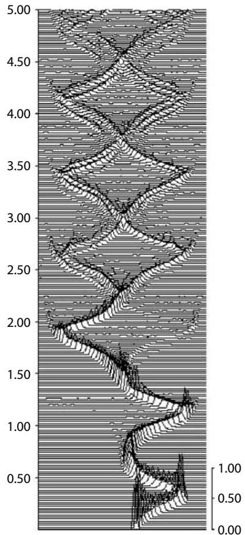
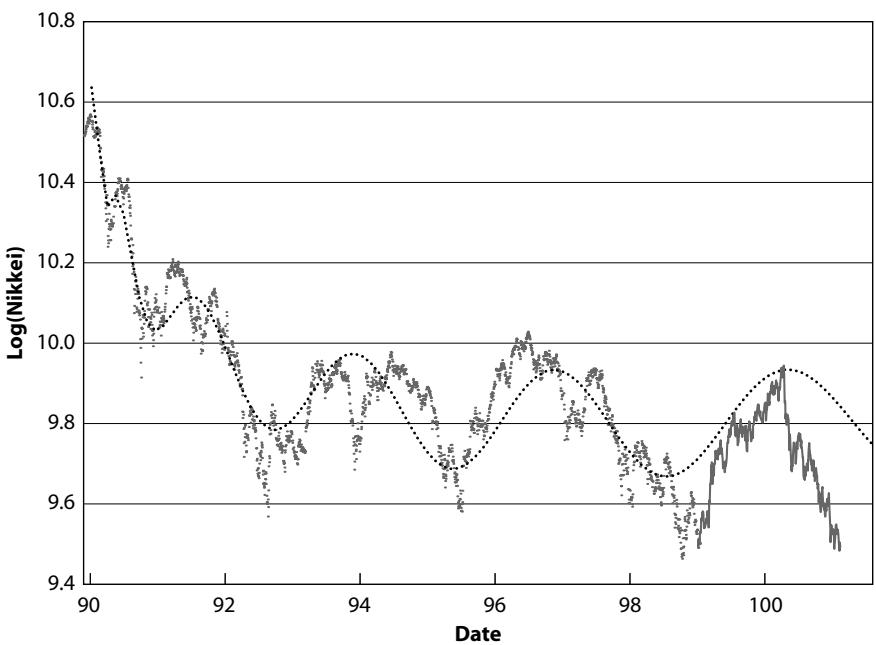

# Chapter 9 prediction of bubbles, crashes, and antibubbles

## THE NATURE OF PREDICTIONS

The time arrow is inexorably projecting us towards the undetermined future. Predicting the future captures the imagination of all and is perhaps the greatest challenge. “Prophets” have historically terrified or inspired the masses by their visions of the future. Until recently, science has mostly avoided this question by focusing on another kind of prediction, that of novel phenomena such as the prediction by Einstein of the deviation of light by the sun’s gravitation field, the prediction of the elusive particles called neutrinos by Pauli, and the prediction of the intermediate bosons within the electroweak theory by Weinberg and Salam, to cite just a few examples. Scientifically based predictions of the future, typically using computerized mathematical models, is a more recent phenomenon which is becoming pervasive in a modern society trying to control its environment and mitigate risks. In the real world, efforts to predict are frustrated because scientists have not nailed down all the physical workings and because a substantial measure of uncertainty remains in the characterization of the system, present and future. The result is a considerable range of uncertainty. Therefore, while mathematical modeling and computer simulations made reasonable predictions possible, they are always uncertain; results are, by definition, a model of reality, not reality itself.

Predictions of trend-reversals, changes of regime, or “ruptures” is extraordinarily difficult and unreliable in essentially all real-life domains of applications, such as economics, finance, weather, and climate. It is possibly the most difficult challenge and arguably the most interesting and useful. The two known strategies for modeling, namely analytical theories and brute-force numerical simulations of resulting large algebraic systems, are both unable to offer effective solutions for most concrete problems. Simulation studies of ruptures suffer from numerous sources of error, including model mispecifications and inaccurate numerical representation of the mathematical models, which are especially important for rare extreme events [232].

The following example borrowed from the field of climatology illustrates the point. In view of the growing concensus on global warming, it is instructive to remember that in the 1970s there was growing concern among scientists that the earth was cooling down and might enter a new ice-age similar to the previous little 1400–1800 ice age or even worse [61, 368, 429, 155]! Now that global warming is almost universally recognized, we can appreciate in hindsight how short-sighted was this “prediction.” The situation is essentially the same nowadays: estimations of future modest changes of economic growth rates are rather good, but predictions of strong recessions and of crashes are utterly unreliable most of the time. For instance, the almost overwhelming concensus on the reality and magnitude of global warming is based on a clear trend over the twentieth century that has finally emerged above the uncertainty level. We stress that this concensus is not based on the prediction of a reversal or regime switch. In other words, scientists are good at recognizing a trend once already deeply immersed in it: we needed a century of data to extract a clear signal of a trend on global warming. In contrast, the techniques presently available to scientists are bad at predicting most changes of regime.

In economics and finance, the situation may be even worse, as the people’s expectation of the future, their greediness, and their fear intertwine to construct the indeterminate future. On this question of prediction, Federal Reserve Chairman Alan Greenspan [177] said: “Learn everything you can, collect all the data, crunch all the numbers before making a prediction or a financial forecast. Even then, accept and understand that nobody can predict the future when people are involved. Human behavior hasn’t changed; people are unpredictable. If you’re wrong, correct your mistake and move on.” The fuzziness resulting from the role of the expectation and discount of the future on present investor decisions may be captured by another famous quote from Greenspan before the Senate Banking Committee, June 20, 1995: “If I say something which you understand fully in this regard, I probably made a mistake.”

Uncertainty in predictions is inherent in the complexity of the task. Nevertheless, predictions are useful. For instance, weather forecasts retain a large degree of uncertainty. Nevertheless, they are useful because they are better than pure chance once users know their shortcomings and take those into consideration. Predictions can be compared with observations and corrected for new improved predictions, a process called assimilation of data into the forecast. It is thus essential to use “error bars” and quantify uncertainties associated with any given prediction: hard numbers on predictions are misleading; only their probability distribution of success carries the relevant information. The flood of Grand Forks, ND, by the Red River of the North is a case in point. When it was rising to record levels in the spring of 1997, citizens and officials relied on scientists’ predictions about how high the water would rise. A 49-foot forecast lulled the town into a false sense of security, because more precision was assigned to the forecast than was warranted. Actually, there was a wider range of probabilities; the river ultimately crested at 54 feet, forcing 50,000 people to abandon their homes fast. Had the full range of scenarios and probabilities been appreciated by the citizens, countermeasures could probably have been taken, allowing more people to preserve their possessions. The important message here is that the 49-foot forecast was not necessarily wrong. The possible deviations from this best guess were sorely missing. A probabilistic forecast allowing for at least two scenarios would have been much more instructive. It could have been phrased, for instance, as “there is a 50% probability that the river will crest at a level no larger than 49 foot and a 90% probability that the river will crest at a level no larger than 52 foot.” Note that the first part of this statement carries the same information about the best guess (in the median sense) of the crest, while the second part provides a quantification of the uncertainty. With that, it is then possible in principle to weigh the cost of mitigation measures to respond to any given fluctuations from the best guess. The message here is to keep in mind the coexistence of several possible scenarios (and not of a best one or an average one) with their associated estimated likelihood.

The importance of working with several scenarios is illustrated in Figure 9.1, which represents the evolution of an ensemble of trajectories obeying a set of equations (now called the Lorenz system) proposed by the meteorologist Lorenz [270] as a parody of atmospheric dynamics.

  
Fig. 9.1. Evolution of the probability density function represented in perspective for the variable v in a perfect ensemble under the Lorenz equations, which provide a simplified model of atmospheric dynamics. The variable v is plotted along the horizontal axis such that the center of symmetry is the initial condition. Time t is plotted along the vertical. As time increases (upwards), the initially sharp distribution at $t = 0$ decays and widens, but then shows true return of skill (at $t = 0 . 4 )$ by growing and sharpening. Later, the distribution bifurcates in two branches: the variable v is either largely above or below the initial value, while an average prediction predicts a value at the center, which in reality is almost never observed. This illustrates the fundamental limits of forecasts based on one representative value. Reproduced from [388].

Note that the study of this system was instrumental in the development of the theory of chaos in the 1970s and 1980s. The horizontal axis represents the proxy for a meteorological variable, say wind velocity v. The vertical axis is time, which goes from 0 to 5 in this plot. For each time, the third dimension in perspective shows the probability distribution of the wind velocity v: the maximum of the initial bell-shape distribution corresponds to the best initial guess of what is the present state of the system. The width of the bell-shape curve quantifies the initial uncertainty of our observations: we perform an initial measurement of the wind velocity and we know that any measure has some uncertainty, here quantified by the probability that the true initial condition deviates from the best estimate corresponding to the peak. To evolve this distribution, each of 4,096 initial conditions chosen at random is evolved according to the Lorenz equations of motion. Each of the 4,096 initial conditions thus defines a possible trajectory. At each time of interest, the value of v for each trajectory is measured and the aggregation of the 4,096 measures provides the statistics to construct the distribution of v. At early times, the distribution spreads out: notice that the peak decreases in amplitude and the distribution widens. This reflects an increasing uncertainty in the value of v after some time and thus a loss of prediction skill. Up to time $t = 1 . 5$ , we observe alternative deterioration and improvement of prediction skill, as the distribution function widens and sharpens again periodically. This is the first rather nonintuitive lesson: regions of decreasing uncertainty may exist in a chaotic dynamics [388]. Increasing the forecast horizon does not always lead to a degradation of the prediction, in contrast to standard views on chaotic dynamics. Beyond t 1.5, the distribution function bifurcates into two separate branches. At $t = 2 . 5$ , it is clear that the velocity will have either a large positive or large negative deviation from the initial value, yet the optimal prediction made by averaging over all possible trajectories is close to the initial value. This is a fundamental shortcoming of such standard forecasting techniques for nonlinear systems [388]. It underscores the importance of thinking in terms of distributions or ensembles of scenarios, as opposed to a mean, an average, a median, or a representative forecast. At time $t = 2 . 5$ , no single trajectory is a reliable representative of the complexity of the dynamics. Because of the structure of the dynamics in this example, as least two leading scenarios must be envisaged.

Thinking of predictions as intrinsically linked to their associated uncertainty is even more important when taking into account the combination of observational uncertainty and model error. Model error refers to the fact that, in general, we do not know the exact equations of the dynamics of the system we are interested in forecasting. We have only an approximate understanding of its complexity, and the models used for prediction by force capture only a part of all ingredients. This model error obviously places severe limits on what we can say about the future of a system. Working with an ensemble of trajectories for each model belonging to an ensemble of models is advocated as one way to mitigate these fundamental limitations [386].

We describe below how these ideas can be put into concrete form for the prediction of financial crashes. The different models will correspond to different implementations of the theory of critical points with log-periodic power laws. Different scenarios will be generated for each model by the different solutions obtained by the fitting procedure.

## HOW TO DEVELOP AND INTERPRET STATISTICAL TESTS OF LOG-PERIODICITY

Before studying the issue of prediction, the question of a possible selection bias of the fitted financial time series presented in chapters 7 and 8 must be addressed. By selecting time windows on the basis of the existence of (1) a change of regime and acceleration of the market price and of (2) a crash or large correction at their end, we may have pruned the data so that, by chance alone, the fits with the log-periodic power law formula may have been qualified. This issue has to be raised each time a pattern is proposed as an indicator with some predictive skill. There is a fundamental mathematical reason for this: the English mathematician F. P. Ramsey proved that complete disorder is an impossibility [173, 172]. Every large set of numbers, such as an ensemble of financial price series or points or objects, necessarily contains highly regular patterns. For instance, the night sky appears to be filled with constellations in the shape of straight lines, rectangles and pentagons, which bear suggestive names such as the lion, the bull, or the scorpion, given by ancient astronomers. Could it be that such geometric patterns arise from unknown forces in the cosmos? In 1928, Ramsey proved that such patterns are implicit in any large structure. Given enough stars, one can always find a group that very nearly forms a particular pattern. Given a sufficiently long series of numbers, you will find any pattern in it, such as your birthdate or any other number of special interest to you. Intuitively, the argument underlying this theorem is that if it was not the case that any pattern could be approximately found in a random set, this set would not be really random. Randomness is such that any pattern can occur.

The relevant question is, then, to figure out just how many stars, numbers, or figures are required to guarantee a certain desired pattern. In other words, how probable is it to observe a desired substructure in a given set? Answering this question is the domain of statistics and its economic application, econometrics. If one can show that the number of stars needed to obtain a particular pattern is not much larger than the observed number, we can ask with reason whether this particular pattern may not result from chance alone in this particular set. This is the essence of the method of statistical hypothesis testing which constructs so-called “statistical confidence levels”: if the confidence level of a phenomenon is, say, 99%, this means that there is only a remote probability of 1 in 100 that the phenomenon in question is due to chance.

In the present context, we first refer to the computer experiment summarized in the section titled “The Slow Crash of 1962 Ending the ‘Tronics’ Boom” of chapter 7, in which fifty 400-week intervals in the period 1910–1996 of the DJIA were chosen at random [209]. This experiment shows that fits, which in terms of the fitting parameters correspond to the three crashes of 1929, 1962, and 1987, are not likely to occur “accidentally.” Feigenbaum and Freund have also looked at randomly selected time widows in the real data and generally found no evidence of logperiodicity in these windows unless they were looking at a time period in which a crash was imminent [128]. More recently, Feigenbaum has examined the first differences for the logarithm of the S&P 500 from 1980 to 1987 and finds that he cannot reject the log-periodic component at the 95% confidence level [127]: in plain words, this means that the probability that the log-periodic component results from chance is about or less than one in twenty.

To test furthermore the solidity of the advanced log-periodic hypothesis, Johansen, Ledoit, and I [209] tested whether the null hypothesis that a standard statistical model of financial markets, called the GARCH(1,1) model with Student-distributed noise, could “explain” the presence of log-periodicity. In the 1,000 surrogate data sets of length 400 weeks generated using this GARCH(1,1) model with Student-distributed noise and analyzed as for the real crashes, only two 400-week windows qualified. This result corresponds to a confidence level of 99.8% for rejecting the hypothesis that GARCH(1,1) with Student-distributed noise can generate meaningful log-periodicity. There is no reference to a crash; the question is solely to test if log-periodicity of the strength observed before the 1929 and 1987 crashes can be generated by one of the standard benchmarks of financial time series used intensively by both academics and practitioners. If in addition, we add that the two spells of significant log-periodicity generated in the simulations using GARCH(1,1) with Student-distributed noise were not followed by crashes, then the case is even stronger for concluding that real markets exhibit behaviors that are dramatically different from the one predicted by one of the most fundamental benchmarks of the industry. Indeed, the frequency of crashes in the Monte Carlo simulations was much smaller than the frequency of crashes in real data: if one of the most frequently used benchmarks of the industry is incapable of reproducing the observed frequency of crashes, this indeed means that there is something to explain that may require new concepts and methods.

We should stress, however, that no truth is ever demonstrated in science; the only thing that can be done is to construct models and reject them at a given level of statistical significance. Those models that are not rejected when pitted against more and more data progressively acquire the status of theory (think, for instance, of quantum mechanics, which is repeatedly put to tests). In the present context, it is clear that, in a purist sense, we shall never be able to “prove” the existence of a logperiodicity genuinely associated with specific market mechanisms. The next best thing we can do is to take one by one the best benchmarks of the industry and test them to see if they can generate the same structures as we document. It would, of course, be interesting to test more sophisticated models in the same way as for the GARCH(1,1) model with Student-distributed noise. However, we caution that rejecting one model after another will never prove that log-periodicity exists. This is outside the realm of statistical and econometric analysis. If more and more models are unable to “explain” the observed log-periodicity, this means, however, that log-periodicity is an important fact that needs to be understood.

Another worry is that integrated processes, like a random walk which sums up random innovations over time, can generate log-periodic patterns from pure chance. Actually, Huang et al. [203] specifically tested the following problem: Under what circumstances can an integrated process produce spurious log-periodicity? The answer obtained after lengthy and thorough Monte Carlo tests is twofold. (1) For approximately regularly sampled time series, as in the case of the financial time series, taking the integral of a noisy log-periodic function destroys the logperiodic signal! (2) Only when sampling rates increase exponentially or as a power law of $t_{c} - t$ can spurious log-periodicity in integrated processes be observed. The name “Monte Carlo” refers to the notion that random (as in a casino) series with prescribed properties are used to test the probability that a given pattern can occur by chance: if this probability is very small, the corresponding pattern is probably not due to chance. The consequence is that it may result from a causal set of effects that can be understood and used.

Ultimately, only forward predictions can demonstrate the usefulness of a theory (see the section below titled “Forward Predictions”), thus only time will tell. However, as we have suggested by the many examples reported in chapters 7 and 8 and from the discussion offered below, the analysis points to an interesting predictive potential. However, a fundamental question concerns the use of a reliable crash prediction scheme, if any. Assume that a crash prediction is issued stating that a crash of an amplitude between 20% and 30% will occur between one and two months from now. At least three different scenarios are possible [217]:

Nobody believes the prediction, which was then futile, and, assuming that the prediction was correct, the market crashes. One may consider this as a victory for the “predictors” but as we have experienced in relation to our quantitative prediction of the change in regime of the Nikkei index [213, 216], this would only be considered by some critics just another “lucky one” without any statistical significance (see the section below entitled “Estimation of the Statistical Significance of the Forward Predictions” [216] and below for an alternative Bayesian approach).

Everybody believes the warning, which causes panic, and the market crashes as consequence. The prediction hence seems self-fulfilling and the success is attributed more to the panic effect than to real predictive power.

Sufficiently many investors believe that the prediction may be correct, investors make reasonable adjustments, and the steam goes off the bubble. The prediction hence disproves itself.

None of these scenarios is attractive. In the first two, the crash is not avoided, and in the last scenario the prediction disproves itself and as a consequence the theory looks unreliable. This seems to be the inescapable lot of scientific investigations of systems with learning and reflective abilities, in contrast with the usual inanimate and unchanging physical laws of nature. Furthermore, this touches upon the key problem of scientific responsibility. Naturally, scientists have a responsibility to publish their findings. However, when it comes to the practical implementation of those findings in society, the question becomes considerably more complex, as history has taught us. We believe, however, that increased awareness of the potential for market instabilities, offered in particular by our approach, will help in constructing a more stable and efficient stock market.

## FIRST GUIDELINES FOR PREDICTION

Time is converted into decimal year units: for nonleap years, 365 days 1.00 year, which leads to 1 day = 0.00274 years. Thus 0.01 year 3.65 days and 0.1 year 36.5 days or 5 weeks. For example, October 19, 1987 corresponds to 87.800.

## What Is the Predictive Power of Equation (15) on Page 232?

Table 9.1 presents a summary of equation (15)’s predictive power for the 1929, 1987, and 1998 crashes on Wall Street and the 1987, 1994, and 1997 crashes on the Hong Kong stock exchange as well as the collapse of the U.S. dollar in 1985 and the crash on the Nasdaq in April 2000, all cases previously discussed in chapter 7.

We see that, in all nine cases, the market crash started at a time between the date of the last point and the predicted $t_{c} .$ . And with the exception of the October 1929 crash, in all cases the market ended its decline less than approximately one month after the predicted $t_{c}$ . These results suggest that predictions of crashes with equation (15) is indeed possible.

Table 9.1

<table><tr><td>Crash</td><td> $t_c$ </td><td> $t_{max}$ </td><td> $t_{min}$ </td><td>% drop</td><td> $m_2$ </td><td>ω</td><td>λ</td></tr><tr><td>1929 (DJ)</td><td>30.22</td><td>29.65</td><td>29.87</td><td>47%</td><td>0.45</td><td>7.9</td><td>2.2</td></tr><tr><td>1985 (DM)</td><td>85.20</td><td>85.15</td><td>85.30</td><td>14%</td><td>0.28</td><td>6.0</td><td>2.8</td></tr><tr><td>1985 (CHF)</td><td>85.19</td><td>85.18</td><td>85.30</td><td>15%</td><td>0.36</td><td>5.2</td><td>3.4</td></tr><tr><td>1987 (S&amp;P)</td><td>87.74</td><td>87.65</td><td>87.80</td><td>30%</td><td>0.33</td><td>7.4</td><td>2.3</td></tr><tr><td>1987 (HK)</td><td>87.84</td><td>87.75</td><td>87.85</td><td>50%</td><td>0.29</td><td>5.6</td><td>3.1</td></tr><tr><td>1994 (HK)</td><td>94.02</td><td>94.01</td><td>94.04</td><td>17%</td><td>0.12</td><td>6.3</td><td>2.7</td></tr><tr><td>1997 (HK)</td><td>97.74</td><td>97.60</td><td>97.82</td><td>42%</td><td>0.34</td><td>7.5</td><td>2.3</td></tr><tr><td>1998 (S&amp;P)</td><td>98.72</td><td>98.55</td><td>98.67</td><td>19.4%</td><td>0.60</td><td>6.4</td><td>2.7</td></tr><tr><td>1999 (IBM)</td><td>99.56</td><td>99.53</td><td>99.81</td><td>34%</td><td>0.24</td><td>5.2</td><td>3.4</td></tr><tr><td>2000 (P&amp;G)</td><td>00.04</td><td>00.04</td><td>00.19</td><td>54%</td><td>0.35</td><td>6.6</td><td>2.6</td></tr><tr><td>2000 (Nasdaq)</td><td>00.34</td><td>00.22</td><td>00.29</td><td>37%</td><td>0.27</td><td>7.0</td><td>2.4</td></tr></table>

$t_{c}$ is the critical time predicted from the fit of the financial time series to the equation (15). The other parameters $m_{2} , \omega ,$ and λ of the fit are also shown. The fit is performed up to the time $t_{m a x}$ at which the market index achieved its highest maximum before the crash. $t_{m i n}$ is the time of the lowest point of the market before rebound. The percentage drop is calculated from the total loss from $t_{m a x}$ to $t_{m i n}$ . Several of these crashes have also been listed in Table 7.2. Reproduced from [218].

## How Long Prior to a Crash Can One Identify the Log-Periodic Signatures?

Not only would one like to predict future crashes, but it is important to further test how robust the results are. Obviously, if the log-periodic structure of the data is purely accidental, then the parameter values obtained should depend heavily on the size of the time interval used in the fitting. The systematic testing procedure reported in [209] using a second-order expansion of the crash hazard rate [397] and a time interval of eight years prior to the two crashes of 1929 and 1987 consists in the following.

For each of these two crashes, the time interval used in the fitting has been truncated by removing points and relaunching the fitting procedure for each truncated data set. Specifically, the logarithm of the S&P 500 was truncated down to an end-date of approximately 1985 and fitted. Then, 0.16 years was added consecutively and the fitting was relaunched until the full time interval was recovered. Table 9.2 reports the number of minima obtained for the different time intervals. This number is to some extent rather arbitrary since it naturally depends on the number of points used in the preliminary scan as well as the size of the time interval used for $t_{c}$ . Specifically, 40,000 points were used and the search on $t_{c}$ was chosen in the interval from 0.1 years from the last data point used to 3 years forward. What is more interesting is the number of solutions of these fits (each “solution” corresponds to a minimum of the error between the data and the theoretical function) with reasonable parameters referred to as “physical” especially for the values of $t_{c} , m_{2} , \omega$ , and $\Delta_{t} ,$ where $\Delta_{t}$ is an additional time parameter quantifying the size of the critical region. The general picture to be extracted from this Table 9.2 is that a year or more before the crash, the data is not sufficient to give any conclusive results at all. This point corresponds to the end of the fourth oscillation. Approximately a year before the crash, the fit begins to lock in on the date of the crash with increasing precision. In fact, in four of the last five time intervals, a fit exists with a $t_{c}$ , which differs from the true date of the crash by only a few weeks.

In order to better investigate this, Table 9.3 shows the corresponding parameter values for the other three pertinent variables $m_{2} , \omega ,$ , and $\Delta_{t}$ The scenario resembles that for $t_{c}$ . This suggests that the fitting procedure of [397] is rather robust up to approximately one year prior to the crash. However, if one wants to actually predict the time of the crash, a major obstacle is the fact that the fitting procedure produces several possible dates for the date of the crash, even for the last data set.

Table 9.2  
Number of minima obtained by fitting different truncated versions of the S&P 500 time series shown in Figure 7.2 to predict the October 1987 crash using the procedure described in the text. Note that the predicted times for the crash are progressively postponed as the end-date increases. However, the correct time is identified early (in hindsight) and is recurrent in the set of solutions as the end-date increases. Reproduced from [397]

<table><tr><td>End-date</td><td>Total # minima</td><td>“Physical” minima</td><td> $t_c$ of “physical” minima</td></tr><tr><td>85.00</td><td>33</td><td>1</td><td>86.52</td></tr><tr><td>85.14</td><td>25</td><td>4</td><td>4 in [86.7 : 86.8]</td></tr><tr><td>85.30</td><td>26</td><td>7</td><td>5 in [86.5 : 87.0], 2 in [87.4 : 87.6]</td></tr><tr><td>85.46</td><td>29</td><td>8</td><td>7 in [86.6 : 86.9],1 with 87.22</td></tr><tr><td>85.62</td><td>26</td><td>13</td><td>12 in [86.8 : 87.1],1 with 87.65</td></tr><tr><td>85.78</td><td>23</td><td>7</td><td>87.48, 5 in [87.0 - 87.25], 87.68</td></tr><tr><td>85.93</td><td>17</td><td>4</td><td>87.25, 87.01, 87.34, 86.80</td></tr><tr><td>86.09</td><td>18</td><td>4</td><td>87.29, 87.01, 86, 98, 87.23</td></tr><tr><td>86.26</td><td>28</td><td>7</td><td>5 in [87.2 : 87.4], 86.93, 86.91,</td></tr><tr><td>86.41</td><td>24</td><td>4</td><td>87.26, 87.36, 87.87, 87.48</td></tr><tr><td>86.57</td><td>20</td><td>2</td><td>87.67, 87.34</td></tr><tr><td>86.73</td><td>28</td><td>7</td><td>4 in [86.8 : 87.0], 87.37, 87.79, 87.89</td></tr><tr><td>86.88</td><td>22</td><td>1</td><td>87.79</td></tr><tr><td>87.04</td><td>18</td><td>2</td><td>87.68, 88.35</td></tr><tr><td>87.20</td><td>15</td><td>2</td><td>87.79, 88.03</td></tr><tr><td>87.36</td><td>15</td><td>2</td><td>88.19, 88.30</td></tr><tr><td>87.52</td><td>14</td><td>3</td><td>88.49, 87.92, 88.10</td></tr><tr><td>87.65</td><td>15</td><td>3</td><td>87.81, 88.08, 88.04</td></tr></table>

Table 9.3

<table><tr><td>End-date</td><td> $t_c$ </td><td> $m_2$ </td><td>ω</td><td> $Δ_t$ </td></tr><tr><td>86.88</td><td>87.79</td><td>0.66</td><td>5.4</td><td>7.8</td></tr><tr><td>87.04</td><td>87.68, 88.35</td><td>0.61, 0.77</td><td>4.1, 13.6</td><td>12.3, 10.2</td></tr><tr><td>87.20</td><td>87.79, 88.03</td><td>0.76, 0.77</td><td>9.4, 11.0</td><td>10.0, 9.6</td></tr><tr><td>87.36</td><td>88.19, 88.30</td><td>0.66, 0.79</td><td>7.3, 12.2</td><td>7.9, 8.1</td></tr><tr><td>87.52</td><td>88.49, 87.92, 88.10</td><td>0.51, 0.71, 0.65</td><td>12.3, 9.6, 10.3</td><td>10.2, 9.8, 9.8</td></tr><tr><td>87.65</td><td>87.81, 88.08, 88.04</td><td>0.68, 0.69, 0.67</td><td>8.9, 10.4, 10.1</td><td>10.8, 9.7, 10.2</td></tr></table>

For the last five time intervals shown in Table 9.2, the corresponding parameter values for the other three variables $m_{2} , \omega , \Delta_{t}$ are shown. Reproduced from [397].

Table 9.4  
The average of the values listed in Table 9.3. Reproduced from [397].

<table><tr><td>End-date</td><td> $t_c$ </td><td> $m_2$ </td><td> $\omega$ </td><td> $\Delta_t$ </td></tr><tr><td>86.88</td><td>87.79</td><td>0.66</td><td>5.4</td><td>7.8</td></tr><tr><td>87.04</td><td>88.02</td><td>0.69</td><td>8.6</td><td>11.3</td></tr><tr><td>87.20</td><td>87.91</td><td>0.77</td><td>10.20</td><td>9.8</td></tr><tr><td>87.36</td><td>88.25</td><td>0.73</td><td>9.6</td><td>8.0</td></tr><tr><td>87.52</td><td>88.17</td><td>0.62</td><td>10.7</td><td>9.9</td></tr><tr><td>87.65</td><td>87.98</td><td>0.68</td><td>9.8</td><td>10.2</td></tr></table>

As a naive solution to this problem, Table 9.4 shows the average of the different minima for $t_{c} , m_{2} , \omega$ , and $\Delta_{t}$ . The values for $m_{2}$ , $\omega$, and $\Delta_{t}$ are within 20% of those for the best prediction, but the prediction for $t_{c}$ has not improved significantly. The reason for this is that the fit in general “overshoots” the true day of the crash. This overshooting is consistent with the rational expectation models of a bubble and crash described in chapter 5. Indeed, the critical time $t_{c}$ is not the time of the crash but only its most probable value, that is, the time for which the asymmetric distribution of the possible times of the crash peaks. The occurrence of the crash is a biased random phenomenon which occurs with a probability that increases as time approaches $t_{c}$ . Thus, we expect that fits will give values of $t_{c}$ which are in general close to but systematically later than the real time of the crash: the critical time $t_{c}$ is included in the log-periodic power law structure of the bubble, whereas the crash is randomly triggered with a biased probability increasing strongly close to $t_{c}$

The same procedure was used on the logarithm of the Dow Jones index prior to the crash of 1929 shown in Figure 7.7 and the results are shown in Tables 9.5, 9.6, and 9.7. One has to wait until approximately four months before the crash before the fit locks in on the date of the crash, but from that point the picture is the same as for the crash in 1987. The reason for the fact that the fit “locks-in” at a later time for the 1929 is obviously the difference in the transition time $\Delta_{t}$ for the two crashes which means that the index prior to the crash of 1929 exhibits fewer distinct oscillations.

Feigenbaum [127] has recently confirmed that, for the October 1987 crash, “excluding the last year of data, the log-periodic component is no longer statistically significant.” This should not be a surprise for specialists of critical phenomena, and it is naive to expect otherwise. The determination of a power law $B_{2} ( t_{c} - t ) ^{m_{2}}$ is indeed very sensitive to noise and to the distance from $t_{c}$ of the data used in the estimation. This is well known by experimentalists and numerical scientists working on critical phenomena who have invested considerable efforts in developing reliable experiments that could probe the system as closely as possible to the critical point $t_{c}$ , in order to get reliable estimations of $t_{c}$ and $m_{2}$ A typical rule of thumb is that an error of less than 1% in the determination of $t_{c}$ can lead to tenth-of-a-percent errors in the estimation of the critical exponent $m_{2}$ . While the situation is improved by the addition of the log-periodic component because the fit can lock in on the oscillations, the problem remains qualitatively the same. Being one year before the critical time corresponds to the situation in which a worker on critical phenomena would be trying to get a reliable estimation of $t_{c}$ and $m_{2}$ by trashing the last 15% of the data, which are of course the most relevant—an almost impossible task in general.

Table 9.5  
Same as Table 9.2 for the October 1929 crash. Reproduced from [397].

<table><tr><td>End-date</td><td>Total # minima</td><td>“Physical” minima</td><td> $t_c$  of “physical” minima</td></tr><tr><td>27.37</td><td>12</td><td>1</td><td>31.08</td></tr><tr><td>27.56</td><td>14</td><td>2</td><td>30.44, 30.85</td></tr><tr><td>27.75</td><td>24</td><td>1</td><td>30.34</td></tr><tr><td>27.94</td><td>21</td><td>1</td><td>31.37</td></tr><tr><td>28.13</td><td>21</td><td>4</td><td>29.85, 30.75, 30.72, 30.50</td></tr><tr><td>28.35</td><td>23</td><td>4</td><td>30.29, 30.47, 30.50, 36.50</td></tr><tr><td>28.52</td><td>18</td><td>1</td><td>31.3</td></tr><tr><td>28.70</td><td>18</td><td>1</td><td>31.02</td></tr><tr><td>28.90</td><td>16</td><td>4</td><td>30.40, 30.72, 31.07, 30.94</td></tr><tr><td>29.09</td><td>19</td><td>2</td><td>30.52, 30.35</td></tr><tr><td>29.28</td><td>33</td><td>1</td><td>30.61</td></tr><tr><td>29.47</td><td>24</td><td>3</td><td>29.91, 30.1, 29.82</td></tr><tr><td>29.67</td><td>23</td><td>1</td><td>29.87</td></tr></table>

Table 9.6  
Same as Table 9.3 for the October 1929 crash. Reproduced from [397].

<table><tr><td>End-date</td><td> $t_c$ </td><td> $m_2$ </td><td>ω</td><td> $Δ_t$ </td></tr><tr><td>28.90</td><td>30.40, 30.72,31.07, 30.94</td><td>0.60, 0.70,0.70, 0.53</td><td>7.0, 7.6,10.2, 13.7</td><td>12.3, 9.5,9.0, 11.6</td></tr><tr><td>29.09</td><td>30.52, 30.35</td><td>0.54, 0.62</td><td>11.0, 7.8</td><td>12.6, 10.2</td></tr><tr><td>29.28</td><td>30.61</td><td>0.63</td><td>9.5</td><td>9.5</td></tr><tr><td>29.47</td><td>29.91, 30.1, 29.82</td><td>0.60, 0.67, 0.69</td><td>5.8, 6.2, 4.5</td><td>15.9, 11.0, 10.9</td></tr><tr><td>29.67</td><td>29.87</td><td>0.61</td><td>5.4</td><td>15.0</td></tr></table>

Table 9.7  
The average of the values listed in Table 9.6. Reproduced from [397].

<table><tr><td>End-date</td><td> $t_c$ </td><td> $m_2$ </td><td>ω</td><td> $Δ_t$ </td></tr><tr><td>28.90</td><td>30.78</td><td>0.63</td><td>9.6</td><td>10.6</td></tr><tr><td>29.09</td><td>30.44</td><td>0.58</td><td>9.4</td><td>11.4</td></tr><tr><td>29.28</td><td>30.61</td><td>0.63</td><td>9.5</td><td>9.5</td></tr><tr><td>29.47</td><td>29.94</td><td>0.65</td><td>5.5</td><td>12.6</td></tr><tr><td>29.67</td><td>29.87</td><td>0.61</td><td>5.4</td><td>15.0</td></tr></table>

We thus caution the reader that jumping into the prediction game may be hazardous and misleading: one deals with a delicate optimization problem that requires extensive backward and forward testing. Furthermore, the formulas discussed here are only “first-order” approximations, and novel improved methods have been developed that are not published. Finally, one must never forget that the crash has to remain in part a random event in order to exist! This is according to the rational expectation models described in chapter 5.

## A HIERARCHY OF PREDICTION SCHEMES

## The Simple Power Law

The concept that a crash is associated with a critical point suggests fitting a simple power law

$$
\log [ p (t) ] = A + B (t_{c} - t) ^{\beta}\tag{17}
$$

to the price or the logarithm of the price. A fit of the logarithm of the S&P 500 index before the October 87 crash gives $t_{c} = 87 . 65 , \beta = 0 . 72$ $\chi^{2} = 107 , A = 327$ , and $B = - 79$ when using data from 1985.7 to 1987.65. Note that the value of $t_{c}$ obtained from the fit is completely dominated by the last values used in the fit. The reason is that the information on $t_{c}$ is contained essentially in or is dominated by the acceleration in the last points. In contrast, the log-periodic structures contain the information on $t_{c}$ in their oscillations that develop much before $t_{c}$

All attempts to use this formula (17) for prediction have been unsuccessful, because it is virtually impossible to distinguish this law (17) from a noncritical exponential growth when data are noisy. A smooth increase like (17) is well known to constrain very poorly the time $t_{c}$ in noisy time series. This is why all our empirical efforts were focused on the log-periodic formulas.

## The “Linear” Log-Periodic Formula

We rewrite here the equation (15) that was used before for fitting the price of a financial time series in terms of the logarithm of the price:

$$
\log [ p (t) ] = A + B \left(t_{c} - t\right) ^{\beta} \left\{1 + C \cos \left[ \omega \log \left(t_{c} - t\right) + \phi \right] \right\}.\tag{18}
$$

It turns out that, for time scales of about two years or less, the amplitude of the price variation in such periods is not large enough for detecting a significant difference between the goodness-of-fit of the fits of $p ( t )$ and of $\log [ p ( t ) ]$

For practical implementation of the fit of such a formula to a financial time series, it is important to stress that the variables A, B, and C enter linearly once the other four variables $t_{c} , \ \beta , \ \omega$ , and $\phi$ are fixed. The best procedure is to determine them analytically through so-called least squares minimization and to plug them into the objective function to derive a concentrated objective function that depends only on $t_{c} , \beta ,$ $\omega$, and $\phi$

Due to the noisy nature of the data and the fact that we are performing a highly nonlinear four-parameter fit, there are several local minima. The best strategy is to perform a first grid search and then start an optimizer (for instance the Levenberg–Marquardt) from all the local optima of the grid. The best of the resulting convergence points is taken as the global optimum.

A priori restrictions are imposed on parameter values, which ensure that they are plausible. The exponent $\beta$ needs to be between 0 and 1 for the price to accelerate and to remain finite. The more stringent criterion $0 . 2 < \beta < 0 . 8$ has been found useful to avoid the pathologies associated with the endpoints 0 and 1 of the interval. Recall that the angular log-periodic frequency $\omega$ determines the ratio $\lambda$ of successive time intervals between local maxima through the following relationship: $\lambda = e^{2 \pi / \omega}$ . Experience across many disciplines and some theoretical arguments [392] suggest that this ratio $\lambda$ should typically lie in the range 2–3. In practice, we have often used the constraint $5 < \omega < 15$ , which corresponds to $1 . 5 < \lambda < 3 . 5$ . Obviously, $t_{c}$ must be greater than the last date in the sample data being fitted. The phase $\phi$ cannot be meaningfully restricted.

## The “Nonlinear” Log-Periodic Formula

The nonlinear log-periodic formula used to fit the longest financial time series discussed in chapters 7 and 8 is [397]

$$
\begin{array}{c} \log [ p (t) ] = A + B \frac{(t_{c} - t) ^{\beta}}{\sqrt{1 + \left(\frac{t_{c} - t}{\Delta_{t}}\right) ^{2 \beta}}} \bigg \{1 + C \cos \bigg [ \omega \log (t_{c} - t) \\ + \frac{\Delta_{\omega}}{2 \beta} \log \bigg (1 + \left(\frac{t_{c} - t}{\Delta_{t}}\right) ^{2 \beta} \bigg) \bigg ] \bigg \}. \end{array}\tag{19}
$$

Using the same least-squares method as for the linear log-periodic formula allows one to concentrate away the linear variables A, B, and C and form an objective function depending only on $t_{c} , \beta$ , $\omega$, and $\phi$ as before, with the addition of two parameters $\Delta_{t}$ and $\Delta_{\omega}$ . Since $\Delta_{t}$ is a transition time between two regimes, this transition should be observed in the data set, and therefore we require it to be between 1 and 20 years. As before, the nonlinearity of the objective function creates multiple local minima, and the preliminary grid search is used to find starting points for the optimizer.

## The Shank’s Transformation on a Hierarchy of Characteristic Times

The fundamental idea behind the appearance of log-periodicity is the existence of a hierarchy of characteristic scales. Reciprocally, any logperiodic pattern implies the existence of a hierarchy of characteristic time scales. This hierarchy of time scales is determined by the local positive maxima of the function such as log $\left[ p ( t ) \right]$ . They are given by

$$
t_{c} - t_{n} = \tau \lambda^{\frac{n}{2}},\tag{20}
$$

where

$$
\tau \propto \exp \left(- \frac{\log \lambda}{2 \pi} \tan^{- 1} \frac{2 \pi}{\beta \log \lambda}\right)\tag{21}
$$

with

$$
\lambda = e^{\frac{2 \pi}{\omega}}.\tag{22}
$$

The spacing between successive values of $t_{n}$ approaches zero as n becomes large and $t_{n}$ converges to $t_{c}$ . This hierarchy of scales $t_{c} - t_{n}$ is not universal but depends upon the specification of the system. What is expected to be universal are the ratios $\frac{t_{c} - t_{n+1}}{t_{c} - t_{n}} = \lambda^{1/2}$ . From three $t_{c} - t_{n}$ successive observed values of $t_{n}$ , say $t_{n} , ~ t_{n + 1}$ , and $t_{n + 2}$ , we have

$$
t_{c} = \frac{t_{n + 1} ^{2} - t_{n + 2} t_{n}}{2 t_{n + 1} - t_{n} - t_{n + 2}}.\tag{23}
$$

This relation applies the so-called Shanks transformation to accelerate the convergence of series. In the case of an exact geometrical series, three terms are enough to converge exactly to the asymptotic value $t_{c}$ . Notice that this relation is invariant with respect to an arbitrary translation in time. In addition, the next time $t_{n + 3}$ is predicted from the first three ones by

$$
t_{n + 3} = \frac{t_{n + 1} ^{2} + t_{n + 2} ^{2} - t_{n} t_{n + 2} - t_{n + 1} t_{n + 2}}{t_{n + 1} - t_{n}}.\tag{24}
$$

The weakness of this method lies in the identification of the characteristic times $t_{n} ^{\phantom{\dagger}} \mathbf{\bar{s}}$ which may be quite subjective.

## Application to the October 1929 Crash.

Looking at the Dow Jones index by eye, we can try to identify the “characteristic” times as those of the successive “coarse-grained” local maxima that form a geometrical series. We propose $t_{1} = 1926 . 3 , t_{2} = 1928 . 2$ , and $t_{3} = 1929 . 1$ . Inserting into (23), we get a prediction $t_{c} = 1929 . 91$ This prediction is less than a month off the true date. Notwithstanding this positive result, this method is rather unstable, as a change of one month or about 0.1 of one of these dates $t_{1} , t_{2} , t_{3}$ may move the predicted date by one month or more. This is why this can be no more than an indication that must be taken with a grain of salt. Compared to fitting with a complete mathematical formula, this method focuses only on specific times and thus loses what may be an important part of the information.

## Application to the October 1987 Crash.

Looking at the S&P 500 index, we identify the characteristic times as those of the successive coarse-grained local maxima that form a geometrical series. We find $t_{1} = 1986 . 5$ $t_{2} = 1987 . 2$ , and $t_{3} = 1987 . 5$ or 1987.55. Inserting into (23), we get the prediction $t_{c} = 87 . 725$ and 87.900, respectively. These predictions correctly bracket the true date, 87.800.

## FORWARD PREDICTIONS

As we said earlier, only forward predictions provide a reliable test, avoiding the many traps of statistical bias and data snooping.

We are now going to narrate the forward predictions that A. Johansen and the present author have made in the last few years. Specifically, we have examined a few of the major indices in real time, essentially continuously since 1996, and have tried to apply the methodology described before in order to predict a crash, a severe correction, or even a depression (called an antibubble in chapter 7). Here, the word “prediction” is taken with its full meaning, since the future was unknown at the time when each prediction was performed. The term “forward” prediction stresses this fact. In contrast, “post-dictions” or retroactive predictions are performed by artificially cutting a part of the most recent past in recorded time series to perform a prediction of this hidden past. Such post-dictions, which were described in the previous section, are very useful for testing the skills of a forecasting system by providing much faster a larger testing set than would be otherwise available by waiting for the future to confirm or disprove a given prediction. However, they never completely reproduce the real-time and real-life situations of forward predictions.

We report all cases, successes, and failures, so that the reader can judge for himself or herself. We report three successes (U.S. market August 1998, Nikkei Japanese market 1999, Nasdaq April 2000), two failures (U.S. market December 1997, Nasdaq October 1999), and one “semifailure” (U.S. market October 1997).

Of the successes, only the Nikkei 1999 prediction was publicly announced in advance and published. The two others (U.S. market

August 1998 and Nasdaq April 2000) were made about one month in advance but were not published.

The semifailure concerns the prediction of a crash on the U.S. market in October 1997 which was registered by an official agency about a month in advance. As we showed in chapter 7, this prediction may actually be counted as a semifailure or semisuccess depending on taste, since something did happen as far as investors and market commentators are concerned (the main U.S. market indices dropped about 7% in a day), as can be seen from the many available reports on this event, but it was not of sufficient magnitude to qualify as a crash, as the market quickly recovered. Other groups have also analyzed this event [129] and predicted it [433] with a similar log-periodic analysis.

## Successful Prediction of the Nikkei 1999 Antibubble

Following the general guidelines described above (see also [214]), a prediction was made public on January 25, 1999 by posting a preprint on the Los Alamos Internet server; see http://xxx.lanl.gov/abs/ cond-mat/9901268. The preprint was later published as [213]. The prediction stated that the Nikkei index should recover from its 14-year low (13,232.74 on January 5, 1999) and reach 20,500 a year later, corresponding to an increase in the index of 50%. This prediction was mentioned in a wide-circulation journal in physical sciences which appeared in May 1999 [413].

Specifically, based on a third-order “Landau” expansion generalizing the nonlinear log-periodic formula (19), the following formula was established:

$$
\begin{array}{l} \log (p (t)) \approx A^{\prime} + \frac{\tau^{\alpha}}{\sqrt{1 + \left(\frac{\tau}{\Delta_{t}}\right) ^{2 \alpha} + \left(\frac{\tau}{\Delta_{t} ^{\prime}}\right) ^{4 \alpha}}} \\ \qquad \times \bigg \{B^{\prime} + C^{\prime} \cos \bigg [ \omega \log \tau + \frac{\Delta_{\omega}}{2 \alpha} \log \bigg (1 + \left(\frac{\tau}{\Delta_{t}}\right) ^{2 \alpha} \bigg) \\ \qquad + \frac{\Delta_{\omega} ^{\prime}}{4 \alpha} \log \bigg (1 + \left(\frac{\tau}{\Delta_{t} ^{\prime}}\right) ^{4 \alpha} \bigg) + \phi \bigg ] \bigg \}, \end{array}\tag{25}
$$

describing the time evolution of the Nikkei index $p ( t )$ , where $\tau \equiv t - t_{c} ,$ and $t_{c} =$ December 31, 1989 is the time of the all-time high of the Nikkei index. Equation (25) was then fitted to the Nikkei index in the time interval from the beginning of 1990 to the end of 1998, that is, a total of nine years. Extending the curve beyond 1998 thus provided us with a quantitative prediction for the future evolution of the Nikkei. The original figure published in [213], which formed the basis for the prediction, is Figure 7.25 of chapter 7.

In Figure 9.2, the actual and predicted evolution of the Nikkei over 1999 and later are compared [216]. Not only did the Nikkei experience a trend reversal as predicted, but it has also followed the quantitative prediction with rather impressive precision. In particular, the prediction of the 50% increase at the end of 1999 is validated accurately. The prediction of another trend reversal is also accurately predicted, with the correct time for the reversal occuring at the beginning of 2000: the predicted maximum and the observed maximum match closely. It is important to note that the error between the curve and the data has not grown after the last point used in the fit over 1999. This tells us that the prediction has performed well for more than a year. Furthermore, since the relative error between the fit and the data is within 2% over a time period of ten years, not only has the prediction performed well, but so has the underlying model.

  
Fig. 9.2. Natural logarithm of the Nikkei stock market index after the start of the decline from January 1, 1990 until February 2001. The continuous smooth line is the extended nonlinear log-periodic formula (25), which was developed in [213] and is used to fit adequately the interval of 9 years starting from January 1, 1990. The Nikkei data is separated into two parts. The dots show the data used to perform the fit with formula (25) (dotted line) and to issue the prediction in January 1999 (see Figure 7.25). Its continuation as a continuous line gives the behavior of the Nikkei index after the prediction has been made. Reproduced from [216].

The fulfillment of this prediction is even more remarkable than the comparison between the curve and the data indicates, because it included a change of trend: at the time when the prediction was issued, the market was declining and showed no tendency to increase. Many economists were at that time very pessimistic and could not envision when Japan and its market would rebound. For instance, the well-known economist P. Krugman wrote on July 14, 1998, at the time of the banking scandal:

“The central problem with Japan right now is that there just is not enough demand to go around—that consumers and corporations are saving too much and borrowing too little. . . . So seizing these banks and putting them under more responsible management is, if anything, going to further reduce spending; it certainly will not in and of itself stimulate the economy. . . . But at best this will get the economy back to where it was a year or two ago—that is, depressed, but not actually plunging [247].

Then, on January 20, 1999, Krugman wrote: “The story is starting to look like a tragedy. A great economy, which does not deserve or need to be in a slump at all, is heading for the edge of the cliff—and its drivers refuse to turn the wheel” [249]. In an October 1998 poll of thirty economists performed by Reuters (one of the major news and finance data providers in the world), only two economists predicted growth for the fiscal year of 1998–99. For the year 1999–2000 the prediction was a meager 0.1% growth. This majority of economists said that “a vicious cycle in the economy was unlikely to disappear any time soon as they expected little help from the government’s economic stimulus measures. . . . Economists blamed moribund domestic demand, falling prices, weak capital spending and problems in the bad-loan laden banking sector for dragging down the economy” [315].

It is in this context that we predicted an approximately 50% increase of the market in the 12 months following January 1999, assuming that the Nikkei would stay within the error-bars of the fit. Predictions of trend reversals is notably difficult and unreliable, especially in the linear framework of autoregressive models used in standard economic analyses. The present nonlinear framework is well adapted to the forecasting of changes of trends, which constitutes by far the most difficult challenge posed to forecasters. Here, we refer to our prediction of a trend reversal within the strict confines of equation (25): trends are limited periods of time when the oscillatory behavior shown in Figure 9.2 is monotonous. A change of trend thus corresponds to crossing a local maximum or minimum of the oscillations. Our formula seems to have predicted two changes of trends, bearish to bullish at the beginning of 1999 and bullish to bearish at the beginning of 2000.

## Successful Prediction of the Nasdaq Crash of April 2000

This prediction was performed by using equation (18). The last point used in the fitted data interval was March 10, 2000. The predicted time of the crash was May 2, 2000 for the best fit and March 31, 2000 for the third best fit. The second best fit had a rather small value for $\beta \approx 0 . 08$ and was not considered. Except for slight gains on March 31 and April 5, 6, and 7, the closing of the Nasdaq composite had been in continuous decline since March 24 and lost over 25% in the week ending on Friday, April 14. Consequently, the crash occured approximately in between the predicted date of the two fits. The best fit is shown in Figure 7.22 in the section entitled “The Nasdaq Crash of April 2000” of chapter 7.

Table 7.2 reports the main characteristics of the fit of the Nasdaq index as well as ten other cases. Observe that, in all cases, the market crash started at a time between the date of the last point and the predicted $t_{c} .$ And with the exception of the October 1929 crash and using the third best fit of the Nasdaq crash (this fit had $\omega / 2 \pi \approx 1 )$ , in all cases, the market ended its decline less than approximately one month after the predicted $t_{c}$

## The U.S. Market, December 1997 False Alarm

The shock at the end of October 1997 on the U.S. markets might be considered as an aborted crash. Private polling of professional investors indeed suggests that many traders were actually afraid that a crash was coming at the end of October 1997. After this event, we continued to monitor the market closely to detect a possible resurgent instability. An analysis using data up to Friday, November 21, 1997 using the three methods based on the log-periodic formula (18), its nonlinear extension (19), and the Shank formula (23) suggested a prediction for a decrease of the price approximately mid-December 1997, with an error bar of about two weeks.

Table 9.8 shows an attempt at predicting a critical time $t_{c}$ with the linear log-periodic formula using data ending at the “last date” given in the first column, in order to test for robustness. The last “last date” 97.8904 corresponds to Friday, November 21, 1997 and the data includes the close of this Friday. In the fit on the data going up to Friday, November 21, 1997, ten solutions are found. The first eight all give $25 \leq \omega \leq 38$ which is quite large. Since large values of $\omega$ correspond to fast oscillations, there is the danger of fitting “noise,” that is, extracting information where there is none. It was thus considered safe to reject these solutions, which were all proposing $t_{c} = 98 . 6 \pm 0 . 1$ . The last two solutions are those that are reported in Table 9.8. Their square error $\chi^{2}$ is only 7% above the very best fast oscillating solution. Thus the $\chi^{2}$ is not a parameter that allows one to qualify an acceptable or nonacceptable solution. Taking the two predictions obtained for the past dates of $97 . 719^{1}$ and of $97 . 678^{1}$ (the superscript 1 means that we select here the best fit of the formula to the data) as the values that should bracket the true $t_{c} ,$ this suggested $97 . 922 \leq t_{c} \leq 97$ .985, which corresponds to December 3, 1997 $\leq t_{c} \leq$ December 25, 1997.

In hindsight and knowing what happened in August 1998 (see the section titled “The Crash of August $1998^{\circ}$ in chapter 7), the best eight solutions may have actually been relevant as indicating possible scenarios for the future further ahead. Here is a lesson to learn in connection with Figure 9.1: it may be that several scenarios are possible for the future evolution. The stock market dynamics will select one, but another branch may have occurred with some slight modifications of the different perturbations acting on the system. This brings us back to the beginning of this chapter, where we emphasized the importance of a view of prediction involving multiple scenarios. As used in a different context in [6], predictive patterns and their associated forecasts should be defined in probabilistic terms, allowing for multiple scenarios evolving from the same past evolution. Deeply imbedded in this approach is the view of the future as a set of potentially acceptable trajectories that can branch and bifurcate at special times. At certain times, only one main trajectory extrapolates with high probability from the past making the future depend almost deterministically (albeit possibly in a nonlinear and chaotic manner) on the past. At other times, the future is much less certain, with multiple almost equivalent choices. In this case, we return to an almost random walk picture. The existence of a unique future must not be taken as the signature of a single dynamical system but as the collapse of the large distribution of probabilities. This is the concept learned, for instance, from the famous Polya urn problem discussed in chapter 4 in which the historical trajectory appears to converge to a certain outcome, which is, however, solely controlled by the accumulation of purely random choices; a different outcome might have been selected by history with equal probability [20]. It is fundamental to view any forecasting program as essentially a quantification of probabilities for possible competing scenerios. This view has been vividly emphasized by Asimov in his famous science fiction Foundation series [23, 22].

Table 9.8  
Prediction of the next crash by the linear log-periodic formula (18) on the S&P 500 index using time intervals from 1994.9 to “last date.”

<table><tr><td>Last date</td><td> $t_c$ </td><td> $β$ </td><td> $ω$ </td><td> $χ^2$ </td><td>A</td><td>B</td><td>C</td></tr><tr><td> $97.8904^1$ </td><td>98.06</td><td>0.28</td><td>6.4</td><td>8.884</td><td>998</td><td>-858</td><td>0.105</td></tr><tr><td> $97.8904^2$ </td><td>98.04</td><td>0.25</td><td>6.1</td><td>8.886</td><td>989</td><td>-793</td><td>0.103</td></tr><tr><td> $97.719^1$ </td><td>97.985</td><td>0.23</td><td>8.3</td><td>113.4</td><td>897</td><td>-622</td><td>0.026</td></tr><tr><td> $97.678^1$ </td><td>97.922</td><td>0.24</td><td>7.9</td><td>108.8</td><td>838</td><td>-573</td><td>0.028</td></tr><tr><td> $97.633^1$ </td><td>97.678</td><td>0.42</td><td>6.3</td><td>103.9</td><td>514</td><td>-280</td><td>0.054</td></tr><tr><td> $97.633^2$ </td><td>97.845</td><td>0.27</td><td>7.3</td><td>105.0</td><td>753</td><td>-499</td><td>0.032</td></tr><tr><td> $97.588^1$ </td><td>97.796</td><td>0.30</td><td>7.0</td><td>102</td><td>670</td><td>-422</td><td>0.038</td></tr><tr><td> $97.543^1$ </td><td>97.756</td><td>0.36</td><td>6.8</td><td>95.2</td><td>579</td><td>-337</td><td>0.046</td></tr><tr><td> $97.498^1$ </td><td>97.702</td><td>0.44</td><td>6.4</td><td>90.3</td><td>501</td><td>-265</td><td>0.056</td></tr><tr><td> $97.453^1$ </td><td>97.676</td><td>0.50</td><td>6.3</td><td>88.2</td><td>461</td><td>-227</td><td>0.061</td></tr><tr><td> $97.408^1$ </td><td>97.674</td><td>0.52</td><td>6.2</td><td>88.7</td><td>452</td><td>-218</td><td>0.062</td></tr><tr><td> $97.408^2$ </td><td>97.864</td><td>0.74</td><td>16</td><td>160</td><td>414</td><td>-154</td><td>0.031</td></tr><tr><td> $97.363^1$ </td><td>97.734</td><td>0.53</td><td>6.6</td><td>88.7</td><td>458</td><td>-217</td><td>0.059</td></tr></table>

The superscripts 1 and 2 refer, respectively, to the best and second best fits of the formula to the data. Unpublished results obtained in collaboration with A. Johansen.

Table 9.9 shows an attempt at predicting a critical time $t_{c}$ with the nonlinear log-periodic formula (19) using data going from “first date” (first column) to “last date” (second column), in order to test for robustness. There seems to be a clear prediction toward $1997 . 94 \pm 0 . 01$ . Some of the fits give a value for $t_{c}$ very close to the “last date” and must thus be rejected. This is the case for the rows marked by an asterisk ∗. The preferred prediction date was $t_{c} \approx \mathrm{D}$ ecember 12, 1997.

The last attempt consisted in using the Shank formula (23). The difficulty here is to identify the “characteristic” times $t_{n}$ . For this, we used the successive “coarse-grained” local maxima. A rough estimation by eye gave $t_{1} = 94 . 05 , t_{2} = 96 . 15 , t_{3} = 97 . 1$ . Inserting in (23) provided a prediction $t_{c} ^{( 1 )} = 97 . 884$ . Expression (24) predicts $t_{4} = 97 . 53$ , while we observed $t_{4} = 97 . 55$ , providing a rather good confirmation. Using $t_{2} , t_{3}$

Table 9 .9

<table><tr><td>First date</td><td>Last date</td><td> $t_c$ </td><td>β</td><td>ω</td><td> $Δ_ω$ </td><td> $Δ_t$ </td><td> $χ^2$ </td><td>A</td><td>B</td><td>C</td></tr><tr><td>1991</td><td> $97.8904^1$ </td><td>98.07</td><td>0.82</td><td>10.5</td><td>-11.2</td><td>5.2</td><td>0.02483</td><td>6.33</td><td>-0.338</td><td>-0.085</td></tr><tr><td>1991</td><td> $97.678^2$ </td><td>98.13</td><td>0.52</td><td>12.3</td><td>-58.6</td><td>29</td><td>0.02576</td><td>6.51</td><td>-0.510</td><td>-0.076</td></tr><tr><td>1991</td><td> $97.678^1$ </td><td>97.948</td><td>0.73</td><td>8.9</td><td>-14.1</td><td>9.3</td><td>0.03916</td><td>6.26</td><td>-0.505</td><td>-0.091</td></tr><tr><td>1991</td><td> $97.678^2$ </td><td>97.942</td><td>0.61</td><td>9.1</td><td>-33.8</td><td>23.0</td><td>0.03930</td><td>6.33</td><td>-0.584</td><td>-0.089</td></tr><tr><td>1991</td><td> $97.606^1$ </td><td>97.709</td><td>0.69</td><td></td><td></td><td></td><td>0.039</td><td>6.15</td><td></td><td></td></tr><tr><td>1991</td><td> $97.516^1$ </td><td>97.819</td><td>0.80</td><td></td><td></td><td></td><td>0.039</td><td>6.13</td><td></td><td></td></tr><tr><td>1991</td><td> $97.444^1$ </td><td>97.780</td><td>0.885</td><td></td><td></td><td></td><td>0.039</td><td>6.06</td><td></td><td></td></tr><tr><td>1988</td><td> $97.392^1$ </td><td>97.982</td><td>0.94</td><td></td><td></td><td></td><td>0.076</td><td>6.17</td><td></td><td></td></tr><tr><td>1992.4</td><td> $97.392^1$ </td><td>97.990</td><td>0.48</td><td></td><td></td><td></td><td>0.102</td><td>9.83</td><td></td><td></td></tr><tr><td>1995*</td><td> $97.392^1$ </td><td>97.481</td><td>0.247</td><td></td><td></td><td></td><td>0.019</td><td>7.14</td><td></td><td></td></tr><tr><td>1991</td><td> $97.372^1$ </td><td>97.818</td><td>0.94</td><td></td><td></td><td></td><td>0.0393</td><td>6.05</td><td></td><td></td></tr><tr><td>1987.9</td><td> $97.304^1$ </td><td>98.788</td><td>0.86</td><td>9.9</td><td>-6.6</td><td>7.1</td><td>0.102</td><td>596</td><td>-134</td><td>0.066</td></tr><tr><td>1988</td><td> $97.286^1$ </td><td>99.479</td><td>0.135</td><td>6.6</td><td>-14.9</td><td>10.4</td><td>0.088</td><td>17.0</td><td>-24.8</td><td>0.488</td></tr><tr><td>1992.2</td><td> $97.268^1$ </td><td>98.962</td><td>0.39</td><td>8.5</td><td>-76.7</td><td>16.4</td><td>0.100</td><td>11.5</td><td>-4.63</td><td>0.034</td></tr><tr><td>1991</td><td> $97.242^1$ </td><td>97.966</td><td>0.62</td><td>10.4</td><td>-20.2</td><td>9.5</td><td>0.016</td><td>6.73</td><td>-0.367</td><td>0.074</td></tr><tr><td>1988*</td><td> $97.242^1$ </td><td>98.280</td><td>0.84</td><td>12.6</td><td>-35.9</td><td>9.5</td><td>0.026</td><td>6.63</td><td>-0.212</td><td>0.113</td></tr><tr><td>1988</td><td> $97.242^2$ </td><td>97.361</td><td>0.79</td><td>7.0</td><td>-34.1</td><td>13.9</td><td>0.026</td><td>6.46</td><td>-0.196</td><td>0.158</td></tr><tr><td>1991</td><td> $97.229^1$ </td><td>97.894</td><td>0.925</td><td></td><td></td><td></td><td>0.03915</td><td>6.10</td><td></td><td></td></tr><tr><td>1988*</td><td> $97.215^1$ </td><td>98.229</td><td>0.88</td><td>12.6</td><td>-10.5</td><td>3.3</td><td>11.3</td><td>786</td><td>-173</td><td>0.055</td></tr><tr><td>1991</td><td> $97.157^1$ </td><td>97.851</td><td>0.927</td><td></td><td></td><td></td><td>0.03935</td><td>6.08</td><td></td><td></td></tr><tr><td>1991</td><td> $97.085^1$ </td><td>98.412</td><td>0.43</td><td></td><td></td><td></td><td>0.0405</td><td>7.40</td><td></td><td></td></tr><tr><td>1988</td><td> $97.055^1$ </td><td>97.760</td><td>0.47</td><td>10.1</td><td>-15.9</td><td>7.5</td><td>232</td><td>6.26</td><td>-0.505</td><td>-0.091</td></tr></table>

Attempt to predict a crash by the nonlinear log-periodic formula using time intervals from the “first date” to the “last date” to fit the logarithm of the S &P 500 index The exponents i indicate the order of the minima found for the same “last date ” Unpublished results obtained in collaboration with A Johansen

and $t_{4}$ in (23) gives the prediction $t_{c} ^{( 2 )} = 97 . 955$ . This was taken as the preferred value because it uses the log-periodicity in the last two years for which the log-frequency shift described by the nonlinear log-periodic formula is not present. This again predicted t December 15, 1997, in agreement with the two other methods.

## The U.S. Market, October 1999 False Alarm

Following a similar methodology, we also closely monitored several U.S. markets and found that significant log-periodic power behavior could be detected in September 1999, suggesting the end of a bubble in October 1999. The world markets were actually sent into turmoil by a speech by Alan Greenspan, and the Dow Jones for the first time since April 8, 1999 dipped below 10.000 on October 15 and 18, 1999. However, the market did not crash and instead quickly recovered and later started a renewed and strengthened bullish phase. In hindsight, we see that, similarly to October 1997, this may have been an aborted event, which turned into a precursor of the large crash in April 2000, which we correctly detected.

## PRESENT STATUS OF FORWARD PREDICTIONS

We have just discussed in some detail two of the three successful predictions (U.S. market August 1998, Nikkei Japanese market 1999, Nasdaq April 2000) and the two false alarms (U.S. market December 1997, Nasdaq October 1999).

Several remarks are in order.

## The Finite Probability That No Crash Will Occur during a Bubble

We stress again that the fact that markets are approximately efficient and that investors try to arbitrage away gain opportunities lead to the fundamental constraint that crashs are stochastic events. The rational expectation model described in chapter 5 provides a benchmark for such behavior. It tells us that we should not expect all speculative bubbles to end in a crash: the crux of the theory is that there is always a finite probability that the bubble will deflate smoothly without a crash. Hence, according to this theory, the two false alarms may just correspond to this scenario of a smooth death of the bubble. The sample is not large, but without better knowledge, the existence of these two false alarms interpreted in this context suggests that the total probability for a crash to occur conditioned on the existence of a bubble is approximately $3 / 5 = $ 60%. Thus, there is a probability of 40% for living through a speculative bubble safely without crash.

In other words, the two cases of bubbles landing more or less smoothly are completely consistent with the theory of rational bubbles and crashes developed in [221] and reported in chapter 5. This also illustrates the difficulties involved in developing a crash-prediction scheme based on the critical point theory. According to the rational expectation model, the critical time $t_{c}$ is not necessarily the time of the crash, only its most probable time.

## Estimation of the Statistical Significance of the Forward Predictions

## Statistical Confidence of the Crash “Roulette.”

Let us now be conservative and consider that the two false alarms are real failures. How can we quantify the statistical significance of the predictions? Let us formulate the problem precisely. First, we divide time into monthly intervals and ask what the probability is that a crash will occur in a given month interval. Let us consider N month intervals. The recent out-of-sample period over which we carried out our analysis goes from January 1996 to December 2000, corresponding to $N = 60$ months. In these $N = 60$ months, $n_{c} = 3$ crashes occurred while $N - n_{c} = 57$ monthly periods were without crash. Over this 5-year time interval, we made $r = 5$ predictions, and $k = 3$ of them where successful while $r - k = 2$ were false alarms. What is the probability $P_{k}$ of achieving such success by chance?

This question has a clear mathematical answer and reduces to a wellknown combinatorial problem leading to the so-called hypergeometric distribution.

As explained in the book of W. Feller [131], this problem is the same as the following game. In a population of N balls, $n_{c}$ are red and $N - n_{c}$ are black. A group of r balls is chosen at random. What is the probability $p_{k}$ that the group so chosen will contain exactly k red balls?

To make progress, we need to define a quantity called $C ( n , m )$ , which is the number of distinct ways to choose m elements among n elements, independently of the order with which we choose the m elements. The combinatorial factor $C ( n , m )$ has a simple mathematical expression $C ( n , m ) = n ! / m ! ( n - m )$ where m , called the factorial of m, is defined by $m ! = m \times ( m - 1 ) \times ( m - 2 ) \times \cdots \times 3 \times 2 \times 1 . \ C ( n = 52 , m =$ $13 ) = 635 , 013 , 559 , 600$ gives, for instance, the number of possible different hands at the game of bridge, and $C ( n = 52 , m = 5 ) = 2 , 598 , 960$ gives the number of possible different hands at the game of poker.

We can now use $C ( n , m )$ to estimate the probability $p_{k}$ . If, among the r chosen balls, there are k red ones, then there are $r - k$ black ones. There are thus $C ( n_{c} , k )$ different ways of choosing the red balls and $C ( N - n_{c} , r - k )$ different ways of choosing the black balls. The total number of ways of choosing r balls among N is $C ( N , r )$ . Therefore, the probability $p_{k}$ that the group of r balls so chosen will contain exactly k red balls is the product $C ( n_{c} , k ) \times C ( N - n_{c} , r - k )$ of the number of ways corresponding to the draw of exactly k red balls among r divided by the total possible number $C ( N , r )$ of ways to draw the r ball (here we simply use the so-called “frequentist” definition of the probability of an event as the ratio of the number of states corresponding to that event divided by the total number of events):

$$
p_{k} = \frac{C (n_{c} , k) \times C (N - n_{c} , r - k)}{C (N , r)}.\tag{26}
$$

$p_{k}$ is the so-called hypergeometric function. In order to quantify a statistical confidence, we must ask a slightly different question: what is the probability $P_{k}$ that, out of the r balls, there are at least $k^{*}$ red balls? Clearly, the result is obtained by summing $p_{k}$ over all possible values of $k \mathrm{{:}}$ from $k^{*}$ up to the maximum of $n_{c}$ and r; indeed, the number of red balls among r cannot be greater than r, and it cannot be greater than the total number $n_{c}$ of available red balls.

In the case of interest here, the number of monthly periods is $N =$ 60, the number $n_{c}$ of real crashes is equal to the number k of correct predictions $n_{c} = k = 3 , N - n_{c} = 57$ , the total number of issued prediction is $r = 5$ , and the number of false alarms is $r - k = 2$ . Since $\begin{array} {r} {n_{c} = k , P_{k = 3} = p_{k = 3} = \frac{C ( 3 , 3 ) \times C ( 57 , 2 )} {C ( 60 . 5 )} = 0 . 03 \%} \end{array}$ : the probability that this result is due to chance is a very small value 0.03%, corresponding to an exceedingly strong statistical significance of 99.97%. We conclude that our track record, while containing only few cases, is highly suggestive of real significance.

To obtain a feeling for the sensitivity of this estimation on the reported number of successes and failures, let us assume that instead of correctly predicting $k = 3$ crashes, we had predicted only two out of the five alarms that we declared. This corresponds to $N = 60 , n_{c} = 3 , N - n_{c} =$ $57 , r = 5 , k = 2$ , and r k 3. The probability that this result is due to chance is $\begin{array} {r} {P_{k = 2} = p_{2} + p_{3} = \frac{C ( 3 , 2 ) \times C ( 57 , 3 )} {C ( 60 . 5 )} + \frac{C ( 3 , 3 ) \times C ( 57 , 2 )} {C ( 60 . 5 )} = 1 . 9 \% + 0 . 03 \%} \end{array}$ the probability that this result would be due to chance is still very small and approximately equal to 2%, corresponding to a still strong statistical significance of 98%. While less overwhelming, two correct predictions and three false alarms is still strongly significant. We conclude that the statistical confidence level of our track record is robust.

What will happen if we issue a sixth prediction in the following year, which turns out to be incorrect? The track record would then be such that $N = 72 , n_{c} = 3 , N - n_{c} = 69 , r = 6 , k = 3$ , and $r - k = 3$ The probability that this result is due to chance is $\begin{array} {r} {P_{k = 3} = \frac{C ( 3 , 3 ) \times C ( 69 , 3 )} {C ( 72 , 6 )} =} \end{array}$ 0.033%, which gives a small degradation of the statistical significance: three correct predictions and three failures in a set of seventy-two targets remains highly nonrandom. We are thus justified in claiming that these results are nonrandom with high significance.

We should stress that this contrasts with the view that three successes and two failures, or vice versa, would correspond to approximately one chance in two of being right, giving the impression that the prediction skill is no better than deciding that a crash will occur by random coin tosses. This conclusion would be very naive because it forgets an essential element of the forecasting approach, which is to identify a (short) time window (one month) in which a crash is probable: the main difficulty in making a prediction is indeed to identify the few monthly periods among the sixty in which there is the risk of a crash.

## Statistical Significance of a Single Successful Prediction via Bayes’s Theorem.

Consider our prediction in January 1999 of the trend reversal of the Nikkei index in its antibubble regime. This is a single case of a prediction of an antibubble regime. In the standard “frequentist” approach to probability [224] and to the establishment of statistical confidence, this bears essentially no weight and should be discarded as storytelling. However, the “frequentist” approach is unsuitable for assessing the quality of such a unique experiment of the prediction of a global financial indicator. The correct framework is Bayesian. Within the Bayesian framework, the probability that the hypothesis is correct given the data can be estimated, whereas this is excluded by construction in the standard “frequentist” formulation, in which one can only calculate the probability that the null-hypothesis is wrong, not that the alternative hypothesis is correct (see also [279, 98] for recent introductory discussions). We now present a simple application of Bayes’s theorem to quantify the impact of our prediction [216].

Bayes’s view of the prediction skill given one successful prediction: We can approach the problem of the significance of a single successful prediction by using a fundamental result in probability theory, known as Bayes’ theorem. This theorem states that

$$
P (H_{i} | D) = \frac{P (D | H_{i}) \times P (H_{i})}{\sum_{j} P (D | H_{j}) P (H_{j})},\tag{27}
$$

where the sum in the denominator runs over all the different conflicting hypotheses. In words, equation (27) estimates that the probability that hypothesis $H_{i}$ is correct given the data D is proportional to the probability $P ( D | H_{i} )$ of the data given the hypothesis $H_{i}$ multiplied with the prior belief $P ( H_{i} )$ in the hypothesis $H_{i}$ divided by the probability of the data. Consider our prediction in January 1999 of the trend reversal of the Nikkei index. Translated in this context, we use only the two hypotheses $H_{1}$ and $H_{2}$ that our model of a trend reversal is correct or that it is wrong. For the data, we take the change of trend from bearish to bullish. We now want to estimate whether the fulfillment of our prediction was a “lucky one.” We quantify the general atmosphere of disbelief that Japan would recover by the value $P ( D | H_{2} ) = 5 \%$ to the probability that the Nikkei will change trend while disbelieving our model. We estimate the classical confidence level of $P ( D | H_{1} ) = 95 \%$ to the probability that the Nikkei will change trend while believing our model.

Let us consider a skeptical Bayesian with prior probability (or belief) $P ( H_{1} ) = 10^{- n} , n \geq 1$ , that our model is correct. From (27), we get

$$
P (H_{1} | D) = \frac{0 . 95 \times 10^{- n}}{0 . 95 \cdot 10^{- n} + 0 . 05 \times (1 - 10^{- n})}.\tag{28}
$$

For $n = 1$ , we see that her posterior belief in our model has been amplified compared to her prior belief by a factor $\approx 7$ corresponding to $P ( H_{1} | D ) \approx$ 70%. For $n = 2$ , the amplification factor is $\approx 16$ and hence $P ( H_{1} | D ) \approx$ 16%. For large n (very skeptical Bayesian), we see that her posterior belief in our model has been amplified compared to her prior belief by a factor $0 . 95 / 0 . 05 = 19 $

Alternatively, consider a neutral Bayesian with prior belief $P ( H_{1} ) =$ $1 / 2 \colon$ ; that is, a priori she considers it equally likely that our model is correct or incorrect. In this case, her prior belief is changed into the posterior belief equal to

$$
P (H_{1} | D) = \frac{0 . 95 \cdot \frac{1}{2}}{0 . 95 \cdot \frac{1}{2} + 0 . 05 \cdot \frac{1}{2}} = 95 \%.\tag{29}
$$

This means that this single case is enough to convince the neutral Bayesian.

We stress that this specific application of Bayes’s theorem only deals with a small part of the model; the trend-reversal. It does not establish the significance of the quantitative description of ten years of data (of which the last one was unknown at the time of the prediction) by the proposed model within a relative error of $\approx \pm 2 \%$

## The Error Diagram and the Decision Process.

In evaluating predictions and their impact on (investment) decisions, one must weigh the relative cost of false alarms with respect to the gain resulting from correct predictions. The Neyman-Pearson diagram, also called the decision quality diagram, is used in optimizing decision strategies with a single test statistic. The assumption is that samples of events or probability density functions are available both for correct signals (the crashes) and for the background noise (false alarms); a suitable test statistic is then sought which optimally distinguishes between the two. Using a given test statistic (or discriminant function), one can introduce a cut that separates an acceptance region (dominated by correct predictions) from a rejection region (dominated by false alarms). The Neyman-Pearson diagram plots contamination (misclassified events, that is, classified as predictions, which are in fact false alarms) against losses (misclassified signal events, that is, classified as background or failureto-predict), both as fractions of the total sample. An ideal test statistic corresponds to a diagram where the “acceptance of prediction” is plotted as a function of the “acceptance of false alarm” in which the acceptance is close to 1 for the real signals and close to 0 for the false alarms. Different strategies are possible: a “liberal” strategy favors minimal loss (i.e., high acceptance of signal, i.e., almost no failure to catch the real events but many false alarms), a “conservative” one favors minimal contamination (i.e., high purity of signal and almost no false alarms but many possible misses of true events).

Molchan has shown that the task of predicting an event in continuous time can be mapped onto the Neyman-Pearson procedures. He has introduced “error diagram” which plots the rate of failure-to-predict (the number of missed events divided by the total number of events in the total time interval) as a function of the rate of time alarms (the total time of alarms divided by the total time, in other words the fraction of time we declare that a crash is looming) [303, 304]. The best predictor corresponds to a point close to the origin in this diagram, with almost no failure-to-predict and with a small fraction of time declared as dangerous: in other words, this ideal strategy misses no event and does not declare false alarms! These considerations teach us that making a prediction is one thing, but using it is another, which corresponds to solving a control optimization problem [303, 304].

Decision theory provides useful guidelines. Let $c_{1}$ represent the cost of mispredicting a crash as a noncrash and $c_{2}$ the cost of mispredicting a normal time as a crash. Let us assume that, conditioned on past data X, our model provides the probability $\pi = \operatorname* {P r} ( Y = 1 | X )$ for a crash to occur $( Y = 1 )$ . If a crash occurs, the average cost is $C_{1} = c_{2} ( 1 - \pi )$ which represents the possibility that we may have mispredicted it. If the crash does not occur, the average cost is $C_{2} = c_{1} \pi$ , which represents the possibility that we may have predicted a crash anyway. By comparing these two costs, it is clear that $C_{1} > C_{2}$ if $\pi < 1 / ( 1 + ( c_{1} / c_{2} ) )$ and $C_{1} \leq C_{2}$ if $\pi \geq 1 / ( 1 + ( c_{1} / c_{2} ) )$ . Thus, the optimal prediction (in the sense of minimizing total expected cost) is “crash” $( Y = 1 )$ when $\Pr ( Y =$ $1 | X ) > 1 / ( 1 + ( c_{1} / c_{2} ) )$ and “no-crash” $( Y = 0 )$ otherwise (see also [345, pp. 19, 58]). Hence, if the two possible mispredictions are equally costly, $c_{1} / c_{2} = 1$ , we would predict that a crash will occur when $\Pr ( Y =$ $1 | X ) > 0 . 5$ . However, if mispredicting a crash is, say, twice as costly as mispredicting a no-crash, $c_{1} / c_{2} = 2$ , an optimal decision process would predict a crash whenever $\operatorname* {P r} ( Y = 1 | X ) > 1 / 3$ . By applying decision theory like this, we can compare model outputs to the data and judge our success in prediction. The key, however, is that the value of $c_{1} / c_{2}$ must be decided independently of the data and of the development of the model. The model should also be able to provide a prediction in a probabilistic language. There is thus much to do in future research.

## Practical Implications on Different Trading Strategies

A significant fraction of professional investors and managers, and in particular hedge fund managers, use a variety of strategies in order to improve their performance. It is clear that the two broad classes of strategies, trend following and market timing, would profit from ex ante detections of impending crashes.

Fung and Hsieh [147] have recently provided a useful and simple classification scheme for strategies which we borrow here. They considered so-called buy-and-hold, market-timing, and trend-following strategies.

Both market-timers and trend-followers attempt to profit from price movements. Roughly speaking, a market-timer forecasts the direction of an asset, buying to capture a price increase, and selling to capture a price decrease. A trend-follower attempts to capture trends, that is, serial correlations in price changes that make prices move persistently, mainly in one direction over a given time interval (for positive price correlations).

A simple model of such strategies is as follows. Let $p_{i} , p_{f} , p_{\mathrm{m a x}}$ , and $p_{\mathrm{m i n}}$ be the initial asset price, the final price, the maximum price, and the minimum price achieved over a given time interval. Let us consider strategies that complete a single trade over the given time interval.

The buy-and-hold strategy consists in buying at the beginning at the price $p_{i}$ and selling at the end at the price $p_{f}$ , pocketing or losing $p_{f} - p_{i}$

In this example, the market-timing strategy attempts to capture the price movement between $p_{i}$ and $p_{f}$ . If $p_{f}$ is expected to be higher (lower) than $p_{i}$ , the trader buys (sells) an asset. The trade is reversed at the end of the period, to exit the market. Thus, the optimal payout of the market-timing strategy is $p_{f} - p_{i}$ if $p_{f} > p_{i}$ , or $p_{i} - p_{f}$ if $p_{f} < p_{i}$ , which can be noted $| p_{f} - p_{i} |$ , where the vertical bars correspond to taking the absolute value. In other words, such an ideal market-timing strategy works like an electric rectifier, changing negative price changes into positive gains.

In this example, the perfect trend-following strategy attempts to capture the largest price movement during the time interval. Therefore, the optimal payout is $p_{\operatorname* {m a x}} - p_{\operatorname* {m i n}}$ . It is clear that this strategy would profit the most from a crash prediction.

Let us in addition mention investment strategies using financial derivatives, such as “put” and “call” options. A put option is the natural tool for leveraging a prediction on an incoming crash. Recall that a put (also called sell) option gives the right (but not the obligation) obtained from a counterparty (say a bank) to sell a stock at a prechosen price, called the exercise price, during a given time period. When the real price becomes much smaller than the exercise price, the put option becomes very valuable because the investor can buy at a low price on the market and sell at the high exercise price to the bank, thus pocketing the difference. The leveraging embedded in the put option stems from the fact that its initial price may be very small if the exercise price is initially chosen “out-ofthe-money,” that is, much below current price, since the trader does not get much from the possibility of selling at a price below market price. If a crash occurs before the option comes to maturity and as a consequence the price plunges close to or below the exercise price, the initially almost valueless option suddenly acquires a large value. Its price may jump by factors of up to hundreds for large crashes, corresponding to potential gains of tens of thousands of percentage points! But this is more easily said than done, as precise timing is of the essence.

Understandably, traders regard their trading systems to be proprietary and are reluctant to disclose them. We are no exception: while we have taken an open view by describing our underlying theory in great detail and by providing explicit examples of some past implementations, key recent progress has not been divulged yet. Recent theoretical studies indeed suggest that new strategies coevolving with older ones may surpass them if used only by a limited number of players.