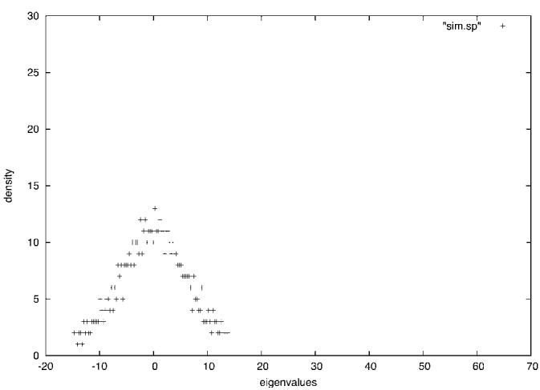
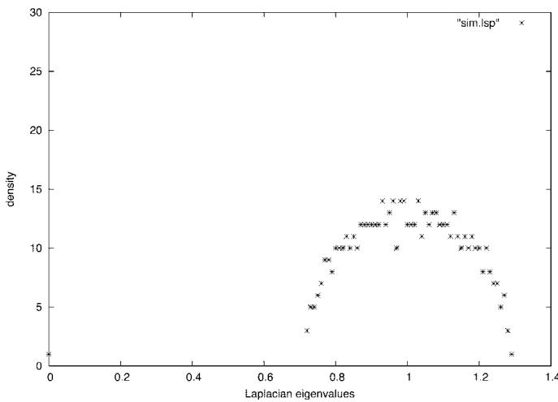

# Spectra of random graphs with given expected degrees

Fan Chung $^{†}$ , Linyuan Lu, and Van Vu

Department of Mathematics, University of California at San Diego, La Jolla, CA 92093-0112

Edited by Richard V. Kadison, University of Pennsylvania, Philadelphia, PA, and approved February 20, 2003 (received for review December 9, 2002)

In the study of the spectra of power-law graphs, there are basically two competing approaches. One is to prove analogues of Wigner's semicircle law, whereas the other predicts that the eigenvalues follow a power-law distribution. Although the semicircle law and the power law have nothing in common, we will show that both approaches are essentially correct if one considers the appropriate matrices. We will prove that (under certain mild conditions) the eigenvalues of the (normalized) Laplacian of a random power-law graph follow the semicircle law, whereas the spectrum of the adjacency matrix of a power-law graph obeys the power law. Our results are based on the analysis of random graphs with given expected degrees and their relations to several key invariants. Of interest are a number of (new) values for the exponent $\beta$ , where phase transitions for eigenvalue distributions occur. The spectrum distributions have direct implications to numerous graph algorithms such as, for example, randomized algorithms that involve rapidly mixing Markov chains.

Eigenvalues of graphs are useful for controlling many graph properties and consequently have numerous algorithmic applications including low rank approximations, $^{\ddagger}$ information retrieval (1), and computer vision. $^{\S}$ Of particular interest is the study of eigenvalues for graphs with power-law degree distributions (i.e., the number of vertices of degree j is proportional to $j^{-\beta}$ for some exponent $\beta$ ). It has been observed by many research groups (2–8, ¶) that many realistic massive graphs including Internet graphs, telephone-call graphs, and various social and biological networks have power-law degree distributions.

For the classical random graphs based on the Erdős–Rényi model, it has been proved by Füredi and Komlós that the spectrum of the adjacency matrix follows the Wigner semicircle law (9). Wigner's theorem (10) and its extensions have long been used for the stochastic treatment of complex quantum systems that lie beyond the reach of exact methods. The semicircle law has extensive applications in statistical and solid-state physics (21, 22).

In the 1999 article by Faloutsos et al. (6) on Internet topology, several power-law examples of Internet topology are given, and the eigenvalues of the adjacency matrices are plotted, which do not follow the semicircle law. It is conjectured that the eigenvalues of the adjacency matrices have a power-law distribution with its own exponent different from the exponent of the graph. Farkas et al. (11) looked beyond the semicircle law and described a “triangular-like” shape distribution (see ref. 12). Recently, M. Mihail and C. H. Papadimitriou (unpublished work) showed that the eigenvalues of the adjacency matrix of power-law graphs with exponent $\beta$ are distributed according to a power law for $\beta > 3$ .

Here we intend to reconcile these two schools of thought on eigenvalue distributions. To begin with, there are in fact several ways to associate a matrix to a graph. The usual adjacency matrix A associated with a (simple) graph has eigenvalues quite sensitive to the maximum degree (which is a local property). The combinatorial Laplacian D - A, with D denoting the diagonal degree matrix, is a major tool for enumerating spanning trees and has numerous applications (13, 14). Another matrix associated with a graph is the (normalized) Laplacian $L = I - D^{-1/2}AD^{-1/2}$ , which controls the expansion/isoperimetrical properties (which are global) and essentially determines the mixing rate of a random walk on the graph. The traditional random matrices and random graphs are regular or almost regular, thus the spectra of all the above three matrices are basically the same (with possibly a scaling factor or a linear shift). However, for graphs with uneven degrees, the above three matrices can have very different distributions.

In this article, we will consider random graphs with a general given expected degree distribution, and we examine the spectra for both the adjacency matrix and the Laplacian. We first will establish bounds for eigenvalues for graphs with a general degree distribution from which the results on random power-law graphs then follow. The following is a summary of our results.

1. The largest eigenvalue of the adjacency matrix of a random graph with a given expected degree sequence is determined by $m$ , the maximum degree, and $\tilde{d}$ , the weighted average of the squares of the expected degrees. We show that the largest eigenvalue of the adjacency matrix is almost surely $(1 + o(1))\max \{\tilde{d}, \sqrt{m}\}$ provided some minor conditions are satisfied. In addition, suppose that the $k$ th largest expected degree $m_k$ is significantly $>\tilde{d}^2$ . Then the $k$ th largest eigenvalue of the adjacency matrix is almost surely $(1 + o(1))\sqrt{m_k}$ .

2. For a random power-law graph with exponent $\beta > 2.5$ , the largest eigenvalue of a random power-law graph is almost surely $[1 + o(1)]\sqrt{m}$ , where m is the maximum degree. Moreover, the k largest eigenvalues of a random power-law graph with exponent $\beta$ have a power-law distribution with exponent $2\beta - 1$ if the maximum degree is sufficiently large and k is bounded above by a function depending on $\beta$ , m, and d, the average degree. When $2 < \beta < 2.5$ , the largest eigenvalue is heavily concentrated at $cm^{3-\beta}$ for some constant c depending on $\beta$ and the average degree.

3. We will show that the eigenvalues of the Laplacian satisfy the semicircle law under the condition that the minimum expected degree is relatively large ( $\gg$ the square root of the expected average degree). This condition contains the basic case when all degrees are equal (the Erdős–Rényi model). If we weaken the condition on the minimum expected degree, we can still have the following strong bound for the eigenvalues of the Laplacian, which implies strong expansion rates for rapidly mixing,

$$
\max_{i \neq 0} | 1 - \lambda_{i} | \leq [ 1 + o (1) ] \frac{4}{\sqrt{\bar{w}}} + \frac{g (n) \log^{2} n}{w_{\min}},
$$

where $\bar{w}$ is the expected average degree, $w_{\min}$ is the minimum expected degree, and $g(n)$ is any slow-growing function of n.

In applications, it usually suffices to have the $\lambda_{i}$ values (i > 0) bounded away from 0. Our result shows that (under some mild conditions) these eigenvalues are actually very close to 1.

The rest of the article has two parts. In the first part we present our model and the results concerning the spectrum of the adjacency matrix. The last part deals with the Laplacian.

## The Random Graph Model

The primary model for classical random graphs is the Erdos–Rényi model $G_{p}$ , in which each edge is independently chosen with the probability P for some given P > 0 (see ref. 15). In such random graphs the degrees (the number of neighbors) of vertices all have the same expected value. Here we consider the following extended random-graph model for a general degree distribution (also see refs. 16 and 17).

For a sequence $w = (w_{1}, w_{2}, \ldots, w_{n})$ , we consider random graphs $G(w)$ in which edges are independently assigned to each pair of vertices $(i, j)$ with probability $w_{i}w_{j}\rho$ , where

$$
\rho = 1 \Bigg / \sum_{i = 1} ^{n} w_{i}.
$$

Notice that we allow loops in our model (for computational convenience), but their presence does not play any essential role. It is easy to verify that the expected degree of i is $w_{i}$ .

To this end, we assume that $\max_{i} w_{i}^{2} < \Sigma_{k} w_{k}$ such that $p_{ij} \leq 1$ for all i and j. This assumption insures that the sequence $w_{i}$ is graphical [in the sense that it satisfies the necessary and sufficient condition for a sequence to be realized by a graph (18) except that we do not require the $w_{i}$ values to be integers]. We will use $d_{i}$ to denote the actual degree of $v_{i}$ in a random graph G in $G(w)$ , where the weight $w_{i}$ denotes the expected degree.

For a subset $S$ of vertices, the volume $\mathrm{Vol}(S)$ is defined as the sum of weights in $S$ and $\mathrm{vol}(S)$ is the sum of the (actual) degrees of vertices in $S$ . That is, $\mathrm{Vol}(S) = \Sigma_{i \in S} w_i$ and $\mathrm{vol}(S) = \Sigma_{i \in S} d_i$ . In particular, we have $\mathrm{Vol}(G) = \Sigma_i w_i$ , and we denote $\rho = 1 / \mathrm{Vol}(G)$ . The induced subgraph on $S$ is a random graph $G(w')$ , where the weight sequence is given by $w_i' = w_i \mathrm{Vol}(S) \rho$ for all $i \in S$ . The expected average degree is $\bar{w} = \Sigma_{i=1}^n w_i / n = 1 / (n\rho)$ . The second-order average degree of $G(w')$ is $\tilde{d} = (\Sigma_{i \in S} w_i^2 / \Sigma_{i=1}^n w_i) = \Sigma_{i \in S} w_i^2 \rho$ . The maximum expected degree is denoted by $m$ .

The classical random graph $G(n, p)$ can be viewed as a special case of $G(\boldsymbol{w})$ by taking w to be $(pn, pn, \ldots, pn)$ . In this special case, we have $\vec{d} = \bar{w} = m = np$ . It is well known that the largest eigenvalue of the adjacency matrix of $G(n, p)$ is almost surely $[1 + o(1)]np$ provided that $np \gg \log n$ .

The asymptotic notation is used under the assumption that $n$ , the number of vertices, tends to infinity. All logarithms have the natural base.

## Spectra of the Adjacency Matrix of Random Graphs with Given Degree Distribution

For random graphs with given expected degrees $(w_{1}, w_{2}, \ldots, w_{n})$ , there are two easy lower bounds for the largest eigenvalue $\| A\|$ of the adjacency matrix $A$ , namely, $[1 + o(1)]\tilde{d}$ and $[1 + o(1)]\sqrt{m}$ .

It has been proven $^{||}$ that the maximum of the above two lower bounds is essentially an upper bound (also see ref. 19).

Theorem 1. If $\tilde{d} > \sqrt{m} \log n$ , then the largest eigenvalue of a random graph in $G(w)$ is almost surely $[1 + o(1)]\tilde{d}$ .

Theorem 2. If $\sqrt{m} > \tilde{d} \log^{2} n$ , then almost surely the largest eigenvalue of a random graph in $G(\mathbf{w})$ is $[1 + o(1)]\sqrt{m}$ . If the kth largest expected degree $m_{k}$ satisfies $\sqrt{m_{k}} > \tilde{d} \log^{2} n$ , then almost surely the largest k eigenvalues of a random graph in $G(\mathbf{w})$ is $[1 + o(1)]\sqrt{m_{k}}$ .

Theorem 3. The largest eigenvalue of a random graph in $G(w)$ is almost surely at most

$$
7 \sqrt{\log n} \max \{\sqrt{m}, \tilde{d} \}.
$$

We remark that the largest eigenvalue $\|A\|$ of the adjacency matrix of a random graph is almost surely $[1 + o(1)]\sqrt{m}$ if $\sqrt{m}$ is $>\tilde{d}$ by a factor of $\log^{2}n$ , and $\|A\|$ is almost surely $[1 + o(1)]\tilde{d}$ if $\sqrt{m}$ is $<\tilde{d}$ by a factor of $\log n$ . In other words, $\|A\|$ is (asymptotically) the maximum of $\sqrt{m}$ and $\tilde{d}$ if the two values of $\sqrt{m}$ and $\tilde{d}$ are far apart (by a power of $\log n$ ). One might be tempted to conjecture that

$$
\| A \| = [ 1 + o (1) ] \max \{\sqrt{m}, \tilde{d} \}.
$$

This, however, is not true as shown by a counterexample given previously (10).

We also note that with a more careful analysis the factor of $\log n$ in Theorem 3 can be replaced by $(\log(n))^{1/2+\varepsilon}$ and the factor of $\log^{2}n$ can be replaced by $(\log(n))^{3/2+\varepsilon}$ for any positive $\varepsilon$ provided that n is sufficiently large. We remark that the constant “7” in Theorem 3 can be improved. We made no effort to get the best constant coefficient here.

## Eigenvalues of the Adjacency Matrix of Power-Law Graphs

In this section we consider random graphs with power-law degree distribution with exponent $\beta$ . We want to show that the largest eigenvalue of the adjacency matrix of a random power-law graph is almost surely approximately the square root of the maximum degree m if $\beta > 2.5$ and is almost surely approximately $cm^{3-\beta}$ if $2 < \beta < 2.5$ . A phase transition occurs at $\beta = 2.5$ . This result for power-law graphs is an immediate consequence of a general result for eigenvalues of random graphs with arbitrary degree sequences.

We choose the degree sequence $w = (w_{1}, w_{2}, \ldots, w_{n})$ satisfying $w_{i} = ci^{-1/(\beta-1)}$ for $i_{0} \leq i \leq n + i_{0}$ . Here c is determined by the average degree, and $i_{0}$ depends on the maximum degree m, namely,

$$
c = \frac{\beta - 2}{\beta - 1} d n^{- 1 / (\beta - 1)},
$$

$$
i_{0} = n \left[ \frac{d (\beta - 2)}{m (\beta - 1)} \right] ^{\beta - 1}.
$$

It is easy to verify that the number of vertices of degree $k$ is proportional to $k^{-\beta}$ .

The second-order average degree $\tilde{d}$ can be computed as follows.

$$
\tilde{d} = \left\{\begin{array}{l l} d   \frac{(\beta - 2) ^{2}}{(\beta - 1) (\beta - 3)}   (1 + o (1)) & \text{if}   \beta > 3. \\ \frac{1}{2}   d   \ln \frac{2 m}{d}   (1 + o (1)) & \text{if}   \beta = 3. \\ d   \frac{(\beta - 2) ^{2}}{(\beta - 1) (3 - \beta)} \bigg [ \frac{(\beta - 1) m}{d (\beta - 2)} \bigg ] ^{3 - \beta}   [ 1 + o (1) ] & \text{if}   2 <   \beta <   3. \end{array} \right.
$$

We remark that for $\beta > 3$ , the second-order average degree is independent of the maximum degree. Consequently, the power-law graphs with $\beta > 3$ are much easier to deal with. However, many massive graphs are power-law graphs with $2 < \beta < 3$ , in particular, Internet graphs (9) have exponents between 2.1 and 2.4, whereas the Hollywood graph (6) has exponent $\beta \approx 2.3$ . In these cases, it is $\tilde{d}$ that determines the first eigenvalue. Theorem 4 is a consequence of Theorems 1 and 2. When $\beta > 2.5$ , the $i$ th largest eigenvalue $\sigma_i$ is

$$
\sigma_{i} \approx \sqrt{m_{i}} \propto (i + i_{0} - 1) ^{- 1 / [ (2 \beta - 1) - 1 ]},
$$

for $\sigma_{i}$ sufficiently large. These large eigenvalues follow the power-law distribution with exponent $2\beta - 1$ . (The exponent is different from one in Mihail and Papadimitriou's unpublished work, because they use a different definition for power law.)

## Theorem 4.

1. For $\beta \geq 3$ and $m > d^2\log^{3 + \varepsilon}n$ , almost surely the largest eigenvalue of the random power-law graph $G$ is $[1 + o(1)]\sqrt{m}$ .

2. For $2.5 < \beta < 3$ and $m > d^{(\beta - 2) / (\beta - 2.5)} \log^{3 / (\beta - 2.5)} n$ , almost surely the largest eigenvalue of the random power-law graph $G$ is $[1 + o(1)] \sqrt{m}$ .

3. For $2 < \beta < 2.5$ and $m > \log^{3/2.5 - \beta} n$ , almost surely the largest eigenvalue is $[1 + o(1)]\tilde{d}$ .

4. For $k < (d / m \log n)^{\beta - 1}n$ and $\beta > 2.5$ , almost surely the $k$ largest eigenvalues of the random power-law graph $G$ with exponent $\beta$ have power-law distributions with exponent $2\beta - 1$ , provided that $m$ is large enough (satisfying the inequalities in 1 and 2).

## Spectrum of the Laplacian

Suppose G is a graph that does not contain any isolated vertices. The Laplacian L is defined to be the matrix $L = I - D^{-1/2}AD^{-1/2}$ , where I is the identity matrix, A is the adjacency matrix of G, and D denotes the diagonal degree matrix. The eigenvalues of L are all nonnegative between 0 and 2 (see ref. 20). We denote the eigenvalues of L by $0 = \lambda_{0} \leq \lambda_{1} \leq \ldots \lambda_{n-1}$ . For each i, let $\phi_{i}$ denote an orthonormal eigenvector associated with $\lambda_{i}$ . We can write L as $L = \Sigma_{i} \lambda_{i}P_{i}$ , where $P_{i}$ denotes the i projection into the eigenspace associated with eigenvalue $\lambda_{i}$ . We consider

$$
M = I - L - P_{0} = \sum_{i \neq 0} (1 - \lambda_{i}) P_{i}.
$$

For any positive integer $k$ , we have

$$
\operatorname{Trace} (M^{2 k}) = \sum_{i \neq 0} (1 - \lambda_{i}) ^{2 k}.
$$

Lemma 1. For any positive integer $k$ , we have

$$
\max_{i \neq 0} | 1 - \lambda_{i} | \leq \| M \| \leq [ \operatorname{Trace} (M^{2 k}) ] ^{1 / (2 k)}.
$$

The matrix $M$ can be written as

$$
\begin{array}{l} M = D^{- 1 / 2} A D^{- 1 / 2} - P_{0} \\ \qquad = D^{- 1 / 2} A D^{- 1 / 2} - \phi_{0} ^{*} \phi_{0} \\ \qquad = D^{- 1 / 2} A D^{- 1 / 2} - \frac{1}{\operatorname{vol} (G)} D^{1 / 2} K D^{1 / 2}, \end{array}
$$

where $\phi_{0}$ is regarded as a row vector $(\sqrt{d_{1}/\mathrm{vol}(G)},\ldots,\sqrt{d_{n}/\mathrm{vol}(G)})$ , $\phi_{0}^{*}$ is the transpose of $\phi_{0}$ , and K is the all 1s matrix.

Let W denote the diagonal matrix with the $(i, i)$ entry having value $w_{i}$ , the expected degree of the ith vertex. We will approximate M by

$$
\begin{array}{l} C = W^{- 1 / 2} A W^{- 1 / 2} - \frac{1}{\operatorname{Vol} (G)} W^{1 / 2} K W^{1 / 2} \\ = W^{- 1 / 2} A W^{- 1 / 2} - \chi^{*} \chi , \end{array}
$$

where $\chi$ is a row vector $(\sqrt{w_{1}\rho},\ldots,\sqrt{w_{n}\rho})$ . We note that $\|\chi^{*}\chi-\phi^{*}\phi\|$ is strongly concentrated at 0 for random graphs with given expected degree $w_{i}$ . C can be seen as the expectation of M, and we shall consider the spectrum of C carefully.

## A Sharp Bound for Random Graphs with Relatively Large Minimum Expected Degree

In this section we consider the case when the minimum of the expected degrees is not too small compared to the mean. In this case, we are able to prove a sharp bound on the largest eigenvalue of C.

Theorem 5. For a random graph with given expected degrees $w_{1}, \ldots, w_{n}$ where $w_{\min} \gg \sqrt{\bar{w}} \log^{3} n$ , we have almost surely

$$
\left\| C \right\| = [ 1 + o (1) ] \frac{2}{\sqrt{\bar{w}}}.
$$

Proof: We rely on the Wigner high-moment method. For any positive integer k and any symmetric matrix C

$$
\operatorname{Trace} (C^{2 k}) = \lambda_{1} (C) ^{2 k} + \dots + \lambda_{n} (C) ^{2 k},
$$

which implies

$$
E (\lambda_{1} (C) ^{2 k}) \leq E (\operatorname{Trace} (C^{2 k})),
$$

where $\lambda_{1}$ is the eigenvalue with maximum absolute value: $|\lambda_1| = \| C\|$ .

If we can bound $E(\mathrm{Trace}(C^{2k}))$ from above, then we have an upper bound for $E(\lambda_1(C)^{2k})$ . The latter would imply an upper bound (almost surely) on $|\lambda_1(C)|$ via Markov's inequality provided that $k$ is sufficiently large.

Let us now take a closer look at $\operatorname{Trace}(C^{2k})$ . This is a sum where a typical term is $c_{i_{1}i_{2}}c_{i_{2}i_{3}},\ldots,c_{i_{2k-1}i_{2k}}c_{i_{2k}i_{1}}$ . In other words, each term corresponds to a closed walk of length 2k (containing 2k, not necessarily different, edges) of the complete graph $K_{n}$ on $\{1,\ldots,n\}$ ( $K_{n}$ has a loop at every vertex). On the other hand, the entries $c_{ij}$ of C are independent random variables with mean zero. Thus, the expectation of a term is nonzero if and only if each edge of $K_{n}$ appears in the walk at least twice. To this end, we call such a walk a good walk. Consider a closed good walk that uses l different edges $e_{1},\ldots,e_{l}$ with corresponding multiplicities $m_{1},\ldots,m_{l}$ (the $m_{h}$ values are positive integers at least 2 summing up to 2k). The (expected) contribution of the term defined by this walk in $E(\operatorname{Trace}(C^{2k}))$ is

$$
\prod_{h = 1} ^{l} E (c_{e_{h}} ^{m_{h}}).\tag{[1]}
$$

In order to compute $E(c_{ij}^{m})$ , let us first describe the distribution of $c_{ij}$ : $c_{ij} = 1 / \sqrt{w_i w_j} - \sqrt{w_i w_j \rho} = q_{ij} / \sqrt{w_i w_j}$ with probability $p_{ij} = w_i w_j \rho$ and $c_{ij} = -\sqrt{w_i w_j \rho} = -p_{ij} / \sqrt{w_i w_j}$ with probability $q_{ij} = -1 - p_{ij}$ . This implies that for any $m \geq 2$ ,

$$
\begin{array}{c} \left| E (c_{i j} ^{m}) \right| \leq \frac{q_{i j} ^{m} p_{i j} + (- p_{i j}) ^{m} q_{i j}}{(w_{i} w_{j}) ^{m / 2}} \leq \frac{p_{i j}}{(w_{i} w_{j}) ^{m / 2}} \\ = \frac{\rho}{(w_{i} w_{j}) ^{m / 2 - 1}} \leq \frac{\rho}{(w_{\min}) ^{m - 2}}. \end{array}\tag{[2]}
$$

Here we used the fact that $q_{ij}^{m}p_{ij} + (-p_{ij})^{m}q_{ij} \leq p_{ij}$ in the first inequality (the reader can consider this fact an easy exercise) and the definition $p_{ij} = w_{i}w_{j}\rho$ in the second equality.

Let $W_{l,k}$ denote the set of closed good walks on $K_{n}$ of length $2k$ using exactly $l + 1$ different vertices. Notice that each walk in $W_{l,k}$ must have at least $l$ different edges. By Eqs. 1 and 2, the contribution of a term corresponding to such a walk toward $E(\mathrm{Trace}(C^{2k}))$ is at most $\rho^l / w_{\min}^{2k - 2l}$ .

It follows that

$$
E (\operatorname{Trace} (C^{2 k})) \leq \sum_{l = 0} ^{\mathrm{k}} \left| W_{l, k} \right| \frac{\rho^{k}}{w_{\min} ^{2 k - 2 l}}.\tag{[3]}
$$

In order to bound the last sum, we need the following result of Füredi and Komlós (9).

Lemma 2. For all l < n,

$$
\left| W_{l, k} \right| \leq n (n - 1) \dots (n - l) \binom{2 k} {2 l} \binom{2 l} {l} \frac{1}{l + 1} (l + 1) ^{4 (k - l)}.\tag{[4]}
$$

In order to prove Theorem 5, it is more convenient to use the following cleaner bound, which is a direct corollary of Eq. 4.

$$
\left| W_{l, k} \right| \leq n^{l + 1} 4^{l} \binom{2 k} {2 l} (l + 1) ^{4 (k - l)}\tag{[5]}
$$

Substituting Eq. 5 into 3 yields

$$
E (\operatorname{Trace} (C^{2 k})) \leq \sum_{l = 0} ^{k} \frac{\rho^{l}}{w_{\min} ^{2 k - 2 l}} n^{l + 1} 4^{l} \binom{2 k} {2 l} (l + 1) ^{4 (k - l)} = \sum_{l = 0} ^{k} s_{l, k}.\tag{[6]}
$$

Now fix $k = g(n) \log n$ , where $g(n)$ tends to infinity (with $n$ ) arbitrarily slowly. With this $k$ and the assumption about the degree sequence, the last sum in Eq. 6 is dominated by its highest term. To see this, let us consider the ratio $s_{k,k} / s_{l,k}$ for some $l \leq k + 1$ :

$$
\frac{s_{k , k}}{s_{l , k}} = \frac{\left[ (4 \rho n) w_{\min} ^{2} \right] ^{k - l}}{\binom{2 k} {2 l} (l + 1) ^{4 (k - l)}} \geq \frac{\left[ (4 \rho n) w_{\min} ^{2} \right] ^{k - l}}{2 k^{2 (k - l)} k^{4 (k - l)}} \geq \frac{1}{2} \left[ \frac{(4 \rho n) w_{\min} ^{2}}{k^{6}} \right] ^{k - l},
$$

where in the first inequality we used the simple fact that

$$
\binom{2 k} {2 l} \leq \frac{(2 k) ^{2 (k - l)}}{2 (k - l) !} \leq 2 k^{2 (k - l)}.
$$

With a proper choice of $g(n)$ , the assumption $w_{\min} = \Omega(\log^{3}n)\sqrt{\bar{w}}$ guarantees that $(4\rho nw_{\min}^{2}/k^{6}) = \Omega(1)$ , where $\Omega(1)$ tends to infinity with n, which implies $s_{k,k}/s_{l,k} \geq [\Omega(1)]^{k-l}$ . Consequently,

$$
\begin{array}{l} E (\operatorname{Trace} (C^{2 k})) \leq \sum_{l = 0} ^{k} s_{l, k} \leq [ 1 + o (1) ] s_{k, k} \\ \qquad = [ 1 + o (1) ] \rho^{k} n^{k + 1} 4^{k} = [ 1 + o (1) ] n (4 \rho n) ^{k}. \end{array}
$$

Because $E(\lambda_1(C)^{2k}) \leq E(\mathrm{Trace}(C^{2k}))$ and $\rho n = 1 / \bar{w}$ , we have

$$
E \left(\lambda_{1} (C) ^{2 k}\right) \leq [ 1 + o (1) ] n \left(\frac{2}{\sqrt{\bar{w}}}\right) ^{2 k}.\tag{[7]}
$$

By Eq. 7 and Markov's equality

$$
\begin{array}{l} P \left(\lambda_{1} (C) \geq (1 + \varepsilon) \frac{2}{\sqrt{\bar{w}}}\right) \\ = P \left(\lambda_{1} (C) ^{2 k} \geq (1 + \varepsilon) ^{2 k} \left(\frac{2}{\sqrt{\bar{w}}}\right) ^{2 k}\right) \\ \leq \frac{E (\lambda_{1} (C) ^{2 k})}{(1 + \varepsilon) ^{2 k} \left(\frac{2}{\sqrt{\bar{w}}}\right) ^{2 k}} \leq \frac{[ 1 + o (1) ] n \left(\frac{2}{\sqrt{\bar{w}}}\right) ^{2 k}}{(1 + \varepsilon) ^{2 k} \left(\frac{2}{\sqrt{\bar{w}}}\right) ^{2 k}} \\ = \frac{(1 + o (1)) n}{(1 + \varepsilon) ^{2 k}}. \end{array}
$$

Because $k = \Omega(\log n)$ , we can find an $\varepsilon = \varepsilon(n)$ tending to 0 with $n$ such that $n/(1 + \varepsilon)^{2k} = o(1)$ , which implies that almost surely $|\lambda_1(C)| \leq [1 + o(1)](2/\sqrt{\bar{w}})$ as desired. The lower bound on $|\lambda_1(C)|$ follows from the semicircle law proved in the next section.

## The Semicircle Law

We show that if the minimum expected degree is relatively large, then the eigenvalues of C satisfy the semicircle law with respect to the circle of radius $r = 2/\sqrt{\bar{w}}$ centered at 0. Let W be an absolute continuous distribution function with (semicircle) density $w(x) = (2/\pi)\sqrt{1 - x^{2}}$ for $|x| \leq 1$ and $w(x) = 0$ for $|x| > 1$ . For the purpose of normalization, consider $C_{nor} = (2/\sqrt{\bar{w}})^{-1}C$ . Let $N(x)$ be the number of eigenvalues of $C_{nor} < x$ and $W_{n}(x) = n^{-1}N(x)$ .

Theorem 6. For random graphs with a degree sequence satisfying $w_{\min} \gg \sqrt{\bar{w}}$ , $W_{n}(x)$ tends to $W(x)$ in probability as n tends to infinity.

Remark: The assumption here is weaker than that of Theorem 5 due to the fact that we only need to consider moments of constant order.

Proof: Because convergence in probability is entailed by the convergence of moments, to prove this Theorem 6 we need to show that for any fixed $s$ , the $s$ th moment of $W_{n}(x)$ (with $n$ tending to infinity) is asymptotically the $s$ th moment of $W(x)$ . The $s$ th moment of $W_{n}(x)$ equals $(1/n)E(\text{Trace}(C_{nor}^{s}))$ . For $s$ even, $s = 2k$ , the $s$ th moment of $W_{x}$ is $(2k)!/2^{2k}k!(k + 1)!$ (see ref. 10). For $s$ odd, the $s$ th moment of $W_{x}$ is 0 by symmetry.

In order to verify Theorem 6, we need to show that for any fixed k

$$
\frac{1}{n} E (\operatorname{Trace} (C_{n o r} ^{2 k})) = [ 1 + o (1) ] \frac{(2 k) !}{2^{2 k} k ! (k + 1) ! ^{\prime}}\tag{[8]}
$$

and

$$
\frac{1}{n} E (\operatorname{Trace} (C_{n o r} ^{2 k + 1})) = o (1).\tag{[9]}
$$

  
Fig. 1. The large eigenvalues of the adjacency matrix follow the power law.

We first consider Eq. 8. Let us go back to Eq. 3. Now we need to use the more accurate estimate of $|W_{l,k}|$ given by Eq. 4 instead of the weaker but cleaner one in Eq. 5. Define

$$
s_{l, k} ^{\prime} = \frac{\rho^{l}}{w_{\min} ^{2 k - 2 l}} n (n - 1)... (n - l) \binom{2 k} {2 l} \binom{2 l} {l} \frac{1}{l + 1} (l + 1) ^{4 (k - l)}.
$$

One can check, with a more tedious computation, that the sum

$$
\sum_{l = 0} ^{\mathrm{k}} s_{l, k} ^{\prime}
$$

is still dominated by the last term, namely

$$
\sum_{l = 0} ^{k} s_{l, k} ^{\prime} = [ 1 + o (1) ] s_{k, k} ^{\prime}.
$$

It follows that $E(\mathrm{Trace}(C^{2k})) \leq [1 + o(1)]s_{k,k}'$ . On the other hand, $E(\mathrm{Trace}(C^{2k})) \geq W_{k,k}|\rho^k$ . Now comes the important point, for $l = k$ , $|W_{l,k}|$ is not only upper-bounded by but in fact equals the right-hand side of Eq. 4. Therefore,

$$
E (\operatorname{Trace} (C^{2 k})) = [ 1 + o (1) ] s_{k, k} ^{\prime}.
$$

It follows that

$$
\begin{array}{l} E (\text{Trace} (C_{n o r} ^{2 k})) = [ 1 + o (1) ] \left(\frac{2}{\sqrt{\bar{w}}}\right) ^{- 2 k} s_{k, k} ^{\prime} \\ = [ 1 + o (1) ] n \frac{(2 k) !}{2^{2 k} k ! (k + 1) !}, \end{array}
$$

which implies Eq. 8.

Now we turn to Eq. 9. Consider a term in Trace $(C^{2k+1})$ . If the closed walk corresponding to this term has at least $k + 1$ different edges, then there should be an edge with multiplicity one, and the expectation of the term is 0. Therefore, we only have to look at terms with walks that have at most k different edges (and at most $k + 1$ different vertices). It is easy to see that the number of closed good walks of length $2k + 1$ with exactly $l + 1$ different vertices is at most $O(n^{l+1})$ . The constant in O depends on k and l (recall that now k is a constant), but for the current task we do not need to estimate this constant. The contribution of a term corresponding to a walk with at most $l + 1$ different edges is bounded by $\rho^l / w_{\min}^{2k + 1 - 2l}$ . Thus $E(\text{Trace}(C^{2k + 1}))$ is upper-bounded by

  
Fig. 2. The Laplacian spectrum follows the semicircle law.

$$
\sum_{l = 0} ^{k} c \frac{\rho^{l}}{w_{\min} ^{2 k + 1 - 2 l}} n^{l + 1}\tag{[10]}
$$

for some constant c. To compute the $(2k + 1)$ th moment of $W_{n}(x)$ , we need to multiply $E(\text{Trace}(C^{2k+1}))$ by the normalizing factor

$$
\frac{1}{n} \left(\frac{1}{2 \sqrt{n \rho}}\right) ^{2 k + 1}.
$$

It follows from Eq. 4 that the absolute value of the $(2k + 1)$ th moment of $W_{n}(x)$ is upper-bounded by

$$
\sum_{l = 0} ^{k} \frac{1}{n} \left(\frac{1}{2 \sqrt{n \rho}}\right) ^{2 k + 1} \frac{\rho^{l}}{w_{\min} ^{2 k + 1 - 2 l}} n^{l + 1} \leq \sum_{l = 0} ^{k} \left(\frac{1}{2 \sqrt{n \rho} w_{\min}}\right) ^{2 k + 1 - 2 l}.\tag{[11]}
$$

Under the assumption of the theorem $(1/2\sqrt{n\rho}w_{\min}) = o(1)$ . Thus, the last sum in Eq. 11 is $o(1)$ , completing the proof.

## Summary

In this article we prove that the Laplacian spectrum of random graphs with given expected degrees follows the semicircle law, provided some mild conditions are satisfied. We also show that the spectrum of the adjacency matrix is essentially determined by its degree distribution. In particular, the largest k eigenvalues of the adjacency matrix of a random power-law graph follow a power-law distribution, provided that the largest k degrees are large in terms of the second-order average degree. Here we compute the spectra of a subgraph G of a simulated random power-law graph with exponent 2.2. The graph G has 588 vertices with the average degree $\bar{w} = 43.88$ and the second average degree $\tilde{d} = 61.5804$ . The largest eigenvalue of its adjacency matrix is 61.78, which is very close to the second-order average degree $\tilde{d}$ , as asserted by Theorem 1 (see Fig. 1). All the nontrivial eigenvalues of the Laplacian are within $0.3 \approx (2/\sqrt{\bar{w}})$ from 1, as predicted by Theorems 5 and 6 (see Fig. 2).

This research was supported in part by National Science Foundation Grants DMS 0100472 and ITR 0205061 (to F.C. and L.L.) and DMS 0200357 (to V.V.) and an A. Sloan fellowship (to V.V.).

1. Kleinberg, J. (1999) J. Assoc. Comput. Mach. 46, 604–632.

2. Aiello, W., Chung, F. & Lu, L. (2001) Exp. Math. 10, 53–66.

3. Aiello, W., Chung, F. & Lu, L. (2002) in Handbook of Massive Data Sets, eds. Abello, J., Pardalos, P. M. & Resende, M. G. C. (Kluwer, Dordrecht, The Netherlands), pp. 97–122.

4. Albert, R., Jeong, H. & Barabási, A.-L. (1999) Nature 401, 130–131.

5. Barabási, A.-L. & Albert, R. (1999) Science 286, 509–512.

6. Faloutsos, M., Faloutsos, P. & Faloutsos, C. (1999) ACM SIG-COMM '9929, 251–263.

7. Jeong, H., Tomber, B., Albert, R., Oltvai, Z. & Barábasi, A.-L. (2000) Nature, 407, 378–382.

8. Kleinberg, J., Kumar, R., Raghavan, P., Rajagopalan, S. & Tomkins, A. (1999) in Computing and Combinatorics, Proceedings of the 5th Annual International Conference, COCOON '99, eds. Asano, T., Imai, H., Lee, D. T., Nakano, S.-I. & Tokoyama, T. (Springer, Berlin), pp. 1–17.

9. Füredi, Z. & Komlós, J. (1981) Combinatorica 1, 233–241.

10. Wigner, E.-P. (1958) Ann. Math. 67, 325-327.

11. Farkas, I. J., Derényi, I., Barabási, A.-L. & Vicsek, T. (2001) Phys. Rev. E

Stat. Phys. Plasmas Fluids Relat. Interdiscip. Top. 64, 026704, cond-mat/0102335.

12. Goh, K.-I., Kahng, B. & Kim, D. (2001) Phys. Rev. E Stat. Phys. Plasmas Fluids Relat. Interdiscip. Top. 64, 051903, cond-mat/0103337.

13. Biggs, N. (1993) Algebraic Graph Theory (Cambridge Univ. Press, Cambridge, U.K.).

14. Kirchhoff, F. (1847) Ann. Phys. Chem. 72, 497–508.

15. Erdos, P. & Rényi, A. (1959) Publ. Math. 6, 290–291.

16. Chung, F. & Lu, L. (2003) Ann. Comb. 6, 125–145.

17. Chung, F. & Lu, L. (2002) Proc. Natl. Acad. Sci. USA 99, 15879–15882.

18. Erdos, P. & Gallai, T. (1961) Mat. Lapok 11, 264–274.

19. Chung, F., Lu, L. & Vu, V. (2003) Ann. Comb. 7, 21–33.

20. Chung, F. (1997) Spectral Graph Theory (Am. Math. Soc., Providence, RI).

21. Crisanti, A., Paladin, G. & Vulpiani, A. (1993) Products of Random Matrices in Statistical Physics, Springer Series in Solid-State Sciences (Springer, Berlin), Vol. 104.

22. Guhr, T., Müller-Groeling, A. & Weidenmüller, H. A. (1998) Phys. Rep. 299, 189–425.