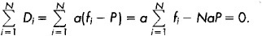
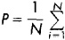
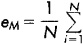
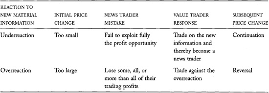
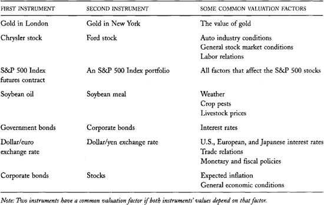
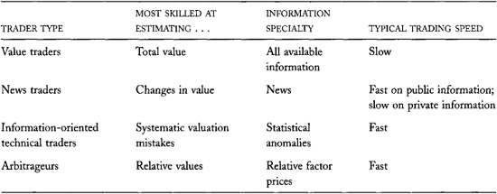
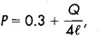
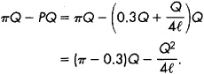

# Chapter 10: Informed Traders and Market Efficiency

*Informed traders* are speculators who acquire and act on information
about fundamental values. They buy when prices are below their estimates
of fundamental value and sell when prices are above their estimates.
Informed traders include *value traders, news traders,
information-oriented technical traders*, and *arbitrageurs.*

In this chapter, we will consider how informed traders trade and how
their trading makes prices informative. We will pay special attention to
why some informed traders make money while others do not. We also will
explain why prices cannot be completely informative. This chapter will
help you understand how informed traders make money, when they make
money, and the limits to how much money they can make.

Informed trading may interest you for at least three reasons. First, you
may be an informed trader yourself. If your trading decisions depend in
any way on opinions you form about fundamental values, you are an
informed trader. Unfortunately, most traders who believe that they are
informed traders do not trade profitably because they are not truly well
informed. The principles we will discuss in this chapter should improve
your trading by helping you predict when you will trade profitably.

Second, you must understand informed trading to understand the risks
that traders face when they offer liquidity. In [chapter
13](#part0024.html_ch13){.nounder}, we show that dealers and other
traders who supply liquidity lose to well-informed traders. The
profitability of dealer operations therefore depends critically on how
dealers cope with informed traders. If you intend to be a dealer, if you
intend to trade with dealers, or if you intend to offer liquidity
yourself, you must understand informed trading.

Finally, you must understand informed trading to see how prices become
informative. A price is *informative* when it is near its corresponding
fundamental value. Informative prices are extremely valuable to the
economy because they help us allocate resources efficiently. To fully
appreciate how market-oriented economies work, you must understand how
informed traders make prices informative.

## 10.1 FUNDAMENTAL VALUES

To discuss informed trading, we must distinguish between market values
and fundamental values. The *market value* of an instrument is the price
at which traders can buy or sell the instrument. The *fundamental value*
(or *intrinsic value)* is the "true value" of the instrument. In
financial terms, fundamental value is the expected present value of all
present and future benefits and costs associated with holding the
instrument. Everyone would agree upon this value if they all knew
everything known about the instrument, if they all used the proper
analyses to predict and discount all uncertain future cash flows, and if
they all perceived the benefits and costs of holding
the instrument equally. Since these
conditions never occur, traders often differ in their opinions about
fundamental values. This chapter examines how informed traders estimate
fundamental values and how they trade upon their estimates.

Fundamental values are not perfect foresight values. Fundamental values
depend only on information that is currently available to traders.
*Perfect foresight values* depend on all current and future information
about values. Fundamental values are the best estimates of perfect
foresight values.

Prices are completely *informative* when they equal fundamental values.
*Efficient markets* produce prices that are very informative. The
difference between fundamental value and market value (price) is
*noise.* Informed traders try to identify the noise in prices by
estimating fundamental values. Since we do not observe fundamental
values, we cannot easily determine whether prices are informative or
noisy.

Changes in fundamental values are completely unpredictable. Since
fundamental values reflect all available information, they change only
when traders learn unexpected new fundamental information. If
fundamental value changes were predictable, current fundamental values
would not fully reflect the information upon which the predictions are
based. Fundamental value changes therefore must be unpredictable. Since
prices are very close to fundamental values in efficient markets, price
changes in efficient markets are quite unpredictable.

When traders cannot predict future price changes, statisticians say that
prices follow a *random walk*. Plots of random walks through time look
like paths that wander up or down at random because random walks are
completely unpredictable.

------------------------------------------------------------------------

[▶]{.ent} **Fischer Black on Noise**

Fischer Black was a mathematician who made many seminal contributions to
the development of financial theory. Perhaps most notably, he helped
develop option-pricing theory, for which Myron Scholes and Robert Merton
received the 1997 Nobel Prize in economic science. Had Fischer not died
two years before the prize was awarded, he undoubtedly also would have
been a Nobel laureate.

In his 1985 presidential address to the American Finance Association,
Black offered a now famous opinion about noise. He believed that we
should consider stock prices to be informative if they are between
one-half and twice their fundamental values! Most economists believe
that the prices of actively traded securities are well within these
extreme bounds, but no one can know for sure. [◀]{.ent1}

*Source: Fischer Black, "Noise,"* Journal of Finance *41, no. 3 (1986):
529-543*.

------------------------------------------------------------------------

## 10.2 INFORMED TRADERS

Informed traders estimate fundamental values. They may base their
estimates on *private information* that only they have or on *public
information* that any trader can obtain. Informed traders compare their
value estimates with the corresponding market prices. They consider
instruments to be *undervalued* if prices are less than their estimates
of fundamental value, and *overvalued* if prices are greater.

Informed traders buy instruments that they believe are significantly
undervalued and sell instruments that they believe are significantly
overvalued. They hope to profit when the prices of their purchases rise
and when the prices of their sales fall. Informed traders naturally hope
that these price changes will occur quickly.

Informed traders lose money when they estimate fundamental values
poorly. When their value estimates are wrong, they pay too much for
instruments they have overvalued, and they sell too cheaply instruments
they have undervalued. Informed traders who consistently estimate values
poorly usually quit trading when they have lost more money than they can
tolerate or when bankruptcy forces them out of the markets.

Informed traders also can lose money even if they accurately estimate
fundamental values. This happens when prices move away from fundamental
values rather than toward them. These losses, however, tend to be
short-term. In the long run, prices usually revert toward their
fundamental values, so well-informed traders ultimately profit.

Even if prices never adjust to their
fundamental values, well-informed traders who have correctly estimated
values still can profit from their trades if they are patient. When they
buy an undervalued instrument, they acquire the rights of ownership for
less than their aggregate value. By holding the instrument, they will
eventually receive the benefits of these rights---typically interest,
dividends, royalties, capital repayments, or liquidating
distributions---at a lower price than they could otherwise obtain them.
When they sell overvalued instruments, they can invest the proceeds in
instruments with higher expected rates of return.

## 10.3 INFORMED TRADERS MAKE PRICES INFORMATIVE

Informed traders, like all other traders, often significantly impact
prices when they trade. Their buying tends to push prices up, and their
selling tends to push prices down. Since they buy when price is below
their estimates of fundamental value and sell otherwise, the effect of
their trading is to move prices toward their estimates of fundamental
value. Their trading therefore causes prices to reflect their estimates
of fundamental value. When informed traders accurately estimate values,
their trading makes prices more informative.

Informed traders generally differ in their estimates of value. This
often happens when they base their estimates on different data. Informed
traders often trade with each other so that the price impacts of their
trading tend to cancel. The net impact of their trading is a market
price that reflects an average of their different value estimates. This
price usually is more informative than are any of the individual value
estimates. Markets aggregate data from many sources to produce prices
that typically estimate fundamental values more accurately than any
individual trader can.

Informed traders also may estimate different values when one or more
traders make mistakes in their analyses. If many mistaken traders are in
the market, or if one mistaken trader is quite large, their trading will
make prices less informative. In the long run, however, the losses of
error-prone traders cause them to exit the market so that prices become
more informative.

Informed traders who most accurately estimate value eventually become
wealthy while informed traders who estimate value less accurately lose
wealth. Since wealthy informed traders take larger positions than do
less wealthy informed traders, wealthy traders have more influence on
price than do other traders. Prices therefore are closer to the value
estimates of wealthy traders than to those of less wealthy traders.
Since wealthy traders tend to be the best-informed traders, prices
primarily reflect the value estimates of the best-informed traders more
than those of less informed traders.

Although informed traders usually make prices more informative, they do
not trade for this purpose. They trade to make profits. The price
impacts of their trading are transaction costs to them. They make less
money when their price impacts are large than when they are small. To
trade profitably, informed traders need to trade in liquid markets in
which prices differ significantly from fundamental values. They do not
profit much in illiquid markets, where their trading quickly eliminates
potential profit opportunities. Informed traders want prices to adjust
toward their estimates of fundamental value only after they have
established their positions.

------------------------------------------------------------------------

[▶]{.ent} **An Algebraic
Illustration**

This box presents an algebraic illustration of how markets aggregate
information. If you are not comfortable with algebra and symbolic
notation, skip it. The exercise only illustrates points made in the
text.

Suppose that *N* traders each produce a different forecast of the true
value of a security. Let *f~i~* be the forecast of the *i*th trader and
assume that it is an unbiased estimate of *V*, the true fundamental
value. We can represent the forecast as *f~i~* = *V* + *e~i~* where
*e~i~* is the error in the *i*th trader's forecast. The expected
forecast error is 0 because the forecasts are unbiased. The individual
forecast errors might be quite large in absolute value, however.

Let each trader's desired position in the security, *D~i~*, be
proportional to the difference between her forecast of value and the
market price, i.e., *D~i~* = a(*f~i~* − *P*) where a is some constant of
proportionality and *P* is the market price. This assumption ensures
that trader *i* will want a long position if her forecast is greater
than the market price and a short position otherwise. It also ensures
that the more different her forecast is from the market price, the more
she will want to hold.

Finally, assume that the security is in *zero net supply*. Traders
create such securities when they sell them short. Futures contracts and
option contracts are examples of zero net supply securities. This
assumption simplifies the arithmetic but does not affect our qualitative
results.

We compute the market price by setting the sum of all desired positions
equal to the net supply and solving the resulting equation for *P:*

{.calibre9}

The market price
{.calibre6}
is an average of the individual forecasts.

Substituting *f*~i~ = *V* + *e~i~* into this expression gives *P = V +*
e~M~, where
{.calibre6}
is the forecast error of the market price.

If the individual forecast errors are independent of each other, the law
of large numbers implies that the market forecast error *e~M~* will
approach 0 as the number of traders *N* gets large. Even if the number
of traders is not large, the average market forecast error will be less
than the average individual forecast error if the individual forecast
errors are not identical. The market price thus estimates the
fundamental value of the security better than any individual trader can
estimate it. Prices are most informative when many informed traders
collect information independently. [◀]{.ent1}

------------------------------------------------------------------------

## 10.4 INFORMED TRADING STRATEGIES

Informed traders must minimize the price impacts of their trades to
maximize their trading profits. They therefore must carefully consider
how they trade. Their most important decision is whether to trade
aggressively.

Informed traders should trade aggressively if they believe that their
private information---and its implications for values---will soon become
common knowledge. When values are well known, traders will not trade at
any other prices. Since informed traders can profit only if they trade
when prices differ significantly from values, they must complete their
trades while they still know values better than other traders do.

Informed traders also should trade aggressively if they believe that
many other informed traders will act on the same information. Each
informed trader will push prices closer to fundamental value. The ones
who trade first will profit the most. If the informed traders know that
they are competing with each other, they all will race to complete their
trades quickly. Unfortunately for them, the flood of their orders may
alert other traders and suggest to them that prices do not equal values.
The other traders then may become reluctant to supply liquidity, so that
the informed trading has even greater price impacts.

------------------------------------------------------------------------

[▶]{.ent} The Market Is a
Statistical Calculator

Statisticians teach us that we can estimate most accurately when we have
lots of data. For example, suppose you have two forecasts of value that
you believe are equally accurate. The first forecast is 30 and the
second is 50. Your best estimate of value given this information is the
average of these two forecasts, or 40. This average would more
accurately estimate value than either of the individual estimates.

If you knew that the first forecast was more accurate than the second
forecast, your best estimate of value would be closer to 30 than to 50.
It would be a weighted average of the two forecasts with a greater
weight given to the more accurate forecast. (The actual weighted-average
estimate would depend on the accuracies of the two estimates.) The
combined estimate again would be more accurate than either of the other
two estimates.

By combining information from different sources, markets generally
produce more accurate estimates of value than any one source can.
Moreover, since well-informed traders tend to take large positions, the
market gives more weight to their more accurate estimates of value than
to the less accurate estimates of less-informed traders who tend to take
smaller positions. Prices thereby approximate an optimally weighted
average of value estimates with varying degrees of accuracy. Markets are
essentially statistical calculators that aggregate value estimates from
various informed traders to obtain more accurate estimates of value.
[◀]{.ent1}

------------------------------------------------------------------------

Informed traders who are confident that they will not soon lose their
informational advantages should trade slowly. By trading slowly, they
make it difficult for other traders to infer that they are well
informed. Economists call this strategy *stealth trading* because the
informed traders want to complete their trades without anyone knowing
that they are trading.

## 10.5 STYLES OF INFORMED TRADING

Informed trading styles differ according to the methods that traders use
to estimate fundamental values. *Value traders* estimate the entire
fundamental value of an instrument by using all available information.
They determine whether instruments are correctly priced. *News traders*
estimate only changes in fundamental values. They predict how
fundamental values will change in response to new information.
*Information-oriented technical traders* identify price patterns that
are inconsistent with prices that fully reflect fundamental values. They
identify systematic errors made by the other two trader types. Finally,
*arbitrageurs* estimate relative differences in fundamental values. They
examine the value relation between correlated instruments. This section
describes how these four types of traders organize their operations.

##### 10.5.1 Value Traders

Value traders estimate fundamental values. They gather as much
information as they can about fundamental values. They then use economic
models to organize this information and to estimate instrument values.

All information that can help value traders understand the value of an
instrument interests them. They collect information about sales, costs,
economic activity, interest rates, management quality, potential for
competition, growth options, labor relations, input prices, and the
prospects for new technologies. They then use this information to
forecast and discount future cash flows, to value the options associated
with the assets underlying the instrument, and to value any options
associated with ownership of the instrument itself. When they do their
job well, they know more about values than anyone else does.

Value traders may employ a variety of experts in their efforts to
estimate values. These experts include financial analysts,
statisticians, actuaries, macroeconomists, industry economists,
marketing professionals, accountants, engineers, scientists, computer
programmers, librarians, and research assistants. To support these
experts, they often build significant libraries and run large
information-processing operations.

Value traders must be very disciplined to minimize the biases that may
enter their analyses. If they are overly optimistic, they may buy an
overvalued instrument. When prices fall, they then will lose money.
Likewise, if they are overly pessimistic, they may sell an undervalued
instrument. When prices rise, they then will lose money (if they are
short) or lose the opportunity to make money (if they sold a long
position).

To avoid estimation errors, large value traders usually have
*pyramid-shaped organizations* with many levels of management. Each
level oversees the operations of the levels below it. The many layers of
review in a pyramid-shaped organization help the organization make
well-disciplined decisions. Unfortunately, they also ensure that the
organization will make decisions slowly. At the bottom level are
analysts who collect information and form opinions about security
values. These analysts pass their opinions (and their supporting
analyses) up to the portfolio managers, who consider their analyses. The
portfolio managers (and other senior managers within the organization)
must ensure that the analysts use comparable assumptions when forming
their opinions about their securities. Otherwise, the firm will buy
securities analyzed by optimistic analysts and sell securities analyzed
by pessimistic analysts. They also must ensure that their analysts have
not ignored important information. Otherwise, they will buy securities
for which they failed to identify negative information and sell
securities for which they failed to identify positive information. To
avoid these biases, all successful value traders---whether large
institutional money managers or individual investors---carefully review
their research efforts to make sure that they use consistent assumptions
based on all available information. Although these reviews make value
traders slow traders, they protect them from making costly mistakes.

Since value traders know values very well, they often supply liquidity
to large traders. In many respects, they are the liquidity suppliers of
last resort. We consider this very important aspect of value trading in
[chapter 16](#part0027.html_ch16){.nounder}.

------------------------------------------------------------------------

[▶]{.ent} **The Effect of Inconsistent Assumptions on Value Trading**

Suppose that a value trader employs two analysts who separately
specialize in the automobile and aviation manufacturing industries. If
the automobile analyst believes that future interest rates will be 10
percent and the aviation analyst believes that future interest rates
will be 5 percent, the automobile analyst will discount future Ford
earnings more than the aviation analyst will discount Boeing's future
earnings. The firm will therefore undervalue Ford relative to Boeing. If
the organization does not recognize this inconsistency, it may sell Ford
and buy Boeing. [◀]{.ent1}

------------------------------------------------------------------------

------------------------------------------------------------------------

[▶]{.ent} **The Effect of Incomplete Information on Value Trading**

Suppose that an analyst estimates the value of an oil exploration firm
without taking into account recent negative drilling results in one of
its more important prospective oil fields. The analyst will overvalue
the firm's stock. A value trader who buys the stock based on this
analysis will likely pay too much for it. [◀]{.ent1}

------------------------------------------------------------------------

------------------------------------------------------------------------

[▶]{.ent} **Trading on Viagra**

On March 27, 1998, the U.S. Food and Drug Administration approved Viagra
for use as a prescription drug by men who suffer from penile erectile
dysfunction. Pfizer launched the drug in April. By May 22, over 1
million U.S. men had already taken it. Each dose costs about 8 dollars.
The speed and depth of Viagra's market penetration surprised many
people.

The stock of Pfizer closed at 95¾ on March 27. By the end of the next
week, its price had risen in roughly equal steps to 102[⅞]{.ent1}. One
month later, on April 27, the stock closed at 1137/16.

Although it is impossible to definitively attribute the increase in
stock price to Viagra's introduction, the conclusion seems reasonable.
The first traders to obtain, correctly analyze, and act upon the
information made money. Later traders lost the opportunity to make money
because prices had already increased to reflect the news. [◀]{.ent1}

------------------------------------------------------------------------

------------------------------------------------------------------------

[▶]{.ent} **Trading on Investigative Research into Aerospace Hiring**

An aerospace firm is competing for an important classified contract.
Analysts widely agree that the firm will be significantly more valuable
if it obtains the contract. Although the firm may not reveal the status
of its negotiations, a clever researcher may be able to infer how they
are progressing by considering the numbers and types of people the firm
is trying to hire. Such information will be valuable to a news trader if
it is not already widely known. [◀]{.ent1}

------------------------------------------------------------------------

##### 10.5.2 News Traders

*News traders* collect and act upon new information about instrument
values. They try to predict how instrument values will change, given the
new information. If they think that values will change significantly,
they then buy or sell instruments, depending on whether the news is good
or bad. *Material information* is information that significantly affects
instrument values. News traders try very hard to discover material
information before other traders do. Successful news traders employ
experts in data collection who can quickly filter public data sources
for valuable information, researchers with strong investigative skills
who can produce useful new information, and traders who can quickly and
accurately analyze implications of new information for instrument
values.

Unlike value traders, news traders do not estimate the value of an
instrument from first principles and all available data. Instead, they
implicitly assume that current prices accurately reflect all information
except their news. Their object is merely to estimate how values will
change in response to their new information. They estimate total
instrument values by adding to current prices their estimates of how
their news changes values.

Successful news traders must collect information and act on it before
other traders do. Those who collect and respond to publicly available
information must be extremely quick, because much of the news that
affects security and contract values is easy to obtain and interpret.
These traders often compete with many other traders who simultaneously
try to profit from trading on the same news. News traders who specialize
in producing information through their own investigative research need
not be so quick, but they still must be faster than their competitors.
In either case, only traders who can trade before their news has its
impact will profit.

Traders who trade on inside information are news traders. *Inside
information* is material information that traders directly or indirectly
obtain from the management of a company and that is not yet publicly
available. In the United States, and in many other countries, trading on
inside information is illegal. We consider how the prohibition on
insider trading affects the security markets and the managerial labor
markets in [chapter 29](#part0043.html_ch29){.nounder}.

Large money managers who pursue information-flow trading strategies
usually have flat organizations with few management levels. In *flat
organizations*, managers are allowed (within
limits) to make whatever decisions are necessary to pursue the firm's
objectives. Flat organizations can make quick decisions with little
deliberation. This structure is well suited to firms that trade on the
flow of information because their traders generally must act quickly in
order to trade profitably on their information.

------------------------------------------------------------------------

[▶]{.ent} **Pseudo-informed Trading on Stale Information**

The price of Greasy Earth Oil (GEOL) is presently 90. GEOL should be
worth 100 if it finds oil and 80 if it does not. From careful studies of
the surrounding geology and of the discarded tailings from GEOL's main
drilling rig, well-informed traders believe GEOL will find oil. They buy
GEOL and push its price up to 100.

GEOL does indeed find oil. When news of the find becomes public,
however, the information is already in the price.

If pseudo-informed traders buy on the stale information, they may push
prices up to 110. Value traders will sell, and prices will fall back
toward 100. The pseudo-informed traders will lose. [◀]{.ent1}

------------------------------------------------------------------------

Successful firms that trade on information flows use various systems to
quickly collect and deliver information to portfolio managers, who
analyze it and possibly trade upon it. These systems may include
networks of reporters, brokers, or analysts whom the firms reward for
providing them with valuable information. They may also include
computerized systems that read and interpret electronic news feeds
produced by news services like the Dow Jones Broad Tape. News traders
may also employ clipping services to summarize newspaper articles from
around the nation and the world. In addition, many news traders have
television monitors on their desks tuned to financial news channels as
well as computer monitors that scroll information distributed by
electronic news services.

###### 10.5.2.1 Information, Prices, and Pseudo-informed traders

To trade profitably, news traders must trade before prices adjust to
reflect their information. A price *reflects* information if that
information cannot be used to forecast future price changes. If that is
the case, the information is *in the price*. Information gets into the
price when all traders are aware of its significance or when informed
traders push prices toward their estimates of fundamental value.
Information that is already in the price is *stale information*. News
traders cannot trade profitably on stale information.

The most common mistake that traders make is to trade on stale
information. Economists call traders who trade on stale information
*pseudo-informed traders*. Pseudo-informed traders think that they are
well informed, but in fact they are not. They lose because they tend to
buy when prices are already high and to sell when prices are already
low. Pseudo-informed traders are actually uninformed traders.

Good news traders must know whether their information is already in the
price before they trade. Unfortunately, they rarely know this. To answer
the question directly, they must estimate instrument values from first
principles. Although value traders routinely do these analyses, few news
traders are well equipped to do so. However, traders often can make an
educated guess about the quality of their information based on how they
obtained it. If they are acting on unique information that others could
not have anticipated, their information probably is not stale. If they
have been slow to act, if their information is widely known, if others
can obtain it cheaply, or if others could have reasonably anticipated
it, their information probably is stale.

Since news traders generally do not estimate values as well as value
traders do, they generally make more mistakes than value traders.
Although news traders usually can accurately predict the direction in
which values should change in response to their information, they often
poorly estimate the sizes of the changes. In particular, they may under-
or overestimate the implications of their information for instrument
values. When they underestimate how much values should change, they lose
the opportunity to make more money. When they overestimate how much
values should change, they lose some, all, or even more than all, of
what they gain as informed traders. In either case, value traders may
recognize that prices do not accurately reflect values when they
eventually learn the news and revise their value estimates accordingly.
If prices have not changed enough, the value traders will profit
directly from acting on the new information. If prices have changed too
much, the value traders will profit by correcting the overreaction.
[Table 10-1](#part0020.html_ch10tab01){.nounder} summarizes the mistakes
that news traders make and how value-motivated traders respond to them.

------------------------------------------------------------------------

[▶]{.ent} **Pseudo-informed Trading
in Occidental Petroleum**

Armand Hammer was the Chairman and CEO of Occidental Petroleum (OXY) for
34 years, until his death at age 92 on December 10, 1990. Although many
people criticized his management during the last years of his life, his
control over the firm was nearly absolute. It was difficult to influence
his decisions, and it appeared impossible to take over the firm from
him. The day after he died, OXY's stock price rose by 10 percent as
traders anticipated more favorable management. On the next day, the
price dropped back to its former level.

Armand Hammer was a sick and very old man for a long time before his
death. The fact that he died was not material news because many expected
that he would die soon. The only uncertainty was on what date. The
actual date was not material to the value of the firm. The traders who
thought that they were trading on material information should have
realized that their information was quite stale. Those who bought at
high prices on the day after his death lost the next day. [◀]{.ent1}

------------------------------------------------------------------------

##### 10.5.3 Information-oriented Technical Traders

*Technical traders* attempt to predict the future course of prices by
identifying recurring price patterns. Such patterns can arise when
informed traders make systematic mistakes or when uninformed traders
have predictable impacts on price.

When technical traders recognize and trade on mistakes made by informed
traders, they effectively become informed traders themselves. By
correcting these mistakes, technical traders cause prices to reflect
more accurately the information that the informed traders have. This
type of technical trading is *information-oriented technical trading*.
We discuss it in this section.

**TABLE 10-1**.\
Mistakes News Traders May Make and the Responses of Value Traders

{.calibre9}

------------------------------------------------------------------------

[▶]{.ent} **Technical Trading
Following an Earnings Announcement**

The value of Bethlehem Steel's common stock should rise when the firm
reports better than expected earnings. Suppose that whenever this
happens, news traders or pseudo-informed traders tend to overbuy the
stock and push its price above its new higher value.

Technical traders who are aware of this systematic mistake will sell
after prices rise following positive earnings announcements. They then
will profit when prices fall to their proper (but still higher) levels.
If they sell early enough, they will attenuate the overreaction. If they
wait too long, they may lose the profit opportunity to other technical
traders or to value traders who respond faster. [◀]{.ent1}

------------------------------------------------------------------------

------------------------------------------------------------------------

[▶]{.ent} **Tax Timing Strategies**

Practitioners and academics have observed that U.S. stocks which have
dropped significantly in one year tend to rise at the beginning of the
next year. Such patterns may result when investors sell their stocks at
year-end to realize capital losses for their taxes. Their sales tend to
push prices below their fundamental values. Prices increase when value
traders recognize that the stocks are mispriced.

Technical traders who try to profit from this information buy losers at
year-end and sell them a few weeks later. Their buying, however, reduces
the year-end price drop caused by the tax-loss sellers. As the tax-loss
selling phenomenon becomes better known, it appears to be going away.
[◀]{.ent1}

------------------------------------------------------------------------

When technical traders trade in response to predictable price patterns
caused by uninformed traders, they effectively act as dealers or order
anticipators. If they offer liquidity to the uninformed traders, they
are essentially dealers. Their trading tends to make prices more
informative. If they attempt to front-run the uninformed traders, they
are order anticipators that we call *sentiment-oriented technical
traders*. Their trading tends to make prices less informative. We
discuss dealers and order anticipators in [chapters
13](#part0024.html_ch13){.nounder} and
[11](#part0021.html_ch11){.nounder}, respectively.

*Information-oriented technical traders* identify violations of abstract
statistical properties that characterize informative prices. When value
traders and news traders efficiently acquire, process, and act on
information, prices will not have predictable changes.
Information-oriented technical traders profit by identifying predictable
price patterns that result when other traders make mistakes. They are
scavengers who pick up profit opportunities left by value traders and
news traders.

Information-oriented technical trading is quite difficult because it is
profitable only when informed traders make systematic mistakes. Since
observant traders correct their mistakes, opportunities for successful
technical trading decrease as markets mature and traders become more
experienced. Technical trading strategies that exploit informed traders'
mistakes therefore rarely are consistently profitable. Strategies that
worked well in the past fail when informed traders learn from their
mistakes.

Technical traders use many methods to identify predictable price
patterns. They most commonly analyze price and volume charts. These
techniques are not very effective because our eyes often see patterns
where none truly exist. Some technical traders use computers to identify
patterns in data.

------------------------------------------------------------------------

[▶]{.ent} **Pattern Recognition in the Food Chain**

Simple principles of evolutionary biology can explain why we often see
patterns that do not really exist. Our primitive ancestors needed to
recognize signs of danger in order to survive. Those who could not
recognize these signs undoubtedly had fewer children than those who
could. For example, our ancestral aunts and uncles who could not
recognize signs of a nearby saber-tooth tiger probably too often found
themselves on the wrong end of the food chain. They did not survive to
provide our ancestors with cousins. Since the costs of being wrong when
a danger is present are much greater than the costs of being wrong when
there is no real danger, survivors often identify more dangers than
truly exist. As the descendants of those survivors, we are biologically
programmed to identify patterns where none may exist.

Good traders must recognize this predisposition toward falsely
identifying patterns. Otherwise, they often will trade foolishly.
[◀]{.ent1}

------------------------------------------------------------------------

------------------------------------------------------------------------

[▶]{.ent} **The Psychology of
Momentum Strategies**

Financial economists have observed that stocks which have risen
substantially over the last six months of the year tend to outperform
the market in the next year. Stocks that have fallen substantially tend
to underperform the market in the next year. These results are based on
averages over many stocks and many years. The probability that any given
stock beats or lags the market is close to 50 percent regardless of its
previous performance. These results suggest that markets are not
completely efficient.

Information-oriented technical traders try to profit from this
information by buying extreme winners and selling extreme losers.
Although each stock is quite risky, the risk is manageable when they buy
and sell many stocks at the same time. This strategy is a *momentum*
strategy because traders hope that prices continue moving in the same
direction that they have moved. Momentum strategies are profitable when
news traders and value traders underestimate the importance of
significant new information.

The common tendency of people to resist changes in the status quo may
explain why traders make these mistakes. When great news makes a stock
much more valuable, or when terrible news makes it much less valuable,
traders have trouble believing that the current value of the stock could
be so different from its recent value. They find it difficult to buy
stocks that have risen substantially because they are afraid that they
may have become overvalued. They likewise find it difficult to sell
stocks that have fallen substantially because they are afraid that they
may have become undervalued.

The momentum strategy probably will become less profitable as the effect
becomes better known. News traders and value traders will become more
aggressive.

Technical traders who pursue momentum strategies must be extremely
careful that they are the first to trade on the strategy and not the
last. The price impacts of the first momentum traders will correct the
mistakes made by other traders. Later momentum traders will simply cause
prices to overreact. [◀]{.ent1}

------------------------------------------------------------------------

They may tabulate frequency distributions, run regressions, or employ
esoteric pattern recognition models like neural networks. Some technical
traders even consider psychological models in their attempts to predict
when traders make mistakes. Whatever the method, the defining
characteristic of technical trading is its emphasis on pattern
recognition rather than on economic analyses of material fundamental
information.

Technical trading is not profitable in efficient markets. To trade
profitably, technical traders must accurately predict price changes. In
efficient markets, price changes are unpredictable because prices are
close to values and because value changes are unpredictable.

------------------------------------------------------------------------

[▶]{.ent} **Arbitrage in the Gold Market**

An arbitrageur observes that the price of gold in London is lower than
the price of gold in New York. If the price difference is greater than
the cost of transporting gold from London to New York, plus the costs of
trading it, the arbitrageur will buy gold in London and sell gold in New
York. The arbitrageur will profit if the price difference grows smaller.
[◀]{.ent1}

------------------------------------------------------------------------

##### 10.5.4 Arbitrageurs

The final type of informed trader is the arbitrageur. *Arbitrageurs*
simultaneously buy and sell similar instruments. They try to identify
instruments that are inconsistently priced relative to each other. They
then buy the cheaper instruments and sell the more expensive ones.
Arbitrageurs profit if the cheaper instruments appreciate and the
expensive ones depreciate, if the cheaper instruments appreciate faster
than the expensive ones, or if the expensive instruments depreciate
faster than the cheaper ones.

Instruments are similar when their values
depend on common fundamental valuation factors. A *fundamental valuation
factor* is a variable upon which instrument values depend. Common
factors may include macroeconomic variables like interest rates,
national income, unemployment, and expected inflation; industry
variables like sales, wages, prices, product innovations, and
competitive conditions; physical variables like the weather,
agricultural pests, and solar activity; political variables like
legislative, executive, judicial, and military interventions; and social
variables like crime and social unrest. The actual factors upon which
instrument values depend, vary substantially across instruments. Some
examples appear in [table 10-2](#part0020.html_ch10tab02){.nounder}.

Successful arbitrageurs must accurately estimate relative differences in
value, but they need not form an opinion about which instrument, if any,
is correctly priced. By simultaneously buying and selling similar
instruments, they protect themselves against price changes due to common
factors. If prices go up because all instruments are undervalued, they
make money on their purchases and lose money on their sales. If prices
go down because all instruments are overvalued, they lose money on their
purchases and make money on their sales. In either event, they make
money on net if the instruments they purchase are undervalued relative
to the instruments they sell. They profit if their purchases are more
undervalued then their sales, if their purchases are not as overvalued
as their sales, or if their purchases are undervalued and their sales
are overvalued.

Arbitrageurs use many methods to estimate relative differences in
instrument values. Some arbitrageurs use statistical methods to
characterize the normal relations among instrument prices. Others use
economic models to characterize how instrument prices depend on common
underlying factors. Still others use psychological models to predict
when and how traders will misprice one instrument relative to another.
Regardless of their methods, all arbitrageurs trade when the relations
between two or more prices differ significantly from the relations that
their models predict.

**TABLE 10-2**.\
Some Common Valuation Factors of Similar Instruments

{.calibre9}

------------------------------------------------------------------------

[▶]{.ent} **The Law of One Price**

The prices of live cattle and of pork bellies both depend on the price
of corn because feedlot operators usually produce these commodities by
feeding corn to animals. Although these prices also depend on many other
common factors, the price of corn is especially important because corn
often represents a significant fraction of the total value of all inputs
used to create these products. In the long run, when the corn prices are
high, cattle and pork prices are high.

The law of one price holds that the prices of live cattle and of pork
bellies should both reflect the same information about corn prices.
[◀]{.ent1}

------------------------------------------------------------------------

Although arbitrageurs trade to make profits, the effect of their trading
is to enforce the law of one price. The *law of one price* holds that
identical instruments should have identical prices. For instruments that
are similar but not identical, the law of one price holds that their
prices should be consistent with respect to the values of their common
factors. For example, if two instruments depend on the price of corn,
the prices of both instruments should reflect the same price of corn. In
general, the law of one price implies that all instrument prices reflect
the same common factor values.

Arbitrageurs unwittingly enforce the law of one price when they arrange
their arbitrage trades. Their buying tends to push up the prices of
cheap instruments, and their selling tends to lower the prices of
expensive instruments. When arbitrageurs correctly identify
inconsistently priced instruments, their trading helps rationalize
instrument prices and thereby makes prices more informative.

The price impacts of arbitrage trades are transaction costs. The less
impact arbitrageurs have on prices, the more money they make. Once
arbitrageurs have established their positions, they hope that prices
will quickly adjust to their proper relations. These price changes make
their trades profitable.

Arbitrageurs lose money when they mistakenly conclude that instruments
are mispriced relative to each other. This often happens when the price
of one instrument changes and the price of a similar instrument does
not. If the price of the first instrument increases, an arbitrageur may
sell it and buy the second one. If the first price drops, an arbitrageur
may buy the first instrument and sell the second one. Whether these
trades are profitable depends on the reason for the first price change.
Three cases are possible:

• The two instruments were priced correctly relative to each other
before the initial price change, and they are priced correctly relative
to each other afterward.

Although the instruments are similar, they are not identical. A change
in some factor specific to the first instrument may have caused the
price change. Arbitrage trades in this case are not profitable because
the instruments are correctly priced relative to each other. These
trades generate transaction costs, as do the trades necessary to unwind
these positions. Arbitrageurs who trade in this case therefore tend to
lose money.

• The two instruments were priced correctly relative to each other
before the price change, and no instrument-specific factor changed.

The two instruments therefore are no longer properly priced relative to
each other. Either the first price should not have changed, or the
second price should have changed in the same direction. If some common
factor caused the first price to change, then the second price should
have changed, too. If no common factors changed, the first instrument
price should not have changed. Arbitrage trades in this case tend to be
profitable because the instruments are not correctly priced relative to
each other.

**TABLE 10-3**.\
Informed Trader Types

{.calibre9}

• The two instruments were not priced correctly relative to each other
before the price change, but they are afterward.

The price change corrected the price of the first instrument. Arbitrage
trades in this case are not profitable because the instruments are
correctly priced relative to each other. They merely generate
transaction costs.

Successful arbitrageurs must discriminate among these three cases. Those
who can accurately identify bona fide arbitrage opportunities trade
profitably. Those who falsely identify too many arbitrage opportunities
lose money through excessive transaction costs.

##### 10.5.5 Informed Trader Summary

Each of the four types of informed traders acts on a different type of
information. Value traders use the stock of all available information.
News traders profit from learning new information before other traders
do. Information-oriented technical traders profit by identifying
predictable price patterns that result when value traders and news
traders make mistakes. Finally, arbitrageurs trade on information about
relative instrument values rather than absolute instrument values.
[Table 10-3](#part0020.html_ch10tab03){.nounder} provides a summary of
these informed traders.

## 10.6 COMPETITION, TRADING PROFITS, AND INFORMATIVE PRICES

The first half of this chapter describes how the various types of
informed traders trade to profit from their information. We now examine
when informed trading is profitable, where informed trading profits come
from, and what determines how informative prices are.

##### 10.6.1 Informative Prices

Prices become informative in two ways. First, when fundamental values
are well known, prices reflect those values because no trader will trade
at any other prices. No buyer will pay more than the known value of an
instrument, and no seller will accept less than that value. Second, when
values are not well known, informed traders make prices informative. The
price impacts of their trading cause prices to reflect the information
they collect. Prices therefore will be informative when fundamental
values are well known or when informed traders collect and act fully on
all available information. Since values are not common knowledge in most
markets, informed trading is the more important process by which prices
become informative. [◀]{.ent1}

------------------------------------------------------------------------

------------------------------------------------------------------------

[▶]{.ent} **Liquidity and
Predictability**

It may be better to be a slightly informed trader in a very liquid
market than to be a very well-informed trader in an illiquid market. The
following example illustrates this point. (You need not follow the
algebra to understand the example.)

Futures contracts in the instructional Iowa Electronic Markets pay 1
dollar if some event occurs and nothing otherwise. Suppose all traders
believe that an event upon which a contract depends has a 30 percent
probability of occurring. If no one has any private information, and if
traders care only about the expected value of the contract, the contract
price will be 30 cents.

From very careful research, you believe the probability that the event
will occur is greater than 30 percent. Let *π* represent your estimate
of the probability. If π is 100 percent, you are extremely well
informed. If *π* is only a little above 30 percent, your insight is not
very good.

No one else knows that you are well informed. Other traders, however,
suspect that some traders may be well informed. Consequently, the more
contracts you buy, the higher their price will be. To keep this example
simple, assume that you know you are the only trader with any private
information.

For illustrative purposes, suppose that the following formula
characterizes the average price of your purchases:

{.calibre6}

where *P* is your average purchase price in dollars, *Q* is the total
quantity that you purchase, and [ℓ]{.ent1} is a parameter that
characterizes the liquidity of the market. When [ℓ]{.ent1} is large, you
can buy a lot without having much price impact.

How many contracts should you buy to maximize your expected profits? The
answer depends on the quality of your information *π* and on the
liquidity of the marketπ. To derive the answer, your must compute your
expected profits. The expected value of owning the contract, given your
information, is simply *π* because it pays a dollar with probability
*π*. The expected value of your position is therefore *πQ*. The total
cost of acquiring your position is *PQ*, so your expected profits are

{.calibre6}

The quantity that maximizes this expression is

*Q* = *2*[ℓ]{.ent1} \[*π* − 0.3).

You can derive this result by using calculus or by observing that the
profit formula is a quadratic formula which describes an inverted
parabola with zero profits at *Q* = 0 and *Q* = 4[ℓ]{.ent1} (*π* - 0.3).
Since parabolas are symmetric, the maximum is midway between these two
values.

Substituting this quantity into the profit expression gives the maximum
expected profits:

[ℓ]{.ent1} (π-0.3)^2^.

This expression shows that you expect to make more money if the market
is liquid and if your information is very good.

If you have poor information in a very liquid market, you may expect to
make more than if you have excellent information in an illiquid market.
For example, the expected profits for [ℓ]{.ent1} = 10,000 and *π* = 40
percent are 100 dollars. They are only 49 dollars for [ℓ]{.ent1} = 100
and π = 100 percent. [◀]{.ent1}

------------------------------------------------------------------------

*You can learn more about the Iowa Electronic Markets at
[[www.biz.uiowa.edu/iem](http://www.biz.uiowa.edu/iem){.nounder}]{.weblink}*.

##### 10.6.2 Informed Trading Profits

The profits of informed traders depend on their ability to predict
future prices and on the impact their trading has on prices. They are
most profitable when they can accurately predict prices and when the
price impacts of their trading are small. Their trading profits must
cover their costs of acquiring and processing their information, their
commission costs, the value of their time, and all other normal costs of
doing business. Otherwise, their operations will not be economically
viable, and they will quit trading.

###### 10.6.2.1 Orthogonality

Since profitability of informed trading depends on liquidity, the most
profitable informed traders are often those who want to trade when no
other informed traders want to trade. Such traders do not have to
compete with other traders to complete their trades. Liquidity therefore
is relatively cheap for them.

Informed traders who want to trade when no other informed traders want
to trade either have unique insights that other traders do not have, or
they have estimated values incorrectly. If they have estimated values
incorrectly, the cheap liquidity that they obtain often lowers the costs
of their mistake. If they have estimated values correctly, the cheap
liquidity increases their trading profits.

Traders who estimate values from the same information, using the same
methods, tend to estimate the same values. Their estimates are *highly
correlated*. They must compete with each other to profit from their
insights. Traders whose estimates are not closely correlated with the
estimates of other traders have *orthogonal* estimates. *(Orthogonal*
comes from a Greek word that means "at right angles.") Traders obtain
orthogonal estimates of value when they base their estimates on
information that other traders do not use or when they analyze data
using different methods than other traders use.

The most profitable traders have very accurate estimates of value that
are uncorrelated with the value estimates made by other traders. Their
value estimates are precise and orthogonal. They are right when nobody
else is right.

Since precision and orthogonality both increase profits, a trade-off
exists between them. Traders may be equally profitable with precise,
highly correlated estimates of value and with imprecise, orthogonal
value estimates. You can make a lot of money being right when nobody
else is, even if it does not happen too often. You will not make much
money, however, if you lose a lot when you are wrong and everyone else
is right.

##### 10.6.3 The Role of Uninformed Traders

Prices will not reflect information obtained by informed traders if they
do not trade. We therefore must know when informed traders profit to
understand the origins of informative prices.

First note that informed traders cannot trade
profitably if they trade only with each other. Since trading is a
zero-sum game, their aggregate profits would be zero. The
better-informed among them would profit at the expense of the less
well-informed. The losers eventually would stop trading. The remaining
better-informed traders then would profit from the remaining less
well-informed traders. Those losers eventually would stop trading. In
the end, only the best-informed trader would want to trade, but no one
would trade with him. There would be no informed trading, and prices
would not reflect information gathered by informed traders.

Informed trading can be profitable only when informed traders trade with
uninformed traders. Although uninformed traders lose on average to
informed traders, they tolerate these losses because they obtain other
valuable services from the market. ([Chapter
8](#part0017.html_ch08){.nounder} discusses the reasons why uninformed
traders---primarily investors, borrowers, hedgers, asset exchangers, and
gamblers---trade.)

Uninformed traders naturally do not like to trade with informed traders
because they do not want to lose to them. Uninformed traders therefore
want to know who is well informed so that they can avoid trading with
them. Informed traders, of course, do not want other traders to identify
them. They try to trade anonymously, or they pretend to be uninformed
traders. Informed trading is expensive in markets where traders can
easily identify informed traders. Such markets may have less informative
prices than other markets do.

Informed trading is most profitable in markets with many uninformed
traders. In such markets, many informed traders compete to acquire
information and act on it. These markets therefore have very informative
prices. Of course, if prices are quite informative, informed traders may
have few large profit opportunities. Uninformed traders therefore lose
little individually, although they lose much in aggregate. When prices
reflect fundamental values, uninformed traders most often trade with
other uninformed traders.

##### 10.6.4 A Market Paradox

This analysis suggests an interesting paradox. If prices are quite
informative, informed trading will not be profitable. But if informed
trading is not profitable, informed traders will not trade, and prices
will not be informative! Since the conclusion of this argument is
inconsistent with the assumption upon which it is based, some part must
be wrong.

It may be that fundamental values are well known. In that case, prices
would be informative even without informed traders. This simple solution
to the paradox is not attractive, however, because values are rarely
well known.

Alternatively, prices may not always be very informative. When prices
differ significantly differ from fundamental values, informed traders
trade and make money. Their trading makes prices more informative and
eliminates further profit opportunities, at which point they do not
trade further. If prices or values change, prices then may significantly
differ from values so that informed traders can again profit by trading.
Since prices and fundamental values change constantly, this resolution
of the paradox seems most reasonable. Informed traders make prices
informative, but prices are not always informative.

Prices move away from fundamental values when
values change and prices do not change accordingly, or when prices
change without a change in values. The former often happens when news
arrives. The latter happens when trading by uninformed traders moves
prices. Both situations create profit opportunities for informed
traders.

Fundamental values change constantly as the world changes, and as people
learn new information that they can use to predict what will happen in
the future. News traders who learn news first profit most from these
changes in value. If they under- or overreact to the news, value traders
may recognize their mistakes and trade on the resulting profit
opportunities. If the news traders or the value traders make systematic,
predictable mistakes when estimating values, information-oriented
technical traders may recognize them and trade profitably. If the
changes in values are due to changes in common valuation factors,
arbitrageurs may profit if they find that similar instruments are no
longer priced correctly relative to each other.

Uninformed traders also cause prices to differ from fundamental values.
When they make large trades or when many small traders all trade on the
same side of the market, they often push prices away from fundamental
values. Since uninformed traders are hard to distinguish from informed
traders, most traders cannot determine whether prices are changing
because uninformed traders are trading or because informed traders are
trading in response to changes in values. The traders most able to make
these distinctions are value traders. They profit when they recognize
that prices differ significantly from fundamental values. They must be
very sure, however, that no new information caused the price changes. If
they miss an important development, their value estimates will be wrong,
they will trade with news traders, and they will lose to them. Technical
traders who can determine when uninformed traders have traded also may
profit. Finally, arbitrageurs may profit if the price changes cause them
to conclude that similar instruments are no longer priced correctly
relative to each other. Like the value traders, however, they must be
very sure that no new information about instrument-specific factors
caused the price changes. Otherwise, they will lose to news traders.

##### 10.6.5 Competition Among Informed Traders

Informed trading is a business in which traders compete for profits.
Some succeed and others fail. The most successful informed traders
collect material information more efficiently, and trade on that
information with less price impact, than do less successful traders.
Those traders who cannot collect material information at low cost or who
trade poorly eventually fail. The least successful informed traders who
stay in business have trading profits that just cover their total
expenses.

If informed trading becomes particularly profitable, many traders enter
the market to compete for those profits. Profits drop as more informed
traders compete for the liquidity that they need to establish their
positions. Their trading drives prices closer to fundamental values and
thereby decreases informed trading profits. The increased competition
eventually makes it impossible for additional traders to enter and
profit.

The entry and exit of informed traders is a slow process because traders
cannot easily predict how profitable their operations will be. Since
informed traders do not share their information, they usually do not
know how well informed they are relative to other informed traders. They
therefore must use indirect methods to predict their profitability.

------------------------------------------------------------------------

[▶]{.ent} **The Dollar Price of a
Five-dollar Bill**

To buy a five-dollar bill, you must trade something for it. If you trade
one-dollar bills, the price is usually five such bills for a five-dollar
bill. The market in which five-dollar bills trade for single-dollar
bills is strong-form efficient because the value of a five-dollar bill
is common knowledge.

On very rare occasions, however, the price of five-dollar bills may
vary. For example, suppose you need to rent a baggage cart from a
machine at the airport that accepts only one-dollar bills. You have a
five but no ones. You may be willing to sell your five-dollar bill for
less than five single-dollar bills if no one is able or willing to give
you its common price. [◀]{.ent1}

------------------------------------------------------------------------

Many traders predict their profitability from their past performance.
This method is not reliable, however, because poorly informed traders
often profit by good luck, and well-informed traders sometimes lose
through bad luck. Consequently, some poorly informed traders may trade
for a long time before they realize they should not be trading, and some
well-informed traders may refrain from trading because they do not
recognize their advantages.

Predicting profitability is the most important problem that informed
traders face. All traders who trade only for profits must address this
problem if they have any doubts as to whether they will be successful.
We consider the performance prediction problem in [chapter
22](#part0035.html_ch22){.nounder}.

##### 10.6.6 Market Efficiency

Prices never fully reflect all information that informed traders could
collect and act on. Informed traders will not collect information that
is expensive to acquire if they cannot profit from that information.
Some information may simply be too expensive, or of such little
consequence, that it does not pay to trade on it. The information in
prices therefore depends on the costs of obtaining that information as
well as the opportunities to act upon it.

Financial economists have undertaken numerous empirical studies to
determine how efficient various markets are. To classify their results,
they have created three traditional definitions of market efficiency.

Markets are *weak-form efficient* if prices reflect all information in
past prices so that no one can predict future price changes from knowing
only past prices. In weak-form efficient markets, price charts and
statistical analyses of past prices are useless. Prices simply appear to
follow a random walk. Most published empirical studies have determined
that markets are weak-form efficient. (Of course, if researchers found
otherwise, they might trade on their results rather than publish them!)

Markets are *semistrong-form efficient* if prices reflect all publicly
available information so that no one can predict future price changes
using only public information. Publicly available information includes
all public news, past prices, and volumes in all securities and
contracts. If markets are semistrong-form efficient, informed traders
can make money only if they have access to information that is not
publicly available. The empirical evidence suggests that markets
generally are semistrong-form efficient with respect to easily obtained
and easily interpreted public information.

Markets are *strong-form efficient* if prices reflect all available
public and private information as soon as it is known. Since informed
traders can never profit in strong-form efficient markets, the only
strong-form efficient markets are those which trade instruments for
which values are commonly known. Such markets are rarely interesting.

These three traditional definitions of market efficiency do not
recognize that acquiring and acting on information is costly. The
following definition is more sensitive to these market microstructure
issues. In an *efficient market*, prices reflect all information that
traders can acquire and profitably trade upon. This definition
implicitly incorporates the costs of acquiring information, the costs of
acting on it, and the impact that informed trading has on prices.

##### 10.6.7 The Trade-off Between Liquidity and Informative Prices

Although informative prices greatly benefit our economy by making
production and allocation decisions more efficient, informative prices
are not cheap. The money that uninformed traders lose to informed
traders pays for much of the information that goes into prices. These
costs lower the net benefits that uninformed traders obtain from using
the markets for their utilitarian purposes---mainly to move money
through time, to exchange risks and assets, and to gamble. Since these
activities (with the possible exception of gambling) also benefit our
economy, a trade-off sometimes exists between the benefits of
informative prices and of liquid markets. In particular, policies that
frustrate informed traders may make prices less informative while
increasing market liquidity. Restrictions on insider trading (see
[chapter 29](#part0043.html_ch29){.nounder}) are an example of such
policies.

Deciding between price efficiency and market liquidity is very difficult
when evaluating alternative market structures. Most regulators would
balance the benefits of these two market characteristics. Unfortunately,
these benefits are extremely hard to measure.

The total benefits to the economy of informative prices probably greatly
outweigh the money that uninformed traders lose to informed traders.
Informative prices are essential to efficient production and allocation
decisions in market-based economies. When people make these decisions
poorly, everyone suffers. In contrast, although the utilitarian services
that uninformed traders obtain from our markets are also important to
our economy, traders can obtain some of these services through other
means. Moreover, if losses to informed traders merely tax the
utilitarian uses of the markets rather than curtail them, no utilitarian
benefits will be lost.

These observations about total benefits are instructive, but they are
not very useful when we compare alternative market structures. To make
such comparisons properly, we must know how these benefits change when
switching from one structure to the other. A comparison of total
benefits therefore is not relevant. Only a comparison of the changes in
benefits is relevant. Such comparisons, unfortunately, usually are very
hard to make.

------------------------------------------------------------------------

[▶]{.ent} **Trading Halts for Impending Information**

Many stock markets require that their listed firms contact them before
the release of material information to the public. These markets then
halt trading until after the information release. This rule allows all
traders an opportunity to evaluate the new information before trading
resumes. News traders consequently make less money from uninformed
traders---particularly those who offer liquidity. This is especially
true when all traders can easily interpret the new information.

Although trading halts for impending information protect uninformed
traders, they also make prices less informative. Which effect is more
important?

The protection of uninformed traders is probably more important than the
lost price efficiency. Informative prices are extremely important to our
economy, but it is hard to imagine that a few minutes' delay in price
formation would significantly depreciate the quality of resource
allocation decisions. Informed trading, however, clearly hurts traders
who offer liquidity. The net benefits of this trading halt rule are
probably positive. [◀]{.ent1}

------------------------------------------------------------------------

##### 10.6.8 The Benefits of Public Information

Some policies can increase both market liquidity and price efficiency.
Policies that promote the publication of material fundamental
information advance both objectives. They make informed trading less
profitable while still producing prices that are more informative.

Publishing information allows traders to know values better. If traders
can easily interpret the information, prices will immediately reflect
the new information, and informed traders will not profit. If only
informed traders can interpret the information, publication allows all
such traders to act on the information. Since only the first traders to
trade will profit, they all will try to trade quickly. Their race to
profit causes prices to change quickly and makes it easy for uninformed
traders to infer their estimates of value. The informed traders
therefore do not profit as much as they would if they could trade at a
slower rate. In both events, publishing information causes prices to
become more informative while decreasing the profits that informed
traders make from uniformed traders.

The publication of fundamental information also lowers the costs of
being an informed trader. Informed traders therefore can trade
profitably on smaller differences between prices and values then they
otherwise would, so that prices become more informative.

------------------------------------------------------------------------

[▶]{.ent} ***Trading Places* and
the USDA Orange Harvest Report**

One of the most famous trading scenes in a motion picture appears in the
climax of the 1983 comedy *Trading Places*. (Do not read the next
paragraph if you have not seen the movie!)

Don Ameche and Ralph Bellamy are evil commodity traders who have
arranged to receive the U.S. Department of Agriculture's January
*Monthly Estimate of Orange Production* before its publication. Their
abused former employees, Dan Aykroyd and Eddie Murphy, learn of the
illegal scheme. They intercept the report, alter it to make the harvest
look worse than it is, and then pass it on to Ameche and Bellamy. In the
climactic scene, the employers and their former employees trade frozen
orange juice concentrate futures against each other on the trading floor
of the New York Cotton Exchange Citrus Associates. Ameche and Bellamy
buy heavily and push prices up. Aykroyd and Murphy sell heavily at the
top. When the USDA releases the true report, prices drop precipitously
on tremendous volume as Ameche and Bellamy try to sell out of their
losing position. At the bottom, Aykroyd and Murphy buy to cover their
short positions. The villains go bankrupt, and our heroes become
multimillionaires.

Although the director, John Landis, exaggerated the scene for comic
effect, it accurately represents the importance of the USDA orange
production estimates. Since this report provides the most accurate
estimate of the coming harvest, prices often change dramatically when
the estimate is significantly different from what traders were
expecting. The winter reports are especially significant when frosts
have decreased crop yields.

The USDA National Agricultural Statistics Service takes extreme care to
prevent the early release of its crop reports. Highly trusted
statisticians prepare the report overnight in shuttered rooms that have
no access to telephone or computer networks. The data they use arrives
at the USDA encrypted. The statisticians decrypt the data only after
they lock down to produce the report.

The USDA used to release the orange production report during the futures
trading session, as shown in the movie. It now releases the report at
8:30 A.M., before the market opens. [◀]{.ent1}

------------------------------------------------------------------------

Many stock markets require that their listed firms publish substantial
fundamental information in a timely manner. These reports make prices
more informative and reduce the losses of uninformed traders to informed
traders.

In markets that do not have such reporting standards, many firms
voluntarily provide this information to make their stocks more
attractive to investors. The managers of these firms know that investors
will pay more for their stocks if the risk of losing to informed traders
is small. Many firms are now placing their information on the Web.

Most governments have agencies that produce statistical information
about the economy and about supply and demand conditions in various
markets. Traders use this information to estimate commodity values and
asset prices. When these agencies produce high-quality information,
prices become more informative and farmers, manufacturers, retailers,
and service providers make better production decisions. Generally, these
public agencies freely distribute their reports.

Numerous private companies gather information
about fundamental values to sell to others. Generally, only the traders
who subscribe to their services can access their information. In the
United States, these companies include BARRA, Bloomberg, Bridge
Information Services, DataStream International, Dow Jones News Retrieval
Service, Dun & Bradstreet, Edgar Online.Com, Ibbotson Associates,
I/B/E/S, Moody's Investors Service, Reuters, Securities Data
Corporation, Standard and Poor's Compustat, Standard & Poor's Equity
Investor Services, Value Line, and Zacks Investment Research.

## 10.7 SUMMARY

Informed traders make prices informative. They acquire information that
they hope will allow them to estimate values accurately. They buy when
prices are lower than their value estimates and sell otherwise. Their
buying and selling push prices up and down. They move prices closer to
their estimates of value and thereby make prices more informative.

Four types of informed traders try to profit from information about
fundamental values. Value traders estimate fundamental values by using
all available information. News traders estimate changes in fundamental
values from new information. Information-oriented technical traders
identify patterns that are inconsistent with prices which reflect
fundamental values. Arbitrageurs estimate differences in fundamental
values across instruments.

Informed traders make markets efficient. In an efficient market, prices
reflect all information that traders can acquire and profitably trade
upon. How informative prices are depends on the costs of acquiring
information, and on how much liquidity is available to informed traders.
If information is expensive, or the market is not liquid, prices will
not be very informative. Since trading is a zero-sum game, informed
traders can profit only if uninformed traders lose to them. Prices
therefore will not be informative in markets with few uninformed
traders.

Informed traders compete with each other to profit from acquiring and
acting upon information. Only those traders who can collect and analyze
information at low cost, and who can trade effectively, are profitable.

No market is always completely efficient. Informed traders could not
profit in such markets. Prices become more informative when informed
traders push prices toward values. Prices become less informative when
values change or when uninformed traders move prices. News traders tend
to make money when values change. Value traders tend to make money when
uninformed traders move prices.

Traders who intend to speculate should carefully consider why they
expect to be successful. The most common mistake informed traders make
is to trade when they have no comparative advantage. We consider how to
predict performance in [chapter 22](#part0035.html_ch22){.nounder}.

## 10.8 SOME POINTS TO REMEMBER

• Informed traders make prices informative.

• Value traders estimate fundamental values.

• News traders estimate changes in fundamental values.

• Information-oriented technical traders
estimate patterns that are inconsistent with fundamental values.

• Arbitrageurs estimate differences in fundamental values.

• Prices are most informative when the costs of obtaining information
and the costs of trading are both low.

• When prices fully reflect all available information, nobody can
forecast future price changes.

• Prices cannot always be completely informative.

• Trading is a zero-sum game when performance is measured relative to
the market return.

• Informed traders profit only when other traders are willing to lose to
them. Markets therefore require utilitarian traders in order to produce
informative prices.

## 10.9 QUESTIONS FOR THOUGHT

• What are the differences between data and information? How are the two
produced?

• In the short run, what effect do you expect an increase in the price
of corn would have on the prices of cattle and hogs?

• In the "Liquidity and Predictability" example, how would the analysis
differ if you competed with other informed traders? How would it differ
if you were risk averse?

• Should regulators exclude gamblers from financial markets? How could
they exclude them? What effect would their exclusion have on price
efficiency in the long run?

• Should stock markets impose financial reporting standards upon their
listed firms?

• Many government agencies and many private companies collect and
publish fundamental information about supply and demand conditions in
various markets. What is the purpose of these activities? What effect do
they have on the markets? Should the government sector or the private
sector conduct this research?

• In their race to profit, informed traders often duplicate their
research efforts. Since research is often very expensive, these
duplicative efforts suggest that the competition among informed traders
creates economic inefficiencies. Should informed traders collude to
lower their costs? Would their collusion make prices more efficient?
Should regulators address this issue? If so, how?

• What is the optimal level of informed trading?

• Do you have any reason to believe that you would be a profitable
informed trader?

• Futures, stock, and options exchanges constantly create markets for
new instruments. What factors determine whether a market will be
successful?

• Can value traders make money if fundamental values follow a random
walk?
