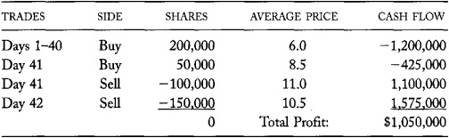
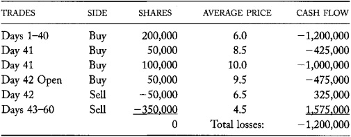
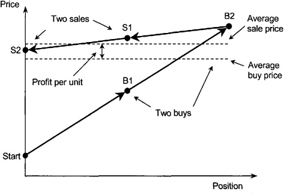
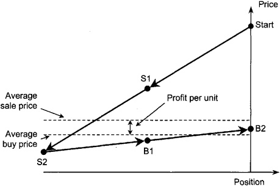
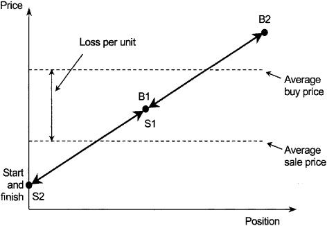
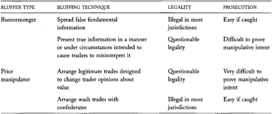

# Chapter 12: Bluffers and Market Manipulation

*Bluffers* are profit-motivated traders who try to fool other traders
into trading unwisely. The bluffers then profit from those foolish
traders. To trade profitably, you must avoid trading with bluffers.

Bluffers use two techniques to fool their victims. *Rumormongers* spread
information that they hope will encourage people to trade as the
bluffers want them to trade. The information may be false information,
or it may be true information presented in a manner or under
circumstances that would cause traders to misinterpret it. *Price
manipulators* arrange trades at prices, volumes, and times that they
hope will change people's opinions about instrument values. The trades
may be real market trades properly arranged at arm's length, or they may
be *wash trades* arranged with confederates to create artificial market
activity. Both bluffing techniques present the bluffers' victims with
information that the bluffers hope will cause them to make false
inferences about values. In both cases, bluffers try to convince other
traders that they are well-informed traders.

*Market manipulation* occurs when bluffers or their victims cause prices
to change from what they would be if the bluffers did not pursue their
bluffing strategies. Market manipulation is illegal in the United States
and many other countries. It is very difficult to catch, however. If the
bluffers do not openly fabricate information or arrange wash trades with
conspirators, they often can easily defend themselves by claiming that
they were engaged in legitimate trading strategies.

Traders who offer liquidity to other traders must be especially careful
not to offer liquidity to bluffers. To avoid losing to bluffers,
liquidity suppliers must be very careful when they make inferences about
values from prices and volumes. If they make these inferences poorly,
bluffers may manipulate their trading and thereby profit. To fully
understand how traders supply liquidity, you must understand how
bluffers discipline liquidity suppliers.

------------------------------------------------------------------------

[▶]{.ent} **Painting the Markets**

Traders say that price manipulators *paint the tape* when they trade to
influence other traders. Traders coined this term when automated
telegraph printers reported trades to off-floor traders. These
printers---called *tickers* because of the sounds that they
made---produced long paper ribbons called *ticker tapes*. Traders who
paint the tape cause the price record to appear differently than it
otherwise would appear.

Traders also say that price manipulators *paint a picture* when they
produce information that does not reflect true market conditions.
Manipulators hope that other traders will mistake their pictures for
reality. [◀]{.ent1}

------------------------------------------------------------------------

This chapter starts with an illustration of a bluff. We then formally
characterize bluffing. We discuss how bluffs work, why they sometime
fail, and why regulators cannot easily enforce laws against market
manipulation. The chapter concludes with a discussion of the
implications of bluffing for traders who offer liquidity.

## 12.1 A LONG-SIDE BLUFF

Bluffing is best introduced with an example. In the following invented
example, Bill undertakes a long-side bluff. In a *long-side bluff*, a
bluffer tries to profit by buying at low prices and selling later at
higher prices. Our example has two endings. In the first ending, Bill
successfully completes his bluff and makes great profits. In the second
ending, value traders call Bill's bluff, and he loses heavily.

After some careful research, Bill decides that the stock of a small firm
named Bubbles Never Burst (BNB) is a good candidate for his bluff. BNB
is a young firm that has developed a new
emulsifier with potentially valuable applications ranging from bathtub
soaps to industrial foams. The stock is followed by many investors who
are excited by its growth prospects. Most of them know little or nothing
about the underlying chemistry. BNB currently has no earnings and is
trading for 5 dollars a share. The firm has 8 million common shares
outstanding, of which management holds 70 percent.

Bill starts his bluff by buying BNB shares as quietly as he can. Using
limit orders, he patiently waits for the market to come to him. Because
other traders also occasionally want to buy the stock, the price starts
to rise. Over the next 40 trading days, Bill buys 200,000 shares at
prices ranging from 5 dollars to 7 dollars. His average trade price is 6
dollars.

On the thirty-first trading day, and continuing thereafter, Bill starts
to praise the stock extensively in messages he posts to various Internet
message boards. He describes BNB's technology in substantial detail, as
though he fully understood it. He also provides very optimistic cash
flow projections for applications of the technology. His messages draw
heavily on information presented in BNB's most recent 10-Q and 10-K
reports. He posts these messages under several different user names, so
that it appears that the stock is widely followed. He even has his
various user names spar with each other on the message boards to
strengthen the impression that they represent different people. Of
course, his pessimistic user names eventually grudgingly concede winning
points to his optimistic user names.

On the morning of the forty-first trading day, BNB independently issues
a press release that announces it will be producing its new emulsifiers
in China. The news is not surprising to anyone who read BNB's last 10-Q
report, in which BNB provided a positive status report of its efforts to
produce in China. Several electronic news services receive electronic
copies of the press release. Most news service editors run the story by
publishing an exact or slightly edited copy of BNB's press release.

Bill sees the news immediately because he subscribes to a real-time
information service that he has programmed to alert him whenever stories
about BNB appear. Although the announcement has no particular
fundamental value, Bill quickly decides that it represents the
opportunity for which he has been waiting. He immediately submits market
orders to buy 50,000 shares of BNB stock. He divides the orders into
several parts and submits them to different brokers without telling them
about the other parts. When the orders converge on the market, the price
rapidly rises. In 20 minutes, it goes from 7 dollars to 10 dollars as
Bill buys 50,000 shares at an average price of 8.5 dollars. At the end
of the hour, several news services are reporting that BNB is up
substantially for the day on unusually large volume. BNB also appears on
various electronic intraday lists of the largest daily price gainers.

Bill also starts posting notes to the Internet bulletin boards about the
importance of the China information. His notes now project price targets
of 20 and 25 dollars per share, with the possibility of more than 50
dollars a share by the time the new plant comes on line.

##### 12.1.1 The Successful Ending: Bill Profits

Some traders who follow BNB closely see the price change. They
immediately query their electronic information retrieval services to
determine why the stock is moving, and when
it started to move. They find the story about producing in China and see
that the price increase immediately followed its publication.

Although the news has no particular fundamental value, many traders
infer more from the story than they should because of the large positive
price change that followed the announcement. They mistakenly conclude
that other traders believe the story is extremely good news. They
foolishly ask themselves, "Why else would the market have gone up?" They
convince themselves that someone obviously thinks the stock is a good
value. In light of this information, they reevaluate their opinions
about BNB. BNB's technology now seems more promising, and the firm's
prospects look much brighter than when they last thought about the
company. They say to themselves, "Because I certainly am among the first
to see this news, I probably can still profit by buying BNB stock. If I
wait too long, the price will continue to rise, and I will have lost my
opportunity." These traders then buy the stock. Since they are afraid
that others may soon come to the same conclusion that they have, they
submit market orders to trade quickly.

Traders who buy when the market is rising and sell when it is falling
are *momentum traders*. They are particularly susceptible to bluffs.

These momentum traders primarily buy their stock from Bill! Bill lets
the stock continue to rise to close at 12 as he sells 100,000 shares at
an average price of 11 dollars.

By late afternoon, the stock exchange has contacted the CFO of BNB about
the price rise. She reports that management is completely mystified by
the events. The firm considers issuing a second press release stating
that they have no idea why their stock price is rising. BNB's attorney,
however, advises against doing so, for fear of exposing the firm to
lawsuits. When news service reporters call, management declines to
comment, stating that they have a policy of not commenting on market
fluctuations.

By the next day (day 42), many other traders have seen the price rise.
Some believe it indicates that the stock may do very well in the future.
Others have read Bill's notes on the various Internet bulletin boards
and now agree that the stock probably is undervalued. These traders also
may have seen news stories reporting that BNB declined to comment on the
burst in market activity. They interpret the refusal as a further
indication that something is happening. These foolish traders try to buy
the stock.

Other traders believe that the stock may be overvalued, but most are not
willing to act on their opinion because they are not sure whether other,
more significant, fundamental information might account for the large
price rise. Still others think the stock is overvalued, but are
unwilling to sell it because they expect that it will rise further.

Bill sells heavily throughout the day, along with a few value traders.
The stock peaks at 13 dollars and then drops to 8 dollars on very high
volume. Bill sells his remaining 150,000 shares at prices ranging from
13 to 8 dollars. His average sales price for these trades is 10.5
dollars. His total profit for the bluff, computed in [table
12-1](#part0022.html_ch12tab01){.nounder}, is 1,050,000 dollars.

Over the next few days, more value traders enter and sell. Within a few
weeks, the price has dropped back to 5 dollars. Those momentum traders
who bought stock at high prices and held it, lost heavily. The value
traders who sold the stock made money.

Given the unusual pattern of trading, the exchange where BNB is listed
initiates an investigation to determine who traded and who profited.
Their investigators quickly determine that Bill was a significant player
in the episode and that his trading was quite profitable. It appears to
the exchange that Bill may have been manipulating prices. The exchange
then provides the SEC with a brief of the case.

**TABLE 12-1**.\
Bill's Trading Profits in the Successful Ending to His Bluff

{.calibre9}

When exchange and SEC investigators confront Bill with this accusation,
he acts astounded that anyone would accuse him of such a thing. Bill
claims that he was simply a well-informed trader. In his defense, Bill
tells the following story:

After reading BNB's 10-Q and 10-K reports, and after doing other
research into the emulsifier market, I became convinced that BNB had
excellent growth prospects. I therefore bought a significant position in
the stock. When I saw the China announcement, I decided to start trading
aggressively. I believe that BNB's innovative emulsifier will be
accepted quickly in China, where they do not already have large plants
producing traditional emulsifiers. Moreover, given the huge potential of
the Chinese market, I feel that the prospects there are extraordinary. I
traded aggressively because I feared that other people would soon see
the same announcement and realize that the company was significantly
undervalued. I had read several positive stories about the China
initiative on various Internet bulletin boards, and I assumed that
others had as well. I broke up my order because I do not trust my
brokers with large orders: I would rather front-run myself than let them
front-run me. The subsequent price increase confirmed to me that I had
been right about the stock. Although I undoubtedly was responsible for
some of the price rise, others were buying, too. When I saw that so many
others were buying the stock, I decided they were going to overreact and
push the price above its fundamental value. When I met my price target,
I decided to sell. It was much sooner than I expected, and I was
thankful to have identified the stock while it was still undervalued.

Upon hearing his story, the investigators ask, "Why didn't you
repurchase the stock when it fell to 5 dollars?"

Bill answered:

I was surprised, and therefore a bit scared, when the price fell back to
5 dollars. I fully expected that the price would stay above 8 dollars.
Obviously, the market does not believe that this stock is as valuable
as I thought it was. Although I have been
thinking of repurchasing it, I am reluctant to do so until I can figure
out whether the market is wrong or I am wrong.

The investigators naturally suspect that Bill was the author of the
Internet messages. Some messages contain information that Bill knew, or
should have known, was incorrect or misleading. If the investigators can
determine that Bill was the author, they can prosecute him for
securities fraud. They therefore subpoena the message board hosts for
information about who posted various messages about BNB. Bill is not
concerned, however, since he opened his Internet accounts using false
names and he always logged on using publicly available computers in
libraries, schools, and Internet cafés. The investigators ultimately
determine that the postings originated in Bill's hometown, but they
cannot trace them directly to Bill.

The investigators conclude that they probably cannot convict Bill with
the available evidence. After giving Bill an essentially toothless
warning, they drop the case.

##### 12.1.2 The Unsuccessful Ending: Bill's Bluff Is Called, and He Loses

After the rapid run-up of the stock price immediately following the
Chinese press release, many traders start to wonder just what is going
on. Among them is a value trader named Valerie, who has long been
skeptical about BNB's prospects. Valerie is intimately familiar with the
firm, with its technology, and with the markets it hopes to enter. After
consulting with an expert emulsifier chemist, she believes that the firm
should be worth no more than 3 dollars per share, even though the new
emulsifier has some valuable uses. At 5 dollars, she was unwilling to
sell the stock due to the uncertainties inherent in her value estimate.
At 10 dollars, however, the stock appears very overpriced. She is
concerned about why the price is so high.

Valerie suspects that a bluffer may be responsible. She reads the
Internet message boards and is aware that several authors are posting
misleading messages which are overly optimistic. She wonders whether
these messages might be the work of a single individual. Since she
believes that the China story was not material, she finds the price
reaction to the story surprising. Valerie suspects that a bluffer may
have created it. To confirm her suspicions, she asks her broker to send
a floor broker to the BNB post to determine what happened. The floor
broker reports that several large buy orders arrived at the same time.
The coincidence of large orders from several brokers arriving
immediately after the announcement of seemingly insignificant news seems
strange to Valerie. She believes that a bluffer may be responsible for
the rapid increase in price.

Valerie is now quite confident that the stock is overvalued at 10
dollars. She believes that she understands both the fundamental value of
the stock and why it is trading so high. She therefore starts selling
the stock short. Since she thinks a bluffer may also start selling soon,
she sells very aggressively. Her trading stops the price rise at 10
dollars.

Although Valerie may know more about BNB's value than anyone else does,
other value traders also believe that BNB is overvalued at 10 dollars.
They start selling, too.

Bill, who would like prices to advance further, tries to buy more
shares. Valerie and the other value traders
sell as much as he buys, however, with no increase in price. Bill buys
100,000 additional shares at 10 dollars per share before the end of the
day. The value traders sell 100,000 shares to Bill and another 75,000
shares to foolish momentum traders who fell for Bill's bluff.

At the start of the next trading day, Bill is very worried. If he cannot
get the price to rise quickly, the stock will lose its momentum, and he
will be the only buyer. If he stops buying, price probably will fall. If
he starts selling, price probably will dive. His situation is desperate.
He gambles and decides to place an opening order for 50,000 shares to
move prices up.

Overnight, Valerie and other value traders have been calling around to
obtain more shares to borrow to sell short. The institutions that hold
these shares now consider what is going on. Some realize that the sudden
interest in their shares from well-known value traders can only mean
that they are overpriced. Rather than lend the shares, these
institutions decide to sell themselves. They place large sell orders at
the open for 75,000 shares.

The market opens at 9.5 dollars, and most of the momentum traders
disappear. Bill now owns 50,000 more shares for a total of 400,000
shares. Price starts to fall as more shares come onto the market.

Things now look terrible for Bill. If he does nothing, prices will drop
substantially, probably back to 5 dollars. If he starts to sell, prices
will drop even faster. If he continues to buy, he might be able to
regain the momentum he needs to draw other traders in, but he does not
know how many shares it will take. If it takes more shares than he can
finance, further purchases will only make his bad situation worse.

Bill concedes that that he has lost. Valerie has successfully called his
bluff. He now must sell 400,000 shares at the best prices he can.
Unfortunately, the only significant potential buyers are the value
traders who want to close their short positions at a profit. At current
prices, however, they are still sellers. They will not consider buying
the stock until it drops significantly. Bill manages to sell 50,000
shares at an average price of 6.5 dollars as the stock plummets to close
at 5 dollars. Over the next 18 days, he sells the remainder of his
position at an average price of 4.5 dollars. His total loss for the
failed bluff, computed in [table
12-2](#part0022.html_ch12tab02){.nounder}, is 1.2 million dollars.

Given the unusual pattern of trading in BNB, the exchange initiates an
investigation to determine who traded and who profited. Their
investigators quickly determine that Bill was a significant player in
the episode, but his trading was quite unprofitable. It appears to them
that Bill manipulated the market. The exchange provides the SEC with a
brief of the case. Given its limited enforcement budget and the fact
that the bluff failed, the SEC decides to take no formal action.
Instead, it sends a stern letter to Bill warning him against conducting
similar operations in the future.

**TABLE 12-2**.\
Bill's Trading Profits in the Unsuccessful Ending to His Bluff

{.calibre9}

##### 12.1.3 Is the Example Realistic?

For expositional clarity, this invented example presents an extreme
scenario in which Bill trades quite aggressively. Although the example
nicely illustrates many issues involved in bluffing, we should consider
how realistic it is.

The example is not as extreme as it may appear. The Securities and
Exchange Commission was founded in large part in response to public
concerns about similar market manipulations that plagued the markets
throughout the nineteenth century and into the early 1930s. Although the
SEC has greatly decreased the number of blatant market manipulations, it
still devotes a substantial fraction of its enforcement budget to
identifying and prosecuting market manipulators. The Commission now
targets its efforts mostly at abuses in small, low-priced growth stocks
that traders often call *penny stocks*. Many people widely believe that
similar bluffing operations are still conducted frequently in less
regulated markets throughout the world.

Had Bill's trading behavior not been so extreme, his bluff might have
gone undetected. It is impossible to say how often traders actually
conduct small, undetected bluffs in real markets.

Some traders probably commonly employ bluffing strategies. Bluffing can
be profitable when many traders will respond to information that
bluffers manufacture for their benefit, and when value traders are slow
to react. Since many traders are foolish, and since value traders
sometimes trade slowly, bluffing strategies often may be profitable.
Cautious bluffers who are not so greedy that their trading draws
attention to themselves therefore may trade profitably. Such traders may
trade undetected in the markets.

## 12.2 THE FUNDAMENTALS OF BLUFFING

Bluffers profit by encouraging traders to sell when the bluffers want to
buy and to buy when the bluffers want to sell. They do this by producing
or distributing information that their victims use to form opinions
about future prices.

For example, bluffers who want to sell stock may disseminate information
about how valuable it is. Traders who see the good news may decide to
buy the stock. The bluffers then sell the stock to them at higher prices
than they otherwise would have been able to obtain. Alternatively,
bluffers may quickly buy the stock at successively higher prices.
Traders who see the price rise may conclude that informed traders are
buying the stock, and then try to buy it themselves. The bluffers will
sell the stock to them, again at higher prices than the bluffers
otherwise could have obtained. Bluffers employ similar strategies when
they want to buy stock.

##### 12.2.1 Bluffers and Informed Speculators

Market manipulations are very hard to distinguish from legitimate
speculative trading activities. Speculators who hold large long
positions naturally want the market to value their securities and
contracts highly. Like bluffers, they may use word-of-mouth, the press,
newsletters, or Internet message boards to explain to all who will
listen why prices should be higher. Like bluffers, legitimate
speculators also may buy instruments to show the market that confident
buyers think their positions are undervalued.

------------------------------------------------------------------------

[▶]{.ent} **Nathan Rothschild and
the Battle of Waterloo**

While the Battle of Waterloo was waged on June 18, 1815, British
government bond traders in London awaited the outcome. If Napoleon's
Grande Armée defeated the English-Prussian allies under the command of
Lord Wellington, British consol bonds would fall. If Napoleon lost, the
consols would rise. On June 18, however, the London traders did not even
know that the battle had started. They learned the official outcome of
the battle only after the Cabinet received Wellington's dispatch at 11
[P.M]{.small}. on June 21. Communications before the invention of the
telegraph were much slower than now.

The Rothschild family of investment bankers ran a private system of
couriers to move information, securities, currency, and bullion
throughout Europe. Their system was very fast, given the available
technology. The Rothschild brothers often were the first to learn news
in their respective cities.

London-based Nathan Rothschild learned of Wellington's victory late on
the night of June 19. He conveyed it to the government the next day.
What happened next may be the most enduring myth in finance.

In the most common version of the story, Rothschild then went to the
Stock Exchange to trade on his information. The bond traders believed
that he would know the result of the battle before anyone else in
London. They therefore looked to him for leadership. If Rothschild
started to buy consols, they also intended to buy. If he sold, they
would sell.

Nathan Rothschild knew that he could not profit from his information
under these circumstances without bluffing. Accordingly, after arriving
at the Exchange, he purportedly stood impassively as his agents started
to sell consols. The traders quickly concluded that Rothschild was a
seller. As they frantically tried to sell their consols, the price
dropped dramatically. Rothschild then bought consols at low prices. When
the news of Napoleon's defeat became public knowledge, consols rose
substantially, and Rothschild profited handsomely.

Although academic historians believe the story is a myth, it nicely
illustrates bluffing issues. Business rivals or anti-Semites probably
created the story to discredit the Rothschilds. Rothschild did profit
handsomely from buying consols following the war, but he apparently made
his purchases well after the Waterloo news was common knowledge.
[◀]{.ent1}

*Sources: Frederic Morton*, The Rothschilds: Portrait of a Dynasty, New
*York: Kodansha International, 1998; and Niall Ferguson*, The House of
Rothschild, *New York: Viking, 1998*.

------------------------------------------------------------------------

The distinguishing difference between bluffers and informed speculators
is that speculators trade on opinions about fundamental values that they
base on fundamental information. Bluffers behave as though they are
informed speculators, and they hope that others will believe they are
well-informed speculators, but they do not have well-founded opinions
about values. Instead, they try to fool other traders into thinking they
do. Hence, the term "bluffer."

Because informed speculators trade on fundamental information, their
trading activities make prices more informative. Since bluffers do not
have such information, their trading more often than not makes prices
less informative. Prices are more likely to reverse following a bluff
than following a well-informed speculative trade.

------------------------------------------------------------------------

[▶]{.ent} **An Internet Stock Fraud
in PairGain Technologies**

On April 7, 1999, at 10:24 [A.M]{.small}., the following message (number
18,280) was posted to the Yahoo! message board for PairGain Technologies
(PAIR):

BUYOUT NEWS!!! ECILF is buying PAIR ...

by: stacylTN (32/F/Knoxville, TN)

Just found it on Bloomberg ...

[[http://204.238.155.37/biz2/headlines/topfin.html](http://204.238.155.37/biz2/headlines/topfin.html){.nounder}]{.weblink}

GO PAIR!!!!

SL

If you had clicked on the URL link, a seemingly properly formatted
Bloomberg page would have appeared with a very credible news story about
the acquisition agreement.

The story was false. The Web address does not point to a Bloomberg.com
server, but rather to a free Web page service operated by Anglefire.com.
Although the link is no longer active, you can read much of the story in
Yahoo! PAIR message number 18,477.

Following the posting, the PAIR stock price rose to a high of
11[⅛]{.ent1} from its previous close of 8½ on very heavy volume. For the
day, the stock traded 14 million shares, which was about ten times its
normal volume. Traders detected the fraud very quickly. (See messages
18,287 and 18,289.) When the company issued a statement denying the
story, the stock fell to close at 9[⅜]{.ent1}.

PairGain provides Digital Subscriber Line (DSL) telecommunications
products. At the beginning of 1999, the growth prospects of the firm
seemed extraordinary to many people. The stock was very widely followed
by small investors: The April 7 Yahoo! posting was the 5,079th message
posted in 1999!

On April 15, the FBI arrested Gary Dale Hoke, 25, on charges of
securities fraud for allegedly fabricating the news story. The SEC later
also charged him in a civil suit.

Hoke worked for PairGain. His motive for the fraud is not obvious: He
did not trade PairGain Technologies before or after this episode. Had he
bought the stock beforehand, and sold it soon after releasing the story,
he would have profited handsomely. Had he been more careful about how he
posted the story, he might have avoided detection.

Many traders who relied upon his story lost money, as did many other
traders who simply bought because the stock price was rising. Traders
who quickly identified the fraud could have profited substantially.
[◀]{.ent1}

*Sources: Yahoo! PAIR messages 18,280 and 18,477*.

------------------------------------------------------------------------

Although bluffers generally are not well informed about fundamental
values, they are informed traders in a special sense. They possess
highly valuable information that other traders do not know. In
particular, they know what they are doing as bluffers, whereas others
generally do not. This knowledge allows them to better interpret market
conditions---that they may have created themselves---than other traders
can. Unlike fundamentally informed traders, who work hard to obtain the
information upon which they can trade profitably, bluffers create their
information!

------------------------------------------------------------------------

[▶]{.ent} **Bluffing and Poker**

The game that bluffers play in the markets against value traders is
similar in many respects to the game of poker.

In poker, players try to fool other players into believing that they
have better cards than they do. The other players then consider whether
this is likely. If they suspect not, they bet against the bluffer. The
players take turns upping the ante until they drop out or until no one
wants to bet further. Any remaining bets are resolved by comparing
cards.

In trading, bluffers try to fool other traders into believing that they
have material information about fundamental values that others do not
have. Value traders then consider whether the bluffers are well-informed
traders. If they bet against the bluffers, the bluffers and value
traders take turns upping the ante until one group drops out or until no
one wants to bet further. Values are resolved as time passes.

The similarities between these two games suggest that the best bluffers
may also be good poker players.

The two games differ in several important respects. In most versions of
poker, players must fold if other players challenge them to ante up and
they refuse to do so. In trading, all players can stand on their
positions as long as they can finance them. In poker, all players know
with whom they are playing. In trading, most traders trade anonymously,
and their trades are rarely identified. Traders can characterize their
opponents only by the aggregate behavior of the market. In poker, the
number of players is fixed. In trading, traders can enter the market
whenever they want. Finally, players settle all poker bets when they
reveal their cards. In trading, values are never resolved with
certainty. [◀]{.ent1}

------------------------------------------------------------------------

##### 12.2.2 Bluffers and Value Traders

Value traders foil bluffers. When bluffers cause prices to move far from
their fundamental values, value traders may recognize the resulting
profitable trading opportunities. If they then trade to profit from
those opportunities, the bluffers may lose control of the market. Value
traders make it difficult for bluffers to move prices far from their
fundamental values. They also make it difficult for bluffers to profit
from the price changes and order flows that they have created. When
bluffers and value traders are on opposite sides of the market, the
value traders stand in the bluffers' way. When bluffers and value
traders trade on the same side of the market, value traders take
liquidity that the bluffers need to trade profitably.

Bluffers can defeat value traders only if they have more capital than
the value traders do. With enough capital, bluffers can retain control
over the market and even force losses upon the value traders who trade
opposite them. If the value traders are not sufficiently capitalized,
they may be unable to bear these losses. If that is the case, large
adverse price changes may force them to close their positions. Since
such closing trades support the bluffer's bluff, bluffers always hope to
force value traders out of the market. Even if bluffers profit from
their manipulations, tenacious and well-capitalized value traders will
eventually profit when the bluff collapses and prices eventually return
to their fundamental values. The profits that value traders make
diminish the profits that bluffers make.

Value traders risk losing to better-informed fundamental traders when
they mistakenly attribute trading activity to a bluffer. Value traders
must therefore be very certain that they fully understand fundamental
values before they attempt to call a bluffer's bluff.

------------------------------------------------------------------------

[▶]{.ent} **Jeffrey Vinik's Trading
in Some Small Microcap Stocks**

Jeffrey Vinik managed the Fidelity Magellan Fund for several years
ending in June 1996. It was then the largest stock mutual fund in the
world. Although it had underperformed the market during the last year of
his tenure, Vinik was---and still is---widely regarded as a very
well-informed trader.

After Vinik left Fidelity, he started his own investment fund in
November 1996. In the next several months, Vinik bought stakes larger
than 5 percent in 13 small and microcap stocks for his new 800
million-dollar hedge fund.

The SEC requires that investors disclose their positions when they have
acquired more than 5 percent of outstanding shares of a company. These
reports are publicly available.

When the public learned of Vinik's purchases, the prices of 11 of the 13
stocks increased substantially, presumably because investors felt that
Vinik was well informed. However, shortly after these disclosures and
their associated price increases, Vinik sold several of his new
positions.

Vinik may have sold simply because his price objectives were realized.
Alternatively, he may have been trading on his reputation as a
well-informed trader to bluff the market into believing that these
securities were more valuable than they were.

Interestingly, in 1994 and 1995, while still managing the Magellan Fund,
Vinik was selling stocks that he apparently had been promoting at the
same time in magazine interviews. The SEC considered whether his actions
constituted market manipulation, but did not charge him. [◀]{.ent1}

*Sources: Susan Pulliam*, Wall Street Journal, *January 24, 1997, p. CI;
and Jeffrey Taylor*, Wall Street Journal, *May 9, 1996, p. CI*.

------------------------------------------------------------------------

Bluffs are most likely to be successful when attempted in securities
that value traders either do not follow closely or cannot trade easily.
Value traders tend not to follow illiquid securities closely because
they cannot trade enough to profit substantially from their costly
fundamental research. Illiquid securities therefore may be good targets
for bluffers. Value traders also tend not to follow securities that they
cannot easily value. Bluffers therefore may target securities for which
little fundamental information is available to the market. Finally,
value traders generally cannot sell securities that they cannot borrow.
Bluffs therefore are more likely in securities that are hard to borrow.
These securities are often small stocks for which the bluffer controls a
substantial fraction of the shares outstanding. Because value traders
generally can buy securities more easily than they can short sell them,
long-side bluffs probably are more common than sell-side bluffs.

##### 12.2.3 Prosecuting Market Manipulation

Prosecuting market manipulators is very difficult because bluffers
always claim to be well-informed speculators. The best bluffers probably
are often well informed, though not necessarily about the objects of
their bluffs. Since prosecutors, judges, and juries cannot easily
determine whether an opinion is well founded or not, they cannot
distinguish between informed speculation and bluffing. Moreover, a
subsequent price reversal does not provide
sufficient basis to conclude that the bluffer
was uninformed, because even good speculators sometimes estimate values
poorly. If bluffers are not caught disseminating false information or
conducting wash trades, they can easily pass for the speculators that
they hope others will take them to be.

To convict bluffers of market manipulation, prosecutors must show that
bluffers are distributing information that they knew (or should have
known) was false or that they engaged in wash trades. Well-informed
testimony demonstrating manipulative intent also would help. Although
such testimony might come from confederates in the scheme or from the
bluffers' confidants, it must be quite rare.

## 12.3 BLUFFERS DISCIPLINE LIQUIDITY PROVIDERS

Traders who provide liquidity to the market must be extremely careful
that bluffers do not fool them. As we shall see in [chapter
13](#part0024.html_ch13){.nounder}, many liquidity suppliers do not know
fundamental values well. Instead, they simply follow the rule of supply
and demand: They assume that prices should be higher or lower depending
on whether liquidity-demanding traders are net buyers or net sellers.
(Liquidity demanders are *net buyers* when they want to buy more than
they want to sell, and *net sellers* otherwise.) Although this rule is
generally sound, traders who use it to set the prices at which they are
willing to trade must be very careful. By manipulating supply or demand,
bluffers can cause liquidity suppliers to change their prices. Liquidity
suppliers therefore must ensure that bluffers do not manipulate their
trading to their disadvantage.

For example, suppose that bluffers know liquidity suppliers respond
differently to large orders than to an equal volume of small orders. In
particular, suppose that liquidity suppliers will raise (or lower) their
prices by 10 cents per 100 contracts bought (or sold) for 1,000 contract
orders, but by only 5 cents per 100 contracts bought (or sold) for 500
contract orders. A clever bluffer who is aware of this relation may buy
4,000 contracts with four 1,000-contract orders and then sell those
4,000 contracts with eight 500-contract orders. If the contract calls
for the delivery of 1,000 units, the net result will be a profit of 1.5
million dollars.

To compute the profit, suppose that the last contract price before the
bluffer started to trade was 10 dollars. (Any initial price will give
the same answer.) The four 1,000 contract buys will take place at 11,
12, 13, and 14 dollars, so that the average purchase price for the 4,000
contracts will be 12.5 dollars. The eight 500 contract sales will start
at a price of 13.75 dollars and take place at successively lower prices
until the eighth and last sale takes place at 12 dollars. The average
sales price will be 12.875. Since the average sales price is greater
than the 12.50 average purchase price, this sequence of trades will be
profitable. The total profit will be 4,000 times the 0.375-dollar
difference in the average sale and purchase prices times the 1,000-unit
contract size. The product of these three factors is 1.5 million
dollars.

You can see that something is wrong here by noting that although the
bluffer bought and sold an equal number of contracts, the last trade
price of 12 dollars is far from the initial 10-dollar market price. The
bluffer was neither a net buyer nor a net seller, but liquidity
suppliers raised prices by 2 dollars in
response to his orders. This difference indicates that the liquidity
suppliers did not set their prices in a manner consistent with the
principles of supply and demand.

Had the bluffer in this example initially sold short using four
1,000-contract sales and then covered his position by buying 500
contracts eight times, he also would have made 1.5 million dollars. In
this case, however, the price would have moved from 10 dollars to 8
dollars.

Although this stylized example may not seem realistic, it shows clearly
that liquidity suppliers can lose to bluffers if they do not adjust
their prices carefully. To avoid these losses, liquidity suppliers must
adjust prices up or down at the same rate per quantity traded,
regardless of whether the quantities are large or small.

In our example, if the rate at which liquidity suppliers adjust their
prices were the same for both large and small sell orders, no bluffing
profits would be possible. Suppose that the liquidity suppliers raise or
lower prices by 10 cents per 100 contracts traded, regardless of order
size. A bluffer who buys 1,000 contracts four times and then sells 500
contracts eight times would cause prices to rise from 10 to 14 and then
to return to 10. The average purchase price would be 12.5 and the
average sell price would be 11.75, so that the total loss would be 3
million dollars. Had the bluffer first sold 1,000 contracts four times
and then bought 500 contracts eight times, the resulting loss would be
the same. The bluffer loses because all his orders individually have an
impact on price but collectively have no net price impact. Since the buy
orders push prices up and the sell orders push prices down, the average
buy price must be greater than the average sell price if the trades are
to have no net effect on price.

(If the bluffer had made many smaller trades, his losses would have been
much smaller. For example, had he bought 100 contracts 40 times and sold
100 contracts 40 times, his losses would have been only 0.4 million
dollars. The smaller trades are less costly because they do not move
prices as much.)

In general, bluffers can trade profitably when the price impact of their
purchases is different from the price impact of their sales. If selling
has less price impact than buying, bluffers will buy first and then
sell. If buying has less price impact than selling, they will sell first
and then buy. In the successful ending to the BNB example, Bill profited
because the price impact of his quick trades following the China
announcement was greater than the price impact of his sales.

Figures 12-1 and 12-2 illustrate this principle. In figure 12-1, buys
have greater price impact than sales. The bluffer first buys to raise
prices and then sells to profit from the higher prices. The bluff is
profitable because the average buy price is less than the average sale
price: Although the price impacts of the bluffer's trades incur
transaction costs, he profits because he can raise the price during the
course of his bluff. In figure 12-2, sales have greater price impact
than buys. The bluffer therefore sells first and then buys.

To avoid losing to bluffers, liquidity suppliers must be very
disciplined when they adjust their prices in response to the flow of
buyers and sellers that they serve. In particular, whenever liquidity
suppliers cannot determine whether they are trading with bluffers, they
must adjust their prices so that buy and sell orders have equal (but
opposite) market impact per quantity traded. The market impact per
quantity traded must be the same for trades of all sizes; it must be the
same regardless of whether the orders arrive quickly or slowly; and it
must be the same regardless of when and how the orders arrived.
Otherwise, bluffers can arrange trades to manipulate prices to their
advantage.

{.calibre9}

**FIGURE 12-1**.\
Bluffing When Buys Have More Price Impact per Unit Traded Than Sales\
Each heavy arrow represents a trade. Arrows that lean to the right or
left represent buys or sells, respectively. Arrows that rise or fall
represent trades that increased or decreased prices, respectively. The
slope of each arrow thus represents the price impact per unit traded for
the corresponding trade. Buys B1 and B2 have greater price impact per
unit than sells S1 and S2. The bluff consists of buys B1 and B2 followed
by sales S1 and S2. The bluff is profitable because the average buy
price is less than the average sale price.

{.calibre9}

**FIGURE 12-2.**\
Bluffing When Sales Have More Price Impact per Unit Traded Than Buys\
Sales S1 and S2 have greater price impact per unit than buys B1 and B2.
The bluff consists of sells SI and S2 followed by buys B1 and B2. The
bluff is profitable because the average sale price is above than the
average buy price.

{.calibre9}

**FIGURE 12-3.**\
Bluffing Is Not Profitable When Buys and Sales Have the Same Price
Impact per Unit Traded\
Buys B1 and B2 and sells S1 and S2 all have the same price impact per
unit. A bluff consisting of buys B1 and B2 followed by sales S1 and S2
is not profitable because the average buy price is greater than the
average sale price.

In practice, bluffers may not be able to profit from small differences
in the market impacts of the buy and sell orders. Since bluffing is a
very transaction-intensive activity, the commissions and spreads that
bluffers pay when trading can significantly reduce the profits of their
manipulations. Like all traders, bluffers must control their transaction
costs in order to trade profitably.

Figure 12-3 shows that bluffing is not profitable when the price impact
per unit traded is the same for buys and sales. The bluffer loses
because the price impacts of his trades only generate transaction costs
without producing a cumulative price change during the course of his
trading. The loss would be smaller if the bluffer broke his total volume
into many smaller trades, so that each trade would have less price
impact.

## 12.4 SUMMARY

*Bluffers* try to fool traders into offering liquidity unwisely. They
fool traders by affecting the information that traders use to make their
trading decisions. Rumormongers disseminate information about values. It
may be false information or it may be true information that they
distribute in a manner that they believe traders will misinterpret.
Price manipulators trade at prices and in volumes that they hope will
fool traders into thinking market conditions are different from what
they truly are. In particular, they try to fool traders into believing
that they are well-informed traders. [Table
12-3](#part0022.html_ch12tab03){.nounder} summarizes the techniques that
bluffers use to fool other traders.

**TABLE 12-3**.\
Bluffing Techniques

{.calibre9}

Bluffers generally can profit when the price impact of their purchases
is different from the price impact of their sales. When purchases have
greater impact than sales, they buy first and sell later. When sales
have greater impact than purchases, they sell first and buy later. Such
bluffing strategies are not profitable, however, when transaction costs
are high.

The traders most vulnerable to bluffers are momentum traders and
liquidity suppliers. These traders trade in response to trades that they
see. Since bluffers can affect the trades that these traders see,
bluffers may fool them into making poor trading decisions. To avoid
these losses, traders must be very careful about how they interpret
trade prices, sizes, and times.

Value traders can call a bluffer's bluff. If bluffers move prices away
from fundamental values, value traders may identify profitable trading
opportunities. Their trading makes it difficult for bluffers to control
the market, and it diminishes the profits that bluffers make. Failed
bluffs can be very expensive to bluffers.

## 12.5 SOME POINTS TO REMEMBER

• Bluffers profit by fooling traders into offering liquidity unwisely.

• Bluffers hope that other traders will mistakenly identify them as
well-informed traders.

• Momentum traders must be especially careful to avoid trading with
bluffers.

• When the price impacts of sales and purchases differ and transaction
costs are not too large, bluffers can design profitable trading
strategies.

• Bluffing destabilizes prices.

• Bluffers can lose when large value traders trade against their
positions.

## 12.6 QUESTIONS FOR THOUGHT

• What effect does bluffing have on price efficiency? On volatility?

• What effect does bluffing have on price serial correlation?

• How much volatility is due to bluffing?

• Why are bluffers more likely to target
growth stocks than value stocks?

• How can traders avoid losing to bluffers?

• Should bluffing and market manipulation be illegal? How should
regulators enforce laws against bluffing?

• Are bluffers informed traders? Do bluffers have valuable information?

• Value traders who sell short are vulnerable to squeezes. How might a
bluffer squeeze these traders?

• In many jurisdictions, disseminating information about security values
that you know is false is illegal. Although identifying and convicting
violators may be expensive, the process is conceptually well defined.
Should disseminating true information in circumstances that you believe
would cause traders to misinterpret it also be illegal? How would you
write and enforce such a law?

• What effect would a shift to 24-hour trading have on bluffing?

• Suppose that a rumormonger profits by short selling a security,
circulating a false rumor that causes prices to fall, and buying to
cover at lower prices. The rumormonger has clearly defrauded the market.
Who should be entitled to damages in a civil suit? Does your answer
depend on whether traders would have traded regardless of what the
rumormonger did? Does your answer depend on whether traders traded with
the rumormonger or with other traders? 

## Part IV: Liquidity Suppliers

This part of the book examines how and why traders supply liquidity to
other traders. We start in [chapter 13](#part0024.html_ch13){.nounder}
by discussing dealers. Dealers make markets. They allow other traders to
trade small size quickly. Dealers tend to be high-frequency traders who
do not know much about with whom they trade or the fundamental values of
the instruments that they trade.

[Chapter 14](#part0025.html_ch14){.nounder} examines bid/ask spreads in
dealer markets and in order-driven markets. The discussions in this
chapter will help you to better understand the determinants of
transaction costs.

[Chapter 15](#part0026.html_ch15){.nounder} considers how block traders
arrange large trades. Block traders find liquidity for traders who want
to trade large sizes. They generally know their clients well.

We consider value traders in [chapter
16](#part0027.html_ch16){.nounder}. They are the ultimate suppliers of
liquidity. These highly informed traders often supply great depth when
they believe that prices do not reflect fundamental values.

We introduce arbitrageurs in [chapter
17](#part0028.html_ch17){.nounder}. Arbitrageurs are informed traders
who move liquidity from one market to the other. You must understand
their trading strategies well to appreciate the economic effects of
competition among market centers for order flows.

[Chapter 18](#part0029.html_ch18){.nounder} considers how buy-side
traders create order submission strategies. These decisions determine
whether they supply liquidity or take liquidity. When public traders are
willing to supply liquidity, they can often displace dealers.
