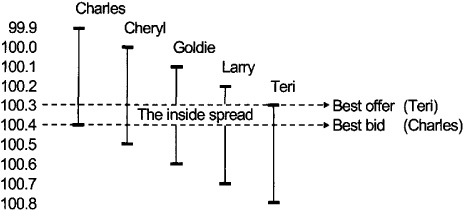
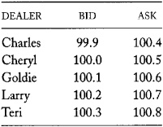
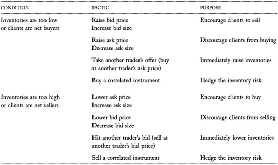
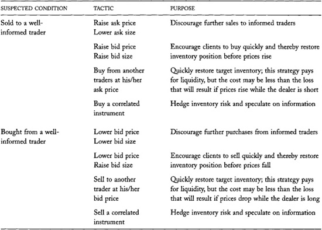
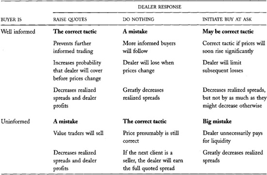

# Chapter 13: Dealers

Dealers are merchants who make money by buying low and selling high.
What you already know about merchants will help you understand how
dealers in the financial markets trade profitably.

Merchants may be dealers or distributors. *Dealers* buy from, and sell
to, their clients. *Distributors* buy from their suppliers and sell to
their clients. (In practice, many distributors are also commonly known
as dealers. Consider, for example, new car dealers.) Traders act as
dealers when they make a market in seasoned securities or in contracts.
They act as distributors when they help firms sell new securities or
when they help a client sell a large block of securities.

All dealers face the same problems regardless of what they trade. They
must set prices, they must market their services to acquire clients,
they must manage their inventories, and they must be careful that they
do not trade with better-informed traders. The relative importance of
these problems varies by what the dealers trade.

Dealers in the financial markets supply liquidity to their clients who
want to buy and sell trading instruments. They allow people to trade
when they want to trade. They buy when their clients want to sell, and
they sell when their clients want to buy.

Dealers make money by buying at low prices and selling at high prices.
They lose money when market conditions force them to sell at low prices
or buy at high prices. These losses often occur after they trade with
informed traders.

When dealers purchase something, they usually do not know to whom they
will sell it or at what price they will sell it. If the price drops
before they can sell the item, they lose money. Likewise, when they sell
something, they usually do not know the price that they will pay to
repurchase it. These unknowns make being a dealer challenging, exciting,
and very risky. Dealers assume significant risks when they trade.

Dealers are passive traders. *Passive traders* trade when other traders
want to trade. Since passive traders do not control the timing of their
trades, they must be very careful about how they offer to trade and to
whom they offer to trade. They must ensure that when they do trade,
their trades benefit them and not just their clients. Dealers must be
especially vigilant to avoid losing to informed traders and bluffers.

In this chapter, we will examine the principles by which dealers conduct
their businesses. You will learn how dealers set their quotes, how they
manage their inventories, how they respond to informed traders, and how
they learn about the values of the instruments that they trade. The
principles that we will discuss apply to all dealers, whether they trade
securities, commodities, or retail goods. If you are---or intend to
be---a dealer, understanding these principles will help you maximize
your trading profits.

Even if you have no interest in being a dealer, you must understand how
dealers behave in order to trade successfully
in financial markets. Whether you trade with dealers or compete with
them to offer liquidity, their trading decisions affect you. In
particular, you must consider how dealers trade when you decide whether
to take or offer liquidity.

In markets where dealers are the primary suppliers of liquidity, the
cost of liquidity depends on the factors that determine dealer profits.
If you are interested in market liquidity, you must understand how
dealers trade and when they are profitable.

We start this chapter with introductory discussions about who dealers
are, how traders negotiate with dealers, and how dealers attract order
flow. We then consider how dealers control their inventories and how
they set their prices. The chapter closes by examining how dealers
relate to value traders and to bluffers.

## 13.1 WHO ARE DEALERS?

Dealers are profit-motivated traders who allow other traders to trade
when they want to trade. The liquidity service they
sell---immediacy---is valuable to impatient traders. Dealers profit when
they buy from impatient sellers at low prices and sell to impatient
buyers at high prices. The difference in prices compensates them for
providing immediacy.

Many dealers are professional traders who work on the floors of
exchanges or in the offices of trading firms. These professionals
sometimes use computer systems to support their dealing or to implement
their trading strategies.

Other dealers are individuals who access the markets through their
brokers, often via Internet order entry systems. Such traders generally
supply immediacy by issuing limit orders. These individuals often do not
recognize that they are acting as dealers. They consequently do not
always fully appreciate the risks that they face and the circumstances
under which they will lose or profit.

Many markets officially register some traders as dealers. In exchange
for special privileges, these markets may require that their registered
dealers supply liquidity. We discuss these arrangements in [chapter
24](#part0038.html_ch24).

Dealers often are known by other names. At futures exchanges, dealers
are often called *scalpers, day traders, locals*, or *market makers*. At
many stock exchanges and options exchanges, they are known as
*specialists* or *market makers*.

Many dealers are also brokers. We discuss brokers and the dual trading
problem that broker-dealers present in [chapter
7](#part0015.html_ch07).

In addition to offering liquidity to other traders, many dealers
speculate. Dealers sometimes can predict future price changes by
inferring why traders demand to trade. They also can use quote-matching
strategies to capture the option values of limit orders that they see.
In many actively traded markets, competition among dealers may be so
intense that they cannot profit only by providing liquidity to
customers. In such markets, dealers must speculate successfully to stay
in business. Such dealers are sometimes called *position traders* as
opposed to spread traders. *Spread traders* profit exclusively from
buying at the bid and selling at the ask.

In this chapter, we consider only how dealers supply liquidity. Although
we discuss how dealers infer information from the order flow, and how
they react to it, we do not consider how they may speculate on it.
[Chapters 10](#part0020.html_ch10) and
[11](#part0021.html_ch11) examine the speculative trading
strategies that dealers most often employ.

------------------------------------------------------------------------

**Example of a Small
Realized Spread**

Dell is a dealer who is bidding 35.0 and offering 35.3 for a security. A
client arrives and sells at Dell's bid of 35.0. Dell now needs to sell
the security to restore her former position.

Bad news about the fundamental value of the security subsequently
arrives. To avoid buying from well-informed traders, Dell must lower her
bid to 34.6. To encourage traders to buy from her so that she can sell
the security, she must lower her ask to 34.9.

A buyer arrives and buys from Dell at 34.9. Although Dell's quoted
bid/ask spread before both trades was 0.3, the realized spread for her
round-trip buy and sell was -0.1 = 34.9 - 35.0. Dell lost money because
she was holding the stock when its value dropped. 

------------------------------------------------------------------------

Because dealing can be quite risky, successful dealers tend to be
traders who tolerate risks well. They generally do not enjoy bearing
them, however. The risks of dealing are serious and scary. Many dealers
have gone bankrupt because they assumed risks that did not work out.
Dealers constantly think about the risks that they bear and how to avoid
them. Since bearing risk is unpleasant, dealers demand appropriate
compensation when forced to bear large risks.

## 13.2 DEALER QUOTATIONS

The prices at which dealers are willing to buy and sell are their *bid*
and *ask* prices. Dealers usually quote these prices to their clients
before they trade. Dealers bid to buy at their bid prices and offer to
sell at their ask prices. Sellers receive bid prices when they sell to
dealers, and buyers pay ask prices when they buy from dealers. Ask
prices are also known as *offering prices*.

Traders who want to buy from a trader who is offering to sell *take the
offer*. Traders who want to sell to a trader who is offering to buy *hit
the bid*.

Dealers always set their ask prices above their bid prices. The
difference between the ask and the bid is the *bid/ask spread*. When the
ask is close to the bid, the spread is *narrow* or *tight*. When the ask
is much higher than the bid, the spread is *wide*.

Dealers make money by buying low at their bid prices and selling high at
their ask prices. This strategy is profitable if dealers can fill orders
on both sides of the market without changing their prices. In practice,
this strategy is quite difficult to implement profitably because dealers
rarely receive buy and sell orders in equal volumes, and because
unforeseen price changes are very common.

The realized spreads that dealers earn are often smaller than their
quoted spreads. The *realized spread* is the difference between the
prices at which dealers actually buy and sell. Realized spreads are
usually smaller than quoted spreads because dealers occasionally trade
at better prices than they quote and because they often adjust their bid
and ask prices between trades.

Dealers who quote both bid and ask prices quote a *two-sided market*.
Their quotes *make a market*. Those who quote only one side quote a
*onesided market*. Although most dealers will quote a two-sided market,
they usually aggressively price only the side on which they would prefer
to trade. For example, dealers who want to buy usually quote high
(aggressive) bid prices to encourage sellers to sell to them. They also
quote high uncompetitive ask prices to discourage buyers from buying
from them. Dealers who want to sell quote low bid and ask prices.

The *inside spread* is the difference between the highest bid and the
lowest ask. The inside spread usually is much narrower than the average
dealer spread. By definition, it can be no wider than the narrowest
individual dealer spread.

The quotes that dealers offer are either *firm* or *soft*. Dealers who
offer *firm quotes* must trade at their quoted prices, which are known
as *firm prices*. Firm quotes are good only up to some maximum quantity
that the dealer specifies. Dealers who offer *soft quotes* can revise
their prices when asked to trade, or they can even refuse to trade. A
soft quote is simply an indication of interest. Dealers who do not honor
their indications risk alienating their customers.

**FIGURE 13-1.**\
The Inside Spread in RobertsonBooks.com

Depending on the market, dealers may provide their quotes only on
request, or they may quote continuous firm two-sided markets. Dealers in
most corporate bond markets, and in some foreign exchange markets, quote
only on request. Most organized quote-driven stock markets require that
their registered dealers quote firm two-sided markets. For example,
dealers in the Nasdaq Stock Market must continuously post firm prices at
which they will trade.

------------------------------------------------------------------------

**The Inside Spread**

Charles, Cheryl, Goldie, Larry, and Teri are dealers in
RobertsonBooks.com. Each quotes a two-sided market. Their quotes appear
in [table 13-1](#part0024.html_ch13tab01). Although each
dealer's bid/ask spread is 50 cents, the inside bid/ask spread is only
10 cents. Teri is the best bidder at 100.3 and Charles has the best
offer at 100.4. [Figure 13-1](#part0024.html_ch13fig01)
illustrates how the inside spread is composed from dealer quotations.

------------------------------------------------------------------------

**TABLE 13-1**.\
Dealer Quotes in RoberstonBooks.com

------------------------------------------------------------------------

**Warm Quotes in Oral Markets**

Futures traders say that the bids and offers they shout out in oral
markets are good "only for as long as the breath is warm." Traders who
want to hit a bid or take an offer must do so immediately after the bid
or offer is made. 

------------------------------------------------------------------------

When dealers quote only on request, their quotes are good only for some
limited time. Customers must either trade while the quote is good or ask
later for a new quote. They cannot assume that the dealer will continue
to offer the same prices. The length of time that a quote is good
depends on the rules or conventions of the market. In general, quotes
expire quickly in actively traded markets with volatile prices or narrow
spreads.

Dealers also quote sizes when they make firm quotes. Their *bid sizes*
and *ask sizes* are the maximum quantities they must buy or sell when
they make firm bids and offers. Upon request, dealers often agree to
trade larger sizes at their quoted prices.

## 13.3 TRADING WITH DEALERS

Dealers frequently will trade at better prices than they quote to the
public. Traders therefore often negotiate for the best possible price.
Dealers may offer better prices to their smaller customers, to their
more active customers, and to customers they believe are not well
informed about fundamental values.

Many institutional traders negotiate directly with dealers without the
intervention of a broker. Dealers usually do not charge these clients
commissions to trade. Instead, they incorporate any fees for trading
into their bid and ask prices. The resulting trades are on a *net price
basis*.

Most retail traders and many institutional traders use brokers as
intermediaries when trading in dealer markets. The brokers' job is to
obtain the best possible price. For small orders, however, the benefits
of actively negotiating prices are usually smaller than the costs of
doing so. In such instances, brokers will route their orders to dealers
they believe most often offer the best combination of price and service.
If their preferred dealers are not currently quoting the best price in
the market, the brokers will insist that the dealers fill their clients'
orders at the best quoted price. In some markets, brokers may
occasionally expect to receive better prices. Orders that receive better
than quoted prices receive *price improvement*.

When a broker sends an order to a specific
dealer, the broker *preferences* the order to that dealer. In many
markets, *preferencing* arrangements among brokers and dealers are quite
common. Nasdaq is an example of such a market. By forming stable
relationships, brokers and dealers often can lower the total costs of
trading. *Wholesalers* are dealers who trade primarily with traders
introduced by retail brokers. Wholesalers usually have preferencing
relationships with many brokers. Preferencing raises important
regulatory problems that we consider in [chapter
25](#part0039.html_ch25).

When experienced traders negotiate prices with dealers, they usually ask
for a two-sided quote before they say whether they want to buy or sell.
If the quoted spread is too wide, they may seek another dealer or refuse
to trade. This strategy discourages dealers from quoting excessively
high prices to buyers and excessively low prices to sellers. It is
especially important in markets with few dealers because their limited
competition may not provide adequate discipline against the exploitation
of traders who are known to be buyers or sellers. In markets with many
dealers, those who try to exploit known buyers and sellers lose their
customers to dealers who quote better prices.

## 13.4 ATTRACTING ORDER FLOW

Dealers must attract order flow in order to trade profitably. A dealer's
*order flow* is the stream of requests to trade that other traders make
of the dealer. Dealers attract order flow by quoting aggressive prices
and large sizes, providing high-quality service at low prices,
advertising, creating marketing relationships, and purchasing it.

In many markets, dealers primarily attract order flow by quoting
aggressive prices. Impatient buyers naturally look for the lowest ask
prices, and impatient sellers look for the highest bid prices. Dealers
who quote the best prices often get the orders.

Dealers also may obtain order flow by showing that they are willing to
trade large sizes. Traders who want to trade large size generally prefer
to trade with dealers who will commit to trading large size.

In markets where quotes are not publicly exposed, or where price
improvement is common, dealers attract order flow by cultivating a
reputation for providing good prices, good service, and large sizes.
They acquire such reputations by consistently satisfying their clients.
Dealers also may market their businesses by collecting and disseminating
statistical evidence that documents the quality of their services.

In some markets, dealers actively advertise to acquire order flow. They
design their marketing to promote their image, to provide information
about their services, and to document the quality of their services.
When clients choose the dealers with whom they trade, advertising is
particularly important. When brokers choose the dealers with whom their
clients trade, advertising may be less important.

Dealers also acquire order flow by
cultivating relationships with clients who can send them orders. These
clients are typically brokers and large institutional traders. Many
dealers commonly provide their clients with market information in an
attempt to attract their orders. They also may provide market research,
training, electronic order-routing systems, accounting systems, and
electronic information systems to develop their relationships. Many
dealers also entertain their clients extensively. They take their
clients to dinner, to the theater, and often to major sports events like
the Super Bowl, the NBA finals, the NCAA basketball Final Four, and the
World Series.

Finally, some dealers acquire order flow by buying orders from brokers
who collect them. *Payment for order flow* arrangements are common in
some stock markets. The dealers who pay for order flow typically only
buy market orders. In the U.S. markets, the payments currently average
less than 1 cent per share. In the past, they have been as high as 3
cents per share for certain stocks. Sometimes arrangements involve
nonpecuniary payments of services, or reciprocal exchanges of order
flows among broker-dealers. Payment for order flow raises difficult
regulatory issues that we address in [chapter
25](#part0039.html_ch25), where we discuss internalization and
preferencing.

## 13.5 DEALER QUOTATION DECISIONS

The most important decisions that dealers make concern their quotations.
They must decide where to place their bid and offer prices, what the
spread between them should be, and what sizes they will trade at their
bid and offer. The remainder of this chapter considers how dealers
decide where to place their quotes. [Chapter
14](#part0025.html_ch14) considers how dealers set their
spreads.

Where dealers set their bid and ask prices is the most important and
most difficult decision they make. When dealers set their prices poorly,
they tend to buy and later wish that they had sold, or sell and later
wish that they had bought. Dealers therefore pay very close attention to
these decisions. We shall see that dealers set their quotes to control
their inventories and to avoid losses to informed traders.

------------------------------------------------------------------------

**Imagine Being Fired for *Not* Spending Your Expense
Account!**

Some firms partly measure the marketing efforts of their dealers and
brokers by how much they spend in their expense accounts. These firms
assume that employees who do not spend "enough" are not doing enough to
cultivate their businesses.

Though it seems remarkable that people would need to be encouraged to
spend their expense accounts, many traders tire of the constant
entertaining they must do. When entertaining is essential to business
development, young unmarried traders often have an advantage over
married traders who want to be with their families in the evenings and
on weekends. 

------------------------------------------------------------------------

## 13.6 DEALER INVENTORIES

The positions that dealers have in the instruments they trade are their
*inventories*. These positions may be long or short. Dealer inventories
rise when they buy more than they sell, and they fall when they sell
more than they buy. Since dealers allow their customers to determine the
side on which they trade, dealer inventories fluctuate in response to
the demands of their customers. Dealer inventories drop when traders buy
from dealers, and they rise when traders sell to dealers.

*Target inventories* are the positions that dealers want to hold. Dealer
inventories are *in balance* when they are near their target levels and
*out of balance* otherwise. A dealer's *inventory imbalance* is the
difference between his actual inventory position and his target
inventory position.

If short and long positions are equally costly to create and hold, the
target inventories of dealers who do not also speculate, hedge, or
invest are zero. Dealers who hold no inventory avoid the costs of
financing their positions, and they do not lose when prices move against
their positions. In some markets, selling from a short position often
costs more than selling from a long position,
and holding a short position often costs more than holding a long
position. In such markets, dealers try to hold positive inventories in
order to avoid these higher costs.

Dealers who speculate, hedge, or invest have target inventories that
reflect these objectives. For example, the target inventories of dealers
who also speculate are long when they think their instruments are
undervalued or when they anticipate excess demand.

If dealers allow their inventories to get too far out of balance, they
will not have enough capital to finance their purchases or secure their
short sales. At that point, whoever clears their trades will force them
to liquidate. If they have lost money, they may go bankrupt.

### 13.6.1 How Dealers Control Their Inventories

Dealers must *control their inventories* to keep them in balance. They
must buy when their inventories are below their targets and sell when
their inventories are above their targets.

Dealers control their inventories primarily by influencing the buying
and selling decisions of their clients. When dealers want to decrease
their inventories, they lower their bid and ask prices. Lower ask prices
encourage traders to buy from them, which would decrease their
inventories. Lower bid prices discourage traders from selling more to
them, which would increase their inventories. Dealers also may increase
their bid sizes, and lower their ask sizes, to decrease their
inventories. Greater bid sizes encourage large traders to sell to them
and smaller ask sizes discourage large traders from buying from them.
When dealers want to increase their inventories, they raise their bid
and ask prices, increase their bid sizes, and decrease their ask sizes.
Higher bid prices and larger bid sizes encourage traders to sell to
them. Higher ask prices and smaller ask sizes discourage traders from
buying from them.

Dealers who want to adjust their inventories quickly may not be willing
to wait for another trader to come to them. Instead, they may initiate a
trade with another trader who is offering to trade. This tactic quickly
solves the inventory problem, but it is expensive. Dealers who demand
liquidity from other traders typically buy at the ask price and sell at
the bid price; thus their realized spreads will be negative.

Dealers must control their inventories in order to trade profitably.
Large positions are expensive to finance. They also expose dealers to
serious losses if prices move against them. Economists call this risk
*inventory risk*. Traders must control their inventories to avoid
inventory risk.

When dealer inventories are in balance, dealers want to buy and sell in
equal quantities so that their inventories remain near their target
levels. A *two-sided order flow* includes a mix of buyers and sellers
who want to trade equal quantities. Dealers try to set their prices to
obtain two-sided order flows.

The search for prices that produce a two-sided order flow is called the
*price discovery process*. Dealers try to discover the prices which
ensure that buying and selling quantities are just in balance. At these
prices, supply equals demand. Prices that balance supply and demand
determine *market values*. Dealers try to discover market values.

Dealing is most profitable when dealers can sell immediately after
buying and buy immediately after selling. Dealers profit from these
round-trip transactions if they can buy at lower prices than those at
which they can sell. Dealers who can quickly rebalance their inventories
minimize the probability that prices will move against their positions
while their inventories are out of balance. [Table
13-2](#part0024.html_ch13tab02) summarizes the strategies that
dealers use to manage their inventories and order flows.

**TABLE 13-2**.\
Tactics Dealers Use to Manage Their Inventories and Order Flows

## 13.7 INVENTORY RISK

Dealers face two types of inventory risk. The risks differ according to
whether future price changes are correlated with their inventory
imbalances. If future price changes are independent of their inventory
imbalances, the risk is a *diversifiable inventory risk*. If they are
inversely correlated, the risk is an *adverse selection risk*.

### 13.7.1 Diversifiable Inventory Risk

*Diversifiable inventory risks* are due to events that cause price
changes no one can predict. Such price changes are sometimes positive
and sometimes negative. On average, they are zero. Otherwise, they would
be predictable.

Diversifiable inventory risks are benign compared to adverse selection
risk. Although dealers lose when prices unexpectedly move against their
positions, they gain when prices unexpectedly move in their favor. Since
the price changes are uncorrelated with their inventory imbalances,
dealers gain and lose with equal probabilities. Diversifiable risks make
dealing a scary business, but they do not cause dealers to lose in the
long run.

Diversifiable risks are diversifiable because dealers can minimize their
total inventory risk by dealing in many instruments. Unexpected gains in
some instruments often offset unexpected losses in other instruments.
The variation in total dealer profitability
due to diversifiable inventory risk therefore is a lower fraction of
their expected dealing profits than it would be if they traded only one
security. Firms often deal in hundreds or thousands of instruments in
order to diversify their exposure to diversifiable inventory risks.

### 13.7.2 Adverse Selection Risk

Dealers face *adverse selection risk* when they trade with informed
traders. This risk is not benign. Dealers---like all traders---lose
money when they trade with better-informed traders.

Informed traders buy when they think that prices will rise and sell
otherwise. If they are correct, they profit, and whoever is on the other
side of their trades loses. When dealers trade with informed traders,
prices tend to fall after the dealers buy and rise after the dealers
sell. These price changes make it difficult for dealers to complete
profitable round-trip trades. When dealers trade with informed traders,
their realized spreads are often small or negative. Dealers therefore
must be very careful when trading with traders they suspect are well
informed.

Since informed traders trade only on the side of the market that their
information favors, they make order flows one-sided when they trade.
Informed trading therefore causes dealer inventories to diverge from
their target values. If prices change to reflect the informed traders'
information before the dealers can restore their target inventories, the
dealers will lose. Economists call these losses *adverse selection
losses* because informed traders select the side of the market that is
adverse to the dealers' profits.

Adverse selection from informed traders causes dealer inventory
imbalances to be inversely correlated with future price changes. When
informed traders buy, dealer inventories fall short of their targets,
and prices subsequently rise. When informed traders sell, dealer
inventories exceed their targets, and prices rise.

Dealers avoid adverse selection risk only by avoiding informed traders.
The best way they can avoid informed traders is to set their quotes near
fundamental values so that informed traders will not want to trade.

### 13.7.3 Market Values Versus Fundamental Values

Dealers avoid both types of inventory risk---diversifiable and adverse
selection---when they keep their inventories under control. They usually
do not care whether they trade with informed traders or uninformed
traders as long as they can quickly restore their target inventories.
Most dealers therefore devote much more attention to discovering the
market values that produce two-sided order flows than to discovering
fundamental values.

Many dealers are uncomfortable with academic arguments that explain
their behavior in terms of asymmetrically informed traders. These
dealers generally do not know much about fundamental values, they care
even less about them, and they may not even believe that they exist.
They are simply interested in discovering market values. These same
dealers, however, will readily acknowledge that some traders are right
more often than not, and that they trade more effectively when they are
aware of such traders. However expressed, adverse selection is the most
important determinant of dealer profitability.

The remainder of this chapter discusses how dealers respond to adverse
selection from informed traders. We focus closely on adverse selection
because informed trading is the most
important---and most dangerous---cause of one-sided order flows. Dealers
must have a thorough understanding of informed trading to best discover
market values and avoid substantial losses. Dealers generally discover
fundamental values as a by-product of their search for market values.

## 13.8 DEALER RESPONSES TO ADVERSE SELECTION

Successful dealers must confront the informed trader problem
continuously. They must respond appropriately when they suspect that
they have traded with an informed trader. They must quote properly when
they expect that they may trade with an informed trader. Perhaps most
obviously, they must try to avoid trading with informed traders. This
section describes how dealers address these three objectives.

### 13.8.1 What Dealers Do When They Trade with Informed Traders

Dealers who suspect that they have traded with an informed trader must
adjust their quotes to avoid further losses. If they do not adjust their
quotes, informed traders will continue to trade with them, their order
flow will remain unbalanced, and their inventory situation will worsen.

Dealers also must adjust their quotes to cover their positions quickly,
before prices move against them. If they can rebalance their inventories
before prices change, they will avoid losing when prices change. The
traders to whom they unload their positions will lose instead.

When dealers suspect that they have bought from a well-informed seller,
they must lower their bid and ask prices. They lower their bid prices to
discourage informed traders from selling more to them. They lower their
ask prices to encourage other traders to buy their inventory so that
they can get back into balance before prices drop.

Likewise, when dealers suspect that they have sold to a well-informed
buyer, they must raise their bid and ask prices. They raise their ask
prices to discourage informed traders from buying more from them. They
raise their bid prices to encourage other traders to sell to them so
that they can replenish their inventories before prices rise.

Dealers who are especially concerned about holding positions that they
do not like will quickly try to pass them to someone else. Instead of
passively waiting until someone wants to take their positions, they
actively put them to other traders by buying at the ask or selling at
the bid. Although these trades are expensive, they allow dealers to
quickly divest themselves of risks that they are unwilling to bear.

Table 13-3 presents the tactics that dealers can use when they suspect
they have traded with a well-informed trader. The art of being a
successful dealer lies in knowing when to use these tactics.

------------------------------------------------------------------------

**Two Brothers and a Piece of Cake**

How should two selfish brothers fairly divide a piece of cake between
them? A clever solution has one brother divide the cake, and the other
brother choose which half he wants. Since the chooser will take the
larger piece, the divider must try to divide the cake exactly in half to
maximize his share.

This solution is not entirely fair. The chooser has a slight advantage
over the divider. If the divider cannot divide the cake exactly in half,
a careful chooser will always take the bigger piece. The divider faces
the adverse selection problem.

When dealers quote two-sided markets, they divide the number line of
possible prices into two parts. If they set their prices too low or too
high, informed traders will take the more attractive side. To avoid
adverse selection, dealers must set their bids below fundamental values
and their offers above them.

You can be confident that dealers offer fair prices when they quote
tight bid/ask spreads before they know whether you want to buy or sell.
Such quotes indicate that your transaction costs will be small and that
your trade price will be close to the dealer's best estimate of the
market value of the security. 

------------------------------------------------------------------------

### 13.8.2 How to Quote to Avoid Informed Traders

Dealers avoid trading with informed traders by setting their prices
close to fundamental values. Informed traders will not buy if they have
to pay more than fundamental value, and they will not sell if they
receive less than fundamental value. To avoid informed traders, dealers
therefore try to set their bid prices just below fundamental values and
their ask prices just above fundamental values.

**TABLE 13-3**.\
Tactics Dealers Use When They Suspect They Have Traded with a
Well-informed Trader

Although dealers rarely know fundamental values as well as the
better-informed traders with whom they trade, clever dealers can infer
values from the orders, prices, and quotes that they see. Dealers
therefore always pay very close attention to market data when they set
their prices.

Dealers make these inferences by using the simple principle that values
probably are greater than current prices if informed traders are buying,
and lower if informed traders are selling. Dealers therefore try hard to
determine what informed traders are doing. If they suspect that informed
traders are buying, dealers will raise their quotes. If they suspect
that informed traders are selling, they will lower their quotes. These
quotation price adjustments cause prices to reflect the informed
traders' information about fundamental values.

To make these inferences accurately, dealers must form opinions about
which traders are well informed, and how important their information is.
Dealers need to adjust prices substantially when they are confident that
informed traders are trading, and when they believe that their
information is highly significant.

Unfortunately, dealers generally do not know which traders are well
informed. Well-informed traders rarely reveal themselves because they do
not want dealers to know that they have mispriced their instruments.
They generally use brokers to represent their
orders so that they can trade anonymously. Even when dealers know with
whom they are trading, they still may be uncertain about whether their
clients are well informed. Well-informed traders usually claim to be
uninformed in order to fool dealers into offering liquidity cheaply.
Dealers therefore cannot easily identify informed traders.

Dealers form opinions about how well informed their clients are by
knowing them well, by paying close attention to their trading, by
watching the order flow, and by observing market conditions. Dealers
believe that traders who trade for large, actively managed portfolios
are often well informed; that large traders are often better informed
than small traders; that impatient traders are often better informed
than patient traders; and that small retail traders tend to be
uninformed. These rules are useful but not always reliable.

Since dealers usually cannot form reliable opinions about which traders
are well informed, they must assume that all traders may be well
informed. Dealers accordingly draw inferences about fundamental values
from all orders. The significance that they attach to each order depends
on how strongly they suspect that a well-informed trader submitted it.
They adjust their prices more if they suspect that the order came from a
well-informed trader than from an uninformed trader.

The amount by which dealers adjust their prices also depends on the
significance of the information that they believe informed traders have.
*Material information* is information that will significantly affect
prices when it becomes well known. Dealers adjust prices more when they
believe that informed traders have highly material information than when
they believe that informed traders are unlikely to have any deep
insights into fundamental values.

Dealers form opinions about materiality by paying close attention to
fundamentals. They generally believe that well-informed traders are more
likely to have highly material information about instruments for which
publicly available fundamental information is scarce or highly
ambiguous. Such instruments are hard to value and often are highly
volatile.

### 13.8.3 The Adverse Selection Spread Component

Dealers do not simply adjust their quotes after they believe that they
have traded with an informed trader. Before they set their quotation
prices, they also take into account the possibility that the next trader
will be an informed trader.

Successful dealers consider what they will learn about fundamental
values when traders choose to trade with them. If the next trader is a
well-informed buyer, prices should be higher. If the next trader is a
well-informed seller, prices should be lower. Good dealers incorporate
this information into their quotes beforehand rather than waiting until
the next trader arrives. They base their ask prices on their best
estimates of fundamental values, *conditional* on the next trader being
a buyer. They base their bid prices on their best estimates of
fundamental values, *conditional* on the next trader being a seller.
Since these conditional estimates are different, ask prices are greater
than bid prices. The portion of the bid/ask spread that is due to the
different value inferences that dealers make---conditional on which side
the next trader chooses to take---is the *adverse selection component*
of the bid/ask spread. Dealers build these inferences into their quotes
ahead of time in order to avoid regretting that they traded.

------------------------------------------------------------------------

**How Madoff Controls
Adverse Selection**

Bernard L. Madoff Investment Securities is the largest dealer in
NYSE-listed stocks in the United States. The firm is not a member of the
New York Stock Exchange, however. The company trades approximately 15
percent of the transaction volume in NYSE-listed stocks. Its share of
total volume is smaller because Madoff's average trade size is smaller
than the average trade size at the NYSE.

Madoff obtains most of its order flow through order-preferencing
arrangements that it negotiates with retail brokers. Since the firm is
not a member of the New York Stock Exchange, it can choose with whom it
is willing to trade. Bernie Madoff and his brother Peter have chosen to
provide liquidity primarily to retail clients, and primarily in the
common stocks of large firms. The Madoffs, along with most investment
professionals, believe that retail traders generally are not
well-informed traders when they trade large firm stocks.

Madoff's dealers are less exposed to adverse selection than are dealers
who trade on the floor of the NYSE, who cannot choose their clients. The
firm therefore often offers more liquidity to its clients than they can
find on the NYSE floor.

Many institutional traders would like to trade with Madoff in order to
access the liquidity that its dealers offer. The firm, however, will not
accept them as clients unless it is convinced that they are generally
uninformed traders.

Madoff offers its interested institutional clients a service it calls
Time Slicing. Institutional clients who use Time Slicing send Madoff
large orders that Madoff's computers break into small pieces to trade at
periodic intervals. Time Slicing is attractive to institutions that do
not want their orders to have immediate market impact. It is also
attractive to institutions that want to have a time-weighted average
price for their trades. Time Slicing is attractive to Madoff because it
allows its dealers time to adjust their inventories while filling large
orders.

Through its Time Slicing service, Madoff ensures that its large
institutional clients do not include traders who demand immediate
execution of their orders. The service thus is not attractive to
well-informed traders who trade on material information that will soon
become public.

Time Slicing allows Madoff to control the adverse selection problem that
all dealers face. By refusing to offer immediate liquidity to
well-informed traders, Madoff can offer more liquidity to uninformed
traders.

*Source:
[[www.madoff.com](http://www.madoff.com)]*

------------------------------------------------------------------------

Since dealers generally do not know whether the next trader is well
informed, they set their quotes based on their estimates of the
probability that the next trader will be well informed. If they believe
that the next trader is likely to be trading on material information,
their ask prices will be substantially greater than their bid prices.

The dealers' response to adverse selection makes trading large orders
very expensive. Dealers generally believe that traders with large orders
tend to be well informed. They believe this because well-informed
traders like to acquire large positions in order to maximize their
profits and because large institutions can afford to be well informed
because they can spread their research costs over a large portfolio.
Dealers therefore quote wide spreads to fill large orders. They also
adjust their prices substantially when they believe
that traders have split large orders into
small pieces to obtain better prices. The price adjustments that dealers
make to avoid adverse selection cause large orders to have substantial
market impact.

The substantial impacts that large anonymous orders have on price make
it very difficult to trade large orders. We discuss how large traders
solve this problem in [chapter 15](#part0026.html_ch15).

### 13.8.4 Dealers Sometimes Refuse to Trade with Informed Traders

Some dealers avoid adverse selection risks by refusing to trade with
well-informed traders. Many dealers will not trade with informed traders
if they can identify them and if regulations do not require that they
trade with them.

Informed traders therefore prefer to trade anonymously, so that dealers
cannot identify their trading. To hide their identities, informed
traders use brokers to arrange their trades. Brokers often refer to this
as *bearding the trade*.

Some dealers will trade only with clients they believe are relatively
uninformed. For example, some dealers trade only with retail customers
because retail customers are rarely well-informed traders. Other dealers
refuse to trade with large institutions that actively manage their
portfolios because such traders are often well informed. Still other
dealers trade only with customers that they know. They do not offer
liquidity to anonymous traders because informed traders tend to trade
anonymously.

Most dealers prefer not to display large size. Instead, they hope that
traders will come to them and ask for more size when they want it. By
forcing traders to ask for size, dealers can better determine with whom
they will be trading. If they believe that an informed trader wants the
size, they will not offer it, or they will offer it at a substantial
price concession. If they believe that an uninformed trader wants the
size, they may be far more generous.

------------------------------------------------------------------------

**Dealers as Card Players**

Good dealers are often excellent card players. The ability to remember
which cards have been played in a game, and who played them, requires
the same short-term memory skills as dealing in financial markets. Like
card players, dealers must be able to estimate conditional probabilities
quickly and accurately, they must be able to make quick decisions based
upon all information available to them, and they must be able to conceal
their intentions completely. If professional traders invite you to play
poker with them, be prepared to learn more than you earn. 

------------------------------------------------------------------------

## 13.9 PRICING MISTAKES DEALERS MAKE, AND HOW THEY AVOID THEM

Dealers make two kinds of mistakes when adjusting their quotes. They may
fail to adjust their quotes adequately when they have traded with
informed traders. They then will lose when prices move against their
inventories. Alternatively, they may adjust their quotes too much,
thinking that they have traded with informed traders when they in fact
have not. In that case, they may move prices away from fundamental
values and thereby create profitable trading opportunities for
well-informed value traders. Value traders quickly restore dealers to
their target inventories following such mistakes, but the dealers will
make smaller realized spreads on their round-trip trades than they
otherwise would have.

Table 13-4 provides a summary of the responses dealers make, and the
consequences they face, when trading with well-informed and uninformed
buyers. Dealers make similar responses, and face similar consequences,
when trading with sellers. Unfortunately, dealers rarely know whether
they are trading with informed or uninformed traders.

Dealers use all information available to them to determine where to
place their quotes. In addition to the information in their order flow,
they extract information from orders that other dealers receive.
Although they usually do not see these orders, they may see the trades
that result from them and the changes in quotes that other dealers make
as they fill them. This information allows attentive dealers to infer
information about the orders that other traders receive. Dealers also
subscribe to electronic news services that publish information about
their instruments. They pay close attention to these news stories to
determine what effect they will likely have on fundamental values and to
help them interpret the order flow.

**TABLE 13-4**.\
Dealer Responses and Consequences When Trading with Well-informed and
Uninformed Buyers

------------------------------------------------------------------------

**Bagging a Front-running Dealer**

Dealers who try to speculate on information that they infer from their
trades with informed traders must be very careful that informed traders
do not try to manipulate their trading by bluffing.

For example, suppose that a clever informed trader knows a particular
dealer will speculate on information that he infers from his trades. If
the informed trader wants to sell substantial size, he might give a
small buy order to the dealer. When the dealer then tries to buy
substantial size to speculate on his "information," the informed trader
can sell it to him anonymously through a broker. When prices fall, the
dealer will lose. 

------------------------------------------------------------------------

### 13.9.1 Dealers Sometimes Choose to Trade with Informed Traders

Dealers occasionally choose to trade with well-informed traders.
Although they take the wrong side of these transactions, the value of
the information that they obtain by trading with a trader they know is
well informed may more than offset the costs of being on the wrong side.
When dealers trade with known informed traders, they learn whether their
prices are too low or too high. Dealers can then adjust their prices to
eliminate future adverse selection. They also may speculate on their
secondhand information.

Dealers who trade with well-informed traders cannot offer them too much
liquidity. To avoid losing, they must be able to trade out of their
positions quickly. Otherwise, they may be holding the wrong position
when prices move against them.

## 13.10 WELL-INFORMED AND POORLY INFORMED DEALERS

Dealers who are poorly informed about fundamental values are less able
to judge whether their clients are well informed than are well-informed
dealers. Poorly informed dealers therefore more often mistakenly assume
that an uninformed client is an informed trader than do well-informed
dealers. Consequently, poorly informed dealers tend to trade quickly to
keep their inventories near their target levels. Their efforts to stay
in balance cause them to earn smaller realized spreads than
well-informed dealers. Although their realized spreads are small, they
may still be very profitable if they can turn their inventory quickly
without holding large positions for long periods of time. These dealers
trade most often in active markets. They are often known as *day
traders* or *scalpers*.

------------------------------------------------------------------------

**Why Do Foreign Exchange
Markets Trade Incredible Volumes?**

The trading volumes in foreign exchange markets are remarkably large
compared to the economic activities that motivate foreign exchange
transactions. In April 2001, the total daily dollar volume in all major
foreign exchange markets was approximately 1.21 trillion dollars! Placed
on an annual basis, this figure is approximately 15 times the gross
domestic product of the world economy and 40 times the dollar value of
all international trade.

Most foreign exchange trades are among dealers. Why do dealers trade so
much with each other in these markets?

Foreign exchange markets historically have been quite opaque. When
dealers cannot see the trades and quotes made by other dealers, they
must trade actively with each other to learn about market conditions.
Any dealer who does not trade when called upon may not be called the
next time. Dealers who are not called do not know what is happening, and
will not stay in business long. In opaque markets, dealers often buy and
sell positions that they do not want to have so that they can remain in
the flow of information. After they take these positions, they very
often immediately dispose of them by trading with another dealer.

Trades that could be easily arranged if a mechanism existed to match
natural buyers to natural sellers often pass through the hands of many
dealers. Each dealer takes the position and then passes it along until
some dealer receives a position that restores his target inventory. This
intense trading is possible because foreign exchange markets trade
highly standardized instruments (currencies) for which trades can be
settled very cheaply.

As foreign exchange markets become more transparent and as market
mechanisms develop that allow natural buyers and natural sellers to be
easily matched, volumes in these markets will probably decrease. Foreign
exchange trading volumes decreased 19 percent between April 1998 and
April 2001, most probably for these reasons. 

*Data source: Bank for International Settlements*, Triennial Central
Bank Survey of Foreign Exchange and Derivatives Markets Activity *at
[[http://www.bis.org/press/p011009.pdf](http://www.bis.org/press/p011009.pdf).]*

------------------------------------------------------------------------

Dealers who are well informed about fundamental values are better able
to bear the risks of holding large positions than are poorly informed
dealers. When dealer prices are close to fundamental values, most orders
that dealers receive must come from uninformed traders. Since
well-informed dealers can keep their prices near fundamental values,
they are less exposed to adverse selection than are poorly informed
dealers. They also depend less on the order flow when setting their
quotes than do poorly informed dealers. With less concern about
inventory risk, well-informed dealers do not have to balance their
inventories as quickly as do poorly informed dealers.

------------------------------------------------------------------------

**Dealing and Steamrollers**

High-frequency dealing is a bit like picking up pennies in front of a
steamroller. Sometimes you get in and out quickly, and profit a little.
Sometimes you miss an opportunity or you pass because you have no safe
opportunity. However, if you are not very careful, you get caught and
lose everything\!

------------------------------------------------------------------------

------------------------------------------------------------------------

**Dealer Layoffs**

A large uninformed trader buys stock in multiple transactions from many
poorly informed dealers. (Equivalently, many small uninformed traders
buy the stock.) Dealer inventories drop. The dealers raise their ask
prices to avoid losing more inventory to traders they suspect are well
informed. They raise their bid prices to try to restore their target
inventories.

A value trader sees that prices have risen above their fundamental
values. He sells to the dealers. These sales allow the dealers to
restore their target inventories. The dealers effectively lay off their
short positions on the value trader. The value trader then patiently
waits until prices fall. 

------------------------------------------------------------------------

They therefore are more willing to take larger positions and hold them
longer than are poorly informed traders. Since well-informed dealers can
patiently wait for traders to come to them, they earn larger realized
spreads than do poorly informed dealers.

Traders who are willing to take large positions are often called *block
traders*. We discuss them further in [chapter
15](#part0026.html_ch15).

## 13.11 DEALERS AND VALUE TRADERS

Dealers who are extremely well informed about fundamental values are
essentially value traders. Value traders trade when prices diverge
significantly from fundamental values. This often happens when poorly
informed dealers mistakenly identify uninformed traders as informed
traders. It also happens when risk-averse dealers demand and receive
substantial price concessions to take large inventory positions. These
events cause prices to diverge from fundamental values. Value traders
then step in and typically trade with the dealers.

Value traders supply liquidity to the market when they trade in response
to the demands for liquidity made by other traders. Unlike dealers, who
primarily supply immediacy, value traders primarily supply depth. A
market is *deep* when traders can buy or sell substantial size without
significantly impacting prices. We discuss in detail how value traders
supply liquidity in [chapter 16](#part0027.html_ch16).

## 13.12 DEALERS AND BLUFFERS

As noted in [chapter 12](#part0022.html_ch12), dealers must be
especially careful when adjusting their prices to ensure that bluffers
do not fool them into offering liquidity unwisely. Dealers adjust their
prices in response to the order flow. Since bluffers can control the
composition of the order flow, they can manipulate dealer prices. To
avoid losing to bluffers, dealers must be sure that they adjust their
prices in a manner that will not allow bluffers to trade profitably.

In particular, when dealers do not know well those with whom they trade,
they must assume that a bluffer may be present. To avoid losing to
bluffers, dealers must always adjust their prices at the same rate per
quantity traded, whether they are buying or selling, with traders they
cannot identify. The rate must be the same whether the orders arrived
quickly or slowly, whether the orders are large or small, and without
regard to whether the orders followed other orders of the same type.

## 13.13 SUMMARY

Dealers sell immediacy---the ability to buy or sell quickly when you
want to---to their clients. Dealers acquire their clients by offering
attractive prices and good service, by advertising, and by paying
brokers to direct their client orders to them. The bid/ask spread is the
price of liquidity that they sell.

Dealers try to buy and then quickly sell, or to sell and then quickly
buy. They do not like to accumulate large inventory positions. When they
hold large inventories, they risk large losses should prices change
against them.

Dealers set their bid and offer prices to obtain and maintain two-sided
order flows. Two-sided order flows allow them to keep their inventories
at their target levels. When inventories
deviate from their target levels, dealers must adjust their bid and
offer prices to encourage their clients to initiate trades that will
restore their inventories, and to discourage their clients from
initiating trades that would cause them to deviate further. Dealers
sometimes demand liquidity from other traders when they are especially
impatient to adjust their inventories.

Dealers lose to well-informed traders who can predict future price
changes. When informed traders are trading, the order flows that dealers
receive are not balanced, dealer inventory imbalances become inversely
correlated with future price changes, and dealers thereby lose money.
Dealers avoid these adverse selection losses by setting their bid and
offer prices so that they surround their best estimates of fundamental
values. They estimate values by using all information available to them.
Dealers pay particularly close attention to their order flows because
they partially reveal what informed traders believe about values.
Successful dealers also try to avoid trading with informed traders if
they can.

When setting their bid and ask prices, dealers anticipate what they will
learn about values when they discover whether the next trader is a buyer
or a seller. If a buyer arrives, values may be higher than dealers
otherwise estimated. Dealers accordingly set their ask prices slightly
higher than they otherwise would. Likewise, they set their bid prices
slightly lower than otherwise to reflect what they will learn about
values should a seller next arrive. These price adjustments constitute
the adverse selection spread component.

Dealing is a complex activity in which dealers try to discover who is
informed, who is bluffing, and who wants to trade for other reasons.
Dealers must constantly make these judgments as they try to discover the
market prices that will generate the balanced order flows that they need
to easily control their inventories.

## 13.14 SOME POINTS TO REMEMBER

• Dealers quote prices to control their inventories and to obtain
two-sided order flows.

• Dealers attract order flow by quoting aggressively and by offering
order flow inducements.

• Informed trading hurts dealers.

• Dealers learn about values from their order flow and adjust their
quotes accordingly.

• Dealers often discover fundamental values in their search for market
values.

• The inferences dealers make about future order flows create a spread
between their bid and ask prices. This spread is called the adverse
selection spread component.

• The adverse selection spread component increases with trade size.

## 13.15 QUESTIONS FOR THOUGHT

• Which traders do you expect are more risk averse, dealers or brokers?

• Which traders do you expect make better dealers, risk tolerant (mildly
risk-averse) individuals or very risk-averse individuals?

• Are preferencing arrangements good for brokerage customers?

• How can dealers control the risk of trading
with informed traders?

• Could a proprietary trading firm program a computer to trade
profitably as a dealer? What risks would such a trading operation
encounter? In what markets would such systems be most successful?

• Would you be willing to trust a computer to trade on your behalf?
Would you expect that a dealer's inventory imbalance would be positively
correlated with future price changes? Why or why not?

• Why will dealers always quote the wrong prices if they do not know
whether they will trade next with a well-informed trader or an
uninformed trader?

• When and why would uninformed traders cause one-sided order flows? How
should dealers respond to one-sided order flows from uninformed traders?

• Under what circumstances might market values differ from fundamental
values for prolonged periods?

• For what instruments would dealers have the most difficulty setting
their quotes?

• In what market structures would dealers have the most difficulty
setting their quotes?

• For what instruments would you expect informed traders to have highly
material information?

• Since all order flow is informative, dealers might want to change
their quotes after every trade. In practice, most dealers do not change
their quotes so often. Why might that be the case?

• The minimum price increment employed in many markets limits the set of
prices that dealers can use to quote their markets. If the increment is
large, how might it affect dealer quotation behavior?

• Traders who expose large sizes risk attracting quote matchers. Are
dealers more or less vulnerable to quote matchers than are public limit
order traders?
