# Chapter 22: Performance Evaluation and Prediction

Many people trade because they want to speculate successfully. They hope
to profit by buying securities and contracts that will rise in value and
by selling those that will fall.

Unfortunately for those of us who would like to get rich quickly,
predicting future prices is quite difficult. Some people can do it, but
most cannot. Successful speculators must predict future prices well
enough to beat the market on average. Unsuccessful speculators
eventually lose money when trading. At best, they make less money than
they would have made if they had simply bought and held index funds. If
they trade only because they want to earn speculative trading profits,
they should stop trading.

In this chapter, we consider how to measure past performance and how to
predict future performance. The two questions are closely related. Most
people measure past performance primarily because they want to predict
future performance. We shall see why predictions based only on past
performance generally are quite unreliable. We can predict performance
better by using other information.

You must be able to predict performance if you intend to speculate.
Speculators trade only because they expect to profit. Successful
speculators therefore must constantly consider whether their trades will
be profitable. If you cannot predict whether you will trade profitably,
you should not speculate. The most important decision speculators make
is whether they should trade.

You also must be able to predict performance if you employ active
investment managers to speculate on your behalf. *Active investment
managers* speculate with their clients' money. They are *active*, as
opposed to *passive*, because they actively try to identify and exploit
speculative opportunities. Accordingly, they often trade frequently. You
can hire their services by employing them as investment advisers or you
can obtain their services indirectly by buying the mutual funds and
commodity pools that they manage. In either event, when managers
speculate on your behalf, you speculate on their success. To select good
active investment managers, you must predict which ones will speculate
successfully. If you cannot predict which managers will be successful,
you should not employ active investment managers. The most important
decision investment sponsors make is whether to employ active managers.

Investors who believe that they cannot speculate successfully often
invest their money with passive investment managers. *Passive investment
managers* use *buy and hold strategies.* They simply buy and hold
securities. Passive managers therefore rarely trade. The most common buy
and hold strategy is the index replication strategy. *Index replicators*
buy and hold portfolios that they design to replicate the returns to a
broad market index. We discuss how they do this in [chapter
23](#part0037.html_ch23).

Indexing is very popular because many investors have decided that they
do not want to speculate. They do not believe that they would be
successful traders, and they do not believe
that they can pick successful managers. The limitations of performance
evaluation and prediction help explain why index markets are so popular.

People often design investment management contracts so that the payments
investment managers receive depend on their performance. Such contracts
encourage investment managers to better serve their clients. You must
appreciate the limitations of performance evaluation in order to
understand how to best compensate investment managers and to understand
the problems that arise in typical investment management contracts.

We begin with a discussion of the principal problem of discriminating
between skill and luck. We then briefly consider the mechanics of
performance evaluation. If you already know how analysts compute
returns, and how and why they compare them against benchmark returns,
you can skip this section. The discussion then turns to the problem of
predicting performance. We first consider how statisticians approach the
problem and explain why their approach is not very powerful. We then
consider alternative approaches to performance prediction based on
economic theory.

By the end of this chapter, you will understand why past performance
does not necessarily predict future returns. You will also understand
how sample selection biases affect the inferences you may make about
investment decisions. Failures to understand these issues probably
account for more trading losses than any other mistakes traders make.

## 22.1 THE PERFORMANCE EVALUATION PROBLEM

Portfolio performance depends partly on the quality of its management.
Managers who perform well add value to their portfolios. Managers who
perform poorly waste value.

Portfolio performance also depends on every factor that determines the
values of the instruments in the portfolio. The factors may include
macroeconomic, microeconomic, and firm-specific factors. *Macroeconomic
factors* include changes in interest rates, general economic activity,
productivity, and exchange rates. *Microeconomic factors* include
industry supply and demand conditions, technological innovations, and
government interventions. *Firmspecific factors* include a host of
issues ranging from whether the firm is well managed to whether
factories accidentally burn down to whether researchers make fortuitous
discoveries.

Active managers try to foresee every factor that will affect values.
They then buy instruments that they expect will appreciate and sell
those they expect will depreciate. If they are very skilled, they will
be able to add substantial value to their portfolios by selecting which
instruments to buy and which to sell.

No one can anticipate most factors that affect portfolio returns.
Unforeseeable factors therefore have a seemingly random effect on
performance. Portfolios that perform well may be managed by skilled
managers or by lucky managers. Likewise, poorly performing portfolios
may be managed by unskilled managers or by unlucky managers.

The investment policies that govern many portfolios often have a
substantial effect on portfolio performance. These policies may prohibit
skilled managers from exploiting positive factors or from avoiding
negative factors.

------------------------------------------------------------------------

**Sizzler Sick with *E.*
Coli**

Sizzler International is an operator/franchiser of family restaurants
that specialize in grilled meats. Sizzler operates 65 company
restaurants in the United States, and it franchises another 200. In
1998, the company reorganized in a voluntary [Chapter
11](#part0021.html_ch11) bankruptcy. By the middle of 2000,
its earnings were accelerating and many analysts, who had carefully
studied the company and its prospects, believed that it had a winning
strategy for revitalizing the chain. Based on their research, many
investment managers bought Sizzler, expecting that it would outperform
the market.

They did not immediately realize their expectations. In July 2000, the
bacterium *E. coli* infected 42 patrons of a Milwaukee Sizzler
franchise. Seventeen were hospitalized, and a three-year-old girl died
from complications resulting from the infection.

Undercooked meats or food contaminated by raw meat spread the *E. coli*
infection. The Milwaukee health commissioner believed that the infected
patrons ate contaminated watermelon.

News about the outbreak was well publicized throughout the country.
Following the announcement, Sizzler's stock fell 35 percent as investors
feared the lawsuits and the lost reputation that would surely follow
this tragic event.

The speculators who bought Sizzler may have been very well informed
about its prospects. They undoubtedly knew that food poisoning episodes
occasionally plague restaurant chains, and they probably discounted
Sizzler's stock---and those of other restaurant chains---accordingly.
Some may even have considered whether Sizzler designed and implemented
adequate sanitation procedures to appropriately control the risks that
they faced. Despite all these considerations, the Sizzler *E. coli* food
poisoning episode probably was not predictable. These investors were
simply unlucky. 

------------------------------------------------------------------------

They also may force unskilled managers to unknowingly exploit positive
factors or avoid negative factors. Portfolios that perform well
therefore may be managed by skilled managers or simply by lucky managers
subject to investment policies that the market currently favors.
Likewise, poorly performing portfolios may be managed by unskilled
managers or by skilled managers subject to investment policies that
currently are out of favor.

For example, consider the performance of portfolios that must be fully
invested in equity. These portfolios fluctuate in value with the market
regardless of how management operates. When the market rises, even the
most poorly managed portfolios may have high positive returns. A market
rise can offset losses due to inept management. Likewise, when the
market falls, the best-managed portfolios may have negative returns. A
market fall can overwhelm gains due to superior management. Analysts
often characterize this phenomenon by saying, "A rising tide lifts all
boats."

Unforeseeable factors and unavoidable factors greatly complicate the
performance evaluation problem. These factors make it difficult to
estimate the manager's contribution to portfolio performance. Good
performance evaluations must discriminate between skill and luck.
Analysts must break total performance into separate components
representing the contribution due to management and the contribution due
to factors that no one could anticipate or control.

The task of estimating the contribution of factors that no one could
anticipate or control is very difficult because so many factors affect
portfolio returns. Even the best estimates of manager performance are
quite noisy. Discriminating between skill and luck as explanations for
portfolio performance is very difficult.

------------------------------------------------------------------------

**The Combinations of
Luck and Skill**

Since luck is random, no relation exists between luck and skill. Skilled
people *are* sometimes lucky and sometimes unlikely. Likewise, unskilled
people are sometimes lucky and sometimes unlucky. For your amusement,
consider the following characterizations of the four possible
combinations of luck and skill:

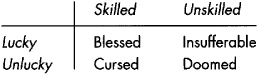

------------------------------------------------------------------------

## 22.2 PERFORMANCE EVALUATION METHODS

These considerations suggest that relative performance evaluations are
more valuable than absolute performance evaluations. *Absolute
performance evaluations* simply compute total portfolio returns.
*Relative performance evaluations* estimate how much portfolios have
outperformed or underperformed the benchmarks or peers against which
they are measured. By choosing benchmarks to represent how analysts
expect portfolios would have performed without active management, they
are better able to identify the contribution of management.

To measure the relative performance of a portfolio, analysts examine the
difference between the total return to the portfolio and the concurrent
total return to the benchmark. We therefore must consider how analysts
measure absolute portfolio performance before we consider how to measure
relative portfolio performance.

### 22.2.1 Absolute Performance Measurement

Analysts measure the *absolute performance* of a portfolio when they
estimate how much the nominal value of the portfolio has changed over
some measurement interval. The measurement interval may be a year, a
quarter, a month, a week, or a day; or it may be a current period to
date, such as *year-to-date* (YTD).

Measuring absolute performance is a relatively simple problem when
investors have not transferred money or securities into or out of the
portfolio. The *total return* to the portfolio is the percentage change
in its value over the measurement interval. For example, if the value of
a portfolio increases from 100 to 120 over a year, its total return for
the year is 20 percent.

The *total return* includes the value of any cash and securities that
the portfolio receives or pays in conjunction with its holdings. Cash
inflows typically include dividends, interest, and security lending fees
received. Outflows include brokerage commissions, management fees,
interest paid to purchase securities on credit, security borrowing fees,
and short dividends. Portfolio cash flows also include all *variational
margin payments* that the portfolio receives, or must make, when holding
long or short positions in futures, options, and swaps, and when holding
short positions in securities.

------------------------------------------------------------------------

**The Beardstown Ladies**

Founded in 1983, the Beardstown Business and Professional Women's Club
is a famous investment club composed of about 15 women. By 1993, most of
its members were in or near retirement, but still actively managing
their portfolio.

The club wrote several books and produced videos about their approach to
investing. *The Beardstown Ladies' Common-Sense Investment Guide: How We
Beat the Stock Market---And How You Can, Too* (1994) became an
international best seller.

On the jacket of that book, the Beardstown ladies claimed that they
earned an average annual return of 23.4 percent in the 10 years ending
in 1993. When challenged, they recomputed their returns with the
assistance of the Price Waterhouse accounting firm. Their actual annual
average return was 9.1 percent, significantly less than the 14.9 percent
average annual total return to the S&P 500 Index over the same period.
Many people wondered how they could have thought that they were beating
the market when they were actually underperforming it by an annual
average of almost 6 percent.

The ladies reported that they failed to properly use investment
accounting software with which they were unfamiliar. They consequently
mistook a 2-year return for a 10-year return. Additional information in
their explanation supports the conclusion that they did not have strong
computer skills---which would not be surprising for professional women
(or men) in or nearing retirement in 1993. Their apparent lack of
computational sophistication suggests that their reported explanation
may be accurate.

Many people, however, think that the women simply failed to account for
the regular contributions that they made to their fund. Over 10 years,
such a failure would lead to a gross overstatement of their total
returns. Such a mistake would have been far more embarrassing to admit
than the computational mistake that they reported. 

*Sources:
[[www.time.com/time/rnagazine/1998/dom/980330/business.jail_the_beards
12.html](http://www.time.com/time/rnagazine/1998/dom/980330/business.jail_the_beards12.html)](Overview);
[[www.better-investmg.org/clubs/hom-the-ladies.html](http://www.better-investmg.org/clubs/hom-the-ladies.html)]
(explanation by Betty Sinnock, Beardstown BPW Club senior partner).*

------------------------------------------------------------------------

Inflows and outflows of securities typically involve corporate
reorganizations such as mergers, acquisitions, and spin-offs.

When investors transfer money (or securities) into or out of a
portfolio, or when the portfolio distributes dividends to its investors,
the total value of the portfolio changes. Without an adjustment, the
change in portfolio value would misrepresent the actual performance of
the portfolio. Capital additions would inflate the performance and
capital distributions would deflate it.

Analysts use two approaches to address the problem of capital additions
and distributions. The most common approach is to compute the internal
rate of return for the portfolio. The *internal rate of return* (IRR) is
the compounded rate of return that a savings account would have to earn
to exactly replicate the capital flows into and out of the portfolio.
The IRR calculation assumes that beginning and ending savings account
balances are equal to the beginning and ending portfolio values. The IRR
is approximately a time- and value-weighted geometric average of the
total returns measured between each capital addition and distribution.

For many purposes, people would prefer to know the *holding period
return* for a share of a portfolio rather than the average return earned
by all investors in the portfolio. The
holding period return estimates how much an investor would have made if
he or she had invested a dollar in the portfolio at the beginning of the
measurement period. Analysts typically compute holding period returns by
assuming that all distributions are reinvested in the portfolio when
they are paid.

------------------------------------------------------------------------

**When Is 100-50 = 0?**

Investors must be very careful when summing percentage returns. Suppose
that a portfolio has a 100 percent increase in one year, followed by a
50 percent decrease in the next year. The summed arithmetic return over
the two years is 50 percent. The actual holding period return over the
two years, however, is exactly zero. (Prices double the first year and
halve the second year.)

To properly compute a holding period return from a series of returns,
you must compute their geometric sum rather than their arithmetic sum.
You add 1 to each return, then multiply the resulting sums, and finally
subtract 1 from the product. 

------------------------------------------------------------------------

The holding period return and the internal rate of return differ when
capital additions and distributions do not occur on a pro rata basis
within the measurement period. Capital additions and distributions are
on a *pro rata* basis occur when all investors participate in the
capital transactions in exact proportion to their ownership shares.
Since pro rata additions and distributions do not affect the proportion
of the portfolio that each owner owns, all investors have the same
internal rate of return over the holding period.

Analysts often separate the total return into its *current yield*
component and its *capital gains* component. The *current yield* of a
portfolio (or of a security) is the total income---typically interest
and dividends---that the portfolio receives from its assets divided by
the value of the portfolio. For example, if the securities in a
100-million-dollar portfolio pay 10 million dollars in dividends to the
portfolio in a year, the current yield for that year is 10 percent. The
*capital gains return* of a portfolio is the difference between the
total return and the yield. It is the percentage change in the value of
the assets of the portfolio, exclusive of the income that the assets
pay. The distribution of total return into the current yield and the
capital gains return is of particular interest to investors for whom
ordinary income and capital gains are taxed at different rates.

The current yield of the assets of a portfolio can be different from the
current yield that owners of a portfolio receive. This happens when the
portfolio pays its investors more or less income than it receives from
its assets.

------------------------------------------------------------------------

**-94.7%+ 95.6% = Very Bad News**

ProFunds UltraOTC Fund lost 94.7 percent between March 10, 2000, and
April 4, 2001, and gained 95.6 percent from April 4 to May 2, 2001. Had
you invested 10,000 dollars in the fund on March 10, 2000, your position
would have been worth just 1,037 dollars on May 2, 2001. 

*Source: Karen Damato, "Doing the Math: Tech Investors' Road to Recovery
is Long,"* Wall Street Journal *May 18, 2001, p. C1 (Western edition).*

------------------------------------------------------------------------

Analysts who measure performance must estimate values for all portfolio
positions at the beginning and end of the measurement period. Estimating
values for instruments that trade in active markets is quite simple.
Analysts usually estimate such values by the last trade price or by the
midpoint between the last bid and offer prices. The estimation problem
is much more difficult for instruments that do not trade often. In that
case, analysts must estimate values from the prices of related
instruments. For example, estimating the value of a real estate
portfolio can be extremely difficult. Managers must generally estimate
values by means of appraisals that depend critically on the sales prices
of comparable properties. Estimated valuations of infrequently traded
bonds likewise depend on the sales prices of similar debt instruments.

### 22.2.2 Relative Performance Measurement

Raw returns are not useful for evaluating performance without some basis
for comparison. For example, an equity portfolio that drops 10 percent
when the market drops 20 percent has performed well relative to the
market. In contrast, an equity portfolio that rises 15 percent when the
market is up 30 percent has performed relatively poorly.

Analysts compute *relative returns* to facilitate performance
comparisons. A *relative return* is the difference between a portfolio
return and a corresponding *benchmark return.* Analysts choose
benchmarks to represent how they expect the portfolio would have
performed without active management.

------------------------------------------------------------------------

**Smooth Sailing, Rapids
Ahead**

Investors generally like stable portfolios because they are risk averse.
Their investment managers therefore hope to report stable values.

Managers of portfolios that include highly illiquid assets must estimate
values for their assets when there are no sales prices. To create stable
values, unethical managers may be slow to change their estimates when
values change. They may be especially slow to adjust values when they
fall. Investors in such funds therefore may believe that their funds are
less risky than they actually are.

When true asset values differ significantly from the manager's estimated
values, various processes may force the manager to revalue them quickly.
For example, if investors try to withdraw funds from the portfolio, the
manager may have to sell assets. The resulting sales may be at
substantially lower prices than the manager last estimated. These sales
will cause the reported value of the portfolio to drop significantly.
Seemingly secure funds therefore may be quite risky.

Investors who are concerned about the valuation of illiquid assets
should look at the sequence of reported portfolio returns. Returns
display positive serial correlation when managers are smoothing values.

------------------------------------------------------------------------

**AIMR-PPS**

Although performance measurement seems very straightforward,
difficulties involving exotic contracts, infrequently traded
instruments, foreign exchange rates, and complex portfolio ownership
structures complicate many performance measurement problems. Reasonable
people often can arrive at different results using the same data.

To ensure that performance measurements are presented on a comparable
basis, the Association for Investment Management and Research (AIMR)
developed performance presentation standards that they encourage
analysts to use. The AIMR performance presentation standards (AIMR-PPS)
allow investors to directly compare the performance of different
investment managers. 

*Source: The AIMR presentation standards appear at
[[www.aimr.com/standards/pps/ppsstand.html](http://www.aimr.com/standards/pps/ppsstand.html)].*

------------------------------------------------------------------------

The purpose of the benchmark comparison is to remove noise in the
performance evaluation. A good benchmark adjusts raw returns to account
for performance that should not be attributed to the manager. The
remaining measure of performance therefore better represents the
performance of the manager.

#### 22.2.2.1 Market-adjusted Returns

The most common benchmarks that analysts use to evaluate performance for
equity portfolios are market indexes. For example, analysts generally
compare portfolios that primarily hold a diversified set of large
capitalization U.S. stocks against the S&P 500 Index. They use
specialized indexes to evaluate portfolios that invest in other asset
classes. [Table 22-1](#part0035.html_ch22tab1) provides a list
of commonly used benchmark indexes.

*Market-adjusted returns* are portfolio returns minus corresponding
market index returns. The market-adjusted returns in the above example
are 10 percent and ---15 percent. For most purposes, market-adjusted
returns demonstrate how well the portfolio has performed better than raw
returns do.

#### 22.2.2.2 Risk-adjusted Returns

Analysts sometimes further adjust raw returns to account for the
exposure of portfolios to known risks. For example, consider the
exposure of a portfolio to *market risk.* Market risk is the risk that
values will rise or fall with marketwide changes in value. It varies by
security, and therefore also by portfolio. Analysts characterize market
risk by the *market beta* of a security. Beta measures the extent to
which the security fluctuates in value with the market. A stock with a
beta of 0.5 tends to rise or fall only 0.5 percent for every 1 percent
rise or fall in the market. It is only half as risky as the market. The
beta of a portfolio is the value-weighted average of the betas of the
various securities in the portfolio. Since the market has a beta of 1,
and since the market is just a portfolio of all available securities,
the value-weighted average beta of all securities is 1.

**TABLE 22-1.**\
Some Common Benchmark Indexes

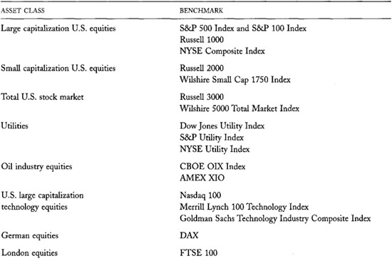

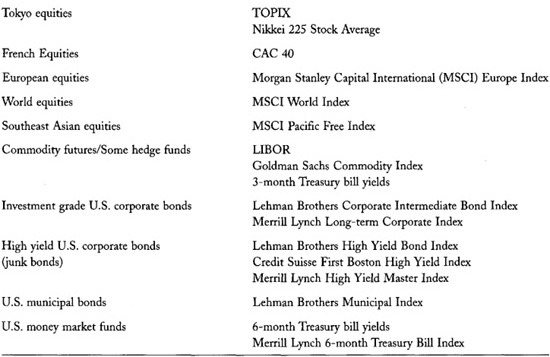

------------------------------------------------------------------------

**Foolish John**

John took money out of α savings account where it was earning 5 percent
to invest in the stock market. He made 23 percent trading actively and
was delighted with his performance. He thought that he could pick stocks
really well!

That same year, the S&P 500 rose 33 percent. Had John invested in an S&P
500 Index fund, he would have made 33 percent.

John was pleased with his performance because he used the wrong frame of
reference. He beat his measly savings account return by 18 percent. His
performance was terrible, however, because he did not get the average
return that other people got for bearing similar equity risks. He
underperformed the market by 10 percent.

Satisfied with his expertise, John decided to continue to trade
actively. The next year, he again underperformed the market by 10
percent. Unfortunately, that year the S&P 500 lost 10 percent. John lost
20 percent, which is 25 percent worse than he would have done had he
kept his money in his savings account.

His total return for the two years was **---** 1.6 percent. (The holding
period is computed as (1 + 0.23) × (1 - 0.20) - 1.) The corresponding
two-year S&P 500 return was 19.7 percent. Had John kept his money in the
savings account, he would have earned 10.3 percent. 

------------------------------------------------------------------------

Managers who construct low beta portfolios tend to underperform the
market when it is rising and outperform it when it falling. Likewise,
those who construct high beta portfolios tend to outperform the market
when it is rising and underperform it when it is falling.

To account for these effects, analysts compute *risk-adjusted excess
returns* by subtracting the average portfolio beta times the market
return from the raw portfolio return. The resulting measure is also
called the portfolio's *realized alpha.* The realized alpha helps
analysts determine whether a manager successfully selects winners and
losers after accounting for market risk.

#### 22.2.2.3 Market Timing

An equity manager *times the market* when she changes the portfolio beta
to exploit her predictions about the future direction of the market.
Managers change their portfolio betas by exchanging high beta assets for
low beta assets or vice versa. For example, managers lower their
portfolio betas by selling securities and leaving the proceeds in cash,
by selling high beta securities and buying low beta securities, by
selling index futures, by buying puts, by selling calls, or by selling
securities short. They raise their portfolio betas by doing the
opposite.

Risk-adjusted excess returns are best computed frequently because the
portfolio beta changes whenever the manager exchanges assets that have
different betas. To accurately estimate risk-adjusted returns, analysts
must multiply market returns by concurrent portfolio betas.

Analysts who compute risk-adjusted returns often also compute
*market-timing returns.* The market-timing return is the difference
between the portfolio beta times the market return and the market
return. It indicates whether the portfolio manager is a skilled market
timer.

To summarize, raw portfolio returns can be broken into the sum of three
parts: the market return, the market timing return, and the
risk-adjusted excess return:

Raw Return = (Raw Return - Beta X Market Return)

\+ (Beta X Market Return - Market Return)

\+ Market Return

= Excess Return + Market Timing Return + Market Return.

Analysts use these decompositions to attribute performance to the
market, to the manager's timing ability, and to all other
factors---including, of course, the manager's risk-adjusted selection
skills.

Analysts can easily generalize this decomposition to include other risk
factors besides market risk. Finance courses and textbooks about
investments describe these *multifactor risk models.* The most common
additional risk factors that analysts use to analyze equity portfolios
are factors that measure risks associated with firm size and with
expected growth.

## 22.3 THE PERFORMANCE PREDICTION PROBLEM

People often evaluate past performance because they want to predict the
future performance of a manager. Such analyses are valuable only if the
factors that determined past performance will continue to determine
future performance. Most people rarely think carefully about whether
this will be true.

------------------------------------------------------------------------

**Buy and Hold
Benchmarks**

The difference between the portfolio return and the return that the
portfolio would have made had the manager not traded is a direct measure
of an active manager's contribution to portfolio performance. This
measure is intuitively attractive because it focuses only on the
manager's decisions. The benchmark index for this approach to
performance measurement is the beginning-of-period portfolio.
Unfortunately, a serious problem complicates the use of this approach.

This approach identifies only superior performance that takes place
during the measurement period. Any superior performance that accrues in
subsequent periods contributes to the performance of subsequent
benchmarks. For example, suppose a manager buys a stock at the beginning
of the year. The manager believes the stock will appreciate
significantly over the next two years. The appreciation in the first
year will accrue to his benefit, but the appreciation in the second year
will not. A similar problem applies to sales. This problem causes
managers to focus on short-term ideas. It also causes them to delay the
implementation of ideas generated near the end of the year.

Changing the definition of the benchmark index can reduce this problem.
Instead of the beginning-of-period portfolio, a better benchmark would
be the portfolio that would have been created if all trades made by the
manager occurred one year later. With this benchmark, all trades get the
benefit of at least one full year of evaluation. 

------------------------------------------------------------------------

Whether the factors that determined a manager's past performance will
continue to determine his or her future performance depends on three
fundamental conditions. Each of the following conditions must be true to
successfully predict future returns from past performance:

• *Past performance must reflect the manager's skills.* If past
performance was due only to luck, it will have no bearing on future
returns.

• *The manager's skills will continue to generate good future returns.*
The skills necessary to perform well may vary by market conditions. For
example, traders who succeed in bull markets may not succeed in bear
markets. Past performance will have no bearing on future returns if the
skills that generated it are no longer effective.

• *The manager still has the skills necessary for success.* Investment
management firms often lose essential skills when they lose employees or
access to valuable resources. Investment managers also often lose
essential skills as they age or lose their drive. Past performance will
have no bearing on future returns if the skills that generated it are no
longer available.

------------------------------------------------------------------------

**Regulation FD**

Regulation FD requires that publicly traded corporations immediately
disclose to the entire public any material information that they
disclose to any unrelated person. Before the U.S. Securities and
Exchange Commission adopted this regulation in 2000, investment managers
who were skilled at arranging and conducting interviews with corporate
insiders often could obtain valuable material information from them.
These skills no longer are as valuable as they once were now that
Regulation FD prohibits this practice. The past performance of managers
who had these skills therefore is not a good predictor of their future
performance. 

------------------------------------------------------------------------

If any of these conditions is not true, attempts to predict future
performance from past performance will not be productive. People
therefore should verify these conditions before attempting to predict
future returns from past performance.

Analysts may use analytic or statistical methods to determine whether
performance is due to luck or to skill (the first condition). In the
analytic approach, analysts try to identify the skills that determined
past performance. This task is quite difficult because analysts must
understand the management process well enough to recognize what
determined past performance. In the statistical approach, analysts use
statistical methods to show that luck alone cannot reasonably explain
past performance. Analysts often use the statistical approach to avoid
the difficulties associated with the analytic approach. The statistical
approach, however, has its own difficulties. We discuss them in the next
section.

------------------------------------------------------------------------

**Our Faith in Past
Performance**

Why do so many people assume that past performance can predict future
returns? This assumption is so pervasive and so wrong, it begs for an
explanation. Perhaps behavioral biology can help us better understand
ourselves.

During our evolutionary history as creatures that could learn from our
environment, our ancestors survived by learning that things which
happened in the past often would happen again. Our ancestral aunts and
uncles who did not use the past to predict the future often did not
survive to reproduce. Other creatures ate them, they fell off cliffs,
they starved, or they froze to death. We are here today because our
ancestral parents successfully used the past to predict the future.
Natural selection has hardwired us to believe that performance is
persistent. 

------------------------------------------------------------------------

To determine whether the manager's skills will continue to generate good
future returns (the second condition), analysts must first identify the
skills that determined past performance. They then must decide whether
those skills will continue to be useful. This second task is more
difficult than the first task because explaining the past generally is
easier than predicting the future. Predictions about the future
necessarily depend on uncertain assumptions.

Analysts generally can determine whether the manager still has the
necessary skills to perform well (the third condition) by direct
inquiry. The determination, of course, is reliable only if the analysts
know what skills to look for.

Since the verification of all three conditions is difficult, most people
simply do not do it. Instead, they just assume that past performance can
predict future returns. The prediction of future returns from past
performance, however, is notoriously imprecise. We know this both from
experience and from statistical theory.

### 22.3.1 Some Empirical Evidence

In the next section, we examine the problems that make statistical
performance evaluation unreliable. Before we do so, let us consider some
compelling empirical evidence.

Financial researchers have observed that essentially no correlation
exists between the best-performing funds in one year and the
best-performing funds in the next year. Good past performers are about
equally likely to be good future performers as are poor past performers.
Good past performance simply does not regularly predict good future
performance.

(The very worst-performing funds, however, tend to remain at the bottom
from year to year. These funds typically lose because they trade too
much and because they have high management fees. As long as these
conditions do not change, they stay at the bottom.)

These results are very robust. They are true for equity funds, bond
funds, and commodity pools. The results are uniform across years and
across countries. The results are similar when performance is measured
by quarter or by month. The results do not depend on the criteria for
identifying the best funds. These empirical results strongly suggest
that statistical methods cannot reliably predict future performance from
past returns.

## 22.4 STATISTICAL PERFORMANCE EVALUATION

Past performance poorly predicts future returns primarily because past
performance generally is due more to luck than to skill. Unpredictable
return factors very often obscure the value that skilled management can
add to a portfolio.

This result is not surprising. Future price changes are largely
unpredictable---even for well-informed traders---because informed
traders make most instrument prices quite informative. Moreover, the
competition among informed traders to profit from information ensures
that few traders will have great insights
into the future. We therefore do not expect that even highly skilled
managers will have remarkably large returns on average.

We can see why past performance is so uninformative by considering how
statisticians judge whether a manager can systematically beat the
market. Their methods measure whether actual performance is greater than
luck alone can reasonably explain. To determine what is reasonable,
statisticians examine return distributions. The *distribution* of a
variable tells us the probability of every possible value of the
variable.

In a typical statistical analysis, statisticians use probability theory
to characterize the distribution of possible returns that we would
expect if managers were not skilled. This distribution therefore assumes
that only luck determines performance. If the actual market-adjusted
return is significantly greater than we would typically expect, based on
luck alone, statisticians conclude that some factor other than luck
probably contributed to the return. The likely factor is the skill of
the investment manager.

This section presents the test that analysts most commonly use to
determine whether managers are skilled. We describe the reliability of
the test, and how analysts should use it when deciding whether to invest
with an active manager. Although our presentation assumes that analysts
will apply the test to equity managers, the methods apply equally well
to all other types of managers.

I wrote this section so that any reader should be able to understand it.
You do not need to know statistics to understand it. Without using
mathematical notation, the text explains every statistical concept that
you need to know to understand statistical performance evaluation.

If you do not want to have a deeper understanding of the statistical
problems associated with performance evaluation, you may wish to skip
this section. (You would be poorly advised to do so, however, if you
work in, or intend to work in, investment management.) The most
important principle that you need to know is that statistical
performance evaluation is generally unreliable because unpredictable
return factors make it very difficult to identify managerial skill. In
practice, more than 20 years of returns data are typically required to
obtain useful results for a given investment manager. Even more data are
required to determine whether the most successful investment manager,
selected from of a large group of managers, was skilled or just lucky.

### **22.4.1 The *t*-Test**

To determine whether a manager can systematically beat the market,
statisticians typically examine the ratio between the manager's average
market-adjusted return and a measure of average size they call the
*standard error of the mean.* The *standard error* is a number that
statisticians compute based on results from probability theory. It is
proportional to the average size of the market-adjusted return that we
would expect to observe if only luck were responsible for the manager's
returns. If this ratio---called *Student's t-statistic* or simply the
*t-ratio*---is large, statisticians conclude that luck alone probably
cannot explain the returns.

For example, if the manager has no skill, the probability that the
*t*-statistic will be greater than 1.64 is only 5 percent. (The
calculation of this probability assumes a one-sided *t*-test.) If
statisticians conclude that the manager is skilled whenever the
*t*-statistic for a manager's portfolio exceeds this *critical value*,
they will be mistaken 5 percent of the time.

------------------------------------------------------------------------

**Student's Brew
Samples**

W. S. Gosset first identified the *t*-test and the associated
*t*-distribution. Gosset was a statistician who worked for Guinness
Brewery in Great Britain. He invented the *t*-test in 1908 to analyze
small brew samples for quality control.

The brewery did not want Gosset to publish under his own name. Gosset
therefore published under the pseudonym Student. This restriction
explains why the *t*-distribution is also known as Student's
distribution. 

------------------------------------------------------------------------

The *critical value* depends primarily on the *confidence level of the
test*---in this example, 95 percent---and to a lesser extent on the
sample size. The critical value for a less discriminating test is
smaller. For example, the critical value corresponding to a 90 percent
confidence level is only 1.31. The critical value corresponding to a 50
percent confidence level is zero. If luck alone determines
market-adjusted returns, they will be positive 50 percent of the time.

(Statisticians generally express the confidence level of a test in terms
of its *significance level.* The significance level of a test is 1 minus
the confidence level. This exposition uses confidence levels instead of
significance levels because they are less confusing.)

The test works because luck and skill have different long-term effects
on average portfolio returns. Luck, by definition, is random and
completely unpredictable. Good luck is as common as bad luck. Good luck
increases returns and bad luck lowers them. Given enough time, however,
the net effect of luck on average returns is small. In contrast, skill
has a systematic positive effect on returns. Over time, a skillful
manager should outperform the market.

### 22.4.2 A Power Calculation

This *t*-test is *powerful* when statisticians are likely to conclude
that the manager is skilled, given that the manager is indeed skilled.
The probability that the *t*-ratio will exceed the critical value, given
that the manager is skilled, is the *power* of the test. Statisticians
calculate power using probability theory.

The power of the test depends on several factors:

• Power increases when the confidence level of the test decreases. Low
confidence level tests have low critical values for the *t*-ratio. If
the manager is skilled, the probability that his *t*-ratio will exceed
the critical value (the power of the test) is greater when the critical
value is small.

• Power also increases with the skill of the manager. A highly skilled
manager should have higher returns, and therefore a higher *t*-ratio.

• The power of the test decreases with the importance of luck as a
factor that determines returns. When luck primarily determines returns,
bad luck can cause a skilled manager to perform poorly, and therefore
have a *t*-statistic that is smaller than the critical value.

• Finally, power increases with the years of data analyzed. Over a long
period, good luck and bad luck tend to offset each other so that the
manager's *t*-ratio depends more on skill than on luck. The probability
that a skilled manager's *t*-ratio will exceed the critical value (the
power of the test) therefore is greater when many years of returns data
are included in the test.

To compute the power of the *t*-test, we must specify quantities for
these four factors. We specify the confidence level when we create the
test. The number of years of returns generally depends on what data are
available. We specify the last two factors---the true skill of the
manager and the importance of luck as a determinant of returns---by
considering the economic context of the performance evaluation problem.

We quantify the true skill of a manager by how much we expect him to
beat the market each year on average. A large number will imply a
powerful test, but we cannot reasonably
assume a large expected return. The competition among informed traders
to profit from information, the costs of obtaining information, and the
informational efficiency of most financial markets make large expected
returns unrealistic. Given the competitive environment, most
professional managers would be delighted beyond description if they were
certain that they could beat the market by 2 percent per year, on
average.

To put this number into perspective, consider the performance of two of
the most successful equity managers ever. Over 36 years through 2000,
Warren Buffet, chairman of Berkshire Hathaway, beat the market by an
average of 11.8 percent per year. During much of this period, however,
he may have been quite lucky as well as quite skilled. Between 1991 and
2000, his performance dropped to 6.8 percent per year over the market. I
will comment more on his performance below.

Consider also the performance of Peter Lynch. During his 13 years as
manager of the Fidelity Magellan Fund, the fund outperformed the market
by an average of 12.7 percent per year. In his last five years, however,
the Fund outperformed the market by an average of only 5.1 percent per
year. Like Warren Buffet, Peter Lynch may have been quite lucky as well
as quite skilled.

The performance of these superstars was quite remarkable. The fact that
they have not been able to sustain their initial performance rates
suggests that they may have been quite lucky in the beginning of their
tenures. (The decline may also be due to the increased difficulties of
managing ever-larger funds.) If we assume that their real skill is
somewhere between 5 and 7 percent---this still seems high to me---it is
reasonable to assume that the skill of a typical skilled manager is only
2 percent.

We quantify the importance of luck as a determinant of returns by the
*standard deviation* that we would expect market-adjusted returns would
have if only pure luck generated them. The *standard deviation* is a
probability concept that measures the variation of a variable about its
mean. The standard deviation of market-adjusted returns depends on the
standard deviation of the portfolio returns, the standard deviation of
the market returns, and the correlation between the two returns. An
increase in either standard deviation increases the market-adjusted
return standard deviation. A high correlation lowers the market-adjusted
return standard deviation. Probability theory gives us a formula for the
market-adjusted return standard deviation, σ*Adj-* It is
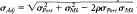
where *ρ* is the correlation. If the portfolio is well diversified,
empirical experience suggests that reasonable annual values for these
parameters are *σport* = 16%, σm = 14.5%, and *ρ* ---0.9. These values
imply a market-adjusted return standard deviation of 7.0 percent.

[Table 22-2](#part0035.html_ch22tab2) presents power
calculations for various combinations of these parameters. The results
show that if we want to be 95 percent confident that we do not identify
an unskilled manager as skilled, the probability that the *t*-test will
identify a skilled (2 percent) manager using five years of monthly data
is only 15 percent! An additional five years of data only raises this
probability only to 23 percent. The test requires more data than are
generally available to confidently separate skill from luck.

If we use a test with a lower confidence level of 75 percent, we will
identify an unskilled manager as a skilled manager one time out of four.
Even with this low standard, we will still only identify truly skilled
managers less than one half of the time (48 percent) given five years of
data and a bit more than half the time (59 percent) given 10 years of
data.

**TABLE 22-2.**\
The Power of a Standard One-sided *t*-Test of Manager Performance

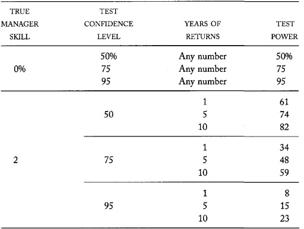

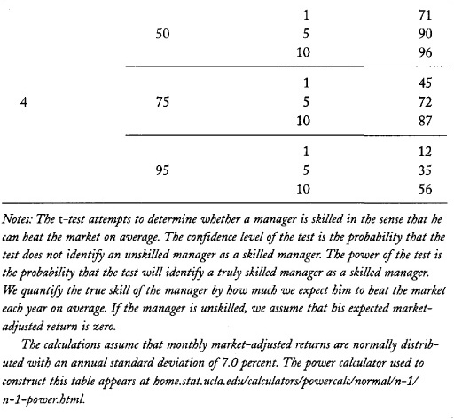

If we use a 50 percent confidence level test, we will identify an
unskilled manager as skilled half of the time. With this extremely low
confidence level, the probability that we identify skilled managers as
skilled is only 74 percent using five years of data and 82 percent with
10 years of data. For comparison, note that
the probability of identifying a skilled manager as skilled is 50
percent if we merely flip a coin to decide the issue! Clearly, we
require more data than are generally available to confidently separate
skill from luck when using statistical methods.

------------------------------------------------------------------------

**One Year of Data Just Doesn't Cut It**

Many people make decisions about managers from just one year of data. If
this were not so, the business sections of newspapers would not be full
of ads that publicize last year's returns for various mutual funds. Of
course, the only funds that advertise are those which performed well
last year.

The probability of correctly identifying a truly skilled manager with a
year of data is less than 10 percent in any test that will not regularly
identify an unskilled manager as skilled. Last year's return therefore
is essentially worthless for judging managerial skill. 

------------------------------------------------------------------------

### 22.4.3 How Much Data Are Required?

Power calculations can also tell us how many years of returns we need in
order to conduct a test with a given confidence level and power. [Table
22-3](#part0035.html_ch22tab3) presents the results of these
calculations for several confidence levels and powers.

These results show that even tests with low confidence and power levels
require more years of returns than are commonly available. For example,
suppose that skilled managers can beat the market by 2 percent on
average. A test that does not identify unskilled managers as skilled
managers 75 percent of the time, and that identifies skilled managers as
skilled managers 75 percent of the time, requires 22 years of monthly
returns! If skilled managers were extraordinarily skilled, so that they
could beat the market by 4 percent on average, we would still require
six years of data to run a test with these low confidence and power
levels.

### 22.4.4 The Statistical Argument for Indexing

Before we abandon the statistical approach to determining whether a
manager is skilled, consider how we might sensibly choose the confidence
and power levels of our test. These test characteristics depend on how
the test results will be used.

For example, suppose that we will invest with an active manager if the
test indicates he is skilled and invest in an index fund otherwise. If
the manager is not skilled, but the test indicates that he is, we will
expect to lose. If we expect large losses, the test confidence level
should be high in order to avoid identifying unskilled managers as
skilled managers. Likewise, if the manager is indeed skilled, and the
test indicates that he is, we will expect to profit. If we expect high
profits, the power of the test should be high to avoid failing to
identify skilled managers. Finally, if the expected returns to investing
in an index fund are large, the confidence level should be high.

**TABLE 22-3.**\
Years of Data Required to Obtain Specified Confidence and Power Levels
for the Standard One-sided *t*-Test of Manager Performance

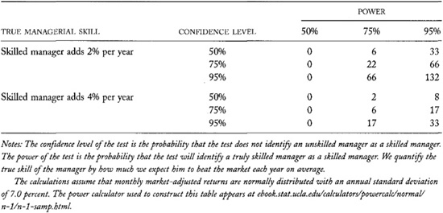

The confidence and power levels that we
choose therefore should depend on the costs and benefits associated with
our decision. Depending on these consequences, good decisions may not
require high confidence and power levels. In this subsection, we
consider what should be the confidence and power levels for a given
sample size. We will assume that we will use the test to choose between
investing with an active investment manager and investing in an index
fund.

Our analysis will choose the confidence and power levels to maximize our
expected market-adjusted return. The results therefore will show how
much we expect to profit from choosing between an active manager and an
index function, assuming that we design the best possible test. If these
expected profits are small, we should not consider choosing a manager
based only on past performance.

To estimate the expected return, we must make some assumptions about the
consequences of our decision and about how common skilled managers are.
We start by assuming that a previously skilled manager can produce 2
percent market-adjusted returns per year, on average, before accounting
for management fees and trading commissions. (We implicitly assume
assumptions 2 and 3 of section 22.3, so that a skilled manager will
continue to generate good future returns, on average.) Although 2
percent may seem low, it is a reasonable assumption given the
competition among managers for trading profits. As noted above, most
managers would be delighted beyond expression if they and their clients
were certain that they could beat the market by 2 percent per year on
average.

Since trading is a zero-sum game, unskilled managers must lose on
average to skilled managers. Their losses will depend on the fraction of
managers who are skilled. Assume that one-third of managers are skilled,
so that the average unskilled manager underperforms the market by about
1 percent per year, before accounting for management fees and trading
commissions:
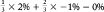.
This assumption seems generous to me.

All active managers---skilled and unskilled taken
together---underperform the market by an average of more than 1 percent
per year, after accounting for expenses. (The average U.S. equity mutual
fund underperformed the S&P 500 Index by 1.4 percent between 1962 and
1997.) This average implies that commissions plus management fees for
all active managers average at least 1 percent. Assume that they total
just 1 percent. Accordingly, we expect that skilled managers will beat
the market by 1 percent per year, on average, after expenses, and
unskilled managers will underperform the market by 2 percent per year,
on average, after expenses.

Finally, we assume that index funds underperform the market by −0.15
percent. This is typical for index funds that have very low management
fees and tend to track the market extremely closely.

The consequences will vary according to whether the manager is truly
skilled and according to whether the test indicates that the manager is
skilled. We therefore must assign costs and benefits to four different
states. Since we need to compute the overall expected return, we also
need to specify the probabilities of these
four states. Our assumptions allow us to specify these costs, benefits,
and probabilities:

• If the manager is not skilled, and the test indicates that the manager
is not skilled, we will invest in an index fund and our market-adjusted
returns will be −0.15 percent. The probability of this situation is the
confidence level times the probability that the manager is not skilled.

• If the manager is not skilled, and the test indicates that the manager
is skilled, we expect to underperform the market by 2 percent per year,
on average, by investing with the manager. The probability of this
situation is 1 minus the confidence level times the probability that the
manager is not skilled. Statisticians call this type of mistake the
*Type I error* of the test.

• If the manager is skilled, and the test indicates that the manager is
skilled, we expect the manager to beat the market by 1 percent per year,
on average. The probability of this situation is the power of the test
times the probability that the manager is indeed skilled.

• If the manager is skilled, and the test indicates that the manager is
not skilled, we will invest in an index fund and our market-adjusted
returns will be −0.15 percent. The probability of this situation is 1
minus the power of the test times the probability that the manager is
indeed skilled. Statisticians call this type of mistake the *Type II
error* of the test.

[Table 22-4](#part0035.html_ch22tab4) summarizes this
information.

The overall expected market-adjusted return associated with the decision
is the average of the expected consequences weighted by their respective
probabilities. For a given sample size, the resulting expected return is
maximized by choosing a confidence level, which implies the test power.
[Table 22-5](#part0035.html_ch22tab5) presents results for
several sample sizes.

The results show that the optimal tests require high confidence levels
for all sample sizes. For small sample sizes, the optimal confidence
level is very high because there is not enough information to reliably
discriminate between skilled and unskilled managers. Since investing
with an unskilled manager is costly relative to investing with an index
fund, and since skilled managers are relatively rare, a trader who
follows the optimal strategy will almost always invest in index funds.
Accordingly, the maximized expected return is essentially the same as
the index fund return. For very large sample sizes, enough information
is available to reliably discriminate between skilled and unskilled
managers. The optimal confidence level remains high to avoid the mistake
of investing with unskilled managers. The high power ensures that we
invest with an active manager if he is skilled.

**TABLE 22-4.**\
Assumed Consequences and Probabilities of All Possible States

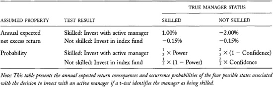

**TABLE 22-5.**\
Optimal *t*-Test Confidence and Power Levels and Maximized Expected
Returns

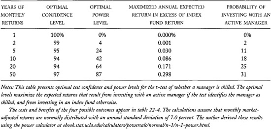

We assumed that a skilled manager will outperform an index fund by 1.15
percent on average. If the test could perfectly discriminate between
skilled and unskilled traders, the expected value of conducting the test
would be one-third of this value because---by assumption---only
one-third of active managers are skilled. Note that even with 50 years
of data, the expected return of using the test (0.298 percent) is still
only 78 percent of its theoretical maximum (0.383 =

× 1.15 percent).

The maximized expected return from using the *t*-test---expressed
relative to the expected index fund return---is the value of the option
to decide whether to invest with an active manager when the alternative
is to invest in an index fund. It is always positive because you can
always choose to invest in an index fund. For sample sizes of ten or
fewer years, the value of this option is extremely low. With ten years
of data, it is only 8.6 basis points. Not surprisingly, many investors
choose to ignore these options. They invest in index funds because they
do not believe that they can add significant value to their wealth by
choosing managers.

### 22.4.5 Choosing Among Many Managers

In practice, investors rarely decide only between just one active
manager and an index fund when choosing whether to invest with an active
manager. Instead, they usually consider many managers, and generally,
only those they know have done well in the past.

The best-performing managers of a large group of managers always will
have performed very well. In a large group of people, extreme luck can
produce very impressive results. Standard statistical tests of whether
such man agers are skilled or just lucky will
invariably indicate that the managers are skilled.

Standard tests in this application, however, produce highly unreliable
results. Standard tests consider whether a manager chosen at random is
skilled. In this application, we already know that a manager has
performed well, and we examine him or her only because we know that the
manager has performed well. The proper test must consider whether the
manager is skilled, given that we already know that the manager was
among the best-performing managers of a large group of managers. Whether
a given manager is skilled, and whether the best-performing manager
among a group of managers is skilled, are different questions. To answer
different questions, we require different tests.

Managers who have performed well may have been skilled, or they may have
been exceptionally lucky. Unfortunately, the larger the group of
managers from which we select the best performing managers, the more
impressive are the performances of the luckiest unskilled managers. In a
large sample of managers, some unskilled managers will be extremely
lucky simply by chance.

[Table 22-6](#part0035.html_ch22tab6) shows just how lucky the
best-performing manager from a large group of unskilled managers can be.
The calculations assume that all the managers have constructed well
diversified portfolios which are closely correlated with the market. We
therefore assume that the annual standard deviation of their
market-adjusted returns is only 7 percent per year.

The results in the third column (labeled Median) of the first panel show
that in half of all years, on average, the best-performing manager from
a group of 10,000 unskilled managers will beat the market by almost 27
percent! The winner will beat the market by more than 28 percent in one
year out of four (next column) and by almost 31 percent in one year out
of 20 (column labeled 95th percentile). The results are even more
impressive when the best manager comes from a larger group.

The second and third panels present results for five- and ten-year
periods. On average, the luckiest of 10,000 unskilled managers will beat
the market by an annual average of more than 8 percent in half of all
ten-year periods, by almost 9 percent in one ten-year period out of
four, and by almost 10 percent in one ten-year period out of twenty.

The last three columns show similar results for the 99th percentile
manager in each group size. This manager's performance is also very
impressive, although not nearly as extreme as the best-performing
manager.

Exceptionally lucky managers perform very well in comparison to skilled
managers of average luck. These returns are all greater than the 2
percent per year that we assumed a good skilled manager could produce on
average. Even in ten-year periods, it is much better to be very lucky
than skilled with average luck!

The results in this table indicate that if you want to be more than 95
percent confident that you do not identify an unskilled manager as a
skilled manager when examining ten years of returns for the
best-performing manager out of 10,000, you must classify as unskilled
any manager whose average market-adjusted performance is less than 10
percent per year. Tests with such confidence have essentially no power
to identify any but the luckiest---or most skilled---managers.

The results in this table greatly underestimate the actual performance
of the luckiest managers because the best (and worst)-performing
managers typically construct undiversified portfolios. The annual
standard deviation of their market-adjusted returns therefore is much
greater than the 7 percent we assumed.

**TABLE 22-6.**\
Distributions of the Average Market-adjusted Performance of the Luckiest
Managers of Various Group Sizes

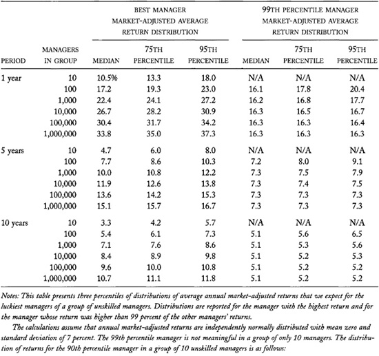

### 22.4.6 Summary and Discussion

The results in this section strongly demonstrate that past returns data
are not very useful for determining whether a manager is skilled. For
them to be of much value, we must base statistical analyses of past
returns on more years of data than are normally available to us.

------------------------------------------------------------------------

**Is Warren Buffet
Skilled or Lucky?**

Berkshire Hathaway is a firm that Warren Buffet has managed since 1965.
Although it has many operating divisions, in many respects it is
essentially a closed-end investment fund. Because Berkshire Hathaway is
primarily an insurance company, its reported book value is based on the
market values of its holdings rather than on historic costs of its
holdings. The book value therefore is essentially the net asset value of
the firm.

Many people regard Warren Buffet as the most skilled investment manager
of the late twentieth century. Since he took control of Berkshire
Hathaway, its book value had appreciated 2,078-fold through December
2000. This corresponds to a compounded average growth rate of 23.6
percent per year. By comparison, the average annual total return
(capital gains plus dividends) of the S&P 500 Index during this period
was 11.8 percent. Berkshire Hathaway outperformed the market by an
average of 11.8 percent per year. The firm exactly doubled the
performance of the S&P 500 Index over this period.

Is Warren Buffet indeed a skilled investment manager, or has he simply
been a very lucky manager?

A standard *t*-test indicates that he is exceptionally skilled. Over the
36 years, Berkshire Hathaway's annual market-adjusted return standard
deviation was 14.3 percent per year, so that the standard *t*-statistic
is 4.9. The probability that an unskilled manager would have a
*t*-statistic larger than 4.9 is only 0.0011 percent.

This test, however, is not the proper test. Warren Buffet came to our
attention only because he had exceptionally high returns. If his
performance had not been exceptionally good, you probably would have
never heard of him, and I certainly would not be writing about him. To
properly address the question, we must consider whether Warren Buffet's
investment performance is significantly better than we would expect from
the best managers in a large group of unskilled managers.

Assume that Warren Buffet competed with at least 10,000 investment
managers in 1965. Many of these managers underperformed the market and
subsequently quit or were dismissed from their jobs. The total number of
managers in 1965 would be much greater if we considered every amateur
investor who would have become a professional investor if his or her
investment performance had been better than it was.

If 10,000 unskilled managers constructed portfolios with normally
distributed market-adjusted returns having mean zero and standard
deviation 14.3 percent, the probability that the best-performing manager
would beat the market by an annual rate of 11.8 percent or greater is
only 0.5 percent. If there were 100,000 managers, the probability would
have been 5 percent. These results suggest that Warren Buffet very
likely is a skilled manager. 

*Source: Author's calculations based on data at
[[www.berkshirehathaway.com/2000ar/2000letter.html](http://www.berkshirehathaway.com/2000ar/2000letter.html)].*

------------------------------------------------------------------------

The problem is that skill is a far less significant determinant of
portfolio returns than is luck. In particular, the additional return
that we expect a manager can add to a portfolio is small relative to the
variation in portfolio returns due to factors which managers cannot
anticipate or act upon. Statisticians and engineers say that this
problem has a low *signal to noise ratio.* The signal---whether the
manager is skilled---is hard to find because it is lost in noise
(variation due to other factors).

------------------------------------------------------------------------

**A Last Word for the
Statisticians**

In practice, many managers pursue similar trading strategies so that
they obtain similar results. The market-adjusted returns of these
traders are correlated. I derived the results that appear in [table
22-6](#part0035.html_ch22tab6) by assuming that the
market-adjusted returns of all managers are uncorrelated. They therefore
overstate the performance of the best-performing managers.

You can easily understand the problem by assuming that all managers
pursue the same investment strategy so that they all obtain the same
results. The distribution of the returns of the best-performing manager
within a group of these identical managers does not depend on the size
of the group because they all produce the same returns. Although many
managers may be in the group, the effective size of the group is only
one because they all pursue only one strategy. The correlation of
trading strategies among managers therefore reduces effective group
size.

[Table 22-7](#part0035.html_ch22tab7) tabulates extreme
average market-adjusted return distributions for varying degrees of
correlation among the managers' market-adjusted returns. The results
summarize 10-year average market-adjusted returns for the best manager
and the 99th percentile manager within a group of 10,000 managers.

Comparing these results against the results in [table
22-6](#part0035.html_ch22tab6) shows that when the correlation
is 0.25, the return distribution for the best manager within a group of
10,000 managers is similar to the distribution for the best manager
within a group of approximately 2000 managers with uncorrelated returns.
(The approximation is based on a logarithmic interpolation.) For a given
group size, if we account for the correlation among manager
market-adjusted returns, the performance of managers like Warren Buffet
appears more remarkable. 

------------------------------------------------------------------------

The problem would be much easier to solve if we believed that skilled
managers could add more, on average, than the 2 percent per year to a
portfolio that we assumed in our analyses. Unfortunately, it is
unreasonable to assume much greater skill than 2 percent because trading
is a highly competitive zero-sum game. Even if we assume greater skills,
we would have to assume that fewer managers have them. Although the test
then would discriminate better, the greater scarcity of skilled managers
would offset the improvement to some extent.

**TABLE 22-7.**\
Distributions of the 10-year Average Market-adjusted Performance of the
Luckiest Managers in a Group of 10,000 Managers for Varying Degrees of
Correlation Among the Manager Market-adjusted Returns

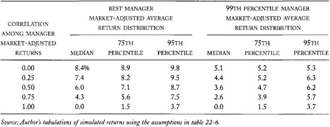

------------------------------------------------------------------------

**Closet Indexers**

*Closet indexers are* active equity investment managers who create
portfolios that very closely replicate the benchmark indexes their
clients use to measure their performance. Their clients presumably
expect that their managers will choose portfolios to beat their
benchmarks. It is very difficult, however, to significantly outperform
an index with a portfolio that is very closely correlated to it.

Closet indexers choose closely correlated portfolios because such
portfolios rarely significantly underperform their benchmark indexes.
Closet indexers minimize the risk of significant failure.

Clients generally do not like closet indexers because they pay them high
fees for their "active management" but they essentially receive only
index portfolios in exchange. The management fees for index funds are
much lower than those for actively managed portfolios.

Since the returns of closet indexers are very closely correlated to
their benchmark indexes, analysts can determine whether closet managers
are skilled managers with much less data than they require to determine
whether true active managers are skilled. 

------------------------------------------------------------------------

The problem would be much easier to solve if the variation due to other
factors were smaller. In our analysis, we assumed that the variation of
market-adjusted portfolio returns is 7 percent per year. We derived this
number by assuming that the portfolio return standard deviation is 16
percent, the market return standard deviation is 14.5 percent, and the
correlation between the two returns is 0.9. If the problem were
characterized by lower standard deviations or by a higher correlation,
stronger tests would be possible. For example, if the correlation were
0.95 instead of 0.9, the market-adjusted portfolio return standard
deviation would be 5 percent per year. The power of a 95 percent
confidence level test using five years of returns, assuming manager
skill of 2 percent, would rise from 15 percent (assuming a 7 percent
market-adjusted return standard deviation) to 22 percent. If the
correlation were 0.99, the market-adjusted return standard deviation
would drop to 2.6 percent, and the test power would rise to 52 percent.
Unfortunately, the portfolio returns of most equity managers are not so
highly correlated with the market.

To solve a low signal to noise ratio problem, we must either know more
about the signal or somehow reduce the noise. In practice, analysts most
frequently attempt to lower the noise by using factor models to explain
unanticipated portfolio returns. The analysis of market-adjusted returns
that we studied in this section is based on a simple one-factor
market-adjusted model of portfolio returns. More complex models attempt
to attribute returns to other factors, such as interest rates, firm
size, and expected growth rates. Since the variation in the resulting
factor-adjusted excess returns is lower than the variation in the
market-adjusted returns, tests of manager performance will be more
powerful for a given sample size. These tests, however, identify manager
skill only after accounting for factor returns. They will not measure
the value added by managers who can successfully predict factor returns,
and who can adjust their portfolios to benefit from their skills.

With five years of monthly returns data, a test with 95 percent
confidence and 75 percent power to identify 2 percent skilled managers
requires an annual factor-adjusted excess return standard deviation of
only 1.9 percent. Unfortunately, factor models generally cannot explain
returns so precisely. Such models would have
to explain 98.6 percent of the total variation in returns to achieve
such precision.

------------------------------------------------------------------------

**A Good Dissertation Topic**

We know that skilled managers should perform better in liquid markets
than in illiquid markets because the costs of establishing positions are
lower in liquid markets. This observation is especially important for
large fund managers and for skilled managers who pursue strategies that
many other skilled managers pursue.

Since liquidity varies through time, so will the performance of such
skilled managers. Tests of manager skill therefore should incorporate
information about time-varying liquidity. To the best of my knowledge,
no such tests have ever been done. 

------------------------------------------------------------------------

The fraction of total variation that a statistical model explains is
called the *R^2^* of the model. Factor models typically have *R^2^* of
less than 90 percent in annual data. For comparison, the *R^2^* of the
simple market-adjusted return model is 81 percent when the portfolio
standard deviation is 16 percent, and the market-adjusted return
standard deviation is 7.0 percent {0.81 = (0.9)^2^ = (16^2^ -
7^2^).16^2^}. (In the simple market-adjusted return model, the *R^2^* is
equal to the square of the correlation coefficient of the portfolio
returns with the market returns.)

In principle, analysts could construct stronger tests if they knew more
about a manager's presumed skill. For example, suppose an analyst
believes that a manager may be skilled only in rising markets but not in
falling markets. This information would allow the analyst to construct a
stronger test of whether the manager is skilled. In particular, the
analyst would examine returns only in rising markets. In general,
analysts can better identify skill if they can identify some variables
that are correlated with it.

#### 22.4.6.1 Length of Sample Versus Number of Observations

In most statistical analyses, the greater the number of observations,
the more powerful the results will be. The results presented throughout
this section illustrate this principle. The more years of data upon
which statistical performance evaluations are based, the more powerful
those evaluations will be.

For a given sample period, the number of observations can be increased
by sampling more frequently. For example, in a 10-year period, analysts
can examine 10 annual, 120 monthly, and approximately 522 weekly
nonoverlapping returns.

In performance evaluations, however, statistical power depends primarily
on the length of the sample period and not on the frequency of sampling
within that period. This is because the total performance within a
period is the same regardless of how often we observe it within the
period. Analyses that attempt to discriminate between luck and skill
need long sample periods to separate the systematic contribution of
skilled managers from the noise of unanticipated factors. Sampling more
often within a period does not address this need.

More frequent sampling, however, often produces slightly more powerful
tests, especially when the total number of observations otherwise would
be less than 20. The standard error of the mean---which appears in the
denominator of the *t*-statistic---often can be estimated more
accurately from more frequent observations for a given sample period.
Whether it can or cannot depends on whether prices follow a random walk
at various observation intervals. The issue is technical and need not
concern us further. It explains, however, why I presented analyses for
monthly returns instead of annual returns in this section.

## 22.5 MORE IMPORTANT PROBLEMS WITH STATISTICAL PERFORMANCE EVALUATION

Statistical performance evaluation often is even more difficult than the
results in the previous section indicate. If the returns being analyzed
are not well characterized by the assumptions upon which statisticians
base their analyses, the conclusions that statisticians reach will not
be reliable.

Two main problems may cause returns data to
have substantially different properties than statisticians expect. These
problems involve distributional shape and the accuracy of the returns
data. These issues are very important because some investment strategies
produce highly unusual return distributions and because---through
malice, negligence, or simple oversight---returns data sometimes do not
represent true performance. Investors who fail to recognize these
problems risk making decisions that often cause them to lose their
entire investments.

### 22.5.1 Distributional Shape

The *shape* of the distribution of a variable refers to how the
probabilities of different values of the variable are distributed. If
the distribution is *flat*, all values have equal probabilities. If the
distribution is *fat-tailed*, extreme values are common.

Distributional shape is important because statisticians base their tests
on assumptions about the return probabilities based on luck alone. If
the shape they assume is different from the true shape of random
returns, their inferences will be wrong.

The quantitative properties of the *t*-tests presented above were
derived by assuming that portfolio returns are *normally distributed.*
The *normal distribution* is a specific bell-shaped distribution. (The
probabilities of each outcome plotted against their corresponding
outcomes trace the shape of a bell.) For reasons that need not concern
us now, the normal distribution very often provides excellent
characterizations of the distributions of a wide variety of random
variables. Statisticians therefore most commonly base their analyses on
this distribution.

#### 22.5.1.1 Normality

The actual distribution of portfolio returns, however, is not normal.
Many studies demonstrate that extreme values are more common for
portfolio returns than we would expect if they were normally
distributed. The actual distribution of returns therefore is fat-tailed
in comparison to the normal distribution. Although the difference is not
great, the unfortunate consequence of the more common extreme values is
that *t*-tests are less powerful than they would be if the returns were
normally distributed. The results we discussed above, discouraging as
they are, actually overstate the reliability of *t*-tests.

#### 22.5.1.2 The Peso Problem

One particular property of the normal distribution is of critical
interest to us. The normal distribution is a *symmetric distribution.*
In a *symmetric distribution*, outcome probabilities depend only on
their distance from the median value of the distribution. The
probabilities of outcomes at equal distances above and below the median
therefore are the same. The returns of well-diversified portfolios are
approximately symmetrically distributed. Although there are some
systematic departures from symmetry (large negative values are slightly
more common than large positive values), these departures usually affect
index returns as well. Accordingly, market-adjusted returns tend to be
quite symmetric for well-diversified portfolios because the asymmetries
in the portfolio and index returns offset each other.

Certain portfolio strategies, however, can produce highly asymmetric
return distributions. Unfortunately,
*t*-tests applied to returns generated by these portfolios can produce
highly unreliable results. The true confidence levels and power of
*t*-tests based on highly asymmetric distributions are vastly different
from those based on the normal distribution.

------------------------------------------------------------------------

**How to Fool Most People Most of the Time: Sell Volatility**

An equities manager can produce an enhanced index return in most years
by holding an index portfolio (or a closet index portfolio) and writing
out-of-the-money options. The index portfolio produces the index return.
The out-of-the-money options produce a small additional return if the
options are not exercised. If the options are exercised, the portfolio
generally will suffer a significant loss. The options will be exercised
when the market is highly volatile. Since it takes essentially no skill
to set up this strategy, it is an example of an *informationless trading
strategy.*

The market-adjusted returns of this portfolio will be small and positive
most of the time. Only very rarely will the fund underperform the
market. When it does, however, the underperformance will be very large.

If the manager has not been unlucky, *t*-tests will indicate that the
manager is highly skilled, even in small samples. Clients therefore must
be very vigilant to ensure that their managers have not given them a
peso problem. 

------------------------------------------------------------------------

The *peso problem* is an extreme example of this problem. A *peso
problem* arises when a trading strategy almost always produces a small
positive return. Very rarely, however, the strategy produces a very
large negative return that may more than offset the many small gains the
portfolio normally produces. This distribution of returns is highly
asymmetric.

The peso problem is of special concern to performance evaluation. Until
a calamity occurs, a manager who holds a portfolio with a peso problem
appears to be quite skilled. The manager, however, is lucky rather than
skilled.

It is almost impossible to use statistical methods to evaluate managers
who have peso problems. A reliable evaluation requires enough data to
ensure that calamities are adequately represented in the sample. Since
calamities are quite rare, the sample must be extraordinarily long. The
only reliable way that clients can determine whether their managers are
creating peso problems is to directly examine the strategies that their
portfolio managers use.

------------------------------------------------------------------------

**The Peso Problem**

The following story is part of the folklore of the Economics Department
at the University of Chicago. I have no idea of its veracity.

In the 1960s and 1970s, inflation in Mexico was significantly higher
than in the United States. Interest rates therefore were higher in
Mexico than in the United States. Had there been a floating exchange
rate regime then, the Mexican peso would have depreciated relative to
the dollar at a rate that would have made investors roughly indifferent
between investing in the United States and in Mexico. For example, a
U.S. investor would have earned higher interest in Mexico than in the
United States, but the premium would have been offset by a decrease in
the dollar value of the peso over the period of the investment.

In fact, the Mexican government fixed the exchange rate so that it could
not change. The continuing inflation, however, forced the government to
devalue the peso on an irregular basis. Anyone who had assets
denominated in Mexican pesos suffered a large loss every time the peso
was devalued.

Investment in Mexican debt securities therefore created a *peso
problem.* As long as there was no devaluation, the investment would
systematically outperform similar dollar-denominated investments.
Whenever a devaluation occurred, however, the gains would be lost
overnight.

A certain Chicago professor is said to have invested in Mexican debt
instruments to take advantage of the interest rate differential. When
confronted by his colleagues about the peso problem, the professor was
reported to have said that he was not worried: As an authority on
international economics who had trained a significant number of Mexican
economists, he was certain that his former students would call him for
his advice before they devalued the peso. He therefore expected that he
would be able to avoid the peso problem by selling immediately after he
took their call.

He was right. His students did call, but they could not reach him
because he was traveling\!

------------------------------------------------------------------------

------------------------------------------------------------------------

**The St. Petersburg
Paradox: Why Not Double-down?**

Bet a dollar on the outcome of a coin flip. If you win, quit with a
1-dollar profit. If you lose, bet 2 dollars on the outcome of another
coin flip. If you win, quit. Your total profit from both coin flips will
be 1 dollar. If you lose, double your bet again to 4 dollars. If you win
this third flip, quit with a 1-dollar profit (4 --2 − 1), otherwise
continue doubling your bet until you win.

This *doubling-down* betting strategy is called the *St. Petersburg
paradox.* If you have infinite wealth, you will always win 1 dollar by
playing it until you finally win. If your wealth is finite, however, you
will eventually go bankrupt if you play the game often enough. It is a
paradox because these results do not depend on whether the coin is fair.

An equities manager can produce an enhanced index return in most years
by holding an index portfolio and making a short-term bet on some
investment idea. The index portfolio produces the index return. If the
bet does not work out, bet again with twice the money. Continue doubling
down until you win. This simple trading strategy ensures that the fund
manager outperforms the market as long as the fund does not go bankrupt.

The doubling-down strategy is very attractive to undisciplined
investment managers because it usually allows them to avoid the
psychological consequences of their poor decisions. They rationalize by
thinking that they initially may have been wrong about an idea, but in
the end they got it right.

The strategy is also attractive to unethical investment managers who
fear that their clients will dismiss them if they perform poorly. They
will play the strategy if they have performed poorly. Such managers are
unethical because they do not care about the risks that they impose upon
their clients, and because they manage their portfolios to benefit
themselves rather than their clients. 

------------------------------------------------------------------------

### 22.5.2 Fraudulent Returns

An implicit assumption of statistical performance evaluation is that the
returns under analysis are true returns. Statistical tests applied to
returns that are not accurate obviously will not produce accurate
results. Computer scientists and statisticians are both fond of saying,
"Garbage in, garbage out."

You need to be aware of two processes that can cause returns to be
fraudulent. They involve return smoothing and pyramid schemes.

#### 22.5.2.1 Return Smoothing

As noted in "Smooth Sailing, Rapids Ahead" (p. **448),** managers who
value portfolios of infrequently traded assets may adjust the values of
those assets less quickly than they should. The portfolio returns that
they compute from these values therefore will be inaccurate. In
particular, they will change too slowly. Their variation from period to
period will be less than it should be, and the ratio of return
continuations to return reversals (return serial correlation) will be
higher than it should be. Consequently, the returns will appear to be
smoother than they should be.

Artificial smoothness affects statistical performance evaluation because
smoothing decreases return volatility. The artificially low return
volatility causes statisticians to conclude that large mean returns are
more significant than they are. In particular, recall that the *t*-test
is based on the ratio of the mean return to a measure of its expected
dispersion called the standard error. Since statisticians usually
estimate the standard error from the return
volatility, artificially low return
volatility causes artificially low standard error estimates, which cause
artificially high *t*-ratios, and therefore overconfident conclusions.

When managers smoothe too much, their reported valuations may
significantly differ from true valuations. At some point, their
regulators, customers, brokers, auditors, or custodians may recognize
the discrepancy and demand immediate adjustment. Since smoothing
invariably delays the recognition of capital losses rather than of
capital gains, the resulting revaluations produce very significant
negative returns. Smoothing thus can produce an artificial peso problem.
From the investors' point of view, however, there is nothing artificial
about the problem.

#### 22.5.2.2 Pyramid Schemes

A *pyramid scheme* is a fraud that dishonest investment managers commit
against their clients. In these schemes, the manager explicitly or
implicitly promises a high rate of return on an investment. Investors
then place their money with the manager, who usually very actively
promotes the scheme. The manager then uses their capital to pay high
returns to initial investors. The apparently high returns realized by
the initial investors attract new investors. As long as the manager can
attract an ever-growing base of new investors, he can pay off earlier
investors, and the scheme can survive. At some point, however, the fraud
gets so large that the manager can no longer pay earlier investors. At
that point, it collapses and anyone who has not yet been paid usually
loses everything. The promoter profits either by stealing funds or by
charging management fees. Pyramid schemes, of course, are illegal almost
everywhere.

These schemes are called pyramid schemes because they are built upon an
ever-enlarging base of investors. The investors at the top profit from
the "support" provided by the investors at the base. They are similar to
chain letters. Pyramid schemes are extreme examples of "robbing Peter to
pay Paul." Pyramid schemes are also known as Ponzi schemes after Charles
K. Ponzi, who ran an extremely large pyramid scheme in 1920.

Until pyramid schemes collapse, the returns that they generate are
remarkably good. If you analyze these returns to determine whether a
manager is skilled or just lucky, you will conclude that the manager is
skilled.

The only way to protect against losing to a pyramid scheme is to
determine whether the manager's accounting systems accurately report
investment assets, account liabilities, investment income, and capital
gains distributions. In a pyramid scheme, actual assets and actual
investment income generally will be substantially less than reported.

If pyramid scheme promoters are not too greedy, if their excess returns
are not too large, if they can convince their clients to not withdraw
their funds, and if they can somehow control the audits of their
portfolios, pyramid schemes can go undetected for a very long time. An
investment manager's performance record therefore is no substitute for
doing the *due diligence* that all prudent investors must undertake to
ensure that they are not contributing to pyramid schemes.

## 22.6 THE SAMPLE SELECTION BIAS

The two preceding sections demonstrate that statistical tests for
managers generally do not produce useful information about their skill.
The properties of the tests described there were derived by assuming
that analysts would use the tests under ideal circumstances. In
practice, statistical performance evaluations rarely are applied under
ideal circumstances. Consequently, the tests are still less useful than
they seem.

------------------------------------------------------------------------

**Ponzi's Ponzi Scheme**

Charles K. Ponzi established the Securities Exchange Company in December
1919 in Boston. His company purportedly traded postal reply coupons.

Postal reply coupons are coupons redeemable for postage. People who
wanted to enclose return postage used them when corresponding with
people in other countries. The postal reply coupon system was set up in
1906 by a postal convention of over 60 countries. Participants in the
system agreed to honor the coupons at fixed exchange rates. When the
system was initially established, coupons everywhere sold for slightly
more than they were worth in postage. Following World War I, however,
changes in exchange rates made it possible to buy coupons in some
countries and redeem them at a substantial percentage profit in other
countries. Although the percentage profits could be quite large, the
total amounts that anyone could earn this way were quite small because
the coupons were not worth much.

To fund his operation, Ponzi sold bonds to investors that promised them
a 50 percent return over 90 days. He claimed that he could produce this
income through the 400 percent returns he was making by redeeming postal
reply coupons. No evidence suggests that Ponzi ever redeemed more than a
trivial quantity of coupons.

Ponzi repaid his bonds at face value in 45 days. The resulting
excitement caused his business to grow exponentially. By July, the
business was taking in 1 million dollars per week from offices in
several cities in the Northeast.

The government forced Ponzi to halt sales of his notes on July 26. By
that time, he had collected about 9.5 million dollars from more than
10,000 investors. On July 28, investors started to demand payment on
their notes. Remarkably, instead of running away with the money, Ponzi
paid the notes until he ran out of cash on August 7.

Ponzi was arrested on August 12 and charged with many counts of federal
mail fraud. He negotiated a guilty to plea to one count, and the court
sentenced him to five years in prison. Following his release, he engaged
in other financial frauds for which he was caught and convicted.

*Source: Charles K. Ponzi Website:* The Remarkable Criminal Financial
Career of Charles K. Ponzi *by Mark C. Knutson at
[[www.mark-knutson.com](http://www.mark-knutson.com)],
May 31, 2001.*

------------------------------------------------------------------------

The most important problem that plagues these tests is the sample
selection problem. This problem can affect inferences whenever people
learn from the past. Their learning may involve formal analyses like the
*t*-test described above, or it may simply involve judgments that people
make based on their experience. In either event, you must be very
careful that the *sample selection bias* does not affect your
conclusions.

The *sample selection bias* arises when some process selects the
information that you see about some object. If the process does not
randomly select the information that you see, you will see only selected
aspects of the object and your impression of it will not be accurate.
Decisions that you make based upon your information therefore very
likely will be faulty.

------------------------------------------------------------------------

**Blind Men Describe an
Elephant**

The story of the blind men who examine different parts of an elephant
illustrates the sample selection bias: Each man feels only the trunk,
leg, side, or tail, and each respectively concludes that the elephant is
like a snake, a tree trunk, a wall, or a rope. Since each man examines
only one aspect of the elephant, none of them appreciates the totality
of the elephant. Each man would make a poor decision about elephants
based only on the information produced by his examination of the
elephant. 

------------------------------------------------------------------------

### 22.6.1 Sample Selection in the Mutual Fund Industry

Suppose you examine the marketing literature of a company that manages
and distributes a large family of mutual funds. Each fund accurately
reports its performance relative to appropriate benchmarks. By reviewing
the data, or by doing some formal statistical calculations, you conclude
that their performance has been very impressive. On average, the funds
in this family have substantially beaten their benchmarks. The
performance obviously is both statistically significant and economically
significant. The funds have performed much better than you would expect
if their managers were not skilled. You therefore conclude that their
managers are skilled and decide to invest your money with this company.

You may be very disappointed with your results. Many mutual fund
distributors feature only their best-performing funds in their marketing
literature. Although they may offer other reasons for why they select
which funds to feature, they undoubtedly know that they will benefit
from this presentation of their products. The average performance of all
funds in the family actually may be negative. If you knew this, you
might have concluded that it is unlikely the company's funds will beat
the market on average, and that the managers of their best-performing
funds probably were only lucky. If the managers indeed are not skilled,
you probably will be disappointed with your decision. You would have
made a better decision had you known about the other funds.

A sample selection bias affected your inference. You only saw the funds
that the marketing literature presented and therefore only saw a
selected view of the company.

Even if the company presents the results for all its funds, you still
may not see the entire picture. Mutual fund distributors often kill
their poorly performing funds, usually by merging them with
better-performing funds. The reported performance of the survivor is
based only on its performance and does not include the performance of
the failed fund. Mutual fund companies may kill their losers because
they become expensive to operate when they get small. They may also kill
them because they do not want to report their performance. In either
event, by killing poorly performing funds, they raise the computed
average performance of the surviving funds. The average performance of
all funds may be negative, but you could not know this without knowing
about the other funds. This type of sample selection bias is called the
*survivorship bias.*

Some large mutual fund companies start many new mutual funds every year.
They keep the ones that perform well and kill the ones that fail. In
this way, they are able to create the winners that they need to market
their funds. If you are unaware of this process, you may give too much
significance to past returns. You may not realize that the fund which
generated superior past performance came to your attention only because
it was among the best-performing funds of a large group of funds.

### 22.6.2 Avoiding the Sample Selection Bias

Sample selection biases may be responsible for more trading losses than
any other cause. They usually arise because people do not see the whole
picture or because they fail to ask the right questions when they
interpret what they see.

Many people invest with active investment managers who have performed
well. As noted in section 22.4.5, whether their performance is
statistically significant must be judged relative to the entire sample
of managers. What appears to be significant out of context may not be
noteworthy in context. The important point to remember is that bad
managers do not come to your attention. Nobody talks about them. Nobody
writes about them. They do not write books. You learn about the best
managers only because they had great performance. Everyone talks about
them. Everyone writes about them. They write books that everyone reads.
To make reasonable statistical inferences about whether great performing
managers are skilled, you must know the total number of managers who
might have been lucky but were not.

------------------------------------------------------------------------

**My Favorite Fraud**

The following scheme is illegal. Do not use it. I present it only so
that you can better appreciate the sample selection bias, and so that
you can avoid falling for this scheme should a con man ever try to
target you.

Buy a mailing list of 20,480 wealthy and gullible people. Send them a
letter in which you explain that you are a very successful trader who
has more money than you can spend. Boast about how you correctly
predicted what direction prices would move during nine of the last ten
months. Tell some story about how you did it. Then tell them that you
now crave their recognition for being a market genius, since money is no
longer very meaningful to you. Give them your prediction for the next
month.

Divide your names into two equal groups. To the first group, predict
that the market will rise. To the second group, predict that it will
fall.

One month later, write a letter to the 10,240 people for whom you
correctly predicted the market. Continue boasting and remind them that
you correctly picked the market for them. Tell them how much money they
could have made if they had traded on your recommendation. Then give
them another pick. Of course, you predict an increase to one half of the
group and a decrease to the other half.

Repeat this for ten months until 20 people have seen you correctly
predict the market 10 times in a row (20 = 20480/2^10^). If they are not
aware of your scheme, they will be convinced that you have correctly
picked the market 10 times for them, and they will be prepared to
believe that you did indeed do it correctly in nine of the ten months
before you started to correspond with them. Such results are exceedingly
unlikely to occur at random. They will swear that you are a genius.

You now have these people wrapped around your finger. If they are
gullible, you may be able to abuse their trust.

If you also send letters to people for whom you incorrectly predicted
the market, you can increase your yield. Simply tell them that you are
only human and cannot get it right every time. You will have 200 people
for whom you have correctly called the market exactly nine times and
another 900 for whom you have correctly called the market exactly eight
times. You probably will not want to continue corresponding with those
for whom you failed to call the market three or more times.

The "lucky" ones for whom you correctly predicted the market cannot
possibly make the proper inference about your skill without knowing your
scheme. If they do know the scheme, the only rational inference is that
you are not skilled. 

------------------------------------------------------------------------

Similar comments apply to investment newsletters. Only the newsletters
that have great records for recommending securities and contracts
survive to come to your attention. The ones with poor records fail. The
surviving newsletters may be written by insightful authors or by lucky
authors. Unfortunately, you generally cannot
assess the authors' skills from their performance record.

### 22.6.3 Regression to the Mean

Although sample selection can produce an upward bias in an average of
past returns, it cannot affect subsequent returns. Perhaps the clearest
evidence that sample selection has affected an average of past returns
is the difference between that average and an average of subsequent
returns. When selection has caused the past return average to be high,
the subsequent return average is invariably lower. This phenomenon is
called *regression to the mean.* Researchers have identified it in many
different contexts.

### 22.6.4 Summary

Whenever some process filters the data that you see, you get only a
selected aspect of reality. When you make decisions based on that view,
you often will make poor decisions. The only way to avoid the sample
selection bias is to understand how the data came to your attention. You
must always ask whether an event is significant relative to the process
that generated it, and not simply relative to what you know about it.

------------------------------------------------------------------------

**The Regression of Public Commodity Pools**

In the early and middle 1980s, approximately 2,000 commodity trading
advisers were registered with the National Futures Association. The vast
majority of these advisers managed private accounts.

Between July 1979 and June 1985, these advisers offered approximately 15
new commodity funds---commonly called *public commodity pools*---per
year to public investors. The offerings were accompanied by prospectuses
that reported the average returns for the adviser's accounts for at
least the previous 36 months (if the adviser had been advising that
long).

Their average monthly return in the 36 months before the offering was
4.1 percent. These funds had performed remarkably well!

In the first year after going public, their average monthly return was
0.23 percent. The results did not improve much in subsequent years.
These returns were stunningly disappointing in comparison to the prior
returns.

These results suggest that most of the advisers who offered public funds
probably had simply been lucky in the previous 36 months. Once the funds
went public, their average returns regressed to the mean.

To support this conclusion, consider how many of the 2,000 advisers we
would expect would have average returns greater than 4.1 percent per
month over the previous 36 months, purely by chance. During this period,
all public commodity funds had a mean monthly return of approximately
0.7 percent per month with a standard deviation of 11.3 percent per
month. If we assume that returns are normally distributed with this mean
and standard deviation, by pure chance, a probability calculation (not
reported) predicts that we would expect 70 of 2,000 advisers would have
an average monthly return of greater than 4.1 percent over the last
three years. Chance alone therefore provides more than enough advisers
to explain the 4.1 percent monthly return average of the advisers who
offered public commodity funds. (Note that the average includes managers
with prior average returns both greater and less than 4.1 percent.)

*Source: Edwin J. Elton, Martin J. Gruber and Joel Rentzler, "New Public
Offerings, Information, and Investor Rationality: The Case of Publicly
Offered Commodity Funds,"* Journal of Business *62, no. 1 (1989): 1-15.*

------------------------------------------------------------------------

------------------------------------------------------------------------

**Warren Buffet
Reconsidered**

In the 26 years between 1965 and 1990, the book value of Berkshire
Hathaway increased by an average of 13.2 percent more than the total
return on the S&P 500 Index. By 1990, Warren Buffet was widely acclaimed
to be a highly skilled investment manager.

During the next 10 years, the book value of Berkshire Hathaway increased
only by an average of only 6.84 percent more than the total return on
the S&P 500 Index. Although this performance is still quite impressive,
it is not as impressive as the earlier performance. The performance
clearly regressed toward the mean. In his first 26 years, Warren Buffet
probably was lucky as well as skilled. In the subsequent 10 years, he
was either less lucky or it was much more difficult to produce the same
extreme returns with a much larger firm.

Suppose that in 1990, you decided to collect returns data for the next
ten years to determine whether Warren Buffet was truly a skilled trader.
The standard *t*-test then would be appropriate because the subsequent
returns would not be subject to the sample selection bias. Using only
annual data from 1991 through 2000, the *t*-statistic is 1.95. The
probability that an unskilled manager would have a *t*-statistic greater
than this value is slightly greater than 4 percent. These results
suggest that only one unskilled manager in 25 would have performed
better than Warren Buffet over this period. Warren Buffet probably is a
skilled manager. 

------------------------------------------------------------------------

------------------------------------------------------------------------

**More Caveman Psychology**

Our evolutionary history has hardwired our brains to believe that
everything has a cause. Our ancestral aunts and uncles who could not
connect events to causes often failed to exploit opportunities that
enhanced their survival, or to avoid risks that threatened their
survival. They therefore did not survive to reproduce as often as did
our ancestral parents. We know that our ancestral parents survived
because we are here to speculate on how they did it. They must have been
able to connect events to their causes better than our ancestral aunts
and uncles. Our minds therefore are probably hardwired to seek an
explanation for every event.

Many people think that the desire for an explanation for everything is
the reason why many people are religious. Although I do not believe
this, it seems reasonable to me that this hardwired desire to link
causes to events explains why people want to believe that successful
people are skilled and not just lucky. 

------------------------------------------------------------------------

In trading, the sample selection bias is especially important because
winners come to our attention much more often than losers do. Unless we
are very disciplined, we may easily overvalue winners.

The sample selection problem is especially difficult to recognize
because most of us want to believe that winners are skilled and not just
lucky. Our natural inclination is to attribute performance to skill or
the lack of it. Most of us believe that there is a reason for
everything. We would rather that the reason be skill than luck. When
making inferences, always beware of rose-colored glasses.

Our desire to attribute performance to skill or the lack of it applies
primarily to others. When we consider our own performance, our natural
inclination is to attribute good performance to skill and bad
performance to luck. We do this because we want to feel good about
ourselves. We therefore tend to remember good results and try to forget
bad results. This may be the most dangerous selection bias that we face.

## 22.7 ECONOMIC APPROACHES TO PERFORMANCE PREDICTION

The difficulties associated with statistical performance prediction
suggest that inferences based only on past performance will not be
useful for predicting future performance. Past performance simply does
not predict future returns with enough confidence to be of much use for
most applications.

Fortunately, economic theory---simple game theory, actually---suggests
another approach. In the long run, players win games when they have a
*comparative advantage* over their opponents. Players have a
*comparative advantage* when they have greater skills or greater
resources than their opponents. The skills and resources, of course,
must be those which will help the players excel. They therefore will
vary by the strategies that the players pursue.

------------------------------------------------------------------------

**It Seems Like Everyone Is a Winner**

People talk about their successes far more often than their failures.
They enjoy describing their winnings and they are embarrassed to admit
their mistakes.

If you listen only to what people say about their trades, you will think
that most traders are winners. If you draw inferences from what you
hear, you might think that you, too, would be a winner, if only you
traded. 

------------------------------------------------------------------------

------------------------------------------------------------------------

**Winning the Olympic
Marathon**

On average, *better* players win games. Good players and even great
players do not generally win when they play against even better players.

A player has an *absolute advantage* when he or she can do something
well. For example, a marathoner who can complete the marathon in less
than 2:20 is incredibly fast. Unless you are involved in track and
field, you probably have never met anyone so fast. A 2:20 marathoner
will win the vast majority of marathons that are run every year.

Such a time, however, would have been good for only 36th place in the
men's marathon at the 2000 Olympics. Most marathons do not attract
world-class runners. Those which do, however, are highly competitive.
You do not win such races by running extremely fast. You win them by
running faster than every other runner.

To win a game, you must not just play it well. You must play it better
than your opponents. 

------------------------------------------------------------------------

Since trading is essentially a game, we should be able to predict
long-run performance by identifying the factors that produce it. Those
traders who have comparative advantages in those factors should be the
long-run winners.

[Tables 22-8](#part0035.html_ch22tab8) and
[22-9](#part0035.html_ch22tab9) provide a partial list of the
factors that may predict the performance of managers, traders and the
organizations for which they work. These factors vary in importance
depending on the investment styles and the trading strategies that the
manager, trader, or firm pursue.

The most important comparative advantage that a manager or trader should
have is a thorough appreciation of the need to have a comparative
advantage. Traders who do not understand why comparative advantage is
important will not consider whether they have a comparative advantage
before they trade. If they do not consider this question, they can have
no reason to expect that they will trade profitably.

Traders who appreciate the importance of comparative advantage consider
both why their trading strategy should work, and why they expect other
traders will lose to them. Since trading is a zero-sum game, the two
issues are inseparable. Most traders, however, focus only on why they
think they will profit and not also on why they think other traders will
lose to them. Traders who understand both sides of their trades will
undoubtedly be more successful than those who consider only the logic of
their side.

Most people have trouble identifying comparative advantage. We often
mistake absolute advantage for comparative advantage. We may err because
absolute advantage is correlated with comparative advantage. The more
skilled a manager is, the more skilled the manager will be in comparison
with other managers. To identify comparative advantage, however, you
must compare managers. The point bears repeating: To win a zero-sum
game, you must not just be good, you must be better.

## 22.8 SUMMARY

People primarily examine past performance because they want to predict
good future performance. Unfortunately, good past performance does not
necessarily predict good future returns. In fact, it rarely does. Over
human time frames, luck is generally a more important determinant of
good performance than is skill. In addition,
the skills that may have been responsible for good past performance may
not produce good future performance. Moreover, a formerly skilled
manager may not still be skilled. These issues make the prediction of
good future performance from good past performance an essentially
worthless activity.

**TABLE 22-8.**\
Factors Correlated with the Performance of Investment Managers and
Traders

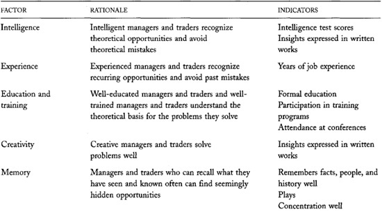

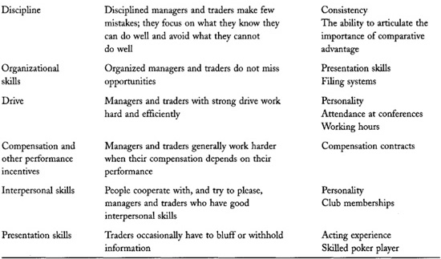

Even the most sophisticated statistical tests rarely can separate skill
from luck. The typical contribution of skill to performance is simply
too small.

**TABLE 22-9.**\
Factors Correlated with the Performance of Investment Management Firms
and Trading Firms

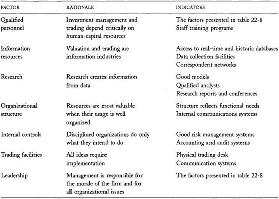

The contribution is small because many traders compete with each other
to profit. Their trading makes prices quite informative, so that most
price changes are not predictable. Statistical performance evaluation
therefore is unreliable without more data than are generally available
to us.

The importance of luck cannot be overemphasized. It is much better to be
lucky than skilled. The luckiest managers in a large group of managers
will certainly perform better than almost all skilled managers with
average luck. Superior past performance---even that of the most
acclaimed managers---by itself does not necessarily indicate skill.

These results do not imply that there are no skilled managers. The
discussions in [chapters 10-12](#part0020.html_ch10) about
speculative trading strategies suggest that skilled managers exist and
are profitable. Some skilled managers may even be able to beat the
market by more than the average 2 percent that we have assumed
throughout this chapter. Unfortunately, we probably cannot identify
these managers only from past returns.

To identify skilled managers, it is best to consider the characteristic
factors that generate superior performance. These factors include
intelligence, experience, education, training, creativity, memory,
discipline, drive, and access to data. Managers who have these
characteristics tend to perform better than those who do not.

Most professional managers have these characteristics and therefore
appear to be good managers. They probably can manage better than most
people. However, they mostly compete with other managers, not with the
average person. Winning managers are those who have a comparative
advantage. They are not just good managers, they are better managers. To
identify a successful manager, you must therefore be familiar with many
managers so that you can compare them. If you do not have the
characteristics of a successful manager, you probably will not trade
successfully in the long run.

------------------------------------------------------------------------

**Why Do We Mistake
Absolute Advantage for Comparative Advantage?**

A very important difference between physical survival and trading
explains why our successful evolutionary history has not prepared us to
be successful traders.

Survival is primarily a game played against nature in which nature does
not actively create adaptive strategies to defeat us. To survive, our
ancestors merely had to be good at survival.

In contrast, trading is a zero-sum game in which our competitors
constantly try to adapt to defeat us. Good competitors win only if they
are the best competitors.

Our evolutionary history has trained us to appreciate absolute advantage
but not to seek comparative advantage. 

------------------------------------------------------------------------

------------------------------------------------------------------------

**Handicapping a Horse Race**

Handicapping a horse race involves essentially the same processes as
choosing an investment manager. Handicappers and investment sponsors
both try to predict the outcomes of zero-sum games. They both consider
three classes of factors when they estimate the odds that a horse will
win the race, or a manager will outperform other managers: past
performance, absolute advantage, and comparative advantage. The
similarity between the two problems explains why investment sponsors
often call their searches for investment managers *horse races.* [Table
22-10](#part0035.html_ch22tab10) illustrates these parallels.

------------------------------------------------------------------------

**TABLE 22-10.**\
Parallels Between Handicapping Horses and Choosing Investment Managers

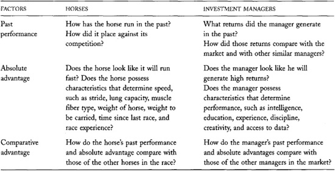

Perhaps the most important indicator of a
skilled manager is whether the manager clearly understands that success
comes from having a comparative advantage. Managers who are not
constantly thinking about their comparative advantages cannot know when
they should trade. I would be very reluctant to invest with managers who
confuse absolute advantage with comparative advantage. Successful
managers should be able to clearly articulate the comparative advantages
that they believe will allow them to profit in the zero-sum game.

## 22.9 SOME POINTS TO REMEMBER

• Distinguishing skill from luck is very difficult.

• The skills that produced superior performance in the past may not
produce such performance in the future.

• Past returns do not necessarily indicate future returns.

• Even when they have no skill, many traders will perform very well just
by chance.

• Sample selection biases seriously affect common inferences.

• To avoid the sample selection problem, we must always consider how
information came to our attention.

• An analysis of comparative advantage is probably the only reliable way
to determine who can trade well.

## 22.10 QUESTIONS FOR THOUGHT

• Do equal-dollar investors always have greater returns than buy and
hold investors? How does the answer depend on the serial correlation of
prices? Which strategy is more attractive to contrarians? To momentum
traders?

• Peter Lynch, former portfolio manager of the Fidelity Magellan Fund,
was an extremely successful investment manager. During his 13-year
tenure (May 1977 to May 1990), the fund outperformed the market by 1.03
percent per month. The standard deviation of the market-adjusted return
was 2.21 percent per month. Was Peter Lynch skilled or just lucky? How
did you first learn about him and about the Fidelity Magellan Fund?

• How is information in the newspaper subject to sample selection
biases?

• How is selecting a manager like selecting stocks for a portfolio?

• Where do you get your investment ideas? Is your idea generation
process subject to selection biases?

• Do you have any reason to believe that you would be a successful
active manager?

• Do you have any reason to believe that you could choose a successful
active manager?

• A highly skilled manager will probably demand higher compensation. How
will the compensation affect his or her subsequent returns? If it were
easier to determine whether managers are skilled, how would the labor
market for investment managers be different? How would investment
returns, net of managerial fees, be different?

• Corporate managers typically manage
portfolios of real assets, whereas investment managers manage portfolios
of financial assets. Are they otherwise similar? Do the principles
discussed in this chapter about evaluating and predicting performance
for investment managers also apply to corporate managers?

• Closed-end mutual funds are corporations that hold portfolios of
financial assets. Unlike open-end funds, investors cannot buy or sell
shares directly. Instead, they buy and sell shares in the secondary
market. Accordingly, the market price and the net asset value of
closed-end funds can differ significantly. What can the market discount
or premium over net asset value tell us about the manager's skill?

• Why were so many investors willing to extend so much credit to Charles
Ponzi?

• How might a statistician recognize when an investment manager is
adjusting the valuations of illiquid portfolio assets too
slowly?

## Part VII: Market Structure

The final chapters of this book examine the economics of market
structures. The topics we consider encompass many active regulatory
debates.

In [chapter 23](#part0037.html_ch23), we consider why index
markets are organized as they are. Our discussion shows how uninformed
traders benefit from trading indexes.

[Chapter 24](#part0038.html_ch24) examines the specialist
trading system. Specialists are broker-dealers who supply liquidity and
arrange trades at exchanges and at some proprietary trading firms.
Exchanges, regulators, and their business models sometimes compel
specialists to supply liquidity when they otherwise would not want to do
so. To encourage them to offer such liquidity, they must receive some
benefit from their unique positions.

The next three chapters examine how markets and dealers compete against
each other for order flow. We examine internalization and order
preferencing by dealers in [chapter 25](#part0039.html_ch25),
why markets consolidate and fragment in [chapter
26](#part0040.html_ch26), and screen-versus floor-based
trading in [chapter 27](#part0041.html_ch27). We pay special
attention to the problems that result when traders can trade the same
instruments in different places.

[Chapter 28](#part0042.html_ch28) discusses the origins of
extreme volatility. There we consider how market structures contribute
to---and mitigate---volatility. We also consider whether markets should
have circuit breakers to control excess volatility.

[Chapter 29](#part0043.html_ch29) considers the benefits and
consequences of prohibiting insider trading. Interestingly, the most
important issues involve labor economics rather than market
microstructure.
