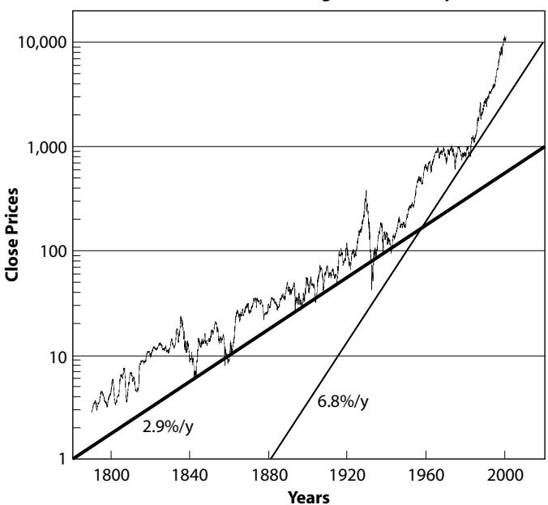
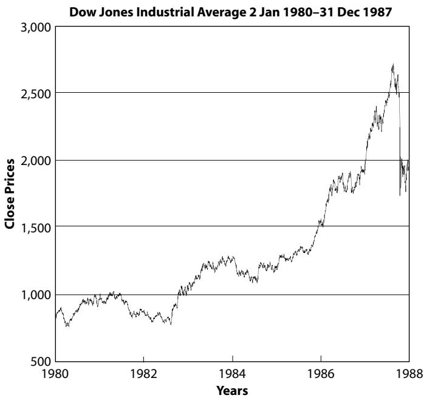
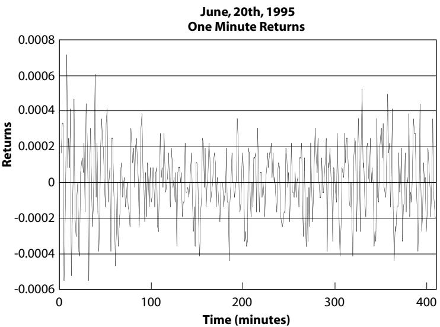
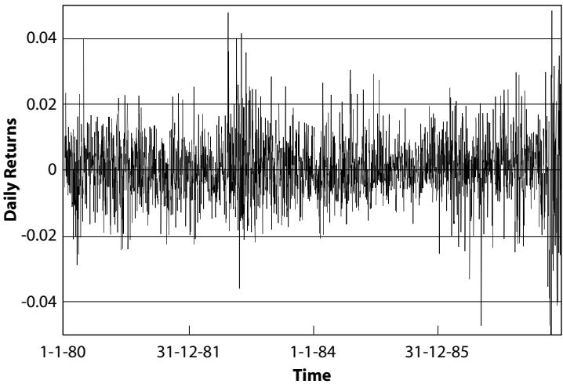
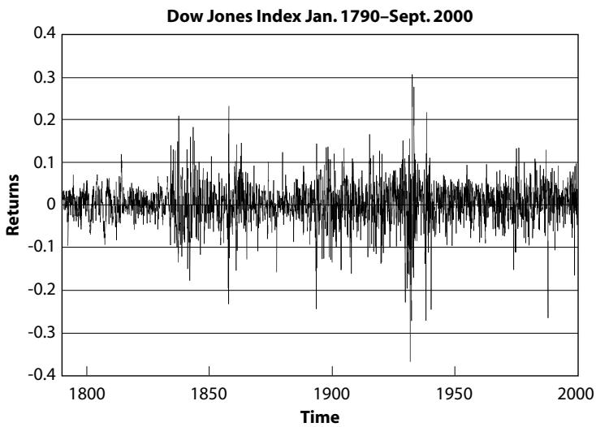
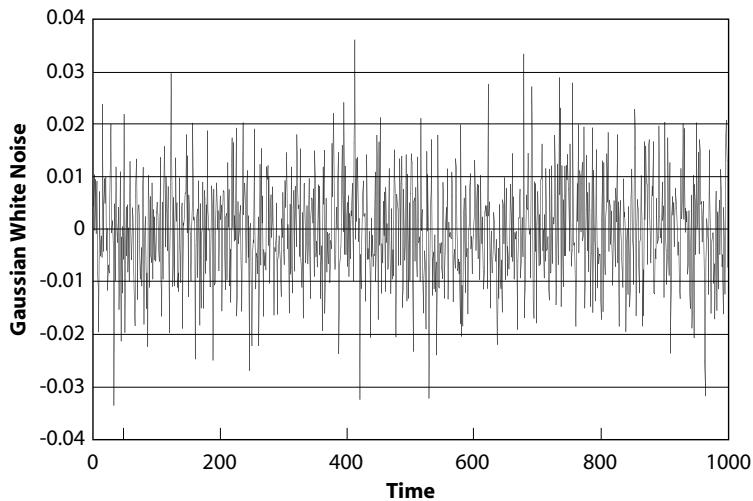
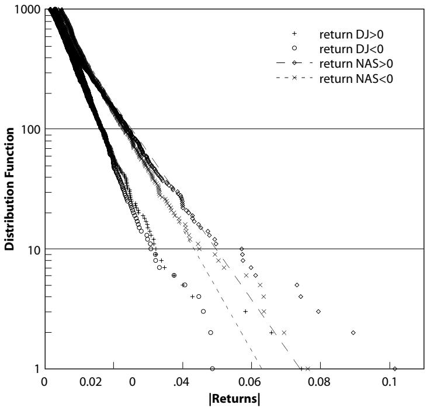
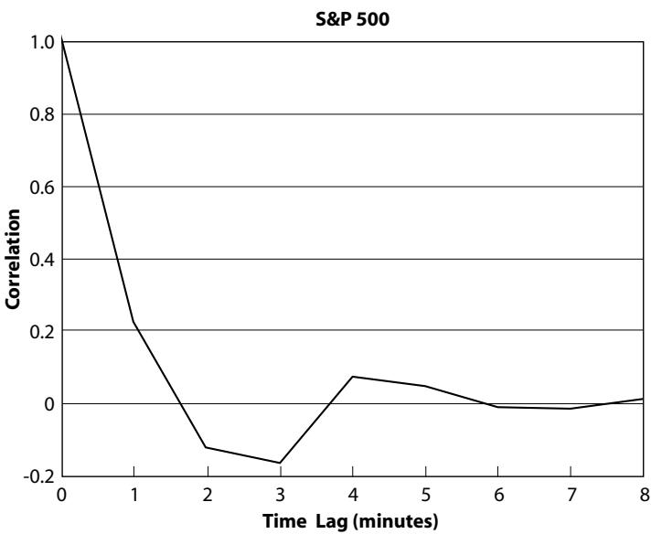
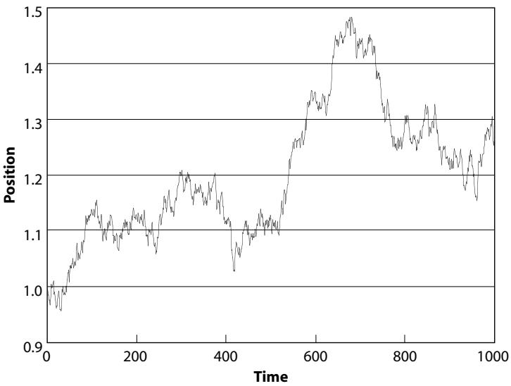
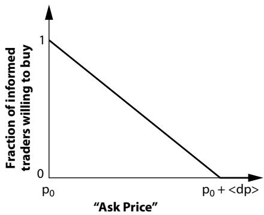

# Chapter 2 fundamentals of financial markets

Notwithstanding the drama surrounding crashes, there is a growing body of scholarly work suggesting that they are part of the family of usual daily price variations; this view, which is rooted theoretically in some branches of the theory of complex systems, posits that there is no characteristic scale in stock market price fluctuations [287]. As a consequence, the very large price drops (crashes) are nothing but small drops that did not stop [26]. According to this view, since crashes belong to the same family as the rest of the returns we observe on normal days, they should be inherently unpredictable because their nucleation is not different from that of the multitude of small losses which obviously cannot be predicted at all.

In chapter 3, we examine in detail whether this really holds for the very largest crashes. In particular, we shall provide strong evidence that large crashes are in fact in a league of their own: they are “outliers.” This realization will call for new explanations and hence may suggest a possibility of predictability. In order to reach this surprising conclusion, we first need to recall some basic facts about the distribution (also called the frequency) of price variations or of price returns and their respective correlation. To this end, we first present the standard view about price variations and returns on the stock market. A simple toy model will illustrate why arbitrage opportunities (the possibility to get a “free lunch”) are usually washed out by the intelligent investment of informed traders, leading to the concept of the efficient stock market. We shall then test this concept in the next chapter, by studying the distribution of drawdowns, that is, runs of losses over several days, demonstrating that the largest drawdowns, the crashes (fast or slow), belong to a class of their own.

## THE BASICS

## Price Trajectories

Stock market prices show changes at all time scales. From the time scale of “ticks” to that of centuries, prices embroider their complex trajectories. A tick is the price increment from the last to the next trade, separated typically by a few seconds or less for major stocks in active markets. The minimum tick is the smallest increment for which stock prices can be quoted. Figure 2.1 shows monthly quotes of the Dow Jones Industrial Average (DJIA) from 1790 to 2000. The great crash of October 1929 followed by the great depression is the most striking pattern in this figure. In contrast, on this long time scale the crash of October 1987 is barely visible as a small glitch between the two vertical lines.

What is the Dow Jones Industrial Average? The DJIA is an index of 30 “blue-chip” U.S. stocks. It is the oldest continuing U.S. market index. It is called an “average” because it was originally computed by adding up stock prices and dividing by the number of stocks (the very first average price of industrial stocks, on May 26, 1896, was 40.94) and should ideally represent a correct measure of the state of the economy. The methodology remains the same today, but the divisor has been changed to preserve historical continuity. The editors of The Wall Street Journal select the components of the industrial average by taking a broad view of what “industrial” means. The most recent changes in the components of the DJIA occurred Monday, November 1, 1999, when Home Depot Inc., Intel Corp., Microsoft Corp., and SBC Communications replaced Union Carbide Corp. (in the DJIA since 1928), Goodyear Tire & Rubber Co. (in the DJIA since 1930), Sears, Roebuck & Co. (in the DJIA since 1924), and Chevron (in the DJIA since 1984). The previous change occurred in March 7, 1997, when Hewlett-Packard, Johnson & Johnson, Traveller’s Group (Now Citigroup), and Wal-Mart Stores replaced Woolworth, Westinghouse Electric, Texaco and Bethlehem Steel. The components of the Dow Jones Averages are daily listed on page C3 of the Money and Investing section in The Wall Street Journal. See http://averages.DowJones.com/about.html. The Dow Jones index shown in figure 2.1 is the true Dow Jones index back to 1896 extrapolated back to 1790 by The Foundation for the Study of Cycles [138].

Dow Jones Industrial Average Jan 1790–Sept 2000  
  
Fig. 2.1. Monthly quotes of the DJIA from September 2000 extrapolated back to January 1790. The vertical axis uses logarithmic scales such that multiplication by a fixed factor, for instance 10, corresponds to addition of a constant in this representation. Mathematically, this corresponds to a mapping from multiplication to addition and allows us to show on the same graph prices that have changed by factors of thousands (in the present case, from a value of about 3 in 1790 to a value above 10,000 in 2000). The thick (respectively, thin) straight line corresponds to the exponential growth of an initial wealth of \$1 in 1780 (respectively, 1880) invested at the annual rate of return of 2.9% (respectively, 6.8%), which would have transformed into \$1,000 (respectively, \$10,000) in 2020.

The thick straight line in Figure 2.1 corresponds to the exponential growth of an initial wealth of \$1 invested in 1780 at the annual rate of return of 2.9%, which will grow to \$1,000 in 2020. The thin straight line corresponds to the exponential growth of an initial wealth of \$1 invested in 1880 at the annual rate of return of 6.8%, which will grow to \$10,000 in 2020. They both show the power of compounded interest! The comparison of these two lines is suggestive of an acceleration of the growth rate of return of the DJIA, which was on average about 3% per year 1780 until the 1930s and then shifted to an average of about 7% per year. But even this description falls short of capturing adequately the behavior of the DJIA: the growth of the DJIA is even stronger than given by the thin straight line and seems to accelerate progressively upward (at the end of the book, chapter 10 will offer insights one can extract from this observation).

Figure 2.2 shows the daily close quotes of the DJIA from January 2, 1980 until December 31, 1987. This time period corresponds to a magnification of the interval bracketed by the two vertical lines in Figure 2.1. While Figure 2.2 shows only eight years of data compared to the 210 years of data of figure 2.1, the two figures are strikingly similar. Some caution must be exercised, however, as the scales used in the two figures are different (logarithmic scale for the ordinate of Figure 2.1 vs. linear scale for Figure 2.2). We shall perform a detailed comparison in chapters 7 and 10 of the information provided by these two kinds of plots.

  
Fig. 2.2. Daily quotes of the Dow Jones Industrial Average from January 2, 1980 until December 31, 1987. This time period corresponds to a magnification of the interval bracketed by the two vertical lines in Figure 2.1.

## Return Trajectories

Figures 2.3, 2.4, and 2.5 show three time series of returns, rather than the prices themselves, at three very different time scales: the time scale of minutes over a full day of trading, the time scale of days over eight years of trading, and the time scale of months over more than two centuries of trading. For comparison, Figure 2.6 is obtained by randomly tossing coins, that is, by choosing at random a positive or negative return with a probability given by the Gaussian bell curve with an average return amplitude (standard deviation) equal to 1%. Real returns exhibit much larger variability and clustering of variability compared to the artificial time series.

What are returns? If your wealth is 100 today, with an interest rate of 5% per year, it will transform into 105 after one year, since $( 105 - 100 ) / 100 =$ 5%. The one-year return is then equal to $( 105 - 100 ) / 100 = 5 \%$ ; that is, it is equal to the interest rate. More generally, the return derived from an asset whose price changed from $p ( t )$ at time t to $p ( t + d t )$

  
Fig. 2.3. Minute by minute returns of the S&P 500 index on June 20, 1995 showing the highly stochastic nature of the price dynamics. The typical amplitude of the return fluctuations is large at the beginning of the day, when traders place orders and discover the price dynamics (mood?) of the day. The fluctuations go through a low around noon and then increase again at the end of the day, when trading increases due to the action of strategies trading at the close.

Dow Jones Index Returns Jan. 2nd 1980–Dec.31st 1987  
  
Fig. 2.4. Daily returns of the DJIA from January 2, 1980 until December 31, 1987. The running sum of these series gives approximately the price trajectory shown in Figure 2.2. Notice the large returns, both positive and negative, associated with the crash of October 1987. The largest negative daily return (the crash) reached $- 22 . 6 \%$ on October 19, 1987. The largest positive return (the rebound after the crash) reached 9.7% on October 21, 1987. Both are completely off-scale.

at time $t + d t$ is $( p ( t + d t ) - p ( t ) ) / p ( t )$ . Continuously compounding interest rates amounts to replacing $( p ( t + d t ) - p ( t ) ) / p ( t )$ by the so-called logarithmic return ln $[ p ( t + d t ) / p ( t ) ]$ . In the previous example, $( p ( t + d t ) - p ( t ) ) / p ( t ) = 5 \%$ , compared to $\ln [ p ( t + d t ) / p ( t ) ] =$ ln $( 105 / 100 ) = 4 . 88 \%$ . Notice that the two ways of calculating the return give approximately the same results (5% compared to 4.88%) but not exactly the same result: the logarithmic return is smaller since you need a smaller return to obtain the same total capital at the end of the investment period, if the generated interest is continuously reinvested rather than, say, reinvested annually. Indeed, the interest itself generates interest, which generates interest, and so forth.

It is striking how both randomness and patterns seem to coexist in these time series. Figures 2.3, 2.4, and 2.5 show the pervasive variability of prices at all time scales. These variations are the “pulsations” of the stock market, the result of investors’ actions. They are fascinating with their spontaneous motion and they give an appearance of life, akin to the complexity of the world around us. They condition the future return of our investment. The price trajectories seen in Figures 2.1 and 2.2 as well as the returns shown in Figures 2.3, 2.4, and 2.5 have both an aesthetic and an almost mystical appeal, with their delicate balance between randomness and apparent order. The many kinds of structures observed on stock price trajectories, such as trends, cycles, booms, and bursts, have been the object of extensive analysis by the scientists of the social and financial fields as well as by professional analysts and traders. The work of the latter category of analysts has led to a fantastic lexicon of these patterns with colorful names, such as “head and shoulder,” “doublebottom,” “hanging-man lines,” “the morning star,” “Elliott waves,” and so on (see, for instance, [316]).

  
Fig. 2.5. Monthly returns of the DJIA from January 1790 until September 2000. The running sum of these series gives approximately the price trajectory shown in Figure 2.1. Notice the large returns, both positive and negative, associated with the crashes of October 1929 and of October 1987.

  
Fig. 2.6. Gaussian white noise time series with a standard deviation of 1% constructed using a random number generator. The running sum of these numbers define a random walk as defined in the text (see Figure 2.9).

Investments in the stock market are based on a quite straightforward rule: if you expect the market to go up in the future, you should buy (this is referred to as being “long” in the market) and hold the stock until you expect the trend to change direction; if you expect the market to go down, you should stay out of it, sell if you can (this is referred to as being “short” of the market) by borrowing a stock and giving it back later by buying it at a smaller price in the future. It is difficult, to say the least, to predict future directions of stock market prices even if we are considering time scales of the order of decades, for which one could hope for a negligible influence of “noise.” To illustrate this, even the widely cited “fact” that in the United States there has been no thirty-year period over which stocks underperformed bonds turns out to be incorrect for the period from 1831 to 1861 [378]. If one chooses ten- or twentyyears periods, the conclusions are much more murky and the evidence that stocks always outperform bonds over long time intervals does not exist [375]. The point in comparing stocks and bonds is that bonds are so-called fixed-income and ensure the capital (in denominated currency but not in real value if there is inflation) as well as a fixed return. Bonds thus provide a kind of anchor or benchmark against which to compare the highly volatile stocks.

## Return Distributions and Return Correlation

To decide whether to buy or sell, it seems useful to try to understand the origin of the price changes, whether prices will go up or down, and when; more generally, what are the properties of price changes that can help us guess the future? Two characteristics among many have attracted attention: the distribution of price variations (or of price returns) and the correlation between successive price variations (or returns).

  
Fig. 2.7. Distribution of daily returns for the DJIA and the Nasdaq index for the period January 2, 1990 until September 29, 2000. The distributions shown here give, by definition, the number of times a return larger than or equal to a chosen value on the abscissa has been observed from January 2, 1990 till 29 September 2000. The distributions are thus a measure of relative frequency of the different observed returns. The lines corresponds to fits of the data by models discussed in the text.

Figure 2.7 shows the distribution of daily returns of the DJIA and of the Nasdaq index for the period January 2, 1990 until September 29, 2000. The ordinate gives the number of times a given return larger than a value read on the abscissa has been observed. For instance, we read on Figure 2.7 that five negative and five positive daily DJIA market returns larger than or equal to 4% have occurred. In comparison, fifteen negative and twenty positive returns larger than or equal to 4% have occurred for the Nasdaq index. The larger fluctuations of returns of the Nasdaq compared to the DJIA are also quantified by the so-called volatility, equal to 1.6% (respectively, 1.4%) for positive (respectively, negative) returns of the DJIA, and equal to 2.5% (respectively, 2.0%) for positive (respectively, negative) returns of the Nasdaq index. The lines shown in Figure 2.7 correspond to representing the data by a so-called exponential. The upward convexity of the trajectories defined by the symbols for the

Nasdaq qualifies a so-called stretched exponential model [253], which embodies the fact that the tail of the distribution is “fatter”; that is, there are larger risks of large drops (as well as ups) in the Nasdaq compared to the DJIA.

What is the Nasdaq composite index? In 1961, in an effort to improve overall regulation of the securities industry, The Congress of the United States asked the U.S. Securities and Exchange Commission (SEC) to conduct a special study of all securities markets. In 1963, the SEC released the completed study, in which it characterized the over-thecounter (OTC) securities market as fragmented and obscure. The SEC proposed a solution—automation—and charged The National Association of Securities Dealers, Inc. (NASD) with its implementation. In 1968, construction began on the automated OTC securities system, then known as the National Association of Securities Dealers Automated Quotation, or “NASDAQ” System. In 1971, Nasdaq celebrated its first official trading day on February 8. This was the first day of operation for the completed NASDAQ automated system, which displayed median quotes for more than 2,500 OTC securities. In 1990, Nasdaq formally changed its name to the Nasdaq Stock Market. In 1994, the Nasdaq Stock Market surpassed the New York Stock Exchange in annual share volume. In 1998, the merger between the NASD and the AMEX created The Nasdaq-AMEX Market Group.

Figure 2.8 shows the minute per minute time correlation function of the returns of the Standard & Poors 500 futures for a single day, June 20, 1995, whose time series is shown in Figure 2.3. The correlation function at time lag $\tau$ is nothing but a statistical measure of the strength with which the present price return resembles the price return at $\tau$ time steps in the past. In other words, it quantifies how the future can be predicted from the knowledge of a single measure of the past, as we show in the following technical inset. The sum of the correlation function over all possible time lags (from 1 to infinity) is simply proportional to the number of occurrences when future returns will be close to the present return for reasons other than pure chance. A correlation function that is zero for all nonzero time lags implies that returns are random, as in a fair dice game. A correlation of 1 corresponds to perfect correlation, which is found only for the return at a given time with itself. (We should remark, however, that a zero-correlation function does not rule out completely the possibility of predicting future prices to some degree, since other quantities constructed using at least three returns [corresponding to so-called “nonlinear” correlations] may better capture the price dynamics. However, such dependence is much harder to detect, establish, and use [see chapter 3].) As we see in Figure 2.8, the correlation function is nonzero only for very short time scales, typically of the order of a few minutes. This means that, beyond a few minutes, future price variations cannot be predicted by simple (linear) extrapolations of the past.

  
Fig. 2.8. Correlation function of the returns at the minute time scale of the Standard & Poors 500 futures for a single day, June 20, 1995, whose time series is shown in Figure 2.3. Note the fast decay to zero of the correlations over a few minutes with a few oscillations. This curve shows that there is a persistence of a price move lasting a little more than one minute. After two minutes, the price tends to reverse with a clear anticorrelation (negative correlation) corresponding to a kind of price reversal. Beyond, the correlation is indistinguishable from noise.

Trading strategy to exploit correlations. The reason why, in very liquid markets of equities and foreign exchanges, for instance, correlations of returns are extremely small is because any significant correlation would lead to an arbitrage opportunity that is rapidly exploited and thus washed out. Indeed, the fact that there are almost no correlations between price variations in liquid markets can be understood from the following simple calculation [50, 348]. Consider a return r that occurred at time t and a return $r^{\prime}$ that occurred at a later time $t^{\prime} ,$ where t and $t^{\prime}$ are multiples of some time unit (say 5 minutes). r and $r^{\prime}$ can each be decomposed into an average contribution and a varying part. We are interested in quantifying the correlation $C ( t , t^{\prime} )$ between the uncertain varying part, which is defined as the average of the product of the varying part of r and of $r^{\prime}$ normalized by the variance (volatility) of the returns, so that $C ( t , t^{\prime} =$ $t ) = 1$ (perfect correlation between r and itself). A simple mathematical calculation shows that the best linear predictor $m_{t}$ for the return at time t, knowing the past history $r_{t - 1} , r_{t - 2} , \ldots , r_{i} , \ldots ,$ , is given by

$$
m_{t} \equiv \frac{1}{B (t , t)} \sum_{i <   t} B (i, t) r_{i},\tag{1}
$$

where each $B ( i , t )$ is a factor that can be expressed in terms of the correlation coefficient $C ( t^{\prime} , t )$ and is usually called the coefficient $( i , t )$ of the inverse correlation matrix. This formula (1) expresses that each past return $r_{i}$ impacts on the future return $r_{t}$ in proportion to its value with a coefficient $B ( i , t ) / B ( t , t )$ which is nonzero only if there is nonzero correlation between time i and time t. With this formula (1), you have the best linear predictor in the sense that it will minimize the errors in variance. Armed with this prediction, you have a powerful trading strategy: buy if $m_{t} > 0$ (expected future price increase) and sell if $m_{t} < 0$ (expected future price decrease).

Let us consider the limit where only $B ( t , t )$ and $B ( t , t - 1 )$ are nonzero and the natural waiting time between transactions is approximately equal to the correlation time taken as the time unit, again equal to five minutes in this exercise. The point is that you don’t want to trade too much, otherwise you will have to pay for significant transaction costs. The average return over one correlation time that you will make using this strategy is of the order of the typical amplitude of the return over these five minutes, say 0.03% (to account for imperfections in the prediction skills, we take a somewhat more conservative measure than the scale of 0.04% over one minute used before). Over a day, this gives an average gain of 0.59%, which accrues to 435% per year when return is reinvested, or 150% without reinvestment! Such small correlations would lead to substantial profits if transaction costs and other friction phenomena like slippage did not exist (slippage refers to the fact that market orders are not always executed at the order price due to limited liquidity and finite human execution time). It is clear that a transaction cost as small as 0.03%, or \$3 per \$10,000 invested is enough to destroy the expected gain of this strategy. The conundrum is that you cannot trade at a slower rate in order to reduce the transaction costs because, if you do so, you lose your prediction skill based on correlations only present within a five minute time horizon. We can conclude that the residual correlations are those little enough not to be profitable by strategies such as those described above due to “imperfect” market conditions. In other words, the liquidity and efficiency of markets control the degree of correlation that is compatible with a near absence of arbitrage opportunity.

## THE EFFICIENT MARKET HYPOTHESIS AND THE RANDOM WALK

Such observations have been made for a long time. A pillar of modern finance is the 1900 Ph.D. thesis dissertation of Louis Bachelier, in Paris, and his subsequent work, especially in 1906 and 1913 [25]. To account for the apparent erratic motion of stock market prices, he proposed that price trajectories are identical to random walks.

## The Random Walk

The concept of a random walk is simple but rich for its many applications, not only in finance but also in physics and the description of natural phenomena. It is arguably one of the most important founding concepts in modern physics as well as in finance, as it underlies the theories of elementary particles, which are the building blocks of our universe, as well as those describing the complex organization of matter around us. In its most simple version, you toss a coin and walk one step up if heads and one step down if tails. Repeating the toss many times, where will you finally end up standing? The answer is multiple: on average, you remain at the same position since the average of one step down and one step up is equivalent to no move. However, it is clear that there are fluctuations around this zero average, which grow with the number of tosses. This is shown in Figure 2.9, where the trajectory of a synthetic random market price has been simulated by tossing “computer coins” to decide whether to make the price go up or go down. In this simulation, the steps or increments have random signs and have amplitudes distributed according to the so-called Gaussian distribution, the well-known bell curve.

To the eye, it is rather difficult to see the difference between the synthetic and typical price trajectories such as those in Figures 1.7–1.8, except at the time of the crash leading to jumps or when there is a strong market trend or acceleration as in Figures 2.1 and 2.2. This is bad news for investment targets: if the price variations are really like tossing coins at random, it seems impossible to know what the direction of the price will be between today and tomorrow, or between any two other times.

  
Fig. 2.9. Synthetic random market price (or position of the random walk) obtained by tossing “computer coins” to decide whether to make the price go up or down. In this simulation, the steps or increments have random signs and have amplitudes distributed according to the so-called Gaussian distribution with a 1% standard deviation. The same increments as in Figure 2.6 have been used: the synthetic price trajectory observed here is thus nothing but the running sum of the increments shown in Figure 2.6.

A qualifying scaling property of random walks. To get a more quantitative feeling for how well the random walk model can constitute a good model of stock market prices, consider Figures 2.3, 2.4, and 2.5 of return time series at three very different time scales (minute, day, and month). The most important prediction of the random walk model is that the square of the fluctuations of its position should increase in proportion to the time scale. This is equivalent to saying that the typical amplitude of its position is proportional to the square root of the time scale. This means that, for instance, if we look at returns over four minute intervals, the typical return amplitude should be twice (and not four times) that at the minute time scale. This result is subtle and profound: since a random walker has the same probability of making a positive or negative step, on average his position remains where he started. However, it is intuitive that, as he accumulates steps randomly, his position deviates from the exact average, and the longer the time, the larger the deviation of his position from the origin. Rather than cruising at a constant speed such that his position increases proportionally with time, a random walker describes an erratic motion in which the typical fluctuations of his position increase more slowly than linearly in time, in fact at the square root of time. This slow increase results from the many retracings of his steps upward and downward at all scales. Since steps have random signs, their square is always positive and thus the sum of squares of the steps is increasing in proportion to the number of steps, that is to time. Due to the randomness in the sign of steps, the square of the total displacement is equal to the sum of squares of the steps. Hence we have the result that the square of the typical amplitude of the fluctuations in a random walk increases in proportion to time.

Let us see if this prediction is borne out from the data. The underlying idea of this test is that a return at the daily scale is the sum of the returns over all the minutes constituting the day. Similarly, a monthly return is the sum of the daily returns over all the days of this given month. Since the returns are close to random steps, the previously discussed “square-root” law should apply. To test it, we observe in Figure 2.3 that the typical amplitude of the returns at the time scale of 1 minute is about 0.04% (this is the ordinate of the level of the majority of the values). In Figure 2.4, by the same estimate made by visual inspection, we estimate a typical amplitude of the return fluctuations of about 1%. Now, 1% divided by 0.04% is 25, which is quite close to the square root 20.25 of the number of minutes in a trading day (typically 410). Similarly, we estimate from Figure 2.5 that the typical amplitude of the return fluctuations at the monthly scale is about 5%. The ratio of the monthly value 5% by the daily value of 1% equal to 5 is not far from the square root of the number of trading days in a month, typically equal to 20–24. The random walk model thus explains quite well the way typical returns in the stock market change with time and with time scale. However, it does not explain the large fluctuations that are not “typical,” as can be seen in Figures 2.4 and 2.5.

The concept that price variations are inherently unpredictable has been generalized and extended by the famous economist and Nobel prize winner Paul Samuelson [357, 358]. In a nutshell, Bachelier [25] and Samuelson and an army of economists after them have observed that even the best investors on average seem to find it hard in the long run to do better than the comprehensive common-stock averages, such as the Standard & Poors 500, or even better than a random selection among stocks of comparable variability. It thus seems as if relative price changes (properly adjusted for expected dividends paid out) are practically indistinguishable from random numbers, drawn from a coin-tossing computer or a roulette. The belief is that this randomness is achieved through the active participation of many investors seeking greater wealth. This crowd of investors actively analyze all the information at their disposal and form investment decisions based on them. As a consequence, Bachelier and Samuelson argued that any advantageous information that may lead to a profit opportunity is quickly eliminated by the feedback that their action has on the price. Their point is that the price variations in time are not independent of the actions of the traders; on the contrary, it results from them. If such feedback action occurs instantaneously, as in an idealized world of idealized “frictionless” markets and costless trading, then prices must always fully reflect all available information and no profits can be garnered from information-based trading (because such profits have already been captured). This fundamental concept introduced by Bachelier, now called “the efficient market hypothesis,” has a strong counterintuitive and seemingly contradictory flavor to it: the more active and efficient the market, the more intelligent and hard working the investors; as a consequence the more random is the sequence of price changes generated by such a market. The most efficient market of all is one in which price changes are completely random and unpredictable.

There is an interesting analogy with the information coded in DNA, the molecular building block of our chromosomes. Here, our genetic information is encoded by the order in which the four constituent bases of DNA are positioned along a DNA strand, similarly to words using a four-letter alphabet. DNA is usually organized in so-called coding sections and noncoding sections. The coding sections contain the information on how to synthetize proteins and how to work all our biological machinery. Recent detailed analyses of the sequence of these letters have shown [444, 286, 14] that the noncoding parts of DNA seem to have long-range correlations while, in contrast, the coding regions seem to have short-range or no correlations. Notice the wonderful paradox: information leads to randomness, while lack of information leads to regularities. The reason for this is that a coding region must appear random since all bases contain useful, that is, different information. If there were some correlation, it would mean that it is possible to encode the information in fewer bases and the coding regions would not be optimal. In contrast, noncoding regions contain few or no information and can thus be highly correlated. Indeed, there is almost no information in a sequence like 1111111 . . . but there may be a lot in 429976545782 . . . . This paradox, that a message with a lot of information should be uncorrelated while a message with no information is highly correlated, is at the basis of the notion of random sequences. A truly random sequence of numbers or of symbols is one that contains the maximum possible information; in other words, it is not possible to define a shorter algorithm that contains the same information [73]. The condition for this is that the sequence be completely uncorrelated so that each new term carries new information.

It is worthwhile to stop and consider in more detail this extraordinary concept, that the more intelligent and hard working the investors, the more random is the sequence of price changes generated by such a market. In particular, it embodies the fundamental difference between financial markets and the natural world. The latter is open to the scrutiny of the observer and the scientist has the possibility to construct explanations and theories that are independent of his or her actions. In contrast, in social and financial systems, the actors are both the observers and the observed, which thus create so-called feedback loops. The following simple parable is a useful illustration.

## A Parable: How Information Is Incorporated in Prices, Thus Destroying Potential “Free Lunches”

Let us assume that half the population of investors are informed today that the price will go up tomorrow from its present value $p_{0}$ , naturally not with complete certainty, but still with a rather high probability of 75% (there is therefore a 25% probability that the price goes down tomorrow). The other half of the population is kept uninformed and we shall call them the “noise traders,” after the famous description by Black [40] of the individuals who trade on what they think is information but is in fact merely noise. These noise traders will buy and sell on grounds that are unrelated to the movements of the market, although they believe the “information” they have is relevant. For noise traders, selling may be triggered by a need for cash for reasons completely unrelated to the market. We capture this behavior by tossing coins at random to decide the fraction y of noise traders who want to sell. Correspondingly, the fraction of noise traders who want to buy is 1 y. The important point is that noise traders are insensitive, by definition, to the present price or to the price offered for the transaction.

In contrast, the informed traders want to buy because they see an opportunity for profit with a high success rate—as high as 3 out of 4. In order to buy, they have to make a bid to a central agent, the “market maker.” The role of the market maker is to compile all buy and sell offers and to adjust the price so that the maximum number of transactions can be satisfied. This is a form of balance between supply and demand.

However, informed traders will not buy at any price because they will use their special information to estimate what will be their expected gain. If the price at which they are offered to buy by the market maker is larger than their expectation for the price increase, they will not have an incentive to buy. We call $\langle \delta p_{+} \rangle$ the expected gain conditioned on the realization of the tip (i.e., that the price will increase). The fraction of informed traders still willing to buy at a price x above the last quoted price $p_{0}$ is clearly a decreasing function of x. Two limits are simple to guess: for $x = 0$ , all the informed traders want to buy at price $p_{0}$ because the expected gain is positive. In contrast, for x equal to $\langle \delta p_{+} \rangle$ or larger, the offered buy price is larger than the price expected tomorrow on the basis of the prediction, and none of the informed traders wish to buy due to the unfavorable probability of a loss. In between, we will for simplicity assume a linear relationship fixing the fraction of informed traders willing to buy at the price $p_{0} + x$ , which interpolates smoothly between these two extremes, as shown in Figure 2.10.

The decision of the informed traders depends on the noise traders. We assume for simplicity that each seller (respectively, buyer) sells (buys) only one stock. Then two situations can occur.

  
Fig. 2.10. Fraction of informed traders who are willing to buy as a function of the “ask price”: if the ask price is the last quote $p_{0} .$ , all the informed traders want to bid for the stock because their expected return is positive. If the ask price is equal to or larger than the last quote plus the expected increase, informed traders are not interested in bidding for the stock. This dependence corresponds to so-called “risk-neutral” agents.

If the fraction y of noise traders who sell is less than $1 / 2 .$ , there is a severe undersupply of stocks: both the fraction $1 - y > 1 / 2$ of noise traders and all the informed traders want to buy. The selling noise traders cannot even supply enough stocks for their buying counterparts, not to mention to the aggressive informed traders. In this situation, the market maker increases the price up to the level at which informed traders turn down the buying offer. For the noise traders, the price does not make a difference since they have no information on what the future price will be. In this situation, where $y < 1 / 2$ , the transaction price therefore is equal to the minimum price $p_{0} + \langle \delta p_{+} \rangle$ at which all informed traders turn down the buying option. There is no average profit from selling later at the expected future price $p_{0} + \langle \delta p_{+} \rangle$ , since it equals the buying price! Note in contrast that, in the absence of informed traders, the profit opportunity would remain, as the buying price is unchanged at $p_{0}$ . It is the presence of the informed traders that pushes the price up to the threshold where they do not wish to act. While the informed traders do not appear explicitly in this transaction, their bid to the market maker has pushed the price up, such that the profit opportunity has disappeared.

The second situation occurs when the fraction y of noise traders who sell is larger than $1 / 2 .$ . They can then supply all their buying counterparts as well as a fraction of the informed traders. The price of the transaction $p_{0} + x$ is then set by the market maker such that the fraction of the informed traders willing to buy at this price is equal to the remaining available stock after the buying noise traders have been served. Counting all possible outcomes for y larger than $1 / 2$ (but of course smaller than 1), we see that the average of $y ,$ , conditioned to be larger than $1 / 2 .$ , is $3 / 4$ , the middle point between $1 / 2$ and 1. Thus, the average transaction price is $1 / 2$ the expected conditional gain $\langle \delta p_{+} \rangle$ $( x = \langle \delta p_{+} \rangle / 2 )$ , such that $1 / 2$ of the informed traders are still willing to buy. In this situation, the balance of supply and demand is upheld: the average fraction, $3 / 4$ , of noise traders who sell balances exactly the other $1 / 4$ of buying noise traders and the $1 / 2$ of the informed traders.

What, then, is the expected gain for the informed traders? It is (the probability $3 / 4$ that the price increases) times (the average gain $\langle \delta p_{+} \rangle -$ $x )$ minus (the probability $1 / 4$ that the price decreases) times (the loss amplitude). This loss amplitude is x minus the expected amplitude of the price drop, conditioned on its drop. By symmetry of the distribution of price variations (very well verified in most stock markets), this is the same in amplitude as the expected conditional gain $\langle \delta p_{+} \rangle$ . In sum, the total expected gain is

$$
(3 / 4) \times (\langle \delta p_{+} \rangle - x) - (1 / 4) (\langle \delta p_{+} \rangle + x).\tag{2}
$$

Using the above result, $x = \langle \delta p_{+} \rangle / 2$ , we find that this is in fact zero: the action of the noise traders and the response of the informed traders to them and to their information makes the buying price increase to a level $p_{0} + x$ such that the expected gain vanishes!

## Prices Are Unpredictable, or Are They?

This conclusion remains qualitatively robust against a change of the value of the parameters of this toy model or of the buying strategies developed by the informed traders. This simple model illustrates the following fundamental ideas.

1. Acting on advantageous information moves the price such that the a priori gain is decreased or even destroyed by the feedback of the action on the price. This makes concrete the concept that prices are made random by the intelligent and informed actions of investors, as put forward by Bachelier, Samuelson, and many others. In contrast, without informed traders, the profit opportunity remains, since the buying price is unchanged at $p_{0}$

2. Noise traders are essential for the function of the stock market. They are known under many names: sometimes as speculators, or traders basing their strategies on technical indicators or on supposedly relevant economic information. All informed traders in our example agree that the best strategy is to buy. However, in the absence of noise traders, they would not find any counterpart, and there would be no trade: If everybody agrees on the price, why trade? No profit can be made. Thus the stock market needs the existence of some “noise,” however small, which provides “liquidity.” Then, the intelligent traders work hard and, according to this theory, will by their investments make the market totally and utterly noisy, with no remaining piece of intelligible signal.

3. The fact that the informed traders are unable on average to make a profit notwithstanding their large confidence in an upward move is not in contradiction with the notion that, if you alone had this information and were willing to be cautious and trade only a few stocks, you would on average be able to make a good profit. The reason is simply that your small action would not have a significant impact on the market. In contrast, if you were bold enough to borrow a lot and buy a significant share of the market, you would move the price up, in a way similar to the informed traders who constitute half of the total population. Thus, the price dynamics becomes random only if there are sufficiently many informed traders to affect the dynamics by their active feedback.

General proof that properly anticipated prices are random. Samuelson has proved a general theorem showing that the concept that prices are unpredictable can actually be deduced rigorously [357] from a model that hypothesizes that a stock’s present price $p_{t}$ is set at the expected discounted value of its future dividends $d_{t} , d_{t + 1} , d_{t + 2} , \dotsc .$ (which are supposed to be random variables generated according to any general (but known) stochastic process):

$$
p_{t} = d_{t} + \delta_{1} d_{t + 1} + \delta_{1} \delta_{2} d_{t + 2} + \delta_{1} \delta_{2} \delta_{3} d_{t + 3} + \dots ,\tag{3}
$$

where the factors $\delta_{i} = 1 - r < 1$ , which can fluctuate from one time period to the next, account for the depreciation of a future price calculated at present due to the nonzero consumption price index r. We see that $p_{t} = d_{t} + \delta_{1} p_{t + 1}$ , and thus the expectation $\mathrm{E} ( p_{t + 1} )$ of $p_{t + 1}$ conditioned on the knowledge of the present price $p_{t}$ is

$$
\mathrm{E} (p_{t + 1}) = \frac{p_{t} - d_{t}}{\delta_{1}}.\tag{4}
$$

This shows that, barring the drift due to the inflation and the dividend, the price increment does not have a systematic component or memory of the past and is thus random. Therefore, even when the economy is not free to wander randomly, intelligent speculation is able to transform the observed stock-price changes into a random process.

At first glance, these ideas seem to be confirmed by the data. As shown in Figure 2.7, the distributions of positive and negative returns are almost identical: there is almost the same probability for a price increase or a decrease. In addition, Figure 2.8 has taught us that returns are essentially decorrelated beyond a few minutes in active and well-organized markets. As a consequence, successive returns cannot be predicted by linear extrapolations of the past.

However, as already noted, this does not exclude the possibility that there might be other kinds of dependence between price variations of a more subtle nature, which might remain either because they have not yet been detected or taken advantage of by traders or because they are not providing significant profit opportunities.

Asymmetry between positive and negative returns. The distribution of price variations may often exhibit a residual bias associated with the overall rate of return of the market. For instance, for a 10% annual return, this corresponds to an average daily drift of approximately $10 \% / 365 = 0 . 03 \%$ This value is small compared to the typical scale of daily fluctuations of the order of 1% for most markets (and more for growth and emergent markets which present a larger volatility). Such a drift translates into a bias in the frequency of gains versus losses. For the DJIA from 1897 to 1997, over the 27,819 trading days, the market declined on 13,091 days and rose on 14,559 days. This translates into a 47.06% probability of a decline and a 52.34% probability of a stock market rise (the probabilities do not sum up to 1 because there were some days for which the price remained unchanged). In a similar fashion, the decline probability is 47.27% during the 1946–1997 DJIA period and 46.86% during 1897–1945 (about 0.5% lower). Preserving the same qualitative pattern, during the 1897–1997 DJIA period, the weekly decline (rise) probability is 43.98% (55.87%). For the Nasdaq from 1962 to 1995, the daily decline (rise) probability is 46.92% (52.52%). For the IBM stock from 1962–1996, the daily decline (rise) probability is 47.96% (48.25%).

## RISK–RETURN TRADE-OFF

One of the central insights of modern financial economics is the necessity of some trade-off between risk and expected return, and although Samuelson’s version of the efficient markets hypothesis places a restriction on expected returns, it does not account for risk in any way. In particular, if a security’s expected price change is positive, it may be just the reward needed to attract investors to hold the asset and bear the associated risks. Indeed, if an investor is sufficiently risk averse, he might gladly pay to avoid holding a security that has unforecastable returns.

Grossman and Stiglitz [180] went even further. They argue that perfectly informationally, efficient markets are an impossibility, for if markets are perfectly efficient, the return on gathering information is nil, in which case there would be little reason to trade and markets would eventually collapse. Alternatively, the degree of market inefficiency determines the effort investors are willing to expend to gather and trade on information, hence a nondegenerate market equilibrium will arise only when there are sufficient profit opportunities, that is, inefficiencies, to compensate investors for the costs of trading and information-gathering. The profits earned by these industrious investors may be viewed as economic rents that accrue to those willing to engage in such activities. Who are the providers of these rents? Black [40] gave us a provocative answer: noise traders, individuals who trade on what they think is information but is in fact merely noise. More generally, at any time there are always investors who trade for reasons other than information (for example, those with unexpected liquidity needs), and these investors are willing to “pay up” for the privilege of executing their trades immediately.